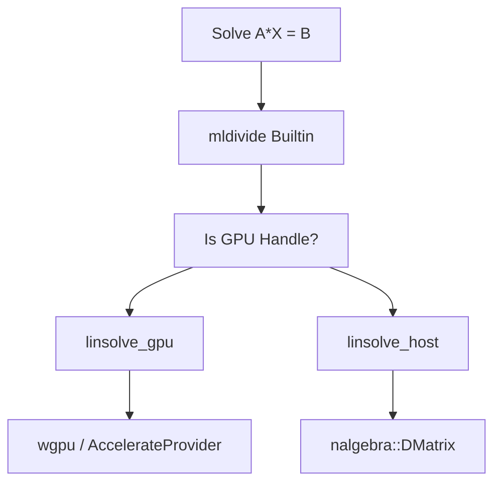
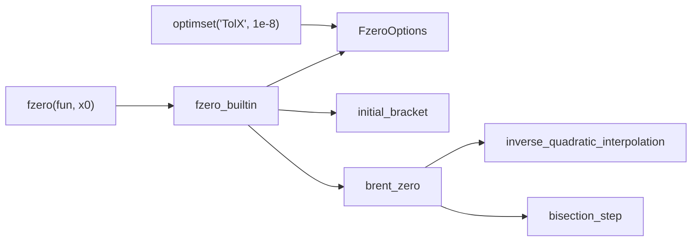

# Linear Algebra, FFT & Signal Processing Built-ins

<details>
<summary>Relevant source files</summary>

- [crates/runmat-accelerate/src/backend/wgpu/dispatch/fft.rs](https://github.com/runmat-org/runmat/blob/82685330/crates/runmat-accelerate/src/backend/wgpu/dispatch/fft.rs)
- [crates/runmat-accelerate/src/backend/wgpu/shaders/fft.rs](https://github.com/runmat-org/runmat/blob/82685330/crates/runmat-accelerate/src/backend/wgpu/shaders/fft.rs)
- [crates/runmat-accelerate/src/backend/wgpu/shaders/window.rs](https://github.com/runmat-org/runmat/blob/82685330/crates/runmat-accelerate/src/backend/wgpu/shaders/window.rs)
- [crates/runmat-accelerate/tests/fft_staged.rs](https://github.com/runmat-org/runmat/blob/82685330/crates/runmat-accelerate/tests/fft_staged.rs)
- [crates/runmat-accelerate/tests/native_auto.rs](https://github.com/runmat-org/runmat/blob/82685330/crates/runmat-accelerate/tests/native_auto.rs)
- [crates/runmat-runtime/src/builtins/array/type_resolvers.rs](https://github.com/runmat-org/runmat/blob/82685330/crates/runmat-runtime/src/builtins/array/type_resolvers.rs)
- [crates/runmat-runtime/src/builtins/builtins-json/cross.json](https://github.com/runmat-org/runmat/blob/82685330/crates/runmat-runtime/src/builtins/builtins-json/cross.json)
- [crates/runmat-runtime/src/builtins/builtins-json/cumtrapz.json](https://github.com/runmat-org/runmat/blob/82685330/crates/runmat-runtime/src/builtins/builtins-json/cumtrapz.json)
- [crates/runmat-runtime/src/builtins/builtins-json/interp1.json](https://github.com/runmat-org/runmat/blob/82685330/crates/runmat-runtime/src/builtins/builtins-json/interp1.json)
- [crates/runmat-runtime/src/builtins/builtins-json/interp2.json](https://github.com/runmat-org/runmat/blob/82685330/crates/runmat-runtime/src/builtins/builtins-json/interp2.json)
- [crates/runmat-runtime/src/builtins/builtins-json/pchip.json](https://github.com/runmat-org/runmat/blob/82685330/crates/runmat-runtime/src/builtins/builtins-json/pchip.json)
- [crates/runmat-runtime/src/builtins/builtins-json/ppval.json](https://github.com/runmat-org/runmat/blob/82685330/crates/runmat-runtime/src/builtins/builtins-json/ppval.json)
- [crates/runmat-runtime/src/builtins/builtins-json/spline.json](https://github.com/runmat-org/runmat/blob/82685330/crates/runmat-runtime/src/builtins/builtins-json/spline.json)
- [crates/runmat-runtime/src/builtins/builtins-json/trapz.json](https://github.com/runmat-org/runmat/blob/82685330/crates/runmat-runtime/src/builtins/builtins-json/trapz.json)
- [crates/runmat-runtime/src/builtins/logical/rel/eq.rs](https://github.com/runmat-org/runmat/blob/82685330/crates/runmat-runtime/src/builtins/logical/rel/eq.rs)
- [crates/runmat-runtime/src/builtins/logical/rel/ge.rs](https://github.com/runmat-org/runmat/blob/82685330/crates/runmat-runtime/src/builtins/logical/rel/ge.rs)
- [crates/runmat-runtime/src/builtins/logical/rel/gt.rs](https://github.com/runmat-org/runmat/blob/82685330/crates/runmat-runtime/src/builtins/logical/rel/gt.rs)
- [crates/runmat-runtime/src/builtins/logical/rel/isequal.rs](https://github.com/runmat-org/runmat/blob/82685330/crates/runmat-runtime/src/builtins/logical/rel/isequal.rs)
- [crates/runmat-runtime/src/builtins/logical/rel/le.rs](https://github.com/runmat-org/runmat/blob/82685330/crates/runmat-runtime/src/builtins/logical/rel/le.rs)
- [crates/runmat-runtime/src/builtins/logical/rel/lt.rs](https://github.com/runmat-org/runmat/blob/82685330/crates/runmat-runtime/src/builtins/logical/rel/lt.rs)
- [crates/runmat-runtime/src/builtins/logical/rel/ne.rs](https://github.com/runmat-org/runmat/blob/82685330/crates/runmat-runtime/src/builtins/logical/rel/ne.rs)
- [crates/runmat-runtime/src/builtins/math/fft/common.rs](https://github.com/runmat-org/runmat/blob/82685330/crates/runmat-runtime/src/builtins/math/fft/common.rs)
- [crates/runmat-runtime/src/builtins/math/fft/fft2.rs](https://github.com/runmat-org/runmat/blob/82685330/crates/runmat-runtime/src/builtins/math/fft/fft2.rs)
- [crates/runmat-runtime/src/builtins/math/fft/fftn.rs](https://github.com/runmat-org/runmat/blob/82685330/crates/runmat-runtime/src/builtins/math/fft/fftn.rs)
- [crates/runmat-runtime/src/builtins/math/fft/forward.rs](https://github.com/runmat-org/runmat/blob/82685330/crates/runmat-runtime/src/builtins/math/fft/forward.rs)
- [crates/runmat-runtime/src/builtins/math/fft/ifft.rs](https://github.com/runmat-org/runmat/blob/82685330/crates/runmat-runtime/src/builtins/math/fft/ifft.rs)
- [crates/runmat-runtime/src/builtins/math/fft/ifft2.rs](https://github.com/runmat-org/runmat/blob/82685330/crates/runmat-runtime/src/builtins/math/fft/ifft2.rs)
- [crates/runmat-runtime/src/builtins/math/fft/ifftn.rs](https://github.com/runmat-org/runmat/blob/82685330/crates/runmat-runtime/src/builtins/math/fft/ifftn.rs)
- [crates/runmat-runtime/src/builtins/math/interpolation/interp1.rs](https://github.com/runmat-org/runmat/blob/82685330/crates/runmat-runtime/src/builtins/math/interpolation/interp1.rs)
- [crates/runmat-runtime/src/builtins/math/interpolation/interp2.rs](https://github.com/runmat-org/runmat/blob/82685330/crates/runmat-runtime/src/builtins/math/interpolation/interp2.rs)
- [crates/runmat-runtime/src/builtins/math/interpolation/mod.rs](https://github.com/runmat-org/runmat/blob/82685330/crates/runmat-runtime/src/builtins/math/interpolation/mod.rs)
- [crates/runmat-runtime/src/builtins/math/interpolation/pchip.rs](https://github.com/runmat-org/runmat/blob/82685330/crates/runmat-runtime/src/builtins/math/interpolation/pchip.rs)
- [crates/runmat-runtime/src/builtins/math/interpolation/pp.rs](https://github.com/runmat-org/runmat/blob/82685330/crates/runmat-runtime/src/builtins/math/interpolation/pp.rs)
- [crates/runmat-runtime/src/builtins/math/interpolation/ppval.rs](https://github.com/runmat-org/runmat/blob/82685330/crates/runmat-runtime/src/builtins/math/interpolation/ppval.rs)
- [crates/runmat-runtime/src/builtins/math/interpolation/spline.rs](https://github.com/runmat-org/runmat/blob/82685330/crates/runmat-runtime/src/builtins/math/interpolation/spline.rs)
- [crates/runmat-runtime/src/builtins/math/linalg/factor/lu.rs](https://github.com/runmat-org/runmat/blob/82685330/crates/runmat-runtime/src/builtins/math/linalg/factor/lu.rs)
- [crates/runmat-runtime/src/builtins/math/linalg/factor/qr.rs](https://github.com/runmat-org/runmat/blob/82685330/crates/runmat-runtime/src/builtins/math/linalg/factor/qr.rs)
- [crates/runmat-runtime/src/builtins/math/linalg/ops/cross.rs](https://github.com/runmat-org/runmat/blob/82685330/crates/runmat-runtime/src/builtins/math/linalg/ops/cross.rs)
- [crates/runmat-runtime/src/builtins/math/linalg/ops/ctranspose.rs](https://github.com/runmat-org/runmat/blob/82685330/crates/runmat-runtime/src/builtins/math/linalg/ops/ctranspose.rs)
- [crates/runmat-runtime/src/builtins/math/linalg/ops/dot.rs](https://github.com/runmat-org/runmat/blob/82685330/crates/runmat-runtime/src/builtins/math/linalg/ops/dot.rs)
- [crates/runmat-runtime/src/builtins/math/linalg/ops/mldivide.rs](https://github.com/runmat-org/runmat/blob/82685330/crates/runmat-runtime/src/builtins/math/linalg/ops/mldivide.rs)
- [crates/runmat-runtime/src/builtins/math/linalg/ops/mod.rs](https://github.com/runmat-org/runmat/blob/82685330/crates/runmat-runtime/src/builtins/math/linalg/ops/mod.rs)
- [crates/runmat-runtime/src/builtins/math/linalg/ops/mpower.rs](https://github.com/runmat-org/runmat/blob/82685330/crates/runmat-runtime/src/builtins/math/linalg/ops/mpower.rs)
- [crates/runmat-runtime/src/builtins/math/linalg/ops/mrdivide.rs](https://github.com/runmat-org/runmat/blob/82685330/crates/runmat-runtime/src/builtins/math/linalg/ops/mrdivide.rs)
- [crates/runmat-runtime/src/builtins/math/linalg/ops/mtimes.rs](https://github.com/runmat-org/runmat/blob/82685330/crates/runmat-runtime/src/builtins/math/linalg/ops/mtimes.rs)
- [crates/runmat-runtime/src/builtins/math/linalg/ops/trace.rs](https://github.com/runmat-org/runmat/blob/82685330/crates/runmat-runtime/src/builtins/math/linalg/ops/trace.rs)
- [crates/runmat-runtime/src/builtins/math/linalg/ops/transpose.rs](https://github.com/runmat-org/runmat/blob/82685330/crates/runmat-runtime/src/builtins/math/linalg/ops/transpose.rs)
- [crates/runmat-runtime/src/builtins/math/linalg/solve/cond.rs](https://github.com/runmat-org/runmat/blob/82685330/crates/runmat-runtime/src/builtins/math/linalg/solve/cond.rs)
- [crates/runmat-runtime/src/builtins/math/linalg/solve/linsolve.rs](https://github.com/runmat-org/runmat/blob/82685330/crates/runmat-runtime/src/builtins/math/linalg/solve/linsolve.rs)
- [crates/runmat-runtime/src/builtins/math/linalg/solve/norm.rs](https://github.com/runmat-org/runmat/blob/82685330/crates/runmat-runtime/src/builtins/math/linalg/solve/norm.rs)
- [crates/runmat-runtime/src/builtins/math/linalg/type_resolvers.rs](https://github.com/runmat-org/runmat/blob/82685330/crates/runmat-runtime/src/builtins/math/linalg/type_resolvers.rs)
- [crates/runmat-runtime/src/builtins/math/ode/common.rs](https://github.com/runmat-org/runmat/blob/82685330/crates/runmat-runtime/src/builtins/math/ode/common.rs)
- [crates/runmat-runtime/src/builtins/math/ode/ode15s.rs](https://github.com/runmat-org/runmat/blob/82685330/crates/runmat-runtime/src/builtins/math/ode/ode15s.rs)
- [crates/runmat-runtime/src/builtins/math/ode/ode23.rs](https://github.com/runmat-org/runmat/blob/82685330/crates/runmat-runtime/src/builtins/math/ode/ode23.rs)
- [crates/runmat-runtime/src/builtins/math/ode/ode45.rs](https://github.com/runmat-org/runmat/blob/82685330/crates/runmat-runtime/src/builtins/math/ode/ode45.rs)
- [crates/runmat-runtime/src/builtins/math/optim/fsolve.rs](https://github.com/runmat-org/runmat/blob/82685330/crates/runmat-runtime/src/builtins/math/optim/fsolve.rs)
- [crates/runmat-runtime/src/builtins/math/optim/fzero.rs](https://github.com/runmat-org/runmat/blob/82685330/crates/runmat-runtime/src/builtins/math/optim/fzero.rs)
- [crates/runmat-runtime/src/builtins/math/optim/optimset.rs](https://github.com/runmat-org/runmat/blob/82685330/crates/runmat-runtime/src/builtins/math/optim/optimset.rs)
- [crates/runmat-runtime/src/builtins/math/reduction/diff.rs](https://github.com/runmat-org/runmat/blob/82685330/crates/runmat-runtime/src/builtins/math/reduction/diff.rs)
- [crates/runmat-runtime/src/builtins/math/reduction/gradient.rs](https://github.com/runmat-org/runmat/blob/82685330/crates/runmat-runtime/src/builtins/math/reduction/gradient.rs)
- [crates/runmat-runtime/src/builtins/math/reduction/integration_common.rs](https://github.com/runmat-org/runmat/blob/82685330/crates/runmat-runtime/src/builtins/math/reduction/integration_common.rs)
- [crates/runmat-runtime/src/builtins/math/reduction/mod.rs](https://github.com/runmat-org/runmat/blob/82685330/crates/runmat-runtime/src/builtins/math/reduction/mod.rs)
- [crates/runmat-runtime/src/builtins/math/signal/blackman.rs](https://github.com/runmat-org/runmat/blob/82685330/crates/runmat-runtime/src/builtins/math/signal/blackman.rs)
- [crates/runmat-runtime/src/builtins/math/signal/common.rs](https://github.com/runmat-org/runmat/blob/82685330/crates/runmat-runtime/src/builtins/math/signal/common.rs)
- [crates/runmat-runtime/src/builtins/math/signal/conv.rs](https://github.com/runmat-org/runmat/blob/82685330/crates/runmat-runtime/src/builtins/math/signal/conv.rs)
- [crates/runmat-runtime/src/builtins/math/signal/conv2.rs](https://github.com/runmat-org/runmat/blob/82685330/crates/runmat-runtime/src/builtins/math/signal/conv2.rs)
- [crates/runmat-runtime/src/builtins/math/signal/deconv.rs](https://github.com/runmat-org/runmat/blob/82685330/crates/runmat-runtime/src/builtins/math/signal/deconv.rs)
- [crates/runmat-runtime/src/builtins/math/signal/hamming.rs](https://github.com/runmat-org/runmat/blob/82685330/crates/runmat-runtime/src/builtins/math/signal/hamming.rs)
- [crates/runmat-runtime/src/builtins/math/signal/hann.rs](https://github.com/runmat-org/runmat/blob/82685330/crates/runmat-runtime/src/builtins/math/signal/hann.rs)
- [crates/runmat-runtime/src/builtins/math/signal/sawtooth.rs](https://github.com/runmat-org/runmat/blob/82685330/crates/runmat-runtime/src/builtins/math/signal/sawtooth.rs)
- [crates/runmat-runtime/src/builtins/math/signal/sinc.rs](https://github.com/runmat-org/runmat/blob/82685330/crates/runmat-runtime/src/builtins/math/signal/sinc.rs)
- [crates/runmat-runtime/src/builtins/math/signal/square.rs](https://github.com/runmat-org/runmat/blob/82685330/crates/runmat-runtime/src/builtins/math/signal/square.rs)

</details>

This page details the implementation of RunMat's high-performance mathematical built-ins, focusing on linear algebra, spectral analysis (FFT), signal processing, and numerical optimization. These functions utilize a tiered execution model that prioritizes GPU acceleration via `runmat-accelerate` while maintaining strict MATLAB-compatible host fallbacks.

## Linear Algebra Subsystem

RunMat implements linear algebra operations using a combination of `nalgebra` for host-side execution and specialized GPU kernels for accelerated paths.

### Matrix Solvers and Division

The `mldivide` (`\`) and `mrdivide` (`/`) operators are implemented as semantic wrappers around solver logic. For square systems, RunMat attempts LU or Cholesky decomposition; for rectangular systems, it utilizes QR or SVD-based least squares.

- `linsolve`: Supports structural hints such as `LT` (Lower Triangular), `UT` (Upper Triangular), `SYM` (Symmetric), and `POSDEF` (Positive Definite) [crates/runmat-runtime/src/builtins/math/linalg/solve/linsolve.rs #91-92](https://github.com/runmat-org/runmat/blob/82685330/crates/runmat-runtime/src/builtins/math/linalg/solve/linsolve.rs#L91-L92)
- GPU Acceleration: The `GPU_SPEC` for `linsolve` targets the `solve` `GpuOpKind`. It supports triangular solves and Cholesky paths on-device [crates/runmat-runtime/src/builtins/math/linalg/solve/linsolve.rs #153-166](https://github.com/runmat-org/runmat/blob/82685330/crates/runmat-runtime/src/builtins/math/linalg/solve/linsolve.rs#L153-L166)

### Factorizations

- QR Decomposition: Supports pivoted, non-pivoted, and economy forms (`qr(A, 0)`) [crates/runmat-runtime/src/builtins/math/linalg/factor/qr.rs #122-168](https://github.com/runmat-org/runmat/blob/82685330/crates/runmat-runtime/src/builtins/math/linalg/factor/qr.rs#L122-L168)
- LU Decomposition: Implemented with partial pivoting.
- SVD/Eig: Currently prioritized for host execution due to the iterative nature of the algorithms, though `GpuOpKind::Custom` hooks exist for provider-specific implementations.

### Implementation Flow: Matrix Solve

The following diagram illustrates the data flow from a MATLAB expression to the underlying solver implementation.

Data Flow: Matrix Solve (mldivide)



<details>
<summary>Rendered SVG</summary>

```svg
<svg id="mermaid-lxwu7sckulh" xmlns="http://www.w3.org/2000/svg" xmlns:xlink="http://www.w3.org/1999/xlink" class="flowchart" style="max-width: 100%; touch-action: none; user-select: none; cursor: grab; min-height: fit-content; max-height: 100%;" viewBox="0 0 574.890625 722.453125" role="graphics-document document" aria-roledescription="flowchart-v2" preserveAspectRatio="xMidYMid meet"><style>#mermaid-lxwu7sckulh{font-family:ui-sans-serif,-apple-system,system-ui,Segoe UI,Helvetica;font-size:16px;fill:#ccc;}@keyframes edge-animation-frame{from{stroke-dashoffset:0;}}@keyframes dash{to{stroke-dashoffset:0;}}#mermaid-lxwu7sckulh .edge-animation-slow{stroke-dasharray:9,5!important;stroke-dashoffset:900;animation:dash 50s linear infinite;stroke-linecap:round;}#mermaid-lxwu7sckulh .edge-animation-fast{stroke-dasharray:9,5!important;stroke-dashoffset:900;animation:dash 20s linear infinite;stroke-linecap:round;}#mermaid-lxwu7sckulh .error-icon{fill:#333;}#mermaid-lxwu7sckulh .error-text{fill:#cccccc;stroke:#cccccc;}#mermaid-lxwu7sckulh .edge-thickness-normal{stroke-width:1px;}#mermaid-lxwu7sckulh .edge-thickness-thick{stroke-width:3.5px;}#mermaid-lxwu7sckulh .edge-pattern-solid{stroke-dasharray:0;}#mermaid-lxwu7sckulh .edge-thickness-invisible{stroke-width:0;fill:none;}#mermaid-lxwu7sckulh .edge-pattern-dashed{stroke-dasharray:3;}#mermaid-lxwu7sckulh .edge-pattern-dotted{stroke-dasharray:2;}#mermaid-lxwu7sckulh .marker{fill:#666;stroke:#666;}#mermaid-lxwu7sckulh .marker.cross{stroke:#666;}#mermaid-lxwu7sckulh svg{font-family:ui-sans-serif,-apple-system,system-ui,Segoe UI,Helvetica;font-size:16px;}#mermaid-lxwu7sckulh p{margin:0;}#mermaid-lxwu7sckulh .label{font-family:ui-sans-serif,-apple-system,system-ui,Segoe UI,Helvetica;color:#fff;}#mermaid-lxwu7sckulh .cluster-label text{fill:#fff;}#mermaid-lxwu7sckulh .cluster-label span{color:#fff;}#mermaid-lxwu7sckulh .cluster-label span p{background-color:transparent;}#mermaid-lxwu7sckulh .label text,#mermaid-lxwu7sckulh span{fill:#fff;color:#fff;}#mermaid-lxwu7sckulh .node rect,#mermaid-lxwu7sckulh .node circle,#mermaid-lxwu7sckulh .node ellipse,#mermaid-lxwu7sckulh .node polygon,#mermaid-lxwu7sckulh .node path{fill:#111;stroke:#222;stroke-width:1px;}#mermaid-lxwu7sckulh .rough-node .label text,#mermaid-lxwu7sckulh .node .label text,#mermaid-lxwu7sckulh .image-shape .label,#mermaid-lxwu7sckulh .icon-shape .label{text-anchor:middle;}#mermaid-lxwu7sckulh .node .katex path{fill:#000;stroke:#000;stroke-width:1px;}#mermaid-lxwu7sckulh .rough-node .label,#mermaid-lxwu7sckulh .node .label,#mermaid-lxwu7sckulh .image-shape .label,#mermaid-lxwu7sckulh .icon-shape .label{text-align:center;}#mermaid-lxwu7sckulh .node.clickable{cursor:pointer;}#mermaid-lxwu7sckulh .root .anchor path{fill:#666!important;stroke-width:0;stroke:#666;}#mermaid-lxwu7sckulh .arrowheadPath{fill:#0b0b0b;}#mermaid-lxwu7sckulh .edgePath .path{stroke:#666;stroke-width:1px;}#mermaid-lxwu7sckulh .flowchart-link{stroke:#666;fill:none;}#mermaid-lxwu7sckulh .edgeLabel{background-color:#161616;text-align:center;}#mermaid-lxwu7sckulh .edgeLabel p{background-color:#161616;}#mermaid-lxwu7sckulh .edgeLabel rect{opacity:0.5;background-color:#161616;fill:#161616;}#mermaid-lxwu7sckulh .labelBkg{background-color:rgba(22, 22, 22, 0.5);}#mermaid-lxwu7sckulh .cluster rect{fill:#161616;stroke:#222;stroke-width:1px;}#mermaid-lxwu7sckulh .cluster text{fill:#fff;}#mermaid-lxwu7sckulh .cluster span{color:#fff;}#mermaid-lxwu7sckulh div.mermaidTooltip{position:absolute;text-align:center;max-width:200px;padding:2px;font-family:ui-sans-serif,-apple-system,system-ui,Segoe UI,Helvetica;font-size:12px;background:#333;border:1px solid hsl(0, 0%, 10%);border-radius:2px;pointer-events:none;z-index:100;}#mermaid-lxwu7sckulh .flowchartTitleText{text-anchor:middle;font-size:18px;fill:#ccc;}#mermaid-lxwu7sckulh rect.text{fill:none;stroke-width:0;}#mermaid-lxwu7sckulh .icon-shape,#mermaid-lxwu7sckulh .image-shape{background-color:#161616;text-align:center;}#mermaid-lxwu7sckulh .icon-shape p,#mermaid-lxwu7sckulh .image-shape p{background-color:#161616;padding:2px;}#mermaid-lxwu7sckulh .icon-shape .label rect,#mermaid-lxwu7sckulh .image-shape .label rect{opacity:0.5;background-color:#161616;fill:#161616;}#mermaid-lxwu7sckulh .label-icon{display:inline-block;height:1em;overflow:visible;vertical-align:-0.125em;}#mermaid-lxwu7sckulh .node .label-icon path{fill:currentColor;stroke:revert;stroke-width:revert;}#mermaid-lxwu7sckulh .node .neo-node{stroke:#222;}#mermaid-lxwu7sckulh [data-look="neo"].node rect,#mermaid-lxwu7sckulh [data-look="neo"].cluster rect,#mermaid-lxwu7sckulh [data-look="neo"].node polygon{stroke:url(#mermaid-lxwu7sckulh-gradient);filter:drop-shadow( 1px 2px 2px rgba(185,185,185,1));}#mermaid-lxwu7sckulh [data-look="neo"].node path{stroke:url(#mermaid-lxwu7sckulh-gradient);stroke-width:1px;}#mermaid-lxwu7sckulh [data-look="neo"].node .outer-path{filter:drop-shadow( 1px 2px 2px rgba(185,185,185,1));}#mermaid-lxwu7sckulh [data-look="neo"].node .neo-line path{stroke:#222;filter:none;}#mermaid-lxwu7sckulh [data-look="neo"].node circle{stroke:url(#mermaid-lxwu7sckulh-gradient);filter:drop-shadow( 1px 2px 2px rgba(185,185,185,1));}#mermaid-lxwu7sckulh [data-look="neo"].node circle .state-start{fill:#000000;}#mermaid-lxwu7sckulh [data-look="neo"].icon-shape .icon{fill:url(#mermaid-lxwu7sckulh-gradient);filter:drop-shadow( 1px 2px 2px rgba(185,185,185,1));}#mermaid-lxwu7sckulh [data-look="neo"].icon-shape .icon-neo path{stroke:url(#mermaid-lxwu7sckulh-gradient);filter:drop-shadow( 1px 2px 2px rgba(185,185,185,1));}#mermaid-lxwu7sckulh :root{--mermaid-font-family:"trebuchet ms",verdana,arial,sans-serif;}</style><g><marker id="mermaid-lxwu7sckulh_flowchart-v2-pointEnd" class="marker flowchart-v2" viewBox="0 0 10 10" refX="5" refY="5" markerUnits="userSpaceOnUse" markerWidth="8" markerHeight="8" orient="auto"><path d="M 0 0 L 10 5 L 0 10 z" class="arrowMarkerPath" style="stroke-width: 1; stroke-dasharray: 1, 0;"></path></marker><marker id="mermaid-lxwu7sckulh_flowchart-v2-pointStart" class="marker flowchart-v2" viewBox="0 0 10 10" refX="4.5" refY="5" markerUnits="userSpaceOnUse" markerWidth="8" markerHeight="8" orient="auto"><path d="M 0 5 L 10 10 L 10 0 z" class="arrowMarkerPath" style="stroke-width: 1; stroke-dasharray: 1, 0;"></path></marker><marker id="mermaid-lxwu7sckulh_flowchart-v2-pointEnd-margin" class="marker flowchart-v2" viewBox="0 0 11.5 14" refX="11.5" refY="7" markerUnits="userSpaceOnUse" markerWidth="10.5" markerHeight="14" orient="auto"><path d="M 0 0 L 11.5 7 L 0 14 z" class="arrowMarkerPath" style="stroke-width: 0; stroke-dasharray: 1, 0;"></path></marker><marker id="mermaid-lxwu7sckulh_flowchart-v2-pointStart-margin" class="marker flowchart-v2" viewBox="0 0 11.5 14" refX="1" refY="7" markerUnits="userSpaceOnUse" markerWidth="11.5" markerHeight="14" orient="auto"><polygon points="0,7 11.5,14 11.5,0" class="arrowMarkerPath" style="stroke-width: 0; stroke-dasharray: 1, 0;"></polygon></marker><marker id="mermaid-lxwu7sckulh_flowchart-v2-circleEnd" class="marker flowchart-v2" viewBox="0 0 10 10" refX="11" refY="5" markerUnits="userSpaceOnUse" markerWidth="11" markerHeight="11" orient="auto"><circle cx="5" cy="5" r="5" class="arrowMarkerPath" style="stroke-width: 1; stroke-dasharray: 1, 0;"></circle></marker><marker id="mermaid-lxwu7sckulh_flowchart-v2-circleStart" class="marker flowchart-v2" viewBox="0 0 10 10" refX="-1" refY="5" markerUnits="userSpaceOnUse" markerWidth="11" markerHeight="11" orient="auto"><circle cx="5" cy="5" r="5" class="arrowMarkerPath" style="stroke-width: 1; stroke-dasharray: 1, 0;"></circle></marker><marker id="mermaid-lxwu7sckulh_flowchart-v2-circleEnd-margin" class="marker flowchart-v2" viewBox="0 0 10 10" refY="5" refX="12.25" markerUnits="userSpaceOnUse" markerWidth="14" markerHeight="14" orient="auto"><circle cx="5" cy="5" r="5" class="arrowMarkerPath" style="stroke-width: 0; stroke-dasharray: 1, 0;"></circle></marker><marker id="mermaid-lxwu7sckulh_flowchart-v2-circleStart-margin" class="marker flowchart-v2" viewBox="0 0 10 10" refX="-2" refY="5" markerUnits="userSpaceOnUse" markerWidth="14" markerHeight="14" orient="auto"><circle cx="5" cy="5" r="5" class="arrowMarkerPath" style="stroke-width: 0; stroke-dasharray: 1, 0;"></circle></marker><marker id="mermaid-lxwu7sckulh_flowchart-v2-crossEnd" class="marker cross flowchart-v2" viewBox="0 0 11 11" refX="12" refY="5.2" markerUnits="userSpaceOnUse" markerWidth="11" markerHeight="11" orient="auto"><path d="M 1,1 l 9,9 M 10,1 l -9,9" class="arrowMarkerPath" style="stroke-width: 2; stroke-dasharray: 1, 0;"></path></marker><marker id="mermaid-lxwu7sckulh_flowchart-v2-crossStart" class="marker cross flowchart-v2" viewBox="0 0 11 11" refX="-1" refY="5.2" markerUnits="userSpaceOnUse" markerWidth="11" markerHeight="11" orient="auto"><path d="M 1,1 l 9,9 M 10,1 l -9,9" class="arrowMarkerPath" style="stroke-width: 2; stroke-dasharray: 1, 0;"></path></marker><marker id="mermaid-lxwu7sckulh_flowchart-v2-crossEnd-margin" class="marker cross flowchart-v2" viewBox="0 0 15 15" refX="17.7" refY="7.5" markerUnits="userSpaceOnUse" markerWidth="12" markerHeight="12" orient="auto"><path d="M 1,1 L 14,14 M 1,14 L 14,1" class="arrowMarkerPath" style="stroke-width: 2.5;"></path></marker><marker id="mermaid-lxwu7sckulh_flowchart-v2-crossStart-margin" class="marker cross flowchart-v2" viewBox="0 0 15 15" refX="-3.5" refY="7.5" markerUnits="userSpaceOnUse" markerWidth="12" markerHeight="12" orient="auto"><path d="M 1,1 L 14,14 M 1,14 L 14,1" class="arrowMarkerPath" style="stroke-width: 2.5; stroke-dasharray: 1, 0;"></path></marker><g class="root"><g class="clusters"><g class="cluster" id="mermaid-lxwu7sckulh-subGraph1" data-look="classic"><rect style="" x="8" y="162" width="558.890625" height="552.453125"></rect><g class="cluster-label" transform="translate(220.65625, 162)"><foreignObject width="133.578125" height="24"><div style="display: table-cell; white-space: nowrap; line-height: 1.5;" xmlns="http://www.w3.org/1999/xhtml"><span class="nodeLabel"><p>Code Entity Space</p></span></div></foreignObject></g></g><g class="cluster" id="mermaid-lxwu7sckulh-subGraph0" data-look="classic"><rect style="" x="157.62109375" y="8" width="228.9375" height="104"></rect><g class="cluster-label" transform="translate(183.14453125, 8)"><foreignObject width="177.890625" height="24"><div style="display: table-cell; white-space: nowrap; line-height: 1.5;" xmlns="http://www.w3.org/1999/xhtml"><span class="nodeLabel"><p>Natural Language Space</p></span></div></foreignObject></g></g></g><g class="edgePaths"><path d="M272.09,87L272.09,91.167C272.09,95.333,272.09,103.667,272.09,112C272.09,120.333,272.09,128.667,272.09,137C272.09,145.333,272.09,153.667,272.09,161.333C272.09,169,272.09,176,272.09,179.5L272.09,183" id="mermaid-lxwu7sckulh-L_A_B_0" class="edge-thickness-normal edge-pattern-solid edge-thickness-normal edge-pattern-solid flowchart-link" style=";" data-edge="true" data-et="edge" data-id="L_A_B_0" data-points="W3sieCI6MjcyLjA4OTg0Mzc1LCJ5Ijo4N30seyJ4IjoyNzIuMDg5ODQzNzUsInkiOjExMn0seyJ4IjoyNzIuMDg5ODQzNzUsInkiOjEzN30seyJ4IjoyNzIuMDg5ODQzNzUsInkiOjE2Mn0seyJ4IjoyNzIuMDg5ODQzNzUsInkiOjE4N31d" data-look="classic" marker-end="url(#mermaid-lxwu7sckulh_flowchart-v2-pointEnd)"></path><path d="M272.09,241L272.09,245.167C272.09,249.333,272.09,257.667,272.09,265.333C272.09,273,272.09,280,272.09,283.5L272.09,287" id="mermaid-lxwu7sckulh-L_B_C_0" class="edge-thickness-normal edge-pattern-solid edge-thickness-normal edge-pattern-solid flowchart-link" style=";" data-edge="true" data-et="edge" data-id="L_B_C_0" data-points="W3sieCI6MjcyLjA4OTg0Mzc1LCJ5IjoyNDF9LHsieCI6MjcyLjA4OTg0Mzc1LCJ5IjoyNjZ9LHsieCI6MjcyLjA4OTg0Mzc1LCJ5IjoyOTF9XQ==" data-look="classic" marker-end="url(#mermaid-lxwu7sckulh_flowchart-v2-pointEnd)"></path><path d="M316.069,413.474L331.193,426.97C346.317,440.467,376.565,467.46,391.689,486.457C406.813,505.453,406.813,516.453,406.813,521.953L406.813,527.453" id="mermaid-lxwu7sckulh-L_C_D_0" class="edge-thickness-normal edge-pattern-solid edge-thickness-normal edge-pattern-solid flowchart-link" style=";" data-edge="true" data-et="edge" data-id="L_C_D_0" data-points="W3sieCI6MzE2LjA2OTIwNDEzMjE2MDk2LCJ5Ijo0MTMuNDczNzY0NjE3ODM5MDR9LHsieCI6NDA2LjgxMjUsInkiOjQ5NC40NTMxMjV9LHsieCI6NDA2LjgxMjUsInkiOjUzMS40NTMxMjV9XQ==" data-look="classic" marker-end="url(#mermaid-lxwu7sckulh_flowchart-v2-pointEnd)"></path><path d="M228.11,413.474L212.987,426.97C197.863,440.467,167.615,467.46,152.491,486.457C137.367,505.453,137.367,516.453,137.367,521.953L137.367,527.453" id="mermaid-lxwu7sckulh-L_C_E_0" class="edge-thickness-normal edge-pattern-solid edge-thickness-normal edge-pattern-solid flowchart-link" style=";" data-edge="true" data-et="edge" data-id="L_C_E_0" data-points="W3sieCI6MjI4LjExMDQ4MzM2NzgzOTA0LCJ5Ijo0MTMuNDczNzY0NjE3ODM5MDR9LHsieCI6MTM3LjM2NzE4NzUsInkiOjQ5NC40NTMxMjV9LHsieCI6MTM3LjM2NzE4NzUsInkiOjUzMS40NTMxMjV9XQ==" data-look="classic" marker-end="url(#mermaid-lxwu7sckulh_flowchart-v2-pointEnd)"></path><path d="M406.813,585.453L406.813,589.62C406.813,593.786,406.813,602.12,406.813,609.786C406.813,617.453,406.813,624.453,406.813,627.953L406.813,631.453" id="mermaid-lxwu7sckulh-L_D_G_0" class="edge-thickness-normal edge-pattern-solid edge-thickness-normal edge-pattern-solid flowchart-link" style=";" data-edge="true" data-et="edge" data-id="L_D_G_0" data-points="W3sieCI6NDA2LjgxMjUsInkiOjU4NS40NTMxMjV9LHsieCI6NDA2LjgxMjUsInkiOjYxMC40NTMxMjV9LHsieCI6NDA2LjgxMjUsInkiOjYzNS40NTMxMjV9XQ==" data-look="classic" marker-end="url(#mermaid-lxwu7sckulh_flowchart-v2-pointEnd)"></path><path d="M137.367,585.453L137.367,589.62C137.367,593.786,137.367,602.12,137.367,609.786C137.367,617.453,137.367,624.453,137.367,627.953L137.367,631.453" id="mermaid-lxwu7sckulh-L_E_F_0" class="edge-thickness-normal edge-pattern-solid edge-thickness-normal edge-pattern-solid flowchart-link" style=";" data-edge="true" data-et="edge" data-id="L_E_F_0" data-points="W3sieCI6MTM3LjM2NzE4NzUsInkiOjU4NS40NTMxMjV9LHsieCI6MTM3LjM2NzE4NzUsInkiOjYxMC40NTMxMjV9LHsieCI6MTM3LjM2NzE4NzUsInkiOjYzNS40NTMxMjV9XQ==" data-look="classic" marker-end="url(#mermaid-lxwu7sckulh_flowchart-v2-pointEnd)"></path></g><g class="edgeLabels"><g class="edgeLabel"><g class="label" data-id="L_A_B_0" transform="translate(0, 0)"><foreignObject width="0" height="0"><div style="display: table-cell; white-space: nowrap; line-height: 1.5; max-width: 200px; text-align: center;" xmlns="http://www.w3.org/1999/xhtml" class="labelBkg"><span class="edgeLabel"></span></div></foreignObject></g></g><g class="edgeLabel"><g class="label" data-id="L_B_C_0" transform="translate(0, 0)"><foreignObject width="0" height="0"><div style="display: table-cell; white-space: nowrap; line-height: 1.5; max-width: 200px; text-align: center;" xmlns="http://www.w3.org/1999/xhtml" class="labelBkg"><span class="edgeLabel"></span></div></foreignObject></g></g><g class="edgeLabel" transform="translate(406.8125, 494.453125)"><g class="label" data-id="L_C_D_0" transform="translate(-12.8671875, -12)"><foreignObject width="25.734375" height="24"><div style="display: table-cell; white-space: nowrap; line-height: 1.5; max-width: 200px; text-align: center;" xmlns="http://www.w3.org/1999/xhtml" class="labelBkg"><span class="edgeLabel"><p>Yes</p></span></div></foreignObject></g></g><g class="edgeLabel" transform="translate(137.3671875, 494.453125)"><g class="label" data-id="L_C_E_0" transform="translate(-10.3515625, -12)"><foreignObject width="20.703125" height="24"><div style="display: table-cell; white-space: nowrap; line-height: 1.5; max-width: 200px; text-align: center;" xmlns="http://www.w3.org/1999/xhtml" class="labelBkg"><span class="edgeLabel"><p>No</p></span></div></foreignObject></g></g><g class="edgeLabel"><g class="label" data-id="L_D_G_0" transform="translate(0, 0)"><foreignObject width="0" height="0"><div style="display: table-cell; white-space: nowrap; line-height: 1.5; max-width: 200px; text-align: center;" xmlns="http://www.w3.org/1999/xhtml" class="labelBkg"><span class="edgeLabel"></span></div></foreignObject></g></g><g class="edgeLabel"><g class="label" data-id="L_E_F_0" transform="translate(0, 0)"><foreignObject width="0" height="0"><div style="display: table-cell; white-space: nowrap; line-height: 1.5; max-width: 200px; text-align: center;" xmlns="http://www.w3.org/1999/xhtml" class="labelBkg"><span class="edgeLabel"></span></div></foreignObject></g></g></g><g class="nodes"><g class="node default" id="mermaid-lxwu7sckulh-flowchart-A-0" data-look="classic" transform="translate(272.08984375, 60)"><rect class="basic label-container" style="" x="-79.46875" y="-27" width="158.9375" height="54"></rect><g class="label" style="" transform="translate(-49.46875, -12)"><rect></rect><foreignObject width="98.9375" height="24"><div style="display: table-cell; white-space: nowrap; line-height: 1.5; max-width: 200px; text-align: center;" xmlns="http://www.w3.org/1999/xhtml"><span class="nodeLabel"><p>Solve A*X = B</p></span></div></foreignObject></g></g><g class="node default" id="mermaid-lxwu7sckulh-flowchart-B-1" data-look="classic" transform="translate(272.08984375, 214)"><rect class="basic label-container" style="" x="-84.8984375" y="-27" width="169.796875" height="54"></rect><g class="label" style="" transform="translate(-54.8984375, -12)"><rect></rect><foreignObject width="109.796875" height="24"><div style="display: table-cell; white-space: nowrap; line-height: 1.5; max-width: 200px; text-align: center;" xmlns="http://www.w3.org/1999/xhtml"><span class="nodeLabel"><p>mldivide Builtin</p></span></div></foreignObject></g></g><g class="node default" id="mermaid-lxwu7sckulh-flowchart-C-2" data-look="classic" transform="translate(272.08984375, 374.2265625)"><polygon points="83.2265625,0 166.453125,-83.2265625 83.2265625,-166.453125 0,-83.2265625" class="label-container" transform="translate(-82.7265625, 83.2265625)"></polygon><g class="label" style="" transform="translate(-56.2265625, -12)"><rect></rect><foreignObject width="112.453125" height="24"><div style="display: table-cell; white-space: nowrap; line-height: 1.5; max-width: 200px; text-align: center;" xmlns="http://www.w3.org/1999/xhtml"><span class="nodeLabel"><p>Is GPU Handle?</p></span></div></foreignObject></g></g><g class="node default" id="mermaid-lxwu7sckulh-flowchart-D-3" data-look="classic" transform="translate(406.8125, 558.453125)"><rect class="basic label-container" style="" x="-75.1875" y="-27" width="150.375" height="54"></rect><g class="label" style="" transform="translate(-45.1875, -12)"><rect></rect><foreignObject width="90.375" height="24"><div style="display: table-cell; white-space: nowrap; line-height: 1.5; max-width: 200px; text-align: center;" xmlns="http://www.w3.org/1999/xhtml"><span class="nodeLabel"><p>linsolve_gpu</p></span></div></foreignObject></g></g><g class="node default" id="mermaid-lxwu7sckulh-flowchart-E-4" data-look="classic" transform="translate(137.3671875, 558.453125)"><rect class="basic label-container" style="" x="-77.328125" y="-27" width="154.65625" height="54"></rect><g class="label" style="" transform="translate(-47.328125, -12)"><rect></rect><foreignObject width="94.65625" height="24"><div style="display: table-cell; white-space: nowrap; line-height: 1.5; max-width: 200px; text-align: center;" xmlns="http://www.w3.org/1999/xhtml"><span class="nodeLabel"><p>linsolve_host</p></span></div></foreignObject></g></g><g class="node default" id="mermaid-lxwu7sckulh-flowchart-F-5" data-look="classic" transform="translate(137.3671875, 662.453125)"><rect class="basic label-container" style="" x="-94.3671875" y="-27" width="188.734375" height="54"></rect><g class="label" style="" transform="translate(-64.3671875, -12)"><rect></rect><foreignObject width="128.734375" height="24"><div style="display: table-cell; white-space: nowrap; line-height: 1.5; max-width: 200px; text-align: center;" xmlns="http://www.w3.org/1999/xhtml"><span class="nodeLabel"><p>nalgebra::DMatrix</p></span></div></foreignObject></g></g><g class="node default" id="mermaid-lxwu7sckulh-flowchart-G-6" data-look="classic" transform="translate(406.8125, 662.453125)"><rect class="basic label-container" style="" x="-125.078125" y="-27" width="250.15625" height="54"></rect><g class="label" style="" transform="translate(-95.078125, -12)"><rect></rect><foreignObject width="190.15625" height="24"><div style="display: table-cell; white-space: nowrap; line-height: 1.5; max-width: 200px; text-align: center;" xmlns="http://www.w3.org/1999/xhtml"><span class="nodeLabel"><p>wgpu / AccelerateProvider</p></span></div></foreignObject></g></g></g></g></g><defs><filter id="mermaid-lxwu7sckulh-drop-shadow" height="130%" width="130%"><feDropShadow dx="4" dy="4" stdDeviation="0" flood-opacity="0.06" flood-color="#000000"></feDropShadow></filter></defs><defs><filter id="mermaid-lxwu7sckulh-drop-shadow-small" height="150%" width="150%"><feDropShadow dx="2" dy="2" stdDeviation="0" flood-opacity="0.06" flood-color="#000000"></feDropShadow></filter></defs><linearGradient id="mermaid-lxwu7sckulh-gradient" gradientUnits="objectBoundingBox" x1="0%" y1="0%" x2="100%" y2="0%"><stop offset="0%" stop-color="#333" stop-opacity="1"></stop><stop offset="100%" stop-color="hsl(-120, 0%, 3.3333333333%)" stop-opacity="1"></stop></linearGradient></svg>
```

</details>

Sources: [crates/runmat-runtime/src/builtins/math/linalg/solve/linsolve.rs #187-210](https://github.com/runmat-org/runmat/blob/82685330/crates/runmat-runtime/src/builtins/math/linalg/solve/linsolve.rs#L187-L210) [crates/runmat-runtime/src/builtins/math/linalg/solve/linsolve.rs #153-166](https://github.com/runmat-org/runmat/blob/82685330/crates/runmat-runtime/src/builtins/math/linalg/solve/linsolve.rs#L153-L166)

## FFT Family (Spectral Analysis)

The FFT family (`fft`, `ifft`, `fft2`, `ifft2`, `fftn`, `ifftn`) is designed with "Boundary Fusion" semantics. While FFTs do not fuse with elementwise operations into a single kernel, they act as termination points for fusion plans to minimize host-device transfers [crates/runmat-runtime/src/builtins/math/fft/forward.rs #40-50](https://github.com/runmat-org/runmat/blob/82685330/crates/runmat-runtime/src/builtins/math/fft/forward.rs#L40-L50)

### Transform Dimensions

- 1-D FFT: Operates along the first non-singleton dimension by default [crates/runmat-runtime/src/builtins/math/fft/forward.rs #102-109](https://github.com/runmat-org/runmat/blob/82685330/crates/runmat-runtime/src/builtins/math/fft/forward.rs#L102-L109)
- N-D FFT: Implemented as sequential 1-D passes along each transformed axis [crates/runmat-runtime/src/builtins/math/fft/fftn.rs #25-39](https://github.com/runmat-org/runmat/blob/82685330/crates/runmat-runtime/src/builtins/math/fft/fftn.rs#L25-L39)

### GPU Residency Policy

FFT built-ins use `ResidencyPolicy::NewHandle`, meaning they produce a new GPU buffer for the complex spectrum output rather than modifying inputs in-place [crates/runmat-runtime/src/builtins/math/fft/forward.rs #32](https://github.com/runmat-org/runmat/blob/82685330/crates/runmat-runtime/src/builtins/math/fft/forward.rs#L32-L32) If a provider lacks `fft_dim` support, the runtime automatically gathers data to the host, performs the transform, and re-uploads the result [crates/runmat-runtime/src/builtins/math/fft/forward.rs #37-38](https://github.com/runmat-org/runmat/blob/82685330/crates/runmat-runtime/src/builtins/math/fft/forward.rs#L37-L38)

| Function | GPU Op Kind | Notes |
| --- | --- | --- |
| fft | Custom("fft") | 1-D Forward Transform crates/runmat-runtime/src/builtins/math/fft/forward.rs#27 |
| ifft | Custom("ifft") | 1-D Inverse with scaling crates/runmat-runtime/src/builtins/math/fft/ifft.rs#28 |
| fft2 | Custom("fft2") | Sequential passes on dim 0 and 1 crates/runmat-runtime/src/builtins/math/fft/fft2.rs#27 |
| fftn | Custom("fftn") | Sequential passes on all N dims crates/runmat-runtime/src/builtins/math/fft/fftn.rs#28 |

Sources: [crates/runmat-runtime/src/builtins/math/fft/forward.rs #1-50](https://github.com/runmat-org/runmat/blob/82685330/crates/runmat-runtime/src/builtins/math/fft/forward.rs#L1-L50) [crates/runmat-runtime/src/builtins/math/fft/ifft.rs #1-50](https://github.com/runmat-org/runmat/blob/82685330/crates/runmat-runtime/src/builtins/math/fft/ifft.rs#L1-L50) [crates/runmat-runtime/src/builtins/math/fft/fftn.rs #25-50](https://github.com/runmat-org/runmat/blob/82685330/crates/runmat-runtime/src/builtins/math/fft/fftn.rs#L25-L50)

## Signal Processing

### Convolution and Filtering

- `conv2`: Supports `full`, `same`, and `valid` shapes [crates/runmat-runtime/src/builtins/math/signal/conv2.rs #185-190](https://github.com/runmat-org/runmat/blob/82685330/crates/runmat-runtime/src/builtins/math/signal/conv2.rs#L185-L190) It also supports separable kernels via `conv2(hcol, hrow, A)` [crates/runmat-runtime/src/builtins/math/signal/conv2.rs #100-122](https://github.com/runmat-org/runmat/blob/82685330/crates/runmat-runtime/src/builtins/math/signal/conv2.rs#L100-L122)
- `sinc`: Implemented as a fused elementwise operation. The `FUSION_SPEC` generates a WGSL expression that handles the $x=0$ case and integer boundaries to prevent division by zero [crates/runmat-runtime/src/builtins/math/signal/sinc.rs #125-143](https://github.com/runmat-org/runmat/blob/82685330/crates/runmat-runtime/src/builtins/math/signal/sinc.rs#L125-L143)

### Window Functions

RunMat provides standard windowing functions including `hann`, `hamming`, and `blackman`. These are implemented as elementwise GPU-accelerated operations.

### Numerical Gradient

The `gradient` builtin calculates central differences for internal points and single-sided differences for boundaries [crates/runmat-runtime/src/builtins/math/reduction/gradient.rs #1-10](https://github.com/runmat-org/runmat/blob/82685330/crates/runmat-runtime/src/builtins/math/reduction/gradient.rs#L1-L10)

- GPU Optimization: Supports scalar spacing (`h`) on-device via `gradient_dim`. Coordinate-vector spacing currently triggers a host fallback [crates/runmat-runtime/src/builtins/math/reduction/gradient.rs #173-187](https://github.com/runmat-org/runmat/blob/82685330/crates/runmat-runtime/src/builtins/math/reduction/gradient.rs#L173-L187)

Sources: [crates/runmat-runtime/src/builtins/math/signal/conv2.rs #1-47](https://github.com/runmat-org/runmat/blob/82685330/crates/runmat-runtime/src/builtins/math/signal/conv2.rs#L1-L47) [crates/runmat-runtime/src/builtins/math/signal/sinc.rs #108-143](https://github.com/runmat-org/runmat/blob/82685330/crates/runmat-runtime/src/builtins/math/signal/sinc.rs#L108-L143) [crates/runmat-runtime/src/builtins/math/reduction/gradient.rs #172-187](https://github.com/runmat-org/runmat/blob/82685330/crates/runmat-runtime/src/builtins/math/reduction/gradient.rs#L172-L187)

## Optimization and ODE Solvers

### Nonlinear Root Finding (`fzero`)

`fzero` implements Brent's method for scalar nonlinear root finding [crates/runmat-runtime/src/builtins/math/optim/fzero.rs #14-24](https://github.com/runmat-org/runmat/blob/82685330/crates/runmat-runtime/src/builtins/math/optim/fzero.rs#L14-L24)

1. Bracket Expansion: If provided a single point `x0`, the algorithm expands to find a sign change [crates/runmat-runtime/src/builtins/math/optim/fzero.rs #185-187](https://github.com/runmat-org/runmat/blob/82685330/crates/runmat-runtime/src/builtins/math/optim/fzero.rs#L185-L187)
2. Brent's Method: Iteratively uses inverse quadratic interpolation, falling back to bisection [crates/runmat-runtime/src/builtins/math/optim/fzero.rs #188-203](https://github.com/runmat-org/runmat/blob/82685330/crates/runmat-runtime/src/builtins/math/optim/fzero.rs#L188-L203)
3. GPU Notes: The iterative loop runs on the host (`ResidencyPolicy::GatherImmediately`), but the user-provided callback `fun` can execute GPU-accelerated code [crates/runmat-runtime/src/builtins/math/optim/fzero.rs #138-151](https://github.com/runmat-org/runmat/blob/82685330/crates/runmat-runtime/src/builtins/math/optim/fzero.rs#L138-L151)

### Ordinary Differential Equations (ODE)

RunMat supports standard solvers including `ode45` (Dormand-Prince), `ode23` (Bogacki-Shampine), and `ode15s` (stiff solver). These solvers utilize the `runmat-runtime` async execution model to handle user callbacks during integration steps.

Code Mapping: Numerical Optimization



<details>
<summary>Rendered SVG</summary>

```svg
<svg id="mermaid-krljl0bdtp" xmlns="http://www.w3.org/2000/svg" xmlns:xlink="http://www.w3.org/1999/xlink" class="flowchart" style="max-width: 100%; touch-action: none; user-select: none; cursor: grab; min-height: fit-content; max-height: 100%;" viewBox="-0.01741492587598259 0 1131.644204851752 410" role="graphics-document document" aria-roledescription="flowchart-v2" preserveAspectRatio="xMidYMid meet"><style>#mermaid-krljl0bdtp{font-family:ui-sans-serif,-apple-system,system-ui,Segoe UI,Helvetica;font-size:16px;fill:#ccc;}@keyframes edge-animation-frame{from{stroke-dashoffset:0;}}@keyframes dash{to{stroke-dashoffset:0;}}#mermaid-krljl0bdtp .edge-animation-slow{stroke-dasharray:9,5!important;stroke-dashoffset:900;animation:dash 50s linear infinite;stroke-linecap:round;}#mermaid-krljl0bdtp .edge-animation-fast{stroke-dasharray:9,5!important;stroke-dashoffset:900;animation:dash 20s linear infinite;stroke-linecap:round;}#mermaid-krljl0bdtp .error-icon{fill:#333;}#mermaid-krljl0bdtp .error-text{fill:#cccccc;stroke:#cccccc;}#mermaid-krljl0bdtp .edge-thickness-normal{stroke-width:1px;}#mermaid-krljl0bdtp .edge-thickness-thick{stroke-width:3.5px;}#mermaid-krljl0bdtp .edge-pattern-solid{stroke-dasharray:0;}#mermaid-krljl0bdtp .edge-thickness-invisible{stroke-width:0;fill:none;}#mermaid-krljl0bdtp .edge-pattern-dashed{stroke-dasharray:3;}#mermaid-krljl0bdtp .edge-pattern-dotted{stroke-dasharray:2;}#mermaid-krljl0bdtp .marker{fill:#666;stroke:#666;}#mermaid-krljl0bdtp .marker.cross{stroke:#666;}#mermaid-krljl0bdtp svg{font-family:ui-sans-serif,-apple-system,system-ui,Segoe UI,Helvetica;font-size:16px;}#mermaid-krljl0bdtp p{margin:0;}#mermaid-krljl0bdtp .label{font-family:ui-sans-serif,-apple-system,system-ui,Segoe UI,Helvetica;color:#fff;}#mermaid-krljl0bdtp .cluster-label text{fill:#fff;}#mermaid-krljl0bdtp .cluster-label span{color:#fff;}#mermaid-krljl0bdtp .cluster-label span p{background-color:transparent;}#mermaid-krljl0bdtp .label text,#mermaid-krljl0bdtp span{fill:#fff;color:#fff;}#mermaid-krljl0bdtp .node rect,#mermaid-krljl0bdtp .node circle,#mermaid-krljl0bdtp .node ellipse,#mermaid-krljl0bdtp .node polygon,#mermaid-krljl0bdtp .node path{fill:#111;stroke:#222;stroke-width:1px;}#mermaid-krljl0bdtp .rough-node .label text,#mermaid-krljl0bdtp .node .label text,#mermaid-krljl0bdtp .image-shape .label,#mermaid-krljl0bdtp .icon-shape .label{text-anchor:middle;}#mermaid-krljl0bdtp .node .katex path{fill:#000;stroke:#000;stroke-width:1px;}#mermaid-krljl0bdtp .rough-node .label,#mermaid-krljl0bdtp .node .label,#mermaid-krljl0bdtp .image-shape .label,#mermaid-krljl0bdtp .icon-shape .label{text-align:center;}#mermaid-krljl0bdtp .node.clickable{cursor:pointer;}#mermaid-krljl0bdtp .root .anchor path{fill:#666!important;stroke-width:0;stroke:#666;}#mermaid-krljl0bdtp .arrowheadPath{fill:#0b0b0b;}#mermaid-krljl0bdtp .edgePath .path{stroke:#666;stroke-width:1px;}#mermaid-krljl0bdtp .flowchart-link{stroke:#666;fill:none;}#mermaid-krljl0bdtp .edgeLabel{background-color:#161616;text-align:center;}#mermaid-krljl0bdtp .edgeLabel p{background-color:#161616;}#mermaid-krljl0bdtp .edgeLabel rect{opacity:0.5;background-color:#161616;fill:#161616;}#mermaid-krljl0bdtp .labelBkg{background-color:rgba(22, 22, 22, 0.5);}#mermaid-krljl0bdtp .cluster rect{fill:#161616;stroke:#222;stroke-width:1px;}#mermaid-krljl0bdtp .cluster text{fill:#fff;}#mermaid-krljl0bdtp .cluster span{color:#fff;}#mermaid-krljl0bdtp div.mermaidTooltip{position:absolute;text-align:center;max-width:200px;padding:2px;font-family:ui-sans-serif,-apple-system,system-ui,Segoe UI,Helvetica;font-size:12px;background:#333;border:1px solid hsl(0, 0%, 10%);border-radius:2px;pointer-events:none;z-index:100;}#mermaid-krljl0bdtp .flowchartTitleText{text-anchor:middle;font-size:18px;fill:#ccc;}#mermaid-krljl0bdtp rect.text{fill:none;stroke-width:0;}#mermaid-krljl0bdtp .icon-shape,#mermaid-krljl0bdtp .image-shape{background-color:#161616;text-align:center;}#mermaid-krljl0bdtp .icon-shape p,#mermaid-krljl0bdtp .image-shape p{background-color:#161616;padding:2px;}#mermaid-krljl0bdtp .icon-shape .label rect,#mermaid-krljl0bdtp .image-shape .label rect{opacity:0.5;background-color:#161616;fill:#161616;}#mermaid-krljl0bdtp .label-icon{display:inline-block;height:1em;overflow:visible;vertical-align:-0.125em;}#mermaid-krljl0bdtp .node .label-icon path{fill:currentColor;stroke:revert;stroke-width:revert;}#mermaid-krljl0bdtp .node .neo-node{stroke:#222;}#mermaid-krljl0bdtp [data-look="neo"].node rect,#mermaid-krljl0bdtp [data-look="neo"].cluster rect,#mermaid-krljl0bdtp [data-look="neo"].node polygon{stroke:url(#mermaid-krljl0bdtp-gradient);filter:drop-shadow( 1px 2px 2px rgba(185,185,185,1));}#mermaid-krljl0bdtp [data-look="neo"].node path{stroke:url(#mermaid-krljl0bdtp-gradient);stroke-width:1px;}#mermaid-krljl0bdtp [data-look="neo"].node .outer-path{filter:drop-shadow( 1px 2px 2px rgba(185,185,185,1));}#mermaid-krljl0bdtp [data-look="neo"].node .neo-line path{stroke:#222;filter:none;}#mermaid-krljl0bdtp [data-look="neo"].node circle{stroke:url(#mermaid-krljl0bdtp-gradient);filter:drop-shadow( 1px 2px 2px rgba(185,185,185,1));}#mermaid-krljl0bdtp [data-look="neo"].node circle .state-start{fill:#000000;}#mermaid-krljl0bdtp [data-look="neo"].icon-shape .icon{fill:url(#mermaid-krljl0bdtp-gradient);filter:drop-shadow( 1px 2px 2px rgba(185,185,185,1));}#mermaid-krljl0bdtp [data-look="neo"].icon-shape .icon-neo path{stroke:url(#mermaid-krljl0bdtp-gradient);filter:drop-shadow( 1px 2px 2px rgba(185,185,185,1));}#mermaid-krljl0bdtp :root{--mermaid-font-family:"trebuchet ms",verdana,arial,sans-serif;}</style><g><marker id="mermaid-krljl0bdtp_flowchart-v2-pointEnd" class="marker flowchart-v2" viewBox="0 0 10 10" refX="5" refY="5" markerUnits="userSpaceOnUse" markerWidth="8" markerHeight="8" orient="auto"><path d="M 0 0 L 10 5 L 0 10 z" class="arrowMarkerPath" style="stroke-width: 1; stroke-dasharray: 1, 0;"></path></marker><marker id="mermaid-krljl0bdtp_flowchart-v2-pointStart" class="marker flowchart-v2" viewBox="0 0 10 10" refX="4.5" refY="5" markerUnits="userSpaceOnUse" markerWidth="8" markerHeight="8" orient="auto"><path d="M 0 5 L 10 10 L 10 0 z" class="arrowMarkerPath" style="stroke-width: 1; stroke-dasharray: 1, 0;"></path></marker><marker id="mermaid-krljl0bdtp_flowchart-v2-pointEnd-margin" class="marker flowchart-v2" viewBox="0 0 11.5 14" refX="11.5" refY="7" markerUnits="userSpaceOnUse" markerWidth="10.5" markerHeight="14" orient="auto"><path d="M 0 0 L 11.5 7 L 0 14 z" class="arrowMarkerPath" style="stroke-width: 0; stroke-dasharray: 1, 0;"></path></marker><marker id="mermaid-krljl0bdtp_flowchart-v2-pointStart-margin" class="marker flowchart-v2" viewBox="0 0 11.5 14" refX="1" refY="7" markerUnits="userSpaceOnUse" markerWidth="11.5" markerHeight="14" orient="auto"><polygon points="0,7 11.5,14 11.5,0" class="arrowMarkerPath" style="stroke-width: 0; stroke-dasharray: 1, 0;"></polygon></marker><marker id="mermaid-krljl0bdtp_flowchart-v2-circleEnd" class="marker flowchart-v2" viewBox="0 0 10 10" refX="11" refY="5" markerUnits="userSpaceOnUse" markerWidth="11" markerHeight="11" orient="auto"><circle cx="5" cy="5" r="5" class="arrowMarkerPath" style="stroke-width: 1; stroke-dasharray: 1, 0;"></circle></marker><marker id="mermaid-krljl0bdtp_flowchart-v2-circleStart" class="marker flowchart-v2" viewBox="0 0 10 10" refX="-1" refY="5" markerUnits="userSpaceOnUse" markerWidth="11" markerHeight="11" orient="auto"><circle cx="5" cy="5" r="5" class="arrowMarkerPath" style="stroke-width: 1; stroke-dasharray: 1, 0;"></circle></marker><marker id="mermaid-krljl0bdtp_flowchart-v2-circleEnd-margin" class="marker flowchart-v2" viewBox="0 0 10 10" refY="5" refX="12.25" markerUnits="userSpaceOnUse" markerWidth="14" markerHeight="14" orient="auto"><circle cx="5" cy="5" r="5" class="arrowMarkerPath" style="stroke-width: 0; stroke-dasharray: 1, 0;"></circle></marker><marker id="mermaid-krljl0bdtp_flowchart-v2-circleStart-margin" class="marker flowchart-v2" viewBox="0 0 10 10" refX="-2" refY="5" markerUnits="userSpaceOnUse" markerWidth="14" markerHeight="14" orient="auto"><circle cx="5" cy="5" r="5" class="arrowMarkerPath" style="stroke-width: 0; stroke-dasharray: 1, 0;"></circle></marker><marker id="mermaid-krljl0bdtp_flowchart-v2-crossEnd" class="marker cross flowchart-v2" viewBox="0 0 11 11" refX="12" refY="5.2" markerUnits="userSpaceOnUse" markerWidth="11" markerHeight="11" orient="auto"><path d="M 1,1 l 9,9 M 10,1 l -9,9" class="arrowMarkerPath" style="stroke-width: 2; stroke-dasharray: 1, 0;"></path></marker><marker id="mermaid-krljl0bdtp_flowchart-v2-crossStart" class="marker cross flowchart-v2" viewBox="0 0 11 11" refX="-1" refY="5.2" markerUnits="userSpaceOnUse" markerWidth="11" markerHeight="11" orient="auto"><path d="M 1,1 l 9,9 M 10,1 l -9,9" class="arrowMarkerPath" style="stroke-width: 2; stroke-dasharray: 1, 0;"></path></marker><marker id="mermaid-krljl0bdtp_flowchart-v2-crossEnd-margin" class="marker cross flowchart-v2" viewBox="0 0 15 15" refX="17.7" refY="7.5" markerUnits="userSpaceOnUse" markerWidth="12" markerHeight="12" orient="auto"><path d="M 1,1 L 14,14 M 1,14 L 14,1" class="arrowMarkerPath" style="stroke-width: 2.5;"></path></marker><marker id="mermaid-krljl0bdtp_flowchart-v2-crossStart-margin" class="marker cross flowchart-v2" viewBox="0 0 15 15" refX="-3.5" refY="7.5" markerUnits="userSpaceOnUse" markerWidth="12" markerHeight="12" orient="auto"><path d="M 1,1 L 14,14 M 1,14 L 14,1" class="arrowMarkerPath" style="stroke-width: 2.5; stroke-dasharray: 1, 0;"></path></marker><g class="root"><g class="clusters"><g class="cluster" id="mermaid-krljl0bdtp-subGraph2" data-look="classic"><rect style="" x="785.296875" y="8" width="338.3125" height="228"></rect><g class="cluster-label" transform="translate(905.53125, 8)"><foreignObject width="97.84375" height="24"><div style="display: table-cell; white-space: nowrap; line-height: 1.5;" xmlns="http://www.w3.org/1999/xhtml"><span class="nodeLabel"><p>Internal Logic</p></span></div></foreignObject></g></g><g class="cluster" id="mermaid-krljl0bdtp-subGraph1" data-look="classic"><rect style="" x="324.109375" y="19" width="411.1875" height="373"></rect><g class="cluster-label" transform="translate(414.53125, 19)"><foreignObject width="230.34375" height="24"><div style="display: table-cell; white-space: nowrap; line-height: 1.5;" xmlns="http://www.w3.org/1999/xhtml"><span class="nodeLabel"><p>runmat-runtime Implementation</p></span></div></foreignObject></g></g><g class="cluster" id="mermaid-krljl0bdtp-subGraph0" data-look="classic"><rect style="" x="8" y="164" width="266.109375" height="238"></rect><g class="cluster-label" transform="translate(75.578125, 164)"><foreignObject width="130.953125" height="24"><div style="display: table-cell; white-space: nowrap; line-height: 1.5;" xmlns="http://www.w3.org/1999/xhtml"><span class="nodeLabel"><p>MATLAB Interface</p></span></div></foreignObject></g></g></g><g class="edgePaths"><path d="M220.305,226L229.272,226C238.24,226,256.174,226,269.309,226C282.443,226,290.776,226,299.109,226C307.443,226,315.776,226,323.443,226C331.109,226,338.109,226,341.609,226L345.109,226" id="mermaid-krljl0bdtp-L_A_C_0" class="edge-thickness-normal edge-pattern-solid edge-thickness-normal edge-pattern-solid flowchart-link" style=";" data-edge="true" data-et="edge" data-id="L_A_C_0" data-points="W3sieCI6MjIwLjMwNDY4NzUsInkiOjIyNn0seyJ4IjoyNzQuMTA5Mzc1LCJ5IjoyMjZ9LHsieCI6Mjk5LjEwOTM3NSwieSI6MjI2fSx7IngiOjMyNC4xMDkzNzUsInkiOjIyNn0seyJ4IjozNDkuMTA5Mzc1LCJ5IjoyMjZ9XQ==" data-look="classic" marker-end="url(#mermaid-krljl0bdtp_flowchart-v2-pointEnd)"></path><path d="M249.109,340L253.276,340C257.443,340,265.776,340,274.109,340C282.443,340,290.776,340,299.109,340C307.443,340,315.776,340,336.585,340C357.393,340,390.677,340,423.961,340C457.245,340,490.529,340,511.068,339.631C531.607,339.263,539.402,338.526,543.3,338.157L547.197,337.788" id="mermaid-krljl0bdtp-L_B_F_0" class="edge-thickness-normal edge-pattern-solid edge-thickness-normal edge-pattern-solid flowchart-link" style=";" data-edge="true" data-et="edge" data-id="L_B_F_0" data-points="W3sieCI6MjQ5LjEwOTM3NSwieSI6MzQwfSx7IngiOjI3NC4xMDkzNzUsInkiOjM0MH0seyJ4IjoyOTkuMTA5Mzc1LCJ5IjozNDB9LHsieCI6MzI0LjEwOTM3NSwieSI6MzQwfSx7IngiOjQyMy45NjA5Mzc1LCJ5IjozNDB9LHsieCI6NTIzLjgxMjUsInkiOjM0MH0seyJ4Ijo1NTEuMTc5Njg3NSwieSI6MzM3LjQxMTg5NTA4NjgxMTk3fV0=" data-look="classic" marker-end="url(#mermaid-krljl0bdtp_flowchart-v2-pointEnd)"></path><path d="M467.445,253L476.839,258.833C486.234,264.667,505.023,276.333,520.092,284.421C535.162,292.508,546.511,297.016,552.185,299.27L557.86,301.523" id="mermaid-krljl0bdtp-L_C_F_0" class="edge-thickness-normal edge-pattern-solid edge-thickness-normal edge-pattern-solid flowchart-link" style=";" data-edge="true" data-et="edge" data-id="L_C_F_0" data-points="W3sieCI6NDY3LjQ0NDY4MjQ1OTY3NzQ0LCJ5IjoyNTN9LHsieCI6NTIzLjgxMjUsInkiOjI4OH0seyJ4Ijo1NjEuNTc3NTY2OTY0Mjg1NywieSI6MzAzfV0=" data-look="classic" marker-end="url(#mermaid-krljl0bdtp_flowchart-v2-pointEnd)"></path><path d="M498.813,218.504L502.979,218.086C507.146,217.669,515.479,216.835,523.146,216.417C530.813,216,537.813,216,541.313,216L544.813,216" id="mermaid-krljl0bdtp-L_C_E_0" class="edge-thickness-normal edge-pattern-solid edge-thickness-normal edge-pattern-solid flowchart-link" style=";" data-edge="true" data-et="edge" data-id="L_C_E_0" data-points="W3sieCI6NDk4LjgxMjUsInkiOjIxOC41MDM3MTY0NTQxMTE1OH0seyJ4Ijo1MjMuODEyNSwieSI6MjE2fSx7IngiOjU0OC44MTI1LCJ5IjoyMTZ9XQ==" data-look="classic" marker-end="url(#mermaid-krljl0bdtp_flowchart-v2-pointEnd)"></path><path d="M447.61,199L460.31,184.5C473.011,170,498.412,141,516.483,126.5C534.555,112,545.297,112,550.668,112L556.039,112" id="mermaid-krljl0bdtp-L_C_D_0" class="edge-thickness-normal edge-pattern-solid edge-thickness-normal edge-pattern-solid flowchart-link" style=";" data-edge="true" data-et="edge" data-id="L_C_D_0" data-points="W3sieCI6NDQ3LjYwOTk5MTc3NjMxNTgsInkiOjE5OX0seyJ4Ijo1MjMuODEyNSwieSI6MTEyfSx7IngiOjU2MC4wMzkwNjI1LCJ5IjoxMTJ9XQ==" data-look="classic" marker-end="url(#mermaid-krljl0bdtp_flowchart-v2-pointEnd)"></path><path d="M697.532,85L703.826,82.5C710.12,80,722.709,75,733.169,72.5C743.63,70,751.964,70,760.297,70C768.63,70,776.964,70,784.63,70C792.297,70,799.297,70,802.797,70L806.297,70" id="mermaid-krljl0bdtp-L_D_G_0" class="edge-thickness-normal edge-pattern-solid edge-thickness-normal edge-pattern-solid flowchart-link" style=";" data-edge="true" data-et="edge" data-id="L_D_G_0" data-points="W3sieCI6Njk3LjUzMTgwODAzNTcxNDMsInkiOjg1fSx7IngiOjczNS4yOTY4NzUsInkiOjcwfSx7IngiOjc2MC4yOTY4NzUsInkiOjcwfSx7IngiOjc4NS4yOTY4NzUsInkiOjcwfSx7IngiOjgxMC4yOTY4NzUsInkiOjcwfV0=" data-look="classic" marker-end="url(#mermaid-krljl0bdtp_flowchart-v2-pointEnd)"></path><path d="M675.604,139L685.553,144.833C695.501,150.667,715.399,162.333,729.515,168.167C743.63,174,751.964,174,760.297,174C768.63,174,776.964,174,794.767,174C812.57,174,839.844,174,853.48,174L867.117,174" id="mermaid-krljl0bdtp-L_D_H_0" class="edge-thickness-normal edge-pattern-solid edge-thickness-normal edge-pattern-solid flowchart-link" style=";" data-edge="true" data-et="edge" data-id="L_D_H_0" data-points="W3sieCI6Njc1LjYwMzcwNDYzNzA5NjgsInkiOjEzOX0seyJ4Ijo3MzUuMjk2ODc1LCJ5IjoxNzR9LHsieCI6NzYwLjI5Njg3NSwieSI6MTc0fSx7IngiOjc4NS4yOTY4NzUsInkiOjE3NH0seyJ4Ijo4NzEuMTE3MTg3NSwieSI6MTc0fV0=" data-look="classic" marker-end="url(#mermaid-krljl0bdtp_flowchart-v2-pointEnd)"></path></g><g class="edgeLabels"><g class="edgeLabel"><g class="label" data-id="L_A_C_0" transform="translate(0, 0)"><foreignObject width="0" height="0"><div style="display: table-cell; white-space: nowrap; line-height: 1.5; max-width: 200px; text-align: center;" xmlns="http://www.w3.org/1999/xhtml" class="labelBkg"><span class="edgeLabel"></span></div></foreignObject></g></g><g class="edgeLabel"><g class="label" data-id="L_B_F_0" transform="translate(0, 0)"><foreignObject width="0" height="0"><div style="display: table-cell; white-space: nowrap; line-height: 1.5; max-width: 200px; text-align: center;" xmlns="http://www.w3.org/1999/xhtml" class="labelBkg"><span class="edgeLabel"></span></div></foreignObject></g></g><g class="edgeLabel"><g class="label" data-id="L_C_F_0" transform="translate(0, 0)"><foreignObject width="0" height="0"><div style="display: table-cell; white-space: nowrap; line-height: 1.5; max-width: 200px; text-align: center;" xmlns="http://www.w3.org/1999/xhtml" class="labelBkg"><span class="edgeLabel"></span></div></foreignObject></g></g><g class="edgeLabel"><g class="label" data-id="L_C_E_0" transform="translate(0, 0)"><foreignObject width="0" height="0"><div style="display: table-cell; white-space: nowrap; line-height: 1.5; max-width: 200px; text-align: center;" xmlns="http://www.w3.org/1999/xhtml" class="labelBkg"><span class="edgeLabel"></span></div></foreignObject></g></g><g class="edgeLabel"><g class="label" data-id="L_C_D_0" transform="translate(0, 0)"><foreignObject width="0" height="0"><div style="display: table-cell; white-space: nowrap; line-height: 1.5; max-width: 200px; text-align: center;" xmlns="http://www.w3.org/1999/xhtml" class="labelBkg"><span class="edgeLabel"></span></div></foreignObject></g></g><g class="edgeLabel"><g class="label" data-id="L_D_G_0" transform="translate(0, 0)"><foreignObject width="0" height="0"><div style="display: table-cell; white-space: nowrap; line-height: 1.5; max-width: 200px; text-align: center;" xmlns="http://www.w3.org/1999/xhtml" class="labelBkg"><span class="edgeLabel"></span></div></foreignObject></g></g><g class="edgeLabel"><g class="label" data-id="L_D_H_0" transform="translate(0, 0)"><foreignObject width="0" height="0"><div style="display: table-cell; white-space: nowrap; line-height: 1.5; max-width: 200px; text-align: center;" xmlns="http://www.w3.org/1999/xhtml" class="labelBkg"><span class="edgeLabel"></span></div></foreignObject></g></g></g><g class="nodes"><g class="node default" id="mermaid-krljl0bdtp-flowchart-A-0" data-look="classic" transform="translate(141.0546875, 226)"><rect class="basic label-container" style="" x="-79.25" y="-27" width="158.5" height="54"></rect><g class="label" style="" transform="translate(-49.25, -12)"><rect></rect><foreignObject width="98.5" height="24"><div style="display: table-cell; white-space: nowrap; line-height: 1.5; max-width: 200px; text-align: center;" xmlns="http://www.w3.org/1999/xhtml"><span class="nodeLabel"><p>fzero(fun, x0)</p></span></div></foreignObject></g></g><g class="node default" id="mermaid-krljl0bdtp-flowchart-B-1" data-look="classic" transform="translate(141.0546875, 340)"><rect class="basic label-container" style="" x="-108.0546875" y="-27" width="216.109375" height="54"></rect><g class="label" style="" transform="translate(-78.0546875, -12)"><rect></rect><foreignObject width="156.109375" height="24"><div style="display: table-cell; white-space: nowrap; line-height: 1.5; max-width: 200px; text-align: center;" xmlns="http://www.w3.org/1999/xhtml"><span class="nodeLabel"><p>optimset('TolX', 1e-8)</p></span></div></foreignObject></g></g><g class="node default" id="mermaid-krljl0bdtp-flowchart-C-2" data-look="classic" transform="translate(423.9609375, 226)"><rect class="basic label-container" style="" x="-74.8515625" y="-27" width="149.703125" height="54"></rect><g class="label" style="" transform="translate(-44.8515625, -12)"><rect></rect><foreignObject width="89.703125" height="24"><div style="display: table-cell; white-space: nowrap; line-height: 1.5; max-width: 200px; text-align: center;" xmlns="http://www.w3.org/1999/xhtml"><span class="nodeLabel"><p>fzero_builtin</p></span></div></foreignObject></g></g><g class="node default" id="mermaid-krljl0bdtp-flowchart-D-3" data-look="classic" transform="translate(629.5546875, 112)"><rect class="basic label-container" style="" x="-69.515625" y="-27" width="139.03125" height="54"></rect><g class="label" style="" transform="translate(-39.515625, -12)"><rect></rect><foreignObject width="79.03125" height="24"><div style="display: table-cell; white-space: nowrap; line-height: 1.5; max-width: 200px; text-align: center;" xmlns="http://www.w3.org/1999/xhtml"><span class="nodeLabel"><p>brent_zero</p></span></div></foreignObject></g></g><g class="node default" id="mermaid-krljl0bdtp-flowchart-E-4" data-look="classic" transform="translate(629.5546875, 216)"><rect class="basic label-container" style="" x="-80.7421875" y="-27" width="161.484375" height="54"></rect><g class="label" style="" transform="translate(-50.7421875, -12)"><rect></rect><foreignObject width="101.484375" height="24"><div style="display: table-cell; white-space: nowrap; line-height: 1.5; max-width: 200px; text-align: center;" xmlns="http://www.w3.org/1999/xhtml"><span class="nodeLabel"><p>initial_bracket</p></span></div></foreignObject></g></g><g class="node default" id="mermaid-krljl0bdtp-flowchart-F-5" data-look="classic" transform="translate(629.5546875, 330)"><rect class="basic label-container" style="" x="-78.375" y="-27" width="156.75" height="54"></rect><g class="label" style="" transform="translate(-48.375, -12)"><rect></rect><foreignObject width="96.75" height="24"><div style="display: table-cell; white-space: nowrap; line-height: 1.5; max-width: 200px; text-align: center;" xmlns="http://www.w3.org/1999/xhtml"><span class="nodeLabel"><p>FzeroOptions</p></span></div></foreignObject></g></g><g class="node default" id="mermaid-krljl0bdtp-flowchart-G-6" data-look="classic" transform="translate(954.453125, 70)"><rect class="basic label-container" style="" x="-144.15625" y="-27" width="288.3125" height="54"></rect><g class="label" style="" transform="translate(-114.15625, -12)"><rect></rect><foreignObject width="228.3125" height="24"><div style="display: table; white-space: break-spaces; line-height: 1.5; max-width: 200px; text-align: center; width: 200px;" xmlns="http://www.w3.org/1999/xhtml"><span class="nodeLabel"><p>inverse_quadratic_interpolation</p></span></div></foreignObject></g></g><g class="node default" id="mermaid-krljl0bdtp-flowchart-H-7" data-look="classic" transform="translate(954.453125, 174)"><rect class="basic label-container" style="" x="-83.3359375" y="-27" width="166.671875" height="54"></rect><g class="label" style="" transform="translate(-53.3359375, -12)"><rect></rect><foreignObject width="106.671875" height="24"><div style="display: table-cell; white-space: nowrap; line-height: 1.5; max-width: 200px; text-align: center;" xmlns="http://www.w3.org/1999/xhtml"><span class="nodeLabel"><p>bisection_step</p></span></div></foreignObject></g></g></g></g></g><defs><filter id="mermaid-krljl0bdtp-drop-shadow" height="130%" width="130%"><feDropShadow dx="4" dy="4" stdDeviation="0" flood-opacity="0.06" flood-color="#000000"></feDropShadow></filter></defs><defs><filter id="mermaid-krljl0bdtp-drop-shadow-small" height="150%" width="150%"><feDropShadow dx="2" dy="2" stdDeviation="0" flood-opacity="0.06" flood-color="#000000"></feDropShadow></filter></defs><linearGradient id="mermaid-krljl0bdtp-gradient" gradientUnits="objectBoundingBox" x1="0%" y1="0%" x2="100%" y2="0%"><stop offset="0%" stop-color="#333" stop-opacity="1"></stop><stop offset="100%" stop-color="hsl(-120, 0%, 3.3333333333%)" stop-opacity="1"></stop></linearGradient></svg>
```

</details>

Sources: [crates/runmat-runtime/src/builtins/math/optim/fzero.rs #164-184](https://github.com/runmat-org/runmat/blob/82685330/crates/runmat-runtime/src/builtins/math/optim/fzero.rs#L164-L184) [crates/runmat-runtime/src/builtins/math/optim/fzero.rs #188-203](https://github.com/runmat-org/runmat/blob/82685330/crates/runmat-runtime/src/builtins/math/optim/fzero.rs#L188-L203)

## Interpolation

### 2-D Interpolation (`interp2`)

Supports `linear`, `nearest`, `spline`, and `cubic` methods.

- Data Flow: Grid data is validated for monotonicity. For large grids, RunMat utilizes a GPU-based sampler for `linear` and `nearest` methods, while `spline` interpolation utilizes a pre-computed piecewise polynomial (`pp`) representation.

Sources: [crates/runmat-runtime/src/builtins/math/interpolation/interp2.rs](https://github.com/runmat-org/runmat/blob/82685330/crates/runmat-runtime/src/builtins/math/interpolation/interp2.rs) [crates/runmat-runtime/src/builtins/math/interpolation/pp.rs](https://github.com/runmat-org/runmat/blob/82685330/crates/runmat-runtime/src/builtins/math/interpolation/pp.rs)
