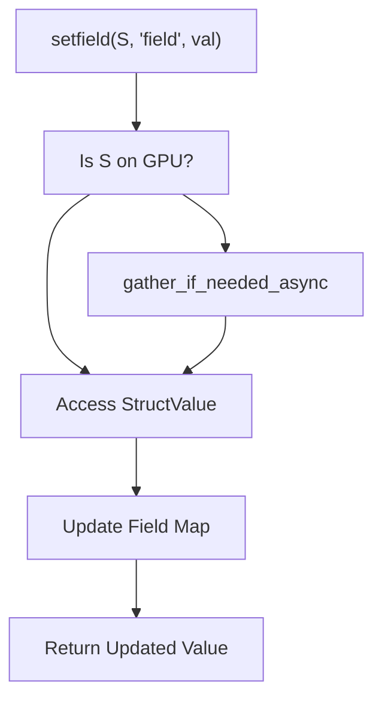
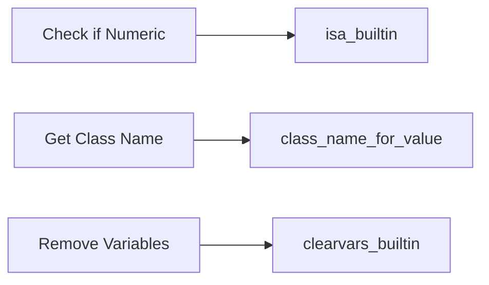

# OOP, Structs, Cells & Introspection Built-ins

<details>
<summary>Relevant source files</summary>

- [.coderabbit.yaml](https://github.com/runmat-org/runmat/blob/82685330/.coderabbit.yaml)
- [crates/runmat-runtime/src/builtins/builtins-json/clearvars.json](https://github.com/runmat-org/runmat/blob/82685330/crates/runmat-runtime/src/builtins/builtins-json/clearvars.json)
- [crates/runmat-runtime/src/builtins/builtins-json/db.json](https://github.com/runmat-org/runmat/blob/82685330/crates/runmat-runtime/src/builtins/builtins-json/db.json)
- [crates/runmat-runtime/src/builtins/builtins-json/impulse.json](https://github.com/runmat-org/runmat/blob/82685330/crates/runmat-runtime/src/builtins/builtins-json/impulse.json)
- [crates/runmat-runtime/src/builtins/builtins-json/nyquist.json](https://github.com/runmat-org/runmat/blob/82685330/crates/runmat-runtime/src/builtins/builtins-json/nyquist.json)
- [crates/runmat-runtime/src/builtins/builtins-json/step.json](https://github.com/runmat-org/runmat/blob/82685330/crates/runmat-runtime/src/builtins/builtins-json/step.json)
- [crates/runmat-runtime/src/builtins/builtins-json/tf.json](https://github.com/runmat-org/runmat/blob/82685330/crates/runmat-runtime/src/builtins/builtins-json/tf.json)
- [crates/runmat-runtime/src/builtins/cells/core/cell.rs](https://github.com/runmat-org/runmat/blob/82685330/crates/runmat-runtime/src/builtins/cells/core/cell.rs)
- [crates/runmat-runtime/src/builtins/cells/core/cell2mat.rs](https://github.com/runmat-org/runmat/blob/82685330/crates/runmat-runtime/src/builtins/cells/core/cell2mat.rs)
- [crates/runmat-runtime/src/builtins/cells/core/cellstr.rs](https://github.com/runmat-org/runmat/blob/82685330/crates/runmat-runtime/src/builtins/cells/core/cellstr.rs)
- [crates/runmat-runtime/src/builtins/cells/core/mat2cell.rs](https://github.com/runmat-org/runmat/blob/82685330/crates/runmat-runtime/src/builtins/cells/core/mat2cell.rs)
- [crates/runmat-runtime/src/builtins/control/db.rs](https://github.com/runmat-org/runmat/blob/82685330/crates/runmat-runtime/src/builtins/control/db.rs)
- [crates/runmat-runtime/src/builtins/control/impulse.rs](https://github.com/runmat-org/runmat/blob/82685330/crates/runmat-runtime/src/builtins/control/impulse.rs)
- [crates/runmat-runtime/src/builtins/control/mod.rs](https://github.com/runmat-org/runmat/blob/82685330/crates/runmat-runtime/src/builtins/control/mod.rs)
- [crates/runmat-runtime/src/builtins/control/nyquist.rs](https://github.com/runmat-org/runmat/blob/82685330/crates/runmat-runtime/src/builtins/control/nyquist.rs)
- [crates/runmat-runtime/src/builtins/control/step.rs](https://github.com/runmat-org/runmat/blob/82685330/crates/runmat-runtime/src/builtins/control/step.rs)
- [crates/runmat-runtime/src/builtins/control/tf.rs](https://github.com/runmat-org/runmat/blob/82685330/crates/runmat-runtime/src/builtins/control/tf.rs)
- [crates/runmat-runtime/src/builtins/control/type_resolvers.rs](https://github.com/runmat-org/runmat/blob/82685330/crates/runmat-runtime/src/builtins/control/type_resolvers.rs)
- [crates/runmat-runtime/src/builtins/introspection/class.rs](https://github.com/runmat-org/runmat/blob/82685330/crates/runmat-runtime/src/builtins/introspection/class.rs)
- [crates/runmat-runtime/src/builtins/introspection/clear.rs](https://github.com/runmat-org/runmat/blob/82685330/crates/runmat-runtime/src/builtins/introspection/clear.rs)
- [crates/runmat-runtime/src/builtins/introspection/clearvars.rs](https://github.com/runmat-org/runmat/blob/82685330/crates/runmat-runtime/src/builtins/introspection/clearvars.rs)
- [crates/runmat-runtime/src/builtins/introspection/isa.rs](https://github.com/runmat-org/runmat/blob/82685330/crates/runmat-runtime/src/builtins/introspection/isa.rs)
- [crates/runmat-runtime/src/builtins/introspection/ischar.rs](https://github.com/runmat-org/runmat/blob/82685330/crates/runmat-runtime/src/builtins/introspection/ischar.rs)
- [crates/runmat-runtime/src/builtins/introspection/isstring.rs](https://github.com/runmat-org/runmat/blob/82685330/crates/runmat-runtime/src/builtins/introspection/isstring.rs)
- [crates/runmat-runtime/src/builtins/introspection/mod.rs](https://github.com/runmat-org/runmat/blob/82685330/crates/runmat-runtime/src/builtins/introspection/mod.rs)
- [crates/runmat-runtime/src/builtins/introspection/type_resolvers.rs](https://github.com/runmat-org/runmat/blob/82685330/crates/runmat-runtime/src/builtins/introspection/type_resolvers.rs)
- [crates/runmat-runtime/src/builtins/io/net/close.rs](https://github.com/runmat-org/runmat/blob/82685330/crates/runmat-runtime/src/builtins/io/net/close.rs)
- [crates/runmat-runtime/src/builtins/io/net/read.rs](https://github.com/runmat-org/runmat/blob/82685330/crates/runmat-runtime/src/builtins/io/net/read.rs)
- [crates/runmat-runtime/src/builtins/io/net/readline.rs](https://github.com/runmat-org/runmat/blob/82685330/crates/runmat-runtime/src/builtins/io/net/readline.rs)
- [crates/runmat-runtime/src/builtins/io/net/write.rs](https://github.com/runmat-org/runmat/blob/82685330/crates/runmat-runtime/src/builtins/io/net/write.rs)
- [crates/runmat-runtime/src/builtins/logical/tests/isfinite.rs](https://github.com/runmat-org/runmat/blob/82685330/crates/runmat-runtime/src/builtins/logical/tests/isfinite.rs)
- [crates/runmat-runtime/src/builtins/logical/tests/isinf.rs](https://github.com/runmat-org/runmat/blob/82685330/crates/runmat-runtime/src/builtins/logical/tests/isinf.rs)
- [crates/runmat-runtime/src/builtins/logical/tests/islogical.rs](https://github.com/runmat-org/runmat/blob/82685330/crates/runmat-runtime/src/builtins/logical/tests/islogical.rs)
- [crates/runmat-runtime/src/builtins/logical/tests/isnan.rs](https://github.com/runmat-org/runmat/blob/82685330/crates/runmat-runtime/src/builtins/logical/tests/isnan.rs)
- [crates/runmat-runtime/src/builtins/logical/tests/isnumeric.rs](https://github.com/runmat-org/runmat/blob/82685330/crates/runmat-runtime/src/builtins/logical/tests/isnumeric.rs)
- [crates/runmat-runtime/src/builtins/logical/tests/isreal.rs](https://github.com/runmat-org/runmat/blob/82685330/crates/runmat-runtime/src/builtins/logical/tests/isreal.rs)
- [crates/runmat-runtime/src/builtins/math/trigonometry/acos.rs](https://github.com/runmat-org/runmat/blob/82685330/crates/runmat-runtime/src/builtins/math/trigonometry/acos.rs)
- [crates/runmat-runtime/src/builtins/math/trigonometry/asin.rs](https://github.com/runmat-org/runmat/blob/82685330/crates/runmat-runtime/src/builtins/math/trigonometry/asin.rs)
- [crates/runmat-runtime/src/builtins/math/trigonometry/atan.rs](https://github.com/runmat-org/runmat/blob/82685330/crates/runmat-runtime/src/builtins/math/trigonometry/atan.rs)
- [crates/runmat-runtime/src/builtins/structs/core/fieldnames.rs](https://github.com/runmat-org/runmat/blob/82685330/crates/runmat-runtime/src/builtins/structs/core/fieldnames.rs)
- [crates/runmat-runtime/src/builtins/structs/core/getfield.rs](https://github.com/runmat-org/runmat/blob/82685330/crates/runmat-runtime/src/builtins/structs/core/getfield.rs)
- [crates/runmat-runtime/src/builtins/structs/core/isfield.rs](https://github.com/runmat-org/runmat/blob/82685330/crates/runmat-runtime/src/builtins/structs/core/isfield.rs)
- [crates/runmat-runtime/src/builtins/structs/core/rmfield.rs](https://github.com/runmat-org/runmat/blob/82685330/crates/runmat-runtime/src/builtins/structs/core/rmfield.rs)
- [crates/runmat-runtime/src/builtins/structs/core/setfield.rs](https://github.com/runmat-org/runmat/blob/82685330/crates/runmat-runtime/src/builtins/structs/core/setfield.rs)
- [crates/runmat-runtime/src/builtins/structs/core/struct.rs](https://github.com/runmat-org/runmat/blob/82685330/crates/runmat-runtime/src/builtins/structs/core/struct.rs)
- [crates/runmat-runtime/src/builtins/timing/pause.rs](https://github.com/runmat-org/runmat/blob/82685330/crates/runmat-runtime/src/builtins/timing/pause.rs)
- [crates/runmat-runtime/src/builtins/timing/tic.rs](https://github.com/runmat-org/runmat/blob/82685330/crates/runmat-runtime/src/builtins/timing/tic.rs)
- [crates/runmat-runtime/src/builtins/timing/toc.rs](https://github.com/runmat-org/runmat/blob/82685330/crates/runmat-runtime/src/builtins/timing/toc.rs)
- [crates/runmat-vm/tests/control.rs](https://github.com/runmat-org/runmat/blob/82685330/crates/runmat-vm/tests/control.rs)

</details>

This section details the implementation of MATLAB-compatible data structures (Structs and Cells), Object-Oriented Programming (OOP) handles, and the introspection system within the `runmat-runtime` crate. These built-ins provide the foundation for complex data modeling and runtime reflection in RunMat.

## Struct & Cell Array Management

Structs and Cell arrays in RunMat are implemented as specialized containers within the `Value` enum. Struct operations support nested field access, struct-array indexing, and automatic gathering of GPU-resident data before host-side metadata mutation.

### Struct Built-ins

The struct subsystem handles field manipulation for both standard structs and MATLAB-style objects.

- `getfield`: Supports scalar field access, nested paths, and leading index selectors for struct arrays [crates/runmat-runtime/src/builtins/structs/core/getfield.rs #119-135](https://github.com/runmat-org/runmat/blob/82685330/crates/runmat-runtime/src/builtins/structs/core/getfield.rs#L119-L135) It acts as a fusion barrier because it must inspect metadata on the host [crates/runmat-runtime/src/builtins/structs/core/getfield.rs #40-48](https://github.com/runmat-org/runmat/blob/82685330/crates/runmat-runtime/src/builtins/structs/core/getfield.rs#L40-L48)
- `setfield`: Handles assignments to fields. If the target is a GPU-resident tensor, it is gathered to the host before the mutation occurs [crates/runmat-runtime/src/builtins/structs/core/setfield.rs #28-41](https://github.com/runmat-org/runmat/blob/82685330/crates/runmat-runtime/src/builtins/structs/core/setfield.rs#L28-L41)
- `fieldnames`: Returns a cell array of character vectors containing field names of a struct or public properties of an object [crates/runmat-runtime/src/builtins/structs/core/fieldnames.rs #1](https://github.com/runmat-org/runmat/blob/82685330/crates/runmat-runtime/src/builtins/structs/core/fieldnames.rs#L1-L1)
- `isfield`: Checks for the existence of a field name within a struct [crates/runmat-runtime/src/builtins/structs/core/isfield.rs #1](https://github.com/runmat-org/runmat/blob/82685330/crates/runmat-runtime/src/builtins/structs/core/isfield.rs#L1-L1)

### Cell Array Built-ins

Cell arrays are implemented using the `CellArray` type, which can hold heterogeneous `Value` types.

- `cell`: Pre-allocates an empty cell array of a specified shape.
- `cell2mat`: Concatenates the contents of a cell array into a single numeric or logical matrix.
- `mat2cell`: Divides a matrix into a cell array of sub-matrices [crates/runmat-runtime/src/builtins/cells/core/mat2cell.rs #1](https://github.com/runmat-org/runmat/blob/82685330/crates/runmat-runtime/src/builtins/cells/core/mat2cell.rs#L1-L1)
- `cellstr`: Converts a character array or string array into a cell array of strings [crates/runmat-runtime/src/builtins/cells/core/cellstr.rs #1](https://github.com/runmat-org/runmat/blob/82685330/crates/runmat-runtime/src/builtins/cells/core/cellstr.rs#L1-L1)

### Data Flow: Struct Mutation

The following diagram illustrates how `setfield` handles the transition of data from GPU to Host for metadata updates.

Struct Mutation Pipeline



<details>
<summary>Rendered SVG</summary>

```svg
<svg id="mermaid-4cz9k5k38ed" xmlns="http://www.w3.org/2000/svg" xmlns:xlink="http://www.w3.org/1999/xlink" class="flowchart" style="max-width: 100%; touch-action: none; user-select: none; cursor: grab; min-height: fit-content; max-height: 100%;" viewBox="0 0 327.6640625 707.5" role="graphics-document document" aria-roledescription="flowchart-v2" preserveAspectRatio="xMidYMid meet"><style>#mermaid-4cz9k5k38ed{font-family:ui-sans-serif,-apple-system,system-ui,Segoe UI,Helvetica;font-size:16px;fill:#ccc;}@keyframes edge-animation-frame{from{stroke-dashoffset:0;}}@keyframes dash{to{stroke-dashoffset:0;}}#mermaid-4cz9k5k38ed .edge-animation-slow{stroke-dasharray:9,5!important;stroke-dashoffset:900;animation:dash 50s linear infinite;stroke-linecap:round;}#mermaid-4cz9k5k38ed .edge-animation-fast{stroke-dasharray:9,5!important;stroke-dashoffset:900;animation:dash 20s linear infinite;stroke-linecap:round;}#mermaid-4cz9k5k38ed .error-icon{fill:#333;}#mermaid-4cz9k5k38ed .error-text{fill:#cccccc;stroke:#cccccc;}#mermaid-4cz9k5k38ed .edge-thickness-normal{stroke-width:1px;}#mermaid-4cz9k5k38ed .edge-thickness-thick{stroke-width:3.5px;}#mermaid-4cz9k5k38ed .edge-pattern-solid{stroke-dasharray:0;}#mermaid-4cz9k5k38ed .edge-thickness-invisible{stroke-width:0;fill:none;}#mermaid-4cz9k5k38ed .edge-pattern-dashed{stroke-dasharray:3;}#mermaid-4cz9k5k38ed .edge-pattern-dotted{stroke-dasharray:2;}#mermaid-4cz9k5k38ed .marker{fill:#666;stroke:#666;}#mermaid-4cz9k5k38ed .marker.cross{stroke:#666;}#mermaid-4cz9k5k38ed svg{font-family:ui-sans-serif,-apple-system,system-ui,Segoe UI,Helvetica;font-size:16px;}#mermaid-4cz9k5k38ed p{margin:0;}#mermaid-4cz9k5k38ed .label{font-family:ui-sans-serif,-apple-system,system-ui,Segoe UI,Helvetica;color:#fff;}#mermaid-4cz9k5k38ed .cluster-label text{fill:#fff;}#mermaid-4cz9k5k38ed .cluster-label span{color:#fff;}#mermaid-4cz9k5k38ed .cluster-label span p{background-color:transparent;}#mermaid-4cz9k5k38ed .label text,#mermaid-4cz9k5k38ed span{fill:#fff;color:#fff;}#mermaid-4cz9k5k38ed .node rect,#mermaid-4cz9k5k38ed .node circle,#mermaid-4cz9k5k38ed .node ellipse,#mermaid-4cz9k5k38ed .node polygon,#mermaid-4cz9k5k38ed .node path{fill:#111;stroke:#222;stroke-width:1px;}#mermaid-4cz9k5k38ed .rough-node .label text,#mermaid-4cz9k5k38ed .node .label text,#mermaid-4cz9k5k38ed .image-shape .label,#mermaid-4cz9k5k38ed .icon-shape .label{text-anchor:middle;}#mermaid-4cz9k5k38ed .node .katex path{fill:#000;stroke:#000;stroke-width:1px;}#mermaid-4cz9k5k38ed .rough-node .label,#mermaid-4cz9k5k38ed .node .label,#mermaid-4cz9k5k38ed .image-shape .label,#mermaid-4cz9k5k38ed .icon-shape .label{text-align:center;}#mermaid-4cz9k5k38ed .node.clickable{cursor:pointer;}#mermaid-4cz9k5k38ed .root .anchor path{fill:#666!important;stroke-width:0;stroke:#666;}#mermaid-4cz9k5k38ed .arrowheadPath{fill:#0b0b0b;}#mermaid-4cz9k5k38ed .edgePath .path{stroke:#666;stroke-width:1px;}#mermaid-4cz9k5k38ed .flowchart-link{stroke:#666;fill:none;}#mermaid-4cz9k5k38ed .edgeLabel{background-color:#161616;text-align:center;}#mermaid-4cz9k5k38ed .edgeLabel p{background-color:#161616;}#mermaid-4cz9k5k38ed .edgeLabel rect{opacity:0.5;background-color:#161616;fill:#161616;}#mermaid-4cz9k5k38ed .labelBkg{background-color:rgba(22, 22, 22, 0.5);}#mermaid-4cz9k5k38ed .cluster rect{fill:#161616;stroke:#222;stroke-width:1px;}#mermaid-4cz9k5k38ed .cluster text{fill:#fff;}#mermaid-4cz9k5k38ed .cluster span{color:#fff;}#mermaid-4cz9k5k38ed div.mermaidTooltip{position:absolute;text-align:center;max-width:200px;padding:2px;font-family:ui-sans-serif,-apple-system,system-ui,Segoe UI,Helvetica;font-size:12px;background:#333;border:1px solid hsl(0, 0%, 10%);border-radius:2px;pointer-events:none;z-index:100;}#mermaid-4cz9k5k38ed .flowchartTitleText{text-anchor:middle;font-size:18px;fill:#ccc;}#mermaid-4cz9k5k38ed rect.text{fill:none;stroke-width:0;}#mermaid-4cz9k5k38ed .icon-shape,#mermaid-4cz9k5k38ed .image-shape{background-color:#161616;text-align:center;}#mermaid-4cz9k5k38ed .icon-shape p,#mermaid-4cz9k5k38ed .image-shape p{background-color:#161616;padding:2px;}#mermaid-4cz9k5k38ed .icon-shape .label rect,#mermaid-4cz9k5k38ed .image-shape .label rect{opacity:0.5;background-color:#161616;fill:#161616;}#mermaid-4cz9k5k38ed .label-icon{display:inline-block;height:1em;overflow:visible;vertical-align:-0.125em;}#mermaid-4cz9k5k38ed .node .label-icon path{fill:currentColor;stroke:revert;stroke-width:revert;}#mermaid-4cz9k5k38ed .node .neo-node{stroke:#222;}#mermaid-4cz9k5k38ed [data-look="neo"].node rect,#mermaid-4cz9k5k38ed [data-look="neo"].cluster rect,#mermaid-4cz9k5k38ed [data-look="neo"].node polygon{stroke:url(#mermaid-4cz9k5k38ed-gradient);filter:drop-shadow( 1px 2px 2px rgba(185,185,185,1));}#mermaid-4cz9k5k38ed [data-look="neo"].node path{stroke:url(#mermaid-4cz9k5k38ed-gradient);stroke-width:1px;}#mermaid-4cz9k5k38ed [data-look="neo"].node .outer-path{filter:drop-shadow( 1px 2px 2px rgba(185,185,185,1));}#mermaid-4cz9k5k38ed [data-look="neo"].node .neo-line path{stroke:#222;filter:none;}#mermaid-4cz9k5k38ed [data-look="neo"].node circle{stroke:url(#mermaid-4cz9k5k38ed-gradient);filter:drop-shadow( 1px 2px 2px rgba(185,185,185,1));}#mermaid-4cz9k5k38ed [data-look="neo"].node circle .state-start{fill:#000000;}#mermaid-4cz9k5k38ed [data-look="neo"].icon-shape .icon{fill:url(#mermaid-4cz9k5k38ed-gradient);filter:drop-shadow( 1px 2px 2px rgba(185,185,185,1));}#mermaid-4cz9k5k38ed [data-look="neo"].icon-shape .icon-neo path{stroke:url(#mermaid-4cz9k5k38ed-gradient);filter:drop-shadow( 1px 2px 2px rgba(185,185,185,1));}#mermaid-4cz9k5k38ed :root{--mermaid-font-family:"trebuchet ms",verdana,arial,sans-serif;}</style><g><marker id="mermaid-4cz9k5k38ed_flowchart-v2-pointEnd" class="marker flowchart-v2" viewBox="0 0 10 10" refX="5" refY="5" markerUnits="userSpaceOnUse" markerWidth="8" markerHeight="8" orient="auto"><path d="M 0 0 L 10 5 L 0 10 z" class="arrowMarkerPath" style="stroke-width: 1; stroke-dasharray: 1, 0;"></path></marker><marker id="mermaid-4cz9k5k38ed_flowchart-v2-pointStart" class="marker flowchart-v2" viewBox="0 0 10 10" refX="4.5" refY="5" markerUnits="userSpaceOnUse" markerWidth="8" markerHeight="8" orient="auto"><path d="M 0 5 L 10 10 L 10 0 z" class="arrowMarkerPath" style="stroke-width: 1; stroke-dasharray: 1, 0;"></path></marker><marker id="mermaid-4cz9k5k38ed_flowchart-v2-pointEnd-margin" class="marker flowchart-v2" viewBox="0 0 11.5 14" refX="11.5" refY="7" markerUnits="userSpaceOnUse" markerWidth="10.5" markerHeight="14" orient="auto"><path d="M 0 0 L 11.5 7 L 0 14 z" class="arrowMarkerPath" style="stroke-width: 0; stroke-dasharray: 1, 0;"></path></marker><marker id="mermaid-4cz9k5k38ed_flowchart-v2-pointStart-margin" class="marker flowchart-v2" viewBox="0 0 11.5 14" refX="1" refY="7" markerUnits="userSpaceOnUse" markerWidth="11.5" markerHeight="14" orient="auto"><polygon points="0,7 11.5,14 11.5,0" class="arrowMarkerPath" style="stroke-width: 0; stroke-dasharray: 1, 0;"></polygon></marker><marker id="mermaid-4cz9k5k38ed_flowchart-v2-circleEnd" class="marker flowchart-v2" viewBox="0 0 10 10" refX="11" refY="5" markerUnits="userSpaceOnUse" markerWidth="11" markerHeight="11" orient="auto"><circle cx="5" cy="5" r="5" class="arrowMarkerPath" style="stroke-width: 1; stroke-dasharray: 1, 0;"></circle></marker><marker id="mermaid-4cz9k5k38ed_flowchart-v2-circleStart" class="marker flowchart-v2" viewBox="0 0 10 10" refX="-1" refY="5" markerUnits="userSpaceOnUse" markerWidth="11" markerHeight="11" orient="auto"><circle cx="5" cy="5" r="5" class="arrowMarkerPath" style="stroke-width: 1; stroke-dasharray: 1, 0;"></circle></marker><marker id="mermaid-4cz9k5k38ed_flowchart-v2-circleEnd-margin" class="marker flowchart-v2" viewBox="0 0 10 10" refY="5" refX="12.25" markerUnits="userSpaceOnUse" markerWidth="14" markerHeight="14" orient="auto"><circle cx="5" cy="5" r="5" class="arrowMarkerPath" style="stroke-width: 0; stroke-dasharray: 1, 0;"></circle></marker><marker id="mermaid-4cz9k5k38ed_flowchart-v2-circleStart-margin" class="marker flowchart-v2" viewBox="0 0 10 10" refX="-2" refY="5" markerUnits="userSpaceOnUse" markerWidth="14" markerHeight="14" orient="auto"><circle cx="5" cy="5" r="5" class="arrowMarkerPath" style="stroke-width: 0; stroke-dasharray: 1, 0;"></circle></marker><marker id="mermaid-4cz9k5k38ed_flowchart-v2-crossEnd" class="marker cross flowchart-v2" viewBox="0 0 11 11" refX="12" refY="5.2" markerUnits="userSpaceOnUse" markerWidth="11" markerHeight="11" orient="auto"><path d="M 1,1 l 9,9 M 10,1 l -9,9" class="arrowMarkerPath" style="stroke-width: 2; stroke-dasharray: 1, 0;"></path></marker><marker id="mermaid-4cz9k5k38ed_flowchart-v2-crossStart" class="marker cross flowchart-v2" viewBox="0 0 11 11" refX="-1" refY="5.2" markerUnits="userSpaceOnUse" markerWidth="11" markerHeight="11" orient="auto"><path d="M 1,1 l 9,9 M 10,1 l -9,9" class="arrowMarkerPath" style="stroke-width: 2; stroke-dasharray: 1, 0;"></path></marker><marker id="mermaid-4cz9k5k38ed_flowchart-v2-crossEnd-margin" class="marker cross flowchart-v2" viewBox="0 0 15 15" refX="17.7" refY="7.5" markerUnits="userSpaceOnUse" markerWidth="12" markerHeight="12" orient="auto"><path d="M 1,1 L 14,14 M 1,14 L 14,1" class="arrowMarkerPath" style="stroke-width: 2.5;"></path></marker><marker id="mermaid-4cz9k5k38ed_flowchart-v2-crossStart-margin" class="marker cross flowchart-v2" viewBox="0 0 15 15" refX="-3.5" refY="7.5" markerUnits="userSpaceOnUse" markerWidth="12" markerHeight="12" orient="auto"><path d="M 1,1 L 14,14 M 1,14 L 14,1" class="arrowMarkerPath" style="stroke-width: 2.5; stroke-dasharray: 1, 0;"></path></marker><g class="root"><g class="clusters"></g><g class="edgePaths"><path d="M117.539,62L117.539,66.167C117.539,70.333,117.539,78.667,117.539,86.333C117.539,94,117.539,101,117.539,104.5L117.539,108" id="mermaid-4cz9k5k38ed-L_A_B_0" class="edge-thickness-normal edge-pattern-solid edge-thickness-normal edge-pattern-solid flowchart-link" style=";" data-edge="true" data-et="edge" data-id="L_A_B_0" data-points="W3sieCI6MTE3LjUzOTA2MjUsInkiOjYyfSx7IngiOjExNy41MzkwNjI1LCJ5Ijo4N30seyJ4IjoxMTcuNTM5MDYyNSwieSI6MTEyfV0=" data-look="classic" marker-end="url(#mermaid-4cz9k5k38ed_flowchart-v2-pointEnd)"></path><path d="M149.022,228.017L157.523,239.431C166.025,250.845,183.028,273.672,191.53,290.586C200.031,307.5,200.031,318.5,200.031,324L200.031,329.5" id="mermaid-4cz9k5k38ed-L_B_C_0" class="edge-thickness-normal edge-pattern-solid edge-thickness-normal edge-pattern-solid flowchart-link" style=";" data-edge="true" data-et="edge" data-id="L_B_C_0" data-points="W3sieCI6MTQ5LjAyMTgyOTgzMzczNzYzLCJ5IjoyMjguMDE3MjMyNjY2MjYyMzd9LHsieCI6MjAwLjAzMTI1LCJ5IjoyOTYuNX0seyJ4IjoyMDAuMDMxMjUsInkiOjMzMy41fV0=" data-look="classic" marker-end="url(#mermaid-4cz9k5k38ed_flowchart-v2-pointEnd)"></path><path d="M86.056,228.017L77.555,239.431C69.053,250.845,52.05,273.672,43.548,295.753C35.047,317.833,35.047,339.167,35.047,358.5C35.047,377.833,35.047,395.167,41.093,407.644C47.139,420.122,59.231,427.745,65.277,431.556L71.323,435.367" id="mermaid-4cz9k5k38ed-L_B_D_0" class="edge-thickness-normal edge-pattern-solid edge-thickness-normal edge-pattern-solid flowchart-link" style=";" data-edge="true" data-et="edge" data-id="L_B_D_0" data-points="W3sieCI6ODYuMDU2Mjk1MTY2MjYyMzksInkiOjIyOC4wMTcyMzI2NjYyNjIzN30seyJ4IjozNS4wNDY4NzUsInkiOjI5Ni41fSx7IngiOjM1LjA0Njg3NSwieSI6MzYwLjV9LHsieCI6MzUuMDQ2ODc1LCJ5Ijo0MTIuNX0seyJ4Ijo3NC43MDY1ODA1Mjg4NDYxNiwieSI6NDM3LjV9XQ==" data-look="classic" marker-end="url(#mermaid-4cz9k5k38ed_flowchart-v2-pointEnd)"></path><path d="M200.031,387.5L200.031,391.667C200.031,395.833,200.031,404.167,193.985,412.144C187.939,420.122,175.847,427.745,169.801,431.556L163.755,435.367" id="mermaid-4cz9k5k38ed-L_C_D_0" class="edge-thickness-normal edge-pattern-solid edge-thickness-normal edge-pattern-solid flowchart-link" style=";" data-edge="true" data-et="edge" data-id="L_C_D_0" data-points="W3sieCI6MjAwLjAzMTI1LCJ5IjozODcuNX0seyJ4IjoyMDAuMDMxMjUsInkiOjQxMi41fSx7IngiOjE2MC4zNzE1NDQ0NzExNTM4NCwieSI6NDM3LjV9XQ==" data-look="classic" marker-end="url(#mermaid-4cz9k5k38ed_flowchart-v2-pointEnd)"></path><path d="M117.539,491.5L117.539,495.667C117.539,499.833,117.539,508.167,117.539,515.833C117.539,523.5,117.539,530.5,117.539,534L117.539,537.5" id="mermaid-4cz9k5k38ed-L_D_E_0" class="edge-thickness-normal edge-pattern-solid edge-thickness-normal edge-pattern-solid flowchart-link" style=";" data-edge="true" data-et="edge" data-id="L_D_E_0" data-points="W3sieCI6MTE3LjUzOTA2MjUsInkiOjQ5MS41fSx7IngiOjExNy41MzkwNjI1LCJ5Ijo1MTYuNX0seyJ4IjoxMTcuNTM5MDYyNSwieSI6NTQxLjV9XQ==" data-look="classic" marker-end="url(#mermaid-4cz9k5k38ed_flowchart-v2-pointEnd)"></path><path d="M117.539,595.5L117.539,599.667C117.539,603.833,117.539,612.167,117.539,619.833C117.539,627.5,117.539,634.5,117.539,638L117.539,641.5" id="mermaid-4cz9k5k38ed-L_E_F_0" class="edge-thickness-normal edge-pattern-solid edge-thickness-normal edge-pattern-solid flowchart-link" style=";" data-edge="true" data-et="edge" data-id="L_E_F_0" data-points="W3sieCI6MTE3LjUzOTA2MjUsInkiOjU5NS41fSx7IngiOjExNy41MzkwNjI1LCJ5Ijo2MjAuNX0seyJ4IjoxMTcuNTM5MDYyNSwieSI6NjQ1LjV9XQ==" data-look="classic" marker-end="url(#mermaid-4cz9k5k38ed_flowchart-v2-pointEnd)"></path></g><g class="edgeLabels"><g class="edgeLabel"><g class="label" data-id="L_A_B_0" transform="translate(0, 0)"><foreignObject width="0" height="0"><div style="display: table-cell; white-space: nowrap; line-height: 1.5; max-width: 200px; text-align: center;" xmlns="http://www.w3.org/1999/xhtml" class="labelBkg"><span class="edgeLabel"></span></div></foreignObject></g></g><g class="edgeLabel" transform="translate(200.03125, 296.5)"><g class="label" data-id="L_B_C_0" transform="translate(-12.8671875, -12)"><foreignObject width="25.734375" height="24"><div style="display: table-cell; white-space: nowrap; line-height: 1.5; max-width: 200px; text-align: center;" xmlns="http://www.w3.org/1999/xhtml" class="labelBkg"><span class="edgeLabel"><p>Yes</p></span></div></foreignObject></g></g><g class="edgeLabel" transform="translate(35.046875, 360.5)"><g class="label" data-id="L_B_D_0" transform="translate(-10.3515625, -12)"><foreignObject width="20.703125" height="24"><div style="display: table-cell; white-space: nowrap; line-height: 1.5; max-width: 200px; text-align: center;" xmlns="http://www.w3.org/1999/xhtml" class="labelBkg"><span class="edgeLabel"><p>No</p></span></div></foreignObject></g></g><g class="edgeLabel"><g class="label" data-id="L_C_D_0" transform="translate(0, 0)"><foreignObject width="0" height="0"><div style="display: table-cell; white-space: nowrap; line-height: 1.5; max-width: 200px; text-align: center;" xmlns="http://www.w3.org/1999/xhtml" class="labelBkg"><span class="edgeLabel"></span></div></foreignObject></g></g><g class="edgeLabel"><g class="label" data-id="L_D_E_0" transform="translate(0, 0)"><foreignObject width="0" height="0"><div style="display: table-cell; white-space: nowrap; line-height: 1.5; max-width: 200px; text-align: center;" xmlns="http://www.w3.org/1999/xhtml" class="labelBkg"><span class="edgeLabel"></span></div></foreignObject></g></g><g class="edgeLabel"><g class="label" data-id="L_E_F_0" transform="translate(0, 0)"><foreignObject width="0" height="0"><div style="display: table-cell; white-space: nowrap; line-height: 1.5; max-width: 200px; text-align: center;" xmlns="http://www.w3.org/1999/xhtml" class="labelBkg"><span class="edgeLabel"></span></div></foreignObject></g></g></g><g class="nodes"><g class="node default" id="mermaid-4cz9k5k38ed-flowchart-A-0" data-look="classic" transform="translate(117.5390625, 35)"><rect class="basic label-container" style="" x="-105.6015625" y="-27" width="211.203125" height="54"></rect><g class="label" style="" transform="translate(-75.6015625, -12)"><rect></rect><foreignObject width="151.203125" height="24"><div style="display: table-cell; white-space: nowrap; line-height: 1.5; max-width: 200px; text-align: center;" xmlns="http://www.w3.org/1999/xhtml"><span class="nodeLabel"><p>setfield(S, 'field', val)</p></span></div></foreignObject></g></g><g class="node default" id="mermaid-4cz9k5k38ed-flowchart-B-1" data-look="classic" transform="translate(117.5390625, 185.75)"><polygon points="73.75,0 147.5,-73.75 73.75,-147.5 0,-73.75" class="label-container" transform="translate(-73.25, 73.75)"></polygon><g class="label" style="" transform="translate(-46.75, -12)"><rect></rect><foreignObject width="93.5" height="24"><div style="display: table-cell; white-space: nowrap; line-height: 1.5; max-width: 200px; text-align: center;" xmlns="http://www.w3.org/1999/xhtml"><span class="nodeLabel"><p>Is S on GPU?</p></span></div></foreignObject></g></g><g class="node default" id="mermaid-4cz9k5k38ed-flowchart-C-3" data-look="classic" transform="translate(200.03125, 360.5)"><rect class="basic label-container" style="" x="-119.6328125" y="-27" width="239.265625" height="54"></rect><g class="label" style="" transform="translate(-89.6328125, -12)"><rect></rect><foreignObject width="179.265625" height="24"><div style="display: table-cell; white-space: nowrap; line-height: 1.5; max-width: 200px; text-align: center;" xmlns="http://www.w3.org/1999/xhtml"><span class="nodeLabel"><p>gather_if_needed_async</p></span></div></foreignObject></g></g><g class="node default" id="mermaid-4cz9k5k38ed-flowchart-D-5" data-look="classic" transform="translate(117.5390625, 464.5)"><rect class="basic label-container" style="" x="-100.1953125" y="-27" width="200.390625" height="54"></rect><g class="label" style="" transform="translate(-70.1953125, -12)"><rect></rect><foreignObject width="140.390625" height="24"><div style="display: table-cell; white-space: nowrap; line-height: 1.5; max-width: 200px; text-align: center;" xmlns="http://www.w3.org/1999/xhtml"><span class="nodeLabel"><p>Access StructValue</p></span></div></foreignObject></g></g><g class="node default" id="mermaid-4cz9k5k38ed-flowchart-E-9" data-look="classic" transform="translate(117.5390625, 568.5)"><rect class="basic label-container" style="" x="-93.8828125" y="-27" width="187.765625" height="54"></rect><g class="label" style="" transform="translate(-63.8828125, -12)"><rect></rect><foreignObject width="127.765625" height="24"><div style="display: table-cell; white-space: nowrap; line-height: 1.5; max-width: 200px; text-align: center;" xmlns="http://www.w3.org/1999/xhtml"><span class="nodeLabel"><p>Update Field Map</p></span></div></foreignObject></g></g><g class="node default" id="mermaid-4cz9k5k38ed-flowchart-F-11" data-look="classic" transform="translate(117.5390625, 672.5)"><rect class="basic label-container" style="" x="-109.5390625" y="-27" width="219.078125" height="54"></rect><g class="label" style="" transform="translate(-79.5390625, -12)"><rect></rect><foreignObject width="159.078125" height="24"><div style="display: table-cell; white-space: nowrap; line-height: 1.5; max-width: 200px; text-align: center;" xmlns="http://www.w3.org/1999/xhtml"><span class="nodeLabel"><p>Return Updated Value</p></span></div></foreignObject></g></g></g></g></g><defs><filter id="mermaid-4cz9k5k38ed-drop-shadow" height="130%" width="130%"><feDropShadow dx="4" dy="4" stdDeviation="0" flood-opacity="0.06" flood-color="#000000"></feDropShadow></filter></defs><defs><filter id="mermaid-4cz9k5k38ed-drop-shadow-small" height="150%" width="150%"><feDropShadow dx="2" dy="2" stdDeviation="0" flood-opacity="0.06" flood-color="#000000"></feDropShadow></filter></defs><linearGradient id="mermaid-4cz9k5k38ed-gradient" gradientUnits="objectBoundingBox" x1="0%" y1="0%" x2="100%" y2="0%"><stop offset="0%" stop-color="#333" stop-opacity="1"></stop><stop offset="100%" stop-color="hsl(-120, 0%, 3.3333333333%)" stop-opacity="1"></stop></linearGradient></svg>
```

</details>

Sources: [crates/runmat-runtime/src/builtins/structs/core/setfield.rs #1-41](https://github.com/runmat-org/runmat/blob/82685330/crates/runmat-runtime/src/builtins/structs/core/setfield.rs#L1-L41) [crates/runmat-runtime/src/builtins/structs/core/getfield.rs #1-37](https://github.com/runmat-org/runmat/blob/82685330/crates/runmat-runtime/src/builtins/structs/core/getfield.rs#L1-L37)

---

## OOP & Handle Objects

RunMat supports both value-based objects and handle-based objects. Handle objects are reference-counted and persist across assignments.

### Object Representation

- `ObjectInstance`: Represents a value-class object containing a `class_name` and a map of `properties` [crates/runmat-runtime/src/builtins/control/nyquist.rs #113-117](https://github.com/runmat-org/runmat/blob/82685330/crates/runmat-runtime/src/builtins/control/nyquist.rs#L113-L117)
- `HandleObject`: Represents a reference to an object in the heap, allowing for shared state and listeners.

### Event Registry

The runtime includes support for the MATLAB event system. The `Listener` type [crates/runmat-runtime/src/builtins/introspection/isa.rs #164](https://github.com/runmat-org/runmat/blob/82685330/crates/runmat-runtime/src/builtins/introspection/isa.rs#L164-L164) allows attaching callbacks to object property changes or custom events.

Sources: [crates/runmat-runtime/src/builtins/introspection/isa.rs #140-183](https://github.com/runmat-org/runmat/blob/82685330/crates/runmat-runtime/src/builtins/introspection/isa.rs#L140-L183) [crates/runmat-runtime/src/builtins/control/nyquist.rs #102-108](https://github.com/runmat-org/runmat/blob/82685330/crates/runmat-runtime/src/builtins/control/nyquist.rs#L102-L108)

---

## Introspection & Workspace Control

Introspection built-ins allow the user to query the state of the workspace and the types of variables at runtime.

### Type & Class Checking

- `class`: Returns the class name of a value as a string [crates/runmat-runtime/src/builtins/introspection/class.rs #1](https://github.com/runmat-org/runmat/blob/82685330/crates/runmat-runtime/src/builtins/introspection/class.rs#L1-L1)
- `isa`: Tests if a value belongs to a specific class or abstract category (e.g., `'numeric'`, `'float'`, `'handle'`) [crates/runmat-runtime/src/builtins/introspection/isa.rs #140-167](https://github.com/runmat-org/runmat/blob/82685330/crates/runmat-runtime/src/builtins/introspection/isa.rs#L140-L167)
- `isreal`: A specialized predicate that checks if a value (including GPU tensors) is stored without an imaginary component [crates/runmat-runtime/src/builtins/logical/tests/isreal.rs #109-114](https://github.com/runmat-org/runmat/blob/82685330/crates/runmat-runtime/src/builtins/logical/tests/isreal.rs#L109-L114)

### Workspace Management

- `clearvars`: Removes variables from the current workspace based on names or patterns [crates/runmat-runtime/src/builtins/introspection/clearvars.rs #1](https://github.com/runmat-org/runmat/blob/82685330/crates/runmat-runtime/src/builtins/introspection/clearvars.rs#L1-L1)
- `who` / `whos`: Lists variables in the current scope, with `whos` providing detailed metadata (size, bytes, class).

Introspection Entity Mapping



<details>
<summary>Rendered SVG</summary>

```svg
<svg id="mermaid-ms4byt5sleo" xmlns="http://www.w3.org/2000/svg" xmlns:xlink="http://www.w3.org/1999/xlink" class="flowchart" style="max-width: 100%; touch-action: none; user-select: none; cursor: grab; min-height: fit-content; max-height: 100%;" viewBox="0 0 575.6875 348" role="graphics-document document" aria-roledescription="flowchart-v2" preserveAspectRatio="xMidYMid meet"><style>#mermaid-ms4byt5sleo{font-family:ui-sans-serif,-apple-system,system-ui,Segoe UI,Helvetica;font-size:16px;fill:#ccc;}@keyframes edge-animation-frame{from{stroke-dashoffset:0;}}@keyframes dash{to{stroke-dashoffset:0;}}#mermaid-ms4byt5sleo .edge-animation-slow{stroke-dasharray:9,5!important;stroke-dashoffset:900;animation:dash 50s linear infinite;stroke-linecap:round;}#mermaid-ms4byt5sleo .edge-animation-fast{stroke-dasharray:9,5!important;stroke-dashoffset:900;animation:dash 20s linear infinite;stroke-linecap:round;}#mermaid-ms4byt5sleo .error-icon{fill:#333;}#mermaid-ms4byt5sleo .error-text{fill:#cccccc;stroke:#cccccc;}#mermaid-ms4byt5sleo .edge-thickness-normal{stroke-width:1px;}#mermaid-ms4byt5sleo .edge-thickness-thick{stroke-width:3.5px;}#mermaid-ms4byt5sleo .edge-pattern-solid{stroke-dasharray:0;}#mermaid-ms4byt5sleo .edge-thickness-invisible{stroke-width:0;fill:none;}#mermaid-ms4byt5sleo .edge-pattern-dashed{stroke-dasharray:3;}#mermaid-ms4byt5sleo .edge-pattern-dotted{stroke-dasharray:2;}#mermaid-ms4byt5sleo .marker{fill:#666;stroke:#666;}#mermaid-ms4byt5sleo .marker.cross{stroke:#666;}#mermaid-ms4byt5sleo svg{font-family:ui-sans-serif,-apple-system,system-ui,Segoe UI,Helvetica;font-size:16px;}#mermaid-ms4byt5sleo p{margin:0;}#mermaid-ms4byt5sleo .label{font-family:ui-sans-serif,-apple-system,system-ui,Segoe UI,Helvetica;color:#fff;}#mermaid-ms4byt5sleo .cluster-label text{fill:#fff;}#mermaid-ms4byt5sleo .cluster-label span{color:#fff;}#mermaid-ms4byt5sleo .cluster-label span p{background-color:transparent;}#mermaid-ms4byt5sleo .label text,#mermaid-ms4byt5sleo span{fill:#fff;color:#fff;}#mermaid-ms4byt5sleo .node rect,#mermaid-ms4byt5sleo .node circle,#mermaid-ms4byt5sleo .node ellipse,#mermaid-ms4byt5sleo .node polygon,#mermaid-ms4byt5sleo .node path{fill:#111;stroke:#222;stroke-width:1px;}#mermaid-ms4byt5sleo .rough-node .label text,#mermaid-ms4byt5sleo .node .label text,#mermaid-ms4byt5sleo .image-shape .label,#mermaid-ms4byt5sleo .icon-shape .label{text-anchor:middle;}#mermaid-ms4byt5sleo .node .katex path{fill:#000;stroke:#000;stroke-width:1px;}#mermaid-ms4byt5sleo .rough-node .label,#mermaid-ms4byt5sleo .node .label,#mermaid-ms4byt5sleo .image-shape .label,#mermaid-ms4byt5sleo .icon-shape .label{text-align:center;}#mermaid-ms4byt5sleo .node.clickable{cursor:pointer;}#mermaid-ms4byt5sleo .root .anchor path{fill:#666!important;stroke-width:0;stroke:#666;}#mermaid-ms4byt5sleo .arrowheadPath{fill:#0b0b0b;}#mermaid-ms4byt5sleo .edgePath .path{stroke:#666;stroke-width:1px;}#mermaid-ms4byt5sleo .flowchart-link{stroke:#666;fill:none;}#mermaid-ms4byt5sleo .edgeLabel{background-color:#161616;text-align:center;}#mermaid-ms4byt5sleo .edgeLabel p{background-color:#161616;}#mermaid-ms4byt5sleo .edgeLabel rect{opacity:0.5;background-color:#161616;fill:#161616;}#mermaid-ms4byt5sleo .labelBkg{background-color:rgba(22, 22, 22, 0.5);}#mermaid-ms4byt5sleo .cluster rect{fill:#161616;stroke:#222;stroke-width:1px;}#mermaid-ms4byt5sleo .cluster text{fill:#fff;}#mermaid-ms4byt5sleo .cluster span{color:#fff;}#mermaid-ms4byt5sleo div.mermaidTooltip{position:absolute;text-align:center;max-width:200px;padding:2px;font-family:ui-sans-serif,-apple-system,system-ui,Segoe UI,Helvetica;font-size:12px;background:#333;border:1px solid hsl(0, 0%, 10%);border-radius:2px;pointer-events:none;z-index:100;}#mermaid-ms4byt5sleo .flowchartTitleText{text-anchor:middle;font-size:18px;fill:#ccc;}#mermaid-ms4byt5sleo rect.text{fill:none;stroke-width:0;}#mermaid-ms4byt5sleo .icon-shape,#mermaid-ms4byt5sleo .image-shape{background-color:#161616;text-align:center;}#mermaid-ms4byt5sleo .icon-shape p,#mermaid-ms4byt5sleo .image-shape p{background-color:#161616;padding:2px;}#mermaid-ms4byt5sleo .icon-shape .label rect,#mermaid-ms4byt5sleo .image-shape .label rect{opacity:0.5;background-color:#161616;fill:#161616;}#mermaid-ms4byt5sleo .label-icon{display:inline-block;height:1em;overflow:visible;vertical-align:-0.125em;}#mermaid-ms4byt5sleo .node .label-icon path{fill:currentColor;stroke:revert;stroke-width:revert;}#mermaid-ms4byt5sleo .node .neo-node{stroke:#222;}#mermaid-ms4byt5sleo [data-look="neo"].node rect,#mermaid-ms4byt5sleo [data-look="neo"].cluster rect,#mermaid-ms4byt5sleo [data-look="neo"].node polygon{stroke:url(#mermaid-ms4byt5sleo-gradient);filter:drop-shadow( 1px 2px 2px rgba(185,185,185,1));}#mermaid-ms4byt5sleo [data-look="neo"].node path{stroke:url(#mermaid-ms4byt5sleo-gradient);stroke-width:1px;}#mermaid-ms4byt5sleo [data-look="neo"].node .outer-path{filter:drop-shadow( 1px 2px 2px rgba(185,185,185,1));}#mermaid-ms4byt5sleo [data-look="neo"].node .neo-line path{stroke:#222;filter:none;}#mermaid-ms4byt5sleo [data-look="neo"].node circle{stroke:url(#mermaid-ms4byt5sleo-gradient);filter:drop-shadow( 1px 2px 2px rgba(185,185,185,1));}#mermaid-ms4byt5sleo [data-look="neo"].node circle .state-start{fill:#000000;}#mermaid-ms4byt5sleo [data-look="neo"].icon-shape .icon{fill:url(#mermaid-ms4byt5sleo-gradient);filter:drop-shadow( 1px 2px 2px rgba(185,185,185,1));}#mermaid-ms4byt5sleo [data-look="neo"].icon-shape .icon-neo path{stroke:url(#mermaid-ms4byt5sleo-gradient);filter:drop-shadow( 1px 2px 2px rgba(185,185,185,1));}#mermaid-ms4byt5sleo :root{--mermaid-font-family:"trebuchet ms",verdana,arial,sans-serif;}</style><g><marker id="mermaid-ms4byt5sleo_flowchart-v2-pointEnd" class="marker flowchart-v2" viewBox="0 0 10 10" refX="5" refY="5" markerUnits="userSpaceOnUse" markerWidth="8" markerHeight="8" orient="auto"><path d="M 0 0 L 10 5 L 0 10 z" class="arrowMarkerPath" style="stroke-width: 1; stroke-dasharray: 1, 0;"></path></marker><marker id="mermaid-ms4byt5sleo_flowchart-v2-pointStart" class="marker flowchart-v2" viewBox="0 0 10 10" refX="4.5" refY="5" markerUnits="userSpaceOnUse" markerWidth="8" markerHeight="8" orient="auto"><path d="M 0 5 L 10 10 L 10 0 z" class="arrowMarkerPath" style="stroke-width: 1; stroke-dasharray: 1, 0;"></path></marker><marker id="mermaid-ms4byt5sleo_flowchart-v2-pointEnd-margin" class="marker flowchart-v2" viewBox="0 0 11.5 14" refX="11.5" refY="7" markerUnits="userSpaceOnUse" markerWidth="10.5" markerHeight="14" orient="auto"><path d="M 0 0 L 11.5 7 L 0 14 z" class="arrowMarkerPath" style="stroke-width: 0; stroke-dasharray: 1, 0;"></path></marker><marker id="mermaid-ms4byt5sleo_flowchart-v2-pointStart-margin" class="marker flowchart-v2" viewBox="0 0 11.5 14" refX="1" refY="7" markerUnits="userSpaceOnUse" markerWidth="11.5" markerHeight="14" orient="auto"><polygon points="0,7 11.5,14 11.5,0" class="arrowMarkerPath" style="stroke-width: 0; stroke-dasharray: 1, 0;"></polygon></marker><marker id="mermaid-ms4byt5sleo_flowchart-v2-circleEnd" class="marker flowchart-v2" viewBox="0 0 10 10" refX="11" refY="5" markerUnits="userSpaceOnUse" markerWidth="11" markerHeight="11" orient="auto"><circle cx="5" cy="5" r="5" class="arrowMarkerPath" style="stroke-width: 1; stroke-dasharray: 1, 0;"></circle></marker><marker id="mermaid-ms4byt5sleo_flowchart-v2-circleStart" class="marker flowchart-v2" viewBox="0 0 10 10" refX="-1" refY="5" markerUnits="userSpaceOnUse" markerWidth="11" markerHeight="11" orient="auto"><circle cx="5" cy="5" r="5" class="arrowMarkerPath" style="stroke-width: 1; stroke-dasharray: 1, 0;"></circle></marker><marker id="mermaid-ms4byt5sleo_flowchart-v2-circleEnd-margin" class="marker flowchart-v2" viewBox="0 0 10 10" refY="5" refX="12.25" markerUnits="userSpaceOnUse" markerWidth="14" markerHeight="14" orient="auto"><circle cx="5" cy="5" r="5" class="arrowMarkerPath" style="stroke-width: 0; stroke-dasharray: 1, 0;"></circle></marker><marker id="mermaid-ms4byt5sleo_flowchart-v2-circleStart-margin" class="marker flowchart-v2" viewBox="0 0 10 10" refX="-2" refY="5" markerUnits="userSpaceOnUse" markerWidth="14" markerHeight="14" orient="auto"><circle cx="5" cy="5" r="5" class="arrowMarkerPath" style="stroke-width: 0; stroke-dasharray: 1, 0;"></circle></marker><marker id="mermaid-ms4byt5sleo_flowchart-v2-crossEnd" class="marker cross flowchart-v2" viewBox="0 0 11 11" refX="12" refY="5.2" markerUnits="userSpaceOnUse" markerWidth="11" markerHeight="11" orient="auto"><path d="M 1,1 l 9,9 M 10,1 l -9,9" class="arrowMarkerPath" style="stroke-width: 2; stroke-dasharray: 1, 0;"></path></marker><marker id="mermaid-ms4byt5sleo_flowchart-v2-crossStart" class="marker cross flowchart-v2" viewBox="0 0 11 11" refX="-1" refY="5.2" markerUnits="userSpaceOnUse" markerWidth="11" markerHeight="11" orient="auto"><path d="M 1,1 l 9,9 M 10,1 l -9,9" class="arrowMarkerPath" style="stroke-width: 2; stroke-dasharray: 1, 0;"></path></marker><marker id="mermaid-ms4byt5sleo_flowchart-v2-crossEnd-margin" class="marker cross flowchart-v2" viewBox="0 0 15 15" refX="17.7" refY="7.5" markerUnits="userSpaceOnUse" markerWidth="12" markerHeight="12" orient="auto"><path d="M 1,1 L 14,14 M 1,14 L 14,1" class="arrowMarkerPath" style="stroke-width: 2.5;"></path></marker><marker id="mermaid-ms4byt5sleo_flowchart-v2-crossStart-margin" class="marker cross flowchart-v2" viewBox="0 0 15 15" refX="-3.5" refY="7.5" markerUnits="userSpaceOnUse" markerWidth="12" markerHeight="12" orient="auto"><path d="M 1,1 L 14,14 M 1,14 L 14,1" class="arrowMarkerPath" style="stroke-width: 2.5; stroke-dasharray: 1, 0;"></path></marker><g class="root"><g class="clusters"><g class="cluster" id="mermaid-ms4byt5sleo-subGraph1" data-look="classic"><rect style="" x="296.515625" y="8" width="271.171875" height="332"></rect><g class="cluster-label" transform="translate(365.3125, 8)"><foreignObject width="133.578125" height="24"><div style="display: table-cell; white-space: nowrap; line-height: 1.5;" xmlns="http://www.w3.org/1999/xhtml"><span class="nodeLabel"><p>Code Entity Space</p></span></div></foreignObject></g></g><g class="cluster" id="mermaid-ms4byt5sleo-subGraph0" data-look="classic"><rect style="" x="8" y="8" width="238.515625" height="332"></rect><g class="cluster-label" transform="translate(38.3125, 8)"><foreignObject width="177.890625" height="24"><div style="display: table-cell; white-space: nowrap; line-height: 1.5;" xmlns="http://www.w3.org/1999/xhtml"><span class="nodeLabel"><p>Natural Language Space</p></span></div></foreignObject></g></g></g><g class="edgePaths"><path d="M219.594,70L224.081,70C228.568,70,237.542,70,246.195,70C254.849,70,263.182,70,271.516,70C279.849,70,288.182,70,303.169,70C318.156,70,339.797,70,350.617,70L361.438,70" id="mermaid-ms4byt5sleo-L_N1_C1_0" class="edge-thickness-normal edge-pattern-solid edge-thickness-normal edge-pattern-solid flowchart-link" style=";" data-edge="true" data-et="edge" data-id="L_N1_C1_0" data-points="W3sieCI6MjE5LjU5Mzc1LCJ5Ijo3MH0seyJ4IjoyNDYuNTE1NjI1LCJ5Ijo3MH0seyJ4IjoyNzEuNTE1NjI1LCJ5Ijo3MH0seyJ4IjoyOTYuNTE1NjI1LCJ5Ijo3MH0seyJ4IjozNjUuNDM3NSwieSI6NzB9XQ==" data-look="classic" marker-end="url(#mermaid-ms4byt5sleo_flowchart-v2-pointEnd)"></path><path d="M215.367,174L220.559,174C225.75,174,236.133,174,245.491,174C254.849,174,263.182,174,271.516,174C279.849,174,288.182,174,295.849,174C303.516,174,310.516,174,314.016,174L317.516,174" id="mermaid-ms4byt5sleo-L_N2_C2_0" class="edge-thickness-normal edge-pattern-solid edge-thickness-normal edge-pattern-solid flowchart-link" style=";" data-edge="true" data-et="edge" data-id="L_N2_C2_0" data-points="W3sieCI6MjE1LjM2NzE4NzUsInkiOjE3NH0seyJ4IjoyNDYuNTE1NjI1LCJ5IjoxNzR9LHsieCI6MjcxLjUxNTYyNSwieSI6MTc0fSx7IngiOjI5Ni41MTU2MjUsInkiOjE3NH0seyJ4IjozMjEuNTE1NjI1LCJ5IjoxNzR9XQ==" data-look="classic" marker-end="url(#mermaid-ms4byt5sleo_flowchart-v2-pointEnd)"></path><path d="M221.516,278L225.682,278C229.849,278,238.182,278,246.516,278C254.849,278,263.182,278,271.516,278C279.849,278,288.182,278,299.382,278C310.581,278,324.646,278,331.678,278L338.711,278" id="mermaid-ms4byt5sleo-L_N3_C3_0" class="edge-thickness-normal edge-pattern-solid edge-thickness-normal edge-pattern-solid flowchart-link" style=";" data-edge="true" data-et="edge" data-id="L_N3_C3_0" data-points="W3sieCI6MjIxLjUxNTYyNSwieSI6Mjc4fSx7IngiOjI0Ni41MTU2MjUsInkiOjI3OH0seyJ4IjoyNzEuNTE1NjI1LCJ5IjoyNzh9LHsieCI6Mjk2LjUxNTYyNSwieSI6Mjc4fSx7IngiOjM0Mi43MTA5Mzc1LCJ5IjoyNzh9XQ==" data-look="classic" marker-end="url(#mermaid-ms4byt5sleo_flowchart-v2-pointEnd)"></path></g><g class="edgeLabels"><g class="edgeLabel"><g class="label" data-id="L_N1_C1_0" transform="translate(0, 0)"><foreignObject width="0" height="0"><div style="display: table-cell; white-space: nowrap; line-height: 1.5; max-width: 200px; text-align: center;" xmlns="http://www.w3.org/1999/xhtml" class="labelBkg"><span class="edgeLabel"></span></div></foreignObject></g></g><g class="edgeLabel"><g class="label" data-id="L_N2_C2_0" transform="translate(0, 0)"><foreignObject width="0" height="0"><div style="display: table-cell; white-space: nowrap; line-height: 1.5; max-width: 200px; text-align: center;" xmlns="http://www.w3.org/1999/xhtml" class="labelBkg"><span class="edgeLabel"></span></div></foreignObject></g></g><g class="edgeLabel"><g class="label" data-id="L_N3_C3_0" transform="translate(0, 0)"><foreignObject width="0" height="0"><div style="display: table-cell; white-space: nowrap; line-height: 1.5; max-width: 200px; text-align: center;" xmlns="http://www.w3.org/1999/xhtml" class="labelBkg"><span class="edgeLabel"></span></div></foreignObject></g></g></g><g class="nodes"><g class="node default" id="mermaid-ms4byt5sleo-flowchart-N1-0" data-look="classic" transform="translate(127.2578125, 70)"><rect class="basic label-container" style="" x="-92.3359375" y="-27" width="184.671875" height="54"></rect><g class="label" style="" transform="translate(-62.3359375, -12)"><rect></rect><foreignObject width="124.671875" height="24"><div style="display: table-cell; white-space: nowrap; line-height: 1.5; max-width: 200px; text-align: center;" xmlns="http://www.w3.org/1999/xhtml"><span class="nodeLabel"><p>Check if Numeric</p></span></div></foreignObject></g></g><g class="node default" id="mermaid-ms4byt5sleo-flowchart-N2-1" data-look="classic" transform="translate(127.2578125, 174)"><rect class="basic label-container" style="" x="-88.109375" y="-27" width="176.21875" height="54"></rect><g class="label" style="" transform="translate(-58.109375, -12)"><rect></rect><foreignObject width="116.21875" height="24"><div style="display: table-cell; white-space: nowrap; line-height: 1.5; max-width: 200px; text-align: center;" xmlns="http://www.w3.org/1999/xhtml"><span class="nodeLabel"><p>Get Class Name</p></span></div></foreignObject></g></g><g class="node default" id="mermaid-ms4byt5sleo-flowchart-N3-2" data-look="classic" transform="translate(127.2578125, 278)"><rect class="basic label-container" style="" x="-94.2578125" y="-27" width="188.515625" height="54"></rect><g class="label" style="" transform="translate(-64.2578125, -12)"><rect></rect><foreignObject width="128.515625" height="24"><div style="display: table-cell; white-space: nowrap; line-height: 1.5; max-width: 200px; text-align: center;" xmlns="http://www.w3.org/1999/xhtml"><span class="nodeLabel"><p>Remove Variables</p></span></div></foreignObject></g></g><g class="node default" id="mermaid-ms4byt5sleo-flowchart-C1-3" data-look="classic" transform="translate(432.1015625, 70)"><rect class="basic label-container" style="" x="-66.6640625" y="-27" width="133.328125" height="54"></rect><g class="label" style="" transform="translate(-36.6640625, -12)"><rect></rect><foreignObject width="73.328125" height="24"><div style="display: table-cell; white-space: nowrap; line-height: 1.5; max-width: 200px; text-align: center;" xmlns="http://www.w3.org/1999/xhtml"><span class="nodeLabel"><p>isa_builtin</p></span></div></foreignObject></g></g><g class="node default" id="mermaid-ms4byt5sleo-flowchart-C2-4" data-look="classic" transform="translate(432.1015625, 174)"><rect class="basic label-container" style="" x="-110.5859375" y="-27" width="221.171875" height="54"></rect><g class="label" style="" transform="translate(-80.5859375, -12)"><rect></rect><foreignObject width="161.171875" height="24"><div style="display: table-cell; white-space: nowrap; line-height: 1.5; max-width: 200px; text-align: center;" xmlns="http://www.w3.org/1999/xhtml"><span class="nodeLabel"><p>class_name_for_value</p></span></div></foreignObject></g></g><g class="node default" id="mermaid-ms4byt5sleo-flowchart-C3-5" data-look="classic" transform="translate(432.1015625, 278)"><rect class="basic label-container" style="" x="-89.390625" y="-27" width="178.78125" height="54"></rect><g class="label" style="" transform="translate(-59.390625, -12)"><rect></rect><foreignObject width="118.78125" height="24"><div style="display: table-cell; white-space: nowrap; line-height: 1.5; max-width: 200px; text-align: center;" xmlns="http://www.w3.org/1999/xhtml"><span class="nodeLabel"><p>clearvars_builtin</p></span></div></foreignObject></g></g></g></g></g><defs><filter id="mermaid-ms4byt5sleo-drop-shadow" height="130%" width="130%"><feDropShadow dx="4" dy="4" stdDeviation="0" flood-opacity="0.06" flood-color="#000000"></feDropShadow></filter></defs><defs><filter id="mermaid-ms4byt5sleo-drop-shadow-small" height="150%" width="150%"><feDropShadow dx="2" dy="2" stdDeviation="0" flood-opacity="0.06" flood-color="#000000"></feDropShadow></filter></defs><linearGradient id="mermaid-ms4byt5sleo-gradient" gradientUnits="objectBoundingBox" x1="0%" y1="0%" x2="100%" y2="0%"><stop offset="0%" stop-color="#333" stop-opacity="1"></stop><stop offset="100%" stop-color="hsl(-120, 0%, 3.3333333333%)" stop-opacity="1"></stop></linearGradient></svg>
```

</details>

Sources: [crates/runmat-runtime/src/builtins/introspection/isa.rs #95-109](https://github.com/runmat-org/runmat/blob/82685330/crates/runmat-runtime/src/builtins/introspection/isa.rs#L95-L109) [crates/runmat-runtime/src/builtins/introspection/class.rs #1](https://github.com/runmat-org/runmat/blob/82685330/crates/runmat-runtime/src/builtins/introspection/class.rs#L1-L1) [crates/runmat-runtime/src/builtins/introspection/clearvars.rs #1](https://github.com/runmat-org/runmat/blob/82685330/crates/runmat-runtime/src/builtins/introspection/clearvars.rs#L1-L1)

---

## Control System Built-ins

RunMat implements a subset of the Control System Toolbox, specifically focusing on SISO (Single-Input Single-Output) transfer function models.

### Transfer Functions (`tf`)

The `tf` builtin constructs a transfer function object. Internally, this is an `ObjectInstance` with `Numerator`, `Denominator`, and `Ts` (sample time) properties [crates/runmat-runtime/src/builtins/control/nyquist.rs #125-130](https://github.com/runmat-org/runmat/blob/82685330/crates/runmat-runtime/src/builtins/control/nyquist.rs#L125-L130)

- Continuous-time: `Ts = 0`.
- Discrete-time: `Ts > 0`.

### Time & Frequency Response

These functions simulate the system's behavior. They are host-only operations that terminate fusion chains [crates/runmat-runtime/src/builtins/control/step.rs #184-185](https://github.com/runmat-org/runmat/blob/82685330/crates/runmat-runtime/src/builtins/control/step.rs#L184-L185)

| Built-in | Purpose | Implementation Details |
| --- | --- | --- |
| step | Step response | Simulates dynamic system on host from tf metadata crates/runmat-runtime/src/builtins/control/step.rs#160-174 |
| impulse | Impulse response | Supports both continuous and discrete-time simulation crates/runmat-runtime/src/builtins/control/impulse.rs#106-115 |
| nyquist | Frequency response | Evaluates $H(j\omega)$ or $H(e^{j\omega T_s})$ across a frequency range crates/runmat-runtime/src/builtins/control/nyquist.rs#53-63 |

### Response Calculation Flow

When a control builtin like `step` or `nyquist` is called, it follows a specific parsing and simulation path:

1. Gather: If the `tf` coefficients are on the GPU, they are gathered to the host [crates/runmat-runtime/src/builtins/control/nyquist.rs #112](https://github.com/runmat-org/runmat/blob/82685330/crates/runmat-runtime/src/builtins/control/nyquist.rs#L112-L112)
2. Parse: Properties like `Numerator` and `Denominator` are extracted from the `ObjectInstance` [crates/runmat-runtime/src/builtins/control/nyquist.rs #125-127](https://github.com/runmat-org/runmat/blob/82685330/crates/runmat-runtime/src/builtins/control/nyquist.rs#L125-L127)
3. Simulate: The response is calculated using `nalgebra` for matrix operations or complex arithmetic [crates/runmat-runtime/src/builtins/control/step.rs #3](https://github.com/runmat-org/runmat/blob/82685330/crates/runmat-runtime/src/builtins/control/step.rs#L3-L3) [crates/runmat-runtime/src/builtins/control/nyquist.rs #4](https://github.com/runmat-org/runmat/blob/82685330/crates/runmat-runtime/src/builtins/control/nyquist.rs#L4-L4)
4. Output/Plot: If no output arguments are requested, it triggers the plotting system (e.g., `render_nyquist_plot`) [crates/runmat-runtime/src/builtins/control/nyquist.rs #74-77](https://github.com/runmat-org/runmat/blob/82685330/crates/runmat-runtime/src/builtins/control/nyquist.rs#L74-L77)

Sources: [crates/runmat-runtime/src/builtins/control/step.rs #1-185](https://github.com/runmat-org/runmat/blob/82685330/crates/runmat-runtime/src/builtins/control/step.rs#L1-L185) [crates/runmat-runtime/src/builtins/control/nyquist.rs #1-176](https://github.com/runmat-org/runmat/blob/82685330/crates/runmat-runtime/src/builtins/control/nyquist.rs#L1-L176) [crates/runmat-runtime/src/builtins/control/impulse.rs #1-179](https://github.com/runmat-org/runmat/blob/82685330/crates/runmat-runtime/src/builtins/control/impulse.rs#L1-L179) [crates/runmat-vm/tests/control.rs #8-29](https://github.com/runmat-org/runmat/blob/82685330/crates/runmat-vm/tests/control.rs#L8-L29)
