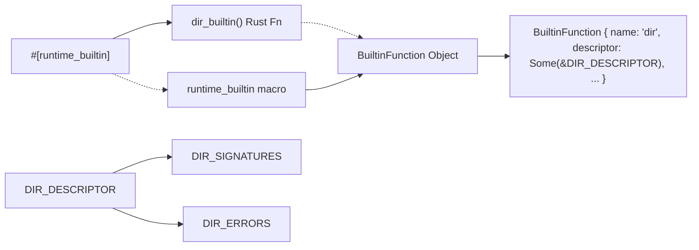

# BuiltinDescriptor Metadata & LSP Integration

<details>
<summary>Relevant source files</summary>

- [crates/runmat-builtins/tests/registry.rs](https://github.com/runmat-org/runmat/blob/82685330/crates/runmat-builtins/tests/registry.rs)
- [crates/runmat-lsp/src/core/analysis.rs](https://github.com/runmat-org/runmat/blob/82685330/crates/runmat-lsp/src/core/analysis.rs)
- [crates/runmat-macros/tests/basic.rs](https://github.com/runmat-org/runmat/blob/82685330/crates/runmat-macros/tests/basic.rs)
- [crates/runmat-macros/tests/multi.rs](https://github.com/runmat-org/runmat/blob/82685330/crates/runmat-macros/tests/multi.rs)
- [crates/runmat-macros/tests/ui/fail_bad_sig.rs](https://github.com/runmat-org/runmat/blob/82685330/crates/runmat-macros/tests/ui/fail_bad_sig.rs)
- [crates/runmat-macros/tests/ui/fail_bad_sig.stderr](https://github.com/runmat-org/runmat/blob/82685330/crates/runmat-macros/tests/ui/fail_bad_sig.stderr)
- [crates/runmat-macros/tests/ui/fail_non_string.rs](https://github.com/runmat-org/runmat/blob/82685330/crates/runmat-macros/tests/ui/fail_non_string.rs)
- [crates/runmat-macros/tests/ui/fail_non_string.stderr](https://github.com/runmat-org/runmat/blob/82685330/crates/runmat-macros/tests/ui/fail_non_string.stderr)
- [crates/runmat-runtime-integration-tests/tests/dispatcher.rs](https://github.com/runmat-org/runmat/blob/82685330/crates/runmat-runtime-integration-tests/tests/dispatcher.rs)
- [crates/runmat-runtime/src/builtins/array/sorting_sets/argsort.rs](https://github.com/runmat-org/runmat/blob/82685330/crates/runmat-runtime/src/builtins/array/sorting_sets/argsort.rs)
- [crates/runmat-runtime/src/builtins/array/sorting_sets/issorted.rs](https://github.com/runmat-org/runmat/blob/82685330/crates/runmat-runtime/src/builtins/array/sorting_sets/issorted.rs)
- [crates/runmat-runtime/src/builtins/array/sorting_sets/sort.rs](https://github.com/runmat-org/runmat/blob/82685330/crates/runmat-runtime/src/builtins/array/sorting_sets/sort.rs)
- [crates/runmat-runtime/src/builtins/io/filetext/fprintf.rs](https://github.com/runmat-org/runmat/blob/82685330/crates/runmat-runtime/src/builtins/io/filetext/fprintf.rs)
- [crates/runmat-runtime/src/builtins/io/repl_fs/cd.rs](https://github.com/runmat-org/runmat/blob/82685330/crates/runmat-runtime/src/builtins/io/repl_fs/cd.rs)
- [crates/runmat-runtime/src/builtins/io/repl_fs/dir.rs](https://github.com/runmat-org/runmat/blob/82685330/crates/runmat-runtime/src/builtins/io/repl_fs/dir.rs)
- [crates/runmat-runtime/src/builtins/io/repl_fs/ls.rs](https://github.com/runmat-org/runmat/blob/82685330/crates/runmat-runtime/src/builtins/io/repl_fs/ls.rs)
- [crates/runmat-runtime/src/builtins/io/repl_fs/path.rs](https://github.com/runmat-org/runmat/blob/82685330/crates/runmat-runtime/src/builtins/io/repl_fs/path.rs)
- [crates/runmat-runtime/src/builtins/io/repl_fs/pwd.rs](https://github.com/runmat-org/runmat/blob/82685330/crates/runmat-runtime/src/builtins/io/repl_fs/pwd.rs)
- [crates/runmat-runtime/tests/descriptor_error_source_of_truth.rs](https://github.com/runmat-org/runmat/blob/82685330/crates/runmat-runtime/tests/descriptor_error_source_of_truth.rs)
- [docs-tmp/BUILTIN_METADATA_DELTA_PLAN.md](https://github.com/runmat-org/runmat/blob/82685330/docs-tmp/BUILTIN_METADATA_DELTA_PLAN.md?plain=1)
- [docs-tmp/BUILTIN_METADATA_DELTA_PROGRESS.md](https://github.com/runmat-org/runmat/blob/82685330/docs-tmp/BUILTIN_METADATA_DELTA_PROGRESS.md?plain=1)

</details>

The `BuiltinDescriptor` system provides a typed metadata framework for RunMat's 500+ built-in functions. It serves as the single source-of-truth for call signatures, parameter types, completion policies, and stable error identifiers. This system replaces heuristic documentation parsing with a first-class data model that enables high-fidelity LSP features such as signature help, hover documentation, and semantic validation.

## The BuiltinDescriptor Data Model

The core of the metadata system is the `BuiltinDescriptor` struct defined in `runmat-builtins`. It encapsulates the contract between the runtime implementation and the external tooling (LSP, documentation generators, and type resolvers).

### Key Structures

| Structure | Purpose |
| --- | --- |
| BuiltinDescriptor | Root container for a builtin's metadata, including overloads and errors. |
| BuiltinSignatureDescriptor | Represents a single valid calling form (overload) with its own inputs and outputs. |
| BuiltinParamDescriptor | Defines an individual parameter's name, type, arity, and default value. |
| BuiltinErrorDescriptor | Defines stable error codes and messages to ensure consistency across the runtime. |

### Descriptor Implementation Example

Builtins define their descriptors as `static` constants, often using shared profile helpers to reduce boilerplate.

```
// Example from crates/runmat-runtime/src/builtins/io/repl_fs/dir.rspub const DIR_DESCRIPTOR: BuiltinDescriptor = BuiltinDescriptor {    signatures: &DIR_SIGNATURES,    output_mode: BuiltinOutputMode::Fixed,    completion_policy: BuiltinCompletionPolicy::Public,    errors: &DIR_ERRORS,};
```

Sources: [docs-tmp/BUILTIN_METADATA_DELTA_PLAN.md #110-154](https://github.com/runmat-org/runmat/blob/82685330/docs-tmp/BUILTIN_METADATA_DELTA_PLAN.md?plain=1#L110-L154) [crates/runmat-runtime/src/builtins/io/repl_fs/dir.rs #145-150](https://github.com/runmat-org/runmat/blob/82685330/crates/runmat-runtime/src/builtins/io/repl_fs/dir.rs#L145-L150)

## Macro Integration & Source-of-Truth

The `runtime_builtin` proc-macro in `runmat-macros` bridges the gap between the Rust implementation and the metadata registry. By attaching a `descriptor` path to the macro attribute, the system ensures that metadata is registered alongside the function pointer at initialization.

### Source-of-Truth Enforcement

To prevent "identifier drift," RunMat enforces a strict policy where error messages and identifiers must be authored once within the `BuiltinErrorDescriptor` rows. Standalone constants for error strings are forbidden in migrated files.

- Registration: The macro takes the `descriptor(path::TO_DESCRIPTOR)` argument [crates/runmat-runtime/src/builtins/io/repl_fs/dir.rs #185](https://github.com/runmat-org/runmat/blob/82685330/crates/runmat-runtime/src/builtins/io/repl_fs/dir.rs#L185-L185)
- Validation: A specialized test suite `migrated_builtin_files_do_not_duplicate_stable_error_constants` scans the codebase to ensure error strings are not duplicated outside of descriptors [crates/runmat-runtime/tests/descriptor_error_source_of_truth.rs #41-168](https://github.com/runmat-org/runmat/blob/82685330/crates/runmat-runtime/tests/descriptor_error_source_of_truth.rs#L41-L168)

### Builtin Registration Flow

This diagram illustrates how a developer's declaration in "Natural Language/Doc Space" is transformed into "Code Entity Space" via the macro system.

Builtin Registration & Metadata Binding



<details>
<summary>Rendered SVG</summary>

```svg
<svg id="mermaid-tkf0lxaxzi" xmlns="http://www.w3.org/2000/svg" xmlns:xlink="http://www.w3.org/1999/xlink" class="flowchart" style="max-width: 100%; touch-action: none; user-select: none; cursor: grab; min-height: fit-content; max-height: 100%;" viewBox="-0.004993679894596426 0 1176.4513936097892 676" role="graphics-document document" aria-roledescription="flowchart-v2" preserveAspectRatio="xMidYMid meet"><style>#mermaid-tkf0lxaxzi{font-family:ui-sans-serif,-apple-system,system-ui,Segoe UI,Helvetica;font-size:16px;fill:#ccc;}@keyframes edge-animation-frame{from{stroke-dashoffset:0;}}@keyframes dash{to{stroke-dashoffset:0;}}#mermaid-tkf0lxaxzi .edge-animation-slow{stroke-dasharray:9,5!important;stroke-dashoffset:900;animation:dash 50s linear infinite;stroke-linecap:round;}#mermaid-tkf0lxaxzi .edge-animation-fast{stroke-dasharray:9,5!important;stroke-dashoffset:900;animation:dash 20s linear infinite;stroke-linecap:round;}#mermaid-tkf0lxaxzi .error-icon{fill:#333;}#mermaid-tkf0lxaxzi .error-text{fill:#cccccc;stroke:#cccccc;}#mermaid-tkf0lxaxzi .edge-thickness-normal{stroke-width:1px;}#mermaid-tkf0lxaxzi .edge-thickness-thick{stroke-width:3.5px;}#mermaid-tkf0lxaxzi .edge-pattern-solid{stroke-dasharray:0;}#mermaid-tkf0lxaxzi .edge-thickness-invisible{stroke-width:0;fill:none;}#mermaid-tkf0lxaxzi .edge-pattern-dashed{stroke-dasharray:3;}#mermaid-tkf0lxaxzi .edge-pattern-dotted{stroke-dasharray:2;}#mermaid-tkf0lxaxzi .marker{fill:#666;stroke:#666;}#mermaid-tkf0lxaxzi .marker.cross{stroke:#666;}#mermaid-tkf0lxaxzi svg{font-family:ui-sans-serif,-apple-system,system-ui,Segoe UI,Helvetica;font-size:16px;}#mermaid-tkf0lxaxzi p{margin:0;}#mermaid-tkf0lxaxzi .label{font-family:ui-sans-serif,-apple-system,system-ui,Segoe UI,Helvetica;color:#fff;}#mermaid-tkf0lxaxzi .cluster-label text{fill:#fff;}#mermaid-tkf0lxaxzi .cluster-label span{color:#fff;}#mermaid-tkf0lxaxzi .cluster-label span p{background-color:transparent;}#mermaid-tkf0lxaxzi .label text,#mermaid-tkf0lxaxzi span{fill:#fff;color:#fff;}#mermaid-tkf0lxaxzi .node rect,#mermaid-tkf0lxaxzi .node circle,#mermaid-tkf0lxaxzi .node ellipse,#mermaid-tkf0lxaxzi .node polygon,#mermaid-tkf0lxaxzi .node path{fill:#111;stroke:#222;stroke-width:1px;}#mermaid-tkf0lxaxzi .rough-node .label text,#mermaid-tkf0lxaxzi .node .label text,#mermaid-tkf0lxaxzi .image-shape .label,#mermaid-tkf0lxaxzi .icon-shape .label{text-anchor:middle;}#mermaid-tkf0lxaxzi .node .katex path{fill:#000;stroke:#000;stroke-width:1px;}#mermaid-tkf0lxaxzi .rough-node .label,#mermaid-tkf0lxaxzi .node .label,#mermaid-tkf0lxaxzi .image-shape .label,#mermaid-tkf0lxaxzi .icon-shape .label{text-align:center;}#mermaid-tkf0lxaxzi .node.clickable{cursor:pointer;}#mermaid-tkf0lxaxzi .root .anchor path{fill:#666!important;stroke-width:0;stroke:#666;}#mermaid-tkf0lxaxzi .arrowheadPath{fill:#0b0b0b;}#mermaid-tkf0lxaxzi .edgePath .path{stroke:#666;stroke-width:1px;}#mermaid-tkf0lxaxzi .flowchart-link{stroke:#666;fill:none;}#mermaid-tkf0lxaxzi .edgeLabel{background-color:#161616;text-align:center;}#mermaid-tkf0lxaxzi .edgeLabel p{background-color:#161616;}#mermaid-tkf0lxaxzi .edgeLabel rect{opacity:0.5;background-color:#161616;fill:#161616;}#mermaid-tkf0lxaxzi .labelBkg{background-color:rgba(22, 22, 22, 0.5);}#mermaid-tkf0lxaxzi .cluster rect{fill:#161616;stroke:#222;stroke-width:1px;}#mermaid-tkf0lxaxzi .cluster text{fill:#fff;}#mermaid-tkf0lxaxzi .cluster span{color:#fff;}#mermaid-tkf0lxaxzi div.mermaidTooltip{position:absolute;text-align:center;max-width:200px;padding:2px;font-family:ui-sans-serif,-apple-system,system-ui,Segoe UI,Helvetica;font-size:12px;background:#333;border:1px solid hsl(0, 0%, 10%);border-radius:2px;pointer-events:none;z-index:100;}#mermaid-tkf0lxaxzi .flowchartTitleText{text-anchor:middle;font-size:18px;fill:#ccc;}#mermaid-tkf0lxaxzi rect.text{fill:none;stroke-width:0;}#mermaid-tkf0lxaxzi .icon-shape,#mermaid-tkf0lxaxzi .image-shape{background-color:#161616;text-align:center;}#mermaid-tkf0lxaxzi .icon-shape p,#mermaid-tkf0lxaxzi .image-shape p{background-color:#161616;padding:2px;}#mermaid-tkf0lxaxzi .icon-shape .label rect,#mermaid-tkf0lxaxzi .image-shape .label rect{opacity:0.5;background-color:#161616;fill:#161616;}#mermaid-tkf0lxaxzi .label-icon{display:inline-block;height:1em;overflow:visible;vertical-align:-0.125em;}#mermaid-tkf0lxaxzi .node .label-icon path{fill:currentColor;stroke:revert;stroke-width:revert;}#mermaid-tkf0lxaxzi .node .neo-node{stroke:#222;}#mermaid-tkf0lxaxzi [data-look="neo"].node rect,#mermaid-tkf0lxaxzi [data-look="neo"].cluster rect,#mermaid-tkf0lxaxzi [data-look="neo"].node polygon{stroke:url(#mermaid-tkf0lxaxzi-gradient);filter:drop-shadow( 1px 2px 2px rgba(185,185,185,1));}#mermaid-tkf0lxaxzi [data-look="neo"].node path{stroke:url(#mermaid-tkf0lxaxzi-gradient);stroke-width:1px;}#mermaid-tkf0lxaxzi [data-look="neo"].node .outer-path{filter:drop-shadow( 1px 2px 2px rgba(185,185,185,1));}#mermaid-tkf0lxaxzi [data-look="neo"].node .neo-line path{stroke:#222;filter:none;}#mermaid-tkf0lxaxzi [data-look="neo"].node circle{stroke:url(#mermaid-tkf0lxaxzi-gradient);filter:drop-shadow( 1px 2px 2px rgba(185,185,185,1));}#mermaid-tkf0lxaxzi [data-look="neo"].node circle .state-start{fill:#000000;}#mermaid-tkf0lxaxzi [data-look="neo"].icon-shape .icon{fill:url(#mermaid-tkf0lxaxzi-gradient);filter:drop-shadow( 1px 2px 2px rgba(185,185,185,1));}#mermaid-tkf0lxaxzi [data-look="neo"].icon-shape .icon-neo path{stroke:url(#mermaid-tkf0lxaxzi-gradient);filter:drop-shadow( 1px 2px 2px rgba(185,185,185,1));}#mermaid-tkf0lxaxzi :root{--mermaid-font-family:"trebuchet ms",verdana,arial,sans-serif;}</style><g><marker id="mermaid-tkf0lxaxzi_flowchart-v2-pointEnd" class="marker flowchart-v2" viewBox="0 0 10 10" refX="5" refY="5" markerUnits="userSpaceOnUse" markerWidth="8" markerHeight="8" orient="auto"><path d="M 0 0 L 10 5 L 0 10 z" class="arrowMarkerPath" style="stroke-width: 1; stroke-dasharray: 1, 0;"></path></marker><marker id="mermaid-tkf0lxaxzi_flowchart-v2-pointStart" class="marker flowchart-v2" viewBox="0 0 10 10" refX="4.5" refY="5" markerUnits="userSpaceOnUse" markerWidth="8" markerHeight="8" orient="auto"><path d="M 0 5 L 10 10 L 10 0 z" class="arrowMarkerPath" style="stroke-width: 1; stroke-dasharray: 1, 0;"></path></marker><marker id="mermaid-tkf0lxaxzi_flowchart-v2-pointEnd-margin" class="marker flowchart-v2" viewBox="0 0 11.5 14" refX="11.5" refY="7" markerUnits="userSpaceOnUse" markerWidth="10.5" markerHeight="14" orient="auto"><path d="M 0 0 L 11.5 7 L 0 14 z" class="arrowMarkerPath" style="stroke-width: 0; stroke-dasharray: 1, 0;"></path></marker><marker id="mermaid-tkf0lxaxzi_flowchart-v2-pointStart-margin" class="marker flowchart-v2" viewBox="0 0 11.5 14" refX="1" refY="7" markerUnits="userSpaceOnUse" markerWidth="11.5" markerHeight="14" orient="auto"><polygon points="0,7 11.5,14 11.5,0" class="arrowMarkerPath" style="stroke-width: 0; stroke-dasharray: 1, 0;"></polygon></marker><marker id="mermaid-tkf0lxaxzi_flowchart-v2-circleEnd" class="marker flowchart-v2" viewBox="0 0 10 10" refX="11" refY="5" markerUnits="userSpaceOnUse" markerWidth="11" markerHeight="11" orient="auto"><circle cx="5" cy="5" r="5" class="arrowMarkerPath" style="stroke-width: 1; stroke-dasharray: 1, 0;"></circle></marker><marker id="mermaid-tkf0lxaxzi_flowchart-v2-circleStart" class="marker flowchart-v2" viewBox="0 0 10 10" refX="-1" refY="5" markerUnits="userSpaceOnUse" markerWidth="11" markerHeight="11" orient="auto"><circle cx="5" cy="5" r="5" class="arrowMarkerPath" style="stroke-width: 1; stroke-dasharray: 1, 0;"></circle></marker><marker id="mermaid-tkf0lxaxzi_flowchart-v2-circleEnd-margin" class="marker flowchart-v2" viewBox="0 0 10 10" refY="5" refX="12.25" markerUnits="userSpaceOnUse" markerWidth="14" markerHeight="14" orient="auto"><circle cx="5" cy="5" r="5" class="arrowMarkerPath" style="stroke-width: 0; stroke-dasharray: 1, 0;"></circle></marker><marker id="mermaid-tkf0lxaxzi_flowchart-v2-circleStart-margin" class="marker flowchart-v2" viewBox="0 0 10 10" refX="-2" refY="5" markerUnits="userSpaceOnUse" markerWidth="14" markerHeight="14" orient="auto"><circle cx="5" cy="5" r="5" class="arrowMarkerPath" style="stroke-width: 0; stroke-dasharray: 1, 0;"></circle></marker><marker id="mermaid-tkf0lxaxzi_flowchart-v2-crossEnd" class="marker cross flowchart-v2" viewBox="0 0 11 11" refX="12" refY="5.2" markerUnits="userSpaceOnUse" markerWidth="11" markerHeight="11" orient="auto"><path d="M 1,1 l 9,9 M 10,1 l -9,9" class="arrowMarkerPath" style="stroke-width: 2; stroke-dasharray: 1, 0;"></path></marker><marker id="mermaid-tkf0lxaxzi_flowchart-v2-crossStart" class="marker cross flowchart-v2" viewBox="0 0 11 11" refX="-1" refY="5.2" markerUnits="userSpaceOnUse" markerWidth="11" markerHeight="11" orient="auto"><path d="M 1,1 l 9,9 M 10,1 l -9,9" class="arrowMarkerPath" style="stroke-width: 2; stroke-dasharray: 1, 0;"></path></marker><marker id="mermaid-tkf0lxaxzi_flowchart-v2-crossEnd-margin" class="marker cross flowchart-v2" viewBox="0 0 15 15" refX="17.7" refY="7.5" markerUnits="userSpaceOnUse" markerWidth="12" markerHeight="12" orient="auto"><path d="M 1,1 L 14,14 M 1,14 L 14,1" class="arrowMarkerPath" style="stroke-width: 2.5;"></path></marker><marker id="mermaid-tkf0lxaxzi_flowchart-v2-crossStart-margin" class="marker cross flowchart-v2" viewBox="0 0 15 15" refX="-3.5" refY="7.5" markerUnits="userSpaceOnUse" markerWidth="12" markerHeight="12" orient="auto"><path d="M 1,1 L 14,14 M 1,14 L 14,1" class="arrowMarkerPath" style="stroke-width: 2.5; stroke-dasharray: 1, 0;"></path></marker><g class="root"><g class="clusters"><g class="cluster" id="mermaid-tkf0lxaxzi-subGraph2" data-look="classic"><rect style="" x="40.59765625" y="492" width="334.234375" height="176"></rect><g class="cluster-label" transform="translate(90.04296875, 492)"><foreignObject width="235.34375" height="24"><div style="display: table-cell; white-space: nowrap; line-height: 1.5;" xmlns="http://www.w3.org/1999/xhtml"><span class="nodeLabel"><p>runmat-builtins (Registry Space)</p></span></div></foreignObject></g></g><g class="cluster" id="mermaid-tkf0lxaxzi-subGraph1" data-look="classic"><rect style="" x="8" y="161" width="344.83984375" height="257"></rect><g class="cluster-label" transform="translate(48.865234375, 161)"><foreignObject width="263.109375" height="24"><div style="display: table-cell; white-space: nowrap; line-height: 1.5;" xmlns="http://www.w3.org/1999/xhtml"><span class="nodeLabel"><p>runmat-macros (Proc-Macro Space)</p></span></div></foreignObject></g></g><g class="cluster" id="mermaid-tkf0lxaxzi-subGraph0" data-look="classic"><rect style="" x="372.83984375" y="8" width="795.6015625" height="257"></rect><g class="cluster-label" transform="translate(642.203125, 8)"><foreignObject width="256.875" height="24"><div style="display: table-cell; white-space: nowrap; line-height: 1.5;" xmlns="http://www.w3.org/1999/xhtml"><span class="nodeLabel"><p>Developer Definition (Source Code)</p></span></div></foreignObject></g></g></g><g class="edgePaths"><path d="M539.197,87L545.395,93.167C551.594,99.333,563.99,111.667,570.188,124C576.387,136.333,576.387,148.667,576.387,158.333C576.387,168,576.387,175,576.387,178.5L576.387,182" id="mermaid-tkf0lxaxzi-L_A_B_0" class="edge-thickness-normal edge-pattern-solid edge-thickness-normal edge-pattern-solid flowchart-link" style=";" data-edge="true" data-et="edge" data-id="L_A_B_0" data-points="W3sieCI6NTM5LjE5NzAyMTQ4NDM3NSwieSI6ODd9LHsieCI6NTc2LjM4NjcxODc1LCJ5IjoxMjR9LHsieCI6NTc2LjM4NjcxODc1LCJ5IjoxNjF9LHsieCI6NTc2LjM4NjcxODc1LCJ5IjoxODZ9XQ==" data-look="classic" marker-end="url(#mermaid-tkf0lxaxzi_flowchart-v2-pointEnd)"></path><path d="M887.605,87L876.833,93.167C866.061,99.333,844.517,111.667,833.745,124C822.973,136.333,822.973,148.667,822.973,158.333C822.973,168,822.973,175,822.973,178.5L822.973,182" id="mermaid-tkf0lxaxzi-L_C_D_0" class="edge-thickness-normal edge-pattern-solid edge-thickness-normal edge-pattern-solid flowchart-link" style=";" data-edge="true" data-et="edge" data-id="L_C_D_0" data-points="W3sieCI6ODg3LjYwNTIyNDYwOTM3NSwieSI6ODd9LHsieCI6ODIyLjk3MjY1NjI1LCJ5IjoxMjR9LHsieCI6ODIyLjk3MjY1NjI1LCJ5IjoxNjF9LHsieCI6ODIyLjk3MjY1NjI1LCJ5IjoxODZ9XQ==" data-look="classic" marker-end="url(#mermaid-tkf0lxaxzi_flowchart-v2-pointEnd)"></path><path d="M981.934,87L992.706,93.167C1003.478,99.333,1025.022,111.667,1035.794,124C1046.566,136.333,1046.566,148.667,1046.566,158.333C1046.566,168,1046.566,175,1046.566,178.5L1046.566,182" id="mermaid-tkf0lxaxzi-L_C_E_0" class="edge-thickness-normal edge-pattern-solid edge-thickness-normal edge-pattern-solid flowchart-link" style=";" data-edge="true" data-et="edge" data-id="L_C_E_0" data-points="W3sieCI6OTgxLjkzMzgzNzg5MDYyNSwieSI6ODd9LHsieCI6MTA0Ni41NjY0MDYyNSwieSI6MTI0fSx7IngiOjEwNDYuNTY2NDA2MjUsInkiOjE2MX0seyJ4IjoxMDQ2LjU2NjQwNjI1LCJ5IjoxODZ9XQ==" data-look="classic" marker-end="url(#mermaid-tkf0lxaxzi_flowchart-v2-pointEnd)"></path><path d="M152.523,240L152.523,244.167C152.523,248.333,152.523,256.667,152.523,267C152.523,277.333,152.523,289.667,157.406,301.495C162.289,313.324,172.054,324.647,176.936,330.309L181.819,335.971" id="mermaid-tkf0lxaxzi-L_F_G_0" class="edge-thickness-normal edge-pattern-solid edge-thickness-normal edge-pattern-solid flowchart-link" style=";" data-edge="true" data-et="edge" data-id="L_F_G_0" data-points="W3sieCI6MTUyLjUyMzQzNzUsInkiOjI0MH0seyJ4IjoxNTIuNTIzNDM3NSwieSI6MjY1fSx7IngiOjE1Mi41MjM0Mzc1LCJ5IjozMDJ9LHsieCI6MTg0LjQzMDk2OTIzODI4MTI1LCJ5IjozMzl9XQ==" data-look="classic" marker-end="url(#mermaid-tkf0lxaxzi_flowchart-v2-pointEnd)"></path><path d="M207.715,393L207.715,397.167C207.715,401.333,207.715,409.667,207.715,420C207.715,430.333,207.715,442.667,207.715,455C207.715,467.333,207.715,479.667,207.715,489.333C207.715,499,207.715,506,207.715,509.5L207.715,513" id="mermaid-tkf0lxaxzi-L_G_H_0" class="edge-thickness-normal edge-pattern-solid edge-thickness-normal edge-pattern-solid flowchart-link" style=";" data-edge="true" data-et="edge" data-id="L_G_H_0" data-points="W3sieCI6MjA3LjcxNDg0Mzc1LCJ5IjozOTN9LHsieCI6MjA3LjcxNDg0Mzc1LCJ5Ijo0MTh9LHsieCI6MjA3LjcxNDg0Mzc1LCJ5Ijo0NTV9LHsieCI6MjA3LjcxNDg0Mzc1LCJ5Ijo0OTJ9LHsieCI6MjA3LjcxNDg0Mzc1LCJ5Ijo1MTd9XQ==" data-look="classic" marker-end="url(#mermaid-tkf0lxaxzi_flowchart-v2-pointEnd)"></path><path d="M484.92,87L478.722,93.167C472.524,99.333,460.127,111.667,453.929,124C447.73,136.333,447.73,148.667,417.34,160.187C386.949,171.707,326.167,182.413,295.776,187.766L265.385,193.12" id="mermaid-tkf0lxaxzi-L_A_F_0" class="edge-thickness-normal edge-pattern-dotted edge-thickness-normal edge-pattern-solid flowchart-link" style=";" data-edge="true" data-et="edge" data-id="L_A_F_0" data-points="W3sieCI6NDg0LjkyMDE2NjAxNTYyNSwieSI6ODd9LHsieCI6NDQ3LjczMDQ2ODc1LCJ5IjoxMjR9LHsieCI6NDQ3LjczMDQ2ODc1LCJ5IjoxNjF9LHsieCI6MjYxLjQ0NTMxMjUsInkiOjE5My44MTM2NzY4NDIyNTg0N31d" data-look="classic" marker-end="url(#mermaid-tkf0lxaxzi_flowchart-v2-pointEnd)"></path><path d="M576.387,240L576.387,244.167C576.387,248.333,576.387,256.667,525.368,267C474.35,277.333,372.314,289.667,315.733,301.523C259.153,313.38,248.029,324.76,242.467,330.45L236.905,336.14" id="mermaid-tkf0lxaxzi-L_B_G_0" class="edge-thickness-normal edge-pattern-dotted edge-thickness-normal edge-pattern-solid flowchart-link" style=";" data-edge="true" data-et="edge" data-id="L_B_G_0" data-points="W3sieCI6NTc2LjM4NjcxODc1LCJ5IjoyNDB9LHsieCI6NTc2LjM4NjcxODc1LCJ5IjoyNjV9LHsieCI6MjcwLjI3NzM0Mzc1LCJ5IjozMDJ9LHsieCI6MjM0LjEwODM5ODQzNzUsInkiOjMzOX1d" data-look="classic" marker-end="url(#mermaid-tkf0lxaxzi_flowchart-v2-pointEnd)"></path></g><g class="edgeLabels"><g class="edgeLabel" transform="translate(576.38671875, 124)"><g class="label" data-id="L_A_B_0" transform="translate(-108.65625, -12)"><foreignObject width="217.3125" height="24"><div style="display: table; white-space: break-spaces; line-height: 1.5; max-width: 200px; text-align: center; width: 200px;" xmlns="http://www.w3.org/1999/xhtml" class="labelBkg"><span class="edgeLabel"><p>descriptor(DIR_DESCRIPTOR)</p></span></div></foreignObject></g></g><g class="edgeLabel" transform="translate(822.97265625, 124)"><g class="label" data-id="L_C_D_0" transform="translate(-30.7734375, -12)"><foreignObject width="61.546875" height="24"><div style="display: table-cell; white-space: nowrap; line-height: 1.5; max-width: 200px; text-align: center;" xmlns="http://www.w3.org/1999/xhtml" class="labelBkg"><span class="edgeLabel"><p>contains</p></span></div></foreignObject></g></g><g class="edgeLabel" transform="translate(1046.56640625, 124)"><g class="label" data-id="L_C_E_0" transform="translate(-30.7734375, -12)"><foreignObject width="61.546875" height="24"><div style="display: table-cell; white-space: nowrap; line-height: 1.5; max-width: 200px; text-align: center;" xmlns="http://www.w3.org/1999/xhtml" class="labelBkg"><span class="edgeLabel"><p>contains</p></span></div></foreignObject></g></g><g class="edgeLabel" transform="translate(152.5234375, 302)"><g class="label" data-id="L_F_G_0" transform="translate(-90.3828125, -12)"><foreignObject width="180.765625" height="24"><div style="display: table-cell; white-space: nowrap; line-height: 1.5; max-width: 200px; text-align: center;" xmlns="http://www.w3.org/1999/xhtml" class="labelBkg"><span class="edgeLabel"><p>Generates Registry Entry</p></span></div></foreignObject></g></g><g class="edgeLabel" transform="translate(207.71484375, 455)"><g class="label" data-id="L_G_H_0" transform="translate(-29.1796875, -12)"><foreignObject width="58.359375" height="24"><div style="display: table-cell; white-space: nowrap; line-height: 1.5; max-width: 200px; text-align: center;" xmlns="http://www.w3.org/1999/xhtml" class="labelBkg"><span class="edgeLabel"><p>maps to</p></span></div></foreignObject></g></g><g class="edgeLabel"><g class="label" data-id="L_A_F_0" transform="translate(0, 0)"><foreignObject width="0" height="0"><div style="display: table-cell; white-space: nowrap; line-height: 1.5; max-width: 200px; text-align: center;" xmlns="http://www.w3.org/1999/xhtml" class="labelBkg"><span class="edgeLabel"></span></div></foreignObject></g></g><g class="edgeLabel"><g class="label" data-id="L_B_G_0" transform="translate(0, 0)"><foreignObject width="0" height="0"><div style="display: table-cell; white-space: nowrap; line-height: 1.5; max-width: 200px; text-align: center;" xmlns="http://www.w3.org/1999/xhtml" class="labelBkg"><span class="edgeLabel"></span></div></foreignObject></g></g></g><g class="nodes"><g class="node default" id="mermaid-tkf0lxaxzi-flowchart-A-0" data-look="classic" transform="translate(512.05859375, 60)"><rect class="basic label-container" style="" x="-94.78125" y="-27" width="189.5625" height="54"></rect><g class="label" style="" transform="translate(-64.78125, -12)"><rect></rect><foreignObject width="129.5625" height="24"><div style="display: table-cell; white-space: nowrap; line-height: 1.5; max-width: 200px; text-align: center;" xmlns="http://www.w3.org/1999/xhtml"><span class="nodeLabel"><p>#[runtime_builtin]</p></span></div></foreignObject></g></g><g class="node default" id="mermaid-tkf0lxaxzi-flowchart-B-1" data-look="classic" transform="translate(576.38671875, 213)"><rect class="basic label-container" style="" x="-100.9921875" y="-27" width="201.984375" height="54"></rect><g class="label" style="" transform="translate(-70.9921875, -12)"><rect></rect><foreignObject width="141.984375" height="24"><div style="display: table-cell; white-space: nowrap; line-height: 1.5; max-width: 200px; text-align: center;" xmlns="http://www.w3.org/1999/xhtml"><span class="nodeLabel"><p>dir_builtin() Rust Fn</p></span></div></foreignObject></g></g><g class="node default" id="mermaid-tkf0lxaxzi-flowchart-C-2" data-look="classic" transform="translate(934.76953125, 60)"><rect class="basic label-container" style="" x="-95.75" y="-27" width="191.5" height="54"></rect><g class="label" style="" transform="translate(-65.75, -12)"><rect></rect><foreignObject width="131.5" height="24"><div style="display: table-cell; white-space: nowrap; line-height: 1.5; max-width: 200px; text-align: center;" xmlns="http://www.w3.org/1999/xhtml"><span class="nodeLabel"><p>DIR_DESCRIPTOR</p></span></div></foreignObject></g></g><g class="node default" id="mermaid-tkf0lxaxzi-flowchart-D-3" data-look="classic" transform="translate(822.97265625, 213)"><rect class="basic label-container" style="" x="-95.59375" y="-27" width="191.1875" height="54"></rect><g class="label" style="" transform="translate(-65.59375, -12)"><rect></rect><foreignObject width="131.1875" height="24"><div style="display: table-cell; white-space: nowrap; line-height: 1.5; max-width: 200px; text-align: center;" xmlns="http://www.w3.org/1999/xhtml"><span class="nodeLabel"><p>DIR_SIGNATURES</p></span></div></foreignObject></g></g><g class="node default" id="mermaid-tkf0lxaxzi-flowchart-E-5" data-look="classic" transform="translate(1046.56640625, 213)"><rect class="basic label-container" style="" x="-78" y="-27" width="156" height="54"></rect><g class="label" style="" transform="translate(-48, -12)"><rect></rect><foreignObject width="96" height="24"><div style="display: table-cell; white-space: nowrap; line-height: 1.5; max-width: 200px; text-align: center;" xmlns="http://www.w3.org/1999/xhtml"><span class="nodeLabel"><p>DIR_ERRORS</p></span></div></foreignObject></g></g><g class="node default" id="mermaid-tkf0lxaxzi-flowchart-F-6" data-look="classic" transform="translate(152.5234375, 213)"><rect class="basic label-container" style="" x="-108.921875" y="-27" width="217.84375" height="54"></rect><g class="label" style="" transform="translate(-78.921875, -12)"><rect></rect><foreignObject width="157.84375" height="24"><div style="display: table-cell; white-space: nowrap; line-height: 1.5; max-width: 200px; text-align: center;" xmlns="http://www.w3.org/1999/xhtml"><span class="nodeLabel"><p>runtime_builtin macro</p></span></div></foreignObject></g></g><g class="node default" id="mermaid-tkf0lxaxzi-flowchart-G-7" data-look="classic" transform="translate(207.71484375, 366)"><rect class="basic label-container" style="" x="-110.125" y="-27" width="220.25" height="54"></rect><g class="label" style="" transform="translate(-80.125, -12)"><rect></rect><foreignObject width="160.25" height="24"><div style="display: table-cell; white-space: nowrap; line-height: 1.5; max-width: 200px; text-align: center;" xmlns="http://www.w3.org/1999/xhtml"><span class="nodeLabel"><p>BuiltinFunction Object</p></span></div></foreignObject></g></g><g class="node default" id="mermaid-tkf0lxaxzi-flowchart-H-9" data-look="classic" transform="translate(207.71484375, 580)"><rect class="basic label-container" style="" x="-132.1171875" y="-63" width="264.234375" height="126"></rect><g class="label" style="" transform="translate(-102.1171875, -48)"><rect></rect><foreignObject width="204.234375" height="96"><div style="display: table; white-space: break-spaces; line-height: 1.5; max-width: 200px; text-align: center; width: 200px;" xmlns="http://www.w3.org/1999/xhtml"><span class="nodeLabel"><p>BuiltinFunction { name: 'dir', descriptor: Some(&amp;DIR_DESCRIPTOR), ... }</p></span></div></foreignObject></g></g></g></g></g><defs><filter id="mermaid-tkf0lxaxzi-drop-shadow" height="130%" width="130%"><feDropShadow dx="4" dy="4" stdDeviation="0" flood-opacity="0.06" flood-color="#000000"></feDropShadow></filter></defs><defs><filter id="mermaid-tkf0lxaxzi-drop-shadow-small" height="150%" width="150%"><feDropShadow dx="2" dy="2" stdDeviation="0" flood-opacity="0.06" flood-color="#000000"></feDropShadow></filter></defs><linearGradient id="mermaid-tkf0lxaxzi-gradient" gradientUnits="objectBoundingBox" x1="0%" y1="0%" x2="100%" y2="0%"><stop offset="0%" stop-color="#333" stop-opacity="1"></stop><stop offset="100%" stop-color="hsl(-120, 0%, 3.3333333333%)" stop-opacity="1"></stop></linearGradient></svg>
```

</details>

Sources: [crates/runmat-runtime/src/builtins/io/repl_fs/dir.rs #177-187](https://github.com/runmat-org/runmat/blob/82685330/crates/runmat-runtime/src/builtins/io/repl_fs/dir.rs#L177-L187) [docs-tmp/BUILTIN_METADATA_DELTA_PLAN.md #60-83](https://github.com/runmat-org/runmat/blob/82685330/docs-tmp/BUILTIN_METADATA_DELTA_PLAN.md?plain=1#L60-L83)

## LSP Integration: DocumentAnalysis

The `runmat-lsp` crate consumes these descriptors via the `DocumentAnalysis` pipeline. When a user interacts with a builtin in the editor, the LSP resolves the `BuiltinFunction` by name and extracts the typed metadata to provide context-aware assistance.

### 1. Signature Help

When a user types `dir(`, the LSP identifies the call at the current offset. It uses the `BuiltinDescriptor` to:

1. Identify all valid overloads (`BuiltinSignatureDescriptor`).
2. Determine the active parameter based on the comma count.
3. Highlight the `BuiltinParamDescriptor` currently being typed.

### 2. Hover Documentation

Hovering over a builtin name triggers `build_builtin_hover`. This function combines:

- The Typed Signature from the `BuiltinDescriptor`.
- The Summary and Category from the `BuiltinFunction` registration.
- Narrative Documentation (examples, FAQs) from the external `builtins-json` store.

### 3. Completion & Semantic Tokens

The `BuiltinCompletionPolicy` controls visibility in the IDE:

- `Public`: Standard user-facing functions.
- `HiddenInternal`: Functions used by the compiler or internal libraries, hidden from general completion.
- `MethodOnly`: Functions that should only appear during member access (e.g., `obj.method()`).

LSP Metadata Consumption Flow


<details>
<summary>Rendered SVG</summary>

```svg
<svg id="mermaid-mdfsbn1p0va" xmlns="http://www.w3.org/2000/svg" xmlns:xlink="http://www.w3.org/1999/xlink" class="flowchart" style="max-width: 100%; touch-action: none; user-select: none; cursor: grab; min-height: fit-content; max-height: 100%;" viewBox="-0.23266561297418775 0 2398.1528312259484 213" role="graphics-document document" aria-roledescription="flowchart-v2" preserveAspectRatio="xMidYMid meet"><style>#mermaid-mdfsbn1p0va{font-family:ui-sans-serif,-apple-system,system-ui,Segoe UI,Helvetica;font-size:16px;fill:#ccc;}@keyframes edge-animation-frame{from{stroke-dashoffset:0;}}@keyframes dash{to{stroke-dashoffset:0;}}#mermaid-mdfsbn1p0va .edge-animation-slow{stroke-dasharray:9,5!important;stroke-dashoffset:900;animation:dash 50s linear infinite;stroke-linecap:round;}#mermaid-mdfsbn1p0va .edge-animation-fast{stroke-dasharray:9,5!important;stroke-dashoffset:900;animation:dash 20s linear infinite;stroke-linecap:round;}#mermaid-mdfsbn1p0va .error-icon{fill:#333;}#mermaid-mdfsbn1p0va .error-text{fill:#cccccc;stroke:#cccccc;}#mermaid-mdfsbn1p0va .edge-thickness-normal{stroke-width:1px;}#mermaid-mdfsbn1p0va .edge-thickness-thick{stroke-width:3.5px;}#mermaid-mdfsbn1p0va .edge-pattern-solid{stroke-dasharray:0;}#mermaid-mdfsbn1p0va .edge-thickness-invisible{stroke-width:0;fill:none;}#mermaid-mdfsbn1p0va .edge-pattern-dashed{stroke-dasharray:3;}#mermaid-mdfsbn1p0va .edge-pattern-dotted{stroke-dasharray:2;}#mermaid-mdfsbn1p0va .marker{fill:#666;stroke:#666;}#mermaid-mdfsbn1p0va .marker.cross{stroke:#666;}#mermaid-mdfsbn1p0va svg{font-family:ui-sans-serif,-apple-system,system-ui,Segoe UI,Helvetica;font-size:16px;}#mermaid-mdfsbn1p0va p{margin:0;}#mermaid-mdfsbn1p0va .label{font-family:ui-sans-serif,-apple-system,system-ui,Segoe UI,Helvetica;color:#fff;}#mermaid-mdfsbn1p0va .cluster-label text{fill:#fff;}#mermaid-mdfsbn1p0va .cluster-label span{color:#fff;}#mermaid-mdfsbn1p0va .cluster-label span p{background-color:transparent;}#mermaid-mdfsbn1p0va .label text,#mermaid-mdfsbn1p0va span{fill:#fff;color:#fff;}#mermaid-mdfsbn1p0va .node rect,#mermaid-mdfsbn1p0va .node circle,#mermaid-mdfsbn1p0va .node ellipse,#mermaid-mdfsbn1p0va .node polygon,#mermaid-mdfsbn1p0va .node path{fill:#111;stroke:#222;stroke-width:1px;}#mermaid-mdfsbn1p0va .rough-node .label text,#mermaid-mdfsbn1p0va .node .label text,#mermaid-mdfsbn1p0va .image-shape .label,#mermaid-mdfsbn1p0va .icon-shape .label{text-anchor:middle;}#mermaid-mdfsbn1p0va .node .katex path{fill:#000;stroke:#000;stroke-width:1px;}#mermaid-mdfsbn1p0va .rough-node .label,#mermaid-mdfsbn1p0va .node .label,#mermaid-mdfsbn1p0va .image-shape .label,#mermaid-mdfsbn1p0va .icon-shape .label{text-align:center;}#mermaid-mdfsbn1p0va .node.clickable{cursor:pointer;}#mermaid-mdfsbn1p0va .root .anchor path{fill:#666!important;stroke-width:0;stroke:#666;}#mermaid-mdfsbn1p0va .arrowheadPath{fill:#0b0b0b;}#mermaid-mdfsbn1p0va .edgePath .path{stroke:#666;stroke-width:1px;}#mermaid-mdfsbn1p0va .flowchart-link{stroke:#666;fill:none;}#mermaid-mdfsbn1p0va .edgeLabel{background-color:#161616;text-align:center;}#mermaid-mdfsbn1p0va .edgeLabel p{background-color:#161616;}#mermaid-mdfsbn1p0va .edgeLabel rect{opacity:0.5;background-color:#161616;fill:#161616;}#mermaid-mdfsbn1p0va .labelBkg{background-color:rgba(22, 22, 22, 0.5);}#mermaid-mdfsbn1p0va .cluster rect{fill:#161616;stroke:#222;stroke-width:1px;}#mermaid-mdfsbn1p0va .cluster text{fill:#fff;}#mermaid-mdfsbn1p0va .cluster span{color:#fff;}#mermaid-mdfsbn1p0va div.mermaidTooltip{position:absolute;text-align:center;max-width:200px;padding:2px;font-family:ui-sans-serif,-apple-system,system-ui,Segoe UI,Helvetica;font-size:12px;background:#333;border:1px solid hsl(0, 0%, 10%);border-radius:2px;pointer-events:none;z-index:100;}#mermaid-mdfsbn1p0va .flowchartTitleText{text-anchor:middle;font-size:18px;fill:#ccc;}#mermaid-mdfsbn1p0va rect.text{fill:none;stroke-width:0;}#mermaid-mdfsbn1p0va .icon-shape,#mermaid-mdfsbn1p0va .image-shape{background-color:#161616;text-align:center;}#mermaid-mdfsbn1p0va .icon-shape p,#mermaid-mdfsbn1p0va .image-shape p{background-color:#161616;padding:2px;}#mermaid-mdfsbn1p0va .icon-shape .label rect,#mermaid-mdfsbn1p0va .image-shape .label rect{opacity:0.5;background-color:#161616;fill:#161616;}#mermaid-mdfsbn1p0va .label-icon{display:inline-block;height:1em;overflow:visible;vertical-align:-0.125em;}#mermaid-mdfsbn1p0va .node .label-icon path{fill:currentColor;stroke:revert;stroke-width:revert;}#mermaid-mdfsbn1p0va .node .neo-node{stroke:#222;}#mermaid-mdfsbn1p0va [data-look="neo"].node rect,#mermaid-mdfsbn1p0va [data-look="neo"].cluster rect,#mermaid-mdfsbn1p0va [data-look="neo"].node polygon{stroke:url(#mermaid-mdfsbn1p0va-gradient);filter:drop-shadow( 1px 2px 2px rgba(185,185,185,1));}#mermaid-mdfsbn1p0va [data-look="neo"].node path{stroke:url(#mermaid-mdfsbn1p0va-gradient);stroke-width:1px;}#mermaid-mdfsbn1p0va [data-look="neo"].node .outer-path{filter:drop-shadow( 1px 2px 2px rgba(185,185,185,1));}#mermaid-mdfsbn1p0va [data-look="neo"].node .neo-line path{stroke:#222;filter:none;}#mermaid-mdfsbn1p0va [data-look="neo"].node circle{stroke:url(#mermaid-mdfsbn1p0va-gradient);filter:drop-shadow( 1px 2px 2px rgba(185,185,185,1));}#mermaid-mdfsbn1p0va [data-look="neo"].node circle .state-start{fill:#000000;}#mermaid-mdfsbn1p0va [data-look="neo"].icon-shape .icon{fill:url(#mermaid-mdfsbn1p0va-gradient);filter:drop-shadow( 1px 2px 2px rgba(185,185,185,1));}#mermaid-mdfsbn1p0va [data-look="neo"].icon-shape .icon-neo path{stroke:url(#mermaid-mdfsbn1p0va-gradient);filter:drop-shadow( 1px 2px 2px rgba(185,185,185,1));}#mermaid-mdfsbn1p0va :root{--mermaid-font-family:"trebuchet ms",verdana,arial,sans-serif;}</style><g><marker id="mermaid-mdfsbn1p0va_flowchart-v2-pointEnd" class="marker flowchart-v2" viewBox="0 0 10 10" refX="5" refY="5" markerUnits="userSpaceOnUse" markerWidth="8" markerHeight="8" orient="auto"><path d="M 0 0 L 10 5 L 0 10 z" class="arrowMarkerPath" style="stroke-width: 1; stroke-dasharray: 1, 0;"></path></marker><marker id="mermaid-mdfsbn1p0va_flowchart-v2-pointStart" class="marker flowchart-v2" viewBox="0 0 10 10" refX="4.5" refY="5" markerUnits="userSpaceOnUse" markerWidth="8" markerHeight="8" orient="auto"><path d="M 0 5 L 10 10 L 10 0 z" class="arrowMarkerPath" style="stroke-width: 1; stroke-dasharray: 1, 0;"></path></marker><marker id="mermaid-mdfsbn1p0va_flowchart-v2-pointEnd-margin" class="marker flowchart-v2" viewBox="0 0 11.5 14" refX="11.5" refY="7" markerUnits="userSpaceOnUse" markerWidth="10.5" markerHeight="14" orient="auto"><path d="M 0 0 L 11.5 7 L 0 14 z" class="arrowMarkerPath" style="stroke-width: 0; stroke-dasharray: 1, 0;"></path></marker><marker id="mermaid-mdfsbn1p0va_flowchart-v2-pointStart-margin" class="marker flowchart-v2" viewBox="0 0 11.5 14" refX="1" refY="7" markerUnits="userSpaceOnUse" markerWidth="11.5" markerHeight="14" orient="auto"><polygon points="0,7 11.5,14 11.5,0" class="arrowMarkerPath" style="stroke-width: 0; stroke-dasharray: 1, 0;"></polygon></marker><marker id="mermaid-mdfsbn1p0va_flowchart-v2-circleEnd" class="marker flowchart-v2" viewBox="0 0 10 10" refX="11" refY="5" markerUnits="userSpaceOnUse" markerWidth="11" markerHeight="11" orient="auto"><circle cx="5" cy="5" r="5" class="arrowMarkerPath" style="stroke-width: 1; stroke-dasharray: 1, 0;"></circle></marker><marker id="mermaid-mdfsbn1p0va_flowchart-v2-circleStart" class="marker flowchart-v2" viewBox="0 0 10 10" refX="-1" refY="5" markerUnits="userSpaceOnUse" markerWidth="11" markerHeight="11" orient="auto"><circle cx="5" cy="5" r="5" class="arrowMarkerPath" style="stroke-width: 1; stroke-dasharray: 1, 0;"></circle></marker><marker id="mermaid-mdfsbn1p0va_flowchart-v2-circleEnd-margin" class="marker flowchart-v2" viewBox="0 0 10 10" refY="5" refX="12.25" markerUnits="userSpaceOnUse" markerWidth="14" markerHeight="14" orient="auto"><circle cx="5" cy="5" r="5" class="arrowMarkerPath" style="stroke-width: 0; stroke-dasharray: 1, 0;"></circle></marker><marker id="mermaid-mdfsbn1p0va_flowchart-v2-circleStart-margin" class="marker flowchart-v2" viewBox="0 0 10 10" refX="-2" refY="5" markerUnits="userSpaceOnUse" markerWidth="14" markerHeight="14" orient="auto"><circle cx="5" cy="5" r="5" class="arrowMarkerPath" style="stroke-width: 0; stroke-dasharray: 1, 0;"></circle></marker><marker id="mermaid-mdfsbn1p0va_flowchart-v2-crossEnd" class="marker cross flowchart-v2" viewBox="0 0 11 11" refX="12" refY="5.2" markerUnits="userSpaceOnUse" markerWidth="11" markerHeight="11" orient="auto"><path d="M 1,1 l 9,9 M 10,1 l -9,9" class="arrowMarkerPath" style="stroke-width: 2; stroke-dasharray: 1, 0;"></path></marker><marker id="mermaid-mdfsbn1p0va_flowchart-v2-crossStart" class="marker cross flowchart-v2" viewBox="0 0 11 11" refX="-1" refY="5.2" markerUnits="userSpaceOnUse" markerWidth="11" markerHeight="11" orient="auto"><path d="M 1,1 l 9,9 M 10,1 l -9,9" class="arrowMarkerPath" style="stroke-width: 2; stroke-dasharray: 1, 0;"></path></marker><marker id="mermaid-mdfsbn1p0va_flowchart-v2-crossEnd-margin" class="marker cross flowchart-v2" viewBox="0 0 15 15" refX="17.7" refY="7.5" markerUnits="userSpaceOnUse" markerWidth="12" markerHeight="12" orient="auto"><path d="M 1,1 L 14,14 M 1,14 L 14,1" class="arrowMarkerPath" style="stroke-width: 2.5;"></path></marker><marker id="mermaid-mdfsbn1p0va_flowchart-v2-crossStart-margin" class="marker cross flowchart-v2" viewBox="0 0 15 15" refX="-3.5" refY="7.5" markerUnits="userSpaceOnUse" markerWidth="12" markerHeight="12" orient="auto"><path d="M 1,1 L 14,14 M 1,14 L 14,1" class="arrowMarkerPath" style="stroke-width: 2.5; stroke-dasharray: 1, 0;"></path></marker><g class="root"><g class="clusters"><g class="cluster" id="mermaid-mdfsbn1p0va-subGraph2" data-look="classic"><rect style="" x="1531.953125" y="8" width="857.734375" height="197"></rect><g class="cluster-label" transform="translate(1886.4453125, 8)"><foreignObject width="148.75" height="24"><div style="display: table-cell; white-space: nowrap; line-height: 1.5;" xmlns="http://www.w3.org/1999/xhtml"><span class="nodeLabel"><p>Metadata Resolution</p></span></div></foreignObject></g></g><g class="cluster" id="mermaid-mdfsbn1p0va-subGraph1" data-look="classic"><rect style="" x="808.03125" y="8" width="622" height="124"></rect><g class="cluster-label" transform="translate(919.171875, 8)"><foreignObject width="399.71875" height="24"><div style="display: table-cell; white-space: nowrap; line-height: 1.5;" xmlns="http://www.w3.org/1999/xhtml"><span class="nodeLabel"><p>LSP Core Logic (crates/runmat-lsp/src/core/analysis.rs)</p></span></div></foreignObject></g></g><g class="cluster" id="mermaid-mdfsbn1p0va-subGraph0" data-look="classic"><rect style="" x="8" y="8" width="613.4375" height="197"></rect><g class="cluster-label" transform="translate(218.5, 8)"><foreignObject width="192.4375" height="24"><div style="display: table-cell; white-space: nowrap; line-height: 1.5;" xmlns="http://www.w3.org/1999/xhtml"><span class="nodeLabel"><p>LSP Request (User Action)</p></span></div></foreignObject></g></g></g><g class="edgePaths"><path d="M198.531,98.643L220.055,93.869C241.578,89.095,284.625,79.548,327.005,74.774C369.385,70,411.099,70,431.956,70L452.813,70" id="mermaid-mdfsbn1p0va-L_U_L_0" class="edge-thickness-normal edge-pattern-solid edge-thickness-normal edge-pattern-solid flowchart-link" style=";" data-edge="true" data-et="edge" data-id="L_U_L_0" data-points="W3sieCI6MTk4LjUzMTI1LCJ5Ijo5OC42NDI4OTkyNzczOTI3MX0seyJ4IjozMjcuNjcxODc1LCJ5Ijo3MH0seyJ4Ijo0NTYuODEyNSwieSI6NzB9XQ==" data-look="classic" marker-end="url(#mermaid-mdfsbn1p0va_flowchart-v2-pointEnd)"></path><path d="M596.438,70L600.604,70C604.771,70,613.104,70,632.82,70C652.536,70,683.635,70,714.734,70C745.833,70,776.932,70,795.982,70C815.031,70,822.031,70,825.531,70L829.031,70" id="mermaid-mdfsbn1p0va-L_L_DA_0" class="edge-thickness-normal edge-pattern-solid edge-thickness-normal edge-pattern-solid flowchart-link" style=";" data-edge="true" data-et="edge" data-id="L_L_DA_0" data-points="W3sieCI6NTk2LjQzNzUsInkiOjcwfSx7IngiOjYyMS40Mzc1LCJ5Ijo3MH0seyJ4Ijo3MTQuNzM0Mzc1LCJ5Ijo3MH0seyJ4Ijo4MDguMDMxMjUsInkiOjcwfSx7IngiOjgzMy4wMzEyNSwieSI6NzB9XQ==" data-look="classic" marker-end="url(#mermaid-mdfsbn1p0va_flowchart-v2-pointEnd)"></path><path d="M1027.766,70L1039.685,70C1051.604,70,1075.443,70,1098.615,70C1121.786,70,1144.292,70,1155.544,70L1166.797,70" id="mermaid-mdfsbn1p0va-L_DA_R_0" class="edge-thickness-normal edge-pattern-solid edge-thickness-normal edge-pattern-solid flowchart-link" style=";" data-edge="true" data-et="edge" data-id="L_DA_R_0" data-points="W3sieCI6MTAyNy43NjU2MjUsInkiOjcwfSx7IngiOjEwOTkuMjgxMjUsInkiOjcwfSx7IngiOjExNzAuNzk2ODc1LCJ5Ijo3MH1d" data-look="classic" marker-end="url(#mermaid-mdfsbn1p0va_flowchart-v2-pointEnd)"></path><path d="M1405.031,70L1409.198,70C1413.365,70,1421.698,70,1434.358,70C1447.018,70,1464.005,70,1480.992,70C1497.979,70,1514.966,70,1526.96,70C1538.953,70,1545.953,70,1549.453,70L1552.953,70" id="mermaid-mdfsbn1p0va-L_R_BF_0" class="edge-thickness-normal edge-pattern-solid edge-thickness-normal edge-pattern-solid flowchart-link" style=";" data-edge="true" data-et="edge" data-id="L_R_BF_0" data-points="W3sieCI6MTQwNS4wMzEyNSwieSI6NzB9LHsieCI6MTQzMC4wMzEyNSwieSI6NzB9LHsieCI6MTQ4MC45OTIxODc1LCJ5Ijo3MH0seyJ4IjoxNTMxLjk1MzEyNSwieSI6NzB9LHsieCI6MTU1Ni45NTMxMjUsInkiOjcwfV0=" data-look="classic" marker-end="url(#mermaid-mdfsbn1p0va_flowchart-v2-pointEnd)"></path><path d="M1752.281,70L1762.072,70C1771.862,70,1791.443,70,1810.357,70C1829.271,70,1847.518,70,1856.642,70L1865.766,70" id="mermaid-mdfsbn1p0va-L_BF_BD_0" class="edge-thickness-normal edge-pattern-solid edge-thickness-normal edge-pattern-solid flowchart-link" style=";" data-edge="true" data-et="edge" data-id="L_BF_BD_0" data-points="W3sieCI6MTc1Mi4yODEyNSwieSI6NzB9LHsieCI6MTgxMS4wMjM0Mzc1LCJ5Ijo3MH0seyJ4IjoxODY5Ljc2NTYyNSwieSI6NzB9XQ==" data-look="classic" marker-end="url(#mermaid-mdfsbn1p0va_flowchart-v2-pointEnd)"></path><path d="M2061.266,70L2070.618,70C2079.971,70,2098.677,70,2118.153,73.136C2137.628,76.272,2157.874,82.544,2167.997,85.68L2178.12,88.816" id="mermaid-mdfsbn1p0va-L_BD_SIG_0" class="edge-thickness-normal edge-pattern-solid edge-thickness-normal edge-pattern-solid flowchart-link" style=";" data-edge="true" data-et="edge" data-id="L_BD_SIG_0" data-points="W3sieCI6MjA2MS4yNjU2MjUsInkiOjcwfSx7IngiOjIxMTcuMzgyODEyNSwieSI6NzB9LHsieCI6MjE4MS45NDA2NTgyNDQ2ODEsInkiOjkwfV0=" data-look="classic" marker-end="url(#mermaid-mdfsbn1p0va_flowchart-v2-pointEnd)"></path><path d="M2181.941,144L2171.181,147.333C2160.421,150.667,2138.902,157.333,2102.831,160.667C2066.76,164,2016.138,164,1965.078,164C1914.018,164,1862.521,164,1810.704,164C1758.888,164,1706.753,164,1660.241,164C1613.729,164,1572.841,164,1543.904,164C1514.966,164,1497.979,164,1480.992,164C1464.005,164,1447.018,164,1414.839,164C1382.659,164,1335.286,164,1280.161,164C1225.036,164,1162.159,164,1102.573,164C1042.987,164,986.693,164,938.151,164C889.609,164,848.82,164,812.876,164C776.932,164,745.833,164,714.734,164C683.635,164,652.536,164,621.185,164C589.833,164,558.229,164,509.268,164C460.307,164,393.99,164,339.958,159.371C285.927,154.741,244.182,145.482,223.309,140.853L202.436,136.223" id="mermaid-mdfsbn1p0va-L_SIG_U_0" class="edge-thickness-normal edge-pattern-solid edge-thickness-normal edge-pattern-solid flowchart-link" style=";" data-edge="true" data-et="edge" data-id="L_SIG_U_0" data-points="W3sieCI6MjE4MS45NDA2NTgyNDQ2ODEsInkiOjE0NH0seyJ4IjoyMTE3LjM4MjgxMjUsInkiOjE2NH0seyJ4IjoxOTY1LjUxNTYyNSwieSI6MTY0fSx7IngiOjE4MTEuMDIzNDM3NSwieSI6MTY0fSx7IngiOjE2NTQuNjE3MTg3NSwieSI6MTY0fSx7IngiOjE1MzEuOTUzMTI1LCJ5IjoxNjR9LHsieCI6MTQ4MC45OTIxODc1LCJ5IjoxNjR9LHsieCI6MTQzMC4wMzEyNSwieSI6MTY0fSx7IngiOjEyODcuOTE0MDYyNSwieSI6MTY0fSx7IngiOjEwOTkuMjgxMjUsInkiOjE2NH0seyJ4Ijo5MzAuMzk4NDM3NSwieSI6MTY0fSx7IngiOjgwOC4wMzEyNSwieSI6MTY0fSx7IngiOjcxNC43MzQzNzUsInkiOjE2NH0seyJ4Ijo2MjEuNDM3NSwieSI6MTY0fSx7IngiOjUyNi42MjUsInkiOjE2NH0seyJ4IjozMjcuNjcxODc1LCJ5IjoxNjR9LHsieCI6MTk4LjUzMTI1LCJ5IjoxMzUuMzU3MTAwNzIyNjA3M31d" data-look="classic" marker-end="url(#mermaid-mdfsbn1p0va_flowchart-v2-pointEnd)"></path></g><g class="edgeLabels"><g class="edgeLabel" transform="translate(327.671875, 70)"><g class="label" data-id="L_U_L_0" transform="translate(-104.140625, -12)"><foreignObject width="208.28125" height="24"><div style="display: table; white-space: break-spaces; line-height: 1.5; max-width: 200px; text-align: center; width: 200px;" xmlns="http://www.w3.org/1999/xhtml" class="labelBkg"><span class="edgeLabel"><p>textDocument/signatureHelp</p></span></div></foreignObject></g></g><g class="edgeLabel" transform="translate(714.734375, 70)"><g class="label" data-id="L_L_DA_0" transform="translate(-68.296875, -12)"><foreignObject width="136.59375" height="24"><div style="display: table-cell; white-space: nowrap; line-height: 1.5; max-width: 200px; text-align: center;" xmlns="http://www.w3.org/1999/xhtml" class="labelBkg"><span class="edgeLabel"><p>analyze_document</p></span></div></foreignObject></g></g><g class="edgeLabel" transform="translate(1099.28125, 70)"><g class="label" data-id="L_DA_R_0" transform="translate(-46.515625, -12)"><foreignObject width="93.03125" height="24"><div style="display: table-cell; white-space: nowrap; line-height: 1.5; max-width: 200px; text-align: center;" xmlns="http://www.w3.org/1999/xhtml" class="labelBkg"><span class="edgeLabel"><p>lookup name</p></span></div></foreignObject></g></g><g class="edgeLabel" transform="translate(1480.9921875, 70)"><g class="label" data-id="L_R_BF_0" transform="translate(-25.9609375, -12)"><foreignObject width="51.921875" height="24"><div style="display: table-cell; white-space: nowrap; line-height: 1.5; max-width: 200px; text-align: center;" xmlns="http://www.w3.org/1999/xhtml" class="labelBkg"><span class="edgeLabel"><p>returns</p></span></div></foreignObject></g></g><g class="edgeLabel" transform="translate(1811.0234375, 70)"><g class="label" data-id="L_BF_BD_0" transform="translate(-33.7421875, -12)"><foreignObject width="67.484375" height="24"><div style="display: table-cell; white-space: nowrap; line-height: 1.5; max-width: 200px; text-align: center;" xmlns="http://www.w3.org/1999/xhtml" class="labelBkg"><span class="edgeLabel"><p>accesses</p></span></div></foreignObject></g></g><g class="edgeLabel" transform="translate(2117.3828125, 70)"><g class="label" data-id="L_BD_SIG_0" transform="translate(-31.1171875, -12)"><foreignObject width="62.234375" height="24"><div style="display: table-cell; white-space: nowrap; line-height: 1.5; max-width: 200px; text-align: center;" xmlns="http://www.w3.org/1999/xhtml" class="labelBkg"><span class="edgeLabel"><p>provides</p></span></div></foreignObject></g></g><g class="edgeLabel" transform="translate(1287.9140625, 164)"><g class="label" data-id="L_SIG_U_0" transform="translate(-56.5234375, -12)"><foreignObject width="113.046875" height="24"><div style="display: table-cell; white-space: nowrap; line-height: 1.5; max-width: 200px; text-align: center;" xmlns="http://www.w3.org/1999/xhtml" class="labelBkg"><span class="edgeLabel"><p>Formatted Help</p></span></div></foreignObject></g></g></g><g class="nodes"><g class="node default" id="mermaid-mdfsbn1p0va-flowchart-U-0" data-look="classic" transform="translate(115.765625, 117)"><rect class="basic label-container" style="" x="-82.765625" y="-27" width="165.53125" height="54"></rect><g class="label" style="" transform="translate(-52.765625, -12)"><rect></rect><foreignObject width="105.53125" height="24"><div style="display: table-cell; white-space: nowrap; line-height: 1.5; max-width: 200px; text-align: center;" xmlns="http://www.w3.org/1999/xhtml"><span class="nodeLabel"><p>Cursor at dir(|)</p></span></div></foreignObject></g></g><g class="node default" id="mermaid-mdfsbn1p0va-flowchart-L-1" data-look="classic" transform="translate(526.625, 70)"><rect class="basic label-container" style="" x="-69.8125" y="-27" width="139.625" height="54"></rect><g class="label" style="" transform="translate(-39.8125, -12)"><rect></rect><foreignObject width="79.625" height="24"><div style="display: table-cell; white-space: nowrap; line-height: 1.5; max-width: 200px; text-align: center;" xmlns="http://www.w3.org/1999/xhtml"><span class="nodeLabel"><p>runmat-lsp</p></span></div></foreignObject></g></g><g class="node default" id="mermaid-mdfsbn1p0va-flowchart-DA-3" data-look="classic" transform="translate(930.3984375, 70)"><rect class="basic label-container" style="" x="-97.3671875" y="-27" width="194.734375" height="54"></rect><g class="label" style="" transform="translate(-67.3671875, -12)"><rect></rect><foreignObject width="134.734375" height="24"><div style="display: table-cell; white-space: nowrap; line-height: 1.5; max-width: 200px; text-align: center;" xmlns="http://www.w3.org/1999/xhtml"><span class="nodeLabel"><p>DocumentAnalysis</p></span></div></foreignObject></g></g><g class="node default" id="mermaid-mdfsbn1p0va-flowchart-R-5" data-look="classic" transform="translate(1287.9140625, 70)"><rect class="basic label-container" style="" x="-117.1171875" y="-27" width="234.234375" height="54"></rect><g class="label" style="" transform="translate(-87.1171875, -12)"><rect></rect><foreignObject width="174.234375" height="24"><div style="display: table-cell; white-space: nowrap; line-height: 1.5; max-width: 200px; text-align: center;" xmlns="http://www.w3.org/1999/xhtml"><span class="nodeLabel"><p>runmat-builtins Registry</p></span></div></foreignObject></g></g><g class="node default" id="mermaid-mdfsbn1p0va-flowchart-BF-7" data-look="classic" transform="translate(1654.6171875, 70)"><rect class="basic label-container" style="" x="-97.6640625" y="-27" width="195.328125" height="54"></rect><g class="label" style="" transform="translate(-67.6640625, -12)"><rect></rect><foreignObject width="135.328125" height="24"><div style="display: table-cell; white-space: nowrap; line-height: 1.5; max-width: 200px; text-align: center;" xmlns="http://www.w3.org/1999/xhtml"><span class="nodeLabel"><p>BuiltinFunction: dir</p></span></div></foreignObject></g></g><g class="node default" id="mermaid-mdfsbn1p0va-flowchart-BD-9" data-look="classic" transform="translate(1965.515625, 70)"><rect class="basic label-container" style="" x="-95.75" y="-27" width="191.5" height="54"></rect><g class="label" style="" transform="translate(-65.75, -12)"><rect></rect><foreignObject width="131.5" height="24"><div style="display: table-cell; white-space: nowrap; line-height: 1.5; max-width: 200px; text-align: center;" xmlns="http://www.w3.org/1999/xhtml"><span class="nodeLabel"><p>DIR_DESCRIPTOR</p></span></div></foreignObject></g></g><g class="node default" id="mermaid-mdfsbn1p0va-flowchart-SIG-11" data-look="classic" transform="translate(2269.09375, 117)"><rect class="basic label-container" style="" x="-95.59375" y="-27" width="191.1875" height="54"></rect><g class="label" style="" transform="translate(-65.59375, -12)"><rect></rect><foreignObject width="131.1875" height="24"><div style="display: table-cell; white-space: nowrap; line-height: 1.5; max-width: 200px; text-align: center;" xmlns="http://www.w3.org/1999/xhtml"><span class="nodeLabel"><p>DIR_SIGNATURES</p></span></div></foreignObject></g></g></g></g></g><defs><filter id="mermaid-mdfsbn1p0va-drop-shadow" height="130%" width="130%"><feDropShadow dx="4" dy="4" stdDeviation="0" flood-opacity="0.06" flood-color="#000000"></feDropShadow></filter></defs><defs><filter id="mermaid-mdfsbn1p0va-drop-shadow-small" height="150%" width="150%"><feDropShadow dx="2" dy="2" stdDeviation="0" flood-opacity="0.06" flood-color="#000000"></feDropShadow></filter></defs><linearGradient id="mermaid-mdfsbn1p0va-gradient" gradientUnits="objectBoundingBox" x1="0%" y1="0%" x2="100%" y2="0%"><stop offset="0%" stop-color="#333" stop-opacity="1"></stop><stop offset="100%" stop-color="hsl(-120, 0%, 3.3333333333%)" stop-opacity="1"></stop></linearGradient></svg>
```

</details>

Sources: [crates/runmat-lsp/src/core/analysis.rs #81-144](https://github.com/runmat-org/runmat/blob/82685330/crates/runmat-lsp/src/core/analysis.rs#L81-L144) [docs-tmp/BUILTIN_METADATA_DELTA_PLAN.md #51-56](https://github.com/runmat-org/runmat/blob/82685330/docs-tmp/BUILTIN_METADATA_DELTA_PLAN.md?plain=1#L51-L56) [crates/runmat-builtins/src/lib.rs #1-150](https://github.com/runmat-org/runmat/blob/82685330/crates/runmat-builtins/src/lib.rs#L1-L150)

## Implementation Status and Waves

The transition to typed metadata is performed in "Waves" to ensure stability across the 500+ builtins. Each wave targets a specific functional family (e.g., Array Constructors, I/O, Logical Relations) and validates them against both the runtime and LSP signature-help tests.

| Wave | Functional Category | Status | Validation Targets |
| --- | --- | --- | --- |
| Wave 0-5 | Array/Random Constructors | Done | ones, zeros, rand, meshgrid |
| Wave 6-8 | Introspection | Done | size, class, which, whos |
| Wave 14-17 | Structs | Done | fieldnames, getfield, setfield |
| Wave 18-20 | Strings | Done | strcmp, sprintf, compose |

Sources: [docs-tmp/BUILTIN_METADATA_DELTA_PROGRESS.md #1-25](https://github.com/runmat-org/runmat/blob/82685330/docs-tmp/BUILTIN_METADATA_DELTA_PROGRESS.md?plain=1#L1-L25)
