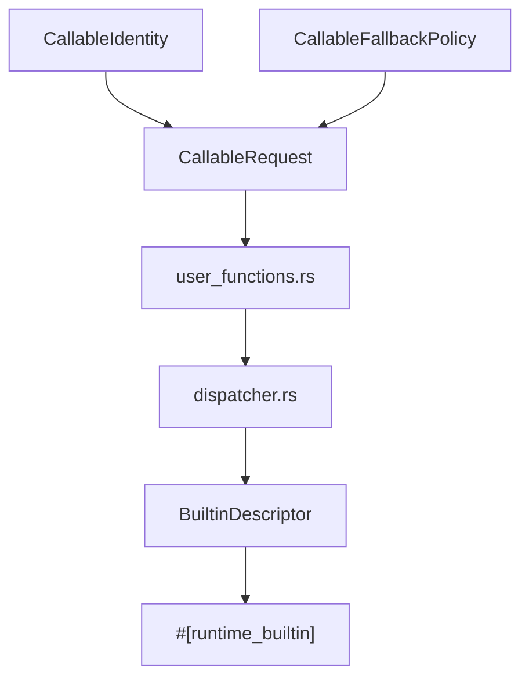
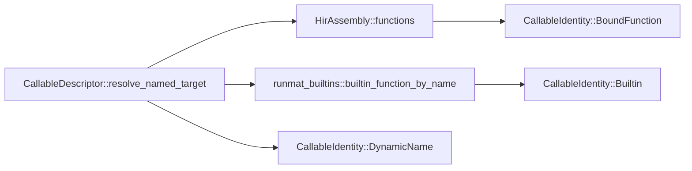

# Runtime & Built-in Functions

<details>
<summary>Relevant source files</summary>

- [crates/runmat-accelerate/tests/matmul_small_k.rs](https://github.com/runmat-org/runmat/blob/82685330/crates/runmat-accelerate/tests/matmul_small_k.rs)
- [crates/runmat-accelerate/tests/reduction_broadcast.rs](https://github.com/runmat-org/runmat/blob/82685330/crates/runmat-accelerate/tests/reduction_broadcast.rs)
- [crates/runmat-accelerate/tests/syrk.rs](https://github.com/runmat-org/runmat/blob/82685330/crates/runmat-accelerate/tests/syrk.rs)
- [crates/runmat-async/src/lib.rs](https://github.com/runmat-org/runmat/blob/82685330/crates/runmat-async/src/lib.rs)
- [crates/runmat-async/src/runtime_error.rs](https://github.com/runmat-org/runmat/blob/82685330/crates/runmat-async/src/runtime_error.rs)
- [crates/runmat-builtins/src/lib.rs](https://github.com/runmat-org/runmat/blob/82685330/crates/runmat-builtins/src/lib.rs)
- [crates/runmat-builtins/src/semantics.rs](https://github.com/runmat-org/runmat/blob/82685330/crates/runmat-builtins/src/semantics.rs)
- [crates/runmat-hir/src/hir.rs](https://github.com/runmat-org/runmat/blob/82685330/crates/runmat-hir/src/hir.rs)
- [crates/runmat-hir/src/lowering/ctx.rs](https://github.com/runmat-org/runmat/blob/82685330/crates/runmat-hir/src/lowering/ctx.rs)
- [crates/runmat-runtime/src/builtins/acceleration/gpu/arrayfun.rs](https://github.com/runmat-org/runmat/blob/82685330/crates/runmat-runtime/src/builtins/acceleration/gpu/arrayfun.rs)
- [crates/runmat-runtime/src/builtins/acceleration/gpu/mod.rs](https://github.com/runmat-org/runmat/blob/82685330/crates/runmat-runtime/src/builtins/acceleration/gpu/mod.rs)
- [crates/runmat-runtime/src/builtins/builtins-json/endsWith.json](https://github.com/runmat-org/runmat/blob/82685330/crates/runmat-runtime/src/builtins/builtins-json/endsWith.json)
- [crates/runmat-runtime/src/builtins/builtins-json/fft.json](https://github.com/runmat-org/runmat/blob/82685330/crates/runmat-runtime/src/builtins/builtins-json/fft.json)
- [crates/runmat-runtime/src/builtins/builtins-json/fftshift.json](https://github.com/runmat-org/runmat/blob/82685330/crates/runmat-runtime/src/builtins/builtins-json/fftshift.json)
- [crates/runmat-runtime/src/builtins/builtins-json/qammod.json](https://github.com/runmat-org/runmat/blob/82685330/crates/runmat-runtime/src/builtins/builtins-json/qammod.json)
- [crates/runmat-runtime/src/builtins/cells/core/cellfun.rs](https://github.com/runmat-org/runmat/blob/82685330/crates/runmat-runtime/src/builtins/cells/core/cellfun.rs)
- [crates/runmat-runtime/src/builtins/common/gpu_helpers.rs](https://github.com/runmat-org/runmat/blob/82685330/crates/runmat-runtime/src/builtins/common/gpu_helpers.rs)
- [crates/runmat-runtime/src/builtins/comms/mod.rs](https://github.com/runmat-org/runmat/blob/82685330/crates/runmat-runtime/src/builtins/comms/mod.rs)
- [crates/runmat-runtime/src/builtins/comms/qammod.rs](https://github.com/runmat-org/runmat/blob/82685330/crates/runmat-runtime/src/builtins/comms/qammod.rs)
- [crates/runmat-runtime/src/builtins/constants/mod.rs](https://github.com/runmat-org/runmat/blob/82685330/crates/runmat-runtime/src/builtins/constants/mod.rs)
- [crates/runmat-runtime/src/builtins/io/input.rs](https://github.com/runmat-org/runmat/blob/82685330/crates/runmat-runtime/src/builtins/io/input.rs)
- [crates/runmat-runtime/src/builtins/io/json/jsondecode.rs](https://github.com/runmat-org/runmat/blob/82685330/crates/runmat-runtime/src/builtins/io/json/jsondecode.rs)
- [crates/runmat-runtime/src/builtins/io/json/jsonencode.rs](https://github.com/runmat-org/runmat/blob/82685330/crates/runmat-runtime/src/builtins/io/json/jsonencode.rs)
- [crates/runmat-runtime/src/builtins/mod.rs](https://github.com/runmat-org/runmat/blob/82685330/crates/runmat-runtime/src/builtins/mod.rs)
- [crates/runmat-runtime/src/dispatcher.rs](https://github.com/runmat-org/runmat/blob/82685330/crates/runmat-runtime/src/dispatcher.rs)
- [crates/runmat-runtime/src/interaction.rs](https://github.com/runmat-org/runmat/blob/82685330/crates/runmat-runtime/src/interaction.rs)
- [crates/runmat-runtime/src/lib.rs](https://github.com/runmat-org/runmat/blob/82685330/crates/runmat-runtime/src/lib.rs)
- [crates/runmat-runtime/src/user_functions.rs](https://github.com/runmat-org/runmat/blob/82685330/crates/runmat-runtime/src/user_functions.rs)
- [crates/runmat-runtime/src/workspace.rs](https://github.com/runmat-org/runmat/blob/82685330/crates/runmat-runtime/src/workspace.rs)
- [crates/runmat-static-analysis/tests/lints.rs](https://github.com/runmat-org/runmat/blob/82685330/crates/runmat-static-analysis/tests/lints.rs)
- [crates/runmat-vm/src/call/closures.rs](https://github.com/runmat-org/runmat/blob/82685330/crates/runmat-vm/src/call/closures.rs)
- [crates/runmat-vm/src/call/descriptor.rs](https://github.com/runmat-org/runmat/blob/82685330/crates/runmat-vm/src/call/descriptor.rs)

</details>

The `runmat-runtime` crate provides the execution infrastructure and the extensive standard library (400+ functions) required for MATLAB-compatible operations. It acts as the bridge between the high-level VM/JIT and the low-level data structures defined in `runmat-builtins`.

## Core Runtime Architecture

The runtime manages the lifecycle of function calls, workspace variables, and the interaction between host-side logic and GPU-accelerated operations. It defines the `BuiltinResult<T>` type [crates/runmat-runtime/src/lib.rs #42](https://github.com/runmat-org/runmat/blob/82685330/crates/runmat-runtime/src/lib.rs#L42-L42) which encapsulates potential `RuntimeError` states during execution.

### Built-in Registration & Metadata

Built-ins in RunMat are not just functions; they are described by a `BuiltinDescriptor` [crates/runmat-runtime/src/lib.rs #15-17](https://github.com/runmat-org/runmat/blob/82685330/crates/runmat-runtime/src/lib.rs#L15-L17) This metadata is used by the compiler for validation and by the LSP for providing developer intelligence.

- `runtime_builtin` Macro: Used to define built-in functions while automatically generating the associated descriptor and registration logic [crates/runmat-runtime/src/builtins/acceleration/gpu/arrayfun.rs #24](https://github.com/runmat-org/runmat/blob/82685330/crates/runmat-runtime/src/builtins/acceleration/gpu/arrayfun.rs#L24-L24)
- Signatures: Defined via `BuiltinSignatureDescriptor`, allowing for multiple dispatch patterns and variadic arguments [crates/runmat-runtime/src/builtins/io/input.rs #69-90](https://github.com/runmat-org/runmat/blob/82685330/crates/runmat-runtime/src/builtins/io/input.rs#L69-L90)
- Error Descriptors: Strongly typed `BuiltinErrorDescriptor` instances provide consistent error codes and identifiers (e.g., `RunMat:input:TooManyInputs`) [crates/runmat-runtime/src/builtins/io/input.rs #91-102](https://github.com/runmat-org/runmat/blob/82685330/crates/runmat-runtime/src/builtins/io/input.rs#L91-L102)

### The Dispatcher

The dispatcher [crates/runmat-runtime/src/dispatcher.rs #1](https://github.com/runmat-org/runmat/blob/82685330/crates/runmat-runtime/src/dispatcher.rs#L1-L1) is responsible for routing calls to the correct implementation based on the input types (Host vs. GPU).

- GPU Awareness: Functions like `value_contains_gpu` [crates/runmat-runtime/src/dispatcher.rs #13-23](https://github.com/runmat-org/runmat/blob/82685330/crates/runmat-runtime/src/dispatcher.rs#L13-L23) check if any part of a value (including nested fields in structs or cells) resides on the GPU.
- Automatic Gathering: The `gather_if_needed_async` function [crates/runmat-runtime/src/dispatcher.rs #27-29](https://github.com/runmat-org/runmat/blob/82685330/crates/runmat-runtime/src/dispatcher.rs#L27-L29) transparently downloads data from the GPU to the host when a built-in does not have a native GPU implementation.

### System Mapping: From Identity to Execution

The following diagram illustrates how a function call identity in the code space maps to the runtime's dispatch and execution entities.

Runtime Dispatch Mapping



<details>
<summary>Rendered SVG</summary>

```svg
<svg id="mermaid-tt3h6veqjq" xmlns="http://www.w3.org/2000/svg" xmlns:xlink="http://www.w3.org/1999/xlink" class="flowchart" style="max-width: 100%; touch-action: none; user-select: none; cursor: grab; min-height: fit-content; max-height: 100%;" viewBox="0 0 528.28125 764" role="graphics-document document" aria-roledescription="flowchart-v2" preserveAspectRatio="xMidYMid meet"><style>#mermaid-tt3h6veqjq{font-family:ui-sans-serif,-apple-system,system-ui,Segoe UI,Helvetica;font-size:16px;fill:#ccc;}@keyframes edge-animation-frame{from{stroke-dashoffset:0;}}@keyframes dash{to{stroke-dashoffset:0;}}#mermaid-tt3h6veqjq .edge-animation-slow{stroke-dasharray:9,5!important;stroke-dashoffset:900;animation:dash 50s linear infinite;stroke-linecap:round;}#mermaid-tt3h6veqjq .edge-animation-fast{stroke-dasharray:9,5!important;stroke-dashoffset:900;animation:dash 20s linear infinite;stroke-linecap:round;}#mermaid-tt3h6veqjq .error-icon{fill:#333;}#mermaid-tt3h6veqjq .error-text{fill:#cccccc;stroke:#cccccc;}#mermaid-tt3h6veqjq .edge-thickness-normal{stroke-width:1px;}#mermaid-tt3h6veqjq .edge-thickness-thick{stroke-width:3.5px;}#mermaid-tt3h6veqjq .edge-pattern-solid{stroke-dasharray:0;}#mermaid-tt3h6veqjq .edge-thickness-invisible{stroke-width:0;fill:none;}#mermaid-tt3h6veqjq .edge-pattern-dashed{stroke-dasharray:3;}#mermaid-tt3h6veqjq .edge-pattern-dotted{stroke-dasharray:2;}#mermaid-tt3h6veqjq .marker{fill:#666;stroke:#666;}#mermaid-tt3h6veqjq .marker.cross{stroke:#666;}#mermaid-tt3h6veqjq svg{font-family:ui-sans-serif,-apple-system,system-ui,Segoe UI,Helvetica;font-size:16px;}#mermaid-tt3h6veqjq p{margin:0;}#mermaid-tt3h6veqjq .label{font-family:ui-sans-serif,-apple-system,system-ui,Segoe UI,Helvetica;color:#fff;}#mermaid-tt3h6veqjq .cluster-label text{fill:#fff;}#mermaid-tt3h6veqjq .cluster-label span{color:#fff;}#mermaid-tt3h6veqjq .cluster-label span p{background-color:transparent;}#mermaid-tt3h6veqjq .label text,#mermaid-tt3h6veqjq span{fill:#fff;color:#fff;}#mermaid-tt3h6veqjq .node rect,#mermaid-tt3h6veqjq .node circle,#mermaid-tt3h6veqjq .node ellipse,#mermaid-tt3h6veqjq .node polygon,#mermaid-tt3h6veqjq .node path{fill:#111;stroke:#222;stroke-width:1px;}#mermaid-tt3h6veqjq .rough-node .label text,#mermaid-tt3h6veqjq .node .label text,#mermaid-tt3h6veqjq .image-shape .label,#mermaid-tt3h6veqjq .icon-shape .label{text-anchor:middle;}#mermaid-tt3h6veqjq .node .katex path{fill:#000;stroke:#000;stroke-width:1px;}#mermaid-tt3h6veqjq .rough-node .label,#mermaid-tt3h6veqjq .node .label,#mermaid-tt3h6veqjq .image-shape .label,#mermaid-tt3h6veqjq .icon-shape .label{text-align:center;}#mermaid-tt3h6veqjq .node.clickable{cursor:pointer;}#mermaid-tt3h6veqjq .root .anchor path{fill:#666!important;stroke-width:0;stroke:#666;}#mermaid-tt3h6veqjq .arrowheadPath{fill:#0b0b0b;}#mermaid-tt3h6veqjq .edgePath .path{stroke:#666;stroke-width:1px;}#mermaid-tt3h6veqjq .flowchart-link{stroke:#666;fill:none;}#mermaid-tt3h6veqjq .edgeLabel{background-color:#161616;text-align:center;}#mermaid-tt3h6veqjq .edgeLabel p{background-color:#161616;}#mermaid-tt3h6veqjq .edgeLabel rect{opacity:0.5;background-color:#161616;fill:#161616;}#mermaid-tt3h6veqjq .labelBkg{background-color:rgba(22, 22, 22, 0.5);}#mermaid-tt3h6veqjq .cluster rect{fill:#161616;stroke:#222;stroke-width:1px;}#mermaid-tt3h6veqjq .cluster text{fill:#fff;}#mermaid-tt3h6veqjq .cluster span{color:#fff;}#mermaid-tt3h6veqjq div.mermaidTooltip{position:absolute;text-align:center;max-width:200px;padding:2px;font-family:ui-sans-serif,-apple-system,system-ui,Segoe UI,Helvetica;font-size:12px;background:#333;border:1px solid hsl(0, 0%, 10%);border-radius:2px;pointer-events:none;z-index:100;}#mermaid-tt3h6veqjq .flowchartTitleText{text-anchor:middle;font-size:18px;fill:#ccc;}#mermaid-tt3h6veqjq rect.text{fill:none;stroke-width:0;}#mermaid-tt3h6veqjq .icon-shape,#mermaid-tt3h6veqjq .image-shape{background-color:#161616;text-align:center;}#mermaid-tt3h6veqjq .icon-shape p,#mermaid-tt3h6veqjq .image-shape p{background-color:#161616;padding:2px;}#mermaid-tt3h6veqjq .icon-shape .label rect,#mermaid-tt3h6veqjq .image-shape .label rect{opacity:0.5;background-color:#161616;fill:#161616;}#mermaid-tt3h6veqjq .label-icon{display:inline-block;height:1em;overflow:visible;vertical-align:-0.125em;}#mermaid-tt3h6veqjq .node .label-icon path{fill:currentColor;stroke:revert;stroke-width:revert;}#mermaid-tt3h6veqjq .node .neo-node{stroke:#222;}#mermaid-tt3h6veqjq [data-look="neo"].node rect,#mermaid-tt3h6veqjq [data-look="neo"].cluster rect,#mermaid-tt3h6veqjq [data-look="neo"].node polygon{stroke:url(#mermaid-tt3h6veqjq-gradient);filter:drop-shadow( 1px 2px 2px rgba(185,185,185,1));}#mermaid-tt3h6veqjq [data-look="neo"].node path{stroke:url(#mermaid-tt3h6veqjq-gradient);stroke-width:1px;}#mermaid-tt3h6veqjq [data-look="neo"].node .outer-path{filter:drop-shadow( 1px 2px 2px rgba(185,185,185,1));}#mermaid-tt3h6veqjq [data-look="neo"].node .neo-line path{stroke:#222;filter:none;}#mermaid-tt3h6veqjq [data-look="neo"].node circle{stroke:url(#mermaid-tt3h6veqjq-gradient);filter:drop-shadow( 1px 2px 2px rgba(185,185,185,1));}#mermaid-tt3h6veqjq [data-look="neo"].node circle .state-start{fill:#000000;}#mermaid-tt3h6veqjq [data-look="neo"].icon-shape .icon{fill:url(#mermaid-tt3h6veqjq-gradient);filter:drop-shadow( 1px 2px 2px rgba(185,185,185,1));}#mermaid-tt3h6veqjq [data-look="neo"].icon-shape .icon-neo path{stroke:url(#mermaid-tt3h6veqjq-gradient);filter:drop-shadow( 1px 2px 2px rgba(185,185,185,1));}#mermaid-tt3h6veqjq :root{--mermaid-font-family:"trebuchet ms",verdana,arial,sans-serif;}</style><g><marker id="mermaid-tt3h6veqjq_flowchart-v2-pointEnd" class="marker flowchart-v2" viewBox="0 0 10 10" refX="5" refY="5" markerUnits="userSpaceOnUse" markerWidth="8" markerHeight="8" orient="auto"><path d="M 0 0 L 10 5 L 0 10 z" class="arrowMarkerPath" style="stroke-width: 1; stroke-dasharray: 1, 0;"></path></marker><marker id="mermaid-tt3h6veqjq_flowchart-v2-pointStart" class="marker flowchart-v2" viewBox="0 0 10 10" refX="4.5" refY="5" markerUnits="userSpaceOnUse" markerWidth="8" markerHeight="8" orient="auto"><path d="M 0 5 L 10 10 L 10 0 z" class="arrowMarkerPath" style="stroke-width: 1; stroke-dasharray: 1, 0;"></path></marker><marker id="mermaid-tt3h6veqjq_flowchart-v2-pointEnd-margin" class="marker flowchart-v2" viewBox="0 0 11.5 14" refX="11.5" refY="7" markerUnits="userSpaceOnUse" markerWidth="10.5" markerHeight="14" orient="auto"><path d="M 0 0 L 11.5 7 L 0 14 z" class="arrowMarkerPath" style="stroke-width: 0; stroke-dasharray: 1, 0;"></path></marker><marker id="mermaid-tt3h6veqjq_flowchart-v2-pointStart-margin" class="marker flowchart-v2" viewBox="0 0 11.5 14" refX="1" refY="7" markerUnits="userSpaceOnUse" markerWidth="11.5" markerHeight="14" orient="auto"><polygon points="0,7 11.5,14 11.5,0" class="arrowMarkerPath" style="stroke-width: 0; stroke-dasharray: 1, 0;"></polygon></marker><marker id="mermaid-tt3h6veqjq_flowchart-v2-circleEnd" class="marker flowchart-v2" viewBox="0 0 10 10" refX="11" refY="5" markerUnits="userSpaceOnUse" markerWidth="11" markerHeight="11" orient="auto"><circle cx="5" cy="5" r="5" class="arrowMarkerPath" style="stroke-width: 1; stroke-dasharray: 1, 0;"></circle></marker><marker id="mermaid-tt3h6veqjq_flowchart-v2-circleStart" class="marker flowchart-v2" viewBox="0 0 10 10" refX="-1" refY="5" markerUnits="userSpaceOnUse" markerWidth="11" markerHeight="11" orient="auto"><circle cx="5" cy="5" r="5" class="arrowMarkerPath" style="stroke-width: 1; stroke-dasharray: 1, 0;"></circle></marker><marker id="mermaid-tt3h6veqjq_flowchart-v2-circleEnd-margin" class="marker flowchart-v2" viewBox="0 0 10 10" refY="5" refX="12.25" markerUnits="userSpaceOnUse" markerWidth="14" markerHeight="14" orient="auto"><circle cx="5" cy="5" r="5" class="arrowMarkerPath" style="stroke-width: 0; stroke-dasharray: 1, 0;"></circle></marker><marker id="mermaid-tt3h6veqjq_flowchart-v2-circleStart-margin" class="marker flowchart-v2" viewBox="0 0 10 10" refX="-2" refY="5" markerUnits="userSpaceOnUse" markerWidth="14" markerHeight="14" orient="auto"><circle cx="5" cy="5" r="5" class="arrowMarkerPath" style="stroke-width: 0; stroke-dasharray: 1, 0;"></circle></marker><marker id="mermaid-tt3h6veqjq_flowchart-v2-crossEnd" class="marker cross flowchart-v2" viewBox="0 0 11 11" refX="12" refY="5.2" markerUnits="userSpaceOnUse" markerWidth="11" markerHeight="11" orient="auto"><path d="M 1,1 l 9,9 M 10,1 l -9,9" class="arrowMarkerPath" style="stroke-width: 2; stroke-dasharray: 1, 0;"></path></marker><marker id="mermaid-tt3h6veqjq_flowchart-v2-crossStart" class="marker cross flowchart-v2" viewBox="0 0 11 11" refX="-1" refY="5.2" markerUnits="userSpaceOnUse" markerWidth="11" markerHeight="11" orient="auto"><path d="M 1,1 l 9,9 M 10,1 l -9,9" class="arrowMarkerPath" style="stroke-width: 2; stroke-dasharray: 1, 0;"></path></marker><marker id="mermaid-tt3h6veqjq_flowchart-v2-crossEnd-margin" class="marker cross flowchart-v2" viewBox="0 0 15 15" refX="17.7" refY="7.5" markerUnits="userSpaceOnUse" markerWidth="12" markerHeight="12" orient="auto"><path d="M 1,1 L 14,14 M 1,14 L 14,1" class="arrowMarkerPath" style="stroke-width: 2.5;"></path></marker><marker id="mermaid-tt3h6veqjq_flowchart-v2-crossStart-margin" class="marker cross flowchart-v2" viewBox="0 0 15 15" refX="-3.5" refY="7.5" markerUnits="userSpaceOnUse" markerWidth="12" markerHeight="12" orient="auto"><path d="M 1,1 L 14,14 M 1,14 L 14,1" class="arrowMarkerPath" style="stroke-width: 2.5; stroke-dasharray: 1, 0;"></path></marker><g class="root"><g class="clusters"><g class="cluster" id="mermaid-tt3h6veqjq-subGraph2" data-look="classic"><rect style="" x="122.328125" y="548" width="259.5625" height="208"></rect><g class="cluster-label" transform="translate(167.984375, 548)"><foreignObject width="168.25" height="24"><div style="display: table-cell; white-space: nowrap; line-height: 1.5;" xmlns="http://www.w3.org/1999/xhtml"><span class="nodeLabel"><p>Built-in Implementation</p></span></div></foreignObject></g></g><g class="cluster" id="mermaid-tt3h6veqjq-subGraph1" data-look="classic"><rect style="" x="45.04296875" y="162" width="404.1328125" height="336"></rect><g class="cluster-label" transform="translate(110.9921875, 162)"><foreignObject width="272.234375" height="24"><div style="display: table-cell; white-space: nowrap; line-height: 1.5;" xmlns="http://www.w3.org/1999/xhtml"><span class="nodeLabel"><p>Runtime Dispatcher (runmat-runtime)</p></span></div></foreignObject></g></g><g class="cluster" id="mermaid-tt3h6veqjq-subGraph0" data-look="classic"><rect style="" x="8" y="8" width="512.28125" height="104"></rect><g class="cluster-label" transform="translate(151.0078125, 8)"><foreignObject width="226.265625" height="24"><div style="display: table-cell; white-space: nowrap; line-height: 1.5;" xmlns="http://www.w3.org/1999/xhtml"><span class="nodeLabel"><p>Code Entity Space (runmat-hir)</p></span></div></foreignObject></g></g></g><g class="edgePaths"><path d="M129.039,87L129.039,91.167C129.039,95.333,129.039,103.667,129.039,112C129.039,120.333,129.039,128.667,129.039,137C129.039,145.333,129.039,153.667,138.286,161.741C147.534,169.814,166.028,177.629,175.276,181.536L184.523,185.443" id="mermaid-tt3h6veqjq-L_ID_CR_0" class="edge-thickness-normal edge-pattern-solid edge-thickness-normal edge-pattern-solid flowchart-link" style=";" data-edge="true" data-et="edge" data-id="L_ID_CR_0" data-points="W3sieCI6MTI5LjAzOTA2MjUsInkiOjg3fSx7IngiOjEyOS4wMzkwNjI1LCJ5IjoxMTJ9LHsieCI6MTI5LjAzOTA2MjUsInkiOjEzN30seyJ4IjoxMjkuMDM5MDYyNSwieSI6MTYyfSx7IngiOjE4OC4yMDc0ODE5NzExNTM4NCwieSI6MTg3fV0=" data-look="classic" marker-end="url(#mermaid-tt3h6veqjq_flowchart-v2-pointEnd)"></path><path d="M375.18,87L375.18,91.167C375.18,95.333,375.18,103.667,375.18,112C375.18,120.333,375.18,128.667,375.18,137C375.18,145.333,375.18,153.667,365.932,161.741C356.685,169.814,338.19,177.629,328.943,181.536L319.696,185.443" id="mermaid-tt3h6veqjq-L_FP_CR_0" class="edge-thickness-normal edge-pattern-solid edge-thickness-normal edge-pattern-solid flowchart-link" style=";" data-edge="true" data-et="edge" data-id="L_FP_CR_0" data-points="W3sieCI6Mzc1LjE3OTY4NzUsInkiOjg3fSx7IngiOjM3NS4xNzk2ODc1LCJ5IjoxMTJ9LHsieCI6Mzc1LjE3OTY4NzUsInkiOjEzN30seyJ4IjozNzUuMTc5Njg3NSwieSI6MTYyfSx7IngiOjMxNi4wMTEyNjgwMjg4NDYxMywieSI6MTg3fV0=" data-look="classic" marker-end="url(#mermaid-tt3h6veqjq_flowchart-v2-pointEnd)"></path><path d="M252.109,241L252.109,245.167C252.109,249.333,252.109,257.667,252.109,265.333C252.109,273,252.109,280,252.109,283.5L252.109,287" id="mermaid-tt3h6veqjq-L_CR_UF_0" class="edge-thickness-normal edge-pattern-solid edge-thickness-normal edge-pattern-solid flowchart-link" style=";" data-edge="true" data-et="edge" data-id="L_CR_UF_0" data-points="W3sieCI6MjUyLjEwOTM3NSwieSI6MjQxfSx7IngiOjI1Mi4xMDkzNzUsInkiOjI2Nn0seyJ4IjoyNTIuMTA5Mzc1LCJ5IjoyOTF9XQ==" data-look="classic" marker-end="url(#mermaid-tt3h6veqjq_flowchart-v2-pointEnd)"></path><path d="M252.109,345L252.109,351.167C252.109,357.333,252.109,369.667,252.109,381.333C252.109,393,252.109,404,252.109,409.5L252.109,415" id="mermaid-tt3h6veqjq-L_UF_DR_0" class="edge-thickness-normal edge-pattern-solid edge-thickness-normal edge-pattern-solid flowchart-link" style=";" data-edge="true" data-et="edge" data-id="L_UF_DR_0" data-points="W3sieCI6MjUyLjEwOTM3NSwieSI6MzQ1fSx7IngiOjI1Mi4xMDkzNzUsInkiOjM4Mn0seyJ4IjoyNTIuMTA5Mzc1LCJ5Ijo0MTl9XQ==" data-look="classic" marker-end="url(#mermaid-tt3h6veqjq_flowchart-v2-pointEnd)"></path><path d="M252.109,473L252.109,477.167C252.109,481.333,252.109,489.667,252.109,498C252.109,506.333,252.109,514.667,252.109,523C252.109,531.333,252.109,539.667,252.109,547.333C252.109,555,252.109,562,252.109,565.5L252.109,569" id="mermaid-tt3h6veqjq-L_DR_RD_0" class="edge-thickness-normal edge-pattern-solid edge-thickness-normal edge-pattern-solid flowchart-link" style=";" data-edge="true" data-et="edge" data-id="L_DR_RD_0" data-points="W3sieCI6MjUyLjEwOTM3NSwieSI6NDczfSx7IngiOjI1Mi4xMDkzNzUsInkiOjQ5OH0seyJ4IjoyNTIuMTA5Mzc1LCJ5Ijo1MjN9LHsieCI6MjUyLjEwOTM3NSwieSI6NTQ4fSx7IngiOjI1Mi4xMDkzNzUsInkiOjU3M31d" data-look="classic" marker-end="url(#mermaid-tt3h6veqjq_flowchart-v2-pointEnd)"></path><path d="M252.109,627L252.109,631.167C252.109,635.333,252.109,643.667,252.109,651.333C252.109,659,252.109,666,252.109,669.5L252.109,673" id="mermaid-tt3h6veqjq-L_RD_RB_0" class="edge-thickness-normal edge-pattern-solid edge-thickness-normal edge-pattern-solid flowchart-link" style=";" data-edge="true" data-et="edge" data-id="L_RD_RB_0" data-points="W3sieCI6MjUyLjEwOTM3NSwieSI6NjI3fSx7IngiOjI1Mi4xMDkzNzUsInkiOjY1Mn0seyJ4IjoyNTIuMTA5Mzc1LCJ5Ijo2Nzd9XQ==" data-look="classic" marker-end="url(#mermaid-tt3h6veqjq_flowchart-v2-pointEnd)"></path></g><g class="edgeLabels"><g class="edgeLabel"><g class="label" data-id="L_ID_CR_0" transform="translate(0, 0)"><foreignObject width="0" height="0"><div style="display: table-cell; white-space: nowrap; line-height: 1.5; max-width: 200px; text-align: center;" xmlns="http://www.w3.org/1999/xhtml" class="labelBkg"><span class="edgeLabel"></span></div></foreignObject></g></g><g class="edgeLabel"><g class="label" data-id="L_FP_CR_0" transform="translate(0, 0)"><foreignObject width="0" height="0"><div style="display: table-cell; white-space: nowrap; line-height: 1.5; max-width: 200px; text-align: center;" xmlns="http://www.w3.org/1999/xhtml" class="labelBkg"><span class="edgeLabel"></span></div></foreignObject></g></g><g class="edgeLabel"><g class="label" data-id="L_CR_UF_0" transform="translate(0, 0)"><foreignObject width="0" height="0"><div style="display: table-cell; white-space: nowrap; line-height: 1.5; max-width: 200px; text-align: center;" xmlns="http://www.w3.org/1999/xhtml" class="labelBkg"><span class="edgeLabel"></span></div></foreignObject></g></g><g class="edgeLabel" transform="translate(252.109375, 382)"><g class="label" data-id="L_UF_DR_0" transform="translate(-32.6640625, -12)"><foreignObject width="65.328125" height="24"><div style="display: table-cell; white-space: nowrap; line-height: 1.5; max-width: 200px; text-align: center;" xmlns="http://www.w3.org/1999/xhtml" class="labelBkg"><span class="edgeLabel"><p>If Built-in</p></span></div></foreignObject></g></g><g class="edgeLabel"><g class="label" data-id="L_DR_RD_0" transform="translate(0, 0)"><foreignObject width="0" height="0"><div style="display: table-cell; white-space: nowrap; line-height: 1.5; max-width: 200px; text-align: center;" xmlns="http://www.w3.org/1999/xhtml" class="labelBkg"><span class="edgeLabel"></span></div></foreignObject></g></g><g class="edgeLabel"><g class="label" data-id="L_RD_RB_0" transform="translate(0, 0)"><foreignObject width="0" height="0"><div style="display: table-cell; white-space: nowrap; line-height: 1.5; max-width: 200px; text-align: center;" xmlns="http://www.w3.org/1999/xhtml" class="labelBkg"><span class="edgeLabel"></span></div></foreignObject></g></g></g><g class="nodes"><g class="node default" id="mermaid-tt3h6veqjq-flowchart-ID-0" data-look="classic" transform="translate(129.0390625, 60)"><rect class="basic label-container" style="" x="-86.0390625" y="-27" width="172.078125" height="54"></rect><g class="label" style="" transform="translate(-56.0390625, -12)"><rect></rect><foreignObject width="112.078125" height="24"><div style="display: table-cell; white-space: nowrap; line-height: 1.5; max-width: 200px; text-align: center;" xmlns="http://www.w3.org/1999/xhtml"><span class="nodeLabel"><p>CallableIdentity</p></span></div></foreignObject></g></g><g class="node default" id="mermaid-tt3h6veqjq-flowchart-FP-1" data-look="classic" transform="translate(375.1796875, 60)"><rect class="basic label-container" style="" x="-110.1015625" y="-27" width="220.203125" height="54"></rect><g class="label" style="" transform="translate(-80.1015625, -12)"><rect></rect><foreignObject width="160.203125" height="24"><div style="display: table-cell; white-space: nowrap; line-height: 1.5; max-width: 200px; text-align: center;" xmlns="http://www.w3.org/1999/xhtml"><span class="nodeLabel"><p>CallableFallbackPolicy</p></span></div></foreignObject></g></g><g class="node default" id="mermaid-tt3h6veqjq-flowchart-CR-2" data-look="classic" transform="translate(252.109375, 214)"><rect class="basic label-container" style="" x="-88.6171875" y="-27" width="177.234375" height="54"></rect><g class="label" style="" transform="translate(-58.6171875, -12)"><rect></rect><foreignObject width="117.234375" height="24"><div style="display: table-cell; white-space: nowrap; line-height: 1.5; max-width: 200px; text-align: center;" xmlns="http://www.w3.org/1999/xhtml"><span class="nodeLabel"><p>CallableRequest</p></span></div></foreignObject></g></g><g class="node default" id="mermaid-tt3h6veqjq-flowchart-DR-3" data-look="classic" transform="translate(252.109375, 446)"><rect class="basic label-container" style="" x="-77.015625" y="-27" width="154.03125" height="54"></rect><g class="label" style="" transform="translate(-47.015625, -12)"><rect></rect><foreignObject width="94.03125" height="24"><div style="display: table-cell; white-space: nowrap; line-height: 1.5; max-width: 200px; text-align: center;" xmlns="http://www.w3.org/1999/xhtml"><span class="nodeLabel"><p>dispatcher.rs</p></span></div></foreignObject></g></g><g class="node default" id="mermaid-tt3h6veqjq-flowchart-UF-4" data-look="classic" transform="translate(252.109375, 318)"><rect class="basic label-container" style="" x="-92.9921875" y="-27" width="185.984375" height="54"></rect><g class="label" style="" transform="translate(-62.9921875, -12)"><rect></rect><foreignObject width="125.984375" height="24"><div style="display: table-cell; white-space: nowrap; line-height: 1.5; max-width: 200px; text-align: center;" xmlns="http://www.w3.org/1999/xhtml"><span class="nodeLabel"><p>user_functions.rs</p></span></div></foreignObject></g></g><g class="node default" id="mermaid-tt3h6veqjq-flowchart-RD-5" data-look="classic" transform="translate(252.109375, 600)"><rect class="basic label-container" style="" x="-90.3984375" y="-27" width="180.796875" height="54"></rect><g class="label" style="" transform="translate(-60.3984375, -12)"><rect></rect><foreignObject width="120.796875" height="24"><div style="display: table-cell; white-space: nowrap; line-height: 1.5; max-width: 200px; text-align: center;" xmlns="http://www.w3.org/1999/xhtml"><span class="nodeLabel"><p>BuiltinDescriptor</p></span></div></foreignObject></g></g><g class="node default" id="mermaid-tt3h6veqjq-flowchart-RB-6" data-look="classic" transform="translate(252.109375, 704)"><rect class="basic label-container" style="" x="-94.78125" y="-27" width="189.5625" height="54"></rect><g class="label" style="" transform="translate(-64.78125, -12)"><rect></rect><foreignObject width="129.5625" height="24"><div style="display: table-cell; white-space: nowrap; line-height: 1.5; max-width: 200px; text-align: center;" xmlns="http://www.w3.org/1999/xhtml"><span class="nodeLabel"><p>#[runtime_builtin]</p></span></div></foreignObject></g></g></g></g></g><defs><filter id="mermaid-tt3h6veqjq-drop-shadow" height="130%" width="130%"><feDropShadow dx="4" dy="4" stdDeviation="0" flood-opacity="0.06" flood-color="#000000"></feDropShadow></filter></defs><defs><filter id="mermaid-tt3h6veqjq-drop-shadow-small" height="150%" width="150%"><feDropShadow dx="2" dy="2" stdDeviation="0" flood-opacity="0.06" flood-color="#000000"></feDropShadow></filter></defs><linearGradient id="mermaid-tt3h6veqjq-gradient" gradientUnits="objectBoundingBox" x1="0%" y1="0%" x2="100%" y2="0%"><stop offset="0%" stop-color="#333" stop-opacity="1"></stop><stop offset="100%" stop-color="hsl(-120, 0%, 3.3333333333%)" stop-opacity="1"></stop></linearGradient></svg>
```

</details>

Sources: [crates/runmat-runtime/src/user_functions.rs #15-45](https://github.com/runmat-org/runmat/blob/82685330/crates/runmat-runtime/src/user_functions.rs#L15-L45) [crates/runmat-runtime/src/dispatcher.rs #1-6](https://github.com/runmat-org/runmat/blob/82685330/crates/runmat-runtime/src/dispatcher.rs#L1-L6) [crates/runmat-runtime/src/lib.rs #14-21](https://github.com/runmat-org/runmat/blob/82685330/crates/runmat-runtime/src/lib.rs#L14-L21)

---

## Functional Domains

The built-in library is organized into specialized modules [crates/runmat-runtime/src/builtins/mod.rs #1-27](https://github.com/runmat-org/runmat/blob/82685330/crates/runmat-runtime/src/builtins/mod.rs#L1-L27) Detailed documentation for each domain is available in the child pages.

### [Array & Math Built-ins](https://app.devin.ai/org/runmat-org/wiki/runmat-org/runmat?branch=dev#6.1)

Covers fundamental matrix operations including creation (`zeros`, `ones`, `rand`), shape manipulation (`reshape`, `permute`), and element-wise mathematics. These built-ins often serve as the primary targets for the [GPU Acceleration & Fusion Engine](https://app.devin.ai/org/runmat-org/wiki/runmat-org/runmat?branch=dev#5). For details, see [Array & Math Built-ins](https://app.devin.ai/org/runmat-org/wiki/runmat-org/runmat?branch=dev#6.1).

### [Linear Algebra, FFT & Signal Processing Built-ins](https://app.devin.ai/org/runmat-org/wiki/runmat-org/runmat?branch=dev#6.2)

Includes high-performance routines for matrix factorization (`lu`, `qr`), solvers (`mldivide`), and frequency domain analysis (`fft`, `ifft`). Many of these wrap optimized BLAS/LAPACK or vendor-specific GPU libraries. For details, see [Linear Algebra, FFT & Signal Processing Built-ins](https://app.devin.ai/org/runmat-org/wiki/runmat-org/runmat?branch=dev#6.2).

### [String, I/O & Filesystem Built-ins](https://app.devin.ai/org/runmat-org/wiki/runmat-org/runmat?branch=dev#6.3)

Handles text processing (`sprintf`, `strrep`), file access (`fopen`, `fread`), and structured data exchange (`jsonencode`, `csvread`). This layer utilizes the `runmat-filesystem` VFS for cross-platform compatibility (Native vs. WASM). For details, see [String, I/O & Filesystem Built-ins](https://app.devin.ai/org/runmat-org/wiki/runmat-org/runmat?branch=dev#6.3).

### [OOP, Structs, Cells & Introspection Built-ins](https://app.devin.ai/org/runmat-org/wiki/runmat-org/runmat?branch=dev#6.4)

Manages MATLAB's heterogeneous containers and object-oriented features. This includes dynamic field access (`getfield`, `setfield`), cell array mapping (`cellfun`), and system introspection (`whos`, `isa`). For details, see [OOP, Structs, Cells & Introspection Built-ins](https://app.devin.ai/org/runmat-org/wiki/runmat-org/runmat?branch=dev#6.4).

### [BuiltinDescriptor Metadata & LSP Integration](https://app.devin.ai/org/runmat-org/wiki/runmat-org/runmat?branch=dev#6.5)

The technical specification of the metadata system. It explains how `BuiltinDescriptor` allows the LSP to provide real-time hover documentation, signature help, and semantic highlighting without executing the code. For details, see [BuiltinDescriptor Metadata & LSP Integration](https://app.devin.ai/org/runmat-org/wiki/runmat-org/runmat?branch=dev#6.5).

---

## Semantic Function Resolution

The runtime provides hooks for resolving "semantic" functions—functions defined in user code or project files that are not hard-coded built-ins.

- `FunctionResolver`: A trait/callback used to look up a function ID by name [crates/runmat-runtime/src/user_functions.rs #12](https://github.com/runmat-org/runmat/blob/82685330/crates/runmat-runtime/src/user_functions.rs#L12-L12)
- `FunctionInvoker`: A trait/callback that allows the runtime to re-enter the VM or JIT to execute a resolved user function [crates/runmat-runtime/src/user_functions.rs #11](https://github.com/runmat-org/runmat/blob/82685330/crates/runmat-runtime/src/user_functions.rs#L11-L11)
- `CallableRequest`: Encapsulates the intent to call a function, whether it's via a `BoundFunction` (ID-based) or a `DynamicName` (resolution required at runtime) [crates/runmat-runtime/src/user_functions.rs #15-45](https://github.com/runmat-org/runmat/blob/82685330/crates/runmat-runtime/src/user_functions.rs#L15-L45)

Callable Identity Flow



<details>
<summary>Rendered SVG</summary>

```svg
<svg id="mermaid-gcpiman5jgt" xmlns="http://www.w3.org/2000/svg" xmlns:xlink="http://www.w3.org/1999/xlink" class="flowchart" style="max-width: 100%; touch-action: none; user-select: none; cursor: grab; min-height: fit-content; max-height: 100%;" viewBox="-0.05335515147555725 0 1240.8879603029511 348" role="graphics-document document" aria-roledescription="flowchart-v2" preserveAspectRatio="xMidYMid meet"><style>#mermaid-gcpiman5jgt{font-family:ui-sans-serif,-apple-system,system-ui,Segoe UI,Helvetica;font-size:16px;fill:#ccc;}@keyframes edge-animation-frame{from{stroke-dashoffset:0;}}@keyframes dash{to{stroke-dashoffset:0;}}#mermaid-gcpiman5jgt .edge-animation-slow{stroke-dasharray:9,5!important;stroke-dashoffset:900;animation:dash 50s linear infinite;stroke-linecap:round;}#mermaid-gcpiman5jgt .edge-animation-fast{stroke-dasharray:9,5!important;stroke-dashoffset:900;animation:dash 20s linear infinite;stroke-linecap:round;}#mermaid-gcpiman5jgt .error-icon{fill:#333;}#mermaid-gcpiman5jgt .error-text{fill:#cccccc;stroke:#cccccc;}#mermaid-gcpiman5jgt .edge-thickness-normal{stroke-width:1px;}#mermaid-gcpiman5jgt .edge-thickness-thick{stroke-width:3.5px;}#mermaid-gcpiman5jgt .edge-pattern-solid{stroke-dasharray:0;}#mermaid-gcpiman5jgt .edge-thickness-invisible{stroke-width:0;fill:none;}#mermaid-gcpiman5jgt .edge-pattern-dashed{stroke-dasharray:3;}#mermaid-gcpiman5jgt .edge-pattern-dotted{stroke-dasharray:2;}#mermaid-gcpiman5jgt .marker{fill:#666;stroke:#666;}#mermaid-gcpiman5jgt .marker.cross{stroke:#666;}#mermaid-gcpiman5jgt svg{font-family:ui-sans-serif,-apple-system,system-ui,Segoe UI,Helvetica;font-size:16px;}#mermaid-gcpiman5jgt p{margin:0;}#mermaid-gcpiman5jgt .label{font-family:ui-sans-serif,-apple-system,system-ui,Segoe UI,Helvetica;color:#fff;}#mermaid-gcpiman5jgt .cluster-label text{fill:#fff;}#mermaid-gcpiman5jgt .cluster-label span{color:#fff;}#mermaid-gcpiman5jgt .cluster-label span p{background-color:transparent;}#mermaid-gcpiman5jgt .label text,#mermaid-gcpiman5jgt span{fill:#fff;color:#fff;}#mermaid-gcpiman5jgt .node rect,#mermaid-gcpiman5jgt .node circle,#mermaid-gcpiman5jgt .node ellipse,#mermaid-gcpiman5jgt .node polygon,#mermaid-gcpiman5jgt .node path{fill:#111;stroke:#222;stroke-width:1px;}#mermaid-gcpiman5jgt .rough-node .label text,#mermaid-gcpiman5jgt .node .label text,#mermaid-gcpiman5jgt .image-shape .label,#mermaid-gcpiman5jgt .icon-shape .label{text-anchor:middle;}#mermaid-gcpiman5jgt .node .katex path{fill:#000;stroke:#000;stroke-width:1px;}#mermaid-gcpiman5jgt .rough-node .label,#mermaid-gcpiman5jgt .node .label,#mermaid-gcpiman5jgt .image-shape .label,#mermaid-gcpiman5jgt .icon-shape .label{text-align:center;}#mermaid-gcpiman5jgt .node.clickable{cursor:pointer;}#mermaid-gcpiman5jgt .root .anchor path{fill:#666!important;stroke-width:0;stroke:#666;}#mermaid-gcpiman5jgt .arrowheadPath{fill:#0b0b0b;}#mermaid-gcpiman5jgt .edgePath .path{stroke:#666;stroke-width:1px;}#mermaid-gcpiman5jgt .flowchart-link{stroke:#666;fill:none;}#mermaid-gcpiman5jgt .edgeLabel{background-color:#161616;text-align:center;}#mermaid-gcpiman5jgt .edgeLabel p{background-color:#161616;}#mermaid-gcpiman5jgt .edgeLabel rect{opacity:0.5;background-color:#161616;fill:#161616;}#mermaid-gcpiman5jgt .labelBkg{background-color:rgba(22, 22, 22, 0.5);}#mermaid-gcpiman5jgt .cluster rect{fill:#161616;stroke:#222;stroke-width:1px;}#mermaid-gcpiman5jgt .cluster text{fill:#fff;}#mermaid-gcpiman5jgt .cluster span{color:#fff;}#mermaid-gcpiman5jgt div.mermaidTooltip{position:absolute;text-align:center;max-width:200px;padding:2px;font-family:ui-sans-serif,-apple-system,system-ui,Segoe UI,Helvetica;font-size:12px;background:#333;border:1px solid hsl(0, 0%, 10%);border-radius:2px;pointer-events:none;z-index:100;}#mermaid-gcpiman5jgt .flowchartTitleText{text-anchor:middle;font-size:18px;fill:#ccc;}#mermaid-gcpiman5jgt rect.text{fill:none;stroke-width:0;}#mermaid-gcpiman5jgt .icon-shape,#mermaid-gcpiman5jgt .image-shape{background-color:#161616;text-align:center;}#mermaid-gcpiman5jgt .icon-shape p,#mermaid-gcpiman5jgt .image-shape p{background-color:#161616;padding:2px;}#mermaid-gcpiman5jgt .icon-shape .label rect,#mermaid-gcpiman5jgt .image-shape .label rect{opacity:0.5;background-color:#161616;fill:#161616;}#mermaid-gcpiman5jgt .label-icon{display:inline-block;height:1em;overflow:visible;vertical-align:-0.125em;}#mermaid-gcpiman5jgt .node .label-icon path{fill:currentColor;stroke:revert;stroke-width:revert;}#mermaid-gcpiman5jgt .node .neo-node{stroke:#222;}#mermaid-gcpiman5jgt [data-look="neo"].node rect,#mermaid-gcpiman5jgt [data-look="neo"].cluster rect,#mermaid-gcpiman5jgt [data-look="neo"].node polygon{stroke:url(#mermaid-gcpiman5jgt-gradient);filter:drop-shadow( 1px 2px 2px rgba(185,185,185,1));}#mermaid-gcpiman5jgt [data-look="neo"].node path{stroke:url(#mermaid-gcpiman5jgt-gradient);stroke-width:1px;}#mermaid-gcpiman5jgt [data-look="neo"].node .outer-path{filter:drop-shadow( 1px 2px 2px rgba(185,185,185,1));}#mermaid-gcpiman5jgt [data-look="neo"].node .neo-line path{stroke:#222;filter:none;}#mermaid-gcpiman5jgt [data-look="neo"].node circle{stroke:url(#mermaid-gcpiman5jgt-gradient);filter:drop-shadow( 1px 2px 2px rgba(185,185,185,1));}#mermaid-gcpiman5jgt [data-look="neo"].node circle .state-start{fill:#000000;}#mermaid-gcpiman5jgt [data-look="neo"].icon-shape .icon{fill:url(#mermaid-gcpiman5jgt-gradient);filter:drop-shadow( 1px 2px 2px rgba(185,185,185,1));}#mermaid-gcpiman5jgt [data-look="neo"].icon-shape .icon-neo path{stroke:url(#mermaid-gcpiman5jgt-gradient);filter:drop-shadow( 1px 2px 2px rgba(185,185,185,1));}#mermaid-gcpiman5jgt :root{--mermaid-font-family:"trebuchet ms",verdana,arial,sans-serif;}</style><g><marker id="mermaid-gcpiman5jgt_flowchart-v2-pointEnd" class="marker flowchart-v2" viewBox="0 0 10 10" refX="5" refY="5" markerUnits="userSpaceOnUse" markerWidth="8" markerHeight="8" orient="auto"><path d="M 0 0 L 10 5 L 0 10 z" class="arrowMarkerPath" style="stroke-width: 1; stroke-dasharray: 1, 0;"></path></marker><marker id="mermaid-gcpiman5jgt_flowchart-v2-pointStart" class="marker flowchart-v2" viewBox="0 0 10 10" refX="4.5" refY="5" markerUnits="userSpaceOnUse" markerWidth="8" markerHeight="8" orient="auto"><path d="M 0 5 L 10 10 L 10 0 z" class="arrowMarkerPath" style="stroke-width: 1; stroke-dasharray: 1, 0;"></path></marker><marker id="mermaid-gcpiman5jgt_flowchart-v2-pointEnd-margin" class="marker flowchart-v2" viewBox="0 0 11.5 14" refX="11.5" refY="7" markerUnits="userSpaceOnUse" markerWidth="10.5" markerHeight="14" orient="auto"><path d="M 0 0 L 11.5 7 L 0 14 z" class="arrowMarkerPath" style="stroke-width: 0; stroke-dasharray: 1, 0;"></path></marker><marker id="mermaid-gcpiman5jgt_flowchart-v2-pointStart-margin" class="marker flowchart-v2" viewBox="0 0 11.5 14" refX="1" refY="7" markerUnits="userSpaceOnUse" markerWidth="11.5" markerHeight="14" orient="auto"><polygon points="0,7 11.5,14 11.5,0" class="arrowMarkerPath" style="stroke-width: 0; stroke-dasharray: 1, 0;"></polygon></marker><marker id="mermaid-gcpiman5jgt_flowchart-v2-circleEnd" class="marker flowchart-v2" viewBox="0 0 10 10" refX="11" refY="5" markerUnits="userSpaceOnUse" markerWidth="11" markerHeight="11" orient="auto"><circle cx="5" cy="5" r="5" class="arrowMarkerPath" style="stroke-width: 1; stroke-dasharray: 1, 0;"></circle></marker><marker id="mermaid-gcpiman5jgt_flowchart-v2-circleStart" class="marker flowchart-v2" viewBox="0 0 10 10" refX="-1" refY="5" markerUnits="userSpaceOnUse" markerWidth="11" markerHeight="11" orient="auto"><circle cx="5" cy="5" r="5" class="arrowMarkerPath" style="stroke-width: 1; stroke-dasharray: 1, 0;"></circle></marker><marker id="mermaid-gcpiman5jgt_flowchart-v2-circleEnd-margin" class="marker flowchart-v2" viewBox="0 0 10 10" refY="5" refX="12.25" markerUnits="userSpaceOnUse" markerWidth="14" markerHeight="14" orient="auto"><circle cx="5" cy="5" r="5" class="arrowMarkerPath" style="stroke-width: 0; stroke-dasharray: 1, 0;"></circle></marker><marker id="mermaid-gcpiman5jgt_flowchart-v2-circleStart-margin" class="marker flowchart-v2" viewBox="0 0 10 10" refX="-2" refY="5" markerUnits="userSpaceOnUse" markerWidth="14" markerHeight="14" orient="auto"><circle cx="5" cy="5" r="5" class="arrowMarkerPath" style="stroke-width: 0; stroke-dasharray: 1, 0;"></circle></marker><marker id="mermaid-gcpiman5jgt_flowchart-v2-crossEnd" class="marker cross flowchart-v2" viewBox="0 0 11 11" refX="12" refY="5.2" markerUnits="userSpaceOnUse" markerWidth="11" markerHeight="11" orient="auto"><path d="M 1,1 l 9,9 M 10,1 l -9,9" class="arrowMarkerPath" style="stroke-width: 2; stroke-dasharray: 1, 0;"></path></marker><marker id="mermaid-gcpiman5jgt_flowchart-v2-crossStart" class="marker cross flowchart-v2" viewBox="0 0 11 11" refX="-1" refY="5.2" markerUnits="userSpaceOnUse" markerWidth="11" markerHeight="11" orient="auto"><path d="M 1,1 l 9,9 M 10,1 l -9,9" class="arrowMarkerPath" style="stroke-width: 2; stroke-dasharray: 1, 0;"></path></marker><marker id="mermaid-gcpiman5jgt_flowchart-v2-crossEnd-margin" class="marker cross flowchart-v2" viewBox="0 0 15 15" refX="17.7" refY="7.5" markerUnits="userSpaceOnUse" markerWidth="12" markerHeight="12" orient="auto"><path d="M 1,1 L 14,14 M 1,14 L 14,1" class="arrowMarkerPath" style="stroke-width: 2.5;"></path></marker><marker id="mermaid-gcpiman5jgt_flowchart-v2-crossStart-margin" class="marker cross flowchart-v2" viewBox="0 0 15 15" refX="-3.5" refY="7.5" markerUnits="userSpaceOnUse" markerWidth="12" markerHeight="12" orient="auto"><path d="M 1,1 L 14,14 M 1,14 L 14,1" class="arrowMarkerPath" style="stroke-width: 2.5; stroke-dasharray: 1, 0;"></path></marker><g class="root"><g class="clusters"><g class="cluster" id="mermaid-gcpiman5jgt-subGraph1" data-look="classic"><rect style="" x="891.9375" y="8" width="340.84375" height="332"></rect><g class="cluster-label" transform="translate(1010.546875, 8)"><foreignObject width="103.625" height="24"><div style="display: table-cell; white-space: nowrap; line-height: 1.5;" xmlns="http://www.w3.org/1999/xhtml"><span class="nodeLabel"><p>Target Entities</p></span></div></foreignObject></g></g><g class="cluster" id="mermaid-gcpiman5jgt-subGraph0" data-look="classic"><rect style="" x="8" y="8" width="833.9375" height="302"></rect><g class="cluster-label" transform="translate(365.25, 8)"><foreignObject width="119.4375" height="24"><div style="display: table-cell; white-space: nowrap; line-height: 1.5;" xmlns="http://www.w3.org/1999/xhtml"><span class="nodeLabel"><p>Resolution Logic</p></span></div></foreignObject></g></g></g><g class="edgePaths"><path d="M269.597,147L295.224,134.167C320.851,121.333,372.105,95.667,413.008,82.833C453.911,70,484.464,70,499.74,70L515.016,70" id="mermaid-gcpiman5jgt-L_CN_HI_0" class="edge-thickness-normal edge-pattern-solid edge-thickness-normal edge-pattern-solid flowchart-link" style=";" data-edge="true" data-et="edge" data-id="L_CN_HI_0" data-points="W3sieCI6MjY5LjU5NjUyOTQ0NzExNTM2LCJ5IjoxNDd9LHsieCI6NDIzLjM1OTM3NSwieSI6NzB9LHsieCI6NTE5LjAxNTYyNSwieSI6NzB9XQ==" data-look="classic" marker-end="url(#mermaid-gcpiman5jgt_flowchart-v2-pointEnd)"></path><path d="M746.281,70L762.224,70C778.167,70,810.052,70,830.161,70C850.271,70,858.604,70,866.938,70C875.271,70,883.604,70,891.271,70C898.938,70,905.938,70,909.438,70L912.938,70" id="mermaid-gcpiman5jgt-L_HI_BF_0" class="edge-thickness-normal edge-pattern-solid edge-thickness-normal edge-pattern-solid flowchart-link" style=";" data-edge="true" data-et="edge" data-id="L_HI_BF_0" data-points="W3sieCI6NzQ2LjI4MTI1LCJ5Ijo3MH0seyJ4Ijo4NDEuOTM3NSwieSI6NzB9LHsieCI6ODY2LjkzNzUsInkiOjcwfSx7IngiOjg5MS45Mzc1LCJ5Ijo3MH0seyJ4Ijo5MTYuOTM3NSwieSI6NzB9XQ==" data-look="classic" marker-end="url(#mermaid-gcpiman5jgt_flowchart-v2-pointEnd)"></path><path d="M398.359,174L402.526,174C406.693,174,415.026,174,422.693,174C430.359,174,437.359,174,440.859,174L444.359,174" id="mermaid-gcpiman5jgt-L_CN_BR_0" class="edge-thickness-normal edge-pattern-solid edge-thickness-normal edge-pattern-solid flowchart-link" style=";" data-edge="true" data-et="edge" data-id="L_CN_BR_0" data-points="W3sieCI6Mzk4LjM1OTM3NSwieSI6MTc0fSx7IngiOjQyMy4zNTkzNzUsInkiOjE3NH0seyJ4Ijo0NDguMzU5Mzc1LCJ5IjoxNzR9XQ==" data-look="classic" marker-end="url(#mermaid-gcpiman5jgt_flowchart-v2-pointEnd)"></path><path d="M816.938,174L821.104,174C825.271,174,833.604,174,841.938,174C850.271,174,858.604,174,866.938,174C875.271,174,883.604,174,896.698,174C909.792,174,927.646,174,936.573,174L945.5,174" id="mermaid-gcpiman5jgt-L_BR_BI_0" class="edge-thickness-normal edge-pattern-solid edge-thickness-normal edge-pattern-solid flowchart-link" style=";" data-edge="true" data-et="edge" data-id="L_BR_BI_0" data-points="W3sieCI6ODE2LjkzNzUsInkiOjE3NH0seyJ4Ijo4NDEuOTM3NSwieSI6MTc0fSx7IngiOjg2Ni45Mzc1LCJ5IjoxNzR9LHsieCI6ODkxLjkzNzUsInkiOjE3NH0seyJ4Ijo5NDkuNSwieSI6MTc0fV0=" data-look="classic" marker-end="url(#mermaid-gcpiman5jgt_flowchart-v2-pointEnd)"></path><path d="M269.597,201L295.224,213.833C320.851,226.667,372.105,252.333,432.614,265.167C493.122,278,562.885,278,632.648,278C702.411,278,772.174,278,811.223,278C850.271,278,858.604,278,866.938,278C875.271,278,883.604,278,891.626,278C899.648,278,907.359,278,911.215,278L915.07,278" id="mermaid-gcpiman5jgt-L_CN_DN_0" class="edge-thickness-normal edge-pattern-solid edge-thickness-normal edge-pattern-solid flowchart-link" style=";" data-edge="true" data-et="edge" data-id="L_CN_DN_0" data-points="W3sieCI6MjY5LjU5NjUyOTQ0NzExNTM2LCJ5IjoyMDF9LHsieCI6NDIzLjM1OTM3NSwieSI6Mjc4fSx7IngiOjYzMi42NDg0Mzc1LCJ5IjoyNzh9LHsieCI6ODQxLjkzNzUsInkiOjI3OH0seyJ4Ijo4NjYuOTM3NSwieSI6Mjc4fSx7IngiOjg5MS45Mzc1LCJ5IjoyNzh9LHsieCI6OTE5LjA3MDMxMjUsInkiOjI3OH1d" data-look="classic" marker-end="url(#mermaid-gcpiman5jgt_flowchart-v2-pointEnd)"></path></g><g class="edgeLabels"><g class="edgeLabel"><g class="label" data-id="L_CN_HI_0" transform="translate(0, 0)"><foreignObject width="0" height="0"><div style="display: table-cell; white-space: nowrap; line-height: 1.5; max-width: 200px; text-align: center;" xmlns="http://www.w3.org/1999/xhtml" class="labelBkg"><span class="edgeLabel"></span></div></foreignObject></g></g><g class="edgeLabel"><g class="label" data-id="L_HI_BF_0" transform="translate(0, 0)"><foreignObject width="0" height="0"><div style="display: table-cell; white-space: nowrap; line-height: 1.5; max-width: 200px; text-align: center;" xmlns="http://www.w3.org/1999/xhtml" class="labelBkg"><span class="edgeLabel"></span></div></foreignObject></g></g><g class="edgeLabel"><g class="label" data-id="L_CN_BR_0" transform="translate(0, 0)"><foreignObject width="0" height="0"><div style="display: table-cell; white-space: nowrap; line-height: 1.5; max-width: 200px; text-align: center;" xmlns="http://www.w3.org/1999/xhtml" class="labelBkg"><span class="edgeLabel"></span></div></foreignObject></g></g><g class="edgeLabel"><g class="label" data-id="L_BR_BI_0" transform="translate(0, 0)"><foreignObject width="0" height="0"><div style="display: table-cell; white-space: nowrap; line-height: 1.5; max-width: 200px; text-align: center;" xmlns="http://www.w3.org/1999/xhtml" class="labelBkg"><span class="edgeLabel"></span></div></foreignObject></g></g><g class="edgeLabel" transform="translate(632.6484375, 278)"><g class="label" data-id="L_CN_DN_0" transform="translate(-29.6640625, -12)"><foreignObject width="59.328125" height="24"><div style="display: table-cell; white-space: nowrap; line-height: 1.5; max-width: 200px; text-align: center;" xmlns="http://www.w3.org/1999/xhtml" class="labelBkg"><span class="edgeLabel"><p>Fallback</p></span></div></foreignObject></g></g></g><g class="nodes"><g class="node default" id="mermaid-gcpiman5jgt-flowchart-CN-0" data-look="classic" transform="translate(215.6796875, 174)"><rect class="basic label-container" style="" x="-182.6796875" y="-27" width="365.359375" height="54"></rect><g class="label" style="" transform="translate(-152.6796875, -12)"><rect></rect><foreignObject width="305.359375" height="24"><div style="display: table; white-space: break-spaces; line-height: 1.5; max-width: 200px; text-align: center; width: 200px;" xmlns="http://www.w3.org/1999/xhtml"><span class="nodeLabel"><p>CallableDescriptor::resolve_named_target</p></span></div></foreignObject></g></g><g class="node default" id="mermaid-gcpiman5jgt-flowchart-HI-1" data-look="classic" transform="translate(632.6484375, 70)"><rect class="basic label-container" style="" x="-113.6328125" y="-27" width="227.265625" height="54"></rect><g class="label" style="" transform="translate(-83.6328125, -12)"><rect></rect><foreignObject width="167.265625" height="24"><div style="display: table-cell; white-space: nowrap; line-height: 1.5; max-width: 200px; text-align: center;" xmlns="http://www.w3.org/1999/xhtml"><span class="nodeLabel"><p>HirAssembly::functions</p></span></div></foreignObject></g></g><g class="node default" id="mermaid-gcpiman5jgt-flowchart-BR-2" data-look="classic" transform="translate(632.6484375, 174)"><rect class="basic label-container" style="" x="-184.2890625" y="-27" width="368.578125" height="54"></rect><g class="label" style="" transform="translate(-154.2890625, -12)"><rect></rect><foreignObject width="308.578125" height="24"><div style="display: table; white-space: break-spaces; line-height: 1.5; max-width: 200px; text-align: center; width: 200px;" xmlns="http://www.w3.org/1999/xhtml"><span class="nodeLabel"><p>runmat_builtins::builtin_function_by_name</p></span></div></foreignObject></g></g><g class="node default" id="mermaid-gcpiman5jgt-flowchart-BF-3" data-look="classic" transform="translate(1062.359375, 70)"><rect class="basic label-container" style="" x="-145.421875" y="-27" width="290.84375" height="54"></rect><g class="label" style="" transform="translate(-115.421875, -12)"><rect></rect><foreignObject width="230.84375" height="24"><div style="display: table; white-space: break-spaces; line-height: 1.5; max-width: 200px; text-align: center; width: 200px;" xmlns="http://www.w3.org/1999/xhtml"><span class="nodeLabel"><p>CallableIdentity::BoundFunction</p></span></div></foreignObject></g></g><g class="node default" id="mermaid-gcpiman5jgt-flowchart-BI-4" data-look="classic" transform="translate(1062.359375, 174)"><rect class="basic label-container" style="" x="-112.859375" y="-27" width="225.71875" height="54"></rect><g class="label" style="" transform="translate(-82.859375, -12)"><rect></rect><foreignObject width="165.71875" height="24"><div style="display: table-cell; white-space: nowrap; line-height: 1.5; max-width: 200px; text-align: center;" xmlns="http://www.w3.org/1999/xhtml"><span class="nodeLabel"><p>CallableIdentity::Builtin</p></span></div></foreignObject></g></g><g class="node default" id="mermaid-gcpiman5jgt-flowchart-DN-5" data-look="classic" transform="translate(1062.359375, 278)"><rect class="basic label-container" style="" x="-143.2890625" y="-27" width="286.578125" height="54"></rect><g class="label" style="" transform="translate(-113.2890625, -12)"><rect></rect><foreignObject width="226.578125" height="24"><div style="display: table; white-space: break-spaces; line-height: 1.5; max-width: 200px; text-align: center; width: 200px;" xmlns="http://www.w3.org/1999/xhtml"><span class="nodeLabel"><p>CallableIdentity::DynamicName</p></span></div></foreignObject></g></g></g></g></g><defs><filter id="mermaid-gcpiman5jgt-drop-shadow" height="130%" width="130%"><feDropShadow dx="4" dy="4" stdDeviation="0" flood-opacity="0.06" flood-color="#000000"></feDropShadow></filter></defs><defs><filter id="mermaid-gcpiman5jgt-drop-shadow-small" height="150%" width="150%"><feDropShadow dx="2" dy="2" stdDeviation="0" flood-opacity="0.06" flood-color="#000000"></feDropShadow></filter></defs><linearGradient id="mermaid-gcpiman5jgt-gradient" gradientUnits="objectBoundingBox" x1="0%" y1="0%" x2="100%" y2="0%"><stop offset="0%" stop-color="#333" stop-opacity="1"></stop><stop offset="100%" stop-color="hsl(-120, 0%, 3.3333333333%)" stop-opacity="1"></stop></linearGradient></svg>
```

</details>

Sources: [crates/runmat-vm/src/call/descriptor.rs #178-204](https://github.com/runmat-org/runmat/blob/82685330/crates/runmat-vm/src/call/descriptor.rs#L178-L204) [crates/runmat-hir/src/hir.rs #12-19](https://github.com/runmat-org/runmat/blob/82685330/crates/runmat-hir/src/hir.rs#L12-L19) [crates/runmat-builtins/src/lib.rs #104-107](https://github.com/runmat-org/runmat/blob/82685330/crates/runmat-builtins/src/lib.rs#L104-L107)

Sources:

- [crates/runmat-runtime/src/lib.rs #1-117](https://github.com/runmat-org/runmat/blob/82685330/crates/runmat-runtime/src/lib.rs#L1-L117)
- [crates/runmat-runtime/src/dispatcher.rs #1-151](https://github.com/runmat-org/runmat/blob/82685330/crates/runmat-runtime/src/dispatcher.rs#L1-L151)
- [crates/runmat-runtime/src/user_functions.rs #1-145](https://github.com/runmat-org/runmat/blob/82685330/crates/runmat-runtime/src/user_functions.rs#L1-L145)
- [crates/runmat-runtime/src/builtins/mod.rs #1-27](https://github.com/runmat-org/runmat/blob/82685330/crates/runmat-runtime/src/builtins/mod.rs#L1-L27)
- [crates/runmat-runtime/src/builtins/io/input.rs #69-154](https://github.com/runmat-org/runmat/blob/82685330/crates/runmat-runtime/src/builtins/io/input.rs#L69-L154)
- [crates/runmat-vm/src/call/descriptor.rs #178-204](https://github.com/runmat-org/runmat/blob/82685330/crates/runmat-vm/src/call/descriptor.rs#L178-L204)
