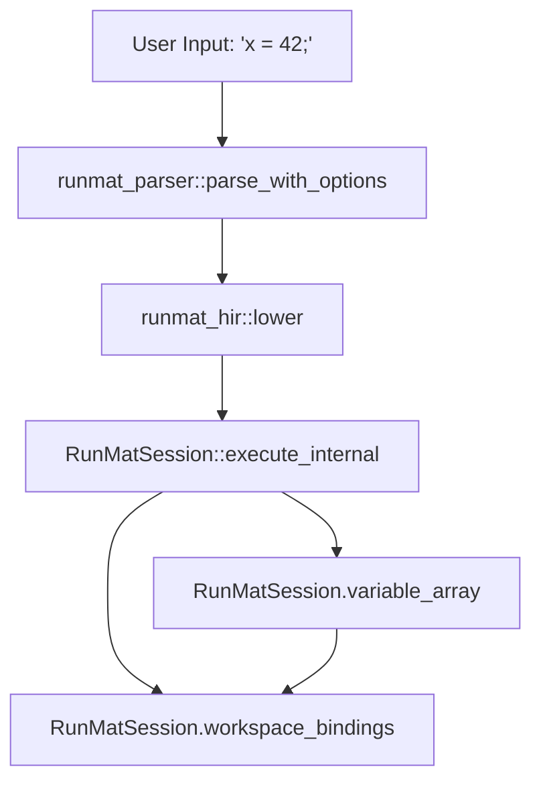
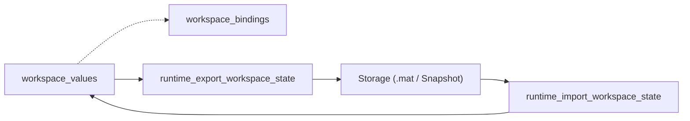

# Workspace & Variable Management

<details>
<summary>Relevant source files</summary>

- [crates/runmat-core/src/execution/mod.rs](https://github.com/runmat-org/runmat/blob/82685330/crates/runmat-core/src/execution/mod.rs)
- [crates/runmat-core/src/execution/types.rs](https://github.com/runmat-org/runmat/blob/82685330/crates/runmat-core/src/execution/types.rs)
- [crates/runmat-core/src/fusion/mod.rs](https://github.com/runmat-org/runmat/blob/82685330/crates/runmat-core/src/fusion/mod.rs)
- [crates/runmat-core/src/fusion/snapshot.rs](https://github.com/runmat-org/runmat/blob/82685330/crates/runmat-core/src/fusion/snapshot.rs)
- [crates/runmat-core/src/fusion/types.rs](https://github.com/runmat-org/runmat/blob/82685330/crates/runmat-core/src/fusion/types.rs)
- [crates/runmat-core/src/profiling.rs](https://github.com/runmat-org/runmat/blob/82685330/crates/runmat-core/src/profiling.rs)
- [crates/runmat-core/src/session/compile.rs](https://github.com/runmat-org/runmat/blob/82685330/crates/runmat-core/src/session/compile.rs)
- [crates/runmat-core/src/session/config.rs](https://github.com/runmat-org/runmat/blob/82685330/crates/runmat-core/src/session/config.rs)
- [crates/runmat-core/src/session/mod.rs](https://github.com/runmat-org/runmat/blob/82685330/crates/runmat-core/src/session/mod.rs)
- [crates/runmat-core/src/session/run.rs](https://github.com/runmat-org/runmat/blob/82685330/crates/runmat-core/src/session/run.rs)
- [crates/runmat-core/src/session/snapshot.rs](https://github.com/runmat-org/runmat/blob/82685330/crates/runmat-core/src/session/snapshot.rs)
- [crates/runmat-core/src/session/workspace.rs](https://github.com/runmat-org/runmat/blob/82685330/crates/runmat-core/src/session/workspace.rs)
- [crates/runmat-core/src/tests.rs](https://github.com/runmat-org/runmat/blob/82685330/crates/runmat-core/src/tests.rs)
- [crates/runmat-core/src/workspace/emit.rs](https://github.com/runmat-org/runmat/blob/82685330/crates/runmat-core/src/workspace/emit.rs)
- [crates/runmat-core/src/workspace/mod.rs](https://github.com/runmat-org/runmat/blob/82685330/crates/runmat-core/src/workspace/mod.rs)
- [crates/runmat-core/tests/fusion_regressions.rs](https://github.com/runmat-org/runmat/blob/82685330/crates/runmat-core/tests/fusion_regressions.rs)
- [crates/runmat-runtime/src/builtins/introspection/who.rs](https://github.com/runmat-org/runmat/blob/82685330/crates/runmat-runtime/src/builtins/introspection/who.rs)
- [crates/runmat-runtime/src/builtins/introspection/whos.rs](https://github.com/runmat-org/runmat/blob/82685330/crates/runmat-runtime/src/builtins/introspection/whos.rs)
- [crates/runmat-runtime/src/builtins/io/data/mod.rs](https://github.com/runmat-org/runmat/blob/82685330/crates/runmat-runtime/src/builtins/io/data/mod.rs)
- [crates/runmat-runtime/src/builtins/io/filetext/filewrite.rs](https://github.com/runmat-org/runmat/blob/82685330/crates/runmat-runtime/src/builtins/io/filetext/filewrite.rs)
- [crates/runmat-runtime/src/builtins/io/mat/load.rs](https://github.com/runmat-org/runmat/blob/82685330/crates/runmat-runtime/src/builtins/io/mat/load.rs)
- [crates/runmat-runtime/src/builtins/io/mat/save.rs](https://github.com/runmat-org/runmat/blob/82685330/crates/runmat-runtime/src/builtins/io/mat/save.rs)
- [crates/runmat-runtime/src/builtins/io/tabular/csvread.rs](https://github.com/runmat-org/runmat/blob/82685330/crates/runmat-runtime/src/builtins/io/tabular/csvread.rs)
- [crates/runmat-runtime/src/builtins/io/tabular/csvwrite.rs](https://github.com/runmat-org/runmat/blob/82685330/crates/runmat-runtime/src/builtins/io/tabular/csvwrite.rs)
- [crates/runmat-runtime/src/builtins/io/tabular/dlmread.rs](https://github.com/runmat-org/runmat/blob/82685330/crates/runmat-runtime/src/builtins/io/tabular/dlmread.rs)
- [crates/runmat-runtime/src/builtins/io/tabular/dlmwrite.rs](https://github.com/runmat-org/runmat/blob/82685330/crates/runmat-runtime/src/builtins/io/tabular/dlmwrite.rs)
- [crates/runmat-runtime/src/builtins/io/tabular/readmatrix.rs](https://github.com/runmat-org/runmat/blob/82685330/crates/runmat-runtime/src/builtins/io/tabular/readmatrix.rs)
- [crates/runmat-runtime/src/builtins/io/tabular/writematrix.rs](https://github.com/runmat-org/runmat/blob/82685330/crates/runmat-runtime/src/builtins/io/tabular/writematrix.rs)
- [crates/runmat-runtime/src/data/mod.rs](https://github.com/runmat-org/runmat/blob/82685330/crates/runmat-runtime/src/data/mod.rs)
- [crates/runmat-vm/src/ops/cells.rs](https://github.com/runmat-org/runmat/blob/82685330/crates/runmat-vm/src/ops/cells.rs)
- [docs/LARGE_DATASET_PERSISTENCE.md](https://github.com/runmat-org/runmat/blob/82685330/docs/LARGE_DATASET_PERSISTENCE.md?plain=1)

</details>

The `RunMatSession` manages an interactive MATLAB-compatible execution environment. It maintains the lifecycle of variables, maps them to virtual machine slots, handles synchronization between CPU and GPU memory, and provides mechanisms for exporting or restoring session state.

## Workspace Architecture

The workspace is implemented as a mapping between variable names and their values, integrated directly into the `runmat-vm` execution model. Unlike a simple hash map, it uses a tiered approach to ensure high-performance access during bytecode execution while maintaining a stable ABI for host interactions.

### Data Structures and Mapping

- `variable_array`: A `Vec<Value>` in `RunMatSession` that serves as the flat register file for the VM [crates/runmat-core/src/session/mod.rs #66](https://github.com/runmat-org/runmat/blob/82685330/crates/runmat-core/src/session/mod.rs#L66-L66)
- `workspace_bindings`: A `HashMap<String, SessionWorkspaceBinding>` that maps variable names to their current slot in the `variable_array` and their stable `WorkspaceBindingKey` [crates/runmat-core/src/session/mod.rs #68](https://github.com/runmat-org/runmat/blob/82685330/crates/runmat-core/src/session/mod.rs#L68-L68)
- `workspace_values`: A `HashMap<String, Value>` used for persistent storage of variables between execution requests [crates/runmat-core/src/session/mod.rs #70](https://github.com/runmat-org/runmat/blob/82685330/crates/runmat-core/src/session/mod.rs#L70-L70)

### Variable Lifecycle Diagram

This diagram illustrates the flow of a variable from a source assignment to its representation in the session workspace.

Variable Assignment and Slot Mapping



<details>
<summary>Rendered SVG</summary>

```svg
<svg id="mermaid-2wzfi5eqwv1" xmlns="http://www.w3.org/2000/svg" xmlns:xlink="http://www.w3.org/1999/xlink" class="flowchart" style="max-width: 100%; touch-action: none; user-select: none; cursor: grab; min-height: fit-content; max-height: 100%;" viewBox="0 0 567.91015625 738" role="graphics-document document" aria-roledescription="flowchart-v2" preserveAspectRatio="xMidYMid meet"><style>#mermaid-2wzfi5eqwv1{font-family:ui-sans-serif,-apple-system,system-ui,Segoe UI,Helvetica;font-size:16px;fill:#ccc;}@keyframes edge-animation-frame{from{stroke-dashoffset:0;}}@keyframes dash{to{stroke-dashoffset:0;}}#mermaid-2wzfi5eqwv1 .edge-animation-slow{stroke-dasharray:9,5!important;stroke-dashoffset:900;animation:dash 50s linear infinite;stroke-linecap:round;}#mermaid-2wzfi5eqwv1 .edge-animation-fast{stroke-dasharray:9,5!important;stroke-dashoffset:900;animation:dash 20s linear infinite;stroke-linecap:round;}#mermaid-2wzfi5eqwv1 .error-icon{fill:#333;}#mermaid-2wzfi5eqwv1 .error-text{fill:#cccccc;stroke:#cccccc;}#mermaid-2wzfi5eqwv1 .edge-thickness-normal{stroke-width:1px;}#mermaid-2wzfi5eqwv1 .edge-thickness-thick{stroke-width:3.5px;}#mermaid-2wzfi5eqwv1 .edge-pattern-solid{stroke-dasharray:0;}#mermaid-2wzfi5eqwv1 .edge-thickness-invisible{stroke-width:0;fill:none;}#mermaid-2wzfi5eqwv1 .edge-pattern-dashed{stroke-dasharray:3;}#mermaid-2wzfi5eqwv1 .edge-pattern-dotted{stroke-dasharray:2;}#mermaid-2wzfi5eqwv1 .marker{fill:#666;stroke:#666;}#mermaid-2wzfi5eqwv1 .marker.cross{stroke:#666;}#mermaid-2wzfi5eqwv1 svg{font-family:ui-sans-serif,-apple-system,system-ui,Segoe UI,Helvetica;font-size:16px;}#mermaid-2wzfi5eqwv1 p{margin:0;}#mermaid-2wzfi5eqwv1 .label{font-family:ui-sans-serif,-apple-system,system-ui,Segoe UI,Helvetica;color:#fff;}#mermaid-2wzfi5eqwv1 .cluster-label text{fill:#fff;}#mermaid-2wzfi5eqwv1 .cluster-label span{color:#fff;}#mermaid-2wzfi5eqwv1 .cluster-label span p{background-color:transparent;}#mermaid-2wzfi5eqwv1 .label text,#mermaid-2wzfi5eqwv1 span{fill:#fff;color:#fff;}#mermaid-2wzfi5eqwv1 .node rect,#mermaid-2wzfi5eqwv1 .node circle,#mermaid-2wzfi5eqwv1 .node ellipse,#mermaid-2wzfi5eqwv1 .node polygon,#mermaid-2wzfi5eqwv1 .node path{fill:#111;stroke:#222;stroke-width:1px;}#mermaid-2wzfi5eqwv1 .rough-node .label text,#mermaid-2wzfi5eqwv1 .node .label text,#mermaid-2wzfi5eqwv1 .image-shape .label,#mermaid-2wzfi5eqwv1 .icon-shape .label{text-anchor:middle;}#mermaid-2wzfi5eqwv1 .node .katex path{fill:#000;stroke:#000;stroke-width:1px;}#mermaid-2wzfi5eqwv1 .rough-node .label,#mermaid-2wzfi5eqwv1 .node .label,#mermaid-2wzfi5eqwv1 .image-shape .label,#mermaid-2wzfi5eqwv1 .icon-shape .label{text-align:center;}#mermaid-2wzfi5eqwv1 .node.clickable{cursor:pointer;}#mermaid-2wzfi5eqwv1 .root .anchor path{fill:#666!important;stroke-width:0;stroke:#666;}#mermaid-2wzfi5eqwv1 .arrowheadPath{fill:#0b0b0b;}#mermaid-2wzfi5eqwv1 .edgePath .path{stroke:#666;stroke-width:1px;}#mermaid-2wzfi5eqwv1 .flowchart-link{stroke:#666;fill:none;}#mermaid-2wzfi5eqwv1 .edgeLabel{background-color:#161616;text-align:center;}#mermaid-2wzfi5eqwv1 .edgeLabel p{background-color:#161616;}#mermaid-2wzfi5eqwv1 .edgeLabel rect{opacity:0.5;background-color:#161616;fill:#161616;}#mermaid-2wzfi5eqwv1 .labelBkg{background-color:rgba(22, 22, 22, 0.5);}#mermaid-2wzfi5eqwv1 .cluster rect{fill:#161616;stroke:#222;stroke-width:1px;}#mermaid-2wzfi5eqwv1 .cluster text{fill:#fff;}#mermaid-2wzfi5eqwv1 .cluster span{color:#fff;}#mermaid-2wzfi5eqwv1 div.mermaidTooltip{position:absolute;text-align:center;max-width:200px;padding:2px;font-family:ui-sans-serif,-apple-system,system-ui,Segoe UI,Helvetica;font-size:12px;background:#333;border:1px solid hsl(0, 0%, 10%);border-radius:2px;pointer-events:none;z-index:100;}#mermaid-2wzfi5eqwv1 .flowchartTitleText{text-anchor:middle;font-size:18px;fill:#ccc;}#mermaid-2wzfi5eqwv1 rect.text{fill:none;stroke-width:0;}#mermaid-2wzfi5eqwv1 .icon-shape,#mermaid-2wzfi5eqwv1 .image-shape{background-color:#161616;text-align:center;}#mermaid-2wzfi5eqwv1 .icon-shape p,#mermaid-2wzfi5eqwv1 .image-shape p{background-color:#161616;padding:2px;}#mermaid-2wzfi5eqwv1 .icon-shape .label rect,#mermaid-2wzfi5eqwv1 .image-shape .label rect{opacity:0.5;background-color:#161616;fill:#161616;}#mermaid-2wzfi5eqwv1 .label-icon{display:inline-block;height:1em;overflow:visible;vertical-align:-0.125em;}#mermaid-2wzfi5eqwv1 .node .label-icon path{fill:currentColor;stroke:revert;stroke-width:revert;}#mermaid-2wzfi5eqwv1 .node .neo-node{stroke:#222;}#mermaid-2wzfi5eqwv1 [data-look="neo"].node rect,#mermaid-2wzfi5eqwv1 [data-look="neo"].cluster rect,#mermaid-2wzfi5eqwv1 [data-look="neo"].node polygon{stroke:url(#mermaid-2wzfi5eqwv1-gradient);filter:drop-shadow( 1px 2px 2px rgba(185,185,185,1));}#mermaid-2wzfi5eqwv1 [data-look="neo"].node path{stroke:url(#mermaid-2wzfi5eqwv1-gradient);stroke-width:1px;}#mermaid-2wzfi5eqwv1 [data-look="neo"].node .outer-path{filter:drop-shadow( 1px 2px 2px rgba(185,185,185,1));}#mermaid-2wzfi5eqwv1 [data-look="neo"].node .neo-line path{stroke:#222;filter:none;}#mermaid-2wzfi5eqwv1 [data-look="neo"].node circle{stroke:url(#mermaid-2wzfi5eqwv1-gradient);filter:drop-shadow( 1px 2px 2px rgba(185,185,185,1));}#mermaid-2wzfi5eqwv1 [data-look="neo"].node circle .state-start{fill:#000000;}#mermaid-2wzfi5eqwv1 [data-look="neo"].icon-shape .icon{fill:url(#mermaid-2wzfi5eqwv1-gradient);filter:drop-shadow( 1px 2px 2px rgba(185,185,185,1));}#mermaid-2wzfi5eqwv1 [data-look="neo"].icon-shape .icon-neo path{stroke:url(#mermaid-2wzfi5eqwv1-gradient);filter:drop-shadow( 1px 2px 2px rgba(185,185,185,1));}#mermaid-2wzfi5eqwv1 :root{--mermaid-font-family:"trebuchet ms",verdana,arial,sans-serif;}</style><g><marker id="mermaid-2wzfi5eqwv1_flowchart-v2-pointEnd" class="marker flowchart-v2" viewBox="0 0 10 10" refX="5" refY="5" markerUnits="userSpaceOnUse" markerWidth="8" markerHeight="8" orient="auto"><path d="M 0 0 L 10 5 L 0 10 z" class="arrowMarkerPath" style="stroke-width: 1; stroke-dasharray: 1, 0;"></path></marker><marker id="mermaid-2wzfi5eqwv1_flowchart-v2-pointStart" class="marker flowchart-v2" viewBox="0 0 10 10" refX="4.5" refY="5" markerUnits="userSpaceOnUse" markerWidth="8" markerHeight="8" orient="auto"><path d="M 0 5 L 10 10 L 10 0 z" class="arrowMarkerPath" style="stroke-width: 1; stroke-dasharray: 1, 0;"></path></marker><marker id="mermaid-2wzfi5eqwv1_flowchart-v2-pointEnd-margin" class="marker flowchart-v2" viewBox="0 0 11.5 14" refX="11.5" refY="7" markerUnits="userSpaceOnUse" markerWidth="10.5" markerHeight="14" orient="auto"><path d="M 0 0 L 11.5 7 L 0 14 z" class="arrowMarkerPath" style="stroke-width: 0; stroke-dasharray: 1, 0;"></path></marker><marker id="mermaid-2wzfi5eqwv1_flowchart-v2-pointStart-margin" class="marker flowchart-v2" viewBox="0 0 11.5 14" refX="1" refY="7" markerUnits="userSpaceOnUse" markerWidth="11.5" markerHeight="14" orient="auto"><polygon points="0,7 11.5,14 11.5,0" class="arrowMarkerPath" style="stroke-width: 0; stroke-dasharray: 1, 0;"></polygon></marker><marker id="mermaid-2wzfi5eqwv1_flowchart-v2-circleEnd" class="marker flowchart-v2" viewBox="0 0 10 10" refX="11" refY="5" markerUnits="userSpaceOnUse" markerWidth="11" markerHeight="11" orient="auto"><circle cx="5" cy="5" r="5" class="arrowMarkerPath" style="stroke-width: 1; stroke-dasharray: 1, 0;"></circle></marker><marker id="mermaid-2wzfi5eqwv1_flowchart-v2-circleStart" class="marker flowchart-v2" viewBox="0 0 10 10" refX="-1" refY="5" markerUnits="userSpaceOnUse" markerWidth="11" markerHeight="11" orient="auto"><circle cx="5" cy="5" r="5" class="arrowMarkerPath" style="stroke-width: 1; stroke-dasharray: 1, 0;"></circle></marker><marker id="mermaid-2wzfi5eqwv1_flowchart-v2-circleEnd-margin" class="marker flowchart-v2" viewBox="0 0 10 10" refY="5" refX="12.25" markerUnits="userSpaceOnUse" markerWidth="14" markerHeight="14" orient="auto"><circle cx="5" cy="5" r="5" class="arrowMarkerPath" style="stroke-width: 0; stroke-dasharray: 1, 0;"></circle></marker><marker id="mermaid-2wzfi5eqwv1_flowchart-v2-circleStart-margin" class="marker flowchart-v2" viewBox="0 0 10 10" refX="-2" refY="5" markerUnits="userSpaceOnUse" markerWidth="14" markerHeight="14" orient="auto"><circle cx="5" cy="5" r="5" class="arrowMarkerPath" style="stroke-width: 0; stroke-dasharray: 1, 0;"></circle></marker><marker id="mermaid-2wzfi5eqwv1_flowchart-v2-crossEnd" class="marker cross flowchart-v2" viewBox="0 0 11 11" refX="12" refY="5.2" markerUnits="userSpaceOnUse" markerWidth="11" markerHeight="11" orient="auto"><path d="M 1,1 l 9,9 M 10,1 l -9,9" class="arrowMarkerPath" style="stroke-width: 2; stroke-dasharray: 1, 0;"></path></marker><marker id="mermaid-2wzfi5eqwv1_flowchart-v2-crossStart" class="marker cross flowchart-v2" viewBox="0 0 11 11" refX="-1" refY="5.2" markerUnits="userSpaceOnUse" markerWidth="11" markerHeight="11" orient="auto"><path d="M 1,1 l 9,9 M 10,1 l -9,9" class="arrowMarkerPath" style="stroke-width: 2; stroke-dasharray: 1, 0;"></path></marker><marker id="mermaid-2wzfi5eqwv1_flowchart-v2-crossEnd-margin" class="marker cross flowchart-v2" viewBox="0 0 15 15" refX="17.7" refY="7.5" markerUnits="userSpaceOnUse" markerWidth="12" markerHeight="12" orient="auto"><path d="M 1,1 L 14,14 M 1,14 L 14,1" class="arrowMarkerPath" style="stroke-width: 2.5;"></path></marker><marker id="mermaid-2wzfi5eqwv1_flowchart-v2-crossStart-margin" class="marker cross flowchart-v2" viewBox="0 0 15 15" refX="-3.5" refY="7.5" markerUnits="userSpaceOnUse" markerWidth="12" markerHeight="12" orient="auto"><path d="M 1,1 L 14,14 M 1,14 L 14,1" class="arrowMarkerPath" style="stroke-width: 2.5; stroke-dasharray: 1, 0;"></path></marker><g class="root"><g class="clusters"><g class="cluster" id="mermaid-2wzfi5eqwv1-subGraph1" data-look="classic"><rect style="" x="8" y="162" width="551.91015625" height="568"></rect><g class="cluster-label" transform="translate(217.166015625, 162)"><foreignObject width="133.578125" height="24"><div style="display: table-cell; white-space: nowrap; line-height: 1.5;" xmlns="http://www.w3.org/1999/xhtml"><span class="nodeLabel"><p>Code Entity Space</p></span></div></foreignObject></g></g><g class="cluster" id="mermaid-2wzfi5eqwv1-subGraph0" data-look="classic"><rect style="" x="123.109375" y="8" width="272.796875" height="104"></rect><g class="cluster-label" transform="translate(170.5625, 8)"><foreignObject width="177.890625" height="24"><div style="display: table-cell; white-space: nowrap; line-height: 1.5;" xmlns="http://www.w3.org/1999/xhtml"><span class="nodeLabel"><p>Natural Language Space</p></span></div></foreignObject></g></g></g><g class="edgePaths"><path d="M259.508,87L259.508,91.167C259.508,95.333,259.508,103.667,259.508,112C259.508,120.333,259.508,128.667,259.508,137C259.508,145.333,259.508,153.667,259.508,161.333C259.508,169,259.508,176,259.508,179.5L259.508,183" id="mermaid-2wzfi5eqwv1-L_Input_Parser_0" class="edge-thickness-normal edge-pattern-solid edge-thickness-normal edge-pattern-solid flowchart-link" style=";" data-edge="true" data-et="edge" data-id="L_Input_Parser_0" data-points="W3sieCI6MjU5LjUwNzgxMjUsInkiOjg3fSx7IngiOjI1OS41MDc4MTI1LCJ5IjoxMTJ9LHsieCI6MjU5LjUwNzgxMjUsInkiOjEzN30seyJ4IjoyNTkuNTA3ODEyNSwieSI6MTYyfSx7IngiOjI1OS41MDc4MTI1LCJ5IjoxODd9XQ==" data-look="classic" marker-end="url(#mermaid-2wzfi5eqwv1_flowchart-v2-pointEnd)"></path><path d="M259.508,241L259.508,245.167C259.508,249.333,259.508,257.667,259.508,265.333C259.508,273,259.508,280,259.508,283.5L259.508,287" id="mermaid-2wzfi5eqwv1-L_Parser_Lowering_0" class="edge-thickness-normal edge-pattern-solid edge-thickness-normal edge-pattern-solid flowchart-link" style=";" data-edge="true" data-et="edge" data-id="L_Parser_Lowering_0" data-points="W3sieCI6MjU5LjUwNzgxMjUsInkiOjI0MX0seyJ4IjoyNTkuNTA3ODEyNSwieSI6MjY2fSx7IngiOjI1OS41MDc4MTI1LCJ5IjoyOTF9XQ==" data-look="classic" marker-end="url(#mermaid-2wzfi5eqwv1_flowchart-v2-pointEnd)"></path><path d="M259.508,345L259.508,349.167C259.508,353.333,259.508,361.667,259.508,369.333C259.508,377,259.508,384,259.508,387.5L259.508,391" id="mermaid-2wzfi5eqwv1-L_Lowering_Session_0" class="edge-thickness-normal edge-pattern-solid edge-thickness-normal edge-pattern-solid flowchart-link" style=";" data-edge="true" data-et="edge" data-id="L_Lowering_Session_0" data-points="W3sieCI6MjU5LjUwNzgxMjUsInkiOjM0NX0seyJ4IjoyNTkuNTA3ODEyNSwieSI6MzcwfSx7IngiOjI1OS41MDc4MTI1LCJ5IjozOTV9XQ==" data-look="classic" marker-end="url(#mermaid-2wzfi5eqwv1_flowchart-v2-pointEnd)"></path><path d="M307.979,449L319.05,455.167C330.12,461.333,352.261,473.667,363.332,485.333C374.402,497,374.402,508,374.402,513.5L374.402,519" id="mermaid-2wzfi5eqwv1-L_Session_VarArray_0" class="edge-thickness-normal edge-pattern-solid edge-thickness-normal edge-pattern-solid flowchart-link" style=";" data-edge="true" data-et="edge" data-id="L_Session_VarArray_0" data-points="W3sieCI6MzA3Ljk3ODk0Mjg3MTA5Mzc1LCJ5Ijo0NDl9LHsieCI6Mzc0LjQwMjM0Mzc1LCJ5Ijo0ODZ9LHsieCI6Mzc0LjQwMjM0Mzc1LCJ5Ijo1MjN9XQ==" data-look="classic" marker-end="url(#mermaid-2wzfi5eqwv1_flowchart-v2-pointEnd)"></path><path d="M211.037,449L199.966,455.167C188.896,461.333,166.754,473.667,155.684,490.5C144.613,507.333,144.613,528.667,144.613,550C144.613,571.333,144.613,592.667,155.101,609.176C165.59,625.684,186.566,637.369,197.054,643.211L207.542,649.053" id="mermaid-2wzfi5eqwv1-L_Session_Bindings_0" class="edge-thickness-normal edge-pattern-solid edge-thickness-normal edge-pattern-solid flowchart-link" style=";" data-edge="true" data-et="edge" data-id="L_Session_Bindings_0" data-points="W3sieCI6MjExLjAzNjY4MjEyODkwNjI1LCJ5Ijo0NDl9LHsieCI6MTQ0LjYxMzI4MTI1LCJ5Ijo0ODZ9LHsieCI6MTQ0LjYxMzI4MTI1LCJ5Ijo1NTB9LHsieCI6MTQ0LjYxMzI4MTI1LCJ5Ijo2MTR9LHsieCI6MjExLjAzNjY4MjEyODkwNjI1LCJ5Ijo2NTF9XQ==" data-look="classic" marker-end="url(#mermaid-2wzfi5eqwv1_flowchart-v2-pointEnd)"></path><path d="M374.402,577L374.402,583.167C374.402,589.333,374.402,601.667,363.914,613.676C353.426,625.684,332.45,637.369,321.962,643.211L311.473,649.053" id="mermaid-2wzfi5eqwv1-L_VarArray_Bindings_0" class="edge-thickness-normal edge-pattern-solid edge-thickness-normal edge-pattern-solid flowchart-link" style=";" data-edge="true" data-et="edge" data-id="L_VarArray_Bindings_0" data-points="W3sieCI6Mzc0LjQwMjM0Mzc1LCJ5Ijo1Nzd9LHsieCI6Mzc0LjQwMjM0Mzc1LCJ5Ijo2MTR9LHsieCI6MzA3Ljk3ODk0Mjg3MTA5Mzc1LCJ5Ijo2NTF9XQ==" data-look="classic" marker-end="url(#mermaid-2wzfi5eqwv1_flowchart-v2-pointEnd)"></path></g><g class="edgeLabels"><g class="edgeLabel"><g class="label" data-id="L_Input_Parser_0" transform="translate(0, 0)"><foreignObject width="0" height="0"><div style="display: table-cell; white-space: nowrap; line-height: 1.5; max-width: 200px; text-align: center;" xmlns="http://www.w3.org/1999/xhtml" class="labelBkg"><span class="edgeLabel"></span></div></foreignObject></g></g><g class="edgeLabel"><g class="label" data-id="L_Parser_Lowering_0" transform="translate(0, 0)"><foreignObject width="0" height="0"><div style="display: table-cell; white-space: nowrap; line-height: 1.5; max-width: 200px; text-align: center;" xmlns="http://www.w3.org/1999/xhtml" class="labelBkg"><span class="edgeLabel"></span></div></foreignObject></g></g><g class="edgeLabel"><g class="label" data-id="L_Lowering_Session_0" transform="translate(0, 0)"><foreignObject width="0" height="0"><div style="display: table-cell; white-space: nowrap; line-height: 1.5; max-width: 200px; text-align: center;" xmlns="http://www.w3.org/1999/xhtml" class="labelBkg"><span class="edgeLabel"></span></div></foreignObject></g></g><g class="edgeLabel" transform="translate(374.40234375, 486)"><g class="label" data-id="L_Session_VarArray_0" transform="translate(-49.4765625, -12)"><foreignObject width="98.953125" height="24"><div style="display: table-cell; white-space: nowrap; line-height: 1.5; max-width: 200px; text-align: center;" xmlns="http://www.w3.org/1999/xhtml" class="labelBkg"><span class="edgeLabel"><p>Allocates Slot</p></span></div></foreignObject></g></g><g class="edgeLabel" transform="translate(144.61328125, 550)"><g class="label" data-id="L_Session_Bindings_0" transform="translate(-56, -12)"><foreignObject width="112" height="24"><div style="display: table-cell; white-space: nowrap; line-height: 1.5; max-width: 200px; text-align: center;" xmlns="http://www.w3.org/1999/xhtml" class="labelBkg"><span class="edgeLabel"><p>Maps 'x' to Slot</p></span></div></foreignObject></g></g><g class="edgeLabel" transform="translate(374.40234375, 614)"><g class="label" data-id="L_VarArray_Bindings_0" transform="translate(-35.7734375, -12)"><foreignObject width="71.546875" height="24"><div style="display: table-cell; white-space: nowrap; line-height: 1.5; max-width: 200px; text-align: center;" xmlns="http://www.w3.org/1999/xhtml" class="labelBkg"><span class="edgeLabel"><p>Slot Index</p></span></div></foreignObject></g></g></g><g class="nodes"><g class="node default" id="mermaid-2wzfi5eqwv1-flowchart-Input-0" data-look="classic" transform="translate(259.5078125, 60)"><rect class="basic label-container" style="" x="-101.3984375" y="-27" width="202.796875" height="54"></rect><g class="label" style="" transform="translate(-71.3984375, -12)"><rect></rect><foreignObject width="142.796875" height="24"><div style="display: table-cell; white-space: nowrap; line-height: 1.5; max-width: 200px; text-align: center;" xmlns="http://www.w3.org/1999/xhtml"><span class="nodeLabel"><p>User Input: 'x = 42;'</p></span></div></foreignObject></g></g><g class="node default" id="mermaid-2wzfi5eqwv1-flowchart-Parser-1" data-look="classic" transform="translate(259.5078125, 214)"><rect class="basic label-container" style="" x="-158.2421875" y="-27" width="316.484375" height="54"></rect><g class="label" style="" transform="translate(-128.2421875, -12)"><rect></rect><foreignObject width="256.484375" height="24"><div style="display: table; white-space: break-spaces; line-height: 1.5; max-width: 200px; text-align: center; width: 200px;" xmlns="http://www.w3.org/1999/xhtml"><span class="nodeLabel"><p>runmat_parser::parse_with_options</p></span></div></foreignObject></g></g><g class="node default" id="mermaid-2wzfi5eqwv1-flowchart-Lowering-2" data-look="classic" transform="translate(259.5078125, 318)"><rect class="basic label-container" style="" x="-93.40625" y="-27" width="186.8125" height="54"></rect><g class="label" style="" transform="translate(-63.40625, -12)"><rect></rect><foreignObject width="126.8125" height="24"><div style="display: table-cell; white-space: nowrap; line-height: 1.5; max-width: 200px; text-align: center;" xmlns="http://www.w3.org/1999/xhtml"><span class="nodeLabel"><p>runmat_hir::lower</p></span></div></foreignObject></g></g><g class="node default" id="mermaid-2wzfi5eqwv1-flowchart-Session-3" data-look="classic" transform="translate(259.5078125, 422)"><rect class="basic label-container" style="" x="-150.46875" y="-27" width="300.9375" height="54"></rect><g class="label" style="" transform="translate(-120.46875, -12)"><rect></rect><foreignObject width="240.9375" height="24"><div style="display: table; white-space: break-spaces; line-height: 1.5; max-width: 200px; text-align: center; width: 200px;" xmlns="http://www.w3.org/1999/xhtml"><span class="nodeLabel"><p>RunMatSession::execute_internal</p></span></div></foreignObject></g></g><g class="node default" id="mermaid-2wzfi5eqwv1-flowchart-VarArray-4" data-look="classic" transform="translate(374.40234375, 550)"><rect class="basic label-container" style="" x="-138.7890625" y="-27" width="277.578125" height="54"></rect><g class="label" style="" transform="translate(-108.7890625, -12)"><rect></rect><foreignObject width="217.578125" height="24"><div style="display: table; white-space: break-spaces; line-height: 1.5; max-width: 200px; text-align: center; width: 200px;" xmlns="http://www.w3.org/1999/xhtml"><span class="nodeLabel"><p>RunMatSession.variable_array</p></span></div></foreignObject></g></g><g class="node default" id="mermaid-2wzfi5eqwv1-flowchart-Bindings-5" data-look="classic" transform="translate(259.5078125, 678)"><rect class="basic label-container" style="" x="-162.2265625" y="-27" width="324.453125" height="54"></rect><g class="label" style="" transform="translate(-132.2265625, -12)"><rect></rect><foreignObject width="264.453125" height="24"><div style="display: table; white-space: break-spaces; line-height: 1.5; max-width: 200px; text-align: center; width: 200px;" xmlns="http://www.w3.org/1999/xhtml"><span class="nodeLabel"><p>RunMatSession.workspace_bindings</p></span></div></foreignObject></g></g></g></g></g><defs><filter id="mermaid-2wzfi5eqwv1-drop-shadow" height="130%" width="130%"><feDropShadow dx="4" dy="4" stdDeviation="0" flood-opacity="0.06" flood-color="#000000"></feDropShadow></filter></defs><defs><filter id="mermaid-2wzfi5eqwv1-drop-shadow-small" height="150%" width="150%"><feDropShadow dx="2" dy="2" stdDeviation="0" flood-opacity="0.06" flood-color="#000000"></feDropShadow></filter></defs><linearGradient id="mermaid-2wzfi5eqwv1-gradient" gradientUnits="objectBoundingBox" x1="0%" y1="0%" x2="100%" y2="0%"><stop offset="0%" stop-color="#333" stop-opacity="1"></stop><stop offset="100%" stop-color="hsl(-120, 0%, 3.3333333333%)" stop-opacity="1"></stop></linearGradient></svg>
```

</details>

Sources: [crates/runmat-core/src/session/compile.rs #61-108](https://github.com/runmat-org/runmat/blob/82685330/crates/runmat-core/src/session/compile.rs#L61-L108) [crates/runmat-core/src/session/run.rs #112-116](https://github.com/runmat-org/runmat/blob/82685330/crates/runmat-core/src/session/run.rs#L112-L116) [crates/runmat-core/src/session/mod.rs #130-133](https://github.com/runmat-org/runmat/blob/82685330/crates/runmat-core/src/session/mod.rs#L130-L133)

## Variable Materialization

RunMat supports "lazy" residency, particularly for GPU-accelerated tensors. `MaterializedVariable` represents the state of a variable that has been synchronized for host-side consumption.

### Partial and GPU Materialization

When a variable resides on the GPU (`WorkspaceResidency::Gpu`), the session can perform partial materialization to avoid expensive bus transfers for large datasets.

- `materialize_variable`: Fetches the value from the VM/GPU into a format suitable for the host [crates/runmat-core/src/session/mod.rs #37-44](https://github.com/runmat-org/runmat/blob/82685330/crates/runmat-core/src/session/mod.rs#L37-L44)
- `WorkspaceMaterializeOptions`: Allows specifying limits on the number of elements returned (`MATERIALIZE_DEFAULT_LIMIT`) [crates/runmat-core/src/session/mod.rs #43-44](https://github.com/runmat-org/runmat/blob/82685330/crates/runmat-core/src/session/mod.rs#L43-L44)
- GPU Preview: For large GPU tensors, `gather_gpu_preview_values` is used to fetch only a subset of data for display purposes [crates/runmat-core/src/session/mod.rs #39](https://github.com/runmat-org/runmat/blob/82685330/crates/runmat-core/src/session/mod.rs#L39-L39)

### Workspace Entry Metadata

Each variable in the workspace is described by a `WorkspaceEntry`, which includes:

- Residency: Whether the data is on `Cpu`, `Gpu`, or `Virtual` [crates/runmat-core/src/workspace/mod.rs #11](https://github.com/runmat-org/runmat/blob/82685330/crates/runmat-core/src/workspace/mod.rs#L11-L11)
- Type Info: Formatted strings like "1000x1 vector" [crates/runmat-core/src/workspace/emit.rs #54-111](https://github.com/runmat-org/runmat/blob/82685330/crates/runmat-core/src/workspace/emit.rs#L54-L111)
- Size: Approximate memory footprint in bytes via `approximate_size_bytes` [crates/runmat-core/src/workspace/emit.rs #6-9](https://github.com/runmat-org/runmat/blob/82685330/crates/runmat-core/src/workspace/emit.rs#L6-L9)

Sources: [crates/runmat-core/src/session/mod.rs #37-44](https://github.com/runmat-org/runmat/blob/82685330/crates/runmat-core/src/session/mod.rs#L37-L44) [crates/runmat-core/src/workspace/emit.rs #54-111](https://github.com/runmat-org/runmat/blob/82685330/crates/runmat-core/src/workspace/emit.rs#L54-L111) [crates/runmat-core/src/workspace/mod.rs #11](https://github.com/runmat-org/runmat/blob/82685330/crates/runmat-core/src/workspace/mod.rs#L11-L11)

## The `ans` Implicit Assignment

RunMat follows MATLAB's convention for the `ans` variable. If an expression statement is not suppressed (no semicolon) and does not involve an assignment, the result is assigned to `ans`.

- Logic: The `determine_display_label_from_context` function checks if a statement is a "single stmt non-assign" or an "expression stmt" [crates/runmat-core/src/workspace/emit.rs #38-51](https://github.com/runmat-org/runmat/blob/82685330/crates/runmat-core/src/workspace/emit.rs#L38-L51)
- Implementation: The session identifies the final expression in the `HirAssembly` and, if the `FinalStmtEmitDisposition` is `Inline`, it performs the assignment to the `ans` binding [crates/runmat-core/src/workspace/emit.rs #16-31](https://github.com/runmat-org/runmat/blob/82685330/crates/runmat-core/src/workspace/emit.rs#L16-L31)

Sources: [crates/runmat-core/src/workspace/emit.rs #16-51](https://github.com/runmat-org/runmat/blob/82685330/crates/runmat-core/src/workspace/emit.rs#L16-L51) [crates/runmat-core/src/session/run.rs #49-79](https://github.com/runmat-org/runmat/blob/82685330/crates/runmat-core/src/session/run.rs#L49-L79)

## Export and Import State

Session state can be persisted and restored using specialized built-in functions that interface with the `RunMatSession` internals.

### Workspace Snapshots

- `WorkspaceSnapshot`: A point-in-time capture of all variables in the session [crates/runmat-core/src/workspace/mod.rs #42](https://github.com/runmat-org/runmat/blob/82685330/crates/runmat-core/src/workspace/mod.rs#L42-L42)
- `export_workspace_state`: Serializes the current `workspace_values` into a binary format [crates/runmat-core/src/session/mod.rs #10-12](https://github.com/runmat-org/runmat/blob/82685330/crates/runmat-core/src/session/mod.rs#L10-L12)
- `import_workspace_state`: Replays a snapshot into the current session, merging or overwriting existing bindings based on the `WorkspaceReplayMode` [crates/runmat-core/src/session/mod.rs #10-12](https://github.com/runmat-org/runmat/blob/82685330/crates/runmat-core/src/session/mod.rs#L10-L12)

### Data Flow: Export/Import



<details>
<summary>Rendered SVG</summary>

```svg
<svg id="mermaid-it43svcp98" xmlns="http://www.w3.org/2000/svg" xmlns:xlink="http://www.w3.org/1999/xlink" class="flowchart" style="max-width: 100%; touch-action: none; user-select: none; cursor: grab; min-height: fit-content; max-height: 100%;" viewBox="-0.0048098392378506105 0 1402.3221196784757 345" role="graphics-document document" aria-roledescription="flowchart-v2" preserveAspectRatio="xMidYMid meet"><style>#mermaid-it43svcp98{font-family:ui-sans-serif,-apple-system,system-ui,Segoe UI,Helvetica;font-size:16px;fill:#ccc;}@keyframes edge-animation-frame{from{stroke-dashoffset:0;}}@keyframes dash{to{stroke-dashoffset:0;}}#mermaid-it43svcp98 .edge-animation-slow{stroke-dasharray:9,5!important;stroke-dashoffset:900;animation:dash 50s linear infinite;stroke-linecap:round;}#mermaid-it43svcp98 .edge-animation-fast{stroke-dasharray:9,5!important;stroke-dashoffset:900;animation:dash 20s linear infinite;stroke-linecap:round;}#mermaid-it43svcp98 .error-icon{fill:#333;}#mermaid-it43svcp98 .error-text{fill:#cccccc;stroke:#cccccc;}#mermaid-it43svcp98 .edge-thickness-normal{stroke-width:1px;}#mermaid-it43svcp98 .edge-thickness-thick{stroke-width:3.5px;}#mermaid-it43svcp98 .edge-pattern-solid{stroke-dasharray:0;}#mermaid-it43svcp98 .edge-thickness-invisible{stroke-width:0;fill:none;}#mermaid-it43svcp98 .edge-pattern-dashed{stroke-dasharray:3;}#mermaid-it43svcp98 .edge-pattern-dotted{stroke-dasharray:2;}#mermaid-it43svcp98 .marker{fill:#666;stroke:#666;}#mermaid-it43svcp98 .marker.cross{stroke:#666;}#mermaid-it43svcp98 svg{font-family:ui-sans-serif,-apple-system,system-ui,Segoe UI,Helvetica;font-size:16px;}#mermaid-it43svcp98 p{margin:0;}#mermaid-it43svcp98 .label{font-family:ui-sans-serif,-apple-system,system-ui,Segoe UI,Helvetica;color:#fff;}#mermaid-it43svcp98 .cluster-label text{fill:#fff;}#mermaid-it43svcp98 .cluster-label span{color:#fff;}#mermaid-it43svcp98 .cluster-label span p{background-color:transparent;}#mermaid-it43svcp98 .label text,#mermaid-it43svcp98 span{fill:#fff;color:#fff;}#mermaid-it43svcp98 .node rect,#mermaid-it43svcp98 .node circle,#mermaid-it43svcp98 .node ellipse,#mermaid-it43svcp98 .node polygon,#mermaid-it43svcp98 .node path{fill:#111;stroke:#222;stroke-width:1px;}#mermaid-it43svcp98 .rough-node .label text,#mermaid-it43svcp98 .node .label text,#mermaid-it43svcp98 .image-shape .label,#mermaid-it43svcp98 .icon-shape .label{text-anchor:middle;}#mermaid-it43svcp98 .node .katex path{fill:#000;stroke:#000;stroke-width:1px;}#mermaid-it43svcp98 .rough-node .label,#mermaid-it43svcp98 .node .label,#mermaid-it43svcp98 .image-shape .label,#mermaid-it43svcp98 .icon-shape .label{text-align:center;}#mermaid-it43svcp98 .node.clickable{cursor:pointer;}#mermaid-it43svcp98 .root .anchor path{fill:#666!important;stroke-width:0;stroke:#666;}#mermaid-it43svcp98 .arrowheadPath{fill:#0b0b0b;}#mermaid-it43svcp98 .edgePath .path{stroke:#666;stroke-width:1px;}#mermaid-it43svcp98 .flowchart-link{stroke:#666;fill:none;}#mermaid-it43svcp98 .edgeLabel{background-color:#161616;text-align:center;}#mermaid-it43svcp98 .edgeLabel p{background-color:#161616;}#mermaid-it43svcp98 .edgeLabel rect{opacity:0.5;background-color:#161616;fill:#161616;}#mermaid-it43svcp98 .labelBkg{background-color:rgba(22, 22, 22, 0.5);}#mermaid-it43svcp98 .cluster rect{fill:#161616;stroke:#222;stroke-width:1px;}#mermaid-it43svcp98 .cluster text{fill:#fff;}#mermaid-it43svcp98 .cluster span{color:#fff;}#mermaid-it43svcp98 div.mermaidTooltip{position:absolute;text-align:center;max-width:200px;padding:2px;font-family:ui-sans-serif,-apple-system,system-ui,Segoe UI,Helvetica;font-size:12px;background:#333;border:1px solid hsl(0, 0%, 10%);border-radius:2px;pointer-events:none;z-index:100;}#mermaid-it43svcp98 .flowchartTitleText{text-anchor:middle;font-size:18px;fill:#ccc;}#mermaid-it43svcp98 rect.text{fill:none;stroke-width:0;}#mermaid-it43svcp98 .icon-shape,#mermaid-it43svcp98 .image-shape{background-color:#161616;text-align:center;}#mermaid-it43svcp98 .icon-shape p,#mermaid-it43svcp98 .image-shape p{background-color:#161616;padding:2px;}#mermaid-it43svcp98 .icon-shape .label rect,#mermaid-it43svcp98 .image-shape .label rect{opacity:0.5;background-color:#161616;fill:#161616;}#mermaid-it43svcp98 .label-icon{display:inline-block;height:1em;overflow:visible;vertical-align:-0.125em;}#mermaid-it43svcp98 .node .label-icon path{fill:currentColor;stroke:revert;stroke-width:revert;}#mermaid-it43svcp98 .node .neo-node{stroke:#222;}#mermaid-it43svcp98 [data-look="neo"].node rect,#mermaid-it43svcp98 [data-look="neo"].cluster rect,#mermaid-it43svcp98 [data-look="neo"].node polygon{stroke:url(#mermaid-it43svcp98-gradient);filter:drop-shadow( 1px 2px 2px rgba(185,185,185,1));}#mermaid-it43svcp98 [data-look="neo"].node path{stroke:url(#mermaid-it43svcp98-gradient);stroke-width:1px;}#mermaid-it43svcp98 [data-look="neo"].node .outer-path{filter:drop-shadow( 1px 2px 2px rgba(185,185,185,1));}#mermaid-it43svcp98 [data-look="neo"].node .neo-line path{stroke:#222;filter:none;}#mermaid-it43svcp98 [data-look="neo"].node circle{stroke:url(#mermaid-it43svcp98-gradient);filter:drop-shadow( 1px 2px 2px rgba(185,185,185,1));}#mermaid-it43svcp98 [data-look="neo"].node circle .state-start{fill:#000000;}#mermaid-it43svcp98 [data-look="neo"].icon-shape .icon{fill:url(#mermaid-it43svcp98-gradient);filter:drop-shadow( 1px 2px 2px rgba(185,185,185,1));}#mermaid-it43svcp98 [data-look="neo"].icon-shape .icon-neo path{stroke:url(#mermaid-it43svcp98-gradient);filter:drop-shadow( 1px 2px 2px rgba(185,185,185,1));}#mermaid-it43svcp98 :root{--mermaid-font-family:"trebuchet ms",verdana,arial,sans-serif;}</style><g><marker id="mermaid-it43svcp98_flowchart-v2-pointEnd" class="marker flowchart-v2" viewBox="0 0 10 10" refX="5" refY="5" markerUnits="userSpaceOnUse" markerWidth="8" markerHeight="8" orient="auto"><path d="M 0 0 L 10 5 L 0 10 z" class="arrowMarkerPath" style="stroke-width: 1; stroke-dasharray: 1, 0;"></path></marker><marker id="mermaid-it43svcp98_flowchart-v2-pointStart" class="marker flowchart-v2" viewBox="0 0 10 10" refX="4.5" refY="5" markerUnits="userSpaceOnUse" markerWidth="8" markerHeight="8" orient="auto"><path d="M 0 5 L 10 10 L 10 0 z" class="arrowMarkerPath" style="stroke-width: 1; stroke-dasharray: 1, 0;"></path></marker><marker id="mermaid-it43svcp98_flowchart-v2-pointEnd-margin" class="marker flowchart-v2" viewBox="0 0 11.5 14" refX="11.5" refY="7" markerUnits="userSpaceOnUse" markerWidth="10.5" markerHeight="14" orient="auto"><path d="M 0 0 L 11.5 7 L 0 14 z" class="arrowMarkerPath" style="stroke-width: 0; stroke-dasharray: 1, 0;"></path></marker><marker id="mermaid-it43svcp98_flowchart-v2-pointStart-margin" class="marker flowchart-v2" viewBox="0 0 11.5 14" refX="1" refY="7" markerUnits="userSpaceOnUse" markerWidth="11.5" markerHeight="14" orient="auto"><polygon points="0,7 11.5,14 11.5,0" class="arrowMarkerPath" style="stroke-width: 0; stroke-dasharray: 1, 0;"></polygon></marker><marker id="mermaid-it43svcp98_flowchart-v2-circleEnd" class="marker flowchart-v2" viewBox="0 0 10 10" refX="11" refY="5" markerUnits="userSpaceOnUse" markerWidth="11" markerHeight="11" orient="auto"><circle cx="5" cy="5" r="5" class="arrowMarkerPath" style="stroke-width: 1; stroke-dasharray: 1, 0;"></circle></marker><marker id="mermaid-it43svcp98_flowchart-v2-circleStart" class="marker flowchart-v2" viewBox="0 0 10 10" refX="-1" refY="5" markerUnits="userSpaceOnUse" markerWidth="11" markerHeight="11" orient="auto"><circle cx="5" cy="5" r="5" class="arrowMarkerPath" style="stroke-width: 1; stroke-dasharray: 1, 0;"></circle></marker><marker id="mermaid-it43svcp98_flowchart-v2-circleEnd-margin" class="marker flowchart-v2" viewBox="0 0 10 10" refY="5" refX="12.25" markerUnits="userSpaceOnUse" markerWidth="14" markerHeight="14" orient="auto"><circle cx="5" cy="5" r="5" class="arrowMarkerPath" style="stroke-width: 0; stroke-dasharray: 1, 0;"></circle></marker><marker id="mermaid-it43svcp98_flowchart-v2-circleStart-margin" class="marker flowchart-v2" viewBox="0 0 10 10" refX="-2" refY="5" markerUnits="userSpaceOnUse" markerWidth="14" markerHeight="14" orient="auto"><circle cx="5" cy="5" r="5" class="arrowMarkerPath" style="stroke-width: 0; stroke-dasharray: 1, 0;"></circle></marker><marker id="mermaid-it43svcp98_flowchart-v2-crossEnd" class="marker cross flowchart-v2" viewBox="0 0 11 11" refX="12" refY="5.2" markerUnits="userSpaceOnUse" markerWidth="11" markerHeight="11" orient="auto"><path d="M 1,1 l 9,9 M 10,1 l -9,9" class="arrowMarkerPath" style="stroke-width: 2; stroke-dasharray: 1, 0;"></path></marker><marker id="mermaid-it43svcp98_flowchart-v2-crossStart" class="marker cross flowchart-v2" viewBox="0 0 11 11" refX="-1" refY="5.2" markerUnits="userSpaceOnUse" markerWidth="11" markerHeight="11" orient="auto"><path d="M 1,1 l 9,9 M 10,1 l -9,9" class="arrowMarkerPath" style="stroke-width: 2; stroke-dasharray: 1, 0;"></path></marker><marker id="mermaid-it43svcp98_flowchart-v2-crossEnd-margin" class="marker cross flowchart-v2" viewBox="0 0 15 15" refX="17.7" refY="7.5" markerUnits="userSpaceOnUse" markerWidth="12" markerHeight="12" orient="auto"><path d="M 1,1 L 14,14 M 1,14 L 14,1" class="arrowMarkerPath" style="stroke-width: 2.5;"></path></marker><marker id="mermaid-it43svcp98_flowchart-v2-crossStart-margin" class="marker cross flowchart-v2" viewBox="0 0 15 15" refX="-3.5" refY="7.5" markerUnits="userSpaceOnUse" markerWidth="12" markerHeight="12" orient="auto"><path d="M 1,1 L 14,14 M 1,14 L 14,1" class="arrowMarkerPath" style="stroke-width: 2.5; stroke-dasharray: 1, 0;"></path></marker><g class="root"><g class="clusters"><g class="cluster" id="mermaid-it43svcp98-subGraph1" data-look="classic"><rect style="" x="369.78125" y="8" width="1024.53125" height="165"></rect><g class="cluster-label" transform="translate(817.8984375, 8)"><foreignObject width="128.296875" height="24"><div style="display: table-cell; white-space: nowrap; line-height: 1.5;" xmlns="http://www.w3.org/1999/xhtml"><span class="nodeLabel"><p>Persistence Layer</p></span></div></foreignObject></g></g><g class="cluster" id="mermaid-it43svcp98-subGraph0" data-look="classic"><rect style="" x="8" y="193" width="712.765625" height="144"></rect><g class="cluster-label" transform="translate(304.1640625, 193)"><foreignObject width="120.4375" height="24"><div style="display: table-cell; white-space: nowrap; line-height: 1.5;" xmlns="http://www.w3.org/1999/xhtml"><span class="nodeLabel"><p>Session Runtime</p></span></div></foreignObject></g></g></g><g class="edgePaths"><path d="M226.25,233.769L238.211,231.141C250.172,228.513,274.094,223.256,298.016,220.628C321.938,218,345.859,218,381.223,198.263C416.588,178.526,463.394,139.053,486.797,119.316L510.2,99.579" id="mermaid-it43svcp98-L_Values_Export_0" class="edge-thickness-normal edge-pattern-solid edge-thickness-normal edge-pattern-solid flowchart-link" style=";" data-edge="true" data-et="edge" data-id="L_Values_Export_0" data-points="W3sieCI6MjI2LjI1LCJ5IjoyMzMuNzY4ODU5NjA4NDI1MzR9LHsieCI6Mjk4LjAxNTYyNSwieSI6MjE4fSx7IngiOjM2OS43ODEyNSwieSI6MjE4fSx7IngiOjUxMy4yNTc5NzA4NjE0ODY1LCJ5Ijo5N31d" data-look="classic" marker-end="url(#mermaid-it43svcp98_flowchart-v2-pointEnd)"></path><path d="M695.766,70L699.932,70C704.099,70,712.432,70,720.766,70C729.099,70,737.432,70,745.099,70C752.766,70,759.766,70,763.266,70L766.766,70" id="mermaid-it43svcp98-L_Export_Disk_0" class="edge-thickness-normal edge-pattern-solid edge-thickness-normal edge-pattern-solid flowchart-link" style=";" data-edge="true" data-et="edge" data-id="L_Export_Disk_0" data-points="W3sieCI6Njk1Ljc2NTYyNSwieSI6NzB9LHsieCI6NzIwLjc2NTYyNSwieSI6NzB9LHsieCI6NzQ1Ljc2NTYyNSwieSI6NzB9LHsieCI6NzcwLjc2NTYyNSwieSI6NzB9XQ==" data-look="classic" marker-end="url(#mermaid-it43svcp98_flowchart-v2-pointEnd)"></path><path d="M1017.203,70L1021.37,70C1025.536,70,1033.87,70,1041.541,70.418C1049.213,70.836,1056.222,71.672,1059.727,72.09L1063.231,72.508" id="mermaid-it43svcp98-L_Disk_Import_0" class="edge-thickness-normal edge-pattern-solid edge-thickness-normal edge-pattern-solid flowchart-link" style=";" data-edge="true" data-et="edge" data-id="L_Disk_Import_0" data-points="W3sieCI6MTAxNy4yMDMxMjUsInkiOjcwfSx7IngiOjEwNDIuMjAzMTI1LCJ5Ijo3MH0seyJ4IjoxMDY3LjIwMzEyNSwieSI6NzIuOTgyMDI3OTU2NTEyMX1d" data-look="classic" marker-end="url(#mermaid-it43svcp98_flowchart-v2-pointEnd)"></path><path d="M1102.319,118L1092.3,120.333C1082.281,122.667,1062.242,127.333,1027.519,129.667C992.797,132,943.391,132,893.984,132C844.578,132,795.172,132,766.302,162.833C737.432,193.667,729.099,255.333,695.684,286.167C662.268,317,603.771,317,545.273,317C486.776,317,428.279,317,387.069,317C345.859,317,321.938,317,294.759,311.397C267.58,305.794,237.145,294.588,221.928,288.985L206.71,283.382" id="mermaid-it43svcp98-L_Import_Values_0" class="edge-thickness-normal edge-pattern-solid edge-thickness-normal edge-pattern-solid flowchart-link" style=";" data-edge="true" data-et="edge" data-id="L_Import_Values_0" data-points="W3sieCI6MTEwMi4zMTkzNTk3NTYwOTc2LCJ5IjoxMTh9LHsieCI6MTA0Mi4yMDMxMjUsInkiOjEzMn0seyJ4Ijo4OTMuOTg0Mzc1LCJ5IjoxMzJ9LHsieCI6NzQ1Ljc2NTYyNSwieSI6MTMyfSx7IngiOjcyMC43NjU2MjUsInkiOjMxN30seyJ4Ijo1NDUuMjczNDM3NSwieSI6MzE3fSx7IngiOjM2OS43ODEyNSwieSI6MzE3fSx7IngiOjI5OC4wMTU2MjUsInkiOjMxN30seyJ4IjoyMDIuOTU2NDAxMjA5Njc3NDQsInkiOjI4Mn1d" data-look="classic" marker-end="url(#mermaid-it43svcp98_flowchart-v2-pointEnd)"></path><path d="M226.25,255L238.211,255C250.172,255,274.094,255,298.016,255C321.938,255,345.859,255,369,255C392.141,255,414.5,255,425.68,255L436.859,255" id="mermaid-it43svcp98-L_Values_Bindings_0" class="edge-thickness-normal edge-pattern-dotted edge-thickness-normal edge-pattern-solid flowchart-link" style=";" data-edge="true" data-et="edge" data-id="L_Values_Bindings_0" data-points="W3sieCI6MjI2LjI1LCJ5IjoyNTV9LHsieCI6Mjk4LjAxNTYyNSwieSI6MjU1fSx7IngiOjM2OS43ODEyNSwieSI6MjU1fSx7IngiOjQ0MC44NTkzNzUsInkiOjI1NX1d" data-look="classic" marker-end="url(#mermaid-it43svcp98_flowchart-v2-pointEnd)"></path></g><g class="edgeLabels"><g class="edgeLabel"><g class="label" data-id="L_Values_Export_0" transform="translate(0, 0)"><foreignObject width="0" height="0"><div style="display: table-cell; white-space: nowrap; line-height: 1.5; max-width: 200px; text-align: center;" xmlns="http://www.w3.org/1999/xhtml" class="labelBkg"><span class="edgeLabel"></span></div></foreignObject></g></g><g class="edgeLabel"><g class="label" data-id="L_Export_Disk_0" transform="translate(0, 0)"><foreignObject width="0" height="0"><div style="display: table-cell; white-space: nowrap; line-height: 1.5; max-width: 200px; text-align: center;" xmlns="http://www.w3.org/1999/xhtml" class="labelBkg"><span class="edgeLabel"></span></div></foreignObject></g></g><g class="edgeLabel"><g class="label" data-id="L_Disk_Import_0" transform="translate(0, 0)"><foreignObject width="0" height="0"><div style="display: table-cell; white-space: nowrap; line-height: 1.5; max-width: 200px; text-align: center;" xmlns="http://www.w3.org/1999/xhtml" class="labelBkg"><span class="edgeLabel"></span></div></foreignObject></g></g><g class="edgeLabel"><g class="label" data-id="L_Import_Values_0" transform="translate(0, 0)"><foreignObject width="0" height="0"><div style="display: table-cell; white-space: nowrap; line-height: 1.5; max-width: 200px; text-align: center;" xmlns="http://www.w3.org/1999/xhtml" class="labelBkg"><span class="edgeLabel"></span></div></foreignObject></g></g><g class="edgeLabel" transform="translate(298.015625, 255)"><g class="label" data-id="L_Values_Bindings_0" transform="translate(-46.765625, -12)"><foreignObject width="93.53125" height="24"><div style="display: table-cell; white-space: nowrap; line-height: 1.5; max-width: 200px; text-align: center;" xmlns="http://www.w3.org/1999/xhtml" class="labelBkg"><span class="edgeLabel"><p>Update Slots</p></span></div></foreignObject></g></g></g><g class="nodes"><g class="node default" id="mermaid-it43svcp98-flowchart-Bindings-0" data-look="classic" transform="translate(545.2734375, 255)"><rect class="basic label-container" style="" x="-104.4140625" y="-27" width="208.828125" height="54"></rect><g class="label" style="" transform="translate(-74.4140625, -12)"><rect></rect><foreignObject width="148.828125" height="24"><div style="display: table-cell; white-space: nowrap; line-height: 1.5; max-width: 200px; text-align: center;" xmlns="http://www.w3.org/1999/xhtml"><span class="nodeLabel"><p>workspace_bindings</p></span></div></foreignObject></g></g><g class="node default" id="mermaid-it43svcp98-flowchart-Values-1" data-look="classic" transform="translate(129.625, 255)"><rect class="basic label-container" style="" x="-96.625" y="-27" width="193.25" height="54"></rect><g class="label" style="" transform="translate(-66.625, -12)"><rect></rect><foreignObject width="133.25" height="24"><div style="display: table-cell; white-space: nowrap; line-height: 1.5; max-width: 200px; text-align: center;" xmlns="http://www.w3.org/1999/xhtml"><span class="nodeLabel"><p>workspace_values</p></span></div></foreignObject></g></g><g class="node default" id="mermaid-it43svcp98-flowchart-Export-2" data-look="classic" transform="translate(545.2734375, 70)"><rect class="basic label-container" style="" x="-150.4921875" y="-27" width="300.984375" height="54"></rect><g class="label" style="" transform="translate(-120.4921875, -12)"><rect></rect><foreignObject width="240.984375" height="24"><div style="display: table; white-space: break-spaces; line-height: 1.5; max-width: 200px; text-align: center; width: 200px;" xmlns="http://www.w3.org/1999/xhtml"><span class="nodeLabel"><p>runtime_export_workspace_state</p></span></div></foreignObject></g></g><g class="node default" id="mermaid-it43svcp98-flowchart-Import-3" data-look="classic" transform="translate(1218.2578125, 91)"><rect class="basic label-container" style="" x="-151.0546875" y="-27" width="302.109375" height="54"></rect><g class="label" style="" transform="translate(-121.0546875, -12)"><rect></rect><foreignObject width="242.109375" height="24"><div style="display: table; white-space: break-spaces; line-height: 1.5; max-width: 200px; text-align: center; width: 200px;" xmlns="http://www.w3.org/1999/xhtml"><span class="nodeLabel"><p>runtime_import_workspace_state</p></span></div></foreignObject></g></g><g class="node default" id="mermaid-it43svcp98-flowchart-Disk-4" data-look="classic" transform="translate(893.984375, 70)"><rect class="basic label-container" style="" x="-123.21875" y="-27" width="246.4375" height="54"></rect><g class="label" style="" transform="translate(-93.21875, -12)"><rect></rect><foreignObject width="186.4375" height="24"><div style="display: table-cell; white-space: nowrap; line-height: 1.5; max-width: 200px; text-align: center;" xmlns="http://www.w3.org/1999/xhtml"><span class="nodeLabel"><p>Storage (.mat / Snapshot)</p></span></div></foreignObject></g></g></g></g></g><defs><filter id="mermaid-it43svcp98-drop-shadow" height="130%" width="130%"><feDropShadow dx="4" dy="4" stdDeviation="0" flood-opacity="0.06" flood-color="#000000"></feDropShadow></filter></defs><defs><filter id="mermaid-it43svcp98-drop-shadow-small" height="150%" width="150%"><feDropShadow dx="2" dy="2" stdDeviation="0" flood-opacity="0.06" flood-color="#000000"></feDropShadow></filter></defs><linearGradient id="mermaid-it43svcp98-gradient" gradientUnits="objectBoundingBox" x1="0%" y1="0%" x2="100%" y2="0%"><stop offset="0%" stop-color="#333" stop-opacity="1"></stop><stop offset="100%" stop-color="hsl(-120, 0%, 3.3333333333%)" stop-opacity="1"></stop></linearGradient></svg>
```

</details>

Sources: [crates/runmat-core/src/session/mod.rs #10-12](https://github.com/runmat-org/runmat/blob/82685330/crates/runmat-core/src/session/mod.rs#L10-L12) [crates/runmat-core/src/session/workspace.rs #1-10](https://github.com/runmat-org/runmat/blob/82685330/crates/runmat-core/src/session/workspace.rs#L1-L10)

## Workspace Deltas and Outcomes

Every execution request returns an `ExecutionOutcome` containing a `WorkspaceDelta`. This allows host applications (like the CLI or WASM wrapper) to react to changes without polling the entire workspace.

- `upserts`: A list of `WorkspaceBindingKey` and `Value` pairs that were added or modified during the execution [crates/runmat-core/src/tests.rs #93-104](https://github.com/runmat-org/runmat/blob/82685330/crates/runmat-core/src/tests.rs#L93-L104)
- `removals`: A list of keys for variables that were cleared (e.g., via the `clear` command) [crates/runmat-core/src/tests.rs #157-162](https://github.com/runmat-org/runmat/blob/82685330/crates/runmat-core/src/tests.rs#L157-L162)
- `effects`: High-level observations like `WorkspaceEffectKind::Clear` [crates/runmat-core/src/tests.rs #163-168](https://github.com/runmat-org/runmat/blob/82685330/crates/runmat-core/src/tests.rs#L163-L168)

Sources: [crates/runmat-core/src/tests.rs #88-169](https://github.com/runmat-org/runmat/blob/82685330/crates/runmat-core/src/tests.rs#L88-L169) [crates/runmat-core/src/session/run.rs #49-79](https://github.com/runmat-org/runmat/blob/82685330/crates/runmat-core/src/session/run.rs#L49-L79)
