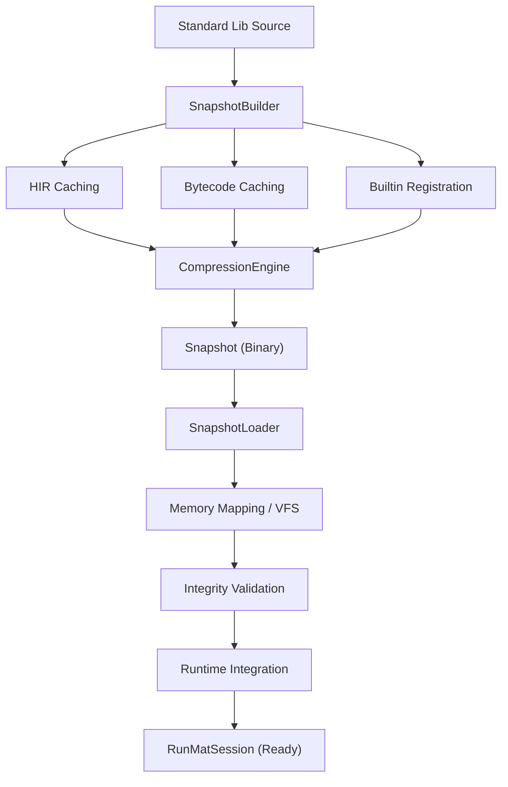

# Snapshots & Fast Startup

<details>
<summary>Relevant source files</summary>

- [bindings/ts/package-lock.json](https://github.com/runmat-org/runmat/blob/82685330/bindings/ts/package-lock.json)
- [bindings/ts/package.json](https://github.com/runmat-org/runmat/blob/82685330/bindings/ts/package.json)
- [bindings/ts/scripts/sync-wasm-artifacts.cjs](https://github.com/runmat-org/runmat/blob/82685330/bindings/ts/scripts/sync-wasm-artifacts.cjs)
- [crates/runmat-plot/src/core/depth.rs](https://github.com/runmat-org/runmat/blob/82685330/crates/runmat-plot/src/core/depth.rs)
- [crates/runmat-plot/src/gpu/shaders/vertex/grid_plane.rs](https://github.com/runmat-org/runmat/blob/82685330/crates/runmat-plot/src/gpu/shaders/vertex/grid_plane.rs)
- [crates/runmat-runtime/src/builtins/wasm_registry.rs](https://github.com/runmat-org/runmat/blob/82685330/crates/runmat-runtime/src/builtins/wasm_registry.rs)
- [crates/runmat-snapshot/src/builder.rs](https://github.com/runmat-org/runmat/blob/82685330/crates/runmat-snapshot/src/builder.rs)
- [crates/runmat-snapshot/src/compression.rs](https://github.com/runmat-org/runmat/blob/82685330/crates/runmat-snapshot/src/compression.rs)
- [crates/runmat-snapshot/src/format.rs](https://github.com/runmat-org/runmat/blob/82685330/crates/runmat-snapshot/src/format.rs)
- [crates/runmat-snapshot/src/lib.rs](https://github.com/runmat-org/runmat/blob/82685330/crates/runmat-snapshot/src/lib.rs)
- [crates/runmat-snapshot/src/loader.rs](https://github.com/runmat-org/runmat/blob/82685330/crates/runmat-snapshot/src/loader.rs)
- [crates/runmat-snapshot/src/validation.rs](https://github.com/runmat-org/runmat/blob/82685330/crates/runmat-snapshot/src/validation.rs)
- [crates/runmat-snapshot/tests/format.rs](https://github.com/runmat-org/runmat/blob/82685330/crates/runmat-snapshot/tests/format.rs)

</details>

The `runmat-snapshot` crate provides a high-performance serialization system designed to eliminate the overhead of standard library initialization. By capturing the state of the standard library—including compiled bytecode, High-Level IR (HIR), and builtin function registries—into a binary format, RunMat achieves near-instantaneous startup times, which is particularly critical for WebAssembly (WASM) environments and CLI utility execution [crates/runmat-snapshot/src/lib.rs #1-11](https://github.com/runmat-org/runmat/blob/82685330/crates/runmat-snapshot/src/lib.rs#L1-L11)

### System Architecture

The snapshot system follows a multi-stage lifecycle where standard library components are analyzed, optimized, and serialized into a persistent format for later rapid loading.

#### Component Interaction Diagram

This diagram illustrates how the `runmat-snapshot` crate bridges the gap between the static standard library and the active runtime.



<details>
<summary>Rendered SVG</summary>

```svg
<svg id="mermaid-0514enj96sgp" xmlns="http://www.w3.org/2000/svg" xmlns:xlink="http://www.w3.org/1999/xlink" class="flowchart" style="max-width: 100%; touch-action: none; user-select: none; cursor: grab; min-height: fit-content; max-height: 100%;" viewBox="-12.814117938339677 0 766.8469858766794 1106" role="graphics-document document" aria-roledescription="flowchart-v2" preserveAspectRatio="xMidYMid meet"><style>#mermaid-0514enj96sgp{font-family:ui-sans-serif,-apple-system,system-ui,Segoe UI,Helvetica;font-size:16px;fill:#ccc;}@keyframes edge-animation-frame{from{stroke-dashoffset:0;}}@keyframes dash{to{stroke-dashoffset:0;}}#mermaid-0514enj96sgp .edge-animation-slow{stroke-dasharray:9,5!important;stroke-dashoffset:900;animation:dash 50s linear infinite;stroke-linecap:round;}#mermaid-0514enj96sgp .edge-animation-fast{stroke-dasharray:9,5!important;stroke-dashoffset:900;animation:dash 20s linear infinite;stroke-linecap:round;}#mermaid-0514enj96sgp .error-icon{fill:#333;}#mermaid-0514enj96sgp .error-text{fill:#cccccc;stroke:#cccccc;}#mermaid-0514enj96sgp .edge-thickness-normal{stroke-width:1px;}#mermaid-0514enj96sgp .edge-thickness-thick{stroke-width:3.5px;}#mermaid-0514enj96sgp .edge-pattern-solid{stroke-dasharray:0;}#mermaid-0514enj96sgp .edge-thickness-invisible{stroke-width:0;fill:none;}#mermaid-0514enj96sgp .edge-pattern-dashed{stroke-dasharray:3;}#mermaid-0514enj96sgp .edge-pattern-dotted{stroke-dasharray:2;}#mermaid-0514enj96sgp .marker{fill:#666;stroke:#666;}#mermaid-0514enj96sgp .marker.cross{stroke:#666;}#mermaid-0514enj96sgp svg{font-family:ui-sans-serif,-apple-system,system-ui,Segoe UI,Helvetica;font-size:16px;}#mermaid-0514enj96sgp p{margin:0;}#mermaid-0514enj96sgp .label{font-family:ui-sans-serif,-apple-system,system-ui,Segoe UI,Helvetica;color:#fff;}#mermaid-0514enj96sgp .cluster-label text{fill:#fff;}#mermaid-0514enj96sgp .cluster-label span{color:#fff;}#mermaid-0514enj96sgp .cluster-label span p{background-color:transparent;}#mermaid-0514enj96sgp .label text,#mermaid-0514enj96sgp span{fill:#fff;color:#fff;}#mermaid-0514enj96sgp .node rect,#mermaid-0514enj96sgp .node circle,#mermaid-0514enj96sgp .node ellipse,#mermaid-0514enj96sgp .node polygon,#mermaid-0514enj96sgp .node path{fill:#111;stroke:#222;stroke-width:1px;}#mermaid-0514enj96sgp .rough-node .label text,#mermaid-0514enj96sgp .node .label text,#mermaid-0514enj96sgp .image-shape .label,#mermaid-0514enj96sgp .icon-shape .label{text-anchor:middle;}#mermaid-0514enj96sgp .node .katex path{fill:#000;stroke:#000;stroke-width:1px;}#mermaid-0514enj96sgp .rough-node .label,#mermaid-0514enj96sgp .node .label,#mermaid-0514enj96sgp .image-shape .label,#mermaid-0514enj96sgp .icon-shape .label{text-align:center;}#mermaid-0514enj96sgp .node.clickable{cursor:pointer;}#mermaid-0514enj96sgp .root .anchor path{fill:#666!important;stroke-width:0;stroke:#666;}#mermaid-0514enj96sgp .arrowheadPath{fill:#0b0b0b;}#mermaid-0514enj96sgp .edgePath .path{stroke:#666;stroke-width:1px;}#mermaid-0514enj96sgp .flowchart-link{stroke:#666;fill:none;}#mermaid-0514enj96sgp .edgeLabel{background-color:#161616;text-align:center;}#mermaid-0514enj96sgp .edgeLabel p{background-color:#161616;}#mermaid-0514enj96sgp .edgeLabel rect{opacity:0.5;background-color:#161616;fill:#161616;}#mermaid-0514enj96sgp .labelBkg{background-color:rgba(22, 22, 22, 0.5);}#mermaid-0514enj96sgp .cluster rect{fill:#161616;stroke:#222;stroke-width:1px;}#mermaid-0514enj96sgp .cluster text{fill:#fff;}#mermaid-0514enj96sgp .cluster span{color:#fff;}#mermaid-0514enj96sgp div.mermaidTooltip{position:absolute;text-align:center;max-width:200px;padding:2px;font-family:ui-sans-serif,-apple-system,system-ui,Segoe UI,Helvetica;font-size:12px;background:#333;border:1px solid hsl(0, 0%, 10%);border-radius:2px;pointer-events:none;z-index:100;}#mermaid-0514enj96sgp .flowchartTitleText{text-anchor:middle;font-size:18px;fill:#ccc;}#mermaid-0514enj96sgp rect.text{fill:none;stroke-width:0;}#mermaid-0514enj96sgp .icon-shape,#mermaid-0514enj96sgp .image-shape{background-color:#161616;text-align:center;}#mermaid-0514enj96sgp .icon-shape p,#mermaid-0514enj96sgp .image-shape p{background-color:#161616;padding:2px;}#mermaid-0514enj96sgp .icon-shape .label rect,#mermaid-0514enj96sgp .image-shape .label rect{opacity:0.5;background-color:#161616;fill:#161616;}#mermaid-0514enj96sgp .label-icon{display:inline-block;height:1em;overflow:visible;vertical-align:-0.125em;}#mermaid-0514enj96sgp .node .label-icon path{fill:currentColor;stroke:revert;stroke-width:revert;}#mermaid-0514enj96sgp .node .neo-node{stroke:#222;}#mermaid-0514enj96sgp [data-look="neo"].node rect,#mermaid-0514enj96sgp [data-look="neo"].cluster rect,#mermaid-0514enj96sgp [data-look="neo"].node polygon{stroke:url(#mermaid-0514enj96sgp-gradient);filter:drop-shadow( 1px 2px 2px rgba(185,185,185,1));}#mermaid-0514enj96sgp [data-look="neo"].node path{stroke:url(#mermaid-0514enj96sgp-gradient);stroke-width:1px;}#mermaid-0514enj96sgp [data-look="neo"].node .outer-path{filter:drop-shadow( 1px 2px 2px rgba(185,185,185,1));}#mermaid-0514enj96sgp [data-look="neo"].node .neo-line path{stroke:#222;filter:none;}#mermaid-0514enj96sgp [data-look="neo"].node circle{stroke:url(#mermaid-0514enj96sgp-gradient);filter:drop-shadow( 1px 2px 2px rgba(185,185,185,1));}#mermaid-0514enj96sgp [data-look="neo"].node circle .state-start{fill:#000000;}#mermaid-0514enj96sgp [data-look="neo"].icon-shape .icon{fill:url(#mermaid-0514enj96sgp-gradient);filter:drop-shadow( 1px 2px 2px rgba(185,185,185,1));}#mermaid-0514enj96sgp [data-look="neo"].icon-shape .icon-neo path{stroke:url(#mermaid-0514enj96sgp-gradient);filter:drop-shadow( 1px 2px 2px rgba(185,185,185,1));}#mermaid-0514enj96sgp :root{--mermaid-font-family:"trebuchet ms",verdana,arial,sans-serif;}</style><g><marker id="mermaid-0514enj96sgp_flowchart-v2-pointEnd" class="marker flowchart-v2" viewBox="0 0 10 10" refX="5" refY="5" markerUnits="userSpaceOnUse" markerWidth="8" markerHeight="8" orient="auto"><path d="M 0 0 L 10 5 L 0 10 z" class="arrowMarkerPath" style="stroke-width: 1; stroke-dasharray: 1, 0;"></path></marker><marker id="mermaid-0514enj96sgp_flowchart-v2-pointStart" class="marker flowchart-v2" viewBox="0 0 10 10" refX="4.5" refY="5" markerUnits="userSpaceOnUse" markerWidth="8" markerHeight="8" orient="auto"><path d="M 0 5 L 10 10 L 10 0 z" class="arrowMarkerPath" style="stroke-width: 1; stroke-dasharray: 1, 0;"></path></marker><marker id="mermaid-0514enj96sgp_flowchart-v2-pointEnd-margin" class="marker flowchart-v2" viewBox="0 0 11.5 14" refX="11.5" refY="7" markerUnits="userSpaceOnUse" markerWidth="10.5" markerHeight="14" orient="auto"><path d="M 0 0 L 11.5 7 L 0 14 z" class="arrowMarkerPath" style="stroke-width: 0; stroke-dasharray: 1, 0;"></path></marker><marker id="mermaid-0514enj96sgp_flowchart-v2-pointStart-margin" class="marker flowchart-v2" viewBox="0 0 11.5 14" refX="1" refY="7" markerUnits="userSpaceOnUse" markerWidth="11.5" markerHeight="14" orient="auto"><polygon points="0,7 11.5,14 11.5,0" class="arrowMarkerPath" style="stroke-width: 0; stroke-dasharray: 1, 0;"></polygon></marker><marker id="mermaid-0514enj96sgp_flowchart-v2-circleEnd" class="marker flowchart-v2" viewBox="0 0 10 10" refX="11" refY="5" markerUnits="userSpaceOnUse" markerWidth="11" markerHeight="11" orient="auto"><circle cx="5" cy="5" r="5" class="arrowMarkerPath" style="stroke-width: 1; stroke-dasharray: 1, 0;"></circle></marker><marker id="mermaid-0514enj96sgp_flowchart-v2-circleStart" class="marker flowchart-v2" viewBox="0 0 10 10" refX="-1" refY="5" markerUnits="userSpaceOnUse" markerWidth="11" markerHeight="11" orient="auto"><circle cx="5" cy="5" r="5" class="arrowMarkerPath" style="stroke-width: 1; stroke-dasharray: 1, 0;"></circle></marker><marker id="mermaid-0514enj96sgp_flowchart-v2-circleEnd-margin" class="marker flowchart-v2" viewBox="0 0 10 10" refY="5" refX="12.25" markerUnits="userSpaceOnUse" markerWidth="14" markerHeight="14" orient="auto"><circle cx="5" cy="5" r="5" class="arrowMarkerPath" style="stroke-width: 0; stroke-dasharray: 1, 0;"></circle></marker><marker id="mermaid-0514enj96sgp_flowchart-v2-circleStart-margin" class="marker flowchart-v2" viewBox="0 0 10 10" refX="-2" refY="5" markerUnits="userSpaceOnUse" markerWidth="14" markerHeight="14" orient="auto"><circle cx="5" cy="5" r="5" class="arrowMarkerPath" style="stroke-width: 0; stroke-dasharray: 1, 0;"></circle></marker><marker id="mermaid-0514enj96sgp_flowchart-v2-crossEnd" class="marker cross flowchart-v2" viewBox="0 0 11 11" refX="12" refY="5.2" markerUnits="userSpaceOnUse" markerWidth="11" markerHeight="11" orient="auto"><path d="M 1,1 l 9,9 M 10,1 l -9,9" class="arrowMarkerPath" style="stroke-width: 2; stroke-dasharray: 1, 0;"></path></marker><marker id="mermaid-0514enj96sgp_flowchart-v2-crossStart" class="marker cross flowchart-v2" viewBox="0 0 11 11" refX="-1" refY="5.2" markerUnits="userSpaceOnUse" markerWidth="11" markerHeight="11" orient="auto"><path d="M 1,1 l 9,9 M 10,1 l -9,9" class="arrowMarkerPath" style="stroke-width: 2; stroke-dasharray: 1, 0;"></path></marker><marker id="mermaid-0514enj96sgp_flowchart-v2-crossEnd-margin" class="marker cross flowchart-v2" viewBox="0 0 15 15" refX="17.7" refY="7.5" markerUnits="userSpaceOnUse" markerWidth="12" markerHeight="12" orient="auto"><path d="M 1,1 L 14,14 M 1,14 L 14,1" class="arrowMarkerPath" style="stroke-width: 2.5;"></path></marker><marker id="mermaid-0514enj96sgp_flowchart-v2-crossStart-margin" class="marker cross flowchart-v2" viewBox="0 0 15 15" refX="-3.5" refY="7.5" markerUnits="userSpaceOnUse" markerWidth="12" markerHeight="12" orient="auto"><path d="M 1,1 L 14,14 M 1,14 L 14,1" class="arrowMarkerPath" style="stroke-width: 2.5; stroke-dasharray: 1, 0;"></path></marker><g class="root"><g class="clusters"><g class="cluster" id="mermaid-0514enj96sgp-subGraph1" data-look="classic"><rect style="" x="201.53125" y="578" width="303.28125" height="520"></rect><g class="cluster-label" transform="translate(271.25, 578)"><foreignObject width="163.84375" height="24"><div style="display: table-cell; white-space: nowrap; line-height: 1.5;" xmlns="http://www.w3.org/1999/xhtml"><span class="nodeLabel"><p>Fast Startup (Runtime)</p></span></div></foreignObject></g></g><g class="cluster" id="mermaid-0514enj96sgp-subGraph0" data-look="classic"><rect style="" x="8" y="8" width="725.21875" height="520"></rect><g class="cluster-label" transform="translate(257.5859375, 8)"><foreignObject width="226.046875" height="24"><div style="display: table-cell; white-space: nowrap; line-height: 1.5;" xmlns="http://www.w3.org/1999/xhtml"><span class="nodeLabel"><p>Snapshot Creation (Build Time)</p></span></div></foreignObject></g></g></g><g class="edgePaths"><path d="M343.172,87L343.172,91.167C343.172,95.333,343.172,103.667,343.172,111.333C343.172,119,343.172,126,343.172,129.5L343.172,133" id="mermaid-0514enj96sgp-L_A_B_0" class="edge-thickness-normal edge-pattern-solid edge-thickness-normal edge-pattern-solid flowchart-link" style=";" data-edge="true" data-et="edge" data-id="L_A_B_0" data-points="W3sieCI6MzQzLjE3MTg3NSwieSI6ODd9LHsieCI6MzQzLjE3MTg3NSwieSI6MTEyfSx7IngiOjM0My4xNzE4NzUsInkiOjEzN31d" data-look="classic" marker-end="url(#mermaid-0514enj96sgp_flowchart-v2-pointEnd)"></path><path d="M253.469,186.109L233.255,191.09C213.042,196.072,172.615,206.036,152.401,214.518C132.188,223,132.188,230,132.188,233.5L132.188,237" id="mermaid-0514enj96sgp-L_B_C_0" class="edge-thickness-normal edge-pattern-solid edge-thickness-normal edge-pattern-solid flowchart-link" style=";" data-edge="true" data-et="edge" data-id="L_B_C_0" data-points="W3sieCI6MjUzLjQ2ODc1LCJ5IjoxODYuMTA4NTY4NDY2MjY2NzV9LHsieCI6MTMyLjE4NzUsInkiOjIxNn0seyJ4IjoxMzIuMTg3NSwieSI6MjQxfV0=" data-look="classic" marker-end="url(#mermaid-0514enj96sgp_flowchart-v2-pointEnd)"></path><path d="M348.364,191L349.165,195.167C349.967,199.333,351.569,207.667,352.371,215.333C353.172,223,353.172,230,353.172,233.5L353.172,237" id="mermaid-0514enj96sgp-L_B_D_0" class="edge-thickness-normal edge-pattern-solid edge-thickness-normal edge-pattern-solid flowchart-link" style=";" data-edge="true" data-et="edge" data-id="L_B_D_0" data-points="W3sieCI6MzQ4LjM2NDE4MjY5MjMwNzcsInkiOjE5MX0seyJ4IjozNTMuMTcxODc1LCJ5IjoyMTZ9LHsieCI6MzUzLjE3MTg3NSwieSI6MjQxfV0=" data-look="classic" marker-end="url(#mermaid-0514enj96sgp_flowchart-v2-pointEnd)"></path><path d="M432.875,182.347L460.297,187.956C487.719,193.565,542.563,204.782,569.984,213.891C597.406,223,597.406,230,597.406,233.5L597.406,237" id="mermaid-0514enj96sgp-L_B_E_0" class="edge-thickness-normal edge-pattern-solid edge-thickness-normal edge-pattern-solid flowchart-link" style=";" data-edge="true" data-et="edge" data-id="L_B_E_0" data-points="W3sieCI6NDMyLjg3NSwieSI6MTgyLjM0NzQ4OTM5ODMxNjAxfSx7IngiOjU5Ny40MDYyNSwieSI6MjE2fSx7IngiOjU5Ny40MDYyNSwieSI6MjQxfV0=" data-look="classic" marker-end="url(#mermaid-0514enj96sgp_flowchart-v2-pointEnd)"></path><path d="M132.188,295L132.188,299.167C132.188,303.333,132.188,311.667,151.313,320.334C170.439,329.001,208.691,338.002,227.816,342.503L246.942,347.003" id="mermaid-0514enj96sgp-L_C_F_0" class="edge-thickness-normal edge-pattern-solid edge-thickness-normal edge-pattern-solid flowchart-link" style=";" data-edge="true" data-et="edge" data-id="L_C_F_0" data-points="W3sieCI6MTMyLjE4NzUsInkiOjI5NX0seyJ4IjoxMzIuMTg3NSwieSI6MzIwfSx7IngiOjI1MC44MzU5Mzc1LCJ5IjozNDcuOTE5MjUzMzQwODc1MzR9XQ==" data-look="classic" marker-end="url(#mermaid-0514enj96sgp_flowchart-v2-pointEnd)"></path><path d="M353.172,295L353.172,299.167C353.172,303.333,353.172,311.667,353.172,319.333C353.172,327,353.172,334,353.172,337.5L353.172,341" id="mermaid-0514enj96sgp-L_D_F_0" class="edge-thickness-normal edge-pattern-solid edge-thickness-normal edge-pattern-solid flowchart-link" style=";" data-edge="true" data-et="edge" data-id="L_D_F_0" data-points="W3sieCI6MzUzLjE3MTg3NSwieSI6Mjk1fSx7IngiOjM1My4xNzE4NzUsInkiOjMyMH0seyJ4IjozNTMuMTcxODc1LCJ5IjozNDV9XQ==" data-look="classic" marker-end="url(#mermaid-0514enj96sgp_flowchart-v2-pointEnd)"></path><path d="M597.406,295L597.406,299.167C597.406,303.333,597.406,311.667,574.409,320.73C551.411,329.793,505.415,339.586,482.418,344.482L459.42,349.379" id="mermaid-0514enj96sgp-L_E_F_0" class="edge-thickness-normal edge-pattern-solid edge-thickness-normal edge-pattern-solid flowchart-link" style=";" data-edge="true" data-et="edge" data-id="L_E_F_0" data-points="W3sieCI6NTk3LjQwNjI1LCJ5IjoyOTV9LHsieCI6NTk3LjQwNjI1LCJ5IjozMjB9LHsieCI6NDU1LjUwNzgxMjUsInkiOjM1MC4yMTE2MzA3MzM3OTgyNH1d" data-look="classic" marker-end="url(#mermaid-0514enj96sgp_flowchart-v2-pointEnd)"></path><path d="M353.172,399L353.172,403.167C353.172,407.333,353.172,415.667,353.172,423.333C353.172,431,353.172,438,353.172,441.5L353.172,445" id="mermaid-0514enj96sgp-L_F_G_0" class="edge-thickness-normal edge-pattern-solid edge-thickness-normal edge-pattern-solid flowchart-link" style=";" data-edge="true" data-et="edge" data-id="L_F_G_0" data-points="W3sieCI6MzUzLjE3MTg3NSwieSI6Mzk5fSx7IngiOjM1My4xNzE4NzUsInkiOjQyNH0seyJ4IjozNTMuMTcxODc1LCJ5Ijo0NDl9XQ==" data-look="classic" marker-end="url(#mermaid-0514enj96sgp_flowchart-v2-pointEnd)"></path><path d="M353.172,503L353.172,507.167C353.172,511.333,353.172,519.667,353.172,528C353.172,536.333,353.172,544.667,353.172,553C353.172,561.333,353.172,569.667,353.172,577.333C353.172,585,353.172,592,353.172,595.5L353.172,599" id="mermaid-0514enj96sgp-L_G_H_0" class="edge-thickness-normal edge-pattern-solid edge-thickness-normal edge-pattern-solid flowchart-link" style=";" data-edge="true" data-et="edge" data-id="L_G_H_0" data-points="W3sieCI6MzUzLjE3MTg3NSwieSI6NTAzfSx7IngiOjM1My4xNzE4NzUsInkiOjUyOH0seyJ4IjozNTMuMTcxODc1LCJ5Ijo1NTN9LHsieCI6MzUzLjE3MTg3NSwieSI6NTc4fSx7IngiOjM1My4xNzE4NzUsInkiOjYwM31d" data-look="classic" marker-end="url(#mermaid-0514enj96sgp_flowchart-v2-pointEnd)"></path><path d="M353.172,657L353.172,661.167C353.172,665.333,353.172,673.667,353.172,681.333C353.172,689,353.172,696,353.172,699.5L353.172,703" id="mermaid-0514enj96sgp-L_H_I_0" class="edge-thickness-normal edge-pattern-solid edge-thickness-normal edge-pattern-solid flowchart-link" style=";" data-edge="true" data-et="edge" data-id="L_H_I_0" data-points="W3sieCI6MzUzLjE3MTg3NSwieSI6NjU3fSx7IngiOjM1My4xNzE4NzUsInkiOjY4Mn0seyJ4IjozNTMuMTcxODc1LCJ5Ijo3MDd9XQ==" data-look="classic" marker-end="url(#mermaid-0514enj96sgp_flowchart-v2-pointEnd)"></path><path d="M353.172,761L353.172,765.167C353.172,769.333,353.172,777.667,353.172,785.333C353.172,793,353.172,800,353.172,803.5L353.172,807" id="mermaid-0514enj96sgp-L_I_J_0" class="edge-thickness-normal edge-pattern-solid edge-thickness-normal edge-pattern-solid flowchart-link" style=";" data-edge="true" data-et="edge" data-id="L_I_J_0" data-points="W3sieCI6MzUzLjE3MTg3NSwieSI6NzYxfSx7IngiOjM1My4xNzE4NzUsInkiOjc4Nn0seyJ4IjozNTMuMTcxODc1LCJ5Ijo4MTF9XQ==" data-look="classic" marker-end="url(#mermaid-0514enj96sgp_flowchart-v2-pointEnd)"></path><path d="M353.172,865L353.172,869.167C353.172,873.333,353.172,881.667,353.172,889.333C353.172,897,353.172,904,353.172,907.5L353.172,911" id="mermaid-0514enj96sgp-L_J_K_0" class="edge-thickness-normal edge-pattern-solid edge-thickness-normal edge-pattern-solid flowchart-link" style=";" data-edge="true" data-et="edge" data-id="L_J_K_0" data-points="W3sieCI6MzUzLjE3MTg3NSwieSI6ODY1fSx7IngiOjM1My4xNzE4NzUsInkiOjg5MH0seyJ4IjozNTMuMTcxODc1LCJ5Ijo5MTV9XQ==" data-look="classic" marker-end="url(#mermaid-0514enj96sgp_flowchart-v2-pointEnd)"></path><path d="M353.172,969L353.172,973.167C353.172,977.333,353.172,985.667,353.172,993.333C353.172,1001,353.172,1008,353.172,1011.5L353.172,1015" id="mermaid-0514enj96sgp-L_K_L_0" class="edge-thickness-normal edge-pattern-solid edge-thickness-normal edge-pattern-solid flowchart-link" style=";" data-edge="true" data-et="edge" data-id="L_K_L_0" data-points="W3sieCI6MzUzLjE3MTg3NSwieSI6OTY5fSx7IngiOjM1My4xNzE4NzUsInkiOjk5NH0seyJ4IjozNTMuMTcxODc1LCJ5IjoxMDE5fV0=" data-look="classic" marker-end="url(#mermaid-0514enj96sgp_flowchart-v2-pointEnd)"></path></g><g class="edgeLabels"><g class="edgeLabel"><g class="label" data-id="L_A_B_0" transform="translate(0, 0)"><foreignObject width="0" height="0"><div style="display: table-cell; white-space: nowrap; line-height: 1.5; max-width: 200px; text-align: center;" xmlns="http://www.w3.org/1999/xhtml" class="labelBkg"><span class="edgeLabel"></span></div></foreignObject></g></g><g class="edgeLabel"><g class="label" data-id="L_B_C_0" transform="translate(0, 0)"><foreignObject width="0" height="0"><div style="display: table-cell; white-space: nowrap; line-height: 1.5; max-width: 200px; text-align: center;" xmlns="http://www.w3.org/1999/xhtml" class="labelBkg"><span class="edgeLabel"></span></div></foreignObject></g></g><g class="edgeLabel"><g class="label" data-id="L_B_D_0" transform="translate(0, 0)"><foreignObject width="0" height="0"><div style="display: table-cell; white-space: nowrap; line-height: 1.5; max-width: 200px; text-align: center;" xmlns="http://www.w3.org/1999/xhtml" class="labelBkg"><span class="edgeLabel"></span></div></foreignObject></g></g><g class="edgeLabel"><g class="label" data-id="L_B_E_0" transform="translate(0, 0)"><foreignObject width="0" height="0"><div style="display: table-cell; white-space: nowrap; line-height: 1.5; max-width: 200px; text-align: center;" xmlns="http://www.w3.org/1999/xhtml" class="labelBkg"><span class="edgeLabel"></span></div></foreignObject></g></g><g class="edgeLabel"><g class="label" data-id="L_C_F_0" transform="translate(0, 0)"><foreignObject width="0" height="0"><div style="display: table-cell; white-space: nowrap; line-height: 1.5; max-width: 200px; text-align: center;" xmlns="http://www.w3.org/1999/xhtml" class="labelBkg"><span class="edgeLabel"></span></div></foreignObject></g></g><g class="edgeLabel"><g class="label" data-id="L_D_F_0" transform="translate(0, 0)"><foreignObject width="0" height="0"><div style="display: table-cell; white-space: nowrap; line-height: 1.5; max-width: 200px; text-align: center;" xmlns="http://www.w3.org/1999/xhtml" class="labelBkg"><span class="edgeLabel"></span></div></foreignObject></g></g><g class="edgeLabel"><g class="label" data-id="L_E_F_0" transform="translate(0, 0)"><foreignObject width="0" height="0"><div style="display: table-cell; white-space: nowrap; line-height: 1.5; max-width: 200px; text-align: center;" xmlns="http://www.w3.org/1999/xhtml" class="labelBkg"><span class="edgeLabel"></span></div></foreignObject></g></g><g class="edgeLabel"><g class="label" data-id="L_F_G_0" transform="translate(0, 0)"><foreignObject width="0" height="0"><div style="display: table-cell; white-space: nowrap; line-height: 1.5; max-width: 200px; text-align: center;" xmlns="http://www.w3.org/1999/xhtml" class="labelBkg"><span class="edgeLabel"></span></div></foreignObject></g></g><g class="edgeLabel"><g class="label" data-id="L_G_H_0" transform="translate(0, 0)"><foreignObject width="0" height="0"><div style="display: table-cell; white-space: nowrap; line-height: 1.5; max-width: 200px; text-align: center;" xmlns="http://www.w3.org/1999/xhtml" class="labelBkg"><span class="edgeLabel"></span></div></foreignObject></g></g><g class="edgeLabel"><g class="label" data-id="L_H_I_0" transform="translate(0, 0)"><foreignObject width="0" height="0"><div style="display: table-cell; white-space: nowrap; line-height: 1.5; max-width: 200px; text-align: center;" xmlns="http://www.w3.org/1999/xhtml" class="labelBkg"><span class="edgeLabel"></span></div></foreignObject></g></g><g class="edgeLabel"><g class="label" data-id="L_I_J_0" transform="translate(0, 0)"><foreignObject width="0" height="0"><div style="display: table-cell; white-space: nowrap; line-height: 1.5; max-width: 200px; text-align: center;" xmlns="http://www.w3.org/1999/xhtml" class="labelBkg"><span class="edgeLabel"></span></div></foreignObject></g></g><g class="edgeLabel"><g class="label" data-id="L_J_K_0" transform="translate(0, 0)"><foreignObject width="0" height="0"><div style="display: table-cell; white-space: nowrap; line-height: 1.5; max-width: 200px; text-align: center;" xmlns="http://www.w3.org/1999/xhtml" class="labelBkg"><span class="edgeLabel"></span></div></foreignObject></g></g><g class="edgeLabel"><g class="label" data-id="L_K_L_0" transform="translate(0, 0)"><foreignObject width="0" height="0"><div style="display: table-cell; white-space: nowrap; line-height: 1.5; max-width: 200px; text-align: center;" xmlns="http://www.w3.org/1999/xhtml" class="labelBkg"><span class="edgeLabel"></span></div></foreignObject></g></g></g><g class="nodes"><g class="node default" id="mermaid-0514enj96sgp-flowchart-A-0" data-look="classic" transform="translate(343.171875, 60)"><rect class="basic label-container" style="" x="-103.6953125" y="-27" width="207.390625" height="54"></rect><g class="label" style="" transform="translate(-73.6953125, -12)"><rect></rect><foreignObject width="147.390625" height="24"><div style="display: table-cell; white-space: nowrap; line-height: 1.5; max-width: 200px; text-align: center;" xmlns="http://www.w3.org/1999/xhtml"><span class="nodeLabel"><p>Standard Lib Source</p></span></div></foreignObject></g></g><g class="node default" id="mermaid-0514enj96sgp-flowchart-B-1" data-look="classic" transform="translate(343.171875, 164)"><rect class="basic label-container" style="" x="-89.703125" y="-27" width="179.40625" height="54"></rect><g class="label" style="" transform="translate(-59.703125, -12)"><rect></rect><foreignObject width="119.40625" height="24"><div style="display: table-cell; white-space: nowrap; line-height: 1.5; max-width: 200px; text-align: center;" xmlns="http://www.w3.org/1999/xhtml"><span class="nodeLabel"><p>SnapshotBuilder</p></span></div></foreignObject></g></g><g class="node default" id="mermaid-0514enj96sgp-flowchart-C-3" data-look="classic" transform="translate(132.1875, 268)"><rect class="basic label-container" style="" x="-74.6796875" y="-27" width="149.359375" height="54"></rect><g class="label" style="" transform="translate(-44.6796875, -12)"><rect></rect><foreignObject width="89.359375" height="24"><div style="display: table-cell; white-space: nowrap; line-height: 1.5; max-width: 200px; text-align: center;" xmlns="http://www.w3.org/1999/xhtml"><span class="nodeLabel"><p>HIR Caching</p></span></div></foreignObject></g></g><g class="node default" id="mermaid-0514enj96sgp-flowchart-D-5" data-look="classic" transform="translate(353.171875, 268)"><rect class="basic label-container" style="" x="-96.3046875" y="-27" width="192.609375" height="54"></rect><g class="label" style="" transform="translate(-66.3046875, -12)"><rect></rect><foreignObject width="132.609375" height="24"><div style="display: table-cell; white-space: nowrap; line-height: 1.5; max-width: 200px; text-align: center;" xmlns="http://www.w3.org/1999/xhtml"><span class="nodeLabel"><p>Bytecode Caching</p></span></div></foreignObject></g></g><g class="node default" id="mermaid-0514enj96sgp-flowchart-E-7" data-look="classic" transform="translate(597.40625, 268)"><rect class="basic label-container" style="" x="-97.9296875" y="-27" width="195.859375" height="54"></rect><g class="label" style="" transform="translate(-67.9296875, -12)"><rect></rect><foreignObject width="135.859375" height="24"><div style="display: table-cell; white-space: nowrap; line-height: 1.5; max-width: 200px; text-align: center;" xmlns="http://www.w3.org/1999/xhtml"><span class="nodeLabel"><p>Builtin Registration</p></span></div></foreignObject></g></g><g class="node default" id="mermaid-0514enj96sgp-flowchart-F-11" data-look="classic" transform="translate(353.171875, 372)"><rect class="basic label-container" style="" x="-102.3359375" y="-27" width="204.671875" height="54"></rect><g class="label" style="" transform="translate(-72.3359375, -12)"><rect></rect><foreignObject width="144.671875" height="24"><div style="display: table-cell; white-space: nowrap; line-height: 1.5; max-width: 200px; text-align: center;" xmlns="http://www.w3.org/1999/xhtml"><span class="nodeLabel"><p>CompressionEngine</p></span></div></foreignObject></g></g><g class="node default" id="mermaid-0514enj96sgp-flowchart-G-13" data-look="classic" transform="translate(353.171875, 476)"><rect class="basic label-container" style="" x="-95.0390625" y="-27" width="190.078125" height="54"></rect><g class="label" style="" transform="translate(-65.0390625, -12)"><rect></rect><foreignObject width="130.078125" height="24"><div style="display: table-cell; white-space: nowrap; line-height: 1.5; max-width: 200px; text-align: center;" xmlns="http://www.w3.org/1999/xhtml"><span class="nodeLabel"><p>Snapshot (Binary)</p></span></div></foreignObject></g></g><g class="node default" id="mermaid-0514enj96sgp-flowchart-H-15" data-look="classic" transform="translate(353.171875, 630)"><rect class="basic label-container" style="" x="-89.421875" y="-27" width="178.84375" height="54"></rect><g class="label" style="" transform="translate(-59.421875, -12)"><rect></rect><foreignObject width="118.84375" height="24"><div style="display: table-cell; white-space: nowrap; line-height: 1.5; max-width: 200px; text-align: center;" xmlns="http://www.w3.org/1999/xhtml"><span class="nodeLabel"><p>SnapshotLoader</p></span></div></foreignObject></g></g><g class="node default" id="mermaid-0514enj96sgp-flowchart-I-17" data-look="classic" transform="translate(353.171875, 734)"><rect class="basic label-container" style="" x="-114.5" y="-27" width="229" height="54"></rect><g class="label" style="" transform="translate(-84.5, -12)"><rect></rect><foreignObject width="169" height="24"><div style="display: table-cell; white-space: nowrap; line-height: 1.5; max-width: 200px; text-align: center;" xmlns="http://www.w3.org/1999/xhtml"><span class="nodeLabel"><p>Memory Mapping / VFS</p></span></div></foreignObject></g></g><g class="node default" id="mermaid-0514enj96sgp-flowchart-J-19" data-look="classic" transform="translate(353.171875, 838)"><rect class="basic label-container" style="" x="-97.5234375" y="-27" width="195.046875" height="54"></rect><g class="label" style="" transform="translate(-67.5234375, -12)"><rect></rect><foreignObject width="135.046875" height="24"><div style="display: table-cell; white-space: nowrap; line-height: 1.5; max-width: 200px; text-align: center;" xmlns="http://www.w3.org/1999/xhtml"><span class="nodeLabel"><p>Integrity Validation</p></span></div></foreignObject></g></g><g class="node default" id="mermaid-0514enj96sgp-flowchart-K-21" data-look="classic" transform="translate(353.171875, 942)"><rect class="basic label-container" style="" x="-101.1015625" y="-27" width="202.203125" height="54"></rect><g class="label" style="" transform="translate(-71.1015625, -12)"><rect></rect><foreignObject width="142.203125" height="24"><div style="display: table-cell; white-space: nowrap; line-height: 1.5; max-width: 200px; text-align: center;" xmlns="http://www.w3.org/1999/xhtml"><span class="nodeLabel"><p>Runtime Integration</p></span></div></foreignObject></g></g><g class="node default" id="mermaid-0514enj96sgp-flowchart-L-23" data-look="classic" transform="translate(353.171875, 1046)"><rect class="basic label-container" style="" x="-116.640625" y="-27" width="233.28125" height="54"></rect><g class="label" style="" transform="translate(-86.640625, -12)"><rect></rect><foreignObject width="173.28125" height="24"><div style="display: table-cell; white-space: nowrap; line-height: 1.5; max-width: 200px; text-align: center;" xmlns="http://www.w3.org/1999/xhtml"><span class="nodeLabel"><p>RunMatSession (Ready)</p></span></div></foreignObject></g></g></g></g></g><defs><filter id="mermaid-0514enj96sgp-drop-shadow" height="130%" width="130%"><feDropShadow dx="4" dy="4" stdDeviation="0" flood-opacity="0.06" flood-color="#000000"></feDropShadow></filter></defs><defs><filter id="mermaid-0514enj96sgp-drop-shadow-small" height="150%" width="150%"><feDropShadow dx="2" dy="2" stdDeviation="0" flood-opacity="0.06" flood-color="#000000"></feDropShadow></filter></defs><linearGradient id="mermaid-0514enj96sgp-gradient" gradientUnits="objectBoundingBox" x1="0%" y1="0%" x2="100%" y2="0%"><stop offset="0%" stop-color="#333" stop-opacity="1"></stop><stop offset="100%" stop-color="hsl(-120, 0%, 3.3333333333%)" stop-opacity="1"></stop></linearGradient></svg>
```

</details>

Sources: [crates/runmat-snapshot/src/lib.rs #14-24](https://github.com/runmat-org/runmat/blob/82685330/crates/runmat-snapshot/src/lib.rs#L14-L24) [crates/runmat-snapshot/src/builder.rs #22-39](https://github.com/runmat-org/runmat/blob/82685330/crates/runmat-snapshot/src/builder.rs#L22-L39)

---

### Binary Format & Serialization

RunMat utilizes a structured binary format identified by a magic number and versioning system to ensure forward compatibility and data integrity [crates/runmat-snapshot/src/format.rs #11-16](https://github.com/runmat-org/runmat/blob/82685330/crates/runmat-snapshot/src/format.rs#L11-L16)

#### Snapshot Layout

The `SnapshotFormat` struct defines the physical layout of the file [crates/runmat-snapshot/src/format.rs #18-28](https://github.com/runmat-org/runmat/blob/82685330/crates/runmat-snapshot/src/format.rs#L18-L28):

| Component | Description | Type |
| --- | --- | --- |
| Magic Number | Format identification (RUNMAT\0) | [u8; 7] |
| Header | Versioning, Metadata, and Data Section offsets | SnapshotHeader |
| Data Section | Compressed binary payload (Bincode serialized) | Vec<u8> |
| Checksum | Optional SHA-256 or BLAKE3 integrity hash | Option<Vec<u8>> |

The core data structure serialized into the data section is the `Snapshot` struct, which contains:

- BuiltinRegistry: A mapping of function names to indices for $O(1)$ dispatch [crates/runmat-snapshot/src/lib.rs #72-83](https://github.com/runmat-org/runmat/blob/82685330/crates/runmat-snapshot/src/lib.rs#L72-L83)
- HirCache: Cached `HirAssembly` for standard library functions to skip the lowering stage [crates/runmat-snapshot/src/lib.rs #138-148](https://github.com/runmat-org/runmat/blob/82685330/crates/runmat-snapshot/src/lib.rs#L138-L148)
- BytecodeCache: Precompiled `runmat_vm::Bytecode` for common operations [crates/runmat-snapshot/src/lib.rs #160-170](https://github.com/runmat-org/runmat/blob/82685330/crates/runmat-snapshot/src/lib.rs#L160-L170)
- GcPresetCache: Predefined `runmat_gc::GcConfig` profiles [crates/runmat-snapshot/src/lib.rs #192-202](https://github.com/runmat-org/runmat/blob/82685330/crates/runmat-snapshot/src/lib.rs#L192-L202)

Sources: [crates/runmat-snapshot/src/format.rs #31-50](https://github.com/runmat-org/runmat/blob/82685330/crates/runmat-snapshot/src/format.rs#L31-L50) [crates/runmat-snapshot/src/lib.rs #50-69](https://github.com/runmat-org/runmat/blob/82685330/crates/runmat-snapshot/src/lib.rs#L50-L69)

---

### Compression & Validation

To minimize I/O and memory footprint, snapshots undergo multi-tier compression and rigorous validation.

#### Compression Engine

The `CompressionEngine` supports adaptive algorithm selection based on data characteristics [crates/runmat-snapshot/src/compression.rs #19-25](https://github.com/runmat-org/runmat/blob/82685330/crates/runmat-snapshot/src/compression.rs#L19-L25)

- LZ4: Used when `prefer_speed` is enabled or for low-repetition data [crates/runmat-snapshot/src/compression.rs #145-157](https://github.com/runmat-org/runmat/blob/82685330/crates/runmat-snapshot/src/compression.rs#L145-L157)
- ZSTD: Utilized for high-repetition data to achieve better ratios [crates/runmat-snapshot/src/compression.rs #159-169](https://github.com/runmat-org/runmat/blob/82685330/crates/runmat-snapshot/src/compression.rs#L159-L169)
- Entropy Analysis: The engine analyzes data entropy; if entropy exceeds 0.9, compression is skipped to avoid CPU waste [crates/runmat-snapshot/src/compression.rs #191-200](https://github.com/runmat-org/runmat/blob/82685330/crates/runmat-snapshot/src/compression.rs#L191-L200)

#### Validation Framework

The `SnapshotValidator` performs three primary levels of checks:

1. Format Validation: Verifies magic numbers and header consistency [crates/runmat-snapshot/src/validation.rs #155-175](https://github.com/runmat-org/runmat/blob/82685330/crates/runmat-snapshot/src/validation.rs#L155-L175)
2. Compatibility Validation: Ensures the snapshot was built for the current OS and architecture [crates/runmat-snapshot/src/validation.rs #205-231](https://github.com/runmat-org/runmat/blob/82685330/crates/runmat-snapshot/src/validation.rs#L205-L231)
3. Content Validation: Inspects the internal consistency of HIR and Bytecode caches [crates/runmat-snapshot/src/validation.rs #178-202](https://github.com/runmat-org/runmat/blob/82685330/crates/runmat-snapshot/src/validation.rs#L178-L202)

Sources: [crates/runmat-snapshot/src/compression.rs #138-188](https://github.com/runmat-org/runmat/blob/82685330/crates/runmat-snapshot/src/compression.rs#L138-L188) [crates/runmat-snapshot/src/validation.rs #13-21](https://github.com/runmat-org/runmat/blob/82685330/crates/runmat-snapshot/src/validation.rs#L13-L21)

---

### Snapshot Tooling & Build Pipeline

The `runmat-snapshot-tool` binary (invoked via `cargo run -p runmat-snapshot --bin runmat-snapshot-tool`) is responsible for generating the `stdlib.snapshot` artifact.

#### Build Phases

The `SnapshotBuilder` executes the following phases to create a production-ready snapshot [crates/runmat-snapshot/src/builder.rs #64-76](https://github.com/runmat-org/runmat/blob/82685330/crates/runmat-snapshot/src/builder.rs#L64-L76):

SerializerCompilerRegistrySnapshotBuilderSerializerCompilerRegistrySnapshotBuilderMaps all standard library symbolsCompiles source to MIR/BytecodeGenerates JIT/Memory hintsLZ4/ZSTD + BincodeInitialization & BuiltinRegistrationHirCaching & BytecodeCachingOptimizationAnalysisCompression & SerializationValidation & Finalization

Sources: [crates/runmat-snapshot/src/builder.rs #78-107](https://github.com/runmat-org/runmat/blob/82685330/crates/runmat-snapshot/src/builder.rs#L78-L107) [bindings/ts/package.json #42](https://github.com/runmat-org/runmat/blob/82685330/bindings/ts/package.json#L42-L42)

---

### Fast Startup in WebAssembly

In WASM environments, the cost of repeatedly parsing and initializing the standard library is prohibitive. RunMat uses snapshots to bypass this entirely.

1. Build Integration: During the build process, `npm run build:snapshot` generates the `stdlib.snapshot` file [bindings/ts/package.json #42](https://github.com/runmat-org/runmat/blob/82685330/bindings/ts/package.json#L42-L42)
2. Artifact Syncing: The `sync-wasm-artifacts.cjs` script copies the snapshot into the `dist/runtime/` directory for distribution [bindings/ts/scripts/sync-wasm-artifacts.cjs #59-62](https://github.com/runmat-org/runmat/blob/82685330/bindings/ts/scripts/sync-wasm-artifacts.cjs#L59-L62)
3. WASM Loading: The `SnapshotLoader` uses the `runmat-filesystem` provider to read the snapshot bytes asynchronously [crates/runmat-snapshot/src/loader.rs #138-153](https://github.com/runmat-org/runmat/blob/82685330/crates/runmat-snapshot/src/loader.rs#L138-L153)
4. Builtin Registration: Instead of dynamic discovery, WASM uses a generated registry (`runmat_wasm_registry.rs`) to link serialized metadata back to native WASM function pointers [crates/runmat-runtime/src/builtins/wasm_registry.rs #7-12](https://github.com/runmat-org/runmat/blob/82685330/crates/runmat-runtime/src/builtins/wasm_registry.rs#L7-L12) [crates/runmat-runtime/src/builtins/wasm_registry.rs #18-28](https://github.com/runmat-org/runmat/blob/82685330/crates/runmat-runtime/src/builtins/wasm_registry.rs#L18-L28)

#### Loader Implementation Logic

The `SnapshotLoader::load_from_bytes` function provides the entry point for WASM streaming scenarios [crates/runmat-snapshot/src/loader.rs #156-205](https://github.com/runmat-org/runmat/blob/82685330/crates/runmat-snapshot/src/loader.rs#L156-L205):

- Reads the first 4 bytes to determine `header_size`.
- Deserializes the `SnapshotHeader` using `bincode`.
- Validates the header and locates the compressed data section using `data_offset`.
- Decompresses the payload and reconstructs the `Snapshot` object.

Sources: [crates/runmat-snapshot/src/loader.rs #73-104](https://github.com/runmat-org/runmat/blob/82685330/crates/runmat-snapshot/src/loader.rs#L73-L104) [bindings/ts/package.json #34-49](https://github.com/runmat-org/runmat/blob/82685330/bindings/ts/package.json#L34-L49)
