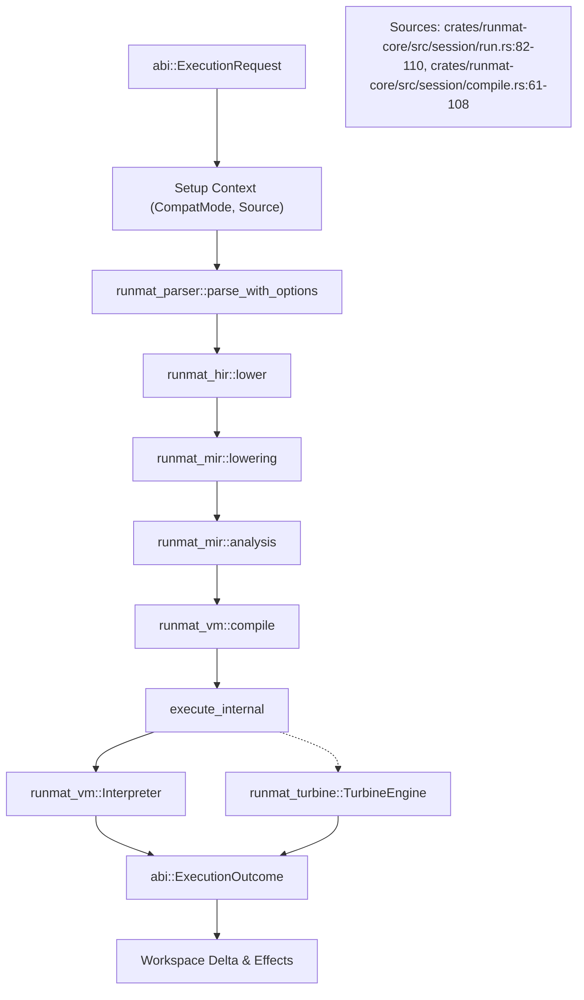

# Session Engine (runmat-core)

<details>
<summary>Relevant source files</summary>

- [crates/runmat-core/src/execution/mod.rs](https://github.com/runmat-org/runmat/blob/82685330/crates/runmat-core/src/execution/mod.rs)
- [crates/runmat-core/src/execution/types.rs](https://github.com/runmat-org/runmat/blob/82685330/crates/runmat-core/src/execution/types.rs)
- [crates/runmat-core/src/fusion/mod.rs](https://github.com/runmat-org/runmat/blob/82685330/crates/runmat-core/src/fusion/mod.rs)
- [crates/runmat-core/src/fusion/snapshot.rs](https://github.com/runmat-org/runmat/blob/82685330/crates/runmat-core/src/fusion/snapshot.rs)
- [crates/runmat-core/src/fusion/types.rs](https://github.com/runmat-org/runmat/blob/82685330/crates/runmat-core/src/fusion/types.rs)
- [crates/runmat-core/src/profiling.rs](https://github.com/runmat-org/runmat/blob/82685330/crates/runmat-core/src/profiling.rs)
- [crates/runmat-core/src/session/compile.rs](https://github.com/runmat-org/runmat/blob/82685330/crates/runmat-core/src/session/compile.rs)
- [crates/runmat-core/src/session/config.rs](https://github.com/runmat-org/runmat/blob/82685330/crates/runmat-core/src/session/config.rs)
- [crates/runmat-core/src/session/mod.rs](https://github.com/runmat-org/runmat/blob/82685330/crates/runmat-core/src/session/mod.rs)
- [crates/runmat-core/src/session/run.rs](https://github.com/runmat-org/runmat/blob/82685330/crates/runmat-core/src/session/run.rs)
- [crates/runmat-core/src/session/snapshot.rs](https://github.com/runmat-org/runmat/blob/82685330/crates/runmat-core/src/session/snapshot.rs)
- [crates/runmat-core/src/session/workspace.rs](https://github.com/runmat-org/runmat/blob/82685330/crates/runmat-core/src/session/workspace.rs)
- [crates/runmat-core/src/tests.rs](https://github.com/runmat-org/runmat/blob/82685330/crates/runmat-core/src/tests.rs)
- [crates/runmat-core/src/workspace/emit.rs](https://github.com/runmat-org/runmat/blob/82685330/crates/runmat-core/src/workspace/emit.rs)
- [crates/runmat-core/src/workspace/mod.rs](https://github.com/runmat-org/runmat/blob/82685330/crates/runmat-core/src/workspace/mod.rs)
- [crates/runmat-core/tests/engine.rs](https://github.com/runmat-org/runmat/blob/82685330/crates/runmat-core/tests/engine.rs)
- [crates/runmat-core/tests/fusion_regressions.rs](https://github.com/runmat-org/runmat/blob/82685330/crates/runmat-core/tests/fusion_regressions.rs)
- [crates/runmat-core/tests/integration.rs](https://github.com/runmat-org/runmat/blob/82685330/crates/runmat-core/tests/integration.rs)
- [crates/runmat-core/tests/repl.rs](https://github.com/runmat-org/runmat/blob/82685330/crates/runmat-core/tests/repl.rs)
- [crates/runmat-core/tests/semicolon_suppression.rs](https://github.com/runmat-org/runmat/blob/82685330/crates/runmat-core/tests/semicolon_suppression.rs)
- [crates/runmat-core/tests/variable_persistence.rs](https://github.com/runmat-org/runmat/blob/82685330/crates/runmat-core/tests/variable_persistence.rs)
- [crates/runmat-vm/src/ops/cells.rs](https://github.com/runmat-org/runmat/blob/82685330/crates/runmat-vm/src/ops/cells.rs)

</details>

The `runmat-core` crate provides the `RunMatSession` struct, which serves as the central host-agnostic execution environment for the RunMat system. It orchestrates the lifecycle of a MATLAB execution request—from source compilation to VM execution—while maintaining persistent state such as the variable workspace, semantic function registry, and JIT engine [crates/runmat-core/src/session/mod.rs #56-106](https://github.com/runmat-org/runmat/blob/82685330/crates/runmat-core/src/session/mod.rs#L56-L106)

## Core Architecture

`RunMatSession` encapsulates all components required to execute MATLAB code. It manages the transition between different execution tiers (Interpreter vs. JIT) and handles the interface between the core engine and the host environment (CLI, WASM, or LSP).

### Execution Lifecycle: `execute_request`

The primary entry point for interaction is `execute_request`. This async method processes a structured `ExecutionRequest` and returns an `ExecutionOutcome`, which includes the resulting value, workspace deltas, and diagnostic events [crates/runmat-core/src/session/run.rs #82-110](https://github.com/runmat-org/runmat/blob/82685330/crates/runmat-core/src/session/run.rs#L82-L110)

Execution Lifecycle Diagram



<details>
<summary>Rendered SVG</summary>

```svg
<svg id="mermaid-lacpokuxye" xmlns="http://www.w3.org/2000/svg" xmlns:xlink="http://www.w3.org/1999/xlink" class="flowchart" style="max-width: 100%; touch-action: none; user-select: none; cursor: grab; min-height: fit-content; max-height: 100%;" viewBox="-93.36170354482431 0 991.4929383396486 1430" role="graphics-document document" aria-roledescription="flowchart-v2" preserveAspectRatio="xMidYMid meet"><style>#mermaid-lacpokuxye{font-family:ui-sans-serif,-apple-system,system-ui,Segoe UI,Helvetica;font-size:16px;fill:#ccc;}@keyframes edge-animation-frame{from{stroke-dashoffset:0;}}@keyframes dash{to{stroke-dashoffset:0;}}#mermaid-lacpokuxye .edge-animation-slow{stroke-dasharray:9,5!important;stroke-dashoffset:900;animation:dash 50s linear infinite;stroke-linecap:round;}#mermaid-lacpokuxye .edge-animation-fast{stroke-dasharray:9,5!important;stroke-dashoffset:900;animation:dash 20s linear infinite;stroke-linecap:round;}#mermaid-lacpokuxye .error-icon{fill:#333;}#mermaid-lacpokuxye .error-text{fill:#cccccc;stroke:#cccccc;}#mermaid-lacpokuxye .edge-thickness-normal{stroke-width:1px;}#mermaid-lacpokuxye .edge-thickness-thick{stroke-width:3.5px;}#mermaid-lacpokuxye .edge-pattern-solid{stroke-dasharray:0;}#mermaid-lacpokuxye .edge-thickness-invisible{stroke-width:0;fill:none;}#mermaid-lacpokuxye .edge-pattern-dashed{stroke-dasharray:3;}#mermaid-lacpokuxye .edge-pattern-dotted{stroke-dasharray:2;}#mermaid-lacpokuxye .marker{fill:#666;stroke:#666;}#mermaid-lacpokuxye .marker.cross{stroke:#666;}#mermaid-lacpokuxye svg{font-family:ui-sans-serif,-apple-system,system-ui,Segoe UI,Helvetica;font-size:16px;}#mermaid-lacpokuxye p{margin:0;}#mermaid-lacpokuxye .label{font-family:ui-sans-serif,-apple-system,system-ui,Segoe UI,Helvetica;color:#fff;}#mermaid-lacpokuxye .cluster-label text{fill:#fff;}#mermaid-lacpokuxye .cluster-label span{color:#fff;}#mermaid-lacpokuxye .cluster-label span p{background-color:transparent;}#mermaid-lacpokuxye .label text,#mermaid-lacpokuxye span{fill:#fff;color:#fff;}#mermaid-lacpokuxye .node rect,#mermaid-lacpokuxye .node circle,#mermaid-lacpokuxye .node ellipse,#mermaid-lacpokuxye .node polygon,#mermaid-lacpokuxye .node path{fill:#111;stroke:#222;stroke-width:1px;}#mermaid-lacpokuxye .rough-node .label text,#mermaid-lacpokuxye .node .label text,#mermaid-lacpokuxye .image-shape .label,#mermaid-lacpokuxye .icon-shape .label{text-anchor:middle;}#mermaid-lacpokuxye .node .katex path{fill:#000;stroke:#000;stroke-width:1px;}#mermaid-lacpokuxye .rough-node .label,#mermaid-lacpokuxye .node .label,#mermaid-lacpokuxye .image-shape .label,#mermaid-lacpokuxye .icon-shape .label{text-align:center;}#mermaid-lacpokuxye .node.clickable{cursor:pointer;}#mermaid-lacpokuxye .root .anchor path{fill:#666!important;stroke-width:0;stroke:#666;}#mermaid-lacpokuxye .arrowheadPath{fill:#0b0b0b;}#mermaid-lacpokuxye .edgePath .path{stroke:#666;stroke-width:1px;}#mermaid-lacpokuxye .flowchart-link{stroke:#666;fill:none;}#mermaid-lacpokuxye .edgeLabel{background-color:#161616;text-align:center;}#mermaid-lacpokuxye .edgeLabel p{background-color:#161616;}#mermaid-lacpokuxye .edgeLabel rect{opacity:0.5;background-color:#161616;fill:#161616;}#mermaid-lacpokuxye .labelBkg{background-color:rgba(22, 22, 22, 0.5);}#mermaid-lacpokuxye .cluster rect{fill:#161616;stroke:#222;stroke-width:1px;}#mermaid-lacpokuxye .cluster text{fill:#fff;}#mermaid-lacpokuxye .cluster span{color:#fff;}#mermaid-lacpokuxye div.mermaidTooltip{position:absolute;text-align:center;max-width:200px;padding:2px;font-family:ui-sans-serif,-apple-system,system-ui,Segoe UI,Helvetica;font-size:12px;background:#333;border:1px solid hsl(0, 0%, 10%);border-radius:2px;pointer-events:none;z-index:100;}#mermaid-lacpokuxye .flowchartTitleText{text-anchor:middle;font-size:18px;fill:#ccc;}#mermaid-lacpokuxye rect.text{fill:none;stroke-width:0;}#mermaid-lacpokuxye .icon-shape,#mermaid-lacpokuxye .image-shape{background-color:#161616;text-align:center;}#mermaid-lacpokuxye .icon-shape p,#mermaid-lacpokuxye .image-shape p{background-color:#161616;padding:2px;}#mermaid-lacpokuxye .icon-shape .label rect,#mermaid-lacpokuxye .image-shape .label rect{opacity:0.5;background-color:#161616;fill:#161616;}#mermaid-lacpokuxye .label-icon{display:inline-block;height:1em;overflow:visible;vertical-align:-0.125em;}#mermaid-lacpokuxye .node .label-icon path{fill:currentColor;stroke:revert;stroke-width:revert;}#mermaid-lacpokuxye .node .neo-node{stroke:#222;}#mermaid-lacpokuxye [data-look="neo"].node rect,#mermaid-lacpokuxye [data-look="neo"].cluster rect,#mermaid-lacpokuxye [data-look="neo"].node polygon{stroke:url(#mermaid-lacpokuxye-gradient);filter:drop-shadow( 1px 2px 2px rgba(185,185,185,1));}#mermaid-lacpokuxye [data-look="neo"].node path{stroke:url(#mermaid-lacpokuxye-gradient);stroke-width:1px;}#mermaid-lacpokuxye [data-look="neo"].node .outer-path{filter:drop-shadow( 1px 2px 2px rgba(185,185,185,1));}#mermaid-lacpokuxye [data-look="neo"].node .neo-line path{stroke:#222;filter:none;}#mermaid-lacpokuxye [data-look="neo"].node circle{stroke:url(#mermaid-lacpokuxye-gradient);filter:drop-shadow( 1px 2px 2px rgba(185,185,185,1));}#mermaid-lacpokuxye [data-look="neo"].node circle .state-start{fill:#000000;}#mermaid-lacpokuxye [data-look="neo"].icon-shape .icon{fill:url(#mermaid-lacpokuxye-gradient);filter:drop-shadow( 1px 2px 2px rgba(185,185,185,1));}#mermaid-lacpokuxye [data-look="neo"].icon-shape .icon-neo path{stroke:url(#mermaid-lacpokuxye-gradient);filter:drop-shadow( 1px 2px 2px rgba(185,185,185,1));}#mermaid-lacpokuxye :root{--mermaid-font-family:"trebuchet ms",verdana,arial,sans-serif;}</style><g><marker id="mermaid-lacpokuxye_flowchart-v2-pointEnd" class="marker flowchart-v2" viewBox="0 0 10 10" refX="5" refY="5" markerUnits="userSpaceOnUse" markerWidth="8" markerHeight="8" orient="auto"><path d="M 0 0 L 10 5 L 0 10 z" class="arrowMarkerPath" style="stroke-width: 1; stroke-dasharray: 1, 0;"></path></marker><marker id="mermaid-lacpokuxye_flowchart-v2-pointStart" class="marker flowchart-v2" viewBox="0 0 10 10" refX="4.5" refY="5" markerUnits="userSpaceOnUse" markerWidth="8" markerHeight="8" orient="auto"><path d="M 0 5 L 10 10 L 10 0 z" class="arrowMarkerPath" style="stroke-width: 1; stroke-dasharray: 1, 0;"></path></marker><marker id="mermaid-lacpokuxye_flowchart-v2-pointEnd-margin" class="marker flowchart-v2" viewBox="0 0 11.5 14" refX="11.5" refY="7" markerUnits="userSpaceOnUse" markerWidth="10.5" markerHeight="14" orient="auto"><path d="M 0 0 L 11.5 7 L 0 14 z" class="arrowMarkerPath" style="stroke-width: 0; stroke-dasharray: 1, 0;"></path></marker><marker id="mermaid-lacpokuxye_flowchart-v2-pointStart-margin" class="marker flowchart-v2" viewBox="0 0 11.5 14" refX="1" refY="7" markerUnits="userSpaceOnUse" markerWidth="11.5" markerHeight="14" orient="auto"><polygon points="0,7 11.5,14 11.5,0" class="arrowMarkerPath" style="stroke-width: 0; stroke-dasharray: 1, 0;"></polygon></marker><marker id="mermaid-lacpokuxye_flowchart-v2-circleEnd" class="marker flowchart-v2" viewBox="0 0 10 10" refX="11" refY="5" markerUnits="userSpaceOnUse" markerWidth="11" markerHeight="11" orient="auto"><circle cx="5" cy="5" r="5" class="arrowMarkerPath" style="stroke-width: 1; stroke-dasharray: 1, 0;"></circle></marker><marker id="mermaid-lacpokuxye_flowchart-v2-circleStart" class="marker flowchart-v2" viewBox="0 0 10 10" refX="-1" refY="5" markerUnits="userSpaceOnUse" markerWidth="11" markerHeight="11" orient="auto"><circle cx="5" cy="5" r="5" class="arrowMarkerPath" style="stroke-width: 1; stroke-dasharray: 1, 0;"></circle></marker><marker id="mermaid-lacpokuxye_flowchart-v2-circleEnd-margin" class="marker flowchart-v2" viewBox="0 0 10 10" refY="5" refX="12.25" markerUnits="userSpaceOnUse" markerWidth="14" markerHeight="14" orient="auto"><circle cx="5" cy="5" r="5" class="arrowMarkerPath" style="stroke-width: 0; stroke-dasharray: 1, 0;"></circle></marker><marker id="mermaid-lacpokuxye_flowchart-v2-circleStart-margin" class="marker flowchart-v2" viewBox="0 0 10 10" refX="-2" refY="5" markerUnits="userSpaceOnUse" markerWidth="14" markerHeight="14" orient="auto"><circle cx="5" cy="5" r="5" class="arrowMarkerPath" style="stroke-width: 0; stroke-dasharray: 1, 0;"></circle></marker><marker id="mermaid-lacpokuxye_flowchart-v2-crossEnd" class="marker cross flowchart-v2" viewBox="0 0 11 11" refX="12" refY="5.2" markerUnits="userSpaceOnUse" markerWidth="11" markerHeight="11" orient="auto"><path d="M 1,1 l 9,9 M 10,1 l -9,9" class="arrowMarkerPath" style="stroke-width: 2; stroke-dasharray: 1, 0;"></path></marker><marker id="mermaid-lacpokuxye_flowchart-v2-crossStart" class="marker cross flowchart-v2" viewBox="0 0 11 11" refX="-1" refY="5.2" markerUnits="userSpaceOnUse" markerWidth="11" markerHeight="11" orient="auto"><path d="M 1,1 l 9,9 M 10,1 l -9,9" class="arrowMarkerPath" style="stroke-width: 2; stroke-dasharray: 1, 0;"></path></marker><marker id="mermaid-lacpokuxye_flowchart-v2-crossEnd-margin" class="marker cross flowchart-v2" viewBox="0 0 15 15" refX="17.7" refY="7.5" markerUnits="userSpaceOnUse" markerWidth="12" markerHeight="12" orient="auto"><path d="M 1,1 L 14,14 M 1,14 L 14,1" class="arrowMarkerPath" style="stroke-width: 2.5;"></path></marker><marker id="mermaid-lacpokuxye_flowchart-v2-crossStart-margin" class="marker cross flowchart-v2" viewBox="0 0 15 15" refX="-3.5" refY="7.5" markerUnits="userSpaceOnUse" markerWidth="12" markerHeight="12" orient="auto"><path d="M 1,1 L 14,14 M 1,14 L 14,1" class="arrowMarkerPath" style="stroke-width: 2.5; stroke-dasharray: 1, 0;"></path></marker><g class="root"><g class="clusters"><g class="cluster" id="mermaid-lacpokuxye-subGraph3" data-look="classic"><rect style="" x="56.3671875" y="1214" width="497.6484375" height="208"></rect><g class="cluster-label" transform="translate(229.80859375, 1214)"><foreignObject width="150.765625" height="24"><div style="display: table-cell; white-space: nowrap; line-height: 1.5;" xmlns="http://www.w3.org/1999/xhtml"><span class="nodeLabel"><p>Outcome Generation</p></span></div></foreignObject></g></g><g class="cluster" id="mermaid-lacpokuxye-subGraph2" data-look="classic"><rect style="" x="8" y="956" width="632.046875" height="208"></rect><g class="cluster-label" transform="translate(261.9921875, 956)"><foreignObject width="124.0625" height="24"><div style="display: table-cell; white-space: nowrap; line-height: 1.5;" xmlns="http://www.w3.org/1999/xhtml"><span class="nodeLabel"><p>Execution Engine</p></span></div></foreignObject></g></g><g class="cluster" id="mermaid-lacpokuxye-subGraph1" data-look="classic"><rect style="" x="116.94921875" y="386" width="386.484375" height="520"></rect><g class="cluster-label" transform="translate(236.32421875, 386)"><foreignObject width="147.734375" height="24"><div style="display: table-cell; white-space: nowrap; line-height: 1.5;" xmlns="http://www.w3.org/1999/xhtml"><span class="nodeLabel"><p>Compilation Pipeline</p></span></div></foreignObject></g></g><g class="cluster" id="mermaid-lacpokuxye-subGraph0" data-look="classic"><rect style="" x="145.19140625" y="8" width="330" height="328"></rect><g class="cluster-label" transform="translate(259.35546875, 8)"><foreignObject width="101.671875" height="24"><div style="display: table-cell; white-space: nowrap; line-height: 1.5;" xmlns="http://www.w3.org/1999/xhtml"><span class="nodeLabel"><p>Request Entry</p></span></div></foreignObject></g></g></g><g class="edgePaths"><path d="M310.191,135L310.191,147.167C310.191,159.333,310.191,183.667,310.191,199.333C310.191,215,310.191,222,310.191,225.5L310.191,229" id="mermaid-lacpokuxye-L_REQ_PREP_0" class="edge-thickness-normal edge-pattern-solid edge-thickness-normal edge-pattern-solid flowchart-link" style=";" data-edge="true" data-et="edge" data-id="L_REQ_PREP_0" data-points="W3sieCI6MzEwLjE5MTQwNjI1LCJ5IjoxMzV9LHsieCI6MzEwLjE5MTQwNjI1LCJ5IjoyMDh9LHsieCI6MzEwLjE5MTQwNjI1LCJ5IjoyMzN9XQ==" data-look="classic" marker-end="url(#mermaid-lacpokuxye_flowchart-v2-pointEnd)"></path><path d="M310.191,311L310.191,315.167C310.191,319.333,310.191,327.667,310.191,336C310.191,344.333,310.191,352.667,310.191,361C310.191,369.333,310.191,377.667,310.191,385.333C310.191,393,310.191,400,310.191,403.5L310.191,407" id="mermaid-lacpokuxye-L_PREP_PARSE_0" class="edge-thickness-normal edge-pattern-solid edge-thickness-normal edge-pattern-solid flowchart-link" style=";" data-edge="true" data-et="edge" data-id="L_PREP_PARSE_0" data-points="W3sieCI6MzEwLjE5MTQwNjI1LCJ5IjozMTF9LHsieCI6MzEwLjE5MTQwNjI1LCJ5IjozMzZ9LHsieCI6MzEwLjE5MTQwNjI1LCJ5IjozNjF9LHsieCI6MzEwLjE5MTQwNjI1LCJ5IjozODZ9LHsieCI6MzEwLjE5MTQwNjI1LCJ5Ijo0MTF9XQ==" data-look="classic" marker-end="url(#mermaid-lacpokuxye_flowchart-v2-pointEnd)"></path><path d="M310.191,465L310.191,469.167C310.191,473.333,310.191,481.667,310.191,489.333C310.191,497,310.191,504,310.191,507.5L310.191,511" id="mermaid-lacpokuxye-L_PARSE_HIR_0" class="edge-thickness-normal edge-pattern-solid edge-thickness-normal edge-pattern-solid flowchart-link" style=";" data-edge="true" data-et="edge" data-id="L_PARSE_HIR_0" data-points="W3sieCI6MzEwLjE5MTQwNjI1LCJ5Ijo0NjV9LHsieCI6MzEwLjE5MTQwNjI1LCJ5Ijo0OTB9LHsieCI6MzEwLjE5MTQwNjI1LCJ5Ijo1MTV9XQ==" data-look="classic" marker-end="url(#mermaid-lacpokuxye_flowchart-v2-pointEnd)"></path><path d="M310.191,569L310.191,573.167C310.191,577.333,310.191,585.667,310.191,593.333C310.191,601,310.191,608,310.191,611.5L310.191,615" id="mermaid-lacpokuxye-L_HIR_MIR_0" class="edge-thickness-normal edge-pattern-solid edge-thickness-normal edge-pattern-solid flowchart-link" style=";" data-edge="true" data-et="edge" data-id="L_HIR_MIR_0" data-points="W3sieCI6MzEwLjE5MTQwNjI1LCJ5Ijo1Njl9LHsieCI6MzEwLjE5MTQwNjI1LCJ5Ijo1OTR9LHsieCI6MzEwLjE5MTQwNjI1LCJ5Ijo2MTl9XQ==" data-look="classic" marker-end="url(#mermaid-lacpokuxye_flowchart-v2-pointEnd)"></path><path d="M310.191,673L310.191,677.167C310.191,681.333,310.191,689.667,310.191,697.333C310.191,705,310.191,712,310.191,715.5L310.191,719" id="mermaid-lacpokuxye-L_MIR_ANALYZE_0" class="edge-thickness-normal edge-pattern-solid edge-thickness-normal edge-pattern-solid flowchart-link" style=";" data-edge="true" data-et="edge" data-id="L_MIR_ANALYZE_0" data-points="W3sieCI6MzEwLjE5MTQwNjI1LCJ5Ijo2NzN9LHsieCI6MzEwLjE5MTQwNjI1LCJ5Ijo2OTh9LHsieCI6MzEwLjE5MTQwNjI1LCJ5Ijo3MjN9XQ==" data-look="classic" marker-end="url(#mermaid-lacpokuxye_flowchart-v2-pointEnd)"></path><path d="M310.191,777L310.191,781.167C310.191,785.333,310.191,793.667,310.191,801.333C310.191,809,310.191,816,310.191,819.5L310.191,823" id="mermaid-lacpokuxye-L_ANALYZE_BYTE_0" class="edge-thickness-normal edge-pattern-solid edge-thickness-normal edge-pattern-solid flowchart-link" style=";" data-edge="true" data-et="edge" data-id="L_ANALYZE_BYTE_0" data-points="W3sieCI6MzEwLjE5MTQwNjI1LCJ5Ijo3Nzd9LHsieCI6MzEwLjE5MTQwNjI1LCJ5Ijo4MDJ9LHsieCI6MzEwLjE5MTQwNjI1LCJ5Ijo4Mjd9XQ==" data-look="classic" marker-end="url(#mermaid-lacpokuxye_flowchart-v2-pointEnd)"></path><path d="M310.191,881L310.191,885.167C310.191,889.333,310.191,897.667,310.191,906C310.191,914.333,310.191,922.667,310.191,931C310.191,939.333,310.191,947.667,310.191,955.333C310.191,963,310.191,970,310.191,973.5L310.191,977" id="mermaid-lacpokuxye-L_BYTE_EXEC_0" class="edge-thickness-normal edge-pattern-solid edge-thickness-normal edge-pattern-solid flowchart-link" style=";" data-edge="true" data-et="edge" data-id="L_BYTE_EXEC_0" data-points="W3sieCI6MzEwLjE5MTQwNjI1LCJ5Ijo4ODF9LHsieCI6MzEwLjE5MTQwNjI1LCJ5Ijo5MDZ9LHsieCI6MzEwLjE5MTQwNjI1LCJ5Ijo5MzF9LHsieCI6MzEwLjE5MTQwNjI1LCJ5Ijo5NTZ9LHsieCI6MzEwLjE5MTQwNjI1LCJ5Ijo5ODF9XQ==" data-look="classic" marker-end="url(#mermaid-lacpokuxye_flowchart-v2-pointEnd)"></path><path d="M230.743,1035L218.482,1039.167C206.222,1043.333,181.701,1051.667,169.44,1059.333C157.18,1067,157.18,1074,157.18,1077.5L157.18,1081" id="mermaid-lacpokuxye-L_EXEC_VM_0" class="edge-thickness-normal edge-pattern-solid edge-thickness-normal edge-pattern-solid flowchart-link" style=";" data-edge="true" data-et="edge" data-id="L_EXEC_VM_0" data-points="W3sieCI6MjMwLjc0MzAxMzgyMjExNTQsInkiOjEwMzV9LHsieCI6MTU3LjE3OTY4NzUsInkiOjEwNjB9LHsieCI6MTU3LjE3OTY4NzUsInkiOjEwODV9XQ==" data-look="classic" marker-end="url(#mermaid-lacpokuxye_flowchart-v2-pointEnd)"></path><path d="M389.64,1035L401.9,1039.167C414.161,1043.333,438.682,1051.667,450.943,1059.333C463.203,1067,463.203,1074,463.203,1077.5L463.203,1081" id="mermaid-lacpokuxye-L_EXEC_JIT_0" class="edge-thickness-normal edge-pattern-dotted edge-thickness-normal edge-pattern-solid flowchart-link" style=";" data-edge="true" data-et="edge" data-id="L_EXEC_JIT_0" data-points="W3sieCI6Mzg5LjYzOTc5ODY3Nzg4NDY0LCJ5IjoxMDM1fSx7IngiOjQ2My4yMDMxMjUsInkiOjEwNjB9LHsieCI6NDYzLjIwMzEyNSwieSI6MTA4NX1d" data-look="classic" marker-end="url(#mermaid-lacpokuxye_flowchart-v2-pointEnd)"></path><path d="M157.18,1139L157.18,1143.167C157.18,1147.333,157.18,1155.667,157.18,1164C157.18,1172.333,157.18,1180.667,157.18,1189C157.18,1197.333,157.18,1205.667,168.809,1213.785C180.438,1221.904,203.697,1229.809,215.326,1233.761L226.956,1237.713" id="mermaid-lacpokuxye-L_VM_OUT_0" class="edge-thickness-normal edge-pattern-solid edge-thickness-normal edge-pattern-solid flowchart-link" style=";" data-edge="true" data-et="edge" data-id="L_VM_OUT_0" data-points="W3sieCI6MTU3LjE3OTY4NzUsInkiOjExMzl9LHsieCI6MTU3LjE3OTY4NzUsInkiOjExNjR9LHsieCI6MTU3LjE3OTY4NzUsInkiOjExODl9LHsieCI6MTU3LjE3OTY4NzUsInkiOjEyMTR9LHsieCI6MjMwLjc0MzAxMzgyMjExNTQsInkiOjEyMzl9XQ==" data-look="classic" marker-end="url(#mermaid-lacpokuxye_flowchart-v2-pointEnd)"></path><path d="M463.203,1139L463.203,1143.167C463.203,1147.333,463.203,1155.667,463.203,1164C463.203,1172.333,463.203,1180.667,463.203,1189C463.203,1197.333,463.203,1205.667,451.574,1213.785C439.944,1221.904,416.686,1229.809,405.056,1233.761L393.427,1237.713" id="mermaid-lacpokuxye-L_JIT_OUT_0" class="edge-thickness-normal edge-pattern-solid edge-thickness-normal edge-pattern-solid flowchart-link" style=";" data-edge="true" data-et="edge" data-id="L_JIT_OUT_0" data-points="W3sieCI6NDYzLjIwMzEyNSwieSI6MTEzOX0seyJ4Ijo0NjMuMjAzMTI1LCJ5IjoxMTY0fSx7IngiOjQ2My4yMDMxMjUsInkiOjExODl9LHsieCI6NDYzLjIwMzEyNSwieSI6MTIxNH0seyJ4IjozODkuNjM5Nzk4Njc3ODg0NjQsInkiOjEyMzl9XQ==" data-look="classic" marker-end="url(#mermaid-lacpokuxye_flowchart-v2-pointEnd)"></path><path d="M310.191,1293L310.191,1297.167C310.191,1301.333,310.191,1309.667,310.191,1317.333C310.191,1325,310.191,1332,310.191,1335.5L310.191,1339" id="mermaid-lacpokuxye-L_OUT_DELTA_0" class="edge-thickness-normal edge-pattern-solid edge-thickness-normal edge-pattern-solid flowchart-link" style=";" data-edge="true" data-et="edge" data-id="L_OUT_DELTA_0" data-points="W3sieCI6MzEwLjE5MTQwNjI1LCJ5IjoxMjkzfSx7IngiOjMxMC4xOTE0MDYyNSwieSI6MTMxOH0seyJ4IjozMTAuMTkxNDA2MjUsInkiOjEzNDN9XQ==" data-look="classic" marker-end="url(#mermaid-lacpokuxye_flowchart-v2-pointEnd)"></path></g><g class="edgeLabels"><g class="edgeLabel"><g class="label" data-id="L_REQ_PREP_0" transform="translate(0, 0)"><foreignObject width="0" height="0"><div style="display: table-cell; white-space: nowrap; line-height: 1.5; max-width: 200px; text-align: center;" xmlns="http://www.w3.org/1999/xhtml" class="labelBkg"><span class="edgeLabel"></span></div></foreignObject></g></g><g class="edgeLabel"><g class="label" data-id="L_PREP_PARSE_0" transform="translate(0, 0)"><foreignObject width="0" height="0"><div style="display: table-cell; white-space: nowrap; line-height: 1.5; max-width: 200px; text-align: center;" xmlns="http://www.w3.org/1999/xhtml" class="labelBkg"><span class="edgeLabel"></span></div></foreignObject></g></g><g class="edgeLabel"><g class="label" data-id="L_PARSE_HIR_0" transform="translate(0, 0)"><foreignObject width="0" height="0"><div style="display: table-cell; white-space: nowrap; line-height: 1.5; max-width: 200px; text-align: center;" xmlns="http://www.w3.org/1999/xhtml" class="labelBkg"><span class="edgeLabel"></span></div></foreignObject></g></g><g class="edgeLabel"><g class="label" data-id="L_HIR_MIR_0" transform="translate(0, 0)"><foreignObject width="0" height="0"><div style="display: table-cell; white-space: nowrap; line-height: 1.5; max-width: 200px; text-align: center;" xmlns="http://www.w3.org/1999/xhtml" class="labelBkg"><span class="edgeLabel"></span></div></foreignObject></g></g><g class="edgeLabel"><g class="label" data-id="L_MIR_ANALYZE_0" transform="translate(0, 0)"><foreignObject width="0" height="0"><div style="display: table-cell; white-space: nowrap; line-height: 1.5; max-width: 200px; text-align: center;" xmlns="http://www.w3.org/1999/xhtml" class="labelBkg"><span class="edgeLabel"></span></div></foreignObject></g></g><g class="edgeLabel"><g class="label" data-id="L_ANALYZE_BYTE_0" transform="translate(0, 0)"><foreignObject width="0" height="0"><div style="display: table-cell; white-space: nowrap; line-height: 1.5; max-width: 200px; text-align: center;" xmlns="http://www.w3.org/1999/xhtml" class="labelBkg"><span class="edgeLabel"></span></div></foreignObject></g></g><g class="edgeLabel"><g class="label" data-id="L_BYTE_EXEC_0" transform="translate(0, 0)"><foreignObject width="0" height="0"><div style="display: table-cell; white-space: nowrap; line-height: 1.5; max-width: 200px; text-align: center;" xmlns="http://www.w3.org/1999/xhtml" class="labelBkg"><span class="edgeLabel"></span></div></foreignObject></g></g><g class="edgeLabel"><g class="label" data-id="L_EXEC_VM_0" transform="translate(0, 0)"><foreignObject width="0" height="0"><div style="display: table-cell; white-space: nowrap; line-height: 1.5; max-width: 200px; text-align: center;" xmlns="http://www.w3.org/1999/xhtml" class="labelBkg"><span class="edgeLabel"></span></div></foreignObject></g></g><g class="edgeLabel"><g class="label" data-id="L_EXEC_JIT_0" transform="translate(0, 0)"><foreignObject width="0" height="0"><div style="display: table-cell; white-space: nowrap; line-height: 1.5; max-width: 200px; text-align: center;" xmlns="http://www.w3.org/1999/xhtml" class="labelBkg"><span class="edgeLabel"></span></div></foreignObject></g></g><g class="edgeLabel"><g class="label" data-id="L_VM_OUT_0" transform="translate(0, 0)"><foreignObject width="0" height="0"><div style="display: table-cell; white-space: nowrap; line-height: 1.5; max-width: 200px; text-align: center;" xmlns="http://www.w3.org/1999/xhtml" class="labelBkg"><span class="edgeLabel"></span></div></foreignObject></g></g><g class="edgeLabel"><g class="label" data-id="L_JIT_OUT_0" transform="translate(0, 0)"><foreignObject width="0" height="0"><div style="display: table-cell; white-space: nowrap; line-height: 1.5; max-width: 200px; text-align: center;" xmlns="http://www.w3.org/1999/xhtml" class="labelBkg"><span class="edgeLabel"></span></div></foreignObject></g></g><g class="edgeLabel"><g class="label" data-id="L_OUT_DELTA_0" transform="translate(0, 0)"><foreignObject width="0" height="0"><div style="display: table-cell; white-space: nowrap; line-height: 1.5; max-width: 200px; text-align: center;" xmlns="http://www.w3.org/1999/xhtml" class="labelBkg"><span class="edgeLabel"></span></div></foreignObject></g></g></g><g class="nodes"><g class="node default" id="mermaid-lacpokuxye-flowchart-REQ-0" data-look="classic" transform="translate(310.19140625, 108)"><rect class="basic label-container" style="" x="-110.3828125" y="-27" width="220.765625" height="54"></rect><g class="label" style="" transform="translate(-80.3828125, -12)"><rect></rect><foreignObject width="160.765625" height="24"><div style="display: table-cell; white-space: nowrap; line-height: 1.5; max-width: 200px; text-align: center;" xmlns="http://www.w3.org/1999/xhtml"><span class="nodeLabel"><p>abi::ExecutionRequest</p></span></div></foreignObject></g></g><g class="node default" id="mermaid-lacpokuxye-flowchart-PREP-1" data-look="classic" transform="translate(310.19140625, 272)"><rect class="basic label-container" style="" x="-130" y="-39" width="260" height="78"></rect><g class="label" style="" transform="translate(-100, -24)"><rect></rect><foreignObject width="200" height="48"><div style="display: table; white-space: break-spaces; line-height: 1.5; max-width: 200px; text-align: center; width: 200px;" xmlns="http://www.w3.org/1999/xhtml"><span class="nodeLabel"><p>Setup Context (CompatMode, Source)</p></span></div></foreignObject></g></g><g class="node default" id="mermaid-lacpokuxye-flowchart-PARSE-3" data-look="classic" transform="translate(310.19140625, 438)"><rect class="basic label-container" style="" x="-158.2421875" y="-27" width="316.484375" height="54"></rect><g class="label" style="" transform="translate(-128.2421875, -12)"><rect></rect><foreignObject width="256.484375" height="24"><div style="display: table; white-space: break-spaces; line-height: 1.5; max-width: 200px; text-align: center; width: 200px;" xmlns="http://www.w3.org/1999/xhtml"><span class="nodeLabel"><p>runmat_parser::parse_with_options</p></span></div></foreignObject></g></g><g class="node default" id="mermaid-lacpokuxye-flowchart-HIR-5" data-look="classic" transform="translate(310.19140625, 542)"><rect class="basic label-container" style="" x="-93.40625" y="-27" width="186.8125" height="54"></rect><g class="label" style="" transform="translate(-63.40625, -12)"><rect></rect><foreignObject width="126.8125" height="24"><div style="display: table-cell; white-space: nowrap; line-height: 1.5; max-width: 200px; text-align: center;" xmlns="http://www.w3.org/1999/xhtml"><span class="nodeLabel"><p>runmat_hir::lower</p></span></div></foreignObject></g></g><g class="node default" id="mermaid-lacpokuxye-flowchart-MIR-7" data-look="classic" transform="translate(310.19140625, 646)"><rect class="basic label-container" style="" x="-106.7109375" y="-27" width="213.421875" height="54"></rect><g class="label" style="" transform="translate(-76.7109375, -12)"><rect></rect><foreignObject width="153.421875" height="24"><div style="display: table-cell; white-space: nowrap; line-height: 1.5; max-width: 200px; text-align: center;" xmlns="http://www.w3.org/1999/xhtml"><span class="nodeLabel"><p>runmat_mir::lowering</p></span></div></foreignObject></g></g><g class="node default" id="mermaid-lacpokuxye-flowchart-ANALYZE-9" data-look="classic" transform="translate(310.19140625, 750)"><rect class="basic label-container" style="" x="-105.0390625" y="-27" width="210.078125" height="54"></rect><g class="label" style="" transform="translate(-75.0390625, -12)"><rect></rect><foreignObject width="150.078125" height="24"><div style="display: table-cell; white-space: nowrap; line-height: 1.5; max-width: 200px; text-align: center;" xmlns="http://www.w3.org/1999/xhtml"><span class="nodeLabel"><p>runmat_mir::analysis</p></span></div></foreignObject></g></g><g class="node default" id="mermaid-lacpokuxye-flowchart-BYTE-11" data-look="classic" transform="translate(310.19140625, 854)"><rect class="basic label-container" style="" x="-104.2265625" y="-27" width="208.453125" height="54"></rect><g class="label" style="" transform="translate(-74.2265625, -12)"><rect></rect><foreignObject width="148.453125" height="24"><div style="display: table-cell; white-space: nowrap; line-height: 1.5; max-width: 200px; text-align: center;" xmlns="http://www.w3.org/1999/xhtml"><span class="nodeLabel"><p>runmat_vm::compile</p></span></div></foreignObject></g></g><g class="node default" id="mermaid-lacpokuxye-flowchart-EXEC-13" data-look="classic" transform="translate(310.19140625, 1008)"><rect class="basic label-container" style="" x="-89.8515625" y="-27" width="179.703125" height="54"></rect><g class="label" style="" transform="translate(-59.8515625, -12)"><rect></rect><foreignObject width="119.703125" height="24"><div style="display: table-cell; white-space: nowrap; line-height: 1.5; max-width: 200px; text-align: center;" xmlns="http://www.w3.org/1999/xhtml"><span class="nodeLabel"><p>execute_internal</p></span></div></foreignObject></g></g><g class="node default" id="mermaid-lacpokuxye-flowchart-VM-15" data-look="classic" transform="translate(157.1796875, 1112)"><rect class="basic label-container" style="" x="-114.1796875" y="-27" width="228.359375" height="54"></rect><g class="label" style="" transform="translate(-84.1796875, -12)"><rect></rect><foreignObject width="168.359375" height="24"><div style="display: table-cell; white-space: nowrap; line-height: 1.5; max-width: 200px; text-align: center;" xmlns="http://www.w3.org/1999/xhtml"><span class="nodeLabel"><p>runmat_vm::Interpreter</p></span></div></foreignObject></g></g><g class="node default" id="mermaid-lacpokuxye-flowchart-JIT-17" data-look="classic" transform="translate(463.203125, 1112)"><rect class="basic label-container" style="" x="-141.84375" y="-27" width="283.6875" height="54"></rect><g class="label" style="" transform="translate(-111.84375, -12)"><rect></rect><foreignObject width="223.6875" height="24"><div style="display: table; white-space: break-spaces; line-height: 1.5; max-width: 200px; text-align: center; width: 200px;" xmlns="http://www.w3.org/1999/xhtml"><span class="nodeLabel"><p>runmat_turbine::TurbineEngine</p></span></div></foreignObject></g></g><g class="node default" id="mermaid-lacpokuxye-flowchart-OUT-19" data-look="classic" transform="translate(310.19140625, 1266)"><rect class="basic label-container" style="" x="-113.953125" y="-27" width="227.90625" height="54"></rect><g class="label" style="" transform="translate(-83.953125, -12)"><rect></rect><foreignObject width="167.90625" height="24"><div style="display: table-cell; white-space: nowrap; line-height: 1.5; max-width: 200px; text-align: center;" xmlns="http://www.w3.org/1999/xhtml"><span class="nodeLabel"><p>abi::ExecutionOutcome</p></span></div></foreignObject></g></g><g class="node default" id="mermaid-lacpokuxye-flowchart-DELTA-23" data-look="classic" transform="translate(310.19140625, 1370)"><rect class="basic label-container" style="" x="-126.625" y="-27" width="253.25" height="54"></rect><g class="label" style="" transform="translate(-96.625, -12)"><rect></rect><foreignObject width="193.25" height="24"><div style="display: table-cell; white-space: nowrap; line-height: 1.5; max-width: 200px; text-align: center;" xmlns="http://www.w3.org/1999/xhtml"><span class="nodeLabel"><p>Workspace Delta &amp; Effects</p></span></div></foreignObject></g></g><g class="node default" id="mermaid-lacpokuxye-flowchart-Sources-24" data-look="classic" transform="translate(653.48046875, 108)"><rect class="basic label-container" style="" x="-143.2890625" y="-75" width="286.578125" height="150"></rect><g class="label" style="" transform="translate(-113.2890625, -60)"><rect></rect><foreignObject width="226.578125" height="120"><div style="display: table; white-space: break-spaces; line-height: 1.5; max-width: 200px; text-align: center; width: 200px;" xmlns="http://www.w3.org/1999/xhtml"><span class="nodeLabel"><p>Sources: crates/runmat-core/src/session/run.rs:82-110, crates/runmat-core/src/session/compile.rs:61-108</p></span></div></foreignObject></g></g></g></g></g><defs><filter id="mermaid-lacpokuxye-drop-shadow" height="130%" width="130%"><feDropShadow dx="4" dy="4" stdDeviation="0" flood-opacity="0.06" flood-color="#000000"></feDropShadow></filter></defs><defs><filter id="mermaid-lacpokuxye-drop-shadow-small" height="150%" width="150%"><feDropShadow dx="2" dy="2" stdDeviation="0" flood-opacity="0.06" flood-color="#000000"></feDropShadow></filter></defs><linearGradient id="mermaid-lacpokuxye-gradient" gradientUnits="objectBoundingBox" x1="0%" y1="0%" x2="100%" y2="0%"><stop offset="0%" stop-color="#333" stop-opacity="1"></stop><stop offset="100%" stop-color="hsl(-120, 0%, 3.3333333333%)" stop-opacity="1"></stop></linearGradient></svg>
```

</details>

## Compilation Pipeline

The session manages a multi-stage pipeline that transforms raw MATLAB text into executable bytecode.

1. Parsing: Converts text into an AST using `runmat_parser` [crates/runmat-core/src/session/compile.rs #67-70](https://github.com/runmat-org/runmat/blob/82685330/crates/runmat-core/src/session/compile.rs#L67-L70)
2. HIR Lowering: Resolves scopes and bindings. The session provides current workspace bindings and known project symbols to the `LoweringContext` [crates/runmat-core/src/session/compile.rs #71-84](https://github.com/runmat-org/runmat/blob/82685330/crates/runmat-core/src/session/compile.rs#L71-L84)
3. MIR Lowering & Analysis: Converts HIR to a Control Flow Graph (MIR) and performs static analysis for type and shape inference [crates/runmat-core/src/session/compile.rs #85-92](https://github.com/runmat-org/runmat/blob/82685330/crates/runmat-core/src/session/compile.rs#L85-L92)
4. Bytecode Generation: The `runmat_vm::Compiler` produces bytecode and populates the semantic function registry [crates/runmat-core/src/session/compile.rs #93-108](https://github.com/runmat-org/runmat/blob/82685330/crates/runmat-core/src/session/compile.rs#L93-L108)

## Workspace & Variable Management

The session maintains a persistent `variable_array` that stores the actual `runmat_builtins::Value` instances [crates/runmat-core/src/session/mod.rs #66](https://github.com/runmat-org/runmat/blob/82685330/crates/runmat-core/src/session/mod.rs#L66-L66) It maps variable names to VM slots using `SessionWorkspaceBinding` [crates/runmat-core/src/session/mod.rs #130-133](https://github.com/runmat-org/runmat/blob/82685330/crates/runmat-core/src/session/mod.rs#L130-L133)

Key features include:

- Implicit Assignment: Automatically assigns unsuppressed expression results to the `ans` variable [crates/runmat-core/src/workspace/emit.rs #38-51](https://github.com/runmat-org/runmat/blob/82685330/crates/runmat-core/src/workspace/emit.rs#L38-L51)
- Workspace Deltas: Every execution returns a `workspace_delta` containing `upserts` and `removals`, allowing host UIs to update variable explorers efficiently [crates/runmat-core/src/session/run.rs #68-77](https://github.com/runmat-org/runmat/blob/82685330/crates/runmat-core/src/session/run.rs#L68-L77)
- Materialization: Support for partial materialization of large or GPU-resident variables for UI previews [crates/runmat-core/src/session/mod.rs #41-43](https://github.com/runmat-org/runmat/blob/82685330/crates/runmat-core/src/session/mod.rs#L41-L43)

For details, see [Workspace & Variable Management](https://app.devin.ai/org/runmat-org/wiki/runmat-org/runmat?branch=dev#7.1).

## Snapshots & Fast Startup

To avoid the overhead of re-parsing and re-compiling the MATLAB standard library (stdlib) on every session start, `runmat-core` utilizes a snapshot system.

- Preloading: Sessions can be initialized from binary snapshot bytes, which contain a pre-populated `FunctionRegistry` and `SourcePool` [crates/runmat-core/src/session/snapshot.rs #42-59](https://github.com/runmat-org/runmat/blob/82685330/crates/runmat-core/src/session/snapshot.rs#L42-L59)
- WASM Optimization: In WebAssembly environments, the session can build an internal stdlib snapshot if one isn't provided, ensuring high performance in the browser [crates/runmat-core/src/session/snapshot.rs #149-173](https://github.com/runmat-org/runmat/blob/82685330/crates/runmat-core/src/session/snapshot.rs#L149-L173)

For details, see [Snapshots & Fast Startup](https://app.devin.ai/org/runmat-org/wiki/runmat-org/runmat?branch=dev#7.2).

## Async Input Hooks

RunMat supports interactive input (e.g., `input()` or `pause`) via an async interaction model. The session can be configured with a `SharedAsyncInputHandler` [crates/runmat-core/src/session/mod.rs #88](https://github.com/runmat-org/runmat/blob/82685330/crates/runmat-core/src/session/mod.rs#L88-L88) When the VM encounters an input request, it suspends execution and invokes the host-provided handler to retrieve data (like a line of text or a key press) without blocking the main thread [crates/runmat-core/src/session/run.rs #144-168](https://github.com/runmat-org/runmat/blob/82685330/crates/runmat-core/src/session/run.rs#L144-L168)

## Fusion & GPU Monitoring

When GPU acceleration is enabled, the session tracks "fusion" opportunities where multiple operations are combined into a single GPU kernel.

- Fusion Plan Snapshots: The session can generate a `FusionPlanSnapshot` containing the acceleration graph, shader metadata, and offload decisions [crates/runmat-core/src/fusion/snapshot.rs #9-49](https://github.com/runmat-org/runmat/blob/82685330/crates/runmat-core/src/fusion/snapshot.rs#L9-L49)
- Metadata Tracking: It captures MIR local facts and instruction windows to explain why specific operations were (or were not) fused [crates/runmat-core/tests/fusion_regressions.rs #159-209](https://github.com/runmat-org/runmat/blob/82685330/crates/runmat-core/tests/fusion_regressions.rs#L159-L209)

Entity Mapping: Session to VM

| Session Entity | Code Entity | Role |
| --- | --- | --- |
| Workspace | HashMap<String, SessionWorkspaceBinding> | Maps names to VM slots crates/runmat-core/src/session/mod.rs#68 |
| Values | variable_array: Vec<Value> | Physical storage for variable data crates/runmat-core/src/session/mod.rs#66 |
| Functions | runmat_vm::FunctionRegistry | Stores semantic (user-defined) functions crates/runmat-core/src/session/mod.rs#76 |
| Sources | SourcePool | Interned storage for source text and names crates/runmat-core/src/session/mod.rs#79 |
| JIT Engine | TurbineEngine | Optional Cranelift-based JIT compiler crates/runmat-core/src/session/mod.rs#60 |

Sources: [crates/runmat-core/src/session/mod.rs #56-106](https://github.com/runmat-org/runmat/blob/82685330/crates/runmat-core/src/session/mod.rs#L56-L106) [crates/runmat-core/src/session/run.rs #82-110](https://github.com/runmat-org/runmat/blob/82685330/crates/runmat-core/src/session/run.rs#L82-L110) [crates/runmat-core/src/session/compile.rs #61-108](https://github.com/runmat-org/runmat/blob/82685330/crates/runmat-core/src/session/compile.rs#L61-L108) [crates/runmat-core/src/fusion/snapshot.rs #9-49](https://github.com/runmat-org/runmat/blob/82685330/crates/runmat-core/src/fusion/snapshot.rs#L9-L49)
