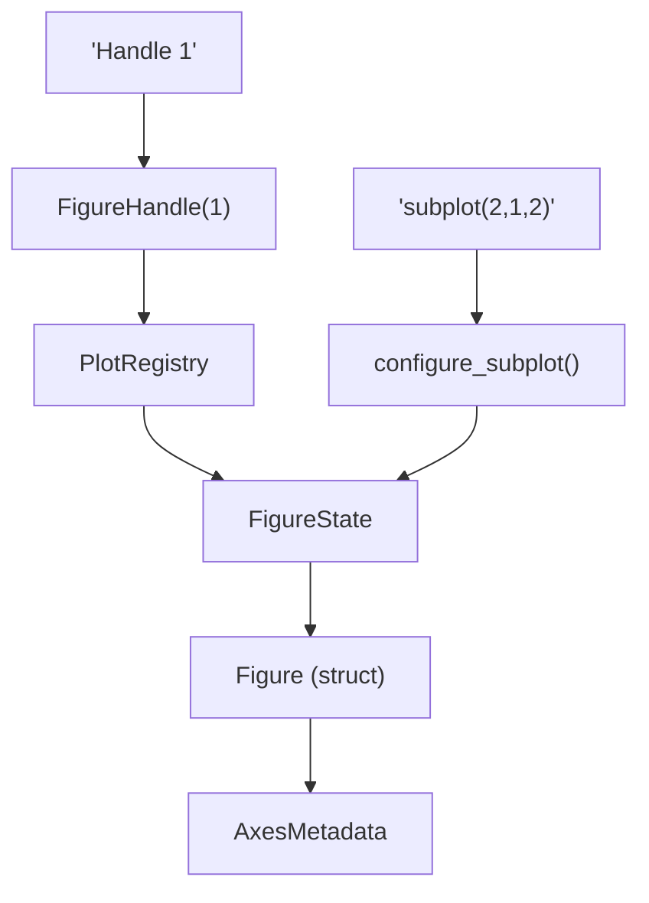
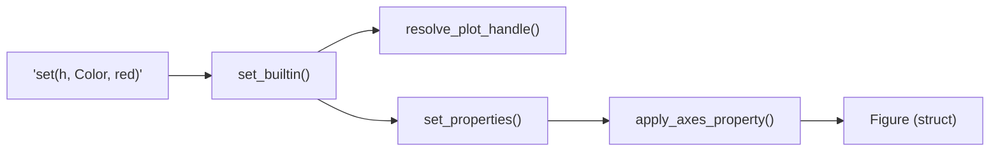

# Figure State & Property System

<details>
<summary>Relevant source files</summary>

- [crates/runmat-plot/src/core/plot_renderer.rs](https://github.com/runmat-org/runmat/blob/82685330/crates/runmat-plot/src/core/plot_renderer.rs)
- [crates/runmat-plot/src/event.rs](https://github.com/runmat-org/runmat/blob/82685330/crates/runmat-plot/src/event.rs)
- [crates/runmat-plot/src/gui/plot_overlay.rs](https://github.com/runmat-org/runmat/blob/82685330/crates/runmat-plot/src/gui/plot_overlay.rs)
- [crates/runmat-plot/src/plots/figure.rs](https://github.com/runmat-org/runmat/blob/82685330/crates/runmat-plot/src/plots/figure.rs)
- [crates/runmat-plot/src/plots/mod.rs](https://github.com/runmat-org/runmat/blob/82685330/crates/runmat-plot/src/plots/mod.rs)
- [crates/runmat-runtime/src/builtins/builtins-json/sgtitle.json](https://github.com/runmat-org/runmat/blob/82685330/crates/runmat-runtime/src/builtins/builtins-json/sgtitle.json)
- [crates/runmat-runtime/src/builtins/builtins-json/suptitle.json](https://github.com/runmat-org/runmat/blob/82685330/crates/runmat-runtime/src/builtins/builtins-json/suptitle.json)
- [crates/runmat-runtime/src/builtins/plotting/core/properties.rs](https://github.com/runmat-org/runmat/blob/82685330/crates/runmat-runtime/src/builtins/plotting/core/properties.rs)
- [crates/runmat-runtime/src/builtins/plotting/core/state.rs](https://github.com/runmat-org/runmat/blob/82685330/crates/runmat-runtime/src/builtins/plotting/core/state.rs)
- [crates/runmat-runtime/src/builtins/plotting/mod.rs](https://github.com/runmat-org/runmat/blob/82685330/crates/runmat-runtime/src/builtins/plotting/mod.rs)
- [crates/runmat-runtime/src/builtins/plotting/ops/get.rs](https://github.com/runmat-org/runmat/blob/82685330/crates/runmat-runtime/src/builtins/plotting/ops/get.rs)
- [crates/runmat-runtime/src/builtins/plotting/ops/legend.rs](https://github.com/runmat-org/runmat/blob/82685330/crates/runmat-runtime/src/builtins/plotting/ops/legend.rs)
- [crates/runmat-runtime/src/builtins/plotting/ops/set.rs](https://github.com/runmat-org/runmat/blob/82685330/crates/runmat-runtime/src/builtins/plotting/ops/set.rs)
- [crates/runmat-runtime/src/builtins/plotting/ops/sgtitle.rs](https://github.com/runmat-org/runmat/blob/82685330/crates/runmat-runtime/src/builtins/plotting/ops/sgtitle.rs)
- [crates/runmat-runtime/src/builtins/plotting/ops/subplot.rs](https://github.com/runmat-org/runmat/blob/82685330/crates/runmat-runtime/src/builtins/plotting/ops/subplot.rs)
- [crates/runmat-runtime/src/builtins/plotting/ops/suptitle.rs](https://github.com/runmat-org/runmat/blob/82685330/crates/runmat-runtime/src/builtins/plotting/ops/suptitle.rs)
- [crates/runmat-runtime/src/builtins/plotting/ops/title.rs](https://github.com/runmat-org/runmat/blob/82685330/crates/runmat-runtime/src/builtins/plotting/ops/title.rs)
- [crates/runmat-runtime/src/builtins/plotting/ops/view.rs](https://github.com/runmat-org/runmat/blob/82685330/crates/runmat-runtime/src/builtins/plotting/ops/view.rs)
- [crates/runmat-runtime/src/builtins/plotting/ops/xlabel.rs](https://github.com/runmat-org/runmat/blob/82685330/crates/runmat-runtime/src/builtins/plotting/ops/xlabel.rs)
- [crates/runmat-runtime/src/builtins/plotting/ops/ylabel.rs](https://github.com/runmat-org/runmat/blob/82685330/crates/runmat-runtime/src/builtins/plotting/ops/ylabel.rs)
- [crates/runmat-runtime/src/builtins/plotting/ops/zlabel.rs](https://github.com/runmat-org/runmat/blob/82685330/crates/runmat-runtime/src/builtins/plotting/ops/zlabel.rs)

</details>

The Figure State & Property System manages the lifecycle, hierarchy, and visual attributes of all graphical elements in RunMat. It provides a MATLAB-compatible `get`/`set` interface, handles the resolution of numeric handles to internal Rust objects, and maintains state for subplots, color cycles, and persistent scene serialization.

## PlotRegistry & State Management

The `PlotRegistry` is the central singleton (managed via `once_cell`) that tracks all active figures and their children. It maps numeric `FigureHandle` identifiers to `FigureState` objects, which contain the actual `Figure` data used by the renderer.

### Key Components

| Component | Role | File |
| --- | --- | --- |
| PlotRegistry | Singleton tracking figures, axes, and plot children. | crates/runmat-runtime/src/builtins/plotting/core/state.rs#229-235 |
| FigureState | Holds a Figure, its active axes index, and property cycles. | crates/runmat-runtime/src/builtins/plotting/core/state.rs#112-120 |
| FigureHandle | A unique u32 wrapper used as a MATLAB-style handle. | crates/runmat-runtime/src/builtins/plotting/core/state.rs#29-30 |
| LineStyleCycle | Manages the rotation of line styles (solid, dashed, etc.) per axes. | crates/runmat-runtime/src/builtins/plotting/core/state.rs#56-60 |
| LineColorCycle | Manages the rotation of colors for new plot series. | crates/runmat-runtime/src/builtins/plotting/core/state.rs#95-98 |

### Figure & Axes Hierarchy

RunMat follows a strict hierarchy where a `Figure` contains a grid of subplots (axes), and each axes contains multiple `PlotElement` instances.

- Figure: The top-level window or canvas [crates/runmat-plot/src/plots/figure.rs #19-69](https://github.com/runmat-org/runmat/blob/82685330/crates/runmat-plot/src/plots/figure.rs#L19-L69)
- AxesMetadata: Stores per-subplot settings like limits, labels, and camera state [crates/runmat-plot/src/plots/figure.rs #124-152](https://github.com/runmat-org/runmat/blob/82685330/crates/runmat-plot/src/plots/figure.rs#L124-L152)
- PlotElement: The actual data-bearing objects (Line, Scatter, Surface, etc.) [crates/runmat-plot/src/plots/figure.rs #162-180](https://github.com/runmat-org/runmat/blob/82685330/crates/runmat-plot/src/plots/figure.rs#L162-L180)

### Data Flow: State to Registry

This diagram shows how the user-facing handle system interacts with the internal `PlotRegistry`.

Title: Figure Handle Resolution Flow



<details>
<summary>Rendered SVG</summary>

```svg
<svg id="mermaid-czkn93dqd" xmlns="http://www.w3.org/2000/svg" xmlns:xlink="http://www.w3.org/1999/xlink" class="flowchart" style="max-width: 100%; touch-action: none; user-select: none; cursor: grab; min-height: fit-content; max-height: 100%;" viewBox="0 0 514.546875 762" role="graphics-document document" aria-roledescription="flowchart-v2" preserveAspectRatio="xMidYMid meet"><style>#mermaid-czkn93dqd{font-family:ui-sans-serif,-apple-system,system-ui,Segoe UI,Helvetica;font-size:16px;fill:#ccc;}@keyframes edge-animation-frame{from{stroke-dashoffset:0;}}@keyframes dash{to{stroke-dashoffset:0;}}#mermaid-czkn93dqd .edge-animation-slow{stroke-dasharray:9,5!important;stroke-dashoffset:900;animation:dash 50s linear infinite;stroke-linecap:round;}#mermaid-czkn93dqd .edge-animation-fast{stroke-dasharray:9,5!important;stroke-dashoffset:900;animation:dash 20s linear infinite;stroke-linecap:round;}#mermaid-czkn93dqd .error-icon{fill:#333;}#mermaid-czkn93dqd .error-text{fill:#cccccc;stroke:#cccccc;}#mermaid-czkn93dqd .edge-thickness-normal{stroke-width:1px;}#mermaid-czkn93dqd .edge-thickness-thick{stroke-width:3.5px;}#mermaid-czkn93dqd .edge-pattern-solid{stroke-dasharray:0;}#mermaid-czkn93dqd .edge-thickness-invisible{stroke-width:0;fill:none;}#mermaid-czkn93dqd .edge-pattern-dashed{stroke-dasharray:3;}#mermaid-czkn93dqd .edge-pattern-dotted{stroke-dasharray:2;}#mermaid-czkn93dqd .marker{fill:#666;stroke:#666;}#mermaid-czkn93dqd .marker.cross{stroke:#666;}#mermaid-czkn93dqd svg{font-family:ui-sans-serif,-apple-system,system-ui,Segoe UI,Helvetica;font-size:16px;}#mermaid-czkn93dqd p{margin:0;}#mermaid-czkn93dqd .label{font-family:ui-sans-serif,-apple-system,system-ui,Segoe UI,Helvetica;color:#fff;}#mermaid-czkn93dqd .cluster-label text{fill:#fff;}#mermaid-czkn93dqd .cluster-label span{color:#fff;}#mermaid-czkn93dqd .cluster-label span p{background-color:transparent;}#mermaid-czkn93dqd .label text,#mermaid-czkn93dqd span{fill:#fff;color:#fff;}#mermaid-czkn93dqd .node rect,#mermaid-czkn93dqd .node circle,#mermaid-czkn93dqd .node ellipse,#mermaid-czkn93dqd .node polygon,#mermaid-czkn93dqd .node path{fill:#111;stroke:#222;stroke-width:1px;}#mermaid-czkn93dqd .rough-node .label text,#mermaid-czkn93dqd .node .label text,#mermaid-czkn93dqd .image-shape .label,#mermaid-czkn93dqd .icon-shape .label{text-anchor:middle;}#mermaid-czkn93dqd .node .katex path{fill:#000;stroke:#000;stroke-width:1px;}#mermaid-czkn93dqd .rough-node .label,#mermaid-czkn93dqd .node .label,#mermaid-czkn93dqd .image-shape .label,#mermaid-czkn93dqd .icon-shape .label{text-align:center;}#mermaid-czkn93dqd .node.clickable{cursor:pointer;}#mermaid-czkn93dqd .root .anchor path{fill:#666!important;stroke-width:0;stroke:#666;}#mermaid-czkn93dqd .arrowheadPath{fill:#0b0b0b;}#mermaid-czkn93dqd .edgePath .path{stroke:#666;stroke-width:1px;}#mermaid-czkn93dqd .flowchart-link{stroke:#666;fill:none;}#mermaid-czkn93dqd .edgeLabel{background-color:#161616;text-align:center;}#mermaid-czkn93dqd .edgeLabel p{background-color:#161616;}#mermaid-czkn93dqd .edgeLabel rect{opacity:0.5;background-color:#161616;fill:#161616;}#mermaid-czkn93dqd .labelBkg{background-color:rgba(22, 22, 22, 0.5);}#mermaid-czkn93dqd .cluster rect{fill:#161616;stroke:#222;stroke-width:1px;}#mermaid-czkn93dqd .cluster text{fill:#fff;}#mermaid-czkn93dqd .cluster span{color:#fff;}#mermaid-czkn93dqd div.mermaidTooltip{position:absolute;text-align:center;max-width:200px;padding:2px;font-family:ui-sans-serif,-apple-system,system-ui,Segoe UI,Helvetica;font-size:12px;background:#333;border:1px solid hsl(0, 0%, 10%);border-radius:2px;pointer-events:none;z-index:100;}#mermaid-czkn93dqd .flowchartTitleText{text-anchor:middle;font-size:18px;fill:#ccc;}#mermaid-czkn93dqd rect.text{fill:none;stroke-width:0;}#mermaid-czkn93dqd .icon-shape,#mermaid-czkn93dqd .image-shape{background-color:#161616;text-align:center;}#mermaid-czkn93dqd .icon-shape p,#mermaid-czkn93dqd .image-shape p{background-color:#161616;padding:2px;}#mermaid-czkn93dqd .icon-shape .label rect,#mermaid-czkn93dqd .image-shape .label rect{opacity:0.5;background-color:#161616;fill:#161616;}#mermaid-czkn93dqd .label-icon{display:inline-block;height:1em;overflow:visible;vertical-align:-0.125em;}#mermaid-czkn93dqd .node .label-icon path{fill:currentColor;stroke:revert;stroke-width:revert;}#mermaid-czkn93dqd .node .neo-node{stroke:#222;}#mermaid-czkn93dqd [data-look="neo"].node rect,#mermaid-czkn93dqd [data-look="neo"].cluster rect,#mermaid-czkn93dqd [data-look="neo"].node polygon{stroke:url(#mermaid-czkn93dqd-gradient);filter:drop-shadow( 1px 2px 2px rgba(185,185,185,1));}#mermaid-czkn93dqd [data-look="neo"].node path{stroke:url(#mermaid-czkn93dqd-gradient);stroke-width:1px;}#mermaid-czkn93dqd [data-look="neo"].node .outer-path{filter:drop-shadow( 1px 2px 2px rgba(185,185,185,1));}#mermaid-czkn93dqd [data-look="neo"].node .neo-line path{stroke:#222;filter:none;}#mermaid-czkn93dqd [data-look="neo"].node circle{stroke:url(#mermaid-czkn93dqd-gradient);filter:drop-shadow( 1px 2px 2px rgba(185,185,185,1));}#mermaid-czkn93dqd [data-look="neo"].node circle .state-start{fill:#000000;}#mermaid-czkn93dqd [data-look="neo"].icon-shape .icon{fill:url(#mermaid-czkn93dqd-gradient);filter:drop-shadow( 1px 2px 2px rgba(185,185,185,1));}#mermaid-czkn93dqd [data-look="neo"].icon-shape .icon-neo path{stroke:url(#mermaid-czkn93dqd-gradient);filter:drop-shadow( 1px 2px 2px rgba(185,185,185,1));}#mermaid-czkn93dqd :root{--mermaid-font-family:"trebuchet ms",verdana,arial,sans-serif;}</style><g><marker id="mermaid-czkn93dqd_flowchart-v2-pointEnd" class="marker flowchart-v2" viewBox="0 0 10 10" refX="5" refY="5" markerUnits="userSpaceOnUse" markerWidth="8" markerHeight="8" orient="auto"><path d="M 0 0 L 10 5 L 0 10 z" class="arrowMarkerPath" style="stroke-width: 1; stroke-dasharray: 1, 0;"></path></marker><marker id="mermaid-czkn93dqd_flowchart-v2-pointStart" class="marker flowchart-v2" viewBox="0 0 10 10" refX="4.5" refY="5" markerUnits="userSpaceOnUse" markerWidth="8" markerHeight="8" orient="auto"><path d="M 0 5 L 10 10 L 10 0 z" class="arrowMarkerPath" style="stroke-width: 1; stroke-dasharray: 1, 0;"></path></marker><marker id="mermaid-czkn93dqd_flowchart-v2-pointEnd-margin" class="marker flowchart-v2" viewBox="0 0 11.5 14" refX="11.5" refY="7" markerUnits="userSpaceOnUse" markerWidth="10.5" markerHeight="14" orient="auto"><path d="M 0 0 L 11.5 7 L 0 14 z" class="arrowMarkerPath" style="stroke-width: 0; stroke-dasharray: 1, 0;"></path></marker><marker id="mermaid-czkn93dqd_flowchart-v2-pointStart-margin" class="marker flowchart-v2" viewBox="0 0 11.5 14" refX="1" refY="7" markerUnits="userSpaceOnUse" markerWidth="11.5" markerHeight="14" orient="auto"><polygon points="0,7 11.5,14 11.5,0" class="arrowMarkerPath" style="stroke-width: 0; stroke-dasharray: 1, 0;"></polygon></marker><marker id="mermaid-czkn93dqd_flowchart-v2-circleEnd" class="marker flowchart-v2" viewBox="0 0 10 10" refX="11" refY="5" markerUnits="userSpaceOnUse" markerWidth="11" markerHeight="11" orient="auto"><circle cx="5" cy="5" r="5" class="arrowMarkerPath" style="stroke-width: 1; stroke-dasharray: 1, 0;"></circle></marker><marker id="mermaid-czkn93dqd_flowchart-v2-circleStart" class="marker flowchart-v2" viewBox="0 0 10 10" refX="-1" refY="5" markerUnits="userSpaceOnUse" markerWidth="11" markerHeight="11" orient="auto"><circle cx="5" cy="5" r="5" class="arrowMarkerPath" style="stroke-width: 1; stroke-dasharray: 1, 0;"></circle></marker><marker id="mermaid-czkn93dqd_flowchart-v2-circleEnd-margin" class="marker flowchart-v2" viewBox="0 0 10 10" refY="5" refX="12.25" markerUnits="userSpaceOnUse" markerWidth="14" markerHeight="14" orient="auto"><circle cx="5" cy="5" r="5" class="arrowMarkerPath" style="stroke-width: 0; stroke-dasharray: 1, 0;"></circle></marker><marker id="mermaid-czkn93dqd_flowchart-v2-circleStart-margin" class="marker flowchart-v2" viewBox="0 0 10 10" refX="-2" refY="5" markerUnits="userSpaceOnUse" markerWidth="14" markerHeight="14" orient="auto"><circle cx="5" cy="5" r="5" class="arrowMarkerPath" style="stroke-width: 0; stroke-dasharray: 1, 0;"></circle></marker><marker id="mermaid-czkn93dqd_flowchart-v2-crossEnd" class="marker cross flowchart-v2" viewBox="0 0 11 11" refX="12" refY="5.2" markerUnits="userSpaceOnUse" markerWidth="11" markerHeight="11" orient="auto"><path d="M 1,1 l 9,9 M 10,1 l -9,9" class="arrowMarkerPath" style="stroke-width: 2; stroke-dasharray: 1, 0;"></path></marker><marker id="mermaid-czkn93dqd_flowchart-v2-crossStart" class="marker cross flowchart-v2" viewBox="0 0 11 11" refX="-1" refY="5.2" markerUnits="userSpaceOnUse" markerWidth="11" markerHeight="11" orient="auto"><path d="M 1,1 l 9,9 M 10,1 l -9,9" class="arrowMarkerPath" style="stroke-width: 2; stroke-dasharray: 1, 0;"></path></marker><marker id="mermaid-czkn93dqd_flowchart-v2-crossEnd-margin" class="marker cross flowchart-v2" viewBox="0 0 15 15" refX="17.7" refY="7.5" markerUnits="userSpaceOnUse" markerWidth="12" markerHeight="12" orient="auto"><path d="M 1,1 L 14,14 M 1,14 L 14,1" class="arrowMarkerPath" style="stroke-width: 2.5;"></path></marker><marker id="mermaid-czkn93dqd_flowchart-v2-crossStart-margin" class="marker cross flowchart-v2" viewBox="0 0 15 15" refX="-3.5" refY="7.5" markerUnits="userSpaceOnUse" markerWidth="12" markerHeight="12" orient="auto"><path d="M 1,1 L 14,14 M 1,14 L 14,1" class="arrowMarkerPath" style="stroke-width: 2.5; stroke-dasharray: 1, 0;"></path></marker><g class="root"><g class="clusters"><g class="cluster" id="mermaid-czkn93dqd-subGraph1" data-look="classic"><rect style="" x="8" y="162" width="498.546875" height="592"></rect><g class="cluster-label" transform="translate(190.484375, 162)"><foreignObject width="133.578125" height="24"><div style="display: table-cell; white-space: nowrap; line-height: 1.5;" xmlns="http://www.w3.org/1999/xhtml"><span class="nodeLabel"><p>Code Entity Space</p></span></div></foreignObject></g></g><g class="cluster" id="mermaid-czkn93dqd-subGraph0" data-look="classic"><rect style="" x="30.078125" y="8" width="458.8828125" height="104"></rect><g class="cluster-label" transform="translate(170.57421875, 8)"><foreignObject width="177.890625" height="24"><div style="display: table-cell; white-space: nowrap; line-height: 1.5;" xmlns="http://www.w3.org/1999/xhtml"><span class="nodeLabel"><p>Natural Language Space</p></span></div></foreignObject></g></g></g><g class="edgePaths"><path d="M130.602,87L130.602,91.167C130.602,95.333,130.602,103.667,130.602,112C130.602,120.333,130.602,128.667,130.602,137C130.602,145.333,130.602,153.667,130.602,161.333C130.602,169,130.602,176,130.602,179.5L130.602,183" id="mermaid-czkn93dqd-L_UserHandle_Handle_0" class="edge-thickness-normal edge-pattern-solid edge-thickness-normal edge-pattern-solid flowchart-link" style=";" data-edge="true" data-et="edge" data-id="L_UserHandle_Handle_0" data-points="W3sieCI6MTMwLjYwMTU2MjUsInkiOjg3fSx7IngiOjEzMC42MDE1NjI1LCJ5IjoxMTJ9LHsieCI6MTMwLjYwMTU2MjUsInkiOjEzN30seyJ4IjoxMzAuNjAxNTYyNSwieSI6MTYyfSx7IngiOjEzMC42MDE1NjI1LCJ5IjoxODd9XQ==" data-look="classic" marker-end="url(#mermaid-czkn93dqd_flowchart-v2-pointEnd)"></path><path d="M130.602,241L130.602,245.167C130.602,249.333,130.602,257.667,130.602,265.333C130.602,273,130.602,280,130.602,283.5L130.602,287" id="mermaid-czkn93dqd-L_Handle_Registry_0" class="edge-thickness-normal edge-pattern-solid edge-thickness-normal edge-pattern-solid flowchart-link" style=";" data-edge="true" data-et="edge" data-id="L_Handle_Registry_0" data-points="W3sieCI6MTMwLjYwMTU2MjUsInkiOjI0MX0seyJ4IjoxMzAuNjAxNTYyNSwieSI6MjY2fSx7IngiOjEzMC42MDE1NjI1LCJ5IjoyOTF9XQ==" data-look="classic" marker-end="url(#mermaid-czkn93dqd_flowchart-v2-pointEnd)"></path><path d="M130.602,345L130.602,351.167C130.602,357.333,130.602,369.667,141.541,381.686C152.481,393.704,174.36,405.409,185.3,411.261L196.24,417.113" id="mermaid-czkn93dqd-L_Registry_FState_0" class="edge-thickness-normal edge-pattern-solid edge-thickness-normal edge-pattern-solid flowchart-link" style=";" data-edge="true" data-et="edge" data-id="L_Registry_FState_0" data-points="W3sieCI6MTMwLjYwMTU2MjUsInkiOjM0NX0seyJ4IjoxMzAuNjAxNTYyNSwieSI6MzgyfSx7IngiOjE5OS43NjY1NDA1MjczNDM3NSwieSI6NDE5fV0=" data-look="classic" marker-end="url(#mermaid-czkn93dqd_flowchart-v2-pointEnd)"></path><path d="M250.238,473L250.238,479.167C250.238,485.333,250.238,497.667,250.238,509.333C250.238,521,250.238,532,250.238,537.5L250.238,543" id="mermaid-czkn93dqd-L_FState_FData_0" class="edge-thickness-normal edge-pattern-solid edge-thickness-normal edge-pattern-solid flowchart-link" style=";" data-edge="true" data-et="edge" data-id="L_FState_FData_0" data-points="W3sieCI6MjUwLjIzODI4MTI1LCJ5Ijo0NzN9LHsieCI6MjUwLjIzODI4MTI1LCJ5Ijo1MTB9LHsieCI6MjUwLjIzODI4MTI1LCJ5Ijo1NDd9XQ==" data-look="classic" marker-end="url(#mermaid-czkn93dqd_flowchart-v2-pointEnd)"></path><path d="M369.875,87L369.875,91.167C369.875,95.333,369.875,103.667,369.875,112C369.875,120.333,369.875,128.667,369.875,137C369.875,145.333,369.875,153.667,369.875,161.333C369.875,169,369.875,176,369.875,179.5L369.875,183" id="mermaid-czkn93dqd-L_SubplotCmd_configure_subplot_0" class="edge-thickness-normal edge-pattern-solid edge-thickness-normal edge-pattern-solid flowchart-link" style=";" data-edge="true" data-et="edge" data-id="L_SubplotCmd_configure_subplot_0" data-points="W3sieCI6MzY5Ljg3NSwieSI6ODd9LHsieCI6MzY5Ljg3NSwieSI6MTEyfSx7IngiOjM2OS44NzUsInkiOjEzN30seyJ4IjozNjkuODc1LCJ5IjoxNjJ9LHsieCI6MzY5Ljg3NSwieSI6MTg3fV0=" data-look="classic" marker-end="url(#mermaid-czkn93dqd_flowchart-v2-pointEnd)"></path><path d="M369.875,241L369.875,245.167C369.875,249.333,369.875,257.667,369.875,270.5C369.875,283.333,369.875,300.667,369.875,320C369.875,339.333,369.875,360.667,358.935,377.186C347.996,393.704,326.116,405.409,315.177,411.261L304.237,417.113" id="mermaid-czkn93dqd-L_configure_subplot_FState_0" class="edge-thickness-normal edge-pattern-solid edge-thickness-normal edge-pattern-solid flowchart-link" style=";" data-edge="true" data-et="edge" data-id="L_configure_subplot_FState_0" data-points="W3sieCI6MzY5Ljg3NSwieSI6MjQxfSx7IngiOjM2OS44NzUsInkiOjI2Nn0seyJ4IjozNjkuODc1LCJ5IjozMTh9LHsieCI6MzY5Ljg3NSwieSI6MzgyfSx7IngiOjMwMC43MTAwMjE5NzI2NTYyNSwieSI6NDE5fV0=" data-look="classic" marker-end="url(#mermaid-czkn93dqd_flowchart-v2-pointEnd)"></path><path d="M250.238,601L250.238,607.167C250.238,613.333,250.238,625.667,250.238,637.333C250.238,649,250.238,660,250.238,665.5L250.238,671" id="mermaid-czkn93dqd-L_FData_AxesMeta_0" class="edge-thickness-normal edge-pattern-solid edge-thickness-normal edge-pattern-solid flowchart-link" style=";" data-edge="true" data-et="edge" data-id="L_FData_AxesMeta_0" data-points="W3sieCI6MjUwLjIzODI4MTI1LCJ5Ijo2MDF9LHsieCI6MjUwLjIzODI4MTI1LCJ5Ijo2Mzh9LHsieCI6MjUwLjIzODI4MTI1LCJ5Ijo2NzV9XQ==" data-look="classic" marker-end="url(#mermaid-czkn93dqd_flowchart-v2-pointEnd)"></path></g><g class="edgeLabels"><g class="edgeLabel"><g class="label" data-id="L_UserHandle_Handle_0" transform="translate(0, 0)"><foreignObject width="0" height="0"><div style="display: table-cell; white-space: nowrap; line-height: 1.5; max-width: 200px; text-align: center;" xmlns="http://www.w3.org/1999/xhtml" class="labelBkg"><span class="edgeLabel"></span></div></foreignObject></g></g><g class="edgeLabel"><g class="label" data-id="L_Handle_Registry_0" transform="translate(0, 0)"><foreignObject width="0" height="0"><div style="display: table-cell; white-space: nowrap; line-height: 1.5; max-width: 200px; text-align: center;" xmlns="http://www.w3.org/1999/xhtml" class="labelBkg"><span class="edgeLabel"></span></div></foreignObject></g></g><g class="edgeLabel" transform="translate(130.6015625, 382)"><g class="label" data-id="L_Registry_FState_0" transform="translate(-24.4375, -12)"><foreignObject width="48.875" height="24"><div style="display: table-cell; white-space: nowrap; line-height: 1.5; max-width: 200px; text-align: center;" xmlns="http://www.w3.org/1999/xhtml" class="labelBkg"><span class="edgeLabel"><p>lookup</p></span></div></foreignObject></g></g><g class="edgeLabel" transform="translate(250.23828125, 510)"><g class="label" data-id="L_FState_FData_0" transform="translate(-30.7734375, -12)"><foreignObject width="61.546875" height="24"><div style="display: table-cell; white-space: nowrap; line-height: 1.5; max-width: 200px; text-align: center;" xmlns="http://www.w3.org/1999/xhtml" class="labelBkg"><span class="edgeLabel"><p>contains</p></span></div></foreignObject></g></g><g class="edgeLabel"><g class="label" data-id="L_SubplotCmd_configure_subplot_0" transform="translate(0, 0)"><foreignObject width="0" height="0"><div style="display: table-cell; white-space: nowrap; line-height: 1.5; max-width: 200px; text-align: center;" xmlns="http://www.w3.org/1999/xhtml" class="labelBkg"><span class="edgeLabel"></span></div></foreignObject></g></g><g class="edgeLabel"><g class="label" data-id="L_configure_subplot_FState_0" transform="translate(0, 0)"><foreignObject width="0" height="0"><div style="display: table-cell; white-space: nowrap; line-height: 1.5; max-width: 200px; text-align: center;" xmlns="http://www.w3.org/1999/xhtml" class="labelBkg"><span class="edgeLabel"></span></div></foreignObject></g></g><g class="edgeLabel" transform="translate(250.23828125, 638)"><g class="label" data-id="L_FData_AxesMeta_0" transform="translate(-19, -12)"><foreignObject width="38" height="24"><div style="display: table-cell; white-space: nowrap; line-height: 1.5; max-width: 200px; text-align: center;" xmlns="http://www.w3.org/1999/xhtml" class="labelBkg"><span class="edgeLabel"><p>owns</p></span></div></foreignObject></g></g></g><g class="nodes"><g class="node default" id="mermaid-czkn93dqd-flowchart-UserHandle-0" data-look="classic" transform="translate(130.6015625, 60)"><rect class="basic label-container" style="" x="-65.5234375" y="-27" width="131.046875" height="54"></rect><g class="label" style="" transform="translate(-35.5234375, -12)"><rect></rect><foreignObject width="71.046875" height="24"><div style="display: table-cell; white-space: nowrap; line-height: 1.5; max-width: 200px; text-align: center;" xmlns="http://www.w3.org/1999/xhtml"><span class="nodeLabel"><p>'Handle 1'</p></span></div></foreignObject></g></g><g class="node default" id="mermaid-czkn93dqd-flowchart-SubplotCmd-1" data-look="classic" transform="translate(369.875, 60)"><rect class="basic label-container" style="" x="-84.0859375" y="-27" width="168.171875" height="54"></rect><g class="label" style="" transform="translate(-54.0859375, -12)"><rect></rect><foreignObject width="108.171875" height="24"><div style="display: table-cell; white-space: nowrap; line-height: 1.5; max-width: 200px; text-align: center;" xmlns="http://www.w3.org/1999/xhtml"><span class="nodeLabel"><p>'subplot(2,1,2)'</p></span></div></foreignObject></g></g><g class="node default" id="mermaid-czkn93dqd-flowchart-Handle-2" data-look="classic" transform="translate(130.6015625, 214)"><rect class="basic label-container" style="" x="-87.6015625" y="-27" width="175.203125" height="54"></rect><g class="label" style="" transform="translate(-57.6015625, -12)"><rect></rect><foreignObject width="115.203125" height="24"><div style="display: table-cell; white-space: nowrap; line-height: 1.5; max-width: 200px; text-align: center;" xmlns="http://www.w3.org/1999/xhtml"><span class="nodeLabel"><p>FigureHandle(1)</p></span></div></foreignObject></g></g><g class="node default" id="mermaid-czkn93dqd-flowchart-Registry-3" data-look="classic" transform="translate(130.6015625, 318)"><rect class="basic label-container" style="" x="-73.8828125" y="-27" width="147.765625" height="54"></rect><g class="label" style="" transform="translate(-43.8828125, -12)"><rect></rect><foreignObject width="87.765625" height="24"><div style="display: table-cell; white-space: nowrap; line-height: 1.5; max-width: 200px; text-align: center;" xmlns="http://www.w3.org/1999/xhtml"><span class="nodeLabel"><p>PlotRegistry</p></span></div></foreignObject></g></g><g class="node default" id="mermaid-czkn93dqd-flowchart-FState-4" data-look="classic" transform="translate(250.23828125, 446)"><rect class="basic label-container" style="" x="-71.71875" y="-27" width="143.4375" height="54"></rect><g class="label" style="" transform="translate(-41.71875, -12)"><rect></rect><foreignObject width="83.4375" height="24"><div style="display: table-cell; white-space: nowrap; line-height: 1.5; max-width: 200px; text-align: center;" xmlns="http://www.w3.org/1999/xhtml"><span class="nodeLabel"><p>FigureState</p></span></div></foreignObject></g></g><g class="node default" id="mermaid-czkn93dqd-flowchart-FData-5" data-look="classic" transform="translate(250.23828125, 574)"><rect class="basic label-container" style="" x="-81.84375" y="-27" width="163.6875" height="54"></rect><g class="label" style="" transform="translate(-51.84375, -12)"><rect></rect><foreignObject width="103.6875" height="24"><div style="display: table-cell; white-space: nowrap; line-height: 1.5; max-width: 200px; text-align: center;" xmlns="http://www.w3.org/1999/xhtml"><span class="nodeLabel"><p>Figure (struct)</p></span></div></foreignObject></g></g><g class="node default" id="mermaid-czkn93dqd-flowchart-AxesMeta-6" data-look="classic" transform="translate(250.23828125, 702)"><rect class="basic label-container" style="" x="-81.765625" y="-27" width="163.53125" height="54"></rect><g class="label" style="" transform="translate(-51.765625, -12)"><rect></rect><foreignObject width="103.53125" height="24"><div style="display: table-cell; white-space: nowrap; line-height: 1.5; max-width: 200px; text-align: center;" xmlns="http://www.w3.org/1999/xhtml"><span class="nodeLabel"><p>AxesMetadata</p></span></div></foreignObject></g></g><g class="node default" id="mermaid-czkn93dqd-flowchart-configure_subplot-16" data-look="classic" transform="translate(369.875, 214)"><rect class="basic label-container" style="" x="-101.671875" y="-27" width="203.34375" height="54"></rect><g class="label" style="" transform="translate(-71.671875, -12)"><rect></rect><foreignObject width="143.34375" height="24"><div style="display: table-cell; white-space: nowrap; line-height: 1.5; max-width: 200px; text-align: center;" xmlns="http://www.w3.org/1999/xhtml"><span class="nodeLabel"><p>configure_subplot()</p></span></div></foreignObject></g></g></g></g></g><defs><filter id="mermaid-czkn93dqd-drop-shadow" height="130%" width="130%"><feDropShadow dx="4" dy="4" stdDeviation="0" flood-opacity="0.06" flood-color="#000000"></feDropShadow></filter></defs><defs><filter id="mermaid-czkn93dqd-drop-shadow-small" height="150%" width="150%"><feDropShadow dx="2" dy="2" stdDeviation="0" flood-opacity="0.06" flood-color="#000000"></feDropShadow></filter></defs><linearGradient id="mermaid-czkn93dqd-gradient" gradientUnits="objectBoundingBox" x1="0%" y1="0%" x2="100%" y2="0%"><stop offset="0%" stop-color="#333" stop-opacity="1"></stop><stop offset="100%" stop-color="hsl(-120, 0%, 3.3333333333%)" stop-opacity="1"></stop></linearGradient></svg>
```

</details>

Sources: [crates/runmat-runtime/src/builtins/plotting/core/state.rs #229-235](https://github.com/runmat-org/runmat/blob/82685330/crates/runmat-runtime/src/builtins/plotting/core/state.rs#L229-L235) [crates/runmat-runtime/src/builtins/plotting/core/state.rs #112-120](https://github.com/runmat-org/runmat/blob/82685330/crates/runmat-runtime/src/builtins/plotting/core/state.rs#L112-L120) [crates/runmat-plot/src/plots/figure.rs #19-69](https://github.com/runmat-org/runmat/blob/82685330/crates/runmat-plot/src/plots/figure.rs#L19-L69)

## The Property System (Get/Set)

RunMat implements a robust `get`/`set` system that allows inspecting and modifying any plot object via string-based property names.

### Handle Resolution

The `resolve_plot_handle` function converts a generic `Value` (usually a numeric scalar) into a `PlotHandle` enum, which identifies the specific object type and its location in the hierarchy [crates/runmat-runtime/src/builtins/plotting/core/properties.rs #30-60](https://github.com/runmat-org/runmat/blob/82685330/crates/runmat-runtime/src/builtins/plotting/core/properties.rs#L30-L60)

- Axes Handles: Encoded as `FigureHandle + (Index << 16)`.
- Object Handles: Encoded with bit-flags to distinguish between `Legend`, `Title`, `XLabel`, etc. [crates/runmat-runtime/src/builtins/plotting/core/state.rs #610-630](https://github.com/runmat-org/runmat/blob/82685330/crates/runmat-runtime/src/builtins/plotting/core/state.rs#L610-L630)

### Implementation Logic

1. `get_builtin`: Resolves the handle and fetches properties into a `StructValue` or a single `Value` [crates/runmat-runtime/src/builtins/plotting/ops/get.rs #111-123](https://github.com/runmat-org/runmat/blob/82685330/crates/runmat-runtime/src/builtins/plotting/ops/get.rs#L111-L123)
2. `set_builtin`: Resolves the handle and applies variadic Name-Value pairs [crates/runmat-runtime/src/builtins/plotting/ops/set.rs #96-106](https://github.com/runmat-org/runmat/blob/82685330/crates/runmat-runtime/src/builtins/plotting/ops/set.rs#L96-L106)
3. Property Mapping: `apply_text_property` and `apply_axes_property` map strings (e.g., "FontSize", "Color") to internal struct fields [crates/runmat-runtime/src/builtins/plotting/core/properties.rs #93-161](https://github.com/runmat-org/runmat/blob/82685330/crates/runmat-runtime/src/builtins/plotting/core/properties.rs#L93-L161)

Title: Property Application Pipeline



<details>
<summary>Rendered SVG</summary>

```svg
<svg id="mermaid-3lam55e29fk" xmlns="http://www.w3.org/2000/svg" xmlns:xlink="http://www.w3.org/1999/xlink" class="flowchart" style="max-width: 100%; touch-action: none; user-select: none; cursor: grab; min-height: fit-content; max-height: 100%;" viewBox="-0.06262604252117399 1.4210854715202004e-14 1366.4533770850423 243.99999999999997" role="graphics-document document" aria-roledescription="flowchart-v2" preserveAspectRatio="xMidYMid meet"><style>#mermaid-3lam55e29fk{font-family:ui-sans-serif,-apple-system,system-ui,Segoe UI,Helvetica;font-size:16px;fill:#ccc;}@keyframes edge-animation-frame{from{stroke-dashoffset:0;}}@keyframes dash{to{stroke-dashoffset:0;}}#mermaid-3lam55e29fk .edge-animation-slow{stroke-dasharray:9,5!important;stroke-dashoffset:900;animation:dash 50s linear infinite;stroke-linecap:round;}#mermaid-3lam55e29fk .edge-animation-fast{stroke-dasharray:9,5!important;stroke-dashoffset:900;animation:dash 20s linear infinite;stroke-linecap:round;}#mermaid-3lam55e29fk .error-icon{fill:#333;}#mermaid-3lam55e29fk .error-text{fill:#cccccc;stroke:#cccccc;}#mermaid-3lam55e29fk .edge-thickness-normal{stroke-width:1px;}#mermaid-3lam55e29fk .edge-thickness-thick{stroke-width:3.5px;}#mermaid-3lam55e29fk .edge-pattern-solid{stroke-dasharray:0;}#mermaid-3lam55e29fk .edge-thickness-invisible{stroke-width:0;fill:none;}#mermaid-3lam55e29fk .edge-pattern-dashed{stroke-dasharray:3;}#mermaid-3lam55e29fk .edge-pattern-dotted{stroke-dasharray:2;}#mermaid-3lam55e29fk .marker{fill:#666;stroke:#666;}#mermaid-3lam55e29fk .marker.cross{stroke:#666;}#mermaid-3lam55e29fk svg{font-family:ui-sans-serif,-apple-system,system-ui,Segoe UI,Helvetica;font-size:16px;}#mermaid-3lam55e29fk p{margin:0;}#mermaid-3lam55e29fk .label{font-family:ui-sans-serif,-apple-system,system-ui,Segoe UI,Helvetica;color:#fff;}#mermaid-3lam55e29fk .cluster-label text{fill:#fff;}#mermaid-3lam55e29fk .cluster-label span{color:#fff;}#mermaid-3lam55e29fk .cluster-label span p{background-color:transparent;}#mermaid-3lam55e29fk .label text,#mermaid-3lam55e29fk span{fill:#fff;color:#fff;}#mermaid-3lam55e29fk .node rect,#mermaid-3lam55e29fk .node circle,#mermaid-3lam55e29fk .node ellipse,#mermaid-3lam55e29fk .node polygon,#mermaid-3lam55e29fk .node path{fill:#111;stroke:#222;stroke-width:1px;}#mermaid-3lam55e29fk .rough-node .label text,#mermaid-3lam55e29fk .node .label text,#mermaid-3lam55e29fk .image-shape .label,#mermaid-3lam55e29fk .icon-shape .label{text-anchor:middle;}#mermaid-3lam55e29fk .node .katex path{fill:#000;stroke:#000;stroke-width:1px;}#mermaid-3lam55e29fk .rough-node .label,#mermaid-3lam55e29fk .node .label,#mermaid-3lam55e29fk .image-shape .label,#mermaid-3lam55e29fk .icon-shape .label{text-align:center;}#mermaid-3lam55e29fk .node.clickable{cursor:pointer;}#mermaid-3lam55e29fk .root .anchor path{fill:#666!important;stroke-width:0;stroke:#666;}#mermaid-3lam55e29fk .arrowheadPath{fill:#0b0b0b;}#mermaid-3lam55e29fk .edgePath .path{stroke:#666;stroke-width:1px;}#mermaid-3lam55e29fk .flowchart-link{stroke:#666;fill:none;}#mermaid-3lam55e29fk .edgeLabel{background-color:#161616;text-align:center;}#mermaid-3lam55e29fk .edgeLabel p{background-color:#161616;}#mermaid-3lam55e29fk .edgeLabel rect{opacity:0.5;background-color:#161616;fill:#161616;}#mermaid-3lam55e29fk .labelBkg{background-color:rgba(22, 22, 22, 0.5);}#mermaid-3lam55e29fk .cluster rect{fill:#161616;stroke:#222;stroke-width:1px;}#mermaid-3lam55e29fk .cluster text{fill:#fff;}#mermaid-3lam55e29fk .cluster span{color:#fff;}#mermaid-3lam55e29fk div.mermaidTooltip{position:absolute;text-align:center;max-width:200px;padding:2px;font-family:ui-sans-serif,-apple-system,system-ui,Segoe UI,Helvetica;font-size:12px;background:#333;border:1px solid hsl(0, 0%, 10%);border-radius:2px;pointer-events:none;z-index:100;}#mermaid-3lam55e29fk .flowchartTitleText{text-anchor:middle;font-size:18px;fill:#ccc;}#mermaid-3lam55e29fk rect.text{fill:none;stroke-width:0;}#mermaid-3lam55e29fk .icon-shape,#mermaid-3lam55e29fk .image-shape{background-color:#161616;text-align:center;}#mermaid-3lam55e29fk .icon-shape p,#mermaid-3lam55e29fk .image-shape p{background-color:#161616;padding:2px;}#mermaid-3lam55e29fk .icon-shape .label rect,#mermaid-3lam55e29fk .image-shape .label rect{opacity:0.5;background-color:#161616;fill:#161616;}#mermaid-3lam55e29fk .label-icon{display:inline-block;height:1em;overflow:visible;vertical-align:-0.125em;}#mermaid-3lam55e29fk .node .label-icon path{fill:currentColor;stroke:revert;stroke-width:revert;}#mermaid-3lam55e29fk .node .neo-node{stroke:#222;}#mermaid-3lam55e29fk [data-look="neo"].node rect,#mermaid-3lam55e29fk [data-look="neo"].cluster rect,#mermaid-3lam55e29fk [data-look="neo"].node polygon{stroke:url(#mermaid-3lam55e29fk-gradient);filter:drop-shadow( 1px 2px 2px rgba(185,185,185,1));}#mermaid-3lam55e29fk [data-look="neo"].node path{stroke:url(#mermaid-3lam55e29fk-gradient);stroke-width:1px;}#mermaid-3lam55e29fk [data-look="neo"].node .outer-path{filter:drop-shadow( 1px 2px 2px rgba(185,185,185,1));}#mermaid-3lam55e29fk [data-look="neo"].node .neo-line path{stroke:#222;filter:none;}#mermaid-3lam55e29fk [data-look="neo"].node circle{stroke:url(#mermaid-3lam55e29fk-gradient);filter:drop-shadow( 1px 2px 2px rgba(185,185,185,1));}#mermaid-3lam55e29fk [data-look="neo"].node circle .state-start{fill:#000000;}#mermaid-3lam55e29fk [data-look="neo"].icon-shape .icon{fill:url(#mermaid-3lam55e29fk-gradient);filter:drop-shadow( 1px 2px 2px rgba(185,185,185,1));}#mermaid-3lam55e29fk [data-look="neo"].icon-shape .icon-neo path{stroke:url(#mermaid-3lam55e29fk-gradient);filter:drop-shadow( 1px 2px 2px rgba(185,185,185,1));}#mermaid-3lam55e29fk :root{--mermaid-font-family:"trebuchet ms",verdana,arial,sans-serif;}</style><g><marker id="mermaid-3lam55e29fk_flowchart-v2-pointEnd" class="marker flowchart-v2" viewBox="0 0 10 10" refX="5" refY="5" markerUnits="userSpaceOnUse" markerWidth="8" markerHeight="8" orient="auto"><path d="M 0 0 L 10 5 L 0 10 z" class="arrowMarkerPath" style="stroke-width: 1; stroke-dasharray: 1, 0;"></path></marker><marker id="mermaid-3lam55e29fk_flowchart-v2-pointStart" class="marker flowchart-v2" viewBox="0 0 10 10" refX="4.5" refY="5" markerUnits="userSpaceOnUse" markerWidth="8" markerHeight="8" orient="auto"><path d="M 0 5 L 10 10 L 10 0 z" class="arrowMarkerPath" style="stroke-width: 1; stroke-dasharray: 1, 0;"></path></marker><marker id="mermaid-3lam55e29fk_flowchart-v2-pointEnd-margin" class="marker flowchart-v2" viewBox="0 0 11.5 14" refX="11.5" refY="7" markerUnits="userSpaceOnUse" markerWidth="10.5" markerHeight="14" orient="auto"><path d="M 0 0 L 11.5 7 L 0 14 z" class="arrowMarkerPath" style="stroke-width: 0; stroke-dasharray: 1, 0;"></path></marker><marker id="mermaid-3lam55e29fk_flowchart-v2-pointStart-margin" class="marker flowchart-v2" viewBox="0 0 11.5 14" refX="1" refY="7" markerUnits="userSpaceOnUse" markerWidth="11.5" markerHeight="14" orient="auto"><polygon points="0,7 11.5,14 11.5,0" class="arrowMarkerPath" style="stroke-width: 0; stroke-dasharray: 1, 0;"></polygon></marker><marker id="mermaid-3lam55e29fk_flowchart-v2-circleEnd" class="marker flowchart-v2" viewBox="0 0 10 10" refX="11" refY="5" markerUnits="userSpaceOnUse" markerWidth="11" markerHeight="11" orient="auto"><circle cx="5" cy="5" r="5" class="arrowMarkerPath" style="stroke-width: 1; stroke-dasharray: 1, 0;"></circle></marker><marker id="mermaid-3lam55e29fk_flowchart-v2-circleStart" class="marker flowchart-v2" viewBox="0 0 10 10" refX="-1" refY="5" markerUnits="userSpaceOnUse" markerWidth="11" markerHeight="11" orient="auto"><circle cx="5" cy="5" r="5" class="arrowMarkerPath" style="stroke-width: 1; stroke-dasharray: 1, 0;"></circle></marker><marker id="mermaid-3lam55e29fk_flowchart-v2-circleEnd-margin" class="marker flowchart-v2" viewBox="0 0 10 10" refY="5" refX="12.25" markerUnits="userSpaceOnUse" markerWidth="14" markerHeight="14" orient="auto"><circle cx="5" cy="5" r="5" class="arrowMarkerPath" style="stroke-width: 0; stroke-dasharray: 1, 0;"></circle></marker><marker id="mermaid-3lam55e29fk_flowchart-v2-circleStart-margin" class="marker flowchart-v2" viewBox="0 0 10 10" refX="-2" refY="5" markerUnits="userSpaceOnUse" markerWidth="14" markerHeight="14" orient="auto"><circle cx="5" cy="5" r="5" class="arrowMarkerPath" style="stroke-width: 0; stroke-dasharray: 1, 0;"></circle></marker><marker id="mermaid-3lam55e29fk_flowchart-v2-crossEnd" class="marker cross flowchart-v2" viewBox="0 0 11 11" refX="12" refY="5.2" markerUnits="userSpaceOnUse" markerWidth="11" markerHeight="11" orient="auto"><path d="M 1,1 l 9,9 M 10,1 l -9,9" class="arrowMarkerPath" style="stroke-width: 2; stroke-dasharray: 1, 0;"></path></marker><marker id="mermaid-3lam55e29fk_flowchart-v2-crossStart" class="marker cross flowchart-v2" viewBox="0 0 11 11" refX="-1" refY="5.2" markerUnits="userSpaceOnUse" markerWidth="11" markerHeight="11" orient="auto"><path d="M 1,1 l 9,9 M 10,1 l -9,9" class="arrowMarkerPath" style="stroke-width: 2; stroke-dasharray: 1, 0;"></path></marker><marker id="mermaid-3lam55e29fk_flowchart-v2-crossEnd-margin" class="marker cross flowchart-v2" viewBox="0 0 15 15" refX="17.7" refY="7.5" markerUnits="userSpaceOnUse" markerWidth="12" markerHeight="12" orient="auto"><path d="M 1,1 L 14,14 M 1,14 L 14,1" class="arrowMarkerPath" style="stroke-width: 2.5;"></path></marker><marker id="mermaid-3lam55e29fk_flowchart-v2-crossStart-margin" class="marker cross flowchart-v2" viewBox="0 0 15 15" refX="-3.5" refY="7.5" markerUnits="userSpaceOnUse" markerWidth="12" markerHeight="12" orient="auto"><path d="M 1,1 L 14,14 M 1,14 L 14,1" class="arrowMarkerPath" style="stroke-width: 2.5; stroke-dasharray: 1, 0;"></path></marker><g class="root"><g class="clusters"><g class="cluster" id="mermaid-3lam55e29fk-subGraph1" data-look="classic"><rect style="" x="299.03125" y="8" width="1059.296875" height="228"></rect><g class="cluster-label" transform="translate(761.890625, 8)"><foreignObject width="133.578125" height="24"><div style="display: table-cell; white-space: nowrap; line-height: 1.5;" xmlns="http://www.w3.org/1999/xhtml"><span class="nodeLabel"><p>Code Entity Space</p></span></div></foreignObject></g></g><g class="cluster" id="mermaid-3lam55e29fk-subGraph0" data-look="classic"><rect style="" x="8" y="60" width="241.03125" height="124"></rect><g class="cluster-label" transform="translate(39.5703125, 60)"><foreignObject width="177.890625" height="24"><div style="display: table-cell; white-space: nowrap; line-height: 1.5;" xmlns="http://www.w3.org/1999/xhtml"><span class="nodeLabel"><p>Natural Language Space</p></span></div></foreignObject></g></g></g><g class="edgePaths"><path d="M224.031,122L228.198,122C232.365,122,240.698,122,249.031,122C257.365,122,265.698,122,274.031,122C282.365,122,290.698,122,298.365,122C306.031,122,313.031,122,316.531,122L320.031,122" id="mermaid-3lam55e29fk-L_SetCall_set_builtin_0" class="edge-thickness-normal edge-pattern-solid edge-thickness-normal edge-pattern-solid flowchart-link" style=";" data-edge="true" data-et="edge" data-id="L_SetCall_set_builtin_0" data-points="W3sieCI6MjI0LjAzMTI1LCJ5IjoxMjJ9LHsieCI6MjQ5LjAzMTI1LCJ5IjoxMjJ9LHsieCI6Mjc0LjAzMTI1LCJ5IjoxMjJ9LHsieCI6Mjk5LjAzMTI1LCJ5IjoxMjJ9LHsieCI6MzI0LjAzMTI1LCJ5IjoxMjJ9XQ==" data-look="classic" marker-end="url(#mermaid-3lam55e29fk_flowchart-v2-pointEnd)"></path><path d="M448.747,95L456.643,90.833C464.539,86.667,480.332,78.333,491.729,74.167C503.125,70,510.125,70,513.625,70L517.125,70" id="mermaid-3lam55e29fk-L_set_builtin_resolve_plot_handle_0" class="edge-thickness-normal edge-pattern-solid edge-thickness-normal edge-pattern-solid flowchart-link" style=";" data-edge="true" data-et="edge" data-id="L_set_builtin_resolve_plot_handle_0" data-points="W3sieCI6NDQ4Ljc0NjY5NDcxMTUzODQ1LCJ5Ijo5NX0seyJ4Ijo0OTYuMTI1LCJ5Ijo3MH0seyJ4Ijo1MjEuMTI1LCJ5Ijo3MH1d" data-look="classic" marker-end="url(#mermaid-3lam55e29fk_flowchart-v2-pointEnd)"></path><path d="M448.747,149L456.643,153.167C464.539,157.333,480.332,165.667,495.117,169.833C509.901,174,523.677,174,530.565,174L537.453,174" id="mermaid-3lam55e29fk-L_set_builtin_set_properties_0" class="edge-thickness-normal edge-pattern-solid edge-thickness-normal edge-pattern-solid flowchart-link" style=";" data-edge="true" data-et="edge" data-id="L_set_builtin_set_properties_0" data-points="W3sieCI6NDQ4Ljc0NjY5NDcxMTUzODQ1LCJ5IjoxNDl9LHsieCI6NDk2LjEyNSwieSI6MTc0fSx7IngiOjU0MS40NTMxMjUsInkiOjE3NH1d" data-look="classic" marker-end="url(#mermaid-3lam55e29fk_flowchart-v2-pointEnd)"></path><path d="M719.016,174L730.594,174C742.172,174,765.328,174,784.43,174C803.531,174,818.578,174,826.102,174L833.625,174" id="mermaid-3lam55e29fk-L_set_properties_apply_axes_property_0" class="edge-thickness-normal edge-pattern-solid edge-thickness-normal edge-pattern-solid flowchart-link" style=";" data-edge="true" data-et="edge" data-id="L_set_properties_apply_axes_property_0" data-points="W3sieCI6NzE5LjAxNTYyNSwieSI6MTc0fSx7IngiOjc4OC40ODQzNzUsInkiOjE3NH0seyJ4Ijo4MzcuNjI1LCJ5IjoxNzR9XQ==" data-look="classic" marker-end="url(#mermaid-3lam55e29fk_flowchart-v2-pointEnd)"></path><path d="M1060.719,174L1069.796,174C1078.872,174,1097.026,174,1114.513,174C1132,174,1148.82,174,1157.23,174L1165.641,174" id="mermaid-3lam55e29fk-L_apply_axes_property_Figure_0" class="edge-thickness-normal edge-pattern-solid edge-thickness-normal edge-pattern-solid flowchart-link" style=";" data-edge="true" data-et="edge" data-id="L_apply_axes_property_Figure_0" data-points="W3sieCI6MTA2MC43MTg3NSwieSI6MTc0fSx7IngiOjExMTUuMTc5Njg3NSwieSI6MTc0fSx7IngiOjExNjkuNjQwNjI1LCJ5IjoxNzR9XQ==" data-look="classic" marker-end="url(#mermaid-3lam55e29fk_flowchart-v2-pointEnd)"></path></g><g class="edgeLabels"><g class="edgeLabel"><g class="label" data-id="L_SetCall_set_builtin_0" transform="translate(0, 0)"><foreignObject width="0" height="0"><div style="display: table-cell; white-space: nowrap; line-height: 1.5; max-width: 200px; text-align: center;" xmlns="http://www.w3.org/1999/xhtml" class="labelBkg"><span class="edgeLabel"></span></div></foreignObject></g></g><g class="edgeLabel"><g class="label" data-id="L_set_builtin_resolve_plot_handle_0" transform="translate(0, 0)"><foreignObject width="0" height="0"><div style="display: table-cell; white-space: nowrap; line-height: 1.5; max-width: 200px; text-align: center;" xmlns="http://www.w3.org/1999/xhtml" class="labelBkg"><span class="edgeLabel"></span></div></foreignObject></g></g><g class="edgeLabel"><g class="label" data-id="L_set_builtin_set_properties_0" transform="translate(0, 0)"><foreignObject width="0" height="0"><div style="display: table-cell; white-space: nowrap; line-height: 1.5; max-width: 200px; text-align: center;" xmlns="http://www.w3.org/1999/xhtml" class="labelBkg"><span class="edgeLabel"></span></div></foreignObject></g></g><g class="edgeLabel" transform="translate(788.484375, 174)"><g class="label" data-id="L_set_properties_apply_axes_property_0" transform="translate(-24.140625, -12)"><foreignObject width="48.28125" height="24"><div style="display: table-cell; white-space: nowrap; line-height: 1.5; max-width: 200px; text-align: center;" xmlns="http://www.w3.org/1999/xhtml" class="labelBkg"><span class="edgeLabel"><p>if Axes</p></span></div></foreignObject></g></g><g class="edgeLabel" transform="translate(1115.1796875, 174)"><g class="label" data-id="L_apply_axes_property_Figure_0" transform="translate(-29.4609375, -12)"><foreignObject width="58.921875" height="24"><div style="display: table-cell; white-space: nowrap; line-height: 1.5; max-width: 200px; text-align: center;" xmlns="http://www.w3.org/1999/xhtml" class="labelBkg"><span class="edgeLabel"><p>mutates</p></span></div></foreignObject></g></g></g><g class="nodes"><g class="node default" id="mermaid-3lam55e29fk-flowchart-SetCall-0" data-look="classic" transform="translate(128.515625, 122)"><rect class="basic label-container" style="" x="-95.515625" y="-27" width="191.03125" height="54"></rect><g class="label" style="" transform="translate(-65.515625, -12)"><rect></rect><foreignObject width="131.03125" height="24"><div style="display: table-cell; white-space: nowrap; line-height: 1.5; max-width: 200px; text-align: center;" xmlns="http://www.w3.org/1999/xhtml"><span class="nodeLabel"><p>'set(h, Color, red)'</p></span></div></foreignObject></g></g><g class="node default" id="mermaid-3lam55e29fk-flowchart-set_builtin-1" data-look="classic" transform="translate(397.578125, 122)"><rect class="basic label-container" style="" x="-73.546875" y="-27" width="147.09375" height="54"></rect><g class="label" style="" transform="translate(-43.546875, -12)"><rect></rect><foreignObject width="87.09375" height="24"><div style="display: table-cell; white-space: nowrap; line-height: 1.5; max-width: 200px; text-align: center;" xmlns="http://www.w3.org/1999/xhtml"><span class="nodeLabel"><p>set_builtin()</p></span></div></foreignObject></g></g><g class="node default" id="mermaid-3lam55e29fk-flowchart-resolve_plot_handle-2" data-look="classic" transform="translate(630.234375, 70)"><rect class="basic label-container" style="" x="-109.109375" y="-27" width="218.21875" height="54"></rect><g class="label" style="" transform="translate(-79.109375, -12)"><rect></rect><foreignObject width="158.21875" height="24"><div style="display: table-cell; white-space: nowrap; line-height: 1.5; max-width: 200px; text-align: center;" xmlns="http://www.w3.org/1999/xhtml"><span class="nodeLabel"><p>resolve_plot_handle()</p></span></div></foreignObject></g></g><g class="node default" id="mermaid-3lam55e29fk-flowchart-set_properties-3" data-look="classic" transform="translate(630.234375, 174)"><rect class="basic label-container" style="" x="-88.78125" y="-27" width="177.5625" height="54"></rect><g class="label" style="" transform="translate(-58.78125, -12)"><rect></rect><foreignObject width="117.5625" height="24"><div style="display: table-cell; white-space: nowrap; line-height: 1.5; max-width: 200px; text-align: center;" xmlns="http://www.w3.org/1999/xhtml"><span class="nodeLabel"><p>set_properties()</p></span></div></foreignObject></g></g><g class="node default" id="mermaid-3lam55e29fk-flowchart-apply_axes_property-4" data-look="classic" transform="translate(949.171875, 174)"><rect class="basic label-container" style="" x="-111.546875" y="-27" width="223.09375" height="54"></rect><g class="label" style="" transform="translate(-81.546875, -12)"><rect></rect><foreignObject width="163.09375" height="24"><div style="display: table-cell; white-space: nowrap; line-height: 1.5; max-width: 200px; text-align: center;" xmlns="http://www.w3.org/1999/xhtml"><span class="nodeLabel"><p>apply_axes_property()</p></span></div></foreignObject></g></g><g class="node default" id="mermaid-3lam55e29fk-flowchart-Figure-5" data-look="classic" transform="translate(1251.484375, 174)"><rect class="basic label-container" style="" x="-81.84375" y="-27" width="163.6875" height="54"></rect><g class="label" style="" transform="translate(-51.84375, -12)"><rect></rect><foreignObject width="103.6875" height="24"><div style="display: table-cell; white-space: nowrap; line-height: 1.5; max-width: 200px; text-align: center;" xmlns="http://www.w3.org/1999/xhtml"><span class="nodeLabel"><p>Figure (struct)</p></span></div></foreignObject></g></g></g></g></g><defs><filter id="mermaid-3lam55e29fk-drop-shadow" height="130%" width="130%"><feDropShadow dx="4" dy="4" stdDeviation="0" flood-opacity="0.06" flood-color="#000000"></feDropShadow></filter></defs><defs><filter id="mermaid-3lam55e29fk-drop-shadow-small" height="150%" width="150%"><feDropShadow dx="2" dy="2" stdDeviation="0" flood-opacity="0.06" flood-color="#000000"></feDropShadow></filter></defs><linearGradient id="mermaid-3lam55e29fk-gradient" gradientUnits="objectBoundingBox" x1="0%" y1="0%" x2="100%" y2="0%"><stop offset="0%" stop-color="#333" stop-opacity="1"></stop><stop offset="100%" stop-color="hsl(-120, 0%, 3.3333333333%)" stop-opacity="1"></stop></linearGradient></svg>
```

</details>

Sources: [crates/runmat-runtime/src/builtins/plotting/ops/set.rs #96-106](https://github.com/runmat-org/runmat/blob/82685330/crates/runmat-runtime/src/builtins/plotting/ops/set.rs#L96-L106) [crates/runmat-runtime/src/builtins/plotting/core/properties.rs #30-60](https://github.com/runmat-org/runmat/blob/82685330/crates/runmat-runtime/src/builtins/plotting/core/properties.rs#L30-L60) [crates/runmat-runtime/src/builtins/plotting/core/properties.rs #101-107](https://github.com/runmat-org/runmat/blob/82685330/crates/runmat-runtime/src/builtins/plotting/core/properties.rs#L101-L107)

## FigureScene & Serialization

For persistence and cross-process communication (e.g., sending plots from a worker to a UI thread), RunMat uses `FigureScene`.

### FigureScene Structure

`FigureScene` is a serializable snapshot of a `Figure`. It captures:

- Layout: Grid dimensions (rows/cols) [crates/runmat-plot/src/event.rs #44-49](https://github.com/runmat-org/runmat/blob/82685330/crates/runmat-plot/src/event.rs#L44-L49)
- Metadata: Labels, limits, and styles for all axes [crates/runmat-plot/src/event.rs #47](https://github.com/runmat-org/runmat/blob/82685330/crates/runmat-plot/src/event.rs#L47-L47)
- ScenePlot: A flattened list of plot objects (Line, Surface, etc.) with all their data points and visual properties [crates/runmat-plot/src/event.rs #53-215](https://github.com/runmat-org/runmat/blob/82685330/crates/runmat-plot/src/event.rs#L53-L215)

### Persistence Functions

- `export_figure_scene`: Captures a `Figure` into a binary payload using `bincode` [crates/runmat-runtime/src/builtins/plotting/mod.rs #211-218](https://github.com/runmat-org/runmat/blob/82685330/crates/runmat-runtime/src/builtins/plotting/mod.rs#L211-L218)
- `import_figure_scene`: Reconstructs a `Figure` from a binary payload and registers it with a new handle [crates/runmat-runtime/src/builtins/plotting/mod.rs #220-232](https://github.com/runmat-org/runmat/blob/82685330/crates/runmat-runtime/src/builtins/plotting/mod.rs#L220-L232)

Sources: [crates/runmat-plot/src/event.rs #44-49](https://github.com/runmat-org/runmat/blob/82685330/crates/runmat-plot/src/event.rs#L44-L49) [crates/runmat-runtime/src/builtins/plotting/mod.rs #211-232](https://github.com/runmat-org/runmat/blob/82685330/crates/runmat-runtime/src/builtins/plotting/mod.rs#L211-L232)

## Style Cycles

To ensure distinct visual appearance for multiple plots on the same axes without manual styling, RunMat implements automated cycles.

- LineStyleCycle: Rotates through `Solid`, `Dashed`, `Dotted`, and `DashDot`. The order can be customized via the `LineStyleOrder` property [crates/runmat-runtime/src/builtins/plotting/core/state.rs #56-93](https://github.com/runmat-org/runmat/blob/82685330/crates/runmat-runtime/src/builtins/plotting/core/state.rs#L56-L93)
- LineColorCycle: Automatically assigns colors to new series based on a predefined palette. The cursor resets when `hold off` is triggered or the axes are cleared [crates/runmat-runtime/src/builtins/plotting/core/state.rs #95-110](https://github.com/runmat-org/runmat/blob/82685330/crates/runmat-runtime/src/builtins/plotting/core/state.rs#L95-L110)

### Hold State

The `hold` state determines if new plots clear existing ones.

- `hold on`: `FigureState.set_hold(true)`. New plots are appended to the `plots` vector [crates/runmat-runtime/src/builtins/plotting/core/state.rs #140-142](https://github.com/runmat-org/runmat/blob/82685330/crates/runmat-runtime/src/builtins/plotting/core/state.rs#L140-L142)
- `hold off`: `FigureState.set_hold(false)`. The next plot command calls `clear_figure` before adding data [crates/runmat-runtime/src/builtins/plotting/core/state.rs #136-138](https://github.com/runmat-org/runmat/blob/82685330/crates/runmat-runtime/src/builtins/plotting/core/state.rs#L136-L138)

Sources: [crates/runmat-runtime/src/builtins/plotting/core/state.rs #56-110](https://github.com/runmat-org/runmat/blob/82685330/crates/runmat-runtime/src/builtins/plotting/core/state.rs#L56-L110) [crates/runmat-runtime/src/builtins/plotting/core/state.rs #136-142](https://github.com/runmat-org/runmat/blob/82685330/crates/runmat-runtime/src/builtins/plotting/core/state.rs#L136-L142)
