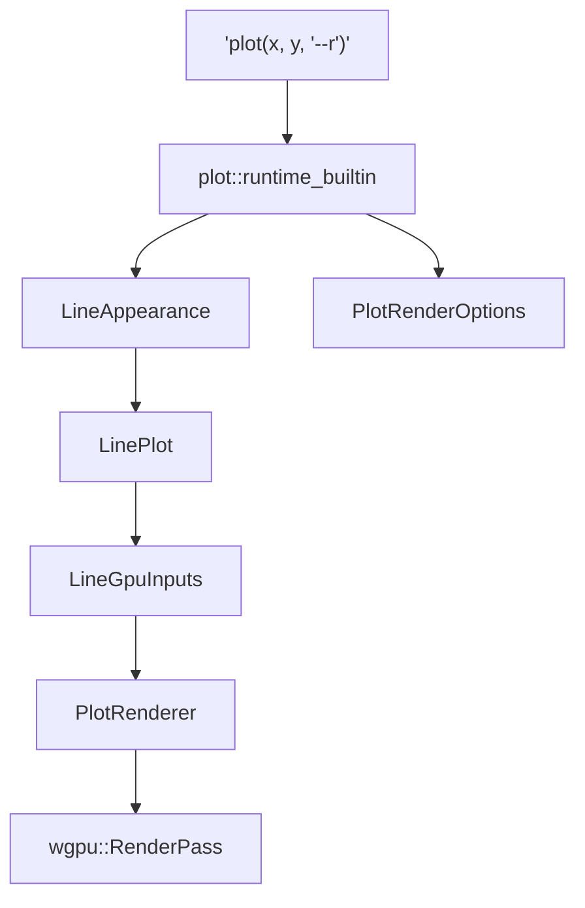
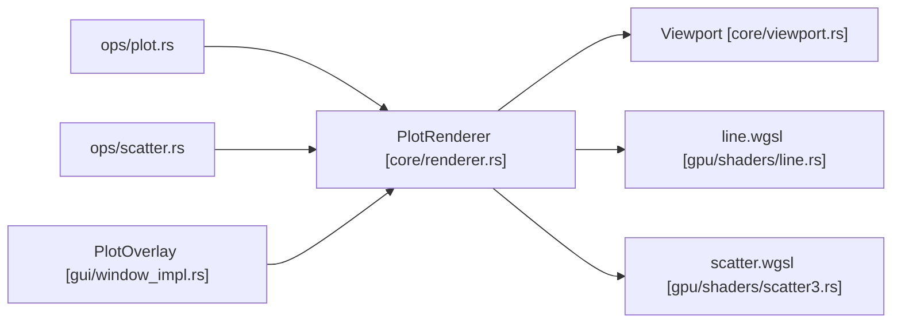

# GPU Rendering Pipeline

<details>
<summary>Relevant source files</summary>

- [crates/runmat-plot/src/core/mod.rs](https://github.com/runmat-org/runmat/blob/82685330/crates/runmat-plot/src/core/mod.rs)
- [crates/runmat-plot/src/core/renderer.rs](https://github.com/runmat-org/runmat/blob/82685330/crates/runmat-plot/src/core/renderer.rs)
- [crates/runmat-plot/src/core/viewport.rs](https://github.com/runmat-org/runmat/blob/82685330/crates/runmat-plot/src/core/viewport.rs)
- [crates/runmat-plot/src/export/image.rs](https://github.com/runmat-org/runmat/blob/82685330/crates/runmat-plot/src/export/image.rs)
- [crates/runmat-plot/src/export/native_surface.rs](https://github.com/runmat-org/runmat/blob/82685330/crates/runmat-plot/src/export/native_surface.rs)
- [crates/runmat-plot/src/gpu/line.rs](https://github.com/runmat-org/runmat/blob/82685330/crates/runmat-plot/src/gpu/line.rs)
- [crates/runmat-plot/src/gpu/line3.rs](https://github.com/runmat-org/runmat/blob/82685330/crates/runmat-plot/src/gpu/line3.rs)
- [crates/runmat-plot/src/gpu/scatter2.rs](https://github.com/runmat-org/runmat/blob/82685330/crates/runmat-plot/src/gpu/scatter2.rs)
- [crates/runmat-plot/src/gpu/scatter3.rs](https://github.com/runmat-org/runmat/blob/82685330/crates/runmat-plot/src/gpu/scatter3.rs)
- [crates/runmat-plot/src/gpu/shaders/line.rs](https://github.com/runmat-org/runmat/blob/82685330/crates/runmat-plot/src/gpu/shaders/line.rs)
- [crates/runmat-plot/src/gpu/shaders/line3.rs](https://github.com/runmat-org/runmat/blob/82685330/crates/runmat-plot/src/gpu/shaders/line3.rs)
- [crates/runmat-plot/src/gpu/shaders/scatter2.rs](https://github.com/runmat-org/runmat/blob/82685330/crates/runmat-plot/src/gpu/shaders/scatter2.rs)
- [crates/runmat-plot/src/gpu/shaders/scatter3.rs](https://github.com/runmat-org/runmat/blob/82685330/crates/runmat-plot/src/gpu/shaders/scatter3.rs)
- [crates/runmat-plot/src/gpu/shaders/vertex/mod.rs](https://github.com/runmat-org/runmat/blob/82685330/crates/runmat-plot/src/gpu/shaders/vertex/mod.rs)
- [crates/runmat-plot/src/gpu/shaders/vertex/point_billboard.rs](https://github.com/runmat-org/runmat/blob/82685330/crates/runmat-plot/src/gpu/shaders/vertex/point_billboard.rs)
- [crates/runmat-plot/src/gui/window.rs](https://github.com/runmat-org/runmat/blob/82685330/crates/runmat-plot/src/gui/window.rs)
- [crates/runmat-plot/src/gui/window_impl.rs](https://github.com/runmat-org/runmat/blob/82685330/crates/runmat-plot/src/gui/window_impl.rs)
- [crates/runmat-plot/src/plots/area.rs](https://github.com/runmat-org/runmat/blob/82685330/crates/runmat-plot/src/plots/area.rs)
- [crates/runmat-plot/src/plots/bar.rs](https://github.com/runmat-org/runmat/blob/82685330/crates/runmat-plot/src/plots/bar.rs)
- [crates/runmat-plot/src/plots/line.rs](https://github.com/runmat-org/runmat/blob/82685330/crates/runmat-plot/src/plots/line.rs)
- [crates/runmat-plot/src/plots/line3.rs](https://github.com/runmat-org/runmat/blob/82685330/crates/runmat-plot/src/plots/line3.rs)
- [crates/runmat-plot/src/plots/patch.rs](https://github.com/runmat-org/runmat/blob/82685330/crates/runmat-plot/src/plots/patch.rs)
- [crates/runmat-plot/src/plots/scatter3.rs](https://github.com/runmat-org/runmat/blob/82685330/crates/runmat-plot/src/plots/scatter3.rs)
- [crates/runmat-plot/tests/renderer_tests.rs](https://github.com/runmat-org/runmat/blob/82685330/crates/runmat-plot/tests/renderer_tests.rs)
- [crates/runmat-runtime/src/builtins/builtins-json/fill3.json](https://github.com/runmat-org/runmat/blob/82685330/crates/runmat-runtime/src/builtins/builtins-json/fill3.json)
- [crates/runmat-runtime/src/builtins/builtins-json/heatmap.json](https://github.com/runmat-org/runmat/blob/82685330/crates/runmat-runtime/src/builtins/builtins-json/heatmap.json)
- [crates/runmat-runtime/src/builtins/plotting/core/engine.rs](https://github.com/runmat-org/runmat/blob/82685330/crates/runmat-runtime/src/builtins/plotting/core/engine.rs)
- [crates/runmat-runtime/src/builtins/plotting/core/point.rs](https://github.com/runmat-org/runmat/blob/82685330/crates/runmat-runtime/src/builtins/plotting/core/point.rs)
- [crates/runmat-runtime/src/builtins/plotting/core/style.rs](https://github.com/runmat-org/runmat/blob/82685330/crates/runmat-runtime/src/builtins/plotting/core/style.rs)
- [crates/runmat-runtime/src/builtins/plotting/ops/area.rs](https://github.com/runmat-org/runmat/blob/82685330/crates/runmat-runtime/src/builtins/plotting/ops/area.rs)
- [crates/runmat-runtime/src/builtins/plotting/ops/bar.rs](https://github.com/runmat-org/runmat/blob/82685330/crates/runmat-runtime/src/builtins/plotting/ops/bar.rs)
- [crates/runmat-runtime/src/builtins/plotting/ops/common/line_inputs.rs](https://github.com/runmat-org/runmat/blob/82685330/crates/runmat-runtime/src/builtins/plotting/ops/common/line_inputs.rs)
- [crates/runmat-runtime/src/builtins/plotting/ops/contour.rs](https://github.com/runmat-org/runmat/blob/82685330/crates/runmat-runtime/src/builtins/plotting/ops/contour.rs)
- [crates/runmat-runtime/src/builtins/plotting/ops/contourf.rs](https://github.com/runmat-org/runmat/blob/82685330/crates/runmat-runtime/src/builtins/plotting/ops/contourf.rs)
- [crates/runmat-runtime/src/builtins/plotting/ops/errorbar.rs](https://github.com/runmat-org/runmat/blob/82685330/crates/runmat-runtime/src/builtins/plotting/ops/errorbar.rs)
- [crates/runmat-runtime/src/builtins/plotting/ops/fill3.rs](https://github.com/runmat-org/runmat/blob/82685330/crates/runmat-runtime/src/builtins/plotting/ops/fill3.rs)
- [crates/runmat-runtime/src/builtins/plotting/ops/heatmap.rs](https://github.com/runmat-org/runmat/blob/82685330/crates/runmat-runtime/src/builtins/plotting/ops/heatmap.rs)
- [crates/runmat-runtime/src/builtins/plotting/ops/hist.rs](https://github.com/runmat-org/runmat/blob/82685330/crates/runmat-runtime/src/builtins/plotting/ops/hist.rs)
- [crates/runmat-runtime/src/builtins/plotting/ops/histogram.rs](https://github.com/runmat-org/runmat/blob/82685330/crates/runmat-runtime/src/builtins/plotting/ops/histogram.rs)
- [crates/runmat-runtime/src/builtins/plotting/ops/image.rs](https://github.com/runmat-org/runmat/blob/82685330/crates/runmat-runtime/src/builtins/plotting/ops/image.rs)
- [crates/runmat-runtime/src/builtins/plotting/ops/imagesc.rs](https://github.com/runmat-org/runmat/blob/82685330/crates/runmat-runtime/src/builtins/plotting/ops/imagesc.rs)
- [crates/runmat-runtime/src/builtins/plotting/ops/imshow.rs](https://github.com/runmat-org/runmat/blob/82685330/crates/runmat-runtime/src/builtins/plotting/ops/imshow.rs)
- [crates/runmat-runtime/src/builtins/plotting/ops/mesh.rs](https://github.com/runmat-org/runmat/blob/82685330/crates/runmat-runtime/src/builtins/plotting/ops/mesh.rs)
- [crates/runmat-runtime/src/builtins/plotting/ops/meshc.rs](https://github.com/runmat-org/runmat/blob/82685330/crates/runmat-runtime/src/builtins/plotting/ops/meshc.rs)
- [crates/runmat-runtime/src/builtins/plotting/ops/patch.rs](https://github.com/runmat-org/runmat/blob/82685330/crates/runmat-runtime/src/builtins/plotting/ops/patch.rs)
- [crates/runmat-runtime/src/builtins/plotting/ops/pie.rs](https://github.com/runmat-org/runmat/blob/82685330/crates/runmat-runtime/src/builtins/plotting/ops/pie.rs)
- [crates/runmat-runtime/src/builtins/plotting/ops/plot.rs](https://github.com/runmat-org/runmat/blob/82685330/crates/runmat-runtime/src/builtins/plotting/ops/plot.rs)
- [crates/runmat-runtime/src/builtins/plotting/ops/plot3.rs](https://github.com/runmat-org/runmat/blob/82685330/crates/runmat-runtime/src/builtins/plotting/ops/plot3.rs)
- [crates/runmat-runtime/src/builtins/plotting/ops/quiver.rs](https://github.com/runmat-org/runmat/blob/82685330/crates/runmat-runtime/src/builtins/plotting/ops/quiver.rs)
- [crates/runmat-runtime/src/builtins/plotting/ops/scatter.rs](https://github.com/runmat-org/runmat/blob/82685330/crates/runmat-runtime/src/builtins/plotting/ops/scatter.rs)
- [crates/runmat-runtime/src/builtins/plotting/ops/scatter3.rs](https://github.com/runmat-org/runmat/blob/82685330/crates/runmat-runtime/src/builtins/plotting/ops/scatter3.rs)
- [crates/runmat-runtime/src/builtins/plotting/ops/stairs.rs](https://github.com/runmat-org/runmat/blob/82685330/crates/runmat-runtime/src/builtins/plotting/ops/stairs.rs)
- [crates/runmat-runtime/src/builtins/plotting/ops/stem.rs](https://github.com/runmat-org/runmat/blob/82685330/crates/runmat-runtime/src/builtins/plotting/ops/stem.rs)
- [crates/runmat-runtime/src/builtins/plotting/ops/surf.rs](https://github.com/runmat-org/runmat/blob/82685330/crates/runmat-runtime/src/builtins/plotting/ops/surf.rs)
- [crates/runmat-runtime/src/builtins/plotting/ops/surfc.rs](https://github.com/runmat-org/runmat/blob/82685330/crates/runmat-runtime/src/builtins/plotting/ops/surfc.rs)
- [crates/runmat-vm/src/object/resolve.rs](https://github.com/runmat-org/runmat/blob/82685330/crates/runmat-vm/src/object/resolve.rs)
- [crates/runmat-vm/tests/plotting.rs](https://github.com/runmat-org/runmat/blob/82685330/crates/runmat-vm/tests/plotting.rs)

</details>

The GPU Rendering Pipeline in RunMat is a `wgpu`-based system designed to provide high-performance, MATLAB-compatible visualizations. It leverages hardware acceleration not only for 2D/3D geometry but also for data processing tasks like Level-of-Detail (LOD) selection and viewport-dependent styling (e.g., thick lines and markers).

## Scene Reconstruction & Data Flow

Rendering begins when a plotting builtin (e.g., `plot`, `surf`, `scatter`) is invoked. These functions act as "sinks" in the [Fusion Engine](https://app.devin.ai/org/runmat-org/wiki/runmat-org/runmat?branch=dev#5.1) — they terminate fusion graphs and consume `gpuArray` tensors directly if a shared `wgpu` context is available [crates/runmat-runtime/src/builtins/plotting/ops/plot.rs #46-55](https://github.com/runmat-org/runmat/blob/82685330/crates/runmat-runtime/src/builtins/plotting/ops/plot.rs#L46-L55)

The pipeline follows a specific lifecycle:

1. Input Resolution: Builtins parse MATLAB-style arguments (e.g., `LineSpec`, property pairs) into internal style structures like `LineAppearance` [crates/runmat-runtime/src/builtins/plotting/ops/plot.rs #28-32](https://github.com/runmat-org/runmat/blob/82685330/crates/runmat-runtime/src/builtins/plotting/ops/plot.rs#L28-L32)
2. Scene Updates: Plot elements are added to a `FigureState` hierarchy. If the inputs are already on the GPU, the pipeline uses `GpuTensorHandle` to avoid CPU round-trips [crates/runmat-runtime/src/builtins/plotting/ops/scatter.rs #14-17](https://github.com/runmat-org/runmat/blob/82685330/crates/runmat-runtime/src/builtins/plotting/ops/scatter.rs#L14-L17)
3. Geometry Generation: The `PlotRenderer` reconstructs the scene by converting high-level plot objects (e.g., `LinePlot`, `ScatterPlot`) into GPU-ready vertex and index buffers.

### Architecture: Builtin to GPU Bridge

The following diagram illustrates how a high-level `plot` call traverses the runtime into the GPU rendering subsystem.

Plotting Data Flow



<details>
<summary>Rendered SVG</summary>

```svg
<svg id="mermaid-744fioq408n" xmlns="http://www.w3.org/2000/svg" xmlns:xlink="http://www.w3.org/1999/xlink" class="flowchart" style="max-width: 100%; touch-action: none; user-select: none; cursor: grab; min-height: fit-content; max-height: 100%;" viewBox="0 0 519.28125 844" role="graphics-document document" aria-roledescription="flowchart-v2" preserveAspectRatio="xMidYMid meet"><style>#mermaid-744fioq408n{font-family:ui-sans-serif,-apple-system,system-ui,Segoe UI,Helvetica;font-size:16px;fill:#ccc;}@keyframes edge-animation-frame{from{stroke-dashoffset:0;}}@keyframes dash{to{stroke-dashoffset:0;}}#mermaid-744fioq408n .edge-animation-slow{stroke-dasharray:9,5!important;stroke-dashoffset:900;animation:dash 50s linear infinite;stroke-linecap:round;}#mermaid-744fioq408n .edge-animation-fast{stroke-dasharray:9,5!important;stroke-dashoffset:900;animation:dash 20s linear infinite;stroke-linecap:round;}#mermaid-744fioq408n .error-icon{fill:#333;}#mermaid-744fioq408n .error-text{fill:#cccccc;stroke:#cccccc;}#mermaid-744fioq408n .edge-thickness-normal{stroke-width:1px;}#mermaid-744fioq408n .edge-thickness-thick{stroke-width:3.5px;}#mermaid-744fioq408n .edge-pattern-solid{stroke-dasharray:0;}#mermaid-744fioq408n .edge-thickness-invisible{stroke-width:0;fill:none;}#mermaid-744fioq408n .edge-pattern-dashed{stroke-dasharray:3;}#mermaid-744fioq408n .edge-pattern-dotted{stroke-dasharray:2;}#mermaid-744fioq408n .marker{fill:#666;stroke:#666;}#mermaid-744fioq408n .marker.cross{stroke:#666;}#mermaid-744fioq408n svg{font-family:ui-sans-serif,-apple-system,system-ui,Segoe UI,Helvetica;font-size:16px;}#mermaid-744fioq408n p{margin:0;}#mermaid-744fioq408n .label{font-family:ui-sans-serif,-apple-system,system-ui,Segoe UI,Helvetica;color:#fff;}#mermaid-744fioq408n .cluster-label text{fill:#fff;}#mermaid-744fioq408n .cluster-label span{color:#fff;}#mermaid-744fioq408n .cluster-label span p{background-color:transparent;}#mermaid-744fioq408n .label text,#mermaid-744fioq408n span{fill:#fff;color:#fff;}#mermaid-744fioq408n .node rect,#mermaid-744fioq408n .node circle,#mermaid-744fioq408n .node ellipse,#mermaid-744fioq408n .node polygon,#mermaid-744fioq408n .node path{fill:#111;stroke:#222;stroke-width:1px;}#mermaid-744fioq408n .rough-node .label text,#mermaid-744fioq408n .node .label text,#mermaid-744fioq408n .image-shape .label,#mermaid-744fioq408n .icon-shape .label{text-anchor:middle;}#mermaid-744fioq408n .node .katex path{fill:#000;stroke:#000;stroke-width:1px;}#mermaid-744fioq408n .rough-node .label,#mermaid-744fioq408n .node .label,#mermaid-744fioq408n .image-shape .label,#mermaid-744fioq408n .icon-shape .label{text-align:center;}#mermaid-744fioq408n .node.clickable{cursor:pointer;}#mermaid-744fioq408n .root .anchor path{fill:#666!important;stroke-width:0;stroke:#666;}#mermaid-744fioq408n .arrowheadPath{fill:#0b0b0b;}#mermaid-744fioq408n .edgePath .path{stroke:#666;stroke-width:1px;}#mermaid-744fioq408n .flowchart-link{stroke:#666;fill:none;}#mermaid-744fioq408n .edgeLabel{background-color:#161616;text-align:center;}#mermaid-744fioq408n .edgeLabel p{background-color:#161616;}#mermaid-744fioq408n .edgeLabel rect{opacity:0.5;background-color:#161616;fill:#161616;}#mermaid-744fioq408n .labelBkg{background-color:rgba(22, 22, 22, 0.5);}#mermaid-744fioq408n .cluster rect{fill:#161616;stroke:#222;stroke-width:1px;}#mermaid-744fioq408n .cluster text{fill:#fff;}#mermaid-744fioq408n .cluster span{color:#fff;}#mermaid-744fioq408n div.mermaidTooltip{position:absolute;text-align:center;max-width:200px;padding:2px;font-family:ui-sans-serif,-apple-system,system-ui,Segoe UI,Helvetica;font-size:12px;background:#333;border:1px solid hsl(0, 0%, 10%);border-radius:2px;pointer-events:none;z-index:100;}#mermaid-744fioq408n .flowchartTitleText{text-anchor:middle;font-size:18px;fill:#ccc;}#mermaid-744fioq408n rect.text{fill:none;stroke-width:0;}#mermaid-744fioq408n .icon-shape,#mermaid-744fioq408n .image-shape{background-color:#161616;text-align:center;}#mermaid-744fioq408n .icon-shape p,#mermaid-744fioq408n .image-shape p{background-color:#161616;padding:2px;}#mermaid-744fioq408n .icon-shape .label rect,#mermaid-744fioq408n .image-shape .label rect{opacity:0.5;background-color:#161616;fill:#161616;}#mermaid-744fioq408n .label-icon{display:inline-block;height:1em;overflow:visible;vertical-align:-0.125em;}#mermaid-744fioq408n .node .label-icon path{fill:currentColor;stroke:revert;stroke-width:revert;}#mermaid-744fioq408n .node .neo-node{stroke:#222;}#mermaid-744fioq408n [data-look="neo"].node rect,#mermaid-744fioq408n [data-look="neo"].cluster rect,#mermaid-744fioq408n [data-look="neo"].node polygon{stroke:url(#mermaid-744fioq408n-gradient);filter:drop-shadow( 1px 2px 2px rgba(185,185,185,1));}#mermaid-744fioq408n [data-look="neo"].node path{stroke:url(#mermaid-744fioq408n-gradient);stroke-width:1px;}#mermaid-744fioq408n [data-look="neo"].node .outer-path{filter:drop-shadow( 1px 2px 2px rgba(185,185,185,1));}#mermaid-744fioq408n [data-look="neo"].node .neo-line path{stroke:#222;filter:none;}#mermaid-744fioq408n [data-look="neo"].node circle{stroke:url(#mermaid-744fioq408n-gradient);filter:drop-shadow( 1px 2px 2px rgba(185,185,185,1));}#mermaid-744fioq408n [data-look="neo"].node circle .state-start{fill:#000000;}#mermaid-744fioq408n [data-look="neo"].icon-shape .icon{fill:url(#mermaid-744fioq408n-gradient);filter:drop-shadow( 1px 2px 2px rgba(185,185,185,1));}#mermaid-744fioq408n [data-look="neo"].icon-shape .icon-neo path{stroke:url(#mermaid-744fioq408n-gradient);filter:drop-shadow( 1px 2px 2px rgba(185,185,185,1));}#mermaid-744fioq408n :root{--mermaid-font-family:"trebuchet ms",verdana,arial,sans-serif;}</style><g><marker id="mermaid-744fioq408n_flowchart-v2-pointEnd" class="marker flowchart-v2" viewBox="0 0 10 10" refX="5" refY="5" markerUnits="userSpaceOnUse" markerWidth="8" markerHeight="8" orient="auto"><path d="M 0 0 L 10 5 L 0 10 z" class="arrowMarkerPath" style="stroke-width: 1; stroke-dasharray: 1, 0;"></path></marker><marker id="mermaid-744fioq408n_flowchart-v2-pointStart" class="marker flowchart-v2" viewBox="0 0 10 10" refX="4.5" refY="5" markerUnits="userSpaceOnUse" markerWidth="8" markerHeight="8" orient="auto"><path d="M 0 5 L 10 10 L 10 0 z" class="arrowMarkerPath" style="stroke-width: 1; stroke-dasharray: 1, 0;"></path></marker><marker id="mermaid-744fioq408n_flowchart-v2-pointEnd-margin" class="marker flowchart-v2" viewBox="0 0 11.5 14" refX="11.5" refY="7" markerUnits="userSpaceOnUse" markerWidth="10.5" markerHeight="14" orient="auto"><path d="M 0 0 L 11.5 7 L 0 14 z" class="arrowMarkerPath" style="stroke-width: 0; stroke-dasharray: 1, 0;"></path></marker><marker id="mermaid-744fioq408n_flowchart-v2-pointStart-margin" class="marker flowchart-v2" viewBox="0 0 11.5 14" refX="1" refY="7" markerUnits="userSpaceOnUse" markerWidth="11.5" markerHeight="14" orient="auto"><polygon points="0,7 11.5,14 11.5,0" class="arrowMarkerPath" style="stroke-width: 0; stroke-dasharray: 1, 0;"></polygon></marker><marker id="mermaid-744fioq408n_flowchart-v2-circleEnd" class="marker flowchart-v2" viewBox="0 0 10 10" refX="11" refY="5" markerUnits="userSpaceOnUse" markerWidth="11" markerHeight="11" orient="auto"><circle cx="5" cy="5" r="5" class="arrowMarkerPath" style="stroke-width: 1; stroke-dasharray: 1, 0;"></circle></marker><marker id="mermaid-744fioq408n_flowchart-v2-circleStart" class="marker flowchart-v2" viewBox="0 0 10 10" refX="-1" refY="5" markerUnits="userSpaceOnUse" markerWidth="11" markerHeight="11" orient="auto"><circle cx="5" cy="5" r="5" class="arrowMarkerPath" style="stroke-width: 1; stroke-dasharray: 1, 0;"></circle></marker><marker id="mermaid-744fioq408n_flowchart-v2-circleEnd-margin" class="marker flowchart-v2" viewBox="0 0 10 10" refY="5" refX="12.25" markerUnits="userSpaceOnUse" markerWidth="14" markerHeight="14" orient="auto"><circle cx="5" cy="5" r="5" class="arrowMarkerPath" style="stroke-width: 0; stroke-dasharray: 1, 0;"></circle></marker><marker id="mermaid-744fioq408n_flowchart-v2-circleStart-margin" class="marker flowchart-v2" viewBox="0 0 10 10" refX="-2" refY="5" markerUnits="userSpaceOnUse" markerWidth="14" markerHeight="14" orient="auto"><circle cx="5" cy="5" r="5" class="arrowMarkerPath" style="stroke-width: 0; stroke-dasharray: 1, 0;"></circle></marker><marker id="mermaid-744fioq408n_flowchart-v2-crossEnd" class="marker cross flowchart-v2" viewBox="0 0 11 11" refX="12" refY="5.2" markerUnits="userSpaceOnUse" markerWidth="11" markerHeight="11" orient="auto"><path d="M 1,1 l 9,9 M 10,1 l -9,9" class="arrowMarkerPath" style="stroke-width: 2; stroke-dasharray: 1, 0;"></path></marker><marker id="mermaid-744fioq408n_flowchart-v2-crossStart" class="marker cross flowchart-v2" viewBox="0 0 11 11" refX="-1" refY="5.2" markerUnits="userSpaceOnUse" markerWidth="11" markerHeight="11" orient="auto"><path d="M 1,1 l 9,9 M 10,1 l -9,9" class="arrowMarkerPath" style="stroke-width: 2; stroke-dasharray: 1, 0;"></path></marker><marker id="mermaid-744fioq408n_flowchart-v2-crossEnd-margin" class="marker cross flowchart-v2" viewBox="0 0 15 15" refX="17.7" refY="7.5" markerUnits="userSpaceOnUse" markerWidth="12" markerHeight="12" orient="auto"><path d="M 1,1 L 14,14 M 1,14 L 14,1" class="arrowMarkerPath" style="stroke-width: 2.5;"></path></marker><marker id="mermaid-744fioq408n_flowchart-v2-crossStart-margin" class="marker cross flowchart-v2" viewBox="0 0 15 15" refX="-3.5" refY="7.5" markerUnits="userSpaceOnUse" markerWidth="12" markerHeight="12" orient="auto"><path d="M 1,1 L 14,14 M 1,14 L 14,1" class="arrowMarkerPath" style="stroke-width: 2.5; stroke-dasharray: 1, 0;"></path></marker><g class="root"><g class="clusters"><g class="cluster" id="mermaid-744fioq408n-subGraph2" data-look="classic"><rect style="" x="20.390625" y="420" width="236.40625" height="312"></rect><g class="cluster-label" transform="translate(24.390625, 420)"><foreignObject width="228.40625" height="24"><div style="display: table-cell; white-space: nowrap; line-height: 1.5;" xmlns="http://www.w3.org/1999/xhtml"><span class="nodeLabel"><p>Code Entity Space: runmat-plot</p></span></div></foreignObject></g></g><g class="cluster" id="mermaid-744fioq408n-subGraph1" data-look="classic"><rect style="" x="8" y="162" width="503.28125" height="208"></rect><g class="cluster-label" transform="translate(131.6484375, 162)"><foreignObject width="255.984375" height="24"><div style="display: table-cell; white-space: nowrap; line-height: 1.5;" xmlns="http://www.w3.org/1999/xhtml"><span class="nodeLabel"><p>Code Entity Space: runmat-runtime</p></span></div></foreignObject></g></g><g class="cluster" id="mermaid-744fioq408n-subGraph0" data-look="classic"><rect style="" x="137.2265625" y="8" width="239.953125" height="104"></rect><g class="cluster-label" transform="translate(168.2578125, 8)"><foreignObject width="177.890625" height="24"><div style="display: table-cell; white-space: nowrap; line-height: 1.5;" xmlns="http://www.w3.org/1999/xhtml"><span class="nodeLabel"><p>Natural Language Space</p></span></div></foreignObject></g></g></g><g class="edgePaths"><path d="M257.203,87L257.203,91.167C257.203,95.333,257.203,103.667,257.203,112C257.203,120.333,257.203,128.667,257.203,137C257.203,145.333,257.203,153.667,257.203,161.333C257.203,169,257.203,176,257.203,179.5L257.203,183" id="mermaid-744fioq408n-L_A_B_0" class="edge-thickness-normal edge-pattern-solid edge-thickness-normal edge-pattern-solid flowchart-link" style=";" data-edge="true" data-et="edge" data-id="L_A_B_0" data-points="W3sieCI6MjU3LjIwMzEyNSwieSI6ODd9LHsieCI6MjU3LjIwMzEyNSwieSI6MTEyfSx7IngiOjI1Ny4yMDMxMjUsInkiOjEzN30seyJ4IjoyNTcuMjAzMTI1LCJ5IjoxNjJ9LHsieCI6MjU3LjIwMzEyNSwieSI6MTg3fV0=" data-look="classic" marker-end="url(#mermaid-744fioq408n_flowchart-v2-pointEnd)"></path><path d="M195.617,241L186.114,245.167C176.61,249.333,157.602,257.667,148.098,265.333C138.594,273,138.594,280,138.594,283.5L138.594,287" id="mermaid-744fioq408n-L_B_C_0" class="edge-thickness-normal edge-pattern-solid edge-thickness-normal edge-pattern-solid flowchart-link" style=";" data-edge="true" data-et="edge" data-id="L_B_C_0" data-points="W3sieCI6MTk1LjYxNzQ4Nzk4MDc2OTIzLCJ5IjoyNDF9LHsieCI6MTM4LjU5Mzc1LCJ5IjoyNjZ9LHsieCI6MTM4LjU5Mzc1LCJ5IjoyOTF9XQ==" data-look="classic" marker-end="url(#mermaid-744fioq408n_flowchart-v2-pointEnd)"></path><path d="M318.789,241L328.293,245.167C337.797,249.333,356.805,257.667,366.309,265.333C375.813,273,375.813,280,375.813,283.5L375.813,287" id="mermaid-744fioq408n-L_B_D_0" class="edge-thickness-normal edge-pattern-solid edge-thickness-normal edge-pattern-solid flowchart-link" style=";" data-edge="true" data-et="edge" data-id="L_B_D_0" data-points="W3sieCI6MzE4Ljc4ODc2MjAxOTIzMDgsInkiOjI0MX0seyJ4IjozNzUuODEyNSwieSI6MjY2fSx7IngiOjM3NS44MTI1LCJ5IjoyOTF9XQ==" data-look="classic" marker-end="url(#mermaid-744fioq408n_flowchart-v2-pointEnd)"></path><path d="M138.594,345L138.594,349.167C138.594,353.333,138.594,361.667,138.594,370C138.594,378.333,138.594,386.667,138.594,395C138.594,403.333,138.594,411.667,138.594,419.333C138.594,427,138.594,434,138.594,437.5L138.594,441" id="mermaid-744fioq408n-L_C_E_0" class="edge-thickness-normal edge-pattern-solid edge-thickness-normal edge-pattern-solid flowchart-link" style=";" data-edge="true" data-et="edge" data-id="L_C_E_0" data-points="W3sieCI6MTM4LjU5Mzc1LCJ5IjozNDV9LHsieCI6MTM4LjU5Mzc1LCJ5IjozNzB9LHsieCI6MTM4LjU5Mzc1LCJ5IjozOTV9LHsieCI6MTM4LjU5Mzc1LCJ5Ijo0MjB9LHsieCI6MTM4LjU5Mzc1LCJ5Ijo0NDV9XQ==" data-look="classic" marker-end="url(#mermaid-744fioq408n_flowchart-v2-pointEnd)"></path><path d="M138.594,499L138.594,503.167C138.594,507.333,138.594,515.667,138.594,523.333C138.594,531,138.594,538,138.594,541.5L138.594,545" id="mermaid-744fioq408n-L_E_G_0" class="edge-thickness-normal edge-pattern-solid edge-thickness-normal edge-pattern-solid flowchart-link" style=";" data-edge="true" data-et="edge" data-id="L_E_G_0" data-points="W3sieCI6MTM4LjU5Mzc1LCJ5Ijo0OTl9LHsieCI6MTM4LjU5Mzc1LCJ5Ijo1MjR9LHsieCI6MTM4LjU5Mzc1LCJ5Ijo1NDl9XQ==" data-look="classic" marker-end="url(#mermaid-744fioq408n_flowchart-v2-pointEnd)"></path><path d="M138.594,603L138.594,607.167C138.594,611.333,138.594,619.667,138.594,627.333C138.594,635,138.594,642,138.594,645.5L138.594,649" id="mermaid-744fioq408n-L_G_F_0" class="edge-thickness-normal edge-pattern-solid edge-thickness-normal edge-pattern-solid flowchart-link" style=";" data-edge="true" data-et="edge" data-id="L_G_F_0" data-points="W3sieCI6MTM4LjU5Mzc1LCJ5Ijo2MDN9LHsieCI6MTM4LjU5Mzc1LCJ5Ijo2Mjh9LHsieCI6MTM4LjU5Mzc1LCJ5Ijo2NTN9XQ==" data-look="classic" marker-end="url(#mermaid-744fioq408n_flowchart-v2-pointEnd)"></path><path d="M138.594,707L138.594,711.167C138.594,715.333,138.594,723.667,138.594,732C138.594,740.333,138.594,748.667,138.594,756.333C138.594,764,138.594,771,138.594,774.5L138.594,778" id="mermaid-744fioq408n-L_F_H_0" class="edge-thickness-normal edge-pattern-solid edge-thickness-normal edge-pattern-solid flowchart-link" style=";" data-edge="true" data-et="edge" data-id="L_F_H_0" data-points="W3sieCI6MTM4LjU5Mzc1LCJ5Ijo3MDd9LHsieCI6MTM4LjU5Mzc1LCJ5Ijo3MzJ9LHsieCI6MTM4LjU5Mzc1LCJ5Ijo3NTd9LHsieCI6MTM4LjU5Mzc1LCJ5Ijo3ODJ9XQ==" data-look="classic" marker-end="url(#mermaid-744fioq408n_flowchart-v2-pointEnd)"></path></g><g class="edgeLabels"><g class="edgeLabel"><g class="label" data-id="L_A_B_0" transform="translate(0, 0)"><foreignObject width="0" height="0"><div style="display: table-cell; white-space: nowrap; line-height: 1.5; max-width: 200px; text-align: center;" xmlns="http://www.w3.org/1999/xhtml" class="labelBkg"><span class="edgeLabel"></span></div></foreignObject></g></g><g class="edgeLabel"><g class="label" data-id="L_B_C_0" transform="translate(0, 0)"><foreignObject width="0" height="0"><div style="display: table-cell; white-space: nowrap; line-height: 1.5; max-width: 200px; text-align: center;" xmlns="http://www.w3.org/1999/xhtml" class="labelBkg"><span class="edgeLabel"></span></div></foreignObject></g></g><g class="edgeLabel"><g class="label" data-id="L_B_D_0" transform="translate(0, 0)"><foreignObject width="0" height="0"><div style="display: table-cell; white-space: nowrap; line-height: 1.5; max-width: 200px; text-align: center;" xmlns="http://www.w3.org/1999/xhtml" class="labelBkg"><span class="edgeLabel"></span></div></foreignObject></g></g><g class="edgeLabel"><g class="label" data-id="L_C_E_0" transform="translate(0, 0)"><foreignObject width="0" height="0"><div style="display: table-cell; white-space: nowrap; line-height: 1.5; max-width: 200px; text-align: center;" xmlns="http://www.w3.org/1999/xhtml" class="labelBkg"><span class="edgeLabel"></span></div></foreignObject></g></g><g class="edgeLabel"><g class="label" data-id="L_E_G_0" transform="translate(0, 0)"><foreignObject width="0" height="0"><div style="display: table-cell; white-space: nowrap; line-height: 1.5; max-width: 200px; text-align: center;" xmlns="http://www.w3.org/1999/xhtml" class="labelBkg"><span class="edgeLabel"></span></div></foreignObject></g></g><g class="edgeLabel"><g class="label" data-id="L_G_F_0" transform="translate(0, 0)"><foreignObject width="0" height="0"><div style="display: table-cell; white-space: nowrap; line-height: 1.5; max-width: 200px; text-align: center;" xmlns="http://www.w3.org/1999/xhtml" class="labelBkg"><span class="edgeLabel"></span></div></foreignObject></g></g><g class="edgeLabel"><g class="label" data-id="L_F_H_0" transform="translate(0, 0)"><foreignObject width="0" height="0"><div style="display: table-cell; white-space: nowrap; line-height: 1.5; max-width: 200px; text-align: center;" xmlns="http://www.w3.org/1999/xhtml" class="labelBkg"><span class="edgeLabel"></span></div></foreignObject></g></g></g><g class="nodes"><g class="node default" id="mermaid-744fioq408n-flowchart-A-0" data-look="classic" transform="translate(257.203125, 60)"><rect class="basic label-container" style="" x="-84.9765625" y="-27" width="169.953125" height="54"></rect><g class="label" style="" transform="translate(-54.9765625, -12)"><rect></rect><foreignObject width="109.953125" height="24"><div style="display: table-cell; white-space: nowrap; line-height: 1.5; max-width: 200px; text-align: center;" xmlns="http://www.w3.org/1999/xhtml"><span class="nodeLabel"><p>'plot(x, y, '--r')'</p></span></div></foreignObject></g></g><g class="node default" id="mermaid-744fioq408n-flowchart-B-1" data-look="classic" transform="translate(257.203125, 214)"><rect class="basic label-container" style="" x="-102.453125" y="-27" width="204.90625" height="54"></rect><g class="label" style="" transform="translate(-72.453125, -12)"><rect></rect><foreignObject width="144.90625" height="24"><div style="display: table-cell; white-space: nowrap; line-height: 1.5; max-width: 200px; text-align: center;" xmlns="http://www.w3.org/1999/xhtml"><span class="nodeLabel"><p>plot::runtime_builtin</p></span></div></foreignObject></g></g><g class="node default" id="mermaid-744fioq408n-flowchart-C-2" data-look="classic" transform="translate(138.59375, 318)"><rect class="basic label-container" style="" x="-88.734375" y="-27" width="177.46875" height="54"></rect><g class="label" style="" transform="translate(-58.734375, -12)"><rect></rect><foreignObject width="117.46875" height="24"><div style="display: table-cell; white-space: nowrap; line-height: 1.5; max-width: 200px; text-align: center;" xmlns="http://www.w3.org/1999/xhtml"><span class="nodeLabel"><p>LineAppearance</p></span></div></foreignObject></g></g><g class="node default" id="mermaid-744fioq408n-flowchart-D-3" data-look="classic" transform="translate(375.8125, 318)"><rect class="basic label-container" style="" x="-98.484375" y="-27" width="196.96875" height="54"></rect><g class="label" style="" transform="translate(-68.484375, -12)"><rect></rect><foreignObject width="136.96875" height="24"><div style="display: table-cell; white-space: nowrap; line-height: 1.5; max-width: 200px; text-align: center;" xmlns="http://www.w3.org/1999/xhtml"><span class="nodeLabel"><p>PlotRenderOptions</p></span></div></foreignObject></g></g><g class="node default" id="mermaid-744fioq408n-flowchart-E-4" data-look="classic" transform="translate(138.59375, 472)"><rect class="basic label-container" style="" x="-59.25" y="-27" width="118.5" height="54"></rect><g class="label" style="" transform="translate(-29.25, -12)"><rect></rect><foreignObject width="58.5" height="24"><div style="display: table-cell; white-space: nowrap; line-height: 1.5; max-width: 200px; text-align: center;" xmlns="http://www.w3.org/1999/xhtml"><span class="nodeLabel"><p>LinePlot</p></span></div></foreignObject></g></g><g class="node default" id="mermaid-744fioq408n-flowchart-F-5" data-look="classic" transform="translate(138.59375, 680)"><rect class="basic label-container" style="" x="-77.2421875" y="-27" width="154.484375" height="54"></rect><g class="label" style="" transform="translate(-47.2421875, -12)"><rect></rect><foreignObject width="94.484375" height="24"><div style="display: table-cell; white-space: nowrap; line-height: 1.5; max-width: 200px; text-align: center;" xmlns="http://www.w3.org/1999/xhtml"><span class="nodeLabel"><p>PlotRenderer</p></span></div></foreignObject></g></g><g class="node default" id="mermaid-744fioq408n-flowchart-G-6" data-look="classic" transform="translate(138.59375, 576)"><rect class="basic label-container" style="" x="-82.625" y="-27" width="165.25" height="54"></rect><g class="label" style="" transform="translate(-52.625, -12)"><rect></rect><foreignObject width="105.25" height="24"><div style="display: table-cell; white-space: nowrap; line-height: 1.5; max-width: 200px; text-align: center;" xmlns="http://www.w3.org/1999/xhtml"><span class="nodeLabel"><p>LineGpuInputs</p></span></div></foreignObject></g></g><g class="node default" id="mermaid-744fioq408n-flowchart-H-20" data-look="classic" transform="translate(138.59375, 809)"><rect class="basic label-container" style="" x="-97.234375" y="-27" width="194.46875" height="54"></rect><g class="label" style="" transform="translate(-67.234375, -12)"><rect></rect><foreignObject width="134.46875" height="24"><div style="display: table-cell; white-space: nowrap; line-height: 1.5; max-width: 200px; text-align: center;" xmlns="http://www.w3.org/1999/xhtml"><span class="nodeLabel"><p>wgpu::RenderPass</p></span></div></foreignObject></g></g></g></g></g><defs><filter id="mermaid-744fioq408n-drop-shadow" height="130%" width="130%"><feDropShadow dx="4" dy="4" stdDeviation="0" flood-opacity="0.06" flood-color="#000000"></feDropShadow></filter></defs><defs><filter id="mermaid-744fioq408n-drop-shadow-small" height="150%" width="150%"><feDropShadow dx="2" dy="2" stdDeviation="0" flood-opacity="0.06" flood-color="#000000"></feDropShadow></filter></defs><linearGradient id="mermaid-744fioq408n-gradient" gradientUnits="objectBoundingBox" x1="0%" y1="0%" x2="100%" y2="0%"><stop offset="0%" stop-color="#333" stop-opacity="1"></stop><stop offset="100%" stop-color="hsl(-120, 0%, 3.3333333333%)" stop-opacity="1"></stop></linearGradient></svg>
```

</details>

Sources: [crates/runmat-runtime/src/builtins/plotting/ops/plot.rs #38-68](https://github.com/runmat-org/runmat/blob/82685330/crates/runmat-runtime/src/builtins/plotting/ops/plot.rs#L38-L68) [crates/runmat-plot/src/core/renderer.rs #1-20](https://github.com/runmat-org/runmat/blob/82685330/crates/runmat-plot/src/core/renderer.rs#L1-L20)

## Viewport-Dependent Rendering

RunMat implements specialized shaders to handle MATLAB's specific rendering requirements, such as pixel-perfect line widths and marker sizes that remain constant regardless of zoom level.

### Thick Lines & Anti-Aliasing

Standard GPU line primitives typically do not support widths greater than 1.0. The `PlotRenderer` uses a "miter-join" shader approach [crates/runmat-plot/src/gpu/shaders/line.rs #1-50](https://github.com/runmat-org/runmat/blob/82685330/crates/runmat-plot/src/gpu/shaders/line.rs#L1-L50):

- Expansion: Lines are expanded into screen-space triangles within the vertex shader.
- Viewport Injection: The current viewport dimensions and camera projection are passed as uniforms to ensure the line width in pixels matches the `LineWidth` property.
- Anti-Aliasing: Analytical anti-aliasing is performed in the fragment shader to provide smooth edges without requiring global MSAA.

### Level of Detail (LOD)

For massive datasets (e.g., 10M+ points), the pipeline employs GPU-side LOD. The `compute_surface_lod` and `scatter3_lod_stride` functions calculate appropriate sampling rates based on the current camera distance and screen resolution [crates/runmat-runtime/src/builtins/plotting/ops/surf.rs #26](https://github.com/runmat-org/runmat/blob/82685330/crates/runmat-runtime/src/builtins/plotting/ops/surf.rs#L26-L26) [crates/runmat-runtime/src/builtins/plotting/ops/scatter3.rs #34](https://github.com/runmat-org/runmat/blob/82685330/crates/runmat-runtime/src/builtins/plotting/ops/scatter3.rs#L34-L34)

## GPU Buffer Management

The `PlotRenderer` manages several categories of GPU buffers to balance performance and memory footprint:

| Buffer Type | Purpose | Persistence |
| --- | --- | --- |
| Attribute Buffer | Stores X, Y, Z coordinates and per-point attributes. | Persistent per Plot object. |
| Color Buffer | Stores RGB or colormap indices (CData). | Persistent; updated on set(h, 'CData', ...) crates/runmat-plot/src/gpu/scatter2.rs#14-16 |
| Uniform Buffer | Viewport, Projection, and Model matrices. | Updated every frame. |
| Staging Buffer | Temporary storage for CPU-to-GPU transfers. | Transient. |

Sources: [crates/runmat-plot/src/gpu/scatter2.rs #14-16](https://github.com/runmat-org/runmat/blob/82685330/crates/runmat-plot/src/gpu/scatter2.rs#L14-L16) [crates/runmat-plot/src/core/renderer.rs #1-30](https://github.com/runmat-org/runmat/blob/82685330/crates/runmat-plot/src/core/renderer.rs#L1-L30)

## Camera & Viewport Management

The rendering pipeline supports both 2D and 3D views, controlled via the `Viewport` and camera logic in `runmat-plot`.

- 2D Pan/Zoom: Translates and scales the orthographic projection matrix based on mouse/touch input.
- 3D View: Uses a perspective projection. The `view` builtin updates the camera's azimuth and elevation, which are then synced to the GPU uniform buffers [crates/runmat-plot/src/core/viewport.rs #1-40](https://github.com/runmat-org/runmat/blob/82685330/crates/runmat-plot/src/core/viewport.rs#L1-L40)
- Coordinate Mapping: Shaders handle the transformation from "Data Space" to "Normalized Device Coordinates" (NDC), respecting axis limits (`xlim`, `ylim`, `zlim`).

## Egui PlotOverlay

The `egui` library is used to provide a high-performance UI overlay on top of the `wgpu` surface.

- Functionality: Provides the Figure toolbar (Zoom, Pan, Rotate, Data Cursor) and context menus.
- Integration: The `PlotOverlay` struct intercepts events before they reach the camera controller. It renders in a separate `wgpu` pass after the main scene but before the final presentation [crates/runmat-plot/src/gui/window_impl.rs #1-50](https://github.com/runmat-org/runmat/blob/82685330/crates/runmat-plot/src/gui/window_impl.rs#L1-L50)

## Image Export

RunMat supports headless rendering and image export (e.g., `saveas`, `exportgraphics`).

- Offscreen Rendering: The pipeline creates a hidden `wgpu::Texture` instead of a swapchain surface.
- Readback: After the render pass, the `export_image` function uses a buffer-to-texture copy to pull pixels back to the CPU [crates/runmat-plot/src/export/image.rs #1-30](https://github.com/runmat-org/runmat/blob/82685330/crates/runmat-plot/src/export/image.rs#L1-L30)
- Native Surface: On desktop platforms, `NativeSurface` provides a window handle; on Web, it binds to an `HTMLCanvasElement` [crates/runmat-plot/src/export/native_surface.rs #1-20](https://github.com/runmat-org/runmat/blob/82685330/crates/runmat-plot/src/export/native_surface.rs#L1-L20)

## System Entity Map

The following diagram maps the logical rendering components to their implementation files and structs.

GPU Pipeline Implementation Map



<details>
<summary>Rendered SVG</summary>

```svg
<svg id="mermaid-4bt87v0utwi" xmlns="http://www.w3.org/2000/svg" xmlns:xlink="http://www.w3.org/1999/xlink" class="flowchart" style="max-width: 100%; touch-action: none; user-select: none; cursor: grab; min-height: fit-content; max-height: 100%;" viewBox="-0.01684708034764526 0 1021.0336941606953 654" role="graphics-document document" aria-roledescription="flowchart-v2" preserveAspectRatio="xMidYMid meet"><style>#mermaid-4bt87v0utwi{font-family:ui-sans-serif,-apple-system,system-ui,Segoe UI,Helvetica;font-size:16px;fill:#ccc;}@keyframes edge-animation-frame{from{stroke-dashoffset:0;}}@keyframes dash{to{stroke-dashoffset:0;}}#mermaid-4bt87v0utwi .edge-animation-slow{stroke-dasharray:9,5!important;stroke-dashoffset:900;animation:dash 50s linear infinite;stroke-linecap:round;}#mermaid-4bt87v0utwi .edge-animation-fast{stroke-dasharray:9,5!important;stroke-dashoffset:900;animation:dash 20s linear infinite;stroke-linecap:round;}#mermaid-4bt87v0utwi .error-icon{fill:#333;}#mermaid-4bt87v0utwi .error-text{fill:#cccccc;stroke:#cccccc;}#mermaid-4bt87v0utwi .edge-thickness-normal{stroke-width:1px;}#mermaid-4bt87v0utwi .edge-thickness-thick{stroke-width:3.5px;}#mermaid-4bt87v0utwi .edge-pattern-solid{stroke-dasharray:0;}#mermaid-4bt87v0utwi .edge-thickness-invisible{stroke-width:0;fill:none;}#mermaid-4bt87v0utwi .edge-pattern-dashed{stroke-dasharray:3;}#mermaid-4bt87v0utwi .edge-pattern-dotted{stroke-dasharray:2;}#mermaid-4bt87v0utwi .marker{fill:#666;stroke:#666;}#mermaid-4bt87v0utwi .marker.cross{stroke:#666;}#mermaid-4bt87v0utwi svg{font-family:ui-sans-serif,-apple-system,system-ui,Segoe UI,Helvetica;font-size:16px;}#mermaid-4bt87v0utwi p{margin:0;}#mermaid-4bt87v0utwi .label{font-family:ui-sans-serif,-apple-system,system-ui,Segoe UI,Helvetica;color:#fff;}#mermaid-4bt87v0utwi .cluster-label text{fill:#fff;}#mermaid-4bt87v0utwi .cluster-label span{color:#fff;}#mermaid-4bt87v0utwi .cluster-label span p{background-color:transparent;}#mermaid-4bt87v0utwi .label text,#mermaid-4bt87v0utwi span{fill:#fff;color:#fff;}#mermaid-4bt87v0utwi .node rect,#mermaid-4bt87v0utwi .node circle,#mermaid-4bt87v0utwi .node ellipse,#mermaid-4bt87v0utwi .node polygon,#mermaid-4bt87v0utwi .node path{fill:#111;stroke:#222;stroke-width:1px;}#mermaid-4bt87v0utwi .rough-node .label text,#mermaid-4bt87v0utwi .node .label text,#mermaid-4bt87v0utwi .image-shape .label,#mermaid-4bt87v0utwi .icon-shape .label{text-anchor:middle;}#mermaid-4bt87v0utwi .node .katex path{fill:#000;stroke:#000;stroke-width:1px;}#mermaid-4bt87v0utwi .rough-node .label,#mermaid-4bt87v0utwi .node .label,#mermaid-4bt87v0utwi .image-shape .label,#mermaid-4bt87v0utwi .icon-shape .label{text-align:center;}#mermaid-4bt87v0utwi .node.clickable{cursor:pointer;}#mermaid-4bt87v0utwi .root .anchor path{fill:#666!important;stroke-width:0;stroke:#666;}#mermaid-4bt87v0utwi .arrowheadPath{fill:#0b0b0b;}#mermaid-4bt87v0utwi .edgePath .path{stroke:#666;stroke-width:1px;}#mermaid-4bt87v0utwi .flowchart-link{stroke:#666;fill:none;}#mermaid-4bt87v0utwi .edgeLabel{background-color:#161616;text-align:center;}#mermaid-4bt87v0utwi .edgeLabel p{background-color:#161616;}#mermaid-4bt87v0utwi .edgeLabel rect{opacity:0.5;background-color:#161616;fill:#161616;}#mermaid-4bt87v0utwi .labelBkg{background-color:rgba(22, 22, 22, 0.5);}#mermaid-4bt87v0utwi .cluster rect{fill:#161616;stroke:#222;stroke-width:1px;}#mermaid-4bt87v0utwi .cluster text{fill:#fff;}#mermaid-4bt87v0utwi .cluster span{color:#fff;}#mermaid-4bt87v0utwi div.mermaidTooltip{position:absolute;text-align:center;max-width:200px;padding:2px;font-family:ui-sans-serif,-apple-system,system-ui,Segoe UI,Helvetica;font-size:12px;background:#333;border:1px solid hsl(0, 0%, 10%);border-radius:2px;pointer-events:none;z-index:100;}#mermaid-4bt87v0utwi .flowchartTitleText{text-anchor:middle;font-size:18px;fill:#ccc;}#mermaid-4bt87v0utwi rect.text{fill:none;stroke-width:0;}#mermaid-4bt87v0utwi .icon-shape,#mermaid-4bt87v0utwi .image-shape{background-color:#161616;text-align:center;}#mermaid-4bt87v0utwi .icon-shape p,#mermaid-4bt87v0utwi .image-shape p{background-color:#161616;padding:2px;}#mermaid-4bt87v0utwi .icon-shape .label rect,#mermaid-4bt87v0utwi .image-shape .label rect{opacity:0.5;background-color:#161616;fill:#161616;}#mermaid-4bt87v0utwi .label-icon{display:inline-block;height:1em;overflow:visible;vertical-align:-0.125em;}#mermaid-4bt87v0utwi .node .label-icon path{fill:currentColor;stroke:revert;stroke-width:revert;}#mermaid-4bt87v0utwi .node .neo-node{stroke:#222;}#mermaid-4bt87v0utwi [data-look="neo"].node rect,#mermaid-4bt87v0utwi [data-look="neo"].cluster rect,#mermaid-4bt87v0utwi [data-look="neo"].node polygon{stroke:url(#mermaid-4bt87v0utwi-gradient);filter:drop-shadow( 1px 2px 2px rgba(185,185,185,1));}#mermaid-4bt87v0utwi [data-look="neo"].node path{stroke:url(#mermaid-4bt87v0utwi-gradient);stroke-width:1px;}#mermaid-4bt87v0utwi [data-look="neo"].node .outer-path{filter:drop-shadow( 1px 2px 2px rgba(185,185,185,1));}#mermaid-4bt87v0utwi [data-look="neo"].node .neo-line path{stroke:#222;filter:none;}#mermaid-4bt87v0utwi [data-look="neo"].node circle{stroke:url(#mermaid-4bt87v0utwi-gradient);filter:drop-shadow( 1px 2px 2px rgba(185,185,185,1));}#mermaid-4bt87v0utwi [data-look="neo"].node circle .state-start{fill:#000000;}#mermaid-4bt87v0utwi [data-look="neo"].icon-shape .icon{fill:url(#mermaid-4bt87v0utwi-gradient);filter:drop-shadow( 1px 2px 2px rgba(185,185,185,1));}#mermaid-4bt87v0utwi [data-look="neo"].icon-shape .icon-neo path{stroke:url(#mermaid-4bt87v0utwi-gradient);filter:drop-shadow( 1px 2px 2px rgba(185,185,185,1));}#mermaid-4bt87v0utwi :root{--mermaid-font-family:"trebuchet ms",verdana,arial,sans-serif;}</style><g><marker id="mermaid-4bt87v0utwi_flowchart-v2-pointEnd" class="marker flowchart-v2" viewBox="0 0 10 10" refX="5" refY="5" markerUnits="userSpaceOnUse" markerWidth="8" markerHeight="8" orient="auto"><path d="M 0 0 L 10 5 L 0 10 z" class="arrowMarkerPath" style="stroke-width: 1; stroke-dasharray: 1, 0;"></path></marker><marker id="mermaid-4bt87v0utwi_flowchart-v2-pointStart" class="marker flowchart-v2" viewBox="0 0 10 10" refX="4.5" refY="5" markerUnits="userSpaceOnUse" markerWidth="8" markerHeight="8" orient="auto"><path d="M 0 5 L 10 10 L 10 0 z" class="arrowMarkerPath" style="stroke-width: 1; stroke-dasharray: 1, 0;"></path></marker><marker id="mermaid-4bt87v0utwi_flowchart-v2-pointEnd-margin" class="marker flowchart-v2" viewBox="0 0 11.5 14" refX="11.5" refY="7" markerUnits="userSpaceOnUse" markerWidth="10.5" markerHeight="14" orient="auto"><path d="M 0 0 L 11.5 7 L 0 14 z" class="arrowMarkerPath" style="stroke-width: 0; stroke-dasharray: 1, 0;"></path></marker><marker id="mermaid-4bt87v0utwi_flowchart-v2-pointStart-margin" class="marker flowchart-v2" viewBox="0 0 11.5 14" refX="1" refY="7" markerUnits="userSpaceOnUse" markerWidth="11.5" markerHeight="14" orient="auto"><polygon points="0,7 11.5,14 11.5,0" class="arrowMarkerPath" style="stroke-width: 0; stroke-dasharray: 1, 0;"></polygon></marker><marker id="mermaid-4bt87v0utwi_flowchart-v2-circleEnd" class="marker flowchart-v2" viewBox="0 0 10 10" refX="11" refY="5" markerUnits="userSpaceOnUse" markerWidth="11" markerHeight="11" orient="auto"><circle cx="5" cy="5" r="5" class="arrowMarkerPath" style="stroke-width: 1; stroke-dasharray: 1, 0;"></circle></marker><marker id="mermaid-4bt87v0utwi_flowchart-v2-circleStart" class="marker flowchart-v2" viewBox="0 0 10 10" refX="-1" refY="5" markerUnits="userSpaceOnUse" markerWidth="11" markerHeight="11" orient="auto"><circle cx="5" cy="5" r="5" class="arrowMarkerPath" style="stroke-width: 1; stroke-dasharray: 1, 0;"></circle></marker><marker id="mermaid-4bt87v0utwi_flowchart-v2-circleEnd-margin" class="marker flowchart-v2" viewBox="0 0 10 10" refY="5" refX="12.25" markerUnits="userSpaceOnUse" markerWidth="14" markerHeight="14" orient="auto"><circle cx="5" cy="5" r="5" class="arrowMarkerPath" style="stroke-width: 0; stroke-dasharray: 1, 0;"></circle></marker><marker id="mermaid-4bt87v0utwi_flowchart-v2-circleStart-margin" class="marker flowchart-v2" viewBox="0 0 10 10" refX="-2" refY="5" markerUnits="userSpaceOnUse" markerWidth="14" markerHeight="14" orient="auto"><circle cx="5" cy="5" r="5" class="arrowMarkerPath" style="stroke-width: 0; stroke-dasharray: 1, 0;"></circle></marker><marker id="mermaid-4bt87v0utwi_flowchart-v2-crossEnd" class="marker cross flowchart-v2" viewBox="0 0 11 11" refX="12" refY="5.2" markerUnits="userSpaceOnUse" markerWidth="11" markerHeight="11" orient="auto"><path d="M 1,1 l 9,9 M 10,1 l -9,9" class="arrowMarkerPath" style="stroke-width: 2; stroke-dasharray: 1, 0;"></path></marker><marker id="mermaid-4bt87v0utwi_flowchart-v2-crossStart" class="marker cross flowchart-v2" viewBox="0 0 11 11" refX="-1" refY="5.2" markerUnits="userSpaceOnUse" markerWidth="11" markerHeight="11" orient="auto"><path d="M 1,1 l 9,9 M 10,1 l -9,9" class="arrowMarkerPath" style="stroke-width: 2; stroke-dasharray: 1, 0;"></path></marker><marker id="mermaid-4bt87v0utwi_flowchart-v2-crossEnd-margin" class="marker cross flowchart-v2" viewBox="0 0 15 15" refX="17.7" refY="7.5" markerUnits="userSpaceOnUse" markerWidth="12" markerHeight="12" orient="auto"><path d="M 1,1 L 14,14 M 1,14 L 14,1" class="arrowMarkerPath" style="stroke-width: 2.5;"></path></marker><marker id="mermaid-4bt87v0utwi_flowchart-v2-crossStart-margin" class="marker cross flowchart-v2" viewBox="0 0 15 15" refX="-3.5" refY="7.5" markerUnits="userSpaceOnUse" markerWidth="12" markerHeight="12" orient="auto"><path d="M 1,1 L 14,14 M 1,14 L 14,1" class="arrowMarkerPath" style="stroke-width: 2.5; stroke-dasharray: 1, 0;"></path></marker><g class="root"><g class="clusters"><g class="cluster" id="mermaid-4bt87v0utwi-subGraph3" data-look="classic"><rect style="" x="8" y="256" width="310" height="148"></rect><g class="cluster-label" transform="translate(105.3671875, 256)"><foreignObject width="115.265625" height="24"><div style="display: table-cell; white-space: nowrap; line-height: 1.5;" xmlns="http://www.w3.org/1999/xhtml"><span class="nodeLabel"><p>UI &amp; Windowing</p></span></div></foreignObject></g></g><g class="cluster" id="mermaid-4bt87v0utwi-subGraph2" data-look="classic"><rect style="" x="703" y="370" width="310" height="276"></rect><g class="cluster-label" transform="translate(809.65625, 370)"><foreignObject width="96.6875" height="24"><div style="display: table-cell; white-space: nowrap; line-height: 1.5;" xmlns="http://www.w3.org/1999/xhtml"><span class="nodeLabel"><p>GPU Shaders</p></span></div></foreignObject></g></g><g class="cluster" id="mermaid-4bt87v0utwi-subGraph1" data-look="classic"><rect style="" x="368" y="19" width="645" height="331"></rect><g class="cluster-label" transform="translate(634.0859375, 19)"><foreignObject width="112.828125" height="24"><div style="display: table-cell; white-space: nowrap; line-height: 1.5;" xmlns="http://www.w3.org/1999/xhtml"><span class="nodeLabel"><p>Core Rendering</p></span></div></foreignObject></g></g><g class="cluster" id="mermaid-4bt87v0utwi-subGraph0" data-look="classic"><rect style="" x="8" y="8" width="310" height="228"></rect><g class="cluster-label" transform="translate(106.1796875, 8)"><foreignObject width="113.640625" height="24"><div style="display: table-cell; white-space: nowrap; line-height: 1.5;" xmlns="http://www.w3.org/1999/xhtml"><span class="nodeLabel"><p>Builtin Interface</p></span></div></foreignObject></g></g></g><g class="edgePaths"><path d="M231.586,70L245.988,70C260.391,70,289.195,70,307.764,70C326.333,70,334.667,70,343,70C351.333,70,359.667,70,379.426,80.462C399.184,90.924,430.369,111.848,445.961,122.309L461.553,132.771" id="mermaid-4bt87v0utwi-L_A_C_0" class="edge-thickness-normal edge-pattern-solid edge-thickness-normal edge-pattern-solid flowchart-link" style=";" data-edge="true" data-et="edge" data-id="L_A_C_0" data-points="W3sieCI6MjMxLjU4NTkzNzUsInkiOjcwfSx7IngiOjMxOCwieSI6NzB9LHsieCI6MzQzLCJ5Ijo3MH0seyJ4IjozNjgsInkiOjcwfSx7IngiOjQ2NC44NzUsInkiOjEzNX1d" data-look="classic" marker-end="url(#mermaid-4bt87v0utwi_flowchart-v2-pointEnd)"></path><path d="M242.523,174L255.103,174C267.682,174,292.841,174,309.587,174C326.333,174,334.667,174,343,174C351.333,174,359.667,174,367.333,174C375,174,382,174,385.5,174L389,174" id="mermaid-4bt87v0utwi-L_B_C_0" class="edge-thickness-normal edge-pattern-solid edge-thickness-normal edge-pattern-solid flowchart-link" style=";" data-edge="true" data-et="edge" data-id="L_B_C_0" data-points="W3sieCI6MjQyLjUyMzQzNzUsInkiOjE3NH0seyJ4IjozMTgsInkiOjE3NH0seyJ4IjozNDMsInkiOjE3NH0seyJ4IjozNjgsInkiOjE3NH0seyJ4IjozOTMsInkiOjE3NH1d" data-look="classic" marker-end="url(#mermaid-4bt87v0utwi_flowchart-v2-pointEnd)"></path><path d="M588,135L603,126C618,117,648,99,667.167,90C686.333,81,694.667,81,702.462,81C710.258,81,717.516,81,721.145,81L724.773,81" id="mermaid-4bt87v0utwi-L_C_D_0" class="edge-thickness-normal edge-pattern-solid edge-thickness-normal edge-pattern-solid flowchart-link" style=";" data-edge="true" data-et="edge" data-id="L_C_D_0" data-points="W3sieCI6NTg4LCJ5IjoxMzV9LHsieCI6Njc4LCJ5Ijo4MX0seyJ4Ijo3MDMsInkiOjgxfSx7IngiOjcyOC43NzM0Mzc1LCJ5Ijo4MX1d" data-look="classic" marker-end="url(#mermaid-4bt87v0utwi_flowchart-v2-pointEnd)"></path><path d="M653,190.774L657.167,191.312C661.333,191.849,669.667,192.925,678,193.462C686.333,194,694.667,194,720.285,228.6C745.904,263.2,788.808,332.4,810.26,367L831.712,401.6" id="mermaid-4bt87v0utwi-L_C_E_0" class="edge-thickness-normal edge-pattern-solid edge-thickness-normal edge-pattern-solid flowchart-link" style=";" data-edge="true" data-et="edge" data-id="L_C_E_0" data-points="W3sieCI6NjUzLCJ5IjoxOTAuNzc0MTkzNTQ4Mzg3MX0seyJ4Ijo2NzgsInkiOjE5NH0seyJ4Ijo3MDMsInkiOjE5NH0seyJ4Ijo4MzMuODIsInkiOjQwNX1d" data-look="classic" marker-end="url(#mermaid-4bt87v0utwi_flowchart-v2-pointEnd)"></path><path d="M566.489,213L585.074,229.667C603.659,246.333,640.83,279.667,663.582,296.333C686.333,313,694.667,313,720.434,349.095C746.202,385.189,789.404,457.378,811.005,493.473L832.606,529.568" id="mermaid-4bt87v0utwi-L_C_F_0" class="edge-thickness-normal edge-pattern-solid edge-thickness-normal edge-pattern-solid flowchart-link" style=";" data-edge="true" data-et="edge" data-id="L_C_F_0" data-points="W3sieCI6NTY2LjQ4OTIwODYzMzA5MzUsInkiOjIxM30seyJ4Ijo2NzgsInkiOjMxM30seyJ4Ijo3MDMsInkiOjMxM30seyJ4Ijo4MzQuNjYwMjMxNjYwMjMxNiwieSI6NTMzfV0=" data-look="classic" marker-end="url(#mermaid-4bt87v0utwi_flowchart-v2-pointEnd)"></path><path d="M293,330L297.167,330C301.333,330,309.667,330,318,330C326.333,330,334.667,330,343,330C351.333,330,359.667,330,382.738,310.973C405.81,291.946,443.62,253.892,462.526,234.865L481.431,215.838" id="mermaid-4bt87v0utwi-L_G_C_0" class="edge-thickness-normal edge-pattern-solid edge-thickness-normal edge-pattern-solid flowchart-link" style=";" data-edge="true" data-et="edge" data-id="L_G_C_0" data-points="W3sieCI6MjkzLCJ5IjozMzB9LHsieCI6MzE4LCJ5IjozMzB9LHsieCI6MzQzLCJ5IjozMzB9LHsieCI6MzY4LCJ5IjozMzB9LHsieCI6NDg0LjI1LCJ5IjoyMTN9XQ==" data-look="classic" marker-end="url(#mermaid-4bt87v0utwi_flowchart-v2-pointEnd)"></path></g><g class="edgeLabels"><g class="edgeLabel"><g class="label" data-id="L_A_C_0" transform="translate(0, 0)"><foreignObject width="0" height="0"><div style="display: table-cell; white-space: nowrap; line-height: 1.5; max-width: 200px; text-align: center;" xmlns="http://www.w3.org/1999/xhtml" class="labelBkg"><span class="edgeLabel"></span></div></foreignObject></g></g><g class="edgeLabel"><g class="label" data-id="L_B_C_0" transform="translate(0, 0)"><foreignObject width="0" height="0"><div style="display: table-cell; white-space: nowrap; line-height: 1.5; max-width: 200px; text-align: center;" xmlns="http://www.w3.org/1999/xhtml" class="labelBkg"><span class="edgeLabel"></span></div></foreignObject></g></g><g class="edgeLabel"><g class="label" data-id="L_C_D_0" transform="translate(0, 0)"><foreignObject width="0" height="0"><div style="display: table-cell; white-space: nowrap; line-height: 1.5; max-width: 200px; text-align: center;" xmlns="http://www.w3.org/1999/xhtml" class="labelBkg"><span class="edgeLabel"></span></div></foreignObject></g></g><g class="edgeLabel"><g class="label" data-id="L_C_E_0" transform="translate(0, 0)"><foreignObject width="0" height="0"><div style="display: table-cell; white-space: nowrap; line-height: 1.5; max-width: 200px; text-align: center;" xmlns="http://www.w3.org/1999/xhtml" class="labelBkg"><span class="edgeLabel"></span></div></foreignObject></g></g><g class="edgeLabel"><g class="label" data-id="L_C_F_0" transform="translate(0, 0)"><foreignObject width="0" height="0"><div style="display: table-cell; white-space: nowrap; line-height: 1.5; max-width: 200px; text-align: center;" xmlns="http://www.w3.org/1999/xhtml" class="labelBkg"><span class="edgeLabel"></span></div></foreignObject></g></g><g class="edgeLabel"><g class="label" data-id="L_G_C_0" transform="translate(0, 0)"><foreignObject width="0" height="0"><div style="display: table-cell; white-space: nowrap; line-height: 1.5; max-width: 200px; text-align: center;" xmlns="http://www.w3.org/1999/xhtml" class="labelBkg"><span class="edgeLabel"></span></div></foreignObject></g></g></g><g class="nodes"><g class="node default" id="mermaid-4bt87v0utwi-flowchart-A-0" data-look="classic" transform="translate(163, 70)"><rect class="basic label-container" style="" x="-68.5859375" y="-27" width="137.171875" height="54"></rect><g class="label" style="" transform="translate(-38.5859375, -12)"><rect></rect><foreignObject width="77.171875" height="24"><div style="display: table-cell; white-space: nowrap; line-height: 1.5; max-width: 200px; text-align: center;" xmlns="http://www.w3.org/1999/xhtml"><span class="nodeLabel"><p>ops/plot.rs</p></span></div></foreignObject></g></g><g class="node default" id="mermaid-4bt87v0utwi-flowchart-B-1" data-look="classic" transform="translate(163, 174)"><rect class="basic label-container" style="" x="-79.5234375" y="-27" width="159.046875" height="54"></rect><g class="label" style="" transform="translate(-49.5234375, -12)"><rect></rect><foreignObject width="99.046875" height="24"><div style="display: table-cell; white-space: nowrap; line-height: 1.5; max-width: 200px; text-align: center;" xmlns="http://www.w3.org/1999/xhtml"><span class="nodeLabel"><p>ops/scatter.rs</p></span></div></foreignObject></g></g><g class="node default" id="mermaid-4bt87v0utwi-flowchart-C-2" data-look="classic" transform="translate(523, 174)"><rect class="basic label-container" style="" x="-130" y="-39" width="260" height="78"></rect><g class="label" style="" transform="translate(-100, -24)"><rect></rect><foreignObject width="200" height="48"><div style="display: table; white-space: break-spaces; line-height: 1.5; max-width: 200px; text-align: center; width: 200px;" xmlns="http://www.w3.org/1999/xhtml"><span class="nodeLabel"><p>PlotRenderer [core/renderer.rs]</p></span></div></foreignObject></g></g><g class="node default" id="mermaid-4bt87v0utwi-flowchart-D-3" data-look="classic" transform="translate(858, 81)"><rect class="basic label-container" style="" x="-129.2265625" y="-27" width="258.453125" height="54"></rect><g class="label" style="" transform="translate(-99.2265625, -12)"><rect></rect><foreignObject width="198.453125" height="24"><div style="display: table-cell; white-space: nowrap; line-height: 1.5; max-width: 200px; text-align: center;" xmlns="http://www.w3.org/1999/xhtml"><span class="nodeLabel"><p>Viewport [core/viewport.rs]</p></span></div></foreignObject></g></g><g class="node default" id="mermaid-4bt87v0utwi-flowchart-E-4" data-look="classic" transform="translate(858, 444)"><rect class="basic label-container" style="" x="-130" y="-39" width="260" height="78"></rect><g class="label" style="" transform="translate(-100, -24)"><rect></rect><foreignObject width="200" height="48"><div style="display: table; white-space: break-spaces; line-height: 1.5; max-width: 200px; text-align: center; width: 200px;" xmlns="http://www.w3.org/1999/xhtml"><span class="nodeLabel"><p>line.wgsl [gpu/shaders/line.rs]</p></span></div></foreignObject></g></g><g class="node default" id="mermaid-4bt87v0utwi-flowchart-F-5" data-look="classic" transform="translate(858, 572)"><rect class="basic label-container" style="" x="-130" y="-39" width="260" height="78"></rect><g class="label" style="" transform="translate(-100, -24)"><rect></rect><foreignObject width="200" height="48"><div style="display: table; white-space: break-spaces; line-height: 1.5; max-width: 200px; text-align: center; width: 200px;" xmlns="http://www.w3.org/1999/xhtml"><span class="nodeLabel"><p>scatter.wgsl [gpu/shaders/scatter3.rs]</p></span></div></foreignObject></g></g><g class="node default" id="mermaid-4bt87v0utwi-flowchart-G-6" data-look="classic" transform="translate(163, 330)"><rect class="basic label-container" style="" x="-130" y="-39" width="260" height="78"></rect><g class="label" style="" transform="translate(-100, -24)"><rect></rect><foreignObject width="200" height="48"><div style="display: table; white-space: break-spaces; line-height: 1.5; max-width: 200px; text-align: center; width: 200px;" xmlns="http://www.w3.org/1999/xhtml"><span class="nodeLabel"><p>PlotOverlay [gui/window_impl.rs]</p></span></div></foreignObject></g></g></g></g></g><defs><filter id="mermaid-4bt87v0utwi-drop-shadow" height="130%" width="130%"><feDropShadow dx="4" dy="4" stdDeviation="0" flood-opacity="0.06" flood-color="#000000"></feDropShadow></filter></defs><defs><filter id="mermaid-4bt87v0utwi-drop-shadow-small" height="150%" width="150%"><feDropShadow dx="2" dy="2" stdDeviation="0" flood-opacity="0.06" flood-color="#000000"></feDropShadow></filter></defs><linearGradient id="mermaid-4bt87v0utwi-gradient" gradientUnits="objectBoundingBox" x1="0%" y1="0%" x2="100%" y2="0%"><stop offset="0%" stop-color="#333" stop-opacity="1"></stop><stop offset="100%" stop-color="hsl(-120, 0%, 3.3333333333%)" stop-opacity="1"></stop></linearGradient></svg>
```

</details>

Sources: [crates/runmat-plot/src/core/renderer.rs #1-20](https://github.com/runmat-org/runmat/blob/82685330/crates/runmat-plot/src/core/renderer.rs#L1-L20) [crates/runmat-plot/src/gpu/shaders/line.rs #1-10](https://github.com/runmat-org/runmat/blob/82685330/crates/runmat-plot/src/gpu/shaders/line.rs#L1-L10) [crates/runmat-plot/src/gui/window_impl.rs #1-20](https://github.com/runmat-org/runmat/blob/82685330/crates/runmat-plot/src/gui/window_impl.rs#L1-L20)
