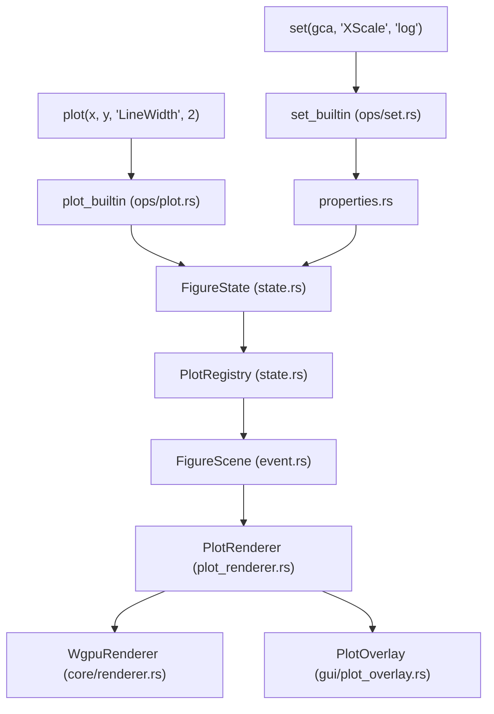

# Plotting System

<details>
<summary>Relevant source files</summary>

- [crates/runmat-plot/src/core/plot_renderer.rs](https://github.com/runmat-org/runmat/blob/82685330/crates/runmat-plot/src/core/plot_renderer.rs)
- [crates/runmat-plot/src/event.rs](https://github.com/runmat-org/runmat/blob/82685330/crates/runmat-plot/src/event.rs)
- [crates/runmat-plot/src/gui/plot_overlay.rs](https://github.com/runmat-org/runmat/blob/82685330/crates/runmat-plot/src/gui/plot_overlay.rs)
- [crates/runmat-plot/src/plots/figure.rs](https://github.com/runmat-org/runmat/blob/82685330/crates/runmat-plot/src/plots/figure.rs)
- [crates/runmat-plot/src/plots/mod.rs](https://github.com/runmat-org/runmat/blob/82685330/crates/runmat-plot/src/plots/mod.rs)
- [crates/runmat-runtime/src/builtins/plotting/core/properties.rs](https://github.com/runmat-org/runmat/blob/82685330/crates/runmat-runtime/src/builtins/plotting/core/properties.rs)
- [crates/runmat-runtime/src/builtins/plotting/core/state.rs](https://github.com/runmat-org/runmat/blob/82685330/crates/runmat-runtime/src/builtins/plotting/core/state.rs)
- [crates/runmat-runtime/src/builtins/plotting/mod.rs](https://github.com/runmat-org/runmat/blob/82685330/crates/runmat-runtime/src/builtins/plotting/mod.rs)
- [crates/runmat-runtime/src/builtins/plotting/ops/get.rs](https://github.com/runmat-org/runmat/blob/82685330/crates/runmat-runtime/src/builtins/plotting/ops/get.rs)
- [crates/runmat-runtime/src/builtins/plotting/ops/set.rs](https://github.com/runmat-org/runmat/blob/82685330/crates/runmat-runtime/src/builtins/plotting/ops/set.rs)

</details>

The RunMat plotting system provides a high-performance, GPU-accelerated visualization layer compatible with MATLAB's graphics engine. It supports over 30 plot types, ranging from basic 2D line plots to complex 3D surfaces and contours. The system is split between a state management layer in `runmat-runtime` and a hardware-accelerated rendering pipeline in `runmat-plot`.

### System Architecture

The plotting architecture bridges the gap between high-level MATLAB commands (like `plot`, `surf`, `set`) and low-level GPU primitives.



<details>
<summary>Rendered SVG</summary>

```svg
<svg id="mermaid-rhf58g2yyi8" xmlns="http://www.w3.org/2000/svg" xmlns:xlink="http://www.w3.org/1999/xlink" class="flowchart" style="max-width: 100%; touch-action: none; user-select: none; cursor: grab; min-height: fit-content; max-height: 100%;" viewBox="-75.5306923871857 0 807.0613847743714 1164" role="graphics-document document" aria-roledescription="flowchart-v2" preserveAspectRatio="xMidYMid meet"><style>#mermaid-rhf58g2yyi8{font-family:ui-sans-serif,-apple-system,system-ui,Segoe UI,Helvetica;font-size:16px;fill:#ccc;}@keyframes edge-animation-frame{from{stroke-dashoffset:0;}}@keyframes dash{to{stroke-dashoffset:0;}}#mermaid-rhf58g2yyi8 .edge-animation-slow{stroke-dasharray:9,5!important;stroke-dashoffset:900;animation:dash 50s linear infinite;stroke-linecap:round;}#mermaid-rhf58g2yyi8 .edge-animation-fast{stroke-dasharray:9,5!important;stroke-dashoffset:900;animation:dash 20s linear infinite;stroke-linecap:round;}#mermaid-rhf58g2yyi8 .error-icon{fill:#333;}#mermaid-rhf58g2yyi8 .error-text{fill:#cccccc;stroke:#cccccc;}#mermaid-rhf58g2yyi8 .edge-thickness-normal{stroke-width:1px;}#mermaid-rhf58g2yyi8 .edge-thickness-thick{stroke-width:3.5px;}#mermaid-rhf58g2yyi8 .edge-pattern-solid{stroke-dasharray:0;}#mermaid-rhf58g2yyi8 .edge-thickness-invisible{stroke-width:0;fill:none;}#mermaid-rhf58g2yyi8 .edge-pattern-dashed{stroke-dasharray:3;}#mermaid-rhf58g2yyi8 .edge-pattern-dotted{stroke-dasharray:2;}#mermaid-rhf58g2yyi8 .marker{fill:#666;stroke:#666;}#mermaid-rhf58g2yyi8 .marker.cross{stroke:#666;}#mermaid-rhf58g2yyi8 svg{font-family:ui-sans-serif,-apple-system,system-ui,Segoe UI,Helvetica;font-size:16px;}#mermaid-rhf58g2yyi8 p{margin:0;}#mermaid-rhf58g2yyi8 .label{font-family:ui-sans-serif,-apple-system,system-ui,Segoe UI,Helvetica;color:#fff;}#mermaid-rhf58g2yyi8 .cluster-label text{fill:#fff;}#mermaid-rhf58g2yyi8 .cluster-label span{color:#fff;}#mermaid-rhf58g2yyi8 .cluster-label span p{background-color:transparent;}#mermaid-rhf58g2yyi8 .label text,#mermaid-rhf58g2yyi8 span{fill:#fff;color:#fff;}#mermaid-rhf58g2yyi8 .node rect,#mermaid-rhf58g2yyi8 .node circle,#mermaid-rhf58g2yyi8 .node ellipse,#mermaid-rhf58g2yyi8 .node polygon,#mermaid-rhf58g2yyi8 .node path{fill:#111;stroke:#222;stroke-width:1px;}#mermaid-rhf58g2yyi8 .rough-node .label text,#mermaid-rhf58g2yyi8 .node .label text,#mermaid-rhf58g2yyi8 .image-shape .label,#mermaid-rhf58g2yyi8 .icon-shape .label{text-anchor:middle;}#mermaid-rhf58g2yyi8 .node .katex path{fill:#000;stroke:#000;stroke-width:1px;}#mermaid-rhf58g2yyi8 .rough-node .label,#mermaid-rhf58g2yyi8 .node .label,#mermaid-rhf58g2yyi8 .image-shape .label,#mermaid-rhf58g2yyi8 .icon-shape .label{text-align:center;}#mermaid-rhf58g2yyi8 .node.clickable{cursor:pointer;}#mermaid-rhf58g2yyi8 .root .anchor path{fill:#666!important;stroke-width:0;stroke:#666;}#mermaid-rhf58g2yyi8 .arrowheadPath{fill:#0b0b0b;}#mermaid-rhf58g2yyi8 .edgePath .path{stroke:#666;stroke-width:1px;}#mermaid-rhf58g2yyi8 .flowchart-link{stroke:#666;fill:none;}#mermaid-rhf58g2yyi8 .edgeLabel{background-color:#161616;text-align:center;}#mermaid-rhf58g2yyi8 .edgeLabel p{background-color:#161616;}#mermaid-rhf58g2yyi8 .edgeLabel rect{opacity:0.5;background-color:#161616;fill:#161616;}#mermaid-rhf58g2yyi8 .labelBkg{background-color:rgba(22, 22, 22, 0.5);}#mermaid-rhf58g2yyi8 .cluster rect{fill:#161616;stroke:#222;stroke-width:1px;}#mermaid-rhf58g2yyi8 .cluster text{fill:#fff;}#mermaid-rhf58g2yyi8 .cluster span{color:#fff;}#mermaid-rhf58g2yyi8 div.mermaidTooltip{position:absolute;text-align:center;max-width:200px;padding:2px;font-family:ui-sans-serif,-apple-system,system-ui,Segoe UI,Helvetica;font-size:12px;background:#333;border:1px solid hsl(0, 0%, 10%);border-radius:2px;pointer-events:none;z-index:100;}#mermaid-rhf58g2yyi8 .flowchartTitleText{text-anchor:middle;font-size:18px;fill:#ccc;}#mermaid-rhf58g2yyi8 rect.text{fill:none;stroke-width:0;}#mermaid-rhf58g2yyi8 .icon-shape,#mermaid-rhf58g2yyi8 .image-shape{background-color:#161616;text-align:center;}#mermaid-rhf58g2yyi8 .icon-shape p,#mermaid-rhf58g2yyi8 .image-shape p{background-color:#161616;padding:2px;}#mermaid-rhf58g2yyi8 .icon-shape .label rect,#mermaid-rhf58g2yyi8 .image-shape .label rect{opacity:0.5;background-color:#161616;fill:#161616;}#mermaid-rhf58g2yyi8 .label-icon{display:inline-block;height:1em;overflow:visible;vertical-align:-0.125em;}#mermaid-rhf58g2yyi8 .node .label-icon path{fill:currentColor;stroke:revert;stroke-width:revert;}#mermaid-rhf58g2yyi8 .node .neo-node{stroke:#222;}#mermaid-rhf58g2yyi8 [data-look="neo"].node rect,#mermaid-rhf58g2yyi8 [data-look="neo"].cluster rect,#mermaid-rhf58g2yyi8 [data-look="neo"].node polygon{stroke:url(#mermaid-rhf58g2yyi8-gradient);filter:drop-shadow( 1px 2px 2px rgba(185,185,185,1));}#mermaid-rhf58g2yyi8 [data-look="neo"].node path{stroke:url(#mermaid-rhf58g2yyi8-gradient);stroke-width:1px;}#mermaid-rhf58g2yyi8 [data-look="neo"].node .outer-path{filter:drop-shadow( 1px 2px 2px rgba(185,185,185,1));}#mermaid-rhf58g2yyi8 [data-look="neo"].node .neo-line path{stroke:#222;filter:none;}#mermaid-rhf58g2yyi8 [data-look="neo"].node circle{stroke:url(#mermaid-rhf58g2yyi8-gradient);filter:drop-shadow( 1px 2px 2px rgba(185,185,185,1));}#mermaid-rhf58g2yyi8 [data-look="neo"].node circle .state-start{fill:#000000;}#mermaid-rhf58g2yyi8 [data-look="neo"].icon-shape .icon{fill:url(#mermaid-rhf58g2yyi8-gradient);filter:drop-shadow( 1px 2px 2px rgba(185,185,185,1));}#mermaid-rhf58g2yyi8 [data-look="neo"].icon-shape .icon-neo path{stroke:url(#mermaid-rhf58g2yyi8-gradient);filter:drop-shadow( 1px 2px 2px rgba(185,185,185,1));}#mermaid-rhf58g2yyi8 :root{--mermaid-font-family:"trebuchet ms",verdana,arial,sans-serif;}</style><g><marker id="mermaid-rhf58g2yyi8_flowchart-v2-pointEnd" class="marker flowchart-v2" viewBox="0 0 10 10" refX="5" refY="5" markerUnits="userSpaceOnUse" markerWidth="8" markerHeight="8" orient="auto"><path d="M 0 0 L 10 5 L 0 10 z" class="arrowMarkerPath" style="stroke-width: 1; stroke-dasharray: 1, 0;"></path></marker><marker id="mermaid-rhf58g2yyi8_flowchart-v2-pointStart" class="marker flowchart-v2" viewBox="0 0 10 10" refX="4.5" refY="5" markerUnits="userSpaceOnUse" markerWidth="8" markerHeight="8" orient="auto"><path d="M 0 5 L 10 10 L 10 0 z" class="arrowMarkerPath" style="stroke-width: 1; stroke-dasharray: 1, 0;"></path></marker><marker id="mermaid-rhf58g2yyi8_flowchart-v2-pointEnd-margin" class="marker flowchart-v2" viewBox="0 0 11.5 14" refX="11.5" refY="7" markerUnits="userSpaceOnUse" markerWidth="10.5" markerHeight="14" orient="auto"><path d="M 0 0 L 11.5 7 L 0 14 z" class="arrowMarkerPath" style="stroke-width: 0; stroke-dasharray: 1, 0;"></path></marker><marker id="mermaid-rhf58g2yyi8_flowchart-v2-pointStart-margin" class="marker flowchart-v2" viewBox="0 0 11.5 14" refX="1" refY="7" markerUnits="userSpaceOnUse" markerWidth="11.5" markerHeight="14" orient="auto"><polygon points="0,7 11.5,14 11.5,0" class="arrowMarkerPath" style="stroke-width: 0; stroke-dasharray: 1, 0;"></polygon></marker><marker id="mermaid-rhf58g2yyi8_flowchart-v2-circleEnd" class="marker flowchart-v2" viewBox="0 0 10 10" refX="11" refY="5" markerUnits="userSpaceOnUse" markerWidth="11" markerHeight="11" orient="auto"><circle cx="5" cy="5" r="5" class="arrowMarkerPath" style="stroke-width: 1; stroke-dasharray: 1, 0;"></circle></marker><marker id="mermaid-rhf58g2yyi8_flowchart-v2-circleStart" class="marker flowchart-v2" viewBox="0 0 10 10" refX="-1" refY="5" markerUnits="userSpaceOnUse" markerWidth="11" markerHeight="11" orient="auto"><circle cx="5" cy="5" r="5" class="arrowMarkerPath" style="stroke-width: 1; stroke-dasharray: 1, 0;"></circle></marker><marker id="mermaid-rhf58g2yyi8_flowchart-v2-circleEnd-margin" class="marker flowchart-v2" viewBox="0 0 10 10" refY="5" refX="12.25" markerUnits="userSpaceOnUse" markerWidth="14" markerHeight="14" orient="auto"><circle cx="5" cy="5" r="5" class="arrowMarkerPath" style="stroke-width: 0; stroke-dasharray: 1, 0;"></circle></marker><marker id="mermaid-rhf58g2yyi8_flowchart-v2-circleStart-margin" class="marker flowchart-v2" viewBox="0 0 10 10" refX="-2" refY="5" markerUnits="userSpaceOnUse" markerWidth="14" markerHeight="14" orient="auto"><circle cx="5" cy="5" r="5" class="arrowMarkerPath" style="stroke-width: 0; stroke-dasharray: 1, 0;"></circle></marker><marker id="mermaid-rhf58g2yyi8_flowchart-v2-crossEnd" class="marker cross flowchart-v2" viewBox="0 0 11 11" refX="12" refY="5.2" markerUnits="userSpaceOnUse" markerWidth="11" markerHeight="11" orient="auto"><path d="M 1,1 l 9,9 M 10,1 l -9,9" class="arrowMarkerPath" style="stroke-width: 2; stroke-dasharray: 1, 0;"></path></marker><marker id="mermaid-rhf58g2yyi8_flowchart-v2-crossStart" class="marker cross flowchart-v2" viewBox="0 0 11 11" refX="-1" refY="5.2" markerUnits="userSpaceOnUse" markerWidth="11" markerHeight="11" orient="auto"><path d="M 1,1 l 9,9 M 10,1 l -9,9" class="arrowMarkerPath" style="stroke-width: 2; stroke-dasharray: 1, 0;"></path></marker><marker id="mermaid-rhf58g2yyi8_flowchart-v2-crossEnd-margin" class="marker cross flowchart-v2" viewBox="0 0 15 15" refX="17.7" refY="7.5" markerUnits="userSpaceOnUse" markerWidth="12" markerHeight="12" orient="auto"><path d="M 1,1 L 14,14 M 1,14 L 14,1" class="arrowMarkerPath" style="stroke-width: 2.5;"></path></marker><marker id="mermaid-rhf58g2yyi8_flowchart-v2-crossStart-margin" class="marker cross flowchart-v2" viewBox="0 0 15 15" refX="-3.5" refY="7.5" markerUnits="userSpaceOnUse" markerWidth="12" markerHeight="12" orient="auto"><path d="M 1,1 L 14,14 M 1,14 L 14,1" class="arrowMarkerPath" style="stroke-width: 2.5; stroke-dasharray: 1, 0;"></path></marker><g class="root"><g class="clusters"><g class="cluster" id="mermaid-rhf58g2yyi8-subGraph2" data-look="classic"><rect style="" x="8" y="748" width="640" height="408"></rect><g class="cluster-label" transform="translate(210.21875, 748)"><foreignObject width="235.5625" height="24"><div style="display: table-cell; white-space: nowrap; line-height: 1.5;" xmlns="http://www.w3.org/1999/xhtml"><span class="nodeLabel"><p>Code Entity Space (runmat-plot)</p></span></div></foreignObject></g></g><g class="cluster" id="mermaid-rhf58g2yyi8-subGraph1" data-look="classic"><rect style="" x="37.1171875" y="186" width="576.328125" height="488"></rect><g class="cluster-label" transform="translate(193.7109375, 186)"><foreignObject width="263.140625" height="24"><div style="display: table-cell; white-space: nowrap; line-height: 1.5;" xmlns="http://www.w3.org/1999/xhtml"><span class="nodeLabel"><p>Code Entity Space (runmat-runtime)</p></span></div></foreignObject></g></g><g class="cluster" id="mermaid-rhf58g2yyi8-subGraph0" data-look="classic"><rect style="" x="39.1171875" y="8" width="576.0625" height="104"></rect><g class="cluster-label" transform="translate(155.8671875, 8)"><foreignObject width="342.5625" height="24"><div style="display: table-cell; white-space: nowrap; line-height: 1.5;" xmlns="http://www.w3.org/1999/xhtml"><span class="nodeLabel"><p>Natural Language Space (MATLAB Commands)</p></span></div></foreignObject></g></g></g><g class="edgePaths"><path d="M188.984,87L188.984,91.167C188.984,95.333,188.984,103.667,188.984,114C188.984,124.333,188.984,136.667,188.984,149C188.984,161.333,188.984,173.667,188.984,188.5C188.984,203.333,188.984,220.667,188.984,240C188.984,259.333,188.984,280.667,188.984,296.833C188.984,313,188.984,324,188.984,329.5L188.984,335" id="mermaid-rhf58g2yyi8-L_NL_CMD_PLOT_OP_0" class="edge-thickness-normal edge-pattern-solid edge-thickness-normal edge-pattern-solid flowchart-link" style=";" data-edge="true" data-et="edge" data-id="L_NL_CMD_PLOT_OP_0" data-points="W3sieCI6MTg4Ljk4NDM3NSwieSI6ODd9LHsieCI6MTg4Ljk4NDM3NSwieSI6MTEyfSx7IngiOjE4OC45ODQzNzUsInkiOjE0OX0seyJ4IjoxODguOTg0Mzc1LCJ5IjoxODZ9LHsieCI6MTg4Ljk4NDM3NSwieSI6MjM4fSx7IngiOjE4OC45ODQzNzUsInkiOjMwMn0seyJ4IjoxODguOTg0Mzc1LCJ5IjozMzl9XQ==" data-look="classic" marker-end="url(#mermaid-rhf58g2yyi8_flowchart-v2-pointEnd)"></path><path d="M467.016,87L467.016,91.167C467.016,95.333,467.016,103.667,467.016,114C467.016,124.333,467.016,136.667,467.016,149C467.016,161.333,467.016,173.667,467.016,183.333C467.016,193,467.016,200,467.016,203.5L467.016,207" id="mermaid-rhf58g2yyi8-L_NL_PROP_SET_OP_0" class="edge-thickness-normal edge-pattern-solid edge-thickness-normal edge-pattern-solid flowchart-link" style=";" data-edge="true" data-et="edge" data-id="L_NL_PROP_SET_OP_0" data-points="W3sieCI6NDY3LjAxNTYyNSwieSI6ODd9LHsieCI6NDY3LjAxNTYyNSwieSI6MTEyfSx7IngiOjQ2Ny4wMTU2MjUsInkiOjE0OX0seyJ4Ijo0NjcuMDE1NjI1LCJ5IjoxODZ9LHsieCI6NDY3LjAxNTYyNSwieSI6MjExfV0=" data-look="classic" marker-end="url(#mermaid-rhf58g2yyi8_flowchart-v2-pointEnd)"></path><path d="M188.984,393L188.984,399.167C188.984,405.333,188.984,417.667,201.774,429.721C214.563,441.776,240.141,453.551,252.93,459.439L265.719,465.327" id="mermaid-rhf58g2yyi8-L_PLOT_OP_FIG_STATE_0" class="edge-thickness-normal edge-pattern-solid edge-thickness-normal edge-pattern-solid flowchart-link" style=";" data-edge="true" data-et="edge" data-id="L_PLOT_OP_FIG_STATE_0" data-points="W3sieCI6MTg4Ljk4NDM3NSwieSI6MzkzfSx7IngiOjE4OC45ODQzNzUsInkiOjQzMH0seyJ4IjoyNjkuMzUyNzgzMjAzMTI1LCJ5Ijo0Njd9XQ==" data-look="classic" marker-end="url(#mermaid-rhf58g2yyi8_flowchart-v2-pointEnd)"></path><path d="M467.016,265L467.016,271.167C467.016,277.333,467.016,289.667,467.016,301.333C467.016,313,467.016,324,467.016,329.5L467.016,335" id="mermaid-rhf58g2yyi8-L_SET_OP_PROP_SYS_0" class="edge-thickness-normal edge-pattern-solid edge-thickness-normal edge-pattern-solid flowchart-link" style=";" data-edge="true" data-et="edge" data-id="L_SET_OP_PROP_SYS_0" data-points="W3sieCI6NDY3LjAxNTYyNSwieSI6MjY1fSx7IngiOjQ2Ny4wMTU2MjUsInkiOjMwMn0seyJ4Ijo0NjcuMDE1NjI1LCJ5IjozMzl9XQ==" data-look="classic" marker-end="url(#mermaid-rhf58g2yyi8_flowchart-v2-pointEnd)"></path><path d="M467.016,393L467.016,399.167C467.016,405.333,467.016,417.667,454.226,429.721C441.437,441.776,415.859,453.551,403.07,459.439L390.281,465.327" id="mermaid-rhf58g2yyi8-L_PROP_SYS_FIG_STATE_0" class="edge-thickness-normal edge-pattern-solid edge-thickness-normal edge-pattern-solid flowchart-link" style=";" data-edge="true" data-et="edge" data-id="L_PROP_SYS_FIG_STATE_0" data-points="W3sieCI6NDY3LjAxNTYyNSwieSI6MzkzfSx7IngiOjQ2Ny4wMTU2MjUsInkiOjQzMH0seyJ4IjozODYuNjQ3MjE2Nzk2ODc1LCJ5Ijo0Njd9XQ==" data-look="classic" marker-end="url(#mermaid-rhf58g2yyi8_flowchart-v2-pointEnd)"></path><path d="M328,521L328,527.167C328,533.333,328,545.667,328,557.333C328,569,328,580,328,585.5L328,591" id="mermaid-rhf58g2yyi8-L_FIG_STATE_REG_0" class="edge-thickness-normal edge-pattern-solid edge-thickness-normal edge-pattern-solid flowchart-link" style=";" data-edge="true" data-et="edge" data-id="L_FIG_STATE_REG_0" data-points="W3sieCI6MzI4LCJ5Ijo1MjF9LHsieCI6MzI4LCJ5Ijo1NTh9LHsieCI6MzI4LCJ5Ijo1OTV9XQ==" data-look="classic" marker-end="url(#mermaid-rhf58g2yyi8_flowchart-v2-pointEnd)"></path><path d="M328,649L328,653.167C328,657.333,328,665.667,328,676C328,686.333,328,698.667,328,711C328,723.333,328,735.667,328,745.333C328,755,328,762,328,765.5L328,769" id="mermaid-rhf58g2yyi8-L_REG_SCENE_0" class="edge-thickness-normal edge-pattern-solid edge-thickness-normal edge-pattern-solid flowchart-link" style=";" data-edge="true" data-et="edge" data-id="L_REG_SCENE_0" data-points="W3sieCI6MzI4LCJ5Ijo2NDl9LHsieCI6MzI4LCJ5Ijo2NzR9LHsieCI6MzI4LCJ5Ijo3MTF9LHsieCI6MzI4LCJ5Ijo3NDh9LHsieCI6MzI4LCJ5Ijo3NzN9XQ==" data-look="classic" marker-end="url(#mermaid-rhf58g2yyi8_flowchart-v2-pointEnd)"></path><path d="M328,827L328,833.167C328,839.333,328,851.667,328,863.333C328,875,328,886,328,891.5L328,897" id="mermaid-rhf58g2yyi8-L_SCENE_RENDERER_0" class="edge-thickness-normal edge-pattern-solid edge-thickness-normal edge-pattern-solid flowchart-link" style=";" data-edge="true" data-et="edge" data-id="L_SCENE_RENDERER_0" data-points="W3sieCI6MzI4LCJ5Ijo4Mjd9LHsieCI6MzI4LCJ5Ijo4NjR9LHsieCI6MzI4LCJ5Ijo5MDF9XQ==" data-look="classic" marker-end="url(#mermaid-rhf58g2yyi8_flowchart-v2-pointEnd)"></path><path d="M248.461,979L235.884,985.167C223.307,991.333,198.154,1003.667,185.577,1015.333C173,1027,173,1038,173,1043.5L173,1049" id="mermaid-rhf58g2yyi8-L_RENDERER_WGPU_0" class="edge-thickness-normal edge-pattern-solid edge-thickness-normal edge-pattern-solid flowchart-link" style=";" data-edge="true" data-et="edge" data-id="L_RENDERER_WGPU_0" data-points="W3sieCI6MjQ4LjQ2MDUyNjMxNTc4OTQ4LCJ5Ijo5Nzl9LHsieCI6MTczLCJ5IjoxMDE2fSx7IngiOjE3MywieSI6MTA1M31d" data-look="classic" marker-end="url(#mermaid-rhf58g2yyi8_flowchart-v2-pointEnd)"></path><path d="M407.539,979L420.116,985.167C432.693,991.333,457.846,1003.667,470.423,1015.333C483,1027,483,1038,483,1043.5L483,1049" id="mermaid-rhf58g2yyi8-L_RENDERER_OVERLAY_0" class="edge-thickness-normal edge-pattern-solid edge-thickness-normal edge-pattern-solid flowchart-link" style=";" data-edge="true" data-et="edge" data-id="L_RENDERER_OVERLAY_0" data-points="W3sieCI6NDA3LjUzOTQ3MzY4NDIxMDUsInkiOjk3OX0seyJ4Ijo0ODMsInkiOjEwMTZ9LHsieCI6NDgzLCJ5IjoxMDUzfV0=" data-look="classic" marker-end="url(#mermaid-rhf58g2yyi8_flowchart-v2-pointEnd)"></path></g><g class="edgeLabels"><g class="edgeLabel" transform="translate(188.984375, 238)"><g class="label" data-id="L_NL_CMD_PLOT_OP_0" transform="translate(-16.34375, -12)"><foreignObject width="32.6875" height="24"><div style="display: table-cell; white-space: nowrap; line-height: 1.5; max-width: 200px; text-align: center;" xmlns="http://www.w3.org/1999/xhtml" class="labelBkg"><span class="edgeLabel"><p>calls</p></span></div></foreignObject></g></g><g class="edgeLabel" transform="translate(467.015625, 149)"><g class="label" data-id="L_NL_PROP_SET_OP_0" transform="translate(-16.34375, -12)"><foreignObject width="32.6875" height="24"><div style="display: table-cell; white-space: nowrap; line-height: 1.5; max-width: 200px; text-align: center;" xmlns="http://www.w3.org/1999/xhtml" class="labelBkg"><span class="edgeLabel"><p>calls</p></span></div></foreignObject></g></g><g class="edgeLabel" transform="translate(188.984375, 430)"><g class="label" data-id="L_PLOT_OP_FIG_STATE_0" transform="translate(-29.390625, -12)"><foreignObject width="58.78125" height="24"><div style="display: table-cell; white-space: nowrap; line-height: 1.5; max-width: 200px; text-align: center;" xmlns="http://www.w3.org/1999/xhtml" class="labelBkg"><span class="edgeLabel"><p>updates</p></span></div></foreignObject></g></g><g class="edgeLabel" transform="translate(467.015625, 302)"><g class="label" data-id="L_SET_OP_PROP_SYS_0" transform="translate(-56.578125, -12)"><foreignObject width="113.15625" height="24"><div style="display: table-cell; white-space: nowrap; line-height: 1.5; max-width: 200px; text-align: center;" xmlns="http://www.w3.org/1999/xhtml" class="labelBkg"><span class="edgeLabel"><p>resolves handle</p></span></div></foreignObject></g></g><g class="edgeLabel" transform="translate(467.015625, 430)"><g class="label" data-id="L_PROP_SYS_FIG_STATE_0" transform="translate(-29.4609375, -12)"><foreignObject width="58.921875" height="24"><div style="display: table-cell; white-space: nowrap; line-height: 1.5; max-width: 200px; text-align: center;" xmlns="http://www.w3.org/1999/xhtml" class="labelBkg"><span class="edgeLabel"><p>mutates</p></span></div></foreignObject></g></g><g class="edgeLabel" transform="translate(328, 558)"><g class="label" data-id="L_FIG_STATE_REG_0" transform="translate(-44.34375, -12)"><foreignObject width="88.6875" height="24"><div style="display: table-cell; white-space: nowrap; line-height: 1.5; max-width: 200px; text-align: center;" xmlns="http://www.w3.org/1999/xhtml" class="labelBkg"><span class="edgeLabel"><p>contained in</p></span></div></foreignObject></g></g><g class="edgeLabel" transform="translate(328, 711)"><g class="label" data-id="L_REG_SCENE_0" transform="translate(-42.9453125, -12)"><foreignObject width="85.890625" height="24"><div style="display: table-cell; white-space: nowrap; line-height: 1.5; max-width: 200px; text-align: center;" xmlns="http://www.w3.org/1999/xhtml" class="labelBkg"><span class="edgeLabel"><p>serializes to</p></span></div></foreignObject></g></g><g class="edgeLabel" transform="translate(328, 864)"><g class="label" data-id="L_SCENE_RENDERER_0" transform="translate(-21.9375, -12)"><foreignObject width="43.875" height="24"><div style="display: table-cell; white-space: nowrap; line-height: 1.5; max-width: 200px; text-align: center;" xmlns="http://www.w3.org/1999/xhtml" class="labelBkg"><span class="edgeLabel"><p>drives</p></span></div></foreignObject></g></g><g class="edgeLabel" transform="translate(173, 1016)"><g class="label" data-id="L_RENDERER_WGPU_0" transform="translate(-39.6015625, -12)"><foreignObject width="79.203125" height="24"><div style="display: table-cell; white-space: nowrap; line-height: 1.5; max-width: 200px; text-align: center;" xmlns="http://www.w3.org/1999/xhtml" class="labelBkg"><span class="edgeLabel"><p>dispatches</p></span></div></foreignObject></g></g><g class="edgeLabel" transform="translate(483, 1016)"><g class="label" data-id="L_RENDERER_OVERLAY_0" transform="translate(-42.71875, -12)"><foreignObject width="85.4375" height="24"><div style="display: table-cell; white-space: nowrap; line-height: 1.5; max-width: 200px; text-align: center;" xmlns="http://www.w3.org/1999/xhtml" class="labelBkg"><span class="edgeLabel"><p>coordinates</p></span></div></foreignObject></g></g></g><g class="nodes"><g class="node default" id="mermaid-rhf58g2yyi8-flowchart-NL_CMD-0" data-look="classic" transform="translate(188.984375, 60)"><rect class="basic label-container" style="" x="-114.8671875" y="-27" width="229.734375" height="54"></rect><g class="label" style="" transform="translate(-84.8671875, -12)"><rect></rect><foreignObject width="169.734375" height="24"><div style="display: table-cell; white-space: nowrap; line-height: 1.5; max-width: 200px; text-align: center;" xmlns="http://www.w3.org/1999/xhtml"><span class="nodeLabel"><p>plot(x, y, 'LineWidth', 2)</p></span></div></foreignObject></g></g><g class="node default" id="mermaid-rhf58g2yyi8-flowchart-NL_PROP-1" data-look="classic" transform="translate(467.015625, 60)"><rect class="basic label-container" style="" x="-113.1640625" y="-27" width="226.328125" height="54"></rect><g class="label" style="" transform="translate(-83.1640625, -12)"><rect></rect><foreignObject width="166.328125" height="24"><div style="display: table-cell; white-space: nowrap; line-height: 1.5; max-width: 200px; text-align: center;" xmlns="http://www.w3.org/1999/xhtml"><span class="nodeLabel"><p>set(gca, 'XScale', 'log')</p></span></div></foreignObject></g></g><g class="node default" id="mermaid-rhf58g2yyi8-flowchart-REG-2" data-look="classic" transform="translate(328, 622)"><rect class="basic label-container" style="" x="-108.9375" y="-27" width="217.875" height="54"></rect><g class="label" style="" transform="translate(-78.9375, -12)"><rect></rect><foreignObject width="157.875" height="24"><div style="display: table-cell; white-space: nowrap; line-height: 1.5; max-width: 200px; text-align: center;" xmlns="http://www.w3.org/1999/xhtml"><span class="nodeLabel"><p>PlotRegistry (state.rs)</p></span></div></foreignObject></g></g><g class="node default" id="mermaid-rhf58g2yyi8-flowchart-FIG_STATE-3" data-look="classic" transform="translate(328, 494)"><rect class="basic label-container" style="" x="-106.7734375" y="-27" width="213.546875" height="54"></rect><g class="label" style="" transform="translate(-76.7734375, -12)"><rect></rect><foreignObject width="153.546875" height="24"><div style="display: table-cell; white-space: nowrap; line-height: 1.5; max-width: 200px; text-align: center;" xmlns="http://www.w3.org/1999/xhtml"><span class="nodeLabel"><p>FigureState (state.rs)</p></span></div></foreignObject></g></g><g class="node default" id="mermaid-rhf58g2yyi8-flowchart-PROP_SYS-4" data-look="classic" transform="translate(467.015625, 366)"><rect class="basic label-container" style="" x="-76.2578125" y="-27" width="152.515625" height="54"></rect><g class="label" style="" transform="translate(-46.2578125, -12)"><rect></rect><foreignObject width="92.515625" height="24"><div style="display: table-cell; white-space: nowrap; line-height: 1.5; max-width: 200px; text-align: center;" xmlns="http://www.w3.org/1999/xhtml"><span class="nodeLabel"><p>properties.rs</p></span></div></foreignObject></g></g><g class="node default" id="mermaid-rhf58g2yyi8-flowchart-PLOT_OP-6" data-look="classic" transform="translate(188.984375, 366)"><rect class="basic label-container" style="" x="-116.8671875" y="-27" width="233.734375" height="54"></rect><g class="label" style="" transform="translate(-86.8671875, -12)"><rect></rect><foreignObject width="173.734375" height="24"><div style="display: table-cell; white-space: nowrap; line-height: 1.5; max-width: 200px; text-align: center;" xmlns="http://www.w3.org/1999/xhtml"><span class="nodeLabel"><p>plot_builtin (ops/plot.rs)</p></span></div></foreignObject></g></g><g class="node default" id="mermaid-rhf58g2yyi8-flowchart-SET_OP-8" data-look="classic" transform="translate(467.015625, 238)"><rect class="basic label-container" style="" x="-111.4296875" y="-27" width="222.859375" height="54"></rect><g class="label" style="" transform="translate(-81.4296875, -12)"><rect></rect><foreignObject width="162.859375" height="24"><div style="display: table-cell; white-space: nowrap; line-height: 1.5; max-width: 200px; text-align: center;" xmlns="http://www.w3.org/1999/xhtml"><span class="nodeLabel"><p>set_builtin (ops/set.rs)</p></span></div></foreignObject></g></g><g class="node default" id="mermaid-rhf58g2yyi8-flowchart-RENDERER-17" data-look="classic" transform="translate(328, 940)"><rect class="basic label-container" style="" x="-130" y="-39" width="260" height="78"></rect><g class="label" style="" transform="translate(-100, -24)"><rect></rect><foreignObject width="200" height="48"><div style="display: table; white-space: break-spaces; line-height: 1.5; max-width: 200px; text-align: center; width: 200px;" xmlns="http://www.w3.org/1999/xhtml"><span class="nodeLabel"><p>PlotRenderer (plot_renderer.rs)</p></span></div></foreignObject></g></g><g class="node default" id="mermaid-rhf58g2yyi8-flowchart-WGPU-18" data-look="classic" transform="translate(173, 1092)"><rect class="basic label-container" style="" x="-130" y="-39" width="260" height="78"></rect><g class="label" style="" transform="translate(-100, -24)"><rect></rect><foreignObject width="200" height="48"><div style="display: table; white-space: break-spaces; line-height: 1.5; max-width: 200px; text-align: center; width: 200px;" xmlns="http://www.w3.org/1999/xhtml"><span class="nodeLabel"><p>WgpuRenderer (core/renderer.rs)</p></span></div></foreignObject></g></g><g class="node default" id="mermaid-rhf58g2yyi8-flowchart-OVERLAY-19" data-look="classic" transform="translate(483, 1092)"><rect class="basic label-container" style="" x="-130" y="-39" width="260" height="78"></rect><g class="label" style="" transform="translate(-100, -24)"><rect></rect><foreignObject width="200" height="48"><div style="display: table; white-space: break-spaces; line-height: 1.5; max-width: 200px; text-align: center; width: 200px;" xmlns="http://www.w3.org/1999/xhtml"><span class="nodeLabel"><p>PlotOverlay (gui/plot_overlay.rs)</p></span></div></foreignObject></g></g><g class="node default" id="mermaid-rhf58g2yyi8-flowchart-SCENE-21" data-look="classic" transform="translate(328, 800)"><rect class="basic label-container" style="" x="-112.171875" y="-27" width="224.34375" height="54"></rect><g class="label" style="" transform="translate(-82.171875, -12)"><rect></rect><foreignObject width="164.34375" height="24"><div style="display: table-cell; white-space: nowrap; line-height: 1.5; max-width: 200px; text-align: center;" xmlns="http://www.w3.org/1999/xhtml"><span class="nodeLabel"><p>FigureScene (event.rs)</p></span></div></foreignObject></g></g></g></g></g><defs><filter id="mermaid-rhf58g2yyi8-drop-shadow" height="130%" width="130%"><feDropShadow dx="4" dy="4" stdDeviation="0" flood-opacity="0.06" flood-color="#000000"></feDropShadow></filter></defs><defs><filter id="mermaid-rhf58g2yyi8-drop-shadow-small" height="150%" width="150%"><feDropShadow dx="2" dy="2" stdDeviation="0" flood-opacity="0.06" flood-color="#000000"></feDropShadow></filter></defs><linearGradient id="mermaid-rhf58g2yyi8-gradient" gradientUnits="objectBoundingBox" x1="0%" y1="0%" x2="100%" y2="0%"><stop offset="0%" stop-color="#333" stop-opacity="1"></stop><stop offset="100%" stop-color="hsl(-120, 0%, 3.3333333333%)" stop-opacity="1"></stop></linearGradient></svg>
```

</details>

Sources: [crates/runmat-runtime/src/builtins/plotting/core/state.rs #229-235](https://github.com/runmat-org/runmat/blob/82685330/crates/runmat-runtime/src/builtins/plotting/core/state.rs#L229-L235) [crates/runmat-runtime/src/builtins/plotting/core/properties.rs #21-28](https://github.com/runmat-org/runmat/blob/82685330/crates/runmat-runtime/src/builtins/plotting/core/properties.rs#L21-L28) [crates/runmat-plot/src/core/plot_renderer.rs #30-85](https://github.com/runmat-org/runmat/blob/82685330/crates/runmat-plot/src/core/plot_renderer.rs#L30-L85) [crates/runmat-plot/src/event.rs #44-49](https://github.com/runmat-org/runmat/blob/82685330/crates/runmat-plot/src/event.rs#L44-L49)

### Figure State & Property System

The `PlotRegistry` acts as the central authority for all graphics handles. It manages a collection of `FigureState` objects, which track the hierarchy of `Figure` -> `Axes` -> `PlotElement`.

- Handle Resolution: Graphics handles are encoded as `f64` values in MATLAB space and resolved to internal pointers or indices via `resolve_plot_handle` [crates/runmat-runtime/src/builtins/plotting/core/properties.rs #30-60](https://github.com/runmat-org/runmat/blob/82685330/crates/runmat-runtime/src/builtins/plotting/core/properties.rs#L30-L60)
- Property Management: The `get` and `set` builtins interface with a specialized property system that handles MATLAB-style case-insensitive property names and automatic type conversion (e.g., converting 'red' or [1 0 0] to a `Vec4`) [crates/runmat-runtime/src/builtins/plotting/core/properties.rs #82-161](https://github.com/runmat-org/runmat/blob/82685330/crates/runmat-runtime/src/builtins/plotting/core/properties.rs#L82-L161)
- Styling Cycles: To match MATLAB behavior, the system maintains `LineStyleCycle` and `LineColorCycle` per axes, ensuring that consecutive `plot` calls automatically vary in color and style [crates/runmat-runtime/src/builtins/plotting/core/state.rs #56-110](https://github.com/runmat-org/runmat/blob/82685330/crates/runmat-runtime/src/builtins/plotting/core/state.rs#L56-L110)

For details, see [Figure State & Property System](https://app.devin.ai/org/runmat-org/wiki/runmat-org/runmat?branch=dev#8.1).

### GPU Rendering Pipeline

Rendering is performed using `wgpu`, providing cross-platform hardware acceleration for both desktop (Vulkan/Metal/DX12) and Web (WebGPU).

- PlotRenderer: The primary entry point for rendering. It transforms the high-level `Figure` definition into a `Scene` composed of `RenderData` (vertices and indices) [crates/runmat-plot/src/core/plot_renderer.rs #30-85](https://github.com/runmat-org/runmat/blob/82685330/crates/runmat-plot/src/core/plot_renderer.rs#L30-L85)
- egui Overlay: While the plot data (lines, surfaces) is rendered via specialized shaders, the axes, labels, ticks, and toolbars are managed by an `egui` overlay for crisp text rendering and interactive controls [crates/runmat-plot/src/gui/plot_overlay.rs #13-38](https://github.com/runmat-org/runmat/blob/82685330/crates/runmat-plot/src/gui/plot_overlay.rs#L13-L38)
- Viewport Dependence: Certain geometry, such as thick 2D lines, is generated on the CPU to be viewport-dependent, ensuring consistent pixel width regardless of zoom level [crates/runmat-plot/src/core/plot_renderer.rs #158-176](https://github.com/runmat-org/runmat/blob/82685330/crates/runmat-plot/src/core/plot_renderer.rs#L158-L176)

For details, see [GPU Rendering Pipeline](https://app.devin.ai/org/runmat-org/wiki/runmat-org/runmat?branch=dev#8.2).

### Supported Plot Types

The system supports a wide array of visualization types, defined as `PlotElement` variants [crates/runmat-plot/src/plots/figure.rs #163-180](https://github.com/runmat-org/runmat/blob/82685330/crates/runmat-plot/src/plots/figure.rs#L163-L180)

| Category | Supported Types |
| --- | --- |
| 2D Basic | plot, scatter, bar, area, stairs, stem |
| 3D Basic | plot3, scatter3, fill3 |
| Surfaces | surf, mesh, surfc, meshc, imagesc, heatmap |
| Specialized | contour, contourf, quiver, pie, errorbar |
| Annotations | title, xlabel, ylabel, zlabel, sgtitle, legend, text |

Sources: [crates/runmat-runtime/src/builtins/plotting/mod.rs #27-148](https://github.com/runmat-org/runmat/blob/82685330/crates/runmat-runtime/src/builtins/plotting/mod.rs#L27-L148) [crates/runmat-plot/src/plots/mod.rs #25-44](https://github.com/runmat-org/runmat/blob/82685330/crates/runmat-plot/src/plots/mod.rs#L25-L44)

### Data Flow: From Command to Screen

The following diagram illustrates the lifecycle of a `plot(x, y)` call.

wgpu (GPU)PlotRendererPlotRegistryFigureStateplot_builtinVM / Interpreterwgpu (GPU)PlotRendererPlotRegistryFigureStateplot_builtinVM / InterpreterTriggered by drawnow or event loopexecute(x | y)get_active_axes()next_color_and_style()Color, Styleadd_plot_element(LinePlot)increment_revision()set_figure(Figure)build_scene()update_buffers(VertexData)draw_call()

Sources: [crates/runmat-runtime/src/builtins/plotting/ops/plot.rs #93-105](https://github.com/runmat-org/runmat/blob/82685330/crates/runmat-runtime/src/builtins/plotting/ops/plot.rs#L93-L105) [crates/runmat-runtime/src/builtins/plotting/core/state.rs #113-160](https://github.com/runmat-org/runmat/blob/82685330/crates/runmat-runtime/src/builtins/plotting/core/state.rs#L113-L160) [crates/runmat-plot/src/core/plot_renderer.rs #178-205](https://github.com/runmat-org/runmat/blob/82685330/crates/runmat-plot/src/core/plot_renderer.rs#L178-L205)
