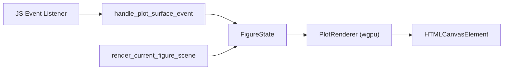

# runmat-wasm: Rust WASM Layer

<details>
<summary>Relevant source files</summary>

- [bindings/ts/README.md](https://github.com/runmat-org/runmat/blob/82685330/bindings/ts/README.md?plain=1)
- [bindings/ts/src/index.spec.ts](https://github.com/runmat-org/runmat/blob/82685330/bindings/ts/src/index.spec.ts)
- [bindings/ts/src/index.ts](https://github.com/runmat-org/runmat/blob/82685330/bindings/ts/src/index.ts)
- [crates/runmat-cli/Cargo.toml](https://github.com/runmat-org/runmat/blob/82685330/crates/runmat-cli/Cargo.toml)
- [crates/runmat-cli/src/main.rs](https://github.com/runmat-org/runmat/blob/82685330/crates/runmat-cli/src/main.rs)
- [crates/runmat-core/Cargo.toml](https://github.com/runmat-org/runmat/blob/82685330/crates/runmat-core/Cargo.toml)
- [crates/runmat-core/src/lib.rs](https://github.com/runmat-org/runmat/blob/82685330/crates/runmat-core/src/lib.rs)
- [crates/runmat-lsp/Cargo.toml](https://github.com/runmat-org/runmat/blob/82685330/crates/runmat-lsp/Cargo.toml)
- [crates/runmat-runtime/src/builtins/plotting/core/web.rs](https://github.com/runmat-org/runmat/blob/82685330/crates/runmat-runtime/src/builtins/plotting/core/web.rs)
- [crates/runmat-wasm/Cargo.toml](https://github.com/runmat-org/runmat/blob/82685330/crates/runmat-wasm/Cargo.toml)
- [crates/runmat-wasm/src/api/session.rs](https://github.com/runmat-org/runmat/blob/82685330/crates/runmat-wasm/src/api/session.rs)
- [crates/runmat-wasm/src/lib.rs](https://github.com/runmat-org/runmat/blob/82685330/crates/runmat-wasm/src/lib.rs)
- [crates/runmat-wasm/src/wire/payloads.rs](https://github.com/runmat-org/runmat/blob/82685330/crates/runmat-wasm/src/wire/payloads.rs)
- [crates/runmat-wasm/src/wire/value.rs](https://github.com/runmat-org/runmat/blob/82685330/crates/runmat-wasm/src/wire/value.rs)
- [crates/runmat-wasm/tests/gradient_gpu.rs](https://github.com/runmat-org/runmat/blob/82685330/crates/runmat-wasm/tests/gradient_gpu.rs)
- [crates/runmat-wasm/tests/support/symptom_regressions_shared.rs](https://github.com/runmat-org/runmat/blob/82685330/crates/runmat-wasm/tests/support/symptom_regressions_shared.rs)
- [crates/runmat-wasm/tests/symptom_browser_regressions.rs](https://github.com/runmat-org/runmat/blob/82685330/crates/runmat-wasm/tests/symptom_browser_regressions.rs)
- [crates/runmat-wasm/tests/symptom_node_regressions.rs](https://github.com/runmat-org/runmat/blob/82685330/crates/runmat-wasm/tests/symptom_node_regressions.rs)
- [docs-tmp/SYMPTOM_VALIDATION_CLOSURE.md](https://github.com/runmat-org/runmat/blob/82685330/docs-tmp/SYMPTOM_VALIDATION_CLOSURE.md?plain=1)
- [docs/wasm/TESTING.md](https://github.com/runmat-org/runmat/blob/82685330/docs/wasm/TESTING.md?plain=1)
- [scripts/resolve-chromedriver.sh](https://github.com/runmat-org/runmat/blob/82685330/scripts/resolve-chromedriver.sh)
- [scripts/test-wasm-headless.sh](https://github.com/runmat-org/runmat/blob/82685330/scripts/test-wasm-headless.sh)
- [scripts/test-wasm-regression-suite.sh](https://github.com/runmat-org/runmat/blob/82685330/scripts/test-wasm-regression-suite.sh)
- [scripts/test-wasm-replay-smoke.sh](https://github.com/runmat-org/runmat/blob/82685330/scripts/test-wasm-replay-smoke.sh)
- [scripts/test-wasm-symptom-closure.sh](https://github.com/runmat-org/runmat/blob/82685330/scripts/test-wasm-symptom-closure.sh)

</details>

The `runmat-wasm` crate provides the official WebAssembly (WASM) interface for the RunMat execution engine. It serves as the bridge between the high-performance Rust core and the JavaScript/TypeScript ecosystem, enabling RunMat to run in browsers and Node.js environments with WebGPU acceleration.

## The RunMatWasm Session Handle

The primary entry point for WASM-based execution is the `RunMatWasm` struct. It wraps a `RunMatSession` and manages the lifecycle of the execution environment, including configuration, GPU status, and telemetry.

### Key Lifecycle Methods

| Method | Description |
| --- | --- |
| execute_request_js | Asynchronously executes MATLAB source code or a file path. |
| reset_session | Clears the workspace and restores the session to its initial snapshot state. |
| set_input_handler | Registers a JS callback to handle interactive input() requests. |
| dispose | Permanently shuts down the session and releases associated resources. |

Execution Flow The `execute_request_js` function handles the conversion of JavaScript-provided `ExecuteRequestPayload` into internal Rust `ExecutionRequest` objects. It manages the `ActiveInterruptGuard` to allow for execution cancellation and wraps the result in an `ExecutionPayload` for return to JS.

Diagram: WASM Execution Bridge

```mermaid
flowchart LR
  %% Subgraph: runmat-core (Rust)
  %% Subgraph: runmat-wasm Layer
  %% Subgraph: JavaScript Context
  JS_CALL["session.executeRequest(payload)"]
  JS_RES["ExecuteResult (JSON)"]
  RMW_EXEC["RunMatWasm::execute_request_js"]
  SERDE_IN["serde_wasm_bindgen::from_value"]
  SERDE_OUT["serde_wasm_bindgen::to_value"]
  INT_GUARD["ActiveInterruptGuard"]
  RM_SESS["RunMatSession::execute_request"]
  OUTCOME["SessionExecutionResult"]
  JS_CALL --> RMW_EXEC
  RMW_EXEC --> SERDE_IN
  SERDE_IN --> INT_GUARD
  INT_GUARD --> RM_SESS
  RM_SESS --> OUTCOME
  OUTCOME --> SERDE_OUT
  SERDE_OUT --> JS_RES
```



<details>
<summary>Rendered SVG</summary>

```svg
<svg id="mermaid-yfl5yu2nd8" xmlns="http://www.w3.org/2000/svg" xmlns:xlink="http://www.w3.org/1999/xlink" class="flowchart" style="max-width: 100%; touch-action: none; user-select: none; cursor: grab; min-height: fit-content; max-height: 100%;" viewBox="-0.011420467535458556 0 1183.663465935071 948" role="graphics-document document" aria-roledescription="flowchart-v2" preserveAspectRatio="xMidYMid meet"><style>#mermaid-yfl5yu2nd8{font-family:ui-sans-serif,-apple-system,system-ui,Segoe UI,Helvetica;font-size:16px;fill:#ccc;}@keyframes edge-animation-frame{from{stroke-dashoffset:0;}}@keyframes dash{to{stroke-dashoffset:0;}}#mermaid-yfl5yu2nd8 .edge-animation-slow{stroke-dasharray:9,5!important;stroke-dashoffset:900;animation:dash 50s linear infinite;stroke-linecap:round;}#mermaid-yfl5yu2nd8 .edge-animation-fast{stroke-dasharray:9,5!important;stroke-dashoffset:900;animation:dash 20s linear infinite;stroke-linecap:round;}#mermaid-yfl5yu2nd8 .error-icon{fill:#333;}#mermaid-yfl5yu2nd8 .error-text{fill:#cccccc;stroke:#cccccc;}#mermaid-yfl5yu2nd8 .edge-thickness-normal{stroke-width:1px;}#mermaid-yfl5yu2nd8 .edge-thickness-thick{stroke-width:3.5px;}#mermaid-yfl5yu2nd8 .edge-pattern-solid{stroke-dasharray:0;}#mermaid-yfl5yu2nd8 .edge-thickness-invisible{stroke-width:0;fill:none;}#mermaid-yfl5yu2nd8 .edge-pattern-dashed{stroke-dasharray:3;}#mermaid-yfl5yu2nd8 .edge-pattern-dotted{stroke-dasharray:2;}#mermaid-yfl5yu2nd8 .marker{fill:#666;stroke:#666;}#mermaid-yfl5yu2nd8 .marker.cross{stroke:#666;}#mermaid-yfl5yu2nd8 svg{font-family:ui-sans-serif,-apple-system,system-ui,Segoe UI,Helvetica;font-size:16px;}#mermaid-yfl5yu2nd8 p{margin:0;}#mermaid-yfl5yu2nd8 .label{font-family:ui-sans-serif,-apple-system,system-ui,Segoe UI,Helvetica;color:#fff;}#mermaid-yfl5yu2nd8 .cluster-label text{fill:#fff;}#mermaid-yfl5yu2nd8 .cluster-label span{color:#fff;}#mermaid-yfl5yu2nd8 .cluster-label span p{background-color:transparent;}#mermaid-yfl5yu2nd8 .label text,#mermaid-yfl5yu2nd8 span{fill:#fff;color:#fff;}#mermaid-yfl5yu2nd8 .node rect,#mermaid-yfl5yu2nd8 .node circle,#mermaid-yfl5yu2nd8 .node ellipse,#mermaid-yfl5yu2nd8 .node polygon,#mermaid-yfl5yu2nd8 .node path{fill:#111;stroke:#222;stroke-width:1px;}#mermaid-yfl5yu2nd8 .rough-node .label text,#mermaid-yfl5yu2nd8 .node .label text,#mermaid-yfl5yu2nd8 .image-shape .label,#mermaid-yfl5yu2nd8 .icon-shape .label{text-anchor:middle;}#mermaid-yfl5yu2nd8 .node .katex path{fill:#000;stroke:#000;stroke-width:1px;}#mermaid-yfl5yu2nd8 .rough-node .label,#mermaid-yfl5yu2nd8 .node .label,#mermaid-yfl5yu2nd8 .image-shape .label,#mermaid-yfl5yu2nd8 .icon-shape .label{text-align:center;}#mermaid-yfl5yu2nd8 .node.clickable{cursor:pointer;}#mermaid-yfl5yu2nd8 .root .anchor path{fill:#666!important;stroke-width:0;stroke:#666;}#mermaid-yfl5yu2nd8 .arrowheadPath{fill:#0b0b0b;}#mermaid-yfl5yu2nd8 .edgePath .path{stroke:#666;stroke-width:1px;}#mermaid-yfl5yu2nd8 .flowchart-link{stroke:#666;fill:none;}#mermaid-yfl5yu2nd8 .edgeLabel{background-color:#161616;text-align:center;}#mermaid-yfl5yu2nd8 .edgeLabel p{background-color:#161616;}#mermaid-yfl5yu2nd8 .edgeLabel rect{opacity:0.5;background-color:#161616;fill:#161616;}#mermaid-yfl5yu2nd8 .labelBkg{background-color:rgba(22, 22, 22, 0.5);}#mermaid-yfl5yu2nd8 .cluster rect{fill:#161616;stroke:#222;stroke-width:1px;}#mermaid-yfl5yu2nd8 .cluster text{fill:#fff;}#mermaid-yfl5yu2nd8 .cluster span{color:#fff;}#mermaid-yfl5yu2nd8 div.mermaidTooltip{position:absolute;text-align:center;max-width:200px;padding:2px;font-family:ui-sans-serif,-apple-system,system-ui,Segoe UI,Helvetica;font-size:12px;background:#333;border:1px solid hsl(0, 0%, 10%);border-radius:2px;pointer-events:none;z-index:100;}#mermaid-yfl5yu2nd8 .flowchartTitleText{text-anchor:middle;font-size:18px;fill:#ccc;}#mermaid-yfl5yu2nd8 rect.text{fill:none;stroke-width:0;}#mermaid-yfl5yu2nd8 .icon-shape,#mermaid-yfl5yu2nd8 .image-shape{background-color:#161616;text-align:center;}#mermaid-yfl5yu2nd8 .icon-shape p,#mermaid-yfl5yu2nd8 .image-shape p{background-color:#161616;padding:2px;}#mermaid-yfl5yu2nd8 .icon-shape .label rect,#mermaid-yfl5yu2nd8 .image-shape .label rect{opacity:0.5;background-color:#161616;fill:#161616;}#mermaid-yfl5yu2nd8 .label-icon{display:inline-block;height:1em;overflow:visible;vertical-align:-0.125em;}#mermaid-yfl5yu2nd8 .node .label-icon path{fill:currentColor;stroke:revert;stroke-width:revert;}#mermaid-yfl5yu2nd8 .node .neo-node{stroke:#222;}#mermaid-yfl5yu2nd8 [data-look="neo"].node rect,#mermaid-yfl5yu2nd8 [data-look="neo"].cluster rect,#mermaid-yfl5yu2nd8 [data-look="neo"].node polygon{stroke:url(#mermaid-yfl5yu2nd8-gradient);filter:drop-shadow( 1px 2px 2px rgba(185,185,185,1));}#mermaid-yfl5yu2nd8 [data-look="neo"].node path{stroke:url(#mermaid-yfl5yu2nd8-gradient);stroke-width:1px;}#mermaid-yfl5yu2nd8 [data-look="neo"].node .outer-path{filter:drop-shadow( 1px 2px 2px rgba(185,185,185,1));}#mermaid-yfl5yu2nd8 [data-look="neo"].node .neo-line path{stroke:#222;filter:none;}#mermaid-yfl5yu2nd8 [data-look="neo"].node circle{stroke:url(#mermaid-yfl5yu2nd8-gradient);filter:drop-shadow( 1px 2px 2px rgba(185,185,185,1));}#mermaid-yfl5yu2nd8 [data-look="neo"].node circle .state-start{fill:#000000;}#mermaid-yfl5yu2nd8 [data-look="neo"].icon-shape .icon{fill:url(#mermaid-yfl5yu2nd8-gradient);filter:drop-shadow( 1px 2px 2px rgba(185,185,185,1));}#mermaid-yfl5yu2nd8 [data-look="neo"].icon-shape .icon-neo path{stroke:url(#mermaid-yfl5yu2nd8-gradient);filter:drop-shadow( 1px 2px 2px rgba(185,185,185,1));}#mermaid-yfl5yu2nd8 :root{--mermaid-font-family:"trebuchet ms",verdana,arial,sans-serif;}</style><g><marker id="mermaid-yfl5yu2nd8_flowchart-v2-pointEnd" class="marker flowchart-v2" viewBox="0 0 10 10" refX="5" refY="5" markerUnits="userSpaceOnUse" markerWidth="8" markerHeight="8" orient="auto"><path d="M 0 0 L 10 5 L 0 10 z" class="arrowMarkerPath" style="stroke-width: 1; stroke-dasharray: 1, 0;"></path></marker><marker id="mermaid-yfl5yu2nd8_flowchart-v2-pointStart" class="marker flowchart-v2" viewBox="0 0 10 10" refX="4.5" refY="5" markerUnits="userSpaceOnUse" markerWidth="8" markerHeight="8" orient="auto"><path d="M 0 5 L 10 10 L 10 0 z" class="arrowMarkerPath" style="stroke-width: 1; stroke-dasharray: 1, 0;"></path></marker><marker id="mermaid-yfl5yu2nd8_flowchart-v2-pointEnd-margin" class="marker flowchart-v2" viewBox="0 0 11.5 14" refX="11.5" refY="7" markerUnits="userSpaceOnUse" markerWidth="10.5" markerHeight="14" orient="auto"><path d="M 0 0 L 11.5 7 L 0 14 z" class="arrowMarkerPath" style="stroke-width: 0; stroke-dasharray: 1, 0;"></path></marker><marker id="mermaid-yfl5yu2nd8_flowchart-v2-pointStart-margin" class="marker flowchart-v2" viewBox="0 0 11.5 14" refX="1" refY="7" markerUnits="userSpaceOnUse" markerWidth="11.5" markerHeight="14" orient="auto"><polygon points="0,7 11.5,14 11.5,0" class="arrowMarkerPath" style="stroke-width: 0; stroke-dasharray: 1, 0;"></polygon></marker><marker id="mermaid-yfl5yu2nd8_flowchart-v2-circleEnd" class="marker flowchart-v2" viewBox="0 0 10 10" refX="11" refY="5" markerUnits="userSpaceOnUse" markerWidth="11" markerHeight="11" orient="auto"><circle cx="5" cy="5" r="5" class="arrowMarkerPath" style="stroke-width: 1; stroke-dasharray: 1, 0;"></circle></marker><marker id="mermaid-yfl5yu2nd8_flowchart-v2-circleStart" class="marker flowchart-v2" viewBox="0 0 10 10" refX="-1" refY="5" markerUnits="userSpaceOnUse" markerWidth="11" markerHeight="11" orient="auto"><circle cx="5" cy="5" r="5" class="arrowMarkerPath" style="stroke-width: 1; stroke-dasharray: 1, 0;"></circle></marker><marker id="mermaid-yfl5yu2nd8_flowchart-v2-circleEnd-margin" class="marker flowchart-v2" viewBox="0 0 10 10" refY="5" refX="12.25" markerUnits="userSpaceOnUse" markerWidth="14" markerHeight="14" orient="auto"><circle cx="5" cy="5" r="5" class="arrowMarkerPath" style="stroke-width: 0; stroke-dasharray: 1, 0;"></circle></marker><marker id="mermaid-yfl5yu2nd8_flowchart-v2-circleStart-margin" class="marker flowchart-v2" viewBox="0 0 10 10" refX="-2" refY="5" markerUnits="userSpaceOnUse" markerWidth="14" markerHeight="14" orient="auto"><circle cx="5" cy="5" r="5" class="arrowMarkerPath" style="stroke-width: 0; stroke-dasharray: 1, 0;"></circle></marker><marker id="mermaid-yfl5yu2nd8_flowchart-v2-crossEnd" class="marker cross flowchart-v2" viewBox="0 0 11 11" refX="12" refY="5.2" markerUnits="userSpaceOnUse" markerWidth="11" markerHeight="11" orient="auto"><path d="M 1,1 l 9,9 M 10,1 l -9,9" class="arrowMarkerPath" style="stroke-width: 2; stroke-dasharray: 1, 0;"></path></marker><marker id="mermaid-yfl5yu2nd8_flowchart-v2-crossStart" class="marker cross flowchart-v2" viewBox="0 0 11 11" refX="-1" refY="5.2" markerUnits="userSpaceOnUse" markerWidth="11" markerHeight="11" orient="auto"><path d="M 1,1 l 9,9 M 10,1 l -9,9" class="arrowMarkerPath" style="stroke-width: 2; stroke-dasharray: 1, 0;"></path></marker><marker id="mermaid-yfl5yu2nd8_flowchart-v2-crossEnd-margin" class="marker cross flowchart-v2" viewBox="0 0 15 15" refX="17.7" refY="7.5" markerUnits="userSpaceOnUse" markerWidth="12" markerHeight="12" orient="auto"><path d="M 1,1 L 14,14 M 1,14 L 14,1" class="arrowMarkerPath" style="stroke-width: 2.5;"></path></marker><marker id="mermaid-yfl5yu2nd8_flowchart-v2-crossStart-margin" class="marker cross flowchart-v2" viewBox="0 0 15 15" refX="-3.5" refY="7.5" markerUnits="userSpaceOnUse" markerWidth="12" markerHeight="12" orient="auto"><path d="M 1,1 L 14,14 M 1,14 L 14,1" class="arrowMarkerPath" style="stroke-width: 2.5; stroke-dasharray: 1, 0;"></path></marker><g class="root"><g class="clusters"><g class="cluster" id="mermaid-yfl5yu2nd8-subGraph2" data-look="classic"><rect style="" x="8" y="474" width="372" height="208"></rect><g class="cluster-label" transform="translate(124.515625, 474)"><foreignObject width="138.96875" height="24"><div style="display: table-cell; white-space: nowrap; line-height: 1.5;" xmlns="http://www.w3.org/1999/xhtml"><span class="nodeLabel"><p>runmat-core (Rust)</p></span></div></foreignObject></g></g><g class="cluster" id="mermaid-yfl5yu2nd8-subGraph1" data-look="classic"><rect style="" x="400" y="137" width="381.90625" height="674"></rect><g class="cluster-label" transform="translate(518.90625, 137)"><foreignObject width="144.09375" height="24"><div style="display: table-cell; white-space: nowrap; line-height: 1.5;" xmlns="http://www.w3.org/1999/xhtml"><span class="nodeLabel"><p>runmat-wasm Layer</p></span></div></foreignObject></g></g><g class="cluster" id="mermaid-yfl5yu2nd8-subGraph0" data-look="classic"><rect style="" x="801.90625" y="8" width="373.734375" height="932"></rect><g class="cluster-label" transform="translate(920.3046875, 8)"><foreignObject width="136.9375" height="24"><div style="display: table-cell; white-space: nowrap; line-height: 1.5;" xmlns="http://www.w3.org/1999/xhtml"><span class="nodeLabel"><p>JavaScript Context</p></span></div></foreignObject></g></g></g><g class="edgePaths"><path d="M988.773,87L988.773,91.167C988.773,95.333,988.773,103.667,988.773,112C988.773,120.333,988.773,128.667,949.123,138.016C909.473,147.366,830.173,157.731,790.523,162.914L750.873,168.097" id="mermaid-yfl5yu2nd8-L_JS_CALL_RMW_EXEC_0" class="edge-thickness-normal edge-pattern-solid edge-thickness-normal edge-pattern-solid flowchart-link" style=";" data-edge="true" data-et="edge" data-id="L_JS_CALL_RMW_EXEC_0" data-points="W3sieCI6OTg4Ljc3MzQzNzUsInkiOjg3fSx7IngiOjk4OC43NzM0Mzc1LCJ5IjoxMTJ9LHsieCI6OTg4Ljc3MzQzNzUsInkiOjEzN30seyJ4Ijo3NDYuOTA2MjUsInkiOjE2OC42MTUwMTE0ODgzODM5N31d" data-look="classic" marker-end="url(#mermaid-yfl5yu2nd8_flowchart-v2-pointEnd)"></path><path d="M590.953,216L590.953,220.167C590.953,224.333,590.953,232.667,590.953,240.333C590.953,248,590.953,255,590.953,258.5L590.953,262" id="mermaid-yfl5yu2nd8-L_RMW_EXEC_SERDE_IN_0" class="edge-thickness-normal edge-pattern-solid edge-thickness-normal edge-pattern-solid flowchart-link" style=";" data-edge="true" data-et="edge" data-id="L_RMW_EXEC_SERDE_IN_0" data-points="W3sieCI6NTkwLjk1MzEyNSwieSI6MjE2fSx7IngiOjU5MC45NTMxMjUsInkiOjI0MX0seyJ4Ijo1OTAuOTUzMTI1LCJ5IjoyNjZ9XQ==" data-look="classic" marker-end="url(#mermaid-yfl5yu2nd8_flowchart-v2-pointEnd)"></path><path d="M590.953,320L590.953,324.167C590.953,328.333,590.953,336.667,590.953,344.333C590.953,352,590.953,359,590.953,362.5L590.953,366" id="mermaid-yfl5yu2nd8-L_SERDE_IN_INT_GUARD_0" class="edge-thickness-normal edge-pattern-solid edge-thickness-normal edge-pattern-solid flowchart-link" style=";" data-edge="true" data-et="edge" data-id="L_SERDE_IN_INT_GUARD_0" data-points="W3sieCI6NTkwLjk1MzEyNSwieSI6MzIwfSx7IngiOjU5MC45NTMxMjUsInkiOjM0NX0seyJ4Ijo1OTAuOTUzMTI1LCJ5IjozNzB9XQ==" data-look="classic" marker-end="url(#mermaid-yfl5yu2nd8_flowchart-v2-pointEnd)"></path><path d="M590.953,424L590.953,428.167C590.953,432.333,590.953,440.667,590.953,449C590.953,457.333,590.953,465.667,550.622,475.117C510.291,484.567,429.628,495.133,389.297,500.416L348.966,505.7" id="mermaid-yfl5yu2nd8-L_INT_GUARD_RM_SESS_0" class="edge-thickness-normal edge-pattern-solid edge-thickness-normal edge-pattern-solid flowchart-link" style=";" data-edge="true" data-et="edge" data-id="L_INT_GUARD_RM_SESS_0" data-points="W3sieCI6NTkwLjk1MzEyNSwieSI6NDI0fSx7IngiOjU5MC45NTMxMjUsInkiOjQ0OX0seyJ4Ijo1OTAuOTUzMTI1LCJ5Ijo0NzR9LHsieCI6MzQ1LCJ5Ijo1MDYuMjE5MzI2OTA0MTUyNzV9XQ==" data-look="classic" marker-end="url(#mermaid-yfl5yu2nd8_flowchart-v2-pointEnd)"></path><path d="M194,553L194,557.167C194,561.333,194,569.667,194,577.333C194,585,194,592,194,595.5L194,599" id="mermaid-yfl5yu2nd8-L_RM_SESS_OUTCOME_0" class="edge-thickness-normal edge-pattern-solid edge-thickness-normal edge-pattern-solid flowchart-link" style=";" data-edge="true" data-et="edge" data-id="L_RM_SESS_OUTCOME_0" data-points="W3sieCI6MTk0LCJ5Ijo1NTN9LHsieCI6MTk0LCJ5Ijo1Nzh9LHsieCI6MTk0LCJ5Ijo2MDN9XQ==" data-look="classic" marker-end="url(#mermaid-yfl5yu2nd8_flowchart-v2-pointEnd)"></path><path d="M194,657L194,661.167C194,665.333,194,673.667,260.159,682C326.318,690.333,458.635,698.667,524.794,706.333C590.953,714,590.953,721,590.953,724.5L590.953,728" id="mermaid-yfl5yu2nd8-L_OUTCOME_SERDE_OUT_0" class="edge-thickness-normal edge-pattern-solid edge-thickness-normal edge-pattern-solid flowchart-link" style=";" data-edge="true" data-et="edge" data-id="L_OUTCOME_SERDE_OUT_0" data-points="W3sieCI6MTk0LCJ5Ijo2NTd9LHsieCI6MTk0LCJ5Ijo2ODJ9LHsieCI6NTkwLjk1MzEyNSwieSI6NzA3fSx7IngiOjU5MC45NTMxMjUsInkiOjczMn1d" data-look="classic" marker-end="url(#mermaid-yfl5yu2nd8_flowchart-v2-pointEnd)"></path><path d="M590.953,786L590.953,790.167C590.953,794.333,590.953,802.667,657.257,811C723.56,819.333,856.167,827.667,922.47,835.333C988.773,843,988.773,850,988.773,853.5L988.773,857" id="mermaid-yfl5yu2nd8-L_SERDE_OUT_JS_RES_0" class="edge-thickness-normal edge-pattern-solid edge-thickness-normal edge-pattern-solid flowchart-link" style=";" data-edge="true" data-et="edge" data-id="L_SERDE_OUT_JS_RES_0" data-points="W3sieCI6NTkwLjk1MzEyNSwieSI6Nzg2fSx7IngiOjU5MC45NTMxMjUsInkiOjgxMX0seyJ4Ijo5ODguNzczNDM3NSwieSI6ODM2fSx7IngiOjk4OC43NzM0Mzc1LCJ5Ijo4NjF9XQ==" data-look="classic" marker-end="url(#mermaid-yfl5yu2nd8_flowchart-v2-pointEnd)"></path></g><g class="edgeLabels"><g class="edgeLabel"><g class="label" data-id="L_JS_CALL_RMW_EXEC_0" transform="translate(0, 0)"><foreignObject width="0" height="0"><div style="display: table-cell; white-space: nowrap; line-height: 1.5; max-width: 200px; text-align: center;" xmlns="http://www.w3.org/1999/xhtml" class="labelBkg"><span class="edgeLabel"></span></div></foreignObject></g></g><g class="edgeLabel"><g class="label" data-id="L_RMW_EXEC_SERDE_IN_0" transform="translate(0, 0)"><foreignObject width="0" height="0"><div style="display: table-cell; white-space: nowrap; line-height: 1.5; max-width: 200px; text-align: center;" xmlns="http://www.w3.org/1999/xhtml" class="labelBkg"><span class="edgeLabel"></span></div></foreignObject></g></g><g class="edgeLabel"><g class="label" data-id="L_SERDE_IN_INT_GUARD_0" transform="translate(0, 0)"><foreignObject width="0" height="0"><div style="display: table-cell; white-space: nowrap; line-height: 1.5; max-width: 200px; text-align: center;" xmlns="http://www.w3.org/1999/xhtml" class="labelBkg"><span class="edgeLabel"></span></div></foreignObject></g></g><g class="edgeLabel"><g class="label" data-id="L_INT_GUARD_RM_SESS_0" transform="translate(0, 0)"><foreignObject width="0" height="0"><div style="display: table-cell; white-space: nowrap; line-height: 1.5; max-width: 200px; text-align: center;" xmlns="http://www.w3.org/1999/xhtml" class="labelBkg"><span class="edgeLabel"></span></div></foreignObject></g></g><g class="edgeLabel"><g class="label" data-id="L_RM_SESS_OUTCOME_0" transform="translate(0, 0)"><foreignObject width="0" height="0"><div style="display: table-cell; white-space: nowrap; line-height: 1.5; max-width: 200px; text-align: center;" xmlns="http://www.w3.org/1999/xhtml" class="labelBkg"><span class="edgeLabel"></span></div></foreignObject></g></g><g class="edgeLabel"><g class="label" data-id="L_OUTCOME_SERDE_OUT_0" transform="translate(0, 0)"><foreignObject width="0" height="0"><div style="display: table-cell; white-space: nowrap; line-height: 1.5; max-width: 200px; text-align: center;" xmlns="http://www.w3.org/1999/xhtml" class="labelBkg"><span class="edgeLabel"></span></div></foreignObject></g></g><g class="edgeLabel"><g class="label" data-id="L_SERDE_OUT_JS_RES_0" transform="translate(0, 0)"><foreignObject width="0" height="0"><div style="display: table-cell; white-space: nowrap; line-height: 1.5; max-width: 200px; text-align: center;" xmlns="http://www.w3.org/1999/xhtml" class="labelBkg"><span class="edgeLabel"></span></div></foreignObject></g></g></g><g class="nodes"><g class="node default" id="mermaid-yfl5yu2nd8-flowchart-JS_CALL-0" data-look="classic" transform="translate(988.7734375, 60)"><rect class="basic label-container" style="" x="-151.8671875" y="-27" width="303.734375" height="54"></rect><g class="label" style="" transform="translate(-121.8671875, -12)"><rect></rect><foreignObject width="243.734375" height="24"><div style="display: table; white-space: break-spaces; line-height: 1.5; max-width: 200px; text-align: center; width: 200px;" xmlns="http://www.w3.org/1999/xhtml"><span class="nodeLabel"><p>session.executeRequest(payload)</p></span></div></foreignObject></g></g><g class="node default" id="mermaid-yfl5yu2nd8-flowchart-JS_RES-1" data-look="classic" transform="translate(988.7734375, 888)"><rect class="basic label-container" style="" x="-110.109375" y="-27" width="220.21875" height="54"></rect><g class="label" style="" transform="translate(-80.109375, -12)"><rect></rect><foreignObject width="160.21875" height="24"><div style="display: table-cell; white-space: nowrap; line-height: 1.5; max-width: 200px; text-align: center;" xmlns="http://www.w3.org/1999/xhtml"><span class="nodeLabel"><p>ExecuteResult (JSON)</p></span></div></foreignObject></g></g><g class="node default" id="mermaid-yfl5yu2nd8-flowchart-RMW_EXEC-2" data-look="classic" transform="translate(590.953125, 189)"><rect class="basic label-container" style="" x="-155.953125" y="-27" width="311.90625" height="54"></rect><g class="label" style="" transform="translate(-125.953125, -12)"><rect></rect><foreignObject width="251.90625" height="24"><div style="display: table; white-space: break-spaces; line-height: 1.5; max-width: 200px; text-align: center; width: 200px;" xmlns="http://www.w3.org/1999/xhtml"><span class="nodeLabel"><p>RunMatWasm::execute_request_js</p></span></div></foreignObject></g></g><g class="node default" id="mermaid-yfl5yu2nd8-flowchart-SERDE_IN-3" data-look="classic" transform="translate(590.953125, 293)"><rect class="basic label-container" style="" x="-154.0546875" y="-27" width="308.109375" height="54"></rect><g class="label" style="" transform="translate(-124.0546875, -12)"><rect></rect><foreignObject width="248.109375" height="24"><div style="display: table; white-space: break-spaces; line-height: 1.5; max-width: 200px; text-align: center; width: 200px;" xmlns="http://www.w3.org/1999/xhtml"><span class="nodeLabel"><p>serde_wasm_bindgen::from_value</p></span></div></foreignObject></g></g><g class="node default" id="mermaid-yfl5yu2nd8-flowchart-SERDE_OUT-4" data-look="classic" transform="translate(590.953125, 759)"><rect class="basic label-container" style="" x="-144.1953125" y="-27" width="288.390625" height="54"></rect><g class="label" style="" transform="translate(-114.1953125, -12)"><rect></rect><foreignObject width="228.390625" height="24"><div style="display: table; white-space: break-spaces; line-height: 1.5; max-width: 200px; text-align: center; width: 200px;" xmlns="http://www.w3.org/1999/xhtml"><span class="nodeLabel"><p>serde_wasm_bindgen::to_value</p></span></div></foreignObject></g></g><g class="node default" id="mermaid-yfl5yu2nd8-flowchart-INT_GUARD-5" data-look="classic" transform="translate(590.953125, 397)"><rect class="basic label-container" style="" x="-105.9765625" y="-27" width="211.953125" height="54"></rect><g class="label" style="" transform="translate(-75.9765625, -12)"><rect></rect><foreignObject width="151.953125" height="24"><div style="display: table-cell; white-space: nowrap; line-height: 1.5; max-width: 200px; text-align: center;" xmlns="http://www.w3.org/1999/xhtml"><span class="nodeLabel"><p>ActiveInterruptGuard</p></span></div></foreignObject></g></g><g class="node default" id="mermaid-yfl5yu2nd8-flowchart-RM_SESS-6" data-look="classic" transform="translate(194, 526)"><rect class="basic label-container" style="" x="-151" y="-27" width="302" height="54"></rect><g class="label" style="" transform="translate(-121, -12)"><rect></rect><foreignObject width="242" height="24"><div style="display: table; white-space: break-spaces; line-height: 1.5; max-width: 200px; text-align: center; width: 200px;" xmlns="http://www.w3.org/1999/xhtml"><span class="nodeLabel"><p>RunMatSession::execute_request</p></span></div></foreignObject></g></g><g class="node default" id="mermaid-yfl5yu2nd8-flowchart-OUTCOME-7" data-look="classic" transform="translate(194, 630)"><rect class="basic label-container" style="" x="-116.125" y="-27" width="232.25" height="54"></rect><g class="label" style="" transform="translate(-86.125, -12)"><rect></rect><foreignObject width="172.25" height="24"><div style="display: table-cell; white-space: nowrap; line-height: 1.5; max-width: 200px; text-align: center;" xmlns="http://www.w3.org/1999/xhtml"><span class="nodeLabel"><p>SessionExecutionResult</p></span></div></foreignObject></g></g></g></g></g><defs><filter id="mermaid-yfl5yu2nd8-drop-shadow" height="130%" width="130%"><feDropShadow dx="4" dy="4" stdDeviation="0" flood-opacity="0.06" flood-color="#000000"></feDropShadow></filter></defs><defs><filter id="mermaid-yfl5yu2nd8-drop-shadow-small" height="150%" width="150%"><feDropShadow dx="2" dy="2" stdDeviation="0" flood-opacity="0.06" flood-color="#000000"></feDropShadow></filter></defs><linearGradient id="mermaid-yfl5yu2nd8-gradient" gradientUnits="objectBoundingBox" x1="0%" y1="0%" x2="100%" y2="0%"><stop offset="0%" stop-color="#333" stop-opacity="1"></stop><stop offset="100%" stop-color="hsl(-120, 0%, 3.3333333333%)" stop-opacity="1"></stop></linearGradient></svg>
```

</details>

Sources: [crates/runmat-wasm/src/api/session.rs #56-64](https://github.com/runmat-org/runmat/blob/82685330/crates/runmat-wasm/src/api/session.rs#L56-L64) [crates/runmat-wasm/src/api/session.rs #116-210](https://github.com/runmat-org/runmat/blob/82685330/crates/runmat-wasm/src/api/session.rs#L116-L210) [crates/runmat-wasm/src/api/session.rs #157-170](https://github.com/runmat-org/runmat/blob/82685330/crates/runmat-wasm/src/api/session.rs#L157-L170)

## Wire Payload Types

Communication between Rust and JavaScript uses a set of "wire" types defined in `crates/runmat-wasm/src/wire/payloads.rs`. These types are decorated with `#[derive(Serialize, Deserialize)]` to facilitate efficient conversion via `serde-wasm-bindgen`.

### ExecuteRequestPayload

Used to initiate execution. It supports two source types:

- `Text`: Inline MATLAB source code.
- `Path`: A path to be resolved by the virtual filesystem.

### ExecutionPayload

The result of an execution, containing:

- `flow`: The execution outcome (e.g., `no-value`, `error`, or a returned variable).
- `workspace`: A `WorkspacePayload` containing variable updates and metadata.
- `stdout`: An array of `StdoutEntry` objects.
- `figures_touched`: A list of figure handles modified during the run.

### WorkspacePayload

Provides a view into the session's memory. Instead of serializing large arrays directly, it provides `WorkspaceEntryPayload` objects which include:

- `class_name`: The MATLAB class (e.g., `double`, `struct`).
- `shape`: The dimensions of the array.
- `residency`: Whether the data is on the `Cpu` or `Gpu`.
- `preview`: A small subset of numeric values for UI display.

Sources: [crates/runmat-wasm/src/api/session.rs #93-113](https://github.com/runmat-org/runmat/blob/82685330/crates/runmat-wasm/src/api/session.rs#L93-L113) [crates/runmat-wasm/src/wire/payloads.rs #1-100](https://github.com/runmat-org/runmat/blob/82685330/crates/runmat-wasm/src/wire/payloads.rs#L1-L100)

## Filesystem Provider Bridge

RunMat's virtual filesystem (VFS) in WASM is powered by a bridge that delegates operations to a JavaScript object implementing the `RunMatFilesystemProvider` interface.

1. Registration: During `init_runmat`, a JS object is passed and converted into a `WasmFsProvider`.
2. Trait Implementation: The `WasmFsProvider` implements the Rust `FileSystemProvider` trait.
3. Async Interop: When the Rust VM performs I/O (e.g., `fopen`, `dir`), the bridge invokes the corresponding JS methods (`readFile`, `readDir`, etc.) and awaits the results using `wasm-bindgen-futures`.

Sources: [crates/runmat-wasm/src/api/init.rs #1-50](https://github.com/runmat-org/runmat/blob/82685330/crates/runmat-wasm/src/api/init.rs#L1-L50) [bindings/ts/src/index.ts #269-280](https://github.com/runmat-org/runmat/blob/82685330/bindings/ts/src/index.ts#L269-L280) [bindings/ts/README.md #48-67](https://github.com/runmat-org/runmat/blob/82685330/bindings/ts/README.md?plain=1#L48-L67)

## WebGPU Plot Surface Integration

The WASM layer integrates the `runmat-plot` rendering engine with the browser's `HTMLCanvasElement` or `OffscreenCanvas`.

### Surface Management

The module `api::plot` exports functions to manage the lifecycle of a GPU-backed plot surface:

- `create_plot_surface`: Initializes a `wgpu` surface from a canvas handle.
- `bind_surface_to_figure`: Links a specific MATLAB figure handle to a canvas.
- `render_current_figure_scene`: Triggers the `PlotRenderer` to draw the figure's `FigureScene` to the bound WebGPU surface.

### Event Handling

User interactions (mouse moves, clicks, scrolls) are captured in JavaScript and forwarded to Rust via `handle_plot_surface_event`. This updates the internal camera state for 3D plots or triggers callbacks for interactive elements.

Diagram: Plot Rendering Pipeline



<details>
<summary>Rendered SVG</summary>

```svg
<svg id="mermaid-hd4zm9mi5ic" xmlns="http://www.w3.org/2000/svg" xmlns:xlink="http://www.w3.org/1999/xlink" class="flowchart" style="max-width: 100%; touch-action: none; user-select: none; cursor: grab; min-height: fit-content; max-height: 100%;" viewBox="-0.057430508088373244 0 1810.4898610161767 388" role="graphics-document document" aria-roledescription="flowchart-v2" preserveAspectRatio="xMidYMid meet"><style>#mermaid-hd4zm9mi5ic{font-family:ui-sans-serif,-apple-system,system-ui,Segoe UI,Helvetica;font-size:16px;fill:#ccc;}@keyframes edge-animation-frame{from{stroke-dashoffset:0;}}@keyframes dash{to{stroke-dashoffset:0;}}#mermaid-hd4zm9mi5ic .edge-animation-slow{stroke-dasharray:9,5!important;stroke-dashoffset:900;animation:dash 50s linear infinite;stroke-linecap:round;}#mermaid-hd4zm9mi5ic .edge-animation-fast{stroke-dasharray:9,5!important;stroke-dashoffset:900;animation:dash 20s linear infinite;stroke-linecap:round;}#mermaid-hd4zm9mi5ic .error-icon{fill:#333;}#mermaid-hd4zm9mi5ic .error-text{fill:#cccccc;stroke:#cccccc;}#mermaid-hd4zm9mi5ic .edge-thickness-normal{stroke-width:1px;}#mermaid-hd4zm9mi5ic .edge-thickness-thick{stroke-width:3.5px;}#mermaid-hd4zm9mi5ic .edge-pattern-solid{stroke-dasharray:0;}#mermaid-hd4zm9mi5ic .edge-thickness-invisible{stroke-width:0;fill:none;}#mermaid-hd4zm9mi5ic .edge-pattern-dashed{stroke-dasharray:3;}#mermaid-hd4zm9mi5ic .edge-pattern-dotted{stroke-dasharray:2;}#mermaid-hd4zm9mi5ic .marker{fill:#666;stroke:#666;}#mermaid-hd4zm9mi5ic .marker.cross{stroke:#666;}#mermaid-hd4zm9mi5ic svg{font-family:ui-sans-serif,-apple-system,system-ui,Segoe UI,Helvetica;font-size:16px;}#mermaid-hd4zm9mi5ic p{margin:0;}#mermaid-hd4zm9mi5ic .label{font-family:ui-sans-serif,-apple-system,system-ui,Segoe UI,Helvetica;color:#fff;}#mermaid-hd4zm9mi5ic .cluster-label text{fill:#fff;}#mermaid-hd4zm9mi5ic .cluster-label span{color:#fff;}#mermaid-hd4zm9mi5ic .cluster-label span p{background-color:transparent;}#mermaid-hd4zm9mi5ic .label text,#mermaid-hd4zm9mi5ic span{fill:#fff;color:#fff;}#mermaid-hd4zm9mi5ic .node rect,#mermaid-hd4zm9mi5ic .node circle,#mermaid-hd4zm9mi5ic .node ellipse,#mermaid-hd4zm9mi5ic .node polygon,#mermaid-hd4zm9mi5ic .node path{fill:#111;stroke:#222;stroke-width:1px;}#mermaid-hd4zm9mi5ic .rough-node .label text,#mermaid-hd4zm9mi5ic .node .label text,#mermaid-hd4zm9mi5ic .image-shape .label,#mermaid-hd4zm9mi5ic .icon-shape .label{text-anchor:middle;}#mermaid-hd4zm9mi5ic .node .katex path{fill:#000;stroke:#000;stroke-width:1px;}#mermaid-hd4zm9mi5ic .rough-node .label,#mermaid-hd4zm9mi5ic .node .label,#mermaid-hd4zm9mi5ic .image-shape .label,#mermaid-hd4zm9mi5ic .icon-shape .label{text-align:center;}#mermaid-hd4zm9mi5ic .node.clickable{cursor:pointer;}#mermaid-hd4zm9mi5ic .root .anchor path{fill:#666!important;stroke-width:0;stroke:#666;}#mermaid-hd4zm9mi5ic .arrowheadPath{fill:#0b0b0b;}#mermaid-hd4zm9mi5ic .edgePath .path{stroke:#666;stroke-width:1px;}#mermaid-hd4zm9mi5ic .flowchart-link{stroke:#666;fill:none;}#mermaid-hd4zm9mi5ic .edgeLabel{background-color:#161616;text-align:center;}#mermaid-hd4zm9mi5ic .edgeLabel p{background-color:#161616;}#mermaid-hd4zm9mi5ic .edgeLabel rect{opacity:0.5;background-color:#161616;fill:#161616;}#mermaid-hd4zm9mi5ic .labelBkg{background-color:rgba(22, 22, 22, 0.5);}#mermaid-hd4zm9mi5ic .cluster rect{fill:#161616;stroke:#222;stroke-width:1px;}#mermaid-hd4zm9mi5ic .cluster text{fill:#fff;}#mermaid-hd4zm9mi5ic .cluster span{color:#fff;}#mermaid-hd4zm9mi5ic div.mermaidTooltip{position:absolute;text-align:center;max-width:200px;padding:2px;font-family:ui-sans-serif,-apple-system,system-ui,Segoe UI,Helvetica;font-size:12px;background:#333;border:1px solid hsl(0, 0%, 10%);border-radius:2px;pointer-events:none;z-index:100;}#mermaid-hd4zm9mi5ic .flowchartTitleText{text-anchor:middle;font-size:18px;fill:#ccc;}#mermaid-hd4zm9mi5ic rect.text{fill:none;stroke-width:0;}#mermaid-hd4zm9mi5ic .icon-shape,#mermaid-hd4zm9mi5ic .image-shape{background-color:#161616;text-align:center;}#mermaid-hd4zm9mi5ic .icon-shape p,#mermaid-hd4zm9mi5ic .image-shape p{background-color:#161616;padding:2px;}#mermaid-hd4zm9mi5ic .icon-shape .label rect,#mermaid-hd4zm9mi5ic .image-shape .label rect{opacity:0.5;background-color:#161616;fill:#161616;}#mermaid-hd4zm9mi5ic .label-icon{display:inline-block;height:1em;overflow:visible;vertical-align:-0.125em;}#mermaid-hd4zm9mi5ic .node .label-icon path{fill:currentColor;stroke:revert;stroke-width:revert;}#mermaid-hd4zm9mi5ic .node .neo-node{stroke:#222;}#mermaid-hd4zm9mi5ic [data-look="neo"].node rect,#mermaid-hd4zm9mi5ic [data-look="neo"].cluster rect,#mermaid-hd4zm9mi5ic [data-look="neo"].node polygon{stroke:url(#mermaid-hd4zm9mi5ic-gradient);filter:drop-shadow( 1px 2px 2px rgba(185,185,185,1));}#mermaid-hd4zm9mi5ic [data-look="neo"].node path{stroke:url(#mermaid-hd4zm9mi5ic-gradient);stroke-width:1px;}#mermaid-hd4zm9mi5ic [data-look="neo"].node .outer-path{filter:drop-shadow( 1px 2px 2px rgba(185,185,185,1));}#mermaid-hd4zm9mi5ic [data-look="neo"].node .neo-line path{stroke:#222;filter:none;}#mermaid-hd4zm9mi5ic [data-look="neo"].node circle{stroke:url(#mermaid-hd4zm9mi5ic-gradient);filter:drop-shadow( 1px 2px 2px rgba(185,185,185,1));}#mermaid-hd4zm9mi5ic [data-look="neo"].node circle .state-start{fill:#000000;}#mermaid-hd4zm9mi5ic [data-look="neo"].icon-shape .icon{fill:url(#mermaid-hd4zm9mi5ic-gradient);filter:drop-shadow( 1px 2px 2px rgba(185,185,185,1));}#mermaid-hd4zm9mi5ic [data-look="neo"].icon-shape .icon-neo path{stroke:url(#mermaid-hd4zm9mi5ic-gradient);filter:drop-shadow( 1px 2px 2px rgba(185,185,185,1));}#mermaid-hd4zm9mi5ic :root{--mermaid-font-family:"trebuchet ms",verdana,arial,sans-serif;}</style><g><marker id="mermaid-hd4zm9mi5ic_flowchart-v2-pointEnd" class="marker flowchart-v2" viewBox="0 0 10 10" refX="5" refY="5" markerUnits="userSpaceOnUse" markerWidth="8" markerHeight="8" orient="auto"><path d="M 0 0 L 10 5 L 0 10 z" class="arrowMarkerPath" style="stroke-width: 1; stroke-dasharray: 1, 0;"></path></marker><marker id="mermaid-hd4zm9mi5ic_flowchart-v2-pointStart" class="marker flowchart-v2" viewBox="0 0 10 10" refX="4.5" refY="5" markerUnits="userSpaceOnUse" markerWidth="8" markerHeight="8" orient="auto"><path d="M 0 5 L 10 10 L 10 0 z" class="arrowMarkerPath" style="stroke-width: 1; stroke-dasharray: 1, 0;"></path></marker><marker id="mermaid-hd4zm9mi5ic_flowchart-v2-pointEnd-margin" class="marker flowchart-v2" viewBox="0 0 11.5 14" refX="11.5" refY="7" markerUnits="userSpaceOnUse" markerWidth="10.5" markerHeight="14" orient="auto"><path d="M 0 0 L 11.5 7 L 0 14 z" class="arrowMarkerPath" style="stroke-width: 0; stroke-dasharray: 1, 0;"></path></marker><marker id="mermaid-hd4zm9mi5ic_flowchart-v2-pointStart-margin" class="marker flowchart-v2" viewBox="0 0 11.5 14" refX="1" refY="7" markerUnits="userSpaceOnUse" markerWidth="11.5" markerHeight="14" orient="auto"><polygon points="0,7 11.5,14 11.5,0" class="arrowMarkerPath" style="stroke-width: 0; stroke-dasharray: 1, 0;"></polygon></marker><marker id="mermaid-hd4zm9mi5ic_flowchart-v2-circleEnd" class="marker flowchart-v2" viewBox="0 0 10 10" refX="11" refY="5" markerUnits="userSpaceOnUse" markerWidth="11" markerHeight="11" orient="auto"><circle cx="5" cy="5" r="5" class="arrowMarkerPath" style="stroke-width: 1; stroke-dasharray: 1, 0;"></circle></marker><marker id="mermaid-hd4zm9mi5ic_flowchart-v2-circleStart" class="marker flowchart-v2" viewBox="0 0 10 10" refX="-1" refY="5" markerUnits="userSpaceOnUse" markerWidth="11" markerHeight="11" orient="auto"><circle cx="5" cy="5" r="5" class="arrowMarkerPath" style="stroke-width: 1; stroke-dasharray: 1, 0;"></circle></marker><marker id="mermaid-hd4zm9mi5ic_flowchart-v2-circleEnd-margin" class="marker flowchart-v2" viewBox="0 0 10 10" refY="5" refX="12.25" markerUnits="userSpaceOnUse" markerWidth="14" markerHeight="14" orient="auto"><circle cx="5" cy="5" r="5" class="arrowMarkerPath" style="stroke-width: 0; stroke-dasharray: 1, 0;"></circle></marker><marker id="mermaid-hd4zm9mi5ic_flowchart-v2-circleStart-margin" class="marker flowchart-v2" viewBox="0 0 10 10" refX="-2" refY="5" markerUnits="userSpaceOnUse" markerWidth="14" markerHeight="14" orient="auto"><circle cx="5" cy="5" r="5" class="arrowMarkerPath" style="stroke-width: 0; stroke-dasharray: 1, 0;"></circle></marker><marker id="mermaid-hd4zm9mi5ic_flowchart-v2-crossEnd" class="marker cross flowchart-v2" viewBox="0 0 11 11" refX="12" refY="5.2" markerUnits="userSpaceOnUse" markerWidth="11" markerHeight="11" orient="auto"><path d="M 1,1 l 9,9 M 10,1 l -9,9" class="arrowMarkerPath" style="stroke-width: 2; stroke-dasharray: 1, 0;"></path></marker><marker id="mermaid-hd4zm9mi5ic_flowchart-v2-crossStart" class="marker cross flowchart-v2" viewBox="0 0 11 11" refX="-1" refY="5.2" markerUnits="userSpaceOnUse" markerWidth="11" markerHeight="11" orient="auto"><path d="M 1,1 l 9,9 M 10,1 l -9,9" class="arrowMarkerPath" style="stroke-width: 2; stroke-dasharray: 1, 0;"></path></marker><marker id="mermaid-hd4zm9mi5ic_flowchart-v2-crossEnd-margin" class="marker cross flowchart-v2" viewBox="0 0 15 15" refX="17.7" refY="7.5" markerUnits="userSpaceOnUse" markerWidth="12" markerHeight="12" orient="auto"><path d="M 1,1 L 14,14 M 1,14 L 14,1" class="arrowMarkerPath" style="stroke-width: 2.5;"></path></marker><marker id="mermaid-hd4zm9mi5ic_flowchart-v2-crossStart-margin" class="marker cross flowchart-v2" viewBox="0 0 15 15" refX="-3.5" refY="7.5" markerUnits="userSpaceOnUse" markerWidth="12" markerHeight="12" orient="auto"><path d="M 1,1 L 14,14 M 1,14 L 14,1" class="arrowMarkerPath" style="stroke-width: 2.5; stroke-dasharray: 1, 0;"></path></marker><g class="root"><g class="clusters"><g class="cluster" id="mermaid-hd4zm9mi5ic-subGraph2" data-look="classic"><rect style="" x="878.375" y="19" width="525.171875" height="196"></rect><g class="cluster-label" transform="translate(1073.640625, 19)"><foreignObject width="134.640625" height="24"><div style="display: table-cell; white-space: nowrap; line-height: 1.5;" xmlns="http://www.w3.org/1999/xhtml"><span class="nodeLabel"><p>runmat-plot (Rust)</p></span></div></foreignObject></g></g><g class="cluster" id="mermaid-hd4zm9mi5ic-subGraph1" data-look="classic"><rect style="" x="393.65625" y="8" width="320.953125" height="228"></rect><g class="cluster-label" transform="translate(466.9609375, 8)"><foreignObject width="174.34375" height="24"><div style="display: table-cell; white-space: nowrap; line-height: 1.5;" xmlns="http://www.w3.org/1999/xhtml"><span class="nodeLabel"><p>runmat-wasm (api::plot)</p></span></div></foreignObject></g></g><g class="cluster" id="mermaid-hd4zm9mi5ic-subGraph0" data-look="classic"><rect style="" x="8" y="256" width="1794.375" height="124"></rect><g class="cluster-label" transform="translate(865.8203125, 256)"><foreignObject width="78.734375" height="24"><div style="display: table-cell; white-space: nowrap; line-height: 1.5;" xmlns="http://www.w3.org/1999/xhtml"><span class="nodeLabel"><p>Browser UI</p></span></div></foreignObject></g></g></g><g class="edgePaths"><path d="M218.422,318L233.025,318C247.628,318,276.833,318,306.039,318C335.245,318,364.451,318,402.525,281.726C440.6,245.453,487.544,172.905,511.016,136.632L534.489,100.358" id="mermaid-hd4zm9mi5ic-L_EV_LIST_HSE_0" class="edge-thickness-normal edge-pattern-solid edge-thickness-normal edge-pattern-solid flowchart-link" style=";" data-edge="true" data-et="edge" data-id="L_EV_LIST_HSE_0" data-points="W3sieCI6MjE4LjQyMTg3NSwieSI6MzE4fSx7IngiOjMwNi4wMzkwNjI1LCJ5IjozMTh9LHsieCI6MzkzLjY1NjI1LCJ5IjozMTh9LHsieCI6NTM2LjY2MTU3Mzg0MDcyNTksInkiOjk3fV0=" data-look="classic" marker-end="url(#mermaid-hd4zm9mi5ic_flowchart-v2-pointEnd)"></path><path d="M682.711,70L688.027,70C693.344,70,703.977,70,722.94,70C741.904,70,769.198,70,796.492,70C823.786,70,851.081,70,871.891,73.851C892.7,77.702,907.026,85.404,914.189,89.255L921.351,93.106" id="mermaid-hd4zm9mi5ic-L_HSE_FIG_STATE_0" class="edge-thickness-normal edge-pattern-solid edge-thickness-normal edge-pattern-solid flowchart-link" style=";" data-edge="true" data-et="edge" data-id="L_HSE_FIG_STATE_0" data-points="W3sieCI6NjgyLjcxMDkzNzUsInkiOjcwfSx7IngiOjcxNC42MDkzNzUsInkiOjcwfSx7IngiOjc5Ni40OTIxODc1LCJ5Ijo3MH0seyJ4Ijo4NzguMzc1LCJ5Ijo3MH0seyJ4Ijo5MjQuODc0Mzk5MDM4NDYxNSwieSI6OTV9XQ==" data-look="classic" marker-end="url(#mermaid-hd4zm9mi5ic_flowchart-v2-pointEnd)"></path><path d="M689.609,174L693.776,174C697.943,174,706.276,174,724.09,174C741.904,174,769.198,174,796.492,174C823.786,174,851.081,174,871.891,170.149C892.7,166.298,907.026,158.596,914.189,154.745L921.351,150.894" id="mermaid-hd4zm9mi5ic-L_RCFS_FIG_STATE_0" class="edge-thickness-normal edge-pattern-solid edge-thickness-normal edge-pattern-solid flowchart-link" style=";" data-edge="true" data-et="edge" data-id="L_RCFS_FIG_STATE_0" data-points="W3sieCI6Njg5LjYwOTM3NSwieSI6MTc0fSx7IngiOjcxNC42MDkzNzUsInkiOjE3NH0seyJ4Ijo3OTYuNDkyMTg3NSwieSI6MTc0fSx7IngiOjg3OC4zNzUsInkiOjE3NH0seyJ4Ijo5MjQuODc0Mzk5MDM4NDYxNSwieSI6MTQ5fV0=" data-look="classic" marker-end="url(#mermaid-hd4zm9mi5ic_flowchart-v2-pointEnd)"></path><path d="M1046.813,122L1056.961,122C1067.109,122,1087.406,122,1107.036,122C1126.667,122,1145.63,122,1155.112,122L1164.594,122" id="mermaid-hd4zm9mi5ic-L_FIG_STATE_WGPU_PIPE_0" class="edge-thickness-normal edge-pattern-solid edge-thickness-normal edge-pattern-solid flowchart-link" style=";" data-edge="true" data-et="edge" data-id="L_FIG_STATE_WGPU_PIPE_0" data-points="W3sieCI6MTA0Ni44MTI1LCJ5IjoxMjJ9LHsieCI6MTEwNy43MDMxMjUsInkiOjEyMn0seyJ4IjoxMTY4LjU5Mzc1LCJ5IjoxMjJ9XQ==" data-look="classic" marker-end="url(#mermaid-hd4zm9mi5ic_flowchart-v2-pointEnd)"></path><path d="M1378.547,122L1382.714,122C1386.88,122,1395.214,122,1412.607,154.667C1430,187.333,1456.453,252.667,1482.24,285.333C1508.026,318,1533.146,318,1545.706,318L1558.266,318" id="mermaid-hd4zm9mi5ic-L_WGPU_PIPE_CANVAS_0" class="edge-thickness-normal edge-pattern-solid edge-thickness-normal edge-pattern-solid flowchart-link" style=";" data-edge="true" data-et="edge" data-id="L_WGPU_PIPE_CANVAS_0" data-points="W3sieCI6MTM3OC41NDY4NzUsInkiOjEyMn0seyJ4IjoxNDAzLjU0Njg3NSwieSI6MTIyfSx7IngiOjE0ODIuOTA2MjUsInkiOjMxOH0seyJ4IjoxNTYyLjI2NTYyNSwieSI6MzE4fV0=" data-look="classic" marker-end="url(#mermaid-hd4zm9mi5ic_flowchart-v2-pointEnd)"></path></g><g class="edgeLabels"><g class="edgeLabel" transform="translate(306.0390625, 318)"><g class="label" data-id="L_EV_LIST_HSE_0" transform="translate(-62.6171875, -12)"><foreignObject width="125.234375" height="24"><div style="display: table-cell; white-space: nowrap; line-height: 1.5; max-width: 200px; text-align: center;" xmlns="http://www.w3.org/1999/xhtml" class="labelBkg"><span class="edgeLabel"><p>PlotSurfaceEvent</p></span></div></foreignObject></g></g><g class="edgeLabel" transform="translate(796.4921875, 70)"><g class="label" data-id="L_HSE_FIG_STATE_0" transform="translate(-56.8828125, -12)"><foreignObject width="113.765625" height="24"><div style="display: table-cell; white-space: nowrap; line-height: 1.5; max-width: 200px; text-align: center;" xmlns="http://www.w3.org/1999/xhtml" class="labelBkg"><span class="edgeLabel"><p>Update Camera</p></span></div></foreignObject></g></g><g class="edgeLabel" transform="translate(796.4921875, 174)"><g class="label" data-id="L_RCFS_FIG_STATE_0" transform="translate(-45.09375, -12)"><foreignObject width="90.1875" height="24"><div style="display: table-cell; white-space: nowrap; line-height: 1.5; max-width: 200px; text-align: center;" xmlns="http://www.w3.org/1999/xhtml" class="labelBkg"><span class="edgeLabel"><p>Fetch Scene</p></span></div></foreignObject></g></g><g class="edgeLabel" transform="translate(1107.703125, 122)"><g class="label" data-id="L_FIG_STATE_WGPU_PIPE_0" transform="translate(-35.890625, -12)"><foreignObject width="71.78125" height="24"><div style="display: table-cell; white-space: nowrap; line-height: 1.5; max-width: 200px; text-align: center;" xmlns="http://www.w3.org/1999/xhtml" class="labelBkg"><span class="edgeLabel"><p>Geometry</p></span></div></foreignObject></g></g><g class="edgeLabel" transform="translate(1482.90625, 318)"><g class="label" data-id="L_WGPU_PIPE_CANVAS_0" transform="translate(-54.359375, -12)"><foreignObject width="108.71875" height="24"><div style="display: table-cell; white-space: nowrap; line-height: 1.5; max-width: 200px; text-align: center;" xmlns="http://www.w3.org/1999/xhtml" class="labelBkg"><span class="edgeLabel"><p>WGSL Shaders</p></span></div></foreignObject></g></g></g><g class="nodes"><g class="node default" id="mermaid-hd4zm9mi5ic-flowchart-CANVAS-0" data-look="classic" transform="translate(1669.8203125, 318)"><rect class="basic label-container" style="" x="-107.5546875" y="-27" width="215.109375" height="54"></rect><g class="label" style="" transform="translate(-77.5546875, -12)"><rect></rect><foreignObject width="155.109375" height="24"><div style="display: table-cell; white-space: nowrap; line-height: 1.5; max-width: 200px; text-align: center;" xmlns="http://www.w3.org/1999/xhtml"><span class="nodeLabel"><p>HTMLCanvasElement</p></span></div></foreignObject></g></g><g class="node default" id="mermaid-hd4zm9mi5ic-flowchart-EV_LIST-1" data-look="classic" transform="translate(125.7109375, 318)"><rect class="basic label-container" style="" x="-92.7109375" y="-27" width="185.421875" height="54"></rect><g class="label" style="" transform="translate(-62.7109375, -12)"><rect></rect><foreignObject width="125.421875" height="24"><div style="display: table-cell; white-space: nowrap; line-height: 1.5; max-width: 200px; text-align: center;" xmlns="http://www.w3.org/1999/xhtml"><span class="nodeLabel"><p>JS Event Listener</p></span></div></foreignObject></g></g><g class="node default" id="mermaid-hd4zm9mi5ic-flowchart-HSE-2" data-look="classic" transform="translate(554.1328125, 70)"><rect class="basic label-container" style="" x="-128.578125" y="-27" width="257.15625" height="54"></rect><g class="label" style="" transform="translate(-98.578125, -12)"><rect></rect><foreignObject width="197.15625" height="24"><div style="display: table-cell; white-space: nowrap; line-height: 1.5; max-width: 200px; text-align: center;" xmlns="http://www.w3.org/1999/xhtml"><span class="nodeLabel"><p>handle_plot_surface_event</p></span></div></foreignObject></g></g><g class="node default" id="mermaid-hd4zm9mi5ic-flowchart-RCFS-3" data-look="classic" transform="translate(554.1328125, 174)"><rect class="basic label-container" style="" x="-135.4765625" y="-27" width="270.953125" height="54"></rect><g class="label" style="" transform="translate(-105.4765625, -12)"><rect></rect><foreignObject width="210.953125" height="24"><div style="display: table; white-space: break-spaces; line-height: 1.5; max-width: 200px; text-align: center; width: 200px;" xmlns="http://www.w3.org/1999/xhtml"><span class="nodeLabel"><p>render_current_figure_scene</p></span></div></foreignObject></g></g><g class="node default" id="mermaid-hd4zm9mi5ic-flowchart-FIG_STATE-4" data-look="classic" transform="translate(975.09375, 122)"><rect class="basic label-container" style="" x="-71.71875" y="-27" width="143.4375" height="54"></rect><g class="label" style="" transform="translate(-41.71875, -12)"><rect></rect><foreignObject width="83.4375" height="24"><div style="display: table-cell; white-space: nowrap; line-height: 1.5; max-width: 200px; text-align: center;" xmlns="http://www.w3.org/1999/xhtml"><span class="nodeLabel"><p>FigureState</p></span></div></foreignObject></g></g><g class="node default" id="mermaid-hd4zm9mi5ic-flowchart-WGPU_PIPE-5" data-look="classic" transform="translate(1273.5703125, 122)"><rect class="basic label-container" style="" x="-104.9765625" y="-27" width="209.953125" height="54"></rect><g class="label" style="" transform="translate(-74.9765625, -12)"><rect></rect><foreignObject width="149.953125" height="24"><div style="display: table-cell; white-space: nowrap; line-height: 1.5; max-width: 200px; text-align: center;" xmlns="http://www.w3.org/1999/xhtml"><span class="nodeLabel"><p>PlotRenderer (wgpu)</p></span></div></foreignObject></g></g></g></g></g><defs><filter id="mermaid-hd4zm9mi5ic-drop-shadow" height="130%" width="130%"><feDropShadow dx="4" dy="4" stdDeviation="0" flood-opacity="0.06" flood-color="#000000"></feDropShadow></filter></defs><defs><filter id="mermaid-hd4zm9mi5ic-drop-shadow-small" height="150%" width="150%"><feDropShadow dx="2" dy="2" stdDeviation="0" flood-opacity="0.06" flood-color="#000000"></feDropShadow></filter></defs><linearGradient id="mermaid-hd4zm9mi5ic-gradient" gradientUnits="objectBoundingBox" x1="0%" y1="0%" x2="100%" y2="0%"><stop offset="0%" stop-color="#333" stop-opacity="1"></stop><stop offset="100%" stop-color="hsl(-120, 0%, 3.3333333333%)" stop-opacity="1"></stop></linearGradient></svg>
```

</details>

Sources: [crates/runmat-wasm/src/lib.rs #9-19](https://github.com/runmat-org/runmat/blob/82685330/crates/runmat-wasm/src/lib.rs#L9-L19) [crates/runmat-wasm/src/api/session.rs #10-16](https://github.com/runmat-org/runmat/blob/82685330/crates/runmat-wasm/src/api/session.rs#L10-L16) [bindings/ts/src/index.ts #171-214](https://github.com/runmat-org/runmat/blob/82685330/bindings/ts/src/index.ts#L171-L214)

## Input Handler Mechanism

Interactive MATLAB functions like `input()` or `keyboard` require pausing the WASM execution to wait for user input. This is implemented via the `set_input_handler` mechanism.

1. Registration: The JS host calls `session.setInputHandler(callback)`.
2. Rust Suspension: When the VM hits an input instruction, it calls `js_input_request`.
3. Callback: This invokes the `JS_STDIN_HANDLER` stored in the WASM state.
4. Resumption: The Rust execution awaits the JS `Promise`, resuming only when the user provides the input string or keypress.

Sources: [crates/runmat-wasm/src/api/session.rs #38-41](https://github.com/runmat-org/runmat/blob/82685330/crates/runmat-wasm/src/api/session.rs#L38-L41) [crates/runmat-wasm/src/api/streams.rs #32-40](https://github.com/runmat-org/runmat/blob/82685330/crates/runmat-wasm/src/api/streams.rs#L32-L40) [bindings/ts/src/index.ts #269-271](https://github.com/runmat-org/runmat/blob/82685330/bindings/ts/src/index.ts#L269-L271)
