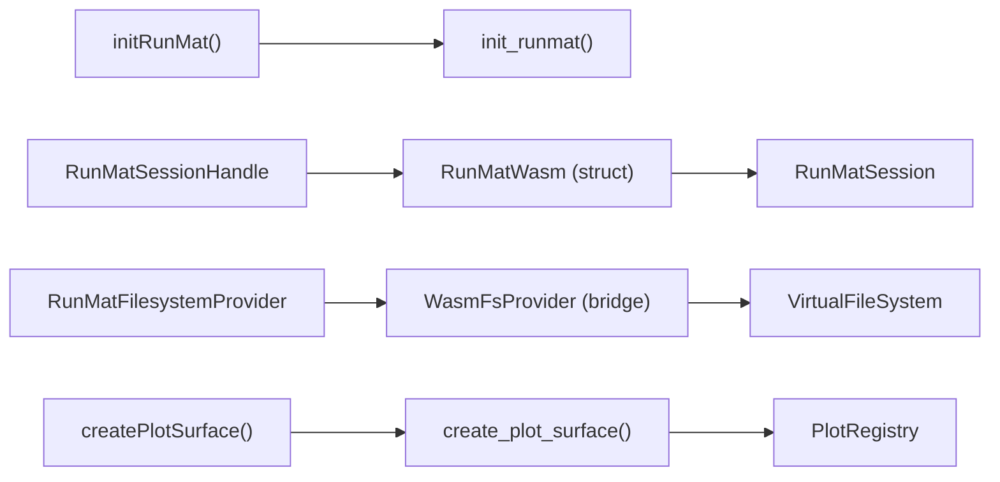

# TypeScript/JavaScript API

<details>
<summary>Relevant source files</summary>

- [bindings/ts/README.md](https://github.com/runmat-org/runmat/blob/82685330/bindings/ts/README.md?plain=1)
- [bindings/ts/package-lock.json](https://github.com/runmat-org/runmat/blob/82685330/bindings/ts/package-lock.json)
- [bindings/ts/package.json](https://github.com/runmat-org/runmat/blob/82685330/bindings/ts/package.json)
- [bindings/ts/scripts/sync-wasm-artifacts.cjs](https://github.com/runmat-org/runmat/blob/82685330/bindings/ts/scripts/sync-wasm-artifacts.cjs)
- [bindings/ts/src/index.spec.ts](https://github.com/runmat-org/runmat/blob/82685330/bindings/ts/src/index.spec.ts)
- [bindings/ts/src/index.ts](https://github.com/runmat-org/runmat/blob/82685330/bindings/ts/src/index.ts)
- [crates/runmat-cli/Cargo.toml](https://github.com/runmat-org/runmat/blob/82685330/crates/runmat-cli/Cargo.toml)
- [crates/runmat-cli/src/main.rs](https://github.com/runmat-org/runmat/blob/82685330/crates/runmat-cli/src/main.rs)
- [crates/runmat-core/Cargo.toml](https://github.com/runmat-org/runmat/blob/82685330/crates/runmat-core/Cargo.toml)
- [crates/runmat-core/src/lib.rs](https://github.com/runmat-org/runmat/blob/82685330/crates/runmat-core/src/lib.rs)
- [crates/runmat-lsp/Cargo.toml](https://github.com/runmat-org/runmat/blob/82685330/crates/runmat-lsp/Cargo.toml)
- [crates/runmat-plot/src/core/depth.rs](https://github.com/runmat-org/runmat/blob/82685330/crates/runmat-plot/src/core/depth.rs)
- [crates/runmat-plot/src/gpu/shaders/vertex/grid_plane.rs](https://github.com/runmat-org/runmat/blob/82685330/crates/runmat-plot/src/gpu/shaders/vertex/grid_plane.rs)
- [crates/runmat-runtime/src/builtins/plotting/core/web.rs](https://github.com/runmat-org/runmat/blob/82685330/crates/runmat-runtime/src/builtins/plotting/core/web.rs)
- [crates/runmat-runtime/src/builtins/wasm_registry.rs](https://github.com/runmat-org/runmat/blob/82685330/crates/runmat-runtime/src/builtins/wasm_registry.rs)
- [crates/runmat-snapshot/src/compression.rs](https://github.com/runmat-org/runmat/blob/82685330/crates/runmat-snapshot/src/compression.rs)
- [crates/runmat-snapshot/src/format.rs](https://github.com/runmat-org/runmat/blob/82685330/crates/runmat-snapshot/src/format.rs)
- [crates/runmat-snapshot/src/loader.rs](https://github.com/runmat-org/runmat/blob/82685330/crates/runmat-snapshot/src/loader.rs)
- [crates/runmat-snapshot/src/validation.rs](https://github.com/runmat-org/runmat/blob/82685330/crates/runmat-snapshot/src/validation.rs)
- [crates/runmat-snapshot/tests/format.rs](https://github.com/runmat-org/runmat/blob/82685330/crates/runmat-snapshot/tests/format.rs)
- [crates/runmat-wasm/Cargo.toml](https://github.com/runmat-org/runmat/blob/82685330/crates/runmat-wasm/Cargo.toml)
- [crates/runmat-wasm/src/api/session.rs](https://github.com/runmat-org/runmat/blob/82685330/crates/runmat-wasm/src/api/session.rs)
- [crates/runmat-wasm/src/lib.rs](https://github.com/runmat-org/runmat/blob/82685330/crates/runmat-wasm/src/lib.rs)
- [crates/runmat-wasm/src/wire/payloads.rs](https://github.com/runmat-org/runmat/blob/82685330/crates/runmat-wasm/src/wire/payloads.rs)

</details>

The RunMat TypeScript/JavaScript API provides a high-level, type-safe interface for embedding the RunMat engine into web applications and Node.js environments. It leverages a WebAssembly (WASM) core to deliver near-native performance for MATLAB-compatible execution, GPU-accelerated math, and interactive plotting directly in the browser.

### API Architecture and Data Flow

The API acts as a bridge between the JavaScript host environment and the Rust-based `runmat-core` and `runmat-vm` engines. It handles the serialization of execution requests, the management of virtual filesystems, and the orchestration of WebGPU-based rendering surfaces.

#### System Entity Mapping

The following diagram bridges the high-level JS entities with their underlying Rust implementation counterparts.

Entity Space Mapping



<details>
<summary>Rendered SVG</summary>

```svg
<svg id="mermaid-f0hldefgota" xmlns="http://www.w3.org/2000/svg" xmlns:xlink="http://www.w3.org/1999/xlink" class="flowchart" style="max-width: 100%; touch-action: none; user-select: none; cursor: grab; min-height: fit-content; max-height: 100%;" viewBox="-0.005043288623028275 0 1077.299149077246 476" role="graphics-document document" aria-roledescription="flowchart-v2" preserveAspectRatio="xMidYMid meet"><style>#mermaid-f0hldefgota{font-family:ui-sans-serif,-apple-system,system-ui,Segoe UI,Helvetica;font-size:16px;fill:#ccc;}@keyframes edge-animation-frame{from{stroke-dashoffset:0;}}@keyframes dash{to{stroke-dashoffset:0;}}#mermaid-f0hldefgota .edge-animation-slow{stroke-dasharray:9,5!important;stroke-dashoffset:900;animation:dash 50s linear infinite;stroke-linecap:round;}#mermaid-f0hldefgota .edge-animation-fast{stroke-dasharray:9,5!important;stroke-dashoffset:900;animation:dash 20s linear infinite;stroke-linecap:round;}#mermaid-f0hldefgota .error-icon{fill:#333;}#mermaid-f0hldefgota .error-text{fill:#cccccc;stroke:#cccccc;}#mermaid-f0hldefgota .edge-thickness-normal{stroke-width:1px;}#mermaid-f0hldefgota .edge-thickness-thick{stroke-width:3.5px;}#mermaid-f0hldefgota .edge-pattern-solid{stroke-dasharray:0;}#mermaid-f0hldefgota .edge-thickness-invisible{stroke-width:0;fill:none;}#mermaid-f0hldefgota .edge-pattern-dashed{stroke-dasharray:3;}#mermaid-f0hldefgota .edge-pattern-dotted{stroke-dasharray:2;}#mermaid-f0hldefgota .marker{fill:#666;stroke:#666;}#mermaid-f0hldefgota .marker.cross{stroke:#666;}#mermaid-f0hldefgota svg{font-family:ui-sans-serif,-apple-system,system-ui,Segoe UI,Helvetica;font-size:16px;}#mermaid-f0hldefgota p{margin:0;}#mermaid-f0hldefgota .label{font-family:ui-sans-serif,-apple-system,system-ui,Segoe UI,Helvetica;color:#fff;}#mermaid-f0hldefgota .cluster-label text{fill:#fff;}#mermaid-f0hldefgota .cluster-label span{color:#fff;}#mermaid-f0hldefgota .cluster-label span p{background-color:transparent;}#mermaid-f0hldefgota .label text,#mermaid-f0hldefgota span{fill:#fff;color:#fff;}#mermaid-f0hldefgota .node rect,#mermaid-f0hldefgota .node circle,#mermaid-f0hldefgota .node ellipse,#mermaid-f0hldefgota .node polygon,#mermaid-f0hldefgota .node path{fill:#111;stroke:#222;stroke-width:1px;}#mermaid-f0hldefgota .rough-node .label text,#mermaid-f0hldefgota .node .label text,#mermaid-f0hldefgota .image-shape .label,#mermaid-f0hldefgota .icon-shape .label{text-anchor:middle;}#mermaid-f0hldefgota .node .katex path{fill:#000;stroke:#000;stroke-width:1px;}#mermaid-f0hldefgota .rough-node .label,#mermaid-f0hldefgota .node .label,#mermaid-f0hldefgota .image-shape .label,#mermaid-f0hldefgota .icon-shape .label{text-align:center;}#mermaid-f0hldefgota .node.clickable{cursor:pointer;}#mermaid-f0hldefgota .root .anchor path{fill:#666!important;stroke-width:0;stroke:#666;}#mermaid-f0hldefgota .arrowheadPath{fill:#0b0b0b;}#mermaid-f0hldefgota .edgePath .path{stroke:#666;stroke-width:1px;}#mermaid-f0hldefgota .flowchart-link{stroke:#666;fill:none;}#mermaid-f0hldefgota .edgeLabel{background-color:#161616;text-align:center;}#mermaid-f0hldefgota .edgeLabel p{background-color:#161616;}#mermaid-f0hldefgota .edgeLabel rect{opacity:0.5;background-color:#161616;fill:#161616;}#mermaid-f0hldefgota .labelBkg{background-color:rgba(22, 22, 22, 0.5);}#mermaid-f0hldefgota .cluster rect{fill:#161616;stroke:#222;stroke-width:1px;}#mermaid-f0hldefgota .cluster text{fill:#fff;}#mermaid-f0hldefgota .cluster span{color:#fff;}#mermaid-f0hldefgota div.mermaidTooltip{position:absolute;text-align:center;max-width:200px;padding:2px;font-family:ui-sans-serif,-apple-system,system-ui,Segoe UI,Helvetica;font-size:12px;background:#333;border:1px solid hsl(0, 0%, 10%);border-radius:2px;pointer-events:none;z-index:100;}#mermaid-f0hldefgota .flowchartTitleText{text-anchor:middle;font-size:18px;fill:#ccc;}#mermaid-f0hldefgota rect.text{fill:none;stroke-width:0;}#mermaid-f0hldefgota .icon-shape,#mermaid-f0hldefgota .image-shape{background-color:#161616;text-align:center;}#mermaid-f0hldefgota .icon-shape p,#mermaid-f0hldefgota .image-shape p{background-color:#161616;padding:2px;}#mermaid-f0hldefgota .icon-shape .label rect,#mermaid-f0hldefgota .image-shape .label rect{opacity:0.5;background-color:#161616;fill:#161616;}#mermaid-f0hldefgota .label-icon{display:inline-block;height:1em;overflow:visible;vertical-align:-0.125em;}#mermaid-f0hldefgota .node .label-icon path{fill:currentColor;stroke:revert;stroke-width:revert;}#mermaid-f0hldefgota .node .neo-node{stroke:#222;}#mermaid-f0hldefgota [data-look="neo"].node rect,#mermaid-f0hldefgota [data-look="neo"].cluster rect,#mermaid-f0hldefgota [data-look="neo"].node polygon{stroke:url(#mermaid-f0hldefgota-gradient);filter:drop-shadow( 1px 2px 2px rgba(185,185,185,1));}#mermaid-f0hldefgota [data-look="neo"].node path{stroke:url(#mermaid-f0hldefgota-gradient);stroke-width:1px;}#mermaid-f0hldefgota [data-look="neo"].node .outer-path{filter:drop-shadow( 1px 2px 2px rgba(185,185,185,1));}#mermaid-f0hldefgota [data-look="neo"].node .neo-line path{stroke:#222;filter:none;}#mermaid-f0hldefgota [data-look="neo"].node circle{stroke:url(#mermaid-f0hldefgota-gradient);filter:drop-shadow( 1px 2px 2px rgba(185,185,185,1));}#mermaid-f0hldefgota [data-look="neo"].node circle .state-start{fill:#000000;}#mermaid-f0hldefgota [data-look="neo"].icon-shape .icon{fill:url(#mermaid-f0hldefgota-gradient);filter:drop-shadow( 1px 2px 2px rgba(185,185,185,1));}#mermaid-f0hldefgota [data-look="neo"].icon-shape .icon-neo path{stroke:url(#mermaid-f0hldefgota-gradient);filter:drop-shadow( 1px 2px 2px rgba(185,185,185,1));}#mermaid-f0hldefgota :root{--mermaid-font-family:"trebuchet ms",verdana,arial,sans-serif;}</style><g><marker id="mermaid-f0hldefgota_flowchart-v2-pointEnd" class="marker flowchart-v2" viewBox="0 0 10 10" refX="5" refY="5" markerUnits="userSpaceOnUse" markerWidth="8" markerHeight="8" orient="auto"><path d="M 0 0 L 10 5 L 0 10 z" class="arrowMarkerPath" style="stroke-width: 1; stroke-dasharray: 1, 0;"></path></marker><marker id="mermaid-f0hldefgota_flowchart-v2-pointStart" class="marker flowchart-v2" viewBox="0 0 10 10" refX="4.5" refY="5" markerUnits="userSpaceOnUse" markerWidth="8" markerHeight="8" orient="auto"><path d="M 0 5 L 10 10 L 10 0 z" class="arrowMarkerPath" style="stroke-width: 1; stroke-dasharray: 1, 0;"></path></marker><marker id="mermaid-f0hldefgota_flowchart-v2-pointEnd-margin" class="marker flowchart-v2" viewBox="0 0 11.5 14" refX="11.5" refY="7" markerUnits="userSpaceOnUse" markerWidth="10.5" markerHeight="14" orient="auto"><path d="M 0 0 L 11.5 7 L 0 14 z" class="arrowMarkerPath" style="stroke-width: 0; stroke-dasharray: 1, 0;"></path></marker><marker id="mermaid-f0hldefgota_flowchart-v2-pointStart-margin" class="marker flowchart-v2" viewBox="0 0 11.5 14" refX="1" refY="7" markerUnits="userSpaceOnUse" markerWidth="11.5" markerHeight="14" orient="auto"><polygon points="0,7 11.5,14 11.5,0" class="arrowMarkerPath" style="stroke-width: 0; stroke-dasharray: 1, 0;"></polygon></marker><marker id="mermaid-f0hldefgota_flowchart-v2-circleEnd" class="marker flowchart-v2" viewBox="0 0 10 10" refX="11" refY="5" markerUnits="userSpaceOnUse" markerWidth="11" markerHeight="11" orient="auto"><circle cx="5" cy="5" r="5" class="arrowMarkerPath" style="stroke-width: 1; stroke-dasharray: 1, 0;"></circle></marker><marker id="mermaid-f0hldefgota_flowchart-v2-circleStart" class="marker flowchart-v2" viewBox="0 0 10 10" refX="-1" refY="5" markerUnits="userSpaceOnUse" markerWidth="11" markerHeight="11" orient="auto"><circle cx="5" cy="5" r="5" class="arrowMarkerPath" style="stroke-width: 1; stroke-dasharray: 1, 0;"></circle></marker><marker id="mermaid-f0hldefgota_flowchart-v2-circleEnd-margin" class="marker flowchart-v2" viewBox="0 0 10 10" refY="5" refX="12.25" markerUnits="userSpaceOnUse" markerWidth="14" markerHeight="14" orient="auto"><circle cx="5" cy="5" r="5" class="arrowMarkerPath" style="stroke-width: 0; stroke-dasharray: 1, 0;"></circle></marker><marker id="mermaid-f0hldefgota_flowchart-v2-circleStart-margin" class="marker flowchart-v2" viewBox="0 0 10 10" refX="-2" refY="5" markerUnits="userSpaceOnUse" markerWidth="14" markerHeight="14" orient="auto"><circle cx="5" cy="5" r="5" class="arrowMarkerPath" style="stroke-width: 0; stroke-dasharray: 1, 0;"></circle></marker><marker id="mermaid-f0hldefgota_flowchart-v2-crossEnd" class="marker cross flowchart-v2" viewBox="0 0 11 11" refX="12" refY="5.2" markerUnits="userSpaceOnUse" markerWidth="11" markerHeight="11" orient="auto"><path d="M 1,1 l 9,9 M 10,1 l -9,9" class="arrowMarkerPath" style="stroke-width: 2; stroke-dasharray: 1, 0;"></path></marker><marker id="mermaid-f0hldefgota_flowchart-v2-crossStart" class="marker cross flowchart-v2" viewBox="0 0 11 11" refX="-1" refY="5.2" markerUnits="userSpaceOnUse" markerWidth="11" markerHeight="11" orient="auto"><path d="M 1,1 l 9,9 M 10,1 l -9,9" class="arrowMarkerPath" style="stroke-width: 2; stroke-dasharray: 1, 0;"></path></marker><marker id="mermaid-f0hldefgota_flowchart-v2-crossEnd-margin" class="marker cross flowchart-v2" viewBox="0 0 15 15" refX="17.7" refY="7.5" markerUnits="userSpaceOnUse" markerWidth="12" markerHeight="12" orient="auto"><path d="M 1,1 L 14,14 M 1,14 L 14,1" class="arrowMarkerPath" style="stroke-width: 2.5;"></path></marker><marker id="mermaid-f0hldefgota_flowchart-v2-crossStart-margin" class="marker cross flowchart-v2" viewBox="0 0 15 15" refX="-3.5" refY="7.5" markerUnits="userSpaceOnUse" markerWidth="12" markerHeight="12" orient="auto"><path d="M 1,1 L 14,14 M 1,14 L 14,1" class="arrowMarkerPath" style="stroke-width: 2.5; stroke-dasharray: 1, 0;"></path></marker><g class="root"><g class="clusters"><g class="cluster" id="mermaid-f0hldefgota-subGraph2" data-look="classic"><rect style="" x="235.171875" y="364" width="799.265625" height="104"></rect><g class="cluster-label" transform="translate(474.28125, 364)"><foreignObject width="321.046875" height="24"><div style="display: table-cell; white-space: nowrap; line-height: 1.5;" xmlns="http://www.w3.org/1999/xhtml"><span class="nodeLabel"><p>Core Engine (runmat-core / runmat-runtime)</p></span></div></foreignObject></g></g><g class="cluster" id="mermaid-f0hldefgota-subGraph1" data-look="classic"><rect style="" x="8" y="186" width="1061.2890625" height="104"></rect><g class="cluster-label" transform="translate(430.66015625, 186)"><foreignObject width="215.96875" height="24"><div style="display: table-cell; white-space: nowrap; line-height: 1.5;" xmlns="http://www.w3.org/1999/xhtml"><span class="nodeLabel"><p>WASM Bridge (runmat-wasm)</p></span></div></foreignObject></g></g><g class="cluster" id="mermaid-f0hldefgota-subGraph0" data-look="classic"><rect style="" x="10.296875" y="8" width="1051.234375" height="104"></rect><g class="cluster-label" transform="translate(431.59375, 8)"><foreignObject width="208.640625" height="24"><div style="display: table-cell; white-space: nowrap; line-height: 1.5;" xmlns="http://www.w3.org/1999/xhtml"><span class="nodeLabel"><p>JavaScript/TypeScript Space</p></span></div></foreignObject></g></g></g><g class="edgePaths"><path d="M119.938,87L119.938,91.167C119.938,95.333,119.938,103.667,119.938,114C119.938,124.333,119.938,136.667,119.938,149C119.938,161.333,119.938,173.667,119.938,183.333C119.938,193,119.938,200,119.938,203.5L119.938,207" id="mermaid-f0hldefgota-L_A_E_0" class="edge-thickness-normal edge-pattern-solid edge-thickness-normal edge-pattern-solid flowchart-link" style=";" data-edge="true" data-et="edge" data-id="L_A_E_0" data-points="W3sieCI6MTE5LjkzNzUsInkiOjg3fSx7IngiOjExOS45Mzc1LCJ5IjoxMTJ9LHsieCI6MTE5LjkzNzUsInkiOjE0OX0seyJ4IjoxMTkuOTM3NSwieSI6MTg2fSx7IngiOjExOS45Mzc1LCJ5IjoyMTF9XQ==" data-look="classic" marker-end="url(#mermaid-f0hldefgota_flowchart-v2-pointEnd)"></path><path d="M356.352,87L356.352,91.167C356.352,95.333,356.352,103.667,356.352,114C356.352,124.333,356.352,136.667,356.352,149C356.352,161.333,356.352,173.667,356.352,183.333C356.352,193,356.352,200,356.352,203.5L356.352,207" id="mermaid-f0hldefgota-L_B_F_0" class="edge-thickness-normal edge-pattern-solid edge-thickness-normal edge-pattern-solid flowchart-link" style=";" data-edge="true" data-et="edge" data-id="L_B_F_0" data-points="W3sieCI6MzU2LjM1MTU2MjUsInkiOjg3fSx7IngiOjM1Ni4zNTE1NjI1LCJ5IjoxMTJ9LHsieCI6MzU2LjM1MTU2MjUsInkiOjE0OX0seyJ4IjozNTYuMzUxNTYyNSwieSI6MTg2fSx7IngiOjM1Ni4zNTE1NjI1LCJ5IjoyMTF9XQ==" data-look="classic" marker-end="url(#mermaid-f0hldefgota_flowchart-v2-pointEnd)"></path><path d="M644.648,87L644.648,91.167C644.648,95.333,644.648,103.667,644.648,114C644.648,124.333,644.648,136.667,644.648,149C644.648,161.333,644.648,173.667,644.648,183.333C644.648,193,644.648,200,644.648,203.5L644.648,207" id="mermaid-f0hldefgota-L_C_G_0" class="edge-thickness-normal edge-pattern-solid edge-thickness-normal edge-pattern-solid flowchart-link" style=";" data-edge="true" data-et="edge" data-id="L_C_G_0" data-points="W3sieCI6NjQ0LjY0ODQzNzUsInkiOjg3fSx7IngiOjY0NC42NDg0Mzc1LCJ5IjoxMTJ9LHsieCI6NjQ0LjY0ODQzNzUsInkiOjE0OX0seyJ4Ijo2NDQuNjQ4NDM3NSwieSI6MTg2fSx7IngiOjY0NC42NDg0Mzc1LCJ5IjoyMTF9XQ==" data-look="classic" marker-end="url(#mermaid-f0hldefgota_flowchart-v2-pointEnd)"></path><path d="M925.555,87L925.555,91.167C925.555,95.333,925.555,103.667,925.555,114C925.555,124.333,925.555,136.667,925.555,149C925.555,161.333,925.555,173.667,925.555,183.333C925.555,193,925.555,200,925.555,203.5L925.555,207" id="mermaid-f0hldefgota-L_D_H_0" class="edge-thickness-normal edge-pattern-solid edge-thickness-normal edge-pattern-solid flowchart-link" style=";" data-edge="true" data-et="edge" data-id="L_D_H_0" data-points="W3sieCI6OTI1LjU1NDY4NzUsInkiOjg3fSx7IngiOjkyNS41NTQ2ODc1LCJ5IjoxMTJ9LHsieCI6OTI1LjU1NDY4NzUsInkiOjE0OX0seyJ4Ijo5MjUuNTU0Njg3NSwieSI6MTg2fSx7IngiOjkyNS41NTQ2ODc1LCJ5IjoyMTF9XQ==" data-look="classic" marker-end="url(#mermaid-f0hldefgota_flowchart-v2-pointEnd)"></path><path d="M356.352,265L356.352,269.167C356.352,273.333,356.352,281.667,356.352,292C356.352,302.333,356.352,314.667,356.352,327C356.352,339.333,356.352,351.667,356.352,361.333C356.352,371,356.352,378,356.352,381.5L356.352,385" id="mermaid-f0hldefgota-L_F_I_0" class="edge-thickness-normal edge-pattern-solid edge-thickness-normal edge-pattern-solid flowchart-link" style=";" data-edge="true" data-et="edge" data-id="L_F_I_0" data-points="W3sieCI6MzU2LjM1MTU2MjUsInkiOjI2NX0seyJ4IjozNTYuMzUxNTYyNSwieSI6MjkwfSx7IngiOjM1Ni4zNTE1NjI1LCJ5IjozMjd9LHsieCI6MzU2LjM1MTU2MjUsInkiOjM2NH0seyJ4IjozNTYuMzUxNTYyNSwieSI6Mzg5fV0=" data-look="classic" marker-end="url(#mermaid-f0hldefgota_flowchart-v2-pointEnd)"></path><path d="M644.648,265L644.648,269.167C644.648,273.333,644.648,281.667,644.648,292C644.648,302.333,644.648,314.667,644.648,327C644.648,339.333,644.648,351.667,644.648,361.333C644.648,371,644.648,378,644.648,381.5L644.648,385" id="mermaid-f0hldefgota-L_G_J_0" class="edge-thickness-normal edge-pattern-solid edge-thickness-normal edge-pattern-solid flowchart-link" style=";" data-edge="true" data-et="edge" data-id="L_G_J_0" data-points="W3sieCI6NjQ0LjY0ODQzNzUsInkiOjI2NX0seyJ4Ijo2NDQuNjQ4NDM3NSwieSI6MjkwfSx7IngiOjY0NC42NDg0Mzc1LCJ5IjozMjd9LHsieCI6NjQ0LjY0ODQzNzUsInkiOjM2NH0seyJ4Ijo2NDQuNjQ4NDM3NSwieSI6Mzg5fV0=" data-look="classic" marker-end="url(#mermaid-f0hldefgota_flowchart-v2-pointEnd)"></path><path d="M925.555,265L925.555,269.167C925.555,273.333,925.555,281.667,925.555,292C925.555,302.333,925.555,314.667,925.555,327C925.555,339.333,925.555,351.667,925.555,361.333C925.555,371,925.555,378,925.555,381.5L925.555,385" id="mermaid-f0hldefgota-L_H_K_0" class="edge-thickness-normal edge-pattern-solid edge-thickness-normal edge-pattern-solid flowchart-link" style=";" data-edge="true" data-et="edge" data-id="L_H_K_0" data-points="W3sieCI6OTI1LjU1NDY4NzUsInkiOjI2NX0seyJ4Ijo5MjUuNTU0Njg3NSwieSI6MjkwfSx7IngiOjkyNS41NTQ2ODc1LCJ5IjozMjd9LHsieCI6OTI1LjU1NDY4NzUsInkiOjM2NH0seyJ4Ijo5MjUuNTU0Njg3NSwieSI6Mzg5fV0=" data-look="classic" marker-end="url(#mermaid-f0hldefgota_flowchart-v2-pointEnd)"></path></g><g class="edgeLabels"><g class="edgeLabel" transform="translate(119.9375, 149)"><g class="label" data-id="L_A_E_0" transform="translate(-16.34375, -12)"><foreignObject width="32.6875" height="24"><div style="display: table-cell; white-space: nowrap; line-height: 1.5; max-width: 200px; text-align: center;" xmlns="http://www.w3.org/1999/xhtml" class="labelBkg"><span class="edgeLabel"><p>calls</p></span></div></foreignObject></g></g><g class="edgeLabel" transform="translate(356.3515625, 149)"><g class="label" data-id="L_B_F_0" transform="translate(-21.9453125, -12)"><foreignObject width="43.890625" height="24"><div style="display: table-cell; white-space: nowrap; line-height: 1.5; max-width: 200px; text-align: center;" xmlns="http://www.w3.org/1999/xhtml" class="labelBkg"><span class="edgeLabel"><p>wraps</p></span></div></foreignObject></g></g><g class="edgeLabel" transform="translate(644.6484375, 149)"><g class="label" data-id="L_C_G_0" transform="translate(-42.0703125, -12)"><foreignObject width="84.140625" height="24"><div style="display: table-cell; white-space: nowrap; line-height: 1.5; max-width: 200px; text-align: center;" xmlns="http://www.w3.org/1999/xhtml" class="labelBkg"><span class="edgeLabel"><p>implements</p></span></div></foreignObject></g></g><g class="edgeLabel" transform="translate(925.5546875, 149)"><g class="label" data-id="L_D_H_0" transform="translate(-16.34375, -12)"><foreignObject width="32.6875" height="24"><div style="display: table-cell; white-space: nowrap; line-height: 1.5; max-width: 200px; text-align: center;" xmlns="http://www.w3.org/1999/xhtml" class="labelBkg"><span class="edgeLabel"><p>calls</p></span></div></foreignObject></g></g><g class="edgeLabel" transform="translate(356.3515625, 327)"><g class="label" data-id="L_F_I_0" transform="translate(-33, -12)"><foreignObject width="66" height="24"><div style="display: table-cell; white-space: nowrap; line-height: 1.5; max-width: 200px; text-align: center;" xmlns="http://www.w3.org/1999/xhtml" class="labelBkg"><span class="edgeLabel"><p>manages</p></span></div></foreignObject></g></g><g class="edgeLabel" transform="translate(644.6484375, 327)"><g class="label" data-id="L_G_J_0" transform="translate(-35.546875, -12)"><foreignObject width="71.09375" height="24"><div style="display: table-cell; white-space: nowrap; line-height: 1.5; max-width: 200px; text-align: center;" xmlns="http://www.w3.org/1999/xhtml" class="labelBkg"><span class="edgeLabel"><p>plugs into</p></span></div></foreignObject></g></g><g class="edgeLabel" transform="translate(925.5546875, 327)"><g class="label" data-id="L_H_K_0" transform="translate(-48.921875, -12)"><foreignObject width="97.84375" height="24"><div style="display: table-cell; white-space: nowrap; line-height: 1.5; max-width: 200px; text-align: center;" xmlns="http://www.w3.org/1999/xhtml" class="labelBkg"><span class="edgeLabel"><p>registers with</p></span></div></foreignObject></g></g></g><g class="nodes"><g class="node default" id="mermaid-f0hldefgota-flowchart-A-0" data-look="classic" transform="translate(119.9375, 60)"><rect class="basic label-container" style="" x="-74.640625" y="-27" width="149.28125" height="54"></rect><g class="label" style="" transform="translate(-44.640625, -12)"><rect></rect><foreignObject width="89.28125" height="24"><div style="display: table-cell; white-space: nowrap; line-height: 1.5; max-width: 200px; text-align: center;" xmlns="http://www.w3.org/1999/xhtml"><span class="nodeLabel"><p>initRunMat()</p></span></div></foreignObject></g></g><g class="node default" id="mermaid-f0hldefgota-flowchart-B-1" data-look="classic" transform="translate(356.3515625, 60)"><rect class="basic label-container" style="" x="-111.7734375" y="-27" width="223.546875" height="54"></rect><g class="label" style="" transform="translate(-81.7734375, -12)"><rect></rect><foreignObject width="163.546875" height="24"><div style="display: table-cell; white-space: nowrap; line-height: 1.5; max-width: 200px; text-align: center;" xmlns="http://www.w3.org/1999/xhtml"><span class="nodeLabel"><p>RunMatSessionHandle</p></span></div></foreignObject></g></g><g class="node default" id="mermaid-f0hldefgota-flowchart-C-2" data-look="classic" transform="translate(644.6484375, 60)"><rect class="basic label-container" style="" x="-126.5234375" y="-27" width="253.046875" height="54"></rect><g class="label" style="" transform="translate(-96.5234375, -12)"><rect></rect><foreignObject width="193.046875" height="24"><div style="display: table-cell; white-space: nowrap; line-height: 1.5; max-width: 200px; text-align: center;" xmlns="http://www.w3.org/1999/xhtml"><span class="nodeLabel"><p>RunMatFilesystemProvider</p></span></div></foreignObject></g></g><g class="node default" id="mermaid-f0hldefgota-flowchart-D-3" data-look="classic" transform="translate(925.5546875, 60)"><rect class="basic label-container" style="" x="-100.9765625" y="-27" width="201.953125" height="54"></rect><g class="label" style="" transform="translate(-70.9765625, -12)"><rect></rect><foreignObject width="141.953125" height="24"><div style="display: table-cell; white-space: nowrap; line-height: 1.5; max-width: 200px; text-align: center;" xmlns="http://www.w3.org/1999/xhtml"><span class="nodeLabel"><p>createPlotSurface()</p></span></div></foreignObject></g></g><g class="node default" id="mermaid-f0hldefgota-flowchart-E-4" data-look="classic" transform="translate(119.9375, 238)"><rect class="basic label-container" style="" x="-76.9375" y="-27" width="153.875" height="54"></rect><g class="label" style="" transform="translate(-46.9375, -12)"><rect></rect><foreignObject width="93.875" height="24"><div style="display: table-cell; white-space: nowrap; line-height: 1.5; max-width: 200px; text-align: center;" xmlns="http://www.w3.org/1999/xhtml"><span class="nodeLabel"><p>init_runmat()</p></span></div></foreignObject></g></g><g class="node default" id="mermaid-f0hldefgota-flowchart-F-5" data-look="classic" transform="translate(356.3515625, 238)"><rect class="basic label-container" style="" x="-109.3359375" y="-27" width="218.671875" height="54"></rect><g class="label" style="" transform="translate(-79.3359375, -12)"><rect></rect><foreignObject width="158.671875" height="24"><div style="display: table-cell; white-space: nowrap; line-height: 1.5; max-width: 200px; text-align: center;" xmlns="http://www.w3.org/1999/xhtml"><span class="nodeLabel"><p>RunMatWasm (struct)</p></span></div></foreignObject></g></g><g class="node default" id="mermaid-f0hldefgota-flowchart-G-6" data-look="classic" transform="translate(644.6484375, 238)"><rect class="basic label-container" style="" x="-122.171875" y="-27" width="244.34375" height="54"></rect><g class="label" style="" transform="translate(-92.171875, -12)"><rect></rect><foreignObject width="184.34375" height="24"><div style="display: table-cell; white-space: nowrap; line-height: 1.5; max-width: 200px; text-align: center;" xmlns="http://www.w3.org/1999/xhtml"><span class="nodeLabel"><p>WasmFsProvider (bridge)</p></span></div></foreignObject></g></g><g class="node default" id="mermaid-f0hldefgota-flowchart-H-7" data-look="classic" transform="translate(925.5546875, 238)"><rect class="basic label-container" style="" x="-108.734375" y="-27" width="217.46875" height="54"></rect><g class="label" style="" transform="translate(-78.734375, -12)"><rect></rect><foreignObject width="157.46875" height="24"><div style="display: table-cell; white-space: nowrap; line-height: 1.5; max-width: 200px; text-align: center;" xmlns="http://www.w3.org/1999/xhtml"><span class="nodeLabel"><p>create_plot_surface()</p></span></div></foreignObject></g></g><g class="node default" id="mermaid-f0hldefgota-flowchart-I-8" data-look="classic" transform="translate(356.3515625, 416)"><rect class="basic label-container" style="" x="-86.1796875" y="-27" width="172.359375" height="54"></rect><g class="label" style="" transform="translate(-56.1796875, -12)"><rect></rect><foreignObject width="112.359375" height="24"><div style="display: table-cell; white-space: nowrap; line-height: 1.5; max-width: 200px; text-align: center;" xmlns="http://www.w3.org/1999/xhtml"><span class="nodeLabel"><p>RunMatSession</p></span></div></foreignObject></g></g><g class="node default" id="mermaid-f0hldefgota-flowchart-J-9" data-look="classic" transform="translate(644.6484375, 416)"><rect class="basic label-container" style="" x="-92.8515625" y="-27" width="185.703125" height="54"></rect><g class="label" style="" transform="translate(-62.8515625, -12)"><rect></rect><foreignObject width="125.703125" height="24"><div style="display: table-cell; white-space: nowrap; line-height: 1.5; max-width: 200px; text-align: center;" xmlns="http://www.w3.org/1999/xhtml"><span class="nodeLabel"><p>VirtualFileSystem</p></span></div></foreignObject></g></g><g class="node default" id="mermaid-f0hldefgota-flowchart-K-10" data-look="classic" transform="translate(925.5546875, 416)"><rect class="basic label-container" style="" x="-73.8828125" y="-27" width="147.765625" height="54"></rect><g class="label" style="" transform="translate(-43.8828125, -12)"><rect></rect><foreignObject width="87.765625" height="24"><div style="display: table-cell; white-space: nowrap; line-height: 1.5; max-width: 200px; text-align: center;" xmlns="http://www.w3.org/1999/xhtml"><span class="nodeLabel"><p>PlotRegistry</p></span></div></foreignObject></g></g></g></g></g><defs><filter id="mermaid-f0hldefgota-drop-shadow" height="130%" width="130%"><feDropShadow dx="4" dy="4" stdDeviation="0" flood-opacity="0.06" flood-color="#000000"></feDropShadow></filter></defs><defs><filter id="mermaid-f0hldefgota-drop-shadow-small" height="150%" width="150%"><feDropShadow dx="2" dy="2" stdDeviation="0" flood-opacity="0.06" flood-color="#000000"></feDropShadow></filter></defs><linearGradient id="mermaid-f0hldefgota-gradient" gradientUnits="objectBoundingBox" x1="0%" y1="0%" x2="100%" y2="0%"><stop offset="0%" stop-color="#333" stop-opacity="1"></stop><stop offset="100%" stop-color="hsl(-120, 0%, 3.3333333333%)" stop-opacity="1"></stop></linearGradient></svg>
```

</details>

Sources: [crates/runmat-wasm/src/lib.rs #8-21](https://github.com/runmat-org/runmat/blob/82685330/crates/runmat-wasm/src/lib.rs#L8-L21) [bindings/ts/src/index.ts #67-91](https://github.com/runmat-org/runmat/blob/82685330/bindings/ts/src/index.ts#L67-L91) [crates/runmat-wasm/src/api/session.rs #56-64](https://github.com/runmat-org/runmat/blob/82685330/crates/runmat-wasm/src/api/session.rs#L56-L64)

---

### Session Initialization: `initRunMat`

The entry point for the API is `initRunMat`, which initializes the WASM module and sets up the execution environment. It accepts a `RunMatInitOptions` object to configure GPU acceleration, JIT compilation, and filesystem backends.

| Option | Role |
| --- | --- |
| snapshot | Preloads the standard library (via RunMatSnapshotSource) to avoid cold-start overhead bindings/ts/src/index.ts#68 |
| fsProvider | Sets the backend for file I/O (e.g., IndexedDB or Remote) bindings/ts/src/index.ts#81 |
| enableGpu | Enables the wgpu backend for fused math operations bindings/ts/src/index.ts#69 |
| language.compat | Sets the compatibility mode to matlab or strict bindings/ts/src/index.ts#88-90 |

Sources: [bindings/ts/src/index.ts #67-91](https://github.com/runmat-org/runmat/blob/82685330/bindings/ts/src/index.ts#L67-L91) [bindings/ts/README.md #9-27](https://github.com/runmat-org/runmat/blob/82685330/bindings/ts/README.md?plain=1#L9-L27)

---

### Execution and Workspace Management

The `RunMatSessionHandle` (backed by the `RunMatWasm` struct in Rust) is the primary interface for interacting with the runtime.

#### Key Methods

- `executeRequest(request)`: Compiles and runs MATLAB code. It accepts either raw text or a file path [crates/runmat-wasm/src/api/session.rs #117-124](https://github.com/runmat-org/runmat/blob/82685330/crates/runmat-wasm/src/api/session.rs#L117-L124) It returns an `ExecutionPayload` containing stdout, workspace updates, and figures touched [crates/runmat-wasm/src/api/session.rs #203-212](https://github.com/runmat-org/runmat/blob/82685330/crates/runmat-wasm/src/api/session.rs#L203-L212)
- `materializeVariable(name, options)`: Fetches the value of a variable from the workspace. It supports partial materialization for large arrays and can pull data from GPU residency to the JS heap [crates/runmat-wasm/src/api/session.rs #46-52](https://github.com/runmat-org/runmat/blob/82685330/crates/runmat-wasm/src/api/session.rs#L46-L52)
- `exportWorkspaceState()`: Serializes the current workspace into a binary blob for persistence or transfer [crates/runmat-wasm/src/api/session.rs #22-24](https://github.com/runmat-org/runmat/blob/82685330/crates/runmat-wasm/src/api/session.rs#L22-L24)
- `cancelExecution()`: Signals an interrupt to the running VM loop via an `AtomicBool` [crates/runmat-wasm/src/api/session.rs #156-159](https://github.com/runmat-org/runmat/blob/82685330/crates/runmat-wasm/src/api/session.rs#L156-L159)

Execution Request Flow

"VM Interpreter""RunMatSession""RunMatWasm""JS Host""VM Interpreter""RunMatSession""RunMatWasm""JS Host"executeRequest(source)execute_request(abi::ExecutionRequest)run_interpreter_inner()CompletionSessionExecutionResultExecutionPayload (JSON/Wire)

Sources: [crates/runmat-wasm/src/api/session.rs #117-212](https://github.com/runmat-org/runmat/blob/82685330/crates/runmat-wasm/src/api/session.rs#L117-L212) [crates/runmat-core/src/lib.rs #37-75](https://github.com/runmat-org/runmat/blob/82685330/crates/runmat-core/src/lib.rs#L37-L75)

---

### Filesystem Abstraction: `RunMatFilesystemProvider`

RunMat uses a Virtual Filesystem (VFS) to handle I/O. The TS API provides several backends:

1. `createDefaultFsProvider()`: Automatically attempts to use IndexedDB, falling back to an in-memory store [bindings/ts/src/index.ts #4](https://github.com/runmat-org/runmat/blob/82685330/bindings/ts/src/index.ts#L4-L4)
2. `createIndexedDbFsProvider(options)`: Persists files to the browser's IndexedDB [bindings/ts/src/index.ts #10](https://github.com/runmat-org/runmat/blob/82685330/bindings/ts/src/index.ts#L10-L10)
3. `createRemoteFsProvider(options)`: Proxies file operations over HTTP, supporting chunked streaming for large files [bindings/ts/src/index.ts #12](https://github.com/runmat-org/runmat/blob/82685330/bindings/ts/src/index.ts#L12-L12)
4. `createInMemoryFsProvider()`: A zero-dependency synchronous store in JS memory [bindings/ts/src/index.ts #8](https://github.com/runmat-org/runmat/blob/82685330/bindings/ts/src/index.ts#L8-L8)

The bridge is implemented in Rust via `install_fs_provider_value`, which maps JS function calls to the `runmat-filesystem` traits [crates/runmat-wasm/src/api/session.rs #31](https://github.com/runmat-org/runmat/blob/82685330/crates/runmat-wasm/src/api/session.rs#L31-L31)

Sources: [bindings/ts/src/index.ts #7-21](https://github.com/runmat-org/runmat/blob/82685330/bindings/ts/src/index.ts#L7-L21) [bindings/ts/README.md #49-68](https://github.com/runmat-org/runmat/blob/82685330/bindings/ts/README.md?plain=1#L49-L68)

---

### Plotting and Visualization

Interactive plotting is handled by binding an `HTMLCanvasElement` to the RunMat `PlotRegistry`.

- `createPlotSurface(canvas, options)`: Initializes a WebGPU or WebGL2 context on the provided canvas [crates/runmat-wasm/src/lib.rs #11](https://github.com/runmat-org/runmat/blob/82685330/crates/runmat-wasm/src/lib.rs#L11-L11)
- `onFigureEvent(callback)`: Registers a listener for figure lifecycle events such as `created`, `updated`, or `closed` [bindings/ts/src/index.ts #168](https://github.com/runmat-org/runmat/blob/82685330/bindings/ts/src/index.ts#L168-L168)
- `renderFigureImage(handle, options)`: Generates a static image (PNG/JPEG) from a figure handle, useful for server-side rendering or exports [crates/runmat-wasm/src/lib.rs #17](https://github.com/runmat-org/runmat/blob/82685330/crates/runmat-wasm/src/lib.rs#L17-L17)

Sources: [crates/runmat-wasm/src/lib.rs #10-19](https://github.com/runmat-org/runmat/blob/82685330/crates/runmat-wasm/src/lib.rs#L10-L19) [bindings/ts/src/index.ts #93-105](https://github.com/runmat-org/runmat/blob/82685330/bindings/ts/src/index.ts#L93-L105)

---

### Build Infrastructure: `sync-wasm-artifacts`

The TS package requires synchronized WASM binaries and TypeScript definitions. The build process is managed via `npm run build`, which triggers several internal scripts:

1. `generate:builtins`: Extracts metadata from Rust `BuiltinDescriptor` structs to generate TS type definitions for MATLAB functions [bindings/ts/package.json #36](https://github.com/runmat-org/runmat/blob/82685330/bindings/ts/package.json#L36-L36)
2. `wasm-pack`: Compiles the Rust `runmat-wasm` crate into `pkg/` (bundler target) and `pkg-web/` (no-modules target) [bindings/ts/package.json #38-39](https://github.com/runmat-org/runmat/blob/82685330/bindings/ts/package.json#L38-L39)
3. `sync-wasm-artifacts.cjs`: A post-build script that moves generated WASM files and glue code into the `dist/` directory and ensures internal paths are correctly mapped for the NPM package [bindings/ts/package.json #47](https://github.com/runmat-org/runmat/blob/82685330/bindings/ts/package.json#L47-L47)
4. `build:snapshot`: Uses the `runmat-snapshot-tool` to create a `stdlib.snapshot` binary containing the pre-compiled standard library [bindings/ts/package.json #42](https://github.com/runmat-org/runmat/blob/82685330/bindings/ts/package.json#L42-L42)

Sources: [bindings/ts/package.json #34-49](https://github.com/runmat-org/runmat/blob/82685330/bindings/ts/package.json#L34-L49) [bindings/ts/scripts/sync-wasm-artifacts.cjs](https://github.com/runmat-org/runmat/blob/82685330/bindings/ts/scripts/sync-wasm-artifacts.cjs)
