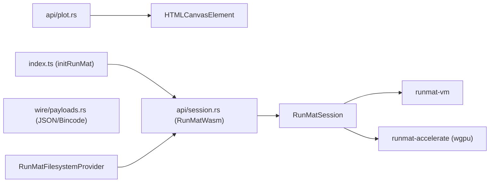
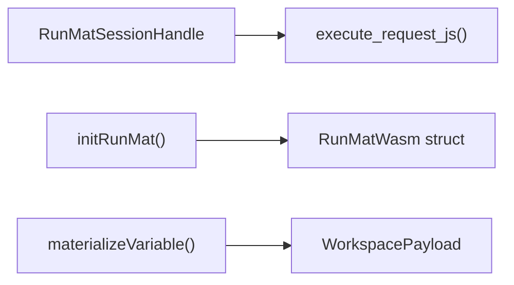

# WebAssembly & TypeScript Bindings

<details>
<summary>Relevant source files</summary>

- [bindings/ts/README.md](https://github.com/runmat-org/runmat/blob/82685330/bindings/ts/README.md?plain=1)
- [bindings/ts/src/index.spec.ts](https://github.com/runmat-org/runmat/blob/82685330/bindings/ts/src/index.spec.ts)
- [bindings/ts/src/index.ts](https://github.com/runmat-org/runmat/blob/82685330/bindings/ts/src/index.ts)
- [crates/runmat-cli/Cargo.toml](https://github.com/runmat-org/runmat/blob/82685330/crates/runmat-cli/Cargo.toml)
- [crates/runmat-cli/src/main.rs](https://github.com/runmat-org/runmat/blob/82685330/crates/runmat-cli/src/main.rs)
- [crates/runmat-core/Cargo.toml](https://github.com/runmat-org/runmat/blob/82685330/crates/runmat-core/Cargo.toml)
- [crates/runmat-core/src/lib.rs](https://github.com/runmat-org/runmat/blob/82685330/crates/runmat-core/src/lib.rs)
- [crates/runmat-lsp/Cargo.toml](https://github.com/runmat-org/runmat/blob/82685330/crates/runmat-lsp/Cargo.toml)
- [crates/runmat-runtime/src/builtins/plotting/core/web.rs](https://github.com/runmat-org/runmat/blob/82685330/crates/runmat-runtime/src/builtins/plotting/core/web.rs)
- [crates/runmat-wasm/Cargo.toml](https://github.com/runmat-org/runmat/blob/82685330/crates/runmat-wasm/Cargo.toml)
- [crates/runmat-wasm/src/api/session.rs](https://github.com/runmat-org/runmat/blob/82685330/crates/runmat-wasm/src/api/session.rs)
- [crates/runmat-wasm/src/lib.rs](https://github.com/runmat-org/runmat/blob/82685330/crates/runmat-wasm/src/lib.rs)
- [crates/runmat-wasm/src/wire/payloads.rs](https://github.com/runmat-org/runmat/blob/82685330/crates/runmat-wasm/src/wire/payloads.rs)

</details>

RunMat is distributed as a high-performance WebAssembly (WASM) binary paired with a comprehensive TypeScript/JavaScript SDK. This architecture allows the same optimized Rust execution engine used on the desktop to run in modern web browsers with near-native performance, leveraging WebGPU for hardware acceleration and a virtual filesystem for MATLAB-compatible I/O.

### System Architecture

The bridge between the Rust core and the JavaScript host is divided into two primary layers:

1. The Rust WASM Layer (`runmat-wasm`): A thin wrapper around `runmat-core` that uses `wasm_bindgen` to export a stateful session object and high-frequency plotting APIs.
2. The TypeScript SDK (`bindings/ts`): A high-level, idiomatic wrapper that manages WASM module initialization, provides filesystem backends (IndexedDB, Remote, Memory), and handles complex asynchronous flows like interactive plotting and telemetry.

Title: WASM & TypeScript Bridge Overview



<details>
<summary>Rendered SVG</summary>

```svg
<svg id="mermaid-jz9lyguqzp" xmlns="http://www.w3.org/2000/svg" xmlns:xlink="http://www.w3.org/1999/xlink" class="flowchart" style="max-width: 100%; touch-action: none; user-select: none; cursor: grab; min-height: fit-content; max-height: 100%;" viewBox="-0.012548485408160559 5.684341886080802e-14 1293.7125969708163 683.9999999999999" role="graphics-document document" aria-roledescription="flowchart-v2" preserveAspectRatio="xMidYMid meet"><style>#mermaid-jz9lyguqzp{font-family:ui-sans-serif,-apple-system,system-ui,Segoe UI,Helvetica;font-size:16px;fill:#ccc;}@keyframes edge-animation-frame{from{stroke-dashoffset:0;}}@keyframes dash{to{stroke-dashoffset:0;}}#mermaid-jz9lyguqzp .edge-animation-slow{stroke-dasharray:9,5!important;stroke-dashoffset:900;animation:dash 50s linear infinite;stroke-linecap:round;}#mermaid-jz9lyguqzp .edge-animation-fast{stroke-dasharray:9,5!important;stroke-dashoffset:900;animation:dash 20s linear infinite;stroke-linecap:round;}#mermaid-jz9lyguqzp .error-icon{fill:#333;}#mermaid-jz9lyguqzp .error-text{fill:#cccccc;stroke:#cccccc;}#mermaid-jz9lyguqzp .edge-thickness-normal{stroke-width:1px;}#mermaid-jz9lyguqzp .edge-thickness-thick{stroke-width:3.5px;}#mermaid-jz9lyguqzp .edge-pattern-solid{stroke-dasharray:0;}#mermaid-jz9lyguqzp .edge-thickness-invisible{stroke-width:0;fill:none;}#mermaid-jz9lyguqzp .edge-pattern-dashed{stroke-dasharray:3;}#mermaid-jz9lyguqzp .edge-pattern-dotted{stroke-dasharray:2;}#mermaid-jz9lyguqzp .marker{fill:#666;stroke:#666;}#mermaid-jz9lyguqzp .marker.cross{stroke:#666;}#mermaid-jz9lyguqzp svg{font-family:ui-sans-serif,-apple-system,system-ui,Segoe UI,Helvetica;font-size:16px;}#mermaid-jz9lyguqzp p{margin:0;}#mermaid-jz9lyguqzp .label{font-family:ui-sans-serif,-apple-system,system-ui,Segoe UI,Helvetica;color:#fff;}#mermaid-jz9lyguqzp .cluster-label text{fill:#fff;}#mermaid-jz9lyguqzp .cluster-label span{color:#fff;}#mermaid-jz9lyguqzp .cluster-label span p{background-color:transparent;}#mermaid-jz9lyguqzp .label text,#mermaid-jz9lyguqzp span{fill:#fff;color:#fff;}#mermaid-jz9lyguqzp .node rect,#mermaid-jz9lyguqzp .node circle,#mermaid-jz9lyguqzp .node ellipse,#mermaid-jz9lyguqzp .node polygon,#mermaid-jz9lyguqzp .node path{fill:#111;stroke:#222;stroke-width:1px;}#mermaid-jz9lyguqzp .rough-node .label text,#mermaid-jz9lyguqzp .node .label text,#mermaid-jz9lyguqzp .image-shape .label,#mermaid-jz9lyguqzp .icon-shape .label{text-anchor:middle;}#mermaid-jz9lyguqzp .node .katex path{fill:#000;stroke:#000;stroke-width:1px;}#mermaid-jz9lyguqzp .rough-node .label,#mermaid-jz9lyguqzp .node .label,#mermaid-jz9lyguqzp .image-shape .label,#mermaid-jz9lyguqzp .icon-shape .label{text-align:center;}#mermaid-jz9lyguqzp .node.clickable{cursor:pointer;}#mermaid-jz9lyguqzp .root .anchor path{fill:#666!important;stroke-width:0;stroke:#666;}#mermaid-jz9lyguqzp .arrowheadPath{fill:#0b0b0b;}#mermaid-jz9lyguqzp .edgePath .path{stroke:#666;stroke-width:1px;}#mermaid-jz9lyguqzp .flowchart-link{stroke:#666;fill:none;}#mermaid-jz9lyguqzp .edgeLabel{background-color:#161616;text-align:center;}#mermaid-jz9lyguqzp .edgeLabel p{background-color:#161616;}#mermaid-jz9lyguqzp .edgeLabel rect{opacity:0.5;background-color:#161616;fill:#161616;}#mermaid-jz9lyguqzp .labelBkg{background-color:rgba(22, 22, 22, 0.5);}#mermaid-jz9lyguqzp .cluster rect{fill:#161616;stroke:#222;stroke-width:1px;}#mermaid-jz9lyguqzp .cluster text{fill:#fff;}#mermaid-jz9lyguqzp .cluster span{color:#fff;}#mermaid-jz9lyguqzp div.mermaidTooltip{position:absolute;text-align:center;max-width:200px;padding:2px;font-family:ui-sans-serif,-apple-system,system-ui,Segoe UI,Helvetica;font-size:12px;background:#333;border:1px solid hsl(0, 0%, 10%);border-radius:2px;pointer-events:none;z-index:100;}#mermaid-jz9lyguqzp .flowchartTitleText{text-anchor:middle;font-size:18px;fill:#ccc;}#mermaid-jz9lyguqzp rect.text{fill:none;stroke-width:0;}#mermaid-jz9lyguqzp .icon-shape,#mermaid-jz9lyguqzp .image-shape{background-color:#161616;text-align:center;}#mermaid-jz9lyguqzp .icon-shape p,#mermaid-jz9lyguqzp .image-shape p{background-color:#161616;padding:2px;}#mermaid-jz9lyguqzp .icon-shape .label rect,#mermaid-jz9lyguqzp .image-shape .label rect{opacity:0.5;background-color:#161616;fill:#161616;}#mermaid-jz9lyguqzp .label-icon{display:inline-block;height:1em;overflow:visible;vertical-align:-0.125em;}#mermaid-jz9lyguqzp .node .label-icon path{fill:currentColor;stroke:revert;stroke-width:revert;}#mermaid-jz9lyguqzp .node .neo-node{stroke:#222;}#mermaid-jz9lyguqzp [data-look="neo"].node rect,#mermaid-jz9lyguqzp [data-look="neo"].cluster rect,#mermaid-jz9lyguqzp [data-look="neo"].node polygon{stroke:url(#mermaid-jz9lyguqzp-gradient);filter:drop-shadow( 1px 2px 2px rgba(185,185,185,1));}#mermaid-jz9lyguqzp [data-look="neo"].node path{stroke:url(#mermaid-jz9lyguqzp-gradient);stroke-width:1px;}#mermaid-jz9lyguqzp [data-look="neo"].node .outer-path{filter:drop-shadow( 1px 2px 2px rgba(185,185,185,1));}#mermaid-jz9lyguqzp [data-look="neo"].node .neo-line path{stroke:#222;filter:none;}#mermaid-jz9lyguqzp [data-look="neo"].node circle{stroke:url(#mermaid-jz9lyguqzp-gradient);filter:drop-shadow( 1px 2px 2px rgba(185,185,185,1));}#mermaid-jz9lyguqzp [data-look="neo"].node circle .state-start{fill:#000000;}#mermaid-jz9lyguqzp [data-look="neo"].icon-shape .icon{fill:url(#mermaid-jz9lyguqzp-gradient);filter:drop-shadow( 1px 2px 2px rgba(185,185,185,1));}#mermaid-jz9lyguqzp [data-look="neo"].icon-shape .icon-neo path{stroke:url(#mermaid-jz9lyguqzp-gradient);filter:drop-shadow( 1px 2px 2px rgba(185,185,185,1));}#mermaid-jz9lyguqzp :root{--mermaid-font-family:"trebuchet ms",verdana,arial,sans-serif;}</style><g><marker id="mermaid-jz9lyguqzp_flowchart-v2-pointEnd" class="marker flowchart-v2" viewBox="0 0 10 10" refX="5" refY="5" markerUnits="userSpaceOnUse" markerWidth="8" markerHeight="8" orient="auto"><path d="M 0 0 L 10 5 L 0 10 z" class="arrowMarkerPath" style="stroke-width: 1; stroke-dasharray: 1, 0;"></path></marker><marker id="mermaid-jz9lyguqzp_flowchart-v2-pointStart" class="marker flowchart-v2" viewBox="0 0 10 10" refX="4.5" refY="5" markerUnits="userSpaceOnUse" markerWidth="8" markerHeight="8" orient="auto"><path d="M 0 5 L 10 10 L 10 0 z" class="arrowMarkerPath" style="stroke-width: 1; stroke-dasharray: 1, 0;"></path></marker><marker id="mermaid-jz9lyguqzp_flowchart-v2-pointEnd-margin" class="marker flowchart-v2" viewBox="0 0 11.5 14" refX="11.5" refY="7" markerUnits="userSpaceOnUse" markerWidth="10.5" markerHeight="14" orient="auto"><path d="M 0 0 L 11.5 7 L 0 14 z" class="arrowMarkerPath" style="stroke-width: 0; stroke-dasharray: 1, 0;"></path></marker><marker id="mermaid-jz9lyguqzp_flowchart-v2-pointStart-margin" class="marker flowchart-v2" viewBox="0 0 11.5 14" refX="1" refY="7" markerUnits="userSpaceOnUse" markerWidth="11.5" markerHeight="14" orient="auto"><polygon points="0,7 11.5,14 11.5,0" class="arrowMarkerPath" style="stroke-width: 0; stroke-dasharray: 1, 0;"></polygon></marker><marker id="mermaid-jz9lyguqzp_flowchart-v2-circleEnd" class="marker flowchart-v2" viewBox="0 0 10 10" refX="11" refY="5" markerUnits="userSpaceOnUse" markerWidth="11" markerHeight="11" orient="auto"><circle cx="5" cy="5" r="5" class="arrowMarkerPath" style="stroke-width: 1; stroke-dasharray: 1, 0;"></circle></marker><marker id="mermaid-jz9lyguqzp_flowchart-v2-circleStart" class="marker flowchart-v2" viewBox="0 0 10 10" refX="-1" refY="5" markerUnits="userSpaceOnUse" markerWidth="11" markerHeight="11" orient="auto"><circle cx="5" cy="5" r="5" class="arrowMarkerPath" style="stroke-width: 1; stroke-dasharray: 1, 0;"></circle></marker><marker id="mermaid-jz9lyguqzp_flowchart-v2-circleEnd-margin" class="marker flowchart-v2" viewBox="0 0 10 10" refY="5" refX="12.25" markerUnits="userSpaceOnUse" markerWidth="14" markerHeight="14" orient="auto"><circle cx="5" cy="5" r="5" class="arrowMarkerPath" style="stroke-width: 0; stroke-dasharray: 1, 0;"></circle></marker><marker id="mermaid-jz9lyguqzp_flowchart-v2-circleStart-margin" class="marker flowchart-v2" viewBox="0 0 10 10" refX="-2" refY="5" markerUnits="userSpaceOnUse" markerWidth="14" markerHeight="14" orient="auto"><circle cx="5" cy="5" r="5" class="arrowMarkerPath" style="stroke-width: 0; stroke-dasharray: 1, 0;"></circle></marker><marker id="mermaid-jz9lyguqzp_flowchart-v2-crossEnd" class="marker cross flowchart-v2" viewBox="0 0 11 11" refX="12" refY="5.2" markerUnits="userSpaceOnUse" markerWidth="11" markerHeight="11" orient="auto"><path d="M 1,1 l 9,9 M 10,1 l -9,9" class="arrowMarkerPath" style="stroke-width: 2; stroke-dasharray: 1, 0;"></path></marker><marker id="mermaid-jz9lyguqzp_flowchart-v2-crossStart" class="marker cross flowchart-v2" viewBox="0 0 11 11" refX="-1" refY="5.2" markerUnits="userSpaceOnUse" markerWidth="11" markerHeight="11" orient="auto"><path d="M 1,1 l 9,9 M 10,1 l -9,9" class="arrowMarkerPath" style="stroke-width: 2; stroke-dasharray: 1, 0;"></path></marker><marker id="mermaid-jz9lyguqzp_flowchart-v2-crossEnd-margin" class="marker cross flowchart-v2" viewBox="0 0 15 15" refX="17.7" refY="7.5" markerUnits="userSpaceOnUse" markerWidth="12" markerHeight="12" orient="auto"><path d="M 1,1 L 14,14 M 1,14 L 14,1" class="arrowMarkerPath" style="stroke-width: 2.5;"></path></marker><marker id="mermaid-jz9lyguqzp_flowchart-v2-crossStart-margin" class="marker cross flowchart-v2" viewBox="0 0 15 15" refX="-3.5" refY="7.5" markerUnits="userSpaceOnUse" markerWidth="12" markerHeight="12" orient="auto"><path d="M 1,1 L 14,14 M 1,14 L 14,1" class="arrowMarkerPath" style="stroke-width: 2.5; stroke-dasharray: 1, 0;"></path></marker><g class="root"><g class="clusters"><g class="cluster" id="mermaid-jz9lyguqzp-subGraph2" data-look="classic"><rect style="" x="696.046875" y="8" width="589.640625" height="228"></rect><g class="cluster-label" transform="translate(919.2890625, 8)"><foreignObject width="143.15625" height="24"><div style="display: table-cell; white-space: nowrap; line-height: 1.5;" xmlns="http://www.w3.org/1999/xhtml"><span class="nodeLabel"><p>RunMat Core (Rust)</p></span></div></foreignObject></g></g><g class="cluster" id="mermaid-jz9lyguqzp-subGraph1" data-look="classic"><rect style="" x="336.046875" y="48" width="310" height="380"></rect><g class="cluster-label" transform="translate(416.8671875, 48)"><foreignObject width="148.359375" height="24"><div style="display: table-cell; white-space: nowrap; line-height: 1.5;" xmlns="http://www.w3.org/1999/xhtml"><span class="nodeLabel"><p>WASM Bridge (Rust)</p></span></div></foreignObject></g></g><g class="cluster" id="mermaid-jz9lyguqzp-subGraph0" data-look="classic"><rect style="" x="8" y="448" width="953.15625" height="228"></rect><g class="cluster-label" transform="translate(380.2578125, 448)"><foreignObject width="208.640625" height="24"><div style="display: table-cell; white-space: nowrap; line-height: 1.5;" xmlns="http://www.w3.org/1999/xhtml"><span class="nodeLabel"><p>JavaScript/TypeScript Space</p></span></div></foreignObject></g></g></g><g class="edgePaths"><path d="M268.406,510L275.513,510C282.62,510,296.833,510,308.107,510C319.38,510,327.714,510,354.87,452.452C382.026,394.905,428.004,279.81,450.994,222.262L473.983,164.715" id="mermaid-jz9lyguqzp-L_TS_API_RW_API_0" class="edge-thickness-normal edge-pattern-solid edge-thickness-normal edge-pattern-solid flowchart-link" style=";" data-edge="true" data-et="edge" data-id="L_TS_API_RW_API_0" data-points="W3sieCI6MjY0LjQwNjI1LCJ5Ijo1MTB9LHsieCI6MzExLjA0Njg3NSwieSI6NTEwfSx7IngiOjMzNi4wNDY4NzUsInkiOjUxMH0seyJ4Ijo0NzUuNDY2OTc4MDkyNzgzNSwieSI6MTYxfV0=" data-look="classic" marker-start="url(#mermaid-jz9lyguqzp_flowchart-v2-pointStart)" marker-end="url(#mermaid-jz9lyguqzp_flowchart-v2-pointEnd)"></path><path d="M625.047,122L628.547,122C632.047,122,639.047,122,646.714,122C654.38,122,662.714,122,671.047,122C679.38,122,687.714,122,698.943,122C710.172,122,724.297,122,731.359,122L738.422,122" id="mermaid-jz9lyguqzp-L_RW_API_CORE_0" class="edge-thickness-normal edge-pattern-solid edge-thickness-normal edge-pattern-solid flowchart-link" style=";" data-edge="true" data-et="edge" data-id="L_RW_API_CORE_0" data-points="W3sieCI6NjIxLjA0Njg3NSwieSI6MTIyfSx7IngiOjY0Ni4wNDY4NzUsInkiOjEyMn0seyJ4Ijo2NzEuMDQ2ODc1LCJ5IjoxMjJ9LHsieCI6Njk2LjA0Njg3NSwieSI6MTIyfSx7IngiOjc0Mi40MjE4NzUsInkiOjEyMn1d" data-look="classic" marker-start="url(#mermaid-jz9lyguqzp_flowchart-v2-pointStart)" marker-end="url(#mermaid-jz9lyguqzp_flowchart-v2-pointEnd)"></path><path d="M901.152,93.539L911.153,89.616C921.153,85.693,941.155,77.846,955.322,73.923C969.49,70,977.823,70,994.602,70C1011.38,70,1036.604,70,1049.216,70L1061.828,70" id="mermaid-jz9lyguqzp-L_CORE_VM_0" class="edge-thickness-normal edge-pattern-solid edge-thickness-normal edge-pattern-solid flowchart-link" style=";" data-edge="true" data-et="edge" data-id="L_CORE_VM_0" data-points="W3sieCI6ODk3LjQyODAzNDg1NTc2OTMsInkiOjk1fSx7IngiOjk2MS4xNTYyNSwieSI6NzB9LHsieCI6OTg2LjE1NjI1LCJ5Ijo3MH0seyJ4IjoxMDY1LjgyODEyNSwieSI6NzB9XQ==" data-look="classic" marker-start="url(#mermaid-jz9lyguqzp_flowchart-v2-pointStart)" marker-end="url(#mermaid-jz9lyguqzp_flowchart-v2-pointEnd)"></path><path d="M901.152,150.461L911.153,154.384C921.153,158.307,941.155,166.154,955.322,170.077C969.49,174,977.823,174,985.49,174C993.156,174,1000.156,174,1003.656,174L1007.156,174" id="mermaid-jz9lyguqzp-L_CORE_GPU_0" class="edge-thickness-normal edge-pattern-solid edge-thickness-normal edge-pattern-solid flowchart-link" style=";" data-edge="true" data-et="edge" data-id="L_CORE_GPU_0" data-points="W3sieCI6ODk3LjQyODAzNDg1NTc2OTMsInkiOjE0OX0seyJ4Ijo5NjEuMTU2MjUsInkiOjE3NH0seyJ4Ijo5ODYuMTU2MjUsInkiOjE3NH0seyJ4IjoxMDExLjE1NjI1LCJ5IjoxNzR9XQ==" data-look="classic" marker-start="url(#mermaid-jz9lyguqzp_flowchart-v2-pointStart)" marker-end="url(#mermaid-jz9lyguqzp_flowchart-v2-pointEnd)"></path><path d="M290.047,614L293.547,614C297.047,614,304.047,614,311.714,614C319.38,614,327.714,614,355.465,539.136C383.217,464.272,430.388,314.543,453.973,239.679L477.558,164.815" id="mermaid-jz9lyguqzp-L_FS_PROV_RW_API_0" class="edge-thickness-normal edge-pattern-solid edge-thickness-normal edge-pattern-solid flowchart-link" style=";" data-edge="true" data-et="edge" data-id="L_FS_PROV_RW_API_0" data-points="W3sieCI6Mjg2LjA0Njg3NSwieSI6NjE0fSx7IngiOjMxMS4wNDY4NzUsInkiOjYxNH0seyJ4IjozMzYuMDQ2ODc1LCJ5Ijo2MTR9LHsieCI6NDc4Ljc2MDI4OTYzNDE0NjMsInkiOjE2MX1d" data-look="classic" marker-start="url(#mermaid-jz9lyguqzp_flowchart-v2-pointStart)" marker-end="url(#mermaid-jz9lyguqzp_flowchart-v2-pointEnd)"></path><path d="M561.109,366L575.266,366C589.422,366,617.734,366,636.057,398.667C654.38,431.333,662.714,496.667,671.047,529.333C679.38,562,687.714,562,695.38,562C703.047,562,710.047,562,713.547,562L717.047,562" id="mermaid-jz9lyguqzp-L_W_PLOT_PLOT_UI_0" class="edge-thickness-normal edge-pattern-solid edge-thickness-normal edge-pattern-solid flowchart-link" style=";" data-edge="true" data-et="edge" data-id="L_W_PLOT_PLOT_UI_0" data-points="W3sieCI6NTU3LjEwOTM3NSwieSI6MzY2fSx7IngiOjY0Ni4wNDY4NzUsInkiOjM2Nn0seyJ4Ijo2NzEuMDQ2ODc1LCJ5Ijo1NjJ9LHsieCI6Njk2LjA0Njg3NSwieSI6NTYyfSx7IngiOjcyMS4wNDY4NzUsInkiOjU2Mn1d" data-look="classic" marker-start="url(#mermaid-jz9lyguqzp_flowchart-v2-pointStart)" marker-end="url(#mermaid-jz9lyguqzp_flowchart-v2-pointEnd)"></path></g><g class="edgeLabels"><g class="edgeLabel"><g class="label" data-id="L_TS_API_RW_API_0" transform="translate(0, 0)"><foreignObject width="0" height="0"><div style="display: table-cell; white-space: nowrap; line-height: 1.5; max-width: 200px; text-align: center;" xmlns="http://www.w3.org/1999/xhtml" class="labelBkg"><span class="edgeLabel"></span></div></foreignObject></g></g><g class="edgeLabel"><g class="label" data-id="L_RW_API_CORE_0" transform="translate(0, 0)"><foreignObject width="0" height="0"><div style="display: table-cell; white-space: nowrap; line-height: 1.5; max-width: 200px; text-align: center;" xmlns="http://www.w3.org/1999/xhtml" class="labelBkg"><span class="edgeLabel"></span></div></foreignObject></g></g><g class="edgeLabel"><g class="label" data-id="L_CORE_VM_0" transform="translate(0, 0)"><foreignObject width="0" height="0"><div style="display: table-cell; white-space: nowrap; line-height: 1.5; max-width: 200px; text-align: center;" xmlns="http://www.w3.org/1999/xhtml" class="labelBkg"><span class="edgeLabel"></span></div></foreignObject></g></g><g class="edgeLabel"><g class="label" data-id="L_CORE_GPU_0" transform="translate(0, 0)"><foreignObject width="0" height="0"><div style="display: table-cell; white-space: nowrap; line-height: 1.5; max-width: 200px; text-align: center;" xmlns="http://www.w3.org/1999/xhtml" class="labelBkg"><span class="edgeLabel"></span></div></foreignObject></g></g><g class="edgeLabel"><g class="label" data-id="L_FS_PROV_RW_API_0" transform="translate(0, 0)"><foreignObject width="0" height="0"><div style="display: table-cell; white-space: nowrap; line-height: 1.5; max-width: 200px; text-align: center;" xmlns="http://www.w3.org/1999/xhtml" class="labelBkg"><span class="edgeLabel"></span></div></foreignObject></g></g><g class="edgeLabel"><g class="label" data-id="L_W_PLOT_PLOT_UI_0" transform="translate(0, 0)"><foreignObject width="0" height="0"><div style="display: table-cell; white-space: nowrap; line-height: 1.5; max-width: 200px; text-align: center;" xmlns="http://www.w3.org/1999/xhtml" class="labelBkg"><span class="edgeLabel"></span></div></foreignObject></g></g></g><g class="nodes"><g class="node default" id="mermaid-jz9lyguqzp-flowchart-TS_API-0" data-look="classic" transform="translate(159.5234375, 510)"><rect class="basic label-container" style="" x="-104.8828125" y="-27" width="209.765625" height="54"></rect><g class="label" style="" transform="translate(-74.8828125, -12)"><rect></rect><foreignObject width="149.765625" height="24"><div style="display: table-cell; white-space: nowrap; line-height: 1.5; max-width: 200px; text-align: center;" xmlns="http://www.w3.org/1999/xhtml"><span class="nodeLabel"><p>index.ts (initRunMat)</p></span></div></foreignObject></g></g><g class="node default" id="mermaid-jz9lyguqzp-flowchart-FS_PROV-1" data-look="classic" transform="translate(159.5234375, 614)"><rect class="basic label-container" style="" x="-126.5234375" y="-27" width="253.046875" height="54"></rect><g class="label" style="" transform="translate(-96.5234375, -12)"><rect></rect><foreignObject width="193.046875" height="24"><div style="display: table-cell; white-space: nowrap; line-height: 1.5; max-width: 200px; text-align: center;" xmlns="http://www.w3.org/1999/xhtml"><span class="nodeLabel"><p>RunMatFilesystemProvider</p></span></div></foreignObject></g></g><g class="node default" id="mermaid-jz9lyguqzp-flowchart-PLOT_UI-2" data-look="classic" transform="translate(828.6015625, 562)"><rect class="basic label-container" style="" x="-107.5546875" y="-27" width="215.109375" height="54"></rect><g class="label" style="" transform="translate(-77.5546875, -12)"><rect></rect><foreignObject width="155.109375" height="24"><div style="display: table-cell; white-space: nowrap; line-height: 1.5; max-width: 200px; text-align: center;" xmlns="http://www.w3.org/1999/xhtml"><span class="nodeLabel"><p>HTMLCanvasElement</p></span></div></foreignObject></g></g><g class="node default" id="mermaid-jz9lyguqzp-flowchart-RW_API-3" data-look="classic" transform="translate(491.046875, 122)"><rect class="basic label-container" style="" x="-130" y="-39" width="260" height="78"></rect><g class="label" style="" transform="translate(-100, -24)"><rect></rect><foreignObject width="200" height="48"><div style="display: table; white-space: break-spaces; line-height: 1.5; max-width: 200px; text-align: center; width: 200px;" xmlns="http://www.w3.org/1999/xhtml"><span class="nodeLabel"><p>api/session.rs (RunMatWasm)</p></span></div></foreignObject></g></g><g class="node default" id="mermaid-jz9lyguqzp-flowchart-WIRE-4" data-look="classic" transform="translate(491.046875, 250)"><rect class="basic label-container" style="" x="-130" y="-39" width="260" height="78"></rect><g class="label" style="" transform="translate(-100, -24)"><rect></rect><foreignObject width="200" height="48"><div style="display: table; white-space: break-spaces; line-height: 1.5; max-width: 200px; text-align: center; width: 200px;" xmlns="http://www.w3.org/1999/xhtml"><span class="nodeLabel"><p>wire/payloads.rs (JSON/Bincode)</p></span></div></foreignObject></g></g><g class="node default" id="mermaid-jz9lyguqzp-flowchart-W_PLOT-5" data-look="classic" transform="translate(491.046875, 366)"><rect class="basic label-container" style="" x="-66.0625" y="-27" width="132.125" height="54"></rect><g class="label" style="" transform="translate(-36.0625, -12)"><rect></rect><foreignObject width="72.125" height="24"><div style="display: table-cell; white-space: nowrap; line-height: 1.5; max-width: 200px; text-align: center;" xmlns="http://www.w3.org/1999/xhtml"><span class="nodeLabel"><p>api/plot.rs</p></span></div></foreignObject></g></g><g class="node default" id="mermaid-jz9lyguqzp-flowchart-CORE-6" data-look="classic" transform="translate(828.6015625, 122)"><rect class="basic label-container" style="" x="-86.1796875" y="-27" width="172.359375" height="54"></rect><g class="label" style="" transform="translate(-56.1796875, -12)"><rect></rect><foreignObject width="112.359375" height="24"><div style="display: table-cell; white-space: nowrap; line-height: 1.5; max-width: 200px; text-align: center;" xmlns="http://www.w3.org/1999/xhtml"><span class="nodeLabel"><p>RunMatSession</p></span></div></foreignObject></g></g><g class="node default" id="mermaid-jz9lyguqzp-flowchart-VM-7" data-look="classic" transform="translate(1135.921875, 70)"><rect class="basic label-container" style="" x="-70.09375" y="-27" width="140.1875" height="54"></rect><g class="label" style="" transform="translate(-40.09375, -12)"><rect></rect><foreignObject width="80.1875" height="24"><div style="display: table-cell; white-space: nowrap; line-height: 1.5; max-width: 200px; text-align: center;" xmlns="http://www.w3.org/1999/xhtml"><span class="nodeLabel"><p>runmat-vm</p></span></div></foreignObject></g></g><g class="node default" id="mermaid-jz9lyguqzp-flowchart-GPU-8" data-look="classic" transform="translate(1135.921875, 174)"><rect class="basic label-container" style="" x="-124.765625" y="-27" width="249.53125" height="54"></rect><g class="label" style="" transform="translate(-94.765625, -12)"><rect></rect><foreignObject width="189.53125" height="24"><div style="display: table-cell; white-space: nowrap; line-height: 1.5; max-width: 200px; text-align: center;" xmlns="http://www.w3.org/1999/xhtml"><span class="nodeLabel"><p>runmat-accelerate (wgpu)</p></span></div></foreignObject></g></g></g></g></g><defs><filter id="mermaid-jz9lyguqzp-drop-shadow" height="130%" width="130%"><feDropShadow dx="4" dy="4" stdDeviation="0" flood-opacity="0.06" flood-color="#000000"></feDropShadow></filter></defs><defs><filter id="mermaid-jz9lyguqzp-drop-shadow-small" height="150%" width="150%"><feDropShadow dx="2" dy="2" stdDeviation="0" flood-opacity="0.06" flood-color="#000000"></feDropShadow></filter></defs><linearGradient id="mermaid-jz9lyguqzp-gradient" gradientUnits="objectBoundingBox" x1="0%" y1="0%" x2="100%" y2="0%"><stop offset="0%" stop-color="#333" stop-opacity="1"></stop><stop offset="100%" stop-color="hsl(-120, 0%, 3.3333333333%)" stop-opacity="1"></stop></linearGradient></svg>
```

</details>

Sources: [crates/runmat-wasm/src/lib.rs #1-26](https://github.com/runmat-org/runmat/blob/82685330/crates/runmat-wasm/src/lib.rs#L1-L26) [bindings/ts/src/index.ts #67-91](https://github.com/runmat-org/runmat/blob/82685330/bindings/ts/src/index.ts#L67-L91) [crates/runmat-wasm/src/api/session.rs #55-64](https://github.com/runmat-org/runmat/blob/82685330/crates/runmat-wasm/src/api/session.rs#L55-L64)

---

## runmat-wasm: Rust WASM Layer

The `runmat-wasm` crate serves as the FFI boundary. It encapsulates the `RunMatSession` from `runmat-core` into a JS-friendly `RunMatWasm` struct. This layer is responsible for:

- Request Handling: Converting JavaScript `ExecuteRequestPayload` objects into internal `ExecutionRequest` types [crates/runmat-wasm/src/api/session.rs #117-124](https://github.com/runmat-org/runmat/blob/82685330/crates/runmat-wasm/src/api/session.rs#L117-L124)
- Wire Serialization: Efficiently passing execution results, workspace snapshots, and fusion plans back to JS using `serde-wasm-bindgen` [crates/runmat-wasm/src/wire/payloads.rs #46-62](https://github.com/runmat-org/runmat/blob/82685330/crates/runmat-wasm/src/wire/payloads.rs#L46-L62)
- Plotting Integration: Providing direct bindings for `wgpu` surfaces to render figures directly onto an `HTMLCanvasElement` [crates/runmat-wasm/src/api/plot.rs #10-19](https://github.com/runmat-org/runmat/blob/82685330/crates/runmat-wasm/src/api/plot.rs#L10-L19)
- Async Bridging: Managing `wasm-bindgen-futures` to allow the JS host to `await` long-running MATLAB computations [crates/runmat-wasm/src/api/session.rs #118-120](https://github.com/runmat-org/runmat/blob/82685330/crates/runmat-wasm/src/api/session.rs#L118-L120)

For implementation details on the session wrapper and wire format, see [runmat-wasm: Rust WASM Layer](https://app.devin.ai/org/runmat-org/wiki/runmat-org/runmat?branch=dev#9.1).

Sources: [crates/runmat-wasm/src/lib.rs #21-26](https://github.com/runmat-org/runmat/blob/82685330/crates/runmat-wasm/src/lib.rs#L21-L26) [crates/runmat-wasm/src/api/session.rs #55-91](https://github.com/runmat-org/runmat/blob/82685330/crates/runmat-wasm/src/api/session.rs#L55-L91) [crates/runmat-wasm/src/wire/payloads.rs #71-116](https://github.com/runmat-org/runmat/blob/82685330/crates/runmat-wasm/src/wire/payloads.rs#L71-L116)

---

## TypeScript/JavaScript API

The public NPM package provides the entry point for developers. It abstracts the complexities of WASM loading and provides a "Session Handle" that mirrors the capabilities of the CLI.

### Key Components

| Entity | Role |
| --- | --- |
| initRunMat | The primary entry point. Loads the WASM module and hydrates the initial workspace from a binary snapshot bindings/ts/src/index.ts#67-91 |
| RunMatSessionHandle | The JS interface for RunMatWasm. Supports execute, materializeVariable, and exportWorkspaceState bindings/ts/src/index.spec.ts#60-80 |
| RunMatFilesystemProvider | An interface allowing the Rust runtime to perform I/O against browser-native storage (IndexedDB) or remote servers bindings/ts/src/index.ts#22-27 |
| createPlotSurface | Connects a RunMatSession to a specific DOM element for hardware-accelerated rendering crates/runmat-wasm/src/lib.rs#10-11 |

Title: TypeScript API to Core Mapping



<details>
<summary>Rendered SVG</summary>

```svg
<svg id="mermaid-4mbnirv305" xmlns="http://www.w3.org/2000/svg" xmlns:xlink="http://www.w3.org/1999/xlink" class="flowchart" style="max-width: 100%; touch-action: none; user-select: none; cursor: grab; min-height: fit-content; max-height: 100%;" viewBox="-0.015350104082756388 0 819.6400752081655 298" role="graphics-document document" aria-roledescription="flowchart-v2" preserveAspectRatio="xMidYMid meet"><style>#mermaid-4mbnirv305{font-family:ui-sans-serif,-apple-system,system-ui,Segoe UI,Helvetica;font-size:16px;fill:#ccc;}@keyframes edge-animation-frame{from{stroke-dashoffset:0;}}@keyframes dash{to{stroke-dashoffset:0;}}#mermaid-4mbnirv305 .edge-animation-slow{stroke-dasharray:9,5!important;stroke-dashoffset:900;animation:dash 50s linear infinite;stroke-linecap:round;}#mermaid-4mbnirv305 .edge-animation-fast{stroke-dasharray:9,5!important;stroke-dashoffset:900;animation:dash 20s linear infinite;stroke-linecap:round;}#mermaid-4mbnirv305 .error-icon{fill:#333;}#mermaid-4mbnirv305 .error-text{fill:#cccccc;stroke:#cccccc;}#mermaid-4mbnirv305 .edge-thickness-normal{stroke-width:1px;}#mermaid-4mbnirv305 .edge-thickness-thick{stroke-width:3.5px;}#mermaid-4mbnirv305 .edge-pattern-solid{stroke-dasharray:0;}#mermaid-4mbnirv305 .edge-thickness-invisible{stroke-width:0;fill:none;}#mermaid-4mbnirv305 .edge-pattern-dashed{stroke-dasharray:3;}#mermaid-4mbnirv305 .edge-pattern-dotted{stroke-dasharray:2;}#mermaid-4mbnirv305 .marker{fill:#666;stroke:#666;}#mermaid-4mbnirv305 .marker.cross{stroke:#666;}#mermaid-4mbnirv305 svg{font-family:ui-sans-serif,-apple-system,system-ui,Segoe UI,Helvetica;font-size:16px;}#mermaid-4mbnirv305 p{margin:0;}#mermaid-4mbnirv305 .label{font-family:ui-sans-serif,-apple-system,system-ui,Segoe UI,Helvetica;color:#fff;}#mermaid-4mbnirv305 .cluster-label text{fill:#fff;}#mermaid-4mbnirv305 .cluster-label span{color:#fff;}#mermaid-4mbnirv305 .cluster-label span p{background-color:transparent;}#mermaid-4mbnirv305 .label text,#mermaid-4mbnirv305 span{fill:#fff;color:#fff;}#mermaid-4mbnirv305 .node rect,#mermaid-4mbnirv305 .node circle,#mermaid-4mbnirv305 .node ellipse,#mermaid-4mbnirv305 .node polygon,#mermaid-4mbnirv305 .node path{fill:#111;stroke:#222;stroke-width:1px;}#mermaid-4mbnirv305 .rough-node .label text,#mermaid-4mbnirv305 .node .label text,#mermaid-4mbnirv305 .image-shape .label,#mermaid-4mbnirv305 .icon-shape .label{text-anchor:middle;}#mermaid-4mbnirv305 .node .katex path{fill:#000;stroke:#000;stroke-width:1px;}#mermaid-4mbnirv305 .rough-node .label,#mermaid-4mbnirv305 .node .label,#mermaid-4mbnirv305 .image-shape .label,#mermaid-4mbnirv305 .icon-shape .label{text-align:center;}#mermaid-4mbnirv305 .node.clickable{cursor:pointer;}#mermaid-4mbnirv305 .root .anchor path{fill:#666!important;stroke-width:0;stroke:#666;}#mermaid-4mbnirv305 .arrowheadPath{fill:#0b0b0b;}#mermaid-4mbnirv305 .edgePath .path{stroke:#666;stroke-width:1px;}#mermaid-4mbnirv305 .flowchart-link{stroke:#666;fill:none;}#mermaid-4mbnirv305 .edgeLabel{background-color:#161616;text-align:center;}#mermaid-4mbnirv305 .edgeLabel p{background-color:#161616;}#mermaid-4mbnirv305 .edgeLabel rect{opacity:0.5;background-color:#161616;fill:#161616;}#mermaid-4mbnirv305 .labelBkg{background-color:rgba(22, 22, 22, 0.5);}#mermaid-4mbnirv305 .cluster rect{fill:#161616;stroke:#222;stroke-width:1px;}#mermaid-4mbnirv305 .cluster text{fill:#fff;}#mermaid-4mbnirv305 .cluster span{color:#fff;}#mermaid-4mbnirv305 div.mermaidTooltip{position:absolute;text-align:center;max-width:200px;padding:2px;font-family:ui-sans-serif,-apple-system,system-ui,Segoe UI,Helvetica;font-size:12px;background:#333;border:1px solid hsl(0, 0%, 10%);border-radius:2px;pointer-events:none;z-index:100;}#mermaid-4mbnirv305 .flowchartTitleText{text-anchor:middle;font-size:18px;fill:#ccc;}#mermaid-4mbnirv305 rect.text{fill:none;stroke-width:0;}#mermaid-4mbnirv305 .icon-shape,#mermaid-4mbnirv305 .image-shape{background-color:#161616;text-align:center;}#mermaid-4mbnirv305 .icon-shape p,#mermaid-4mbnirv305 .image-shape p{background-color:#161616;padding:2px;}#mermaid-4mbnirv305 .icon-shape .label rect,#mermaid-4mbnirv305 .image-shape .label rect{opacity:0.5;background-color:#161616;fill:#161616;}#mermaid-4mbnirv305 .label-icon{display:inline-block;height:1em;overflow:visible;vertical-align:-0.125em;}#mermaid-4mbnirv305 .node .label-icon path{fill:currentColor;stroke:revert;stroke-width:revert;}#mermaid-4mbnirv305 .node .neo-node{stroke:#222;}#mermaid-4mbnirv305 [data-look="neo"].node rect,#mermaid-4mbnirv305 [data-look="neo"].cluster rect,#mermaid-4mbnirv305 [data-look="neo"].node polygon{stroke:url(#mermaid-4mbnirv305-gradient);filter:drop-shadow( 1px 2px 2px rgba(185,185,185,1));}#mermaid-4mbnirv305 [data-look="neo"].node path{stroke:url(#mermaid-4mbnirv305-gradient);stroke-width:1px;}#mermaid-4mbnirv305 [data-look="neo"].node .outer-path{filter:drop-shadow( 1px 2px 2px rgba(185,185,185,1));}#mermaid-4mbnirv305 [data-look="neo"].node .neo-line path{stroke:#222;filter:none;}#mermaid-4mbnirv305 [data-look="neo"].node circle{stroke:url(#mermaid-4mbnirv305-gradient);filter:drop-shadow( 1px 2px 2px rgba(185,185,185,1));}#mermaid-4mbnirv305 [data-look="neo"].node circle .state-start{fill:#000000;}#mermaid-4mbnirv305 [data-look="neo"].icon-shape .icon{fill:url(#mermaid-4mbnirv305-gradient);filter:drop-shadow( 1px 2px 2px rgba(185,185,185,1));}#mermaid-4mbnirv305 [data-look="neo"].icon-shape .icon-neo path{stroke:url(#mermaid-4mbnirv305-gradient);filter:drop-shadow( 1px 2px 2px rgba(185,185,185,1));}#mermaid-4mbnirv305 :root{--mermaid-font-family:"trebuchet ms",verdana,arial,sans-serif;}</style><g><marker id="mermaid-4mbnirv305_flowchart-v2-pointEnd" class="marker flowchart-v2" viewBox="0 0 10 10" refX="5" refY="5" markerUnits="userSpaceOnUse" markerWidth="8" markerHeight="8" orient="auto"><path d="M 0 0 L 10 5 L 0 10 z" class="arrowMarkerPath" style="stroke-width: 1; stroke-dasharray: 1, 0;"></path></marker><marker id="mermaid-4mbnirv305_flowchart-v2-pointStart" class="marker flowchart-v2" viewBox="0 0 10 10" refX="4.5" refY="5" markerUnits="userSpaceOnUse" markerWidth="8" markerHeight="8" orient="auto"><path d="M 0 5 L 10 10 L 10 0 z" class="arrowMarkerPath" style="stroke-width: 1; stroke-dasharray: 1, 0;"></path></marker><marker id="mermaid-4mbnirv305_flowchart-v2-pointEnd-margin" class="marker flowchart-v2" viewBox="0 0 11.5 14" refX="11.5" refY="7" markerUnits="userSpaceOnUse" markerWidth="10.5" markerHeight="14" orient="auto"><path d="M 0 0 L 11.5 7 L 0 14 z" class="arrowMarkerPath" style="stroke-width: 0; stroke-dasharray: 1, 0;"></path></marker><marker id="mermaid-4mbnirv305_flowchart-v2-pointStart-margin" class="marker flowchart-v2" viewBox="0 0 11.5 14" refX="1" refY="7" markerUnits="userSpaceOnUse" markerWidth="11.5" markerHeight="14" orient="auto"><polygon points="0,7 11.5,14 11.5,0" class="arrowMarkerPath" style="stroke-width: 0; stroke-dasharray: 1, 0;"></polygon></marker><marker id="mermaid-4mbnirv305_flowchart-v2-circleEnd" class="marker flowchart-v2" viewBox="0 0 10 10" refX="11" refY="5" markerUnits="userSpaceOnUse" markerWidth="11" markerHeight="11" orient="auto"><circle cx="5" cy="5" r="5" class="arrowMarkerPath" style="stroke-width: 1; stroke-dasharray: 1, 0;"></circle></marker><marker id="mermaid-4mbnirv305_flowchart-v2-circleStart" class="marker flowchart-v2" viewBox="0 0 10 10" refX="-1" refY="5" markerUnits="userSpaceOnUse" markerWidth="11" markerHeight="11" orient="auto"><circle cx="5" cy="5" r="5" class="arrowMarkerPath" style="stroke-width: 1; stroke-dasharray: 1, 0;"></circle></marker><marker id="mermaid-4mbnirv305_flowchart-v2-circleEnd-margin" class="marker flowchart-v2" viewBox="0 0 10 10" refY="5" refX="12.25" markerUnits="userSpaceOnUse" markerWidth="14" markerHeight="14" orient="auto"><circle cx="5" cy="5" r="5" class="arrowMarkerPath" style="stroke-width: 0; stroke-dasharray: 1, 0;"></circle></marker><marker id="mermaid-4mbnirv305_flowchart-v2-circleStart-margin" class="marker flowchart-v2" viewBox="0 0 10 10" refX="-2" refY="5" markerUnits="userSpaceOnUse" markerWidth="14" markerHeight="14" orient="auto"><circle cx="5" cy="5" r="5" class="arrowMarkerPath" style="stroke-width: 0; stroke-dasharray: 1, 0;"></circle></marker><marker id="mermaid-4mbnirv305_flowchart-v2-crossEnd" class="marker cross flowchart-v2" viewBox="0 0 11 11" refX="12" refY="5.2" markerUnits="userSpaceOnUse" markerWidth="11" markerHeight="11" orient="auto"><path d="M 1,1 l 9,9 M 10,1 l -9,9" class="arrowMarkerPath" style="stroke-width: 2; stroke-dasharray: 1, 0;"></path></marker><marker id="mermaid-4mbnirv305_flowchart-v2-crossStart" class="marker cross flowchart-v2" viewBox="0 0 11 11" refX="-1" refY="5.2" markerUnits="userSpaceOnUse" markerWidth="11" markerHeight="11" orient="auto"><path d="M 1,1 l 9,9 M 10,1 l -9,9" class="arrowMarkerPath" style="stroke-width: 2; stroke-dasharray: 1, 0;"></path></marker><marker id="mermaid-4mbnirv305_flowchart-v2-crossEnd-margin" class="marker cross flowchart-v2" viewBox="0 0 15 15" refX="17.7" refY="7.5" markerUnits="userSpaceOnUse" markerWidth="12" markerHeight="12" orient="auto"><path d="M 1,1 L 14,14 M 1,14 L 14,1" class="arrowMarkerPath" style="stroke-width: 2.5;"></path></marker><marker id="mermaid-4mbnirv305_flowchart-v2-crossStart-margin" class="marker cross flowchart-v2" viewBox="0 0 15 15" refX="-3.5" refY="7.5" markerUnits="userSpaceOnUse" markerWidth="12" markerHeight="12" orient="auto"><path d="M 1,1 L 14,14 M 1,14 L 14,1" class="arrowMarkerPath" style="stroke-width: 2.5; stroke-dasharray: 1, 0;"></path></marker><g class="root"><g class="clusters"><g class="cluster" id="mermaid-4mbnirv305-subGraph1" data-look="classic"><rect style="" x="8" y="186" width="798.765625" height="104"></rect><g class="cluster-label" transform="translate(360.4921875, 186)"><foreignObject width="93.78125" height="24"><div style="display: table-cell; white-space: nowrap; line-height: 1.5;" xmlns="http://www.w3.org/1999/xhtml"><span class="nodeLabel"><p>WASM Entity</p></span></div></foreignObject></g></g><g class="cluster" id="mermaid-4mbnirv305-subGraph0" data-look="classic"><rect style="" x="36.8984375" y="8" width="774.7109375" height="104"></rect><g class="cluster-label" transform="translate(379.96484375, 8)"><foreignObject width="88.578125" height="24"><div style="display: table-cell; white-space: nowrap; line-height: 1.5;" xmlns="http://www.w3.org/1999/xhtml"><span class="nodeLabel"><p>TS Interface</p></span></div></foreignObject></g></g></g><g class="edgePaths"><path d="M146.539,87L146.539,91.167C146.539,95.333,146.539,103.667,146.539,114C146.539,124.333,146.539,136.667,146.539,149C146.539,161.333,146.539,173.667,146.539,183.333C146.539,193,146.539,200,146.539,203.5L146.539,207" id="mermaid-4mbnirv305-L_I_W_0" class="edge-thickness-normal edge-pattern-solid edge-thickness-normal edge-pattern-solid flowchart-link" style=";" data-edge="true" data-et="edge" data-id="L_I_W_0" data-points="W3sieCI6MTQ2LjUzOTA2MjUsInkiOjg3fSx7IngiOjE0Ni41MzkwNjI1LCJ5IjoxMTJ9LHsieCI6MTQ2LjUzOTA2MjUsInkiOjE0OX0seyJ4IjoxNDYuNTM5MDYyNSwieSI6MTg2fSx7IngiOjE0Ni41MzkwNjI1LCJ5IjoyMTF9XQ==" data-look="classic" marker-end="url(#mermaid-4mbnirv305_flowchart-v2-pointEnd)"></path><path d="M407.242,87L407.242,91.167C407.242,95.333,407.242,103.667,407.242,114C407.242,124.333,407.242,136.667,407.242,149C407.242,161.333,407.242,173.667,407.242,183.333C407.242,193,407.242,200,407.242,203.5L407.242,207" id="mermaid-4mbnirv305-L_H_E_0" class="edge-thickness-normal edge-pattern-solid edge-thickness-normal edge-pattern-solid flowchart-link" style=";" data-edge="true" data-et="edge" data-id="L_H_E_0" data-points="W3sieCI6NDA3LjI0MjE4NzUsInkiOjg3fSx7IngiOjQwNy4yNDIxODc1LCJ5IjoxMTJ9LHsieCI6NDA3LjI0MjE4NzUsInkiOjE0OX0seyJ4Ijo0MDcuMjQyMTg3NSwieSI6MTg2fSx7IngiOjQwNy4yNDIxODc1LCJ5IjoyMTF9XQ==" data-look="classic" marker-end="url(#mermaid-4mbnirv305_flowchart-v2-pointEnd)"></path><path d="M672.813,87L672.813,91.167C672.813,95.333,672.813,103.667,672.813,114C672.813,124.333,672.813,136.667,672.813,149C672.813,161.333,672.813,173.667,672.813,183.333C672.813,193,672.813,200,672.813,203.5L672.813,207" id="mermaid-4mbnirv305-L_M_S_0" class="edge-thickness-normal edge-pattern-solid edge-thickness-normal edge-pattern-solid flowchart-link" style=";" data-edge="true" data-et="edge" data-id="L_M_S_0" data-points="W3sieCI6NjcyLjgxMjUsInkiOjg3fSx7IngiOjY3Mi44MTI1LCJ5IjoxMTJ9LHsieCI6NjcyLjgxMjUsInkiOjE0OX0seyJ4Ijo2NzIuODEyNSwieSI6MTg2fSx7IngiOjY3Mi44MTI1LCJ5IjoyMTF9XQ==" data-look="classic" marker-end="url(#mermaid-4mbnirv305_flowchart-v2-pointEnd)"></path></g><g class="edgeLabels"><g class="edgeLabel" transform="translate(146.5390625, 149)"><g class="label" data-id="L_I_W_0" transform="translate(-41.8125, -12)"><foreignObject width="83.625" height="24"><div style="display: table-cell; white-space: nowrap; line-height: 1.5; max-width: 200px; text-align: center;" xmlns="http://www.w3.org/1999/xhtml" class="labelBkg"><span class="edgeLabel"><p>instantiates</p></span></div></foreignObject></g></g><g class="edgeLabel" transform="translate(407.2421875, 149)"><g class="label" data-id="L_H_E_0" transform="translate(-16.34375, -12)"><foreignObject width="32.6875" height="24"><div style="display: table-cell; white-space: nowrap; line-height: 1.5; max-width: 200px; text-align: center;" xmlns="http://www.w3.org/1999/xhtml" class="labelBkg"><span class="edgeLabel"><p>calls</p></span></div></foreignObject></g></g><g class="edgeLabel" transform="translate(672.8125, 149)"><g class="label" data-id="L_M_S_0" transform="translate(-31.53125, -12)"><foreignObject width="63.0625" height="24"><div style="display: table-cell; white-space: nowrap; line-height: 1.5; max-width: 200px; text-align: center;" xmlns="http://www.w3.org/1999/xhtml" class="labelBkg"><span class="edgeLabel"><p>requests</p></span></div></foreignObject></g></g></g><g class="nodes"><g class="node default" id="mermaid-4mbnirv305-flowchart-H-0" data-look="classic" transform="translate(407.2421875, 60)"><rect class="basic label-container" style="" x="-111.7734375" y="-27" width="223.546875" height="54"></rect><g class="label" style="" transform="translate(-81.7734375, -12)"><rect></rect><foreignObject width="163.546875" height="24"><div style="display: table-cell; white-space: nowrap; line-height: 1.5; max-width: 200px; text-align: center;" xmlns="http://www.w3.org/1999/xhtml"><span class="nodeLabel"><p>RunMatSessionHandle</p></span></div></foreignObject></g></g><g class="node default" id="mermaid-4mbnirv305-flowchart-I-1" data-look="classic" transform="translate(146.5390625, 60)"><rect class="basic label-container" style="" x="-74.640625" y="-27" width="149.28125" height="54"></rect><g class="label" style="" transform="translate(-44.640625, -12)"><rect></rect><foreignObject width="89.28125" height="24"><div style="display: table-cell; white-space: nowrap; line-height: 1.5; max-width: 200px; text-align: center;" xmlns="http://www.w3.org/1999/xhtml"><span class="nodeLabel"><p>initRunMat()</p></span></div></foreignObject></g></g><g class="node default" id="mermaid-4mbnirv305-flowchart-M-2" data-look="classic" transform="translate(672.8125, 60)"><rect class="basic label-container" style="" x="-103.796875" y="-27" width="207.59375" height="54"></rect><g class="label" style="" transform="translate(-73.796875, -12)"><rect></rect><foreignObject width="147.59375" height="24"><div style="display: table-cell; white-space: nowrap; line-height: 1.5; max-width: 200px; text-align: center;" xmlns="http://www.w3.org/1999/xhtml"><span class="nodeLabel"><p>materializeVariable()</p></span></div></foreignObject></g></g><g class="node default" id="mermaid-4mbnirv305-flowchart-W-3" data-look="classic" transform="translate(146.5390625, 238)"><rect class="basic label-container" style="" x="-103.5390625" y="-27" width="207.078125" height="54"></rect><g class="label" style="" transform="translate(-73.5390625, -12)"><rect></rect><foreignObject width="147.078125" height="24"><div style="display: table-cell; white-space: nowrap; line-height: 1.5; max-width: 200px; text-align: center;" xmlns="http://www.w3.org/1999/xhtml"><span class="nodeLabel"><p>RunMatWasm struct</p></span></div></foreignObject></g></g><g class="node default" id="mermaid-4mbnirv305-flowchart-E-4" data-look="classic" transform="translate(407.2421875, 238)"><rect class="basic label-container" style="" x="-107.1640625" y="-27" width="214.328125" height="54"></rect><g class="label" style="" transform="translate(-77.1640625, -12)"><rect></rect><foreignObject width="154.328125" height="24"><div style="display: table-cell; white-space: nowrap; line-height: 1.5; max-width: 200px; text-align: center;" xmlns="http://www.w3.org/1999/xhtml"><span class="nodeLabel"><p>execute_request_js()</p></span></div></foreignObject></g></g><g class="node default" id="mermaid-4mbnirv305-flowchart-S-5" data-look="classic" transform="translate(672.8125, 238)"><rect class="basic label-container" style="" x="-98.953125" y="-27" width="197.90625" height="54"></rect><g class="label" style="" transform="translate(-68.953125, -12)"><rect></rect><foreignObject width="137.90625" height="24"><div style="display: table-cell; white-space: nowrap; line-height: 1.5; max-width: 200px; text-align: center;" xmlns="http://www.w3.org/1999/xhtml"><span class="nodeLabel"><p>WorkspacePayload</p></span></div></foreignObject></g></g></g></g></g><defs><filter id="mermaid-4mbnirv305-drop-shadow" height="130%" width="130%"><feDropShadow dx="4" dy="4" stdDeviation="0" flood-opacity="0.06" flood-color="#000000"></feDropShadow></filter></defs><defs><filter id="mermaid-4mbnirv305-drop-shadow-small" height="150%" width="150%"><feDropShadow dx="2" dy="2" stdDeviation="0" flood-opacity="0.06" flood-color="#000000"></feDropShadow></filter></defs><linearGradient id="mermaid-4mbnirv305-gradient" gradientUnits="objectBoundingBox" x1="0%" y1="0%" x2="100%" y2="0%"><stop offset="0%" stop-color="#333" stop-opacity="1"></stop><stop offset="100%" stop-color="hsl(-120, 0%, 3.3333333333%)" stop-opacity="1"></stop></linearGradient></svg>
```

</details>

Sources: [bindings/ts/src/index.ts #45-91](https://github.com/runmat-org/runmat/blob/82685330/bindings/ts/src/index.ts#L45-L91) [crates/runmat-wasm/src/api/session.rs #116-130](https://github.com/runmat-org/runmat/blob/82685330/crates/runmat-wasm/src/api/session.rs#L116-L130) [bindings/ts/src/index.spec.ts #60-80](https://github.com/runmat-org/runmat/blob/82685330/bindings/ts/src/index.spec.ts#L60-L80)

### Initialization & Configuration

When calling `initRunMat`, users can configure the JIT tier, WebGPU preferences, and the filesystem backend. This configuration is passed through the bridge to the underlying `RunMatSession` [bindings/ts/README.md #11-27](https://github.com/runmat-org/runmat/blob/82685330/bindings/ts/README.md?plain=1#L11-L27)

For the full API reference and usage examples, see [TypeScript/JavaScript API](https://app.devin.ai/org/runmat-org/wiki/runmat-org/runmat?branch=dev#9.2).

Sources: [bindings/ts/src/index.ts #67-91](https://github.com/runmat-org/runmat/blob/82685330/bindings/ts/src/index.ts#L67-L91) [bindings/ts/README.md #73-91](https://github.com/runmat-org/runmat/blob/82685330/bindings/ts/README.md?plain=1#L73-L91)

---

## Execution Lifecycle

The lifecycle of a single MATLAB command in the browser involves multiple crossings of the WASM boundary:

1. JS Call: The host calls `session.execute("A = rand(10)")`.
2. FFI Entry: `runmat-wasm` receives the string and creates an `ExecutionRequest` [crates/runmat-wasm/src/api/session.rs #177-189](https://github.com/runmat-org/runmat/blob/82685330/crates/runmat-wasm/src/api/session.rs#L177-L189)
3. Rust Execution: `runmat-core` parses, compiles, and executes the code.
4. Resource Bridge: If the code accesses files, the Rust VFS calls back into the JavaScript `fsProvider` [bindings/ts/README.md #48-67](https://github.com/runmat-org/runmat/blob/82685330/bindings/ts/README.md?plain=1#L48-L67)
5. FFI Exit: Results (values, stdout, and updated workspace metadata) are serialized into an `ExecutionPayload` and returned to JS [crates/runmat-wasm/src/wire/payloads.rs #71-116](https://github.com/runmat-org/runmat/blob/82685330/crates/runmat-wasm/src/wire/payloads.rs#L71-L116)

Sources: [crates/runmat-wasm/src/api/session.rs #118-200](https://github.com/runmat-org/runmat/blob/82685330/crates/runmat-wasm/src/api/session.rs#L118-L200) [crates/runmat-core/src/lib.rs #37-50](https://github.com/runmat-org/runmat/blob/82685330/crates/runmat-core/src/lib.rs#L37-L50) [bindings/ts/src/index.ts #216-224](https://github.com/runmat-org/runmat/blob/82685330/bindings/ts/src/index.ts#L216-L224)
