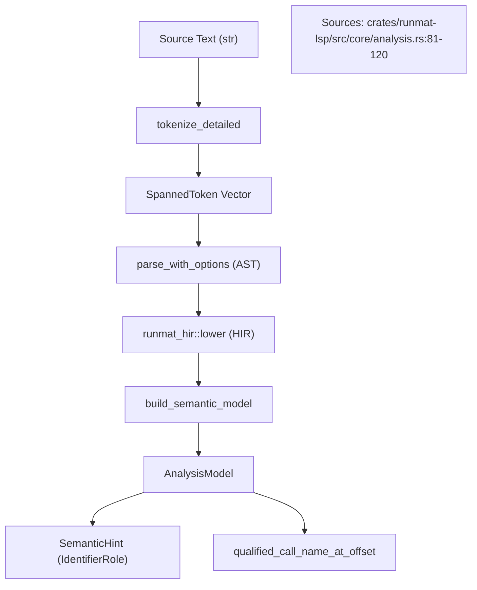
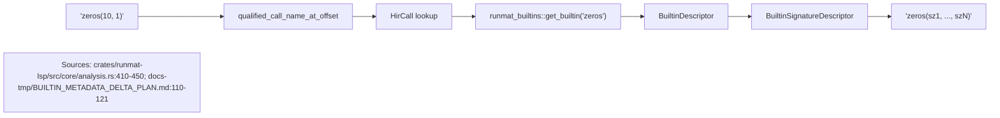

# Document Analysis & Semantic Hints

<details>
<summary>Relevant source files</summary>

- [crates/runmat-lsp/src/core/analysis.rs](https://github.com/runmat-org/runmat/blob/82685330/crates/runmat-lsp/src/core/analysis.rs)
- [docs-tmp/BUILTIN_METADATA_DELTA_PLAN.md](https://github.com/runmat-org/runmat/blob/82685330/docs-tmp/BUILTIN_METADATA_DELTA_PLAN.md?plain=1)
- [docs-tmp/BUILTIN_METADATA_DELTA_PROGRESS.md](https://github.com/runmat-org/runmat/blob/82685330/docs-tmp/BUILTIN_METADATA_DELTA_PROGRESS.md?plain=1)

</details>

The Document Analysis subsystem is the core of RunMat's Language Server Protocol (LSP) integration. It provides the necessary infrastructure to transform raw MATLAB source text into a rich semantic model that supports features like hover documentation, signature help, and semantic syntax highlighting.

## The Analysis Pipeline

The primary entry point for document processing is `analyze_document_with_compat_and_source`. This function orchestrates a multi-stage pipeline that bridges the gap between raw text and semantic entities.

### Data Flow

1. Tokenization: The source text is passed to `runmat_lexer::tokenize_detailed` to produce a vector of `SpannedToken` objects [crates/runmat-lsp/src/core/analysis.rs #86](https://github.com/runmat-org/runmat/blob/82685330/crates/runmat-lsp/src/core/analysis.rs#L86-L86)
2. Symbol Discovery: The system identifies known project symbols (functions, classes, variables) based on the source file's location [crates/runmat-lsp/src/core/analysis.rs #87](https://github.com/runmat-org/runmat/blob/82685330/crates/runmat-lsp/src/core/analysis.rs#L87-L87)
3. Parsing: The text is parsed into an AST using `runmat_parser::parse_with_options`, respecting the configured `CompatMode` [crates/runmat-lsp/src/core/analysis.rs #88](https://github.com/runmat-org/runmat/blob/82685330/crates/runmat-lsp/src/core/analysis.rs#L88-L88)
4. HIR Lowering: The AST is lowered to High-Level IR (HIR). This stage performs initial scope resolution and identifies bindings [crates/runmat-lsp/src/core/analysis.rs #96](https://github.com/runmat-org/runmat/blob/82685330/crates/runmat-lsp/src/core/analysis.rs#L96-L96)
5. Semantic Modeling: The `build_semantic_model` function processes the HIR and tokens to create an `AnalysisModel` [crates/runmat-lsp/src/core/analysis.rs #111](https://github.com/runmat-org/runmat/blob/82685330/crates/runmat-lsp/src/core/analysis.rs#L111-L111)

### Analysis Pipeline Architecture

The following diagram illustrates how the `DocumentAnalysis` pipeline transitions from "Natural Language Space" (raw source) to "Code Entity Space" (HIR and Semantic Hints).

| Component | Role | Source |
| --- | --- | --- |
| DocumentAnalysis | Container for tokens, errors, and semantic results. | crates/runmat-lsp/src/core/analysis.rs#24-31 |
| LoweringContext | State machine for HIR lowering with extension support. | crates/runmat-lsp/src/core/analysis.rs#90-91 |
| AnalysisModel | Maps text offsets to semantic hints and call information. | crates/runmat-lsp/src/core/analysis.rs#232-243 |



<details>
<summary>Rendered SVG</summary>

```svg
<svg id="mermaid-sku12frg13" xmlns="http://www.w3.org/2000/svg" xmlns:xlink="http://www.w3.org/1999/xlink" class="flowchart" style="max-width: 100%; touch-action: none; user-select: none; cursor: grab; min-height: fit-content; max-height: 100%;" viewBox="-0.003806561641169992 -5.684341886080802e-14 779.9607381232823 970.0000000000001" role="graphics-document document" aria-roledescription="flowchart-v2" preserveAspectRatio="xMidYMid meet"><style>#mermaid-sku12frg13{font-family:ui-sans-serif,-apple-system,system-ui,Segoe UI,Helvetica;font-size:16px;fill:#ccc;}@keyframes edge-animation-frame{from{stroke-dashoffset:0;}}@keyframes dash{to{stroke-dashoffset:0;}}#mermaid-sku12frg13 .edge-animation-slow{stroke-dasharray:9,5!important;stroke-dashoffset:900;animation:dash 50s linear infinite;stroke-linecap:round;}#mermaid-sku12frg13 .edge-animation-fast{stroke-dasharray:9,5!important;stroke-dashoffset:900;animation:dash 20s linear infinite;stroke-linecap:round;}#mermaid-sku12frg13 .error-icon{fill:#333;}#mermaid-sku12frg13 .error-text{fill:#cccccc;stroke:#cccccc;}#mermaid-sku12frg13 .edge-thickness-normal{stroke-width:1px;}#mermaid-sku12frg13 .edge-thickness-thick{stroke-width:3.5px;}#mermaid-sku12frg13 .edge-pattern-solid{stroke-dasharray:0;}#mermaid-sku12frg13 .edge-thickness-invisible{stroke-width:0;fill:none;}#mermaid-sku12frg13 .edge-pattern-dashed{stroke-dasharray:3;}#mermaid-sku12frg13 .edge-pattern-dotted{stroke-dasharray:2;}#mermaid-sku12frg13 .marker{fill:#666;stroke:#666;}#mermaid-sku12frg13 .marker.cross{stroke:#666;}#mermaid-sku12frg13 svg{font-family:ui-sans-serif,-apple-system,system-ui,Segoe UI,Helvetica;font-size:16px;}#mermaid-sku12frg13 p{margin:0;}#mermaid-sku12frg13 .label{font-family:ui-sans-serif,-apple-system,system-ui,Segoe UI,Helvetica;color:#fff;}#mermaid-sku12frg13 .cluster-label text{fill:#fff;}#mermaid-sku12frg13 .cluster-label span{color:#fff;}#mermaid-sku12frg13 .cluster-label span p{background-color:transparent;}#mermaid-sku12frg13 .label text,#mermaid-sku12frg13 span{fill:#fff;color:#fff;}#mermaid-sku12frg13 .node rect,#mermaid-sku12frg13 .node circle,#mermaid-sku12frg13 .node ellipse,#mermaid-sku12frg13 .node polygon,#mermaid-sku12frg13 .node path{fill:#111;stroke:#222;stroke-width:1px;}#mermaid-sku12frg13 .rough-node .label text,#mermaid-sku12frg13 .node .label text,#mermaid-sku12frg13 .image-shape .label,#mermaid-sku12frg13 .icon-shape .label{text-anchor:middle;}#mermaid-sku12frg13 .node .katex path{fill:#000;stroke:#000;stroke-width:1px;}#mermaid-sku12frg13 .rough-node .label,#mermaid-sku12frg13 .node .label,#mermaid-sku12frg13 .image-shape .label,#mermaid-sku12frg13 .icon-shape .label{text-align:center;}#mermaid-sku12frg13 .node.clickable{cursor:pointer;}#mermaid-sku12frg13 .root .anchor path{fill:#666!important;stroke-width:0;stroke:#666;}#mermaid-sku12frg13 .arrowheadPath{fill:#0b0b0b;}#mermaid-sku12frg13 .edgePath .path{stroke:#666;stroke-width:1px;}#mermaid-sku12frg13 .flowchart-link{stroke:#666;fill:none;}#mermaid-sku12frg13 .edgeLabel{background-color:#161616;text-align:center;}#mermaid-sku12frg13 .edgeLabel p{background-color:#161616;}#mermaid-sku12frg13 .edgeLabel rect{opacity:0.5;background-color:#161616;fill:#161616;}#mermaid-sku12frg13 .labelBkg{background-color:rgba(22, 22, 22, 0.5);}#mermaid-sku12frg13 .cluster rect{fill:#161616;stroke:#222;stroke-width:1px;}#mermaid-sku12frg13 .cluster text{fill:#fff;}#mermaid-sku12frg13 .cluster span{color:#fff;}#mermaid-sku12frg13 div.mermaidTooltip{position:absolute;text-align:center;max-width:200px;padding:2px;font-family:ui-sans-serif,-apple-system,system-ui,Segoe UI,Helvetica;font-size:12px;background:#333;border:1px solid hsl(0, 0%, 10%);border-radius:2px;pointer-events:none;z-index:100;}#mermaid-sku12frg13 .flowchartTitleText{text-anchor:middle;font-size:18px;fill:#ccc;}#mermaid-sku12frg13 rect.text{fill:none;stroke-width:0;}#mermaid-sku12frg13 .icon-shape,#mermaid-sku12frg13 .image-shape{background-color:#161616;text-align:center;}#mermaid-sku12frg13 .icon-shape p,#mermaid-sku12frg13 .image-shape p{background-color:#161616;padding:2px;}#mermaid-sku12frg13 .icon-shape .label rect,#mermaid-sku12frg13 .image-shape .label rect{opacity:0.5;background-color:#161616;fill:#161616;}#mermaid-sku12frg13 .label-icon{display:inline-block;height:1em;overflow:visible;vertical-align:-0.125em;}#mermaid-sku12frg13 .node .label-icon path{fill:currentColor;stroke:revert;stroke-width:revert;}#mermaid-sku12frg13 .node .neo-node{stroke:#222;}#mermaid-sku12frg13 [data-look="neo"].node rect,#mermaid-sku12frg13 [data-look="neo"].cluster rect,#mermaid-sku12frg13 [data-look="neo"].node polygon{stroke:url(#mermaid-sku12frg13-gradient);filter:drop-shadow( 1px 2px 2px rgba(185,185,185,1));}#mermaid-sku12frg13 [data-look="neo"].node path{stroke:url(#mermaid-sku12frg13-gradient);stroke-width:1px;}#mermaid-sku12frg13 [data-look="neo"].node .outer-path{filter:drop-shadow( 1px 2px 2px rgba(185,185,185,1));}#mermaid-sku12frg13 [data-look="neo"].node .neo-line path{stroke:#222;filter:none;}#mermaid-sku12frg13 [data-look="neo"].node circle{stroke:url(#mermaid-sku12frg13-gradient);filter:drop-shadow( 1px 2px 2px rgba(185,185,185,1));}#mermaid-sku12frg13 [data-look="neo"].node circle .state-start{fill:#000000;}#mermaid-sku12frg13 [data-look="neo"].icon-shape .icon{fill:url(#mermaid-sku12frg13-gradient);filter:drop-shadow( 1px 2px 2px rgba(185,185,185,1));}#mermaid-sku12frg13 [data-look="neo"].icon-shape .icon-neo path{stroke:url(#mermaid-sku12frg13-gradient);filter:drop-shadow( 1px 2px 2px rgba(185,185,185,1));}#mermaid-sku12frg13 :root{--mermaid-font-family:"trebuchet ms",verdana,arial,sans-serif;}</style><g><marker id="mermaid-sku12frg13_flowchart-v2-pointEnd" class="marker flowchart-v2" viewBox="0 0 10 10" refX="5" refY="5" markerUnits="userSpaceOnUse" markerWidth="8" markerHeight="8" orient="auto"><path d="M 0 0 L 10 5 L 0 10 z" class="arrowMarkerPath" style="stroke-width: 1; stroke-dasharray: 1, 0;"></path></marker><marker id="mermaid-sku12frg13_flowchart-v2-pointStart" class="marker flowchart-v2" viewBox="0 0 10 10" refX="4.5" refY="5" markerUnits="userSpaceOnUse" markerWidth="8" markerHeight="8" orient="auto"><path d="M 0 5 L 10 10 L 10 0 z" class="arrowMarkerPath" style="stroke-width: 1; stroke-dasharray: 1, 0;"></path></marker><marker id="mermaid-sku12frg13_flowchart-v2-pointEnd-margin" class="marker flowchart-v2" viewBox="0 0 11.5 14" refX="11.5" refY="7" markerUnits="userSpaceOnUse" markerWidth="10.5" markerHeight="14" orient="auto"><path d="M 0 0 L 11.5 7 L 0 14 z" class="arrowMarkerPath" style="stroke-width: 0; stroke-dasharray: 1, 0;"></path></marker><marker id="mermaid-sku12frg13_flowchart-v2-pointStart-margin" class="marker flowchart-v2" viewBox="0 0 11.5 14" refX="1" refY="7" markerUnits="userSpaceOnUse" markerWidth="11.5" markerHeight="14" orient="auto"><polygon points="0,7 11.5,14 11.5,0" class="arrowMarkerPath" style="stroke-width: 0; stroke-dasharray: 1, 0;"></polygon></marker><marker id="mermaid-sku12frg13_flowchart-v2-circleEnd" class="marker flowchart-v2" viewBox="0 0 10 10" refX="11" refY="5" markerUnits="userSpaceOnUse" markerWidth="11" markerHeight="11" orient="auto"><circle cx="5" cy="5" r="5" class="arrowMarkerPath" style="stroke-width: 1; stroke-dasharray: 1, 0;"></circle></marker><marker id="mermaid-sku12frg13_flowchart-v2-circleStart" class="marker flowchart-v2" viewBox="0 0 10 10" refX="-1" refY="5" markerUnits="userSpaceOnUse" markerWidth="11" markerHeight="11" orient="auto"><circle cx="5" cy="5" r="5" class="arrowMarkerPath" style="stroke-width: 1; stroke-dasharray: 1, 0;"></circle></marker><marker id="mermaid-sku12frg13_flowchart-v2-circleEnd-margin" class="marker flowchart-v2" viewBox="0 0 10 10" refY="5" refX="12.25" markerUnits="userSpaceOnUse" markerWidth="14" markerHeight="14" orient="auto"><circle cx="5" cy="5" r="5" class="arrowMarkerPath" style="stroke-width: 0; stroke-dasharray: 1, 0;"></circle></marker><marker id="mermaid-sku12frg13_flowchart-v2-circleStart-margin" class="marker flowchart-v2" viewBox="0 0 10 10" refX="-2" refY="5" markerUnits="userSpaceOnUse" markerWidth="14" markerHeight="14" orient="auto"><circle cx="5" cy="5" r="5" class="arrowMarkerPath" style="stroke-width: 0; stroke-dasharray: 1, 0;"></circle></marker><marker id="mermaid-sku12frg13_flowchart-v2-crossEnd" class="marker cross flowchart-v2" viewBox="0 0 11 11" refX="12" refY="5.2" markerUnits="userSpaceOnUse" markerWidth="11" markerHeight="11" orient="auto"><path d="M 1,1 l 9,9 M 10,1 l -9,9" class="arrowMarkerPath" style="stroke-width: 2; stroke-dasharray: 1, 0;"></path></marker><marker id="mermaid-sku12frg13_flowchart-v2-crossStart" class="marker cross flowchart-v2" viewBox="0 0 11 11" refX="-1" refY="5.2" markerUnits="userSpaceOnUse" markerWidth="11" markerHeight="11" orient="auto"><path d="M 1,1 l 9,9 M 10,1 l -9,9" class="arrowMarkerPath" style="stroke-width: 2; stroke-dasharray: 1, 0;"></path></marker><marker id="mermaid-sku12frg13_flowchart-v2-crossEnd-margin" class="marker cross flowchart-v2" viewBox="0 0 15 15" refX="17.7" refY="7.5" markerUnits="userSpaceOnUse" markerWidth="12" markerHeight="12" orient="auto"><path d="M 1,1 L 14,14 M 1,14 L 14,1" class="arrowMarkerPath" style="stroke-width: 2.5;"></path></marker><marker id="mermaid-sku12frg13_flowchart-v2-crossStart-margin" class="marker cross flowchart-v2" viewBox="0 0 15 15" refX="-3.5" refY="7.5" markerUnits="userSpaceOnUse" markerWidth="12" markerHeight="12" orient="auto"><path d="M 1,1 L 14,14 M 1,14 L 14,1" class="arrowMarkerPath" style="stroke-width: 2.5; stroke-dasharray: 1, 0;"></path></marker><g class="root"><g class="clusters"><g class="cluster" id="mermaid-sku12frg13-subGraph1" data-look="classic"><rect style="" x="8" y="418" width="657.21875" height="544"></rect><g class="cluster-label" transform="translate(269.8203125, 418)"><foreignObject width="133.578125" height="24"><div style="display: table-cell; white-space: nowrap; line-height: 1.5;" xmlns="http://www.w3.org/1999/xhtml"><span class="nodeLabel"><p>Code Entity Space</p></span></div></foreignObject></g></g><g class="cluster" id="mermaid-sku12frg13-subGraph0" data-look="classic"><rect style="" x="187.65625" y="8" width="289.296875" height="360"></rect><g class="cluster-label" transform="translate(243.359375, 8)"><foreignObject width="177.890625" height="24"><div style="display: table-cell; white-space: nowrap; line-height: 1.5;" xmlns="http://www.w3.org/1999/xhtml"><span class="nodeLabel"><p>Natural Language Space</p></span></div></foreignObject></g></g></g><g class="edgePaths"><path d="M332.305,111L332.305,119.167C332.305,127.333,332.305,143.667,332.305,155.333C332.305,167,332.305,174,332.305,177.5L332.305,181" id="mermaid-sku12frg13-L_A_B_0" class="edge-thickness-normal edge-pattern-solid edge-thickness-normal edge-pattern-solid flowchart-link" style=";" data-edge="true" data-et="edge" data-id="L_A_B_0" data-points="W3sieCI6MzMyLjMwNDY4NzUsInkiOjExMX0seyJ4IjozMzIuMzA0Njg3NSwieSI6MTYwfSx7IngiOjMzMi4zMDQ2ODc1LCJ5IjoxODV9XQ==" data-look="classic" marker-end="url(#mermaid-sku12frg13_flowchart-v2-pointEnd)"></path><path d="M332.305,239L332.305,243.167C332.305,247.333,332.305,255.667,332.305,263.333C332.305,271,332.305,278,332.305,281.5L332.305,285" id="mermaid-sku12frg13-L_B_C_0" class="edge-thickness-normal edge-pattern-solid edge-thickness-normal edge-pattern-solid flowchart-link" style=";" data-edge="true" data-et="edge" data-id="L_B_C_0" data-points="W3sieCI6MzMyLjMwNDY4NzUsInkiOjIzOX0seyJ4IjozMzIuMzA0Njg3NSwieSI6MjY0fSx7IngiOjMzMi4zMDQ2ODc1LCJ5IjoyODl9XQ==" data-look="classic" marker-end="url(#mermaid-sku12frg13_flowchart-v2-pointEnd)"></path><path d="M332.305,343L332.305,347.167C332.305,351.333,332.305,359.667,332.305,368C332.305,376.333,332.305,384.667,332.305,393C332.305,401.333,332.305,409.667,332.305,417.333C332.305,425,332.305,432,332.305,435.5L332.305,439" id="mermaid-sku12frg13-L_C_D_0" class="edge-thickness-normal edge-pattern-solid edge-thickness-normal edge-pattern-solid flowchart-link" style=";" data-edge="true" data-et="edge" data-id="L_C_D_0" data-points="W3sieCI6MzMyLjMwNDY4NzUsInkiOjM0M30seyJ4IjozMzIuMzA0Njg3NSwieSI6MzY4fSx7IngiOjMzMi4zMDQ2ODc1LCJ5IjozOTN9LHsieCI6MzMyLjMwNDY4NzUsInkiOjQxOH0seyJ4IjozMzIuMzA0Njg3NSwieSI6NDQzfV0=" data-look="classic" marker-end="url(#mermaid-sku12frg13_flowchart-v2-pointEnd)"></path><path d="M332.305,497L332.305,501.167C332.305,505.333,332.305,513.667,332.305,521.333C332.305,529,332.305,536,332.305,539.5L332.305,543" id="mermaid-sku12frg13-L_D_E_0" class="edge-thickness-normal edge-pattern-solid edge-thickness-normal edge-pattern-solid flowchart-link" style=";" data-edge="true" data-et="edge" data-id="L_D_E_0" data-points="W3sieCI6MzMyLjMwNDY4NzUsInkiOjQ5N30seyJ4IjozMzIuMzA0Njg3NSwieSI6NTIyfSx7IngiOjMzMi4zMDQ2ODc1LCJ5Ijo1NDd9XQ==" data-look="classic" marker-end="url(#mermaid-sku12frg13_flowchart-v2-pointEnd)"></path><path d="M332.305,601L332.305,605.167C332.305,609.333,332.305,617.667,332.305,625.333C332.305,633,332.305,640,332.305,643.5L332.305,647" id="mermaid-sku12frg13-L_E_F_0" class="edge-thickness-normal edge-pattern-solid edge-thickness-normal edge-pattern-solid flowchart-link" style=";" data-edge="true" data-et="edge" data-id="L_E_F_0" data-points="W3sieCI6MzMyLjMwNDY4NzUsInkiOjYwMX0seyJ4IjozMzIuMzA0Njg3NSwieSI6NjI2fSx7IngiOjMzMi4zMDQ2ODc1LCJ5Ijo2NTF9XQ==" data-look="classic" marker-end="url(#mermaid-sku12frg13_flowchart-v2-pointEnd)"></path><path d="M332.305,705L332.305,709.167C332.305,713.333,332.305,721.667,332.305,729.333C332.305,737,332.305,744,332.305,747.5L332.305,751" id="mermaid-sku12frg13-L_F_G_0" class="edge-thickness-normal edge-pattern-solid edge-thickness-normal edge-pattern-solid flowchart-link" style=";" data-edge="true" data-et="edge" data-id="L_F_G_0" data-points="W3sieCI6MzMyLjMwNDY4NzUsInkiOjcwNX0seyJ4IjozMzIuMzA0Njg3NSwieSI6NzMwfSx7IngiOjMzMi4zMDQ2ODc1LCJ5Ijo3NTV9XQ==" data-look="classic" marker-end="url(#mermaid-sku12frg13_flowchart-v2-pointEnd)"></path><path d="M250.031,808.856L237.193,813.046C224.354,817.237,198.677,825.619,185.839,833.309C173,841,173,848,173,851.5L173,855" id="mermaid-sku12frg13-L_G_H_0" class="edge-thickness-normal edge-pattern-solid edge-thickness-normal edge-pattern-solid flowchart-link" style=";" data-edge="true" data-et="edge" data-id="L_G_H_0" data-points="W3sieCI6MjUwLjAzMTI1LCJ5Ijo4MDguODU1NTczNTM3MzQ0OX0seyJ4IjoxNzMsInkiOjgzNH0seyJ4IjoxNzMsInkiOjg1OX1d" data-look="classic" marker-end="url(#mermaid-sku12frg13_flowchart-v2-pointEnd)"></path><path d="M414.578,808.856L427.417,813.046C440.255,817.237,465.932,825.619,478.771,835.309C491.609,845,491.609,856,491.609,861.5L491.609,867" id="mermaid-sku12frg13-L_G_I_0" class="edge-thickness-normal edge-pattern-solid edge-thickness-normal edge-pattern-solid flowchart-link" style=";" data-edge="true" data-et="edge" data-id="L_G_I_0" data-points="W3sieCI6NDE0LjU3ODEyNSwieSI6ODA4Ljg1NTU3MzUzNzM0NDl9LHsieCI6NDkxLjYwOTM3NSwieSI6ODM0fSx7IngiOjQ5MS42MDkzNzUsInkiOjg3MX1d" data-look="classic" marker-end="url(#mermaid-sku12frg13_flowchart-v2-pointEnd)"></path></g><g class="edgeLabels"><g class="edgeLabel"><g class="label" data-id="L_A_B_0" transform="translate(0, 0)"><foreignObject width="0" height="0"><div style="display: table-cell; white-space: nowrap; line-height: 1.5; max-width: 200px; text-align: center;" xmlns="http://www.w3.org/1999/xhtml" class="labelBkg"><span class="edgeLabel"></span></div></foreignObject></g></g><g class="edgeLabel"><g class="label" data-id="L_B_C_0" transform="translate(0, 0)"><foreignObject width="0" height="0"><div style="display: table-cell; white-space: nowrap; line-height: 1.5; max-width: 200px; text-align: center;" xmlns="http://www.w3.org/1999/xhtml" class="labelBkg"><span class="edgeLabel"></span></div></foreignObject></g></g><g class="edgeLabel"><g class="label" data-id="L_C_D_0" transform="translate(0, 0)"><foreignObject width="0" height="0"><div style="display: table-cell; white-space: nowrap; line-height: 1.5; max-width: 200px; text-align: center;" xmlns="http://www.w3.org/1999/xhtml" class="labelBkg"><span class="edgeLabel"></span></div></foreignObject></g></g><g class="edgeLabel"><g class="label" data-id="L_D_E_0" transform="translate(0, 0)"><foreignObject width="0" height="0"><div style="display: table-cell; white-space: nowrap; line-height: 1.5; max-width: 200px; text-align: center;" xmlns="http://www.w3.org/1999/xhtml" class="labelBkg"><span class="edgeLabel"></span></div></foreignObject></g></g><g class="edgeLabel"><g class="label" data-id="L_E_F_0" transform="translate(0, 0)"><foreignObject width="0" height="0"><div style="display: table-cell; white-space: nowrap; line-height: 1.5; max-width: 200px; text-align: center;" xmlns="http://www.w3.org/1999/xhtml" class="labelBkg"><span class="edgeLabel"></span></div></foreignObject></g></g><g class="edgeLabel"><g class="label" data-id="L_F_G_0" transform="translate(0, 0)"><foreignObject width="0" height="0"><div style="display: table-cell; white-space: nowrap; line-height: 1.5; max-width: 200px; text-align: center;" xmlns="http://www.w3.org/1999/xhtml" class="labelBkg"><span class="edgeLabel"></span></div></foreignObject></g></g><g class="edgeLabel"><g class="label" data-id="L_G_H_0" transform="translate(0, 0)"><foreignObject width="0" height="0"><div style="display: table-cell; white-space: nowrap; line-height: 1.5; max-width: 200px; text-align: center;" xmlns="http://www.w3.org/1999/xhtml" class="labelBkg"><span class="edgeLabel"></span></div></foreignObject></g></g><g class="edgeLabel"><g class="label" data-id="L_G_I_0" transform="translate(0, 0)"><foreignObject width="0" height="0"><div style="display: table-cell; white-space: nowrap; line-height: 1.5; max-width: 200px; text-align: center;" xmlns="http://www.w3.org/1999/xhtml" class="labelBkg"><span class="edgeLabel"></span></div></foreignObject></g></g></g><g class="nodes"><g class="node default" id="mermaid-sku12frg13-flowchart-A-0" data-look="classic" transform="translate(332.3046875, 84)"><rect class="basic label-container" style="" x="-90.328125" y="-27" width="180.65625" height="54"></rect><g class="label" style="" transform="translate(-60.328125, -12)"><rect></rect><foreignObject width="120.65625" height="24"><div style="display: table-cell; white-space: nowrap; line-height: 1.5; max-width: 200px; text-align: center;" xmlns="http://www.w3.org/1999/xhtml"><span class="nodeLabel"><p>Source Text (str)</p></span></div></foreignObject></g></g><g class="node default" id="mermaid-sku12frg13-flowchart-B-1" data-look="classic" transform="translate(332.3046875, 212)"><rect class="basic label-container" style="" x="-93.6171875" y="-27" width="187.234375" height="54"></rect><g class="label" style="" transform="translate(-63.6171875, -12)"><rect></rect><foreignObject width="127.234375" height="24"><div style="display: table-cell; white-space: nowrap; line-height: 1.5; max-width: 200px; text-align: center;" xmlns="http://www.w3.org/1999/xhtml"><span class="nodeLabel"><p>tokenize_detailed</p></span></div></foreignObject></g></g><g class="node default" id="mermaid-sku12frg13-flowchart-C-3" data-look="classic" transform="translate(332.3046875, 316)"><rect class="basic label-container" style="" x="-109.6484375" y="-27" width="219.296875" height="54"></rect><g class="label" style="" transform="translate(-79.6484375, -12)"><rect></rect><foreignObject width="159.296875" height="24"><div style="display: table-cell; white-space: nowrap; line-height: 1.5; max-width: 200px; text-align: center;" xmlns="http://www.w3.org/1999/xhtml"><span class="nodeLabel"><p>SpannedToken Vector</p></span></div></foreignObject></g></g><g class="node default" id="mermaid-sku12frg13-flowchart-D-5" data-look="classic" transform="translate(332.3046875, 470)"><rect class="basic label-container" style="" x="-123.3359375" y="-27" width="246.671875" height="54"></rect><g class="label" style="" transform="translate(-93.3359375, -12)"><rect></rect><foreignObject width="186.671875" height="24"><div style="display: table-cell; white-space: nowrap; line-height: 1.5; max-width: 200px; text-align: center;" xmlns="http://www.w3.org/1999/xhtml"><span class="nodeLabel"><p>parse_with_options (AST)</p></span></div></foreignObject></g></g><g class="node default" id="mermaid-sku12frg13-flowchart-E-7" data-look="classic" transform="translate(332.3046875, 574)"><rect class="basic label-container" style="" x="-114.1328125" y="-27" width="228.265625" height="54"></rect><g class="label" style="" transform="translate(-84.1328125, -12)"><rect></rect><foreignObject width="168.265625" height="24"><div style="display: table-cell; white-space: nowrap; line-height: 1.5; max-width: 200px; text-align: center;" xmlns="http://www.w3.org/1999/xhtml"><span class="nodeLabel"><p>runmat_hir::lower (HIR)</p></span></div></foreignObject></g></g><g class="node default" id="mermaid-sku12frg13-flowchart-F-9" data-look="classic" transform="translate(332.3046875, 678)"><rect class="basic label-container" style="" x="-111.8671875" y="-27" width="223.734375" height="54"></rect><g class="label" style="" transform="translate(-81.8671875, -12)"><rect></rect><foreignObject width="163.734375" height="24"><div style="display: table-cell; white-space: nowrap; line-height: 1.5; max-width: 200px; text-align: center;" xmlns="http://www.w3.org/1999/xhtml"><span class="nodeLabel"><p>build_semantic_model</p></span></div></foreignObject></g></g><g class="node default" id="mermaid-sku12frg13-flowchart-G-11" data-look="classic" transform="translate(332.3046875, 782)"><rect class="basic label-container" style="" x="-82.2734375" y="-27" width="164.546875" height="54"></rect><g class="label" style="" transform="translate(-52.2734375, -12)"><rect></rect><foreignObject width="104.546875" height="24"><div style="display: table-cell; white-space: nowrap; line-height: 1.5; max-width: 200px; text-align: center;" xmlns="http://www.w3.org/1999/xhtml"><span class="nodeLabel"><p>AnalysisModel</p></span></div></foreignObject></g></g><g class="node default" id="mermaid-sku12frg13-flowchart-H-13" data-look="classic" transform="translate(173, 898)"><rect class="basic label-container" style="" x="-130" y="-39" width="260" height="78"></rect><g class="label" style="" transform="translate(-100, -24)"><rect></rect><foreignObject width="200" height="48"><div style="display: table; white-space: break-spaces; line-height: 1.5; max-width: 200px; text-align: center; width: 200px;" xmlns="http://www.w3.org/1999/xhtml"><span class="nodeLabel"><p>SemanticHint (IdentifierRole)</p></span></div></foreignObject></g></g><g class="node default" id="mermaid-sku12frg13-flowchart-I-15" data-look="classic" transform="translate(491.609375, 898)"><rect class="basic label-container" style="" x="-138.609375" y="-27" width="277.21875" height="54"></rect><g class="label" style="" transform="translate(-108.609375, -12)"><rect></rect><foreignObject width="217.21875" height="24"><div style="display: table; white-space: break-spaces; line-height: 1.5; max-width: 200px; text-align: center; width: 200px;" xmlns="http://www.w3.org/1999/xhtml"><span class="nodeLabel"><p>qualified_call_name_at_offset</p></span></div></foreignObject></g></g><g class="node default" id="mermaid-sku12frg13-flowchart-Sources-16" data-look="classic" transform="translate(641.953125, 84)"><rect class="basic label-container" style="" x="-130" y="-51" width="260" height="102"></rect><g class="label" style="" transform="translate(-100, -36)"><rect></rect><foreignObject width="200" height="72"><div style="display: table; white-space: break-spaces; line-height: 1.5; max-width: 200px; text-align: center; width: 200px;" xmlns="http://www.w3.org/1999/xhtml"><span class="nodeLabel"><p>Sources: crates/runmat-lsp/src/core/analysis.rs:81-120</p></span></div></foreignObject></g></g></g></g></g><defs><filter id="mermaid-sku12frg13-drop-shadow" height="130%" width="130%"><feDropShadow dx="4" dy="4" stdDeviation="0" flood-opacity="0.06" flood-color="#000000"></feDropShadow></filter></defs><defs><filter id="mermaid-sku12frg13-drop-shadow-small" height="150%" width="150%"><feDropShadow dx="2" dy="2" stdDeviation="0" flood-opacity="0.06" flood-color="#000000"></feDropShadow></filter></defs><linearGradient id="mermaid-sku12frg13-gradient" gradientUnits="objectBoundingBox" x1="0%" y1="0%" x2="100%" y2="0%"><stop offset="0%" stop-color="#333" stop-opacity="1"></stop><stop offset="100%" stop-color="hsl(-120, 0%, 3.3333333333%)" stop-opacity="1"></stop></linearGradient></svg>
```

</details>

Sources: [crates/runmat-lsp/src/core/analysis.rs #81-120](https://github.com/runmat-org/runmat/blob/82685330/crates/runmat-lsp/src/core/analysis.rs#L81-L120) [crates/runmat-lsp/src/core/analysis.rs #24-31](https://github.com/runmat-org/runmat/blob/82685330/crates/runmat-lsp/src/core/analysis.rs#L24-L31) [crates/runmat-lsp/src/core/analysis.rs #232-243](https://github.com/runmat-org/runmat/blob/82685330/crates/runmat-lsp/src/core/analysis.rs#L232-L243)

---

## Semantic Hints & Identifier Roles

Semantic hints are generated by `build_semantic_hints` to provide the LSP with information about the role of every identifier in the code. This is used for semantic tokens (highlighting) and determining the context for user interactions.

### IdentifierRole Mapping

The system maps HIR bindings and references to specific `IdentifierRole` categories:

| IdentifierRole | HIR Entity / Condition |
| --- | --- |
| Function | ReferenceKind::Function or ReferenceKind::Method crates/runmat-lsp/src/core/analysis.rs#565-566 |
| Variable | ReferenceKind::Variable or ReferenceKind::Argument crates/runmat-lsp/src/core/analysis.rs#563-564 |
| Builtin | Successfully resolved via runmat_builtins::get_builtin crates/runmat-lsp/src/core/analysis.rs#570-571 |
| Keyword | Token matches MATLAB/RunMat reserved keywords. |
| Namespace | Part of a package or class-qualified call (e.g., pkg.func). |

### Binding Shape Inference

During hint generation, the system attempts to infer the "shape" of bindings. If a binding refers to a known builtin or a user-defined function, the hint is updated to reflect its callable nature. This allows the LSP to distinguish between a variable named `max` and the builtin function `max` [crates/runmat-lsp/src/core/analysis.rs #570-580](https://github.com/runmat-org/runmat/blob/82685330/crates/runmat-lsp/src/core/analysis.rs#L570-L580)

Sources: [crates/runmat-lsp/src/core/analysis.rs #550-600](https://github.com/runmat-org/runmat/blob/82685330/crates/runmat-lsp/src/core/analysis.rs#L550-L600) [crates/runmat-lsp/src/core/semantic_tokens.rs #10-25](https://github.com/runmat-org/runmat/blob/82685330/crates/runmat-lsp/src/core/semantic_tokens.rs#L10-L25)

---

## Call Resolution & Namespaced Builtins

A critical task for the analysis engine is correctly identifying which function is being called at a specific text offset, especially when namespaces (packages) are involved.

### qualified_call_name_at_offset

This function resolves namespaced builtins and user functions by looking up the call site in the `AnalysisModel`.

1. Offset Lookup: Finds the token at the current cursor position.
2. Namespace Traversal: If the token is part of a `.` access (e.g., `parallel.pool.Constant`), it traverses the HIR call structure to find the fully qualified name [crates/runmat-lsp/src/core/analysis.rs #420-440](https://github.com/runmat-org/runmat/blob/82685330/crates/runmat-lsp/src/core/analysis.rs#L420-L440)
3. Builtin Validation: It checks the resolved name against the `runmat_builtins` registry to see if a `BuiltinDescriptor` exists [crates/runmat-lsp/src/core/analysis.rs #445-450](https://github.com/runmat-org/runmat/blob/82685330/crates/runmat-lsp/src/core/analysis.rs#L445-L450)

### Builtin Descriptor Integration

The `BuiltinDescriptor` (defined in `runmat-builtins`) provides the "Source of Truth" for signatures and metadata [docs-tmp/BUILTIN_METADATA_DELTA_PLAN.md #43-46](https://github.com/runmat-org/runmat/blob/82685330/docs-tmp/BUILTIN_METADATA_DELTA_PLAN.md?plain=1#L43-L46) The analysis model uses these descriptors to power:

- Hover: Displays the `summary` and `label` from the descriptor [docs-tmp/BUILTIN_METADATA_DELTA_PLAN.md #53-56](https://github.com/runmat-org/runmat/blob/82685330/docs-tmp/BUILTIN_METADATA_DELTA_PLAN.md?plain=1#L53-L56)
- Signature Help: Uses the `signatures` array to show active parameter indices [docs-tmp/BUILTIN_METADATA_DELTA_PLAN.md #110-121](https://github.com/runmat-org/runmat/blob/82685330/docs-tmp/BUILTIN_METADATA_DELTA_PLAN.md?plain=1#L110-L121)

### Semantic Entity Resolution

This diagram shows how a raw call in text is resolved to a `BuiltinDescriptor` via the `AnalysisModel`.



<details>
<summary>Rendered SVG</summary>

```svg
<svg id="mermaid-w1vkt7z820n" xmlns="http://www.w3.org/2000/svg" xmlns:xlink="http://www.w3.org/1999/xlink" class="flowchart" style="max-width: 100%; touch-action: none; user-select: none; cursor: grab; min-height: fit-content; max-height: 100%;" viewBox="-0.0213400263951371 0 2324.4645550527903 301" role="graphics-document document" aria-roledescription="flowchart-v2" preserveAspectRatio="xMidYMid meet"><style>#mermaid-w1vkt7z820n{font-family:ui-sans-serif,-apple-system,system-ui,Segoe UI,Helvetica;font-size:16px;fill:#ccc;}@keyframes edge-animation-frame{from{stroke-dashoffset:0;}}@keyframes dash{to{stroke-dashoffset:0;}}#mermaid-w1vkt7z820n .edge-animation-slow{stroke-dasharray:9,5!important;stroke-dashoffset:900;animation:dash 50s linear infinite;stroke-linecap:round;}#mermaid-w1vkt7z820n .edge-animation-fast{stroke-dasharray:9,5!important;stroke-dashoffset:900;animation:dash 20s linear infinite;stroke-linecap:round;}#mermaid-w1vkt7z820n .error-icon{fill:#333;}#mermaid-w1vkt7z820n .error-text{fill:#cccccc;stroke:#cccccc;}#mermaid-w1vkt7z820n .edge-thickness-normal{stroke-width:1px;}#mermaid-w1vkt7z820n .edge-thickness-thick{stroke-width:3.5px;}#mermaid-w1vkt7z820n .edge-pattern-solid{stroke-dasharray:0;}#mermaid-w1vkt7z820n .edge-thickness-invisible{stroke-width:0;fill:none;}#mermaid-w1vkt7z820n .edge-pattern-dashed{stroke-dasharray:3;}#mermaid-w1vkt7z820n .edge-pattern-dotted{stroke-dasharray:2;}#mermaid-w1vkt7z820n .marker{fill:#666;stroke:#666;}#mermaid-w1vkt7z820n .marker.cross{stroke:#666;}#mermaid-w1vkt7z820n svg{font-family:ui-sans-serif,-apple-system,system-ui,Segoe UI,Helvetica;font-size:16px;}#mermaid-w1vkt7z820n p{margin:0;}#mermaid-w1vkt7z820n .label{font-family:ui-sans-serif,-apple-system,system-ui,Segoe UI,Helvetica;color:#fff;}#mermaid-w1vkt7z820n .cluster-label text{fill:#fff;}#mermaid-w1vkt7z820n .cluster-label span{color:#fff;}#mermaid-w1vkt7z820n .cluster-label span p{background-color:transparent;}#mermaid-w1vkt7z820n .label text,#mermaid-w1vkt7z820n span{fill:#fff;color:#fff;}#mermaid-w1vkt7z820n .node rect,#mermaid-w1vkt7z820n .node circle,#mermaid-w1vkt7z820n .node ellipse,#mermaid-w1vkt7z820n .node polygon,#mermaid-w1vkt7z820n .node path{fill:#111;stroke:#222;stroke-width:1px;}#mermaid-w1vkt7z820n .rough-node .label text,#mermaid-w1vkt7z820n .node .label text,#mermaid-w1vkt7z820n .image-shape .label,#mermaid-w1vkt7z820n .icon-shape .label{text-anchor:middle;}#mermaid-w1vkt7z820n .node .katex path{fill:#000;stroke:#000;stroke-width:1px;}#mermaid-w1vkt7z820n .rough-node .label,#mermaid-w1vkt7z820n .node .label,#mermaid-w1vkt7z820n .image-shape .label,#mermaid-w1vkt7z820n .icon-shape .label{text-align:center;}#mermaid-w1vkt7z820n .node.clickable{cursor:pointer;}#mermaid-w1vkt7z820n .root .anchor path{fill:#666!important;stroke-width:0;stroke:#666;}#mermaid-w1vkt7z820n .arrowheadPath{fill:#0b0b0b;}#mermaid-w1vkt7z820n .edgePath .path{stroke:#666;stroke-width:1px;}#mermaid-w1vkt7z820n .flowchart-link{stroke:#666;fill:none;}#mermaid-w1vkt7z820n .edgeLabel{background-color:#161616;text-align:center;}#mermaid-w1vkt7z820n .edgeLabel p{background-color:#161616;}#mermaid-w1vkt7z820n .edgeLabel rect{opacity:0.5;background-color:#161616;fill:#161616;}#mermaid-w1vkt7z820n .labelBkg{background-color:rgba(22, 22, 22, 0.5);}#mermaid-w1vkt7z820n .cluster rect{fill:#161616;stroke:#222;stroke-width:1px;}#mermaid-w1vkt7z820n .cluster text{fill:#fff;}#mermaid-w1vkt7z820n .cluster span{color:#fff;}#mermaid-w1vkt7z820n div.mermaidTooltip{position:absolute;text-align:center;max-width:200px;padding:2px;font-family:ui-sans-serif,-apple-system,system-ui,Segoe UI,Helvetica;font-size:12px;background:#333;border:1px solid hsl(0, 0%, 10%);border-radius:2px;pointer-events:none;z-index:100;}#mermaid-w1vkt7z820n .flowchartTitleText{text-anchor:middle;font-size:18px;fill:#ccc;}#mermaid-w1vkt7z820n rect.text{fill:none;stroke-width:0;}#mermaid-w1vkt7z820n .icon-shape,#mermaid-w1vkt7z820n .image-shape{background-color:#161616;text-align:center;}#mermaid-w1vkt7z820n .icon-shape p,#mermaid-w1vkt7z820n .image-shape p{background-color:#161616;padding:2px;}#mermaid-w1vkt7z820n .icon-shape .label rect,#mermaid-w1vkt7z820n .image-shape .label rect{opacity:0.5;background-color:#161616;fill:#161616;}#mermaid-w1vkt7z820n .label-icon{display:inline-block;height:1em;overflow:visible;vertical-align:-0.125em;}#mermaid-w1vkt7z820n .node .label-icon path{fill:currentColor;stroke:revert;stroke-width:revert;}#mermaid-w1vkt7z820n .node .neo-node{stroke:#222;}#mermaid-w1vkt7z820n [data-look="neo"].node rect,#mermaid-w1vkt7z820n [data-look="neo"].cluster rect,#mermaid-w1vkt7z820n [data-look="neo"].node polygon{stroke:url(#mermaid-w1vkt7z820n-gradient);filter:drop-shadow( 1px 2px 2px rgba(185,185,185,1));}#mermaid-w1vkt7z820n [data-look="neo"].node path{stroke:url(#mermaid-w1vkt7z820n-gradient);stroke-width:1px;}#mermaid-w1vkt7z820n [data-look="neo"].node .outer-path{filter:drop-shadow( 1px 2px 2px rgba(185,185,185,1));}#mermaid-w1vkt7z820n [data-look="neo"].node .neo-line path{stroke:#222;filter:none;}#mermaid-w1vkt7z820n [data-look="neo"].node circle{stroke:url(#mermaid-w1vkt7z820n-gradient);filter:drop-shadow( 1px 2px 2px rgba(185,185,185,1));}#mermaid-w1vkt7z820n [data-look="neo"].node circle .state-start{fill:#000000;}#mermaid-w1vkt7z820n [data-look="neo"].icon-shape .icon{fill:url(#mermaid-w1vkt7z820n-gradient);filter:drop-shadow( 1px 2px 2px rgba(185,185,185,1));}#mermaid-w1vkt7z820n [data-look="neo"].icon-shape .icon-neo path{stroke:url(#mermaid-w1vkt7z820n-gradient);filter:drop-shadow( 1px 2px 2px rgba(185,185,185,1));}#mermaid-w1vkt7z820n :root{--mermaid-font-family:"trebuchet ms",verdana,arial,sans-serif;}</style><g><marker id="mermaid-w1vkt7z820n_flowchart-v2-pointEnd" class="marker flowchart-v2" viewBox="0 0 10 10" refX="5" refY="5" markerUnits="userSpaceOnUse" markerWidth="8" markerHeight="8" orient="auto"><path d="M 0 0 L 10 5 L 0 10 z" class="arrowMarkerPath" style="stroke-width: 1; stroke-dasharray: 1, 0;"></path></marker><marker id="mermaid-w1vkt7z820n_flowchart-v2-pointStart" class="marker flowchart-v2" viewBox="0 0 10 10" refX="4.5" refY="5" markerUnits="userSpaceOnUse" markerWidth="8" markerHeight="8" orient="auto"><path d="M 0 5 L 10 10 L 10 0 z" class="arrowMarkerPath" style="stroke-width: 1; stroke-dasharray: 1, 0;"></path></marker><marker id="mermaid-w1vkt7z820n_flowchart-v2-pointEnd-margin" class="marker flowchart-v2" viewBox="0 0 11.5 14" refX="11.5" refY="7" markerUnits="userSpaceOnUse" markerWidth="10.5" markerHeight="14" orient="auto"><path d="M 0 0 L 11.5 7 L 0 14 z" class="arrowMarkerPath" style="stroke-width: 0; stroke-dasharray: 1, 0;"></path></marker><marker id="mermaid-w1vkt7z820n_flowchart-v2-pointStart-margin" class="marker flowchart-v2" viewBox="0 0 11.5 14" refX="1" refY="7" markerUnits="userSpaceOnUse" markerWidth="11.5" markerHeight="14" orient="auto"><polygon points="0,7 11.5,14 11.5,0" class="arrowMarkerPath" style="stroke-width: 0; stroke-dasharray: 1, 0;"></polygon></marker><marker id="mermaid-w1vkt7z820n_flowchart-v2-circleEnd" class="marker flowchart-v2" viewBox="0 0 10 10" refX="11" refY="5" markerUnits="userSpaceOnUse" markerWidth="11" markerHeight="11" orient="auto"><circle cx="5" cy="5" r="5" class="arrowMarkerPath" style="stroke-width: 1; stroke-dasharray: 1, 0;"></circle></marker><marker id="mermaid-w1vkt7z820n_flowchart-v2-circleStart" class="marker flowchart-v2" viewBox="0 0 10 10" refX="-1" refY="5" markerUnits="userSpaceOnUse" markerWidth="11" markerHeight="11" orient="auto"><circle cx="5" cy="5" r="5" class="arrowMarkerPath" style="stroke-width: 1; stroke-dasharray: 1, 0;"></circle></marker><marker id="mermaid-w1vkt7z820n_flowchart-v2-circleEnd-margin" class="marker flowchart-v2" viewBox="0 0 10 10" refY="5" refX="12.25" markerUnits="userSpaceOnUse" markerWidth="14" markerHeight="14" orient="auto"><circle cx="5" cy="5" r="5" class="arrowMarkerPath" style="stroke-width: 0; stroke-dasharray: 1, 0;"></circle></marker><marker id="mermaid-w1vkt7z820n_flowchart-v2-circleStart-margin" class="marker flowchart-v2" viewBox="0 0 10 10" refX="-2" refY="5" markerUnits="userSpaceOnUse" markerWidth="14" markerHeight="14" orient="auto"><circle cx="5" cy="5" r="5" class="arrowMarkerPath" style="stroke-width: 0; stroke-dasharray: 1, 0;"></circle></marker><marker id="mermaid-w1vkt7z820n_flowchart-v2-crossEnd" class="marker cross flowchart-v2" viewBox="0 0 11 11" refX="12" refY="5.2" markerUnits="userSpaceOnUse" markerWidth="11" markerHeight="11" orient="auto"><path d="M 1,1 l 9,9 M 10,1 l -9,9" class="arrowMarkerPath" style="stroke-width: 2; stroke-dasharray: 1, 0;"></path></marker><marker id="mermaid-w1vkt7z820n_flowchart-v2-crossStart" class="marker cross flowchart-v2" viewBox="0 0 11 11" refX="-1" refY="5.2" markerUnits="userSpaceOnUse" markerWidth="11" markerHeight="11" orient="auto"><path d="M 1,1 l 9,9 M 10,1 l -9,9" class="arrowMarkerPath" style="stroke-width: 2; stroke-dasharray: 1, 0;"></path></marker><marker id="mermaid-w1vkt7z820n_flowchart-v2-crossEnd-margin" class="marker cross flowchart-v2" viewBox="0 0 15 15" refX="17.7" refY="7.5" markerUnits="userSpaceOnUse" markerWidth="12" markerHeight="12" orient="auto"><path d="M 1,1 L 14,14 M 1,14 L 14,1" class="arrowMarkerPath" style="stroke-width: 2.5;"></path></marker><marker id="mermaid-w1vkt7z820n_flowchart-v2-crossStart-margin" class="marker cross flowchart-v2" viewBox="0 0 15 15" refX="-3.5" refY="7.5" markerUnits="userSpaceOnUse" markerWidth="12" markerHeight="12" orient="auto"><path d="M 1,1 L 14,14 M 1,14 L 14,1" class="arrowMarkerPath" style="stroke-width: 2.5; stroke-dasharray: 1, 0;"></path></marker><g class="root"><g class="clusters"><g class="cluster" id="mermaid-w1vkt7z820n-subGraph2" data-look="classic"><rect style="" x="1533.71875" y="8" width="782.703125" height="124"></rect><g class="cluster-label" transform="translate(1866.03125, 8)"><foreignObject width="118.078125" height="24"><div style="display: table-cell; white-space: nowrap; line-height: 1.5;" xmlns="http://www.w3.org/1999/xhtml"><span class="nodeLabel"><p>Metadata Space</p></span></div></foreignObject></g></g><g class="cluster" id="mermaid-w1vkt7z820n-subGraph1" data-look="classic"><rect style="" x="904.0625" y="8" width="579.65625" height="124"></rect><g class="cluster-label" transform="translate(1137.3828125, 8)"><foreignObject width="113.015625" height="24"><div style="display: table-cell; white-space: nowrap; line-height: 1.5;" xmlns="http://www.w3.org/1999/xhtml"><span class="nodeLabel"><p>Analysis Engine</p></span></div></foreignObject></g></g><g class="cluster" id="mermaid-w1vkt7z820n-subGraph0" data-look="classic"><rect style="" x="8" y="8" width="846.0625" height="124"></rect><g class="cluster-label" transform="translate(391.09375, 8)"><foreignObject width="79.875" height="24"><div style="display: table-cell; white-space: nowrap; line-height: 1.5;" xmlns="http://www.w3.org/1999/xhtml"><span class="nodeLabel"><p>Text Space</p></span></div></foreignObject></g></g></g><g class="edgePaths"><path d="M314.008,70L344.569,70C375.13,70,436.253,70,475.225,70C514.198,70,531.021,70,539.432,70L547.844,70" id="mermaid-w1vkt7z820n-L_T_P_0" class="edge-thickness-normal edge-pattern-solid edge-thickness-normal edge-pattern-solid flowchart-link" style=";" data-edge="true" data-et="edge" data-id="L_T_P_0" data-points="W3sieCI6MzE0LjAwNzgxMjUsInkiOjcwfSx7IngiOjQ5Ny4zNzUsInkiOjcwfSx7IngiOjU1MS44NDM3NSwieSI6NzB9XQ==" data-look="classic" marker-end="url(#mermaid-w1vkt7z820n_flowchart-v2-pointEnd)"></path><path d="M829.063,70L833.229,70C837.396,70,845.729,70,854.063,70C862.396,70,870.729,70,879.063,70C887.396,70,895.729,70,903.396,70C911.063,70,918.063,70,921.563,70L925.063,70" id="mermaid-w1vkt7z820n-L_P_H_0" class="edge-thickness-normal edge-pattern-solid edge-thickness-normal edge-pattern-solid flowchart-link" style=";" data-edge="true" data-et="edge" data-id="L_P_H_0" data-points="W3sieCI6ODI5LjA2MjUsInkiOjcwfSx7IngiOjg1NC4wNjI1LCJ5Ijo3MH0seyJ4Ijo4NzkuMDYyNSwieSI6NzB9LHsieCI6OTA0LjA2MjUsInkiOjcwfSx7IngiOjkyOS4wNjI1LCJ5Ijo3MH1d" data-look="classic" marker-end="url(#mermaid-w1vkt7z820n_flowchart-v2-pointEnd)"></path><path d="M1090.234,70L1094.401,70C1098.568,70,1106.901,70,1114.568,70C1122.234,70,1129.234,70,1132.734,70L1136.234,70" id="mermaid-w1vkt7z820n-L_H_R_0" class="edge-thickness-normal edge-pattern-solid edge-thickness-normal edge-pattern-solid flowchart-link" style=";" data-edge="true" data-et="edge" data-id="L_H_R_0" data-points="W3sieCI6MTA5MC4yMzQzNzUsInkiOjcwfSx7IngiOjExMTUuMjM0Mzc1LCJ5Ijo3MH0seyJ4IjoxMTQwLjIzNDM3NSwieSI6NzB9XQ==" data-look="classic" marker-end="url(#mermaid-w1vkt7z820n_flowchart-v2-pointEnd)"></path><path d="M1458.719,70L1462.885,70C1467.052,70,1475.385,70,1483.719,70C1492.052,70,1500.385,70,1508.719,70C1517.052,70,1525.385,70,1533.052,70C1540.719,70,1547.719,70,1551.219,70L1554.719,70" id="mermaid-w1vkt7z820n-L_R_D_0" class="edge-thickness-normal edge-pattern-solid edge-thickness-normal edge-pattern-solid flowchart-link" style=";" data-edge="true" data-et="edge" data-id="L_R_D_0" data-points="W3sieCI6MTQ1OC43MTg3NSwieSI6NzB9LHsieCI6MTQ4My43MTg3NSwieSI6NzB9LHsieCI6MTUwOC43MTg3NSwieSI6NzB9LHsieCI6MTUzMy43MTg3NSwieSI6NzB9LHsieCI6MTU1OC43MTg3NSwieSI6NzB9XQ==" data-look="classic" marker-end="url(#mermaid-w1vkt7z820n_flowchart-v2-pointEnd)"></path><path d="M1739.516,70L1743.682,70C1747.849,70,1756.182,70,1763.849,70C1771.516,70,1778.516,70,1782.016,70L1785.516,70" id="mermaid-w1vkt7z820n-L_D_S_0" class="edge-thickness-normal edge-pattern-solid edge-thickness-normal edge-pattern-solid flowchart-link" style=";" data-edge="true" data-et="edge" data-id="L_D_S_0" data-points="W3sieCI6MTczOS41MTU2MjUsInkiOjcwfSx7IngiOjE3NjQuNTE1NjI1LCJ5Ijo3MH0seyJ4IjoxNzg5LjUxNTYyNSwieSI6NzB9XQ==" data-look="classic" marker-end="url(#mermaid-w1vkt7z820n_flowchart-v2-pointEnd)"></path><path d="M2039.703,70L2043.87,70C2048.036,70,2056.37,70,2064.036,70C2071.703,70,2078.703,70,2082.203,70L2085.703,70" id="mermaid-w1vkt7z820n-L_S_L_0" class="edge-thickness-normal edge-pattern-solid edge-thickness-normal edge-pattern-solid flowchart-link" style=";" data-edge="true" data-et="edge" data-id="L_S_L_0" data-points="W3sieCI6MjAzOS43MDMxMjUsInkiOjcwfSx7IngiOjIwNjQuNzAzMTI1LCJ5Ijo3MH0seyJ4IjoyMDg5LjcwMzEyNSwieSI6NzB9XQ==" data-look="classic" marker-end="url(#mermaid-w1vkt7z820n_flowchart-v2-pointEnd)"></path></g><g class="edgeLabels"><g class="edgeLabel" transform="translate(497.375, 70)"><g class="label" data-id="L_T_P_0" transform="translate(-29.46875, -12)"><foreignObject width="58.9375" height="24"><div style="display: table-cell; white-space: nowrap; line-height: 1.5; max-width: 200px; text-align: center;" xmlns="http://www.w3.org/1999/xhtml" class="labelBkg"><span class="edgeLabel"><p>Offset 0</p></span></div></foreignObject></g></g><g class="edgeLabel"><g class="label" data-id="L_P_H_0" transform="translate(0, 0)"><foreignObject width="0" height="0"><div style="display: table-cell; white-space: nowrap; line-height: 1.5; max-width: 200px; text-align: center;" xmlns="http://www.w3.org/1999/xhtml" class="labelBkg"><span class="edgeLabel"></span></div></foreignObject></g></g><g class="edgeLabel"><g class="label" data-id="L_H_R_0" transform="translate(0, 0)"><foreignObject width="0" height="0"><div style="display: table-cell; white-space: nowrap; line-height: 1.5; max-width: 200px; text-align: center;" xmlns="http://www.w3.org/1999/xhtml" class="labelBkg"><span class="edgeLabel"></span></div></foreignObject></g></g><g class="edgeLabel"><g class="label" data-id="L_R_D_0" transform="translate(0, 0)"><foreignObject width="0" height="0"><div style="display: table-cell; white-space: nowrap; line-height: 1.5; max-width: 200px; text-align: center;" xmlns="http://www.w3.org/1999/xhtml" class="labelBkg"><span class="edgeLabel"></span></div></foreignObject></g></g><g class="edgeLabel"><g class="label" data-id="L_D_S_0" transform="translate(0, 0)"><foreignObject width="0" height="0"><div style="display: table-cell; white-space: nowrap; line-height: 1.5; max-width: 200px; text-align: center;" xmlns="http://www.w3.org/1999/xhtml" class="labelBkg"><span class="edgeLabel"></span></div></foreignObject></g></g><g class="edgeLabel"><g class="label" data-id="L_S_L_0" transform="translate(0, 0)"><foreignObject width="0" height="0"><div style="display: table-cell; white-space: nowrap; line-height: 1.5; max-width: 200px; text-align: center;" xmlns="http://www.w3.org/1999/xhtml" class="labelBkg"><span class="edgeLabel"></span></div></foreignObject></g></g></g><g class="nodes"><g class="node default" id="mermaid-w1vkt7z820n-flowchart-T-0" data-look="classic" transform="translate(237.953125, 70)"><rect class="basic label-container" style="" x="-76.0546875" y="-27" width="152.109375" height="54"></rect><g class="label" style="" transform="translate(-46.0546875, -12)"><rect></rect><foreignObject width="92.109375" height="24"><div style="display: table-cell; white-space: nowrap; line-height: 1.5; max-width: 200px; text-align: center;" xmlns="http://www.w3.org/1999/xhtml"><span class="nodeLabel"><p>'zeros(10, 1)'</p></span></div></foreignObject></g></g><g class="node default" id="mermaid-w1vkt7z820n-flowchart-P-1" data-look="classic" transform="translate(690.453125, 70)"><rect class="basic label-container" style="" x="-138.609375" y="-27" width="277.21875" height="54"></rect><g class="label" style="" transform="translate(-108.609375, -12)"><rect></rect><foreignObject width="217.21875" height="24"><div style="display: table; white-space: break-spaces; line-height: 1.5; max-width: 200px; text-align: center; width: 200px;" xmlns="http://www.w3.org/1999/xhtml"><span class="nodeLabel"><p>qualified_call_name_at_offset</p></span></div></foreignObject></g></g><g class="node default" id="mermaid-w1vkt7z820n-flowchart-H-3" data-look="classic" transform="translate(1009.6484375, 70)"><rect class="basic label-container" style="" x="-80.5859375" y="-27" width="161.171875" height="54"></rect><g class="label" style="" transform="translate(-50.5859375, -12)"><rect></rect><foreignObject width="101.171875" height="24"><div style="display: table-cell; white-space: nowrap; line-height: 1.5; max-width: 200px; text-align: center;" xmlns="http://www.w3.org/1999/xhtml"><span class="nodeLabel"><p>HirCall lookup</p></span></div></foreignObject></g></g><g class="node default" id="mermaid-w1vkt7z820n-flowchart-R-5" data-look="classic" transform="translate(1299.4765625, 70)"><rect class="basic label-container" style="" x="-159.2421875" y="-27" width="318.484375" height="54"></rect><g class="label" style="" transform="translate(-129.2421875, -12)"><rect></rect><foreignObject width="258.484375" height="24"><div style="display: table; white-space: break-spaces; line-height: 1.5; max-width: 200px; text-align: center; width: 200px;" xmlns="http://www.w3.org/1999/xhtml"><span class="nodeLabel"><p>runmat_builtins::get_builtin('zeros')</p></span></div></foreignObject></g></g><g class="node default" id="mermaid-w1vkt7z820n-flowchart-D-7" data-look="classic" transform="translate(1649.1171875, 70)"><rect class="basic label-container" style="" x="-90.3984375" y="-27" width="180.796875" height="54"></rect><g class="label" style="" transform="translate(-60.3984375, -12)"><rect></rect><foreignObject width="120.796875" height="24"><div style="display: table-cell; white-space: nowrap; line-height: 1.5; max-width: 200px; text-align: center;" xmlns="http://www.w3.org/1999/xhtml"><span class="nodeLabel"><p>BuiltinDescriptor</p></span></div></foreignObject></g></g><g class="node default" id="mermaid-w1vkt7z820n-flowchart-S-9" data-look="classic" transform="translate(1914.609375, 70)"><rect class="basic label-container" style="" x="-125.09375" y="-27" width="250.1875" height="54"></rect><g class="label" style="" transform="translate(-95.09375, -12)"><rect></rect><foreignObject width="190.1875" height="24"><div style="display: table-cell; white-space: nowrap; line-height: 1.5; max-width: 200px; text-align: center;" xmlns="http://www.w3.org/1999/xhtml"><span class="nodeLabel"><p>BuiltinSignatureDescriptor</p></span></div></foreignObject></g></g><g class="node default" id="mermaid-w1vkt7z820n-flowchart-L-11" data-look="classic" transform="translate(2190.5625, 70)"><rect class="basic label-container" style="" x="-100.859375" y="-27" width="201.71875" height="54"></rect><g class="label" style="" transform="translate(-70.859375, -12)"><rect></rect><foreignObject width="141.71875" height="24"><div style="display: table-cell; white-space: nowrap; line-height: 1.5; max-width: 200px; text-align: center;" xmlns="http://www.w3.org/1999/xhtml"><span class="nodeLabel"><p>'zeros(sz1, ..., szN)'</p></span></div></foreignObject></g></g><g class="node default" id="mermaid-w1vkt7z820n-flowchart-Sources-12" data-look="classic" transform="translate(237.953125, 230)"><rect class="basic label-container" style="" x="-204.953125" y="-63" width="409.90625" height="126"></rect><g class="label" style="" transform="translate(-174.953125, -48)"><rect></rect><foreignObject width="349.90625" height="96"><div style="display: table; white-space: break-spaces; line-height: 1.5; max-width: 200px; text-align: center; width: 200px;" xmlns="http://www.w3.org/1999/xhtml"><span class="nodeLabel"><p>Sources: crates/runmat-lsp/src/core/analysis.rs:410-450; docs-tmp/BUILTIN_METADATA_DELTA_PLAN.md:110-121</p></span></div></foreignObject></g></g></g></g></g><defs><filter id="mermaid-w1vkt7z820n-drop-shadow" height="130%" width="130%"><feDropShadow dx="4" dy="4" stdDeviation="0" flood-opacity="0.06" flood-color="#000000"></feDropShadow></filter></defs><defs><filter id="mermaid-w1vkt7z820n-drop-shadow-small" height="150%" width="150%"><feDropShadow dx="2" dy="2" stdDeviation="0" flood-opacity="0.06" flood-color="#000000"></feDropShadow></filter></defs><linearGradient id="mermaid-w1vkt7z820n-gradient" gradientUnits="objectBoundingBox" x1="0%" y1="0%" x2="100%" y2="0%"><stop offset="0%" stop-color="#333" stop-opacity="1"></stop><stop offset="100%" stop-color="hsl(-120, 0%, 3.3333333333%)" stop-opacity="1"></stop></linearGradient></svg>
```

</details>

Sources: [crates/runmat-lsp/src/core/analysis.rs #410-450](https://github.com/runmat-org/runmat/blob/82685330/crates/runmat-lsp/src/core/analysis.rs#L410-L450) [docs-tmp/BUILTIN_METADATA_DELTA_PLAN.md #110-121](https://github.com/runmat-org/runmat/blob/82685330/docs-tmp/BUILTIN_METADATA_DELTA_PLAN.md?plain=1#L110-L121) [docs-tmp/BUILTIN_METADATA_DELTA_PLAN.md #43-46](https://github.com/runmat-org/runmat/blob/82685330/docs-tmp/BUILTIN_METADATA_DELTA_PLAN.md?plain=1#L43-L46)

---

## Lint Aggregation

The `DocumentAnalysis` struct aggregates errors from multiple stages of the compilation pipeline to provide comprehensive feedback to the user [crates/runmat-lsp/src/core/analysis.rs #24-31](https://github.com/runmat-org/runmat/blob/82685330/crates/runmat-lsp/src/core/analysis.rs#L24-L31)

| Error Type | Origin | Description |
| --- | --- | --- |
| SyntaxErrorInfo | runmat_parser | Failures during AST construction (e.g., missing semicolons, unmatched brackets) crates/runmat-lsp/src/core/analysis.rs#52-55 |
| HirError | runmat_hir | Semantic failures during lowering (e.g., undefined variables, invalid assignments) crates/runmat-lsp/src/core/analysis.rs#27 |
| CompileError | runmat_vm | Failures during bytecode generation (e.g., jump targets too far, stack overflows) crates/runmat-lsp/src/core/analysis.rs#28 |
| HirDiagnostic | LoweringContext | Non-fatal warnings and lints aggregated during lowering crates/runmat-lsp/src/core/analysis.rs#11-12 |

The `status_message` function provides a prioritized human-readable summary of the first blocking error found in the document, following the order: Lowering -> Syntax -> Compile -> Semantic [crates/runmat-lsp/src/core/analysis.rs #34-48](https://github.com/runmat-org/runmat/blob/82685330/crates/runmat-lsp/src/core/analysis.rs#L34-L48)

Sources: [crates/runmat-lsp/src/core/analysis.rs #24-49](https://github.com/runmat-org/runmat/blob/82685330/crates/runmat-lsp/src/core/analysis.rs#L24-L49) [crates/runmat-lsp/src/core/analysis.rs #52-55](https://github.com/runmat-org/runmat/blob/82685330/crates/runmat-lsp/src/core/analysis.rs#L52-L55)
