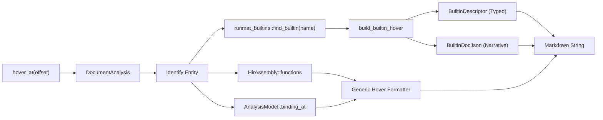
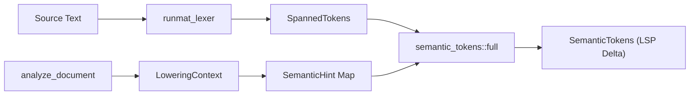

# LSP Features: Hover, Completion & Signature Help

<details>
<summary>Relevant source files</summary>

- [crates/runmat-cli/src/diagnostics.rs](https://github.com/runmat-org/runmat/blob/82685330/crates/runmat-cli/src/diagnostics.rs)
- [crates/runmat-lsp/build.rs](https://github.com/runmat-org/runmat/blob/82685330/crates/runmat-lsp/build.rs)
- [crates/runmat-lsp/src/backend.rs](https://github.com/runmat-org/runmat/blob/82685330/crates/runmat-lsp/src/backend.rs)
- [crates/runmat-lsp/src/core/analysis.rs](https://github.com/runmat-org/runmat/blob/82685330/crates/runmat-lsp/src/core/analysis.rs)
- [crates/runmat-lsp/src/core/docs.rs](https://github.com/runmat-org/runmat/blob/82685330/crates/runmat-lsp/src/core/docs.rs)
- [crates/runmat-lsp/src/core/mod.rs](https://github.com/runmat-org/runmat/blob/82685330/crates/runmat-lsp/src/core/mod.rs)
- [crates/runmat-lsp/src/core/project.rs](https://github.com/runmat-org/runmat/blob/82685330/crates/runmat-lsp/src/core/project.rs)
- [crates/runmat-lsp/src/core/semantic_tokens.rs](https://github.com/runmat-org/runmat/blob/82685330/crates/runmat-lsp/src/core/semantic_tokens.rs)
- [crates/runmat-lsp/src/core/workspace.rs](https://github.com/runmat-org/runmat/blob/82685330/crates/runmat-lsp/src/core/workspace.rs)
- [crates/runmat-lsp/src/wasm/exports.rs](https://github.com/runmat-org/runmat/blob/82685330/crates/runmat-lsp/src/wasm/exports.rs)
- [crates/runmat-plot/src/core/gpu_pack.rs](https://github.com/runmat-org/runmat/blob/82685330/crates/runmat-plot/src/core/gpu_pack.rs)
- [docs-tmp/BUILTIN_METADATA_DELTA_PLAN.md](https://github.com/runmat-org/runmat/blob/82685330/docs-tmp/BUILTIN_METADATA_DELTA_PLAN.md?plain=1)
- [docs-tmp/BUILTIN_METADATA_DELTA_PROGRESS.md](https://github.com/runmat-org/runmat/blob/82685330/docs-tmp/BUILTIN_METADATA_DELTA_PROGRESS.md?plain=1)

</details>

The RunMat Language Server Protocol (LSP) implementation provides rich IDE features by bridging the gap between static source code analysis and the `BuiltinDescriptor` metadata system. These features are exposed through the `runmat-lsp` crate, which serves both native and WebAssembly (WASM) environments.

## Hover Dispatch & Documentation Rendering

The `hover_at` function acts as the central dispatcher for retrieving documentation at a specific text offset. It leverages the `DocumentAnalysis` model to determine if the cursor is over a builtin function, a project-local variable, or a user-defined function.

### Builtin Documentation Rendering

For builtin functions, the LSP utilizes a tiered documentation strategy:

1. Typed Signatures: If a `BuiltinDescriptor` is attached to the function via the `runtime_builtin` macro, the LSP renders a canonical signature block including parameter names and types `<FileRef file-url="https://github.com/runmat-org/runmat/blob/82685330/docs-tmp/BUILTIN_METADATA_DELTA_PLAN.md?plain=1#L109-L154" min=109 max=154 file-path="docs-tmp/BUILTIN_METADATA_DELTA_PLAN.md">Hii</FileRef>`.
2. Narrative Content: Long-form descriptions, examples, and "See Also" links are sourced from the `builtins-json` dataset `<FileRef file-url="https://github.com/runmat-org/runmat/blob/82685330/crates/runmat-lsp/src/core/docs.rs#L114-L154" min=114 max=154 file-path="crates/runmat-lsp/src/core/docs.rs">Hii</FileRef>`.
3. Key Behaviors: The `render_builtin_hover_from_json` function extracts specific behavior notes and formats them as Markdown lists `<FileRef file-url="https://github.com/runmat-org/runmat/blob/82685330/crates/runmat-lsp/src/core/docs.rs#L170-L190" min=170 max=190 file-path="crates/runmat-lsp/src/core/docs.rs">Hii</FileRef>`.

### Data Flow: Hover Request

The following diagram illustrates how a hover request is resolved into a rendered Markdown response.

Hover Resolution Flow



<details>
<summary>Rendered SVG</summary>

```svg
<svg id="mermaid-71rodeo8v46" xmlns="http://www.w3.org/2000/svg" xmlns:xlink="http://www.w3.org/1999/xlink" class="flowchart" style="max-width: 100%; touch-action: none; user-select: none; cursor: grab; min-height: fit-content; max-height: 100%;" viewBox="-0.004086806427835654 0 1244.7503611128557 967.78125" role="graphics-document document" aria-roledescription="flowchart-v2" preserveAspectRatio="xMidYMid meet"><style>#mermaid-71rodeo8v46{font-family:ui-sans-serif,-apple-system,system-ui,Segoe UI,Helvetica;font-size:16px;fill:#ccc;}@keyframes edge-animation-frame{from{stroke-dashoffset:0;}}@keyframes dash{to{stroke-dashoffset:0;}}#mermaid-71rodeo8v46 .edge-animation-slow{stroke-dasharray:9,5!important;stroke-dashoffset:900;animation:dash 50s linear infinite;stroke-linecap:round;}#mermaid-71rodeo8v46 .edge-animation-fast{stroke-dasharray:9,5!important;stroke-dashoffset:900;animation:dash 20s linear infinite;stroke-linecap:round;}#mermaid-71rodeo8v46 .error-icon{fill:#333;}#mermaid-71rodeo8v46 .error-text{fill:#cccccc;stroke:#cccccc;}#mermaid-71rodeo8v46 .edge-thickness-normal{stroke-width:1px;}#mermaid-71rodeo8v46 .edge-thickness-thick{stroke-width:3.5px;}#mermaid-71rodeo8v46 .edge-pattern-solid{stroke-dasharray:0;}#mermaid-71rodeo8v46 .edge-thickness-invisible{stroke-width:0;fill:none;}#mermaid-71rodeo8v46 .edge-pattern-dashed{stroke-dasharray:3;}#mermaid-71rodeo8v46 .edge-pattern-dotted{stroke-dasharray:2;}#mermaid-71rodeo8v46 .marker{fill:#666;stroke:#666;}#mermaid-71rodeo8v46 .marker.cross{stroke:#666;}#mermaid-71rodeo8v46 svg{font-family:ui-sans-serif,-apple-system,system-ui,Segoe UI,Helvetica;font-size:16px;}#mermaid-71rodeo8v46 p{margin:0;}#mermaid-71rodeo8v46 .label{font-family:ui-sans-serif,-apple-system,system-ui,Segoe UI,Helvetica;color:#fff;}#mermaid-71rodeo8v46 .cluster-label text{fill:#fff;}#mermaid-71rodeo8v46 .cluster-label span{color:#fff;}#mermaid-71rodeo8v46 .cluster-label span p{background-color:transparent;}#mermaid-71rodeo8v46 .label text,#mermaid-71rodeo8v46 span{fill:#fff;color:#fff;}#mermaid-71rodeo8v46 .node rect,#mermaid-71rodeo8v46 .node circle,#mermaid-71rodeo8v46 .node ellipse,#mermaid-71rodeo8v46 .node polygon,#mermaid-71rodeo8v46 .node path{fill:#111;stroke:#222;stroke-width:1px;}#mermaid-71rodeo8v46 .rough-node .label text,#mermaid-71rodeo8v46 .node .label text,#mermaid-71rodeo8v46 .image-shape .label,#mermaid-71rodeo8v46 .icon-shape .label{text-anchor:middle;}#mermaid-71rodeo8v46 .node .katex path{fill:#000;stroke:#000;stroke-width:1px;}#mermaid-71rodeo8v46 .rough-node .label,#mermaid-71rodeo8v46 .node .label,#mermaid-71rodeo8v46 .image-shape .label,#mermaid-71rodeo8v46 .icon-shape .label{text-align:center;}#mermaid-71rodeo8v46 .node.clickable{cursor:pointer;}#mermaid-71rodeo8v46 .root .anchor path{fill:#666!important;stroke-width:0;stroke:#666;}#mermaid-71rodeo8v46 .arrowheadPath{fill:#0b0b0b;}#mermaid-71rodeo8v46 .edgePath .path{stroke:#666;stroke-width:1px;}#mermaid-71rodeo8v46 .flowchart-link{stroke:#666;fill:none;}#mermaid-71rodeo8v46 .edgeLabel{background-color:#161616;text-align:center;}#mermaid-71rodeo8v46 .edgeLabel p{background-color:#161616;}#mermaid-71rodeo8v46 .edgeLabel rect{opacity:0.5;background-color:#161616;fill:#161616;}#mermaid-71rodeo8v46 .labelBkg{background-color:rgba(22, 22, 22, 0.5);}#mermaid-71rodeo8v46 .cluster rect{fill:#161616;stroke:#222;stroke-width:1px;}#mermaid-71rodeo8v46 .cluster text{fill:#fff;}#mermaid-71rodeo8v46 .cluster span{color:#fff;}#mermaid-71rodeo8v46 div.mermaidTooltip{position:absolute;text-align:center;max-width:200px;padding:2px;font-family:ui-sans-serif,-apple-system,system-ui,Segoe UI,Helvetica;font-size:12px;background:#333;border:1px solid hsl(0, 0%, 10%);border-radius:2px;pointer-events:none;z-index:100;}#mermaid-71rodeo8v46 .flowchartTitleText{text-anchor:middle;font-size:18px;fill:#ccc;}#mermaid-71rodeo8v46 rect.text{fill:none;stroke-width:0;}#mermaid-71rodeo8v46 .icon-shape,#mermaid-71rodeo8v46 .image-shape{background-color:#161616;text-align:center;}#mermaid-71rodeo8v46 .icon-shape p,#mermaid-71rodeo8v46 .image-shape p{background-color:#161616;padding:2px;}#mermaid-71rodeo8v46 .icon-shape .label rect,#mermaid-71rodeo8v46 .image-shape .label rect{opacity:0.5;background-color:#161616;fill:#161616;}#mermaid-71rodeo8v46 .label-icon{display:inline-block;height:1em;overflow:visible;vertical-align:-0.125em;}#mermaid-71rodeo8v46 .node .label-icon path{fill:currentColor;stroke:revert;stroke-width:revert;}#mermaid-71rodeo8v46 .node .neo-node{stroke:#222;}#mermaid-71rodeo8v46 [data-look="neo"].node rect,#mermaid-71rodeo8v46 [data-look="neo"].cluster rect,#mermaid-71rodeo8v46 [data-look="neo"].node polygon{stroke:url(#mermaid-71rodeo8v46-gradient);filter:drop-shadow( 1px 2px 2px rgba(185,185,185,1));}#mermaid-71rodeo8v46 [data-look="neo"].node path{stroke:url(#mermaid-71rodeo8v46-gradient);stroke-width:1px;}#mermaid-71rodeo8v46 [data-look="neo"].node .outer-path{filter:drop-shadow( 1px 2px 2px rgba(185,185,185,1));}#mermaid-71rodeo8v46 [data-look="neo"].node .neo-line path{stroke:#222;filter:none;}#mermaid-71rodeo8v46 [data-look="neo"].node circle{stroke:url(#mermaid-71rodeo8v46-gradient);filter:drop-shadow( 1px 2px 2px rgba(185,185,185,1));}#mermaid-71rodeo8v46 [data-look="neo"].node circle .state-start{fill:#000000;}#mermaid-71rodeo8v46 [data-look="neo"].icon-shape .icon{fill:url(#mermaid-71rodeo8v46-gradient);filter:drop-shadow( 1px 2px 2px rgba(185,185,185,1));}#mermaid-71rodeo8v46 [data-look="neo"].icon-shape .icon-neo path{stroke:url(#mermaid-71rodeo8v46-gradient);filter:drop-shadow( 1px 2px 2px rgba(185,185,185,1));}#mermaid-71rodeo8v46 :root{--mermaid-font-family:"trebuchet ms",verdana,arial,sans-serif;}</style><g><marker id="mermaid-71rodeo8v46_flowchart-v2-pointEnd" class="marker flowchart-v2" viewBox="0 0 10 10" refX="5" refY="5" markerUnits="userSpaceOnUse" markerWidth="8" markerHeight="8" orient="auto"><path d="M 0 0 L 10 5 L 0 10 z" class="arrowMarkerPath" style="stroke-width: 1; stroke-dasharray: 1, 0;"></path></marker><marker id="mermaid-71rodeo8v46_flowchart-v2-pointStart" class="marker flowchart-v2" viewBox="0 0 10 10" refX="4.5" refY="5" markerUnits="userSpaceOnUse" markerWidth="8" markerHeight="8" orient="auto"><path d="M 0 5 L 10 10 L 10 0 z" class="arrowMarkerPath" style="stroke-width: 1; stroke-dasharray: 1, 0;"></path></marker><marker id="mermaid-71rodeo8v46_flowchart-v2-pointEnd-margin" class="marker flowchart-v2" viewBox="0 0 11.5 14" refX="11.5" refY="7" markerUnits="userSpaceOnUse" markerWidth="10.5" markerHeight="14" orient="auto"><path d="M 0 0 L 11.5 7 L 0 14 z" class="arrowMarkerPath" style="stroke-width: 0; stroke-dasharray: 1, 0;"></path></marker><marker id="mermaid-71rodeo8v46_flowchart-v2-pointStart-margin" class="marker flowchart-v2" viewBox="0 0 11.5 14" refX="1" refY="7" markerUnits="userSpaceOnUse" markerWidth="11.5" markerHeight="14" orient="auto"><polygon points="0,7 11.5,14 11.5,0" class="arrowMarkerPath" style="stroke-width: 0; stroke-dasharray: 1, 0;"></polygon></marker><marker id="mermaid-71rodeo8v46_flowchart-v2-circleEnd" class="marker flowchart-v2" viewBox="0 0 10 10" refX="11" refY="5" markerUnits="userSpaceOnUse" markerWidth="11" markerHeight="11" orient="auto"><circle cx="5" cy="5" r="5" class="arrowMarkerPath" style="stroke-width: 1; stroke-dasharray: 1, 0;"></circle></marker><marker id="mermaid-71rodeo8v46_flowchart-v2-circleStart" class="marker flowchart-v2" viewBox="0 0 10 10" refX="-1" refY="5" markerUnits="userSpaceOnUse" markerWidth="11" markerHeight="11" orient="auto"><circle cx="5" cy="5" r="5" class="arrowMarkerPath" style="stroke-width: 1; stroke-dasharray: 1, 0;"></circle></marker><marker id="mermaid-71rodeo8v46_flowchart-v2-circleEnd-margin" class="marker flowchart-v2" viewBox="0 0 10 10" refY="5" refX="12.25" markerUnits="userSpaceOnUse" markerWidth="14" markerHeight="14" orient="auto"><circle cx="5" cy="5" r="5" class="arrowMarkerPath" style="stroke-width: 0; stroke-dasharray: 1, 0;"></circle></marker><marker id="mermaid-71rodeo8v46_flowchart-v2-circleStart-margin" class="marker flowchart-v2" viewBox="0 0 10 10" refX="-2" refY="5" markerUnits="userSpaceOnUse" markerWidth="14" markerHeight="14" orient="auto"><circle cx="5" cy="5" r="5" class="arrowMarkerPath" style="stroke-width: 0; stroke-dasharray: 1, 0;"></circle></marker><marker id="mermaid-71rodeo8v46_flowchart-v2-crossEnd" class="marker cross flowchart-v2" viewBox="0 0 11 11" refX="12" refY="5.2" markerUnits="userSpaceOnUse" markerWidth="11" markerHeight="11" orient="auto"><path d="M 1,1 l 9,9 M 10,1 l -9,9" class="arrowMarkerPath" style="stroke-width: 2; stroke-dasharray: 1, 0;"></path></marker><marker id="mermaid-71rodeo8v46_flowchart-v2-crossStart" class="marker cross flowchart-v2" viewBox="0 0 11 11" refX="-1" refY="5.2" markerUnits="userSpaceOnUse" markerWidth="11" markerHeight="11" orient="auto"><path d="M 1,1 l 9,9 M 10,1 l -9,9" class="arrowMarkerPath" style="stroke-width: 2; stroke-dasharray: 1, 0;"></path></marker><marker id="mermaid-71rodeo8v46_flowchart-v2-crossEnd-margin" class="marker cross flowchart-v2" viewBox="0 0 15 15" refX="17.7" refY="7.5" markerUnits="userSpaceOnUse" markerWidth="12" markerHeight="12" orient="auto"><path d="M 1,1 L 14,14 M 1,14 L 14,1" class="arrowMarkerPath" style="stroke-width: 2.5;"></path></marker><marker id="mermaid-71rodeo8v46_flowchart-v2-crossStart-margin" class="marker cross flowchart-v2" viewBox="0 0 15 15" refX="-3.5" refY="7.5" markerUnits="userSpaceOnUse" markerWidth="12" markerHeight="12" orient="auto"><path d="M 1,1 L 14,14 M 1,14 L 14,1" class="arrowMarkerPath" style="stroke-width: 2.5; stroke-dasharray: 1, 0;"></path></marker><g class="root"><g class="clusters"><g class="cluster" id="mermaid-71rodeo8v46-subGraph2" data-look="classic"><rect style="" x="8" y="647.78125" width="650.12890625" height="312"></rect><g class="cluster-label" transform="translate(274.353515625, 647.78125)"><foreignObject width="117.421875" height="24"><div style="display: table-cell; white-space: nowrap; line-height: 1.5;" xmlns="http://www.w3.org/1999/xhtml"><span class="nodeLabel"><p>Rendering Logic</p></span></div></foreignObject></g></g><g class="cluster" id="mermaid-71rodeo8v46-subGraph1" data-look="classic"><rect style="" x="119.8828125" y="493.78125" width="1116.859375" height="104"></rect><g class="cluster-label" transform="translate(617.5859375, 493.78125)"><foreignObject width="121.453125" height="24"><div style="display: table-cell; white-space: nowrap; line-height: 1.5;" xmlns="http://www.w3.org/1999/xhtml"><span class="nodeLabel"><p>Entity Resolution</p></span></div></foreignObject></g></g><g class="cluster" id="mermaid-71rodeo8v46-subGraph0" data-look="classic"><rect style="" x="271.796875" y="8" width="849.91796875" height="411.78125"></rect><g class="cluster-label" transform="translate(649.052734375, 8)"><foreignObject width="95.40625" height="24"><div style="display: table-cell; white-space: nowrap; line-height: 1.5;" xmlns="http://www.w3.org/1999/xhtml"><span class="nodeLabel"><p>LSP Backend</p></span></div></foreignObject></g></g></g><g class="edgePaths"><path d="M787.547,87L787.547,91.167C787.547,95.333,787.547,103.667,787.547,111.333C787.547,119,787.547,126,787.547,129.5L787.547,133" id="mermaid-71rodeo8v46-L_A_B_0" class="edge-thickness-normal edge-pattern-solid edge-thickness-normal edge-pattern-solid flowchart-link" style=";" data-edge="true" data-et="edge" data-id="L_A_B_0" data-points="W3sieCI6Nzg3LjU0Njg3NSwieSI6ODd9LHsieCI6Nzg3LjU0Njg3NSwieSI6MTEyfSx7IngiOjc4Ny41NDY4NzUsInkiOjEzN31d" data-look="classic" marker-end="url(#mermaid-71rodeo8v46_flowchart-v2-pointEnd)"></path><path d="M787.547,191L787.547,195.167C787.547,199.333,787.547,207.667,787.547,215.333C787.547,223,787.547,230,787.547,233.5L787.547,237" id="mermaid-71rodeo8v46-L_B_C_0" class="edge-thickness-normal edge-pattern-solid edge-thickness-normal edge-pattern-solid flowchart-link" style=";" data-edge="true" data-et="edge" data-id="L_B_C_0" data-points="W3sieCI6Nzg3LjU0Njg3NSwieSI6MTkxfSx7IngiOjc4Ny41NDY4NzUsInkiOjIxNn0seyJ4Ijo3ODcuNTQ2ODc1LCJ5IjoyNDF9XQ==" data-look="classic" marker-end="url(#mermaid-71rodeo8v46_flowchart-v2-pointEnd)"></path><path d="M724.219,331.453L655.482,346.175C586.745,360.896,449.271,390.339,380.534,411.227C311.797,432.115,311.797,444.448,311.797,456.781C311.797,469.115,311.797,481.448,311.797,491.115C311.797,500.781,311.797,507.781,311.797,511.281L311.797,514.781" id="mermaid-71rodeo8v46-L_C_D_0" class="edge-thickness-normal edge-pattern-solid edge-thickness-normal edge-pattern-solid flowchart-link" style=";" data-edge="true" data-et="edge" data-id="L_C_D_0" data-points="W3sieCI6NzI0LjIxOTA2NjU2NTkwNjYsInkiOjMzMS40NTM0NDE1NjU5MDY2fSx7IngiOjMxMS43OTY4NzUsInkiOjQxOS43ODEyNX0seyJ4IjozMTEuNzk2ODc1LCJ5Ijo0NTYuNzgxMjV9LHsieCI6MzExLjc5Njg3NSwieSI6NDkzLjc4MTI1fSx7IngiOjMxMS43OTY4NzUsInkiOjUxOC43ODEyNX1d" data-look="classic" marker-end="url(#mermaid-71rodeo8v46_flowchart-v2-pointEnd)"></path><path d="M787.547,394.781L787.547,398.948C787.547,403.115,787.547,411.448,787.547,421.781C787.547,432.115,787.547,444.448,787.547,456.781C787.547,469.115,787.547,481.448,787.547,491.115C787.547,500.781,787.547,507.781,787.547,511.281L787.547,514.781" id="mermaid-71rodeo8v46-L_C_E_0" class="edge-thickness-normal edge-pattern-solid edge-thickness-normal edge-pattern-solid flowchart-link" style=";" data-edge="true" data-et="edge" data-id="L_C_E_0" data-points="W3sieCI6Nzg3LjU0Njg3NSwieSI6Mzk0Ljc4MTI1fSx7IngiOjc4Ny41NDY4NzUsInkiOjQxOS43ODEyNX0seyJ4Ijo3ODcuNTQ2ODc1LCJ5Ijo0NTYuNzgxMjV9LHsieCI6Nzg3LjU0Njg3NSwieSI6NDkzLjc4MTI1fSx7IngiOjc4Ny41NDY4NzUsInkiOjUxOC43ODEyNX1d" data-look="classic" marker-end="url(#mermaid-71rodeo8v46_flowchart-v2-pointEnd)"></path><path d="M844.391,337.938L883.069,351.578C921.747,365.219,999.104,392.5,1037.783,412.307C1076.461,432.115,1076.461,444.448,1076.461,456.781C1076.461,469.115,1076.461,481.448,1076.461,491.115C1076.461,500.781,1076.461,507.781,1076.461,511.281L1076.461,514.781" id="mermaid-71rodeo8v46-L_C_F_0" class="edge-thickness-normal edge-pattern-solid edge-thickness-normal edge-pattern-solid flowchart-link" style=";" data-edge="true" data-et="edge" data-id="L_C_F_0" data-points="W3sieCI6ODQ0LjM5MDU3MDk2MjM1NzMsInkiOjMzNy45Mzc1NTQwMzc2NDI3fSx7IngiOjEwNzYuNDYwOTM3NSwieSI6NDE5Ljc4MTI1fSx7IngiOjEwNzYuNDYwOTM3NSwieSI6NDU2Ljc4MTI1fSx7IngiOjEwNzYuNDYwOTM3NSwieSI6NDkzLjc4MTI1fSx7IngiOjEwNzYuNDYwOTM3NSwieSI6NTE4Ljc4MTI1fV0=" data-look="classic" marker-end="url(#mermaid-71rodeo8v46_flowchart-v2-pointEnd)"></path><path d="M311.797,572.781L311.797,576.948C311.797,581.115,311.797,589.448,311.797,597.781C311.797,606.115,311.797,614.448,311.797,622.781C311.797,631.115,311.797,639.448,311.797,647.115C311.797,654.781,311.797,661.781,311.797,665.281L311.797,668.781" id="mermaid-71rodeo8v46-L_D_G_0" class="edge-thickness-normal edge-pattern-solid edge-thickness-normal edge-pattern-solid flowchart-link" style=";" data-edge="true" data-et="edge" data-id="L_D_G_0" data-points="W3sieCI6MzExLjc5Njg3NSwieSI6NTcyLjc4MTI1fSx7IngiOjMxMS43OTY4NzUsInkiOjU5Ny43ODEyNX0seyJ4IjozMTEuNzk2ODc1LCJ5Ijo2MjIuNzgxMjV9LHsieCI6MzExLjc5Njg3NSwieSI6NjQ3Ljc4MTI1fSx7IngiOjMxMS43OTY4NzUsInkiOjY3Mi43ODEyNX1d" data-look="classic" marker-end="url(#mermaid-71rodeo8v46_flowchart-v2-pointEnd)"></path><path d="M234.943,726.781L223.082,730.948C211.222,735.115,187.502,743.448,175.641,751.115C163.781,758.781,163.781,765.781,163.781,769.281L163.781,772.781" id="mermaid-71rodeo8v46-L_G_H_0" class="edge-thickness-normal edge-pattern-solid edge-thickness-normal edge-pattern-solid flowchart-link" style=";" data-edge="true" data-et="edge" data-id="L_G_H_0" data-points="W3sieCI6MjM0Ljk0MjYwODE3MzA3NjksInkiOjcyNi43ODEyNX0seyJ4IjoxNjMuNzgxMjUsInkiOjc1MS43ODEyNX0seyJ4IjoxNjMuNzgxMjUsInkiOjc3Ni43ODEyNX1d" data-look="classic" marker-end="url(#mermaid-71rodeo8v46_flowchart-v2-pointEnd)"></path><path d="M388.651,726.781L400.511,730.948C412.372,735.115,436.092,743.448,447.952,751.115C459.813,758.781,459.813,765.781,459.813,769.281L459.813,772.781" id="mermaid-71rodeo8v46-L_G_I_0" class="edge-thickness-normal edge-pattern-solid edge-thickness-normal edge-pattern-solid flowchart-link" style=";" data-edge="true" data-et="edge" data-id="L_G_I_0" data-points="W3sieCI6Mzg4LjY1MTE0MTgyNjkyMzEsInkiOjcyNi43ODEyNX0seyJ4Ijo0NTkuODEyNSwieSI6NzUxLjc4MTI1fSx7IngiOjQ1OS44MTI1LCJ5Ijo3NzYuNzgxMjV9XQ==" data-look="classic" marker-end="url(#mermaid-71rodeo8v46_flowchart-v2-pointEnd)"></path><path d="M163.781,830.781L163.781,834.948C163.781,839.115,163.781,847.448,197.225,857.489C230.669,867.53,297.556,879.28,330.999,885.154L364.443,891.029" id="mermaid-71rodeo8v46-L_H_J_0" class="edge-thickness-normal edge-pattern-solid edge-thickness-normal edge-pattern-solid flowchart-link" style=";" data-edge="true" data-et="edge" data-id="L_H_J_0" data-points="W3sieCI6MTYzLjc4MTI1LCJ5Ijo4MzAuNzgxMjV9LHsieCI6MTYzLjc4MTI1LCJ5Ijo4NTUuNzgxMjV9LHsieCI6MzY4LjM4MjgxMjUsInkiOjg5MS43MjA5NzM0MjQ0Njk1fV0=" data-look="classic" marker-end="url(#mermaid-71rodeo8v46_flowchart-v2-pointEnd)"></path><path d="M459.813,830.781L459.813,834.948C459.813,839.115,459.813,847.448,459.813,855.115C459.813,862.781,459.813,869.781,459.813,873.281L459.813,876.781" id="mermaid-71rodeo8v46-L_I_J_0" class="edge-thickness-normal edge-pattern-solid edge-thickness-normal edge-pattern-solid flowchart-link" style=";" data-edge="true" data-et="edge" data-id="L_I_J_0" data-points="W3sieCI6NDU5LjgxMjUsInkiOjgzMC43ODEyNX0seyJ4Ijo0NTkuODEyNSwieSI6ODU1Ljc4MTI1fSx7IngiOjQ1OS44MTI1LCJ5Ijo4ODAuNzgxMjV9XQ==" data-look="classic" marker-end="url(#mermaid-71rodeo8v46_flowchart-v2-pointEnd)"></path><path d="M787.547,572.781L787.547,576.948C787.547,581.115,787.547,589.448,787.547,597.781C787.547,606.115,787.547,614.448,787.547,622.781C787.547,631.115,787.547,639.448,798.495,647.555C809.443,655.663,831.338,663.545,842.286,667.486L853.234,671.426" id="mermaid-71rodeo8v46-L_E_K_0" class="edge-thickness-normal edge-pattern-solid edge-thickness-normal edge-pattern-solid flowchart-link" style=";" data-edge="true" data-et="edge" data-id="L_E_K_0" data-points="W3sieCI6Nzg3LjU0Njg3NSwieSI6NTcyLjc4MTI1fSx7IngiOjc4Ny41NDY4NzUsInkiOjU5Ny43ODEyNX0seyJ4Ijo3ODcuNTQ2ODc1LCJ5Ijo2MjIuNzgxMjV9LHsieCI6Nzg3LjU0Njg3NSwieSI6NjQ3Ljc4MTI1fSx7IngiOjg1Ni45OTczNzA3OTMyNjkzLCJ5Ijo2NzIuNzgxMjV9XQ==" data-look="classic" marker-end="url(#mermaid-71rodeo8v46_flowchart-v2-pointEnd)"></path><path d="M1076.461,572.781L1076.461,576.948C1076.461,581.115,1076.461,589.448,1076.461,597.781C1076.461,606.115,1076.461,614.448,1076.461,622.781C1076.461,631.115,1076.461,639.448,1065.513,647.555C1054.565,655.663,1032.67,663.545,1021.722,667.486L1010.774,671.426" id="mermaid-71rodeo8v46-L_F_K_0" class="edge-thickness-normal edge-pattern-solid edge-thickness-normal edge-pattern-solid flowchart-link" style=";" data-edge="true" data-et="edge" data-id="L_F_K_0" data-points="W3sieCI6MTA3Ni40NjA5Mzc1LCJ5Ijo1NzIuNzgxMjV9LHsieCI6MTA3Ni40NjA5Mzc1LCJ5Ijo1OTcuNzgxMjV9LHsieCI6MTA3Ni40NjA5Mzc1LCJ5Ijo2MjIuNzgxMjV9LHsieCI6MTA3Ni40NjA5Mzc1LCJ5Ijo2NDcuNzgxMjV9LHsieCI6MTAwNy4wMTA0NDE3MDY3MzA3LCJ5Ijo2NzIuNzgxMjV9XQ==" data-look="classic" marker-end="url(#mermaid-71rodeo8v46_flowchart-v2-pointEnd)"></path><path d="M812.332,719.73L780.287,725.072C748.242,730.414,684.152,741.098,652.107,755.106C620.063,769.115,620.063,786.448,620.063,803.781C620.063,821.115,620.063,838.448,607.856,851.075C595.65,863.703,571.237,871.625,559.03,875.586L546.824,879.547" id="mermaid-71rodeo8v46-L_K_J_0" class="edge-thickness-normal edge-pattern-solid edge-thickness-normal edge-pattern-solid flowchart-link" style=";" data-edge="true" data-et="edge" data-id="L_K_J_0" data-points="W3sieCI6ODEyLjMzMjAzMTI1LCJ5Ijo3MTkuNzMwMzA4OTQyODYwM30seyJ4Ijo2MjAuMDYyNSwieSI6NzUxLjc4MTI1fSx7IngiOjYyMC4wNjI1LCJ5Ijo4MDMuNzgxMjV9LHsieCI6NjIwLjA2MjUsInkiOjg1NS43ODEyNX0seyJ4Ijo1NDMuMDE5MjMwNzY5MjMwNywieSI6ODgwLjc4MTI1fV0=" data-look="classic" marker-end="url(#mermaid-71rodeo8v46_flowchart-v2-pointEnd)"></path></g><g class="edgeLabels"><g class="edgeLabel"><g class="label" data-id="L_A_B_0" transform="translate(0, 0)"><foreignObject width="0" height="0"><div style="display: table-cell; white-space: nowrap; line-height: 1.5; max-width: 200px; text-align: center;" xmlns="http://www.w3.org/1999/xhtml" class="labelBkg"><span class="edgeLabel"></span></div></foreignObject></g></g><g class="edgeLabel"><g class="label" data-id="L_B_C_0" transform="translate(0, 0)"><foreignObject width="0" height="0"><div style="display: table-cell; white-space: nowrap; line-height: 1.5; max-width: 200px; text-align: center;" xmlns="http://www.w3.org/1999/xhtml" class="labelBkg"><span class="edgeLabel"></span></div></foreignObject></g></g><g class="edgeLabel" transform="translate(311.796875, 456.78125)"><g class="label" data-id="L_C_D_0" transform="translate(-22.3828125, -12)"><foreignObject width="44.765625" height="24"><div style="display: table-cell; white-space: nowrap; line-height: 1.5; max-width: 200px; text-align: center;" xmlns="http://www.w3.org/1999/xhtml" class="labelBkg"><span class="edgeLabel"><p>Builtin</p></span></div></foreignObject></g></g><g class="edgeLabel" transform="translate(787.546875, 456.78125)"><g class="label" data-id="L_C_E_0" transform="translate(-50.671875, -12)"><foreignObject width="101.34375" height="24"><div style="display: table-cell; white-space: nowrap; line-height: 1.5; max-width: 200px; text-align: center;" xmlns="http://www.w3.org/1999/xhtml" class="labelBkg"><span class="edgeLabel"><p>User Function</p></span></div></foreignObject></g></g><g class="edgeLabel" transform="translate(1076.4609375, 456.78125)"><g class="label" data-id="L_C_F_0" transform="translate(-29.109375, -12)"><foreignObject width="58.21875" height="24"><div style="display: table-cell; white-space: nowrap; line-height: 1.5; max-width: 200px; text-align: center;" xmlns="http://www.w3.org/1999/xhtml" class="labelBkg"><span class="edgeLabel"><p>Variable</p></span></div></foreignObject></g></g><g class="edgeLabel"><g class="label" data-id="L_D_G_0" transform="translate(0, 0)"><foreignObject width="0" height="0"><div style="display: table-cell; white-space: nowrap; line-height: 1.5; max-width: 200px; text-align: center;" xmlns="http://www.w3.org/1999/xhtml" class="labelBkg"><span class="edgeLabel"></span></div></foreignObject></g></g><g class="edgeLabel"><g class="label" data-id="L_G_H_0" transform="translate(0, 0)"><foreignObject width="0" height="0"><div style="display: table-cell; white-space: nowrap; line-height: 1.5; max-width: 200px; text-align: center;" xmlns="http://www.w3.org/1999/xhtml" class="labelBkg"><span class="edgeLabel"></span></div></foreignObject></g></g><g class="edgeLabel"><g class="label" data-id="L_G_I_0" transform="translate(0, 0)"><foreignObject width="0" height="0"><div style="display: table-cell; white-space: nowrap; line-height: 1.5; max-width: 200px; text-align: center;" xmlns="http://www.w3.org/1999/xhtml" class="labelBkg"><span class="edgeLabel"></span></div></foreignObject></g></g><g class="edgeLabel"><g class="label" data-id="L_H_J_0" transform="translate(0, 0)"><foreignObject width="0" height="0"><div style="display: table-cell; white-space: nowrap; line-height: 1.5; max-width: 200px; text-align: center;" xmlns="http://www.w3.org/1999/xhtml" class="labelBkg"><span class="edgeLabel"></span></div></foreignObject></g></g><g class="edgeLabel"><g class="label" data-id="L_I_J_0" transform="translate(0, 0)"><foreignObject width="0" height="0"><div style="display: table-cell; white-space: nowrap; line-height: 1.5; max-width: 200px; text-align: center;" xmlns="http://www.w3.org/1999/xhtml" class="labelBkg"><span class="edgeLabel"></span></div></foreignObject></g></g><g class="edgeLabel"><g class="label" data-id="L_E_K_0" transform="translate(0, 0)"><foreignObject width="0" height="0"><div style="display: table-cell; white-space: nowrap; line-height: 1.5; max-width: 200px; text-align: center;" xmlns="http://www.w3.org/1999/xhtml" class="labelBkg"><span class="edgeLabel"></span></div></foreignObject></g></g><g class="edgeLabel"><g class="label" data-id="L_F_K_0" transform="translate(0, 0)"><foreignObject width="0" height="0"><div style="display: table-cell; white-space: nowrap; line-height: 1.5; max-width: 200px; text-align: center;" xmlns="http://www.w3.org/1999/xhtml" class="labelBkg"><span class="edgeLabel"></span></div></foreignObject></g></g><g class="edgeLabel"><g class="label" data-id="L_K_J_0" transform="translate(0, 0)"><foreignObject width="0" height="0"><div style="display: table-cell; white-space: nowrap; line-height: 1.5; max-width: 200px; text-align: center;" xmlns="http://www.w3.org/1999/xhtml" class="labelBkg"><span class="edgeLabel"></span></div></foreignObject></g></g></g><g class="nodes"><g class="node default" id="mermaid-71rodeo8v46-flowchart-A-0" data-look="classic" transform="translate(787.546875, 60)"><rect class="basic label-container" style="" x="-88.2265625" y="-27" width="176.453125" height="54"></rect><g class="label" style="" transform="translate(-58.2265625, -12)"><rect></rect><foreignObject width="116.453125" height="24"><div style="display: table-cell; white-space: nowrap; line-height: 1.5; max-width: 200px; text-align: center;" xmlns="http://www.w3.org/1999/xhtml"><span class="nodeLabel"><p>hover_at(offset)</p></span></div></foreignObject></g></g><g class="node default" id="mermaid-71rodeo8v46-flowchart-B-1" data-look="classic" transform="translate(787.546875, 164)"><rect class="basic label-container" style="" x="-97.3671875" y="-27" width="194.734375" height="54"></rect><g class="label" style="" transform="translate(-67.3671875, -12)"><rect></rect><foreignObject width="134.734375" height="24"><div style="display: table-cell; white-space: nowrap; line-height: 1.5; max-width: 200px; text-align: center;" xmlns="http://www.w3.org/1999/xhtml"><span class="nodeLabel"><p>DocumentAnalysis</p></span></div></foreignObject></g></g><g class="node default" id="mermaid-71rodeo8v46-flowchart-C-3" data-look="classic" transform="translate(787.546875, 317.890625)"><polygon points="76.890625,0 153.78125,-76.890625 76.890625,-153.78125 0,-76.890625" class="label-container" transform="translate(-76.390625, 76.890625)"></polygon><g class="label" style="" transform="translate(-49.890625, -12)"><rect></rect><foreignObject width="99.78125" height="24"><div style="display: table-cell; white-space: nowrap; line-height: 1.5; max-width: 200px; text-align: center;" xmlns="http://www.w3.org/1999/xhtml"><span class="nodeLabel"><p>Identify Entity</p></span></div></foreignObject></g></g><g class="node default" id="mermaid-71rodeo8v46-flowchart-D-5" data-look="classic" transform="translate(311.796875, 545.78125)"><rect class="basic label-container" style="" x="-156.9140625" y="-27" width="313.828125" height="54"></rect><g class="label" style="" transform="translate(-126.9140625, -12)"><rect></rect><foreignObject width="253.828125" height="24"><div style="display: table; white-space: break-spaces; line-height: 1.5; max-width: 200px; text-align: center; width: 200px;" xmlns="http://www.w3.org/1999/xhtml"><span class="nodeLabel"><p>runmat_builtins::find_builtin(name)</p></span></div></foreignObject></g></g><g class="node default" id="mermaid-71rodeo8v46-flowchart-E-7" data-look="classic" transform="translate(787.546875, 545.78125)"><rect class="basic label-container" style="" x="-113.6328125" y="-27" width="227.265625" height="54"></rect><g class="label" style="" transform="translate(-83.6328125, -12)"><rect></rect><foreignObject width="167.265625" height="24"><div style="display: table-cell; white-space: nowrap; line-height: 1.5; max-width: 200px; text-align: center;" xmlns="http://www.w3.org/1999/xhtml"><span class="nodeLabel"><p>HirAssembly::functions</p></span></div></foreignObject></g></g><g class="node default" id="mermaid-71rodeo8v46-flowchart-F-9" data-look="classic" transform="translate(1076.4609375, 545.78125)"><rect class="basic label-container" style="" x="-125.28125" y="-27" width="250.5625" height="54"></rect><g class="label" style="" transform="translate(-95.28125, -12)"><rect></rect><foreignObject width="190.5625" height="24"><div style="display: table-cell; white-space: nowrap; line-height: 1.5; max-width: 200px; text-align: center;" xmlns="http://www.w3.org/1999/xhtml"><span class="nodeLabel"><p>AnalysisModel::binding_at</p></span></div></foreignObject></g></g><g class="node default" id="mermaid-71rodeo8v46-flowchart-G-11" data-look="classic" transform="translate(311.796875, 699.78125)"><rect class="basic label-container" style="" x="-99.0703125" y="-27" width="198.140625" height="54"></rect><g class="label" style="" transform="translate(-69.0703125, -12)"><rect></rect><foreignObject width="138.140625" height="24"><div style="display: table-cell; white-space: nowrap; line-height: 1.5; max-width: 200px; text-align: center;" xmlns="http://www.w3.org/1999/xhtml"><span class="nodeLabel"><p>build_builtin_hover</p></span></div></foreignObject></g></g><g class="node default" id="mermaid-71rodeo8v46-flowchart-H-13" data-look="classic" transform="translate(163.78125, 803.78125)"><rect class="basic label-container" style="" x="-120.78125" y="-27" width="241.5625" height="54"></rect><g class="label" style="" transform="translate(-90.78125, -12)"><rect></rect><foreignObject width="181.5625" height="24"><div style="display: table-cell; white-space: nowrap; line-height: 1.5; max-width: 200px; text-align: center;" xmlns="http://www.w3.org/1999/xhtml"><span class="nodeLabel"><p>BuiltinDescriptor (Typed)</p></span></div></foreignObject></g></g><g class="node default" id="mermaid-71rodeo8v46-flowchart-I-15" data-look="classic" transform="translate(459.8125, 803.78125)"><rect class="basic label-container" style="" x="-125.25" y="-27" width="250.5" height="54"></rect><g class="label" style="" transform="translate(-95.25, -12)"><rect></rect><foreignObject width="190.5" height="24"><div style="display: table-cell; white-space: nowrap; line-height: 1.5; max-width: 200px; text-align: center;" xmlns="http://www.w3.org/1999/xhtml"><span class="nodeLabel"><p>BuiltinDocJson (Narrative)</p></span></div></foreignObject></g></g><g class="node default" id="mermaid-71rodeo8v46-flowchart-J-18" data-look="classic" transform="translate(459.8125, 907.78125)"><rect class="basic label-container" style="" x="-91.4296875" y="-27" width="182.859375" height="54"></rect><g class="label" style="" transform="translate(-61.4296875, -12)"><rect></rect><foreignObject width="122.859375" height="24"><div style="display: table-cell; white-space: nowrap; line-height: 1.5; max-width: 200px; text-align: center;" xmlns="http://www.w3.org/1999/xhtml"><span class="nodeLabel"><p>Markdown String</p></span></div></foreignObject></g></g><g class="node default" id="mermaid-71rodeo8v46-flowchart-K-21" data-look="classic" transform="translate(932.00390625, 699.78125)"><rect class="basic label-container" style="" x="-119.671875" y="-27" width="239.34375" height="54"></rect><g class="label" style="" transform="translate(-89.671875, -12)"><rect></rect><foreignObject width="179.34375" height="24"><div style="display: table-cell; white-space: nowrap; line-height: 1.5; max-width: 200px; text-align: center;" xmlns="http://www.w3.org/1999/xhtml"><span class="nodeLabel"><p>Generic Hover Formatter</p></span></div></foreignObject></g></g></g></g></g><defs><filter id="mermaid-71rodeo8v46-drop-shadow" height="130%" width="130%"><feDropShadow dx="4" dy="4" stdDeviation="0" flood-opacity="0.06" flood-color="#000000"></feDropShadow></filter></defs><defs><filter id="mermaid-71rodeo8v46-drop-shadow-small" height="150%" width="150%"><feDropShadow dx="2" dy="2" stdDeviation="0" flood-opacity="0.06" flood-color="#000000"></feDropShadow></filter></defs><linearGradient id="mermaid-71rodeo8v46-gradient" gradientUnits="objectBoundingBox" x1="0%" y1="0%" x2="100%" y2="0%"><stop offset="0%" stop-color="#333" stop-opacity="1"></stop><stop offset="100%" stop-color="hsl(-120, 0%, 3.3333333333%)" stop-opacity="1"></stop></linearGradient></svg>
```

</details>

Sources: `<FileRef file-url="https://github.com/runmat-org/runmat/blob/82685330/crates/runmat-lsp/src/core/analysis.rs#L111-L120" min=111 max=120 file-path="crates/runmat-lsp/src/core/analysis.rs">Hii</FileRef>`, `<FileRef file-url="https://github.com/runmat-org/runmat/blob/82685330/crates/runmat-lsp/src/core/docs.rs#L114-L128" min=114 max=128 file-path="crates/runmat-lsp/src/core/docs.rs">Hii</FileRef>`, `<FileRef file-url="https://github.com/runmat-org/runmat/blob/82685330/crates/runmat-lsp/src/backend.rs#L126-L138" min=126 max=138 file-path="crates/runmat-lsp/src/backend.rs">Hii</FileRef>`.

## Completion Policies

Completion items are generated by `completion_at`, which filters candidates based on the `BuiltinCompletionPolicy` defined in the function's metadata `<FileRef file-url="https://github.com/runmat-org/runmat/blob/82685330/docs-tmp/BUILTIN_METADATA_DELTA_PLAN.md?plain=1#L149-L154" min=149 max=154 file-path="docs-tmp/BUILTIN_METADATA_DELTA_PLAN.md">Hii</FileRef>`.

| Policy | Visibility | Use Case |
| --- | --- | --- |
| Public | Always visible in global completion. | Standard library functions (e.g., sin, zeros). |
| MethodOnly | Only visible after a dot . operator. | Class methods or namespaced functions. |
| HiddenInternal | Never suggested in completion. | Low-level intrinsics used by the compiler. |

Sources: `<FileRef file-url="https://github.com/runmat-org/runmat/blob/82685330/docs-tmp/BUILTIN_METADATA_DELTA_PLAN.md?plain=1#L149-L163" min=149 max=163 file-path="docs-tmp/BUILTIN_METADATA_DELTA_PLAN.md">Hii</FileRef>`, `<FileRef file-url="https://github.com/runmat-org/runmat/blob/82685330/crates/runmat-lsp/src/wasm/exports.rs#L110-L123" min=110 max=123 file-path="crates/runmat-lsp/src/wasm/exports.rs">Hii</FileRef>`.

## Signature Help & Descriptor Mapping

Signature help provides real-time guidance on function arguments during typing. The `signature_help_at` function maps the current cursor position within a call expression to the corresponding `BuiltinSignatureDescriptor` `<FileRef file-url="https://github.com/runmat-org/runmat/blob/82685330/docs-tmp/BUILTIN_METADATA_DELTA_PLAN.md?plain=1#L117-L121" min=117 max=121 file-path="docs-tmp/BUILTIN_METADATA_DELTA_PLAN.md">Hii</FileRef>`.

### Active Parameter Tracking

The LSP calculates the `active_parameter` by counting comma-separated arguments in the AST/HIR at the current offset. It then highlights the corresponding `BuiltinParamDescriptor` in the UI `<FileRef file-url="https://github.com/runmat-org/runmat/blob/82685330/docs-tmp/BUILTIN_METADATA_DELTA_PLAN.md?plain=1#L123-L130" min=123 max=130 file-path="docs-tmp/BUILTIN_METADATA_DELTA_PLAN.md">Hii</FileRef>`.

Code Entity Mapping: Signature Help

| Code Symbol | LSP Representation | Role |
| --- | --- | --- |
| BuiltinSignatureDescriptor | SignatureInformation | Represents one overload of a function. |
| BuiltinParamDescriptor | ParameterInformation | Describes an individual argument (name, type, arity). |
| BuiltinParamArity | Label formatting | Determines if brackets [] or ellipses ... are shown. |

Sources: `<FileRef file-url="https://github.com/runmat-org/runmat/blob/82685330/docs-tmp/BUILTIN_METADATA_DELTA_PLAN.md?plain=1#L109-L142" min=109 max=142 file-path="docs-tmp/BUILTIN_METADATA_DELTA_PLAN.md">Hii</FileRef>`, `<FileRef file-url="https://github.com/runmat-org/runmat/blob/82685330/crates/runmat-lsp/src/wasm/exports.rs#L167-L179" min=167 max=179 file-path="crates/runmat-lsp/src/wasm/exports.rs">Hii</FileRef>`.

## Semantic Tokens

RunMat implements a full semantic token provider to enhance syntax highlighting beyond basic regex-based lexing. The `semantic_tokens_full` function merges standard lexer tokens with `SemanticHint` data produced during HIR lowering `<FileRef file-url="https://github.com/runmat-org/runmat/blob/82685330/crates/runmat-lsp/src/core/semantic_tokens.rs#L47-L52" min=47 max=52 file-path="crates/runmat-lsp/src/core/semantic_tokens.rs">Hii</FileRef>`.

### Identifier Roles

The `IdentifierRole` enum maps HIR bindings to specific LSP semantic types:

- `Function`: Highlighted as a callable entity.
- `Parameter`: Specifically identifies function input arguments.
- `Variable`: General workspace variables.
- `Namespace`: Identifies packages or class names.

### Token Legend & Modifiers

The LSP supports standard modifiers to distinguish declarations from usages:

- `DECLARATION`: Set when the token is at the binding site (e.g., `function [x] = foo()`).
- `DEFAULT_LIBRARY`: Set for all RunMat builtins to distinguish them from user code.

Semantic Token Generation



<details>
<summary>Rendered SVG</summary>

```svg
<svg id="mermaid-l7i7a7u8xar" xmlns="http://www.w3.org/2000/svg" xmlns:xlink="http://www.w3.org/1999/xlink" class="flowchart" style="max-width: 100%; touch-action: none; user-select: none; cursor: grab; min-height: fit-content; max-height: 100%;" viewBox="-0.07736287182342494 0 1362.2953507436468 284" role="graphics-document document" aria-roledescription="flowchart-v2" preserveAspectRatio="xMidYMid meet"><style>#mermaid-l7i7a7u8xar{font-family:ui-sans-serif,-apple-system,system-ui,Segoe UI,Helvetica;font-size:16px;fill:#ccc;}@keyframes edge-animation-frame{from{stroke-dashoffset:0;}}@keyframes dash{to{stroke-dashoffset:0;}}#mermaid-l7i7a7u8xar .edge-animation-slow{stroke-dasharray:9,5!important;stroke-dashoffset:900;animation:dash 50s linear infinite;stroke-linecap:round;}#mermaid-l7i7a7u8xar .edge-animation-fast{stroke-dasharray:9,5!important;stroke-dashoffset:900;animation:dash 20s linear infinite;stroke-linecap:round;}#mermaid-l7i7a7u8xar .error-icon{fill:#333;}#mermaid-l7i7a7u8xar .error-text{fill:#cccccc;stroke:#cccccc;}#mermaid-l7i7a7u8xar .edge-thickness-normal{stroke-width:1px;}#mermaid-l7i7a7u8xar .edge-thickness-thick{stroke-width:3.5px;}#mermaid-l7i7a7u8xar .edge-pattern-solid{stroke-dasharray:0;}#mermaid-l7i7a7u8xar .edge-thickness-invisible{stroke-width:0;fill:none;}#mermaid-l7i7a7u8xar .edge-pattern-dashed{stroke-dasharray:3;}#mermaid-l7i7a7u8xar .edge-pattern-dotted{stroke-dasharray:2;}#mermaid-l7i7a7u8xar .marker{fill:#666;stroke:#666;}#mermaid-l7i7a7u8xar .marker.cross{stroke:#666;}#mermaid-l7i7a7u8xar svg{font-family:ui-sans-serif,-apple-system,system-ui,Segoe UI,Helvetica;font-size:16px;}#mermaid-l7i7a7u8xar p{margin:0;}#mermaid-l7i7a7u8xar .label{font-family:ui-sans-serif,-apple-system,system-ui,Segoe UI,Helvetica;color:#fff;}#mermaid-l7i7a7u8xar .cluster-label text{fill:#fff;}#mermaid-l7i7a7u8xar .cluster-label span{color:#fff;}#mermaid-l7i7a7u8xar .cluster-label span p{background-color:transparent;}#mermaid-l7i7a7u8xar .label text,#mermaid-l7i7a7u8xar span{fill:#fff;color:#fff;}#mermaid-l7i7a7u8xar .node rect,#mermaid-l7i7a7u8xar .node circle,#mermaid-l7i7a7u8xar .node ellipse,#mermaid-l7i7a7u8xar .node polygon,#mermaid-l7i7a7u8xar .node path{fill:#111;stroke:#222;stroke-width:1px;}#mermaid-l7i7a7u8xar .rough-node .label text,#mermaid-l7i7a7u8xar .node .label text,#mermaid-l7i7a7u8xar .image-shape .label,#mermaid-l7i7a7u8xar .icon-shape .label{text-anchor:middle;}#mermaid-l7i7a7u8xar .node .katex path{fill:#000;stroke:#000;stroke-width:1px;}#mermaid-l7i7a7u8xar .rough-node .label,#mermaid-l7i7a7u8xar .node .label,#mermaid-l7i7a7u8xar .image-shape .label,#mermaid-l7i7a7u8xar .icon-shape .label{text-align:center;}#mermaid-l7i7a7u8xar .node.clickable{cursor:pointer;}#mermaid-l7i7a7u8xar .root .anchor path{fill:#666!important;stroke-width:0;stroke:#666;}#mermaid-l7i7a7u8xar .arrowheadPath{fill:#0b0b0b;}#mermaid-l7i7a7u8xar .edgePath .path{stroke:#666;stroke-width:1px;}#mermaid-l7i7a7u8xar .flowchart-link{stroke:#666;fill:none;}#mermaid-l7i7a7u8xar .edgeLabel{background-color:#161616;text-align:center;}#mermaid-l7i7a7u8xar .edgeLabel p{background-color:#161616;}#mermaid-l7i7a7u8xar .edgeLabel rect{opacity:0.5;background-color:#161616;fill:#161616;}#mermaid-l7i7a7u8xar .labelBkg{background-color:rgba(22, 22, 22, 0.5);}#mermaid-l7i7a7u8xar .cluster rect{fill:#161616;stroke:#222;stroke-width:1px;}#mermaid-l7i7a7u8xar .cluster text{fill:#fff;}#mermaid-l7i7a7u8xar .cluster span{color:#fff;}#mermaid-l7i7a7u8xar div.mermaidTooltip{position:absolute;text-align:center;max-width:200px;padding:2px;font-family:ui-sans-serif,-apple-system,system-ui,Segoe UI,Helvetica;font-size:12px;background:#333;border:1px solid hsl(0, 0%, 10%);border-radius:2px;pointer-events:none;z-index:100;}#mermaid-l7i7a7u8xar .flowchartTitleText{text-anchor:middle;font-size:18px;fill:#ccc;}#mermaid-l7i7a7u8xar rect.text{fill:none;stroke-width:0;}#mermaid-l7i7a7u8xar .icon-shape,#mermaid-l7i7a7u8xar .image-shape{background-color:#161616;text-align:center;}#mermaid-l7i7a7u8xar .icon-shape p,#mermaid-l7i7a7u8xar .image-shape p{background-color:#161616;padding:2px;}#mermaid-l7i7a7u8xar .icon-shape .label rect,#mermaid-l7i7a7u8xar .image-shape .label rect{opacity:0.5;background-color:#161616;fill:#161616;}#mermaid-l7i7a7u8xar .label-icon{display:inline-block;height:1em;overflow:visible;vertical-align:-0.125em;}#mermaid-l7i7a7u8xar .node .label-icon path{fill:currentColor;stroke:revert;stroke-width:revert;}#mermaid-l7i7a7u8xar .node .neo-node{stroke:#222;}#mermaid-l7i7a7u8xar [data-look="neo"].node rect,#mermaid-l7i7a7u8xar [data-look="neo"].cluster rect,#mermaid-l7i7a7u8xar [data-look="neo"].node polygon{stroke:url(#mermaid-l7i7a7u8xar-gradient);filter:drop-shadow( 1px 2px 2px rgba(185,185,185,1));}#mermaid-l7i7a7u8xar [data-look="neo"].node path{stroke:url(#mermaid-l7i7a7u8xar-gradient);stroke-width:1px;}#mermaid-l7i7a7u8xar [data-look="neo"].node .outer-path{filter:drop-shadow( 1px 2px 2px rgba(185,185,185,1));}#mermaid-l7i7a7u8xar [data-look="neo"].node .neo-line path{stroke:#222;filter:none;}#mermaid-l7i7a7u8xar [data-look="neo"].node circle{stroke:url(#mermaid-l7i7a7u8xar-gradient);filter:drop-shadow( 1px 2px 2px rgba(185,185,185,1));}#mermaid-l7i7a7u8xar [data-look="neo"].node circle .state-start{fill:#000000;}#mermaid-l7i7a7u8xar [data-look="neo"].icon-shape .icon{fill:url(#mermaid-l7i7a7u8xar-gradient);filter:drop-shadow( 1px 2px 2px rgba(185,185,185,1));}#mermaid-l7i7a7u8xar [data-look="neo"].icon-shape .icon-neo path{stroke:url(#mermaid-l7i7a7u8xar-gradient);filter:drop-shadow( 1px 2px 2px rgba(185,185,185,1));}#mermaid-l7i7a7u8xar :root{--mermaid-font-family:"trebuchet ms",verdana,arial,sans-serif;}</style><g><marker id="mermaid-l7i7a7u8xar_flowchart-v2-pointEnd" class="marker flowchart-v2" viewBox="0 0 10 10" refX="5" refY="5" markerUnits="userSpaceOnUse" markerWidth="8" markerHeight="8" orient="auto"><path d="M 0 0 L 10 5 L 0 10 z" class="arrowMarkerPath" style="stroke-width: 1; stroke-dasharray: 1, 0;"></path></marker><marker id="mermaid-l7i7a7u8xar_flowchart-v2-pointStart" class="marker flowchart-v2" viewBox="0 0 10 10" refX="4.5" refY="5" markerUnits="userSpaceOnUse" markerWidth="8" markerHeight="8" orient="auto"><path d="M 0 5 L 10 10 L 10 0 z" class="arrowMarkerPath" style="stroke-width: 1; stroke-dasharray: 1, 0;"></path></marker><marker id="mermaid-l7i7a7u8xar_flowchart-v2-pointEnd-margin" class="marker flowchart-v2" viewBox="0 0 11.5 14" refX="11.5" refY="7" markerUnits="userSpaceOnUse" markerWidth="10.5" markerHeight="14" orient="auto"><path d="M 0 0 L 11.5 7 L 0 14 z" class="arrowMarkerPath" style="stroke-width: 0; stroke-dasharray: 1, 0;"></path></marker><marker id="mermaid-l7i7a7u8xar_flowchart-v2-pointStart-margin" class="marker flowchart-v2" viewBox="0 0 11.5 14" refX="1" refY="7" markerUnits="userSpaceOnUse" markerWidth="11.5" markerHeight="14" orient="auto"><polygon points="0,7 11.5,14 11.5,0" class="arrowMarkerPath" style="stroke-width: 0; stroke-dasharray: 1, 0;"></polygon></marker><marker id="mermaid-l7i7a7u8xar_flowchart-v2-circleEnd" class="marker flowchart-v2" viewBox="0 0 10 10" refX="11" refY="5" markerUnits="userSpaceOnUse" markerWidth="11" markerHeight="11" orient="auto"><circle cx="5" cy="5" r="5" class="arrowMarkerPath" style="stroke-width: 1; stroke-dasharray: 1, 0;"></circle></marker><marker id="mermaid-l7i7a7u8xar_flowchart-v2-circleStart" class="marker flowchart-v2" viewBox="0 0 10 10" refX="-1" refY="5" markerUnits="userSpaceOnUse" markerWidth="11" markerHeight="11" orient="auto"><circle cx="5" cy="5" r="5" class="arrowMarkerPath" style="stroke-width: 1; stroke-dasharray: 1, 0;"></circle></marker><marker id="mermaid-l7i7a7u8xar_flowchart-v2-circleEnd-margin" class="marker flowchart-v2" viewBox="0 0 10 10" refY="5" refX="12.25" markerUnits="userSpaceOnUse" markerWidth="14" markerHeight="14" orient="auto"><circle cx="5" cy="5" r="5" class="arrowMarkerPath" style="stroke-width: 0; stroke-dasharray: 1, 0;"></circle></marker><marker id="mermaid-l7i7a7u8xar_flowchart-v2-circleStart-margin" class="marker flowchart-v2" viewBox="0 0 10 10" refX="-2" refY="5" markerUnits="userSpaceOnUse" markerWidth="14" markerHeight="14" orient="auto"><circle cx="5" cy="5" r="5" class="arrowMarkerPath" style="stroke-width: 0; stroke-dasharray: 1, 0;"></circle></marker><marker id="mermaid-l7i7a7u8xar_flowchart-v2-crossEnd" class="marker cross flowchart-v2" viewBox="0 0 11 11" refX="12" refY="5.2" markerUnits="userSpaceOnUse" markerWidth="11" markerHeight="11" orient="auto"><path d="M 1,1 l 9,9 M 10,1 l -9,9" class="arrowMarkerPath" style="stroke-width: 2; stroke-dasharray: 1, 0;"></path></marker><marker id="mermaid-l7i7a7u8xar_flowchart-v2-crossStart" class="marker cross flowchart-v2" viewBox="0 0 11 11" refX="-1" refY="5.2" markerUnits="userSpaceOnUse" markerWidth="11" markerHeight="11" orient="auto"><path d="M 1,1 l 9,9 M 10,1 l -9,9" class="arrowMarkerPath" style="stroke-width: 2; stroke-dasharray: 1, 0;"></path></marker><marker id="mermaid-l7i7a7u8xar_flowchart-v2-crossEnd-margin" class="marker cross flowchart-v2" viewBox="0 0 15 15" refX="17.7" refY="7.5" markerUnits="userSpaceOnUse" markerWidth="12" markerHeight="12" orient="auto"><path d="M 1,1 L 14,14 M 1,14 L 14,1" class="arrowMarkerPath" style="stroke-width: 2.5;"></path></marker><marker id="mermaid-l7i7a7u8xar_flowchart-v2-crossStart-margin" class="marker cross flowchart-v2" viewBox="0 0 15 15" refX="-3.5" refY="7.5" markerUnits="userSpaceOnUse" markerWidth="12" markerHeight="12" orient="auto"><path d="M 1,1 L 14,14 M 1,14 L 14,1" class="arrowMarkerPath" style="stroke-width: 2.5; stroke-dasharray: 1, 0;"></path></marker><g class="root"><g class="clusters"><g class="cluster" id="mermaid-l7i7a7u8xar-subGraph2" data-look="classic"><rect style="" x="780.265625" y="13" width="573.875" height="248"></rect><g class="cluster-label" transform="translate(1011.734375, 13)"><foreignObject width="110.9375" height="24"><div style="display: table-cell; white-space: nowrap; line-height: 1.5;" xmlns="http://www.w3.org/1999/xhtml"><span class="nodeLabel"><p>LSP Integration</p></span></div></foreignObject></g></g><g class="cluster" id="mermaid-l7i7a7u8xar-Analysis" data-look="classic"><rect style="" x="8" y="152" width="722.265625" height="124"></rect><g class="cluster-label" transform="translate(339.3046875, 152)"><foreignObject width="59.65625" height="24"><div style="display: table-cell; white-space: nowrap; line-height: 1.5;" xmlns="http://www.w3.org/1999/xhtml"><span class="nodeLabel"><p>Analysis</p></span></div></foreignObject></g></g><g class="cluster" id="mermaid-l7i7a7u8xar-Frontend" data-look="classic"><rect style="" x="8" y="8" width="722.265625" height="124"></rect><g class="cluster-label" transform="translate(336.4765625, 8)"><foreignObject width="65.3125" height="24"><div style="display: table-cell; white-space: nowrap; line-height: 1.5;" xmlns="http://www.w3.org/1999/xhtml"><span class="nodeLabel"><p>Frontend</p></span></div></foreignObject></g></g></g><g class="edgePaths"><path d="M204.102,70L212.517,70C220.932,70,237.763,70,251.965,70C266.167,70,277.74,70,283.526,70L289.313,70" id="mermaid-l7i7a7u8xar-L_A_B_0" class="edge-thickness-normal edge-pattern-solid edge-thickness-normal edge-pattern-solid flowchart-link" style=";" data-edge="true" data-et="edge" data-id="L_A_B_0" data-points="W3sieCI6MjA0LjEwMTU2MjUsInkiOjcwfSx7IngiOjI1NC41OTM3NSwieSI6NzB9LHsieCI6MjkzLjMxMjUsInkiOjcwfV0=" data-look="classic" marker-end="url(#mermaid-l7i7a7u8xar_flowchart-v2-pointEnd)"></path><path d="M448.344,70L454.797,70C461.25,70,474.156,70,485.581,70C497.005,70,506.948,70,511.919,70L516.891,70" id="mermaid-l7i7a7u8xar-L_B_C_0" class="edge-thickness-normal edge-pattern-solid edge-thickness-normal edge-pattern-solid flowchart-link" style=";" data-edge="true" data-et="edge" data-id="L_B_C_0" data-points="W3sieCI6NDQ4LjM0Mzc1LCJ5Ijo3MH0seyJ4Ijo0ODcuMDYyNSwieSI6NzB9LHsieCI6NTIwLjg5MDYyNSwieSI6NzB9XQ==" data-look="classic" marker-end="url(#mermaid-l7i7a7u8xar_flowchart-v2-pointEnd)"></path><path d="M229.594,214L233.76,214C237.927,214,246.26,214,253.927,214C261.594,214,268.594,214,272.094,214L275.594,214" id="mermaid-l7i7a7u8xar-L_D_E_0" class="edge-thickness-normal edge-pattern-solid edge-thickness-normal edge-pattern-solid flowchart-link" style=";" data-edge="true" data-et="edge" data-id="L_D_E_0" data-points="W3sieCI6MjI5LjU5Mzc1LCJ5IjoyMTR9LHsieCI6MjU0LjU5Mzc1LCJ5IjoyMTR9LHsieCI6Mjc5LjU5Mzc1LCJ5IjoyMTR9XQ==" data-look="classic" marker-end="url(#mermaid-l7i7a7u8xar_flowchart-v2-pointEnd)"></path><path d="M462.063,214L466.229,214C470.396,214,478.729,214,486.396,214C494.063,214,501.063,214,504.563,214L508.063,214" id="mermaid-l7i7a7u8xar-L_E_F_0" class="edge-thickness-normal edge-pattern-solid edge-thickness-normal edge-pattern-solid flowchart-link" style=";" data-edge="true" data-et="edge" data-id="L_E_F_0" data-points="W3sieCI6NDYyLjA2MjUsInkiOjIxNH0seyJ4Ijo0ODcuMDYyNSwieSI6MjE0fSx7IngiOjUxMi4wNjI1LCJ5IjoyMTR9XQ==" data-look="classic" marker-end="url(#mermaid-l7i7a7u8xar_flowchart-v2-pointEnd)"></path><path d="M696.438,70L702.076,70C707.714,70,718.99,70,728.794,70C738.599,70,746.932,70,755.266,70C763.599,70,771.932,70,789.257,77.181C806.582,84.361,832.899,98.723,846.057,105.903L859.215,113.084" id="mermaid-l7i7a7u8xar-L_C_G_0" class="edge-thickness-normal edge-pattern-solid edge-thickness-normal edge-pattern-solid flowchart-link" style=";" data-edge="true" data-et="edge" data-id="L_C_G_0" data-points="W3sieCI6Njk2LjQzNzUsInkiOjcwfSx7IngiOjczMC4yNjU2MjUsInkiOjcwfSx7IngiOjc1NS4yNjU2MjUsInkiOjcwfSx7IngiOjc4MC4yNjU2MjUsInkiOjcwfSx7IngiOjg2Mi43MjY1NjI1LCJ5IjoxMTV9XQ==" data-look="classic" marker-end="url(#mermaid-l7i7a7u8xar_flowchart-v2-pointEnd)"></path><path d="M705.266,214L709.432,214C713.599,214,721.932,214,730.266,214C738.599,214,746.932,214,755.266,214C763.599,214,771.932,214,789.257,206.819C806.582,199.639,832.899,185.277,846.057,178.097L859.215,170.916" id="mermaid-l7i7a7u8xar-L_F_G_0" class="edge-thickness-normal edge-pattern-solid edge-thickness-normal edge-pattern-solid flowchart-link" style=";" data-edge="true" data-et="edge" data-id="L_F_G_0" data-points="W3sieCI6NzA1LjI2NTYyNSwieSI6MjE0fSx7IngiOjczMC4yNjU2MjUsInkiOjIxNH0seyJ4Ijo3NTUuMjY1NjI1LCJ5IjoyMTR9LHsieCI6NzgwLjI2NTYyNSwieSI6MjE0fSx7IngiOjg2Mi43MjY1NjI1LCJ5IjoxNjl9XQ==" data-look="classic" marker-end="url(#mermaid-l7i7a7u8xar_flowchart-v2-pointEnd)"></path><path d="M1019.141,142L1023.307,142C1027.474,142,1035.807,142,1043.474,142C1051.141,142,1058.141,142,1061.641,142L1065.141,142" id="mermaid-l7i7a7u8xar-L_G_H_0" class="edge-thickness-normal edge-pattern-solid edge-thickness-normal edge-pattern-solid flowchart-link" style=";" data-edge="true" data-et="edge" data-id="L_G_H_0" data-points="W3sieCI6MTAxOS4xNDA2MjUsInkiOjE0Mn0seyJ4IjoxMDQ0LjE0MDYyNSwieSI6MTQyfSx7IngiOjEwNjkuMTQwNjI1LCJ5IjoxNDJ9XQ==" data-look="classic" marker-end="url(#mermaid-l7i7a7u8xar_flowchart-v2-pointEnd)"></path></g><g class="edgeLabels"><g class="edgeLabel"><g class="label" data-id="L_A_B_0" transform="translate(0, 0)"><foreignObject width="0" height="0"><div style="display: table-cell; white-space: nowrap; line-height: 1.5; max-width: 200px; text-align: center;" xmlns="http://www.w3.org/1999/xhtml" class="labelBkg"><span class="edgeLabel"></span></div></foreignObject></g></g><g class="edgeLabel"><g class="label" data-id="L_B_C_0" transform="translate(0, 0)"><foreignObject width="0" height="0"><div style="display: table-cell; white-space: nowrap; line-height: 1.5; max-width: 200px; text-align: center;" xmlns="http://www.w3.org/1999/xhtml" class="labelBkg"><span class="edgeLabel"></span></div></foreignObject></g></g><g class="edgeLabel"><g class="label" data-id="L_D_E_0" transform="translate(0, 0)"><foreignObject width="0" height="0"><div style="display: table-cell; white-space: nowrap; line-height: 1.5; max-width: 200px; text-align: center;" xmlns="http://www.w3.org/1999/xhtml" class="labelBkg"><span class="edgeLabel"></span></div></foreignObject></g></g><g class="edgeLabel"><g class="label" data-id="L_E_F_0" transform="translate(0, 0)"><foreignObject width="0" height="0"><div style="display: table-cell; white-space: nowrap; line-height: 1.5; max-width: 200px; text-align: center;" xmlns="http://www.w3.org/1999/xhtml" class="labelBkg"><span class="edgeLabel"></span></div></foreignObject></g></g><g class="edgeLabel"><g class="label" data-id="L_C_G_0" transform="translate(0, 0)"><foreignObject width="0" height="0"><div style="display: table-cell; white-space: nowrap; line-height: 1.5; max-width: 200px; text-align: center;" xmlns="http://www.w3.org/1999/xhtml" class="labelBkg"><span class="edgeLabel"></span></div></foreignObject></g></g><g class="edgeLabel"><g class="label" data-id="L_F_G_0" transform="translate(0, 0)"><foreignObject width="0" height="0"><div style="display: table-cell; white-space: nowrap; line-height: 1.5; max-width: 200px; text-align: center;" xmlns="http://www.w3.org/1999/xhtml" class="labelBkg"><span class="edgeLabel"></span></div></foreignObject></g></g><g class="edgeLabel"><g class="label" data-id="L_G_H_0" transform="translate(0, 0)"><foreignObject width="0" height="0"><div style="display: table-cell; white-space: nowrap; line-height: 1.5; max-width: 200px; text-align: center;" xmlns="http://www.w3.org/1999/xhtml" class="labelBkg"><span class="edgeLabel"></span></div></foreignObject></g></g></g><g class="nodes"><g class="node default" id="mermaid-l7i7a7u8xar-flowchart-A-0" data-look="classic" transform="translate(131.296875, 70)"><rect class="basic label-container" style="" x="-72.8046875" y="-27" width="145.609375" height="54"></rect><g class="label" style="" transform="translate(-42.8046875, -12)"><rect></rect><foreignObject width="85.609375" height="24"><div style="display: table-cell; white-space: nowrap; line-height: 1.5; max-width: 200px; text-align: center;" xmlns="http://www.w3.org/1999/xhtml"><span class="nodeLabel"><p>Source Text</p></span></div></foreignObject></g></g><g class="node default" id="mermaid-l7i7a7u8xar-flowchart-B-1" data-look="classic" transform="translate(370.828125, 70)"><rect class="basic label-container" style="" x="-77.515625" y="-27" width="155.03125" height="54"></rect><g class="label" style="" transform="translate(-47.515625, -12)"><rect></rect><foreignObject width="95.03125" height="24"><div style="display: table-cell; white-space: nowrap; line-height: 1.5; max-width: 200px; text-align: center;" xmlns="http://www.w3.org/1999/xhtml"><span class="nodeLabel"><p>runmat_lexer</p></span></div></foreignObject></g></g><g class="node default" id="mermaid-l7i7a7u8xar-flowchart-C-3" data-look="classic" transform="translate(608.6640625, 70)"><rect class="basic label-container" style="" x="-87.7734375" y="-27" width="175.546875" height="54"></rect><g class="label" style="" transform="translate(-57.7734375, -12)"><rect></rect><foreignObject width="115.546875" height="24"><div style="display: table-cell; white-space: nowrap; line-height: 1.5; max-width: 200px; text-align: center;" xmlns="http://www.w3.org/1999/xhtml"><span class="nodeLabel"><p>SpannedTokens</p></span></div></foreignObject></g></g><g class="node default" id="mermaid-l7i7a7u8xar-flowchart-D-4" data-look="classic" transform="translate(131.296875, 214)"><rect class="basic label-container" style="" x="-98.296875" y="-27" width="196.59375" height="54"></rect><g class="label" style="" transform="translate(-68.296875, -12)"><rect></rect><foreignObject width="136.59375" height="24"><div style="display: table-cell; white-space: nowrap; line-height: 1.5; max-width: 200px; text-align: center;" xmlns="http://www.w3.org/1999/xhtml"><span class="nodeLabel"><p>analyze_document</p></span></div></foreignObject></g></g><g class="node default" id="mermaid-l7i7a7u8xar-flowchart-E-5" data-look="classic" transform="translate(370.828125, 214)"><rect class="basic label-container" style="" x="-91.234375" y="-27" width="182.46875" height="54"></rect><g class="label" style="" transform="translate(-61.234375, -12)"><rect></rect><foreignObject width="122.46875" height="24"><div style="display: table-cell; white-space: nowrap; line-height: 1.5; max-width: 200px; text-align: center;" xmlns="http://www.w3.org/1999/xhtml"><span class="nodeLabel"><p>LoweringContext</p></span></div></foreignObject></g></g><g class="node default" id="mermaid-l7i7a7u8xar-flowchart-F-7" data-look="classic" transform="translate(608.6640625, 214)"><rect class="basic label-container" style="" x="-96.6015625" y="-27" width="193.203125" height="54"></rect><g class="label" style="" transform="translate(-66.6015625, -12)"><rect></rect><foreignObject width="133.203125" height="24"><div style="display: table-cell; white-space: nowrap; line-height: 1.5; max-width: 200px; text-align: center;" xmlns="http://www.w3.org/1999/xhtml"><span class="nodeLabel"><p>SemanticHint Map</p></span></div></foreignObject></g></g><g class="node default" id="mermaid-l7i7a7u8xar-flowchart-G-10" data-look="classic" transform="translate(912.203125, 142)"><rect class="basic label-container" style="" x="-106.9375" y="-27" width="213.875" height="54"></rect><g class="label" style="" transform="translate(-76.9375, -12)"><rect></rect><foreignObject width="153.875" height="24"><div style="display: table-cell; white-space: nowrap; line-height: 1.5; max-width: 200px; text-align: center;" xmlns="http://www.w3.org/1999/xhtml"><span class="nodeLabel"><p>semantic_tokens::full</p></span></div></foreignObject></g></g><g class="node default" id="mermaid-l7i7a7u8xar-flowchart-H-12" data-look="classic" transform="translate(1199.140625, 142)"><rect class="basic label-container" style="" x="-130" y="-39" width="260" height="78"></rect><g class="label" style="" transform="translate(-100, -24)"><rect></rect><foreignObject width="200" height="48"><div style="display: table; white-space: break-spaces; line-height: 1.5; max-width: 200px; text-align: center; width: 200px;" xmlns="http://www.w3.org/1999/xhtml"><span class="nodeLabel"><p>SemanticTokens (LSP Delta)</p></span></div></foreignObject></g></g></g></g></g><defs><filter id="mermaid-l7i7a7u8xar-drop-shadow" height="130%" width="130%"><feDropShadow dx="4" dy="4" stdDeviation="0" flood-opacity="0.06" flood-color="#000000"></feDropShadow></filter></defs><defs><filter id="mermaid-l7i7a7u8xar-drop-shadow-small" height="150%" width="150%"><feDropShadow dx="2" dy="2" stdDeviation="0" flood-opacity="0.06" flood-color="#000000"></feDropShadow></filter></defs><linearGradient id="mermaid-l7i7a7u8xar-gradient" gradientUnits="objectBoundingBox" x1="0%" y1="0%" x2="100%" y2="0%"><stop offset="0%" stop-color="#333" stop-opacity="1"></stop><stop offset="100%" stop-color="hsl(-120, 0%, 3.3333333333%)" stop-opacity="1"></stop></linearGradient></svg>
```

</details>

Sources: `<FileRef file-url="https://github.com/runmat-org/runmat/blob/82685330/crates/runmat-lsp/src/core/semantic_tokens.rs#L8-L23" min=8 max=23 file-path="crates/runmat-lsp/src/core/semantic_tokens.rs">Hii</FileRef>`, `<FileRef file-url="https://github.com/runmat-org/runmat/blob/82685330/crates/runmat-lsp/src/core/semantic_tokens.rs#L47-L75" min=47 max=75 file-path="crates/runmat-lsp/src/core/semantic_tokens.rs">Hii</FileRef>`, `<FileRef file-url="https://github.com/runmat-org/runmat/blob/82685330/crates/runmat-lsp/src/core/analysis.rs#L111-L120" min=111 max=120 file-path="crates/runmat-lsp/src/core/analysis.rs">Hii</FileRef>`.

## Implementation Details

### Analysis Pipeline

The core analysis is encapsulated in `DocumentAnalysis`, which stores the results of the lexer, parser, and HIR lowering `<FileRef file-url="https://github.com/runmat-org/runmat/blob/82685330/crates/runmat-lsp/src/core/analysis.rs#L24-L31" min=24 max=31 file-path="crates/runmat-lsp/src/core/analysis.rs">Hii</FileRef>`.

1. Tokenization: Performed by `tokenize_detailed` from `runmat-lexer` `<FileRef file-url="https://github.com/runmat-org/runmat/blob/82685330/crates/runmat-lsp/src/core/analysis.rs#L86-L86" min=86  file-path="crates/runmat-lsp/src/core/analysis.rs">Hii</FileRef>`.
2. Parsing: Uses `parse_with_options` with the current `CompatMode` `<FileRef file-url="https://github.com/runmat-org/runmat/blob/82685330/crates/runmat-lsp/src/core/analysis.rs#L88-L88" min=88  file-path="crates/runmat-lsp/src/core/analysis.rs">Hii</FileRef>`.
3. Lowering: The `runmat_hir::lower` function resolves scopes and generates the `AnalysisModel` used for semantic features `<FileRef file-url="https://github.com/runmat-org/runmat/blob/82685330/crates/runmat-lsp/src/core/analysis.rs#L96-L112" min=96 max=112 file-path="crates/runmat-lsp/src/core/analysis.rs">Hii</FileRef>`.

### WebAssembly Compatibility

The `runmat-lsp` crate is designed to run in-browser. The `wasm/exports.rs` file provides `async` wrappers for analysis and feature dispatch, ensuring that the LSP remains responsive during large file processing `<FileRef file-url="https://github.com/runmat-org/runmat/blob/82685330/crates/runmat-lsp/src/wasm/exports.rs#L79-L100" min=79 max=100 file-path="crates/runmat-lsp/src/wasm/exports.rs">Hii</FileRef>`.

Sources: `<FileRef file-url="https://github.com/runmat-org/runmat/blob/82685330/crates/runmat-lsp/src/core/analysis.rs#L24-L49" min=24 max=49 file-path="crates/runmat-lsp/src/core/analysis.rs">Hii</FileRef>`, `<FileRef file-url="https://github.com/runmat-org/runmat/blob/82685330/crates/runmat-lsp/src/wasm/exports.rs#L1-L18" min=1 max=18 file-path="crates/runmat-lsp/src/wasm/exports.rs">Hii</FileRef>`.
