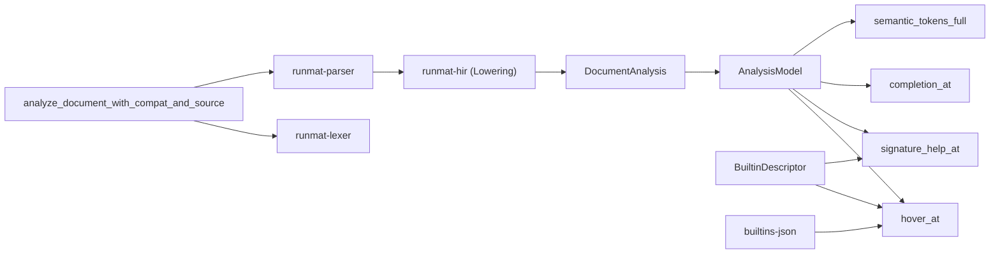
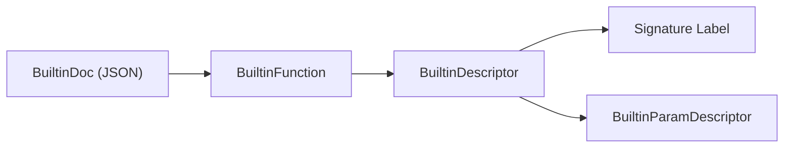

# Language Server Protocol (LSP)

<details>
<summary>Relevant source files</summary>

- [crates/runmat-cli/src/diagnostics.rs](https://github.com/runmat-org/runmat/blob/82685330/crates/runmat-cli/src/diagnostics.rs)
- [crates/runmat-lsp/build.rs](https://github.com/runmat-org/runmat/blob/82685330/crates/runmat-lsp/build.rs)
- [crates/runmat-lsp/src/backend.rs](https://github.com/runmat-org/runmat/blob/82685330/crates/runmat-lsp/src/backend.rs)
- [crates/runmat-lsp/src/core/analysis.rs](https://github.com/runmat-org/runmat/blob/82685330/crates/runmat-lsp/src/core/analysis.rs)
- [crates/runmat-lsp/src/core/docs.rs](https://github.com/runmat-org/runmat/blob/82685330/crates/runmat-lsp/src/core/docs.rs)
- [crates/runmat-lsp/src/core/mod.rs](https://github.com/runmat-org/runmat/blob/82685330/crates/runmat-lsp/src/core/mod.rs)
- [crates/runmat-lsp/src/core/project.rs](https://github.com/runmat-org/runmat/blob/82685330/crates/runmat-lsp/src/core/project.rs)
- [crates/runmat-lsp/src/core/semantic_tokens.rs](https://github.com/runmat-org/runmat/blob/82685330/crates/runmat-lsp/src/core/semantic_tokens.rs)
- [crates/runmat-lsp/src/core/workspace.rs](https://github.com/runmat-org/runmat/blob/82685330/crates/runmat-lsp/src/core/workspace.rs)
- [crates/runmat-lsp/src/wasm/exports.rs](https://github.com/runmat-org/runmat/blob/82685330/crates/runmat-lsp/src/wasm/exports.rs)
- [crates/runmat-plot/src/core/gpu_pack.rs](https://github.com/runmat-org/runmat/blob/82685330/crates/runmat-plot/src/core/gpu_pack.rs)
- [docs-tmp/BUILTIN_METADATA_DELTA_PLAN.md](https://github.com/runmat-org/runmat/blob/82685330/docs-tmp/BUILTIN_METADATA_DELTA_PLAN.md?plain=1)
- [docs-tmp/BUILTIN_METADATA_DELTA_PROGRESS.md](https://github.com/runmat-org/runmat/blob/82685330/docs-tmp/BUILTIN_METADATA_DELTA_PROGRESS.md?plain=1)

</details>

The `runmat-lsp` crate provides a complete Language Server Protocol implementation for the MATLAB language, enabling IDE features like hover documentation, signature help, code completion, and semantic highlighting. It is designed to be transport-agnostic, supporting both native environments (via `tower-lsp`) and WebAssembly environments (via custom TypeScript bindings).

The LSP serves as the bridge between the Natural Language Space (documentation, metadata, and developer intent) and the Code Entity Space (AST nodes, HIR bindings, and VM built-ins).

### Architecture Overview

The LSP architecture centers around a "push-to-analyze" model where document changes trigger a re-analysis pipeline that populates a `DocumentAnalysis` struct.



<details>
<summary>Rendered SVG</summary>

```svg
<svg id="mermaid-ie8roonse38" xmlns="http://www.w3.org/2000/svg" xmlns:xlink="http://www.w3.org/1999/xlink" class="flowchart" style="max-width: 100%; touch-action: none; user-select: none; cursor: grab; min-height: fit-content; max-height: 100%;" viewBox="-0.01792456289194888 5.684341886080802e-14 1284.547567875784 714.9999999999999" role="graphics-document document" aria-roledescription="flowchart-v2" preserveAspectRatio="xMidYMid meet"><style>#mermaid-ie8roonse38{font-family:ui-sans-serif,-apple-system,system-ui,Segoe UI,Helvetica;font-size:16px;fill:#ccc;}@keyframes edge-animation-frame{from{stroke-dashoffset:0;}}@keyframes dash{to{stroke-dashoffset:0;}}#mermaid-ie8roonse38 .edge-animation-slow{stroke-dasharray:9,5!important;stroke-dashoffset:900;animation:dash 50s linear infinite;stroke-linecap:round;}#mermaid-ie8roonse38 .edge-animation-fast{stroke-dasharray:9,5!important;stroke-dashoffset:900;animation:dash 20s linear infinite;stroke-linecap:round;}#mermaid-ie8roonse38 .error-icon{fill:#333;}#mermaid-ie8roonse38 .error-text{fill:#cccccc;stroke:#cccccc;}#mermaid-ie8roonse38 .edge-thickness-normal{stroke-width:1px;}#mermaid-ie8roonse38 .edge-thickness-thick{stroke-width:3.5px;}#mermaid-ie8roonse38 .edge-pattern-solid{stroke-dasharray:0;}#mermaid-ie8roonse38 .edge-thickness-invisible{stroke-width:0;fill:none;}#mermaid-ie8roonse38 .edge-pattern-dashed{stroke-dasharray:3;}#mermaid-ie8roonse38 .edge-pattern-dotted{stroke-dasharray:2;}#mermaid-ie8roonse38 .marker{fill:#666;stroke:#666;}#mermaid-ie8roonse38 .marker.cross{stroke:#666;}#mermaid-ie8roonse38 svg{font-family:ui-sans-serif,-apple-system,system-ui,Segoe UI,Helvetica;font-size:16px;}#mermaid-ie8roonse38 p{margin:0;}#mermaid-ie8roonse38 .label{font-family:ui-sans-serif,-apple-system,system-ui,Segoe UI,Helvetica;color:#fff;}#mermaid-ie8roonse38 .cluster-label text{fill:#fff;}#mermaid-ie8roonse38 .cluster-label span{color:#fff;}#mermaid-ie8roonse38 .cluster-label span p{background-color:transparent;}#mermaid-ie8roonse38 .label text,#mermaid-ie8roonse38 span{fill:#fff;color:#fff;}#mermaid-ie8roonse38 .node rect,#mermaid-ie8roonse38 .node circle,#mermaid-ie8roonse38 .node ellipse,#mermaid-ie8roonse38 .node polygon,#mermaid-ie8roonse38 .node path{fill:#111;stroke:#222;stroke-width:1px;}#mermaid-ie8roonse38 .rough-node .label text,#mermaid-ie8roonse38 .node .label text,#mermaid-ie8roonse38 .image-shape .label,#mermaid-ie8roonse38 .icon-shape .label{text-anchor:middle;}#mermaid-ie8roonse38 .node .katex path{fill:#000;stroke:#000;stroke-width:1px;}#mermaid-ie8roonse38 .rough-node .label,#mermaid-ie8roonse38 .node .label,#mermaid-ie8roonse38 .image-shape .label,#mermaid-ie8roonse38 .icon-shape .label{text-align:center;}#mermaid-ie8roonse38 .node.clickable{cursor:pointer;}#mermaid-ie8roonse38 .root .anchor path{fill:#666!important;stroke-width:0;stroke:#666;}#mermaid-ie8roonse38 .arrowheadPath{fill:#0b0b0b;}#mermaid-ie8roonse38 .edgePath .path{stroke:#666;stroke-width:1px;}#mermaid-ie8roonse38 .flowchart-link{stroke:#666;fill:none;}#mermaid-ie8roonse38 .edgeLabel{background-color:#161616;text-align:center;}#mermaid-ie8roonse38 .edgeLabel p{background-color:#161616;}#mermaid-ie8roonse38 .edgeLabel rect{opacity:0.5;background-color:#161616;fill:#161616;}#mermaid-ie8roonse38 .labelBkg{background-color:rgba(22, 22, 22, 0.5);}#mermaid-ie8roonse38 .cluster rect{fill:#161616;stroke:#222;stroke-width:1px;}#mermaid-ie8roonse38 .cluster text{fill:#fff;}#mermaid-ie8roonse38 .cluster span{color:#fff;}#mermaid-ie8roonse38 div.mermaidTooltip{position:absolute;text-align:center;max-width:200px;padding:2px;font-family:ui-sans-serif,-apple-system,system-ui,Segoe UI,Helvetica;font-size:12px;background:#333;border:1px solid hsl(0, 0%, 10%);border-radius:2px;pointer-events:none;z-index:100;}#mermaid-ie8roonse38 .flowchartTitleText{text-anchor:middle;font-size:18px;fill:#ccc;}#mermaid-ie8roonse38 rect.text{fill:none;stroke-width:0;}#mermaid-ie8roonse38 .icon-shape,#mermaid-ie8roonse38 .image-shape{background-color:#161616;text-align:center;}#mermaid-ie8roonse38 .icon-shape p,#mermaid-ie8roonse38 .image-shape p{background-color:#161616;padding:2px;}#mermaid-ie8roonse38 .icon-shape .label rect,#mermaid-ie8roonse38 .image-shape .label rect{opacity:0.5;background-color:#161616;fill:#161616;}#mermaid-ie8roonse38 .label-icon{display:inline-block;height:1em;overflow:visible;vertical-align:-0.125em;}#mermaid-ie8roonse38 .node .label-icon path{fill:currentColor;stroke:revert;stroke-width:revert;}#mermaid-ie8roonse38 .node .neo-node{stroke:#222;}#mermaid-ie8roonse38 [data-look="neo"].node rect,#mermaid-ie8roonse38 [data-look="neo"].cluster rect,#mermaid-ie8roonse38 [data-look="neo"].node polygon{stroke:url(#mermaid-ie8roonse38-gradient);filter:drop-shadow( 1px 2px 2px rgba(185,185,185,1));}#mermaid-ie8roonse38 [data-look="neo"].node path{stroke:url(#mermaid-ie8roonse38-gradient);stroke-width:1px;}#mermaid-ie8roonse38 [data-look="neo"].node .outer-path{filter:drop-shadow( 1px 2px 2px rgba(185,185,185,1));}#mermaid-ie8roonse38 [data-look="neo"].node .neo-line path{stroke:#222;filter:none;}#mermaid-ie8roonse38 [data-look="neo"].node circle{stroke:url(#mermaid-ie8roonse38-gradient);filter:drop-shadow( 1px 2px 2px rgba(185,185,185,1));}#mermaid-ie8roonse38 [data-look="neo"].node circle .state-start{fill:#000000;}#mermaid-ie8roonse38 [data-look="neo"].icon-shape .icon{fill:url(#mermaid-ie8roonse38-gradient);filter:drop-shadow( 1px 2px 2px rgba(185,185,185,1));}#mermaid-ie8roonse38 [data-look="neo"].icon-shape .icon-neo path{stroke:url(#mermaid-ie8roonse38-gradient);filter:drop-shadow( 1px 2px 2px rgba(185,185,185,1));}#mermaid-ie8roonse38 :root{--mermaid-font-family:"trebuchet ms",verdana,arial,sans-serif;}</style><g><marker id="mermaid-ie8roonse38_flowchart-v2-pointEnd" class="marker flowchart-v2" viewBox="0 0 10 10" refX="5" refY="5" markerUnits="userSpaceOnUse" markerWidth="8" markerHeight="8" orient="auto"><path d="M 0 0 L 10 5 L 0 10 z" class="arrowMarkerPath" style="stroke-width: 1; stroke-dasharray: 1, 0;"></path></marker><marker id="mermaid-ie8roonse38_flowchart-v2-pointStart" class="marker flowchart-v2" viewBox="0 0 10 10" refX="4.5" refY="5" markerUnits="userSpaceOnUse" markerWidth="8" markerHeight="8" orient="auto"><path d="M 0 5 L 10 10 L 10 0 z" class="arrowMarkerPath" style="stroke-width: 1; stroke-dasharray: 1, 0;"></path></marker><marker id="mermaid-ie8roonse38_flowchart-v2-pointEnd-margin" class="marker flowchart-v2" viewBox="0 0 11.5 14" refX="11.5" refY="7" markerUnits="userSpaceOnUse" markerWidth="10.5" markerHeight="14" orient="auto"><path d="M 0 0 L 11.5 7 L 0 14 z" class="arrowMarkerPath" style="stroke-width: 0; stroke-dasharray: 1, 0;"></path></marker><marker id="mermaid-ie8roonse38_flowchart-v2-pointStart-margin" class="marker flowchart-v2" viewBox="0 0 11.5 14" refX="1" refY="7" markerUnits="userSpaceOnUse" markerWidth="11.5" markerHeight="14" orient="auto"><polygon points="0,7 11.5,14 11.5,0" class="arrowMarkerPath" style="stroke-width: 0; stroke-dasharray: 1, 0;"></polygon></marker><marker id="mermaid-ie8roonse38_flowchart-v2-circleEnd" class="marker flowchart-v2" viewBox="0 0 10 10" refX="11" refY="5" markerUnits="userSpaceOnUse" markerWidth="11" markerHeight="11" orient="auto"><circle cx="5" cy="5" r="5" class="arrowMarkerPath" style="stroke-width: 1; stroke-dasharray: 1, 0;"></circle></marker><marker id="mermaid-ie8roonse38_flowchart-v2-circleStart" class="marker flowchart-v2" viewBox="0 0 10 10" refX="-1" refY="5" markerUnits="userSpaceOnUse" markerWidth="11" markerHeight="11" orient="auto"><circle cx="5" cy="5" r="5" class="arrowMarkerPath" style="stroke-width: 1; stroke-dasharray: 1, 0;"></circle></marker><marker id="mermaid-ie8roonse38_flowchart-v2-circleEnd-margin" class="marker flowchart-v2" viewBox="0 0 10 10" refY="5" refX="12.25" markerUnits="userSpaceOnUse" markerWidth="14" markerHeight="14" orient="auto"><circle cx="5" cy="5" r="5" class="arrowMarkerPath" style="stroke-width: 0; stroke-dasharray: 1, 0;"></circle></marker><marker id="mermaid-ie8roonse38_flowchart-v2-circleStart-margin" class="marker flowchart-v2" viewBox="0 0 10 10" refX="-2" refY="5" markerUnits="userSpaceOnUse" markerWidth="14" markerHeight="14" orient="auto"><circle cx="5" cy="5" r="5" class="arrowMarkerPath" style="stroke-width: 0; stroke-dasharray: 1, 0;"></circle></marker><marker id="mermaid-ie8roonse38_flowchart-v2-crossEnd" class="marker cross flowchart-v2" viewBox="0 0 11 11" refX="12" refY="5.2" markerUnits="userSpaceOnUse" markerWidth="11" markerHeight="11" orient="auto"><path d="M 1,1 l 9,9 M 10,1 l -9,9" class="arrowMarkerPath" style="stroke-width: 2; stroke-dasharray: 1, 0;"></path></marker><marker id="mermaid-ie8roonse38_flowchart-v2-crossStart" class="marker cross flowchart-v2" viewBox="0 0 11 11" refX="-1" refY="5.2" markerUnits="userSpaceOnUse" markerWidth="11" markerHeight="11" orient="auto"><path d="M 1,1 l 9,9 M 10,1 l -9,9" class="arrowMarkerPath" style="stroke-width: 2; stroke-dasharray: 1, 0;"></path></marker><marker id="mermaid-ie8roonse38_flowchart-v2-crossEnd-margin" class="marker cross flowchart-v2" viewBox="0 0 15 15" refX="17.7" refY="7.5" markerUnits="userSpaceOnUse" markerWidth="12" markerHeight="12" orient="auto"><path d="M 1,1 L 14,14 M 1,14 L 14,1" class="arrowMarkerPath" style="stroke-width: 2.5;"></path></marker><marker id="mermaid-ie8roonse38_flowchart-v2-crossStart-margin" class="marker cross flowchart-v2" viewBox="0 0 15 15" refX="-3.5" refY="7.5" markerUnits="userSpaceOnUse" markerWidth="12" markerHeight="12" orient="auto"><path d="M 1,1 L 14,14 M 1,14 L 14,1" class="arrowMarkerPath" style="stroke-width: 2.5; stroke-dasharray: 1, 0;"></path></marker><g class="root"><g class="clusters"><g class="cluster" id="mermaid-ie8roonse38-subGraph2" data-look="classic"><rect style="" x="8" y="449" width="450.03125" height="104"></rect><g class="cluster-label" transform="translate(140.578125, 449)"><foreignObject width="184.875" height="24"><div style="display: table-cell; white-space: nowrap; line-height: 1.5;" xmlns="http://www.w3.org/1999/xhtml"><span class="nodeLabel"><p>Metadata Source of Truth</p></span></div></foreignObject></g></g><g class="cluster" id="mermaid-ie8roonse38-subGraph1" data-look="classic"><rect style="" x="49.38671875" y="603" width="1227.125" height="104"></rect><g class="cluster-label" transform="translate(589.99609375, 603)"><foreignObject width="145.90625" height="24"><div style="display: table-cell; white-space: nowrap; line-height: 1.5;" xmlns="http://www.w3.org/1999/xhtml"><span class="nodeLabel"><p>Feature Dispatchers</p></span></div></foreignObject></g></g><g class="cluster" id="mermaid-ie8roonse38-subGraph0" data-look="classic"><rect style="" x="478.03125" y="8" width="737.51171875" height="545"></rect><g class="cluster-label" transform="translate(751.380859375, 8)"><foreignObject width="190.8125" height="24"><div style="display: table-cell; white-space: nowrap; line-height: 1.5;" xmlns="http://www.w3.org/1999/xhtml"><span class="nodeLabel"><p>LSP Backend (runmat-lsp)</p></span></div></foreignObject></g></g></g><g class="edgePaths"><path d="M712.822,87L702.231,91.167C691.64,95.333,670.459,103.667,659.868,111.333C649.277,119,649.277,126,649.277,129.5L649.277,133" id="mermaid-ie8roonse38-L_A_B_0" class="edge-thickness-normal edge-pattern-solid edge-thickness-normal edge-pattern-solid flowchart-link" style=";" data-edge="true" data-et="edge" data-id="L_A_B_0" data-points="W3sieCI6NzEyLjgyMTUxNDQyMzA3NjksInkiOjg3fSx7IngiOjY0OS4yNzczNDM3NSwieSI6MTEyfSx7IngiOjY0OS4yNzczNDM3NSwieSI6MTM3fV0=" data-look="classic" marker-end="url(#mermaid-ie8roonse38_flowchart-v2-pointEnd)"></path><path d="M852.269,87L863.199,91.167C874.128,95.333,895.986,103.667,906.915,111.333C917.844,119,917.844,126,917.844,129.5L917.844,133" id="mermaid-ie8roonse38-L_A_C_0" class="edge-thickness-normal edge-pattern-solid edge-thickness-normal edge-pattern-solid flowchart-link" style=";" data-edge="true" data-et="edge" data-id="L_A_C_0" data-points="W3sieCI6ODUyLjI2OTQ1NjEyOTgwNzcsInkiOjg3fSx7IngiOjkxNy44NDM3NSwieSI6MTEyfSx7IngiOjkxNy44NDM3NSwieSI6MTM3fV0=" data-look="classic" marker-end="url(#mermaid-ie8roonse38_flowchart-v2-pointEnd)"></path><path d="M917.844,191L917.844,195.167C917.844,199.333,917.844,207.667,917.844,215.333C917.844,223,917.844,230,917.844,233.5L917.844,237" id="mermaid-ie8roonse38-L_C_D_0" class="edge-thickness-normal edge-pattern-solid edge-thickness-normal edge-pattern-solid flowchart-link" style=";" data-edge="true" data-et="edge" data-id="L_C_D_0" data-points="W3sieCI6OTE3Ljg0Mzc1LCJ5IjoxOTF9LHsieCI6OTE3Ljg0Mzc1LCJ5IjoyMTZ9LHsieCI6OTE3Ljg0Mzc1LCJ5IjoyNDF9XQ==" data-look="classic" marker-end="url(#mermaid-ie8roonse38_flowchart-v2-pointEnd)"></path><path d="M917.844,295L917.844,299.167C917.844,303.333,917.844,311.667,917.844,319.333C917.844,327,917.844,334,917.844,337.5L917.844,341" id="mermaid-ie8roonse38-L_D_E_0" class="edge-thickness-normal edge-pattern-solid edge-thickness-normal edge-pattern-solid flowchart-link" style=";" data-edge="true" data-et="edge" data-id="L_D_E_0" data-points="W3sieCI6OTE3Ljg0Mzc1LCJ5IjoyOTV9LHsieCI6OTE3Ljg0Mzc1LCJ5IjozMjB9LHsieCI6OTE3Ljg0Mzc1LCJ5IjozNDV9XQ==" data-look="classic" marker-end="url(#mermaid-ie8roonse38_flowchart-v2-pointEnd)"></path><path d="M917.844,399L917.844,403.167C917.844,407.333,917.844,415.667,917.844,424C917.844,432.333,917.844,440.667,917.844,448.333C917.844,456,917.844,463,917.844,466.5L917.844,470" id="mermaid-ie8roonse38-L_E_F_0" class="edge-thickness-normal edge-pattern-solid edge-thickness-normal edge-pattern-solid flowchart-link" style=";" data-edge="true" data-et="edge" data-id="L_E_F_0" data-points="W3sieCI6OTE3Ljg0Mzc1LCJ5IjozOTl9LHsieCI6OTE3Ljg0Mzc1LCJ5Ijo0MjR9LHsieCI6OTE3Ljg0Mzc1LCJ5Ijo0NDl9LHsieCI6OTE3Ljg0Mzc1LCJ5Ijo0NzR9XQ==" data-look="classic" marker-end="url(#mermaid-ie8roonse38_flowchart-v2-pointEnd)"></path><path d="M835.57,521.382L814.298,526.651C793.026,531.921,750.482,542.461,681.118,551.897C611.755,561.333,515.573,569.667,467.482,578C419.391,586.333,419.391,594.667,402.598,604.093C385.805,613.519,352.219,624.037,335.426,629.296L318.634,634.556" id="mermaid-ie8roonse38-L_F_G_0" class="edge-thickness-normal edge-pattern-solid edge-thickness-normal edge-pattern-solid flowchart-link" style=";" data-edge="true" data-et="edge" data-id="L_F_G_0" data-points="W3sieCI6ODM1LjU3MDMxMjUsInkiOjUyMS4zODE1NjkxNTI4OTU2fSx7IngiOjcwNy45Mzc1LCJ5Ijo1NTN9LHsieCI6NDE5LjM5MDYyNSwieSI6NTc4fSx7IngiOjQxOS4zOTA2MjUsInkiOjYwM30seyJ4IjozMTQuODE2NDA2MjUsInkiOjYzNS43NTEyNTI3OTM3ODg5fV0=" data-look="classic" marker-end="url(#mermaid-ie8roonse38_flowchart-v2-pointEnd)"></path><path d="M842.369,528L830.721,532.167C819.074,536.333,795.779,544.667,784.132,553C772.484,561.333,772.484,569.667,772.484,578C772.484,586.333,772.484,594.667,757.295,602.992C742.106,611.318,711.728,619.636,696.539,623.795L681.35,627.954" id="mermaid-ie8roonse38-L_F_H_0" class="edge-thickness-normal edge-pattern-solid edge-thickness-normal edge-pattern-solid flowchart-link" style=";" data-edge="true" data-et="edge" data-id="L_F_H_0" data-points="W3sieCI6ODQyLjM2ODY4OTkwMzg0NjIsInkiOjUyOH0seyJ4Ijo3NzIuNDg0Mzc1LCJ5Ijo1NTN9LHsieCI6NzcyLjQ4NDM3NSwieSI6NTc4fSx7IngiOjc3Mi40ODQzNzUsInkiOjYwM30seyJ4Ijo2NzcuNDkyMTg3NSwieSI6NjI5LjAxMDY5NjA2NzEzODR9XQ==" data-look="classic" marker-end="url(#mermaid-ie8roonse38_flowchart-v2-pointEnd)"></path><path d="M906.419,528L904.656,532.167C902.892,536.333,899.366,544.667,897.603,553C895.84,561.333,895.84,569.667,895.84,578C895.84,586.333,895.84,594.667,895.84,602.333C895.84,610,895.84,617,895.84,620.5L895.84,624" id="mermaid-ie8roonse38-L_F_I_0" class="edge-thickness-normal edge-pattern-solid edge-thickness-normal edge-pattern-solid flowchart-link" style=";" data-edge="true" data-et="edge" data-id="L_F_I_0" data-points="W3sieCI6OTA2LjQxODY0NDgzMTczMDcsInkiOjUyOH0seyJ4Ijo4OTUuODM5ODQzNzUsInkiOjU1M30seyJ4Ijo4OTUuODM5ODQzNzUsInkiOjU3OH0seyJ4Ijo4OTUuODM5ODQzNzUsInkiOjYwM30seyJ4Ijo4OTUuODM5ODQzNzUsInkiOjYyOH1d" data-look="classic" marker-end="url(#mermaid-ie8roonse38_flowchart-v2-pointEnd)"></path><path d="M1000.117,520.74L1022.527,526.117C1044.936,531.493,1089.755,542.247,1112.165,551.79C1134.574,561.333,1134.574,569.667,1134.574,578C1134.574,586.333,1134.574,594.667,1134.574,602.333C1134.574,610,1134.574,617,1134.574,620.5L1134.574,624" id="mermaid-ie8roonse38-L_F_J_0" class="edge-thickness-normal edge-pattern-solid edge-thickness-normal edge-pattern-solid flowchart-link" style=";" data-edge="true" data-et="edge" data-id="L_F_J_0" data-points="W3sieCI6MTAwMC4xMTcxODc1LCJ5Ijo1MjAuNzM5ODEyMTk0NzI2M30seyJ4IjoxMTM0LjU3NDIxODc1LCJ5Ijo1NTN9LHsieCI6MTEzNC41NzQyMTg3NSwieSI6NTc4fSx7IngiOjExMzQuNTc0MjE4NzUsInkiOjYwM30seyJ4IjoxMTM0LjU3NDIxODc1LCJ5Ijo2Mjh9XQ==" data-look="classic" marker-end="url(#mermaid-ie8roonse38_flowchart-v2-pointEnd)"></path><path d="M291.47,528L285.117,532.167C278.765,536.333,266.06,544.667,259.708,553C253.355,561.333,253.355,569.667,253.355,578C253.355,586.333,253.355,594.667,253.355,602.333C253.355,610,253.355,617,253.355,620.5L253.355,624" id="mermaid-ie8roonse38-L_K_G_0" class="edge-thickness-normal edge-pattern-solid edge-thickness-normal edge-pattern-solid flowchart-link" style=";" data-edge="true" data-et="edge" data-id="L_K_G_0" data-points="W3sieCI6MjkxLjQ2OTU3NjMyMjExNTM2LCJ5Ijo1Mjh9LHsieCI6MjUzLjM1NTQ2ODc1LCJ5Ijo1NTN9LHsieCI6MjUzLjM1NTQ2ODc1LCJ5Ijo1Nzh9LHsieCI6MjUzLjM1NTQ2ODc1LCJ5Ijo2MDN9LHsieCI6MjUzLjM1NTQ2ODc1LCJ5Ijo2Mjh9XQ==" data-look="classic" marker-end="url(#mermaid-ie8roonse38_flowchart-v2-pointEnd)"></path><path d="M359.996,528L364.219,532.167C368.441,536.333,376.887,544.667,390.119,553C403.352,561.333,421.371,569.667,430.381,578C439.391,586.333,439.391,594.667,450.237,602.772C461.084,610.878,482.778,618.756,493.624,622.696L504.471,626.635" id="mermaid-ie8roonse38-L_K_H_0" class="edge-thickness-normal edge-pattern-solid edge-thickness-normal edge-pattern-solid flowchart-link" style=";" data-edge="true" data-et="edge" data-id="L_K_H_0" data-points="W3sieCI6MzU5Ljk5NTg2ODM4OTQyMzEsInkiOjUyOH0seyJ4IjozODUuMzMyMDMxMjUsInkiOjU1M30seyJ4Ijo0MzkuMzkwNjI1LCJ5Ijo1Nzh9LHsieCI6NDM5LjM5MDYyNSwieSI6NjAzfSx7IngiOjUwOC4yMzA3NjkyMzA3NjkyLCJ5Ijo2Mjh9XQ==" data-look="classic" marker-end="url(#mermaid-ie8roonse38_flowchart-v2-pointEnd)"></path><path d="M117.617,528L117.617,532.167C117.617,536.333,117.617,544.667,117.617,553C117.617,561.333,117.617,569.667,117.617,578C117.617,586.333,117.617,594.667,129.374,603.337C141.131,612.008,164.645,621.016,176.402,625.52L188.159,630.024" id="mermaid-ie8roonse38-L_L_G_0" class="edge-thickness-normal edge-pattern-solid edge-thickness-normal edge-pattern-solid flowchart-link" style=";" data-edge="true" data-et="edge" data-id="L_L_G_0" data-points="W3sieCI6MTE3LjYxNzE4NzUsInkiOjUyOH0seyJ4IjoxMTcuNjE3MTg3NSwieSI6NTUzfSx7IngiOjExNy42MTcxODc1LCJ5Ijo1Nzh9LHsieCI6MTE3LjYxNzE4NzUsInkiOjYwM30seyJ4IjoxOTEuODk0NTMxMjUsInkiOjYzMS40NTQ5MTk1NjYwMzA2fV0=" data-look="classic" marker-end="url(#mermaid-ie8roonse38_flowchart-v2-pointEnd)"></path></g><g class="edgeLabels"><g class="edgeLabel"><g class="label" data-id="L_A_B_0" transform="translate(0, 0)"><foreignObject width="0" height="0"><div style="display: table-cell; white-space: nowrap; line-height: 1.5; max-width: 200px; text-align: center;" xmlns="http://www.w3.org/1999/xhtml" class="labelBkg"><span class="edgeLabel"></span></div></foreignObject></g></g><g class="edgeLabel"><g class="label" data-id="L_A_C_0" transform="translate(0, 0)"><foreignObject width="0" height="0"><div style="display: table-cell; white-space: nowrap; line-height: 1.5; max-width: 200px; text-align: center;" xmlns="http://www.w3.org/1999/xhtml" class="labelBkg"><span class="edgeLabel"></span></div></foreignObject></g></g><g class="edgeLabel"><g class="label" data-id="L_C_D_0" transform="translate(0, 0)"><foreignObject width="0" height="0"><div style="display: table-cell; white-space: nowrap; line-height: 1.5; max-width: 200px; text-align: center;" xmlns="http://www.w3.org/1999/xhtml" class="labelBkg"><span class="edgeLabel"></span></div></foreignObject></g></g><g class="edgeLabel"><g class="label" data-id="L_D_E_0" transform="translate(0, 0)"><foreignObject width="0" height="0"><div style="display: table-cell; white-space: nowrap; line-height: 1.5; max-width: 200px; text-align: center;" xmlns="http://www.w3.org/1999/xhtml" class="labelBkg"><span class="edgeLabel"></span></div></foreignObject></g></g><g class="edgeLabel"><g class="label" data-id="L_E_F_0" transform="translate(0, 0)"><foreignObject width="0" height="0"><div style="display: table-cell; white-space: nowrap; line-height: 1.5; max-width: 200px; text-align: center;" xmlns="http://www.w3.org/1999/xhtml" class="labelBkg"><span class="edgeLabel"></span></div></foreignObject></g></g><g class="edgeLabel"><g class="label" data-id="L_F_G_0" transform="translate(0, 0)"><foreignObject width="0" height="0"><div style="display: table-cell; white-space: nowrap; line-height: 1.5; max-width: 200px; text-align: center;" xmlns="http://www.w3.org/1999/xhtml" class="labelBkg"><span class="edgeLabel"></span></div></foreignObject></g></g><g class="edgeLabel"><g class="label" data-id="L_F_H_0" transform="translate(0, 0)"><foreignObject width="0" height="0"><div style="display: table-cell; white-space: nowrap; line-height: 1.5; max-width: 200px; text-align: center;" xmlns="http://www.w3.org/1999/xhtml" class="labelBkg"><span class="edgeLabel"></span></div></foreignObject></g></g><g class="edgeLabel"><g class="label" data-id="L_F_I_0" transform="translate(0, 0)"><foreignObject width="0" height="0"><div style="display: table-cell; white-space: nowrap; line-height: 1.5; max-width: 200px; text-align: center;" xmlns="http://www.w3.org/1999/xhtml" class="labelBkg"><span class="edgeLabel"></span></div></foreignObject></g></g><g class="edgeLabel"><g class="label" data-id="L_F_J_0" transform="translate(0, 0)"><foreignObject width="0" height="0"><div style="display: table-cell; white-space: nowrap; line-height: 1.5; max-width: 200px; text-align: center;" xmlns="http://www.w3.org/1999/xhtml" class="labelBkg"><span class="edgeLabel"></span></div></foreignObject></g></g><g class="edgeLabel"><g class="label" data-id="L_K_G_0" transform="translate(0, 0)"><foreignObject width="0" height="0"><div style="display: table-cell; white-space: nowrap; line-height: 1.5; max-width: 200px; text-align: center;" xmlns="http://www.w3.org/1999/xhtml" class="labelBkg"><span class="edgeLabel"></span></div></foreignObject></g></g><g class="edgeLabel"><g class="label" data-id="L_K_H_0" transform="translate(0, 0)"><foreignObject width="0" height="0"><div style="display: table-cell; white-space: nowrap; line-height: 1.5; max-width: 200px; text-align: center;" xmlns="http://www.w3.org/1999/xhtml" class="labelBkg"><span class="edgeLabel"></span></div></foreignObject></g></g><g class="edgeLabel"><g class="label" data-id="L_L_G_0" transform="translate(0, 0)"><foreignObject width="0" height="0"><div style="display: table-cell; white-space: nowrap; line-height: 1.5; max-width: 200px; text-align: center;" xmlns="http://www.w3.org/1999/xhtml" class="labelBkg"><span class="edgeLabel"></span></div></foreignObject></g></g></g><g class="nodes"><g class="node default" id="mermaid-ie8roonse38-flowchart-A-0" data-look="classic" transform="translate(781.44921875, 60)"><rect class="basic label-container" style="" x="-196.03125" y="-27" width="392.0625" height="54"></rect><g class="label" style="" transform="translate(-166.03125, -12)"><rect></rect><foreignObject width="332.0625" height="24"><div style="display: table; white-space: break-spaces; line-height: 1.5; max-width: 200px; text-align: center; width: 200px;" xmlns="http://www.w3.org/1999/xhtml"><span class="nodeLabel"><p>analyze_document_with_compat_and_source</p></span></div></foreignObject></g></g><g class="node default" id="mermaid-ie8roonse38-flowchart-B-1" data-look="classic" transform="translate(649.27734375, 164)"><rect class="basic label-container" style="" x="-76.4609375" y="-27" width="152.921875" height="54"></rect><g class="label" style="" transform="translate(-46.4609375, -12)"><rect></rect><foreignObject width="92.921875" height="24"><div style="display: table-cell; white-space: nowrap; line-height: 1.5; max-width: 200px; text-align: center;" xmlns="http://www.w3.org/1999/xhtml"><span class="nodeLabel"><p>runmat-lexer</p></span></div></foreignObject></g></g><g class="node default" id="mermaid-ie8roonse38-flowchart-C-3" data-look="classic" transform="translate(917.84375, 164)"><rect class="basic label-container" style="" x="-82.3203125" y="-27" width="164.640625" height="54"></rect><g class="label" style="" transform="translate(-52.3203125, -12)"><rect></rect><foreignObject width="104.640625" height="24"><div style="display: table-cell; white-space: nowrap; line-height: 1.5; max-width: 200px; text-align: center;" xmlns="http://www.w3.org/1999/xhtml"><span class="nodeLabel"><p>runmat-parser</p></span></div></foreignObject></g></g><g class="node default" id="mermaid-ie8roonse38-flowchart-D-5" data-look="classic" transform="translate(917.84375, 268)"><rect class="basic label-container" style="" x="-109.1875" y="-27" width="218.375" height="54"></rect><g class="label" style="" transform="translate(-79.1875, -12)"><rect></rect><foreignObject width="158.375" height="24"><div style="display: table-cell; white-space: nowrap; line-height: 1.5; max-width: 200px; text-align: center;" xmlns="http://www.w3.org/1999/xhtml"><span class="nodeLabel"><p>runmat-hir (Lowering)</p></span></div></foreignObject></g></g><g class="node default" id="mermaid-ie8roonse38-flowchart-E-7" data-look="classic" transform="translate(917.84375, 372)"><rect class="basic label-container" style="" x="-97.3671875" y="-27" width="194.734375" height="54"></rect><g class="label" style="" transform="translate(-67.3671875, -12)"><rect></rect><foreignObject width="134.734375" height="24"><div style="display: table-cell; white-space: nowrap; line-height: 1.5; max-width: 200px; text-align: center;" xmlns="http://www.w3.org/1999/xhtml"><span class="nodeLabel"><p>DocumentAnalysis</p></span></div></foreignObject></g></g><g class="node default" id="mermaid-ie8roonse38-flowchart-F-9" data-look="classic" transform="translate(917.84375, 501)"><rect class="basic label-container" style="" x="-82.2734375" y="-27" width="164.546875" height="54"></rect><g class="label" style="" transform="translate(-52.2734375, -12)"><rect></rect><foreignObject width="104.546875" height="24"><div style="display: table-cell; white-space: nowrap; line-height: 1.5; max-width: 200px; text-align: center;" xmlns="http://www.w3.org/1999/xhtml"><span class="nodeLabel"><p>AnalysisModel</p></span></div></foreignObject></g></g><g class="node default" id="mermaid-ie8roonse38-flowchart-G-10" data-look="classic" transform="translate(253.35546875, 655)"><rect class="basic label-container" style="" x="-61.4609375" y="-27" width="122.921875" height="54"></rect><g class="label" style="" transform="translate(-31.4609375, -12)"><rect></rect><foreignObject width="62.921875" height="24"><div style="display: table-cell; white-space: nowrap; line-height: 1.5; max-width: 200px; text-align: center;" xmlns="http://www.w3.org/1999/xhtml"><span class="nodeLabel"><p>hover_at</p></span></div></foreignObject></g></g><g class="node default" id="mermaid-ie8roonse38-flowchart-H-11" data-look="classic" transform="translate(582.578125, 655)"><rect class="basic label-container" style="" x="-94.9140625" y="-27" width="189.828125" height="54"></rect><g class="label" style="" transform="translate(-64.9140625, -12)"><rect></rect><foreignObject width="129.828125" height="24"><div style="display: table-cell; white-space: nowrap; line-height: 1.5; max-width: 200px; text-align: center;" xmlns="http://www.w3.org/1999/xhtml"><span class="nodeLabel"><p>signature_help_at</p></span></div></foreignObject></g></g><g class="node default" id="mermaid-ie8roonse38-flowchart-I-12" data-look="classic" transform="translate(895.83984375, 655)"><rect class="basic label-container" style="" x="-81.796875" y="-27" width="163.59375" height="54"></rect><g class="label" style="" transform="translate(-51.796875, -12)"><rect></rect><foreignObject width="103.59375" height="24"><div style="display: table-cell; white-space: nowrap; line-height: 1.5; max-width: 200px; text-align: center;" xmlns="http://www.w3.org/1999/xhtml"><span class="nodeLabel"><p>completion_at</p></span></div></foreignObject></g></g><g class="node default" id="mermaid-ie8roonse38-flowchart-J-13" data-look="classic" transform="translate(1134.57421875, 655)"><rect class="basic label-container" style="" x="-106.9375" y="-27" width="213.875" height="54"></rect><g class="label" style="" transform="translate(-76.9375, -12)"><rect></rect><foreignObject width="153.875" height="24"><div style="display: table-cell; white-space: nowrap; line-height: 1.5; max-width: 200px; text-align: center;" xmlns="http://www.w3.org/1999/xhtml"><span class="nodeLabel"><p>semantic_tokens_full</p></span></div></foreignObject></g></g><g class="node default" id="mermaid-ie8roonse38-flowchart-K-22" data-look="classic" transform="translate(332.6328125, 501)"><rect class="basic label-container" style="" x="-90.3984375" y="-27" width="180.796875" height="54"></rect><g class="label" style="" transform="translate(-60.3984375, -12)"><rect></rect><foreignObject width="120.796875" height="24"><div style="display: table-cell; white-space: nowrap; line-height: 1.5; max-width: 200px; text-align: center;" xmlns="http://www.w3.org/1999/xhtml"><span class="nodeLabel"><p>BuiltinDescriptor</p></span></div></foreignObject></g></g><g class="node default" id="mermaid-ie8roonse38-flowchart-L-23" data-look="classic" transform="translate(117.6171875, 501)"><rect class="basic label-container" style="" x="-74.6171875" y="-27" width="149.234375" height="54"></rect><g class="label" style="" transform="translate(-44.6171875, -12)"><rect></rect><foreignObject width="89.234375" height="24"><div style="display: table-cell; white-space: nowrap; line-height: 1.5; max-width: 200px; text-align: center;" xmlns="http://www.w3.org/1999/xhtml"><span class="nodeLabel"><p>builtins-json</p></span></div></foreignObject></g></g></g></g></g><defs><filter id="mermaid-ie8roonse38-drop-shadow" height="130%" width="130%"><feDropShadow dx="4" dy="4" stdDeviation="0" flood-opacity="0.06" flood-color="#000000"></feDropShadow></filter></defs><defs><filter id="mermaid-ie8roonse38-drop-shadow-small" height="150%" width="150%"><feDropShadow dx="2" dy="2" stdDeviation="0" flood-opacity="0.06" flood-color="#000000"></feDropShadow></filter></defs><linearGradient id="mermaid-ie8roonse38-gradient" gradientUnits="objectBoundingBox" x1="0%" y1="0%" x2="100%" y2="0%"><stop offset="0%" stop-color="#333" stop-opacity="1"></stop><stop offset="100%" stop-color="hsl(-120, 0%, 3.3333333333%)" stop-opacity="1"></stop></linearGradient></svg>
```

</details>

Sources: [crates/runmat-lsp/src/core/analysis.rs #81-144](https://github.com/runmat-org/runmat/blob/82685330/crates/runmat-lsp/src/core/analysis.rs#L81-L144) [crates/runmat-lsp/src/backend.rs #97-127](https://github.com/runmat-org/runmat/blob/82685330/crates/runmat-lsp/src/backend.rs#L97-L127)

---

### Document Analysis

The core of the LSP is the `DocumentAnalysis` struct, which encapsulates the results of the compilation frontend for a specific version of a file.

- Pipeline: When a document is opened or changed, `analyze_document_with_compat_and_source` tokenizes the text, parses it into an AST using the selected `CompatMode`, and lowers it to HIR.
- AnalysisModel: This structure stores the semantic mapping of the document, including `exported_symbols`, `semantic_hints` (for highlighting), and the results of binding resolution.
- Project Integration: The analysis uses `ProjectContext` to discover symbols across the entire workspace by locating a `runmat.toml` or `runmat.json` manifest.

For details on the analysis pipeline and binding inference, see [Document Analysis & Semantic Hints](https://app.devin.ai/org/runmat-org/wiki/runmat-org/runmat?branch=dev#10.1).

Sources: [crates/runmat-lsp/src/core/analysis.rs #24-49](https://github.com/runmat-org/runmat/blob/82685330/crates/runmat-lsp/src/core/analysis.rs#L24-L49) [crates/runmat-lsp/src/core/project.rs #8-11](https://github.com/runmat-org/runmat/blob/82685330/crates/runmat-lsp/src/core/project.rs#L8-L11) [crates/runmat-lsp/src/core/workspace.rs #10-29](https://github.com/runmat-org/runmat/blob/82685330/crates/runmat-lsp/src/core/workspace.rs#L10-L29)

---

### IDE Features & Built-in Integration

The LSP leverages the `BuiltinDescriptor` metadata system defined in the `runmat-runtime` and `runmat-builtins` crates to provide high-fidelity IDE support for MATLAB built-ins.

| Feature | Logic | Source of Truth |
| --- | --- | --- |
| Hover | hover_at | BuiltinDescriptor (signatures) + builtins-json (narrative) |
| Completion | completion_at | BuiltinCompletionPolicy + HIR Scopes |
| Signature Help | signature_help_at | BuiltinSignatureDescriptor overloads |
| Semantic Tokens | semantic_tokens_full | IdentifierRole (Function, Variable, Parameter, Namespace) |

#### Built-in Metadata Mapping

The LSP bridges system names to code entities by resolving `Ident` tokens against the `BuiltinFunction` registry.



<details>
<summary>Rendered SVG</summary>

```svg
<svg id="mermaid-w5r2dojt0u" xmlns="http://www.w3.org/2000/svg" xmlns:xlink="http://www.w3.org/1999/xlink" class="flowchart" style="max-width: 100%; touch-action: none; user-select: none; cursor: grab; min-height: fit-content; max-height: 100%;" viewBox="-0.049310289241020655 0 1180.957995578482 313" role="graphics-document document" aria-roledescription="flowchart-v2" preserveAspectRatio="xMidYMid meet"><style>#mermaid-w5r2dojt0u{font-family:ui-sans-serif,-apple-system,system-ui,Segoe UI,Helvetica;font-size:16px;fill:#ccc;}@keyframes edge-animation-frame{from{stroke-dashoffset:0;}}@keyframes dash{to{stroke-dashoffset:0;}}#mermaid-w5r2dojt0u .edge-animation-slow{stroke-dasharray:9,5!important;stroke-dashoffset:900;animation:dash 50s linear infinite;stroke-linecap:round;}#mermaid-w5r2dojt0u .edge-animation-fast{stroke-dasharray:9,5!important;stroke-dashoffset:900;animation:dash 20s linear infinite;stroke-linecap:round;}#mermaid-w5r2dojt0u .error-icon{fill:#333;}#mermaid-w5r2dojt0u .error-text{fill:#cccccc;stroke:#cccccc;}#mermaid-w5r2dojt0u .edge-thickness-normal{stroke-width:1px;}#mermaid-w5r2dojt0u .edge-thickness-thick{stroke-width:3.5px;}#mermaid-w5r2dojt0u .edge-pattern-solid{stroke-dasharray:0;}#mermaid-w5r2dojt0u .edge-thickness-invisible{stroke-width:0;fill:none;}#mermaid-w5r2dojt0u .edge-pattern-dashed{stroke-dasharray:3;}#mermaid-w5r2dojt0u .edge-pattern-dotted{stroke-dasharray:2;}#mermaid-w5r2dojt0u .marker{fill:#666;stroke:#666;}#mermaid-w5r2dojt0u .marker.cross{stroke:#666;}#mermaid-w5r2dojt0u svg{font-family:ui-sans-serif,-apple-system,system-ui,Segoe UI,Helvetica;font-size:16px;}#mermaid-w5r2dojt0u p{margin:0;}#mermaid-w5r2dojt0u .label{font-family:ui-sans-serif,-apple-system,system-ui,Segoe UI,Helvetica;color:#fff;}#mermaid-w5r2dojt0u .cluster-label text{fill:#fff;}#mermaid-w5r2dojt0u .cluster-label span{color:#fff;}#mermaid-w5r2dojt0u .cluster-label span p{background-color:transparent;}#mermaid-w5r2dojt0u .label text,#mermaid-w5r2dojt0u span{fill:#fff;color:#fff;}#mermaid-w5r2dojt0u .node rect,#mermaid-w5r2dojt0u .node circle,#mermaid-w5r2dojt0u .node ellipse,#mermaid-w5r2dojt0u .node polygon,#mermaid-w5r2dojt0u .node path{fill:#111;stroke:#222;stroke-width:1px;}#mermaid-w5r2dojt0u .rough-node .label text,#mermaid-w5r2dojt0u .node .label text,#mermaid-w5r2dojt0u .image-shape .label,#mermaid-w5r2dojt0u .icon-shape .label{text-anchor:middle;}#mermaid-w5r2dojt0u .node .katex path{fill:#000;stroke:#000;stroke-width:1px;}#mermaid-w5r2dojt0u .rough-node .label,#mermaid-w5r2dojt0u .node .label,#mermaid-w5r2dojt0u .image-shape .label,#mermaid-w5r2dojt0u .icon-shape .label{text-align:center;}#mermaid-w5r2dojt0u .node.clickable{cursor:pointer;}#mermaid-w5r2dojt0u .root .anchor path{fill:#666!important;stroke-width:0;stroke:#666;}#mermaid-w5r2dojt0u .arrowheadPath{fill:#0b0b0b;}#mermaid-w5r2dojt0u .edgePath .path{stroke:#666;stroke-width:1px;}#mermaid-w5r2dojt0u .flowchart-link{stroke:#666;fill:none;}#mermaid-w5r2dojt0u .edgeLabel{background-color:#161616;text-align:center;}#mermaid-w5r2dojt0u .edgeLabel p{background-color:#161616;}#mermaid-w5r2dojt0u .edgeLabel rect{opacity:0.5;background-color:#161616;fill:#161616;}#mermaid-w5r2dojt0u .labelBkg{background-color:rgba(22, 22, 22, 0.5);}#mermaid-w5r2dojt0u .cluster rect{fill:#161616;stroke:#222;stroke-width:1px;}#mermaid-w5r2dojt0u .cluster text{fill:#fff;}#mermaid-w5r2dojt0u .cluster span{color:#fff;}#mermaid-w5r2dojt0u div.mermaidTooltip{position:absolute;text-align:center;max-width:200px;padding:2px;font-family:ui-sans-serif,-apple-system,system-ui,Segoe UI,Helvetica;font-size:12px;background:#333;border:1px solid hsl(0, 0%, 10%);border-radius:2px;pointer-events:none;z-index:100;}#mermaid-w5r2dojt0u .flowchartTitleText{text-anchor:middle;font-size:18px;fill:#ccc;}#mermaid-w5r2dojt0u rect.text{fill:none;stroke-width:0;}#mermaid-w5r2dojt0u .icon-shape,#mermaid-w5r2dojt0u .image-shape{background-color:#161616;text-align:center;}#mermaid-w5r2dojt0u .icon-shape p,#mermaid-w5r2dojt0u .image-shape p{background-color:#161616;padding:2px;}#mermaid-w5r2dojt0u .icon-shape .label rect,#mermaid-w5r2dojt0u .image-shape .label rect{opacity:0.5;background-color:#161616;fill:#161616;}#mermaid-w5r2dojt0u .label-icon{display:inline-block;height:1em;overflow:visible;vertical-align:-0.125em;}#mermaid-w5r2dojt0u .node .label-icon path{fill:currentColor;stroke:revert;stroke-width:revert;}#mermaid-w5r2dojt0u .node .neo-node{stroke:#222;}#mermaid-w5r2dojt0u [data-look="neo"].node rect,#mermaid-w5r2dojt0u [data-look="neo"].cluster rect,#mermaid-w5r2dojt0u [data-look="neo"].node polygon{stroke:url(#mermaid-w5r2dojt0u-gradient);filter:drop-shadow( 1px 2px 2px rgba(185,185,185,1));}#mermaid-w5r2dojt0u [data-look="neo"].node path{stroke:url(#mermaid-w5r2dojt0u-gradient);stroke-width:1px;}#mermaid-w5r2dojt0u [data-look="neo"].node .outer-path{filter:drop-shadow( 1px 2px 2px rgba(185,185,185,1));}#mermaid-w5r2dojt0u [data-look="neo"].node .neo-line path{stroke:#222;filter:none;}#mermaid-w5r2dojt0u [data-look="neo"].node circle{stroke:url(#mermaid-w5r2dojt0u-gradient);filter:drop-shadow( 1px 2px 2px rgba(185,185,185,1));}#mermaid-w5r2dojt0u [data-look="neo"].node circle .state-start{fill:#000000;}#mermaid-w5r2dojt0u [data-look="neo"].icon-shape .icon{fill:url(#mermaid-w5r2dojt0u-gradient);filter:drop-shadow( 1px 2px 2px rgba(185,185,185,1));}#mermaid-w5r2dojt0u [data-look="neo"].icon-shape .icon-neo path{stroke:url(#mermaid-w5r2dojt0u-gradient);filter:drop-shadow( 1px 2px 2px rgba(185,185,185,1));}#mermaid-w5r2dojt0u :root{--mermaid-font-family:"trebuchet ms",verdana,arial,sans-serif;}</style><g><marker id="mermaid-w5r2dojt0u_flowchart-v2-pointEnd" class="marker flowchart-v2" viewBox="0 0 10 10" refX="5" refY="5" markerUnits="userSpaceOnUse" markerWidth="8" markerHeight="8" orient="auto"><path d="M 0 0 L 10 5 L 0 10 z" class="arrowMarkerPath" style="stroke-width: 1; stroke-dasharray: 1, 0;"></path></marker><marker id="mermaid-w5r2dojt0u_flowchart-v2-pointStart" class="marker flowchart-v2" viewBox="0 0 10 10" refX="4.5" refY="5" markerUnits="userSpaceOnUse" markerWidth="8" markerHeight="8" orient="auto"><path d="M 0 5 L 10 10 L 10 0 z" class="arrowMarkerPath" style="stroke-width: 1; stroke-dasharray: 1, 0;"></path></marker><marker id="mermaid-w5r2dojt0u_flowchart-v2-pointEnd-margin" class="marker flowchart-v2" viewBox="0 0 11.5 14" refX="11.5" refY="7" markerUnits="userSpaceOnUse" markerWidth="10.5" markerHeight="14" orient="auto"><path d="M 0 0 L 11.5 7 L 0 14 z" class="arrowMarkerPath" style="stroke-width: 0; stroke-dasharray: 1, 0;"></path></marker><marker id="mermaid-w5r2dojt0u_flowchart-v2-pointStart-margin" class="marker flowchart-v2" viewBox="0 0 11.5 14" refX="1" refY="7" markerUnits="userSpaceOnUse" markerWidth="11.5" markerHeight="14" orient="auto"><polygon points="0,7 11.5,14 11.5,0" class="arrowMarkerPath" style="stroke-width: 0; stroke-dasharray: 1, 0;"></polygon></marker><marker id="mermaid-w5r2dojt0u_flowchart-v2-circleEnd" class="marker flowchart-v2" viewBox="0 0 10 10" refX="11" refY="5" markerUnits="userSpaceOnUse" markerWidth="11" markerHeight="11" orient="auto"><circle cx="5" cy="5" r="5" class="arrowMarkerPath" style="stroke-width: 1; stroke-dasharray: 1, 0;"></circle></marker><marker id="mermaid-w5r2dojt0u_flowchart-v2-circleStart" class="marker flowchart-v2" viewBox="0 0 10 10" refX="-1" refY="5" markerUnits="userSpaceOnUse" markerWidth="11" markerHeight="11" orient="auto"><circle cx="5" cy="5" r="5" class="arrowMarkerPath" style="stroke-width: 1; stroke-dasharray: 1, 0;"></circle></marker><marker id="mermaid-w5r2dojt0u_flowchart-v2-circleEnd-margin" class="marker flowchart-v2" viewBox="0 0 10 10" refY="5" refX="12.25" markerUnits="userSpaceOnUse" markerWidth="14" markerHeight="14" orient="auto"><circle cx="5" cy="5" r="5" class="arrowMarkerPath" style="stroke-width: 0; stroke-dasharray: 1, 0;"></circle></marker><marker id="mermaid-w5r2dojt0u_flowchart-v2-circleStart-margin" class="marker flowchart-v2" viewBox="0 0 10 10" refX="-2" refY="5" markerUnits="userSpaceOnUse" markerWidth="14" markerHeight="14" orient="auto"><circle cx="5" cy="5" r="5" class="arrowMarkerPath" style="stroke-width: 0; stroke-dasharray: 1, 0;"></circle></marker><marker id="mermaid-w5r2dojt0u_flowchart-v2-crossEnd" class="marker cross flowchart-v2" viewBox="0 0 11 11" refX="12" refY="5.2" markerUnits="userSpaceOnUse" markerWidth="11" markerHeight="11" orient="auto"><path d="M 1,1 l 9,9 M 10,1 l -9,9" class="arrowMarkerPath" style="stroke-width: 2; stroke-dasharray: 1, 0;"></path></marker><marker id="mermaid-w5r2dojt0u_flowchart-v2-crossStart" class="marker cross flowchart-v2" viewBox="0 0 11 11" refX="-1" refY="5.2" markerUnits="userSpaceOnUse" markerWidth="11" markerHeight="11" orient="auto"><path d="M 1,1 l 9,9 M 10,1 l -9,9" class="arrowMarkerPath" style="stroke-width: 2; stroke-dasharray: 1, 0;"></path></marker><marker id="mermaid-w5r2dojt0u_flowchart-v2-crossEnd-margin" class="marker cross flowchart-v2" viewBox="0 0 15 15" refX="17.7" refY="7.5" markerUnits="userSpaceOnUse" markerWidth="12" markerHeight="12" orient="auto"><path d="M 1,1 L 14,14 M 1,14 L 14,1" class="arrowMarkerPath" style="stroke-width: 2.5;"></path></marker><marker id="mermaid-w5r2dojt0u_flowchart-v2-crossStart-margin" class="marker cross flowchart-v2" viewBox="0 0 15 15" refX="-3.5" refY="7.5" markerUnits="userSpaceOnUse" markerWidth="12" markerHeight="12" orient="auto"><path d="M 1,1 L 14,14 M 1,14 L 14,1" class="arrowMarkerPath" style="stroke-width: 2.5; stroke-dasharray: 1, 0;"></path></marker><g class="root"><g class="clusters"><g class="cluster" id="mermaid-w5r2dojt0u-subGraph1" data-look="classic"><rect style="" x="345.296875" y="152" width="827.5625" height="153"></rect><g class="cluster-label" transform="translate(692.2890625, 152)"><foreignObject width="133.578125" height="24"><div style="display: table-cell; white-space: nowrap; line-height: 1.5;" xmlns="http://www.w3.org/1999/xhtml"><span class="nodeLabel"><p>Code Entity Space</p></span></div></foreignObject></g></g><g class="cluster" id="mermaid-w5r2dojt0u-subGraph0" data-look="classic"><rect style="" x="8" y="8" width="1164.859375" height="124"></rect><g class="cluster-label" transform="translate(501.484375, 8)"><foreignObject width="177.890625" height="24"><div style="display: table-cell; white-space: nowrap; line-height: 1.5;" xmlns="http://www.w3.org/1999/xhtml"><span class="nodeLabel"><p>Natural Language Space</p></span></div></foreignObject></g></g></g><g class="edgePaths"><path d="M538.063,221L545.396,221C552.729,221,567.396,221,581.396,221C595.396,221,608.729,221,615.396,221L622.063,221" id="mermaid-w5r2dojt0u-L_BI_Desc_0" class="edge-thickness-normal edge-pattern-solid edge-thickness-normal edge-pattern-solid flowchart-link" style=";" data-edge="true" data-et="edge" data-id="L_BI_Desc_0" data-points="W3sieCI6NTM4LjA2MjUsInkiOjIyMX0seyJ4Ijo1ODIuMDYyNSwieSI6MjIxfSx7IngiOjYyNi4wNjI1LCJ5IjoyMjF9XQ==" data-look="classic" marker-end="url(#mermaid-w5r2dojt0u_flowchart-v2-pointEnd)"></path><path d="M806.859,207.519L816.38,206.099C825.901,204.679,844.943,201.84,876.401,183.822C907.859,165.804,951.734,132.609,973.671,116.011L995.608,99.413" id="mermaid-w5r2dojt0u-L_Desc_Label_0" class="edge-thickness-normal edge-pattern-solid edge-thickness-normal edge-pattern-solid flowchart-link" style=";" data-edge="true" data-et="edge" data-id="L_Desc_Label_0" data-points="W3sieCI6ODA2Ljg1OTM3NSwieSI6MjA3LjUxODk4NTMzMDcyMDc3fSx7IngiOjg2My45ODQzNzUsInkiOjE5OX0seyJ4Ijo5OTguNzk4MzI4NDg4MzcyMSwieSI6OTd9XQ==" data-look="classic" marker-end="url(#mermaid-w5r2dojt0u_flowchart-v2-pointEnd)"></path><path d="M806.859,234.481L816.38,235.901C825.901,237.321,844.943,240.16,863.318,241.58C881.693,243,899.401,243,908.255,243L917.109,243" id="mermaid-w5r2dojt0u-L_Desc_Arg_0" class="edge-thickness-normal edge-pattern-solid edge-thickness-normal edge-pattern-solid flowchart-link" style=";" data-edge="true" data-et="edge" data-id="L_Desc_Arg_0" data-points="W3sieCI6ODA2Ljg1OTM3NSwieSI6MjM0LjQ4MTAxNDY2OTI3OTIzfSx7IngiOjg2My45ODQzNzUsInkiOjI0M30seyJ4Ijo5MjEuMTA5Mzc1LCJ5IjoyNDN9XQ==" data-look="classic" marker-end="url(#mermaid-w5r2dojt0u_flowchart-v2-pointEnd)"></path><path d="M224.422,70L234.495,70C244.568,70,264.714,70,284.859,70C305.005,70,325.151,70,349.736,90.126C374.322,110.252,403.346,150.504,417.859,170.63L432.371,190.756" id="mermaid-w5r2dojt0u-L_Doc_BI_0" class="edge-thickness-normal edge-pattern-solid edge-thickness-normal edge-pattern-solid flowchart-link" style=";" data-edge="true" data-et="edge" data-id="L_Doc_BI_0" data-points="W3sieCI6MjI0LjQyMTg3NSwieSI6NzB9LHsieCI6Mjg0Ljg1OTM3NSwieSI6NzB9LHsieCI6MzQ1LjI5Njg3NSwieSI6NzB9LHsieCI6NDM0LjcxMDU3NTMzMTEyNTgsInkiOjE5NH1d" data-look="classic" marker-end="url(#mermaid-w5r2dojt0u_flowchart-v2-pointEnd)"></path></g><g class="edgeLabels"><g class="edgeLabel" transform="translate(582.0625, 221)"><g class="label" data-id="L_BI_Desc_0" transform="translate(-19, -12)"><foreignObject width="38" height="24"><div style="display: table-cell; white-space: nowrap; line-height: 1.5; max-width: 200px; text-align: center;" xmlns="http://www.w3.org/1999/xhtml" class="labelBkg"><span class="edgeLabel"><p>owns</p></span></div></foreignObject></g></g><g class="edgeLabel" transform="translate(908.36181, 165.42411)"><g class="label" data-id="L_Desc_Label_0" transform="translate(-26.6875, -12)"><foreignObject width="53.375" height="24"><div style="display: table-cell; white-space: nowrap; line-height: 1.5; max-width: 200px; text-align: center;" xmlns="http://www.w3.org/1999/xhtml" class="labelBkg"><span class="edgeLabel"><p>defines</p></span></div></foreignObject></g></g><g class="edgeLabel" transform="translate(863.984375, 243)"><g class="label" data-id="L_Desc_Arg_0" transform="translate(-32.125, -12)"><foreignObject width="64.25" height="24"><div style="display: table-cell; white-space: nowrap; line-height: 1.5; max-width: 200px; text-align: center;" xmlns="http://www.w3.org/1999/xhtml" class="labelBkg"><span class="edgeLabel"><p>validates</p></span></div></foreignObject></g></g><g class="edgeLabel" transform="translate(284.859375, 70)"><g class="label" data-id="L_Doc_BI_0" transform="translate(-35.4375, -12)"><foreignObject width="70.875" height="24"><div style="display: table-cell; white-space: nowrap; line-height: 1.5; max-width: 200px; text-align: center;" xmlns="http://www.w3.org/1999/xhtml" class="labelBkg"><span class="edgeLabel"><p>describes</p></span></div></foreignObject></g></g></g><g class="nodes"><g class="node default" id="mermaid-w5r2dojt0u-flowchart-Doc-0" data-look="classic" transform="translate(128.7109375, 70)"><rect class="basic label-container" style="" x="-95.7109375" y="-27" width="191.421875" height="54"></rect><g class="label" style="" transform="translate(-65.7109375, -12)"><rect></rect><foreignObject width="131.421875" height="24"><div style="display: table-cell; white-space: nowrap; line-height: 1.5; max-width: 200px; text-align: center;" xmlns="http://www.w3.org/1999/xhtml"><span class="nodeLabel"><p>BuiltinDoc (JSON)</p></span></div></foreignObject></g></g><g class="node default" id="mermaid-w5r2dojt0u-flowchart-Label-1" data-look="classic" transform="translate(1034.484375, 70)"><rect class="basic label-container" style="" x="-86.4765625" y="-27" width="172.953125" height="54"></rect><g class="label" style="" transform="translate(-56.4765625, -12)"><rect></rect><foreignObject width="112.953125" height="24"><div style="display: table-cell; white-space: nowrap; line-height: 1.5; max-width: 200px; text-align: center;" xmlns="http://www.w3.org/1999/xhtml"><span class="nodeLabel"><p>Signature Label</p></span></div></foreignObject></g></g><g class="node default" id="mermaid-w5r2dojt0u-flowchart-BI-2" data-look="classic" transform="translate(454.1796875, 221)"><rect class="basic label-container" style="" x="-83.8828125" y="-27" width="167.765625" height="54"></rect><g class="label" style="" transform="translate(-53.8828125, -12)"><rect></rect><foreignObject width="107.765625" height="24"><div style="display: table-cell; white-space: nowrap; line-height: 1.5; max-width: 200px; text-align: center;" xmlns="http://www.w3.org/1999/xhtml"><span class="nodeLabel"><p>BuiltinFunction</p></span></div></foreignObject></g></g><g class="node default" id="mermaid-w5r2dojt0u-flowchart-Desc-3" data-look="classic" transform="translate(716.4609375, 221)"><rect class="basic label-container" style="" x="-90.3984375" y="-27" width="180.796875" height="54"></rect><g class="label" style="" transform="translate(-60.3984375, -12)"><rect></rect><foreignObject width="120.796875" height="24"><div style="display: table-cell; white-space: nowrap; line-height: 1.5; max-width: 200px; text-align: center;" xmlns="http://www.w3.org/1999/xhtml"><span class="nodeLabel"><p>BuiltinDescriptor</p></span></div></foreignObject></g></g><g class="node default" id="mermaid-w5r2dojt0u-flowchart-Arg-4" data-look="classic" transform="translate(1034.484375, 243)"><rect class="basic label-container" style="" x="-113.375" y="-27" width="226.75" height="54"></rect><g class="label" style="" transform="translate(-83.375, -12)"><rect></rect><foreignObject width="166.75" height="24"><div style="display: table-cell; white-space: nowrap; line-height: 1.5; max-width: 200px; text-align: center;" xmlns="http://www.w3.org/1999/xhtml"><span class="nodeLabel"><p>BuiltinParamDescriptor</p></span></div></foreignObject></g></g></g></g></g><defs><filter id="mermaid-w5r2dojt0u-drop-shadow" height="130%" width="130%"><feDropShadow dx="4" dy="4" stdDeviation="0" flood-opacity="0.06" flood-color="#000000"></feDropShadow></filter></defs><defs><filter id="mermaid-w5r2dojt0u-drop-shadow-small" height="150%" width="150%"><feDropShadow dx="2" dy="2" stdDeviation="0" flood-opacity="0.06" flood-color="#000000"></feDropShadow></filter></defs><linearGradient id="mermaid-w5r2dojt0u-gradient" gradientUnits="objectBoundingBox" x1="0%" y1="0%" x2="100%" y2="0%"><stop offset="0%" stop-color="#333" stop-opacity="1"></stop><stop offset="100%" stop-color="hsl(-120, 0%, 3.3333333333%)" stop-opacity="1"></stop></linearGradient></svg>
```

</details>

For details on hover rendering, completion policies, and signature mapping, see [LSP Features: Hover, Completion & Signature Help](https://app.devin.ai/org/runmat-org/wiki/runmat-org/runmat?branch=dev#10.2).

Sources: [crates/runmat-lsp/src/core/docs.rs #114-154](https://github.com/runmat-org/runmat/blob/82685330/crates/runmat-lsp/src/core/docs.rs#L114-L154) [docs-tmp/BUILTIN_METADATA_DELTA_PLAN.md #105-154](https://github.com/runmat-org/runmat/blob/82685330/docs-tmp/BUILTIN_METADATA_DELTA_PLAN.md?plain=1#L105-L154) [crates/runmat-lsp/src/core/semantic_tokens.rs #8-14](https://github.com/runmat-org/runmat/blob/82685330/crates/runmat-lsp/src/core/semantic_tokens.rs#L8-L14)

---

### Workspace Management

The LSP manages document state across both native and web environments.

- Native Backend: Uses `tower-lsp` to handle JSON-RPC communication and `AnalyzerState` to cache `DocumentAnalysis` for open files.
- WASM Backend: Provides a set of `async` exports (e.g., `open_document`, `hover`) that allow a TypeScript host to drive the LSP directly within a browser thread.
- Diagnostics: Errors from the syntax, lowering, and compilation stages are aggregated into `lsp_types::Diagnostic` objects and published to the client.

Sources: [crates/runmat-lsp/src/backend.rs #50-55](https://github.com/runmat-org/runmat/blob/82685330/crates/runmat-lsp/src/backend.rs#L50-L55) [crates/runmat-lsp/src/wasm/exports.rs #79-100](https://github.com/runmat-org/runmat/blob/82685330/crates/runmat-lsp/src/wasm/exports.rs#L79-L100) [crates/runmat-lsp/src/core/analysis.rs #253-270](https://github.com/runmat-org/runmat/blob/82685330/crates/runmat-lsp/src/core/analysis.rs#L253-L270)

---

## Child Pages

- [Document Analysis & Semantic Hints](https://app.devin.ai/org/runmat-org/wiki/runmat-org/runmat?branch=dev#10.1): Deep dive into the `LoweringContext`, binding shape inference, and the `AnalysisModel`.
- [LSP Features: Hover, Completion & Signature Help](https://app.devin.ai/org/runmat-org/wiki/runmat-org/runmat?branch=dev#10.2): Detailed documentation on the dispatcher logic, markdown rendering for hovers, and semantic token legend mapping.
