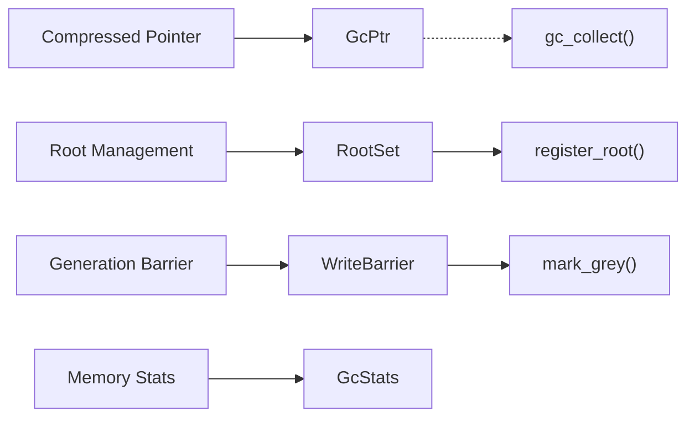
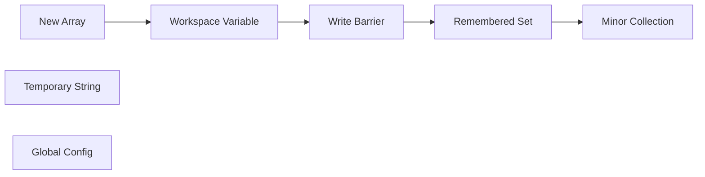

# Memory Management (runmat-gc)

<details>
<summary>Relevant source files</summary>

- [Cargo.lock](https://github.com/runmat-org/runmat/blob/82685330/Cargo.lock)
- [Cargo.toml](https://github.com/runmat-org/runmat/blob/82685330/Cargo.toml)
- [crates/runmat-accelerate-api/Cargo.toml](https://github.com/runmat-org/runmat/blob/82685330/crates/runmat-accelerate-api/Cargo.toml)
- [crates/runmat-accelerate/Cargo.toml](https://github.com/runmat-org/runmat/blob/82685330/crates/runmat-accelerate/Cargo.toml)
- [crates/runmat-builtins/Cargo.toml](https://github.com/runmat-org/runmat/blob/82685330/crates/runmat-builtins/Cargo.toml)
- [crates/runmat-filesystem/src/lib.rs](https://github.com/runmat-org/runmat/blob/82685330/crates/runmat-filesystem/src/lib.rs)
- [crates/runmat-filesystem/src/remote/native.rs](https://github.com/runmat-org/runmat/blob/82685330/crates/runmat-filesystem/src/remote/native.rs)
- [crates/runmat-filesystem/src/remote/wasm.rs](https://github.com/runmat-org/runmat/blob/82685330/crates/runmat-filesystem/src/remote/wasm.rs)
- [crates/runmat-gc-api/Cargo.toml](https://github.com/runmat-org/runmat/blob/82685330/crates/runmat-gc-api/Cargo.toml)
- [crates/runmat-gc/Cargo.toml](https://github.com/runmat-org/runmat/blob/82685330/crates/runmat-gc/Cargo.toml)
- [crates/runmat-gc/src/roots.rs](https://github.com/runmat-org/runmat/blob/82685330/crates/runmat-gc/src/roots.rs)
- [crates/runmat-lexer/Cargo.toml](https://github.com/runmat-org/runmat/blob/82685330/crates/runmat-lexer/Cargo.toml)
- [crates/runmat-macros/Cargo.toml](https://github.com/runmat-org/runmat/blob/82685330/crates/runmat-macros/Cargo.toml)
- [crates/runmat-parser/Cargo.toml](https://github.com/runmat-org/runmat/blob/82685330/crates/runmat-parser/Cargo.toml)
- [crates/runmat-plot/Cargo.toml](https://github.com/runmat-org/runmat/blob/82685330/crates/runmat-plot/Cargo.toml)
- [crates/runmat-runtime/Cargo.toml](https://github.com/runmat-org/runmat/blob/82685330/crates/runmat-runtime/Cargo.toml)
- [crates/runmat-runtime/src/builtins/builtins-json/csvread.json](https://github.com/runmat-org/runmat/blob/82685330/crates/runmat-runtime/src/builtins/builtins-json/csvread.json)
- [crates/runmat-runtime/src/builtins/builtins-json/deconv.json](https://github.com/runmat-org/runmat/blob/82685330/crates/runmat-runtime/src/builtins/builtins-json/deconv.json)
- [crates/runmat-runtime/src/builtins/builtins-json/dot.json](https://github.com/runmat-org/runmat/blob/82685330/crates/runmat-runtime/src/builtins/builtins-json/dot.json)
- [crates/runmat-runtime/src/builtins/common/env.rs](https://github.com/runmat-org/runmat/blob/82685330/crates/runmat-runtime/src/builtins/common/env.rs)
- [crates/runmat-runtime/src/builtins/plotting/ops/print.rs](https://github.com/runmat-org/runmat/blob/82685330/crates/runmat-runtime/src/builtins/plotting/ops/print.rs)
- [crates/runmat-runtime/src/replay/scene.rs](https://github.com/runmat-org/runmat/blob/82685330/crates/runmat-runtime/src/replay/scene.rs)
- [crates/runmat-snapshot/Cargo.toml](https://github.com/runmat-org/runmat/blob/82685330/crates/runmat-snapshot/Cargo.toml)
- [crates/runmat-turbine/Cargo.toml](https://github.com/runmat-org/runmat/blob/82685330/crates/runmat-turbine/Cargo.toml)

</details>

The `runmat-gc` crate implements a high-performance, generational garbage collector designed for the RunMat runtime. It manages the lifecycle of MATLAB-compatible values, including large multi-dimensional arrays, cell arrays, and objects. The system utilizes pointer compression to reduce memory footprint on 64-bit systems and provides strict write barriers to maintain generational invariants.

## Architecture Overview

RunMat's memory management is built around a generational hypothesis: most objects die young. The heap is divided into a Young Generation (for new allocations) and an Old Generation (for long-lived data).

### Key Components

| Component | Role | Code Entity |
| --- | --- | --- |
| GcPtr | A smart pointer that abstracts whether a pointer is compressed or raw. | GcPtr<T> |
| Allocator | Manages the raw memory blocks and generation boundaries. | GcAllocator |
| Write Barrier | Ensures that references from Old to Young generations are tracked. | write_barrier() |
| Roots Tracking | Tracks stack-based and global references to prevent premature collection. | RootSet |

### Natural Language to Code Entity Mapping

The following diagram bridges high-level GC concepts to their specific implementations within the `runmat-gc` and `runmat-gc-api` crates.

GC Entity Mapping



<details>
<summary>Rendered SVG</summary>

```svg
<svg id="mermaid-8vv42nbv1a" xmlns="http://www.w3.org/2000/svg" xmlns:xlink="http://www.w3.org/1999/xlink" class="flowchart" style="max-width: 100%; touch-action: none; user-select: none; cursor: grab; min-height: fit-content; max-height: 100%;" viewBox="-0.013677060385248296 0 990.2773541207705 428" role="graphics-document document" aria-roledescription="flowchart-v2" preserveAspectRatio="xMidYMid meet"><style>#mermaid-8vv42nbv1a{font-family:ui-sans-serif,-apple-system,system-ui,Segoe UI,Helvetica;font-size:16px;fill:#ccc;}@keyframes edge-animation-frame{from{stroke-dashoffset:0;}}@keyframes dash{to{stroke-dashoffset:0;}}#mermaid-8vv42nbv1a .edge-animation-slow{stroke-dasharray:9,5!important;stroke-dashoffset:900;animation:dash 50s linear infinite;stroke-linecap:round;}#mermaid-8vv42nbv1a .edge-animation-fast{stroke-dasharray:9,5!important;stroke-dashoffset:900;animation:dash 20s linear infinite;stroke-linecap:round;}#mermaid-8vv42nbv1a .error-icon{fill:#333;}#mermaid-8vv42nbv1a .error-text{fill:#cccccc;stroke:#cccccc;}#mermaid-8vv42nbv1a .edge-thickness-normal{stroke-width:1px;}#mermaid-8vv42nbv1a .edge-thickness-thick{stroke-width:3.5px;}#mermaid-8vv42nbv1a .edge-pattern-solid{stroke-dasharray:0;}#mermaid-8vv42nbv1a .edge-thickness-invisible{stroke-width:0;fill:none;}#mermaid-8vv42nbv1a .edge-pattern-dashed{stroke-dasharray:3;}#mermaid-8vv42nbv1a .edge-pattern-dotted{stroke-dasharray:2;}#mermaid-8vv42nbv1a .marker{fill:#666;stroke:#666;}#mermaid-8vv42nbv1a .marker.cross{stroke:#666;}#mermaid-8vv42nbv1a svg{font-family:ui-sans-serif,-apple-system,system-ui,Segoe UI,Helvetica;font-size:16px;}#mermaid-8vv42nbv1a p{margin:0;}#mermaid-8vv42nbv1a .label{font-family:ui-sans-serif,-apple-system,system-ui,Segoe UI,Helvetica;color:#fff;}#mermaid-8vv42nbv1a .cluster-label text{fill:#fff;}#mermaid-8vv42nbv1a .cluster-label span{color:#fff;}#mermaid-8vv42nbv1a .cluster-label span p{background-color:transparent;}#mermaid-8vv42nbv1a .label text,#mermaid-8vv42nbv1a span{fill:#fff;color:#fff;}#mermaid-8vv42nbv1a .node rect,#mermaid-8vv42nbv1a .node circle,#mermaid-8vv42nbv1a .node ellipse,#mermaid-8vv42nbv1a .node polygon,#mermaid-8vv42nbv1a .node path{fill:#111;stroke:#222;stroke-width:1px;}#mermaid-8vv42nbv1a .rough-node .label text,#mermaid-8vv42nbv1a .node .label text,#mermaid-8vv42nbv1a .image-shape .label,#mermaid-8vv42nbv1a .icon-shape .label{text-anchor:middle;}#mermaid-8vv42nbv1a .node .katex path{fill:#000;stroke:#000;stroke-width:1px;}#mermaid-8vv42nbv1a .rough-node .label,#mermaid-8vv42nbv1a .node .label,#mermaid-8vv42nbv1a .image-shape .label,#mermaid-8vv42nbv1a .icon-shape .label{text-align:center;}#mermaid-8vv42nbv1a .node.clickable{cursor:pointer;}#mermaid-8vv42nbv1a .root .anchor path{fill:#666!important;stroke-width:0;stroke:#666;}#mermaid-8vv42nbv1a .arrowheadPath{fill:#0b0b0b;}#mermaid-8vv42nbv1a .edgePath .path{stroke:#666;stroke-width:1px;}#mermaid-8vv42nbv1a .flowchart-link{stroke:#666;fill:none;}#mermaid-8vv42nbv1a .edgeLabel{background-color:#161616;text-align:center;}#mermaid-8vv42nbv1a .edgeLabel p{background-color:#161616;}#mermaid-8vv42nbv1a .edgeLabel rect{opacity:0.5;background-color:#161616;fill:#161616;}#mermaid-8vv42nbv1a .labelBkg{background-color:rgba(22, 22, 22, 0.5);}#mermaid-8vv42nbv1a .cluster rect{fill:#161616;stroke:#222;stroke-width:1px;}#mermaid-8vv42nbv1a .cluster text{fill:#fff;}#mermaid-8vv42nbv1a .cluster span{color:#fff;}#mermaid-8vv42nbv1a div.mermaidTooltip{position:absolute;text-align:center;max-width:200px;padding:2px;font-family:ui-sans-serif,-apple-system,system-ui,Segoe UI,Helvetica;font-size:12px;background:#333;border:1px solid hsl(0, 0%, 10%);border-radius:2px;pointer-events:none;z-index:100;}#mermaid-8vv42nbv1a .flowchartTitleText{text-anchor:middle;font-size:18px;fill:#ccc;}#mermaid-8vv42nbv1a rect.text{fill:none;stroke-width:0;}#mermaid-8vv42nbv1a .icon-shape,#mermaid-8vv42nbv1a .image-shape{background-color:#161616;text-align:center;}#mermaid-8vv42nbv1a .icon-shape p,#mermaid-8vv42nbv1a .image-shape p{background-color:#161616;padding:2px;}#mermaid-8vv42nbv1a .icon-shape .label rect,#mermaid-8vv42nbv1a .image-shape .label rect{opacity:0.5;background-color:#161616;fill:#161616;}#mermaid-8vv42nbv1a .label-icon{display:inline-block;height:1em;overflow:visible;vertical-align:-0.125em;}#mermaid-8vv42nbv1a .node .label-icon path{fill:currentColor;stroke:revert;stroke-width:revert;}#mermaid-8vv42nbv1a .node .neo-node{stroke:#222;}#mermaid-8vv42nbv1a [data-look="neo"].node rect,#mermaid-8vv42nbv1a [data-look="neo"].cluster rect,#mermaid-8vv42nbv1a [data-look="neo"].node polygon{stroke:url(#mermaid-8vv42nbv1a-gradient);filter:drop-shadow( 1px 2px 2px rgba(185,185,185,1));}#mermaid-8vv42nbv1a [data-look="neo"].node path{stroke:url(#mermaid-8vv42nbv1a-gradient);stroke-width:1px;}#mermaid-8vv42nbv1a [data-look="neo"].node .outer-path{filter:drop-shadow( 1px 2px 2px rgba(185,185,185,1));}#mermaid-8vv42nbv1a [data-look="neo"].node .neo-line path{stroke:#222;filter:none;}#mermaid-8vv42nbv1a [data-look="neo"].node circle{stroke:url(#mermaid-8vv42nbv1a-gradient);filter:drop-shadow( 1px 2px 2px rgba(185,185,185,1));}#mermaid-8vv42nbv1a [data-look="neo"].node circle .state-start{fill:#000000;}#mermaid-8vv42nbv1a [data-look="neo"].icon-shape .icon{fill:url(#mermaid-8vv42nbv1a-gradient);filter:drop-shadow( 1px 2px 2px rgba(185,185,185,1));}#mermaid-8vv42nbv1a [data-look="neo"].icon-shape .icon-neo path{stroke:url(#mermaid-8vv42nbv1a-gradient);filter:drop-shadow( 1px 2px 2px rgba(185,185,185,1));}#mermaid-8vv42nbv1a :root{--mermaid-font-family:"trebuchet ms",verdana,arial,sans-serif;}</style><g><marker id="mermaid-8vv42nbv1a_flowchart-v2-pointEnd" class="marker flowchart-v2" viewBox="0 0 10 10" refX="5" refY="5" markerUnits="userSpaceOnUse" markerWidth="8" markerHeight="8" orient="auto"><path d="M 0 0 L 10 5 L 0 10 z" class="arrowMarkerPath" style="stroke-width: 1; stroke-dasharray: 1, 0;"></path></marker><marker id="mermaid-8vv42nbv1a_flowchart-v2-pointStart" class="marker flowchart-v2" viewBox="0 0 10 10" refX="4.5" refY="5" markerUnits="userSpaceOnUse" markerWidth="8" markerHeight="8" orient="auto"><path d="M 0 5 L 10 10 L 10 0 z" class="arrowMarkerPath" style="stroke-width: 1; stroke-dasharray: 1, 0;"></path></marker><marker id="mermaid-8vv42nbv1a_flowchart-v2-pointEnd-margin" class="marker flowchart-v2" viewBox="0 0 11.5 14" refX="11.5" refY="7" markerUnits="userSpaceOnUse" markerWidth="10.5" markerHeight="14" orient="auto"><path d="M 0 0 L 11.5 7 L 0 14 z" class="arrowMarkerPath" style="stroke-width: 0; stroke-dasharray: 1, 0;"></path></marker><marker id="mermaid-8vv42nbv1a_flowchart-v2-pointStart-margin" class="marker flowchart-v2" viewBox="0 0 11.5 14" refX="1" refY="7" markerUnits="userSpaceOnUse" markerWidth="11.5" markerHeight="14" orient="auto"><polygon points="0,7 11.5,14 11.5,0" class="arrowMarkerPath" style="stroke-width: 0; stroke-dasharray: 1, 0;"></polygon></marker><marker id="mermaid-8vv42nbv1a_flowchart-v2-circleEnd" class="marker flowchart-v2" viewBox="0 0 10 10" refX="11" refY="5" markerUnits="userSpaceOnUse" markerWidth="11" markerHeight="11" orient="auto"><circle cx="5" cy="5" r="5" class="arrowMarkerPath" style="stroke-width: 1; stroke-dasharray: 1, 0;"></circle></marker><marker id="mermaid-8vv42nbv1a_flowchart-v2-circleStart" class="marker flowchart-v2" viewBox="0 0 10 10" refX="-1" refY="5" markerUnits="userSpaceOnUse" markerWidth="11" markerHeight="11" orient="auto"><circle cx="5" cy="5" r="5" class="arrowMarkerPath" style="stroke-width: 1; stroke-dasharray: 1, 0;"></circle></marker><marker id="mermaid-8vv42nbv1a_flowchart-v2-circleEnd-margin" class="marker flowchart-v2" viewBox="0 0 10 10" refY="5" refX="12.25" markerUnits="userSpaceOnUse" markerWidth="14" markerHeight="14" orient="auto"><circle cx="5" cy="5" r="5" class="arrowMarkerPath" style="stroke-width: 0; stroke-dasharray: 1, 0;"></circle></marker><marker id="mermaid-8vv42nbv1a_flowchart-v2-circleStart-margin" class="marker flowchart-v2" viewBox="0 0 10 10" refX="-2" refY="5" markerUnits="userSpaceOnUse" markerWidth="14" markerHeight="14" orient="auto"><circle cx="5" cy="5" r="5" class="arrowMarkerPath" style="stroke-width: 0; stroke-dasharray: 1, 0;"></circle></marker><marker id="mermaid-8vv42nbv1a_flowchart-v2-crossEnd" class="marker cross flowchart-v2" viewBox="0 0 11 11" refX="12" refY="5.2" markerUnits="userSpaceOnUse" markerWidth="11" markerHeight="11" orient="auto"><path d="M 1,1 l 9,9 M 10,1 l -9,9" class="arrowMarkerPath" style="stroke-width: 2; stroke-dasharray: 1, 0;"></path></marker><marker id="mermaid-8vv42nbv1a_flowchart-v2-crossStart" class="marker cross flowchart-v2" viewBox="0 0 11 11" refX="-1" refY="5.2" markerUnits="userSpaceOnUse" markerWidth="11" markerHeight="11" orient="auto"><path d="M 1,1 l 9,9 M 10,1 l -9,9" class="arrowMarkerPath" style="stroke-width: 2; stroke-dasharray: 1, 0;"></path></marker><marker id="mermaid-8vv42nbv1a_flowchart-v2-crossEnd-margin" class="marker cross flowchart-v2" viewBox="0 0 15 15" refX="17.7" refY="7.5" markerUnits="userSpaceOnUse" markerWidth="12" markerHeight="12" orient="auto"><path d="M 1,1 L 14,14 M 1,14 L 14,1" class="arrowMarkerPath" style="stroke-width: 2.5;"></path></marker><marker id="mermaid-8vv42nbv1a_flowchart-v2-crossStart-margin" class="marker cross flowchart-v2" viewBox="0 0 15 15" refX="-3.5" refY="7.5" markerUnits="userSpaceOnUse" markerWidth="12" markerHeight="12" orient="auto"><path d="M 1,1 L 14,14 M 1,14 L 14,1" class="arrowMarkerPath" style="stroke-width: 2.5; stroke-dasharray: 1, 0;"></path></marker><g class="root"><g class="clusters"><g class="cluster" id="mermaid-8vv42nbv1a-subGraph2" data-look="classic"><rect style="" x="38.6328125" y="316" width="710.46875" height="104"></rect><g class="cluster-label" transform="translate(328.9921875, 316)"><foreignObject width="129.75" height="24"><div style="display: table-cell; white-space: nowrap; line-height: 1.5;" xmlns="http://www.w3.org/1999/xhtml"><span class="nodeLabel"><p>Functions &amp; Logic</p></span></div></foreignObject></g></g><g class="cluster" id="mermaid-8vv42nbv1a-subGraph1" data-look="classic"><rect style="" x="60.921875" y="162" width="899.625" height="104"></rect><g class="cluster-label" transform="translate(338.7109375, 162)"><foreignObject width="344.046875" height="24"><div style="display: table-cell; white-space: nowrap; line-height: 1.5;" xmlns="http://www.w3.org/1999/xhtml"><span class="nodeLabel"><p>Code Entity Space (runmat-gc / runmat-gc-api)</p></span></div></foreignObject></g></g><g class="cluster" id="mermaid-8vv42nbv1a-subGraph0" data-look="classic"><rect style="" x="8" y="8" width="974.25" height="104"></rect><g class="cluster-label" transform="translate(394.0234375, 8)"><foreignObject width="202.203125" height="24"><div style="display: table-cell; white-space: nowrap; line-height: 1.5;" xmlns="http://www.w3.org/1999/xhtml"><span class="nodeLabel"><p>Natural Language Concepts</p></span></div></foreignObject></g></g></g><g class="edgePaths"><path d="M146.82,87L146.82,91.167C146.82,95.333,146.82,103.667,146.82,112C146.82,120.333,146.82,128.667,146.82,137C146.82,145.333,146.82,153.667,146.82,161.333C146.82,169,146.82,176,146.82,179.5L146.82,183" id="mermaid-8vv42nbv1a-L_A_A1_0" class="edge-thickness-normal edge-pattern-solid edge-thickness-normal edge-pattern-solid flowchart-link" style=";" data-edge="true" data-et="edge" data-id="L_A_A1_0" data-points="W3sieCI6MTQ2LjgyMDMxMjUsInkiOjg3fSx7IngiOjE0Ni44MjAzMTI1LCJ5IjoxMTJ9LHsieCI6MTQ2LjgyMDMxMjUsInkiOjEzN30seyJ4IjoxNDYuODIwMzEyNSwieSI6MTYyfSx7IngiOjE0Ni44MjAzMTI1LCJ5IjoxODd9XQ==" data-look="classic" marker-end="url(#mermaid-8vv42nbv1a_flowchart-v2-pointEnd)"></path><path d="M397.055,87L397.055,91.167C397.055,95.333,397.055,103.667,397.055,112C397.055,120.333,397.055,128.667,397.055,137C397.055,145.333,397.055,153.667,397.055,161.333C397.055,169,397.055,176,397.055,179.5L397.055,183" id="mermaid-8vv42nbv1a-L_B_B1_0" class="edge-thickness-normal edge-pattern-solid edge-thickness-normal edge-pattern-solid flowchart-link" style=";" data-edge="true" data-et="edge" data-id="L_B_B1_0" data-points="W3sieCI6Mzk3LjA1NDY4NzUsInkiOjg3fSx7IngiOjM5Ny4wNTQ2ODc1LCJ5IjoxMTJ9LHsieCI6Mzk3LjA1NDY4NzUsInkiOjEzN30seyJ4IjozOTcuMDU0Njg3NSwieSI6MTYyfSx7IngiOjM5Ny4wNTQ2ODc1LCJ5IjoxODd9XQ==" data-look="classic" marker-end="url(#mermaid-8vv42nbv1a_flowchart-v2-pointEnd)"></path><path d="M639.867,87L639.867,91.167C639.867,95.333,639.867,103.667,639.867,112C639.867,120.333,639.867,128.667,639.867,137C639.867,145.333,639.867,153.667,639.867,161.333C639.867,169,639.867,176,639.867,179.5L639.867,183" id="mermaid-8vv42nbv1a-L_C_C1_0" class="edge-thickness-normal edge-pattern-solid edge-thickness-normal edge-pattern-solid flowchart-link" style=";" data-edge="true" data-et="edge" data-id="L_C_C1_0" data-points="W3sieCI6NjM5Ljg2NzE4NzUsInkiOjg3fSx7IngiOjYzOS44NjcxODc1LCJ5IjoxMTJ9LHsieCI6NjM5Ljg2NzE4NzUsInkiOjEzN30seyJ4Ijo2MzkuODY3MTg3NSwieSI6MTYyfSx7IngiOjYzOS44NjcxODc1LCJ5IjoxODd9XQ==" data-look="classic" marker-end="url(#mermaid-8vv42nbv1a_flowchart-v2-pointEnd)"></path><path d="M866.758,87L866.758,91.167C866.758,95.333,866.758,103.667,866.758,112C866.758,120.333,866.758,128.667,866.758,137C866.758,145.333,866.758,153.667,866.758,161.333C866.758,169,866.758,176,866.758,179.5L866.758,183" id="mermaid-8vv42nbv1a-L_D_D1_0" class="edge-thickness-normal edge-pattern-solid edge-thickness-normal edge-pattern-solid flowchart-link" style=";" data-edge="true" data-et="edge" data-id="L_D_D1_0" data-points="W3sieCI6ODY2Ljc1NzgxMjUsInkiOjg3fSx7IngiOjg2Ni43NTc4MTI1LCJ5IjoxMTJ9LHsieCI6ODY2Ljc1NzgxMjUsInkiOjEzN30seyJ4Ijo4NjYuNzU3ODEyNSwieSI6MTYyfSx7IngiOjg2Ni43NTc4MTI1LCJ5IjoxODd9XQ==" data-look="classic" marker-end="url(#mermaid-8vv42nbv1a_flowchart-v2-pointEnd)"></path><path d="M397.055,241L397.055,245.167C397.055,249.333,397.055,257.667,397.055,266C397.055,274.333,397.055,282.667,397.055,291C397.055,299.333,397.055,307.667,397.055,315.333C397.055,323,397.055,330,397.055,333.5L397.055,337" id="mermaid-8vv42nbv1a-L_B1_F2_0" class="edge-thickness-normal edge-pattern-solid edge-thickness-normal edge-pattern-solid flowchart-link" style=";" data-edge="true" data-et="edge" data-id="L_B1_F2_0" data-points="W3sieCI6Mzk3LjA1NDY4NzUsInkiOjI0MX0seyJ4IjozOTcuMDU0Njg3NSwieSI6MjY2fSx7IngiOjM5Ny4wNTQ2ODc1LCJ5IjoyOTF9LHsieCI6Mzk3LjA1NDY4NzUsInkiOjMxNn0seyJ4IjozOTcuMDU0Njg3NSwieSI6MzQxfV0=" data-look="classic" marker-end="url(#mermaid-8vv42nbv1a_flowchart-v2-pointEnd)"></path><path d="M146.82,241L146.82,245.167C146.82,249.333,146.82,257.667,146.82,266C146.82,274.333,146.82,282.667,146.82,291C146.82,299.333,146.82,307.667,146.82,315.333C146.82,323,146.82,330,146.82,333.5L146.82,337" id="mermaid-8vv42nbv1a-L_A1_F1_0" class="edge-thickness-normal edge-pattern-dotted edge-thickness-normal edge-pattern-solid flowchart-link" style=";" data-edge="true" data-et="edge" data-id="L_A1_F1_0" data-points="W3sieCI6MTQ2LjgyMDMxMjUsInkiOjI0MX0seyJ4IjoxNDYuODIwMzEyNSwieSI6MjY2fSx7IngiOjE0Ni44MjAzMTI1LCJ5IjoyOTF9LHsieCI6MTQ2LjgyMDMxMjUsInkiOjMxNn0seyJ4IjoxNDYuODIwMzEyNSwieSI6MzQxfV0=" data-look="classic" marker-end="url(#mermaid-8vv42nbv1a_flowchart-v2-pointEnd)"></path><path d="M639.867,241L639.867,245.167C639.867,249.333,639.867,257.667,639.867,266C639.867,274.333,639.867,282.667,639.867,291C639.867,299.333,639.867,307.667,639.867,315.333C639.867,323,639.867,330,639.867,333.5L639.867,337" id="mermaid-8vv42nbv1a-L_C1_F3_0" class="edge-thickness-normal edge-pattern-solid edge-thickness-normal edge-pattern-solid flowchart-link" style=";" data-edge="true" data-et="edge" data-id="L_C1_F3_0" data-points="W3sieCI6NjM5Ljg2NzE4NzUsInkiOjI0MX0seyJ4Ijo2MzkuODY3MTg3NSwieSI6MjY2fSx7IngiOjYzOS44NjcxODc1LCJ5IjoyOTF9LHsieCI6NjM5Ljg2NzE4NzUsInkiOjMxNn0seyJ4Ijo2MzkuODY3MTg3NSwieSI6MzQxfV0=" data-look="classic" marker-end="url(#mermaid-8vv42nbv1a_flowchart-v2-pointEnd)"></path></g><g class="edgeLabels"><g class="edgeLabel"><g class="label" data-id="L_A_A1_0" transform="translate(0, 0)"><foreignObject width="0" height="0"><div style="display: table-cell; white-space: nowrap; line-height: 1.5; max-width: 200px; text-align: center;" xmlns="http://www.w3.org/1999/xhtml" class="labelBkg"><span class="edgeLabel"></span></div></foreignObject></g></g><g class="edgeLabel"><g class="label" data-id="L_B_B1_0" transform="translate(0, 0)"><foreignObject width="0" height="0"><div style="display: table-cell; white-space: nowrap; line-height: 1.5; max-width: 200px; text-align: center;" xmlns="http://www.w3.org/1999/xhtml" class="labelBkg"><span class="edgeLabel"></span></div></foreignObject></g></g><g class="edgeLabel"><g class="label" data-id="L_C_C1_0" transform="translate(0, 0)"><foreignObject width="0" height="0"><div style="display: table-cell; white-space: nowrap; line-height: 1.5; max-width: 200px; text-align: center;" xmlns="http://www.w3.org/1999/xhtml" class="labelBkg"><span class="edgeLabel"></span></div></foreignObject></g></g><g class="edgeLabel"><g class="label" data-id="L_D_D1_0" transform="translate(0, 0)"><foreignObject width="0" height="0"><div style="display: table-cell; white-space: nowrap; line-height: 1.5; max-width: 200px; text-align: center;" xmlns="http://www.w3.org/1999/xhtml" class="labelBkg"><span class="edgeLabel"></span></div></foreignObject></g></g><g class="edgeLabel"><g class="label" data-id="L_B1_F2_0" transform="translate(0, 0)"><foreignObject width="0" height="0"><div style="display: table-cell; white-space: nowrap; line-height: 1.5; max-width: 200px; text-align: center;" xmlns="http://www.w3.org/1999/xhtml" class="labelBkg"><span class="edgeLabel"></span></div></foreignObject></g></g><g class="edgeLabel"><g class="label" data-id="L_A1_F1_0" transform="translate(0, 0)"><foreignObject width="0" height="0"><div style="display: table-cell; white-space: nowrap; line-height: 1.5; max-width: 200px; text-align: center;" xmlns="http://www.w3.org/1999/xhtml" class="labelBkg"><span class="edgeLabel"></span></div></foreignObject></g></g><g class="edgeLabel"><g class="label" data-id="L_C1_F3_0" transform="translate(0, 0)"><foreignObject width="0" height="0"><div style="display: table-cell; white-space: nowrap; line-height: 1.5; max-width: 200px; text-align: center;" xmlns="http://www.w3.org/1999/xhtml" class="labelBkg"><span class="edgeLabel"></span></div></foreignObject></g></g></g><g class="nodes"><g class="node default" id="mermaid-8vv42nbv1a-flowchart-A-0" data-look="classic" transform="translate(146.8203125, 60)"><rect class="basic label-container" style="" x="-103.8203125" y="-27" width="207.640625" height="54"></rect><g class="label" style="" transform="translate(-73.8203125, -12)"><rect></rect><foreignObject width="147.640625" height="24"><div style="display: table-cell; white-space: nowrap; line-height: 1.5; max-width: 200px; text-align: center;" xmlns="http://www.w3.org/1999/xhtml"><span class="nodeLabel"><p>Compressed Pointer</p></span></div></foreignObject></g></g><g class="node default" id="mermaid-8vv42nbv1a-flowchart-B-1" data-look="classic" transform="translate(397.0546875, 60)"><rect class="basic label-container" style="" x="-96.4140625" y="-27" width="192.828125" height="54"></rect><g class="label" style="" transform="translate(-66.4140625, -12)"><rect></rect><foreignObject width="132.828125" height="24"><div style="display: table-cell; white-space: nowrap; line-height: 1.5; max-width: 200px; text-align: center;" xmlns="http://www.w3.org/1999/xhtml"><span class="nodeLabel"><p>Root Management</p></span></div></foreignObject></g></g><g class="node default" id="mermaid-8vv42nbv1a-flowchart-C-2" data-look="classic" transform="translate(639.8671875, 60)"><rect class="basic label-container" style="" x="-96.3984375" y="-27" width="192.796875" height="54"></rect><g class="label" style="" transform="translate(-66.3984375, -12)"><rect></rect><foreignObject width="132.796875" height="24"><div style="display: table-cell; white-space: nowrap; line-height: 1.5; max-width: 200px; text-align: center;" xmlns="http://www.w3.org/1999/xhtml"><span class="nodeLabel"><p>Generation Barrier</p></span></div></foreignObject></g></g><g class="node default" id="mermaid-8vv42nbv1a-flowchart-D-3" data-look="classic" transform="translate(866.7578125, 60)"><rect class="basic label-container" style="" x="-80.4921875" y="-27" width="160.984375" height="54"></rect><g class="label" style="" transform="translate(-50.4921875, -12)"><rect></rect><foreignObject width="100.984375" height="24"><div style="display: table-cell; white-space: nowrap; line-height: 1.5; max-width: 200px; text-align: center;" xmlns="http://www.w3.org/1999/xhtml"><span class="nodeLabel"><p>Memory Stats</p></span></div></foreignObject></g></g><g class="node default" id="mermaid-8vv42nbv1a-flowchart-A1-4" data-look="classic" transform="translate(146.8203125, 214)"><rect class="basic label-container" style="" x="-50.8984375" y="-27" width="101.796875" height="54"></rect><g class="label" style="" transform="translate(-20.8984375, -12)"><rect></rect><foreignObject width="41.796875" height="24"><div style="display: table-cell; white-space: nowrap; line-height: 1.5; max-width: 200px; text-align: center;" xmlns="http://www.w3.org/1999/xhtml"><span class="nodeLabel"><p>GcPtr</p></span></div></foreignObject></g></g><g class="node default" id="mermaid-8vv42nbv1a-flowchart-B1-5" data-look="classic" transform="translate(397.0546875, 214)"><rect class="basic label-container" style="" x="-58.953125" y="-27" width="117.90625" height="54"></rect><g class="label" style="" transform="translate(-28.953125, -12)"><rect></rect><foreignObject width="57.90625" height="24"><div style="display: table-cell; white-space: nowrap; line-height: 1.5; max-width: 200px; text-align: center;" xmlns="http://www.w3.org/1999/xhtml"><span class="nodeLabel"><p>RootSet</p></span></div></foreignObject></g></g><g class="node default" id="mermaid-8vv42nbv1a-flowchart-C1-6" data-look="classic" transform="translate(639.8671875, 214)"><rect class="basic label-container" style="" x="-73.515625" y="-27" width="147.03125" height="54"></rect><g class="label" style="" transform="translate(-43.515625, -12)"><rect></rect><foreignObject width="87.03125" height="24"><div style="display: table-cell; white-space: nowrap; line-height: 1.5; max-width: 200px; text-align: center;" xmlns="http://www.w3.org/1999/xhtml"><span class="nodeLabel"><p>WriteBarrier</p></span></div></foreignObject></g></g><g class="node default" id="mermaid-8vv42nbv1a-flowchart-D1-7" data-look="classic" transform="translate(866.7578125, 214)"><rect class="basic label-container" style="" x="-58.7890625" y="-27" width="117.578125" height="54"></rect><g class="label" style="" transform="translate(-28.7890625, -12)"><rect></rect><foreignObject width="57.578125" height="24"><div style="display: table-cell; white-space: nowrap; line-height: 1.5; max-width: 200px; text-align: center;" xmlns="http://www.w3.org/1999/xhtml"><span class="nodeLabel"><p>GcStats</p></span></div></foreignObject></g></g><g class="node default" id="mermaid-8vv42nbv1a-flowchart-F1-16" data-look="classic" transform="translate(146.8203125, 368)"><rect class="basic label-container" style="" x="-73.1875" y="-27" width="146.375" height="54"></rect><g class="label" style="" transform="translate(-43.1875, -12)"><rect></rect><foreignObject width="86.375" height="24"><div style="display: table-cell; white-space: nowrap; line-height: 1.5; max-width: 200px; text-align: center;" xmlns="http://www.w3.org/1999/xhtml"><span class="nodeLabel"><p>gc_collect()</p></span></div></foreignObject></g></g><g class="node default" id="mermaid-8vv42nbv1a-flowchart-F2-17" data-look="classic" transform="translate(397.0546875, 368)"><rect class="basic label-container" style="" x="-82.4140625" y="-27" width="164.828125" height="54"></rect><g class="label" style="" transform="translate(-52.4140625, -12)"><rect></rect><foreignObject width="104.828125" height="24"><div style="display: table-cell; white-space: nowrap; line-height: 1.5; max-width: 200px; text-align: center;" xmlns="http://www.w3.org/1999/xhtml"><span class="nodeLabel"><p>register_root()</p></span></div></foreignObject></g></g><g class="node default" id="mermaid-8vv42nbv1a-flowchart-F3-18" data-look="classic" transform="translate(639.8671875, 368)"><rect class="basic label-container" style="" x="-74.234375" y="-27" width="148.46875" height="54"></rect><g class="label" style="" transform="translate(-44.234375, -12)"><rect></rect><foreignObject width="88.46875" height="24"><div style="display: table-cell; white-space: nowrap; line-height: 1.5; max-width: 200px; text-align: center;" xmlns="http://www.w3.org/1999/xhtml"><span class="nodeLabel"><p>mark_grey()</p></span></div></foreignObject></g></g></g></g></g><defs><filter id="mermaid-8vv42nbv1a-drop-shadow" height="130%" width="130%"><feDropShadow dx="4" dy="4" stdDeviation="0" flood-opacity="0.06" flood-color="#000000"></feDropShadow></filter></defs><defs><filter id="mermaid-8vv42nbv1a-drop-shadow-small" height="150%" width="150%"><feDropShadow dx="2" dy="2" stdDeviation="0" flood-opacity="0.06" flood-color="#000000"></feDropShadow></filter></defs><linearGradient id="mermaid-8vv42nbv1a-gradient" gradientUnits="objectBoundingBox" x1="0%" y1="0%" x2="100%" y2="0%"><stop offset="0%" stop-color="#333" stop-opacity="1"></stop><stop offset="100%" stop-color="hsl(-120, 0%, 3.3333333333%)" stop-opacity="1"></stop></linearGradient></svg>
```

</details>

Sources: [crates/runmat-gc/Cargo.toml #1-10](https://github.com/runmat-org/runmat/blob/82685330/crates/runmat-gc/Cargo.toml#L1-L10) [crates/runmat-gc-api/Cargo.toml #1-5](https://github.com/runmat-org/runmat/blob/82685330/crates/runmat-gc-api/Cargo.toml#L1-L5)

---

## Pointer Compression

To optimize cache locality and reduce memory overhead, `runmat-gc` supports Pointer Compression [crates/runmat-gc/Cargo.toml #33-34](https://github.com/runmat-org/runmat/blob/82685330/crates/runmat-gc/Cargo.toml#L33-L34) On 64-bit systems, pointers can be stored as 32-bit offsets relative to a heap base.

- Mechanism: The `GcPtr` type wraps either a 64-bit native pointer or a 32-bit offset.
- Base Address: A global heap base is established at runtime start.
- Decompression: Accessing the underlying data involves adding the 32-bit offset to the heap base.

Pointer Access Flow

Heap BaseGcPtr<T>VM / InterpreterHeap BaseGcPtr<T>VM / Interpreteralt[pointer-compressionenabled][pointer-compressiondisabled]deref()Get Base Addressbase + offset32Raw *const TRaw *const T

Sources: [crates/runmat-gc/Cargo.toml #31-34](https://github.com/runmat-org/runmat/blob/82685330/crates/runmat-gc/Cargo.toml#L31-L34) [crates/runmat-gc-api/Cargo.toml #1-10](https://github.com/runmat-org/runmat/blob/82685330/crates/runmat-gc-api/Cargo.toml#L1-L10)

---

## Generational Collection & Write Barriers

The collector distinguishes between "Young" objects (recently allocated) and "Old" objects (survived multiple GC cycles).

### Write Barriers

When an "Old" object is modified to point to a "Young" object, a Write Barrier must be triggered. This adds the Old object to a "Remset" (Remembered Set) so that it is treated as a root during minor collections.

### Collection Tiers

1. Minor Collection (Young Gen): Frequent, fast scans of the young generation using the Remset and thread-local roots.
2. Major Collection (Full): Infrequent, exhaustive scan of both generations.

Generational Data Flow



<details>
<summary>Rendered SVG</summary>

```svg
<svg id="mermaid-4cndy1acpzs" xmlns="http://www.w3.org/2000/svg" xmlns:xlink="http://www.w3.org/1999/xlink" class="flowchart" style="max-width: 100%; touch-action: none; user-select: none; cursor: grab; min-height: fit-content; max-height: 100%;" viewBox="-0.030996758508877065 0 1619.8119935170178 244" role="graphics-document document" aria-roledescription="flowchart-v2" preserveAspectRatio="xMidYMid meet"><style>#mermaid-4cndy1acpzs{font-family:ui-sans-serif,-apple-system,system-ui,Segoe UI,Helvetica;font-size:16px;fill:#ccc;}@keyframes edge-animation-frame{from{stroke-dashoffset:0;}}@keyframes dash{to{stroke-dashoffset:0;}}#mermaid-4cndy1acpzs .edge-animation-slow{stroke-dasharray:9,5!important;stroke-dashoffset:900;animation:dash 50s linear infinite;stroke-linecap:round;}#mermaid-4cndy1acpzs .edge-animation-fast{stroke-dasharray:9,5!important;stroke-dashoffset:900;animation:dash 20s linear infinite;stroke-linecap:round;}#mermaid-4cndy1acpzs .error-icon{fill:#333;}#mermaid-4cndy1acpzs .error-text{fill:#cccccc;stroke:#cccccc;}#mermaid-4cndy1acpzs .edge-thickness-normal{stroke-width:1px;}#mermaid-4cndy1acpzs .edge-thickness-thick{stroke-width:3.5px;}#mermaid-4cndy1acpzs .edge-pattern-solid{stroke-dasharray:0;}#mermaid-4cndy1acpzs .edge-thickness-invisible{stroke-width:0;fill:none;}#mermaid-4cndy1acpzs .edge-pattern-dashed{stroke-dasharray:3;}#mermaid-4cndy1acpzs .edge-pattern-dotted{stroke-dasharray:2;}#mermaid-4cndy1acpzs .marker{fill:#666;stroke:#666;}#mermaid-4cndy1acpzs .marker.cross{stroke:#666;}#mermaid-4cndy1acpzs svg{font-family:ui-sans-serif,-apple-system,system-ui,Segoe UI,Helvetica;font-size:16px;}#mermaid-4cndy1acpzs p{margin:0;}#mermaid-4cndy1acpzs .label{font-family:ui-sans-serif,-apple-system,system-ui,Segoe UI,Helvetica;color:#fff;}#mermaid-4cndy1acpzs .cluster-label text{fill:#fff;}#mermaid-4cndy1acpzs .cluster-label span{color:#fff;}#mermaid-4cndy1acpzs .cluster-label span p{background-color:transparent;}#mermaid-4cndy1acpzs .label text,#mermaid-4cndy1acpzs span{fill:#fff;color:#fff;}#mermaid-4cndy1acpzs .node rect,#mermaid-4cndy1acpzs .node circle,#mermaid-4cndy1acpzs .node ellipse,#mermaid-4cndy1acpzs .node polygon,#mermaid-4cndy1acpzs .node path{fill:#111;stroke:#222;stroke-width:1px;}#mermaid-4cndy1acpzs .rough-node .label text,#mermaid-4cndy1acpzs .node .label text,#mermaid-4cndy1acpzs .image-shape .label,#mermaid-4cndy1acpzs .icon-shape .label{text-anchor:middle;}#mermaid-4cndy1acpzs .node .katex path{fill:#000;stroke:#000;stroke-width:1px;}#mermaid-4cndy1acpzs .rough-node .label,#mermaid-4cndy1acpzs .node .label,#mermaid-4cndy1acpzs .image-shape .label,#mermaid-4cndy1acpzs .icon-shape .label{text-align:center;}#mermaid-4cndy1acpzs .node.clickable{cursor:pointer;}#mermaid-4cndy1acpzs .root .anchor path{fill:#666!important;stroke-width:0;stroke:#666;}#mermaid-4cndy1acpzs .arrowheadPath{fill:#0b0b0b;}#mermaid-4cndy1acpzs .edgePath .path{stroke:#666;stroke-width:1px;}#mermaid-4cndy1acpzs .flowchart-link{stroke:#666;fill:none;}#mermaid-4cndy1acpzs .edgeLabel{background-color:#161616;text-align:center;}#mermaid-4cndy1acpzs .edgeLabel p{background-color:#161616;}#mermaid-4cndy1acpzs .edgeLabel rect{opacity:0.5;background-color:#161616;fill:#161616;}#mermaid-4cndy1acpzs .labelBkg{background-color:rgba(22, 22, 22, 0.5);}#mermaid-4cndy1acpzs .cluster rect{fill:#161616;stroke:#222;stroke-width:1px;}#mermaid-4cndy1acpzs .cluster text{fill:#fff;}#mermaid-4cndy1acpzs .cluster span{color:#fff;}#mermaid-4cndy1acpzs div.mermaidTooltip{position:absolute;text-align:center;max-width:200px;padding:2px;font-family:ui-sans-serif,-apple-system,system-ui,Segoe UI,Helvetica;font-size:12px;background:#333;border:1px solid hsl(0, 0%, 10%);border-radius:2px;pointer-events:none;z-index:100;}#mermaid-4cndy1acpzs .flowchartTitleText{text-anchor:middle;font-size:18px;fill:#ccc;}#mermaid-4cndy1acpzs rect.text{fill:none;stroke-width:0;}#mermaid-4cndy1acpzs .icon-shape,#mermaid-4cndy1acpzs .image-shape{background-color:#161616;text-align:center;}#mermaid-4cndy1acpzs .icon-shape p,#mermaid-4cndy1acpzs .image-shape p{background-color:#161616;padding:2px;}#mermaid-4cndy1acpzs .icon-shape .label rect,#mermaid-4cndy1acpzs .image-shape .label rect{opacity:0.5;background-color:#161616;fill:#161616;}#mermaid-4cndy1acpzs .label-icon{display:inline-block;height:1em;overflow:visible;vertical-align:-0.125em;}#mermaid-4cndy1acpzs .node .label-icon path{fill:currentColor;stroke:revert;stroke-width:revert;}#mermaid-4cndy1acpzs .node .neo-node{stroke:#222;}#mermaid-4cndy1acpzs [data-look="neo"].node rect,#mermaid-4cndy1acpzs [data-look="neo"].cluster rect,#mermaid-4cndy1acpzs [data-look="neo"].node polygon{stroke:url(#mermaid-4cndy1acpzs-gradient);filter:drop-shadow( 1px 2px 2px rgba(185,185,185,1));}#mermaid-4cndy1acpzs [data-look="neo"].node path{stroke:url(#mermaid-4cndy1acpzs-gradient);stroke-width:1px;}#mermaid-4cndy1acpzs [data-look="neo"].node .outer-path{filter:drop-shadow( 1px 2px 2px rgba(185,185,185,1));}#mermaid-4cndy1acpzs [data-look="neo"].node .neo-line path{stroke:#222;filter:none;}#mermaid-4cndy1acpzs [data-look="neo"].node circle{stroke:url(#mermaid-4cndy1acpzs-gradient);filter:drop-shadow( 1px 2px 2px rgba(185,185,185,1));}#mermaid-4cndy1acpzs [data-look="neo"].node circle .state-start{fill:#000000;}#mermaid-4cndy1acpzs [data-look="neo"].icon-shape .icon{fill:url(#mermaid-4cndy1acpzs-gradient);filter:drop-shadow( 1px 2px 2px rgba(185,185,185,1));}#mermaid-4cndy1acpzs [data-look="neo"].icon-shape .icon-neo path{stroke:url(#mermaid-4cndy1acpzs-gradient);filter:drop-shadow( 1px 2px 2px rgba(185,185,185,1));}#mermaid-4cndy1acpzs :root{--mermaid-font-family:"trebuchet ms",verdana,arial,sans-serif;}</style><g><marker id="mermaid-4cndy1acpzs_flowchart-v2-pointEnd" class="marker flowchart-v2" viewBox="0 0 10 10" refX="5" refY="5" markerUnits="userSpaceOnUse" markerWidth="8" markerHeight="8" orient="auto"><path d="M 0 0 L 10 5 L 0 10 z" class="arrowMarkerPath" style="stroke-width: 1; stroke-dasharray: 1, 0;"></path></marker><marker id="mermaid-4cndy1acpzs_flowchart-v2-pointStart" class="marker flowchart-v2" viewBox="0 0 10 10" refX="4.5" refY="5" markerUnits="userSpaceOnUse" markerWidth="8" markerHeight="8" orient="auto"><path d="M 0 5 L 10 10 L 10 0 z" class="arrowMarkerPath" style="stroke-width: 1; stroke-dasharray: 1, 0;"></path></marker><marker id="mermaid-4cndy1acpzs_flowchart-v2-pointEnd-margin" class="marker flowchart-v2" viewBox="0 0 11.5 14" refX="11.5" refY="7" markerUnits="userSpaceOnUse" markerWidth="10.5" markerHeight="14" orient="auto"><path d="M 0 0 L 11.5 7 L 0 14 z" class="arrowMarkerPath" style="stroke-width: 0; stroke-dasharray: 1, 0;"></path></marker><marker id="mermaid-4cndy1acpzs_flowchart-v2-pointStart-margin" class="marker flowchart-v2" viewBox="0 0 11.5 14" refX="1" refY="7" markerUnits="userSpaceOnUse" markerWidth="11.5" markerHeight="14" orient="auto"><polygon points="0,7 11.5,14 11.5,0" class="arrowMarkerPath" style="stroke-width: 0; stroke-dasharray: 1, 0;"></polygon></marker><marker id="mermaid-4cndy1acpzs_flowchart-v2-circleEnd" class="marker flowchart-v2" viewBox="0 0 10 10" refX="11" refY="5" markerUnits="userSpaceOnUse" markerWidth="11" markerHeight="11" orient="auto"><circle cx="5" cy="5" r="5" class="arrowMarkerPath" style="stroke-width: 1; stroke-dasharray: 1, 0;"></circle></marker><marker id="mermaid-4cndy1acpzs_flowchart-v2-circleStart" class="marker flowchart-v2" viewBox="0 0 10 10" refX="-1" refY="5" markerUnits="userSpaceOnUse" markerWidth="11" markerHeight="11" orient="auto"><circle cx="5" cy="5" r="5" class="arrowMarkerPath" style="stroke-width: 1; stroke-dasharray: 1, 0;"></circle></marker><marker id="mermaid-4cndy1acpzs_flowchart-v2-circleEnd-margin" class="marker flowchart-v2" viewBox="0 0 10 10" refY="5" refX="12.25" markerUnits="userSpaceOnUse" markerWidth="14" markerHeight="14" orient="auto"><circle cx="5" cy="5" r="5" class="arrowMarkerPath" style="stroke-width: 0; stroke-dasharray: 1, 0;"></circle></marker><marker id="mermaid-4cndy1acpzs_flowchart-v2-circleStart-margin" class="marker flowchart-v2" viewBox="0 0 10 10" refX="-2" refY="5" markerUnits="userSpaceOnUse" markerWidth="14" markerHeight="14" orient="auto"><circle cx="5" cy="5" r="5" class="arrowMarkerPath" style="stroke-width: 0; stroke-dasharray: 1, 0;"></circle></marker><marker id="mermaid-4cndy1acpzs_flowchart-v2-crossEnd" class="marker cross flowchart-v2" viewBox="0 0 11 11" refX="12" refY="5.2" markerUnits="userSpaceOnUse" markerWidth="11" markerHeight="11" orient="auto"><path d="M 1,1 l 9,9 M 10,1 l -9,9" class="arrowMarkerPath" style="stroke-width: 2; stroke-dasharray: 1, 0;"></path></marker><marker id="mermaid-4cndy1acpzs_flowchart-v2-crossStart" class="marker cross flowchart-v2" viewBox="0 0 11 11" refX="-1" refY="5.2" markerUnits="userSpaceOnUse" markerWidth="11" markerHeight="11" orient="auto"><path d="M 1,1 l 9,9 M 10,1 l -9,9" class="arrowMarkerPath" style="stroke-width: 2; stroke-dasharray: 1, 0;"></path></marker><marker id="mermaid-4cndy1acpzs_flowchart-v2-crossEnd-margin" class="marker cross flowchart-v2" viewBox="0 0 15 15" refX="17.7" refY="7.5" markerUnits="userSpaceOnUse" markerWidth="12" markerHeight="12" orient="auto"><path d="M 1,1 L 14,14 M 1,14 L 14,1" class="arrowMarkerPath" style="stroke-width: 2.5;"></path></marker><marker id="mermaid-4cndy1acpzs_flowchart-v2-crossStart-margin" class="marker cross flowchart-v2" viewBox="0 0 15 15" refX="-3.5" refY="7.5" markerUnits="userSpaceOnUse" markerWidth="12" markerHeight="12" orient="auto"><path d="M 1,1 L 14,14 M 1,14 L 14,1" class="arrowMarkerPath" style="stroke-width: 2.5; stroke-dasharray: 1, 0;"></path></marker><g class="root"><g class="clusters"><g class="cluster" id="mermaid-4cndy1acpzs-subGraph1" data-look="classic"><rect style="" x="381.953125" y="8" width="253.28125" height="228"></rect><g class="cluster-label" transform="translate(453.8984375, 8)"><foreignObject width="109.390625" height="24"><div style="display: table-cell; white-space: nowrap; line-height: 1.5;" xmlns="http://www.w3.org/1999/xhtml"><span class="nodeLabel"><p>Old Generation</p></span></div></foreignObject></g></g><g class="cluster" id="mermaid-4cndy1acpzs-subGraph0" data-look="classic"><rect style="" x="8" y="8" width="235.28125" height="228"></rect><g class="cluster-label" transform="translate(60.8515625, 8)"><foreignObject width="129.578125" height="24"><div style="display: table-cell; white-space: nowrap; line-height: 1.5;" xmlns="http://www.w3.org/1999/xhtml"><span class="nodeLabel"><p>Young Generation</p></span></div></foreignObject></g></g></g><g class="edgePaths"><path d="M193.352,70L201.673,70C209.995,70,226.638,70,246.516,70C266.393,70,289.505,70,312.617,70C335.729,70,358.841,70,373.897,70C388.953,70,395.953,70,399.453,70L402.953,70" id="mermaid-4cndy1acpzs-L_Y1_O1_0" class="edge-thickness-normal edge-pattern-solid edge-thickness-normal edge-pattern-solid flowchart-link" style=";" data-edge="true" data-et="edge" data-id="L_Y1_O1_0" data-points="W3sieCI6MTkzLjM1MTU2MjUsInkiOjcwfSx7IngiOjI0My4yODEyNSwieSI6NzB9LHsieCI6MzEyLjYxNzE4NzUsInkiOjcwfSx7IngiOjM4MS45NTMxMjUsInkiOjcwfSx7IngiOjQwNi45NTMxMjUsInkiOjcwfV0=" data-look="classic" marker-end="url(#mermaid-4cndy1acpzs_flowchart-v2-pointEnd)"></path><path d="M610.234,70L614.401,70C618.568,70,626.901,70,647.73,70C668.56,70,701.885,70,734.544,70C767.203,70,799.195,70,815.191,70L831.188,70" id="mermaid-4cndy1acpzs-L_O1_WB_0" class="edge-thickness-normal edge-pattern-solid edge-thickness-normal edge-pattern-solid flowchart-link" style=";" data-edge="true" data-et="edge" data-id="L_O1_WB_0" data-points="W3sieCI6NjEwLjIzNDM3NSwieSI6NzB9LHsieCI6NjM1LjIzNDM3NSwieSI6NzB9LHsieCI6NzM1LjIxMDkzNzUsInkiOjcwfSx7IngiOjgzNS4xODc1LCJ5Ijo3MH1d" data-look="classic" marker-end="url(#mermaid-4cndy1acpzs_flowchart-v2-pointEnd)"></path><path d="M986.406,70L994.552,70C1002.698,70,1018.99,70,1034.615,70C1050.24,70,1065.198,70,1072.677,70L1080.156,70" id="mermaid-4cndy1acpzs-L_WB_RS_0" class="edge-thickness-normal edge-pattern-solid edge-thickness-normal edge-pattern-solid flowchart-link" style=";" data-edge="true" data-et="edge" data-id="L_WB_RS_0" data-points="W3sieCI6OTg2LjQwNjI1LCJ5Ijo3MH0seyJ4IjoxMDM1LjI4MTI1LCJ5Ijo3MH0seyJ4IjoxMDg0LjE1NjI1LCJ5Ijo3MH1d" data-look="classic" marker-end="url(#mermaid-4cndy1acpzs_flowchart-v2-pointEnd)"></path><path d="M1269.578,70L1283.249,70C1296.919,70,1324.26,70,1350.935,70C1377.609,70,1403.617,70,1416.621,70L1429.625,70" id="mermaid-4cndy1acpzs-L_RS_MC_0" class="edge-thickness-normal edge-pattern-solid edge-thickness-normal edge-pattern-solid flowchart-link" style=";" data-edge="true" data-et="edge" data-id="L_RS_MC_0" data-points="W3sieCI6MTI2OS41NzgxMjUsInkiOjcwfSx7IngiOjEzNTEuNjAxNTYyNSwieSI6NzB9LHsieCI6MTQzMy42MjUsInkiOjcwfV0=" data-look="classic" marker-end="url(#mermaid-4cndy1acpzs_flowchart-v2-pointEnd)"></path></g><g class="edgeLabels"><g class="edgeLabel" transform="translate(312.6171875, 70)"><g class="label" data-id="L_Y1_O1_0" transform="translate(-44.3359375, -12)"><foreignObject width="88.671875" height="24"><div style="display: table-cell; white-space: nowrap; line-height: 1.5; max-width: 200px; text-align: center;" xmlns="http://www.w3.org/1999/xhtml" class="labelBkg"><span class="edgeLabel"><p>Survives GC</p></span></div></foreignObject></g></g><g class="edgeLabel" transform="translate(735.2109375, 70)"><g class="label" data-id="L_O1_WB_0" transform="translate(-74.9765625, -12)"><foreignObject width="149.953125" height="24"><div style="display: table-cell; white-space: nowrap; line-height: 1.5; max-width: 200px; text-align: center;" xmlns="http://www.w3.org/1999/xhtml" class="labelBkg"><span class="edgeLabel"><p>Update Ref to Young</p></span></div></foreignObject></g></g><g class="edgeLabel" transform="translate(1035.28125, 70)"><g class="label" data-id="L_WB_RS_0" transform="translate(-23.875, -12)"><foreignObject width="47.75" height="24"><div style="display: table-cell; white-space: nowrap; line-height: 1.5; max-width: 200px; text-align: center;" xmlns="http://www.w3.org/1999/xhtml" class="labelBkg"><span class="edgeLabel"><p>Add to</p></span></div></foreignObject></g></g><g class="edgeLabel" transform="translate(1351.6015625, 70)"><g class="label" data-id="L_RS_MC_0" transform="translate(-57.0234375, -12)"><foreignObject width="114.046875" height="24"><div style="display: table-cell; white-space: nowrap; line-height: 1.5; max-width: 200px; text-align: center;" xmlns="http://www.w3.org/1999/xhtml" class="labelBkg"><span class="edgeLabel"><p>Scanned during</p></span></div></foreignObject></g></g></g><g class="nodes"><g class="node default" id="mermaid-4cndy1acpzs-flowchart-Y1-0" data-look="classic" transform="translate(125.640625, 70)"><rect class="basic label-container" style="" x="-67.7109375" y="-27" width="135.421875" height="54"></rect><g class="label" style="" transform="translate(-37.7109375, -12)"><rect></rect><foreignObject width="75.421875" height="24"><div style="display: table-cell; white-space: nowrap; line-height: 1.5; max-width: 200px; text-align: center;" xmlns="http://www.w3.org/1999/xhtml"><span class="nodeLabel"><p>New Array</p></span></div></foreignObject></g></g><g class="node default" id="mermaid-4cndy1acpzs-flowchart-Y2-1" data-look="classic" transform="translate(125.640625, 174)"><rect class="basic label-container" style="" x="-92.640625" y="-27" width="185.28125" height="54"></rect><g class="label" style="" transform="translate(-62.640625, -12)"><rect></rect><foreignObject width="125.28125" height="24"><div style="display: table-cell; white-space: nowrap; line-height: 1.5; max-width: 200px; text-align: center;" xmlns="http://www.w3.org/1999/xhtml"><span class="nodeLabel"><p>Temporary String</p></span></div></foreignObject></g></g><g class="node default" id="mermaid-4cndy1acpzs-flowchart-O1-2" data-look="classic" transform="translate(508.59375, 70)"><rect class="basic label-container" style="" x="-101.640625" y="-27" width="203.28125" height="54"></rect><g class="label" style="" transform="translate(-71.640625, -12)"><rect></rect><foreignObject width="143.28125" height="24"><div style="display: table-cell; white-space: nowrap; line-height: 1.5; max-width: 200px; text-align: center;" xmlns="http://www.w3.org/1999/xhtml"><span class="nodeLabel"><p>Workspace Variable</p></span></div></foreignObject></g></g><g class="node default" id="mermaid-4cndy1acpzs-flowchart-O2-3" data-look="classic" transform="translate(508.59375, 174)"><rect class="basic label-container" style="" x="-79.1640625" y="-27" width="158.328125" height="54"></rect><g class="label" style="" transform="translate(-49.1640625, -12)"><rect></rect><foreignObject width="98.328125" height="24"><div style="display: table-cell; white-space: nowrap; line-height: 1.5; max-width: 200px; text-align: center;" xmlns="http://www.w3.org/1999/xhtml"><span class="nodeLabel"><p>Global Config</p></span></div></foreignObject></g></g><g class="node default" id="mermaid-4cndy1acpzs-flowchart-WB-7" data-look="classic" transform="translate(910.796875, 70)"><rect class="basic label-container" style="" x="-75.609375" y="-27" width="151.21875" height="54"></rect><g class="label" style="" transform="translate(-45.609375, -12)"><rect></rect><foreignObject width="91.21875" height="24"><div style="display: table-cell; white-space: nowrap; line-height: 1.5; max-width: 200px; text-align: center;" xmlns="http://www.w3.org/1999/xhtml"><span class="nodeLabel"><p>Write Barrier</p></span></div></foreignObject></g></g><g class="node default" id="mermaid-4cndy1acpzs-flowchart-RS-9" data-look="classic" transform="translate(1176.8671875, 70)"><rect class="basic label-container" style="" x="-92.7109375" y="-27" width="185.421875" height="54"></rect><g class="label" style="" transform="translate(-62.7109375, -12)"><rect></rect><foreignObject width="125.421875" height="24"><div style="display: table-cell; white-space: nowrap; line-height: 1.5; max-width: 200px; text-align: center;" xmlns="http://www.w3.org/1999/xhtml"><span class="nodeLabel"><p>Remembered Set</p></span></div></foreignObject></g></g><g class="node default" id="mermaid-4cndy1acpzs-flowchart-MC-11" data-look="classic" transform="translate(1522.6875, 70)"><rect class="basic label-container" style="" x="-89.0625" y="-27" width="178.125" height="54"></rect><g class="label" style="" transform="translate(-59.0625, -12)"><rect></rect><foreignObject width="118.125" height="24"><div style="display: table-cell; white-space: nowrap; line-height: 1.5; max-width: 200px; text-align: center;" xmlns="http://www.w3.org/1999/xhtml"><span class="nodeLabel"><p>Minor Collection</p></span></div></foreignObject></g></g></g></g></g><defs><filter id="mermaid-4cndy1acpzs-drop-shadow" height="130%" width="130%"><feDropShadow dx="4" dy="4" stdDeviation="0" flood-opacity="0.06" flood-color="#000000"></feDropShadow></filter></defs><defs><filter id="mermaid-4cndy1acpzs-drop-shadow-small" height="150%" width="150%"><feDropShadow dx="2" dy="2" stdDeviation="0" flood-opacity="0.06" flood-color="#000000"></feDropShadow></filter></defs><linearGradient id="mermaid-4cndy1acpzs-gradient" gradientUnits="objectBoundingBox" x1="0%" y1="0%" x2="100%" y2="0%"><stop offset="0%" stop-color="#333" stop-opacity="1"></stop><stop offset="100%" stop-color="hsl(-120, 0%, 3.3333333333%)" stop-opacity="1"></stop></linearGradient></svg>
```

</details>

Sources: [crates/runmat-gc/src/roots.rs #1-10](https://github.com/runmat-org/runmat/blob/82685330/crates/runmat-gc/src/roots.rs#L1-L10) [crates/runmat-gc/Cargo.toml #5-9](https://github.com/runmat-org/runmat/blob/82685330/crates/runmat-gc/Cargo.toml#L5-L9)

---

## Roots Tracking

The `RootSet` is responsible for tracking all entry points into the GC heap that are not themselves managed by the GC [crates/runmat-gc/src/roots.rs #1-10](https://github.com/runmat-org/runmat/blob/82685330/crates/runmat-gc/src/roots.rs#L1-L10)

### Types of Roots

- Stack Roots: Local variables in the VM's `ExecutionContext`.
- Global Roots: Variables stored in the `RunMatSession` workspace.
- Internal Roots: Temporary pointers held during builtin function execution.

Root Registration Logic

- When a `Value` is created on the stack, it registers itself with the thread-local `RootSet`.
- When the value goes out of scope, it is unlinked from the `RootSet`.
- The GC uses these sets as the starting points for the reachability graph traversal.

Sources: [crates/runmat-gc/src/roots.rs #1-10](https://github.com/runmat-org/runmat/blob/82685330/crates/runmat-gc/src/roots.rs#L1-L10) [crates/runmat-runtime/Cargo.toml #23-24](https://github.com/runmat-org/runmat/blob/82685330/crates/runmat-runtime/Cargo.toml#L23-L24)

---

## GC Statistics and Monitoring

The system provides detailed telemetry through the `GcStats` structure [crates/runmat-gc/Cargo.toml #37-38](https://github.com/runmat-org/runmat/blob/82685330/crates/runmat-gc/Cargo.toml#L37-L38) This data is used by the `runmat-telemetry` crate to provide insights into memory pressure and collection efficiency.

### Monitored Metrics

- Heap Usage: Total allocated vs. total capacity.
- Collection Latency: Time spent in `gc_collect()` pauses.
- Survival Rate: Percentage of objects promoted from Young to Old generation.
- Fragmentation: Efficiency of the underlying block allocator.

| Feature Flag | Purpose |
| --- | --- |
| debug-gc | Enables extensive validation (e.g., checking for dangling pointers after collection). |
| profile-gc | Records timing data for every GC phase. |

Sources: [crates/runmat-gc/Cargo.toml #35-38](https://github.com/runmat-org/runmat/blob/82685330/crates/runmat-gc/Cargo.toml#L35-L38) [crates/runmat-telemetry/Cargo.toml #1-9](https://github.com/runmat-org/runmat/blob/82685330/crates/runmat-telemetry/Cargo.toml#L1-L9)
