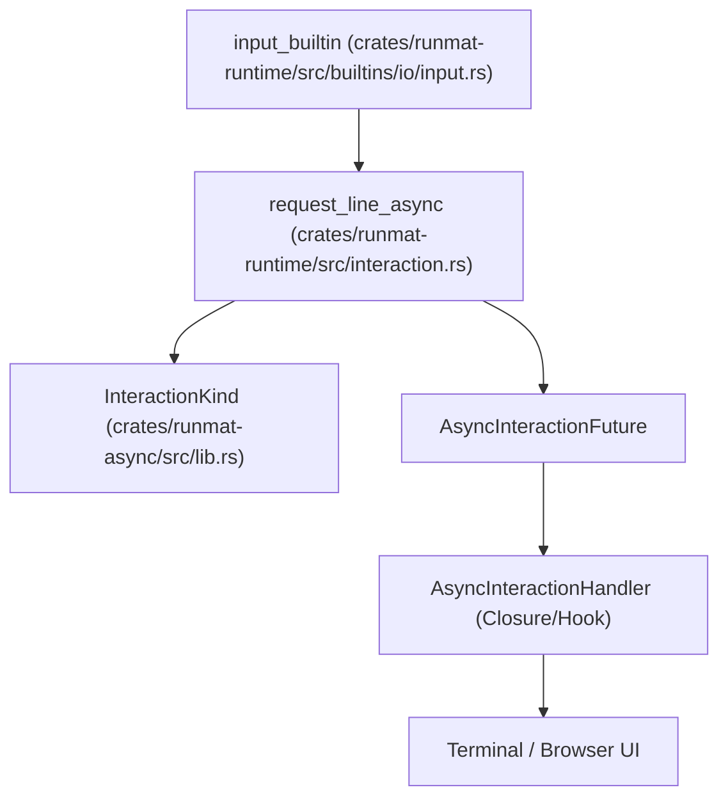
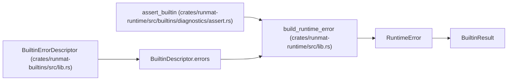

# Async Runtime & Error Model

<details>
<summary>Relevant source files</summary>

- [crates/runmat-async/Cargo.toml](https://github.com/runmat-org/runmat/blob/82685330/crates/runmat-async/Cargo.toml)
- [crates/runmat-async/src/lib.rs](https://github.com/runmat-org/runmat/blob/82685330/crates/runmat-async/src/lib.rs)
- [crates/runmat-config/Cargo.toml](https://github.com/runmat-org/runmat/blob/82685330/crates/runmat-config/Cargo.toml)
- [crates/runmat-filesystem/Cargo.toml](https://github.com/runmat-org/runmat/blob/82685330/crates/runmat-filesystem/Cargo.toml)
- [crates/runmat-logging/Cargo.toml](https://github.com/runmat-org/runmat/blob/82685330/crates/runmat-logging/Cargo.toml)
- [crates/runmat-logging/src/lib.rs](https://github.com/runmat-org/runmat/blob/82685330/crates/runmat-logging/src/lib.rs)
- [crates/runmat-runtime/src/builtins/common/gpu_helpers.rs](https://github.com/runmat-org/runmat/blob/82685330/crates/runmat-runtime/src/builtins/common/gpu_helpers.rs)
- [crates/runmat-runtime/src/builtins/constants/mod.rs](https://github.com/runmat-org/runmat/blob/82685330/crates/runmat-runtime/src/builtins/constants/mod.rs)
- [crates/runmat-runtime/src/builtins/diagnostics/assert.rs](https://github.com/runmat-org/runmat/blob/82685330/crates/runmat-runtime/src/builtins/diagnostics/assert.rs)
- [crates/runmat-runtime/src/builtins/diagnostics/error.rs](https://github.com/runmat-org/runmat/blob/82685330/crates/runmat-runtime/src/builtins/diagnostics/error.rs)
- [crates/runmat-runtime/src/builtins/diagnostics/warning.rs](https://github.com/runmat-org/runmat/blob/82685330/crates/runmat-runtime/src/builtins/diagnostics/warning.rs)
- [crates/runmat-runtime/src/builtins/io/input.rs](https://github.com/runmat-org/runmat/blob/82685330/crates/runmat-runtime/src/builtins/io/input.rs)
- [crates/runmat-runtime/src/builtins/io/json/jsondecode.rs](https://github.com/runmat-org/runmat/blob/82685330/crates/runmat-runtime/src/builtins/io/json/jsondecode.rs)
- [crates/runmat-runtime/src/builtins/io/json/jsonencode.rs](https://github.com/runmat-org/runmat/blob/82685330/crates/runmat-runtime/src/builtins/io/json/jsonencode.rs)
- [crates/runmat-runtime/src/dispatcher.rs](https://github.com/runmat-org/runmat/blob/82685330/crates/runmat-runtime/src/dispatcher.rs)
- [crates/runmat-runtime/src/interaction.rs](https://github.com/runmat-org/runmat/blob/82685330/crates/runmat-runtime/src/interaction.rs)
- [crates/runmat-thread-local/Cargo.toml](https://github.com/runmat-org/runmat/blob/82685330/crates/runmat-thread-local/Cargo.toml)

</details>

RunMat utilizes an asynchronous execution model to handle long-running computations, GPU offloading, and interactive I/O without blocking the host environment. This is particularly critical for the WebAssembly target, where blocking the main thread is prohibited. The system integrates a structured error model that bridges Rust's `Result` types with MATLAB's `MException` semantics.

## Async Execution Design

The core of RunMat's execution is built on top of Rust's `Future` trait. Execution is treated as a pollable state machine that can suspend at specific points, such as waiting for a GPU buffer download or user input from the console.

### Suspension Points & Data Flow

Suspension occurs primarily when the runtime must wait for external resources. A key example is the `gather_if_needed_async` function, which ensures that data resident on a GPU is moved back to host memory before being processed by CPU-only built-in functions [crates/runmat-runtime/src/dispatcher.rs #27-29](https://github.com/runmat-org/runmat/blob/82685330/crates/runmat-runtime/src/dispatcher.rs#L27-L29)

| Entity | Role | File Reference |
| --- | --- | --- |
| gather_if_needed_async | Recursively traverses Value types to download GpuTensor handles. | crates/runmat-runtime/src/dispatcher.rs#38-41 |
| download_handle_async | Invokes the AccelProvider to retrieve raw data from the GPU. | crates/runmat-runtime/src/dispatcher.rs#31-36 |
| request_line_async | Suspends execution to wait for user input via a registered handler. | crates/runmat-runtime/src/interaction.rs#94-130 |

### Interaction Subsystem

The `runmat-runtime` crate defines an interaction layer for MATLAB-compatible functions like `input` [crates/runmat-runtime/src/builtins/io/input.rs #1-7](https://github.com/runmat-org/runmat/blob/82685330/crates/runmat-runtime/src/builtins/io/input.rs#L1-L7) This subsystem uses an `AsyncInteractionHandler` to bridge the VM with the host UI (e.g., a terminal or a browser text box) [crates/runmat-runtime/src/interaction.rs #34-35](https://github.com/runmat-org/runmat/blob/82685330/crates/runmat-runtime/src/interaction.rs#L34-L35)

Interaction Flow Diagram Title: Async Interaction and Input Handling



<details>
<summary>Rendered SVG</summary>

```svg
<svg id="mermaid-g1cvkbz42p6" xmlns="http://www.w3.org/2000/svg" xmlns:xlink="http://www.w3.org/1999/xlink" class="flowchart" style="max-width: 100%; touch-action: none; user-select: none; cursor: grab; min-height: fit-content; max-height: 100%;" viewBox="-0.0022304466999685246 0 640.2778983933999 828" role="graphics-document document" aria-roledescription="flowchart-v2" preserveAspectRatio="xMidYMid meet"><style>#mermaid-g1cvkbz42p6{font-family:ui-sans-serif,-apple-system,system-ui,Segoe UI,Helvetica;font-size:16px;fill:#ccc;}@keyframes edge-animation-frame{from{stroke-dashoffset:0;}}@keyframes dash{to{stroke-dashoffset:0;}}#mermaid-g1cvkbz42p6 .edge-animation-slow{stroke-dasharray:9,5!important;stroke-dashoffset:900;animation:dash 50s linear infinite;stroke-linecap:round;}#mermaid-g1cvkbz42p6 .edge-animation-fast{stroke-dasharray:9,5!important;stroke-dashoffset:900;animation:dash 20s linear infinite;stroke-linecap:round;}#mermaid-g1cvkbz42p6 .error-icon{fill:#333;}#mermaid-g1cvkbz42p6 .error-text{fill:#cccccc;stroke:#cccccc;}#mermaid-g1cvkbz42p6 .edge-thickness-normal{stroke-width:1px;}#mermaid-g1cvkbz42p6 .edge-thickness-thick{stroke-width:3.5px;}#mermaid-g1cvkbz42p6 .edge-pattern-solid{stroke-dasharray:0;}#mermaid-g1cvkbz42p6 .edge-thickness-invisible{stroke-width:0;fill:none;}#mermaid-g1cvkbz42p6 .edge-pattern-dashed{stroke-dasharray:3;}#mermaid-g1cvkbz42p6 .edge-pattern-dotted{stroke-dasharray:2;}#mermaid-g1cvkbz42p6 .marker{fill:#666;stroke:#666;}#mermaid-g1cvkbz42p6 .marker.cross{stroke:#666;}#mermaid-g1cvkbz42p6 svg{font-family:ui-sans-serif,-apple-system,system-ui,Segoe UI,Helvetica;font-size:16px;}#mermaid-g1cvkbz42p6 p{margin:0;}#mermaid-g1cvkbz42p6 .label{font-family:ui-sans-serif,-apple-system,system-ui,Segoe UI,Helvetica;color:#fff;}#mermaid-g1cvkbz42p6 .cluster-label text{fill:#fff;}#mermaid-g1cvkbz42p6 .cluster-label span{color:#fff;}#mermaid-g1cvkbz42p6 .cluster-label span p{background-color:transparent;}#mermaid-g1cvkbz42p6 .label text,#mermaid-g1cvkbz42p6 span{fill:#fff;color:#fff;}#mermaid-g1cvkbz42p6 .node rect,#mermaid-g1cvkbz42p6 .node circle,#mermaid-g1cvkbz42p6 .node ellipse,#mermaid-g1cvkbz42p6 .node polygon,#mermaid-g1cvkbz42p6 .node path{fill:#111;stroke:#222;stroke-width:1px;}#mermaid-g1cvkbz42p6 .rough-node .label text,#mermaid-g1cvkbz42p6 .node .label text,#mermaid-g1cvkbz42p6 .image-shape .label,#mermaid-g1cvkbz42p6 .icon-shape .label{text-anchor:middle;}#mermaid-g1cvkbz42p6 .node .katex path{fill:#000;stroke:#000;stroke-width:1px;}#mermaid-g1cvkbz42p6 .rough-node .label,#mermaid-g1cvkbz42p6 .node .label,#mermaid-g1cvkbz42p6 .image-shape .label,#mermaid-g1cvkbz42p6 .icon-shape .label{text-align:center;}#mermaid-g1cvkbz42p6 .node.clickable{cursor:pointer;}#mermaid-g1cvkbz42p6 .root .anchor path{fill:#666!important;stroke-width:0;stroke:#666;}#mermaid-g1cvkbz42p6 .arrowheadPath{fill:#0b0b0b;}#mermaid-g1cvkbz42p6 .edgePath .path{stroke:#666;stroke-width:1px;}#mermaid-g1cvkbz42p6 .flowchart-link{stroke:#666;fill:none;}#mermaid-g1cvkbz42p6 .edgeLabel{background-color:#161616;text-align:center;}#mermaid-g1cvkbz42p6 .edgeLabel p{background-color:#161616;}#mermaid-g1cvkbz42p6 .edgeLabel rect{opacity:0.5;background-color:#161616;fill:#161616;}#mermaid-g1cvkbz42p6 .labelBkg{background-color:rgba(22, 22, 22, 0.5);}#mermaid-g1cvkbz42p6 .cluster rect{fill:#161616;stroke:#222;stroke-width:1px;}#mermaid-g1cvkbz42p6 .cluster text{fill:#fff;}#mermaid-g1cvkbz42p6 .cluster span{color:#fff;}#mermaid-g1cvkbz42p6 div.mermaidTooltip{position:absolute;text-align:center;max-width:200px;padding:2px;font-family:ui-sans-serif,-apple-system,system-ui,Segoe UI,Helvetica;font-size:12px;background:#333;border:1px solid hsl(0, 0%, 10%);border-radius:2px;pointer-events:none;z-index:100;}#mermaid-g1cvkbz42p6 .flowchartTitleText{text-anchor:middle;font-size:18px;fill:#ccc;}#mermaid-g1cvkbz42p6 rect.text{fill:none;stroke-width:0;}#mermaid-g1cvkbz42p6 .icon-shape,#mermaid-g1cvkbz42p6 .image-shape{background-color:#161616;text-align:center;}#mermaid-g1cvkbz42p6 .icon-shape p,#mermaid-g1cvkbz42p6 .image-shape p{background-color:#161616;padding:2px;}#mermaid-g1cvkbz42p6 .icon-shape .label rect,#mermaid-g1cvkbz42p6 .image-shape .label rect{opacity:0.5;background-color:#161616;fill:#161616;}#mermaid-g1cvkbz42p6 .label-icon{display:inline-block;height:1em;overflow:visible;vertical-align:-0.125em;}#mermaid-g1cvkbz42p6 .node .label-icon path{fill:currentColor;stroke:revert;stroke-width:revert;}#mermaid-g1cvkbz42p6 .node .neo-node{stroke:#222;}#mermaid-g1cvkbz42p6 [data-look="neo"].node rect,#mermaid-g1cvkbz42p6 [data-look="neo"].cluster rect,#mermaid-g1cvkbz42p6 [data-look="neo"].node polygon{stroke:url(#mermaid-g1cvkbz42p6-gradient);filter:drop-shadow( 1px 2px 2px rgba(185,185,185,1));}#mermaid-g1cvkbz42p6 [data-look="neo"].node path{stroke:url(#mermaid-g1cvkbz42p6-gradient);stroke-width:1px;}#mermaid-g1cvkbz42p6 [data-look="neo"].node .outer-path{filter:drop-shadow( 1px 2px 2px rgba(185,185,185,1));}#mermaid-g1cvkbz42p6 [data-look="neo"].node .neo-line path{stroke:#222;filter:none;}#mermaid-g1cvkbz42p6 [data-look="neo"].node circle{stroke:url(#mermaid-g1cvkbz42p6-gradient);filter:drop-shadow( 1px 2px 2px rgba(185,185,185,1));}#mermaid-g1cvkbz42p6 [data-look="neo"].node circle .state-start{fill:#000000;}#mermaid-g1cvkbz42p6 [data-look="neo"].icon-shape .icon{fill:url(#mermaid-g1cvkbz42p6-gradient);filter:drop-shadow( 1px 2px 2px rgba(185,185,185,1));}#mermaid-g1cvkbz42p6 [data-look="neo"].icon-shape .icon-neo path{stroke:url(#mermaid-g1cvkbz42p6-gradient);filter:drop-shadow( 1px 2px 2px rgba(185,185,185,1));}#mermaid-g1cvkbz42p6 :root{--mermaid-font-family:"trebuchet ms",verdana,arial,sans-serif;}</style><g><marker id="mermaid-g1cvkbz42p6_flowchart-v2-pointEnd" class="marker flowchart-v2" viewBox="0 0 10 10" refX="5" refY="5" markerUnits="userSpaceOnUse" markerWidth="8" markerHeight="8" orient="auto"><path d="M 0 0 L 10 5 L 0 10 z" class="arrowMarkerPath" style="stroke-width: 1; stroke-dasharray: 1, 0;"></path></marker><marker id="mermaid-g1cvkbz42p6_flowchart-v2-pointStart" class="marker flowchart-v2" viewBox="0 0 10 10" refX="4.5" refY="5" markerUnits="userSpaceOnUse" markerWidth="8" markerHeight="8" orient="auto"><path d="M 0 5 L 10 10 L 10 0 z" class="arrowMarkerPath" style="stroke-width: 1; stroke-dasharray: 1, 0;"></path></marker><marker id="mermaid-g1cvkbz42p6_flowchart-v2-pointEnd-margin" class="marker flowchart-v2" viewBox="0 0 11.5 14" refX="11.5" refY="7" markerUnits="userSpaceOnUse" markerWidth="10.5" markerHeight="14" orient="auto"><path d="M 0 0 L 11.5 7 L 0 14 z" class="arrowMarkerPath" style="stroke-width: 0; stroke-dasharray: 1, 0;"></path></marker><marker id="mermaid-g1cvkbz42p6_flowchart-v2-pointStart-margin" class="marker flowchart-v2" viewBox="0 0 11.5 14" refX="1" refY="7" markerUnits="userSpaceOnUse" markerWidth="11.5" markerHeight="14" orient="auto"><polygon points="0,7 11.5,14 11.5,0" class="arrowMarkerPath" style="stroke-width: 0; stroke-dasharray: 1, 0;"></polygon></marker><marker id="mermaid-g1cvkbz42p6_flowchart-v2-circleEnd" class="marker flowchart-v2" viewBox="0 0 10 10" refX="11" refY="5" markerUnits="userSpaceOnUse" markerWidth="11" markerHeight="11" orient="auto"><circle cx="5" cy="5" r="5" class="arrowMarkerPath" style="stroke-width: 1; stroke-dasharray: 1, 0;"></circle></marker><marker id="mermaid-g1cvkbz42p6_flowchart-v2-circleStart" class="marker flowchart-v2" viewBox="0 0 10 10" refX="-1" refY="5" markerUnits="userSpaceOnUse" markerWidth="11" markerHeight="11" orient="auto"><circle cx="5" cy="5" r="5" class="arrowMarkerPath" style="stroke-width: 1; stroke-dasharray: 1, 0;"></circle></marker><marker id="mermaid-g1cvkbz42p6_flowchart-v2-circleEnd-margin" class="marker flowchart-v2" viewBox="0 0 10 10" refY="5" refX="12.25" markerUnits="userSpaceOnUse" markerWidth="14" markerHeight="14" orient="auto"><circle cx="5" cy="5" r="5" class="arrowMarkerPath" style="stroke-width: 0; stroke-dasharray: 1, 0;"></circle></marker><marker id="mermaid-g1cvkbz42p6_flowchart-v2-circleStart-margin" class="marker flowchart-v2" viewBox="0 0 10 10" refX="-2" refY="5" markerUnits="userSpaceOnUse" markerWidth="14" markerHeight="14" orient="auto"><circle cx="5" cy="5" r="5" class="arrowMarkerPath" style="stroke-width: 0; stroke-dasharray: 1, 0;"></circle></marker><marker id="mermaid-g1cvkbz42p6_flowchart-v2-crossEnd" class="marker cross flowchart-v2" viewBox="0 0 11 11" refX="12" refY="5.2" markerUnits="userSpaceOnUse" markerWidth="11" markerHeight="11" orient="auto"><path d="M 1,1 l 9,9 M 10,1 l -9,9" class="arrowMarkerPath" style="stroke-width: 2; stroke-dasharray: 1, 0;"></path></marker><marker id="mermaid-g1cvkbz42p6_flowchart-v2-crossStart" class="marker cross flowchart-v2" viewBox="0 0 11 11" refX="-1" refY="5.2" markerUnits="userSpaceOnUse" markerWidth="11" markerHeight="11" orient="auto"><path d="M 1,1 l 9,9 M 10,1 l -9,9" class="arrowMarkerPath" style="stroke-width: 2; stroke-dasharray: 1, 0;"></path></marker><marker id="mermaid-g1cvkbz42p6_flowchart-v2-crossEnd-margin" class="marker cross flowchart-v2" viewBox="0 0 15 15" refX="17.7" refY="7.5" markerUnits="userSpaceOnUse" markerWidth="12" markerHeight="12" orient="auto"><path d="M 1,1 L 14,14 M 1,14 L 14,1" class="arrowMarkerPath" style="stroke-width: 2.5;"></path></marker><marker id="mermaid-g1cvkbz42p6_flowchart-v2-crossStart-margin" class="marker cross flowchart-v2" viewBox="0 0 15 15" refX="-3.5" refY="7.5" markerUnits="userSpaceOnUse" markerWidth="12" markerHeight="12" orient="auto"><path d="M 1,1 L 14,14 M 1,14 L 14,1" class="arrowMarkerPath" style="stroke-width: 2.5; stroke-dasharray: 1, 0;"></path></marker><g class="root"><g class="clusters"><g class="cluster" id="mermaid-g1cvkbz42p6-subGraph2" data-look="classic"><rect style="" x="302.2734375" y="588" width="330" height="232"></rect><g class="cluster-label" transform="translate(402.78125, 588)"><foreignObject width="128.984375" height="24"><div style="display: table-cell; white-space: nowrap; line-height: 1.5;" xmlns="http://www.w3.org/1999/xhtml"><span class="nodeLabel"><p>Host Environment</p></span></div></foreignObject></g></g><g class="cluster" id="mermaid-g1cvkbz42p6-subGraph1" data-look="classic"><rect style="" x="8" y="362" width="608.546875" height="152"></rect><g class="cluster-label" transform="translate(199.9375, 362)"><foreignObject width="224.671875" height="24"><div style="display: table-cell; white-space: nowrap; line-height: 1.5;" xmlns="http://www.w3.org/1999/xhtml"><span class="nodeLabel"><p>Async Runtime (runmat-async)</p></span></div></foreignObject></g></g><g class="cluster" id="mermaid-g1cvkbz42p6-subGraph0" data-look="classic"><rect style="" x="65.15234375" y="8" width="499.96875" height="280"></rect><g class="cluster-label" transform="translate(278.30859375, 8)"><foreignObject width="73.65625" height="24"><div style="display: table-cell; white-space: nowrap; line-height: 1.5;" xmlns="http://www.w3.org/1999/xhtml"><span class="nodeLabel"><p>VM Space</p></span></div></foreignObject></g></g></g><g class="edgePaths"><path d="M320.137,111L320.137,115.167C320.137,119.333,320.137,127.667,320.137,135.333C320.137,143,320.137,150,320.137,153.5L320.137,157" id="mermaid-g1cvkbz42p6-L_InputBuiltin_ReqLine_0" class="edge-thickness-normal edge-pattern-solid edge-thickness-normal edge-pattern-solid flowchart-link" style=";" data-edge="true" data-et="edge" data-id="L_InputBuiltin_ReqLine_0" data-points="W3sieCI6MzIwLjEzNjcxODc1LCJ5IjoxMTF9LHsieCI6MzIwLjEzNjcxODc1LCJ5IjoxMzZ9LHsieCI6MzIwLjEzNjcxODc1LCJ5IjoxNjF9XQ==" data-look="classic" marker-end="url(#mermaid-g1cvkbz42p6_flowchart-v2-pointEnd)"></path><path d="M221.4,263L213.334,267.167C205.267,271.333,189.133,279.667,181.067,290C173,300.333,173,312.667,173,325C173,337.333,173,349.667,173,359.333C173,369,173,376,173,379.5L173,383" id="mermaid-g1cvkbz42p6-L_ReqLine_IKind_0" class="edge-thickness-normal edge-pattern-solid edge-thickness-normal edge-pattern-solid flowchart-link" style=";" data-edge="true" data-et="edge" data-id="L_ReqLine_IKind_0" data-points="W3sieCI6MjIxLjQwMDIzNjQzMDkyMTA0LCJ5IjoyNjN9LHsieCI6MTczLCJ5IjoyODh9LHsieCI6MTczLCJ5IjozMjV9LHsieCI6MTczLCJ5IjozNjJ9LHsieCI6MTczLCJ5IjozODd9XQ==" data-look="classic" marker-end="url(#mermaid-g1cvkbz42p6_flowchart-v2-pointEnd)"></path><path d="M418.873,263L426.94,267.167C435.007,271.333,451.14,279.667,459.207,290C467.273,300.333,467.273,312.667,467.273,325C467.273,337.333,467.273,349.667,467.273,363.333C467.273,377,467.273,392,467.273,399.5L467.273,407" id="mermaid-g1cvkbz42p6-L_ReqLine_AIFuture_0" class="edge-thickness-normal edge-pattern-solid edge-thickness-normal edge-pattern-solid flowchart-link" style=";" data-edge="true" data-et="edge" data-id="L_ReqLine_AIFuture_0" data-points="W3sieCI6NDE4Ljg3MzIwMTA2OTA3ODk2LCJ5IjoyNjN9LHsieCI6NDY3LjI3MzQzNzUsInkiOjI4OH0seyJ4Ijo0NjcuMjczNDM3NSwieSI6MzI1fSx7IngiOjQ2Ny4yNzM0Mzc1LCJ5IjozNjJ9LHsieCI6NDY3LjI3MzQzNzUsInkiOjQxMX1d" data-look="classic" marker-end="url(#mermaid-g1cvkbz42p6_flowchart-v2-pointEnd)"></path><path d="M467.273,465L467.273,473.167C467.273,481.333,467.273,497.667,467.273,512C467.273,526.333,467.273,538.667,467.273,551C467.273,563.333,467.273,575.667,467.273,585.333C467.273,595,467.273,602,467.273,605.5L467.273,609" id="mermaid-g1cvkbz42p6-L_AIFuture_Handler_0" class="edge-thickness-normal edge-pattern-solid edge-thickness-normal edge-pattern-solid flowchart-link" style=";" data-edge="true" data-et="edge" data-id="L_AIFuture_Handler_0" data-points="W3sieCI6NDY3LjI3MzQzNzUsInkiOjQ2NX0seyJ4Ijo0NjcuMjczNDM3NSwieSI6NTE0fSx7IngiOjQ2Ny4yNzM0Mzc1LCJ5Ijo1NTF9LHsieCI6NDY3LjI3MzQzNzUsInkiOjU4OH0seyJ4Ijo0NjcuMjczNDM3NSwieSI6NjEzfV0=" data-look="classic" marker-end="url(#mermaid-g1cvkbz42p6_flowchart-v2-pointEnd)"></path><path d="M467.273,695L467.273,698.5C467.273,702,467.273,709,467.273,716C467.273,723,467.273,730,467.273,733.5L467.273,737" id="mermaid-g1cvkbz42p6-L_Handler_UI_0" class="edge-thickness-normal edge-pattern-solid edge-thickness-normal edge-pattern-solid flowchart-link" style=";" data-edge="true" data-et="edge" data-id="L_Handler_UI_0" data-points="W3sieCI6NDY3LjI3MzQzNzUsInkiOjY5MX0seyJ4Ijo0NjcuMjczNDM3NSwieSI6NzE2fSx7IngiOjQ2Ny4yNzM0Mzc1LCJ5Ijo3NDF9XQ==" data-look="classic" marker-start="url(#mermaid-g1cvkbz42p6_flowchart-v2-pointStart)" marker-end="url(#mermaid-g1cvkbz42p6_flowchart-v2-pointEnd)"></path></g><g class="edgeLabels"><g class="edgeLabel"><g class="label" data-id="L_InputBuiltin_ReqLine_0" transform="translate(0, 0)"><foreignObject width="0" height="0"><div style="display: table-cell; white-space: nowrap; line-height: 1.5; max-width: 200px; text-align: center;" xmlns="http://www.w3.org/1999/xhtml" class="labelBkg"><span class="edgeLabel"></span></div></foreignObject></g></g><g class="edgeLabel"><g class="label" data-id="L_ReqLine_IKind_0" transform="translate(0, 0)"><foreignObject width="0" height="0"><div style="display: table-cell; white-space: nowrap; line-height: 1.5; max-width: 200px; text-align: center;" xmlns="http://www.w3.org/1999/xhtml" class="labelBkg"><span class="edgeLabel"></span></div></foreignObject></g></g><g class="edgeLabel" transform="translate(467.2734375, 325)"><g class="label" data-id="L_ReqLine_AIFuture_0" transform="translate(-22.765625, -12)"><foreignObject width="45.53125" height="24"><div style="display: table-cell; white-space: nowrap; line-height: 1.5; max-width: 200px; text-align: center;" xmlns="http://www.w3.org/1999/xhtml" class="labelBkg"><span class="edgeLabel"><p>awaits</p></span></div></foreignObject></g></g><g class="edgeLabel" transform="translate(467.2734375, 551)"><g class="label" data-id="L_AIFuture_Handler_0" transform="translate(-17.0625, -12)"><foreignObject width="34.125" height="24"><div style="display: table-cell; white-space: nowrap; line-height: 1.5; max-width: 200px; text-align: center;" xmlns="http://www.w3.org/1999/xhtml" class="labelBkg"><span class="edgeLabel"><p>polls</p></span></div></foreignObject></g></g><g class="edgeLabel"><g class="label" data-id="L_Handler_UI_0" transform="translate(0, 0)"><foreignObject width="0" height="0"><div style="display: table-cell; white-space: nowrap; line-height: 1.5; max-width: 200px; text-align: center;" xmlns="http://www.w3.org/1999/xhtml" class="labelBkg"><span class="edgeLabel"></span></div></foreignObject></g></g></g><g class="nodes"><g class="node default" id="mermaid-g1cvkbz42p6-flowchart-InputBuiltin-0" data-look="classic" transform="translate(320.13671875, 72)"><rect class="basic label-container" style="" x="-140.6953125" y="-39" width="281.390625" height="78"></rect><g class="label" style="" transform="translate(-110.6953125, -24)"><rect></rect><foreignObject width="221.390625" height="48"><div style="display: table; white-space: break-spaces; line-height: 1.5; max-width: 200px; text-align: center; width: 200px;" xmlns="http://www.w3.org/1999/xhtml"><span class="nodeLabel"><p>input_builtin (crates/runmat-runtime/src/builtins/io/input.rs)</p></span></div></foreignObject></g></g><g class="node default" id="mermaid-g1cvkbz42p6-flowchart-ReqLine-1" data-look="classic" transform="translate(320.13671875, 212)"><rect class="basic label-container" style="" x="-130" y="-51" width="260" height="102"></rect><g class="label" style="" transform="translate(-100, -36)"><rect></rect><foreignObject width="200" height="72"><div style="display: table; white-space: break-spaces; line-height: 1.5; max-width: 200px; text-align: center; width: 200px;" xmlns="http://www.w3.org/1999/xhtml"><span class="nodeLabel"><p>request_line_async (crates/runmat-runtime/src/interaction.rs)</p></span></div></foreignObject></g></g><g class="node default" id="mermaid-g1cvkbz42p6-flowchart-IKind-2" data-look="classic" transform="translate(173, 438)"><rect class="basic label-container" style="" x="-130" y="-51" width="260" height="102"></rect><g class="label" style="" transform="translate(-100, -36)"><rect></rect><foreignObject width="200" height="72"><div style="display: table; white-space: break-spaces; line-height: 1.5; max-width: 200px; text-align: center; width: 200px;" xmlns="http://www.w3.org/1999/xhtml"><span class="nodeLabel"><p>InteractionKind (crates/runmat-async/src/lib.rs)</p></span></div></foreignObject></g></g><g class="node default" id="mermaid-g1cvkbz42p6-flowchart-AIFuture-3" data-look="classic" transform="translate(467.2734375, 438)"><rect class="basic label-container" style="" x="-114.2734375" y="-27" width="228.546875" height="54"></rect><g class="label" style="" transform="translate(-84.2734375, -12)"><rect></rect><foreignObject width="168.546875" height="24"><div style="display: table-cell; white-space: nowrap; line-height: 1.5; max-width: 200px; text-align: center;" xmlns="http://www.w3.org/1999/xhtml"><span class="nodeLabel"><p>AsyncInteractionFuture</p></span></div></foreignObject></g></g><g class="node default" id="mermaid-g1cvkbz42p6-flowchart-Handler-4" data-look="classic" transform="translate(467.2734375, 652)"><rect class="basic label-container" style="" x="-130" y="-39" width="260" height="78"></rect><g class="label" style="" transform="translate(-100, -24)"><rect></rect><foreignObject width="200" height="48"><div style="display: table; white-space: break-spaces; line-height: 1.5; max-width: 200px; text-align: center; width: 200px;" xmlns="http://www.w3.org/1999/xhtml"><span class="nodeLabel"><p>AsyncInteractionHandler (Closure/Hook)</p></span></div></foreignObject></g></g><g class="node default" id="mermaid-g1cvkbz42p6-flowchart-UI-5" data-look="classic" transform="translate(467.2734375, 768)"><rect class="basic label-container" style="" x="-106.6171875" y="-27" width="213.234375" height="54"></rect><g class="label" style="" transform="translate(-76.6171875, -12)"><rect></rect><foreignObject width="153.234375" height="24"><div style="display: table-cell; white-space: nowrap; line-height: 1.5; max-width: 200px; text-align: center;" xmlns="http://www.w3.org/1999/xhtml"><span class="nodeLabel"><p>Terminal / Browser UI</p></span></div></foreignObject></g></g></g></g></g><defs><filter id="mermaid-g1cvkbz42p6-drop-shadow" height="130%" width="130%"><feDropShadow dx="4" dy="4" stdDeviation="0" flood-opacity="0.06" flood-color="#000000"></feDropShadow></filter></defs><defs><filter id="mermaid-g1cvkbz42p6-drop-shadow-small" height="150%" width="150%"><feDropShadow dx="2" dy="2" stdDeviation="0" flood-opacity="0.06" flood-color="#000000"></feDropShadow></filter></defs><linearGradient id="mermaid-g1cvkbz42p6-gradient" gradientUnits="objectBoundingBox" x1="0%" y1="0%" x2="100%" y2="0%"><stop offset="0%" stop-color="#333" stop-opacity="1"></stop><stop offset="100%" stop-color="hsl(-120, 0%, 3.3333333333%)" stop-opacity="1"></stop></linearGradient></svg>
```

</details>

Sources: [crates/runmat-runtime/src/interaction.rs #17-35](https://github.com/runmat-org/runmat/blob/82685330/crates/runmat-runtime/src/interaction.rs#L17-L35) [crates/runmat-runtime/src/builtins/io/input.rs #14-17](https://github.com/runmat-org/runmat/blob/82685330/crates/runmat-runtime/src/builtins/io/input.rs#L14-L17)

## Error Model & Structured Propagation

RunMat implements a hierarchical error system. Low-level Rust errors are wrapped into `RuntimeError`, which carries the metadata necessary to construct a MATLAB-compatible `MException`.

### RuntimeError & BuiltinResult

The `runmat-async` crate provides the foundation for error types [crates/runmat-async/Cargo.toml #1-10](https://github.com/runmat-org/runmat/blob/82685330/crates/runmat-async/Cargo.toml#L1-L10) Within the runtime, most functions return a `BuiltinResult<T>`, which is an alias for `Result<T, RuntimeError>` [crates/runmat-runtime/src/builtins/io/json/jsonencode.rs #18](https://github.com/runmat-org/runmat/blob/82685330/crates/runmat-runtime/src/builtins/io/json/jsonencode.rs#L18-L18)

A `RuntimeError` contains:

- Message: The human-readable error string.
- Identifier: A MATLAB-style string (e.g., `"RunMat:gather:DownloadFailed"`) [crates/runmat-runtime/src/dispatcher.rs #63-65](https://github.com/runmat-org/runmat/blob/82685330/crates/runmat-runtime/src/dispatcher.rs#L63-L65)
- Source: An optional underlying cause (chaining errors).
- Built-in Context: The name of the function where the error originated [crates/runmat-runtime/src/builtins/io/input.rs #164-168](https://github.com/runmat-org/runmat/blob/82685330/crates/runmat-runtime/src/builtins/io/input.rs#L164-L168)

### MATLAB-Compatible Exceptions

Built-in functions like `error` and `assert` are designed to throw these structured errors. The `error` builtin can accept a message string, a message identifier, or even a struct representing an `MException` [crates/runmat-runtime/src/builtins/diagnostics/error.rs #112-143](https://github.com/runmat-org/runmat/blob/82685330/crates/runmat-runtime/src/builtins/diagnostics/error.rs#L112-L143)

Error Construction Entity Map Title: Error Propagation and Metadata Mapping



<details>
<summary>Rendered SVG</summary>

```svg
<svg id="mermaid-sti30g84hmm" xmlns="http://www.w3.org/2000/svg" xmlns:xlink="http://www.w3.org/1999/xlink" class="flowchart" style="max-width: 100%; touch-action: none; user-select: none; cursor: grab; min-height: fit-content; max-height: 100%;" viewBox="-0.10203749336255896 0 1805.2196999867251 332" role="graphics-document document" aria-roledescription="flowchart-v2" preserveAspectRatio="xMidYMid meet"><style>#mermaid-sti30g84hmm{font-family:ui-sans-serif,-apple-system,system-ui,Segoe UI,Helvetica;font-size:16px;fill:#ccc;}@keyframes edge-animation-frame{from{stroke-dashoffset:0;}}@keyframes dash{to{stroke-dashoffset:0;}}#mermaid-sti30g84hmm .edge-animation-slow{stroke-dasharray:9,5!important;stroke-dashoffset:900;animation:dash 50s linear infinite;stroke-linecap:round;}#mermaid-sti30g84hmm .edge-animation-fast{stroke-dasharray:9,5!important;stroke-dashoffset:900;animation:dash 20s linear infinite;stroke-linecap:round;}#mermaid-sti30g84hmm .error-icon{fill:#333;}#mermaid-sti30g84hmm .error-text{fill:#cccccc;stroke:#cccccc;}#mermaid-sti30g84hmm .edge-thickness-normal{stroke-width:1px;}#mermaid-sti30g84hmm .edge-thickness-thick{stroke-width:3.5px;}#mermaid-sti30g84hmm .edge-pattern-solid{stroke-dasharray:0;}#mermaid-sti30g84hmm .edge-thickness-invisible{stroke-width:0;fill:none;}#mermaid-sti30g84hmm .edge-pattern-dashed{stroke-dasharray:3;}#mermaid-sti30g84hmm .edge-pattern-dotted{stroke-dasharray:2;}#mermaid-sti30g84hmm .marker{fill:#666;stroke:#666;}#mermaid-sti30g84hmm .marker.cross{stroke:#666;}#mermaid-sti30g84hmm svg{font-family:ui-sans-serif,-apple-system,system-ui,Segoe UI,Helvetica;font-size:16px;}#mermaid-sti30g84hmm p{margin:0;}#mermaid-sti30g84hmm .label{font-family:ui-sans-serif,-apple-system,system-ui,Segoe UI,Helvetica;color:#fff;}#mermaid-sti30g84hmm .cluster-label text{fill:#fff;}#mermaid-sti30g84hmm .cluster-label span{color:#fff;}#mermaid-sti30g84hmm .cluster-label span p{background-color:transparent;}#mermaid-sti30g84hmm .label text,#mermaid-sti30g84hmm span{fill:#fff;color:#fff;}#mermaid-sti30g84hmm .node rect,#mermaid-sti30g84hmm .node circle,#mermaid-sti30g84hmm .node ellipse,#mermaid-sti30g84hmm .node polygon,#mermaid-sti30g84hmm .node path{fill:#111;stroke:#222;stroke-width:1px;}#mermaid-sti30g84hmm .rough-node .label text,#mermaid-sti30g84hmm .node .label text,#mermaid-sti30g84hmm .image-shape .label,#mermaid-sti30g84hmm .icon-shape .label{text-anchor:middle;}#mermaid-sti30g84hmm .node .katex path{fill:#000;stroke:#000;stroke-width:1px;}#mermaid-sti30g84hmm .rough-node .label,#mermaid-sti30g84hmm .node .label,#mermaid-sti30g84hmm .image-shape .label,#mermaid-sti30g84hmm .icon-shape .label{text-align:center;}#mermaid-sti30g84hmm .node.clickable{cursor:pointer;}#mermaid-sti30g84hmm .root .anchor path{fill:#666!important;stroke-width:0;stroke:#666;}#mermaid-sti30g84hmm .arrowheadPath{fill:#0b0b0b;}#mermaid-sti30g84hmm .edgePath .path{stroke:#666;stroke-width:1px;}#mermaid-sti30g84hmm .flowchart-link{stroke:#666;fill:none;}#mermaid-sti30g84hmm .edgeLabel{background-color:#161616;text-align:center;}#mermaid-sti30g84hmm .edgeLabel p{background-color:#161616;}#mermaid-sti30g84hmm .edgeLabel rect{opacity:0.5;background-color:#161616;fill:#161616;}#mermaid-sti30g84hmm .labelBkg{background-color:rgba(22, 22, 22, 0.5);}#mermaid-sti30g84hmm .cluster rect{fill:#161616;stroke:#222;stroke-width:1px;}#mermaid-sti30g84hmm .cluster text{fill:#fff;}#mermaid-sti30g84hmm .cluster span{color:#fff;}#mermaid-sti30g84hmm div.mermaidTooltip{position:absolute;text-align:center;max-width:200px;padding:2px;font-family:ui-sans-serif,-apple-system,system-ui,Segoe UI,Helvetica;font-size:12px;background:#333;border:1px solid hsl(0, 0%, 10%);border-radius:2px;pointer-events:none;z-index:100;}#mermaid-sti30g84hmm .flowchartTitleText{text-anchor:middle;font-size:18px;fill:#ccc;}#mermaid-sti30g84hmm rect.text{fill:none;stroke-width:0;}#mermaid-sti30g84hmm .icon-shape,#mermaid-sti30g84hmm .image-shape{background-color:#161616;text-align:center;}#mermaid-sti30g84hmm .icon-shape p,#mermaid-sti30g84hmm .image-shape p{background-color:#161616;padding:2px;}#mermaid-sti30g84hmm .icon-shape .label rect,#mermaid-sti30g84hmm .image-shape .label rect{opacity:0.5;background-color:#161616;fill:#161616;}#mermaid-sti30g84hmm .label-icon{display:inline-block;height:1em;overflow:visible;vertical-align:-0.125em;}#mermaid-sti30g84hmm .node .label-icon path{fill:currentColor;stroke:revert;stroke-width:revert;}#mermaid-sti30g84hmm .node .neo-node{stroke:#222;}#mermaid-sti30g84hmm [data-look="neo"].node rect,#mermaid-sti30g84hmm [data-look="neo"].cluster rect,#mermaid-sti30g84hmm [data-look="neo"].node polygon{stroke:url(#mermaid-sti30g84hmm-gradient);filter:drop-shadow( 1px 2px 2px rgba(185,185,185,1));}#mermaid-sti30g84hmm [data-look="neo"].node path{stroke:url(#mermaid-sti30g84hmm-gradient);stroke-width:1px;}#mermaid-sti30g84hmm [data-look="neo"].node .outer-path{filter:drop-shadow( 1px 2px 2px rgba(185,185,185,1));}#mermaid-sti30g84hmm [data-look="neo"].node .neo-line path{stroke:#222;filter:none;}#mermaid-sti30g84hmm [data-look="neo"].node circle{stroke:url(#mermaid-sti30g84hmm-gradient);filter:drop-shadow( 1px 2px 2px rgba(185,185,185,1));}#mermaid-sti30g84hmm [data-look="neo"].node circle .state-start{fill:#000000;}#mermaid-sti30g84hmm [data-look="neo"].icon-shape .icon{fill:url(#mermaid-sti30g84hmm-gradient);filter:drop-shadow( 1px 2px 2px rgba(185,185,185,1));}#mermaid-sti30g84hmm [data-look="neo"].icon-shape .icon-neo path{stroke:url(#mermaid-sti30g84hmm-gradient);filter:drop-shadow( 1px 2px 2px rgba(185,185,185,1));}#mermaid-sti30g84hmm :root{--mermaid-font-family:"trebuchet ms",verdana,arial,sans-serif;}</style><g><marker id="mermaid-sti30g84hmm_flowchart-v2-pointEnd" class="marker flowchart-v2" viewBox="0 0 10 10" refX="5" refY="5" markerUnits="userSpaceOnUse" markerWidth="8" markerHeight="8" orient="auto"><path d="M 0 0 L 10 5 L 0 10 z" class="arrowMarkerPath" style="stroke-width: 1; stroke-dasharray: 1, 0;"></path></marker><marker id="mermaid-sti30g84hmm_flowchart-v2-pointStart" class="marker flowchart-v2" viewBox="0 0 10 10" refX="4.5" refY="5" markerUnits="userSpaceOnUse" markerWidth="8" markerHeight="8" orient="auto"><path d="M 0 5 L 10 10 L 10 0 z" class="arrowMarkerPath" style="stroke-width: 1; stroke-dasharray: 1, 0;"></path></marker><marker id="mermaid-sti30g84hmm_flowchart-v2-pointEnd-margin" class="marker flowchart-v2" viewBox="0 0 11.5 14" refX="11.5" refY="7" markerUnits="userSpaceOnUse" markerWidth="10.5" markerHeight="14" orient="auto"><path d="M 0 0 L 11.5 7 L 0 14 z" class="arrowMarkerPath" style="stroke-width: 0; stroke-dasharray: 1, 0;"></path></marker><marker id="mermaid-sti30g84hmm_flowchart-v2-pointStart-margin" class="marker flowchart-v2" viewBox="0 0 11.5 14" refX="1" refY="7" markerUnits="userSpaceOnUse" markerWidth="11.5" markerHeight="14" orient="auto"><polygon points="0,7 11.5,14 11.5,0" class="arrowMarkerPath" style="stroke-width: 0; stroke-dasharray: 1, 0;"></polygon></marker><marker id="mermaid-sti30g84hmm_flowchart-v2-circleEnd" class="marker flowchart-v2" viewBox="0 0 10 10" refX="11" refY="5" markerUnits="userSpaceOnUse" markerWidth="11" markerHeight="11" orient="auto"><circle cx="5" cy="5" r="5" class="arrowMarkerPath" style="stroke-width: 1; stroke-dasharray: 1, 0;"></circle></marker><marker id="mermaid-sti30g84hmm_flowchart-v2-circleStart" class="marker flowchart-v2" viewBox="0 0 10 10" refX="-1" refY="5" markerUnits="userSpaceOnUse" markerWidth="11" markerHeight="11" orient="auto"><circle cx="5" cy="5" r="5" class="arrowMarkerPath" style="stroke-width: 1; stroke-dasharray: 1, 0;"></circle></marker><marker id="mermaid-sti30g84hmm_flowchart-v2-circleEnd-margin" class="marker flowchart-v2" viewBox="0 0 10 10" refY="5" refX="12.25" markerUnits="userSpaceOnUse" markerWidth="14" markerHeight="14" orient="auto"><circle cx="5" cy="5" r="5" class="arrowMarkerPath" style="stroke-width: 0; stroke-dasharray: 1, 0;"></circle></marker><marker id="mermaid-sti30g84hmm_flowchart-v2-circleStart-margin" class="marker flowchart-v2" viewBox="0 0 10 10" refX="-2" refY="5" markerUnits="userSpaceOnUse" markerWidth="14" markerHeight="14" orient="auto"><circle cx="5" cy="5" r="5" class="arrowMarkerPath" style="stroke-width: 0; stroke-dasharray: 1, 0;"></circle></marker><marker id="mermaid-sti30g84hmm_flowchart-v2-crossEnd" class="marker cross flowchart-v2" viewBox="0 0 11 11" refX="12" refY="5.2" markerUnits="userSpaceOnUse" markerWidth="11" markerHeight="11" orient="auto"><path d="M 1,1 l 9,9 M 10,1 l -9,9" class="arrowMarkerPath" style="stroke-width: 2; stroke-dasharray: 1, 0;"></path></marker><marker id="mermaid-sti30g84hmm_flowchart-v2-crossStart" class="marker cross flowchart-v2" viewBox="0 0 11 11" refX="-1" refY="5.2" markerUnits="userSpaceOnUse" markerWidth="11" markerHeight="11" orient="auto"><path d="M 1,1 l 9,9 M 10,1 l -9,9" class="arrowMarkerPath" style="stroke-width: 2; stroke-dasharray: 1, 0;"></path></marker><marker id="mermaid-sti30g84hmm_flowchart-v2-crossEnd-margin" class="marker cross flowchart-v2" viewBox="0 0 15 15" refX="17.7" refY="7.5" markerUnits="userSpaceOnUse" markerWidth="12" markerHeight="12" orient="auto"><path d="M 1,1 L 14,14 M 1,14 L 14,1" class="arrowMarkerPath" style="stroke-width: 2.5;"></path></marker><marker id="mermaid-sti30g84hmm_flowchart-v2-crossStart-margin" class="marker cross flowchart-v2" viewBox="0 0 15 15" refX="-3.5" refY="7.5" markerUnits="userSpaceOnUse" markerWidth="12" markerHeight="12" orient="auto"><path d="M 1,1 L 14,14 M 1,14 L 14,1" class="arrowMarkerPath" style="stroke-width: 2.5; stroke-dasharray: 1, 0;"></path></marker><g class="root"><g class="clusters"><g class="cluster" id="mermaid-sti30g84hmm-subGraph1" data-look="classic"><rect style="" x="8" y="8" width="1206.71875" height="172"></rect><g class="cluster-label" transform="translate(533.765625, 8)"><foreignObject width="155.1875" height="24"><div style="display: table-cell; white-space: nowrap; line-height: 1.5;" xmlns="http://www.w3.org/1999/xhtml"><span class="nodeLabel"><p>Code Implementation</p></span></div></foreignObject></g></g><g class="cluster" id="mermaid-sti30g84hmm-subGraph0" data-look="classic"><rect style="" x="440.34375" y="200" width="1356.671875" height="124"></rect><g class="cluster-label" transform="translate(1070.2578125, 200)"><foreignObject width="96.84375" height="24"><div style="display: table-cell; white-space: nowrap; line-height: 1.5;" xmlns="http://www.w3.org/1999/xhtml"><span class="nodeLabel"><p>Logic Entities</p></span></div></foreignObject></g></g></g><g class="edgePaths"><path d="M825.172,94L833.884,94C842.596,94,860.021,94,876.779,94C893.536,94,909.628,94,917.673,94L925.719,94" id="mermaid-sti30g84hmm-L_Assert_BError_0" class="edge-thickness-normal edge-pattern-solid edge-thickness-normal edge-pattern-solid flowchart-link" style=";" data-edge="true" data-et="edge" data-id="L_Assert_BError_0" data-points="W3sieCI6ODI1LjE3MTg3NSwieSI6OTR9LHsieCI6ODc3LjQ0NTMxMjUsInkiOjk0fSx7IngiOjkyOS43MTg3NSwieSI6OTR9XQ==" data-look="classic" marker-end="url(#mermaid-sti30g84hmm_flowchart-v2-pointEnd)"></path><path d="M1189.719,94L1193.885,94C1198.052,94,1206.385,94,1220.685,122C1234.984,150,1255.25,206,1274.849,234C1294.448,262,1313.38,262,1322.846,262L1332.313,262" id="mermaid-sti30g84hmm-L_BError_RE_0" class="edge-thickness-normal edge-pattern-solid edge-thickness-normal edge-pattern-solid flowchart-link" style=";" data-edge="true" data-et="edge" data-id="L_BError_RE_0" data-points="W3sieCI6MTE4OS43MTg3NSwieSI6OTR9LHsieCI6MTIxNC43MTg3NSwieSI6OTR9LHsieCI6MTI3NS41MTU2MjUsInkiOjI2Mn0seyJ4IjoxMzM2LjMxMjUsInkiOjI2Mn1d" data-look="classic" marker-end="url(#mermaid-sti30g84hmm_flowchart-v2-pointEnd)"></path><path d="M1491.703,262L1502.577,262C1513.451,262,1535.198,262,1556.279,262C1577.359,262,1597.773,262,1607.98,262L1618.188,262" id="mermaid-sti30g84hmm-L_RE_BR_0" class="edge-thickness-normal edge-pattern-solid edge-thickness-normal edge-pattern-solid flowchart-link" style=";" data-edge="true" data-et="edge" data-id="L_RE_BR_0" data-points="W3sieCI6MTQ5MS43MDMxMjUsInkiOjI2Mn0seyJ4IjoxNTU2Ljk0NTMxMjUsInkiOjI2Mn0seyJ4IjoxNjIyLjE4NzUsInkiOjI2Mn1d" data-look="classic" marker-end="url(#mermaid-sti30g84hmm_flowchart-v2-pointEnd)"></path><path d="M293,94L305.279,94C317.557,94,342.115,94,366.672,94C391.229,94,415.786,94,456.213,117.077C496.64,140.155,552.936,186.309,581.084,209.387L609.232,232.464" id="mermaid-sti30g84hmm-L_EDesc_BED_0" class="edge-thickness-normal edge-pattern-solid edge-thickness-normal edge-pattern-solid flowchart-link" style=";" data-edge="true" data-et="edge" data-id="L_EDesc_BED_0" data-points="W3sieCI6MjkzLCJ5Ijo5NH0seyJ4IjozNjYuNjcxODc1LCJ5Ijo5NH0seyJ4Ijo0NDAuMzQzNzUsInkiOjk0fSx7IngiOjYxMi4zMjUxOTUzMTI1LCJ5IjoyMzV9XQ==" data-look="classic" marker-end="url(#mermaid-sti30g84hmm_flowchart-v2-pointEnd)"></path><path d="M758.781,262L778.559,262C798.336,262,837.891,262,878.334,242.952C918.778,223.904,960.111,185.807,980.778,166.759L1001.444,147.711" id="mermaid-sti30g84hmm-L_BED_BError_0" class="edge-thickness-normal edge-pattern-solid edge-thickness-normal edge-pattern-solid flowchart-link" style=";" data-edge="true" data-et="edge" data-id="L_BED_BError_0" data-points="W3sieCI6NzU4Ljc4MTI1LCJ5IjoyNjJ9LHsieCI6ODc3LjQ0NTMxMjUsInkiOjI2Mn0seyJ4IjoxMDA0LjM4NTc0MjE4NzUsInkiOjE0NX1d" data-look="classic" marker-end="url(#mermaid-sti30g84hmm_flowchart-v2-pointEnd)"></path></g><g class="edgeLabels"><g class="edgeLabel" transform="translate(877.4453125, 94)"><g class="label" data-id="L_Assert_BError_0" transform="translate(-14.6015625, -12)"><foreignObject width="29.203125" height="24"><div style="display: table-cell; white-space: nowrap; line-height: 1.5; max-width: 200px; text-align: center;" xmlns="http://www.w3.org/1999/xhtml" class="labelBkg"><span class="edgeLabel"><p>fails</p></span></div></foreignObject></g></g><g class="edgeLabel" transform="translate(1275.515625, 262)"><g class="label" data-id="L_BError_RE_0" transform="translate(-35.796875, -12)"><foreignObject width="71.59375" height="24"><div style="display: table-cell; white-space: nowrap; line-height: 1.5; max-width: 200px; text-align: center;" xmlns="http://www.w3.org/1999/xhtml" class="labelBkg"><span class="edgeLabel"><p>populates</p></span></div></foreignObject></g></g><g class="edgeLabel" transform="translate(1556.9453125, 262)"><g class="label" data-id="L_RE_BR_0" transform="translate(-40.2421875, -12)"><foreignObject width="80.484375" height="24"><div style="display: table-cell; white-space: nowrap; line-height: 1.5; max-width: 200px; text-align: center;" xmlns="http://www.w3.org/1999/xhtml" class="labelBkg"><span class="edgeLabel"><p>wrapped in</p></span></div></foreignObject></g></g><g class="edgeLabel" transform="translate(366.671875, 94)"><g class="label" data-id="L_EDesc_BED_0" transform="translate(-48.671875, -12)"><foreignObject width="97.34375" height="24"><div style="display: table-cell; white-space: nowrap; line-height: 1.5; max-width: 200px; text-align: center;" xmlns="http://www.w3.org/1999/xhtml" class="labelBkg"><span class="edgeLabel"><p>defines static</p></span></div></foreignObject></g></g><g class="edgeLabel" transform="translate(877.4453125, 262)"><g class="label" data-id="L_BED_BError_0" transform="translate(-27.2734375, -12)"><foreignObject width="54.546875" height="24"><div style="display: table-cell; white-space: nowrap; line-height: 1.5; max-width: 200px; text-align: center;" xmlns="http://www.w3.org/1999/xhtml" class="labelBkg"><span class="edgeLabel"><p>informs</p></span></div></foreignObject></g></g></g><g class="nodes"><g class="node default" id="mermaid-sti30g84hmm-flowchart-BR-0" data-look="classic" transform="translate(1697.1015625, 262)"><rect class="basic label-container" style="" x="-74.9140625" y="-27" width="149.828125" height="54"></rect><g class="label" style="" transform="translate(-44.9140625, -12)"><rect></rect><foreignObject width="89.828125" height="24"><div style="display: table-cell; white-space: nowrap; line-height: 1.5; max-width: 200px; text-align: center;" xmlns="http://www.w3.org/1999/xhtml"><span class="nodeLabel"><p>BuiltinResult</p></span></div></foreignObject></g></g><g class="node default" id="mermaid-sti30g84hmm-flowchart-RE-1" data-look="classic" transform="translate(1414.0078125, 262)"><rect class="basic label-container" style="" x="-77.6953125" y="-27" width="155.390625" height="54"></rect><g class="label" style="" transform="translate(-47.6953125, -12)"><rect></rect><foreignObject width="95.390625" height="24"><div style="display: table-cell; white-space: nowrap; line-height: 1.5; max-width: 200px; text-align: center;" xmlns="http://www.w3.org/1999/xhtml"><span class="nodeLabel"><p>RuntimeError</p></span></div></foreignObject></g></g><g class="node default" id="mermaid-sti30g84hmm-flowchart-BED-2" data-look="classic" transform="translate(645.2578125, 262)"><rect class="basic label-container" style="" x="-113.5234375" y="-27" width="227.046875" height="54"></rect><g class="label" style="" transform="translate(-83.5234375, -12)"><rect></rect><foreignObject width="167.046875" height="24"><div style="display: table-cell; white-space: nowrap; line-height: 1.5; max-width: 200px; text-align: center;" xmlns="http://www.w3.org/1999/xhtml"><span class="nodeLabel"><p>BuiltinDescriptor.errors</p></span></div></foreignObject></g></g><g class="node default" id="mermaid-sti30g84hmm-flowchart-BError-3" data-look="classic" transform="translate(1059.71875, 94)"><rect class="basic label-container" style="" x="-130" y="-51" width="260" height="102"></rect><g class="label" style="" transform="translate(-100, -36)"><rect></rect><foreignObject width="200" height="72"><div style="display: table; white-space: break-spaces; line-height: 1.5; max-width: 200px; text-align: center; width: 200px;" xmlns="http://www.w3.org/1999/xhtml"><span class="nodeLabel"><p>build_runtime_error (crates/runmat-runtime/src/lib.rs)</p></span></div></foreignObject></g></g><g class="node default" id="mermaid-sti30g84hmm-flowchart-EDesc-4" data-look="classic" transform="translate(163, 94)"><rect class="basic label-container" style="" x="-130" y="-51" width="260" height="102"></rect><g class="label" style="" transform="translate(-100, -36)"><rect></rect><foreignObject width="200" height="72"><div style="display: table; white-space: break-spaces; line-height: 1.5; max-width: 200px; text-align: center; width: 200px;" xmlns="http://www.w3.org/1999/xhtml"><span class="nodeLabel"><p>BuiltinErrorDescriptor (crates/runmat-builtins/src/lib.rs)</p></span></div></foreignObject></g></g><g class="node default" id="mermaid-sti30g84hmm-flowchart-Assert-5" data-look="classic" transform="translate(645.2578125, 94)"><rect class="basic label-container" style="" x="-179.9140625" y="-39" width="359.828125" height="78"></rect><g class="label" style="" transform="translate(-149.9140625, -24)"><rect></rect><foreignObject width="299.828125" height="48"><div style="display: table; white-space: break-spaces; line-height: 1.5; max-width: 200px; text-align: center; width: 200px;" xmlns="http://www.w3.org/1999/xhtml"><span class="nodeLabel"><p>assert_builtin (crates/runmat-runtime/src/builtins/diagnostics/assert.rs)</p></span></div></foreignObject></g></g></g></g></g><defs><filter id="mermaid-sti30g84hmm-drop-shadow" height="130%" width="130%"><feDropShadow dx="4" dy="4" stdDeviation="0" flood-opacity="0.06" flood-color="#000000"></feDropShadow></filter></defs><defs><filter id="mermaid-sti30g84hmm-drop-shadow-small" height="150%" width="150%"><feDropShadow dx="2" dy="2" stdDeviation="0" flood-opacity="0.06" flood-color="#000000"></feDropShadow></filter></defs><linearGradient id="mermaid-sti30g84hmm-gradient" gradientUnits="objectBoundingBox" x1="0%" y1="0%" x2="100%" y2="0%"><stop offset="0%" stop-color="#333" stop-opacity="1"></stop><stop offset="100%" stop-color="hsl(-120, 0%, 3.3333333333%)" stop-opacity="1"></stop></linearGradient></svg>
```

</details>

Sources: [crates/runmat-runtime/src/builtins/diagnostics/assert.rs #161-194](https://github.com/runmat-org/runmat/blob/82685330/crates/runmat-runtime/src/builtins/diagnostics/assert.rs#L161-L194) [crates/runmat-runtime/src/builtins/diagnostics/error.rs #196-200](https://github.com/runmat-org/runmat/blob/82685330/crates/runmat-runtime/src/builtins/diagnostics/error.rs#L196-L200)

## Logging & Tracing Subsystem

The `runmat-logging` crate provides a structured logging facility based on the `tracing` ecosystem [crates/runmat-logging/Cargo.toml #9-12](https://github.com/runmat-org/runmat/blob/82685330/crates/runmat-logging/Cargo.toml#L9-L12) It supports both standard logging and Chrome-compatible trace events.

### Key Components

- `RuntimeLogRecord`: A serializable structure for logs containing timestamps, levels, targets, and trace/span IDs [crates/runmat-logging/src/lib.rs #30-43](https://github.com/runmat-org/runmat/blob/82685330/crates/runmat-logging/src/lib.rs#L30-L43)
- `TraceEvent`: Captures duration-based events for performance profiling [crates/runmat-logging/src/lib.rs #45-66](https://github.com/runmat-org/runmat/blob/82685330/crates/runmat-logging/src/lib.rs#L45-L66)
- Hooks: The system allows hosts to register `LOG_HOOK` and `TRACE_HOOK` to intercept runtime diagnostics [crates/runmat-logging/src/lib.rs #71-72](https://github.com/runmat-org/runmat/blob/82685330/crates/runmat-logging/src/lib.rs#L71-L72)

### Global Configuration

Logging is initialized via `init_logging`, which sets up a global subscriber [crates/runmat-logging/src/lib.rs #106-160](https://github.com/runmat-org/runmat/blob/82685330/crates/runmat-logging/src/lib.rs#L106-L160) On non-WASM platforms, the log level can be updated dynamically at runtime using `update_log_filter` [crates/runmat-logging/src/lib.rs #163-169](https://github.com/runmat-org/runmat/blob/82685330/crates/runmat-logging/src/lib.rs#L163-L169)

| Feature | Description | Implementation |
| --- | --- | --- |
| OTLP Support | Optional OpenTelemetry integration for distributed tracing. | crates/runmat-logging/src/lib.rs#148-152 |
| Signal Tracing | Ability to wrap execution blocks in spans identified by a trace_id. | crates/runmat-logging/src/lib.rs#176-185 |
| WASM Bridge | Forwards tracing events to browser consoles or TS handlers. | crates/runmat-logging/src/lib.rs#137-143 |

Sources: [crates/runmat-logging/src/lib.rs #1-160](https://github.com/runmat-org/runmat/blob/82685330/crates/runmat-logging/src/lib.rs#L1-L160) [crates/runmat-logging/Cargo.toml #21-28](https://github.com/runmat-org/runmat/blob/82685330/crates/runmat-logging/Cargo.toml#L21-L28)
