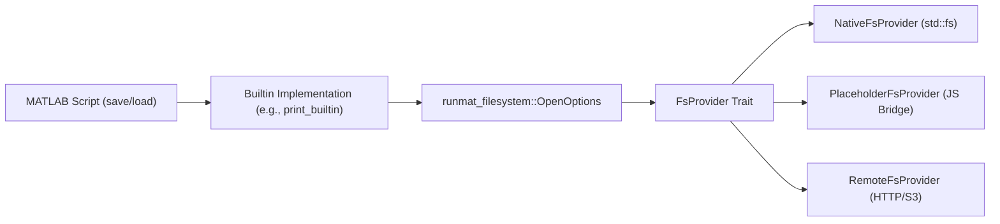

# Filesystem Abstraction

<details>
<summary>Relevant source files</summary>

- [crates/runmat-async/Cargo.toml](https://github.com/runmat-org/runmat/blob/82685330/crates/runmat-async/Cargo.toml)
- [crates/runmat-config/Cargo.toml](https://github.com/runmat-org/runmat/blob/82685330/crates/runmat-config/Cargo.toml)
- [crates/runmat-filesystem/Cargo.toml](https://github.com/runmat-org/runmat/blob/82685330/crates/runmat-filesystem/Cargo.toml)
- [crates/runmat-filesystem/src/lib.rs](https://github.com/runmat-org/runmat/blob/82685330/crates/runmat-filesystem/src/lib.rs)
- [crates/runmat-filesystem/src/remote/native.rs](https://github.com/runmat-org/runmat/blob/82685330/crates/runmat-filesystem/src/remote/native.rs)
- [crates/runmat-filesystem/src/remote/wasm.rs](https://github.com/runmat-org/runmat/blob/82685330/crates/runmat-filesystem/src/remote/wasm.rs)
- [crates/runmat-gc/src/roots.rs](https://github.com/runmat-org/runmat/blob/82685330/crates/runmat-gc/src/roots.rs)
- [crates/runmat-logging/Cargo.toml](https://github.com/runmat-org/runmat/blob/82685330/crates/runmat-logging/Cargo.toml)
- [crates/runmat-runtime/src/builtins/builtins-json/csvread.json](https://github.com/runmat-org/runmat/blob/82685330/crates/runmat-runtime/src/builtins/builtins-json/csvread.json)
- [crates/runmat-runtime/src/builtins/builtins-json/deconv.json](https://github.com/runmat-org/runmat/blob/82685330/crates/runmat-runtime/src/builtins/builtins-json/deconv.json)
- [crates/runmat-runtime/src/builtins/builtins-json/dot.json](https://github.com/runmat-org/runmat/blob/82685330/crates/runmat-runtime/src/builtins/builtins-json/dot.json)
- [crates/runmat-runtime/src/builtins/builtins-json/fullfile.json](https://github.com/runmat-org/runmat/blob/82685330/crates/runmat-runtime/src/builtins/builtins-json/fullfile.json)
- [crates/runmat-runtime/src/builtins/common/env.rs](https://github.com/runmat-org/runmat/blob/82685330/crates/runmat-runtime/src/builtins/common/env.rs)
- [crates/runmat-runtime/src/builtins/introspection/which.rs](https://github.com/runmat-org/runmat/blob/82685330/crates/runmat-runtime/src/builtins/introspection/which.rs)
- [crates/runmat-runtime/src/builtins/io/repl_fs/exist.rs](https://github.com/runmat-org/runmat/blob/82685330/crates/runmat-runtime/src/builtins/io/repl_fs/exist.rs)
- [crates/runmat-runtime/src/builtins/io/repl_fs/fullfile.rs](https://github.com/runmat-org/runmat/blob/82685330/crates/runmat-runtime/src/builtins/io/repl_fs/fullfile.rs)
- [crates/runmat-runtime/src/builtins/io/repl_fs/mod.rs](https://github.com/runmat-org/runmat/blob/82685330/crates/runmat-runtime/src/builtins/io/repl_fs/mod.rs)
- [crates/runmat-runtime/src/builtins/plotting/ops/print.rs](https://github.com/runmat-org/runmat/blob/82685330/crates/runmat-runtime/src/builtins/plotting/ops/print.rs)
- [crates/runmat-runtime/src/replay/scene.rs](https://github.com/runmat-org/runmat/blob/82685330/crates/runmat-runtime/src/replay/scene.rs)
- [crates/runmat-thread-local/Cargo.toml](https://github.com/runmat-org/runmat/blob/82685330/crates/runmat-thread-local/Cargo.toml)
- [docs/FILESYSTEM.md](https://github.com/runmat-org/runmat/blob/82685330/docs/FILESYSTEM.md?plain=1)

</details>

The RunMat Filesystem (VFS) provides a unified interface for file I/O operations across diverse execution environments, including native OS, web browsers (WASM), and remote cloud storage. It allows MATLAB-compatible scripts to perform operations like `load`, `save`, and `fopen` without concern for the underlying storage implementation [docs/FILESYSTEM.md #5-8](https://github.com/runmat-org/runmat/blob/82685330/docs/FILESYSTEM.md?plain=1#L5-L8)

## Architecture Overview

The abstraction layer is centered around the `FsProvider` trait, which defines the interface for all filesystem backends [crates/runmat-filesystem/src/lib.rs #292-310](https://github.com/runmat-org/runmat/blob/82685330/crates/runmat-filesystem/src/lib.rs#L292-L310) The `runmat-filesystem` crate manages a global provider instance that handles path resolution and operation dispatch [crates/runmat-filesystem/src/lib.rs #107-117](https://github.com/runmat-org/runmat/blob/82685330/crates/runmat-filesystem/src/lib.rs#L107-L117)

### VFS Data Flow

The following diagram illustrates how a call from a MATLAB builtin (like `print`) traverses the VFS layer to reach a specific backend.

Diagram: Filesystem Operation Dispatch



<details>
<summary>Rendered SVG</summary>

```svg
<svg id="mermaid-f8ppeb4fpod" xmlns="http://www.w3.org/2000/svg" xmlns:xlink="http://www.w3.org/1999/xlink" class="flowchart" style="max-width: 100%; touch-action: none; user-select: none; cursor: grab; min-height: fit-content; max-height: 100%;" viewBox="-0.008361976243918434 0 950.0635989524878 682" role="graphics-document document" aria-roledescription="flowchart-v2" preserveAspectRatio="xMidYMid meet"><style>#mermaid-f8ppeb4fpod{font-family:ui-sans-serif,-apple-system,system-ui,Segoe UI,Helvetica;font-size:16px;fill:#ccc;}@keyframes edge-animation-frame{from{stroke-dashoffset:0;}}@keyframes dash{to{stroke-dashoffset:0;}}#mermaid-f8ppeb4fpod .edge-animation-slow{stroke-dasharray:9,5!important;stroke-dashoffset:900;animation:dash 50s linear infinite;stroke-linecap:round;}#mermaid-f8ppeb4fpod .edge-animation-fast{stroke-dasharray:9,5!important;stroke-dashoffset:900;animation:dash 20s linear infinite;stroke-linecap:round;}#mermaid-f8ppeb4fpod .error-icon{fill:#333;}#mermaid-f8ppeb4fpod .error-text{fill:#cccccc;stroke:#cccccc;}#mermaid-f8ppeb4fpod .edge-thickness-normal{stroke-width:1px;}#mermaid-f8ppeb4fpod .edge-thickness-thick{stroke-width:3.5px;}#mermaid-f8ppeb4fpod .edge-pattern-solid{stroke-dasharray:0;}#mermaid-f8ppeb4fpod .edge-thickness-invisible{stroke-width:0;fill:none;}#mermaid-f8ppeb4fpod .edge-pattern-dashed{stroke-dasharray:3;}#mermaid-f8ppeb4fpod .edge-pattern-dotted{stroke-dasharray:2;}#mermaid-f8ppeb4fpod .marker{fill:#666;stroke:#666;}#mermaid-f8ppeb4fpod .marker.cross{stroke:#666;}#mermaid-f8ppeb4fpod svg{font-family:ui-sans-serif,-apple-system,system-ui,Segoe UI,Helvetica;font-size:16px;}#mermaid-f8ppeb4fpod p{margin:0;}#mermaid-f8ppeb4fpod .label{font-family:ui-sans-serif,-apple-system,system-ui,Segoe UI,Helvetica;color:#fff;}#mermaid-f8ppeb4fpod .cluster-label text{fill:#fff;}#mermaid-f8ppeb4fpod .cluster-label span{color:#fff;}#mermaid-f8ppeb4fpod .cluster-label span p{background-color:transparent;}#mermaid-f8ppeb4fpod .label text,#mermaid-f8ppeb4fpod span{fill:#fff;color:#fff;}#mermaid-f8ppeb4fpod .node rect,#mermaid-f8ppeb4fpod .node circle,#mermaid-f8ppeb4fpod .node ellipse,#mermaid-f8ppeb4fpod .node polygon,#mermaid-f8ppeb4fpod .node path{fill:#111;stroke:#222;stroke-width:1px;}#mermaid-f8ppeb4fpod .rough-node .label text,#mermaid-f8ppeb4fpod .node .label text,#mermaid-f8ppeb4fpod .image-shape .label,#mermaid-f8ppeb4fpod .icon-shape .label{text-anchor:middle;}#mermaid-f8ppeb4fpod .node .katex path{fill:#000;stroke:#000;stroke-width:1px;}#mermaid-f8ppeb4fpod .rough-node .label,#mermaid-f8ppeb4fpod .node .label,#mermaid-f8ppeb4fpod .image-shape .label,#mermaid-f8ppeb4fpod .icon-shape .label{text-align:center;}#mermaid-f8ppeb4fpod .node.clickable{cursor:pointer;}#mermaid-f8ppeb4fpod .root .anchor path{fill:#666!important;stroke-width:0;stroke:#666;}#mermaid-f8ppeb4fpod .arrowheadPath{fill:#0b0b0b;}#mermaid-f8ppeb4fpod .edgePath .path{stroke:#666;stroke-width:1px;}#mermaid-f8ppeb4fpod .flowchart-link{stroke:#666;fill:none;}#mermaid-f8ppeb4fpod .edgeLabel{background-color:#161616;text-align:center;}#mermaid-f8ppeb4fpod .edgeLabel p{background-color:#161616;}#mermaid-f8ppeb4fpod .edgeLabel rect{opacity:0.5;background-color:#161616;fill:#161616;}#mermaid-f8ppeb4fpod .labelBkg{background-color:rgba(22, 22, 22, 0.5);}#mermaid-f8ppeb4fpod .cluster rect{fill:#161616;stroke:#222;stroke-width:1px;}#mermaid-f8ppeb4fpod .cluster text{fill:#fff;}#mermaid-f8ppeb4fpod .cluster span{color:#fff;}#mermaid-f8ppeb4fpod div.mermaidTooltip{position:absolute;text-align:center;max-width:200px;padding:2px;font-family:ui-sans-serif,-apple-system,system-ui,Segoe UI,Helvetica;font-size:12px;background:#333;border:1px solid hsl(0, 0%, 10%);border-radius:2px;pointer-events:none;z-index:100;}#mermaid-f8ppeb4fpod .flowchartTitleText{text-anchor:middle;font-size:18px;fill:#ccc;}#mermaid-f8ppeb4fpod rect.text{fill:none;stroke-width:0;}#mermaid-f8ppeb4fpod .icon-shape,#mermaid-f8ppeb4fpod .image-shape{background-color:#161616;text-align:center;}#mermaid-f8ppeb4fpod .icon-shape p,#mermaid-f8ppeb4fpod .image-shape p{background-color:#161616;padding:2px;}#mermaid-f8ppeb4fpod .icon-shape .label rect,#mermaid-f8ppeb4fpod .image-shape .label rect{opacity:0.5;background-color:#161616;fill:#161616;}#mermaid-f8ppeb4fpod .label-icon{display:inline-block;height:1em;overflow:visible;vertical-align:-0.125em;}#mermaid-f8ppeb4fpod .node .label-icon path{fill:currentColor;stroke:revert;stroke-width:revert;}#mermaid-f8ppeb4fpod .node .neo-node{stroke:#222;}#mermaid-f8ppeb4fpod [data-look="neo"].node rect,#mermaid-f8ppeb4fpod [data-look="neo"].cluster rect,#mermaid-f8ppeb4fpod [data-look="neo"].node polygon{stroke:url(#mermaid-f8ppeb4fpod-gradient);filter:drop-shadow( 1px 2px 2px rgba(185,185,185,1));}#mermaid-f8ppeb4fpod [data-look="neo"].node path{stroke:url(#mermaid-f8ppeb4fpod-gradient);stroke-width:1px;}#mermaid-f8ppeb4fpod [data-look="neo"].node .outer-path{filter:drop-shadow( 1px 2px 2px rgba(185,185,185,1));}#mermaid-f8ppeb4fpod [data-look="neo"].node .neo-line path{stroke:#222;filter:none;}#mermaid-f8ppeb4fpod [data-look="neo"].node circle{stroke:url(#mermaid-f8ppeb4fpod-gradient);filter:drop-shadow( 1px 2px 2px rgba(185,185,185,1));}#mermaid-f8ppeb4fpod [data-look="neo"].node circle .state-start{fill:#000000;}#mermaid-f8ppeb4fpod [data-look="neo"].icon-shape .icon{fill:url(#mermaid-f8ppeb4fpod-gradient);filter:drop-shadow( 1px 2px 2px rgba(185,185,185,1));}#mermaid-f8ppeb4fpod [data-look="neo"].icon-shape .icon-neo path{stroke:url(#mermaid-f8ppeb4fpod-gradient);filter:drop-shadow( 1px 2px 2px rgba(185,185,185,1));}#mermaid-f8ppeb4fpod :root{--mermaid-font-family:"trebuchet ms",verdana,arial,sans-serif;}</style><g><marker id="mermaid-f8ppeb4fpod_flowchart-v2-pointEnd" class="marker flowchart-v2" viewBox="0 0 10 10" refX="5" refY="5" markerUnits="userSpaceOnUse" markerWidth="8" markerHeight="8" orient="auto"><path d="M 0 0 L 10 5 L 0 10 z" class="arrowMarkerPath" style="stroke-width: 1; stroke-dasharray: 1, 0;"></path></marker><marker id="mermaid-f8ppeb4fpod_flowchart-v2-pointStart" class="marker flowchart-v2" viewBox="0 0 10 10" refX="4.5" refY="5" markerUnits="userSpaceOnUse" markerWidth="8" markerHeight="8" orient="auto"><path d="M 0 5 L 10 10 L 10 0 z" class="arrowMarkerPath" style="stroke-width: 1; stroke-dasharray: 1, 0;"></path></marker><marker id="mermaid-f8ppeb4fpod_flowchart-v2-pointEnd-margin" class="marker flowchart-v2" viewBox="0 0 11.5 14" refX="11.5" refY="7" markerUnits="userSpaceOnUse" markerWidth="10.5" markerHeight="14" orient="auto"><path d="M 0 0 L 11.5 7 L 0 14 z" class="arrowMarkerPath" style="stroke-width: 0; stroke-dasharray: 1, 0;"></path></marker><marker id="mermaid-f8ppeb4fpod_flowchart-v2-pointStart-margin" class="marker flowchart-v2" viewBox="0 0 11.5 14" refX="1" refY="7" markerUnits="userSpaceOnUse" markerWidth="11.5" markerHeight="14" orient="auto"><polygon points="0,7 11.5,14 11.5,0" class="arrowMarkerPath" style="stroke-width: 0; stroke-dasharray: 1, 0;"></polygon></marker><marker id="mermaid-f8ppeb4fpod_flowchart-v2-circleEnd" class="marker flowchart-v2" viewBox="0 0 10 10" refX="11" refY="5" markerUnits="userSpaceOnUse" markerWidth="11" markerHeight="11" orient="auto"><circle cx="5" cy="5" r="5" class="arrowMarkerPath" style="stroke-width: 1; stroke-dasharray: 1, 0;"></circle></marker><marker id="mermaid-f8ppeb4fpod_flowchart-v2-circleStart" class="marker flowchart-v2" viewBox="0 0 10 10" refX="-1" refY="5" markerUnits="userSpaceOnUse" markerWidth="11" markerHeight="11" orient="auto"><circle cx="5" cy="5" r="5" class="arrowMarkerPath" style="stroke-width: 1; stroke-dasharray: 1, 0;"></circle></marker><marker id="mermaid-f8ppeb4fpod_flowchart-v2-circleEnd-margin" class="marker flowchart-v2" viewBox="0 0 10 10" refY="5" refX="12.25" markerUnits="userSpaceOnUse" markerWidth="14" markerHeight="14" orient="auto"><circle cx="5" cy="5" r="5" class="arrowMarkerPath" style="stroke-width: 0; stroke-dasharray: 1, 0;"></circle></marker><marker id="mermaid-f8ppeb4fpod_flowchart-v2-circleStart-margin" class="marker flowchart-v2" viewBox="0 0 10 10" refX="-2" refY="5" markerUnits="userSpaceOnUse" markerWidth="14" markerHeight="14" orient="auto"><circle cx="5" cy="5" r="5" class="arrowMarkerPath" style="stroke-width: 0; stroke-dasharray: 1, 0;"></circle></marker><marker id="mermaid-f8ppeb4fpod_flowchart-v2-crossEnd" class="marker cross flowchart-v2" viewBox="0 0 11 11" refX="12" refY="5.2" markerUnits="userSpaceOnUse" markerWidth="11" markerHeight="11" orient="auto"><path d="M 1,1 l 9,9 M 10,1 l -9,9" class="arrowMarkerPath" style="stroke-width: 2; stroke-dasharray: 1, 0;"></path></marker><marker id="mermaid-f8ppeb4fpod_flowchart-v2-crossStart" class="marker cross flowchart-v2" viewBox="0 0 11 11" refX="-1" refY="5.2" markerUnits="userSpaceOnUse" markerWidth="11" markerHeight="11" orient="auto"><path d="M 1,1 l 9,9 M 10,1 l -9,9" class="arrowMarkerPath" style="stroke-width: 2; stroke-dasharray: 1, 0;"></path></marker><marker id="mermaid-f8ppeb4fpod_flowchart-v2-crossEnd-margin" class="marker cross flowchart-v2" viewBox="0 0 15 15" refX="17.7" refY="7.5" markerUnits="userSpaceOnUse" markerWidth="12" markerHeight="12" orient="auto"><path d="M 1,1 L 14,14 M 1,14 L 14,1" class="arrowMarkerPath" style="stroke-width: 2.5;"></path></marker><marker id="mermaid-f8ppeb4fpod_flowchart-v2-crossStart-margin" class="marker cross flowchart-v2" viewBox="0 0 15 15" refX="-3.5" refY="7.5" markerUnits="userSpaceOnUse" markerWidth="12" markerHeight="12" orient="auto"><path d="M 1,1 L 14,14 M 1,14 L 14,1" class="arrowMarkerPath" style="stroke-width: 2.5; stroke-dasharray: 1, 0;"></path></marker><g class="root"><g class="clusters"><g class="cluster" id="mermaid-f8ppeb4fpod-subGraph1" data-look="classic"><rect style="" x="8" y="162" width="934.046875" height="512"></rect><g class="cluster-label" transform="translate(408.234375, 162)"><foreignObject width="133.578125" height="24"><div style="display: table-cell; white-space: nowrap; line-height: 1.5;" xmlns="http://www.w3.org/1999/xhtml"><span class="nodeLabel"><p>Code Entity Space</p></span></div></foreignObject></g></g><g class="cluster" id="mermaid-f8ppeb4fpod-subGraph0" data-look="classic"><rect style="" x="305.265625" y="8" width="323.5625" height="104"></rect><g class="cluster-label" transform="translate(378.1015625, 8)"><foreignObject width="177.890625" height="24"><div style="display: table-cell; white-space: nowrap; line-height: 1.5;" xmlns="http://www.w3.org/1999/xhtml"><span class="nodeLabel"><p>Natural Language Space</p></span></div></foreignObject></g></g></g><g class="edgePaths"><path d="M467.047,87L467.047,91.167C467.047,95.333,467.047,103.667,467.047,112C467.047,120.333,467.047,128.667,467.047,137C467.047,145.333,467.047,153.667,467.047,161.333C467.047,169,467.047,176,467.047,179.5L467.047,183" id="mermaid-f8ppeb4fpod-L_UserScript_Builtin_0" class="edge-thickness-normal edge-pattern-solid edge-thickness-normal edge-pattern-solid flowchart-link" style=";" data-edge="true" data-et="edge" data-id="L_UserScript_Builtin_0" data-points="W3sieCI6NDY3LjA0Njg3NSwieSI6ODd9LHsieCI6NDY3LjA0Njg3NSwieSI6MTEyfSx7IngiOjQ2Ny4wNDY4NzUsInkiOjEzN30seyJ4Ijo0NjcuMDQ2ODc1LCJ5IjoxNjJ9LHsieCI6NDY3LjA0Njg3NSwieSI6MTg3fV0=" data-look="classic" marker-end="url(#mermaid-f8ppeb4fpod_flowchart-v2-pointEnd)"></path><path d="M467.047,265L467.047,271.167C467.047,277.333,467.047,289.667,467.047,301.333C467.047,313,467.047,324,467.047,329.5L467.047,335" id="mermaid-f8ppeb4fpod-L_Builtin_VFS_Layer_0" class="edge-thickness-normal edge-pattern-solid edge-thickness-normal edge-pattern-solid flowchart-link" style=";" data-edge="true" data-et="edge" data-id="L_Builtin_VFS_Layer_0" data-points="W3sieCI6NDY3LjA0Njg3NSwieSI6MjY1fSx7IngiOjQ2Ny4wNDY4NzUsInkiOjMwMn0seyJ4Ijo0NjcuMDQ2ODc1LCJ5IjozMzl9XQ==" data-look="classic" marker-end="url(#mermaid-f8ppeb4fpod_flowchart-v2-pointEnd)"></path><path d="M467.047,393L467.047,399.167C467.047,405.333,467.047,417.667,467.047,429.333C467.047,441,467.047,452,467.047,457.5L467.047,463" id="mermaid-f8ppeb4fpod-L_VFS_Layer_ProviderTrait_0" class="edge-thickness-normal edge-pattern-solid edge-thickness-normal edge-pattern-solid flowchart-link" style=";" data-edge="true" data-et="edge" data-id="L_VFS_Layer_ProviderTrait_0" data-points="W3sieCI6NDY3LjA0Njg3NSwieSI6MzkzfSx7IngiOjQ2Ny4wNDY4NzUsInkiOjQzMH0seyJ4Ijo0NjcuMDQ2ODc1LCJ5Ijo0Njd9XQ==" data-look="classic" marker-end="url(#mermaid-f8ppeb4fpod_flowchart-v2-pointEnd)"></path><path d="M380.273,508.94L344.398,515.117C308.523,521.293,236.773,533.647,200.898,545.323C165.023,557,165.023,568,165.023,573.5L165.023,579" id="mermaid-f8ppeb4fpod-L_ProviderTrait_Native_0" class="edge-thickness-normal edge-pattern-solid edge-thickness-normal edge-pattern-solid flowchart-link" style=";" data-edge="true" data-et="edge" data-id="L_ProviderTrait_Native_0" data-points="W3sieCI6MzgwLjI3MzQzNzUsInkiOjUwOC45Mzk5NjIyMzM4OTEyfSx7IngiOjE2NS4wMjM0Mzc1LCJ5Ijo1NDZ9LHsieCI6MTY1LjAyMzQzNzUsInkiOjU4M31d" data-look="classic" marker-end="url(#mermaid-f8ppeb4fpod_flowchart-v2-pointEnd)"></path><path d="M467.047,521L467.047,525.167C467.047,529.333,467.047,537.667,467.047,545.333C467.047,553,467.047,560,467.047,563.5L467.047,567" id="mermaid-f8ppeb4fpod-L_ProviderTrait_Wasm_0" class="edge-thickness-normal edge-pattern-solid edge-thickness-normal edge-pattern-solid flowchart-link" style=";" data-edge="true" data-et="edge" data-id="L_ProviderTrait_Wasm_0" data-points="W3sieCI6NDY3LjA0Njg3NSwieSI6NTIxfSx7IngiOjQ2Ny4wNDY4NzUsInkiOjU0Nn0seyJ4Ijo0NjcuMDQ2ODc1LCJ5Ijo1NzF9XQ==" data-look="classic" marker-end="url(#mermaid-f8ppeb4fpod_flowchart-v2-pointEnd)"></path><path d="M553.82,508.556L591.025,514.796C628.229,521.037,702.638,533.519,739.842,543.259C777.047,553,777.047,560,777.047,563.5L777.047,567" id="mermaid-f8ppeb4fpod-L_ProviderTrait_Remote_0" class="edge-thickness-normal edge-pattern-solid edge-thickness-normal edge-pattern-solid flowchart-link" style=";" data-edge="true" data-et="edge" data-id="L_ProviderTrait_Remote_0" data-points="W3sieCI6NTUzLjgyMDMxMjUsInkiOjUwOC41NTU1NDQzNTQ4Mzg3M30seyJ4Ijo3NzcuMDQ2ODc1LCJ5Ijo1NDZ9LHsieCI6Nzc3LjA0Njg3NSwieSI6NTcxfV0=" data-look="classic" marker-end="url(#mermaid-f8ppeb4fpod_flowchart-v2-pointEnd)"></path></g><g class="edgeLabels"><g class="edgeLabel"><g class="label" data-id="L_UserScript_Builtin_0" transform="translate(0, 0)"><foreignObject width="0" height="0"><div style="display: table-cell; white-space: nowrap; line-height: 1.5; max-width: 200px; text-align: center;" xmlns="http://www.w3.org/1999/xhtml" class="labelBkg"><span class="edgeLabel"></span></div></foreignObject></g></g><g class="edgeLabel" transform="translate(467.046875, 302)"><g class="label" data-id="L_Builtin_VFS_Layer_0" transform="translate(-43.8515625, -12)"><foreignObject width="87.703125" height="24"><div style="display: table-cell; white-space: nowrap; line-height: 1.5; max-width: 200px; text-align: center;" xmlns="http://www.w3.org/1999/xhtml" class="labelBkg"><span class="edgeLabel"><p>open_async</p></span></div></foreignObject></g></g><g class="edgeLabel" transform="translate(467.046875, 430)"><g class="label" data-id="L_VFS_Layer_ProviderTrait_0" transform="translate(-31.15625, -12)"><foreignObject width="62.3125" height="24"><div style="display: table-cell; white-space: nowrap; line-height: 1.5; max-width: 200px; text-align: center;" xmlns="http://www.w3.org/1999/xhtml" class="labelBkg"><span class="edgeLabel"><p>dispatch</p></span></div></foreignObject></g></g><g class="edgeLabel"><g class="label" data-id="L_ProviderTrait_Native_0" transform="translate(0, 0)"><foreignObject width="0" height="0"><div style="display: table-cell; white-space: nowrap; line-height: 1.5; max-width: 200px; text-align: center;" xmlns="http://www.w3.org/1999/xhtml" class="labelBkg"><span class="edgeLabel"></span></div></foreignObject></g></g><g class="edgeLabel"><g class="label" data-id="L_ProviderTrait_Wasm_0" transform="translate(0, 0)"><foreignObject width="0" height="0"><div style="display: table-cell; white-space: nowrap; line-height: 1.5; max-width: 200px; text-align: center;" xmlns="http://www.w3.org/1999/xhtml" class="labelBkg"><span class="edgeLabel"></span></div></foreignObject></g></g><g class="edgeLabel"><g class="label" data-id="L_ProviderTrait_Remote_0" transform="translate(0, 0)"><foreignObject width="0" height="0"><div style="display: table-cell; white-space: nowrap; line-height: 1.5; max-width: 200px; text-align: center;" xmlns="http://www.w3.org/1999/xhtml" class="labelBkg"><span class="edgeLabel"></span></div></foreignObject></g></g></g><g class="nodes"><g class="node default" id="mermaid-f8ppeb4fpod-flowchart-UserScript-0" data-look="classic" transform="translate(467.046875, 60)"><rect class="basic label-container" style="" x="-126.78125" y="-27" width="253.5625" height="54"></rect><g class="label" style="" transform="translate(-96.78125, -12)"><rect></rect><foreignObject width="193.5625" height="24"><div style="display: table-cell; white-space: nowrap; line-height: 1.5; max-width: 200px; text-align: center;" xmlns="http://www.w3.org/1999/xhtml"><span class="nodeLabel"><p>MATLAB Script (save/load)</p></span></div></foreignObject></g></g><g class="node default" id="mermaid-f8ppeb4fpod-flowchart-Builtin-1" data-look="classic" transform="translate(467.046875, 226)"><rect class="basic label-container" style="" x="-130" y="-39" width="260" height="78"></rect><g class="label" style="" transform="translate(-100, -24)"><rect></rect><foreignObject width="200" height="48"><div style="display: table; white-space: break-spaces; line-height: 1.5; max-width: 200px; text-align: center; width: 200px;" xmlns="http://www.w3.org/1999/xhtml"><span class="nodeLabel"><p>Builtin Implementation (e.g., print_builtin)</p></span></div></foreignObject></g></g><g class="node default" id="mermaid-f8ppeb4fpod-flowchart-VFS_Layer-2" data-look="classic" transform="translate(467.046875, 366)"><rect class="basic label-container" style="" x="-149.5" y="-27" width="299" height="54"></rect><g class="label" style="" transform="translate(-119.5, -12)"><rect></rect><foreignObject width="239" height="24"><div style="display: table; white-space: break-spaces; line-height: 1.5; max-width: 200px; text-align: center; width: 200px;" xmlns="http://www.w3.org/1999/xhtml"><span class="nodeLabel"><p>runmat_filesystem::OpenOptions</p></span></div></foreignObject></g></g><g class="node default" id="mermaid-f8ppeb4fpod-flowchart-ProviderTrait-3" data-look="classic" transform="translate(467.046875, 494)"><rect class="basic label-container" style="" x="-86.7734375" y="-27" width="173.546875" height="54"></rect><g class="label" style="" transform="translate(-56.7734375, -12)"><rect></rect><foreignObject width="113.546875" height="24"><div style="display: table-cell; white-space: nowrap; line-height: 1.5; max-width: 200px; text-align: center;" xmlns="http://www.w3.org/1999/xhtml"><span class="nodeLabel"><p>FsProvider Trait</p></span></div></foreignObject></g></g><g class="node default" id="mermaid-f8ppeb4fpod-flowchart-Native-4" data-look="classic" transform="translate(165.0234375, 610)"><rect class="basic label-container" style="" x="-122.0234375" y="-27" width="244.046875" height="54"></rect><g class="label" style="" transform="translate(-92.0234375, -12)"><rect></rect><foreignObject width="184.046875" height="24"><div style="display: table-cell; white-space: nowrap; line-height: 1.5; max-width: 200px; text-align: center;" xmlns="http://www.w3.org/1999/xhtml"><span class="nodeLabel"><p>NativeFsProvider (std::fs)</p></span></div></foreignObject></g></g><g class="node default" id="mermaid-f8ppeb4fpod-flowchart-Wasm-5" data-look="classic" transform="translate(467.046875, 610)"><rect class="basic label-container" style="" x="-130" y="-39" width="260" height="78"></rect><g class="label" style="" transform="translate(-100, -24)"><rect></rect><foreignObject width="200" height="48"><div style="display: table; white-space: break-spaces; line-height: 1.5; max-width: 200px; text-align: center; width: 200px;" xmlns="http://www.w3.org/1999/xhtml"><span class="nodeLabel"><p>PlaceholderFsProvider (JS Bridge)</p></span></div></foreignObject></g></g><g class="node default" id="mermaid-f8ppeb4fpod-flowchart-Remote-6" data-look="classic" transform="translate(777.046875, 610)"><rect class="basic label-container" style="" x="-130" y="-39" width="260" height="78"></rect><g class="label" style="" transform="translate(-100, -24)"><rect></rect><foreignObject width="200" height="48"><div style="display: table; white-space: break-spaces; line-height: 1.5; max-width: 200px; text-align: center; width: 200px;" xmlns="http://www.w3.org/1999/xhtml"><span class="nodeLabel"><p>RemoteFsProvider (HTTP/S3)</p></span></div></foreignObject></g></g></g></g></g><defs><filter id="mermaid-f8ppeb4fpod-drop-shadow" height="130%" width="130%"><feDropShadow dx="4" dy="4" stdDeviation="0" flood-opacity="0.06" flood-color="#000000"></feDropShadow></filter></defs><defs><filter id="mermaid-f8ppeb4fpod-drop-shadow-small" height="150%" width="150%"><feDropShadow dx="2" dy="2" stdDeviation="0" flood-opacity="0.06" flood-color="#000000"></feDropShadow></filter></defs><linearGradient id="mermaid-f8ppeb4fpod-gradient" gradientUnits="objectBoundingBox" x1="0%" y1="0%" x2="100%" y2="0%"><stop offset="0%" stop-color="#333" stop-opacity="1"></stop><stop offset="100%" stop-color="hsl(-120, 0%, 3.3333333333%)" stop-opacity="1"></stop></linearGradient></svg>
```

</details>

Sources: [crates/runmat-runtime/src/builtins/plotting/ops/print.rs #164-171](https://github.com/runmat-org/runmat/blob/82685330/crates/runmat-runtime/src/builtins/plotting/ops/print.rs#L164-L171) [crates/runmat-filesystem/src/lib.rs #110-117](https://github.com/runmat-org/runmat/blob/82685330/crates/runmat-filesystem/src/lib.rs#L110-L117) [crates/runmat-filesystem/src/lib.rs #292-300](https://github.com/runmat-org/runmat/blob/82685330/crates/runmat-filesystem/src/lib.rs#L292-L300)

## Filesystem Providers

### Native Backend

Used for local development and CLI execution. It wraps the standard library's `std::fs` module to provide high-performance access to the host operating system's filesystem [docs/FILESYSTEM.md #46-49](https://github.com/runmat-org/runmat/blob/82685330/docs/FILESYSTEM.md?plain=1#L46-L49)

- Entity: `NativeFsProvider` [crates/runmat-filesystem/src/lib.rs #21](https://github.com/runmat-org/runmat/blob/82685330/crates/runmat-filesystem/src/lib.rs#L21-L21)
- Behavior: Uses OS page cache and supports memory-mapped I/O [docs/FILESYSTEM.md #31-32](https://github.com/runmat-org/runmat/blob/82685330/docs/FILESYSTEM.md?plain=1#L31-L32)

### Browser Backend (WASM)

In WebAssembly environments, the filesystem often bridges to JavaScript-managed storage like IndexedDB or the Origin Private File System (OPFS) [docs/FILESYSTEM.md #51-54](https://github.com/runmat-org/runmat/blob/82685330/docs/FILESYSTEM.md?plain=1#L51-L54)

- Entity: `PlaceholderFsProvider` (on WASM target) [crates/runmat-filesystem/src/lib.rs #27](https://github.com/runmat-org/runmat/blob/82685330/crates/runmat-filesystem/src/lib.rs#L27-L27)
- Environment: Provides a simulated process environment (e.g., `HOME`, `PATH`) via a thread-local `ENV` lock [crates/runmat-runtime/src/builtins/common/env.rs #12-25](https://github.com/runmat-org/runmat/blob/82685330/crates/runmat-runtime/src/builtins/common/env.rs#L12-L25)

### Remote Backend

Designed for large-scale data (TB/PB scale), the remote provider uses signed URLs and chunked streaming to interact with a RunMat Server gateway [docs/FILESYSTEM.md #61-69](https://github.com/runmat-org/runmat/blob/82685330/docs/FILESYSTEM.md?plain=1#L61-L69)

- Entity: `RemoteFsProvider` [crates/runmat-filesystem/src/remote/wasm.rs #56-64](https://github.com/runmat-org/runmat/blob/82685330/crates/runmat-filesystem/src/remote/wasm.rs#L56-L64)
- Configuration: Managed via `RemoteFsConfig`, which defines chunk sizes (default 16MB) and retry policies [crates/runmat-filesystem/src/remote/wasm.rs #24-54](https://github.com/runmat-org/runmat/blob/82685330/crates/runmat-filesystem/src/remote/wasm.rs#L24-L54)

## Key Components and Implementation

### Path Resolution

The VFS handles path normalization and resolution. MATLAB-specific utilities like `fullfile` are used to build platform-agnostic paths [docs/FILESYSTEM.md #84-89](https://github.com/runmat-org/runmat/blob/82685330/docs/FILESYSTEM.md?plain=1#L84-L89)

### File Handles and Metadata

Backends implement the `FileHandle` trait, which extends standard `Read`, `Write`, and `Seek` with async capabilities [crates/runmat-filesystem/src/lib.rs #35-44](https://github.com/runmat-org/runmat/blob/82685330/crates/runmat-filesystem/src/lib.rs#L35-L44) Metadata is unified into the `FsMetadata` struct [crates/runmat-filesystem/src/lib.rs #140-146](https://github.com/runmat-org/runmat/blob/82685330/crates/runmat-filesystem/src/lib.rs#L140-L146)

| Entity | Description |
| --- | --- |
| OpenOptions | Builder for file access modes (read, write, create, truncate) crates/runmat-filesystem/src/lib.rs#64-104 |
| FsMetadata | Stores file type, length, modified time, and optional content hashes crates/runmat-filesystem/src/lib.rs#148-177 |
| DirEntry | Represents a single entry in a directory listing crates/runmat-filesystem/src/lib.rs#218-222 |

Sources: [crates/runmat-filesystem/src/lib.rs #35-222](https://github.com/runmat-org/runmat/blob/82685330/crates/runmat-filesystem/src/lib.rs#L35-L222)

### Remote I/O Logic

The `RemoteFsProvider` performs complex I/O orchestration to minimize latency and handle large files.

Diagram: Remote Read Flow

Cloud Storage (S3/Blob)Remote Gateway (API)RemoteFsProviderRuntime (Rust)Cloud Storage (S3/Blob)Remote Gateway (API)RemoteFsProviderRuntime (Rust)read_range(path | offset | len)GET /fs/download-url?path=...JSON { download_url: "signed_s3_url" }GET (Range Header) [signed_url]Binary ChunkVec<u8>

Sources: [crates/runmat-filesystem/src/remote/wasm.rs #130-191](https://github.com/runmat-org/runmat/blob/82685330/crates/runmat-filesystem/src/remote/wasm.rs#L130-L191)

## Built-in Integration

Built-in functions like `exist` and `which` rely on the VFS to resolve entities. These functions perform a search across workspace variables, built-ins, and the filesystem [crates/runmat-runtime/src/builtins/introspection/which.rs #1-5](https://github.com/runmat-org/runmat/blob/82685330/crates/runmat-runtime/src/builtins/introspection/which.rs#L1-L5)

- `exist`: Checks for the existence of variables, files, or folders. It uses `path_is_directory` and `path_find_file_with_extensions` to query the VFS [crates/runmat-runtime/src/builtins/io/repl_fs/exist.rs #13-21](https://github.com/runmat-org/runmat/blob/82685330/crates/runmat-runtime/src/builtins/io/repl_fs/exist.rs#L13-L21)
- `which`: Resolves names to absolute paths or builtin identifiers. It searches across `GENERAL_FILE_EXTENSIONS` (e.g., `.m`, `.mat`) [crates/runmat-runtime/src/builtins/introspection/which.rs #19-22](https://github.com/runmat-org/runmat/blob/82685330/crates/runmat-runtime/src/builtins/introspection/which.rs#L19-L22)

Sources: [crates/runmat-runtime/src/builtins/io/repl_fs/exist.rs #1-21](https://github.com/runmat-org/runmat/blob/82685330/crates/runmat-runtime/src/builtins/io/repl_fs/exist.rs#L1-L21) [crates/runmat-runtime/src/builtins/introspection/which.rs #1-22](https://github.com/runmat-org/runmat/blob/82685330/crates/runmat-runtime/src/builtins/introspection/which.rs#L1-L22)
