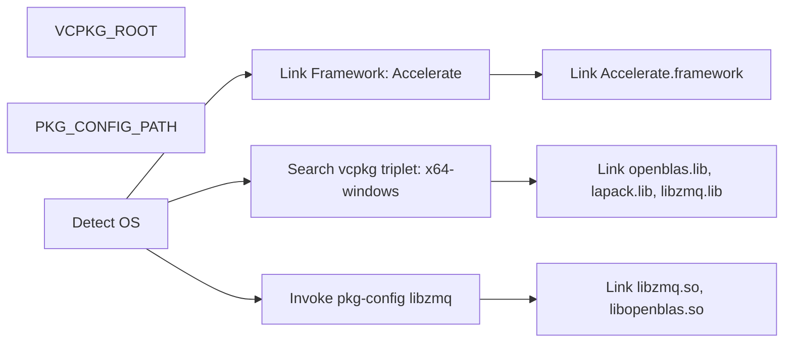

# Build System & Native Dependencies

<details>
<summary>Relevant source files</summary>

- [.github/workflows/ci.yml](https://github.com/runmat-org/runmat/blob/82685330/.github/workflows/ci.yml)
- [.github/workflows/release.yml](https://github.com/runmat-org/runmat/blob/82685330/.github/workflows/release.yml)
- [.github/workflows/wasm-bindings.yml](https://github.com/runmat-org/runmat/blob/82685330/.github/workflows/wasm-bindings.yml)
- [Cargo.lock](https://github.com/runmat-org/runmat/blob/82685330/Cargo.lock)
- [Cargo.toml](https://github.com/runmat-org/runmat/blob/82685330/Cargo.toml)
- [crates/runmat-accelerate/Cargo.toml](https://github.com/runmat-org/runmat/blob/82685330/crates/runmat-accelerate/Cargo.toml)
- [crates/runmat-builtins/Cargo.toml](https://github.com/runmat-org/runmat/blob/82685330/crates/runmat-builtins/Cargo.toml)
- [crates/runmat-builtins/tests/registry.rs](https://github.com/runmat-org/runmat/blob/82685330/crates/runmat-builtins/tests/registry.rs)
- [crates/runmat-gc/Cargo.toml](https://github.com/runmat-org/runmat/blob/82685330/crates/runmat-gc/Cargo.toml)
- [crates/runmat-lexer/Cargo.toml](https://github.com/runmat-org/runmat/blob/82685330/crates/runmat-lexer/Cargo.toml)
- [crates/runmat-macros/Cargo.toml](https://github.com/runmat-org/runmat/blob/82685330/crates/runmat-macros/Cargo.toml)
- [crates/runmat-macros/tests/basic.rs](https://github.com/runmat-org/runmat/blob/82685330/crates/runmat-macros/tests/basic.rs)
- [crates/runmat-macros/tests/multi.rs](https://github.com/runmat-org/runmat/blob/82685330/crates/runmat-macros/tests/multi.rs)
- [crates/runmat-macros/tests/ui/fail_bad_sig.rs](https://github.com/runmat-org/runmat/blob/82685330/crates/runmat-macros/tests/ui/fail_bad_sig.rs)
- [crates/runmat-macros/tests/ui/fail_bad_sig.stderr](https://github.com/runmat-org/runmat/blob/82685330/crates/runmat-macros/tests/ui/fail_bad_sig.stderr)
- [crates/runmat-macros/tests/ui/fail_non_string.rs](https://github.com/runmat-org/runmat/blob/82685330/crates/runmat-macros/tests/ui/fail_non_string.rs)
- [crates/runmat-macros/tests/ui/fail_non_string.stderr](https://github.com/runmat-org/runmat/blob/82685330/crates/runmat-macros/tests/ui/fail_non_string.stderr)
- [crates/runmat-parser/Cargo.toml](https://github.com/runmat-org/runmat/blob/82685330/crates/runmat-parser/Cargo.toml)
- [crates/runmat-plot/Cargo.toml](https://github.com/runmat-org/runmat/blob/82685330/crates/runmat-plot/Cargo.toml)
- [crates/runmat-runtime-integration-tests/tests/dispatcher.rs](https://github.com/runmat-org/runmat/blob/82685330/crates/runmat-runtime-integration-tests/tests/dispatcher.rs)
- [crates/runmat-runtime/Cargo.toml](https://github.com/runmat-org/runmat/blob/82685330/crates/runmat-runtime/Cargo.toml)
- [crates/runmat-runtime/build.rs](https://github.com/runmat-org/runmat/blob/82685330/crates/runmat-runtime/build.rs)
- [crates/runmat-snapshot/Cargo.toml](https://github.com/runmat-org/runmat/blob/82685330/crates/runmat-snapshot/Cargo.toml)
- [crates/runmat-turbine/Cargo.toml](https://github.com/runmat-org/runmat/blob/82685330/crates/runmat-turbine/Cargo.toml)
- [infra/scripts/bootstrap-linux-runner.sh](https://github.com/runmat-org/runmat/blob/82685330/infra/scripts/bootstrap-linux-runner.sh)
- [infra/scripts/bootstrap-windows-runner.ps1](https://github.com/runmat-org/runmat/blob/82685330/infra/scripts/bootstrap-windows-runner.ps1)
- [infra/scripts/configure-linux-runner-service-env.sh](https://github.com/runmat-org/runmat/blob/82685330/infra/scripts/configure-linux-runner-service-env.sh)
- [scripts/chrome-headless.sh](https://github.com/runmat-org/runmat/blob/82685330/scripts/chrome-headless.sh)
- [scripts/cut-release.sh](https://github.com/runmat-org/runmat/blob/82685330/scripts/cut-release.sh)

</details>

The RunMat build system manages a complex polyglot workspace that integrates high-performance linear algebra libraries, cross-platform GPU backends, and WebAssembly targets. It utilizes a tiered dependency resolution strategy involving `vcpkg` for Windows, system package managers for Linux, and the `Accelerate` framework for macOS.

## Cargo Workspace Layout

RunMat is organized as a Cargo workspace containing over 30 member crates [Cargo.toml #1-32](https://github.com/runmat-org/runmat/blob/82685330/Cargo.toml#L1-L32) This modularity separates the core language pipeline (lexer, parser, HIR, MIR) from the heavy runtime and acceleration components.

| Crate Category | Primary Member Crates |
| --- | --- |
| Language Pipeline | runmat-lexer, runmat-parser, runmat-hir, runmat-mir, runmat-static-analysis |
| Execution Tiers | runmat-vm (Interpreter), runmat-turbine (JIT) |
| Runtime & Ops | runmat-runtime, runmat-builtins, runmat-accelerate, runmat-plot |
| Infrastructure | runmat-gc, runmat-snapshot, runmat-filesystem, runmat-macros |

Sources: `<FileRef file-url="https://github.com/runmat-org/runmat/blob/82685330/Cargo.toml#L1-L32" min=1 max=32 file-path="Cargo.toml">Hii</FileRef>`

## Native Dependency Linking Logic

The `runmat-runtime` crate acts as the primary integration point for native libraries [crates/runmat-runtime/Cargo.toml #10-11](https://github.com/runmat-org/runmat/blob/82685330/crates/runmat-runtime/Cargo.toml#L10-L11) Its `build.rs` script and feature flags determine how the engine interacts with BLAS, LAPACK, and ZeroMQ.

### BLAS and LAPACK Resolution

RunMat provides high-performance linear algebra via the `blas-lapack` feature [crates/runmat-runtime/Cargo.toml #88-92](https://github.com/runmat-org/runmat/blob/82685330/crates/runmat-runtime/Cargo.toml#L88-L92) The linking strategy is platform-specific:

- macOS: Links against Apple's `Accelerate` framework, supporting both Intel and Apple Silicon [crates/runmat-runtime/Cargo.toml #54-56](https://github.com/runmat-org/runmat/blob/82685330/crates/runmat-runtime/Cargo.toml#L54-L56)
- Linux/Windows: Links against `OpenBLAS`. On Windows, the system expects `openblas.lib` and `lapack.lib` to be provided via `vcpkg` [crates/runmat-runtime/Cargo.toml #58-60](https://github.com/runmat-org/runmat/blob/82685330/crates/runmat-runtime/Cargo.toml#L58-L60) [.github/workflows/release.yml #118-119](https://github.com/runmat-org/runmat/blob/82685330/.github/workflows/release.yml#L118-L119)

### ZeroMQ (ZMQ)

ZMQ is required for inter-process communication (e.g., between the server and clients). The build system looks for `libzmq` via `pkg-config` on Unix-like systems [.github/workflows/ci.yml #144-145](https://github.com/runmat-org/runmat/blob/82685330/.github/workflows/ci.yml#L144-L145) On Windows, it searches for `zmq.h` and the import library in the `VCPKG_ROOT` path [.github/workflows/release.yml #117-120](https://github.com/runmat-org/runmat/blob/82685330/.github/workflows/release.yml#L117-L120)

### Dependency Resolution Flow

The following diagram illustrates how the build system resolves these native components during a compilation run.

Native Dependency Resolution Flow



<details>
<summary>Rendered SVG</summary>

```svg
<svg id="mermaid-yi7ev5h8ezf" xmlns="http://www.w3.org/2000/svg" xmlns:xlink="http://www.w3.org/1999/xlink" class="flowchart" style="max-width: 100%; touch-action: none; user-select: none; cursor: grab; min-height: fit-content; max-height: 100%;" viewBox="-0.017232260173273062 0 1274.6047770203465 598" role="graphics-document document" aria-roledescription="flowchart-v2" preserveAspectRatio="xMidYMid meet"><style>#mermaid-yi7ev5h8ezf{font-family:ui-sans-serif,-apple-system,system-ui,Segoe UI,Helvetica;font-size:16px;fill:#ccc;}@keyframes edge-animation-frame{from{stroke-dashoffset:0;}}@keyframes dash{to{stroke-dashoffset:0;}}#mermaid-yi7ev5h8ezf .edge-animation-slow{stroke-dasharray:9,5!important;stroke-dashoffset:900;animation:dash 50s linear infinite;stroke-linecap:round;}#mermaid-yi7ev5h8ezf .edge-animation-fast{stroke-dasharray:9,5!important;stroke-dashoffset:900;animation:dash 20s linear infinite;stroke-linecap:round;}#mermaid-yi7ev5h8ezf .error-icon{fill:#333;}#mermaid-yi7ev5h8ezf .error-text{fill:#cccccc;stroke:#cccccc;}#mermaid-yi7ev5h8ezf .edge-thickness-normal{stroke-width:1px;}#mermaid-yi7ev5h8ezf .edge-thickness-thick{stroke-width:3.5px;}#mermaid-yi7ev5h8ezf .edge-pattern-solid{stroke-dasharray:0;}#mermaid-yi7ev5h8ezf .edge-thickness-invisible{stroke-width:0;fill:none;}#mermaid-yi7ev5h8ezf .edge-pattern-dashed{stroke-dasharray:3;}#mermaid-yi7ev5h8ezf .edge-pattern-dotted{stroke-dasharray:2;}#mermaid-yi7ev5h8ezf .marker{fill:#666;stroke:#666;}#mermaid-yi7ev5h8ezf .marker.cross{stroke:#666;}#mermaid-yi7ev5h8ezf svg{font-family:ui-sans-serif,-apple-system,system-ui,Segoe UI,Helvetica;font-size:16px;}#mermaid-yi7ev5h8ezf p{margin:0;}#mermaid-yi7ev5h8ezf .label{font-family:ui-sans-serif,-apple-system,system-ui,Segoe UI,Helvetica;color:#fff;}#mermaid-yi7ev5h8ezf .cluster-label text{fill:#fff;}#mermaid-yi7ev5h8ezf .cluster-label span{color:#fff;}#mermaid-yi7ev5h8ezf .cluster-label span p{background-color:transparent;}#mermaid-yi7ev5h8ezf .label text,#mermaid-yi7ev5h8ezf span{fill:#fff;color:#fff;}#mermaid-yi7ev5h8ezf .node rect,#mermaid-yi7ev5h8ezf .node circle,#mermaid-yi7ev5h8ezf .node ellipse,#mermaid-yi7ev5h8ezf .node polygon,#mermaid-yi7ev5h8ezf .node path{fill:#111;stroke:#222;stroke-width:1px;}#mermaid-yi7ev5h8ezf .rough-node .label text,#mermaid-yi7ev5h8ezf .node .label text,#mermaid-yi7ev5h8ezf .image-shape .label,#mermaid-yi7ev5h8ezf .icon-shape .label{text-anchor:middle;}#mermaid-yi7ev5h8ezf .node .katex path{fill:#000;stroke:#000;stroke-width:1px;}#mermaid-yi7ev5h8ezf .rough-node .label,#mermaid-yi7ev5h8ezf .node .label,#mermaid-yi7ev5h8ezf .image-shape .label,#mermaid-yi7ev5h8ezf .icon-shape .label{text-align:center;}#mermaid-yi7ev5h8ezf .node.clickable{cursor:pointer;}#mermaid-yi7ev5h8ezf .root .anchor path{fill:#666!important;stroke-width:0;stroke:#666;}#mermaid-yi7ev5h8ezf .arrowheadPath{fill:#0b0b0b;}#mermaid-yi7ev5h8ezf .edgePath .path{stroke:#666;stroke-width:1px;}#mermaid-yi7ev5h8ezf .flowchart-link{stroke:#666;fill:none;}#mermaid-yi7ev5h8ezf .edgeLabel{background-color:#161616;text-align:center;}#mermaid-yi7ev5h8ezf .edgeLabel p{background-color:#161616;}#mermaid-yi7ev5h8ezf .edgeLabel rect{opacity:0.5;background-color:#161616;fill:#161616;}#mermaid-yi7ev5h8ezf .labelBkg{background-color:rgba(22, 22, 22, 0.5);}#mermaid-yi7ev5h8ezf .cluster rect{fill:#161616;stroke:#222;stroke-width:1px;}#mermaid-yi7ev5h8ezf .cluster text{fill:#fff;}#mermaid-yi7ev5h8ezf .cluster span{color:#fff;}#mermaid-yi7ev5h8ezf div.mermaidTooltip{position:absolute;text-align:center;max-width:200px;padding:2px;font-family:ui-sans-serif,-apple-system,system-ui,Segoe UI,Helvetica;font-size:12px;background:#333;border:1px solid hsl(0, 0%, 10%);border-radius:2px;pointer-events:none;z-index:100;}#mermaid-yi7ev5h8ezf .flowchartTitleText{text-anchor:middle;font-size:18px;fill:#ccc;}#mermaid-yi7ev5h8ezf rect.text{fill:none;stroke-width:0;}#mermaid-yi7ev5h8ezf .icon-shape,#mermaid-yi7ev5h8ezf .image-shape{background-color:#161616;text-align:center;}#mermaid-yi7ev5h8ezf .icon-shape p,#mermaid-yi7ev5h8ezf .image-shape p{background-color:#161616;padding:2px;}#mermaid-yi7ev5h8ezf .icon-shape .label rect,#mermaid-yi7ev5h8ezf .image-shape .label rect{opacity:0.5;background-color:#161616;fill:#161616;}#mermaid-yi7ev5h8ezf .label-icon{display:inline-block;height:1em;overflow:visible;vertical-align:-0.125em;}#mermaid-yi7ev5h8ezf .node .label-icon path{fill:currentColor;stroke:revert;stroke-width:revert;}#mermaid-yi7ev5h8ezf .node .neo-node{stroke:#222;}#mermaid-yi7ev5h8ezf [data-look="neo"].node rect,#mermaid-yi7ev5h8ezf [data-look="neo"].cluster rect,#mermaid-yi7ev5h8ezf [data-look="neo"].node polygon{stroke:url(#mermaid-yi7ev5h8ezf-gradient);filter:drop-shadow( 1px 2px 2px rgba(185,185,185,1));}#mermaid-yi7ev5h8ezf [data-look="neo"].node path{stroke:url(#mermaid-yi7ev5h8ezf-gradient);stroke-width:1px;}#mermaid-yi7ev5h8ezf [data-look="neo"].node .outer-path{filter:drop-shadow( 1px 2px 2px rgba(185,185,185,1));}#mermaid-yi7ev5h8ezf [data-look="neo"].node .neo-line path{stroke:#222;filter:none;}#mermaid-yi7ev5h8ezf [data-look="neo"].node circle{stroke:url(#mermaid-yi7ev5h8ezf-gradient);filter:drop-shadow( 1px 2px 2px rgba(185,185,185,1));}#mermaid-yi7ev5h8ezf [data-look="neo"].node circle .state-start{fill:#000000;}#mermaid-yi7ev5h8ezf [data-look="neo"].icon-shape .icon{fill:url(#mermaid-yi7ev5h8ezf-gradient);filter:drop-shadow( 1px 2px 2px rgba(185,185,185,1));}#mermaid-yi7ev5h8ezf [data-look="neo"].icon-shape .icon-neo path{stroke:url(#mermaid-yi7ev5h8ezf-gradient);filter:drop-shadow( 1px 2px 2px rgba(185,185,185,1));}#mermaid-yi7ev5h8ezf :root{--mermaid-font-family:"trebuchet ms",verdana,arial,sans-serif;}</style><g><marker id="mermaid-yi7ev5h8ezf_flowchart-v2-pointEnd" class="marker flowchart-v2" viewBox="0 0 10 10" refX="5" refY="5" markerUnits="userSpaceOnUse" markerWidth="8" markerHeight="8" orient="auto"><path d="M 0 0 L 10 5 L 0 10 z" class="arrowMarkerPath" style="stroke-width: 1; stroke-dasharray: 1, 0;"></path></marker><marker id="mermaid-yi7ev5h8ezf_flowchart-v2-pointStart" class="marker flowchart-v2" viewBox="0 0 10 10" refX="4.5" refY="5" markerUnits="userSpaceOnUse" markerWidth="8" markerHeight="8" orient="auto"><path d="M 0 5 L 10 10 L 10 0 z" class="arrowMarkerPath" style="stroke-width: 1; stroke-dasharray: 1, 0;"></path></marker><marker id="mermaid-yi7ev5h8ezf_flowchart-v2-pointEnd-margin" class="marker flowchart-v2" viewBox="0 0 11.5 14" refX="11.5" refY="7" markerUnits="userSpaceOnUse" markerWidth="10.5" markerHeight="14" orient="auto"><path d="M 0 0 L 11.5 7 L 0 14 z" class="arrowMarkerPath" style="stroke-width: 0; stroke-dasharray: 1, 0;"></path></marker><marker id="mermaid-yi7ev5h8ezf_flowchart-v2-pointStart-margin" class="marker flowchart-v2" viewBox="0 0 11.5 14" refX="1" refY="7" markerUnits="userSpaceOnUse" markerWidth="11.5" markerHeight="14" orient="auto"><polygon points="0,7 11.5,14 11.5,0" class="arrowMarkerPath" style="stroke-width: 0; stroke-dasharray: 1, 0;"></polygon></marker><marker id="mermaid-yi7ev5h8ezf_flowchart-v2-circleEnd" class="marker flowchart-v2" viewBox="0 0 10 10" refX="11" refY="5" markerUnits="userSpaceOnUse" markerWidth="11" markerHeight="11" orient="auto"><circle cx="5" cy="5" r="5" class="arrowMarkerPath" style="stroke-width: 1; stroke-dasharray: 1, 0;"></circle></marker><marker id="mermaid-yi7ev5h8ezf_flowchart-v2-circleStart" class="marker flowchart-v2" viewBox="0 0 10 10" refX="-1" refY="5" markerUnits="userSpaceOnUse" markerWidth="11" markerHeight="11" orient="auto"><circle cx="5" cy="5" r="5" class="arrowMarkerPath" style="stroke-width: 1; stroke-dasharray: 1, 0;"></circle></marker><marker id="mermaid-yi7ev5h8ezf_flowchart-v2-circleEnd-margin" class="marker flowchart-v2" viewBox="0 0 10 10" refY="5" refX="12.25" markerUnits="userSpaceOnUse" markerWidth="14" markerHeight="14" orient="auto"><circle cx="5" cy="5" r="5" class="arrowMarkerPath" style="stroke-width: 0; stroke-dasharray: 1, 0;"></circle></marker><marker id="mermaid-yi7ev5h8ezf_flowchart-v2-circleStart-margin" class="marker flowchart-v2" viewBox="0 0 10 10" refX="-2" refY="5" markerUnits="userSpaceOnUse" markerWidth="14" markerHeight="14" orient="auto"><circle cx="5" cy="5" r="5" class="arrowMarkerPath" style="stroke-width: 0; stroke-dasharray: 1, 0;"></circle></marker><marker id="mermaid-yi7ev5h8ezf_flowchart-v2-crossEnd" class="marker cross flowchart-v2" viewBox="0 0 11 11" refX="12" refY="5.2" markerUnits="userSpaceOnUse" markerWidth="11" markerHeight="11" orient="auto"><path d="M 1,1 l 9,9 M 10,1 l -9,9" class="arrowMarkerPath" style="stroke-width: 2; stroke-dasharray: 1, 0;"></path></marker><marker id="mermaid-yi7ev5h8ezf_flowchart-v2-crossStart" class="marker cross flowchart-v2" viewBox="0 0 11 11" refX="-1" refY="5.2" markerUnits="userSpaceOnUse" markerWidth="11" markerHeight="11" orient="auto"><path d="M 1,1 l 9,9 M 10,1 l -9,9" class="arrowMarkerPath" style="stroke-width: 2; stroke-dasharray: 1, 0;"></path></marker><marker id="mermaid-yi7ev5h8ezf_flowchart-v2-crossEnd-margin" class="marker cross flowchart-v2" viewBox="0 0 15 15" refX="17.7" refY="7.5" markerUnits="userSpaceOnUse" markerWidth="12" markerHeight="12" orient="auto"><path d="M 1,1 L 14,14 M 1,14 L 14,1" class="arrowMarkerPath" style="stroke-width: 2.5;"></path></marker><marker id="mermaid-yi7ev5h8ezf_flowchart-v2-crossStart-margin" class="marker cross flowchart-v2" viewBox="0 0 15 15" refX="-3.5" refY="7.5" markerUnits="userSpaceOnUse" markerWidth="12" markerHeight="12" orient="auto"><path d="M 1,1 L 14,14 M 1,14 L 14,1" class="arrowMarkerPath" style="stroke-width: 2.5; stroke-dasharray: 1, 0;"></path></marker><g class="root"><g class="clusters"><g class="cluster" id="mermaid-yi7ev5h8ezf-runmat-runtime/build.rs" data-look="classic"><rect style="" x="8" y="8" width="941.2734375" height="430"></rect><g class="cluster-label" transform="translate(392.68359375, 8)"><foreignObject width="171.90625" height="24"><div style="display: table-cell; white-space: nowrap; line-height: 1.5;" xmlns="http://www.w3.org/1999/xhtml"><span class="nodeLabel"><p>runmat-runtime/build.rs</p></span></div></foreignObject></g></g></g><g class="edgePaths"><path d="M439.711,168.086L395.259,189.738C350.807,211.391,261.904,254.695,217.452,281.848C173,309,173,320,173,325.5L173,331" id="mermaid-yi7ev5h8ezf-L_DET_OS_LINK_ACCEL_0" class="edge-thickness-normal edge-pattern-solid edge-thickness-normal edge-pattern-solid flowchart-link" style=";" data-edge="true" data-et="edge" data-id="L_DET_OS_LINK_ACCEL_0" data-points="W3sieCI6NDM5LjcxMDk1NDQ0Njg1NDY2LCJ5IjoxNjguMDg1OTU0NDQ2ODU0NjZ9LHsieCI6MTczLCJ5IjoyOTh9LHsieCI6MTczLCJ5IjozMzV9XQ==" data-look="classic" marker-end="url(#mermaid-yi7ev5h8ezf_flowchart-v2-pointEnd)"></path><path d="M483,211.375L483,225.813C483,240.25,483,269.125,483,289.063C483,309,483,320,483,325.5L483,331" id="mermaid-yi7ev5h8ezf-L_DET_OS_LINK_VCPKG_0" class="edge-thickness-normal edge-pattern-solid edge-thickness-normal edge-pattern-solid flowchart-link" style=";" data-edge="true" data-et="edge" data-id="L_DET_OS_LINK_VCPKG_0" data-points="W3sieCI6NDgzLCJ5IjoyMTEuMzc1fSx7IngiOjQ4MywieSI6Mjk4fSx7IngiOjQ4MywieSI6MzM1fV0=" data-look="classic" marker-end="url(#mermaid-yi7ev5h8ezf_flowchart-v2-pointEnd)"></path><path d="M526.289,168.086L570.741,189.738C615.193,211.391,704.096,254.695,748.548,283.848C793,313,793,328,793,335.5L793,343" id="mermaid-yi7ev5h8ezf-L_DET_OS_LINK_PKG_0" class="edge-thickness-normal edge-pattern-solid edge-thickness-normal edge-pattern-solid flowchart-link" style=";" data-edge="true" data-et="edge" data-id="L_DET_OS_LINK_PKG_0" data-points="W3sieCI6NTI2LjI4OTA0NTU1MzE0NTMsInkiOjE2OC4wODU5NTQ0NDY4NTQ2Nn0seyJ4Ijo3OTMsInkiOjI5OH0seyJ4Ijo3OTMsInkiOjM0N31d" data-look="classic" marker-end="url(#mermaid-yi7ev5h8ezf_flowchart-v2-pointEnd)"></path><path d="M483,413L483,417.167C483,421.333,483,429.667,483,440C483,450.333,483,462.667,483,474.333C483,486,483,497,483,502.5L483,508" id="mermaid-yi7ev5h8ezf-L_LINK_VCPKG_OUT_LIB_0" class="edge-thickness-normal edge-pattern-solid edge-thickness-normal edge-pattern-solid flowchart-link" style=";" data-edge="true" data-et="edge" data-id="L_LINK_VCPKG_OUT_LIB_0" data-points="W3sieCI6NDgzLCJ5Ijo0MTN9LHsieCI6NDgzLCJ5Ijo0Mzh9LHsieCI6NDgzLCJ5Ijo0NzV9LHsieCI6NDgzLCJ5Ijo1MTJ9XQ==" data-look="classic" marker-end="url(#mermaid-yi7ev5h8ezf_flowchart-v2-pointEnd)"></path><path d="M793,401L793,407.167C793,413.333,793,425.667,793,438C793,450.333,793,462.667,793,474.333C793,486,793,497,793,502.5L793,508" id="mermaid-yi7ev5h8ezf-L_LINK_PKG_OUT_SO_0" class="edge-thickness-normal edge-pattern-solid edge-thickness-normal edge-pattern-solid flowchart-link" style=";" data-edge="true" data-et="edge" data-id="L_LINK_PKG_OUT_SO_0" data-points="W3sieCI6NzkzLCJ5Ijo0MDF9LHsieCI6NzkzLCJ5Ijo0Mzh9LHsieCI6NzkzLCJ5Ijo0NzV9LHsieCI6NzkzLCJ5Ijo1MTJ9XQ==" data-look="classic" marker-end="url(#mermaid-yi7ev5h8ezf_flowchart-v2-pointEnd)"></path><path d="M173,413L173,417.167C173,421.333,173,429.667,173,440C173,450.333,173,462.667,173,476.333C173,490,173,505,173,512.5L173,520" id="mermaid-yi7ev5h8ezf-L_LINK_ACCEL_OUT_FRAMEWORK_0" class="edge-thickness-normal edge-pattern-solid edge-thickness-normal edge-pattern-solid flowchart-link" style=";" data-edge="true" data-et="edge" data-id="L_LINK_ACCEL_OUT_FRAMEWORK_0" data-points="W3sieCI6MTczLCJ5Ijo0MTN9LHsieCI6MTczLCJ5Ijo0Mzh9LHsieCI6MTczLCJ5Ijo0NzV9LHsieCI6MTczLCJ5Ijo1MjR9XQ==" data-look="classic" marker-end="url(#mermaid-yi7ev5h8ezf_flowchart-v2-pointEnd)"></path></g><g class="edgeLabels"><g class="edgeLabel" transform="translate(173, 298)"><g class="label" data-id="L_DET_OS_LINK_ACCEL_0" transform="translate(-26.34375, -12)"><foreignObject width="52.6875" height="24"><div style="display: table-cell; white-space: nowrap; line-height: 1.5; max-width: 200px; text-align: center;" xmlns="http://www.w3.org/1999/xhtml" class="labelBkg"><span class="edgeLabel"><p>macOS</p></span></div></foreignObject></g></g><g class="edgeLabel" transform="translate(483, 298)"><g class="label" data-id="L_DET_OS_LINK_VCPKG_0" transform="translate(-33.046875, -12)"><foreignObject width="66.09375" height="24"><div style="display: table-cell; white-space: nowrap; line-height: 1.5; max-width: 200px; text-align: center;" xmlns="http://www.w3.org/1999/xhtml" class="labelBkg"><span class="edgeLabel"><p>Windows</p></span></div></foreignObject></g></g><g class="edgeLabel" transform="translate(793, 298)"><g class="label" data-id="L_DET_OS_LINK_PKG_0" transform="translate(-19.2734375, -12)"><foreignObject width="38.546875" height="24"><div style="display: table-cell; white-space: nowrap; line-height: 1.5; max-width: 200px; text-align: center;" xmlns="http://www.w3.org/1999/xhtml" class="labelBkg"><span class="edgeLabel"><p>Linux</p></span></div></foreignObject></g></g><g class="edgeLabel" transform="translate(483, 475)"><g class="label" data-id="L_LINK_VCPKG_OUT_LIB_0" transform="translate(-30.4921875, -12)"><foreignObject width="60.984375" height="24"><div style="display: table-cell; white-space: nowrap; line-height: 1.5; max-width: 200px; text-align: center;" xmlns="http://www.w3.org/1999/xhtml" class="labelBkg"><span class="edgeLabel"><p>Success</p></span></div></foreignObject></g></g><g class="edgeLabel" transform="translate(793, 475)"><g class="label" data-id="L_LINK_PKG_OUT_SO_0" transform="translate(-30.4921875, -12)"><foreignObject width="60.984375" height="24"><div style="display: table-cell; white-space: nowrap; line-height: 1.5; max-width: 200px; text-align: center;" xmlns="http://www.w3.org/1999/xhtml" class="labelBkg"><span class="edgeLabel"><p>Success</p></span></div></foreignObject></g></g><g class="edgeLabel"><g class="label" data-id="L_LINK_ACCEL_OUT_FRAMEWORK_0" transform="translate(0, 0)"><foreignObject width="0" height="0"><div style="display: table-cell; white-space: nowrap; line-height: 1.5; max-width: 200px; text-align: center;" xmlns="http://www.w3.org/1999/xhtml" class="labelBkg"><span class="edgeLabel"></span></div></foreignObject></g></g></g><g class="nodes"><g class="root" transform="translate(976.2734375, 25)"><g class="clusters"><g class="cluster" id="mermaid-yi7ev5h8ezf-subGraph0" data-look="classic"><rect style="" x="8" y="8" width="282.296875" height="228"></rect><g class="cluster-label" transform="translate(83.6953125, 8)"><foreignObject width="130.90625" height="24"><div style="display: table-cell; white-space: nowrap; line-height: 1.5;" xmlns="http://www.w3.org/1999/xhtml"><span class="nodeLabel"><p>Build Environment</p></span></div></foreignObject></g></g></g><g class="edgePaths"></g><g class="edgeLabels"></g><g class="nodes"><g class="node default" id="mermaid-yi7ev5h8ezf-flowchart-ENV_VCPKG-0" data-look="classic" transform="translate(149.1484375, 70)"><rect class="basic label-container" style="" x="-82.4453125" y="-27" width="164.890625" height="54"></rect><g class="label" style="" transform="translate(-52.4453125, -12)"><rect></rect><foreignObject width="104.890625" height="24"><div style="display: table-cell; white-space: nowrap; line-height: 1.5; max-width: 200px; text-align: center;" xmlns="http://www.w3.org/1999/xhtml"><span class="nodeLabel"><p>VCPKG_ROOT</p></span></div></foreignObject></g></g><g class="node default" id="mermaid-yi7ev5h8ezf-flowchart-ENV_PKG-1" data-look="classic" transform="translate(149.1484375, 174)"><rect class="basic label-container" style="" x="-103.6484375" y="-27" width="207.296875" height="54"></rect><g class="label" style="" transform="translate(-73.6484375, -12)"><rect></rect><foreignObject width="147.296875" height="24"><div style="display: table-cell; white-space: nowrap; line-height: 1.5; max-width: 200px; text-align: center;" xmlns="http://www.w3.org/1999/xhtml"><span class="nodeLabel"><p>PKG_CONFIG_PATH</p></span></div></foreignObject></g></g></g></g><g class="node default" id="mermaid-yi7ev5h8ezf-flowchart-DET_OS-2" data-look="classic" transform="translate(483, 147)"><polygon points="64.375,0 128.75,-64.375 64.375,-128.75 0,-64.375" class="label-container" transform="translate(-63.875, 64.375)"></polygon><g class="label" style="" transform="translate(-37.375, -12)"><rect></rect><foreignObject width="74.75" height="24"><div style="display: table-cell; white-space: nowrap; line-height: 1.5; max-width: 200px; text-align: center;" xmlns="http://www.w3.org/1999/xhtml"><span class="nodeLabel"><p>Detect OS</p></span></div></foreignObject></g></g><g class="node default" id="mermaid-yi7ev5h8ezf-flowchart-LINK_ACCEL-3" data-look="classic" transform="translate(173, 374)"><rect class="basic label-container" style="" x="-130" y="-39" width="260" height="78"></rect><g class="label" style="" transform="translate(-100, -24)"><rect></rect><foreignObject width="200" height="48"><div style="display: table; white-space: break-spaces; line-height: 1.5; max-width: 200px; text-align: center; width: 200px;" xmlns="http://www.w3.org/1999/xhtml"><span class="nodeLabel"><p>Link Framework: Accelerate</p></span></div></foreignObject></g></g><g class="node default" id="mermaid-yi7ev5h8ezf-flowchart-LINK_VCPKG-4" data-look="classic" transform="translate(483, 374)"><rect class="basic label-container" style="" x="-130" y="-39" width="260" height="78"></rect><g class="label" style="" transform="translate(-100, -24)"><rect></rect><foreignObject width="200" height="48"><div style="display: table; white-space: break-spaces; line-height: 1.5; max-width: 200px; text-align: center; width: 200px;" xmlns="http://www.w3.org/1999/xhtml"><span class="nodeLabel"><p>Search vcpkg triplet: x64-windows</p></span></div></foreignObject></g></g><g class="node default" id="mermaid-yi7ev5h8ezf-flowchart-LINK_PKG-5" data-look="classic" transform="translate(793, 374)"><rect class="basic label-container" style="" x="-121.2734375" y="-27" width="242.546875" height="54"></rect><g class="label" style="" transform="translate(-91.2734375, -12)"><rect></rect><foreignObject width="182.546875" height="24"><div style="display: table-cell; white-space: nowrap; line-height: 1.5; max-width: 200px; text-align: center;" xmlns="http://www.w3.org/1999/xhtml"><span class="nodeLabel"><p>Invoke pkg-config libzmq</p></span></div></foreignObject></g></g><g class="node default" id="mermaid-yi7ev5h8ezf-flowchart-OUT_LIB-13" data-look="classic" transform="translate(483, 551)"><rect class="basic label-container" style="" x="-130" y="-39" width="260" height="78"></rect><g class="label" style="" transform="translate(-100, -24)"><rect></rect><foreignObject width="200" height="48"><div style="display: table; white-space: break-spaces; line-height: 1.5; max-width: 200px; text-align: center; width: 200px;" xmlns="http://www.w3.org/1999/xhtml"><span class="nodeLabel"><p>Link openblas.lib, lapack.lib, libzmq.lib</p></span></div></foreignObject></g></g><g class="node default" id="mermaid-yi7ev5h8ezf-flowchart-OUT_SO-15" data-look="classic" transform="translate(793, 551)"><rect class="basic label-container" style="" x="-130" y="-39" width="260" height="78"></rect><g class="label" style="" transform="translate(-100, -24)"><rect></rect><foreignObject width="200" height="48"><div style="display: table; white-space: break-spaces; line-height: 1.5; max-width: 200px; text-align: center; width: 200px;" xmlns="http://www.w3.org/1999/xhtml"><span class="nodeLabel"><p>Link libzmq.so, libopenblas.so</p></span></div></foreignObject></g></g><g class="node default" id="mermaid-yi7ev5h8ezf-flowchart-OUT_FRAMEWORK-17" data-look="classic" transform="translate(173, 551)"><rect class="basic label-container" style="" x="-126.2109375" y="-27" width="252.421875" height="54"></rect><g class="label" style="" transform="translate(-96.2109375, -12)"><rect></rect><foreignObject width="192.421875" height="24"><div style="display: table-cell; white-space: nowrap; line-height: 1.5; max-width: 200px; text-align: center;" xmlns="http://www.w3.org/1999/xhtml"><span class="nodeLabel"><p>Link Accelerate.framework</p></span></div></foreignObject></g></g></g></g></g><defs><filter id="mermaid-yi7ev5h8ezf-drop-shadow" height="130%" width="130%"><feDropShadow dx="4" dy="4" stdDeviation="0" flood-opacity="0.06" flood-color="#000000"></feDropShadow></filter></defs><defs><filter id="mermaid-yi7ev5h8ezf-drop-shadow-small" height="150%" width="150%"><feDropShadow dx="2" dy="2" stdDeviation="0" flood-opacity="0.06" flood-color="#000000"></feDropShadow></filter></defs><linearGradient id="mermaid-yi7ev5h8ezf-gradient" gradientUnits="objectBoundingBox" x1="0%" y1="0%" x2="100%" y2="0%"><stop offset="0%" stop-color="#333" stop-opacity="1"></stop><stop offset="100%" stop-color="hsl(-120, 0%, 3.3333333333%)" stop-opacity="1"></stop></linearGradient></svg>
```

</details>

Sources: `<FileRef file-url="https://github.com/runmat-org/runmat/blob/82685330/crates/runmat-runtime/Cargo.toml#L53-L61" min=53 max=61 file-path="crates/runmat-runtime/Cargo.toml">Hii</FileRef>`, `<FileRef file-url="https://github.com/runmat-org/runmat/blob/82685330/.github/workflows/release.yml#L92-L149" min=92 max=149 file-path=".github/workflows/release.yml">Hii</FileRef>`, `<FileRef file-url="https://github.com/runmat-org/runmat/blob/82685330/.github/workflows/ci.yml#L129-L153" min=129 max=153 file-path=".github/workflows/ci.yml">Hii</FileRef>`

## WebAssembly & Registry Generation

RunMat supports a first-class WebAssembly (WASM) target via `runmat-wasm`. This target requires a specialized build flow to handle the lack of native BLAS/LAPACK and to pre-calculate the built-in function registry.

### WASM Registry Stub Generation

Because WASM environments cannot easily perform the same runtime reflection or dynamic discovery as native builds, the build system uses a specific environment variable, `RUNMAT_GENERATE_WASM_REGISTRY=1`, during the build process [.github/workflows/wasm-bindings.yml #142](https://github.com/runmat-org/runmat/blob/82685330/.github/workflows/wasm-bindings.yml#L142-L142) This triggers logic in the compiler to serialize the `BuiltinDescriptor` metadata into a static registry that is embedded within the WASM binary.

### Snapshot Integration

To avoid the overhead of re-initializing the standard library on every WASM session start, the `runmat-snapshot` crate is used to create binary snapshots of the VM state [crates/runmat-snapshot/Cargo.toml #6-11](https://github.com/runmat-org/runmat/blob/82685330/crates/runmat-snapshot/Cargo.toml#L6-L11) These snapshots are compressed using `lz4_flex` or `ruzstd` for the WASM target [crates/runmat-snapshot/Cargo.toml #82-84](https://github.com/runmat-org/runmat/blob/82685330/crates/runmat-snapshot/Cargo.toml#L82-L84)

Sources: `<FileRef file-url="https://github.com/runmat-org/runmat/blob/82685330/.github/workflows/wasm-bindings.yml#L141-L143" min=141 max=143 file-path=".github/workflows/wasm-bindings.yml">Hii</FileRef>`, `<FileRef file-url="https://github.com/runmat-org/runmat/blob/82685330/crates/runmat-snapshot/Cargo.toml#L13-L18" min=13 max=18 file-path="crates/runmat-snapshot/Cargo.toml">Hii</FileRef>`

## Procedural Macros (`runmat-macros`)

The `runmat-macros` crate provides the `#[runtime_builtin]` attribute, which is the "glue" between Rust functions and the MATLAB-compatible runtime.

### Macro Responsibilities

1. Metadata Extraction: Parses the Rust function signature to generate `BuiltinDescriptor` metadata [crates/runmat-runtime/Cargo.toml #16](https://github.com/runmat-org/runmat/blob/82685330/crates/runmat-runtime/Cargo.toml#L16-L16)
2. Inventory Registration: Uses the `inventory` crate to register the function into a global registry at compile-time [crates/runmat-builtins/Cargo.toml #12](https://github.com/runmat-org/runmat/blob/82685330/crates/runmat-builtins/Cargo.toml#L12-L12)
3. Type Conversion: Generates boilerplate for converting `VmArray` inputs into Rust types and wrapping results back into the VM's error model.

Builtin Registration Architecture

```mermaid
flowchart LR
  %% Subgraph: Runtime Registry
  %% Subgraph: crates/runmat-macros
  %% Subgraph: crates/runmat-builtins
  FUNC_RUST["Rust function: fn zeros(...)"]
  ATTR_MACRO["#[runtime_builtin]"]
  PROC_MACRO["Proc-Macro Transformer"]
  GEN_DESC["Generate BuiltinDescriptor"]
  INV["inventory::collect!"]
  REG["Global Builtin Registry"]
  FUNC_RUST --> ATTR_MACRO
  ATTR_MACRO --> PROC_MACRO
  PROC_MACRO --> GEN_DESC
  GEN_DESC --> INV
  INV --> REG
```



<details>
<summary>Rendered SVG</summary>

```svg
<svg id="mermaid-3jfo9siv47s" xmlns="http://www.w3.org/2000/svg" xmlns:xlink="http://www.w3.org/1999/xlink" class="flowchart" style="max-width: 100%; touch-action: none; user-select: none; cursor: grab; min-height: fit-content; max-height: 100%;" viewBox="-0.25685342071608375 0 1833.2480818414322 140" role="graphics-document document" aria-roledescription="flowchart-v2" preserveAspectRatio="xMidYMid meet"><style>#mermaid-3jfo9siv47s{font-family:ui-sans-serif,-apple-system,system-ui,Segoe UI,Helvetica;font-size:16px;fill:#ccc;}@keyframes edge-animation-frame{from{stroke-dashoffset:0;}}@keyframes dash{to{stroke-dashoffset:0;}}#mermaid-3jfo9siv47s .edge-animation-slow{stroke-dasharray:9,5!important;stroke-dashoffset:900;animation:dash 50s linear infinite;stroke-linecap:round;}#mermaid-3jfo9siv47s .edge-animation-fast{stroke-dasharray:9,5!important;stroke-dashoffset:900;animation:dash 20s linear infinite;stroke-linecap:round;}#mermaid-3jfo9siv47s .error-icon{fill:#333;}#mermaid-3jfo9siv47s .error-text{fill:#cccccc;stroke:#cccccc;}#mermaid-3jfo9siv47s .edge-thickness-normal{stroke-width:1px;}#mermaid-3jfo9siv47s .edge-thickness-thick{stroke-width:3.5px;}#mermaid-3jfo9siv47s .edge-pattern-solid{stroke-dasharray:0;}#mermaid-3jfo9siv47s .edge-thickness-invisible{stroke-width:0;fill:none;}#mermaid-3jfo9siv47s .edge-pattern-dashed{stroke-dasharray:3;}#mermaid-3jfo9siv47s .edge-pattern-dotted{stroke-dasharray:2;}#mermaid-3jfo9siv47s .marker{fill:#666;stroke:#666;}#mermaid-3jfo9siv47s .marker.cross{stroke:#666;}#mermaid-3jfo9siv47s svg{font-family:ui-sans-serif,-apple-system,system-ui,Segoe UI,Helvetica;font-size:16px;}#mermaid-3jfo9siv47s p{margin:0;}#mermaid-3jfo9siv47s .label{font-family:ui-sans-serif,-apple-system,system-ui,Segoe UI,Helvetica;color:#fff;}#mermaid-3jfo9siv47s .cluster-label text{fill:#fff;}#mermaid-3jfo9siv47s .cluster-label span{color:#fff;}#mermaid-3jfo9siv47s .cluster-label span p{background-color:transparent;}#mermaid-3jfo9siv47s .label text,#mermaid-3jfo9siv47s span{fill:#fff;color:#fff;}#mermaid-3jfo9siv47s .node rect,#mermaid-3jfo9siv47s .node circle,#mermaid-3jfo9siv47s .node ellipse,#mermaid-3jfo9siv47s .node polygon,#mermaid-3jfo9siv47s .node path{fill:#111;stroke:#222;stroke-width:1px;}#mermaid-3jfo9siv47s .rough-node .label text,#mermaid-3jfo9siv47s .node .label text,#mermaid-3jfo9siv47s .image-shape .label,#mermaid-3jfo9siv47s .icon-shape .label{text-anchor:middle;}#mermaid-3jfo9siv47s .node .katex path{fill:#000;stroke:#000;stroke-width:1px;}#mermaid-3jfo9siv47s .rough-node .label,#mermaid-3jfo9siv47s .node .label,#mermaid-3jfo9siv47s .image-shape .label,#mermaid-3jfo9siv47s .icon-shape .label{text-align:center;}#mermaid-3jfo9siv47s .node.clickable{cursor:pointer;}#mermaid-3jfo9siv47s .root .anchor path{fill:#666!important;stroke-width:0;stroke:#666;}#mermaid-3jfo9siv47s .arrowheadPath{fill:#0b0b0b;}#mermaid-3jfo9siv47s .edgePath .path{stroke:#666;stroke-width:1px;}#mermaid-3jfo9siv47s .flowchart-link{stroke:#666;fill:none;}#mermaid-3jfo9siv47s .edgeLabel{background-color:#161616;text-align:center;}#mermaid-3jfo9siv47s .edgeLabel p{background-color:#161616;}#mermaid-3jfo9siv47s .edgeLabel rect{opacity:0.5;background-color:#161616;fill:#161616;}#mermaid-3jfo9siv47s .labelBkg{background-color:rgba(22, 22, 22, 0.5);}#mermaid-3jfo9siv47s .cluster rect{fill:#161616;stroke:#222;stroke-width:1px;}#mermaid-3jfo9siv47s .cluster text{fill:#fff;}#mermaid-3jfo9siv47s .cluster span{color:#fff;}#mermaid-3jfo9siv47s div.mermaidTooltip{position:absolute;text-align:center;max-width:200px;padding:2px;font-family:ui-sans-serif,-apple-system,system-ui,Segoe UI,Helvetica;font-size:12px;background:#333;border:1px solid hsl(0, 0%, 10%);border-radius:2px;pointer-events:none;z-index:100;}#mermaid-3jfo9siv47s .flowchartTitleText{text-anchor:middle;font-size:18px;fill:#ccc;}#mermaid-3jfo9siv47s rect.text{fill:none;stroke-width:0;}#mermaid-3jfo9siv47s .icon-shape,#mermaid-3jfo9siv47s .image-shape{background-color:#161616;text-align:center;}#mermaid-3jfo9siv47s .icon-shape p,#mermaid-3jfo9siv47s .image-shape p{background-color:#161616;padding:2px;}#mermaid-3jfo9siv47s .icon-shape .label rect,#mermaid-3jfo9siv47s .image-shape .label rect{opacity:0.5;background-color:#161616;fill:#161616;}#mermaid-3jfo9siv47s .label-icon{display:inline-block;height:1em;overflow:visible;vertical-align:-0.125em;}#mermaid-3jfo9siv47s .node .label-icon path{fill:currentColor;stroke:revert;stroke-width:revert;}#mermaid-3jfo9siv47s .node .neo-node{stroke:#222;}#mermaid-3jfo9siv47s [data-look="neo"].node rect,#mermaid-3jfo9siv47s [data-look="neo"].cluster rect,#mermaid-3jfo9siv47s [data-look="neo"].node polygon{stroke:url(#mermaid-3jfo9siv47s-gradient);filter:drop-shadow( 1px 2px 2px rgba(185,185,185,1));}#mermaid-3jfo9siv47s [data-look="neo"].node path{stroke:url(#mermaid-3jfo9siv47s-gradient);stroke-width:1px;}#mermaid-3jfo9siv47s [data-look="neo"].node .outer-path{filter:drop-shadow( 1px 2px 2px rgba(185,185,185,1));}#mermaid-3jfo9siv47s [data-look="neo"].node .neo-line path{stroke:#222;filter:none;}#mermaid-3jfo9siv47s [data-look="neo"].node circle{stroke:url(#mermaid-3jfo9siv47s-gradient);filter:drop-shadow( 1px 2px 2px rgba(185,185,185,1));}#mermaid-3jfo9siv47s [data-look="neo"].node circle .state-start{fill:#000000;}#mermaid-3jfo9siv47s [data-look="neo"].icon-shape .icon{fill:url(#mermaid-3jfo9siv47s-gradient);filter:drop-shadow( 1px 2px 2px rgba(185,185,185,1));}#mermaid-3jfo9siv47s [data-look="neo"].icon-shape .icon-neo path{stroke:url(#mermaid-3jfo9siv47s-gradient);filter:drop-shadow( 1px 2px 2px rgba(185,185,185,1));}#mermaid-3jfo9siv47s :root{--mermaid-font-family:"trebuchet ms",verdana,arial,sans-serif;}</style><g><marker id="mermaid-3jfo9siv47s_flowchart-v2-pointEnd" class="marker flowchart-v2" viewBox="0 0 10 10" refX="5" refY="5" markerUnits="userSpaceOnUse" markerWidth="8" markerHeight="8" orient="auto"><path d="M 0 0 L 10 5 L 0 10 z" class="arrowMarkerPath" style="stroke-width: 1; stroke-dasharray: 1, 0;"></path></marker><marker id="mermaid-3jfo9siv47s_flowchart-v2-pointStart" class="marker flowchart-v2" viewBox="0 0 10 10" refX="4.5" refY="5" markerUnits="userSpaceOnUse" markerWidth="8" markerHeight="8" orient="auto"><path d="M 0 5 L 10 10 L 10 0 z" class="arrowMarkerPath" style="stroke-width: 1; stroke-dasharray: 1, 0;"></path></marker><marker id="mermaid-3jfo9siv47s_flowchart-v2-pointEnd-margin" class="marker flowchart-v2" viewBox="0 0 11.5 14" refX="11.5" refY="7" markerUnits="userSpaceOnUse" markerWidth="10.5" markerHeight="14" orient="auto"><path d="M 0 0 L 11.5 7 L 0 14 z" class="arrowMarkerPath" style="stroke-width: 0; stroke-dasharray: 1, 0;"></path></marker><marker id="mermaid-3jfo9siv47s_flowchart-v2-pointStart-margin" class="marker flowchart-v2" viewBox="0 0 11.5 14" refX="1" refY="7" markerUnits="userSpaceOnUse" markerWidth="11.5" markerHeight="14" orient="auto"><polygon points="0,7 11.5,14 11.5,0" class="arrowMarkerPath" style="stroke-width: 0; stroke-dasharray: 1, 0;"></polygon></marker><marker id="mermaid-3jfo9siv47s_flowchart-v2-circleEnd" class="marker flowchart-v2" viewBox="0 0 10 10" refX="11" refY="5" markerUnits="userSpaceOnUse" markerWidth="11" markerHeight="11" orient="auto"><circle cx="5" cy="5" r="5" class="arrowMarkerPath" style="stroke-width: 1; stroke-dasharray: 1, 0;"></circle></marker><marker id="mermaid-3jfo9siv47s_flowchart-v2-circleStart" class="marker flowchart-v2" viewBox="0 0 10 10" refX="-1" refY="5" markerUnits="userSpaceOnUse" markerWidth="11" markerHeight="11" orient="auto"><circle cx="5" cy="5" r="5" class="arrowMarkerPath" style="stroke-width: 1; stroke-dasharray: 1, 0;"></circle></marker><marker id="mermaid-3jfo9siv47s_flowchart-v2-circleEnd-margin" class="marker flowchart-v2" viewBox="0 0 10 10" refY="5" refX="12.25" markerUnits="userSpaceOnUse" markerWidth="14" markerHeight="14" orient="auto"><circle cx="5" cy="5" r="5" class="arrowMarkerPath" style="stroke-width: 0; stroke-dasharray: 1, 0;"></circle></marker><marker id="mermaid-3jfo9siv47s_flowchart-v2-circleStart-margin" class="marker flowchart-v2" viewBox="0 0 10 10" refX="-2" refY="5" markerUnits="userSpaceOnUse" markerWidth="14" markerHeight="14" orient="auto"><circle cx="5" cy="5" r="5" class="arrowMarkerPath" style="stroke-width: 0; stroke-dasharray: 1, 0;"></circle></marker><marker id="mermaid-3jfo9siv47s_flowchart-v2-crossEnd" class="marker cross flowchart-v2" viewBox="0 0 11 11" refX="12" refY="5.2" markerUnits="userSpaceOnUse" markerWidth="11" markerHeight="11" orient="auto"><path d="M 1,1 l 9,9 M 10,1 l -9,9" class="arrowMarkerPath" style="stroke-width: 2; stroke-dasharray: 1, 0;"></path></marker><marker id="mermaid-3jfo9siv47s_flowchart-v2-crossStart" class="marker cross flowchart-v2" viewBox="0 0 11 11" refX="-1" refY="5.2" markerUnits="userSpaceOnUse" markerWidth="11" markerHeight="11" orient="auto"><path d="M 1,1 l 9,9 M 10,1 l -9,9" class="arrowMarkerPath" style="stroke-width: 2; stroke-dasharray: 1, 0;"></path></marker><marker id="mermaid-3jfo9siv47s_flowchart-v2-crossEnd-margin" class="marker cross flowchart-v2" viewBox="0 0 15 15" refX="17.7" refY="7.5" markerUnits="userSpaceOnUse" markerWidth="12" markerHeight="12" orient="auto"><path d="M 1,1 L 14,14 M 1,14 L 14,1" class="arrowMarkerPath" style="stroke-width: 2.5;"></path></marker><marker id="mermaid-3jfo9siv47s_flowchart-v2-crossStart-margin" class="marker cross flowchart-v2" viewBox="0 0 15 15" refX="-3.5" refY="7.5" markerUnits="userSpaceOnUse" markerWidth="12" markerHeight="12" orient="auto"><path d="M 1,1 L 14,14 M 1,14 L 14,1" class="arrowMarkerPath" style="stroke-width: 2.5; stroke-dasharray: 1, 0;"></path></marker><g class="root"><g class="clusters"><g class="cluster" id="mermaid-3jfo9siv47s-subGraph2" data-look="classic"><rect style="" x="1316.859375" y="8" width="507.875" height="124"></rect><g class="cluster-label" transform="translate(1509.0546875, 8)"><foreignObject width="123.484375" height="24"><div style="display: table-cell; white-space: nowrap; line-height: 1.5;" xmlns="http://www.w3.org/1999/xhtml"><span class="nodeLabel"><p>Runtime Registry</p></span></div></foreignObject></g></g><g class="cluster" id="mermaid-3jfo9siv47s-crates/runmat-macros" data-look="classic"><rect style="" x="676.484375" y="8" width="590.375" height="124"></rect><g class="cluster-label" transform="translate(890.8359375, 8)"><foreignObject width="161.671875" height="24"><div style="display: table-cell; white-space: nowrap; line-height: 1.5;" xmlns="http://www.w3.org/1999/xhtml"><span class="nodeLabel"><p>crates/runmat-macros</p></span></div></foreignObject></g></g><g class="cluster" id="mermaid-3jfo9siv47s-crates/runmat-builtins" data-look="classic"><rect style="" x="8" y="8" width="537.90625" height="124"></rect><g class="cluster-label" transform="translate(196.8046875, 8)"><foreignObject width="160.296875" height="24"><div style="display: table-cell; white-space: nowrap; line-height: 1.5;" xmlns="http://www.w3.org/1999/xhtml"><span class="nodeLabel"><p>crates/runmat-builtins</p></span></div></foreignObject></g></g></g><g class="edgePaths"><path d="M281.344,70L285.51,70C289.677,70,298.01,70,305.677,70C313.344,70,320.344,70,323.844,70L327.344,70" id="mermaid-3jfo9siv47s-L_FUNC_RUST_ATTR_MACRO_0" class="edge-thickness-normal edge-pattern-solid edge-thickness-normal edge-pattern-solid flowchart-link" style=";" data-edge="true" data-et="edge" data-id="L_FUNC_RUST_ATTR_MACRO_0" data-points="W3sieCI6MjgxLjM0Mzc1LCJ5Ijo3MH0seyJ4IjozMDYuMzQzNzUsInkiOjcwfSx7IngiOjMzMS4zNDM3NSwieSI6NzB9XQ==" data-look="classic" marker-end="url(#mermaid-3jfo9siv47s_flowchart-v2-pointEnd)"></path><path d="M520.906,70L525.073,70C529.24,70,537.573,70,552.621,70C567.669,70,589.432,70,611.195,70C632.958,70,654.721,70,669.103,70C683.484,70,690.484,70,693.984,70L697.484,70" id="mermaid-3jfo9siv47s-L_ATTR_MACRO_PROC_MACRO_0" class="edge-thickness-normal edge-pattern-solid edge-thickness-normal edge-pattern-solid flowchart-link" style=";" data-edge="true" data-et="edge" data-id="L_ATTR_MACRO_PROC_MACRO_0" data-points="W3sieCI6NTIwLjkwNjI1LCJ5Ijo3MH0seyJ4Ijo1NDUuOTA2MjUsInkiOjcwfSx7IngiOjYxMS4xOTUzMTI1LCJ5Ijo3MH0seyJ4Ijo2NzYuNDg0Mzc1LCJ5Ijo3MH0seyJ4Ijo3MDEuNDg0Mzc1LCJ5Ijo3MH1d" data-look="classic" marker-end="url(#mermaid-3jfo9siv47s_flowchart-v2-pointEnd)"></path><path d="M940.063,70L944.229,70C948.396,70,956.729,70,964.396,70C972.063,70,979.063,70,982.563,70L986.063,70" id="mermaid-3jfo9siv47s-L_PROC_MACRO_GEN_DESC_0" class="edge-thickness-normal edge-pattern-solid edge-thickness-normal edge-pattern-solid flowchart-link" style=";" data-edge="true" data-et="edge" data-id="L_PROC_MACRO_GEN_DESC_0" data-points="W3sieCI6OTQwLjA2MjUsInkiOjcwfSx7IngiOjk2NS4wNjI1LCJ5Ijo3MH0seyJ4Ijo5OTAuMDYyNSwieSI6NzB9XQ==" data-look="classic" marker-end="url(#mermaid-3jfo9siv47s_flowchart-v2-pointEnd)"></path><path d="M1241.859,70L1246.026,70C1250.193,70,1258.526,70,1266.859,70C1275.193,70,1283.526,70,1291.859,70C1300.193,70,1308.526,70,1316.193,70C1323.859,70,1330.859,70,1334.359,70L1337.859,70" id="mermaid-3jfo9siv47s-L_GEN_DESC_INV_0" class="edge-thickness-normal edge-pattern-solid edge-thickness-normal edge-pattern-solid flowchart-link" style=";" data-edge="true" data-et="edge" data-id="L_GEN_DESC_INV_0" data-points="W3sieCI6MTI0MS44NTkzNzUsInkiOjcwfSx7IngiOjEyNjYuODU5Mzc1LCJ5Ijo3MH0seyJ4IjoxMjkxLjg1OTM3NSwieSI6NzB9LHsieCI6MTMxNi44NTkzNzUsInkiOjcwfSx7IngiOjEzNDEuODU5Mzc1LCJ5Ijo3MH1d" data-look="classic" marker-end="url(#mermaid-3jfo9siv47s_flowchart-v2-pointEnd)"></path><path d="M1530.781,70L1534.948,70C1539.115,70,1547.448,70,1555.115,70C1562.781,70,1569.781,70,1573.281,70L1576.781,70" id="mermaid-3jfo9siv47s-L_INV_REG_0" class="edge-thickness-normal edge-pattern-solid edge-thickness-normal edge-pattern-solid flowchart-link" style=";" data-edge="true" data-et="edge" data-id="L_INV_REG_0" data-points="W3sieCI6MTUzMC43ODEyNSwieSI6NzB9LHsieCI6MTU1NS43ODEyNSwieSI6NzB9LHsieCI6MTU4MC43ODEyNSwieSI6NzB9XQ==" data-look="classic" marker-end="url(#mermaid-3jfo9siv47s_flowchart-v2-pointEnd)"></path></g><g class="edgeLabels"><g class="edgeLabel"><g class="label" data-id="L_FUNC_RUST_ATTR_MACRO_0" transform="translate(0, 0)"><foreignObject width="0" height="0"><div style="display: table-cell; white-space: nowrap; line-height: 1.5; max-width: 200px; text-align: center;" xmlns="http://www.w3.org/1999/xhtml" class="labelBkg"><span class="edgeLabel"></span></div></foreignObject></g></g><g class="edgeLabel" transform="translate(611.1953125, 70)"><g class="label" data-id="L_ATTR_MACRO_PROC_MACRO_0" transform="translate(-40.2890625, -12)"><foreignObject width="80.578125" height="24"><div style="display: table-cell; white-space: nowrap; line-height: 1.5; max-width: 200px; text-align: center;" xmlns="http://www.w3.org/1999/xhtml" class="labelBkg"><span class="edgeLabel"><p>Expands to</p></span></div></foreignObject></g></g><g class="edgeLabel"><g class="label" data-id="L_PROC_MACRO_GEN_DESC_0" transform="translate(0, 0)"><foreignObject width="0" height="0"><div style="display: table-cell; white-space: nowrap; line-height: 1.5; max-width: 200px; text-align: center;" xmlns="http://www.w3.org/1999/xhtml" class="labelBkg"><span class="edgeLabel"></span></div></foreignObject></g></g><g class="edgeLabel"><g class="label" data-id="L_GEN_DESC_INV_0" transform="translate(0, 0)"><foreignObject width="0" height="0"><div style="display: table-cell; white-space: nowrap; line-height: 1.5; max-width: 200px; text-align: center;" xmlns="http://www.w3.org/1999/xhtml" class="labelBkg"><span class="edgeLabel"></span></div></foreignObject></g></g><g class="edgeLabel"><g class="label" data-id="L_INV_REG_0" transform="translate(0, 0)"><foreignObject width="0" height="0"><div style="display: table-cell; white-space: nowrap; line-height: 1.5; max-width: 200px; text-align: center;" xmlns="http://www.w3.org/1999/xhtml" class="labelBkg"><span class="edgeLabel"></span></div></foreignObject></g></g></g><g class="nodes"><g class="node default" id="mermaid-3jfo9siv47s-flowchart-FUNC_RUST-0" data-look="classic" transform="translate(157.171875, 70)"><rect class="basic label-container" style="" x="-124.171875" y="-27" width="248.34375" height="54"></rect><g class="label" style="" transform="translate(-94.171875, -12)"><rect></rect><foreignObject width="188.34375" height="24"><div style="display: table-cell; white-space: nowrap; line-height: 1.5; max-width: 200px; text-align: center;" xmlns="http://www.w3.org/1999/xhtml"><span class="nodeLabel"><p>Rust function: fn zeros(...)</p></span></div></foreignObject></g></g><g class="node default" id="mermaid-3jfo9siv47s-flowchart-ATTR_MACRO-1" data-look="classic" transform="translate(426.125, 70)"><rect class="basic label-container" style="" x="-94.78125" y="-27" width="189.5625" height="54"></rect><g class="label" style="" transform="translate(-64.78125, -12)"><rect></rect><foreignObject width="129.5625" height="24"><div style="display: table-cell; white-space: nowrap; line-height: 1.5; max-width: 200px; text-align: center;" xmlns="http://www.w3.org/1999/xhtml"><span class="nodeLabel"><p>#[runtime_builtin]</p></span></div></foreignObject></g></g><g class="node default" id="mermaid-3jfo9siv47s-flowchart-PROC_MACRO-2" data-look="classic" transform="translate(820.7734375, 70)"><rect class="basic label-container" style="" x="-119.2890625" y="-27" width="238.578125" height="54"></rect><g class="label" style="" transform="translate(-89.2890625, -12)"><rect></rect><foreignObject width="178.578125" height="24"><div style="display: table-cell; white-space: nowrap; line-height: 1.5; max-width: 200px; text-align: center;" xmlns="http://www.w3.org/1999/xhtml"><span class="nodeLabel"><p>Proc-Macro Transformer</p></span></div></foreignObject></g></g><g class="node default" id="mermaid-3jfo9siv47s-flowchart-GEN_DESC-3" data-look="classic" transform="translate(1115.9609375, 70)"><rect class="basic label-container" style="" x="-125.8984375" y="-27" width="251.796875" height="54"></rect><g class="label" style="" transform="translate(-95.8984375, -12)"><rect></rect><foreignObject width="191.796875" height="24"><div style="display: table-cell; white-space: nowrap; line-height: 1.5; max-width: 200px; text-align: center;" xmlns="http://www.w3.org/1999/xhtml"><span class="nodeLabel"><p>Generate BuiltinDescriptor</p></span></div></foreignObject></g></g><g class="node default" id="mermaid-3jfo9siv47s-flowchart-INV-4" data-look="classic" transform="translate(1436.3203125, 70)"><rect class="basic label-container" style="" x="-94.4609375" y="-27" width="188.921875" height="54"></rect><g class="label" style="" transform="translate(-64.4609375, -12)"><rect></rect><foreignObject width="128.921875" height="24"><div style="display: table-cell; white-space: nowrap; line-height: 1.5; max-width: 200px; text-align: center;" xmlns="http://www.w3.org/1999/xhtml"><span class="nodeLabel"><p>inventory::collect!</p></span></div></foreignObject></g></g><g class="node default" id="mermaid-3jfo9siv47s-flowchart-REG-5" data-look="classic" transform="translate(1690.2578125, 70)"><rect class="basic label-container" style="" x="-109.4765625" y="-27" width="218.953125" height="54"></rect><g class="label" style="" transform="translate(-79.4765625, -12)"><rect></rect><foreignObject width="158.953125" height="24"><div style="display: table-cell; white-space: nowrap; line-height: 1.5; max-width: 200px; text-align: center;" xmlns="http://www.w3.org/1999/xhtml"><span class="nodeLabel"><p>Global Builtin Registry</p></span></div></foreignObject></g></g></g></g></g><defs><filter id="mermaid-3jfo9siv47s-drop-shadow" height="130%" width="130%"><feDropShadow dx="4" dy="4" stdDeviation="0" flood-opacity="0.06" flood-color="#000000"></feDropShadow></filter></defs><defs><filter id="mermaid-3jfo9siv47s-drop-shadow-small" height="150%" width="150%"><feDropShadow dx="2" dy="2" stdDeviation="0" flood-opacity="0.06" flood-color="#000000"></feDropShadow></filter></defs><linearGradient id="mermaid-3jfo9siv47s-gradient" gradientUnits="objectBoundingBox" x1="0%" y1="0%" x2="100%" y2="0%"><stop offset="0%" stop-color="#333" stop-opacity="1"></stop><stop offset="100%" stop-color="hsl(-120, 0%, 3.3333333333%)" stop-opacity="1"></stop></linearGradient></svg>
```

</details>

Sources: `<FileRef file-url="https://github.com/runmat-org/runmat/blob/82685330/crates/runmat-runtime/Cargo.toml#L14-L16" min=14 max=16 file-path="crates/runmat-runtime/Cargo.toml">Hii</FileRef>`, `<FileRef file-url="https://github.com/runmat-org/runmat/blob/82685330/crates/runmat-builtins/Cargo.toml#L11-L13" min=11 max=13 file-path="crates/runmat-builtins/Cargo.toml">Hii</FileRef>`, `<FileRef file-url="https://github.com/runmat-org/runmat/blob/82685330/crates/runmat-macros/Cargo.toml" file-path="crates/runmat-macros/Cargo.toml">Hii</FileRef>`

## Platform-Specific Build Flags

RunMat utilizes `cfg` flags and features to toggle complex subsystems like JIT compilation and GPU acceleration.

| Feature / Flag | Target | Description |
| --- | --- | --- |
| native-accel | runmat-turbine | Enables Cranelift-based JIT compilation for numeric hotspots crates/runmat-turbine/Cargo.toml#36-37 |
| wgpu | runmat-accelerate | Enables the WebGPU backend for cross-platform GPU offloading crates/runmat-accelerate/Cargo.toml#17 |
| pointer-compression | runmat-gc | Uses 32-bit pointers on 64-bit systems to reduce memory pressure crates/runmat-gc/Cargo.toml#33-34 |
| plot-web | runmat-runtime | Configures runmat-plot to use the WebGL/WebGPU surface for browser rendering crates/runmat-runtime/Cargo.toml#82-86 |

Sources: `<FileRef file-url="https://github.com/runmat-org/runmat/blob/82685330/crates/runmat-turbine/Cargo.toml#L35-L38" min=35 max=38 file-path="crates/runmat-turbine/Cargo.toml">Hii</FileRef>`, `<FileRef file-url="https://github.com/runmat-org/runmat/blob/82685330/crates/runmat-accelerate/Cargo.toml#L10-L18" min=10 max=18 file-path="crates/runmat-accelerate/Cargo.toml">Hii</FileRef>`, `<FileRef file-url="https://github.com/runmat-org/runmat/blob/82685330/crates/runmat-gc/Cargo.toml#L31-L34" min=31 max=34 file-path="crates/runmat-gc/Cargo.toml">Hii</FileRef>`, `<FileRef file-url="https://github.com/runmat-org/runmat/blob/82685330/crates/runmat-runtime/Cargo.toml#L72-L86" min=72 max=86 file-path="crates/runmat-runtime/Cargo.toml">Hii</FileRef>`
