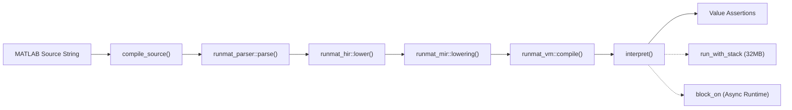
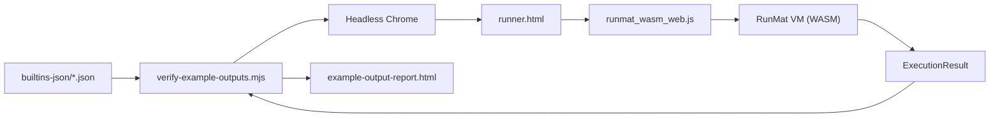

# Testing Strategy & Benchmarks

<details>
<summary>Relevant source files</summary>

- [benchmarks/4k-image-processing/README.md](https://github.com/runmat-org/runmat/blob/82685330/benchmarks/4k-image-processing/README.md?plain=1)
- [benchmarks/elementwise-math/README.md](https://github.com/runmat-org/runmat/blob/82685330/benchmarks/elementwise-math/README.md?plain=1)
- [benchmarks/monte-carlo-analysis/README.md](https://github.com/runmat-org/runmat/blob/82685330/benchmarks/monte-carlo-analysis/README.md?plain=1)
- [crates/runmat-accelerate/tests/fusion_patterns.rs](https://github.com/runmat-org/runmat/blob/82685330/crates/runmat-accelerate/tests/fusion_patterns.rs)
- [crates/runmat-core/tests/engine.rs](https://github.com/runmat-org/runmat/blob/82685330/crates/runmat-core/tests/engine.rs)
- [crates/runmat-core/tests/integration.rs](https://github.com/runmat-org/runmat/blob/82685330/crates/runmat-core/tests/integration.rs)
- [crates/runmat-core/tests/repl.rs](https://github.com/runmat-org/runmat/blob/82685330/crates/runmat-core/tests/repl.rs)
- [crates/runmat-core/tests/semicolon_suppression.rs](https://github.com/runmat-org/runmat/blob/82685330/crates/runmat-core/tests/semicolon_suppression.rs)
- [crates/runmat-core/tests/variable_persistence.rs](https://github.com/runmat-org/runmat/blob/82685330/crates/runmat-core/tests/variable_persistence.rs)
- [crates/runmat-runtime/src/builtins/builtins-json/addpath.json](https://github.com/runmat-org/runmat/blob/82685330/crates/runmat-runtime/src/builtins/builtins-json/addpath.json)
- [crates/runmat-runtime/src/builtins/builtins-json/ceil.json](https://github.com/runmat-org/runmat/blob/82685330/crates/runmat-runtime/src/builtins/builtins-json/ceil.json)
- [crates/runmat-runtime/src/builtins/builtins-json/dir.json](https://github.com/runmat-org/runmat/blob/82685330/crates/runmat-runtime/src/builtins/builtins-json/dir.json)
- [crates/runmat-runtime/src/builtins/builtins-json/getenv.json](https://github.com/runmat-org/runmat/blob/82685330/crates/runmat-runtime/src/builtins/builtins-json/getenv.json)
- [crates/runmat-runtime/src/builtins/builtins-json/path.json](https://github.com/runmat-org/runmat/blob/82685330/crates/runmat-runtime/src/builtins/builtins-json/path.json)
- [crates/runmat-runtime/src/builtins/builtins-json/pwd.json](https://github.com/runmat-org/runmat/blob/82685330/crates/runmat-runtime/src/builtins/builtins-json/pwd.json)
- [crates/runmat-runtime/src/builtins/builtins-json/which.json](https://github.com/runmat-org/runmat/blob/82685330/crates/runmat-runtime/src/builtins/builtins-json/which.json)
- [crates/runmat-turbine/tests/integration.rs](https://github.com/runmat-org/runmat/blob/82685330/crates/runmat-turbine/tests/integration.rs)
- [crates/runmat-turbine/tests/performance.rs](https://github.com/runmat-org/runmat/blob/82685330/crates/runmat-turbine/tests/performance.rs)
- [crates/runmat-vm/tests/basics.rs](https://github.com/runmat-org/runmat/blob/82685330/crates/runmat-vm/tests/basics.rs)
- [crates/runmat-vm/tests/fusion_gpu.rs](https://github.com/runmat-org/runmat/blob/82685330/crates/runmat-vm/tests/fusion_gpu.rs)
- [crates/runmat-vm/tests/loops.rs](https://github.com/runmat-org/runmat/blob/82685330/crates/runmat-vm/tests/loops.rs)
- [crates/runmat-vm/tests/matrix_division.rs](https://github.com/runmat-org/runmat/blob/82685330/crates/runmat-vm/tests/matrix_division.rs)
- [crates/runmat-vm/tests/meshgrid_ranges.rs](https://github.com/runmat-org/runmat/blob/82685330/crates/runmat-vm/tests/meshgrid_ranges.rs)
- [crates/runmat-vm/tests/support/mod.rs](https://github.com/runmat-org/runmat/blob/82685330/crates/runmat-vm/tests/support/mod.rs)
- [crates/runmat-wasm/src/wire/value.rs](https://github.com/runmat-org/runmat/blob/82685330/crates/runmat-wasm/src/wire/value.rs)
- [crates/runmat-wasm/tests/gradient_gpu.rs](https://github.com/runmat-org/runmat/blob/82685330/crates/runmat-wasm/tests/gradient_gpu.rs)
- [crates/runmat-wasm/tests/support/symptom_regressions_shared.rs](https://github.com/runmat-org/runmat/blob/82685330/crates/runmat-wasm/tests/support/symptom_regressions_shared.rs)
- [crates/runmat-wasm/tests/symptom_browser_regressions.rs](https://github.com/runmat-org/runmat/blob/82685330/crates/runmat-wasm/tests/symptom_browser_regressions.rs)
- [crates/runmat-wasm/tests/symptom_node_regressions.rs](https://github.com/runmat-org/runmat/blob/82685330/crates/runmat-wasm/tests/symptom_node_regressions.rs)
- [docs-tmp/SYMPTOM_VALIDATION_CLOSURE.md](https://github.com/runmat-org/runmat/blob/82685330/docs-tmp/SYMPTOM_VALIDATION_CLOSURE.md?plain=1)
- [docs/wasm/TESTING.md](https://github.com/runmat-org/runmat/blob/82685330/docs/wasm/TESTING.md?plain=1)
- [scripts/resolve-chromedriver.sh](https://github.com/runmat-org/runmat/blob/82685330/scripts/resolve-chromedriver.sh)
- [scripts/test-wasm-headless.sh](https://github.com/runmat-org/runmat/blob/82685330/scripts/test-wasm-headless.sh)
- [scripts/test-wasm-regression-suite.sh](https://github.com/runmat-org/runmat/blob/82685330/scripts/test-wasm-regression-suite.sh)
- [scripts/test-wasm-replay-smoke.sh](https://github.com/runmat-org/runmat/blob/82685330/scripts/test-wasm-replay-smoke.sh)
- [scripts/test-wasm-symptom-closure.sh](https://github.com/runmat-org/runmat/blob/82685330/scripts/test-wasm-symptom-closure.sh)
- [scripts/verify-example-outputs.mjs](https://github.com/runmat-org/runmat/blob/82685330/scripts/verify-example-outputs.mjs)

</details>

The RunMat codebase employs a multi-tiered testing strategy designed to ensure correctness across its polyglot execution environment (Native Rust, WebAssembly, and GPU). This includes standard unit and integration tests, cross-language performance benchmarks, and specialized headless browser testing for the WASM target.

## Test Organization

RunMat distributes tests across crates to balance isolation with system-wide verification.

### Unit & Integration Testing

- `runmat-vm`: Contains extensive tests for bytecode generation and interpreter semantics. These tests often use a `test_helpers` module to compile MATLAB source into bytecode and verify the resulting `Value` outputs [crates/runmat-vm/tests/basics.rs #11-14](https://github.com/runmat-org/runmat/blob/82685330/crates/runmat-vm/tests/basics.rs#L11-L14)
- `runmat-core`: Focuses on the `RunMatSession` lifecycle, including JIT vs. Interpreter switching [crates/runmat-core/tests/integration.rs #14-33](https://github.com/runmat-org/runmat/blob/82685330/crates/runmat-core/tests/integration.rs#L14-L33) GC integration [crates/runmat-core/tests/integration.rs #111-133](https://github.com/runmat-org/runmat/blob/82685330/crates/runmat-core/tests/integration.rs#L111-L133) and workspace persistence.
- `runmat-turbine`: Validates the Cranelift JIT compiler, specifically hotspot detection thresholds [crates/runmat-turbine/tests/integration.rs #77-97](https://github.com/runmat-org/runmat/blob/82685330/crates/runmat-turbine/tests/integration.rs#L77-L97) and function caching [crates/runmat-turbine/tests/integration.rs #100-119](https://github.com/runmat-org/runmat/blob/82685330/crates/runmat-turbine/tests/integration.rs#L100-L119)
- `runmat-accelerate`: Tests the fusion engine and GPU residency logic [crates/runmat-vm/tests/fusion_gpu.rs #59-111](https://github.com/runmat-org/runmat/blob/82685330/crates/runmat-vm/tests/fusion_gpu.rs#L59-L111)

### Regression Testing

Regression tests are often categorized as "Symptom Validations" (e.g., RM-369). These tests target specific historical bugs, such as empty concatenation neutral semantics [docs-tmp/SYMPTOM_VALIDATION_CLOSURE.md #37](https://github.com/runmat-org/runmat/blob/82685330/docs-tmp/SYMPTOM_VALIDATION_CLOSURE.md?plain=1#L37-L37) or implicit indexed array creation [docs-tmp/SYMPTOM_VALIDATION_CLOSURE.md #53](https://github.com/runmat-org/runmat/blob/82685330/docs-tmp/SYMPTOM_VALIDATION_CLOSURE.md?plain=1#L53-L53)

### VM Testing Infrastructure

The `runmat-vm` crate utilizes a specialized test runner that spawns threads with a large stack (32MB) to prevent overflows during deep recursive compilation or interpretation [crates/runmat-vm/tests/support/mod.rs #8-23](https://github.com/runmat-org/runmat/blob/82685330/crates/runmat-vm/tests/support/mod.rs#L8-L23)

VM Test Flow



<details>
<summary>Rendered SVG</summary>

```svg
<svg id="mermaid-dondbrqljx6" xmlns="http://www.w3.org/2000/svg" xmlns:xlink="http://www.w3.org/1999/xlink" class="flowchart" style="max-width: 100%; touch-action: none; user-select: none; cursor: grab; min-height: fit-content; max-height: 100%;" viewBox="-0.003040910513163908 0 932.3654568210263 873" role="graphics-document document" aria-roledescription="flowchart-v2" preserveAspectRatio="xMidYMid meet"><style>#mermaid-dondbrqljx6{font-family:ui-sans-serif,-apple-system,system-ui,Segoe UI,Helvetica;font-size:16px;fill:#ccc;}@keyframes edge-animation-frame{from{stroke-dashoffset:0;}}@keyframes dash{to{stroke-dashoffset:0;}}#mermaid-dondbrqljx6 .edge-animation-slow{stroke-dasharray:9,5!important;stroke-dashoffset:900;animation:dash 50s linear infinite;stroke-linecap:round;}#mermaid-dondbrqljx6 .edge-animation-fast{stroke-dasharray:9,5!important;stroke-dashoffset:900;animation:dash 20s linear infinite;stroke-linecap:round;}#mermaid-dondbrqljx6 .error-icon{fill:#333;}#mermaid-dondbrqljx6 .error-text{fill:#cccccc;stroke:#cccccc;}#mermaid-dondbrqljx6 .edge-thickness-normal{stroke-width:1px;}#mermaid-dondbrqljx6 .edge-thickness-thick{stroke-width:3.5px;}#mermaid-dondbrqljx6 .edge-pattern-solid{stroke-dasharray:0;}#mermaid-dondbrqljx6 .edge-thickness-invisible{stroke-width:0;fill:none;}#mermaid-dondbrqljx6 .edge-pattern-dashed{stroke-dasharray:3;}#mermaid-dondbrqljx6 .edge-pattern-dotted{stroke-dasharray:2;}#mermaid-dondbrqljx6 .marker{fill:#666;stroke:#666;}#mermaid-dondbrqljx6 .marker.cross{stroke:#666;}#mermaid-dondbrqljx6 svg{font-family:ui-sans-serif,-apple-system,system-ui,Segoe UI,Helvetica;font-size:16px;}#mermaid-dondbrqljx6 p{margin:0;}#mermaid-dondbrqljx6 .label{font-family:ui-sans-serif,-apple-system,system-ui,Segoe UI,Helvetica;color:#fff;}#mermaid-dondbrqljx6 .cluster-label text{fill:#fff;}#mermaid-dondbrqljx6 .cluster-label span{color:#fff;}#mermaid-dondbrqljx6 .cluster-label span p{background-color:transparent;}#mermaid-dondbrqljx6 .label text,#mermaid-dondbrqljx6 span{fill:#fff;color:#fff;}#mermaid-dondbrqljx6 .node rect,#mermaid-dondbrqljx6 .node circle,#mermaid-dondbrqljx6 .node ellipse,#mermaid-dondbrqljx6 .node polygon,#mermaid-dondbrqljx6 .node path{fill:#111;stroke:#222;stroke-width:1px;}#mermaid-dondbrqljx6 .rough-node .label text,#mermaid-dondbrqljx6 .node .label text,#mermaid-dondbrqljx6 .image-shape .label,#mermaid-dondbrqljx6 .icon-shape .label{text-anchor:middle;}#mermaid-dondbrqljx6 .node .katex path{fill:#000;stroke:#000;stroke-width:1px;}#mermaid-dondbrqljx6 .rough-node .label,#mermaid-dondbrqljx6 .node .label,#mermaid-dondbrqljx6 .image-shape .label,#mermaid-dondbrqljx6 .icon-shape .label{text-align:center;}#mermaid-dondbrqljx6 .node.clickable{cursor:pointer;}#mermaid-dondbrqljx6 .root .anchor path{fill:#666!important;stroke-width:0;stroke:#666;}#mermaid-dondbrqljx6 .arrowheadPath{fill:#0b0b0b;}#mermaid-dondbrqljx6 .edgePath .path{stroke:#666;stroke-width:1px;}#mermaid-dondbrqljx6 .flowchart-link{stroke:#666;fill:none;}#mermaid-dondbrqljx6 .edgeLabel{background-color:#161616;text-align:center;}#mermaid-dondbrqljx6 .edgeLabel p{background-color:#161616;}#mermaid-dondbrqljx6 .edgeLabel rect{opacity:0.5;background-color:#161616;fill:#161616;}#mermaid-dondbrqljx6 .labelBkg{background-color:rgba(22, 22, 22, 0.5);}#mermaid-dondbrqljx6 .cluster rect{fill:#161616;stroke:#222;stroke-width:1px;}#mermaid-dondbrqljx6 .cluster text{fill:#fff;}#mermaid-dondbrqljx6 .cluster span{color:#fff;}#mermaid-dondbrqljx6 div.mermaidTooltip{position:absolute;text-align:center;max-width:200px;padding:2px;font-family:ui-sans-serif,-apple-system,system-ui,Segoe UI,Helvetica;font-size:12px;background:#333;border:1px solid hsl(0, 0%, 10%);border-radius:2px;pointer-events:none;z-index:100;}#mermaid-dondbrqljx6 .flowchartTitleText{text-anchor:middle;font-size:18px;fill:#ccc;}#mermaid-dondbrqljx6 rect.text{fill:none;stroke-width:0;}#mermaid-dondbrqljx6 .icon-shape,#mermaid-dondbrqljx6 .image-shape{background-color:#161616;text-align:center;}#mermaid-dondbrqljx6 .icon-shape p,#mermaid-dondbrqljx6 .image-shape p{background-color:#161616;padding:2px;}#mermaid-dondbrqljx6 .icon-shape .label rect,#mermaid-dondbrqljx6 .image-shape .label rect{opacity:0.5;background-color:#161616;fill:#161616;}#mermaid-dondbrqljx6 .label-icon{display:inline-block;height:1em;overflow:visible;vertical-align:-0.125em;}#mermaid-dondbrqljx6 .node .label-icon path{fill:currentColor;stroke:revert;stroke-width:revert;}#mermaid-dondbrqljx6 .node .neo-node{stroke:#222;}#mermaid-dondbrqljx6 [data-look="neo"].node rect,#mermaid-dondbrqljx6 [data-look="neo"].cluster rect,#mermaid-dondbrqljx6 [data-look="neo"].node polygon{stroke:url(#mermaid-dondbrqljx6-gradient);filter:drop-shadow( 1px 2px 2px rgba(185,185,185,1));}#mermaid-dondbrqljx6 [data-look="neo"].node path{stroke:url(#mermaid-dondbrqljx6-gradient);stroke-width:1px;}#mermaid-dondbrqljx6 [data-look="neo"].node .outer-path{filter:drop-shadow( 1px 2px 2px rgba(185,185,185,1));}#mermaid-dondbrqljx6 [data-look="neo"].node .neo-line path{stroke:#222;filter:none;}#mermaid-dondbrqljx6 [data-look="neo"].node circle{stroke:url(#mermaid-dondbrqljx6-gradient);filter:drop-shadow( 1px 2px 2px rgba(185,185,185,1));}#mermaid-dondbrqljx6 [data-look="neo"].node circle .state-start{fill:#000000;}#mermaid-dondbrqljx6 [data-look="neo"].icon-shape .icon{fill:url(#mermaid-dondbrqljx6-gradient);filter:drop-shadow( 1px 2px 2px rgba(185,185,185,1));}#mermaid-dondbrqljx6 [data-look="neo"].icon-shape .icon-neo path{stroke:url(#mermaid-dondbrqljx6-gradient);filter:drop-shadow( 1px 2px 2px rgba(185,185,185,1));}#mermaid-dondbrqljx6 :root{--mermaid-font-family:"trebuchet ms",verdana,arial,sans-serif;}</style><g><marker id="mermaid-dondbrqljx6_flowchart-v2-pointEnd" class="marker flowchart-v2" viewBox="0 0 10 10" refX="5" refY="5" markerUnits="userSpaceOnUse" markerWidth="8" markerHeight="8" orient="auto"><path d="M 0 0 L 10 5 L 0 10 z" class="arrowMarkerPath" style="stroke-width: 1; stroke-dasharray: 1, 0;"></path></marker><marker id="mermaid-dondbrqljx6_flowchart-v2-pointStart" class="marker flowchart-v2" viewBox="0 0 10 10" refX="4.5" refY="5" markerUnits="userSpaceOnUse" markerWidth="8" markerHeight="8" orient="auto"><path d="M 0 5 L 10 10 L 10 0 z" class="arrowMarkerPath" style="stroke-width: 1; stroke-dasharray: 1, 0;"></path></marker><marker id="mermaid-dondbrqljx6_flowchart-v2-pointEnd-margin" class="marker flowchart-v2" viewBox="0 0 11.5 14" refX="11.5" refY="7" markerUnits="userSpaceOnUse" markerWidth="10.5" markerHeight="14" orient="auto"><path d="M 0 0 L 11.5 7 L 0 14 z" class="arrowMarkerPath" style="stroke-width: 0; stroke-dasharray: 1, 0;"></path></marker><marker id="mermaid-dondbrqljx6_flowchart-v2-pointStart-margin" class="marker flowchart-v2" viewBox="0 0 11.5 14" refX="1" refY="7" markerUnits="userSpaceOnUse" markerWidth="11.5" markerHeight="14" orient="auto"><polygon points="0,7 11.5,14 11.5,0" class="arrowMarkerPath" style="stroke-width: 0; stroke-dasharray: 1, 0;"></polygon></marker><marker id="mermaid-dondbrqljx6_flowchart-v2-circleEnd" class="marker flowchart-v2" viewBox="0 0 10 10" refX="11" refY="5" markerUnits="userSpaceOnUse" markerWidth="11" markerHeight="11" orient="auto"><circle cx="5" cy="5" r="5" class="arrowMarkerPath" style="stroke-width: 1; stroke-dasharray: 1, 0;"></circle></marker><marker id="mermaid-dondbrqljx6_flowchart-v2-circleStart" class="marker flowchart-v2" viewBox="0 0 10 10" refX="-1" refY="5" markerUnits="userSpaceOnUse" markerWidth="11" markerHeight="11" orient="auto"><circle cx="5" cy="5" r="5" class="arrowMarkerPath" style="stroke-width: 1; stroke-dasharray: 1, 0;"></circle></marker><marker id="mermaid-dondbrqljx6_flowchart-v2-circleEnd-margin" class="marker flowchart-v2" viewBox="0 0 10 10" refY="5" refX="12.25" markerUnits="userSpaceOnUse" markerWidth="14" markerHeight="14" orient="auto"><circle cx="5" cy="5" r="5" class="arrowMarkerPath" style="stroke-width: 0; stroke-dasharray: 1, 0;"></circle></marker><marker id="mermaid-dondbrqljx6_flowchart-v2-circleStart-margin" class="marker flowchart-v2" viewBox="0 0 10 10" refX="-2" refY="5" markerUnits="userSpaceOnUse" markerWidth="14" markerHeight="14" orient="auto"><circle cx="5" cy="5" r="5" class="arrowMarkerPath" style="stroke-width: 0; stroke-dasharray: 1, 0;"></circle></marker><marker id="mermaid-dondbrqljx6_flowchart-v2-crossEnd" class="marker cross flowchart-v2" viewBox="0 0 11 11" refX="12" refY="5.2" markerUnits="userSpaceOnUse" markerWidth="11" markerHeight="11" orient="auto"><path d="M 1,1 l 9,9 M 10,1 l -9,9" class="arrowMarkerPath" style="stroke-width: 2; stroke-dasharray: 1, 0;"></path></marker><marker id="mermaid-dondbrqljx6_flowchart-v2-crossStart" class="marker cross flowchart-v2" viewBox="0 0 11 11" refX="-1" refY="5.2" markerUnits="userSpaceOnUse" markerWidth="11" markerHeight="11" orient="auto"><path d="M 1,1 l 9,9 M 10,1 l -9,9" class="arrowMarkerPath" style="stroke-width: 2; stroke-dasharray: 1, 0;"></path></marker><marker id="mermaid-dondbrqljx6_flowchart-v2-crossEnd-margin" class="marker cross flowchart-v2" viewBox="0 0 15 15" refX="17.7" refY="7.5" markerUnits="userSpaceOnUse" markerWidth="12" markerHeight="12" orient="auto"><path d="M 1,1 L 14,14 M 1,14 L 14,1" class="arrowMarkerPath" style="stroke-width: 2.5;"></path></marker><marker id="mermaid-dondbrqljx6_flowchart-v2-crossStart-margin" class="marker cross flowchart-v2" viewBox="0 0 15 15" refX="-3.5" refY="7.5" markerUnits="userSpaceOnUse" markerWidth="12" markerHeight="12" orient="auto"><path d="M 1,1 L 14,14 M 1,14 L 14,1" class="arrowMarkerPath" style="stroke-width: 2.5; stroke-dasharray: 1, 0;"></path></marker><g class="root"><g class="clusters"><g class="cluster" id="mermaid-dondbrqljx6-Environment" data-look="classic"><rect style="" x="325.859375" y="761" width="598.5" height="104"></rect><g class="cluster-label" transform="translate(579.8046875, 761)"><foreignObject width="90.609375" height="24"><div style="display: table-cell; white-space: nowrap; line-height: 1.5;" xmlns="http://www.w3.org/1999/xhtml"><span class="nodeLabel"><p>Environment</p></span></div></foreignObject></g></g><g class="cluster" id="mermaid-dondbrqljx6-subGraph0" data-look="classic"><rect style="" x="8" y="8" width="297.859375" height="857"></rect><g class="cluster-label" transform="translate(104.1953125, 8)"><foreignObject width="105.46875" height="24"><div style="display: table-cell; white-space: nowrap; line-height: 1.5;" xmlns="http://www.w3.org/1999/xhtml"><span class="nodeLabel"><p>Test Execution</p></span></div></foreignObject></g></g></g><g class="edgePaths"><path d="M156.93,87L156.93,91.167C156.93,95.333,156.93,103.667,156.93,111.333C156.93,119,156.93,126,156.93,129.5L156.93,133" id="mermaid-dondbrqljx6-L_A_B_0" class="edge-thickness-normal edge-pattern-solid edge-thickness-normal edge-pattern-solid flowchart-link" style=";" data-edge="true" data-et="edge" data-id="L_A_B_0" data-points="W3sieCI6MTU2LjkyOTY4NzUsInkiOjg3fSx7IngiOjE1Ni45Mjk2ODc1LCJ5IjoxMTJ9LHsieCI6MTU2LjkyOTY4NzUsInkiOjEzN31d" data-look="classic" marker-end="url(#mermaid-dondbrqljx6_flowchart-v2-pointEnd)"></path><path d="M156.93,191L156.93,195.167C156.93,199.333,156.93,207.667,156.93,215.333C156.93,223,156.93,230,156.93,233.5L156.93,237" id="mermaid-dondbrqljx6-L_B_C_0" class="edge-thickness-normal edge-pattern-solid edge-thickness-normal edge-pattern-solid flowchart-link" style=";" data-edge="true" data-et="edge" data-id="L_B_C_0" data-points="W3sieCI6MTU2LjkyOTY4NzUsInkiOjE5MX0seyJ4IjoxNTYuOTI5Njg3NSwieSI6MjE2fSx7IngiOjE1Ni45Mjk2ODc1LCJ5IjoyNDF9XQ==" data-look="classic" marker-end="url(#mermaid-dondbrqljx6_flowchart-v2-pointEnd)"></path><path d="M156.93,295L156.93,299.167C156.93,303.333,156.93,311.667,156.93,319.333C156.93,327,156.93,334,156.93,337.5L156.93,341" id="mermaid-dondbrqljx6-L_C_D_0" class="edge-thickness-normal edge-pattern-solid edge-thickness-normal edge-pattern-solid flowchart-link" style=";" data-edge="true" data-et="edge" data-id="L_C_D_0" data-points="W3sieCI6MTU2LjkyOTY4NzUsInkiOjI5NX0seyJ4IjoxNTYuOTI5Njg3NSwieSI6MzIwfSx7IngiOjE1Ni45Mjk2ODc1LCJ5IjozNDV9XQ==" data-look="classic" marker-end="url(#mermaid-dondbrqljx6_flowchart-v2-pointEnd)"></path><path d="M156.93,399L156.93,403.167C156.93,407.333,156.93,415.667,156.93,423.333C156.93,431,156.93,438,156.93,441.5L156.93,445" id="mermaid-dondbrqljx6-L_D_E_0" class="edge-thickness-normal edge-pattern-solid edge-thickness-normal edge-pattern-solid flowchart-link" style=";" data-edge="true" data-et="edge" data-id="L_D_E_0" data-points="W3sieCI6MTU2LjkyOTY4NzUsInkiOjM5OX0seyJ4IjoxNTYuOTI5Njg3NSwieSI6NDI0fSx7IngiOjE1Ni45Mjk2ODc1LCJ5Ijo0NDl9XQ==" data-look="classic" marker-end="url(#mermaid-dondbrqljx6_flowchart-v2-pointEnd)"></path><path d="M156.93,503L156.93,507.167C156.93,511.333,156.93,519.667,156.93,527.333C156.93,535,156.93,542,156.93,545.5L156.93,549" id="mermaid-dondbrqljx6-L_E_F_0" class="edge-thickness-normal edge-pattern-solid edge-thickness-normal edge-pattern-solid flowchart-link" style=";" data-edge="true" data-et="edge" data-id="L_E_F_0" data-points="W3sieCI6MTU2LjkyOTY4NzUsInkiOjUwM30seyJ4IjoxNTYuOTI5Njg3NSwieSI6NTI4fSx7IngiOjE1Ni45Mjk2ODc1LCJ5Ijo1NTN9XQ==" data-look="classic" marker-end="url(#mermaid-dondbrqljx6_flowchart-v2-pointEnd)"></path><path d="M156.93,607L156.93,611.167C156.93,615.333,156.93,623.667,156.93,631.333C156.93,639,156.93,646,156.93,649.5L156.93,653" id="mermaid-dondbrqljx6-L_F_G_0" class="edge-thickness-normal edge-pattern-solid edge-thickness-normal edge-pattern-solid flowchart-link" style=";" data-edge="true" data-et="edge" data-id="L_F_G_0" data-points="W3sieCI6MTU2LjkyOTY4NzUsInkiOjYwN30seyJ4IjoxNTYuOTI5Njg3NSwieSI6NjMyfSx7IngiOjE1Ni45Mjk2ODc1LCJ5Ijo2NTd9XQ==" data-look="classic" marker-end="url(#mermaid-dondbrqljx6_flowchart-v2-pointEnd)"></path><path d="M145.576,711L143.823,715.167C142.071,719.333,138.567,727.667,136.815,736C135.063,744.333,135.063,752.667,135.063,760.333C135.063,768,135.063,775,135.063,778.5L135.063,782" id="mermaid-dondbrqljx6-L_G_H_0" class="edge-thickness-normal edge-pattern-solid edge-thickness-normal edge-pattern-solid flowchart-link" style=";" data-edge="true" data-et="edge" data-id="L_G_H_0" data-points="W3sieCI6MTQ1LjU3NTU3MDkxMzQ2MTU1LCJ5Ijo3MTF9LHsieCI6MTM1LjA2MjUsInkiOjczNn0seyJ4IjoxMzUuMDYyNSwieSI6NzYxfSx7IngiOjEzNS4wNjI1LCJ5Ijo3ODZ9XQ==" data-look="classic" marker-end="url(#mermaid-dondbrqljx6_flowchart-v2-pointEnd)"></path><path d="M156.93,711L156.93,715.167C156.93,719.333,156.93,727.667,156.93,736C156.93,744.333,156.93,752.667,190.26,762.281C223.59,771.895,290.251,782.79,323.581,788.238L356.912,793.685" id="mermaid-dondbrqljx6-L_G_I_0" class="edge-thickness-normal edge-pattern-dotted edge-thickness-normal edge-pattern-solid flowchart-link" style=";" data-edge="true" data-et="edge" data-id="L_G_I_0" data-points="W3sieCI6MTU2LjkyOTY4NzUsInkiOjcxMX0seyJ4IjoxNTYuOTI5Njg3NSwieSI6NzM2fSx7IngiOjE1Ni45Mjk2ODc1LCJ5Ijo3NjF9LHsieCI6MzYwLjg1OTM3NSwieSI6Nzk0LjMzMDYxNTg1MzA1OTZ9XQ==" data-look="classic" marker-end="url(#mermaid-dondbrqljx6_flowchart-v2-pointEnd)"></path><path d="M195.594,711L201.561,715.167C207.528,719.333,219.461,727.667,225.428,736C231.395,744.333,231.395,752.667,298.717,763.402C366.04,774.138,500.686,787.275,568.009,793.844L635.331,800.413" id="mermaid-dondbrqljx6-L_G_J_0" class="edge-thickness-normal edge-pattern-dotted edge-thickness-normal edge-pattern-solid flowchart-link" style=";" data-edge="true" data-et="edge" data-id="L_G_J_0" data-points="W3sieCI6MTk1LjU5NDEyNTYwMDk2MTU1LCJ5Ijo3MTF9LHsieCI6MjMxLjM5NDUzMTI1LCJ5Ijo3MzZ9LHsieCI6MjMxLjM5NDUzMTI1LCJ5Ijo3NjF9LHsieCI6NjM5LjMxMjUsInkiOjgwMC44MDEyNTA0MzA2MTQzfV0=" data-look="classic" marker-end="url(#mermaid-dondbrqljx6_flowchart-v2-pointEnd)"></path></g><g class="edgeLabels"><g class="edgeLabel"><g class="label" data-id="L_A_B_0" transform="translate(0, 0)"><foreignObject width="0" height="0"><div style="display: table-cell; white-space: nowrap; line-height: 1.5; max-width: 200px; text-align: center;" xmlns="http://www.w3.org/1999/xhtml" class="labelBkg"><span class="edgeLabel"></span></div></foreignObject></g></g><g class="edgeLabel"><g class="label" data-id="L_B_C_0" transform="translate(0, 0)"><foreignObject width="0" height="0"><div style="display: table-cell; white-space: nowrap; line-height: 1.5; max-width: 200px; text-align: center;" xmlns="http://www.w3.org/1999/xhtml" class="labelBkg"><span class="edgeLabel"></span></div></foreignObject></g></g><g class="edgeLabel"><g class="label" data-id="L_C_D_0" transform="translate(0, 0)"><foreignObject width="0" height="0"><div style="display: table-cell; white-space: nowrap; line-height: 1.5; max-width: 200px; text-align: center;" xmlns="http://www.w3.org/1999/xhtml" class="labelBkg"><span class="edgeLabel"></span></div></foreignObject></g></g><g class="edgeLabel"><g class="label" data-id="L_D_E_0" transform="translate(0, 0)"><foreignObject width="0" height="0"><div style="display: table-cell; white-space: nowrap; line-height: 1.5; max-width: 200px; text-align: center;" xmlns="http://www.w3.org/1999/xhtml" class="labelBkg"><span class="edgeLabel"></span></div></foreignObject></g></g><g class="edgeLabel"><g class="label" data-id="L_E_F_0" transform="translate(0, 0)"><foreignObject width="0" height="0"><div style="display: table-cell; white-space: nowrap; line-height: 1.5; max-width: 200px; text-align: center;" xmlns="http://www.w3.org/1999/xhtml" class="labelBkg"><span class="edgeLabel"></span></div></foreignObject></g></g><g class="edgeLabel"><g class="label" data-id="L_F_G_0" transform="translate(0, 0)"><foreignObject width="0" height="0"><div style="display: table-cell; white-space: nowrap; line-height: 1.5; max-width: 200px; text-align: center;" xmlns="http://www.w3.org/1999/xhtml" class="labelBkg"><span class="edgeLabel"></span></div></foreignObject></g></g><g class="edgeLabel"><g class="label" data-id="L_G_H_0" transform="translate(0, 0)"><foreignObject width="0" height="0"><div style="display: table-cell; white-space: nowrap; line-height: 1.5; max-width: 200px; text-align: center;" xmlns="http://www.w3.org/1999/xhtml" class="labelBkg"><span class="edgeLabel"></span></div></foreignObject></g></g><g class="edgeLabel"><g class="label" data-id="L_G_I_0" transform="translate(0, 0)"><foreignObject width="0" height="0"><div style="display: table-cell; white-space: nowrap; line-height: 1.5; max-width: 200px; text-align: center;" xmlns="http://www.w3.org/1999/xhtml" class="labelBkg"><span class="edgeLabel"></span></div></foreignObject></g></g><g class="edgeLabel"><g class="label" data-id="L_G_J_0" transform="translate(0, 0)"><foreignObject width="0" height="0"><div style="display: table-cell; white-space: nowrap; line-height: 1.5; max-width: 200px; text-align: center;" xmlns="http://www.w3.org/1999/xhtml" class="labelBkg"><span class="edgeLabel"></span></div></foreignObject></g></g></g><g class="nodes"><g class="node default" id="mermaid-dondbrqljx6-flowchart-A-0" data-look="classic" transform="translate(156.9296875, 60)"><rect class="basic label-container" style="" x="-112.3984375" y="-27" width="224.796875" height="54"></rect><g class="label" style="" transform="translate(-82.3984375, -12)"><rect></rect><foreignObject width="164.796875" height="24"><div style="display: table-cell; white-space: nowrap; line-height: 1.5; max-width: 200px; text-align: center;" xmlns="http://www.w3.org/1999/xhtml"><span class="nodeLabel"><p>MATLAB Source String</p></span></div></foreignObject></g></g><g class="node default" id="mermaid-dondbrqljx6-flowchart-B-1" data-look="classic" transform="translate(156.9296875, 164)"><rect class="basic label-container" style="" x="-93.21875" y="-27" width="186.4375" height="54"></rect><g class="label" style="" transform="translate(-63.21875, -12)"><rect></rect><foreignObject width="126.4375" height="24"><div style="display: table-cell; white-space: nowrap; line-height: 1.5; max-width: 200px; text-align: center;" xmlns="http://www.w3.org/1999/xhtml"><span class="nodeLabel"><p>compile_source()</p></span></div></foreignObject></g></g><g class="node default" id="mermaid-dondbrqljx6-flowchart-C-3" data-look="classic" transform="translate(156.9296875, 268)"><rect class="basic label-container" style="" x="-113.9296875" y="-27" width="227.859375" height="54"></rect><g class="label" style="" transform="translate(-83.9296875, -12)"><rect></rect><foreignObject width="167.859375" height="24"><div style="display: table-cell; white-space: nowrap; line-height: 1.5; max-width: 200px; text-align: center;" xmlns="http://www.w3.org/1999/xhtml"><span class="nodeLabel"><p>runmat_parser::parse()</p></span></div></foreignObject></g></g><g class="node default" id="mermaid-dondbrqljx6-flowchart-D-5" data-look="classic" transform="translate(156.9296875, 372)"><rect class="basic label-container" style="" x="-99.203125" y="-27" width="198.40625" height="54"></rect><g class="label" style="" transform="translate(-69.203125, -12)"><rect></rect><foreignObject width="138.40625" height="24"><div style="display: table-cell; white-space: nowrap; line-height: 1.5; max-width: 200px; text-align: center;" xmlns="http://www.w3.org/1999/xhtml"><span class="nodeLabel"><p>runmat_hir::lower()</p></span></div></foreignObject></g></g><g class="node default" id="mermaid-dondbrqljx6-flowchart-E-7" data-look="classic" transform="translate(156.9296875, 476)"><rect class="basic label-container" style="" x="-112.5078125" y="-27" width="225.015625" height="54"></rect><g class="label" style="" transform="translate(-82.5078125, -12)"><rect></rect><foreignObject width="165.015625" height="24"><div style="display: table-cell; white-space: nowrap; line-height: 1.5; max-width: 200px; text-align: center;" xmlns="http://www.w3.org/1999/xhtml"><span class="nodeLabel"><p>runmat_mir::lowering()</p></span></div></foreignObject></g></g><g class="node default" id="mermaid-dondbrqljx6-flowchart-F-9" data-look="classic" transform="translate(156.9296875, 580)"><rect class="basic label-container" style="" x="-110.0234375" y="-27" width="220.046875" height="54"></rect><g class="label" style="" transform="translate(-80.0234375, -12)"><rect></rect><foreignObject width="160.046875" height="24"><div style="display: table-cell; white-space: nowrap; line-height: 1.5; max-width: 200px; text-align: center;" xmlns="http://www.w3.org/1999/xhtml"><span class="nodeLabel"><p>runmat_vm::compile()</p></span></div></foreignObject></g></g><g class="node default" id="mermaid-dondbrqljx6-flowchart-G-11" data-look="classic" transform="translate(156.9296875, 684)"><rect class="basic label-container" style="" x="-66.8671875" y="-27" width="133.734375" height="54"></rect><g class="label" style="" transform="translate(-36.8671875, -12)"><rect></rect><foreignObject width="73.734375" height="24"><div style="display: table-cell; white-space: nowrap; line-height: 1.5; max-width: 200px; text-align: center;" xmlns="http://www.w3.org/1999/xhtml"><span class="nodeLabel"><p>interpret()</p></span></div></foreignObject></g></g><g class="node default" id="mermaid-dondbrqljx6-flowchart-H-13" data-look="classic" transform="translate(135.0625, 813)"><rect class="basic label-container" style="" x="-90.1953125" y="-27" width="180.390625" height="54"></rect><g class="label" style="" transform="translate(-60.1953125, -12)"><rect></rect><foreignObject width="120.390625" height="24"><div style="display: table-cell; white-space: nowrap; line-height: 1.5; max-width: 200px; text-align: center;" xmlns="http://www.w3.org/1999/xhtml"><span class="nodeLabel"><p>Value Assertions</p></span></div></foreignObject></g></g><g class="node default" id="mermaid-dondbrqljx6-flowchart-I-15" data-look="classic" transform="translate(475.0859375, 813)"><rect class="basic label-container" style="" x="-114.2265625" y="-27" width="228.453125" height="54"></rect><g class="label" style="" transform="translate(-84.2265625, -12)"><rect></rect><foreignObject width="168.453125" height="24"><div style="display: table-cell; white-space: nowrap; line-height: 1.5; max-width: 200px; text-align: center;" xmlns="http://www.w3.org/1999/xhtml"><span class="nodeLabel"><p>run_with_stack (32MB)</p></span></div></foreignObject></g></g><g class="node default" id="mermaid-dondbrqljx6-flowchart-J-17" data-look="classic" transform="translate(764.3359375, 813)"><rect class="basic label-container" style="" x="-125.0234375" y="-27" width="250.046875" height="54"></rect><g class="label" style="" transform="translate(-95.0234375, -12)"><rect></rect><foreignObject width="190.046875" height="24"><div style="display: table-cell; white-space: nowrap; line-height: 1.5; max-width: 200px; text-align: center;" xmlns="http://www.w3.org/1999/xhtml"><span class="nodeLabel"><p>block_on (Async Runtime)</p></span></div></foreignObject></g></g></g></g></g><defs><filter id="mermaid-dondbrqljx6-drop-shadow" height="130%" width="130%"><feDropShadow dx="4" dy="4" stdDeviation="0" flood-opacity="0.06" flood-color="#000000"></feDropShadow></filter></defs><defs><filter id="mermaid-dondbrqljx6-drop-shadow-small" height="150%" width="150%"><feDropShadow dx="2" dy="2" stdDeviation="0" flood-opacity="0.06" flood-color="#000000"></feDropShadow></filter></defs><linearGradient id="mermaid-dondbrqljx6-gradient" gradientUnits="objectBoundingBox" x1="0%" y1="0%" x2="100%" y2="0%"><stop offset="0%" stop-color="#333" stop-opacity="1"></stop><stop offset="100%" stop-color="hsl(-120, 0%, 3.3333333333%)" stop-opacity="1"></stop></linearGradient></svg>
```

</details>

Sources: `<FileRef file-url="https://github.com/runmat-org/runmat/blob/82685330/crates/runmat-vm/tests/support/mod.rs#L25-L45" min=25 max=45 file-path="crates/runmat-vm/tests/support/mod.rs">Hii</FileRef>`, `<FileRef file-url="https://github.com/runmat-org/runmat/blob/82685330/crates/runmat-vm/tests/basics.rs#L11-L24" min=11 max=24 file-path="crates/runmat-vm/tests/basics.rs">Hii</FileRef>`

---

## Benchmark Harness

RunMat includes a benchmark suite located in the `benchmarks/` directory, comparing its performance against NumPy, PyTorch, and Julia.

### Key Benchmarks

- Monte Carlo GBM: Simulates millions of paths for risk analysis. RunMat achieves up to 131x speedup over NumPy by keeping tensors resident on the GPU and fusing the elementwise update steps [benchmarks/monte-carlo-analysis/README.md #28-39](https://github.com/runmat-org/runmat/blob/82685330/benchmarks/monte-carlo-analysis/README.md?plain=1#L28-L39)
- Elementwise Math: Exercises long chains of trigonometric and exponential operations. This benchmark highlights the efficiency of the `fusion-engine` in reducing memory bandwidth overhead [benchmarks/elementwise-math/README.md #25-36](https://github.com/runmat-org/runmat/blob/82685330/benchmarks/elementwise-math/README.md?plain=1#L25-L36)

### Comparison Methodology

Benchmarks are typically implemented in MATLAB syntax for RunMat and equivalent idiomatic Python/Julia for comparison. Performance is measured across a "sweep" of data sizes (e.g., 1M to 1B elements) [benchmarks/elementwise-math/README.md #25-35](https://github.com/runmat-org/runmat/blob/82685330/benchmarks/elementwise-math/README.md?plain=1#L25-L35)

Sources: `<FileRef file-url="https://github.com/runmat-org/runmat/blob/82685330/benchmarks/monte-carlo-analysis/README.md?plain=1#L1-L24" min=1 max=24 file-path="benchmarks/monte-carlo-analysis/README.md">Hii</FileRef>`, `<FileRef file-url="https://github.com/runmat-org/runmat/blob/82685330/benchmarks/elementwise-math/README.md?plain=1#L1-L16" min=1 max=16 file-path="benchmarks/elementwise-math/README.md">Hii</FileRef>`

---

## WebAssembly & Headless Testing

Testing the WASM build requires bridging the Rust environment with a JavaScript/Browser environment.

### Headless Chrome Testing

The `scripts/verify-example-outputs.mjs` script automates the verification of built-in function examples. It uses a headless Chrome instance (via `chrome-headless.sh`) to execute WASM-compiled RunMat and capture outputs [scripts/verify-example-outputs.mjs #79-85](https://github.com/runmat-org/runmat/blob/82685330/scripts/verify-example-outputs.mjs#L79-L85)

Headless Verification Pipeline



<details>
<summary>Rendered SVG</summary>

```svg
<svg id="mermaid-wj3vnpmhol" xmlns="http://www.w3.org/2000/svg" xmlns:xlink="http://www.w3.org/1999/xlink" class="flowchart" style="max-width: 100%; touch-action: none; user-select: none; cursor: grab; min-height: fit-content; max-height: 100%;" viewBox="-0.07394539771780728 0 2247.6791407954356 327" role="graphics-document document" aria-roledescription="flowchart-v2" preserveAspectRatio="xMidYMid meet"><style>#mermaid-wj3vnpmhol{font-family:ui-sans-serif,-apple-system,system-ui,Segoe UI,Helvetica;font-size:16px;fill:#ccc;}@keyframes edge-animation-frame{from{stroke-dashoffset:0;}}@keyframes dash{to{stroke-dashoffset:0;}}#mermaid-wj3vnpmhol .edge-animation-slow{stroke-dasharray:9,5!important;stroke-dashoffset:900;animation:dash 50s linear infinite;stroke-linecap:round;}#mermaid-wj3vnpmhol .edge-animation-fast{stroke-dasharray:9,5!important;stroke-dashoffset:900;animation:dash 20s linear infinite;stroke-linecap:round;}#mermaid-wj3vnpmhol .error-icon{fill:#333;}#mermaid-wj3vnpmhol .error-text{fill:#cccccc;stroke:#cccccc;}#mermaid-wj3vnpmhol .edge-thickness-normal{stroke-width:1px;}#mermaid-wj3vnpmhol .edge-thickness-thick{stroke-width:3.5px;}#mermaid-wj3vnpmhol .edge-pattern-solid{stroke-dasharray:0;}#mermaid-wj3vnpmhol .edge-thickness-invisible{stroke-width:0;fill:none;}#mermaid-wj3vnpmhol .edge-pattern-dashed{stroke-dasharray:3;}#mermaid-wj3vnpmhol .edge-pattern-dotted{stroke-dasharray:2;}#mermaid-wj3vnpmhol .marker{fill:#666;stroke:#666;}#mermaid-wj3vnpmhol .marker.cross{stroke:#666;}#mermaid-wj3vnpmhol svg{font-family:ui-sans-serif,-apple-system,system-ui,Segoe UI,Helvetica;font-size:16px;}#mermaid-wj3vnpmhol p{margin:0;}#mermaid-wj3vnpmhol .label{font-family:ui-sans-serif,-apple-system,system-ui,Segoe UI,Helvetica;color:#fff;}#mermaid-wj3vnpmhol .cluster-label text{fill:#fff;}#mermaid-wj3vnpmhol .cluster-label span{color:#fff;}#mermaid-wj3vnpmhol .cluster-label span p{background-color:transparent;}#mermaid-wj3vnpmhol .label text,#mermaid-wj3vnpmhol span{fill:#fff;color:#fff;}#mermaid-wj3vnpmhol .node rect,#mermaid-wj3vnpmhol .node circle,#mermaid-wj3vnpmhol .node ellipse,#mermaid-wj3vnpmhol .node polygon,#mermaid-wj3vnpmhol .node path{fill:#111;stroke:#222;stroke-width:1px;}#mermaid-wj3vnpmhol .rough-node .label text,#mermaid-wj3vnpmhol .node .label text,#mermaid-wj3vnpmhol .image-shape .label,#mermaid-wj3vnpmhol .icon-shape .label{text-anchor:middle;}#mermaid-wj3vnpmhol .node .katex path{fill:#000;stroke:#000;stroke-width:1px;}#mermaid-wj3vnpmhol .rough-node .label,#mermaid-wj3vnpmhol .node .label,#mermaid-wj3vnpmhol .image-shape .label,#mermaid-wj3vnpmhol .icon-shape .label{text-align:center;}#mermaid-wj3vnpmhol .node.clickable{cursor:pointer;}#mermaid-wj3vnpmhol .root .anchor path{fill:#666!important;stroke-width:0;stroke:#666;}#mermaid-wj3vnpmhol .arrowheadPath{fill:#0b0b0b;}#mermaid-wj3vnpmhol .edgePath .path{stroke:#666;stroke-width:1px;}#mermaid-wj3vnpmhol .flowchart-link{stroke:#666;fill:none;}#mermaid-wj3vnpmhol .edgeLabel{background-color:#161616;text-align:center;}#mermaid-wj3vnpmhol .edgeLabel p{background-color:#161616;}#mermaid-wj3vnpmhol .edgeLabel rect{opacity:0.5;background-color:#161616;fill:#161616;}#mermaid-wj3vnpmhol .labelBkg{background-color:rgba(22, 22, 22, 0.5);}#mermaid-wj3vnpmhol .cluster rect{fill:#161616;stroke:#222;stroke-width:1px;}#mermaid-wj3vnpmhol .cluster text{fill:#fff;}#mermaid-wj3vnpmhol .cluster span{color:#fff;}#mermaid-wj3vnpmhol div.mermaidTooltip{position:absolute;text-align:center;max-width:200px;padding:2px;font-family:ui-sans-serif,-apple-system,system-ui,Segoe UI,Helvetica;font-size:12px;background:#333;border:1px solid hsl(0, 0%, 10%);border-radius:2px;pointer-events:none;z-index:100;}#mermaid-wj3vnpmhol .flowchartTitleText{text-anchor:middle;font-size:18px;fill:#ccc;}#mermaid-wj3vnpmhol rect.text{fill:none;stroke-width:0;}#mermaid-wj3vnpmhol .icon-shape,#mermaid-wj3vnpmhol .image-shape{background-color:#161616;text-align:center;}#mermaid-wj3vnpmhol .icon-shape p,#mermaid-wj3vnpmhol .image-shape p{background-color:#161616;padding:2px;}#mermaid-wj3vnpmhol .icon-shape .label rect,#mermaid-wj3vnpmhol .image-shape .label rect{opacity:0.5;background-color:#161616;fill:#161616;}#mermaid-wj3vnpmhol .label-icon{display:inline-block;height:1em;overflow:visible;vertical-align:-0.125em;}#mermaid-wj3vnpmhol .node .label-icon path{fill:currentColor;stroke:revert;stroke-width:revert;}#mermaid-wj3vnpmhol .node .neo-node{stroke:#222;}#mermaid-wj3vnpmhol [data-look="neo"].node rect,#mermaid-wj3vnpmhol [data-look="neo"].cluster rect,#mermaid-wj3vnpmhol [data-look="neo"].node polygon{stroke:url(#mermaid-wj3vnpmhol-gradient);filter:drop-shadow( 1px 2px 2px rgba(185,185,185,1));}#mermaid-wj3vnpmhol [data-look="neo"].node path{stroke:url(#mermaid-wj3vnpmhol-gradient);stroke-width:1px;}#mermaid-wj3vnpmhol [data-look="neo"].node .outer-path{filter:drop-shadow( 1px 2px 2px rgba(185,185,185,1));}#mermaid-wj3vnpmhol [data-look="neo"].node .neo-line path{stroke:#222;filter:none;}#mermaid-wj3vnpmhol [data-look="neo"].node circle{stroke:url(#mermaid-wj3vnpmhol-gradient);filter:drop-shadow( 1px 2px 2px rgba(185,185,185,1));}#mermaid-wj3vnpmhol [data-look="neo"].node circle .state-start{fill:#000000;}#mermaid-wj3vnpmhol [data-look="neo"].icon-shape .icon{fill:url(#mermaid-wj3vnpmhol-gradient);filter:drop-shadow( 1px 2px 2px rgba(185,185,185,1));}#mermaid-wj3vnpmhol [data-look="neo"].icon-shape .icon-neo path{stroke:url(#mermaid-wj3vnpmhol-gradient);filter:drop-shadow( 1px 2px 2px rgba(185,185,185,1));}#mermaid-wj3vnpmhol :root{--mermaid-font-family:"trebuchet ms",verdana,arial,sans-serif;}</style><g><marker id="mermaid-wj3vnpmhol_flowchart-v2-pointEnd" class="marker flowchart-v2" viewBox="0 0 10 10" refX="5" refY="5" markerUnits="userSpaceOnUse" markerWidth="8" markerHeight="8" orient="auto"><path d="M 0 0 L 10 5 L 0 10 z" class="arrowMarkerPath" style="stroke-width: 1; stroke-dasharray: 1, 0;"></path></marker><marker id="mermaid-wj3vnpmhol_flowchart-v2-pointStart" class="marker flowchart-v2" viewBox="0 0 10 10" refX="4.5" refY="5" markerUnits="userSpaceOnUse" markerWidth="8" markerHeight="8" orient="auto"><path d="M 0 5 L 10 10 L 10 0 z" class="arrowMarkerPath" style="stroke-width: 1; stroke-dasharray: 1, 0;"></path></marker><marker id="mermaid-wj3vnpmhol_flowchart-v2-pointEnd-margin" class="marker flowchart-v2" viewBox="0 0 11.5 14" refX="11.5" refY="7" markerUnits="userSpaceOnUse" markerWidth="10.5" markerHeight="14" orient="auto"><path d="M 0 0 L 11.5 7 L 0 14 z" class="arrowMarkerPath" style="stroke-width: 0; stroke-dasharray: 1, 0;"></path></marker><marker id="mermaid-wj3vnpmhol_flowchart-v2-pointStart-margin" class="marker flowchart-v2" viewBox="0 0 11.5 14" refX="1" refY="7" markerUnits="userSpaceOnUse" markerWidth="11.5" markerHeight="14" orient="auto"><polygon points="0,7 11.5,14 11.5,0" class="arrowMarkerPath" style="stroke-width: 0; stroke-dasharray: 1, 0;"></polygon></marker><marker id="mermaid-wj3vnpmhol_flowchart-v2-circleEnd" class="marker flowchart-v2" viewBox="0 0 10 10" refX="11" refY="5" markerUnits="userSpaceOnUse" markerWidth="11" markerHeight="11" orient="auto"><circle cx="5" cy="5" r="5" class="arrowMarkerPath" style="stroke-width: 1; stroke-dasharray: 1, 0;"></circle></marker><marker id="mermaid-wj3vnpmhol_flowchart-v2-circleStart" class="marker flowchart-v2" viewBox="0 0 10 10" refX="-1" refY="5" markerUnits="userSpaceOnUse" markerWidth="11" markerHeight="11" orient="auto"><circle cx="5" cy="5" r="5" class="arrowMarkerPath" style="stroke-width: 1; stroke-dasharray: 1, 0;"></circle></marker><marker id="mermaid-wj3vnpmhol_flowchart-v2-circleEnd-margin" class="marker flowchart-v2" viewBox="0 0 10 10" refY="5" refX="12.25" markerUnits="userSpaceOnUse" markerWidth="14" markerHeight="14" orient="auto"><circle cx="5" cy="5" r="5" class="arrowMarkerPath" style="stroke-width: 0; stroke-dasharray: 1, 0;"></circle></marker><marker id="mermaid-wj3vnpmhol_flowchart-v2-circleStart-margin" class="marker flowchart-v2" viewBox="0 0 10 10" refX="-2" refY="5" markerUnits="userSpaceOnUse" markerWidth="14" markerHeight="14" orient="auto"><circle cx="5" cy="5" r="5" class="arrowMarkerPath" style="stroke-width: 0; stroke-dasharray: 1, 0;"></circle></marker><marker id="mermaid-wj3vnpmhol_flowchart-v2-crossEnd" class="marker cross flowchart-v2" viewBox="0 0 11 11" refX="12" refY="5.2" markerUnits="userSpaceOnUse" markerWidth="11" markerHeight="11" orient="auto"><path d="M 1,1 l 9,9 M 10,1 l -9,9" class="arrowMarkerPath" style="stroke-width: 2; stroke-dasharray: 1, 0;"></path></marker><marker id="mermaid-wj3vnpmhol_flowchart-v2-crossStart" class="marker cross flowchart-v2" viewBox="0 0 11 11" refX="-1" refY="5.2" markerUnits="userSpaceOnUse" markerWidth="11" markerHeight="11" orient="auto"><path d="M 1,1 l 9,9 M 10,1 l -9,9" class="arrowMarkerPath" style="stroke-width: 2; stroke-dasharray: 1, 0;"></path></marker><marker id="mermaid-wj3vnpmhol_flowchart-v2-crossEnd-margin" class="marker cross flowchart-v2" viewBox="0 0 15 15" refX="17.7" refY="7.5" markerUnits="userSpaceOnUse" markerWidth="12" markerHeight="12" orient="auto"><path d="M 1,1 L 14,14 M 1,14 L 14,1" class="arrowMarkerPath" style="stroke-width: 2.5;"></path></marker><marker id="mermaid-wj3vnpmhol_flowchart-v2-crossStart-margin" class="marker cross flowchart-v2" viewBox="0 0 15 15" refX="-3.5" refY="7.5" markerUnits="userSpaceOnUse" markerWidth="12" markerHeight="12" orient="auto"><path d="M 1,1 L 14,14 M 1,14 L 14,1" class="arrowMarkerPath" style="stroke-width: 2.5; stroke-dasharray: 1, 0;"></path></marker><g class="root"><g class="clusters"><g class="cluster" id="mermaid-wj3vnpmhol-subGraph1" data-look="classic"><rect style="" x="1115.921875" y="8" width="1123.609375" height="162"></rect><g class="cluster-label" transform="translate(1617.6953125, 8)"><foreignObject width="120.0625" height="24"><div style="display: table-cell; white-space: nowrap; line-height: 1.5;" xmlns="http://www.w3.org/1999/xhtml"><span class="nodeLabel"><p>Browser Context</p></span></div></foreignObject></g></g><g class="cluster" id="mermaid-wj3vnpmhol-Host" data-look="classic"><rect style="" x="8" y="8" width="1022.359375" height="198"></rect><g class="cluster-label" transform="translate(502.0859375, 8)"><foreignObject width="34.1875" height="24"><div style="display: table-cell; white-space: nowrap; line-height: 1.5;" xmlns="http://www.w3.org/1999/xhtml"><span class="nodeLabel"><p>Host</p></span></div></foreignObject></g></g></g><g class="edgePaths"><path d="M629.431,93L640.522,89.167C651.613,85.333,673.795,77.667,698.407,73.833C723.018,70,750.06,70,763.581,70L777.102,70" id="mermaid-wj3vnpmhol-L_A_B_0" class="edge-thickness-normal edge-pattern-solid edge-thickness-normal edge-pattern-solid flowchart-link" style=";" data-edge="true" data-et="edge" data-id="L_A_B_0" data-points="W3sieCI6NjI5LjQzMTMyNTYwNDgzODcsInkiOjkzfSx7IngiOjY5NS45NzY1NjI1LCJ5Ijo3MH0seyJ4Ijo3ODEuMTAxNTYyNSwieSI6NzB9XQ==" data-look="classic" marker-end="url(#mermaid-wj3vnpmhol_flowchart-v2-pointEnd)"></path><path d="M226.141,132L239.512,132C252.883,132,279.625,132,305.701,132C331.776,132,357.185,132,369.889,132L382.594,132" id="mermaid-wj3vnpmhol-L_C_A_0" class="edge-thickness-normal edge-pattern-solid edge-thickness-normal edge-pattern-solid flowchart-link" style=";" data-edge="true" data-et="edge" data-id="L_C_A_0" data-points="W3sieCI6MjI2LjE0MDYyNSwieSI6MTMyfSx7IngiOjMwNi4zNjcxODc1LCJ5IjoxMzJ9LHsieCI6Mzg2LjU5Mzc1LCJ5IjoxMzJ9XQ==" data-look="classic" marker-end="url(#mermaid-wj3vnpmhol_flowchart-v2-pointEnd)"></path><path d="M969.617,70L979.741,70C989.865,70,1010.112,70,1027.366,70C1044.62,70,1058.88,70,1073.141,70C1087.401,70,1101.661,70,1112.292,70C1122.922,70,1129.922,70,1133.422,70L1136.922,70" id="mermaid-wj3vnpmhol-L_B_D_0" class="edge-thickness-normal edge-pattern-solid edge-thickness-normal edge-pattern-solid flowchart-link" style=";" data-edge="true" data-et="edge" data-id="L_B_D_0" data-points="W3sieCI6OTY5LjYxNzE4NzUsInkiOjcwfSx7IngiOjEwMzAuMzU5Mzc1LCJ5Ijo3MH0seyJ4IjoxMDczLjE0MDYyNSwieSI6NzB9LHsieCI6MTExNS45MjE4NzUsInkiOjcwfSx7IngiOjExNDAuOTIxODc1LCJ5Ijo3MH1d" data-look="classic" marker-end="url(#mermaid-wj3vnpmhol_flowchart-v2-pointEnd)"></path><path d="M1283.75,70L1294.241,70C1304.732,70,1325.714,70,1346.029,70C1366.344,70,1385.992,70,1395.816,70L1405.641,70" id="mermaid-wj3vnpmhol-L_D_E_0" class="edge-thickness-normal edge-pattern-solid edge-thickness-normal edge-pattern-solid flowchart-link" style=";" data-edge="true" data-et="edge" data-id="L_D_E_0" data-points="W3sieCI6MTI4My43NSwieSI6NzB9LHsieCI6MTM0Ni42OTUzMTI1LCJ5Ijo3MH0seyJ4IjoxNDA5LjY0MDYyNSwieSI6NzB9XQ==" data-look="classic" marker-end="url(#mermaid-wj3vnpmhol_flowchart-v2-pointEnd)"></path><path d="M1624.609,70L1633.577,70C1642.544,70,1660.479,70,1677.747,70C1695.016,70,1711.617,70,1719.918,70L1728.219,70" id="mermaid-wj3vnpmhol-L_E_F_0" class="edge-thickness-normal edge-pattern-solid edge-thickness-normal edge-pattern-solid flowchart-link" style=";" data-edge="true" data-et="edge" data-id="L_E_F_0" data-points="W3sieCI6MTYyNC42MDkzNzUsInkiOjcwfSx7IngiOjE2NzguNDE0MDYyNSwieSI6NzB9LHsieCI6MTczMi4yMTg3NSwieSI6NzB9XQ==" data-look="classic" marker-end="url(#mermaid-wj3vnpmhol_flowchart-v2-pointEnd)"></path><path d="M1940.547,70L1948.732,70C1956.917,70,1973.286,70,1988.997,71.154C2004.708,72.307,2019.76,74.615,2027.286,75.768L2034.812,76.922" id="mermaid-wj3vnpmhol-L_F_G_0" class="edge-thickness-normal edge-pattern-solid edge-thickness-normal edge-pattern-solid flowchart-link" style=";" data-edge="true" data-et="edge" data-id="L_F_G_0" data-points="W3sieCI6MTk0MC41NDY4NzUsInkiOjcwfSx7IngiOjE5ODkuNjU2MjUsInkiOjcwfSx7IngiOjIwMzguNzY1NjI1LCJ5Ijo3Ny41MjgxNDM3MTI1NzQ4NX1d" data-look="classic" marker-end="url(#mermaid-wj3vnpmhol_flowchart-v2-pointEnd)"></path><path d="M2038.766,117.302L2030.581,119.752C2022.396,122.201,2006.026,127.101,1972.296,129.55C1938.565,132,1887.474,132,1835.6,132C1783.727,132,1731.07,132,1677.861,132C1624.651,132,1570.888,132,1515.602,132C1460.315,132,1403.505,132,1352.707,132C1301.909,132,1257.122,132,1218.66,132C1180.198,132,1148.06,132,1124.861,132C1101.661,132,1087.401,132,1073.141,132C1058.88,132,1044.62,132,1011.656,132C978.693,132,927.026,132,871.296,132C815.565,132,755.771,132,718.31,132C680.849,132,665.721,132,658.158,132L650.594,132" id="mermaid-wj3vnpmhol-L_G_A_0" class="edge-thickness-normal edge-pattern-solid edge-thickness-normal edge-pattern-solid flowchart-link" style=";" data-edge="true" data-et="edge" data-id="L_G_A_0" data-points="W3sieCI6MjAzOC43NjU2MjUsInkiOjExNy4zMDIxOTU2MDg3ODI0M30seyJ4IjoxOTg5LjY1NjI1LCJ5IjoxMzJ9LHsieCI6MTgzNi4zODI4MTI1LCJ5IjoxMzJ9LHsieCI6MTY3OC40MTQwNjI1LCJ5IjoxMzJ9LHsieCI6MTUxNy4xMjUsInkiOjEzMn0seyJ4IjoxMzQ2LjY5NTMxMjUsInkiOjEzMn0seyJ4IjoxMjEyLjMzNTkzNzUsInkiOjEzMn0seyJ4IjoxMTE1LjkyMTg3NSwieSI6MTMyfSx7IngiOjEwNzMuMTQwNjI1LCJ5IjoxMzJ9LHsieCI6MTAzMC4zNTkzNzUsInkiOjEzMn0seyJ4Ijo4NzUuMzU5Mzc1LCJ5IjoxMzJ9LHsieCI6Njk1Ljk3NjU2MjUsInkiOjEzMn0seyJ4Ijo2NDYuNTkzNzUsInkiOjEzMn1d" data-look="classic" marker-end="url(#mermaid-wj3vnpmhol_flowchart-v2-pointEnd)"></path><path d="M646.594,158.814L654.824,160.512C663.055,162.209,679.516,165.605,706.572,178.952C733.628,192.298,771.28,215.597,790.106,227.246L808.932,238.895" id="mermaid-wj3vnpmhol-L_A_H_0" class="edge-thickness-normal edge-pattern-solid edge-thickness-normal edge-pattern-solid flowchart-link" style=";" data-edge="true" data-et="edge" data-id="L_A_H_0" data-points="W3sieCI6NjQ2LjU5Mzc1LCJ5IjoxNTguODE0MTYzMTQ2MjA0NDR9LHsieCI6Njk1Ljk3NjU2MjUsInkiOjE2OX0seyJ4Ijo4MTIuMzMyOTgxNDE4OTE5LCJ5IjoyNDF9XQ==" data-look="classic" marker-end="url(#mermaid-wj3vnpmhol_flowchart-v2-pointEnd)"></path></g><g class="edgeLabels"><g class="edgeLabel" transform="translate(695.9765625, 70)"><g class="label" data-id="L_A_B_0" transform="translate(-24.28125, -12)"><foreignObject width="48.5625" height="24"><div style="display: table-cell; white-space: nowrap; line-height: 1.5; max-width: 200px; text-align: center;" xmlns="http://www.w3.org/1999/xhtml" class="labelBkg"><span class="edgeLabel"><p>Spawn</p></span></div></foreignObject></g></g><g class="edgeLabel" transform="translate(306.3671875, 132)"><g class="label" data-id="L_C_A_0" transform="translate(-55.2265625, -12)"><foreignObject width="110.453125" height="24"><div style="display: table-cell; white-space: nowrap; line-height: 1.5; max-width: 200px; text-align: center;" xmlns="http://www.w3.org/1999/xhtml" class="labelBkg"><span class="edgeLabel"><p>Read Examples</p></span></div></foreignObject></g></g><g class="edgeLabel" transform="translate(1073.140625, 70)"><g class="label" data-id="L_B_D_0" transform="translate(-17.78125, -12)"><foreignObject width="35.5625" height="24"><div style="display: table-cell; white-space: nowrap; line-height: 1.5; max-width: 200px; text-align: center;" xmlns="http://www.w3.org/1999/xhtml" class="labelBkg"><span class="edgeLabel"><p>Load</p></span></div></foreignObject></g></g><g class="edgeLabel" transform="translate(1346.6953125, 70)"><g class="label" data-id="L_D_E_0" transform="translate(-37.9453125, -12)"><foreignObject width="75.890625" height="24"><div style="display: table-cell; white-space: nowrap; line-height: 1.5; max-width: 200px; text-align: center;" xmlns="http://www.w3.org/1999/xhtml" class="labelBkg"><span class="edgeLabel"><p>Instantiate</p></span></div></foreignObject></g></g><g class="edgeLabel" transform="translate(1678.4140625, 70)"><g class="label" data-id="L_E_F_0" transform="translate(-28.8046875, -12)"><foreignObject width="57.609375" height="24"><div style="display: table-cell; white-space: nowrap; line-height: 1.5; max-width: 200px; text-align: center;" xmlns="http://www.w3.org/1999/xhtml" class="labelBkg"><span class="edgeLabel"><p>Execute</p></span></div></foreignObject></g></g><g class="edgeLabel" transform="translate(1989.65625, 70)"><g class="label" data-id="L_F_G_0" transform="translate(-24.109375, -12)"><foreignObject width="48.21875" height="24"><div style="display: table-cell; white-space: nowrap; line-height: 1.5; max-width: 200px; text-align: center;" xmlns="http://www.w3.org/1999/xhtml" class="labelBkg"><span class="edgeLabel"><p>Return</p></span></div></foreignObject></g></g><g class="edgeLabel" transform="translate(1346.6953125, 132)"><g class="label" data-id="L_G_A_0" transform="translate(-16.125, -12)"><foreignObject width="32.25" height="24"><div style="display: table-cell; white-space: nowrap; line-height: 1.5; max-width: 200px; text-align: center;" xmlns="http://www.w3.org/1999/xhtml" class="labelBkg"><span class="edgeLabel"><p>Post</p></span></div></foreignObject></g></g><g class="edgeLabel" transform="translate(732.7161, 191.734)"><g class="label" data-id="L_A_H_0" transform="translate(-24.3828125, -12)"><foreignObject width="48.765625" height="24"><div style="display: table-cell; white-space: nowrap; line-height: 1.5; max-width: 200px; text-align: center;" xmlns="http://www.w3.org/1999/xhtml" class="labelBkg"><span class="edgeLabel"><p>Report</p></span></div></foreignObject></g></g></g><g class="nodes"><g class="node default" id="mermaid-wj3vnpmhol-flowchart-A-0" data-look="classic" transform="translate(516.59375, 132)"><rect class="basic label-container" style="" x="-130" y="-39" width="260" height="78"></rect><g class="label" style="" transform="translate(-100, -24)"><rect></rect><foreignObject width="200" height="48"><div style="display: table; white-space: break-spaces; line-height: 1.5; max-width: 200px; text-align: center; width: 200px;" xmlns="http://www.w3.org/1999/xhtml"><span class="nodeLabel"><p>verify-example-outputs.mjs</p></span></div></foreignObject></g></g><g class="node default" id="mermaid-wj3vnpmhol-flowchart-B-1" data-look="classic" transform="translate(875.359375, 70)"><rect class="basic label-container" style="" x="-94.2578125" y="-27" width="188.515625" height="54"></rect><g class="label" style="" transform="translate(-64.2578125, -12)"><rect></rect><foreignObject width="128.515625" height="24"><div style="display: table-cell; white-space: nowrap; line-height: 1.5; max-width: 200px; text-align: center;" xmlns="http://www.w3.org/1999/xhtml"><span class="nodeLabel"><p>Headless Chrome</p></span></div></foreignObject></g></g><g class="node default" id="mermaid-wj3vnpmhol-flowchart-C-2" data-look="classic" transform="translate(129.5703125, 132)"><rect class="basic label-container" style="" x="-96.5703125" y="-27" width="193.140625" height="54"></rect><g class="label" style="" transform="translate(-66.5703125, -12)"><rect></rect><foreignObject width="133.140625" height="24"><div style="display: table-cell; white-space: nowrap; line-height: 1.5; max-width: 200px; text-align: center;" xmlns="http://www.w3.org/1999/xhtml"><span class="nodeLabel"><p>builtins-json/*.json</p></span></div></foreignObject></g></g><g class="node default" id="mermaid-wj3vnpmhol-flowchart-D-5" data-look="classic" transform="translate(1212.3359375, 70)"><rect class="basic label-container" style="" x="-71.4140625" y="-27" width="142.828125" height="54"></rect><g class="label" style="" transform="translate(-41.4140625, -12)"><rect></rect><foreignObject width="82.828125" height="24"><div style="display: table-cell; white-space: nowrap; line-height: 1.5; max-width: 200px; text-align: center;" xmlns="http://www.w3.org/1999/xhtml"><span class="nodeLabel"><p>runner.html</p></span></div></foreignObject></g></g><g class="node default" id="mermaid-wj3vnpmhol-flowchart-E-7" data-look="classic" transform="translate(1517.125, 70)"><rect class="basic label-container" style="" x="-107.484375" y="-27" width="214.96875" height="54"></rect><g class="label" style="" transform="translate(-77.484375, -12)"><rect></rect><foreignObject width="154.96875" height="24"><div style="display: table-cell; white-space: nowrap; line-height: 1.5; max-width: 200px; text-align: center;" xmlns="http://www.w3.org/1999/xhtml"><span class="nodeLabel"><p>runmat_wasm_web.js</p></span></div></foreignObject></g></g><g class="node default" id="mermaid-wj3vnpmhol-flowchart-F-9" data-look="classic" transform="translate(1836.3828125, 70)"><rect class="basic label-container" style="" x="-104.1640625" y="-27" width="208.328125" height="54"></rect><g class="label" style="" transform="translate(-74.1640625, -12)"><rect></rect><foreignObject width="148.328125" height="24"><div style="display: table-cell; white-space: nowrap; line-height: 1.5; max-width: 200px; text-align: center;" xmlns="http://www.w3.org/1999/xhtml"><span class="nodeLabel"><p>RunMat VM (WASM)</p></span></div></foreignObject></g></g><g class="node default" id="mermaid-wj3vnpmhol-flowchart-G-11" data-look="classic" transform="translate(2126.6484375, 91)"><rect class="basic label-container" style="" x="-87.8828125" y="-27" width="175.765625" height="54"></rect><g class="label" style="" transform="translate(-57.8828125, -12)"><rect></rect><foreignObject width="115.765625" height="24"><div style="display: table-cell; white-space: nowrap; line-height: 1.5; max-width: 200px; text-align: center;" xmlns="http://www.w3.org/1999/xhtml"><span class="nodeLabel"><p>ExecutionResult</p></span></div></foreignObject></g></g><g class="node default" id="mermaid-wj3vnpmhol-flowchart-H-15" data-look="classic" transform="translate(875.359375, 280)"><rect class="basic label-container" style="" x="-130" y="-39" width="260" height="78"></rect><g class="label" style="" transform="translate(-100, -24)"><rect></rect><foreignObject width="200" height="48"><div style="display: table; white-space: break-spaces; line-height: 1.5; max-width: 200px; text-align: center; width: 200px;" xmlns="http://www.w3.org/1999/xhtml"><span class="nodeLabel"><p>example-output-report.html</p></span></div></foreignObject></g></g></g></g></g><defs><filter id="mermaid-wj3vnpmhol-drop-shadow" height="130%" width="130%"><feDropShadow dx="4" dy="4" stdDeviation="0" flood-opacity="0.06" flood-color="#000000"></feDropShadow></filter></defs><defs><filter id="mermaid-wj3vnpmhol-drop-shadow-small" height="150%" width="150%"><feDropShadow dx="2" dy="2" stdDeviation="0" flood-opacity="0.06" flood-color="#000000"></feDropShadow></filter></defs><linearGradient id="mermaid-wj3vnpmhol-gradient" gradientUnits="objectBoundingBox" x1="0%" y1="0%" x2="100%" y2="0%"><stop offset="0%" stop-color="#333" stop-opacity="1"></stop><stop offset="100%" stop-color="hsl(-120, 0%, 3.3333333333%)" stop-opacity="1"></stop></linearGradient></svg>
```

</details>

Sources: `<FileRef file-url="https://github.com/runmat-org/runmat/blob/82685330/scripts/verify-example-outputs.mjs#L47-L57" min=47 max=57 file-path="scripts/verify-example-outputs.mjs">Hii</FileRef>`, `<FileRef file-url="https://github.com/runmat-org/runmat/blob/82685330/scripts/verify-example-outputs.mjs#L79-L110" min=79 max=110 file-path="scripts/verify-example-outputs.mjs">Hii</FileRef>`

### WASM Symptom Regressions

Specialized integration tests in `runmat-wasm/tests/` target browser-specific behaviors, such as WebGPU interaction and asynchronous execution loops [docs-tmp/SYMPTOM_VALIDATION_CLOSURE.md #83](https://github.com/runmat-org/runmat/blob/82685330/docs-tmp/SYMPTOM_VALIDATION_CLOSURE.md?plain=1#L83-L83) These are excluded from standard `cargo test` runs and require `wasm-pack test` or the `test-wasm-headless.sh` wrapper.

---

## Example Output Verification

The `verify-example-outputs.mjs` script serves as a large-scale regression suite for the standard library.

### Process

1. Collection: Gathers all `examples` from the `builtins-json` metadata files [scripts/verify-example-outputs.mjs #156-165](https://github.com/runmat-org/runmat/blob/82685330/scripts/verify-example-outputs.mjs#L156-L165)
2. Execution: Runs examples in parallel within the WASM environment [scripts/verify-example-outputs.mjs #71-76](https://github.com/runmat-org/runmat/blob/82685330/scripts/verify-example-outputs.mjs#L71-L76)
3. Normalization: Outputs are normalized (removing whitespace/formatting differences) before comparison [scripts/verify-example-outputs.mjs #95-96](https://github.com/runmat-org/runmat/blob/82685330/scripts/verify-example-outputs.mjs#L95-L96)
4. Plot Capture: For plotting functions, the script captures the GPU-rendered frame as a PNG and compares it against expected visual results [scripts/verify-example-outputs.mjs #97-100](https://github.com/runmat-org/runmat/blob/82685330/scripts/verify-example-outputs.mjs#L97-L100)

### Built-in Metadata Structure

The verification relies on the `BuiltinMetadata` schema, which associates MATLAB code snippets with their expected `stdout` or `Value` results [scripts/verify-example-outputs.mjs #18-21](https://github.com/runmat-org/runmat/blob/82685330/scripts/verify-example-outputs.mjs#L18-L21)

Sources: `<FileRef file-url="https://github.com/runmat-org/runmat/blob/82685330/scripts/verify-example-outputs.mjs#L156-L189" min=156 max=189 file-path="scripts/verify-example-outputs.mjs">Hii</FileRef>`, `<FileRef file-url="https://github.com/runmat-org/runmat/blob/82685330/scripts/verify-example-outputs.mjs#L87-L110" min=87 max=110 file-path="scripts/verify-example-outputs.mjs">Hii</FileRef>`

---

## GPU & Fusion Testing

GPU testing involves verifying that the `AccelGraph` correctly identifies fusible subgraphs and that the `AccelProvider` (e.g., `wgpu`) executes them accurately.

### Fusion Graph Validation

Tests in `fusion_gpu.rs` verify that the compiler generates `ElementwiseChain` groups for compatible operations [crates/runmat-vm/tests/fusion_gpu.rs #101-109](https://github.com/runmat-org/runmat/blob/82685330/crates/runmat-vm/tests/fusion_gpu.rs#L101-L109) A `TestProvider` mock is used to simulate GPU memory (buffers) and verify data flow without requiring a physical GPU in all CI environments [crates/runmat-vm/tests/fusion_gpu.rs #113-148](https://github.com/runmat-org/runmat/blob/82685330/crates/runmat-vm/tests/fusion_gpu.rs#L113-L148)

### Residency Management

Tests ensure that tensors remain in "GPU Residency" between operations, avoiding costly host-to-device transfers. This is verified by checking `GpuTensorHandle` state and `mark_residency` calls [crates/runmat-vm/tests/fusion_gpu.rs #145-146](https://github.com/runmat-org/runmat/blob/82685330/crates/runmat-vm/tests/fusion_gpu.rs#L145-L146)

Sources: `<FileRef file-url="https://github.com/runmat-org/runmat/blob/82685330/crates/runmat-vm/tests/fusion_gpu.rs#L51-L56" min=51 max=56 file-path="crates/runmat-vm/tests/fusion_gpu.rs">Hii</FileRef>`, `<FileRef file-url="https://github.com/runmat-org/runmat/blob/82685330/crates/runmat-vm/tests/fusion_gpu.rs#L150-L172" min=150 max=172 file-path="crates/runmat-vm/tests/fusion_gpu.rs">Hii</FileRef>`
