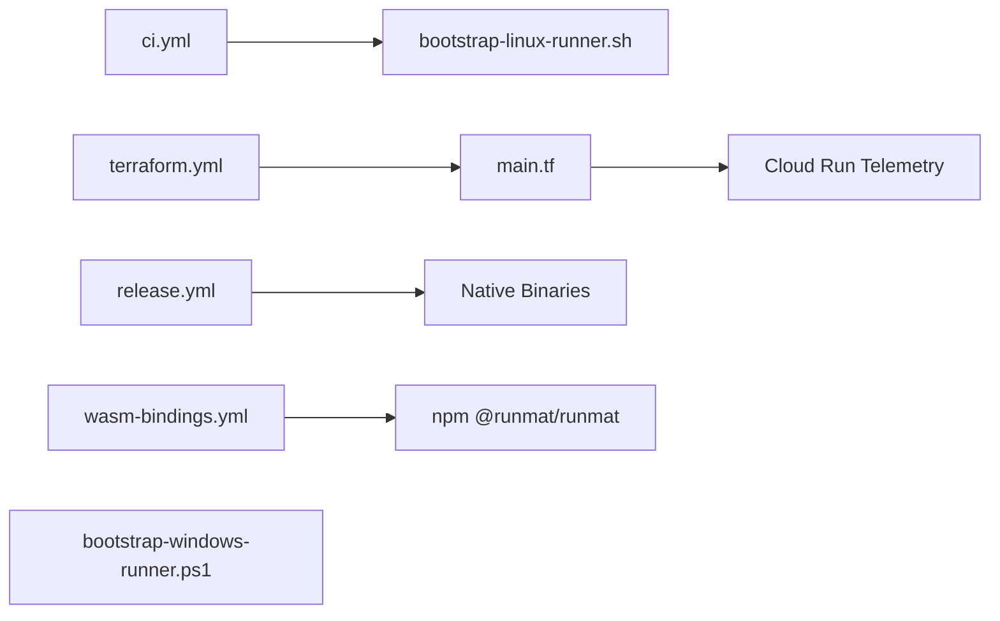
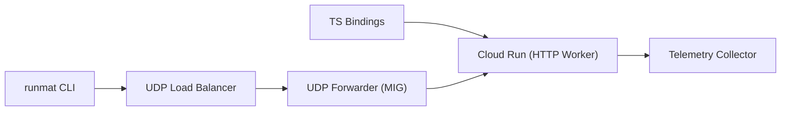

# CI/CD, Infrastructure & Release

<details>
<summary>Relevant source files</summary>

- [.github/workflows/ci.yml](https://github.com/runmat-org/runmat/blob/82685330/.github/workflows/ci.yml)
- [.github/workflows/release.yml](https://github.com/runmat-org/runmat/blob/82685330/.github/workflows/release.yml)
- [.github/workflows/terraform.yml](https://github.com/runmat-org/runmat/blob/82685330/.github/workflows/terraform.yml)
- [.github/workflows/wasm-bindings.yml](https://github.com/runmat-org/runmat/blob/82685330/.github/workflows/wasm-bindings.yml)
- [crates/runmat-runtime/build.rs](https://github.com/runmat-org/runmat/blob/82685330/crates/runmat-runtime/build.rs)
- [docs/TELEMETRY.md](https://github.com/runmat-org/runmat/blob/82685330/docs/TELEMETRY.md?plain=1)
- [infra/.gitignore](https://github.com/runmat-org/runmat/blob/82685330/infra/.gitignore)
- [infra/README.md](https://github.com/runmat-org/runmat/blob/82685330/infra/README.md?plain=1)
- [infra/main.tf](https://github.com/runmat-org/runmat/blob/82685330/infra/main.tf)
- [infra/scripts/bootstrap-linux-runner.sh](https://github.com/runmat-org/runmat/blob/82685330/infra/scripts/bootstrap-linux-runner.sh)
- [infra/scripts/bootstrap-windows-runner.ps1](https://github.com/runmat-org/runmat/blob/82685330/infra/scripts/bootstrap-windows-runner.ps1)
- [infra/scripts/bootstrap_gcp.sh](https://github.com/runmat-org/runmat/blob/82685330/infra/scripts/bootstrap_gcp.sh)
- [infra/scripts/configure-linux-runner-service-env.sh](https://github.com/runmat-org/runmat/blob/82685330/infra/scripts/configure-linux-runner-service-env.sh)
- [infra/udp-forwarder/Dockerfile](https://github.com/runmat-org/runmat/blob/82685330/infra/udp-forwarder/Dockerfile)
- [infra/udp-forwarder/package-lock.json](https://github.com/runmat-org/runmat/blob/82685330/infra/udp-forwarder/package-lock.json)
- [infra/udp-forwarder/package.json](https://github.com/runmat-org/runmat/blob/82685330/infra/udp-forwarder/package.json)
- [infra/udp-forwarder/src/index.js](https://github.com/runmat-org/runmat/blob/82685330/infra/udp-forwarder/src/index.js)
- [infra/udp-forwarder/test/index.test.js](https://github.com/runmat-org/runmat/blob/82685330/infra/udp-forwarder/test/index.test.js)
- [infra/variables.tf](https://github.com/runmat-org/runmat/blob/82685330/infra/variables.tf)
- [infra/worker/src/server.js](https://github.com/runmat-org/runmat/blob/82685330/infra/worker/src/server.js)
- [infra/worker/test/server.test.js](https://github.com/runmat-org/runmat/blob/82685330/infra/worker/test/server.test.js)
- [scripts/chrome-headless.sh](https://github.com/runmat-org/runmat/blob/82685330/scripts/chrome-headless.sh)
- [scripts/cut-release.sh](https://github.com/runmat-org/runmat/blob/82685330/scripts/cut-release.sh)

</details>

This page describes the RunMat automation pipelines, the cloud infrastructure supporting telemetry and distribution, and the release process for native binaries and WebAssembly packages.

## Pipeline Architecture

RunMat utilizes GitHub Actions for continuous integration and delivery. The system is designed to handle complex native dependencies across Windows, Linux, and macOS, while also managing the publication of the TypeScript/WASM ecosystem.

### CI/CD Workflow Overview

The primary pipelines are triggered by code changes and version tags:

- CI (`ci.yml`): Executes on every push and PR. It performs linting (`cargo fmt`, `clippy`) and runs the test suite across Linux and macOS.
- Release (`release.yml`): Triggered by version tags (`v*`). It builds optimized binaries, handles Apple notarization, and creates GitHub Releases.
- WASM Bindings (`wasm-bindings.yml`): Manages the compilation of `runmat-wasm` to the `wasm32-unknown-unknown` target and publishes the `@runmat/runmat` package to npm.
- Terraform (`terraform.yml`): Provisions the Google Cloud Platform (GCP) infrastructure for telemetry ingestion.

### Code-to-Infrastructure Association

The following diagram maps CI/CD concepts to their implementation files and specific job entities.

Pipeline Entity Map



<details>
<summary>Rendered SVG</summary>

```svg
<svg id="mermaid-q54r8usb2n" xmlns="http://www.w3.org/2000/svg" xmlns:xlink="http://www.w3.org/1999/xlink" class="flowchart" style="max-width: 100%; touch-action: none; user-select: none; cursor: grab; min-height: fit-content; max-height: 100%;" viewBox="-0.012834962293254648 2.842170943040401e-14 1292.4397324245865 499.99999999999994" role="graphics-document document" aria-roledescription="flowchart-v2" preserveAspectRatio="xMidYMid meet"><style>#mermaid-q54r8usb2n{font-family:ui-sans-serif,-apple-system,system-ui,Segoe UI,Helvetica;font-size:16px;fill:#ccc;}@keyframes edge-animation-frame{from{stroke-dashoffset:0;}}@keyframes dash{to{stroke-dashoffset:0;}}#mermaid-q54r8usb2n .edge-animation-slow{stroke-dasharray:9,5!important;stroke-dashoffset:900;animation:dash 50s linear infinite;stroke-linecap:round;}#mermaid-q54r8usb2n .edge-animation-fast{stroke-dasharray:9,5!important;stroke-dashoffset:900;animation:dash 20s linear infinite;stroke-linecap:round;}#mermaid-q54r8usb2n .error-icon{fill:#333;}#mermaid-q54r8usb2n .error-text{fill:#cccccc;stroke:#cccccc;}#mermaid-q54r8usb2n .edge-thickness-normal{stroke-width:1px;}#mermaid-q54r8usb2n .edge-thickness-thick{stroke-width:3.5px;}#mermaid-q54r8usb2n .edge-pattern-solid{stroke-dasharray:0;}#mermaid-q54r8usb2n .edge-thickness-invisible{stroke-width:0;fill:none;}#mermaid-q54r8usb2n .edge-pattern-dashed{stroke-dasharray:3;}#mermaid-q54r8usb2n .edge-pattern-dotted{stroke-dasharray:2;}#mermaid-q54r8usb2n .marker{fill:#666;stroke:#666;}#mermaid-q54r8usb2n .marker.cross{stroke:#666;}#mermaid-q54r8usb2n svg{font-family:ui-sans-serif,-apple-system,system-ui,Segoe UI,Helvetica;font-size:16px;}#mermaid-q54r8usb2n p{margin:0;}#mermaid-q54r8usb2n .label{font-family:ui-sans-serif,-apple-system,system-ui,Segoe UI,Helvetica;color:#fff;}#mermaid-q54r8usb2n .cluster-label text{fill:#fff;}#mermaid-q54r8usb2n .cluster-label span{color:#fff;}#mermaid-q54r8usb2n .cluster-label span p{background-color:transparent;}#mermaid-q54r8usb2n .label text,#mermaid-q54r8usb2n span{fill:#fff;color:#fff;}#mermaid-q54r8usb2n .node rect,#mermaid-q54r8usb2n .node circle,#mermaid-q54r8usb2n .node ellipse,#mermaid-q54r8usb2n .node polygon,#mermaid-q54r8usb2n .node path{fill:#111;stroke:#222;stroke-width:1px;}#mermaid-q54r8usb2n .rough-node .label text,#mermaid-q54r8usb2n .node .label text,#mermaid-q54r8usb2n .image-shape .label,#mermaid-q54r8usb2n .icon-shape .label{text-anchor:middle;}#mermaid-q54r8usb2n .node .katex path{fill:#000;stroke:#000;stroke-width:1px;}#mermaid-q54r8usb2n .rough-node .label,#mermaid-q54r8usb2n .node .label,#mermaid-q54r8usb2n .image-shape .label,#mermaid-q54r8usb2n .icon-shape .label{text-align:center;}#mermaid-q54r8usb2n .node.clickable{cursor:pointer;}#mermaid-q54r8usb2n .root .anchor path{fill:#666!important;stroke-width:0;stroke:#666;}#mermaid-q54r8usb2n .arrowheadPath{fill:#0b0b0b;}#mermaid-q54r8usb2n .edgePath .path{stroke:#666;stroke-width:1px;}#mermaid-q54r8usb2n .flowchart-link{stroke:#666;fill:none;}#mermaid-q54r8usb2n .edgeLabel{background-color:#161616;text-align:center;}#mermaid-q54r8usb2n .edgeLabel p{background-color:#161616;}#mermaid-q54r8usb2n .edgeLabel rect{opacity:0.5;background-color:#161616;fill:#161616;}#mermaid-q54r8usb2n .labelBkg{background-color:rgba(22, 22, 22, 0.5);}#mermaid-q54r8usb2n .cluster rect{fill:#161616;stroke:#222;stroke-width:1px;}#mermaid-q54r8usb2n .cluster text{fill:#fff;}#mermaid-q54r8usb2n .cluster span{color:#fff;}#mermaid-q54r8usb2n div.mermaidTooltip{position:absolute;text-align:center;max-width:200px;padding:2px;font-family:ui-sans-serif,-apple-system,system-ui,Segoe UI,Helvetica;font-size:12px;background:#333;border:1px solid hsl(0, 0%, 10%);border-radius:2px;pointer-events:none;z-index:100;}#mermaid-q54r8usb2n .flowchartTitleText{text-anchor:middle;font-size:18px;fill:#ccc;}#mermaid-q54r8usb2n rect.text{fill:none;stroke-width:0;}#mermaid-q54r8usb2n .icon-shape,#mermaid-q54r8usb2n .image-shape{background-color:#161616;text-align:center;}#mermaid-q54r8usb2n .icon-shape p,#mermaid-q54r8usb2n .image-shape p{background-color:#161616;padding:2px;}#mermaid-q54r8usb2n .icon-shape .label rect,#mermaid-q54r8usb2n .image-shape .label rect{opacity:0.5;background-color:#161616;fill:#161616;}#mermaid-q54r8usb2n .label-icon{display:inline-block;height:1em;overflow:visible;vertical-align:-0.125em;}#mermaid-q54r8usb2n .node .label-icon path{fill:currentColor;stroke:revert;stroke-width:revert;}#mermaid-q54r8usb2n .node .neo-node{stroke:#222;}#mermaid-q54r8usb2n [data-look="neo"].node rect,#mermaid-q54r8usb2n [data-look="neo"].cluster rect,#mermaid-q54r8usb2n [data-look="neo"].node polygon{stroke:url(#mermaid-q54r8usb2n-gradient);filter:drop-shadow( 1px 2px 2px rgba(185,185,185,1));}#mermaid-q54r8usb2n [data-look="neo"].node path{stroke:url(#mermaid-q54r8usb2n-gradient);stroke-width:1px;}#mermaid-q54r8usb2n [data-look="neo"].node .outer-path{filter:drop-shadow( 1px 2px 2px rgba(185,185,185,1));}#mermaid-q54r8usb2n [data-look="neo"].node .neo-line path{stroke:#222;filter:none;}#mermaid-q54r8usb2n [data-look="neo"].node circle{stroke:url(#mermaid-q54r8usb2n-gradient);filter:drop-shadow( 1px 2px 2px rgba(185,185,185,1));}#mermaid-q54r8usb2n [data-look="neo"].node circle .state-start{fill:#000000;}#mermaid-q54r8usb2n [data-look="neo"].icon-shape .icon{fill:url(#mermaid-q54r8usb2n-gradient);filter:drop-shadow( 1px 2px 2px rgba(185,185,185,1));}#mermaid-q54r8usb2n [data-look="neo"].icon-shape .icon-neo path{stroke:url(#mermaid-q54r8usb2n-gradient);filter:drop-shadow( 1px 2px 2px rgba(185,185,185,1));}#mermaid-q54r8usb2n :root{--mermaid-font-family:"trebuchet ms",verdana,arial,sans-serif;}</style><g><marker id="mermaid-q54r8usb2n_flowchart-v2-pointEnd" class="marker flowchart-v2" viewBox="0 0 10 10" refX="5" refY="5" markerUnits="userSpaceOnUse" markerWidth="8" markerHeight="8" orient="auto"><path d="M 0 0 L 10 5 L 0 10 z" class="arrowMarkerPath" style="stroke-width: 1; stroke-dasharray: 1, 0;"></path></marker><marker id="mermaid-q54r8usb2n_flowchart-v2-pointStart" class="marker flowchart-v2" viewBox="0 0 10 10" refX="4.5" refY="5" markerUnits="userSpaceOnUse" markerWidth="8" markerHeight="8" orient="auto"><path d="M 0 5 L 10 10 L 10 0 z" class="arrowMarkerPath" style="stroke-width: 1; stroke-dasharray: 1, 0;"></path></marker><marker id="mermaid-q54r8usb2n_flowchart-v2-pointEnd-margin" class="marker flowchart-v2" viewBox="0 0 11.5 14" refX="11.5" refY="7" markerUnits="userSpaceOnUse" markerWidth="10.5" markerHeight="14" orient="auto"><path d="M 0 0 L 11.5 7 L 0 14 z" class="arrowMarkerPath" style="stroke-width: 0; stroke-dasharray: 1, 0;"></path></marker><marker id="mermaid-q54r8usb2n_flowchart-v2-pointStart-margin" class="marker flowchart-v2" viewBox="0 0 11.5 14" refX="1" refY="7" markerUnits="userSpaceOnUse" markerWidth="11.5" markerHeight="14" orient="auto"><polygon points="0,7 11.5,14 11.5,0" class="arrowMarkerPath" style="stroke-width: 0; stroke-dasharray: 1, 0;"></polygon></marker><marker id="mermaid-q54r8usb2n_flowchart-v2-circleEnd" class="marker flowchart-v2" viewBox="0 0 10 10" refX="11" refY="5" markerUnits="userSpaceOnUse" markerWidth="11" markerHeight="11" orient="auto"><circle cx="5" cy="5" r="5" class="arrowMarkerPath" style="stroke-width: 1; stroke-dasharray: 1, 0;"></circle></marker><marker id="mermaid-q54r8usb2n_flowchart-v2-circleStart" class="marker flowchart-v2" viewBox="0 0 10 10" refX="-1" refY="5" markerUnits="userSpaceOnUse" markerWidth="11" markerHeight="11" orient="auto"><circle cx="5" cy="5" r="5" class="arrowMarkerPath" style="stroke-width: 1; stroke-dasharray: 1, 0;"></circle></marker><marker id="mermaid-q54r8usb2n_flowchart-v2-circleEnd-margin" class="marker flowchart-v2" viewBox="0 0 10 10" refY="5" refX="12.25" markerUnits="userSpaceOnUse" markerWidth="14" markerHeight="14" orient="auto"><circle cx="5" cy="5" r="5" class="arrowMarkerPath" style="stroke-width: 0; stroke-dasharray: 1, 0;"></circle></marker><marker id="mermaid-q54r8usb2n_flowchart-v2-circleStart-margin" class="marker flowchart-v2" viewBox="0 0 10 10" refX="-2" refY="5" markerUnits="userSpaceOnUse" markerWidth="14" markerHeight="14" orient="auto"><circle cx="5" cy="5" r="5" class="arrowMarkerPath" style="stroke-width: 0; stroke-dasharray: 1, 0;"></circle></marker><marker id="mermaid-q54r8usb2n_flowchart-v2-crossEnd" class="marker cross flowchart-v2" viewBox="0 0 11 11" refX="12" refY="5.2" markerUnits="userSpaceOnUse" markerWidth="11" markerHeight="11" orient="auto"><path d="M 1,1 l 9,9 M 10,1 l -9,9" class="arrowMarkerPath" style="stroke-width: 2; stroke-dasharray: 1, 0;"></path></marker><marker id="mermaid-q54r8usb2n_flowchart-v2-crossStart" class="marker cross flowchart-v2" viewBox="0 0 11 11" refX="-1" refY="5.2" markerUnits="userSpaceOnUse" markerWidth="11" markerHeight="11" orient="auto"><path d="M 1,1 l 9,9 M 10,1 l -9,9" class="arrowMarkerPath" style="stroke-width: 2; stroke-dasharray: 1, 0;"></path></marker><marker id="mermaid-q54r8usb2n_flowchart-v2-crossEnd-margin" class="marker cross flowchart-v2" viewBox="0 0 15 15" refX="17.7" refY="7.5" markerUnits="userSpaceOnUse" markerWidth="12" markerHeight="12" orient="auto"><path d="M 1,1 L 14,14 M 1,14 L 14,1" class="arrowMarkerPath" style="stroke-width: 2.5;"></path></marker><marker id="mermaid-q54r8usb2n_flowchart-v2-crossStart-margin" class="marker cross flowchart-v2" viewBox="0 0 15 15" refX="-3.5" refY="7.5" markerUnits="userSpaceOnUse" markerWidth="12" markerHeight="12" orient="auto"><path d="M 1,1 L 14,14 M 1,14 L 14,1" class="arrowMarkerPath" style="stroke-width: 2.5; stroke-dasharray: 1, 0;"></path></marker><g class="root"><g class="clusters"><g class="cluster" id="mermaid-q54r8usb2n-subGraph2" data-look="classic"><rect style="" x="8" y="388" width="1276.4140625" height="104"></rect><g class="cluster-label" transform="translate(585.00390625, 388)"><foreignObject width="122.40625" height="24"><div style="display: table-cell; white-space: nowrap; line-height: 1.5;" xmlns="http://www.w3.org/1999/xhtml"><span class="nodeLabel"><p>Release Artifacts</p></span></div></foreignObject></g></g><g class="cluster" id="mermaid-q54r8usb2n-subGraph1" data-look="classic"><rect style="" x="447.9140625" y="186" width="785.96875" height="128"></rect><g class="cluster-label" transform="translate(737.703125, 186)"><foreignObject width="206.390625" height="24"><div style="display: table-cell; white-space: nowrap; line-height: 1.5;" xmlns="http://www.w3.org/1999/xhtml"><span class="nodeLabel"><p>Infrastructure &amp; Provisioning</p></span></div></foreignObject></g></g><g class="cluster" id="mermaid-q54r8usb2n-subGraph0" data-look="classic"><rect style="" x="21.328125" y="8" width="1236.234375" height="104"></rect><g class="cluster-label" transform="translate(584.828125, 8)"><foreignObject width="109.234375" height="24"><div style="display: table-cell; white-space: nowrap; line-height: 1.5;" xmlns="http://www.w3.org/1999/xhtml"><span class="nodeLabel"><p>GitHub Actions</p></span></div></foreignObject></g></g></g><g class="edgePaths"><path d="M605.953,87L605.953,91.167C605.953,95.333,605.953,103.667,605.953,114C605.953,124.333,605.953,136.667,605.953,149C605.953,161.333,605.953,173.667,605.953,185.333C605.953,197,605.953,208,605.953,213.5L605.953,219" id="mermaid-q54r8usb2n-L_CI_LIN_BOOT_0" class="edge-thickness-normal edge-pattern-solid edge-thickness-normal edge-pattern-solid flowchart-link" style=";" data-edge="true" data-et="edge" data-id="L_CI_LIN_BOOT_0" data-points="W3sieCI6NjA1Ljk1MzEyNSwieSI6ODd9LHsieCI6NjA1Ljk1MzEyNSwieSI6MTEyfSx7IngiOjYwNS45NTMxMjUsInkiOjE0OX0seyJ4Ijo2MDUuOTUzMTI1LCJ5IjoxODZ9LHsieCI6NjA1Ljk1MzEyNSwieSI6MjIzfV0=" data-look="classic" marker-end="url(#mermaid-q54r8usb2n_flowchart-v2-pointEnd)"></path><path d="M126.992,87L126.992,91.167C126.992,95.333,126.992,103.667,126.992,114C126.992,124.333,126.992,136.667,126.992,149C126.992,161.333,126.992,173.667,126.992,190.5C126.992,207.333,126.992,228.667,126.992,250C126.992,271.333,126.992,292.667,126.992,309.5C126.992,326.333,126.992,338.667,126.992,351C126.992,363.333,126.992,375.667,126.992,385.333C126.992,395,126.992,402,126.992,405.5L126.992,409" id="mermaid-q54r8usb2n-L_REL_BIN_0" class="edge-thickness-normal edge-pattern-solid edge-thickness-normal edge-pattern-solid flowchart-link" style=";" data-edge="true" data-et="edge" data-id="L_REL_BIN_0" data-points="W3sieCI6MTI2Ljk5MjE4NzUsInkiOjg3fSx7IngiOjEyNi45OTIxODc1LCJ5IjoxMTJ9LHsieCI6MTI2Ljk5MjE4NzUsInkiOjE0OX0seyJ4IjoxMjYuOTkyMTg3NSwieSI6MTg2fSx7IngiOjEyNi45OTIxODc1LCJ5IjoyNTB9LHsieCI6MTI2Ljk5MjE4NzUsInkiOjMxNH0seyJ4IjoxMjYuOTkyMTg3NSwieSI6MzUxfSx7IngiOjEyNi45OTIxODc1LCJ5IjozODh9LHsieCI6MTI2Ljk5MjE4NzUsInkiOjQxM31d" data-look="classic" marker-end="url(#mermaid-q54r8usb2n_flowchart-v2-pointEnd)"></path><path d="M370.047,87L370.047,91.167C370.047,95.333,370.047,103.667,370.047,114C370.047,124.333,370.047,136.667,370.047,149C370.047,161.333,370.047,173.667,370.047,190.5C370.047,207.333,370.047,228.667,370.047,250C370.047,271.333,370.047,292.667,370.047,309.5C370.047,326.333,370.047,338.667,370.047,351C370.047,363.333,370.047,375.667,370.047,385.333C370.047,395,370.047,402,370.047,405.5L370.047,409" id="mermaid-q54r8usb2n-L_WASM_NPM_0" class="edge-thickness-normal edge-pattern-solid edge-thickness-normal edge-pattern-solid flowchart-link" style=";" data-edge="true" data-et="edge" data-id="L_WASM_NPM_0" data-points="W3sieCI6MzcwLjA0Njg3NSwieSI6ODd9LHsieCI6MzcwLjA0Njg3NSwieSI6MTEyfSx7IngiOjM3MC4wNDY4NzUsInkiOjE0OX0seyJ4IjozNzAuMDQ2ODc1LCJ5IjoxODZ9LHsieCI6MzcwLjA0Njg3NSwieSI6MjUwfSx7IngiOjM3MC4wNDY4NzUsInkiOjMxNH0seyJ4IjozNzAuMDQ2ODc1LCJ5IjozNTF9LHsieCI6MzcwLjA0Njg3NSwieSI6Mzg4fSx7IngiOjM3MC4wNDY4NzUsInkiOjQxM31d" data-look="classic" marker-end="url(#mermaid-q54r8usb2n_flowchart-v2-pointEnd)"></path><path d="M1143.938,87L1143.938,91.167C1143.938,95.333,1143.938,103.667,1143.938,114C1143.938,124.333,1143.938,136.667,1143.938,149C1143.938,161.333,1143.938,173.667,1143.938,185.333C1143.938,197,1143.938,208,1143.938,213.5L1143.938,219" id="mermaid-q54r8usb2n-L_TF_WF_TF_MAIN_0" class="edge-thickness-normal edge-pattern-solid edge-thickness-normal edge-pattern-solid flowchart-link" style=";" data-edge="true" data-et="edge" data-id="L_TF_WF_TF_MAIN_0" data-points="W3sieCI6MTE0My45Mzc1LCJ5Ijo4N30seyJ4IjoxMTQzLjkzNzUsInkiOjExMn0seyJ4IjoxMTQzLjkzNzUsInkiOjE0OX0seyJ4IjoxMTQzLjkzNzUsInkiOjE4Nn0seyJ4IjoxMTQzLjkzNzUsInkiOjIyM31d" data-look="classic" marker-end="url(#mermaid-q54r8usb2n_flowchart-v2-pointEnd)"></path><path d="M1143.938,277L1143.938,283.167C1143.938,289.333,1143.938,301.667,1143.938,314C1143.938,326.333,1143.938,338.667,1143.938,351C1143.938,363.333,1143.938,375.667,1143.938,385.333C1143.938,395,1143.938,402,1143.938,405.5L1143.938,409" id="mermaid-q54r8usb2n-L_TF_MAIN_CLD_RUN_0" class="edge-thickness-normal edge-pattern-solid edge-thickness-normal edge-pattern-solid flowchart-link" style=";" data-edge="true" data-et="edge" data-id="L_TF_MAIN_CLD_RUN_0" data-points="W3sieCI6MTE0My45Mzc1LCJ5IjoyNzd9LHsieCI6MTE0My45Mzc1LCJ5IjozMTR9LHsieCI6MTE0My45Mzc1LCJ5IjozNTF9LHsieCI6MTE0My45Mzc1LCJ5IjozODh9LHsieCI6MTE0My45Mzc1LCJ5Ijo0MTN9XQ==" data-look="classic" marker-end="url(#mermaid-q54r8usb2n_flowchart-v2-pointEnd)"></path></g><g class="edgeLabels"><g class="edgeLabel" transform="translate(605.953125, 149)"><g class="label" data-id="L_CI_LIN_BOOT_0" transform="translate(-28.9140625, -12)"><foreignObject width="57.828125" height="24"><div style="display: table-cell; white-space: nowrap; line-height: 1.5; max-width: 200px; text-align: center;" xmlns="http://www.w3.org/1999/xhtml" class="labelBkg"><span class="edgeLabel"><p>Validate</p></span></div></foreignObject></g></g><g class="edgeLabel" transform="translate(126.9921875, 250)"><g class="label" data-id="L_REL_BIN_0" transform="translate(-59.2734375, -12)"><foreignObject width="118.546875" height="24"><div style="display: table-cell; white-space: nowrap; line-height: 1.5; max-width: 200px; text-align: center;" xmlns="http://www.w3.org/1999/xhtml" class="labelBkg"><span class="edgeLabel"><p>Notarize/Publish</p></span></div></foreignObject></g></g><g class="edgeLabel" transform="translate(370.046875, 250)"><g class="label" data-id="L_WASM_NPM_0" transform="translate(-57.8671875, -12)"><foreignObject width="115.734375" height="24"><div style="display: table-cell; white-space: nowrap; line-height: 1.5; max-width: 200px; text-align: center;" xmlns="http://www.w3.org/1999/xhtml" class="labelBkg"><span class="edgeLabel"><p>Target: wasm32</p></span></div></foreignObject></g></g><g class="edgeLabel" transform="translate(1143.9375, 149)"><g class="label" data-id="L_TF_WF_TF_MAIN_0" transform="translate(-20.7421875, -12)"><foreignObject width="41.484375" height="24"><div style="display: table-cell; white-space: nowrap; line-height: 1.5; max-width: 200px; text-align: center;" xmlns="http://www.w3.org/1999/xhtml" class="labelBkg"><span class="edgeLabel"><p>Apply</p></span></div></foreignObject></g></g><g class="edgeLabel" transform="translate(1143.9375, 351)"><g class="label" data-id="L_TF_MAIN_CLD_RUN_0" transform="translate(-25.265625, -12)"><foreignObject width="50.53125" height="24"><div style="display: table-cell; white-space: nowrap; line-height: 1.5; max-width: 200px; text-align: center;" xmlns="http://www.w3.org/1999/xhtml" class="labelBkg"><span class="edgeLabel"><p>Deploy</p></span></div></foreignObject></g></g></g><g class="nodes"><g class="node default" id="mermaid-q54r8usb2n-flowchart-CI-0" data-look="classic" transform="translate(605.953125, 60)"><rect class="basic label-container" style="" x="-50.6328125" y="-27" width="101.265625" height="54"></rect><g class="label" style="" transform="translate(-20.6328125, -12)"><rect></rect><foreignObject width="41.265625" height="24"><div style="display: table-cell; white-space: nowrap; line-height: 1.5; max-width: 200px; text-align: center;" xmlns="http://www.w3.org/1999/xhtml"><span class="nodeLabel"><p>ci.yml</p></span></div></foreignObject></g></g><g class="node default" id="mermaid-q54r8usb2n-flowchart-REL-1" data-look="classic" transform="translate(126.9921875, 60)"><rect class="basic label-container" style="" x="-70.6640625" y="-27" width="141.328125" height="54"></rect><g class="label" style="" transform="translate(-40.6640625, -12)"><rect></rect><foreignObject width="81.328125" height="24"><div style="display: table-cell; white-space: nowrap; line-height: 1.5; max-width: 200px; text-align: center;" xmlns="http://www.w3.org/1999/xhtml"><span class="nodeLabel"><p>release.yml</p></span></div></foreignObject></g></g><g class="node default" id="mermaid-q54r8usb2n-flowchart-WASM-2" data-look="classic" transform="translate(370.046875, 60)"><rect class="basic label-container" style="" x="-100.0546875" y="-27" width="200.109375" height="54"></rect><g class="label" style="" transform="translate(-70.0546875, -12)"><rect></rect><foreignObject width="140.109375" height="24"><div style="display: table-cell; white-space: nowrap; line-height: 1.5; max-width: 200px; text-align: center;" xmlns="http://www.w3.org/1999/xhtml"><span class="nodeLabel"><p>wasm-bindings.yml</p></span></div></foreignObject></g></g><g class="node default" id="mermaid-q54r8usb2n-flowchart-TF_WF-3" data-look="classic" transform="translate(1143.9375, 60)"><rect class="basic label-container" style="" x="-78.625" y="-27" width="157.25" height="54"></rect><g class="label" style="" transform="translate(-48.625, -12)"><rect></rect><foreignObject width="97.25" height="24"><div style="display: table-cell; white-space: nowrap; line-height: 1.5; max-width: 200px; text-align: center;" xmlns="http://www.w3.org/1999/xhtml"><span class="nodeLabel"><p>terraform.yml</p></span></div></foreignObject></g></g><g class="node default" id="mermaid-q54r8usb2n-flowchart-LIN_BOOT-4" data-look="classic" transform="translate(605.953125, 250)"><rect class="basic label-container" style="" x="-123.0390625" y="-27" width="246.078125" height="54"></rect><g class="label" style="" transform="translate(-93.0390625, -12)"><rect></rect><foreignObject width="186.078125" height="24"><div style="display: table-cell; white-space: nowrap; line-height: 1.5; max-width: 200px; text-align: center;" xmlns="http://www.w3.org/1999/xhtml"><span class="nodeLabel"><p>bootstrap-linux-runner.sh</p></span></div></foreignObject></g></g><g class="node default" id="mermaid-q54r8usb2n-flowchart-WIN_BOOT-5" data-look="classic" transform="translate(908.9921875, 250)"><rect class="basic label-container" style="" x="-130" y="-39" width="260" height="78"></rect><g class="label" style="" transform="translate(-100, -24)"><rect></rect><foreignObject width="200" height="48"><div style="display: table; white-space: break-spaces; line-height: 1.5; max-width: 200px; text-align: center; width: 200px;" xmlns="http://www.w3.org/1999/xhtml"><span class="nodeLabel"><p>bootstrap-windows-runner.ps1</p></span></div></foreignObject></g></g><g class="node default" id="mermaid-q54r8usb2n-flowchart-TF_MAIN-6" data-look="classic" transform="translate(1143.9375, 250)"><rect class="basic label-container" style="" x="-54.9453125" y="-27" width="109.890625" height="54"></rect><g class="label" style="" transform="translate(-24.9453125, -12)"><rect></rect><foreignObject width="49.890625" height="24"><div style="display: table-cell; white-space: nowrap; line-height: 1.5; max-width: 200px; text-align: center;" xmlns="http://www.w3.org/1999/xhtml"><span class="nodeLabel"><p>main.tf</p></span></div></foreignObject></g></g><g class="node default" id="mermaid-q54r8usb2n-flowchart-BIN-7" data-look="classic" transform="translate(126.9921875, 440)"><rect class="basic label-container" style="" x="-83.9921875" y="-27" width="167.984375" height="54"></rect><g class="label" style="" transform="translate(-53.9921875, -12)"><rect></rect><foreignObject width="107.984375" height="24"><div style="display: table-cell; white-space: nowrap; line-height: 1.5; max-width: 200px; text-align: center;" xmlns="http://www.w3.org/1999/xhtml"><span class="nodeLabel"><p>Native Binaries</p></span></div></foreignObject></g></g><g class="node default" id="mermaid-q54r8usb2n-flowchart-NPM-8" data-look="classic" transform="translate(370.046875, 440)"><rect class="basic label-container" style="" x="-109.0625" y="-27" width="218.125" height="54"></rect><g class="label" style="" transform="translate(-79.0625, -12)"><rect></rect><foreignObject width="158.125" height="24"><div style="display: table-cell; white-space: nowrap; line-height: 1.5; max-width: 200px; text-align: center;" xmlns="http://www.w3.org/1999/xhtml"><span class="nodeLabel"><p>npm @runmat/runmat</p></span></div></foreignObject></g></g><g class="node default" id="mermaid-q54r8usb2n-flowchart-CLD_RUN-9" data-look="classic" transform="translate(1143.9375, 440)"><rect class="basic label-container" style="" x="-105.4765625" y="-27" width="210.953125" height="54"></rect><g class="label" style="" transform="translate(-75.4765625, -12)"><rect></rect><foreignObject width="150.953125" height="24"><div style="display: table-cell; white-space: nowrap; line-height: 1.5; max-width: 200px; text-align: center;" xmlns="http://www.w3.org/1999/xhtml"><span class="nodeLabel"><p>Cloud Run Telemetry</p></span></div></foreignObject></g></g></g></g></g><defs><filter id="mermaid-q54r8usb2n-drop-shadow" height="130%" width="130%"><feDropShadow dx="4" dy="4" stdDeviation="0" flood-opacity="0.06" flood-color="#000000"></feDropShadow></filter></defs><defs><filter id="mermaid-q54r8usb2n-drop-shadow-small" height="150%" width="150%"><feDropShadow dx="2" dy="2" stdDeviation="0" flood-opacity="0.06" flood-color="#000000"></feDropShadow></filter></defs><linearGradient id="mermaid-q54r8usb2n-gradient" gradientUnits="objectBoundingBox" x1="0%" y1="0%" x2="100%" y2="0%"><stop offset="0%" stop-color="#333" stop-opacity="1"></stop><stop offset="100%" stop-color="hsl(-120, 0%, 3.3333333333%)" stop-opacity="1"></stop></linearGradient></svg>
```

</details>

Sources: [.github/workflows/ci.yml #1-32](https://github.com/runmat-org/runmat/blob/82685330/.github/workflows/ci.yml#L1-L32) [.github/workflows/release.yml #1-24](https://github.com/runmat-org/runmat/blob/82685330/.github/workflows/release.yml#L1-L24) [.github/workflows/wasm-bindings.yml #1-72](https://github.com/runmat-org/runmat/blob/82685330/.github/workflows/wasm-bindings.yml#L1-L72) [.github/workflows/terraform.yml #1-17](https://github.com/runmat-org/runmat/blob/82685330/.github/workflows/terraform.yml#L1-L17) [infra/main.tf #1-14](https://github.com/runmat-org/runmat/blob/82685330/infra/main.tf#L1-L14)

---

## Infrastructure & Provisioning

RunMat uses a hybrid of GitHub-hosted and self-hosted runners to accommodate specific build requirements (e.g., GCP-hosted runners for Linux/Windows to access private registries and optimized hardware).

### Runner Provisioning

Self-hosted runners must be bootstrapped with specific native toolchains.

- Windows: The `bootstrap-windows-runner.ps1` script installs Visual Studio 2022 Build Tools, `vcpkg`, and the Rust toolchain `1.90.0-x86_64-pc-windows-msvc` [[infra/scripts/bootstrap-windows-runner.ps1:1-171\]](https://app.devin.ai/org/runmat-org/wiki/runmat-org/runmat?branch=dev).
- Linux: The `bootstrap-linux-runner.sh` script ensures `libzmq3-dev`, `libopenblas-dev`, and `liblapack-dev` are present [[.github/workflows/ci.yml:98-119\]](https://app.devin.ai/org/runmat-org/wiki/runmat-org/runmat?branch=dev).

### Telemetry Infrastructure

RunMat provisions a telemetry ingress on GCP using Terraform.

- HTTP Ingress: A Cloud Run service hosts a compatibility worker (`infra/worker/src/server.js`) that normalizes legacy telemetry payloads [[infra/main.tf #64-100](https://github.com/runmat-org/runmat/blob/82685330/[infra/main.tf#L64-L100) [infra/worker/src/server.js:8-53]]().
- UDP Forwarder: A regional Managed Instance Group (MIG) runs a UDP-to-HTTP forwarder to minimize CLI blocking during telemetry dispatch [[infra/main.tf:185-238\]](https://app.devin.ai/org/runmat-org/wiki/runmat-org/runmat?branch=dev).

Telemetry Data Flow



<details>
<summary>Rendered SVG</summary>

```svg
<svg id="mermaid-is39lieo7v" xmlns="http://www.w3.org/2000/svg" xmlns:xlink="http://www.w3.org/1999/xlink" class="flowchart" style="max-width: 100%; touch-action: none; user-select: none; cursor: grab; min-height: fit-content; max-height: 100%;" viewBox="-0.02075401861247883 0 1691.072758037225 244" role="graphics-document document" aria-roledescription="flowchart-v2" preserveAspectRatio="xMidYMid meet"><style>#mermaid-is39lieo7v{font-family:ui-sans-serif,-apple-system,system-ui,Segoe UI,Helvetica;font-size:16px;fill:#ccc;}@keyframes edge-animation-frame{from{stroke-dashoffset:0;}}@keyframes dash{to{stroke-dashoffset:0;}}#mermaid-is39lieo7v .edge-animation-slow{stroke-dasharray:9,5!important;stroke-dashoffset:900;animation:dash 50s linear infinite;stroke-linecap:round;}#mermaid-is39lieo7v .edge-animation-fast{stroke-dasharray:9,5!important;stroke-dashoffset:900;animation:dash 20s linear infinite;stroke-linecap:round;}#mermaid-is39lieo7v .error-icon{fill:#333;}#mermaid-is39lieo7v .error-text{fill:#cccccc;stroke:#cccccc;}#mermaid-is39lieo7v .edge-thickness-normal{stroke-width:1px;}#mermaid-is39lieo7v .edge-thickness-thick{stroke-width:3.5px;}#mermaid-is39lieo7v .edge-pattern-solid{stroke-dasharray:0;}#mermaid-is39lieo7v .edge-thickness-invisible{stroke-width:0;fill:none;}#mermaid-is39lieo7v .edge-pattern-dashed{stroke-dasharray:3;}#mermaid-is39lieo7v .edge-pattern-dotted{stroke-dasharray:2;}#mermaid-is39lieo7v .marker{fill:#666;stroke:#666;}#mermaid-is39lieo7v .marker.cross{stroke:#666;}#mermaid-is39lieo7v svg{font-family:ui-sans-serif,-apple-system,system-ui,Segoe UI,Helvetica;font-size:16px;}#mermaid-is39lieo7v p{margin:0;}#mermaid-is39lieo7v .label{font-family:ui-sans-serif,-apple-system,system-ui,Segoe UI,Helvetica;color:#fff;}#mermaid-is39lieo7v .cluster-label text{fill:#fff;}#mermaid-is39lieo7v .cluster-label span{color:#fff;}#mermaid-is39lieo7v .cluster-label span p{background-color:transparent;}#mermaid-is39lieo7v .label text,#mermaid-is39lieo7v span{fill:#fff;color:#fff;}#mermaid-is39lieo7v .node rect,#mermaid-is39lieo7v .node circle,#mermaid-is39lieo7v .node ellipse,#mermaid-is39lieo7v .node polygon,#mermaid-is39lieo7v .node path{fill:#111;stroke:#222;stroke-width:1px;}#mermaid-is39lieo7v .rough-node .label text,#mermaid-is39lieo7v .node .label text,#mermaid-is39lieo7v .image-shape .label,#mermaid-is39lieo7v .icon-shape .label{text-anchor:middle;}#mermaid-is39lieo7v .node .katex path{fill:#000;stroke:#000;stroke-width:1px;}#mermaid-is39lieo7v .rough-node .label,#mermaid-is39lieo7v .node .label,#mermaid-is39lieo7v .image-shape .label,#mermaid-is39lieo7v .icon-shape .label{text-align:center;}#mermaid-is39lieo7v .node.clickable{cursor:pointer;}#mermaid-is39lieo7v .root .anchor path{fill:#666!important;stroke-width:0;stroke:#666;}#mermaid-is39lieo7v .arrowheadPath{fill:#0b0b0b;}#mermaid-is39lieo7v .edgePath .path{stroke:#666;stroke-width:1px;}#mermaid-is39lieo7v .flowchart-link{stroke:#666;fill:none;}#mermaid-is39lieo7v .edgeLabel{background-color:#161616;text-align:center;}#mermaid-is39lieo7v .edgeLabel p{background-color:#161616;}#mermaid-is39lieo7v .edgeLabel rect{opacity:0.5;background-color:#161616;fill:#161616;}#mermaid-is39lieo7v .labelBkg{background-color:rgba(22, 22, 22, 0.5);}#mermaid-is39lieo7v .cluster rect{fill:#161616;stroke:#222;stroke-width:1px;}#mermaid-is39lieo7v .cluster text{fill:#fff;}#mermaid-is39lieo7v .cluster span{color:#fff;}#mermaid-is39lieo7v div.mermaidTooltip{position:absolute;text-align:center;max-width:200px;padding:2px;font-family:ui-sans-serif,-apple-system,system-ui,Segoe UI,Helvetica;font-size:12px;background:#333;border:1px solid hsl(0, 0%, 10%);border-radius:2px;pointer-events:none;z-index:100;}#mermaid-is39lieo7v .flowchartTitleText{text-anchor:middle;font-size:18px;fill:#ccc;}#mermaid-is39lieo7v rect.text{fill:none;stroke-width:0;}#mermaid-is39lieo7v .icon-shape,#mermaid-is39lieo7v .image-shape{background-color:#161616;text-align:center;}#mermaid-is39lieo7v .icon-shape p,#mermaid-is39lieo7v .image-shape p{background-color:#161616;padding:2px;}#mermaid-is39lieo7v .icon-shape .label rect,#mermaid-is39lieo7v .image-shape .label rect{opacity:0.5;background-color:#161616;fill:#161616;}#mermaid-is39lieo7v .label-icon{display:inline-block;height:1em;overflow:visible;vertical-align:-0.125em;}#mermaid-is39lieo7v .node .label-icon path{fill:currentColor;stroke:revert;stroke-width:revert;}#mermaid-is39lieo7v .node .neo-node{stroke:#222;}#mermaid-is39lieo7v [data-look="neo"].node rect,#mermaid-is39lieo7v [data-look="neo"].cluster rect,#mermaid-is39lieo7v [data-look="neo"].node polygon{stroke:url(#mermaid-is39lieo7v-gradient);filter:drop-shadow( 1px 2px 2px rgba(185,185,185,1));}#mermaid-is39lieo7v [data-look="neo"].node path{stroke:url(#mermaid-is39lieo7v-gradient);stroke-width:1px;}#mermaid-is39lieo7v [data-look="neo"].node .outer-path{filter:drop-shadow( 1px 2px 2px rgba(185,185,185,1));}#mermaid-is39lieo7v [data-look="neo"].node .neo-line path{stroke:#222;filter:none;}#mermaid-is39lieo7v [data-look="neo"].node circle{stroke:url(#mermaid-is39lieo7v-gradient);filter:drop-shadow( 1px 2px 2px rgba(185,185,185,1));}#mermaid-is39lieo7v [data-look="neo"].node circle .state-start{fill:#000000;}#mermaid-is39lieo7v [data-look="neo"].icon-shape .icon{fill:url(#mermaid-is39lieo7v-gradient);filter:drop-shadow( 1px 2px 2px rgba(185,185,185,1));}#mermaid-is39lieo7v [data-look="neo"].icon-shape .icon-neo path{stroke:url(#mermaid-is39lieo7v-gradient);filter:drop-shadow( 1px 2px 2px rgba(185,185,185,1));}#mermaid-is39lieo7v :root{--mermaid-font-family:"trebuchet ms",verdana,arial,sans-serif;}</style><g><marker id="mermaid-is39lieo7v_flowchart-v2-pointEnd" class="marker flowchart-v2" viewBox="0 0 10 10" refX="5" refY="5" markerUnits="userSpaceOnUse" markerWidth="8" markerHeight="8" orient="auto"><path d="M 0 0 L 10 5 L 0 10 z" class="arrowMarkerPath" style="stroke-width: 1; stroke-dasharray: 1, 0;"></path></marker><marker id="mermaid-is39lieo7v_flowchart-v2-pointStart" class="marker flowchart-v2" viewBox="0 0 10 10" refX="4.5" refY="5" markerUnits="userSpaceOnUse" markerWidth="8" markerHeight="8" orient="auto"><path d="M 0 5 L 10 10 L 10 0 z" class="arrowMarkerPath" style="stroke-width: 1; stroke-dasharray: 1, 0;"></path></marker><marker id="mermaid-is39lieo7v_flowchart-v2-pointEnd-margin" class="marker flowchart-v2" viewBox="0 0 11.5 14" refX="11.5" refY="7" markerUnits="userSpaceOnUse" markerWidth="10.5" markerHeight="14" orient="auto"><path d="M 0 0 L 11.5 7 L 0 14 z" class="arrowMarkerPath" style="stroke-width: 0; stroke-dasharray: 1, 0;"></path></marker><marker id="mermaid-is39lieo7v_flowchart-v2-pointStart-margin" class="marker flowchart-v2" viewBox="0 0 11.5 14" refX="1" refY="7" markerUnits="userSpaceOnUse" markerWidth="11.5" markerHeight="14" orient="auto"><polygon points="0,7 11.5,14 11.5,0" class="arrowMarkerPath" style="stroke-width: 0; stroke-dasharray: 1, 0;"></polygon></marker><marker id="mermaid-is39lieo7v_flowchart-v2-circleEnd" class="marker flowchart-v2" viewBox="0 0 10 10" refX="11" refY="5" markerUnits="userSpaceOnUse" markerWidth="11" markerHeight="11" orient="auto"><circle cx="5" cy="5" r="5" class="arrowMarkerPath" style="stroke-width: 1; stroke-dasharray: 1, 0;"></circle></marker><marker id="mermaid-is39lieo7v_flowchart-v2-circleStart" class="marker flowchart-v2" viewBox="0 0 10 10" refX="-1" refY="5" markerUnits="userSpaceOnUse" markerWidth="11" markerHeight="11" orient="auto"><circle cx="5" cy="5" r="5" class="arrowMarkerPath" style="stroke-width: 1; stroke-dasharray: 1, 0;"></circle></marker><marker id="mermaid-is39lieo7v_flowchart-v2-circleEnd-margin" class="marker flowchart-v2" viewBox="0 0 10 10" refY="5" refX="12.25" markerUnits="userSpaceOnUse" markerWidth="14" markerHeight="14" orient="auto"><circle cx="5" cy="5" r="5" class="arrowMarkerPath" style="stroke-width: 0; stroke-dasharray: 1, 0;"></circle></marker><marker id="mermaid-is39lieo7v_flowchart-v2-circleStart-margin" class="marker flowchart-v2" viewBox="0 0 10 10" refX="-2" refY="5" markerUnits="userSpaceOnUse" markerWidth="14" markerHeight="14" orient="auto"><circle cx="5" cy="5" r="5" class="arrowMarkerPath" style="stroke-width: 0; stroke-dasharray: 1, 0;"></circle></marker><marker id="mermaid-is39lieo7v_flowchart-v2-crossEnd" class="marker cross flowchart-v2" viewBox="0 0 11 11" refX="12" refY="5.2" markerUnits="userSpaceOnUse" markerWidth="11" markerHeight="11" orient="auto"><path d="M 1,1 l 9,9 M 10,1 l -9,9" class="arrowMarkerPath" style="stroke-width: 2; stroke-dasharray: 1, 0;"></path></marker><marker id="mermaid-is39lieo7v_flowchart-v2-crossStart" class="marker cross flowchart-v2" viewBox="0 0 11 11" refX="-1" refY="5.2" markerUnits="userSpaceOnUse" markerWidth="11" markerHeight="11" orient="auto"><path d="M 1,1 l 9,9 M 10,1 l -9,9" class="arrowMarkerPath" style="stroke-width: 2; stroke-dasharray: 1, 0;"></path></marker><marker id="mermaid-is39lieo7v_flowchart-v2-crossEnd-margin" class="marker cross flowchart-v2" viewBox="0 0 15 15" refX="17.7" refY="7.5" markerUnits="userSpaceOnUse" markerWidth="12" markerHeight="12" orient="auto"><path d="M 1,1 L 14,14 M 1,14 L 14,1" class="arrowMarkerPath" style="stroke-width: 2.5;"></path></marker><marker id="mermaid-is39lieo7v_flowchart-v2-crossStart-margin" class="marker cross flowchart-v2" viewBox="0 0 15 15" refX="-3.5" refY="7.5" markerUnits="userSpaceOnUse" markerWidth="12" markerHeight="12" orient="auto"><path d="M 1,1 L 14,14 M 1,14 L 14,1" class="arrowMarkerPath" style="stroke-width: 2.5; stroke-dasharray: 1, 0;"></path></marker><g class="root"><g class="clusters"><g class="cluster" id="mermaid-is39lieo7v-Collection" data-look="classic"><rect style="" x="1431.328125" y="60" width="251.703125" height="124"></rect><g class="cluster-label" transform="translate(1520.8359375, 60)"><foreignObject width="72.6875" height="24"><div style="display: table-cell; white-space: nowrap; line-height: 1.5;" xmlns="http://www.w3.org/1999/xhtml"><span class="nodeLabel"><p>Collection</p></span></div></foreignObject></g></g><g class="cluster" id="mermaid-is39lieo7v-subGraph1" data-look="classic"><rect style="" x="333.828125" y="19" width="1021.96875" height="217"></rect><g class="cluster-label" transform="translate(800.015625, 19)"><foreignObject width="89.59375" height="24"><div style="display: table-cell; white-space: nowrap; line-height: 1.5;" xmlns="http://www.w3.org/1999/xhtml"><span class="nodeLabel"><p>GCP Ingress</p></span></div></foreignObject></g></g><g class="cluster" id="mermaid-is39lieo7v-subGraph0" data-look="classic"><rect style="" x="8" y="8" width="196.453125" height="228"></rect><g class="cluster-label" transform="translate(39.0078125, 8)"><foreignObject width="134.4375" height="24"><div style="display: table-cell; white-space: nowrap; line-height: 1.5;" xmlns="http://www.w3.org/1999/xhtml"><span class="nodeLabel"><p>Client (CLI/WASM)</p></span></div></foreignObject></g></g></g><g class="edgePaths"><path d="M175.992,174L180.736,174C185.479,174,194.966,174,210.491,174C226.016,174,247.578,174,269.141,174C290.703,174,312.266,174,326.547,174C340.828,174,347.828,174,351.328,174L354.828,174" id="mermaid-is39lieo7v-L_CLI_LB_UDP_0" class="edge-thickness-normal edge-pattern-solid edge-thickness-normal edge-pattern-solid flowchart-link" style=";" data-edge="true" data-et="edge" data-id="L_CLI_LB_UDP_0" data-points="W3sieCI6MTc1Ljk5MjE4NzUsInkiOjE3NH0seyJ4IjoyMDQuNDUzMTI1LCJ5IjoxNzR9LHsieCI6MjY5LjE0MDYyNSwieSI6MTc0fSx7IngiOjMzMy44MjgxMjUsInkiOjE3NH0seyJ4IjozNTguODI4MTI1LCJ5IjoxNzR9XQ==" data-look="classic" marker-end="url(#mermaid-is39lieo7v_flowchart-v2-pointEnd)"></path><path d="M179.453,70L183.62,70C187.786,70,196.12,70,211.068,70C226.016,70,247.578,70,269.141,70C290.703,70,312.266,70,343.866,70C375.466,70,417.104,70,467.419,70C517.734,70,576.727,70,637.04,70C697.354,70,758.99,70,820.652,70C882.315,70,944.005,70,990.324,74C1036.642,78,1067.589,85.999,1083.063,89.999L1098.536,93.999" id="mermaid-is39lieo7v-L_JS_CR_0" class="edge-thickness-normal edge-pattern-solid edge-thickness-normal edge-pattern-solid flowchart-link" style=";" data-edge="true" data-et="edge" data-id="L_JS_CR_0" data-points="W3sieCI6MTc5LjQ1MzEyNSwieSI6NzB9LHsieCI6MjA0LjQ1MzEyNSwieSI6NzB9LHsieCI6MjY5LjE0MDYyNSwieSI6NzB9LHsieCI6MzMzLjgyODEyNSwieSI6NzB9LHsieCI6NDU4Ljc0MjE4NzUsInkiOjcwfSx7IngiOjYzNS43MTg3NSwieSI6NzB9LHsieCI6ODIwLjYyNSwieSI6NzB9LHsieCI6MTAwNS42OTUzMTI1LCJ5Ijo3MH0seyJ4IjoxMTAyLjQwODgwNDA4NjUzODYsInkiOjk1fV0=" data-look="classic" marker-end="url(#mermaid-is39lieo7v_flowchart-v2-pointEnd)"></path><path d="M558.656,174L571.5,174C584.344,174,610.031,174,635.052,174C660.073,174,684.427,174,696.604,174L708.781,174" id="mermaid-is39lieo7v-L_LB_UDP_MIG_0" class="edge-thickness-normal edge-pattern-solid edge-thickness-normal edge-pattern-solid flowchart-link" style=";" data-edge="true" data-et="edge" data-id="L_LB_UDP_MIG_0" data-points="W3sieCI6NTU4LjY1NjI1LCJ5IjoxNzR9LHsieCI6NjM1LjcxODc1LCJ5IjoxNzR9LHsieCI6NzEyLjc4MTI1LCJ5IjoxNzR9XQ==" data-look="classic" marker-end="url(#mermaid-is39lieo7v_flowchart-v2-pointEnd)"></path><path d="M928.469,174L941.34,174C954.211,174,979.953,174,1008.298,170C1036.642,166,1067.589,158.001,1083.063,154.001L1098.536,150.001" id="mermaid-is39lieo7v-L_MIG_CR_0" class="edge-thickness-normal edge-pattern-solid edge-thickness-normal edge-pattern-solid flowchart-link" style=";" data-edge="true" data-et="edge" data-id="L_MIG_CR_0" data-points="W3sieCI6OTI4LjQ2ODc1LCJ5IjoxNzR9LHsieCI6MTAwNS42OTUzMTI1LCJ5IjoxNzR9LHsieCI6MTEwMi40MDg4MDQwODY1Mzg2LCJ5IjoxNDl9XQ==" data-look="classic" marker-end="url(#mermaid-is39lieo7v_flowchart-v2-pointEnd)"></path><path d="M1330.797,122L1334.964,122C1339.13,122,1347.464,122,1357.924,122C1368.385,122,1380.974,122,1393.563,122C1406.151,122,1418.74,122,1428.534,122C1438.328,122,1445.328,122,1448.828,122L1452.328,122" id="mermaid-is39lieo7v-L_CR_COLL_0" class="edge-thickness-normal edge-pattern-solid edge-thickness-normal edge-pattern-solid flowchart-link" style=";" data-edge="true" data-et="edge" data-id="L_CR_COLL_0" data-points="W3sieCI6MTMzMC43OTY4NzUsInkiOjEyMn0seyJ4IjoxMzU1Ljc5Njg3NSwieSI6MTIyfSx7IngiOjEzOTMuNTYyNSwieSI6MTIyfSx7IngiOjE0MzEuMzI4MTI1LCJ5IjoxMjJ9LHsieCI6MTQ1Ni4zMjgxMjUsInkiOjEyMn1d" data-look="classic" marker-end="url(#mermaid-is39lieo7v_flowchart-v2-pointEnd)"></path></g><g class="edgeLabels"><g class="edgeLabel" transform="translate(269.140625, 174)"><g class="label" data-id="L_CLI_LB_UDP_0" transform="translate(-39.6875, -12)"><foreignObject width="79.375" height="24"><div style="display: table-cell; white-space: nowrap; line-height: 1.5; max-width: 200px; text-align: center;" xmlns="http://www.w3.org/1999/xhtml" class="labelBkg"><span class="edgeLabel"><p>UDP :7846</p></span></div></foreignObject></g></g><g class="edgeLabel" transform="translate(635.71875, 70)"><g class="label" data-id="L_JS_CR_0" transform="translate(-52.0625, -12)"><foreignObject width="104.125" height="24"><div style="display: table-cell; white-space: nowrap; line-height: 1.5; max-width: 200px; text-align: center;" xmlns="http://www.w3.org/1999/xhtml" class="labelBkg"><span class="edgeLabel"><p>HTTPS /ingest</p></span></div></foreignObject></g></g><g class="edgeLabel"><g class="label" data-id="L_LB_UDP_MIG_0" transform="translate(0, 0)"><foreignObject width="0" height="0"><div style="display: table-cell; white-space: nowrap; line-height: 1.5; max-width: 200px; text-align: center;" xmlns="http://www.w3.org/1999/xhtml" class="labelBkg"><span class="edgeLabel"></span></div></foreignObject></g></g><g class="edgeLabel" transform="translate(1005.6953125, 174)"><g class="label" data-id="L_MIG_CR_0" transform="translate(-52.2265625, -12)"><foreignObject width="104.453125" height="24"><div style="display: table-cell; white-space: nowrap; line-height: 1.5; max-width: 200px; text-align: center;" xmlns="http://www.w3.org/1999/xhtml" class="labelBkg"><span class="edgeLabel"><p>HTTP Forward</p></span></div></foreignObject></g></g><g class="edgeLabel" transform="translate(1393.5625, 122)"><g class="label" data-id="L_CR_COLL_0" transform="translate(-12.765625, -12)"><foreignObject width="25.53125" height="24"><div style="display: table-cell; white-space: nowrap; line-height: 1.5; max-width: 200px; text-align: center;" xmlns="http://www.w3.org/1999/xhtml" class="labelBkg"><span class="edgeLabel"><p>v1/t</p></span></div></foreignObject></g></g></g><g class="nodes"><g class="node default" id="mermaid-is39lieo7v-flowchart-CLI-0" data-look="classic" transform="translate(106.2265625, 174)"><rect class="basic label-container" style="" x="-69.765625" y="-27" width="139.53125" height="54"></rect><g class="label" style="" transform="translate(-39.765625, -12)"><rect></rect><foreignObject width="79.53125" height="24"><div style="display: table-cell; white-space: nowrap; line-height: 1.5; max-width: 200px; text-align: center;" xmlns="http://www.w3.org/1999/xhtml"><span class="nodeLabel"><p>runmat CLI</p></span></div></foreignObject></g></g><g class="node default" id="mermaid-is39lieo7v-flowchart-JS-1" data-look="classic" transform="translate(106.2265625, 70)"><rect class="basic label-container" style="" x="-73.2265625" y="-27" width="146.453125" height="54"></rect><g class="label" style="" transform="translate(-43.2265625, -12)"><rect></rect><foreignObject width="86.453125" height="24"><div style="display: table-cell; white-space: nowrap; line-height: 1.5; max-width: 200px; text-align: center;" xmlns="http://www.w3.org/1999/xhtml"><span class="nodeLabel"><p>TS Bindings</p></span></div></foreignObject></g></g><g class="node default" id="mermaid-is39lieo7v-flowchart-LB_UDP-2" data-look="classic" transform="translate(458.7421875, 174)"><rect class="basic label-container" style="" x="-99.9140625" y="-27" width="199.828125" height="54"></rect><g class="label" style="" transform="translate(-69.9140625, -12)"><rect></rect><foreignObject width="139.828125" height="24"><div style="display: table-cell; white-space: nowrap; line-height: 1.5; max-width: 200px; text-align: center;" xmlns="http://www.w3.org/1999/xhtml"><span class="nodeLabel"><p>UDP Load Balancer</p></span></div></foreignObject></g></g><g class="node default" id="mermaid-is39lieo7v-flowchart-MIG-3" data-look="classic" transform="translate(820.625, 174)"><rect class="basic label-container" style="" x="-107.84375" y="-27" width="215.6875" height="54"></rect><g class="label" style="" transform="translate(-77.84375, -12)"><rect></rect><foreignObject width="155.6875" height="24"><div style="display: table-cell; white-space: nowrap; line-height: 1.5; max-width: 200px; text-align: center;" xmlns="http://www.w3.org/1999/xhtml"><span class="nodeLabel"><p>UDP Forwarder (MIG)</p></span></div></foreignObject></g></g><g class="node default" id="mermaid-is39lieo7v-flowchart-CR-4" data-look="classic" transform="translate(1206.859375, 122)"><rect class="basic label-container" style="" x="-123.9375" y="-27" width="247.875" height="54"></rect><g class="label" style="" transform="translate(-93.9375, -12)"><rect></rect><foreignObject width="187.875" height="24"><div style="display: table-cell; white-space: nowrap; line-height: 1.5; max-width: 200px; text-align: center;" xmlns="http://www.w3.org/1999/xhtml"><span class="nodeLabel"><p>Cloud Run (HTTP Worker)</p></span></div></foreignObject></g></g><g class="node default" id="mermaid-is39lieo7v-flowchart-COLL-5" data-look="classic" transform="translate(1557.1796875, 122)"><rect class="basic label-container" style="" x="-100.8515625" y="-27" width="201.703125" height="54"></rect><g class="label" style="" transform="translate(-70.8515625, -12)"><rect></rect><foreignObject width="141.703125" height="24"><div style="display: table-cell; white-space: nowrap; line-height: 1.5; max-width: 200px; text-align: center;" xmlns="http://www.w3.org/1999/xhtml"><span class="nodeLabel"><p>Telemetry Collector</p></span></div></foreignObject></g></g></g></g></g><defs><filter id="mermaid-is39lieo7v-drop-shadow" height="130%" width="130%"><feDropShadow dx="4" dy="4" stdDeviation="0" flood-opacity="0.06" flood-color="#000000"></feDropShadow></filter></defs><defs><filter id="mermaid-is39lieo7v-drop-shadow-small" height="150%" width="150%"><feDropShadow dx="2" dy="2" stdDeviation="0" flood-opacity="0.06" flood-color="#000000"></feDropShadow></filter></defs><linearGradient id="mermaid-is39lieo7v-gradient" gradientUnits="objectBoundingBox" x1="0%" y1="0%" x2="100%" y2="0%"><stop offset="0%" stop-color="#333" stop-opacity="1"></stop><stop offset="100%" stop-color="hsl(-120, 0%, 3.3333333333%)" stop-opacity="1"></stop></linearGradient></svg>
```

</details>

Sources: [infra/main.tf #149-253](https://github.com/runmat-org/runmat/blob/82685330/infra/main.tf#L149-L253) [infra/worker/src/server.js #20-53](https://github.com/runmat-org/runmat/blob/82685330/infra/worker/src/server.js#L20-L53) [docs/TELEMETRY.md #107-121](https://github.com/runmat-org/runmat/blob/82685330/docs/TELEMETRY.md?plain=1#L107-L121)

---

## Native Library Linking

The `runmat-runtime` crate handles the discovery and linking of critical numerical and communication libraries via its `build.rs`.

- BLAS/LAPACK: On Windows/Linux, the build script searches for `openblas` and `lapack` using `VCPKG_ROOT` or `OPENBLAS_DIR` environment variables [[crates/runmat-runtime/build.rs:29-80\]](https://app.devin.ai/org/runmat-org/wiki/runmat-org/runmat?branch=dev).
- ZeroMQ: Linked via `pkg-config` on Unix-like systems and `vcpkg` on Windows [[.github/workflows/ci.yml #144-146](https://github.com/runmat-org/runmat/blob/82685330/[.github/workflows/ci.yml#L144-L146) [.github/workflows/release.yml:138-141]]().
- macOS: Uses the native `Accelerate` framework via `#[link]` attributes [[crates/runmat-runtime/build.rs:21-24\]](https://app.devin.ai/org/runmat-org/wiki/runmat-org/runmat?branch=dev).

For more details on library linking and platform flags, see [Build System & Native Dependencies](https://app.devin.ai/org/runmat-org/wiki/runmat-org/runmat?branch=dev#14.1).

---

## Release Process

The release cycle is automated via the `cut-release.sh` script and the `release.yml` workflow.

### Cutting a Release

The `scripts/cut-release.sh` script automates the versioning of the entire workspace:

1. Validates the version string (SemVer).
2. Uses `cargo-workspaces` to update all `Cargo.toml` files in the workspace [[scripts/cut-release.sh:49-55\]](https://app.devin.ai/org/runmat-org/wiki/runmat-org/runmat?branch=dev).
3. Updates the `package.json` version in `bindings/ts` [[scripts/cut-release.sh:57-61\]](https://app.devin.ai/org/runmat-org/wiki/runmat-org/runmat?branch=dev).
4. Commits and tags the release, triggering the GitHub Actions `release.yml` pipeline [[scripts/cut-release.sh:66-71\]](https://app.devin.ai/org/runmat-org/wiki/runmat-org/runmat?branch=dev).

### Artifact Publication

- Native Binaries: The `release.yml` job builds binaries for Windows, Linux, and macOS. macOS binaries are signed and notarized for Apple Silicon and Intel.
- NPM Publishing: The `wasm-bindings.yml` workflow builds the WASM artifact with `RUNMAT_GENERATE_WASM_REGISTRY=1` [[.github/workflows/wasm-bindings.yml:142\]](https://app.devin.ai/org/runmat-org/wiki/runmat-org/runmat?branch=dev), runs headless Chrome tests, and publishes the package to npm using the `NPM_TOKEN` [[.github/workflows/wasm-bindings.yml:256-261\]](https://app.devin.ai/org/runmat-org/wiki/runmat-org/runmat?branch=dev).

For details on the testing strategy used during release validation, see [Testing Strategy & Benchmarks](https://app.devin.ai/org/runmat-org/wiki/runmat-org/runmat?branch=dev#14.2).

Sources:

- [.github/workflows/release.yml #1-30](https://github.com/runmat-org/runmat/blob/82685330/.github/workflows/release.yml#L1-L30)
- [.github/workflows/wasm-bindings.yml #142-261](https://github.com/runmat-org/runmat/blob/82685330/.github/workflows/wasm-bindings.yml#L142-L261)
- [scripts/cut-release.sh #1-74](https://github.com/runmat-org/runmat/blob/82685330/scripts/cut-release.sh#L1-L74)
- [crates/runmat-runtime/build.rs #11-81](https://github.com/runmat-org/runmat/blob/82685330/crates/runmat-runtime/build.rs#L11-L81)
- [infra/main.tf #1-253](https://github.com/runmat-org/runmat/blob/82685330/infra/main.tf#L1-L253)
- [docs/TELEMETRY.md #107-125](https://github.com/runmat-org/runmat/blob/82685330/docs/TELEMETRY.md?plain=1#L107-L125)
