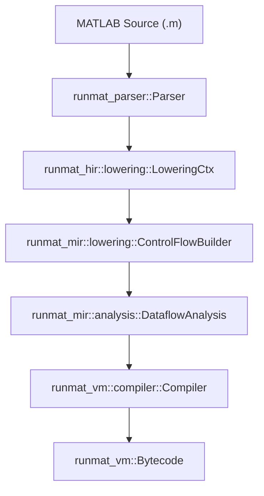
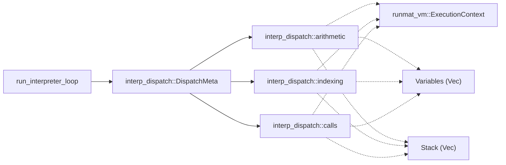

# Glossary

<details>
<summary>Relevant source files</summary>

- [Cargo.lock](https://github.com/runmat-org/runmat/blob/82685330/Cargo.lock)
- [Cargo.toml](https://github.com/runmat-org/runmat/blob/82685330/Cargo.toml)
- [bindings/ts/README.md](https://github.com/runmat-org/runmat/blob/82685330/bindings/ts/README.md?plain=1)
- [bindings/ts/src/index.spec.ts](https://github.com/runmat-org/runmat/blob/82685330/bindings/ts/src/index.spec.ts)
- [bindings/ts/src/index.ts](https://github.com/runmat-org/runmat/blob/82685330/bindings/ts/src/index.ts)
- [crates/runmat-accelerate/Cargo.toml](https://github.com/runmat-org/runmat/blob/82685330/crates/runmat-accelerate/Cargo.toml)
- [crates/runmat-builtins/Cargo.toml](https://github.com/runmat-org/runmat/blob/82685330/crates/runmat-builtins/Cargo.toml)
- [crates/runmat-cli/Cargo.toml](https://github.com/runmat-org/runmat/blob/82685330/crates/runmat-cli/Cargo.toml)
- [crates/runmat-cli/src/main.rs](https://github.com/runmat-org/runmat/blob/82685330/crates/runmat-cli/src/main.rs)
- [crates/runmat-core/Cargo.toml](https://github.com/runmat-org/runmat/blob/82685330/crates/runmat-core/Cargo.toml)
- [crates/runmat-core/src/execution/mod.rs](https://github.com/runmat-org/runmat/blob/82685330/crates/runmat-core/src/execution/mod.rs)
- [crates/runmat-core/src/execution/types.rs](https://github.com/runmat-org/runmat/blob/82685330/crates/runmat-core/src/execution/types.rs)
- [crates/runmat-core/src/fusion/mod.rs](https://github.com/runmat-org/runmat/blob/82685330/crates/runmat-core/src/fusion/mod.rs)
- [crates/runmat-core/src/fusion/snapshot.rs](https://github.com/runmat-org/runmat/blob/82685330/crates/runmat-core/src/fusion/snapshot.rs)
- [crates/runmat-core/src/fusion/types.rs](https://github.com/runmat-org/runmat/blob/82685330/crates/runmat-core/src/fusion/types.rs)
- [crates/runmat-core/src/lib.rs](https://github.com/runmat-org/runmat/blob/82685330/crates/runmat-core/src/lib.rs)
- [crates/runmat-core/src/profiling.rs](https://github.com/runmat-org/runmat/blob/82685330/crates/runmat-core/src/profiling.rs)
- [crates/runmat-core/src/session/compile.rs](https://github.com/runmat-org/runmat/blob/82685330/crates/runmat-core/src/session/compile.rs)
- [crates/runmat-core/src/session/config.rs](https://github.com/runmat-org/runmat/blob/82685330/crates/runmat-core/src/session/config.rs)
- [crates/runmat-core/src/session/mod.rs](https://github.com/runmat-org/runmat/blob/82685330/crates/runmat-core/src/session/mod.rs)
- [crates/runmat-core/src/session/run.rs](https://github.com/runmat-org/runmat/blob/82685330/crates/runmat-core/src/session/run.rs)
- [crates/runmat-core/src/session/snapshot.rs](https://github.com/runmat-org/runmat/blob/82685330/crates/runmat-core/src/session/snapshot.rs)
- [crates/runmat-core/src/session/workspace.rs](https://github.com/runmat-org/runmat/blob/82685330/crates/runmat-core/src/session/workspace.rs)
- [crates/runmat-core/src/tests.rs](https://github.com/runmat-org/runmat/blob/82685330/crates/runmat-core/src/tests.rs)
- [crates/runmat-core/src/workspace/emit.rs](https://github.com/runmat-org/runmat/blob/82685330/crates/runmat-core/src/workspace/emit.rs)
- [crates/runmat-core/src/workspace/mod.rs](https://github.com/runmat-org/runmat/blob/82685330/crates/runmat-core/src/workspace/mod.rs)
- [crates/runmat-core/tests/fusion_regressions.rs](https://github.com/runmat-org/runmat/blob/82685330/crates/runmat-core/tests/fusion_regressions.rs)
- [crates/runmat-gc/Cargo.toml](https://github.com/runmat-org/runmat/blob/82685330/crates/runmat-gc/Cargo.toml)
- [crates/runmat-hir/src/hir.rs](https://github.com/runmat-org/runmat/blob/82685330/crates/runmat-hir/src/hir.rs)
- [crates/runmat-hir/src/lowering/ctx.rs](https://github.com/runmat-org/runmat/blob/82685330/crates/runmat-hir/src/lowering/ctx.rs)
- [crates/runmat-lexer/Cargo.toml](https://github.com/runmat-org/runmat/blob/82685330/crates/runmat-lexer/Cargo.toml)
- [crates/runmat-lsp/Cargo.toml](https://github.com/runmat-org/runmat/blob/82685330/crates/runmat-lsp/Cargo.toml)
- [crates/runmat-macros/Cargo.toml](https://github.com/runmat-org/runmat/blob/82685330/crates/runmat-macros/Cargo.toml)
- [crates/runmat-mir/src/analysis/dataflow.rs](https://github.com/runmat-org/runmat/blob/82685330/crates/runmat-mir/src/analysis/dataflow.rs)
- [crates/runmat-mir/src/analysis/facts.rs](https://github.com/runmat-org/runmat/blob/82685330/crates/runmat-mir/src/analysis/facts.rs)
- [crates/runmat-mir/src/analysis/mod.rs](https://github.com/runmat-org/runmat/blob/82685330/crates/runmat-mir/src/analysis/mod.rs)
- [crates/runmat-mir/src/analysis/spawn_safety.rs](https://github.com/runmat-org/runmat/blob/82685330/crates/runmat-mir/src/analysis/spawn_safety.rs)
- [crates/runmat-mir/src/analysis/store.rs](https://github.com/runmat-org/runmat/blob/82685330/crates/runmat-mir/src/analysis/store.rs)
- [crates/runmat-mir/src/async_.rs](https://github.com/runmat-org/runmat/blob/82685330/crates/runmat-mir/src/async_.rs)
- [crates/runmat-mir/src/body.rs](https://github.com/runmat-org/runmat/blob/82685330/crates/runmat-mir/src/body.rs)
- [crates/runmat-mir/src/call.rs](https://github.com/runmat-org/runmat/blob/82685330/crates/runmat-mir/src/call.rs)
- [crates/runmat-mir/src/lowering/control_flow.rs](https://github.com/runmat-org/runmat/blob/82685330/crates/runmat-mir/src/lowering/control_flow.rs)
- [crates/runmat-mir/src/lowering/ctx.rs](https://github.com/runmat-org/runmat/blob/82685330/crates/runmat-mir/src/lowering/ctx.rs)
- [crates/runmat-mir/src/lowering/expr.rs](https://github.com/runmat-org/runmat/blob/82685330/crates/runmat-mir/src/lowering/expr.rs)
- [crates/runmat-mir/src/lowering/function.rs](https://github.com/runmat-org/runmat/blob/82685330/crates/runmat-mir/src/lowering/function.rs)
- [crates/runmat-mir/src/lowering/place.rs](https://github.com/runmat-org/runmat/blob/82685330/crates/runmat-mir/src/lowering/place.rs)
- [crates/runmat-mir/src/lowering/stmt.rs](https://github.com/runmat-org/runmat/blob/82685330/crates/runmat-mir/src/lowering/stmt.rs)
- [crates/runmat-mir/src/rvalue.rs](https://github.com/runmat-org/runmat/blob/82685330/crates/runmat-mir/src/rvalue.rs)
- [crates/runmat-mir/src/stmt.rs](https://github.com/runmat-org/runmat/blob/82685330/crates/runmat-mir/src/stmt.rs)
- [crates/runmat-mir/src/terminator.rs](https://github.com/runmat-org/runmat/blob/82685330/crates/runmat-mir/src/terminator.rs)
- [crates/runmat-mir/tests/lowering.rs](https://github.com/runmat-org/runmat/blob/82685330/crates/runmat-mir/tests/lowering.rs)
- [crates/runmat-parser/Cargo.toml](https://github.com/runmat-org/runmat/blob/82685330/crates/runmat-parser/Cargo.toml)
- [crates/runmat-plot/Cargo.toml](https://github.com/runmat-org/runmat/blob/82685330/crates/runmat-plot/Cargo.toml)
- [crates/runmat-plot/src/core/plot_renderer.rs](https://github.com/runmat-org/runmat/blob/82685330/crates/runmat-plot/src/core/plot_renderer.rs)
- [crates/runmat-plot/src/event.rs](https://github.com/runmat-org/runmat/blob/82685330/crates/runmat-plot/src/event.rs)
- [crates/runmat-plot/src/gui/plot_overlay.rs](https://github.com/runmat-org/runmat/blob/82685330/crates/runmat-plot/src/gui/plot_overlay.rs)
- [crates/runmat-plot/src/plots/figure.rs](https://github.com/runmat-org/runmat/blob/82685330/crates/runmat-plot/src/plots/figure.rs)
- [crates/runmat-plot/src/plots/mod.rs](https://github.com/runmat-org/runmat/blob/82685330/crates/runmat-plot/src/plots/mod.rs)
- [crates/runmat-runtime/Cargo.toml](https://github.com/runmat-org/runmat/blob/82685330/crates/runmat-runtime/Cargo.toml)
- [crates/runmat-runtime/src/builtins/acceleration/gpu/arrayfun.rs](https://github.com/runmat-org/runmat/blob/82685330/crates/runmat-runtime/src/builtins/acceleration/gpu/arrayfun.rs)
- [crates/runmat-runtime/src/builtins/cells/core/cellfun.rs](https://github.com/runmat-org/runmat/blob/82685330/crates/runmat-runtime/src/builtins/cells/core/cellfun.rs)
- [crates/runmat-runtime/src/builtins/plotting/core/properties.rs](https://github.com/runmat-org/runmat/blob/82685330/crates/runmat-runtime/src/builtins/plotting/core/properties.rs)
- [crates/runmat-runtime/src/builtins/plotting/core/state.rs](https://github.com/runmat-org/runmat/blob/82685330/crates/runmat-runtime/src/builtins/plotting/core/state.rs)
- [crates/runmat-runtime/src/builtins/plotting/core/web.rs](https://github.com/runmat-org/runmat/blob/82685330/crates/runmat-runtime/src/builtins/plotting/core/web.rs)
- [crates/runmat-runtime/src/builtins/plotting/mod.rs](https://github.com/runmat-org/runmat/blob/82685330/crates/runmat-runtime/src/builtins/plotting/mod.rs)
- [crates/runmat-runtime/src/builtins/plotting/ops/get.rs](https://github.com/runmat-org/runmat/blob/82685330/crates/runmat-runtime/src/builtins/plotting/ops/get.rs)
- [crates/runmat-runtime/src/builtins/plotting/ops/set.rs](https://github.com/runmat-org/runmat/blob/82685330/crates/runmat-runtime/src/builtins/plotting/ops/set.rs)
- [crates/runmat-runtime/src/lib.rs](https://github.com/runmat-org/runmat/blob/82685330/crates/runmat-runtime/src/lib.rs)
- [crates/runmat-runtime/src/user_functions.rs](https://github.com/runmat-org/runmat/blob/82685330/crates/runmat-runtime/src/user_functions.rs)
- [crates/runmat-snapshot/Cargo.toml](https://github.com/runmat-org/runmat/blob/82685330/crates/runmat-snapshot/Cargo.toml)
- [crates/runmat-turbine/Cargo.toml](https://github.com/runmat-org/runmat/blob/82685330/crates/runmat-turbine/Cargo.toml)
- [crates/runmat-turbine/src/compiler.rs](https://github.com/runmat-org/runmat/blob/82685330/crates/runmat-turbine/src/compiler.rs)
- [crates/runmat-turbine/src/lib.rs](https://github.com/runmat-org/runmat/blob/82685330/crates/runmat-turbine/src/lib.rs)
- [crates/runmat-turbine/tests/jit.rs](https://github.com/runmat-org/runmat/blob/82685330/crates/runmat-turbine/tests/jit.rs)
- [crates/runmat-vm/src/bytecode/compile.rs](https://github.com/runmat-org/runmat/blob/82685330/crates/runmat-vm/src/bytecode/compile.rs)
- [crates/runmat-vm/src/bytecode/instr.rs](https://github.com/runmat-org/runmat/blob/82685330/crates/runmat-vm/src/bytecode/instr.rs)
- [crates/runmat-vm/src/bytecode/mod.rs](https://github.com/runmat-org/runmat/blob/82685330/crates/runmat-vm/src/bytecode/mod.rs)
- [crates/runmat-vm/src/bytecode/program.rs](https://github.com/runmat-org/runmat/blob/82685330/crates/runmat-vm/src/bytecode/program.rs)
- [crates/runmat-vm/src/call/closures.rs](https://github.com/runmat-org/runmat/blob/82685330/crates/runmat-vm/src/call/closures.rs)
- [crates/runmat-vm/src/call/descriptor.rs](https://github.com/runmat-org/runmat/blob/82685330/crates/runmat-vm/src/call/descriptor.rs)
- [crates/runmat-vm/src/call/shared.rs](https://github.com/runmat-org/runmat/blob/82685330/crates/runmat-vm/src/call/shared.rs)
- [crates/runmat-vm/src/compiler/core.rs](https://github.com/runmat-org/runmat/blob/82685330/crates/runmat-vm/src/compiler/core.rs)
- [crates/runmat-vm/src/interpreter/dispatch/calls.rs](https://github.com/runmat-org/runmat/blob/82685330/crates/runmat-vm/src/interpreter/dispatch/calls.rs)
- [crates/runmat-vm/src/interpreter/dispatch/indexing.rs](https://github.com/runmat-org/runmat/blob/82685330/crates/runmat-vm/src/interpreter/dispatch/indexing.rs)
- [crates/runmat-vm/src/interpreter/dispatch/mod.rs](https://github.com/runmat-org/runmat/blob/82685330/crates/runmat-vm/src/interpreter/dispatch/mod.rs)
- [crates/runmat-vm/src/interpreter/runner.rs](https://github.com/runmat-org/runmat/blob/82685330/crates/runmat-vm/src/interpreter/runner.rs)
- [crates/runmat-vm/src/interpreter/state.rs](https://github.com/runmat-org/runmat/blob/82685330/crates/runmat-vm/src/interpreter/state.rs)
- [crates/runmat-vm/src/lib.rs](https://github.com/runmat-org/runmat/blob/82685330/crates/runmat-vm/src/lib.rs)
- [crates/runmat-vm/src/ops/cells.rs](https://github.com/runmat-org/runmat/blob/82685330/crates/runmat-vm/src/ops/cells.rs)
- [crates/runmat-vm/tests/functions.rs](https://github.com/runmat-org/runmat/blob/82685330/crates/runmat-vm/tests/functions.rs)
- [crates/runmat-wasm/Cargo.toml](https://github.com/runmat-org/runmat/blob/82685330/crates/runmat-wasm/Cargo.toml)
- [crates/runmat-wasm/src/api/session.rs](https://github.com/runmat-org/runmat/blob/82685330/crates/runmat-wasm/src/api/session.rs)
- [crates/runmat-wasm/src/lib.rs](https://github.com/runmat-org/runmat/blob/82685330/crates/runmat-wasm/src/lib.rs)
- [crates/runmat-wasm/src/wire/payloads.rs](https://github.com/runmat-org/runmat/blob/82685330/crates/runmat-wasm/src/wire/payloads.rs)
- [docs-tmp/COMPLETION_AUDIT.md](https://github.com/runmat-org/runmat/blob/82685330/docs-tmp/COMPLETION_AUDIT.md?plain=1)
- [docs-tmp/DELIVERABLE_AUDIT.md](https://github.com/runmat-org/runmat/blob/82685330/docs-tmp/DELIVERABLE_AUDIT.md?plain=1)
- [docs-tmp/NEXT_STEPS.md](https://github.com/runmat-org/runmat/blob/82685330/docs-tmp/NEXT_STEPS.md?plain=1)
- [docs-tmp/PROGRESS.md](https://github.com/runmat-org/runmat/blob/82685330/docs-tmp/PROGRESS.md?plain=1)

</details>

This page provides technical definitions for codebase-specific terminology, architectural concepts, and domain-specific abbreviations used within the RunMat project. It serves as a primary reference for engineers to bridge the gap between high-level MATLAB concepts and their low-level implementation in Rust.

## Core Compilation Terms

### HIR (High-Level IR)

The first intermediate representation after parsing. HIR is responsible for scope resolution, identifying lexical captures for closures, and mapping source-level identifiers to unique `BindingId`s.

- Implementation: Defined in `runmat-hir`. The `HirAssembly` struct acts as the container for a compiled unit.
- Key Logic: The `LoweringCtx` manages the state machine for converting an AST into HIR, handling import conflicts and isolated function capture rules.
- Code Pointers: [crates/runmat-hir/src/hir.rs #1-10](https://github.com/runmat-org/runmat/blob/82685330/crates/runmat-hir/src/hir.rs#L1-L10) [crates/runmat-hir/src/lowering/ctx.rs #1-50](https://github.com/runmat-org/runmat/blob/82685330/crates/runmat-hir/src/lowering/ctx.rs#L1-L50)

### MIR (Mid-Level IR)

A control-flow graph (CFG) based representation used for static analysis and as the input for bytecode generation. MIR flattens complex MATLAB expressions into basic blocks and linear statements.

- Implementation: Defined in `runmat-mir`.
- Data Flow: `MirBody` contains `BasicBlock`s, which consist of `MirStmt`s and a `MirTerminator`.
- Code Pointers: [crates/runmat-mir/src/lowering/expr.rs #1-40](https://github.com/runmat-org/runmat/blob/82685330/crates/runmat-mir/src/lowering/expr.rs#L1-L40) [crates/runmat-mir/src/lowering/control_flow.rs #1-30](https://github.com/runmat-org/runmat/blob/82685330/crates/runmat-mir/src/lowering/control_flow.rs#L1-L30)

### Semantic Fact / Analysis Store

Data derived during the `runtime.analyze` stage of the pipeline. It includes definite assignment facts, type/shape inference, and spawn-safety metadata.

- Implementation: The `AnalysisStore` is populated by dataflow analyses over MIR.
- Code Pointers: [crates/runmat-mir/src/analysis/dataflow.rs #1-20](https://github.com/runmat-org/runmat/blob/82685330/crates/runmat-mir/src/analysis/dataflow.rs#L1-L20) [docs-tmp/DELIVERABLE_AUDIT.md #23-28](https://github.com/runmat-org/runmat/blob/82685330/docs-tmp/DELIVERABLE_AUDIT.md?plain=1#L23-L28)

### Compilation Pipeline Flow

The following diagram illustrates the transformation of source text into executable bytecode.

Title: Source to Bytecode Transformation



<details>
<summary>Rendered SVG</summary>

```svg
<svg id="mermaid-70amhao7fgq" xmlns="http://www.w3.org/2000/svg" xmlns:xlink="http://www.w3.org/1999/xlink" class="flowchart" style="max-width: 100%; touch-action: none; user-select: none; cursor: grab; min-height: fit-content; max-height: 100%;" viewBox="-93.99454174560799 0 633.723458491216 914" role="graphics-document document" aria-roledescription="flowchart-v2" preserveAspectRatio="xMidYMid meet"><style>#mermaid-70amhao7fgq{font-family:ui-sans-serif,-apple-system,system-ui,Segoe UI,Helvetica;font-size:16px;fill:#ccc;}@keyframes edge-animation-frame{from{stroke-dashoffset:0;}}@keyframes dash{to{stroke-dashoffset:0;}}#mermaid-70amhao7fgq .edge-animation-slow{stroke-dasharray:9,5!important;stroke-dashoffset:900;animation:dash 50s linear infinite;stroke-linecap:round;}#mermaid-70amhao7fgq .edge-animation-fast{stroke-dasharray:9,5!important;stroke-dashoffset:900;animation:dash 20s linear infinite;stroke-linecap:round;}#mermaid-70amhao7fgq .error-icon{fill:#333;}#mermaid-70amhao7fgq .error-text{fill:#cccccc;stroke:#cccccc;}#mermaid-70amhao7fgq .edge-thickness-normal{stroke-width:1px;}#mermaid-70amhao7fgq .edge-thickness-thick{stroke-width:3.5px;}#mermaid-70amhao7fgq .edge-pattern-solid{stroke-dasharray:0;}#mermaid-70amhao7fgq .edge-thickness-invisible{stroke-width:0;fill:none;}#mermaid-70amhao7fgq .edge-pattern-dashed{stroke-dasharray:3;}#mermaid-70amhao7fgq .edge-pattern-dotted{stroke-dasharray:2;}#mermaid-70amhao7fgq .marker{fill:#666;stroke:#666;}#mermaid-70amhao7fgq .marker.cross{stroke:#666;}#mermaid-70amhao7fgq svg{font-family:ui-sans-serif,-apple-system,system-ui,Segoe UI,Helvetica;font-size:16px;}#mermaid-70amhao7fgq p{margin:0;}#mermaid-70amhao7fgq .label{font-family:ui-sans-serif,-apple-system,system-ui,Segoe UI,Helvetica;color:#fff;}#mermaid-70amhao7fgq .cluster-label text{fill:#fff;}#mermaid-70amhao7fgq .cluster-label span{color:#fff;}#mermaid-70amhao7fgq .cluster-label span p{background-color:transparent;}#mermaid-70amhao7fgq .label text,#mermaid-70amhao7fgq span{fill:#fff;color:#fff;}#mermaid-70amhao7fgq .node rect,#mermaid-70amhao7fgq .node circle,#mermaid-70amhao7fgq .node ellipse,#mermaid-70amhao7fgq .node polygon,#mermaid-70amhao7fgq .node path{fill:#111;stroke:#222;stroke-width:1px;}#mermaid-70amhao7fgq .rough-node .label text,#mermaid-70amhao7fgq .node .label text,#mermaid-70amhao7fgq .image-shape .label,#mermaid-70amhao7fgq .icon-shape .label{text-anchor:middle;}#mermaid-70amhao7fgq .node .katex path{fill:#000;stroke:#000;stroke-width:1px;}#mermaid-70amhao7fgq .rough-node .label,#mermaid-70amhao7fgq .node .label,#mermaid-70amhao7fgq .image-shape .label,#mermaid-70amhao7fgq .icon-shape .label{text-align:center;}#mermaid-70amhao7fgq .node.clickable{cursor:pointer;}#mermaid-70amhao7fgq .root .anchor path{fill:#666!important;stroke-width:0;stroke:#666;}#mermaid-70amhao7fgq .arrowheadPath{fill:#0b0b0b;}#mermaid-70amhao7fgq .edgePath .path{stroke:#666;stroke-width:1px;}#mermaid-70amhao7fgq .flowchart-link{stroke:#666;fill:none;}#mermaid-70amhao7fgq .edgeLabel{background-color:#161616;text-align:center;}#mermaid-70amhao7fgq .edgeLabel p{background-color:#161616;}#mermaid-70amhao7fgq .edgeLabel rect{opacity:0.5;background-color:#161616;fill:#161616;}#mermaid-70amhao7fgq .labelBkg{background-color:rgba(22, 22, 22, 0.5);}#mermaid-70amhao7fgq .cluster rect{fill:#161616;stroke:#222;stroke-width:1px;}#mermaid-70amhao7fgq .cluster text{fill:#fff;}#mermaid-70amhao7fgq .cluster span{color:#fff;}#mermaid-70amhao7fgq div.mermaidTooltip{position:absolute;text-align:center;max-width:200px;padding:2px;font-family:ui-sans-serif,-apple-system,system-ui,Segoe UI,Helvetica;font-size:12px;background:#333;border:1px solid hsl(0, 0%, 10%);border-radius:2px;pointer-events:none;z-index:100;}#mermaid-70amhao7fgq .flowchartTitleText{text-anchor:middle;font-size:18px;fill:#ccc;}#mermaid-70amhao7fgq rect.text{fill:none;stroke-width:0;}#mermaid-70amhao7fgq .icon-shape,#mermaid-70amhao7fgq .image-shape{background-color:#161616;text-align:center;}#mermaid-70amhao7fgq .icon-shape p,#mermaid-70amhao7fgq .image-shape p{background-color:#161616;padding:2px;}#mermaid-70amhao7fgq .icon-shape .label rect,#mermaid-70amhao7fgq .image-shape .label rect{opacity:0.5;background-color:#161616;fill:#161616;}#mermaid-70amhao7fgq .label-icon{display:inline-block;height:1em;overflow:visible;vertical-align:-0.125em;}#mermaid-70amhao7fgq .node .label-icon path{fill:currentColor;stroke:revert;stroke-width:revert;}#mermaid-70amhao7fgq .node .neo-node{stroke:#222;}#mermaid-70amhao7fgq [data-look="neo"].node rect,#mermaid-70amhao7fgq [data-look="neo"].cluster rect,#mermaid-70amhao7fgq [data-look="neo"].node polygon{stroke:url(#mermaid-70amhao7fgq-gradient);filter:drop-shadow( 1px 2px 2px rgba(185,185,185,1));}#mermaid-70amhao7fgq [data-look="neo"].node path{stroke:url(#mermaid-70amhao7fgq-gradient);stroke-width:1px;}#mermaid-70amhao7fgq [data-look="neo"].node .outer-path{filter:drop-shadow( 1px 2px 2px rgba(185,185,185,1));}#mermaid-70amhao7fgq [data-look="neo"].node .neo-line path{stroke:#222;filter:none;}#mermaid-70amhao7fgq [data-look="neo"].node circle{stroke:url(#mermaid-70amhao7fgq-gradient);filter:drop-shadow( 1px 2px 2px rgba(185,185,185,1));}#mermaid-70amhao7fgq [data-look="neo"].node circle .state-start{fill:#000000;}#mermaid-70amhao7fgq [data-look="neo"].icon-shape .icon{fill:url(#mermaid-70amhao7fgq-gradient);filter:drop-shadow( 1px 2px 2px rgba(185,185,185,1));}#mermaid-70amhao7fgq [data-look="neo"].icon-shape .icon-neo path{stroke:url(#mermaid-70amhao7fgq-gradient);filter:drop-shadow( 1px 2px 2px rgba(185,185,185,1));}#mermaid-70amhao7fgq :root{--mermaid-font-family:"trebuchet ms",verdana,arial,sans-serif;}</style><g><marker id="mermaid-70amhao7fgq_flowchart-v2-pointEnd" class="marker flowchart-v2" viewBox="0 0 10 10" refX="5" refY="5" markerUnits="userSpaceOnUse" markerWidth="8" markerHeight="8" orient="auto"><path d="M 0 0 L 10 5 L 0 10 z" class="arrowMarkerPath" style="stroke-width: 1; stroke-dasharray: 1, 0;"></path></marker><marker id="mermaid-70amhao7fgq_flowchart-v2-pointStart" class="marker flowchart-v2" viewBox="0 0 10 10" refX="4.5" refY="5" markerUnits="userSpaceOnUse" markerWidth="8" markerHeight="8" orient="auto"><path d="M 0 5 L 10 10 L 10 0 z" class="arrowMarkerPath" style="stroke-width: 1; stroke-dasharray: 1, 0;"></path></marker><marker id="mermaid-70amhao7fgq_flowchart-v2-pointEnd-margin" class="marker flowchart-v2" viewBox="0 0 11.5 14" refX="11.5" refY="7" markerUnits="userSpaceOnUse" markerWidth="10.5" markerHeight="14" orient="auto"><path d="M 0 0 L 11.5 7 L 0 14 z" class="arrowMarkerPath" style="stroke-width: 0; stroke-dasharray: 1, 0;"></path></marker><marker id="mermaid-70amhao7fgq_flowchart-v2-pointStart-margin" class="marker flowchart-v2" viewBox="0 0 11.5 14" refX="1" refY="7" markerUnits="userSpaceOnUse" markerWidth="11.5" markerHeight="14" orient="auto"><polygon points="0,7 11.5,14 11.5,0" class="arrowMarkerPath" style="stroke-width: 0; stroke-dasharray: 1, 0;"></polygon></marker><marker id="mermaid-70amhao7fgq_flowchart-v2-circleEnd" class="marker flowchart-v2" viewBox="0 0 10 10" refX="11" refY="5" markerUnits="userSpaceOnUse" markerWidth="11" markerHeight="11" orient="auto"><circle cx="5" cy="5" r="5" class="arrowMarkerPath" style="stroke-width: 1; stroke-dasharray: 1, 0;"></circle></marker><marker id="mermaid-70amhao7fgq_flowchart-v2-circleStart" class="marker flowchart-v2" viewBox="0 0 10 10" refX="-1" refY="5" markerUnits="userSpaceOnUse" markerWidth="11" markerHeight="11" orient="auto"><circle cx="5" cy="5" r="5" class="arrowMarkerPath" style="stroke-width: 1; stroke-dasharray: 1, 0;"></circle></marker><marker id="mermaid-70amhao7fgq_flowchart-v2-circleEnd-margin" class="marker flowchart-v2" viewBox="0 0 10 10" refY="5" refX="12.25" markerUnits="userSpaceOnUse" markerWidth="14" markerHeight="14" orient="auto"><circle cx="5" cy="5" r="5" class="arrowMarkerPath" style="stroke-width: 0; stroke-dasharray: 1, 0;"></circle></marker><marker id="mermaid-70amhao7fgq_flowchart-v2-circleStart-margin" class="marker flowchart-v2" viewBox="0 0 10 10" refX="-2" refY="5" markerUnits="userSpaceOnUse" markerWidth="14" markerHeight="14" orient="auto"><circle cx="5" cy="5" r="5" class="arrowMarkerPath" style="stroke-width: 0; stroke-dasharray: 1, 0;"></circle></marker><marker id="mermaid-70amhao7fgq_flowchart-v2-crossEnd" class="marker cross flowchart-v2" viewBox="0 0 11 11" refX="12" refY="5.2" markerUnits="userSpaceOnUse" markerWidth="11" markerHeight="11" orient="auto"><path d="M 1,1 l 9,9 M 10,1 l -9,9" class="arrowMarkerPath" style="stroke-width: 2; stroke-dasharray: 1, 0;"></path></marker><marker id="mermaid-70amhao7fgq_flowchart-v2-crossStart" class="marker cross flowchart-v2" viewBox="0 0 11 11" refX="-1" refY="5.2" markerUnits="userSpaceOnUse" markerWidth="11" markerHeight="11" orient="auto"><path d="M 1,1 l 9,9 M 10,1 l -9,9" class="arrowMarkerPath" style="stroke-width: 2; stroke-dasharray: 1, 0;"></path></marker><marker id="mermaid-70amhao7fgq_flowchart-v2-crossEnd-margin" class="marker cross flowchart-v2" viewBox="0 0 15 15" refX="17.7" refY="7.5" markerUnits="userSpaceOnUse" markerWidth="12" markerHeight="12" orient="auto"><path d="M 1,1 L 14,14 M 1,14 L 14,1" class="arrowMarkerPath" style="stroke-width: 2.5;"></path></marker><marker id="mermaid-70amhao7fgq_flowchart-v2-crossStart-margin" class="marker cross flowchart-v2" viewBox="0 0 15 15" refX="-3.5" refY="7.5" markerUnits="userSpaceOnUse" markerWidth="12" markerHeight="12" orient="auto"><path d="M 1,1 L 14,14 M 1,14 L 14,1" class="arrowMarkerPath" style="stroke-width: 2.5; stroke-dasharray: 1, 0;"></path></marker><g class="root"><g class="clusters"><g class="cluster" id="mermaid-70amhao7fgq-subGraph1" data-look="classic"><rect style="" x="8" y="162" width="429.734375" height="616"></rect><g class="cluster-label" transform="translate(156.078125, 162)"><foreignObject width="133.578125" height="24"><div style="display: table-cell; white-space: nowrap; line-height: 1.5;" xmlns="http://www.w3.org/1999/xhtml"><span class="nodeLabel"><p>Code Entity Space</p></span></div></foreignObject></g></g><g class="cluster" id="mermaid-70amhao7fgq-subGraph0" data-look="classic"><rect style="" x="82.28125" y="8" width="281.171875" height="104"></rect><g class="cluster-label" transform="translate(101.921875, 8)"><foreignObject width="241.890625" height="24"><div style="display: table-cell; white-space: nowrap; line-height: 1.5;" xmlns="http://www.w3.org/1999/xhtml"><span class="nodeLabel"><p>Natural Language / Source Space</p></span></div></foreignObject></g></g></g><g class="edgePaths"><path d="M222.867,87L222.867,91.167C222.867,95.333,222.867,103.667,222.867,112C222.867,120.333,222.867,128.667,222.867,137C222.867,145.333,222.867,153.667,222.867,161.333C222.867,169,222.867,176,222.867,179.5L222.867,183" id="mermaid-70amhao7fgq-L_A_B_0" class="edge-thickness-normal edge-pattern-solid edge-thickness-normal edge-pattern-solid flowchart-link" style=";" data-edge="true" data-et="edge" data-id="L_A_B_0" data-points="W3sieCI6MjIyLjg2NzE4NzUsInkiOjg3fSx7IngiOjIyMi44NjcxODc1LCJ5IjoxMTJ9LHsieCI6MjIyLjg2NzE4NzUsInkiOjEzN30seyJ4IjoyMjIuODY3MTg3NSwieSI6MTYyfSx7IngiOjIyMi44NjcxODc1LCJ5IjoxODd9XQ==" data-look="classic" marker-end="url(#mermaid-70amhao7fgq_flowchart-v2-pointEnd)"></path><path d="M222.867,241L222.867,247.167C222.867,253.333,222.867,265.667,222.867,277.333C222.867,289,222.867,300,222.867,305.5L222.867,311" id="mermaid-70amhao7fgq-L_B_C_0" class="edge-thickness-normal edge-pattern-solid edge-thickness-normal edge-pattern-solid flowchart-link" style=";" data-edge="true" data-et="edge" data-id="L_B_C_0" data-points="W3sieCI6MjIyLjg2NzE4NzUsInkiOjI0MX0seyJ4IjoyMjIuODY3MTg3NSwieSI6Mjc4fSx7IngiOjIyMi44NjcxODc1LCJ5IjozMTV9XQ==" data-look="classic" marker-end="url(#mermaid-70amhao7fgq_flowchart-v2-pointEnd)"></path><path d="M222.867,369L222.867,375.167C222.867,381.333,222.867,393.667,222.867,405.333C222.867,417,222.867,428,222.867,433.5L222.867,439" id="mermaid-70amhao7fgq-L_C_D_0" class="edge-thickness-normal edge-pattern-solid edge-thickness-normal edge-pattern-solid flowchart-link" style=";" data-edge="true" data-et="edge" data-id="L_C_D_0" data-points="W3sieCI6MjIyLjg2NzE4NzUsInkiOjM2OX0seyJ4IjoyMjIuODY3MTg3NSwieSI6NDA2fSx7IngiOjIyMi44NjcxODc1LCJ5Ijo0NDN9XQ==" data-look="classic" marker-end="url(#mermaid-70amhao7fgq_flowchart-v2-pointEnd)"></path><path d="M222.867,497L222.867,503.167C222.867,509.333,222.867,521.667,222.867,533.333C222.867,545,222.867,556,222.867,561.5L222.867,567" id="mermaid-70amhao7fgq-L_D_E_0" class="edge-thickness-normal edge-pattern-solid edge-thickness-normal edge-pattern-solid flowchart-link" style=";" data-edge="true" data-et="edge" data-id="L_D_E_0" data-points="W3sieCI6MjIyLjg2NzE4NzUsInkiOjQ5N30seyJ4IjoyMjIuODY3MTg3NSwieSI6NTM0fSx7IngiOjIyMi44NjcxODc1LCJ5Ijo1NzF9XQ==" data-look="classic" marker-end="url(#mermaid-70amhao7fgq_flowchart-v2-pointEnd)"></path><path d="M222.867,625L222.867,631.167C222.867,637.333,222.867,649.667,222.867,661.333C222.867,673,222.867,684,222.867,689.5L222.867,695" id="mermaid-70amhao7fgq-L_E_F_0" class="edge-thickness-normal edge-pattern-solid edge-thickness-normal edge-pattern-solid flowchart-link" style=";" data-edge="true" data-et="edge" data-id="L_E_F_0" data-points="W3sieCI6MjIyLjg2NzE4NzUsInkiOjYyNX0seyJ4IjoyMjIuODY3MTg3NSwieSI6NjYyfSx7IngiOjIyMi44NjcxODc1LCJ5Ijo2OTl9XQ==" data-look="classic" marker-end="url(#mermaid-70amhao7fgq_flowchart-v2-pointEnd)"></path><path d="M222.867,753L222.867,757.167C222.867,761.333,222.867,769.667,222.867,780C222.867,790.333,222.867,802.667,222.867,814.333C222.867,826,222.867,837,222.867,842.5L222.867,848" id="mermaid-70amhao7fgq-L_F_G_0" class="edge-thickness-normal edge-pattern-solid edge-thickness-normal edge-pattern-solid flowchart-link" style=";" data-edge="true" data-et="edge" data-id="L_F_G_0" data-points="W3sieCI6MjIyLjg2NzE4NzUsInkiOjc1M30seyJ4IjoyMjIuODY3MTg3NSwieSI6Nzc4fSx7IngiOjIyMi44NjcxODc1LCJ5Ijo4MTV9LHsieCI6MjIyLjg2NzE4NzUsInkiOjg1Mn1d" data-look="classic" marker-end="url(#mermaid-70amhao7fgq_flowchart-v2-pointEnd)"></path></g><g class="edgeLabels"><g class="edgeLabel"><g class="label" data-id="L_A_B_0" transform="translate(0, 0)"><foreignObject width="0" height="0"><div style="display: table-cell; white-space: nowrap; line-height: 1.5; max-width: 200px; text-align: center;" xmlns="http://www.w3.org/1999/xhtml" class="labelBkg"><span class="edgeLabel"></span></div></foreignObject></g></g><g class="edgeLabel" transform="translate(222.8671875, 278)"><g class="label" data-id="L_B_C_0" transform="translate(-15.09375, -12)"><foreignObject width="30.1875" height="24"><div style="display: table-cell; white-space: nowrap; line-height: 1.5; max-width: 200px; text-align: center;" xmlns="http://www.w3.org/1999/xhtml" class="labelBkg"><span class="edgeLabel"><p>AST</p></span></div></foreignObject></g></g><g class="edgeLabel" transform="translate(222.8671875, 406)"><g class="label" data-id="L_C_D_0" transform="translate(-45.3515625, -12)"><foreignObject width="90.703125" height="24"><div style="display: table-cell; white-space: nowrap; line-height: 1.5; max-width: 200px; text-align: center;" xmlns="http://www.w3.org/1999/xhtml" class="labelBkg"><span class="edgeLabel"><p>HirAssembly</p></span></div></foreignObject></g></g><g class="edgeLabel" transform="translate(222.8671875, 534)"><g class="label" data-id="L_D_E_0" transform="translate(-46.40625, -12)"><foreignObject width="92.8125" height="24"><div style="display: table-cell; white-space: nowrap; line-height: 1.5; max-width: 200px; text-align: center;" xmlns="http://www.w3.org/1999/xhtml" class="labelBkg"><span class="edgeLabel"><p>MirAssembly</p></span></div></foreignObject></g></g><g class="edgeLabel" transform="translate(222.8671875, 662)"><g class="label" data-id="L_E_F_0" transform="translate(-49.21875, -12)"><foreignObject width="98.4375" height="24"><div style="display: table-cell; white-space: nowrap; line-height: 1.5; max-width: 200px; text-align: center;" xmlns="http://www.w3.org/1999/xhtml" class="labelBkg"><span class="edgeLabel"><p>AnalysisStore</p></span></div></foreignObject></g></g><g class="edgeLabel" transform="translate(222.8671875, 815)"><g class="label" data-id="L_F_G_0" transform="translate(-34.4609375, -12)"><foreignObject width="68.921875" height="24"><div style="display: table-cell; white-space: nowrap; line-height: 1.5; max-width: 200px; text-align: center;" xmlns="http://www.w3.org/1999/xhtml" class="labelBkg"><span class="edgeLabel"><p>Bytecode</p></span></div></foreignObject></g></g></g><g class="nodes"><g class="node default" id="mermaid-70amhao7fgq-flowchart-A-0" data-look="classic" transform="translate(222.8671875, 60)"><rect class="basic label-container" style="" x="-105.5859375" y="-27" width="211.171875" height="54"></rect><g class="label" style="" transform="translate(-75.5859375, -12)"><rect></rect><foreignObject width="151.171875" height="24"><div style="display: table-cell; white-space: nowrap; line-height: 1.5; max-width: 200px; text-align: center;" xmlns="http://www.w3.org/1999/xhtml"><span class="nodeLabel"><p>MATLAB Source (.m)</p></span></div></foreignObject></g></g><g class="node default" id="mermaid-70amhao7fgq-flowchart-B-1" data-look="classic" transform="translate(222.8671875, 214)"><rect class="basic label-container" style="" x="-111.0625" y="-27" width="222.125" height="54"></rect><g class="label" style="" transform="translate(-81.0625, -12)"><rect></rect><foreignObject width="162.125" height="24"><div style="display: table-cell; white-space: nowrap; line-height: 1.5; max-width: 200px; text-align: center;" xmlns="http://www.w3.org/1999/xhtml"><span class="nodeLabel"><p>runmat_parser::Parser</p></span></div></foreignObject></g></g><g class="node default" id="mermaid-70amhao7fgq-flowchart-C-2" data-look="classic" transform="translate(222.8671875, 342)"><rect class="basic label-container" style="" x="-154.1015625" y="-27" width="308.203125" height="54"></rect><g class="label" style="" transform="translate(-124.1015625, -12)"><rect></rect><foreignObject width="248.203125" height="24"><div style="display: table; white-space: break-spaces; line-height: 1.5; max-width: 200px; text-align: center; width: 200px;" xmlns="http://www.w3.org/1999/xhtml"><span class="nodeLabel"><p>runmat_hir::lowering::LoweringCtx</p></span></div></foreignObject></g></g><g class="node default" id="mermaid-70amhao7fgq-flowchart-D-3" data-look="classic" transform="translate(222.8671875, 470)"><rect class="basic label-container" style="" x="-179.8671875" y="-27" width="359.734375" height="54"></rect><g class="label" style="" transform="translate(-149.8671875, -12)"><rect></rect><foreignObject width="299.734375" height="24"><div style="display: table; white-space: break-spaces; line-height: 1.5; max-width: 200px; text-align: center; width: 200px;" xmlns="http://www.w3.org/1999/xhtml"><span class="nodeLabel"><p>runmat_mir::lowering::ControlFlowBuilder</p></span></div></foreignObject></g></g><g class="node default" id="mermaid-70amhao7fgq-flowchart-E-4" data-look="classic" transform="translate(222.8671875, 598)"><rect class="basic label-container" style="" x="-170.734375" y="-27" width="341.46875" height="54"></rect><g class="label" style="" transform="translate(-140.734375, -12)"><rect></rect><foreignObject width="281.46875" height="24"><div style="display: table; white-space: break-spaces; line-height: 1.5; max-width: 200px; text-align: center; width: 200px;" xmlns="http://www.w3.org/1999/xhtml"><span class="nodeLabel"><p>runmat_mir::analysis::DataflowAnalysis</p></span></div></foreignObject></g></g><g class="node default" id="mermaid-70amhao7fgq-flowchart-F-5" data-look="classic" transform="translate(222.8671875, 726)"><rect class="basic label-container" style="" x="-144.21875" y="-27" width="288.4375" height="54"></rect><g class="label" style="" transform="translate(-114.21875, -12)"><rect></rect><foreignObject width="228.4375" height="24"><div style="display: table; white-space: break-spaces; line-height: 1.5; max-width: 200px; text-align: center; width: 200px;" xmlns="http://www.w3.org/1999/xhtml"><span class="nodeLabel"><p>runmat_vm::compiler::Compiler</p></span></div></foreignObject></g></g><g class="node default" id="mermaid-70amhao7fgq-flowchart-G-17" data-look="classic" transform="translate(222.8671875, 879)"><rect class="basic label-container" style="" x="-110.15625" y="-27" width="220.3125" height="54"></rect><g class="label" style="" transform="translate(-80.15625, -12)"><rect></rect><foreignObject width="160.3125" height="24"><div style="display: table-cell; white-space: nowrap; line-height: 1.5; max-width: 200px; text-align: center;" xmlns="http://www.w3.org/1999/xhtml"><span class="nodeLabel"><p>runmat_vm::Bytecode</p></span></div></foreignObject></g></g></g></g></g><defs><filter id="mermaid-70amhao7fgq-drop-shadow" height="130%" width="130%"><feDropShadow dx="4" dy="4" stdDeviation="0" flood-opacity="0.06" flood-color="#000000"></feDropShadow></filter></defs><defs><filter id="mermaid-70amhao7fgq-drop-shadow-small" height="150%" width="150%"><feDropShadow dx="2" dy="2" stdDeviation="0" flood-opacity="0.06" flood-color="#000000"></feDropShadow></filter></defs><linearGradient id="mermaid-70amhao7fgq-gradient" gradientUnits="objectBoundingBox" x1="0%" y1="0%" x2="100%" y2="0%"><stop offset="0%" stop-color="#333" stop-opacity="1"></stop><stop offset="100%" stop-color="hsl(-120, 0%, 3.3333333333%)" stop-opacity="1"></stop></linearGradient></svg>
```

</details>

Sources: [docs-tmp/DELIVERABLE_AUDIT.md #22-30](https://github.com/runmat-org/runmat/blob/82685330/docs-tmp/DELIVERABLE_AUDIT.md?plain=1#L22-L30) [crates/runmat-vm/src/bytecode/compile.rs #20-35](https://github.com/runmat-org/runmat/blob/82685330/crates/runmat-vm/src/bytecode/compile.rs#L20-L35)

## VM & Execution Terms

### Bytecode & Instr

The custom instruction set for the RunMat Virtual Machine. Unlike simple stack machines, RunMat bytecode includes typed instructions for MATLAB-specific operations like `CreateObjectLiteral` or `CallFevalMulti`.

- Implementation: `Instr` enum defines the opcode space.
- Code Pointers: [crates/runmat-vm/src/bytecode/instr.rs #1-50](https://github.com/runmat-org/runmat/blob/82685330/crates/runmat-vm/src/bytecode/instr.rs#L1-L50) [crates/runmat-vm/src/compiler/core.rs #45-48](https://github.com/runmat-org/runmat/blob/82685330/crates/runmat-vm/src/compiler/core.rs#L45-L48)

### Callable Identity

A unified enum used to identify any invokable entity, including built-ins, anonymous functions, class methods, and external packages.

- Implementation: `CallableIdentity` in `runmat-hir`.
- Resolution: Resolved at runtime via `CallableDescriptor`.
- Code Pointers: [crates/runmat-hir/src/hir.rs #7-9](https://github.com/runmat-org/runmat/blob/82685330/crates/runmat-hir/src/hir.rs#L7-L9) [crates/runmat-vm/src/call/descriptor.rs #60-70](https://github.com/runmat-org/runmat/blob/82685330/crates/runmat-vm/src/call/descriptor.rs#L60-L70)

### Index Plan

A structured representation of a MATLAB indexing operation (e.g., `A(1:end, :)`). It distinguishes between scalar, slice, and cell indexing.

- Implementation: `MirIndexPlan` and the VM's `IndexPlan`.
- Logic: Handles the `end` keyword resolution via `EndExpr` evaluation.
- Code Pointers: [crates/runmat-vm/src/interpreter/dispatch/indexing.rs #1-20](https://github.com/runmat-org/runmat/blob/82685330/crates/runmat-vm/src/interpreter/dispatch/indexing.rs#L1-L20) [crates/runmat-vm/src/compiler/core.rs #90-98](https://github.com/runmat-org/runmat/blob/82685330/crates/runmat-vm/src/compiler/core.rs#L90-L98)

## JIT & Acceleration Terms

### Turbine

The high-performance JIT compiler tier for RunMat, built on top of the Cranelift code generator. It targets numeric hotspots identified during interpreter execution.

- Implementation: `runmat-turbine` crate.
- Code Pointers: [crates/runmat-turbine/src/lib.rs #1-15](https://github.com/runmat-org/runmat/blob/82685330/crates/runmat-turbine/src/lib.rs#L1-L15) [crates/runmat-turbine/src/compiler.rs #1-20](https://github.com/runmat-org/runmat/blob/82685330/crates/runmat-turbine/src/compiler.rs#L1-L20)

### Fusion Engine

A subsystem that identifies sequences of element-wise or reduction operations that can be "fused" into a single GPU kernel execution to minimize memory bandwidth overhead.

- Implementation: `FusionCandidateGroups` and `FusionPlan` DAGs.
- Code Pointers: [crates/runmat-vm/src/bytecode/compile.rs #49-80](https://github.com/runmat-org/runmat/blob/82685330/crates/runmat-vm/src/bytecode/compile.rs#L49-L80) [crates/runmat-vm/src/compiler/core.rs #83-88](https://github.com/runmat-org/runmat/blob/82685330/crates/runmat-vm/src/compiler/core.rs#L83-L88)

### Execution Context & Dispatch

The runtime state and the mechanism for executing bytecode instructions.

Title: VM Execution & Dispatch Architecture



<details>
<summary>Rendered SVG</summary>

```svg
<svg id="mermaid-oq267qkosw" xmlns="http://www.w3.org/2000/svg" xmlns:xlink="http://www.w3.org/1999/xlink" class="flowchart" style="max-width: 100%; touch-action: none; user-select: none; cursor: grab; min-height: fit-content; max-height: 100%;" viewBox="-0.028550548340717796 2.842170943040401e-14 1290.8539760966814 471.99999999999994" role="graphics-document document" aria-roledescription="flowchart-v2" preserveAspectRatio="xMidYMid meet"><style>#mermaid-oq267qkosw{font-family:ui-sans-serif,-apple-system,system-ui,Segoe UI,Helvetica;font-size:16px;fill:#ccc;}@keyframes edge-animation-frame{from{stroke-dashoffset:0;}}@keyframes dash{to{stroke-dashoffset:0;}}#mermaid-oq267qkosw .edge-animation-slow{stroke-dasharray:9,5!important;stroke-dashoffset:900;animation:dash 50s linear infinite;stroke-linecap:round;}#mermaid-oq267qkosw .edge-animation-fast{stroke-dasharray:9,5!important;stroke-dashoffset:900;animation:dash 20s linear infinite;stroke-linecap:round;}#mermaid-oq267qkosw .error-icon{fill:#333;}#mermaid-oq267qkosw .error-text{fill:#cccccc;stroke:#cccccc;}#mermaid-oq267qkosw .edge-thickness-normal{stroke-width:1px;}#mermaid-oq267qkosw .edge-thickness-thick{stroke-width:3.5px;}#mermaid-oq267qkosw .edge-pattern-solid{stroke-dasharray:0;}#mermaid-oq267qkosw .edge-thickness-invisible{stroke-width:0;fill:none;}#mermaid-oq267qkosw .edge-pattern-dashed{stroke-dasharray:3;}#mermaid-oq267qkosw .edge-pattern-dotted{stroke-dasharray:2;}#mermaid-oq267qkosw .marker{fill:#666;stroke:#666;}#mermaid-oq267qkosw .marker.cross{stroke:#666;}#mermaid-oq267qkosw svg{font-family:ui-sans-serif,-apple-system,system-ui,Segoe UI,Helvetica;font-size:16px;}#mermaid-oq267qkosw p{margin:0;}#mermaid-oq267qkosw .label{font-family:ui-sans-serif,-apple-system,system-ui,Segoe UI,Helvetica;color:#fff;}#mermaid-oq267qkosw .cluster-label text{fill:#fff;}#mermaid-oq267qkosw .cluster-label span{color:#fff;}#mermaid-oq267qkosw .cluster-label span p{background-color:transparent;}#mermaid-oq267qkosw .label text,#mermaid-oq267qkosw span{fill:#fff;color:#fff;}#mermaid-oq267qkosw .node rect,#mermaid-oq267qkosw .node circle,#mermaid-oq267qkosw .node ellipse,#mermaid-oq267qkosw .node polygon,#mermaid-oq267qkosw .node path{fill:#111;stroke:#222;stroke-width:1px;}#mermaid-oq267qkosw .rough-node .label text,#mermaid-oq267qkosw .node .label text,#mermaid-oq267qkosw .image-shape .label,#mermaid-oq267qkosw .icon-shape .label{text-anchor:middle;}#mermaid-oq267qkosw .node .katex path{fill:#000;stroke:#000;stroke-width:1px;}#mermaid-oq267qkosw .rough-node .label,#mermaid-oq267qkosw .node .label,#mermaid-oq267qkosw .image-shape .label,#mermaid-oq267qkosw .icon-shape .label{text-align:center;}#mermaid-oq267qkosw .node.clickable{cursor:pointer;}#mermaid-oq267qkosw .root .anchor path{fill:#666!important;stroke-width:0;stroke:#666;}#mermaid-oq267qkosw .arrowheadPath{fill:#0b0b0b;}#mermaid-oq267qkosw .edgePath .path{stroke:#666;stroke-width:1px;}#mermaid-oq267qkosw .flowchart-link{stroke:#666;fill:none;}#mermaid-oq267qkosw .edgeLabel{background-color:#161616;text-align:center;}#mermaid-oq267qkosw .edgeLabel p{background-color:#161616;}#mermaid-oq267qkosw .edgeLabel rect{opacity:0.5;background-color:#161616;fill:#161616;}#mermaid-oq267qkosw .labelBkg{background-color:rgba(22, 22, 22, 0.5);}#mermaid-oq267qkosw .cluster rect{fill:#161616;stroke:#222;stroke-width:1px;}#mermaid-oq267qkosw .cluster text{fill:#fff;}#mermaid-oq267qkosw .cluster span{color:#fff;}#mermaid-oq267qkosw div.mermaidTooltip{position:absolute;text-align:center;max-width:200px;padding:2px;font-family:ui-sans-serif,-apple-system,system-ui,Segoe UI,Helvetica;font-size:12px;background:#333;border:1px solid hsl(0, 0%, 10%);border-radius:2px;pointer-events:none;z-index:100;}#mermaid-oq267qkosw .flowchartTitleText{text-anchor:middle;font-size:18px;fill:#ccc;}#mermaid-oq267qkosw rect.text{fill:none;stroke-width:0;}#mermaid-oq267qkosw .icon-shape,#mermaid-oq267qkosw .image-shape{background-color:#161616;text-align:center;}#mermaid-oq267qkosw .icon-shape p,#mermaid-oq267qkosw .image-shape p{background-color:#161616;padding:2px;}#mermaid-oq267qkosw .icon-shape .label rect,#mermaid-oq267qkosw .image-shape .label rect{opacity:0.5;background-color:#161616;fill:#161616;}#mermaid-oq267qkosw .label-icon{display:inline-block;height:1em;overflow:visible;vertical-align:-0.125em;}#mermaid-oq267qkosw .node .label-icon path{fill:currentColor;stroke:revert;stroke-width:revert;}#mermaid-oq267qkosw .node .neo-node{stroke:#222;}#mermaid-oq267qkosw [data-look="neo"].node rect,#mermaid-oq267qkosw [data-look="neo"].cluster rect,#mermaid-oq267qkosw [data-look="neo"].node polygon{stroke:url(#mermaid-oq267qkosw-gradient);filter:drop-shadow( 1px 2px 2px rgba(185,185,185,1));}#mermaid-oq267qkosw [data-look="neo"].node path{stroke:url(#mermaid-oq267qkosw-gradient);stroke-width:1px;}#mermaid-oq267qkosw [data-look="neo"].node .outer-path{filter:drop-shadow( 1px 2px 2px rgba(185,185,185,1));}#mermaid-oq267qkosw [data-look="neo"].node .neo-line path{stroke:#222;filter:none;}#mermaid-oq267qkosw [data-look="neo"].node circle{stroke:url(#mermaid-oq267qkosw-gradient);filter:drop-shadow( 1px 2px 2px rgba(185,185,185,1));}#mermaid-oq267qkosw [data-look="neo"].node circle .state-start{fill:#000000;}#mermaid-oq267qkosw [data-look="neo"].icon-shape .icon{fill:url(#mermaid-oq267qkosw-gradient);filter:drop-shadow( 1px 2px 2px rgba(185,185,185,1));}#mermaid-oq267qkosw [data-look="neo"].icon-shape .icon-neo path{stroke:url(#mermaid-oq267qkosw-gradient);filter:drop-shadow( 1px 2px 2px rgba(185,185,185,1));}#mermaid-oq267qkosw :root{--mermaid-font-family:"trebuchet ms",verdana,arial,sans-serif;}</style><g><marker id="mermaid-oq267qkosw_flowchart-v2-pointEnd" class="marker flowchart-v2" viewBox="0 0 10 10" refX="5" refY="5" markerUnits="userSpaceOnUse" markerWidth="8" markerHeight="8" orient="auto"><path d="M 0 0 L 10 5 L 0 10 z" class="arrowMarkerPath" style="stroke-width: 1; stroke-dasharray: 1, 0;"></path></marker><marker id="mermaid-oq267qkosw_flowchart-v2-pointStart" class="marker flowchart-v2" viewBox="0 0 10 10" refX="4.5" refY="5" markerUnits="userSpaceOnUse" markerWidth="8" markerHeight="8" orient="auto"><path d="M 0 5 L 10 10 L 10 0 z" class="arrowMarkerPath" style="stroke-width: 1; stroke-dasharray: 1, 0;"></path></marker><marker id="mermaid-oq267qkosw_flowchart-v2-pointEnd-margin" class="marker flowchart-v2" viewBox="0 0 11.5 14" refX="11.5" refY="7" markerUnits="userSpaceOnUse" markerWidth="10.5" markerHeight="14" orient="auto"><path d="M 0 0 L 11.5 7 L 0 14 z" class="arrowMarkerPath" style="stroke-width: 0; stroke-dasharray: 1, 0;"></path></marker><marker id="mermaid-oq267qkosw_flowchart-v2-pointStart-margin" class="marker flowchart-v2" viewBox="0 0 11.5 14" refX="1" refY="7" markerUnits="userSpaceOnUse" markerWidth="11.5" markerHeight="14" orient="auto"><polygon points="0,7 11.5,14 11.5,0" class="arrowMarkerPath" style="stroke-width: 0; stroke-dasharray: 1, 0;"></polygon></marker><marker id="mermaid-oq267qkosw_flowchart-v2-circleEnd" class="marker flowchart-v2" viewBox="0 0 10 10" refX="11" refY="5" markerUnits="userSpaceOnUse" markerWidth="11" markerHeight="11" orient="auto"><circle cx="5" cy="5" r="5" class="arrowMarkerPath" style="stroke-width: 1; stroke-dasharray: 1, 0;"></circle></marker><marker id="mermaid-oq267qkosw_flowchart-v2-circleStart" class="marker flowchart-v2" viewBox="0 0 10 10" refX="-1" refY="5" markerUnits="userSpaceOnUse" markerWidth="11" markerHeight="11" orient="auto"><circle cx="5" cy="5" r="5" class="arrowMarkerPath" style="stroke-width: 1; stroke-dasharray: 1, 0;"></circle></marker><marker id="mermaid-oq267qkosw_flowchart-v2-circleEnd-margin" class="marker flowchart-v2" viewBox="0 0 10 10" refY="5" refX="12.25" markerUnits="userSpaceOnUse" markerWidth="14" markerHeight="14" orient="auto"><circle cx="5" cy="5" r="5" class="arrowMarkerPath" style="stroke-width: 0; stroke-dasharray: 1, 0;"></circle></marker><marker id="mermaid-oq267qkosw_flowchart-v2-circleStart-margin" class="marker flowchart-v2" viewBox="0 0 10 10" refX="-2" refY="5" markerUnits="userSpaceOnUse" markerWidth="14" markerHeight="14" orient="auto"><circle cx="5" cy="5" r="5" class="arrowMarkerPath" style="stroke-width: 0; stroke-dasharray: 1, 0;"></circle></marker><marker id="mermaid-oq267qkosw_flowchart-v2-crossEnd" class="marker cross flowchart-v2" viewBox="0 0 11 11" refX="12" refY="5.2" markerUnits="userSpaceOnUse" markerWidth="11" markerHeight="11" orient="auto"><path d="M 1,1 l 9,9 M 10,1 l -9,9" class="arrowMarkerPath" style="stroke-width: 2; stroke-dasharray: 1, 0;"></path></marker><marker id="mermaid-oq267qkosw_flowchart-v2-crossStart" class="marker cross flowchart-v2" viewBox="0 0 11 11" refX="-1" refY="5.2" markerUnits="userSpaceOnUse" markerWidth="11" markerHeight="11" orient="auto"><path d="M 1,1 l 9,9 M 10,1 l -9,9" class="arrowMarkerPath" style="stroke-width: 2; stroke-dasharray: 1, 0;"></path></marker><marker id="mermaid-oq267qkosw_flowchart-v2-crossEnd-margin" class="marker cross flowchart-v2" viewBox="0 0 15 15" refX="17.7" refY="7.5" markerUnits="userSpaceOnUse" markerWidth="12" markerHeight="12" orient="auto"><path d="M 1,1 L 14,14 M 1,14 L 14,1" class="arrowMarkerPath" style="stroke-width: 2.5;"></path></marker><marker id="mermaid-oq267qkosw_flowchart-v2-crossStart-margin" class="marker cross flowchart-v2" viewBox="0 0 15 15" refX="-3.5" refY="7.5" markerUnits="userSpaceOnUse" markerWidth="12" markerHeight="12" orient="auto"><path d="M 1,1 L 14,14 M 1,14 L 14,1" class="arrowMarkerPath" style="stroke-width: 2.5; stroke-dasharray: 1, 0;"></path></marker><g class="root"><g class="clusters"><g class="cluster" id="mermaid-oq267qkosw-subGraph1" data-look="classic"><rect style="" x="8" y="9" width="895.90625" height="453"></rect><g class="cluster-label" transform="translate(402.1796875, 9)"><foreignObject width="107.546875" height="24"><div style="display: table-cell; white-space: nowrap; line-height: 1.5;" xmlns="http://www.w3.org/1999/xhtml"><span class="nodeLabel"><p>Dispatch Logic</p></span></div></foreignObject></g></g><g class="cluster" id="mermaid-oq267qkosw-subGraph0" data-look="classic"><rect style="" x="953.90625" y="8" width="328.890625" height="456"></rect><g class="cluster-label" transform="translate(1061.8515625, 8)"><foreignObject width="113" height="24"><div style="display: table-cell; white-space: nowrap; line-height: 1.5;" xmlns="http://www.w3.org/1999/xhtml"><span class="nodeLabel"><p>Execution State</p></span></div></foreignObject></g></g></g><g class="edgePaths"><path d="M242.438,236L246.604,236C250.771,236,259.104,236,266.771,236C274.438,236,281.438,236,284.938,236L288.438,236" id="mermaid-oq267qkosw-L_LOOP_DISP_0" class="edge-thickness-normal edge-pattern-solid edge-thickness-normal edge-pattern-solid flowchart-link" style=";" data-edge="true" data-et="edge" data-id="L_LOOP_DISP_0" data-points="W3sieCI6MjQyLjQzNzUsInkiOjIzNn0seyJ4IjoyNjcuNDM3NSwieSI6MjM2fSx7IngiOjI5Mi40Mzc1LCJ5IjoyMzZ9XQ==" data-look="classic" marker-end="url(#mermaid-oq267qkosw_flowchart-v2-pointEnd)"></path><path d="M476.642,209L497.136,196.167C517.631,183.333,558.62,157.667,582.615,144.833C606.609,132,613.609,132,617.109,132L620.609,132" id="mermaid-oq267qkosw-L_DISP_ARITH_0" class="edge-thickness-normal edge-pattern-solid edge-thickness-normal edge-pattern-solid flowchart-link" style=";" data-edge="true" data-et="edge" data-id="L_DISP_ARITH_0" data-points="W3sieCI6NDc2LjY0MTkwMjA0MzI2OTIsInkiOjIwOX0seyJ4Ijo1OTkuNjA5Mzc1LCJ5IjoxMzJ9LHsieCI6NjI0LjYwOTM3NSwieSI6MTMyfV0=" data-look="classic" marker-end="url(#mermaid-oq267qkosw_flowchart-v2-pointEnd)"></path><path d="M574.609,236L578.776,236C582.943,236,591.276,236,599.932,236C608.589,236,617.568,236,622.057,236L626.547,236" id="mermaid-oq267qkosw-L_DISP_IDX_0" class="edge-thickness-normal edge-pattern-solid edge-thickness-normal edge-pattern-solid flowchart-link" style=";" data-edge="true" data-et="edge" data-id="L_DISP_IDX_0" data-points="W3sieCI6NTc0LjYwOTM3NSwieSI6MjM2fSx7IngiOjU5OS42MDkzNzUsInkiOjIzNn0seyJ4Ijo2MzAuNTQ2ODc1LCJ5IjoyMzZ9XQ==" data-look="classic" marker-end="url(#mermaid-oq267qkosw_flowchart-v2-pointEnd)"></path><path d="M476.642,263L497.136,275.833C517.631,288.667,558.62,314.333,585.953,327.167C613.286,340,626.964,340,633.802,340L640.641,340" id="mermaid-oq267qkosw-L_DISP_CALL_0" class="edge-thickness-normal edge-pattern-solid edge-thickness-normal edge-pattern-solid flowchart-link" style=";" data-edge="true" data-et="edge" data-id="L_DISP_CALL_0" data-points="W3sieCI6NDc2LjY0MTkwMjA0MzI2OTIsInkiOjI2M30seyJ4Ijo1OTkuNjA5Mzc1LCJ5IjozNDB9LHsieCI6NjQ0LjY0MDYyNSwieSI6MzQwfV0=" data-look="classic" marker-end="url(#mermaid-oq267qkosw_flowchart-v2-pointEnd)"></path><path d="M808.813,105L824.662,97.5C840.511,90,872.209,75,892.224,67.5C912.24,60,920.573,60,928.906,60C937.24,60,945.573,60,953.241,60.213C960.909,60.426,967.911,60.852,971.412,61.065L974.914,61.277" id="mermaid-oq267qkosw-L_ARITH_EC_0" class="edge-thickness-normal edge-pattern-dotted edge-thickness-normal edge-pattern-solid flowchart-link" style=";" data-edge="true" data-et="edge" data-id="L_ARITH_EC_0" data-points="W3sieCI6ODA4LjgxMzQ3NjU2MjUsInkiOjEwNX0seyJ4Ijo5MDMuOTA2MjUsInkiOjYwfSx7IngiOjkyOC45MDYyNSwieSI6NjB9LHsieCI6OTUzLjkwNjI1LCJ5Ijo2MH0seyJ4Ijo5NzguOTA2MjUsInkiOjYxLjUyMDI2MjI0NTIzNzMwNX1d" data-look="classic" marker-end="url(#mermaid-oq267qkosw_flowchart-v2-pointEnd)"></path><path d="M782.415,209L802.663,191.167C822.912,173.333,863.409,137.667,887.824,119.833C912.24,102,920.573,102,928.906,102C937.24,102,945.573,102,953.368,101.294C961.162,100.588,968.418,99.176,972.046,98.47L975.674,97.764" id="mermaid-oq267qkosw-L_IDX_EC_0" class="edge-thickness-normal edge-pattern-dotted edge-thickness-normal edge-pattern-solid flowchart-link" style=";" data-edge="true" data-et="edge" data-id="L_IDX_EC_0" data-points="W3sieCI6NzgyLjQxNDU4NzIyMDE0OTIsInkiOjIwOX0seyJ4Ijo5MDMuOTA2MjUsInkiOjEwMn0seyJ4Ijo5MjguOTA2MjUsInkiOjEwMn0seyJ4Ijo5NTMuOTA2MjUsInkiOjEwMn0seyJ4Ijo5NzkuNjAwODMwMDc4MTI1LCJ5Ijo5N31d" data-look="classic" marker-end="url(#mermaid-oq267qkosw_flowchart-v2-pointEnd)"></path><path d="M770.602,313L792.819,281.167C815.037,249.333,859.471,185.667,885.856,153.833C912.24,122,920.573,122,928.906,122C937.24,122,945.573,122,962.281,118.034C978.988,114.069,1004.071,106.137,1016.612,102.172L1029.153,98.206" id="mermaid-oq267qkosw-L_CALL_EC_0" class="edge-thickness-normal edge-pattern-dotted edge-thickness-normal edge-pattern-solid flowchart-link" style=";" data-edge="true" data-et="edge" data-id="L_CALL_EC_0" data-points="W3sieCI6NzcwLjYwMTg4NTAzNDQwMzcsInkiOjMxM30seyJ4Ijo5MDMuOTA2MjUsInkiOjEyMn0seyJ4Ijo5MjguOTA2MjUsInkiOjEyMn0seyJ4Ijo5NTMuOTA2MjUsInkiOjEyMn0seyJ4IjoxMDMyLjk2NjQ5NjM5NDIzMDcsInkiOjk3fV0=" data-look="classic" marker-end="url(#mermaid-oq267qkosw_flowchart-v2-pointEnd)"></path><path d="M878.906,140.357L883.073,140.631C887.24,140.905,895.573,141.452,903.906,141.726C912.24,142,920.573,142,928.906,142C937.24,142,945.573,142,968.696,152.836C991.819,163.672,1029.732,185.343,1048.688,196.179L1067.645,207.015" id="mermaid-oq267qkosw-L_ARITH_VARS_0" class="edge-thickness-normal edge-pattern-dotted edge-thickness-normal edge-pattern-solid flowchart-link" style=";" data-edge="true" data-et="edge" data-id="L_ARITH_VARS_0" data-points="W3sieCI6ODc4LjkwNjI1LCJ5IjoxNDAuMzU2ODY3Nzc5MjA0MX0seyJ4Ijo5MDMuOTA2MjUsInkiOjE0Mn0seyJ4Ijo5MjguOTA2MjUsInkiOjE0Mn0seyJ4Ijo5NTMuOTA2MjUsInkiOjE0Mn0seyJ4IjoxMDcxLjExNzI3MDYxMTcwMjIsInkiOjIwOX1d" data-look="classic" marker-end="url(#mermaid-oq267qkosw_flowchart-v2-pointEnd)"></path><path d="M872.969,236L878.125,236C883.281,236,893.594,236,902.917,236C912.24,236,920.573,236,928.906,236C937.24,236,945.573,236,962.379,236C979.185,236,1004.464,236,1017.103,236L1029.742,236" id="mermaid-oq267qkosw-L_IDX_VARS_0" class="edge-thickness-normal edge-pattern-dotted edge-thickness-normal edge-pattern-solid flowchart-link" style=";" data-edge="true" data-et="edge" data-id="L_IDX_VARS_0" data-points="W3sieCI6ODcyLjk2ODc1LCJ5IjoyMzZ9LHsieCI6OTAzLjkwNjI1LCJ5IjoyMzZ9LHsieCI6OTI4LjkwNjI1LCJ5IjoyMzZ9LHsieCI6OTUzLjkwNjI1LCJ5IjoyMzZ9LHsieCI6MTAzMy43NDIxODc1LCJ5IjoyMzZ9XQ==" data-look="classic" marker-end="url(#mermaid-oq267qkosw_flowchart-v2-pointEnd)"></path><path d="M858.875,340L866.38,340C873.885,340,888.896,340,900.568,340C912.24,340,920.573,340,928.906,340C937.24,340,945.573,340,969.468,327.523C993.364,315.046,1032.821,290.092,1052.55,277.615L1072.278,265.138" id="mermaid-oq267qkosw-L_CALL_VARS_0" class="edge-thickness-normal edge-pattern-dotted edge-thickness-normal edge-pattern-solid flowchart-link" style=";" data-edge="true" data-et="edge" data-id="L_CALL_VARS_0" data-points="W3sieCI6ODU4Ljg3NSwieSI6MzQwfSx7IngiOjkwMy45MDYyNSwieSI6MzQwfSx7IngiOjkyOC45MDYyNSwieSI6MzQwfSx7IngiOjk1My45MDYyNSwieSI6MzQwfSx7IngiOjEwNzUuNjU5MDI5NDQ3MTE1NSwieSI6MjYzfV0=" data-look="classic" marker-end="url(#mermaid-oq267qkosw_flowchart-v2-pointEnd)"></path><path d="M769.775,159L792.131,192.5C814.486,226,859.196,293,885.718,326.5C912.24,360,920.573,360,928.906,360C937.24,360,945.573,360,964.513,363.773C983.453,367.546,1013,375.093,1027.773,378.866L1042.546,382.639" id="mermaid-oq267qkosw-L_ARITH_STACK_0" class="edge-thickness-normal edge-pattern-dotted edge-thickness-normal edge-pattern-solid flowchart-link" style=";" data-edge="true" data-et="edge" data-id="L_ARITH_STACK_0" data-points="W3sieCI6NzY5Ljc3NTM5MDYyNSwieSI6MTU5fSx7IngiOjkwMy45MDYyNSwieSI6MzYwfSx7IngiOjkyOC45MDYyNSwieSI6MzYwfSx7IngiOjk1My45MDYyNSwieSI6MzYwfSx7IngiOjEwNDYuNDIxODc1LCJ5IjozODMuNjI4ODY1OTc5MzgxNDN9XQ==" data-look="classic" marker-end="url(#mermaid-oq267qkosw_flowchart-v2-pointEnd)"></path><path d="M780.286,263L800.889,282.5C821.493,302,862.699,341,887.469,360.5C912.24,380,920.573,380,928.906,380C937.24,380,945.573,380,964.498,381.974C983.423,383.949,1012.94,387.898,1027.699,389.872L1042.457,391.847" id="mermaid-oq267qkosw-L_IDX_STACK_0" class="edge-thickness-normal edge-pattern-dotted edge-thickness-normal edge-pattern-solid flowchart-link" style=";" data-edge="true" data-et="edge" data-id="L_IDX_STACK_0" data-points="W3sieCI6NzgwLjI4NTY0NDUzMTI1LCJ5IjoyNjN9LHsieCI6OTAzLjkwNjI1LCJ5IjozODB9LHsieCI6OTI4LjkwNjI1LCJ5IjozODB9LHsieCI6OTUzLjkwNjI1LCJ5IjozODB9LHsieCI6MTA0Ni40MjE4NzUsInkiOjM5Mi4zNzcwMjUwMzY4MTg4NX1d" data-look="classic" marker-end="url(#mermaid-oq267qkosw_flowchart-v2-pointEnd)"></path><path d="M796.41,367L814.326,377.833C832.242,388.667,868.074,410.333,890.157,421.167C912.24,432,920.573,432,928.906,432C937.24,432,945.573,432,964.503,429.307C983.433,426.613,1012.96,421.227,1027.723,418.533L1042.487,415.84" id="mermaid-oq267qkosw-L_CALL_STACK_0" class="edge-thickness-normal edge-pattern-dotted edge-thickness-normal edge-pattern-solid flowchart-link" style=";" data-edge="true" data-et="edge" data-id="L_CALL_STACK_0" data-points="W3sieCI6Nzk2LjQxMDA3MTMzMTUyMTcsInkiOjM2N30seyJ4Ijo5MDMuOTA2MjUsInkiOjQzMn0seyJ4Ijo5MjguOTA2MjUsInkiOjQzMn0seyJ4Ijo5NTMuOTA2MjUsInkiOjQzMn0seyJ4IjoxMDQ2LjQyMTg3NSwieSI6NDE1LjEyMjIzODU4NjE1NjEzfV0=" data-look="classic" marker-end="url(#mermaid-oq267qkosw_flowchart-v2-pointEnd)"></path></g><g class="edgeLabels"><g class="edgeLabel"><g class="label" data-id="L_LOOP_DISP_0" transform="translate(0, 0)"><foreignObject width="0" height="0"><div style="display: table-cell; white-space: nowrap; line-height: 1.5; max-width: 200px; text-align: center;" xmlns="http://www.w3.org/1999/xhtml" class="labelBkg"><span class="edgeLabel"></span></div></foreignObject></g></g><g class="edgeLabel"><g class="label" data-id="L_DISP_ARITH_0" transform="translate(0, 0)"><foreignObject width="0" height="0"><div style="display: table-cell; white-space: nowrap; line-height: 1.5; max-width: 200px; text-align: center;" xmlns="http://www.w3.org/1999/xhtml" class="labelBkg"><span class="edgeLabel"></span></div></foreignObject></g></g><g class="edgeLabel"><g class="label" data-id="L_DISP_IDX_0" transform="translate(0, 0)"><foreignObject width="0" height="0"><div style="display: table-cell; white-space: nowrap; line-height: 1.5; max-width: 200px; text-align: center;" xmlns="http://www.w3.org/1999/xhtml" class="labelBkg"><span class="edgeLabel"></span></div></foreignObject></g></g><g class="edgeLabel"><g class="label" data-id="L_DISP_CALL_0" transform="translate(0, 0)"><foreignObject width="0" height="0"><div style="display: table-cell; white-space: nowrap; line-height: 1.5; max-width: 200px; text-align: center;" xmlns="http://www.w3.org/1999/xhtml" class="labelBkg"><span class="edgeLabel"></span></div></foreignObject></g></g><g class="edgeLabel"><g class="label" data-id="L_ARITH_EC_0" transform="translate(0, 0)"><foreignObject width="0" height="0"><div style="display: table-cell; white-space: nowrap; line-height: 1.5; max-width: 200px; text-align: center;" xmlns="http://www.w3.org/1999/xhtml" class="labelBkg"><span class="edgeLabel"></span></div></foreignObject></g></g><g class="edgeLabel"><g class="label" data-id="L_IDX_EC_0" transform="translate(0, 0)"><foreignObject width="0" height="0"><div style="display: table-cell; white-space: nowrap; line-height: 1.5; max-width: 200px; text-align: center;" xmlns="http://www.w3.org/1999/xhtml" class="labelBkg"><span class="edgeLabel"></span></div></foreignObject></g></g><g class="edgeLabel"><g class="label" data-id="L_CALL_EC_0" transform="translate(0, 0)"><foreignObject width="0" height="0"><div style="display: table-cell; white-space: nowrap; line-height: 1.5; max-width: 200px; text-align: center;" xmlns="http://www.w3.org/1999/xhtml" class="labelBkg"><span class="edgeLabel"></span></div></foreignObject></g></g><g class="edgeLabel"><g class="label" data-id="L_ARITH_VARS_0" transform="translate(0, 0)"><foreignObject width="0" height="0"><div style="display: table-cell; white-space: nowrap; line-height: 1.5; max-width: 200px; text-align: center;" xmlns="http://www.w3.org/1999/xhtml" class="labelBkg"><span class="edgeLabel"></span></div></foreignObject></g></g><g class="edgeLabel"><g class="label" data-id="L_IDX_VARS_0" transform="translate(0, 0)"><foreignObject width="0" height="0"><div style="display: table-cell; white-space: nowrap; line-height: 1.5; max-width: 200px; text-align: center;" xmlns="http://www.w3.org/1999/xhtml" class="labelBkg"><span class="edgeLabel"></span></div></foreignObject></g></g><g class="edgeLabel"><g class="label" data-id="L_CALL_VARS_0" transform="translate(0, 0)"><foreignObject width="0" height="0"><div style="display: table-cell; white-space: nowrap; line-height: 1.5; max-width: 200px; text-align: center;" xmlns="http://www.w3.org/1999/xhtml" class="labelBkg"><span class="edgeLabel"></span></div></foreignObject></g></g><g class="edgeLabel"><g class="label" data-id="L_ARITH_STACK_0" transform="translate(0, 0)"><foreignObject width="0" height="0"><div style="display: table-cell; white-space: nowrap; line-height: 1.5; max-width: 200px; text-align: center;" xmlns="http://www.w3.org/1999/xhtml" class="labelBkg"><span class="edgeLabel"></span></div></foreignObject></g></g><g class="edgeLabel"><g class="label" data-id="L_IDX_STACK_0" transform="translate(0, 0)"><foreignObject width="0" height="0"><div style="display: table-cell; white-space: nowrap; line-height: 1.5; max-width: 200px; text-align: center;" xmlns="http://www.w3.org/1999/xhtml" class="labelBkg"><span class="edgeLabel"></span></div></foreignObject></g></g><g class="edgeLabel"><g class="label" data-id="L_CALL_STACK_0" transform="translate(0, 0)"><foreignObject width="0" height="0"><div style="display: table-cell; white-space: nowrap; line-height: 1.5; max-width: 200px; text-align: center;" xmlns="http://www.w3.org/1999/xhtml" class="labelBkg"><span class="edgeLabel"></span></div></foreignObject></g></g></g><g class="nodes"><g class="node default" id="mermaid-oq267qkosw-flowchart-EC-0" data-look="classic" transform="translate(1118.3515625, 70)"><rect class="basic label-container" style="" x="-139.4453125" y="-27" width="278.890625" height="54"></rect><g class="label" style="" transform="translate(-109.4453125, -12)"><rect></rect><foreignObject width="218.890625" height="24"><div style="display: table; white-space: break-spaces; line-height: 1.5; max-width: 200px; text-align: center; width: 200px;" xmlns="http://www.w3.org/1999/xhtml"><span class="nodeLabel"><p>runmat_vm::ExecutionContext</p></span></div></foreignObject></g></g><g class="node default" id="mermaid-oq267qkosw-flowchart-VARS-1" data-look="classic" transform="translate(1118.3515625, 236)"><rect class="basic label-container" style="" x="-84.609375" y="-27" width="169.21875" height="54"></rect><g class="label" style="" transform="translate(-54.609375, -12)"><rect></rect><foreignObject width="109.21875" height="24"><div style="display: table-cell; white-space: nowrap; line-height: 1.5; max-width: 200px; text-align: center;" xmlns="http://www.w3.org/1999/xhtml"><span class="nodeLabel"><p>Variables (Vec)</p></span></div></foreignObject></g></g><g class="node default" id="mermaid-oq267qkosw-flowchart-STACK-2" data-look="classic" transform="translate(1118.3515625, 402)"><rect class="basic label-container" style="" x="-71.9296875" y="-27" width="143.859375" height="54"></rect><g class="label" style="" transform="translate(-41.9296875, -12)"><rect></rect><foreignObject width="83.859375" height="24"><div style="display: table-cell; white-space: nowrap; line-height: 1.5; max-width: 200px; text-align: center;" xmlns="http://www.w3.org/1999/xhtml"><span class="nodeLabel"><p>Stack (Vec)</p></span></div></foreignObject></g></g><g class="node default" id="mermaid-oq267qkosw-flowchart-LOOP-3" data-look="classic" transform="translate(137.71875, 236)"><rect class="basic label-container" style="" x="-104.71875" y="-27" width="209.4375" height="54"></rect><g class="label" style="" transform="translate(-74.71875, -12)"><rect></rect><foreignObject width="149.4375" height="24"><div style="display: table-cell; white-space: nowrap; line-height: 1.5; max-width: 200px; text-align: center;" xmlns="http://www.w3.org/1999/xhtml"><span class="nodeLabel"><p>run_interpreter_loop</p></span></div></foreignObject></g></g><g class="node default" id="mermaid-oq267qkosw-flowchart-DISP-4" data-look="classic" transform="translate(433.5234375, 236)"><rect class="basic label-container" style="" x="-141.0859375" y="-27" width="282.171875" height="54"></rect><g class="label" style="" transform="translate(-111.0859375, -12)"><rect></rect><foreignObject width="222.171875" height="24"><div style="display: table; white-space: break-spaces; line-height: 1.5; max-width: 200px; text-align: center; width: 200px;" xmlns="http://www.w3.org/1999/xhtml"><span class="nodeLabel"><p>interp_dispatch::DispatchMeta</p></span></div></foreignObject></g></g><g class="node default" id="mermaid-oq267qkosw-flowchart-ARITH-5" data-look="classic" transform="translate(751.7578125, 132)"><rect class="basic label-container" style="" x="-127.1484375" y="-27" width="254.296875" height="54"></rect><g class="label" style="" transform="translate(-97.1484375, -12)"><rect></rect><foreignObject width="194.296875" height="24"><div style="display: table-cell; white-space: nowrap; line-height: 1.5; max-width: 200px; text-align: center;" xmlns="http://www.w3.org/1999/xhtml"><span class="nodeLabel"><p>interp_dispatch::arithmetic</p></span></div></foreignObject></g></g><g class="node default" id="mermaid-oq267qkosw-flowchart-IDX-6" data-look="classic" transform="translate(751.7578125, 236)"><rect class="basic label-container" style="" x="-121.2109375" y="-27" width="242.421875" height="54"></rect><g class="label" style="" transform="translate(-91.2109375, -12)"><rect></rect><foreignObject width="182.421875" height="24"><div style="display: table-cell; white-space: nowrap; line-height: 1.5; max-width: 200px; text-align: center;" xmlns="http://www.w3.org/1999/xhtml"><span class="nodeLabel"><p>interp_dispatch::indexing</p></span></div></foreignObject></g></g><g class="node default" id="mermaid-oq267qkosw-flowchart-CALL-7" data-look="classic" transform="translate(751.7578125, 340)"><rect class="basic label-container" style="" x="-107.1171875" y="-27" width="214.234375" height="54"></rect><g class="label" style="" transform="translate(-77.1171875, -12)"><rect></rect><foreignObject width="154.234375" height="24"><div style="display: table-cell; white-space: nowrap; line-height: 1.5; max-width: 200px; text-align: center;" xmlns="http://www.w3.org/1999/xhtml"><span class="nodeLabel"><p>interp_dispatch::calls</p></span></div></foreignObject></g></g></g></g></g><defs><filter id="mermaid-oq267qkosw-drop-shadow" height="130%" width="130%"><feDropShadow dx="4" dy="4" stdDeviation="0" flood-opacity="0.06" flood-color="#000000"></feDropShadow></filter></defs><defs><filter id="mermaid-oq267qkosw-drop-shadow-small" height="150%" width="150%"><feDropShadow dx="2" dy="2" stdDeviation="0" flood-opacity="0.06" flood-color="#000000"></feDropShadow></filter></defs><linearGradient id="mermaid-oq267qkosw-gradient" gradientUnits="objectBoundingBox" x1="0%" y1="0%" x2="100%" y2="0%"><stop offset="0%" stop-color="#333" stop-opacity="1"></stop><stop offset="100%" stop-color="hsl(-120, 0%, 3.3333333333%)" stop-opacity="1"></stop></linearGradient></svg>
```

</details>

Sources: [crates/runmat-vm/src/interpreter/dispatch/mod.rs #45-66](https://github.com/runmat-org/runmat/blob/82685330/crates/runmat-vm/src/interpreter/dispatch/mod.rs#L45-L66) [crates/runmat-vm/src/interpreter/runner.rs #84-110](https://github.com/runmat-org/runmat/blob/82685330/crates/runmat-vm/src/interpreter/runner.rs#L84-L110)

## Domain Concept Table

| Term | Definition | Code Pointer |
| --- | --- | --- |
| Varargout | Variable number of output arguments in a function call. | crates/runmat-vm/src/interpreter/runner.rs#158-165 |
| Workspace Delta | The set of changes (upserts/removals) made to the variable workspace after an execution request. | crates/runmat-core/src/tests.rs#88-104 |
| Snapshot | A serialized binary representation of the system state (built-ins, constants) used for fast startup. | docs-tmp/DELIVERABLE_AUDIT.md#29-30 |
| Logical Truth | The MATLAB-specific rules for truthiness (non-zero scalars, single-element logicals). | crates/runmat-vm/src/interpreter/dispatch/mod.rs#77-109 |
| Property Getter/Setter | Specialized methods (e.g., get.Property) invoked during dot-access indexing. | crates/runmat-runtime/src/lib.rs#52-58 |

Sources: [crates/runmat-vm/src/interpreter/runner.rs #158-165](https://github.com/runmat-org/runmat/blob/82685330/crates/runmat-vm/src/interpreter/runner.rs#L158-L165) [crates/runmat-core/src/tests.rs #88-104](https://github.com/runmat-org/runmat/blob/82685330/crates/runmat-core/src/tests.rs#L88-L104) [crates/runmat-runtime/src/lib.rs #52-58](https://github.com/runmat-org/runmat/blob/82685330/crates/runmat-runtime/src/lib.rs#L52-L58)
