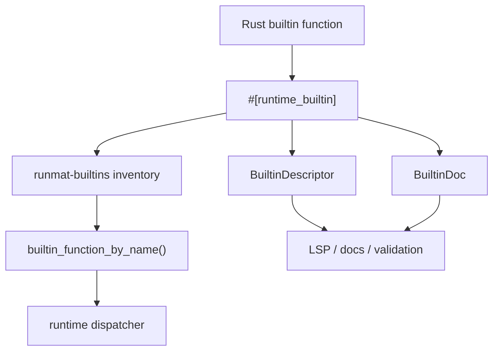

# Authoring Builtins

Runtime builtins should be easy to discover, easy to call from the VM/JIT, and explicit about their semantic contract. A builtin implementation is not complete just because a Rust function exists; it also needs registration metadata, tests, and clear behavior for errors, output counts, GPU values, and unsupported argument forms.

## Registration Flow

Most runtime builtins live under `crates/runmat-runtime/src/builtins/<category>`. The category module should re-export its child modules through the existing `builtins/mod.rs` tree so inventory registration is linked into native and WASM builds.

## Macro Contract

Use `#[runtime_builtin]` for runtime-visible functions. The macro records the MATLAB name, documentation string, optional descriptor, type information, and acceleration tags.

When adding a builtin, provide:

| Item | Requirement |
| --- | --- |
| `name` | The MATLAB-visible function name. |
| `builtin_path` | The module path used by registration helpers, especially for WASM registration. |
| `doc` | Short human-readable documentation for tooling. |
| `descriptor` | A `BuiltinDescriptor` when the builtin has user-facing signatures, output modes, or structured errors. |
| acceleration tags | Use only when the builtin has a real GPU/fusion implementation path. |

## Descriptors

`BuiltinDescriptor` is the structured API contract for a builtin. It describes signatures, completion policy, output mode, and known errors. This metadata feeds validation and editor features without executing user code.

Good descriptors should include:

- Accepted argument shapes and arity through `BuiltinSignatureDescriptor`.
- Output behavior through `BuiltinOutputMode`.
- Stable error identifiers through `BuiltinErrorDescriptor`.
- Completion policy when the function should or should not appear in suggestions.

Avoid treating descriptors as comments. If an error identifier is listed in metadata, the implementation should raise that identifier on the corresponding failure path.

## Runtime Semantics

Builtins receive and return `runmat_builtins::Value`. Keep MATLAB compatibility at the boundary:

- Preserve scalar versus array behavior.
- Respect requested output count for multi-output functions.
- Return output lists only when the caller expects multiple values.
- Use runtime error builders with stable identifiers for user-facing failures.
- Gather GPU-resident values only when the builtin has no device implementation or must inspect host-only metadata.
- Keep filesystem, networking, and interactive builtins compatible with async suspend/resume where applicable.

## GPU and Fusion Metadata

Acceleration metadata should describe real runtime behavior, not a future intent. If a builtin can run on device, document which provider hook or fusion pattern owns that path. If a builtin is host-only but accepts GPU inputs, it should gather explicitly and preserve the expected value semantics.

Use the same fusion categories as the library matrix:

| Code | Meaning |
| --- | --- |
| `E` | Elementwise. |
| `R` | Reduction. |
| `S` | Stencil or convolution. |
| `M` | Matrix multiply. |
| `T` | Transpose or permutation. |
| `P` | Pipeline or fuse-friendly operation. |

## Tests

Every builtin should have focused tests for:

- MATLAB-compatible success cases.
- Scalar, vector, matrix, empty, logical, string, cell, or struct cases relevant to that builtin.
- Error identifiers and invalid arity/type behavior.
- Multi-output behavior when applicable.
- GPU residency and gather/offload behavior when the builtin advertises acceleration.
- WASM-safe behavior for builtins available in browser builds.
- GPU parity with host behavior when the builtin advertises acceleration.

Prefer deterministic tests. For filesystem, networking, and random-number builtins, use temporary resources and explicit seeds.

## Documentation Updates

When adding or changing a builtin:

1. Update `crates/runmat-runtime/LIBRARY.md`.
2. Update the table in [Builtins](/docs/runtime/builtins) if the docs are not generated from that file.
3. Add or update descriptor metadata if user-facing signatures changed.
4. Link implementation-specific behavior to the relevant runtime section instead of duplicating internals here.
