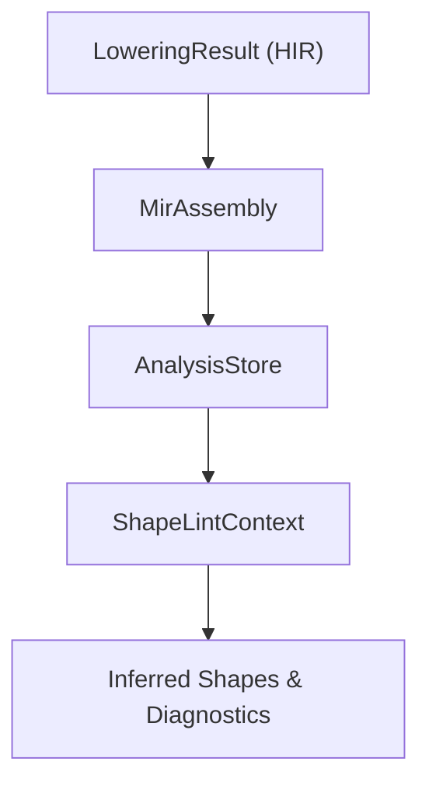
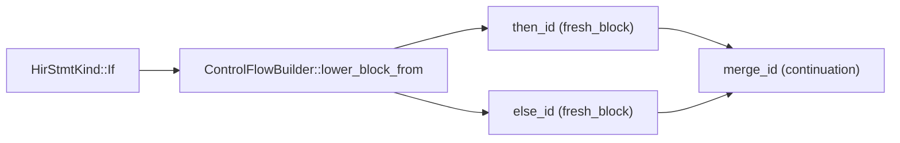

# MIR Analysis & Static Analysis

Mid-Level IR (MIR) Analysis is the primary stage for dataflow reasoning and validation in the RunMat compilation pipeline. This layer bridges the gap between the structural representation of the High-Level IR (HIR) and the execution-ready bytecode. It performs type/shape inference, definite assignment checking, and spawn-safety validation to ensure program correctness before runtime.

## MIR Analysis Architecture

The analysis system operates on the `MirAssembly` structure, iterating through `MirBody` objects. The core of the analysis is a fixed-point dataflow engine that propagates "facts" across the Control Flow Graph (CFG).

### Analysis Data Structures

The results of these analyses are aggregated into an `AnalysisStore`, which serves as a central repository for metadata about MIR locals and global function properties.

| Entity | Role | Source |
| --- | --- | --- |
| AnalysisStore | Stores MirLocalFact entries and MirDiagnostic collections. | crates/runmat-mir/src/analysis/store.rs#9-13 |
| MirLocalKey | A unique identifier for a local variable, combining FunctionId and MirLocalId. | crates/runmat-mir/src/analysis/store.rs#15-19 |
| MirLocalFact | Contains inferred TypeFact, ShapeFact, ValueFlowFact, and AsyncValueFact. | crates/runmat-mir/src/analysis/dataflow.rs#51-62 |
| SimpleValueFact | Internal structure used during dataflow to track type, shape, and async state. | crates/runmat-mir/src/analysis/dataflow.rs#23-29 |

### Dataflow Engine Implementation

The dataflow engine uses a worklist algorithm to compute facts for each `BasicBlock`.

1. Initialization: `compute_simple_local_facts` initializes `in_states` and `out_states` for all blocks in a `MirBody`
2. Transfer: The `transfer_fact_block` function updates facts based on `MirStmtKind::Assign` and `MirStmtKind::MultiAssign` within a block
3. Join: When multiple CFG edges meet, `join_fact_state` merges facts using lattice-based logic (e.g., merging specific types into `TypeFact::Unknown` if they conflict)

## Key Analysis Domains

### 1. Definite Assignment (InitFact)

The `InitFact` analysis determines if a `MirLocal` is assigned before use. It tracks three states: `Unassigned`, `MaybeAssigned`, and `DefinitelyAssigned` This is critical for MATLAB semantics where accessing an uninitialized variable triggers a runtime error.

### 2. Type & Shape Inference

The `SimpleValueFact` tracks the evolution of array shapes and types.

- Rvalue Inference: `simple_rvalue_fact` determines facts from constants, aggregates (tensors/cells), and calls
- Shape Propagation: For operations like `MirRvalue::Binary`, the system attempts to resolve resulting shapes (e.g., matrix multiplication dimensions)

### 3. Spawn-Safety Checking

RunMat performs static validation on `spawn` expressions to ensure that closures captured for parallel execution do not violate memory safety or MATLAB's execution model.

- Capture Scanning: `analyze_capture_facts` walks the MIR to find all `reads_captures` and `writes_captures`
- Safety Fact: It produces a `SpawnSafetyFact`, identifying if a task is `RequiresIsolation` or is safe for shared execution

## Static Analysis & Linting (runmat-static-analysis)

The `runmat-static-analysis` crate provides a linting layer on top of the MIR analysis. It consumes the `AnalysisStore` to produce user-facing diagnostics.

### Shape Linting Workflow

The `lint_shapes` function serves as the entry point for dimension-related validation.

#### Logic to Code Mapping: Shape Inference

Implementation Details:

- Seeding: `seed_from_analysis` populates the linting environment with facts already discovered by the core MIR dataflow
- Refinement: `walk_mir_assembly` performs a second pass to specifically track numeric constants and integer vectors (like `[1 2 3]`) that are often used as shape arguments in functions like `reshape` or `zeros`
- Diagnostic Generation: If a binary operation (e.g., `+`) is performed on incompatible shapes, a `HirDiagnostic` is generated with `HirDiagnosticSeverity::Error`

## Control Flow Lowering to MIR

The analysis relies on a well-formed CFG generated by the `ControlFlowBuilder`. This builder transforms nested HIR structures into `BasicBlock` sequences.

#### Logic to Code Mapping: CFG Construction

Key Builder Functions:

- `lower_function_body`: Entry point that initializes the `BlockLoweringEnv` and creates the first `BasicBlock`
- `lower_block_from`: Recursive function that handles statement-by-statement lowering. When it encounters control-flow (like `If` or `Await`), it splits the current block and creates continuations
- `lower_continuation_target`: Manages the "continuation-passing" style of the builder, ensuring that the code following a block (like the code after an `if/end`) is correctly linked via a `Goto` terminator
