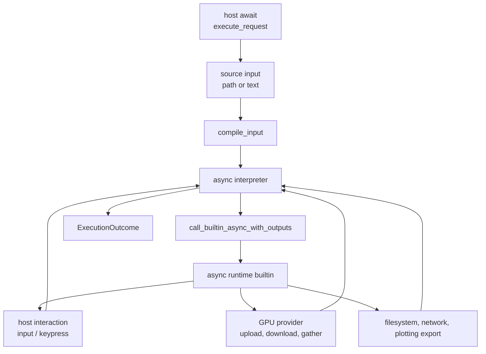

# Async Execution

RunMat uses async execution to keep host interaction, provider work, and runtime builtins composable.

## Async Boundaries

The host awaits `RunMatSession::execute_request`. Inside that call, RunMat resolves the source, compiles synchronously with respect to the current request, and then awaits the interpreter or runtime operations that may suspend on host or provider work.

## Builtin Futures

Runtime builtins are dispatched through `call_builtin_async_with_outputs`. Builtins can be plain synchronous Rust functions or `async fn` implementations registered through the runtime builtin macro system. The dispatcher keeps the public call surface uniform: VM call instructions await the runtime dispatcher, and the dispatcher awaits the selected implementation.

MIR records async behavior with `AsyncBehaviorFact`:

| Fact | Meaning |
| --- | --- |
| `NeverSuspends` | The call is known not to require async runtime behavior. |
| `MaySuspend` | The call may await host, provider, or other runtime work. |
| `RequiresAsyncRuntime` | The call must run in an async context. |

MIR also has explicit async constructs: `MirRvalue::Future` represents a future-producing call and `MirTerminatorKind::Await` records the await boundary. The VM bytecode carries async metadata for spawn and await sites, and the interpreter logs that metadata when debug tracing is enabled.

## Host Interaction

The runtime interaction subsystem exposes two awaited operations:

| Operation | Runtime function | Host value |
| --- | --- | --- |
| Line input | `request_line_async(prompt, echo)` | `InteractionResponse::Line` |
| Keypress-style input | `wait_for_key_async(prompt)` | `InteractionResponse::KeyPress` |

Each execution installs the session's async input handler as a scoped runtime guard. If a host handler exists, the runtime awaits it and records a `StdinEvent` containing the prompt, kind, echo flag, value, or error. If no handler exists, native execution falls back to default terminal helpers. WASM execution has no default stdin, so hosts must provide interaction through the WASM-facing API.

`input()` expression parsing uses a separate eval hook. When numeric expression mode is needed, the hook compiles the typed expression through the normal parser, HIR, MIR, and bytecode path. Native hosts run that nested interpretation on a dedicated thread with a larger stack and return the result through a one-shot channel. WASM awaits the nested interpreter directly.

The older suspend/resume interaction model has been removed. `ExecutionOutcome::suspension` remains in the ABI for future resumable operations, but the current session implementation awaits host interaction internally and returns `None`.

## Provider And I/O Work

GPU values can require async provider work during builtin execution or result materialization. `gather_if_needed_async` recursively downloads GPU-resident tensors and materializes host values for tensors, logical arrays, cells, structs, objects, closures, and output lists. If a host-only builtin receives GPU values and the first implementation fails on GPU input, the dispatcher can gather arguments and retry a compatible implementation.

Other awaited runtime work includes plotting import/export, filesystem-backed source or data operations, network-backed providers, and host object or method dispatch that calls back into semantic functions.

## Semantic Function Calls

The interpreter installs thread-local semantic function invoker and resolver hooks before entering the instruction loop. Runtime paths such as `feval`, closures, object dispatch, and builtin callbacks can use those hooks to call bytecode-defined functions while the interpreter is active.

These hooks return futures, so a runtime builtin can call back into user MATLAB code and await the result without leaving the session execution model.

## Cancellation

Cancellation is cooperative. `RunMatSession` owns an `Arc<AtomicBool>` interrupt flag. Each execution resets the flag and installs it into the runtime interrupt hook with `replace_interrupt`. `cancel_execution` flips the flag, and the VM/runtime observe it at polling boundaries through `is_cancelled`.

Long native calls, provider kernels, filesystem work, or JIT code can only stop once control returns to a polling boundary. Hosts should treat cancellation as a request to stop promptly, not as preemptive thread termination.
