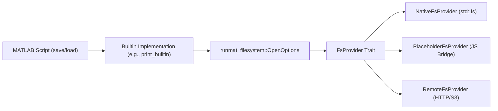

# Filesystem Abstraction

The RunMat Filesystem (VFS) provides a unified interface for file I/O operations across diverse execution environments, including native OS, web browsers (WASM), and remote cloud storage. It allows MATLAB-compatible scripts to perform operations like `load`, `save`, and `fopen` without concern for the underlying storage implementation.

## Architecture Overview

The abstraction layer is centered around the `FsProvider` trait, which defines the interface for all filesystem backends. The `runmat-filesystem` crate manages a global provider instance that handles path resolution and operation dispatch.

### VFS Data Flow

The following diagram illustrates how a call from a MATLAB builtin (like `print`) traverses the VFS layer to reach a specific backend.

Diagram: Filesystem Operation Dispatch

## Filesystem Providers

### Native Backend

Used for local development and CLI execution. It wraps the standard library's `std::fs` module to provide high-performance access to the host operating system's filesystem.

- Entity: `NativeFsProvider`
- Behavior: Uses OS page cache and supports memory-mapped I/O

### Browser Backend (WASM)

In WebAssembly environments, the filesystem often bridges to JavaScript-managed storage like IndexedDB or the Origin Private File System (OPFS).

- Entity: `PlaceholderFsProvider`
- Environment: Provides a simulated process environment (e.g., `HOME`, `PATH`) via a thread-local `ENV` lock (crates/runmat-runtime/src/builtins/common/env.rs)

### Remote Backend

Designed for large-scale data (TB/PB scale), the remote provider uses signed URLs and chunked streaming to interact with a RunMat Server gateway.

- Entity: `RemoteFsProvider` (crates/runmat-filesystem/src/remote/wasm.rs)
- Configuration: Managed via `RemoteFsConfig`, which defines chunk sizes (default 16MB) and retry policies (crates/runmat-filesystem/src/remote/wasm.rs)

## Key Components and Implementation

### Path Resolution

The VFS handles path normalization and resolution. MATLAB-specific utilities like `fullfile` are used to build platform-agnostic paths.

### File Handles and Metadata

Backends implement the `FileHandle` trait, which extends standard `Read`, `Write`, and `Seek` with async capabilities. Metadata is unified into the `FsMetadata` struct.

| Entity | Description |
| --- | --- |
| OpenOptions | Builder for file access modes (read, write, create, truncate) crates/runmat-filesystem/src/lib.rs#64-104 |
| FsMetadata | Stores file type, length, modified time, and optional content hashes crates/runmat-filesystem/src/lib.rs#148-177 |
| DirEntry | Represents a single entry in a directory listing crates/runmat-filesystem/src/lib.rs#218-222 |

### Remote I/O Logic

The `RemoteFsProvider` performs complex I/O orchestration to minimize latency and handle large files.

Diagram: Remote Read Flow

Cloud Storage (S3/Blob)Remote Gateway (API)RemoteFsProviderRuntime (Rust)Cloud Storage (S3/Blob)Remote Gateway (API)RemoteFsProviderRuntime (Rust)read_range(path | offset | len)GET /fs/download-url?path=...JSON { download_url: "signed_s3_url" }GET (Range Header) [signed_url]Binary ChunkVec<u8>

## Built-in Integration

Built-in functions like `exist` and `which` rely on the VFS to resolve entities. These functions perform a search across workspace variables, built-ins, and the filesystem.

- `exist`: Checks for the existence of variables, files, or folders. It uses `path_is_directory` and `path_find_file_with_extensions` to query the VFS.
- `which`: Resolves names to absolute paths or builtin identifiers. It searches across `GENERAL_FILE_EXTENSIONS` (e.g., `.m`, `.mat`).
