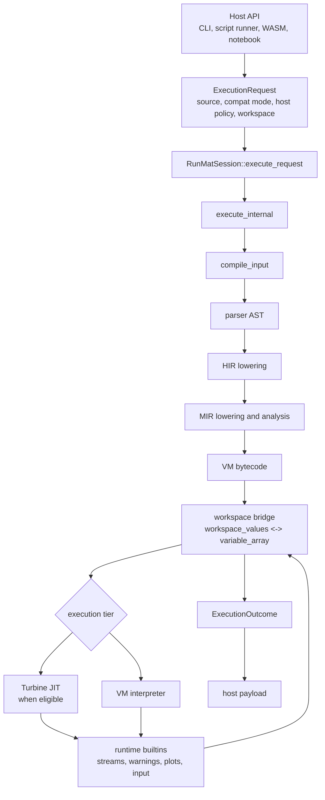

# Session Engine

`runmat-core` owns the host-agnostic execution session. A `RunMatSession` is the long-lived object that a REPL, notebook host, CLI command, or WebAssembly wrapper uses to submit MATLAB source, keep workspace variables alive, preserve user-defined functions, expose inspection data, handle input, and return structured execution results.

The session is not a second compiler or a second VM. It is the orchestration layer around the parser, HIR/MIR pipeline, VM, optional Turbine JIT, runtime builtins, GPU provider state, and host-facing ABI.

## Execution Spine

## What The Session Owns

| Field or subsystem | Purpose |
| --- | --- |
| `variable_array` | VM slot storage used during the current execution. |
| `workspace_bindings` | Name-to-slot mapping plus stable ABI binding identity. |
| `workspace_values` | Durable variable values retained between requests. |
| `function_registry` | User-defined semantic functions retained across interactive inputs. |
| `source_pool` | Interned source text and names for diagnostics and call stacks. |
| `interrupt_flag` | Cooperative cancellation flag shared with the runtime and VM. |
| `async_input_handler` | Host callback for `input`, keypress, and pause-like interactions. |
| `stats`, profiling, telemetry | Execution counters and optional host analytics hooks. |
| `compat_mode`, `top_level_await_enabled` | Per-session defaults that can be overridden by a request. |

`RunMatSession` rejects concurrent execution on the same session. Hosts that need parallel execution should create separate sessions or serialize requests through one session.

## Page Map

| Page | Purpose |
| --- | --- |
| [Execution Requests](/docs/runtime/session/execution-requests) | The structured request/result ABI around session execution. |
| [Workspace State](/docs/runtime/session/workspace) | How variable slots, stable binding keys, deltas, removals, and `ans` work. |
| [Variable Inspection](/docs/runtime/session/variable-inspection) | Workspace entries, previews, materialization, preview tokens, and GPU slices. |
| [Snapshots & Replay](/docs/runtime/session/snapshots) | Startup snapshots versus workspace replay state. |
| [Interaction & Streams](/docs/runtime/session/interaction-and-streams) | Console streams, warnings, async input, cancellation, diagnostics, and effects. |
| [Host Integration](/docs/runtime/session/host-integration) | CLI, WASM/TypeScript, notebook, editor, and lifecycle responsibilities. |

For the compiler stages inside `compile_input`, see [Compilation Pipeline](/docs/runtime/compiler). For bytecode execution details, see [VM Interpreter & Bytecode](/docs/runtime/vm). For native execution, see [Turbine JIT Compiler](/docs/runtime/jit).
