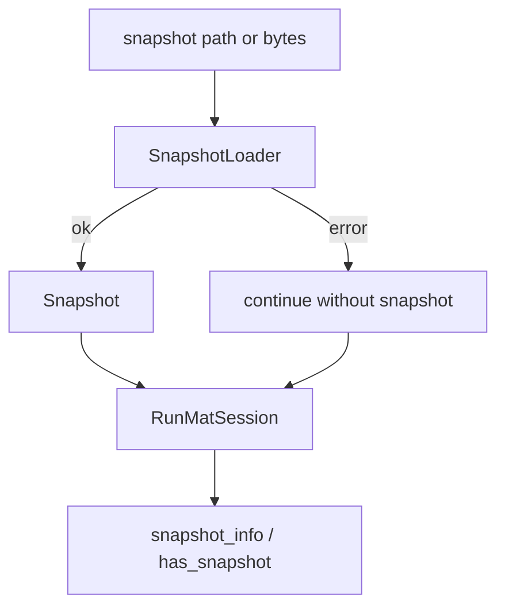
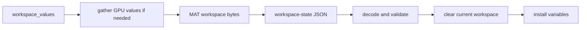

# Snapshots & Replay

RunMat has two different persistence mechanisms that are easy to conflate:

| Mechanism | Owner | Purpose |
| --- | --- | --- |
| Startup snapshots | `runmat-snapshot` plus `RunMatSession` loading hooks | Reduce startup cost by packaging standard-library metadata and caches. |
| Workspace replay | `runmat-runtime::replay::workspace` plus session import/export methods | Persist and restore live workspace variables. |

They solve different problems. Startup snapshots are about boot time. Workspace replay is about user state.

## Startup Snapshots

`RunMatSession::with_snapshot` and `RunMatSession::with_snapshot_bytes` can load a `runmat-snapshot` payload from disk or memory. If loading fails, session creation continues without the snapshot. On `wasm32`, the session can build a reduced internal snapshot fallback when no bytes are supplied.

The current session code stores the loaded snapshot and exposes `has_snapshot` and `snapshot_info`. Do not describe this as directly replacing the normal user-source execution pipeline. User execution still goes through parse, lower, analyze, compile, and execute.

For binary format, compression, validation, and snapshot build tooling, document the `runmat-snapshot` crate separately from the session section.

## Workspace Replay

Workspace replay exports session variables into a JSON payload containing base64 MAT bytes:

`export_workspace_state` gathers each value as needed before encoding. `WorkspaceExportMode::Auto` returns nothing for an empty workspace; `Force` emits a payload even when possible; `Off` disables export.

`import_workspace_state` validates and decodes the replay payload, clears the current session workspace, then installs restored variables into slots, bindings, and durable values. Import is restore/replace semantics, not merge semantics.

## Replay Limits

The runtime enforces replay limits before accepting payloads:

| Limit | Default |
| --- | --- |
| Workspace payload bytes | 32 MB |
| MAT payload bytes | 24 MB |
| Variable count | 2048 |

Rejected payloads produce replay/runtime errors instead of partial imports.
