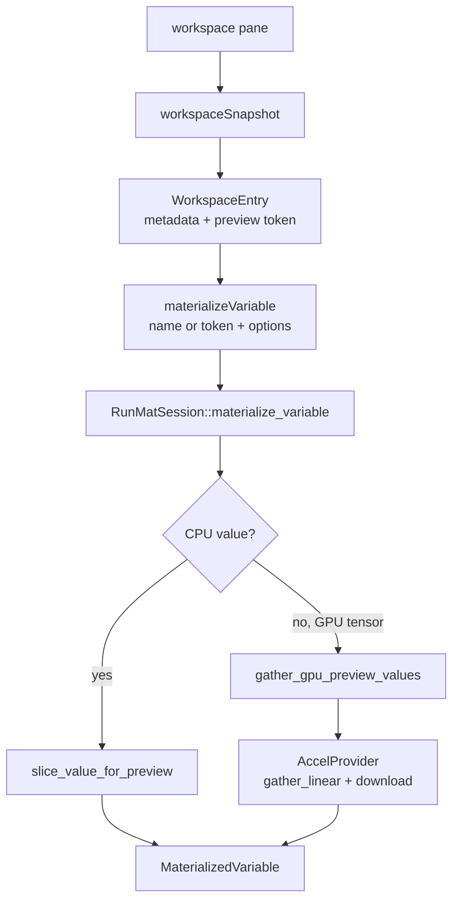

# Variable Inspection

Hosts should not read `workspace_values` directly. The session exposes workspace metadata and bounded materialization APIs so UI panes can show useful previews without forcing large CPU or GPU transfers.

## Workspace Entries

`workspace_snapshot()` returns a `WorkspaceSnapshot` with sorted `WorkspaceEntry` values.

| Field | Meaning |
| --- | --- |
| `name` | Variable name. |
| `class_name` | MATLAB class label. |
| `dtype` | Numeric or GPU precision label when known. |
| `shape` | Dimensions in MATLAB order. |
| `is_gpu` | Whether the value is GPU resident. |
| `size_bytes` | Approximate host/device size when available. |
| `preview` | Small numeric preview with a truncation flag. |
| `residency` | `cpu`, `gpu`, or `unknown`. |
| `preview_token` | Opaque token for later materialization. |

Preview tokens are regenerated when a snapshot is built. Hosts should treat them as short-lived selectors tied to the current session state.

## Materialization Flow

`WorkspaceMaterializeTarget` can select by variable name or preview token. `WorkspaceMaterializeOptions` can request a maximum element count and an optional slice. Slice options are sanitized against the actual tensor shape before any data is read.

## CPU Values

CPU tensors can be sliced in host memory. If no slice is requested, the session returns a bounded preview using the requested element limit, clamped to the default materialization limit.

Non-numeric values still return class, shape, residency, and the original `Value`; numeric preview data is only produced where the preview helpers understand the value shape.

## GPU Values

GPU tensors stay on device unless the host asks for materialization. For preview and slice requests, the session avoids downloading the whole tensor:

1. It asks the active provider for a small gathered tensor using linear indices.
2. It downloads only that gathered tensor.
3. It frees the temporary provider handle on a best-effort basis.

If no provider is registered for a GPU handle, materialization fails instead of silently gathering incorrect data.

## Host Guidance

Use `workspaceSnapshot` to populate variable lists and small previews. Use `materializeVariable` only when a user expands a value, opens a viewer, or requests a larger slice. Large data-file previews are a separate WASM API and should not be confused with live session workspace materialization.
