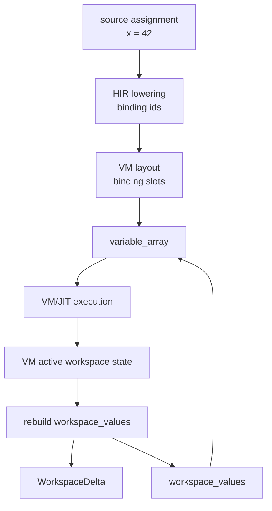

# Workspace State

The session workspace has two jobs: provide fast VM slot access during execution, and expose stable variable identities to hosts after execution. It does this with three related data structures.

| Structure | Scope | Purpose |
| --- | --- | --- |
| `variable_array: Vec<Value>` | Current execution | Mutable VM storage indexed by bytecode slots. |
| `workspace_bindings: HashMap<String, SessionWorkspaceBinding>` | Session | Maps variable names to current VM slots and ABI binding keys. |
| `workspace_values: HashMap<String, Value>` | Session | Durable variable values retained between execution requests. |

## Slot Lifecycle

Before execution, the session prepares `variable_array` from existing `workspace_values` according to the compiled bytecode layout. During execution, the VM and runtime maintain active workspace state for assignments, clears, and workspace-aware builtins. After successful execution, the session harvests that state, rebuilds `workspace_values`, updates `workspace_bindings`, and emits a delta.

## Binding Keys

Workspace entries carry stable ABI identities:

| Key type | When used |
| --- | --- |
| `Interactive` | REPL or notebook-style execution tied to a session UUID and variable name. |
| `SourceBinding` | Path/text source execution with a source identity and definition path. |
| `Global` | Reserved ABI identity for global bindings. |
| `Persistent` | Reserved ABI identity for persistent function locals. |

For text or path sources, `resolve_source_identity` can produce either interactive identity or a path/content-hash identity. Hosts should treat these keys as identifiers, not as display strings.

## Deltas And Full Snapshots

Every successful request returns a `WorkspaceDelta`. The session attempts to emit only changed upserts when possible. It asks for a full snapshot when removal or clear behavior means a host cannot update safely from upserts alone.

| Delta field | Meaning |
| --- | --- |
| `version` | Monotonic session workspace version. |
| `upserts` | Updated binding values. |
| `removals` | Binding keys removed since the previous request. |
| `full_snapshot_required` | Host should replace its workspace view with the returned full snapshot. |

`clear_variables` clears slots, binding keys, persistent values, and preview tokens. Workspace import also clears the current workspace before installing restored variables.

## Display And `ans`

The session derives display behavior from HIR statements and VM layout:

- Unsuppressed assignments can display the assigned variable value.
- Unsuppressed expression statements are stored into `ans`.
- Semicolon-suppressed statements do not produce a public value, but may still carry `type_info`.
- Some builtins suppress automatic output even without a semicolon.

This policy lives above the VM. The VM executes bytecode and mutates slots; the session decides what becomes display output, what updates `ans`, and what is hidden from the public `RuntimeFlow`.
