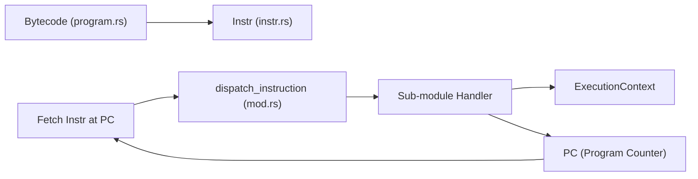
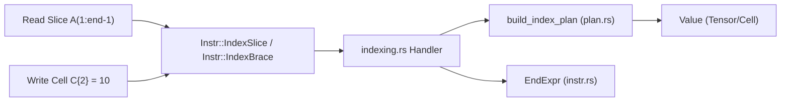

# Interpreter Dispatch & Execution Loop

<details>
<summary>Relevant source files</summary>

- [crates/runmat-accelerate/tests/fusion_patterns.rs](https://github.com/runmat-org/runmat/blob/82685330/crates/runmat-accelerate/tests/fusion_patterns.rs)
- [crates/runmat-turbine/tests/integration.rs](https://github.com/runmat-org/runmat/blob/82685330/crates/runmat-turbine/tests/integration.rs)
- [crates/runmat-turbine/tests/performance.rs](https://github.com/runmat-org/runmat/blob/82685330/crates/runmat-turbine/tests/performance.rs)
- [crates/runmat-vm/src/bytecode/compile.rs](https://github.com/runmat-org/runmat/blob/82685330/crates/runmat-vm/src/bytecode/compile.rs)
- [crates/runmat-vm/src/bytecode/instr.rs](https://github.com/runmat-org/runmat/blob/82685330/crates/runmat-vm/src/bytecode/instr.rs)
- [crates/runmat-vm/src/call/shared.rs](https://github.com/runmat-org/runmat/blob/82685330/crates/runmat-vm/src/call/shared.rs)
- [crates/runmat-vm/src/compiler/core.rs](https://github.com/runmat-org/runmat/blob/82685330/crates/runmat-vm/src/compiler/core.rs)
- [crates/runmat-vm/src/interpreter/dispatch/calls.rs](https://github.com/runmat-org/runmat/blob/82685330/crates/runmat-vm/src/interpreter/dispatch/calls.rs)
- [crates/runmat-vm/src/interpreter/dispatch/indexing.rs](https://github.com/runmat-org/runmat/blob/82685330/crates/runmat-vm/src/interpreter/dispatch/indexing.rs)
- [crates/runmat-vm/src/interpreter/dispatch/mod.rs](https://github.com/runmat-org/runmat/blob/82685330/crates/runmat-vm/src/interpreter/dispatch/mod.rs)
- [crates/runmat-vm/src/interpreter/runner.rs](https://github.com/runmat-org/runmat/blob/82685330/crates/runmat-vm/src/interpreter/runner.rs)
- [crates/runmat-vm/tests/basics.rs](https://github.com/runmat-org/runmat/blob/82685330/crates/runmat-vm/tests/basics.rs)
- [crates/runmat-vm/tests/control_flow.rs](https://github.com/runmat-org/runmat/blob/82685330/crates/runmat-vm/tests/control_flow.rs)
- [crates/runmat-vm/tests/functions.rs](https://github.com/runmat-org/runmat/blob/82685330/crates/runmat-vm/tests/functions.rs)
- [crates/runmat-vm/tests/fusion_gpu.rs](https://github.com/runmat-org/runmat/blob/82685330/crates/runmat-vm/tests/fusion_gpu.rs)
- [crates/runmat-vm/tests/indexing_properties.rs](https://github.com/runmat-org/runmat/blob/82685330/crates/runmat-vm/tests/indexing_properties.rs)
- [crates/runmat-vm/tests/loops.rs](https://github.com/runmat-org/runmat/blob/82685330/crates/runmat-vm/tests/loops.rs)
- [crates/runmat-vm/tests/matrix_division.rs](https://github.com/runmat-org/runmat/blob/82685330/crates/runmat-vm/tests/matrix_division.rs)
- [crates/runmat-vm/tests/meshgrid_ranges.rs](https://github.com/runmat-org/runmat/blob/82685330/crates/runmat-vm/tests/meshgrid_ranges.rs)
- [crates/runmat-vm/tests/multid_indexing.rs](https://github.com/runmat-org/runmat/blob/82685330/crates/runmat-vm/tests/multid_indexing.rs)
- [crates/runmat-vm/tests/support/mod.rs](https://github.com/runmat-org/runmat/blob/82685330/crates/runmat-vm/tests/support/mod.rs)
- [docs-tmp/COMPLETION_AUDIT.md](https://github.com/runmat-org/runmat/blob/82685330/docs-tmp/COMPLETION_AUDIT.md?plain=1)
- [docs-tmp/DELIVERABLE_AUDIT.md](https://github.com/runmat-org/runmat/blob/82685330/docs-tmp/DELIVERABLE_AUDIT.md?plain=1)
- [docs-tmp/NEXT_STEPS.md](https://github.com/runmat-org/runmat/blob/82685330/docs-tmp/NEXT_STEPS.md?plain=1)
- [docs-tmp/PROGRESS.md](https://github.com/runmat-org/runmat/blob/82685330/docs-tmp/PROGRESS.md?plain=1)

</details>

The RunMat VM interpreter is responsible for executing the bytecode generated from the Mid-Level IR (MIR). It operates through a centralized execution loop that processes a sequence of `Instr` opcodes, managing a local stack, variable slots, and structured exception handling. The interpreter is designed to support MATLAB's specific semantics, including multi-output function calls, complex indexing plans, and copy-on-write (CoW) data management.

## ExecutionContext & State Management

The interpreter maintains state within an `ExecutionContext` and several auxiliary stacks. This state is passed through the dispatch logic to ensure that instructions can manipulate the environment, resolve variables, and handle control flow transitions.

| Entity | Description |
| --- | --- |
| stack | A Vec<Value> used for expression evaluation and temporary operand storage crates/runmat-vm/src/interpreter/dispatch/mod.rs#56 |
| vars | A Vec<Value> representing the local variable slots (locals) for the current function scope crates/runmat-vm/src/interpreter/dispatch/mod.rs#57 |
| try_stack | Tracks active try/catch blocks, storing the program counter (PC) of the catch handler and the stack depth crates/runmat-vm/src/interpreter/dispatch/mod.rs#59 |
| pc | The Program Counter, an index into the instructions vector crates/runmat-vm/src/interpreter/dispatch/mod.rs#65 |

### Interpreter State Flow

The following diagram illustrates the relationship between the bytecode program and the runtime state during dispatch.



<details>
<summary>Rendered SVG</summary>

```svg
<svg id="mermaid-sps2x72h0u" xmlns="http://www.w3.org/2000/svg" xmlns:xlink="http://www.w3.org/1999/xlink" class="flowchart" style="max-width: 100%; touch-action: none; user-select: none; cursor: grab; min-height: fit-content; max-height: 100%;" viewBox="-0.014080040428495977 0 950.098472580857 530" role="graphics-document document" aria-roledescription="flowchart-v2" preserveAspectRatio="xMidYMid meet"><style>#mermaid-sps2x72h0u{font-family:ui-sans-serif,-apple-system,system-ui,Segoe UI,Helvetica;font-size:16px;fill:#ccc;}@keyframes edge-animation-frame{from{stroke-dashoffset:0;}}@keyframes dash{to{stroke-dashoffset:0;}}#mermaid-sps2x72h0u .edge-animation-slow{stroke-dasharray:9,5!important;stroke-dashoffset:900;animation:dash 50s linear infinite;stroke-linecap:round;}#mermaid-sps2x72h0u .edge-animation-fast{stroke-dasharray:9,5!important;stroke-dashoffset:900;animation:dash 20s linear infinite;stroke-linecap:round;}#mermaid-sps2x72h0u .error-icon{fill:#333;}#mermaid-sps2x72h0u .error-text{fill:#cccccc;stroke:#cccccc;}#mermaid-sps2x72h0u .edge-thickness-normal{stroke-width:1px;}#mermaid-sps2x72h0u .edge-thickness-thick{stroke-width:3.5px;}#mermaid-sps2x72h0u .edge-pattern-solid{stroke-dasharray:0;}#mermaid-sps2x72h0u .edge-thickness-invisible{stroke-width:0;fill:none;}#mermaid-sps2x72h0u .edge-pattern-dashed{stroke-dasharray:3;}#mermaid-sps2x72h0u .edge-pattern-dotted{stroke-dasharray:2;}#mermaid-sps2x72h0u .marker{fill:#666;stroke:#666;}#mermaid-sps2x72h0u .marker.cross{stroke:#666;}#mermaid-sps2x72h0u svg{font-family:ui-sans-serif,-apple-system,system-ui,Segoe UI,Helvetica;font-size:16px;}#mermaid-sps2x72h0u p{margin:0;}#mermaid-sps2x72h0u .label{font-family:ui-sans-serif,-apple-system,system-ui,Segoe UI,Helvetica;color:#fff;}#mermaid-sps2x72h0u .cluster-label text{fill:#fff;}#mermaid-sps2x72h0u .cluster-label span{color:#fff;}#mermaid-sps2x72h0u .cluster-label span p{background-color:transparent;}#mermaid-sps2x72h0u .label text,#mermaid-sps2x72h0u span{fill:#fff;color:#fff;}#mermaid-sps2x72h0u .node rect,#mermaid-sps2x72h0u .node circle,#mermaid-sps2x72h0u .node ellipse,#mermaid-sps2x72h0u .node polygon,#mermaid-sps2x72h0u .node path{fill:#111;stroke:#222;stroke-width:1px;}#mermaid-sps2x72h0u .rough-node .label text,#mermaid-sps2x72h0u .node .label text,#mermaid-sps2x72h0u .image-shape .label,#mermaid-sps2x72h0u .icon-shape .label{text-anchor:middle;}#mermaid-sps2x72h0u .node .katex path{fill:#000;stroke:#000;stroke-width:1px;}#mermaid-sps2x72h0u .rough-node .label,#mermaid-sps2x72h0u .node .label,#mermaid-sps2x72h0u .image-shape .label,#mermaid-sps2x72h0u .icon-shape .label{text-align:center;}#mermaid-sps2x72h0u .node.clickable{cursor:pointer;}#mermaid-sps2x72h0u .root .anchor path{fill:#666!important;stroke-width:0;stroke:#666;}#mermaid-sps2x72h0u .arrowheadPath{fill:#0b0b0b;}#mermaid-sps2x72h0u .edgePath .path{stroke:#666;stroke-width:1px;}#mermaid-sps2x72h0u .flowchart-link{stroke:#666;fill:none;}#mermaid-sps2x72h0u .edgeLabel{background-color:#161616;text-align:center;}#mermaid-sps2x72h0u .edgeLabel p{background-color:#161616;}#mermaid-sps2x72h0u .edgeLabel rect{opacity:0.5;background-color:#161616;fill:#161616;}#mermaid-sps2x72h0u .labelBkg{background-color:rgba(22, 22, 22, 0.5);}#mermaid-sps2x72h0u .cluster rect{fill:#161616;stroke:#222;stroke-width:1px;}#mermaid-sps2x72h0u .cluster text{fill:#fff;}#mermaid-sps2x72h0u .cluster span{color:#fff;}#mermaid-sps2x72h0u div.mermaidTooltip{position:absolute;text-align:center;max-width:200px;padding:2px;font-family:ui-sans-serif,-apple-system,system-ui,Segoe UI,Helvetica;font-size:12px;background:#333;border:1px solid hsl(0, 0%, 10%);border-radius:2px;pointer-events:none;z-index:100;}#mermaid-sps2x72h0u .flowchartTitleText{text-anchor:middle;font-size:18px;fill:#ccc;}#mermaid-sps2x72h0u rect.text{fill:none;stroke-width:0;}#mermaid-sps2x72h0u .icon-shape,#mermaid-sps2x72h0u .image-shape{background-color:#161616;text-align:center;}#mermaid-sps2x72h0u .icon-shape p,#mermaid-sps2x72h0u .image-shape p{background-color:#161616;padding:2px;}#mermaid-sps2x72h0u .icon-shape .label rect,#mermaid-sps2x72h0u .image-shape .label rect{opacity:0.5;background-color:#161616;fill:#161616;}#mermaid-sps2x72h0u .label-icon{display:inline-block;height:1em;overflow:visible;vertical-align:-0.125em;}#mermaid-sps2x72h0u .node .label-icon path{fill:currentColor;stroke:revert;stroke-width:revert;}#mermaid-sps2x72h0u .node .neo-node{stroke:#222;}#mermaid-sps2x72h0u [data-look="neo"].node rect,#mermaid-sps2x72h0u [data-look="neo"].cluster rect,#mermaid-sps2x72h0u [data-look="neo"].node polygon{stroke:url(#mermaid-sps2x72h0u-gradient);filter:drop-shadow( 1px 2px 2px rgba(185,185,185,1));}#mermaid-sps2x72h0u [data-look="neo"].node path{stroke:url(#mermaid-sps2x72h0u-gradient);stroke-width:1px;}#mermaid-sps2x72h0u [data-look="neo"].node .outer-path{filter:drop-shadow( 1px 2px 2px rgba(185,185,185,1));}#mermaid-sps2x72h0u [data-look="neo"].node .neo-line path{stroke:#222;filter:none;}#mermaid-sps2x72h0u [data-look="neo"].node circle{stroke:url(#mermaid-sps2x72h0u-gradient);filter:drop-shadow( 1px 2px 2px rgba(185,185,185,1));}#mermaid-sps2x72h0u [data-look="neo"].node circle .state-start{fill:#000000;}#mermaid-sps2x72h0u [data-look="neo"].icon-shape .icon{fill:url(#mermaid-sps2x72h0u-gradient);filter:drop-shadow( 1px 2px 2px rgba(185,185,185,1));}#mermaid-sps2x72h0u [data-look="neo"].icon-shape .icon-neo path{stroke:url(#mermaid-sps2x72h0u-gradient);filter:drop-shadow( 1px 2px 2px rgba(185,185,185,1));}#mermaid-sps2x72h0u :root{--mermaid-font-family:"trebuchet ms",verdana,arial,sans-serif;}</style><g><marker id="mermaid-sps2x72h0u_flowchart-v2-pointEnd" class="marker flowchart-v2" viewBox="0 0 10 10" refX="5" refY="5" markerUnits="userSpaceOnUse" markerWidth="8" markerHeight="8" orient="auto"><path d="M 0 0 L 10 5 L 0 10 z" class="arrowMarkerPath" style="stroke-width: 1; stroke-dasharray: 1, 0;"></path></marker><marker id="mermaid-sps2x72h0u_flowchart-v2-pointStart" class="marker flowchart-v2" viewBox="0 0 10 10" refX="4.5" refY="5" markerUnits="userSpaceOnUse" markerWidth="8" markerHeight="8" orient="auto"><path d="M 0 5 L 10 10 L 10 0 z" class="arrowMarkerPath" style="stroke-width: 1; stroke-dasharray: 1, 0;"></path></marker><marker id="mermaid-sps2x72h0u_flowchart-v2-pointEnd-margin" class="marker flowchart-v2" viewBox="0 0 11.5 14" refX="11.5" refY="7" markerUnits="userSpaceOnUse" markerWidth="10.5" markerHeight="14" orient="auto"><path d="M 0 0 L 11.5 7 L 0 14 z" class="arrowMarkerPath" style="stroke-width: 0; stroke-dasharray: 1, 0;"></path></marker><marker id="mermaid-sps2x72h0u_flowchart-v2-pointStart-margin" class="marker flowchart-v2" viewBox="0 0 11.5 14" refX="1" refY="7" markerUnits="userSpaceOnUse" markerWidth="11.5" markerHeight="14" orient="auto"><polygon points="0,7 11.5,14 11.5,0" class="arrowMarkerPath" style="stroke-width: 0; stroke-dasharray: 1, 0;"></polygon></marker><marker id="mermaid-sps2x72h0u_flowchart-v2-circleEnd" class="marker flowchart-v2" viewBox="0 0 10 10" refX="11" refY="5" markerUnits="userSpaceOnUse" markerWidth="11" markerHeight="11" orient="auto"><circle cx="5" cy="5" r="5" class="arrowMarkerPath" style="stroke-width: 1; stroke-dasharray: 1, 0;"></circle></marker><marker id="mermaid-sps2x72h0u_flowchart-v2-circleStart" class="marker flowchart-v2" viewBox="0 0 10 10" refX="-1" refY="5" markerUnits="userSpaceOnUse" markerWidth="11" markerHeight="11" orient="auto"><circle cx="5" cy="5" r="5" class="arrowMarkerPath" style="stroke-width: 1; stroke-dasharray: 1, 0;"></circle></marker><marker id="mermaid-sps2x72h0u_flowchart-v2-circleEnd-margin" class="marker flowchart-v2" viewBox="0 0 10 10" refY="5" refX="12.25" markerUnits="userSpaceOnUse" markerWidth="14" markerHeight="14" orient="auto"><circle cx="5" cy="5" r="5" class="arrowMarkerPath" style="stroke-width: 0; stroke-dasharray: 1, 0;"></circle></marker><marker id="mermaid-sps2x72h0u_flowchart-v2-circleStart-margin" class="marker flowchart-v2" viewBox="0 0 10 10" refX="-2" refY="5" markerUnits="userSpaceOnUse" markerWidth="14" markerHeight="14" orient="auto"><circle cx="5" cy="5" r="5" class="arrowMarkerPath" style="stroke-width: 0; stroke-dasharray: 1, 0;"></circle></marker><marker id="mermaid-sps2x72h0u_flowchart-v2-crossEnd" class="marker cross flowchart-v2" viewBox="0 0 11 11" refX="12" refY="5.2" markerUnits="userSpaceOnUse" markerWidth="11" markerHeight="11" orient="auto"><path d="M 1,1 l 9,9 M 10,1 l -9,9" class="arrowMarkerPath" style="stroke-width: 2; stroke-dasharray: 1, 0;"></path></marker><marker id="mermaid-sps2x72h0u_flowchart-v2-crossStart" class="marker cross flowchart-v2" viewBox="0 0 11 11" refX="-1" refY="5.2" markerUnits="userSpaceOnUse" markerWidth="11" markerHeight="11" orient="auto"><path d="M 1,1 l 9,9 M 10,1 l -9,9" class="arrowMarkerPath" style="stroke-width: 2; stroke-dasharray: 1, 0;"></path></marker><marker id="mermaid-sps2x72h0u_flowchart-v2-crossEnd-margin" class="marker cross flowchart-v2" viewBox="0 0 15 15" refX="17.7" refY="7.5" markerUnits="userSpaceOnUse" markerWidth="12" markerHeight="12" orient="auto"><path d="M 1,1 L 14,14 M 1,14 L 14,1" class="arrowMarkerPath" style="stroke-width: 2.5;"></path></marker><marker id="mermaid-sps2x72h0u_flowchart-v2-crossStart-margin" class="marker cross flowchart-v2" viewBox="0 0 15 15" refX="-3.5" refY="7.5" markerUnits="userSpaceOnUse" markerWidth="12" markerHeight="12" orient="auto"><path d="M 1,1 L 14,14 M 1,14 L 14,1" class="arrowMarkerPath" style="stroke-width: 2.5; stroke-dasharray: 1, 0;"></path></marker><g class="root"><g class="clusters"><g class="cluster" id="mermaid-sps2x72h0u-subGraph1" data-look="classic"><rect style="" x="526.1796875" y="8" width="402.65625" height="361"></rect><g class="cluster-label" transform="translate(672, 8)"><foreignObject width="111.015625" height="24"><div style="display: table-cell; white-space: nowrap; line-height: 1.5;" xmlns="http://www.w3.org/1999/xhtml"><span class="nodeLabel"><p>Execution Loop</p></span></div></foreignObject></g></g><g class="cluster" id="mermaid-sps2x72h0u-subGraph0" data-look="classic"><rect style="" x="8" y="265" width="498.1796875" height="257"></rect><g class="cluster-label" transform="translate(190.30078125, 265)"><foreignObject width="133.578125" height="24"><div style="display: table-cell; white-space: nowrap; line-height: 1.5;" xmlns="http://www.w3.org/1999/xhtml"><span class="nodeLabel"><p>Code Entity Space</p></span></div></foreignObject></g></g></g><g class="edgePaths"><path d="M155.156,344L155.156,348.167C155.156,352.333,155.156,360.667,155.156,371C155.156,381.333,155.156,393.667,155.156,405.333C155.156,417,155.156,428,155.156,433.5L155.156,439" id="mermaid-sps2x72h0u-L_Bytecode_Instr_0" class="edge-thickness-normal edge-pattern-solid edge-thickness-normal edge-pattern-solid flowchart-link" style=";" data-edge="true" data-et="edge" data-id="L_Bytecode_Instr_0" data-points="W3sieCI6MTU1LjE1NjI1LCJ5IjozNDR9LHsieCI6MTU1LjE1NjI1LCJ5IjozNjl9LHsieCI6MTU1LjE1NjI1LCJ5Ijo0MDZ9LHsieCI6MTU1LjE1NjI1LCJ5Ijo0NDN9XQ==" data-look="classic" marker-end="url(#mermaid-sps2x72h0u_flowchart-v2-pointEnd)"></path><path d="M730.843,87L724.233,91.167C717.622,95.333,704.401,103.667,697.79,111.333C691.18,119,691.18,126,691.18,129.5L691.18,133" id="mermaid-sps2x72h0u-L_Fetch_Dispatch_0" class="edge-thickness-normal edge-pattern-solid edge-thickness-normal edge-pattern-solid flowchart-link" style=";" data-edge="true" data-et="edge" data-id="L_Fetch_Dispatch_0" data-points="W3sieCI6NzMwLjg0MzE0OTAzODQ2MTUsInkiOjg3fSx7IngiOjY5MS4xNzk2ODc1LCJ5IjoxMTJ9LHsieCI6NjkxLjE3OTY4NzUsInkiOjEzN31d" data-look="classic" marker-end="url(#mermaid-sps2x72h0u_flowchart-v2-pointEnd)"></path><path d="M691.18,215L691.18,219.167C691.18,223.333,691.18,231.667,691.18,240C691.18,248.333,691.18,256.667,691.18,264.333C691.18,272,691.18,279,691.18,282.5L691.18,286" id="mermaid-sps2x72h0u-L_Dispatch_Handler_0" class="edge-thickness-normal edge-pattern-solid edge-thickness-normal edge-pattern-solid flowchart-link" style=";" data-edge="true" data-et="edge" data-id="L_Dispatch_Handler_0" data-points="W3sieCI6NjkxLjE3OTY4NzUsInkiOjIxNX0seyJ4Ijo2OTEuMTc5Njg3NSwieSI6MjQwfSx7IngiOjY5MS4xNzk2ODc1LCJ5IjoyNjV9LHsieCI6NjkxLjE3OTY4NzUsInkiOjI5MH1d" data-look="classic" marker-end="url(#mermaid-sps2x72h0u_flowchart-v2-pointEnd)"></path><path d="M658.728,344L653.72,348.167C648.712,352.333,638.696,360.667,591.814,371C544.932,381.333,461.185,393.667,419.311,405.333C377.438,417,377.438,428,377.438,433.5L377.438,439" id="mermaid-sps2x72h0u-L_Handler_ExecCtx_0" class="edge-thickness-normal edge-pattern-solid edge-thickness-normal edge-pattern-solid flowchart-link" style=";" data-edge="true" data-et="edge" data-id="L_Handler_ExecCtx_0" data-points="W3sieCI6NjU4LjcyNzc2NDQyMzA3NjksInkiOjM0NH0seyJ4Ijo2MjguNjc5Njg3NSwieSI6MzY5fSx7IngiOjM3Ny40Mzc1LCJ5Ijo0MDZ9LHsieCI6Mzc3LjQzNzUsInkiOjQ0M31d" data-look="classic" marker-end="url(#mermaid-sps2x72h0u_flowchart-v2-pointEnd)"></path><path d="M721.194,344L725.825,348.167C730.457,352.333,739.721,360.667,744.353,371C748.984,381.333,748.984,393.667,756.407,405.591C763.829,417.516,778.674,429.032,786.097,434.79L793.519,440.548" id="mermaid-sps2x72h0u-L_Handler_PC_0" class="edge-thickness-normal edge-pattern-solid edge-thickness-normal edge-pattern-solid flowchart-link" style=";" data-edge="true" data-et="edge" data-id="L_Handler_PC_0" data-points="W3sieCI6NzIxLjE5MzY1OTg1NTc2OTMsInkiOjM0NH0seyJ4Ijo3NDguOTg0Mzc1LCJ5IjozNjl9LHsieCI6NzQ4Ljk4NDM3NSwieSI6NDA2fSx7IngiOjc5Ni42Nzk2ODc1LCJ5Ijo0NDN9XQ==" data-look="classic" marker-end="url(#mermaid-sps2x72h0u_flowchart-v2-pointEnd)"></path><path d="M841.903,443L844.282,436.833C846.662,430.667,851.421,418.333,853.8,406C856.18,393.667,856.18,381.333,856.18,366.5C856.18,351.667,856.18,334.333,856.18,317C856.18,299.667,856.18,282.333,856.18,269.5C856.18,256.667,856.18,248.333,856.18,233.5C856.18,218.667,856.18,197.333,856.18,176C856.18,154.667,856.18,133.333,850.133,118.855C844.087,104.378,831.993,96.755,825.947,92.944L819.9,89.133" id="mermaid-sps2x72h0u-L_PC_Fetch_0" class="edge-thickness-normal edge-pattern-solid edge-thickness-normal edge-pattern-solid flowchart-link" style=";" data-edge="true" data-et="edge" data-id="L_PC_Fetch_0" data-points="W3sieCI6ODQxLjkwMjcwOTk2MDkzNzUsInkiOjQ0M30seyJ4Ijo4NTYuMTc5Njg3NSwieSI6NDA2fSx7IngiOjg1Ni4xNzk2ODc1LCJ5IjozNjl9LHsieCI6ODU2LjE3OTY4NzUsInkiOjMxN30seyJ4Ijo4NTYuMTc5Njg3NSwieSI6MjY1fSx7IngiOjg1Ni4xNzk2ODc1LCJ5IjoyNDB9LHsieCI6ODU2LjE3OTY4NzUsInkiOjE3Nn0seyJ4Ijo4NTYuMTc5Njg3NSwieSI6MTEyfSx7IngiOjgxNi41MTYyMjU5NjE1Mzg1LCJ5Ijo4N31d" data-look="classic" marker-end="url(#mermaid-sps2x72h0u_flowchart-v2-pointEnd)"></path></g><g class="edgeLabels"><g class="edgeLabel" transform="translate(155.15625, 406)"><g class="label" data-id="L_Bytecode_Instr_0" transform="translate(-30.7734375, -12)"><foreignObject width="61.546875" height="24"><div style="display: table-cell; white-space: nowrap; line-height: 1.5; max-width: 200px; text-align: center;" xmlns="http://www.w3.org/1999/xhtml" class="labelBkg"><span class="edgeLabel"><p>contains</p></span></div></foreignObject></g></g><g class="edgeLabel"><g class="label" data-id="L_Fetch_Dispatch_0" transform="translate(0, 0)"><foreignObject width="0" height="0"><div style="display: table-cell; white-space: nowrap; line-height: 1.5; max-width: 200px; text-align: center;" xmlns="http://www.w3.org/1999/xhtml" class="labelBkg"><span class="edgeLabel"></span></div></foreignObject></g></g><g class="edgeLabel"><g class="label" data-id="L_Dispatch_Handler_0" transform="translate(0, 0)"><foreignObject width="0" height="0"><div style="display: table-cell; white-space: nowrap; line-height: 1.5; max-width: 200px; text-align: center;" xmlns="http://www.w3.org/1999/xhtml" class="labelBkg"><span class="edgeLabel"></span></div></foreignObject></g></g><g class="edgeLabel" transform="translate(377.4375, 406)"><g class="label" data-id="L_Handler_ExecCtx_0" transform="translate(-29.4609375, -12)"><foreignObject width="58.921875" height="24"><div style="display: table-cell; white-space: nowrap; line-height: 1.5; max-width: 200px; text-align: center;" xmlns="http://www.w3.org/1999/xhtml" class="labelBkg"><span class="edgeLabel"><p>mutates</p></span></div></foreignObject></g></g><g class="edgeLabel" transform="translate(748.984375, 406)"><g class="label" data-id="L_Handler_PC_0" transform="translate(-29.390625, -12)"><foreignObject width="58.78125" height="24"><div style="display: table-cell; white-space: nowrap; line-height: 1.5; max-width: 200px; text-align: center;" xmlns="http://www.w3.org/1999/xhtml" class="labelBkg"><span class="edgeLabel"><p>updates</p></span></div></foreignObject></g></g><g class="edgeLabel"><g class="label" data-id="L_PC_Fetch_0" transform="translate(0, 0)"><foreignObject width="0" height="0"><div style="display: table-cell; white-space: nowrap; line-height: 1.5; max-width: 200px; text-align: center;" xmlns="http://www.w3.org/1999/xhtml" class="labelBkg"><span class="edgeLabel"></span></div></foreignObject></g></g></g><g class="nodes"><g class="node default" id="mermaid-sps2x72h0u-flowchart-Bytecode-0" data-look="classic" transform="translate(155.15625, 317)"><rect class="basic label-container" style="" x="-112.15625" y="-27" width="224.3125" height="54"></rect><g class="label" style="" transform="translate(-82.15625, -12)"><rect></rect><foreignObject width="164.3125" height="24"><div style="display: table-cell; white-space: nowrap; line-height: 1.5; max-width: 200px; text-align: center;" xmlns="http://www.w3.org/1999/xhtml"><span class="nodeLabel"><p>Bytecode (program.rs)</p></span></div></foreignObject></g></g><g class="node default" id="mermaid-sps2x72h0u-flowchart-Instr-1" data-look="classic" transform="translate(155.15625, 470)"><rect class="basic label-container" style="" x="-78.5390625" y="-27" width="157.078125" height="54"></rect><g class="label" style="" transform="translate(-48.5390625, -12)"><rect></rect><foreignObject width="97.078125" height="24"><div style="display: table-cell; white-space: nowrap; line-height: 1.5; max-width: 200px; text-align: center;" xmlns="http://www.w3.org/1999/xhtml"><span class="nodeLabel"><p>Instr (instr.rs)</p></span></div></foreignObject></g></g><g class="node default" id="mermaid-sps2x72h0u-flowchart-ExecCtx-2" data-look="classic" transform="translate(377.4375, 470)"><rect class="basic label-container" style="" x="-93.7421875" y="-27" width="187.484375" height="54"></rect><g class="label" style="" transform="translate(-63.7421875, -12)"><rect></rect><foreignObject width="127.484375" height="24"><div style="display: table-cell; white-space: nowrap; line-height: 1.5; max-width: 200px; text-align: center;" xmlns="http://www.w3.org/1999/xhtml"><span class="nodeLabel"><p>ExecutionContext</p></span></div></foreignObject></g></g><g class="node default" id="mermaid-sps2x72h0u-flowchart-Fetch-3" data-look="classic" transform="translate(773.6796875, 60)"><rect class="basic label-container" style="" x="-90.3125" y="-27" width="180.625" height="54"></rect><g class="label" style="" transform="translate(-60.3125, -12)"><rect></rect><foreignObject width="120.625" height="24"><div style="display: table-cell; white-space: nowrap; line-height: 1.5; max-width: 200px; text-align: center;" xmlns="http://www.w3.org/1999/xhtml"><span class="nodeLabel"><p>Fetch Instr at PC</p></span></div></foreignObject></g></g><g class="node default" id="mermaid-sps2x72h0u-flowchart-Dispatch-4" data-look="classic" transform="translate(691.1796875, 176)"><rect class="basic label-container" style="" x="-130" y="-39" width="260" height="78"></rect><g class="label" style="" transform="translate(-100, -24)"><rect></rect><foreignObject width="200" height="48"><div style="display: table; white-space: break-spaces; line-height: 1.5; max-width: 200px; text-align: center; width: 200px;" xmlns="http://www.w3.org/1999/xhtml"><span class="nodeLabel"><p>dispatch_instruction (mod.rs)</p></span></div></foreignObject></g></g><g class="node default" id="mermaid-sps2x72h0u-flowchart-Handler-5" data-look="classic" transform="translate(691.1796875, 317)"><rect class="basic label-container" style="" x="-105.328125" y="-27" width="210.65625" height="54"></rect><g class="label" style="" transform="translate(-75.328125, -12)"><rect></rect><foreignObject width="150.65625" height="24"><div style="display: table-cell; white-space: nowrap; line-height: 1.5; max-width: 200px; text-align: center;" xmlns="http://www.w3.org/1999/xhtml"><span class="nodeLabel"><p>Sub-module Handler</p></span></div></foreignObject></g></g><g class="node default" id="mermaid-sps2x72h0u-flowchart-PC-15" data-look="classic" transform="translate(831.484375, 470)"><rect class="basic label-container" style="" x="-110.5859375" y="-27" width="221.171875" height="54"></rect><g class="label" style="" transform="translate(-80.5859375, -12)"><rect></rect><foreignObject width="161.171875" height="24"><div style="display: table-cell; white-space: nowrap; line-height: 1.5; max-width: 200px; text-align: center;" xmlns="http://www.w3.org/1999/xhtml"><span class="nodeLabel"><p>PC (Program Counter)</p></span></div></foreignObject></g></g></g></g></g><defs><filter id="mermaid-sps2x72h0u-drop-shadow" height="130%" width="130%"><feDropShadow dx="4" dy="4" stdDeviation="0" flood-opacity="0.06" flood-color="#000000"></feDropShadow></filter></defs><defs><filter id="mermaid-sps2x72h0u-drop-shadow-small" height="150%" width="150%"><feDropShadow dx="2" dy="2" stdDeviation="0" flood-opacity="0.06" flood-color="#000000"></feDropShadow></filter></defs><linearGradient id="mermaid-sps2x72h0u-gradient" gradientUnits="objectBoundingBox" x1="0%" y1="0%" x2="100%" y2="0%"><stop offset="0%" stop-color="#333" stop-opacity="1"></stop><stop offset="100%" stop-color="hsl(-120, 0%, 3.3333333333%)" stop-opacity="1"></stop></linearGradient></svg>
```

</details>

Sources: [crates/runmat-vm/src/bytecode/program.rs #1-50](https://github.com/runmat-org/runmat/blob/82685330/crates/runmat-vm/src/bytecode/program.rs#L1-L50) [crates/runmat-vm/src/interpreter/dispatch/mod.rs #55-66](https://github.com/runmat-org/runmat/blob/82685330/crates/runmat-vm/src/interpreter/dispatch/mod.rs#L55-L66) [crates/runmat-vm/src/interpreter/runner.rs #181-194](https://github.com/runmat-org/runmat/blob/82685330/crates/runmat-vm/src/interpreter/runner.rs#L181-L194)

## Instruction Dispatch

The core of the interpreter is the dispatch logic, which maps `Instr` variants to their respective implementation logic. This is categorized into specialized sub-modules to handle different MATLAB semantic domains.

### Dispatch Categories

- Stack Operations: Basic data movement between the evaluation stack and local variable slots (e.g., `LoadLocal`, `StoreLocal`, `LoadConst`) [crates/runmat-vm/src/interpreter/dispatch/mod.rs #34-37](https://github.com/runmat-org/runmat/blob/82685330/crates/runmat-vm/src/interpreter/dispatch/mod.rs#L34-L37)
- Arithmetic: Implementation of element-wise and matrix operators. Note that many common operators like `LogicalNot`, `LogicalAnd`, and `LogicalOr` use specialized typed instructions rather than generic builtin calls for performance [crates/runmat-vm/tests/basics.rs #63-82](https://github.com/runmat-org/runmat/blob/82685330/crates/runmat-vm/tests/basics.rs#L63-L82)
- Array Construction: Handlers for matrix literals (e.g., `CreateMatrix`) and range generation (`CreateRange`) [crates/runmat-vm/src/interpreter/dispatch/mod.rs #21-23](https://github.com/runmat-org/runmat/blob/82685330/crates/runmat-vm/src/interpreter/dispatch/mod.rs#L21-L23)
- Control Flow: Manages jumps, conditional branching (based on `logical_truth_from_value`), and function returns [crates/runmat-vm/src/interpreter/dispatch/mod.rs #32](https://github.com/runmat-org/runmat/blob/82685330/crates/runmat-vm/src/interpreter/dispatch/mod.rs#L32-L32) [crates/runmat-vm/src/interpreter/dispatch/mod.rs #77-109](https://github.com/runmat-org/runmat/blob/82685330/crates/runmat-vm/src/interpreter/dispatch/mod.rs#L77-L109)
- Indexing: Handles complex MATLAB indexing patterns, including paren `()` and brace `{}` access, as well as logical and range-based slicing [crates/runmat-vm/src/interpreter/dispatch/indexing.rs #1-20](https://github.com/runmat-org/runmat/blob/82685330/crates/runmat-vm/src/interpreter/dispatch/indexing.rs#L1-L20)

### Semantic Function Invocation

When a user-defined function is called, the interpreter prepares a new execution environment via `invoke_semantic_function_value`. This includes:

1. Resolving the `FunctionId` from the `FunctionRegistry` [crates/runmat-vm/src/interpreter/runner.rs #90-94](https://github.com/runmat-org/runmat/blob/82685330/crates/runmat-vm/src/interpreter/runner.rs#L90-L94)
2. Mapping input arguments and captured variables into the new function's `vars` slots [crates/runmat-vm/src/interpreter/runner.rs #122-138](https://github.com/runmat-org/runmat/blob/82685330/crates/runmat-vm/src/interpreter/runner.rs#L122-L138)
3. Packing `varargin` into a `CellArray` if the signature requires it [crates/runmat-vm/src/interpreter/runner.rs #144-157](https://github.com/runmat-org/runmat/blob/82685330/crates/runmat-vm/src/interpreter/runner.rs#L144-L157)
4. Executing the inner loop and collecting outputs into a `Value::OutputList` [crates/runmat-vm/src/interpreter/runner.rs #181-194](https://github.com/runmat-org/runmat/blob/82685330/crates/runmat-vm/src/interpreter/runner.rs#L181-L194)

Sources: [crates/runmat-vm/src/interpreter/dispatch/mod.rs #1-37](https://github.com/runmat-org/runmat/blob/82685330/crates/runmat-vm/src/interpreter/dispatch/mod.rs#L1-L37) [crates/runmat-vm/src/interpreter/runner.rs #84-194](https://github.com/runmat-org/runmat/blob/82685330/crates/runmat-vm/src/interpreter/runner.rs#L84-L194)

## Indexing & Slicing Subsystem

Indexing in the VM is a high-complexity operation that must account for MATLAB's 1-based indexing, `end` keyword resolution, and heterogeneous types (numeric, logical, or range).

### Indexing Data Flow

The indexing dispatch logic bridges the gap between VM instructions and the underlying indexing engine.



<details>
<summary>Rendered SVG</summary>

```svg
<svg id="mermaid-0m31p7iukxz" xmlns="http://www.w3.org/2000/svg" xmlns:xlink="http://www.w3.org/1999/xlink" class="flowchart" style="max-width: 100%; touch-action: none; user-select: none; cursor: grab; min-height: fit-content; max-height: 100%;" viewBox="-0.030699792441964746 1.4210854715202004e-14 1500.967649584884 255.99999999999997" role="graphics-document document" aria-roledescription="flowchart-v2" preserveAspectRatio="xMidYMid meet"><style>#mermaid-0m31p7iukxz{font-family:ui-sans-serif,-apple-system,system-ui,Segoe UI,Helvetica;font-size:16px;fill:#ccc;}@keyframes edge-animation-frame{from{stroke-dashoffset:0;}}@keyframes dash{to{stroke-dashoffset:0;}}#mermaid-0m31p7iukxz .edge-animation-slow{stroke-dasharray:9,5!important;stroke-dashoffset:900;animation:dash 50s linear infinite;stroke-linecap:round;}#mermaid-0m31p7iukxz .edge-animation-fast{stroke-dasharray:9,5!important;stroke-dashoffset:900;animation:dash 20s linear infinite;stroke-linecap:round;}#mermaid-0m31p7iukxz .error-icon{fill:#333;}#mermaid-0m31p7iukxz .error-text{fill:#cccccc;stroke:#cccccc;}#mermaid-0m31p7iukxz .edge-thickness-normal{stroke-width:1px;}#mermaid-0m31p7iukxz .edge-thickness-thick{stroke-width:3.5px;}#mermaid-0m31p7iukxz .edge-pattern-solid{stroke-dasharray:0;}#mermaid-0m31p7iukxz .edge-thickness-invisible{stroke-width:0;fill:none;}#mermaid-0m31p7iukxz .edge-pattern-dashed{stroke-dasharray:3;}#mermaid-0m31p7iukxz .edge-pattern-dotted{stroke-dasharray:2;}#mermaid-0m31p7iukxz .marker{fill:#666;stroke:#666;}#mermaid-0m31p7iukxz .marker.cross{stroke:#666;}#mermaid-0m31p7iukxz svg{font-family:ui-sans-serif,-apple-system,system-ui,Segoe UI,Helvetica;font-size:16px;}#mermaid-0m31p7iukxz p{margin:0;}#mermaid-0m31p7iukxz .label{font-family:ui-sans-serif,-apple-system,system-ui,Segoe UI,Helvetica;color:#fff;}#mermaid-0m31p7iukxz .cluster-label text{fill:#fff;}#mermaid-0m31p7iukxz .cluster-label span{color:#fff;}#mermaid-0m31p7iukxz .cluster-label span p{background-color:transparent;}#mermaid-0m31p7iukxz .label text,#mermaid-0m31p7iukxz span{fill:#fff;color:#fff;}#mermaid-0m31p7iukxz .node rect,#mermaid-0m31p7iukxz .node circle,#mermaid-0m31p7iukxz .node ellipse,#mermaid-0m31p7iukxz .node polygon,#mermaid-0m31p7iukxz .node path{fill:#111;stroke:#222;stroke-width:1px;}#mermaid-0m31p7iukxz .rough-node .label text,#mermaid-0m31p7iukxz .node .label text,#mermaid-0m31p7iukxz .image-shape .label,#mermaid-0m31p7iukxz .icon-shape .label{text-anchor:middle;}#mermaid-0m31p7iukxz .node .katex path{fill:#000;stroke:#000;stroke-width:1px;}#mermaid-0m31p7iukxz .rough-node .label,#mermaid-0m31p7iukxz .node .label,#mermaid-0m31p7iukxz .image-shape .label,#mermaid-0m31p7iukxz .icon-shape .label{text-align:center;}#mermaid-0m31p7iukxz .node.clickable{cursor:pointer;}#mermaid-0m31p7iukxz .root .anchor path{fill:#666!important;stroke-width:0;stroke:#666;}#mermaid-0m31p7iukxz .arrowheadPath{fill:#0b0b0b;}#mermaid-0m31p7iukxz .edgePath .path{stroke:#666;stroke-width:1px;}#mermaid-0m31p7iukxz .flowchart-link{stroke:#666;fill:none;}#mermaid-0m31p7iukxz .edgeLabel{background-color:#161616;text-align:center;}#mermaid-0m31p7iukxz .edgeLabel p{background-color:#161616;}#mermaid-0m31p7iukxz .edgeLabel rect{opacity:0.5;background-color:#161616;fill:#161616;}#mermaid-0m31p7iukxz .labelBkg{background-color:rgba(22, 22, 22, 0.5);}#mermaid-0m31p7iukxz .cluster rect{fill:#161616;stroke:#222;stroke-width:1px;}#mermaid-0m31p7iukxz .cluster text{fill:#fff;}#mermaid-0m31p7iukxz .cluster span{color:#fff;}#mermaid-0m31p7iukxz div.mermaidTooltip{position:absolute;text-align:center;max-width:200px;padding:2px;font-family:ui-sans-serif,-apple-system,system-ui,Segoe UI,Helvetica;font-size:12px;background:#333;border:1px solid hsl(0, 0%, 10%);border-radius:2px;pointer-events:none;z-index:100;}#mermaid-0m31p7iukxz .flowchartTitleText{text-anchor:middle;font-size:18px;fill:#ccc;}#mermaid-0m31p7iukxz rect.text{fill:none;stroke-width:0;}#mermaid-0m31p7iukxz .icon-shape,#mermaid-0m31p7iukxz .image-shape{background-color:#161616;text-align:center;}#mermaid-0m31p7iukxz .icon-shape p,#mermaid-0m31p7iukxz .image-shape p{background-color:#161616;padding:2px;}#mermaid-0m31p7iukxz .icon-shape .label rect,#mermaid-0m31p7iukxz .image-shape .label rect{opacity:0.5;background-color:#161616;fill:#161616;}#mermaid-0m31p7iukxz .label-icon{display:inline-block;height:1em;overflow:visible;vertical-align:-0.125em;}#mermaid-0m31p7iukxz .node .label-icon path{fill:currentColor;stroke:revert;stroke-width:revert;}#mermaid-0m31p7iukxz .node .neo-node{stroke:#222;}#mermaid-0m31p7iukxz [data-look="neo"].node rect,#mermaid-0m31p7iukxz [data-look="neo"].cluster rect,#mermaid-0m31p7iukxz [data-look="neo"].node polygon{stroke:url(#mermaid-0m31p7iukxz-gradient);filter:drop-shadow( 1px 2px 2px rgba(185,185,185,1));}#mermaid-0m31p7iukxz [data-look="neo"].node path{stroke:url(#mermaid-0m31p7iukxz-gradient);stroke-width:1px;}#mermaid-0m31p7iukxz [data-look="neo"].node .outer-path{filter:drop-shadow( 1px 2px 2px rgba(185,185,185,1));}#mermaid-0m31p7iukxz [data-look="neo"].node .neo-line path{stroke:#222;filter:none;}#mermaid-0m31p7iukxz [data-look="neo"].node circle{stroke:url(#mermaid-0m31p7iukxz-gradient);filter:drop-shadow( 1px 2px 2px rgba(185,185,185,1));}#mermaid-0m31p7iukxz [data-look="neo"].node circle .state-start{fill:#000000;}#mermaid-0m31p7iukxz [data-look="neo"].icon-shape .icon{fill:url(#mermaid-0m31p7iukxz-gradient);filter:drop-shadow( 1px 2px 2px rgba(185,185,185,1));}#mermaid-0m31p7iukxz [data-look="neo"].icon-shape .icon-neo path{stroke:url(#mermaid-0m31p7iukxz-gradient);filter:drop-shadow( 1px 2px 2px rgba(185,185,185,1));}#mermaid-0m31p7iukxz :root{--mermaid-font-family:"trebuchet ms",verdana,arial,sans-serif;}</style><g><marker id="mermaid-0m31p7iukxz_flowchart-v2-pointEnd" class="marker flowchart-v2" viewBox="0 0 10 10" refX="5" refY="5" markerUnits="userSpaceOnUse" markerWidth="8" markerHeight="8" orient="auto"><path d="M 0 0 L 10 5 L 0 10 z" class="arrowMarkerPath" style="stroke-width: 1; stroke-dasharray: 1, 0;"></path></marker><marker id="mermaid-0m31p7iukxz_flowchart-v2-pointStart" class="marker flowchart-v2" viewBox="0 0 10 10" refX="4.5" refY="5" markerUnits="userSpaceOnUse" markerWidth="8" markerHeight="8" orient="auto"><path d="M 0 5 L 10 10 L 10 0 z" class="arrowMarkerPath" style="stroke-width: 1; stroke-dasharray: 1, 0;"></path></marker><marker id="mermaid-0m31p7iukxz_flowchart-v2-pointEnd-margin" class="marker flowchart-v2" viewBox="0 0 11.5 14" refX="11.5" refY="7" markerUnits="userSpaceOnUse" markerWidth="10.5" markerHeight="14" orient="auto"><path d="M 0 0 L 11.5 7 L 0 14 z" class="arrowMarkerPath" style="stroke-width: 0; stroke-dasharray: 1, 0;"></path></marker><marker id="mermaid-0m31p7iukxz_flowchart-v2-pointStart-margin" class="marker flowchart-v2" viewBox="0 0 11.5 14" refX="1" refY="7" markerUnits="userSpaceOnUse" markerWidth="11.5" markerHeight="14" orient="auto"><polygon points="0,7 11.5,14 11.5,0" class="arrowMarkerPath" style="stroke-width: 0; stroke-dasharray: 1, 0;"></polygon></marker><marker id="mermaid-0m31p7iukxz_flowchart-v2-circleEnd" class="marker flowchart-v2" viewBox="0 0 10 10" refX="11" refY="5" markerUnits="userSpaceOnUse" markerWidth="11" markerHeight="11" orient="auto"><circle cx="5" cy="5" r="5" class="arrowMarkerPath" style="stroke-width: 1; stroke-dasharray: 1, 0;"></circle></marker><marker id="mermaid-0m31p7iukxz_flowchart-v2-circleStart" class="marker flowchart-v2" viewBox="0 0 10 10" refX="-1" refY="5" markerUnits="userSpaceOnUse" markerWidth="11" markerHeight="11" orient="auto"><circle cx="5" cy="5" r="5" class="arrowMarkerPath" style="stroke-width: 1; stroke-dasharray: 1, 0;"></circle></marker><marker id="mermaid-0m31p7iukxz_flowchart-v2-circleEnd-margin" class="marker flowchart-v2" viewBox="0 0 10 10" refY="5" refX="12.25" markerUnits="userSpaceOnUse" markerWidth="14" markerHeight="14" orient="auto"><circle cx="5" cy="5" r="5" class="arrowMarkerPath" style="stroke-width: 0; stroke-dasharray: 1, 0;"></circle></marker><marker id="mermaid-0m31p7iukxz_flowchart-v2-circleStart-margin" class="marker flowchart-v2" viewBox="0 0 10 10" refX="-2" refY="5" markerUnits="userSpaceOnUse" markerWidth="14" markerHeight="14" orient="auto"><circle cx="5" cy="5" r="5" class="arrowMarkerPath" style="stroke-width: 0; stroke-dasharray: 1, 0;"></circle></marker><marker id="mermaid-0m31p7iukxz_flowchart-v2-crossEnd" class="marker cross flowchart-v2" viewBox="0 0 11 11" refX="12" refY="5.2" markerUnits="userSpaceOnUse" markerWidth="11" markerHeight="11" orient="auto"><path d="M 1,1 l 9,9 M 10,1 l -9,9" class="arrowMarkerPath" style="stroke-width: 2; stroke-dasharray: 1, 0;"></path></marker><marker id="mermaid-0m31p7iukxz_flowchart-v2-crossStart" class="marker cross flowchart-v2" viewBox="0 0 11 11" refX="-1" refY="5.2" markerUnits="userSpaceOnUse" markerWidth="11" markerHeight="11" orient="auto"><path d="M 1,1 l 9,9 M 10,1 l -9,9" class="arrowMarkerPath" style="stroke-width: 2; stroke-dasharray: 1, 0;"></path></marker><marker id="mermaid-0m31p7iukxz_flowchart-v2-crossEnd-margin" class="marker cross flowchart-v2" viewBox="0 0 15 15" refX="17.7" refY="7.5" markerUnits="userSpaceOnUse" markerWidth="12" markerHeight="12" orient="auto"><path d="M 1,1 L 14,14 M 1,14 L 14,1" class="arrowMarkerPath" style="stroke-width: 2.5;"></path></marker><marker id="mermaid-0m31p7iukxz_flowchart-v2-crossStart-margin" class="marker cross flowchart-v2" viewBox="0 0 15 15" refX="-3.5" refY="7.5" markerUnits="userSpaceOnUse" markerWidth="12" markerHeight="12" orient="auto"><path d="M 1,1 L 14,14 M 1,14 L 14,1" class="arrowMarkerPath" style="stroke-width: 2.5; stroke-dasharray: 1, 0;"></path></marker><g class="root"><g class="clusters"><g class="cluster" id="mermaid-0m31p7iukxz-subGraph1" data-look="classic"><rect style="" x="323.1875" y="8" width="857.921875" height="240"></rect><g class="cluster-label" transform="translate(685.359375, 8)"><foreignObject width="133.578125" height="24"><div style="display: table-cell; white-space: nowrap; line-height: 1.5;" xmlns="http://www.w3.org/1999/xhtml"><span class="nodeLabel"><p>Code Entity Space</p></span></div></foreignObject></g></g><g class="cluster" id="mermaid-0m31p7iukxz-subGraph0" data-look="classic"><rect style="" x="8" y="14" width="265.1875" height="228"></rect><g class="cluster-label" transform="translate(51.6484375, 14)"><foreignObject width="177.890625" height="24"><div style="display: table-cell; white-space: nowrap; line-height: 1.5;" xmlns="http://www.w3.org/1999/xhtml"><span class="nodeLabel"><p>Natural Language Space</p></span></div></foreignObject></g></g></g><g class="edgePaths"><path d="M248.188,76L252.354,76C256.521,76,264.854,76,273.188,76C281.521,76,289.854,76,298.188,76C306.521,76,314.854,76,324.847,77.955C334.84,79.909,346.493,83.819,352.319,85.773L358.145,87.728" id="mermaid-0m31p7iukxz-L_Read_InstrIdx_0" class="edge-thickness-normal edge-pattern-solid edge-thickness-normal edge-pattern-solid flowchart-link" style=";" data-edge="true" data-et="edge" data-id="L_Read_InstrIdx_0" data-points="W3sieCI6MjQ4LjE4NzUsInkiOjc2fSx7IngiOjI3My4xODc1LCJ5Ijo3Nn0seyJ4IjoyOTguMTg3NSwieSI6NzZ9LHsieCI6MzIzLjE4NzUsInkiOjc2fSx7IngiOjM2MS45Mzc1LCJ5Ijo4OX1d" data-look="classic" marker-end="url(#mermaid-0m31p7iukxz_flowchart-v2-pointEnd)"></path><path d="M241.219,180L246.547,180C251.875,180,262.531,180,272.026,180C281.521,180,289.854,180,298.188,180C306.521,180,314.854,180,324.847,178.045C334.84,176.091,346.493,172.181,352.319,170.227L358.145,168.272" id="mermaid-0m31p7iukxz-L_Write_InstrIdx_0" class="edge-thickness-normal edge-pattern-solid edge-thickness-normal edge-pattern-solid flowchart-link" style=";" data-edge="true" data-et="edge" data-id="L_Write_InstrIdx_0" data-points="W3sieCI6MjQxLjIxODc1LCJ5IjoxODB9LHsieCI6MjczLjE4NzUsInkiOjE4MH0seyJ4IjoyOTguMTg3NSwieSI6MTgwfSx7IngiOjMyMy4xODc1LCJ5IjoxODB9LHsieCI6MzYxLjkzNzUsInkiOjE2N31d" data-look="classic" marker-end="url(#mermaid-0m31p7iukxz_flowchart-v2-pointEnd)"></path><path d="M608.188,128L612.354,128C616.521,128,624.854,128,632.521,128C640.188,128,647.188,128,650.688,128L654.188,128" id="mermaid-0m31p7iukxz-L_InstrIdx_DispatchIdx_0" class="edge-thickness-normal edge-pattern-solid edge-thickness-normal edge-pattern-solid flowchart-link" style=";" data-edge="true" data-et="edge" data-id="L_InstrIdx_DispatchIdx_0" data-points="W3sieCI6NjA4LjE4NzUsInkiOjEyOH0seyJ4Ijo2MzMuMTg3NSwieSI6MTI4fSx7IngiOjY1OC4xODc1LCJ5IjoxMjh9XQ==" data-look="classic" marker-end="url(#mermaid-0m31p7iukxz_flowchart-v2-pointEnd)"></path><path d="M823.21,101L833.232,96.833C843.255,92.667,863.299,84.333,876.821,80.167C890.344,76,897.344,76,900.844,76L904.344,76" id="mermaid-0m31p7iukxz-L_DispatchIdx_Plan_0" class="edge-thickness-normal edge-pattern-solid edge-thickness-normal edge-pattern-solid flowchart-link" style=";" data-edge="true" data-et="edge" data-id="L_DispatchIdx_Plan_0" data-points="W3sieCI6ODIzLjIxMDAzNjA1NzY5MjMsInkiOjEwMX0seyJ4Ijo4ODMuMzQzNzUsInkiOjc2fSx7IngiOjkwOC4zNDM3NSwieSI6NzZ9XQ==" data-look="classic" marker-end="url(#mermaid-0m31p7iukxz_flowchart-v2-pointEnd)"></path><path d="M823.21,155L833.232,159.167C843.255,163.333,863.299,171.667,882.043,175.833C900.786,180,918.229,180,926.951,180L935.672,180" id="mermaid-0m31p7iukxz-L_DispatchIdx_EndExpr_0" class="edge-thickness-normal edge-pattern-solid edge-thickness-normal edge-pattern-solid flowchart-link" style=";" data-edge="true" data-et="edge" data-id="L_DispatchIdx_EndExpr_0" data-points="W3sieCI6ODIzLjIxMDAzNjA1NzY5MjMsInkiOjE1NX0seyJ4Ijo4ODMuMzQzNzUsInkiOjE4MH0seyJ4Ijo5MzkuNjcxODc1LCJ5IjoxODB9XQ==" data-look="classic" marker-end="url(#mermaid-0m31p7iukxz_flowchart-v2-pointEnd)"></path><path d="M1156.109,76L1160.276,76C1164.443,76,1172.776,76,1186.582,76C1200.388,76,1219.667,76,1238.279,76C1256.891,76,1274.836,76,1283.809,76L1292.781,76" id="mermaid-0m31p7iukxz-L_Plan_Result_0" class="edge-thickness-normal edge-pattern-solid edge-thickness-normal edge-pattern-solid flowchart-link" style=";" data-edge="true" data-et="edge" data-id="L_Plan_Result_0" data-points="W3sieCI6MTE1Ni4xMDkzNzUsInkiOjc2fSx7IngiOjExODEuMTA5Mzc1LCJ5Ijo3Nn0seyJ4IjoxMjM4Ljk0NTMxMjUsInkiOjc2fSx7IngiOjEyOTYuNzgxMjUsInkiOjc2fV0=" data-look="classic" marker-end="url(#mermaid-0m31p7iukxz_flowchart-v2-pointEnd)"></path></g><g class="edgeLabels"><g class="edgeLabel"><g class="label" data-id="L_Read_InstrIdx_0" transform="translate(0, 0)"><foreignObject width="0" height="0"><div style="display: table-cell; white-space: nowrap; line-height: 1.5; max-width: 200px; text-align: center;" xmlns="http://www.w3.org/1999/xhtml" class="labelBkg"><span class="edgeLabel"></span></div></foreignObject></g></g><g class="edgeLabel"><g class="label" data-id="L_Write_InstrIdx_0" transform="translate(0, 0)"><foreignObject width="0" height="0"><div style="display: table-cell; white-space: nowrap; line-height: 1.5; max-width: 200px; text-align: center;" xmlns="http://www.w3.org/1999/xhtml" class="labelBkg"><span class="edgeLabel"></span></div></foreignObject></g></g><g class="edgeLabel"><g class="label" data-id="L_InstrIdx_DispatchIdx_0" transform="translate(0, 0)"><foreignObject width="0" height="0"><div style="display: table-cell; white-space: nowrap; line-height: 1.5; max-width: 200px; text-align: center;" xmlns="http://www.w3.org/1999/xhtml" class="labelBkg"><span class="edgeLabel"></span></div></foreignObject></g></g><g class="edgeLabel"><g class="label" data-id="L_DispatchIdx_Plan_0" transform="translate(0, 0)"><foreignObject width="0" height="0"><div style="display: table-cell; white-space: nowrap; line-height: 1.5; max-width: 200px; text-align: center;" xmlns="http://www.w3.org/1999/xhtml" class="labelBkg"><span class="edgeLabel"></span></div></foreignObject></g></g><g class="edgeLabel"><g class="label" data-id="L_DispatchIdx_EndExpr_0" transform="translate(0, 0)"><foreignObject width="0" height="0"><div style="display: table-cell; white-space: nowrap; line-height: 1.5; max-width: 200px; text-align: center;" xmlns="http://www.w3.org/1999/xhtml" class="labelBkg"><span class="edgeLabel"></span></div></foreignObject></g></g><g class="edgeLabel" transform="translate(1238.9453125, 76)"><g class="label" data-id="L_Plan_Result_0" transform="translate(-32.8359375, -12)"><foreignObject width="65.671875" height="24"><div style="display: table-cell; white-space: nowrap; line-height: 1.5; max-width: 200px; text-align: center;" xmlns="http://www.w3.org/1999/xhtml" class="labelBkg"><span class="edgeLabel"><p>Executes</p></span></div></foreignObject></g></g></g><g class="nodes"><g class="node default" id="mermaid-0m31p7iukxz-flowchart-Read-0" data-look="classic" transform="translate(140.59375, 76)"><rect class="basic label-container" style="" x="-107.59375" y="-27" width="215.1875" height="54"></rect><g class="label" style="" transform="translate(-77.59375, -12)"><rect></rect><foreignObject width="155.1875" height="24"><div style="display: table-cell; white-space: nowrap; line-height: 1.5; max-width: 200px; text-align: center;" xmlns="http://www.w3.org/1999/xhtml"><span class="nodeLabel"><p>Read Slice A(1:end-1)</p></span></div></foreignObject></g></g><g class="node default" id="mermaid-0m31p7iukxz-flowchart-Write-1" data-look="classic" transform="translate(140.59375, 180)"><rect class="basic label-container" style="" x="-100.625" y="-27" width="201.25" height="54"></rect><g class="label" style="" transform="translate(-70.625, -12)"><rect></rect><foreignObject width="141.25" height="24"><div style="display: table-cell; white-space: nowrap; line-height: 1.5; max-width: 200px; text-align: center;" xmlns="http://www.w3.org/1999/xhtml"><span class="nodeLabel"><p>Write Cell C{2} = 10</p></span></div></foreignObject></g></g><g class="node default" id="mermaid-0m31p7iukxz-flowchart-InstrIdx-2" data-look="classic" transform="translate(478.1875, 128)"><rect class="basic label-container" style="" x="-130" y="-39" width="260" height="78"></rect><g class="label" style="" transform="translate(-100, -24)"><rect></rect><foreignObject width="200" height="48"><div style="display: table; white-space: break-spaces; line-height: 1.5; max-width: 200px; text-align: center; width: 200px;" xmlns="http://www.w3.org/1999/xhtml"><span class="nodeLabel"><p>Instr::IndexSlice / Instr::IndexBrace</p></span></div></foreignObject></g></g><g class="node default" id="mermaid-0m31p7iukxz-flowchart-Plan-3" data-look="classic" transform="translate(1032.2265625, 76)"><rect class="basic label-container" style="" x="-123.8828125" y="-27" width="247.765625" height="54"></rect><g class="label" style="" transform="translate(-93.8828125, -12)"><rect></rect><foreignObject width="187.765625" height="24"><div style="display: table-cell; white-space: nowrap; line-height: 1.5; max-width: 200px; text-align: center;" xmlns="http://www.w3.org/1999/xhtml"><span class="nodeLabel"><p>build_index_plan (plan.rs)</p></span></div></foreignObject></g></g><g class="node default" id="mermaid-0m31p7iukxz-flowchart-EndExpr-4" data-look="classic" transform="translate(1032.2265625, 180)"><rect class="basic label-container" style="" x="-92.5546875" y="-27" width="185.109375" height="54"></rect><g class="label" style="" transform="translate(-62.5546875, -12)"><rect></rect><foreignObject width="125.109375" height="24"><div style="display: table-cell; white-space: nowrap; line-height: 1.5; max-width: 200px; text-align: center;" xmlns="http://www.w3.org/1999/xhtml"><span class="nodeLabel"><p>EndExpr (instr.rs)</p></span></div></foreignObject></g></g><g class="node default" id="mermaid-0m31p7iukxz-flowchart-DispatchIdx-5" data-look="classic" transform="translate(758.265625, 128)"><rect class="basic label-container" style="" x="-100.078125" y="-27" width="200.15625" height="54"></rect><g class="label" style="" transform="translate(-70.078125, -12)"><rect></rect><foreignObject width="140.15625" height="24"><div style="display: table-cell; white-space: nowrap; line-height: 1.5; max-width: 200px; text-align: center;" xmlns="http://www.w3.org/1999/xhtml"><span class="nodeLabel"><p>indexing.rs Handler</p></span></div></foreignObject></g></g><g class="node default" id="mermaid-0m31p7iukxz-flowchart-Result-17" data-look="classic" transform="translate(1394.84375, 76)"><rect class="basic label-container" style="" x="-98.0625" y="-27" width="196.125" height="54"></rect><g class="label" style="" transform="translate(-68.0625, -12)"><rect></rect><foreignObject width="136.125" height="24"><div style="display: table-cell; white-space: nowrap; line-height: 1.5; max-width: 200px; text-align: center;" xmlns="http://www.w3.org/1999/xhtml"><span class="nodeLabel"><p>Value (Tensor/Cell)</p></span></div></foreignObject></g></g></g></g></g><defs><filter id="mermaid-0m31p7iukxz-drop-shadow" height="130%" width="130%"><feDropShadow dx="4" dy="4" stdDeviation="0" flood-opacity="0.06" flood-color="#000000"></feDropShadow></filter></defs><defs><filter id="mermaid-0m31p7iukxz-drop-shadow-small" height="150%" width="150%"><feDropShadow dx="2" dy="2" stdDeviation="0" flood-opacity="0.06" flood-color="#000000"></feDropShadow></filter></defs><linearGradient id="mermaid-0m31p7iukxz-gradient" gradientUnits="objectBoundingBox" x1="0%" y1="0%" x2="100%" y2="0%"><stop offset="0%" stop-color="#333" stop-opacity="1"></stop><stop offset="100%" stop-color="hsl(-120, 0%, 3.3333333333%)" stop-opacity="1"></stop></linearGradient></svg>
```

</details>

Sources: [crates/runmat-vm/src/interpreter/dispatch/indexing.rs #1-16](https://github.com/runmat-org/runmat/blob/82685330/crates/runmat-vm/src/interpreter/dispatch/indexing.rs#L1-L16) [crates/runmat-vm/src/bytecode/instr.rs #1-100](https://github.com/runmat-org/runmat/blob/82685330/crates/runmat-vm/src/bytecode/instr.rs#L1-L100) [crates/runmat-vm/src/call/shared.rs #17-26](https://github.com/runmat-org/runmat/blob/82685330/crates/runmat-vm/src/call/shared.rs#L17-L26)

### Key Indexing Behaviors

- End Expression Resolution: The `EndExpr` enum allows the VM to calculate offsets relative to the dimension size (e.g., `end-1`) at runtime [crates/runmat-vm/src/compiler/core.rs #49-56](https://github.com/runmat-org/runmat/blob/82685330/crates/runmat-vm/src/compiler/core.rs#L49-L56)
- Cell Expansion: Brace indexing `{}` on cell arrays triggers expansion, which can return multiple values (comma-separated list behavior) [crates/runmat-vm/src/call/shared.rs #81-141](https://github.com/runmat-org/runmat/blob/82685330/crates/runmat-vm/src/call/shared.rs#L81-L141)
- Object Protocol: If indexing is performed on a class instance, the interpreter dispatches to the `subsref` or `subsasgn` methods [crates/runmat-vm/src/interpreter/dispatch/indexing.rs #62-86](https://github.com/runmat-org/runmat/blob/82685330/crates/runmat-vm/src/interpreter/dispatch/indexing.rs#L62-L86)
- Error Normalization: Indexing errors are mapped to stable MATLAB-compatible identifiers such as `RunMat:IndexOutOfBounds` or `RunMat:ShapeMismatch` [crates/runmat-vm/src/interpreter/dispatch/indexing.rs #50-60](https://github.com/runmat-org/runmat/blob/82685330/crates/runmat-vm/src/interpreter/dispatch/indexing.rs#L50-L60)

Sources: [crates/runmat-vm/src/interpreter/dispatch/indexing.rs #1-173](https://github.com/runmat-org/runmat/blob/82685330/crates/runmat-vm/src/interpreter/dispatch/indexing.rs#L1-L173) [crates/runmat-vm/src/call/shared.rs #1-201](https://github.com/runmat-org/runmat/blob/82685330/crates/runmat-vm/src/call/shared.rs#L1-L201)

## Exception Handling Loop

The interpreter implements a `try/catch` mechanism using a `try_stack`. When an error occurs (a `RuntimeError`), the `redirect_exception_to_catch` function is called to determine if the error can be handled locally.

1. Detection: A handler returns `Err(RuntimeError)` [crates/runmat-vm/src/interpreter/dispatch/calls.rs #128](https://github.com/runmat-org/runmat/blob/82685330/crates/runmat-vm/src/interpreter/dispatch/calls.rs#L128-L128)
2. Routing: `redirect_exception_to_catch` checks the `try_stack`. If a handler exists, the PC is jumped to the catch block, and the exception is stored in `last_exception` [crates/runmat-vm/src/interpreter/dispatch/exceptions.rs #1-33](https://github.com/runmat-org/runmat/blob/82685330/crates/runmat-vm/src/interpreter/dispatch/exceptions.rs#L1-L33)
3. Uncaught: If no handler is found, the error is propagated up the call stack [crates/runmat-vm/src/interpreter/dispatch/calls.rs #149](https://github.com/runmat-org/runmat/blob/82685330/crates/runmat-vm/src/interpreter/dispatch/calls.rs#L149-L149)

Sources: [crates/runmat-vm/src/interpreter/dispatch/exceptions.rs #1-33](https://github.com/runmat-org/runmat/blob/82685330/crates/runmat-vm/src/interpreter/dispatch/exceptions.rs#L1-L33) [crates/runmat-vm/src/interpreter/dispatch/calls.rs #114-154](https://github.com/runmat-org/runmat/blob/82685330/crates/runmat-vm/src/interpreter/dispatch/calls.rs#L114-L154)
