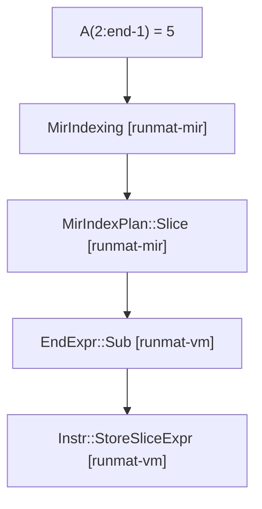
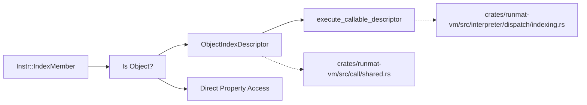

# Indexing Subsystem

<details>
<summary>Relevant source files</summary>

- [crates/runmat-vm/src/bytecode/compile.rs](https://github.com/runmat-org/runmat/blob/82685330/crates/runmat-vm/src/bytecode/compile.rs)
- [crates/runmat-vm/src/bytecode/instr.rs](https://github.com/runmat-org/runmat/blob/82685330/crates/runmat-vm/src/bytecode/instr.rs)
- [crates/runmat-vm/src/call/shared.rs](https://github.com/runmat-org/runmat/blob/82685330/crates/runmat-vm/src/call/shared.rs)
- [crates/runmat-vm/src/compiler/core.rs](https://github.com/runmat-org/runmat/blob/82685330/crates/runmat-vm/src/compiler/core.rs)
- [crates/runmat-vm/src/indexing/plan.rs](https://github.com/runmat-org/runmat/blob/82685330/crates/runmat-vm/src/indexing/plan.rs)
- [crates/runmat-vm/src/indexing/read_slice.rs](https://github.com/runmat-org/runmat/blob/82685330/crates/runmat-vm/src/indexing/read_slice.rs)
- [crates/runmat-vm/src/indexing/selectors.rs](https://github.com/runmat-org/runmat/blob/82685330/crates/runmat-vm/src/indexing/selectors.rs)
- [crates/runmat-vm/src/indexing/write_linear.rs](https://github.com/runmat-org/runmat/blob/82685330/crates/runmat-vm/src/indexing/write_linear.rs)
- [crates/runmat-vm/src/indexing/write_slice.rs](https://github.com/runmat-org/runmat/blob/82685330/crates/runmat-vm/src/indexing/write_slice.rs)
- [crates/runmat-vm/src/interpreter/dispatch/calls.rs](https://github.com/runmat-org/runmat/blob/82685330/crates/runmat-vm/src/interpreter/dispatch/calls.rs)
- [crates/runmat-vm/src/interpreter/dispatch/indexing.rs](https://github.com/runmat-org/runmat/blob/82685330/crates/runmat-vm/src/interpreter/dispatch/indexing.rs)
- [crates/runmat-vm/src/interpreter/dispatch/mod.rs](https://github.com/runmat-org/runmat/blob/82685330/crates/runmat-vm/src/interpreter/dispatch/mod.rs)
- [crates/runmat-vm/src/interpreter/runner.rs](https://github.com/runmat-org/runmat/blob/82685330/crates/runmat-vm/src/interpreter/runner.rs)
- [crates/runmat-vm/tests/functions.rs](https://github.com/runmat-org/runmat/blob/82685330/crates/runmat-vm/tests/functions.rs)
- [crates/runmat-vm/tests/indexing.rs](https://github.com/runmat-org/runmat/blob/82685330/crates/runmat-vm/tests/indexing.rs)
- [crates/runmat-vm/tests/lvalue_assign.rs](https://github.com/runmat-org/runmat/blob/82685330/crates/runmat-vm/tests/lvalue_assign.rs)
- [crates/runmat-vm/tests/matrix_slicing.rs](https://github.com/runmat-org/runmat/blob/82685330/crates/runmat-vm/tests/matrix_slicing.rs)
- [docs-tmp/COMPLETION_AUDIT.md](https://github.com/runmat-org/runmat/blob/82685330/docs-tmp/COMPLETION_AUDIT.md?plain=1)
- [docs-tmp/DELIVERABLE_AUDIT.md](https://github.com/runmat-org/runmat/blob/82685330/docs-tmp/DELIVERABLE_AUDIT.md?plain=1)
- [docs-tmp/NEXT_STEPS.md](https://github.com/runmat-org/runmat/blob/82685330/docs-tmp/NEXT_STEPS.md?plain=1)
- [docs-tmp/PROGRESS.md](https://github.com/runmat-org/runmat/blob/82685330/docs-tmp/PROGRESS.md?plain=1)

</details>

The Indexing Subsystem in RunMat manages the lifecycle of MATLAB indexing operations—from Mid-Level IR (MIR) planning to VM execution. It handles scalar access, multi-dimensional slicing, linear indexing, cell array expansion, and object-oriented `subsref`/`subsasgn` dispatch. The system is designed to move index classification earlier into the compilation pipeline, ensuring that the VM executes explicit plans rather than inferring semantics from runtime value shapes.

## Index Planning and MIR Lowering

Indexing operations are categorized during MIR lowering into structured plans. This prevents "stack-sniffing" at runtime and allows the compiler to emit typed instructions for specific indexing behaviors.

### IndexPlan Categories

The system distinguishes between several fundamental indexing forms:

- Scalar: Direct access to a single element using numeric indices.
- Slice: Access using colons (`:`), ranges (`1:10`), or logical masks.
- SliceExpr: Indexing involving the `end` keyword, requiring dynamic evaluation of the array's dimensions.
- Cell: Access to cell array contents (`{}`) versus cell array containers (`()`).

### End-Expression Evaluation

The `end` keyword is handled by `EndExpr` trees [crates/runmat-vm/src/bytecode/instr.rs](https://github.com/runmat-org/runmat/blob/82685330/crates/runmat-vm/src/bytecode/instr.rs) These expressions are evaluated at runtime by `idx_end_expr` [crates/runmat-vm/src/interpreter/dispatch/indexing.rs #8](https://github.com/runmat-org/runmat/blob/82685330/crates/runmat-vm/src/interpreter/dispatch/indexing.rs#L8-L8) to resolve the current dimension's maximum bound before performing the actual index operation.



<details>
<summary>Rendered SVG</summary>

```svg
<svg id="mermaid-5hosa8qt6wx" xmlns="http://www.w3.org/2000/svg" xmlns:xlink="http://www.w3.org/1999/xlink" class="flowchart" style="max-width: 100%; touch-action: none; user-select: none; cursor: grab; min-height: fit-content; max-height: 100%;" viewBox="0 0 346 658" role="graphics-document document" aria-roledescription="flowchart-v2" preserveAspectRatio="xMidYMid meet"><style>#mermaid-5hosa8qt6wx{font-family:ui-sans-serif,-apple-system,system-ui,Segoe UI,Helvetica;font-size:16px;fill:#ccc;}@keyframes edge-animation-frame{from{stroke-dashoffset:0;}}@keyframes dash{to{stroke-dashoffset:0;}}#mermaid-5hosa8qt6wx .edge-animation-slow{stroke-dasharray:9,5!important;stroke-dashoffset:900;animation:dash 50s linear infinite;stroke-linecap:round;}#mermaid-5hosa8qt6wx .edge-animation-fast{stroke-dasharray:9,5!important;stroke-dashoffset:900;animation:dash 20s linear infinite;stroke-linecap:round;}#mermaid-5hosa8qt6wx .error-icon{fill:#333;}#mermaid-5hosa8qt6wx .error-text{fill:#cccccc;stroke:#cccccc;}#mermaid-5hosa8qt6wx .edge-thickness-normal{stroke-width:1px;}#mermaid-5hosa8qt6wx .edge-thickness-thick{stroke-width:3.5px;}#mermaid-5hosa8qt6wx .edge-pattern-solid{stroke-dasharray:0;}#mermaid-5hosa8qt6wx .edge-thickness-invisible{stroke-width:0;fill:none;}#mermaid-5hosa8qt6wx .edge-pattern-dashed{stroke-dasharray:3;}#mermaid-5hosa8qt6wx .edge-pattern-dotted{stroke-dasharray:2;}#mermaid-5hosa8qt6wx .marker{fill:#666;stroke:#666;}#mermaid-5hosa8qt6wx .marker.cross{stroke:#666;}#mermaid-5hosa8qt6wx svg{font-family:ui-sans-serif,-apple-system,system-ui,Segoe UI,Helvetica;font-size:16px;}#mermaid-5hosa8qt6wx p{margin:0;}#mermaid-5hosa8qt6wx .label{font-family:ui-sans-serif,-apple-system,system-ui,Segoe UI,Helvetica;color:#fff;}#mermaid-5hosa8qt6wx .cluster-label text{fill:#fff;}#mermaid-5hosa8qt6wx .cluster-label span{color:#fff;}#mermaid-5hosa8qt6wx .cluster-label span p{background-color:transparent;}#mermaid-5hosa8qt6wx .label text,#mermaid-5hosa8qt6wx span{fill:#fff;color:#fff;}#mermaid-5hosa8qt6wx .node rect,#mermaid-5hosa8qt6wx .node circle,#mermaid-5hosa8qt6wx .node ellipse,#mermaid-5hosa8qt6wx .node polygon,#mermaid-5hosa8qt6wx .node path{fill:#111;stroke:#222;stroke-width:1px;}#mermaid-5hosa8qt6wx .rough-node .label text,#mermaid-5hosa8qt6wx .node .label text,#mermaid-5hosa8qt6wx .image-shape .label,#mermaid-5hosa8qt6wx .icon-shape .label{text-anchor:middle;}#mermaid-5hosa8qt6wx .node .katex path{fill:#000;stroke:#000;stroke-width:1px;}#mermaid-5hosa8qt6wx .rough-node .label,#mermaid-5hosa8qt6wx .node .label,#mermaid-5hosa8qt6wx .image-shape .label,#mermaid-5hosa8qt6wx .icon-shape .label{text-align:center;}#mermaid-5hosa8qt6wx .node.clickable{cursor:pointer;}#mermaid-5hosa8qt6wx .root .anchor path{fill:#666!important;stroke-width:0;stroke:#666;}#mermaid-5hosa8qt6wx .arrowheadPath{fill:#0b0b0b;}#mermaid-5hosa8qt6wx .edgePath .path{stroke:#666;stroke-width:1px;}#mermaid-5hosa8qt6wx .flowchart-link{stroke:#666;fill:none;}#mermaid-5hosa8qt6wx .edgeLabel{background-color:#161616;text-align:center;}#mermaid-5hosa8qt6wx .edgeLabel p{background-color:#161616;}#mermaid-5hosa8qt6wx .edgeLabel rect{opacity:0.5;background-color:#161616;fill:#161616;}#mermaid-5hosa8qt6wx .labelBkg{background-color:rgba(22, 22, 22, 0.5);}#mermaid-5hosa8qt6wx .cluster rect{fill:#161616;stroke:#222;stroke-width:1px;}#mermaid-5hosa8qt6wx .cluster text{fill:#fff;}#mermaid-5hosa8qt6wx .cluster span{color:#fff;}#mermaid-5hosa8qt6wx div.mermaidTooltip{position:absolute;text-align:center;max-width:200px;padding:2px;font-family:ui-sans-serif,-apple-system,system-ui,Segoe UI,Helvetica;font-size:12px;background:#333;border:1px solid hsl(0, 0%, 10%);border-radius:2px;pointer-events:none;z-index:100;}#mermaid-5hosa8qt6wx .flowchartTitleText{text-anchor:middle;font-size:18px;fill:#ccc;}#mermaid-5hosa8qt6wx rect.text{fill:none;stroke-width:0;}#mermaid-5hosa8qt6wx .icon-shape,#mermaid-5hosa8qt6wx .image-shape{background-color:#161616;text-align:center;}#mermaid-5hosa8qt6wx .icon-shape p,#mermaid-5hosa8qt6wx .image-shape p{background-color:#161616;padding:2px;}#mermaid-5hosa8qt6wx .icon-shape .label rect,#mermaid-5hosa8qt6wx .image-shape .label rect{opacity:0.5;background-color:#161616;fill:#161616;}#mermaid-5hosa8qt6wx .label-icon{display:inline-block;height:1em;overflow:visible;vertical-align:-0.125em;}#mermaid-5hosa8qt6wx .node .label-icon path{fill:currentColor;stroke:revert;stroke-width:revert;}#mermaid-5hosa8qt6wx .node .neo-node{stroke:#222;}#mermaid-5hosa8qt6wx [data-look="neo"].node rect,#mermaid-5hosa8qt6wx [data-look="neo"].cluster rect,#mermaid-5hosa8qt6wx [data-look="neo"].node polygon{stroke:url(#mermaid-5hosa8qt6wx-gradient);filter:drop-shadow( 1px 2px 2px rgba(185,185,185,1));}#mermaid-5hosa8qt6wx [data-look="neo"].node path{stroke:url(#mermaid-5hosa8qt6wx-gradient);stroke-width:1px;}#mermaid-5hosa8qt6wx [data-look="neo"].node .outer-path{filter:drop-shadow( 1px 2px 2px rgba(185,185,185,1));}#mermaid-5hosa8qt6wx [data-look="neo"].node .neo-line path{stroke:#222;filter:none;}#mermaid-5hosa8qt6wx [data-look="neo"].node circle{stroke:url(#mermaid-5hosa8qt6wx-gradient);filter:drop-shadow( 1px 2px 2px rgba(185,185,185,1));}#mermaid-5hosa8qt6wx [data-look="neo"].node circle .state-start{fill:#000000;}#mermaid-5hosa8qt6wx [data-look="neo"].icon-shape .icon{fill:url(#mermaid-5hosa8qt6wx-gradient);filter:drop-shadow( 1px 2px 2px rgba(185,185,185,1));}#mermaid-5hosa8qt6wx [data-look="neo"].icon-shape .icon-neo path{stroke:url(#mermaid-5hosa8qt6wx-gradient);filter:drop-shadow( 1px 2px 2px rgba(185,185,185,1));}#mermaid-5hosa8qt6wx :root{--mermaid-font-family:"trebuchet ms",verdana,arial,sans-serif;}</style><g><marker id="mermaid-5hosa8qt6wx_flowchart-v2-pointEnd" class="marker flowchart-v2" viewBox="0 0 10 10" refX="5" refY="5" markerUnits="userSpaceOnUse" markerWidth="8" markerHeight="8" orient="auto"><path d="M 0 0 L 10 5 L 0 10 z" class="arrowMarkerPath" style="stroke-width: 1; stroke-dasharray: 1, 0;"></path></marker><marker id="mermaid-5hosa8qt6wx_flowchart-v2-pointStart" class="marker flowchart-v2" viewBox="0 0 10 10" refX="4.5" refY="5" markerUnits="userSpaceOnUse" markerWidth="8" markerHeight="8" orient="auto"><path d="M 0 5 L 10 10 L 10 0 z" class="arrowMarkerPath" style="stroke-width: 1; stroke-dasharray: 1, 0;"></path></marker><marker id="mermaid-5hosa8qt6wx_flowchart-v2-pointEnd-margin" class="marker flowchart-v2" viewBox="0 0 11.5 14" refX="11.5" refY="7" markerUnits="userSpaceOnUse" markerWidth="10.5" markerHeight="14" orient="auto"><path d="M 0 0 L 11.5 7 L 0 14 z" class="arrowMarkerPath" style="stroke-width: 0; stroke-dasharray: 1, 0;"></path></marker><marker id="mermaid-5hosa8qt6wx_flowchart-v2-pointStart-margin" class="marker flowchart-v2" viewBox="0 0 11.5 14" refX="1" refY="7" markerUnits="userSpaceOnUse" markerWidth="11.5" markerHeight="14" orient="auto"><polygon points="0,7 11.5,14 11.5,0" class="arrowMarkerPath" style="stroke-width: 0; stroke-dasharray: 1, 0;"></polygon></marker><marker id="mermaid-5hosa8qt6wx_flowchart-v2-circleEnd" class="marker flowchart-v2" viewBox="0 0 10 10" refX="11" refY="5" markerUnits="userSpaceOnUse" markerWidth="11" markerHeight="11" orient="auto"><circle cx="5" cy="5" r="5" class="arrowMarkerPath" style="stroke-width: 1; stroke-dasharray: 1, 0;"></circle></marker><marker id="mermaid-5hosa8qt6wx_flowchart-v2-circleStart" class="marker flowchart-v2" viewBox="0 0 10 10" refX="-1" refY="5" markerUnits="userSpaceOnUse" markerWidth="11" markerHeight="11" orient="auto"><circle cx="5" cy="5" r="5" class="arrowMarkerPath" style="stroke-width: 1; stroke-dasharray: 1, 0;"></circle></marker><marker id="mermaid-5hosa8qt6wx_flowchart-v2-circleEnd-margin" class="marker flowchart-v2" viewBox="0 0 10 10" refY="5" refX="12.25" markerUnits="userSpaceOnUse" markerWidth="14" markerHeight="14" orient="auto"><circle cx="5" cy="5" r="5" class="arrowMarkerPath" style="stroke-width: 0; stroke-dasharray: 1, 0;"></circle></marker><marker id="mermaid-5hosa8qt6wx_flowchart-v2-circleStart-margin" class="marker flowchart-v2" viewBox="0 0 10 10" refX="-2" refY="5" markerUnits="userSpaceOnUse" markerWidth="14" markerHeight="14" orient="auto"><circle cx="5" cy="5" r="5" class="arrowMarkerPath" style="stroke-width: 0; stroke-dasharray: 1, 0;"></circle></marker><marker id="mermaid-5hosa8qt6wx_flowchart-v2-crossEnd" class="marker cross flowchart-v2" viewBox="0 0 11 11" refX="12" refY="5.2" markerUnits="userSpaceOnUse" markerWidth="11" markerHeight="11" orient="auto"><path d="M 1,1 l 9,9 M 10,1 l -9,9" class="arrowMarkerPath" style="stroke-width: 2; stroke-dasharray: 1, 0;"></path></marker><marker id="mermaid-5hosa8qt6wx_flowchart-v2-crossStart" class="marker cross flowchart-v2" viewBox="0 0 11 11" refX="-1" refY="5.2" markerUnits="userSpaceOnUse" markerWidth="11" markerHeight="11" orient="auto"><path d="M 1,1 l 9,9 M 10,1 l -9,9" class="arrowMarkerPath" style="stroke-width: 2; stroke-dasharray: 1, 0;"></path></marker><marker id="mermaid-5hosa8qt6wx_flowchart-v2-crossEnd-margin" class="marker cross flowchart-v2" viewBox="0 0 15 15" refX="17.7" refY="7.5" markerUnits="userSpaceOnUse" markerWidth="12" markerHeight="12" orient="auto"><path d="M 1,1 L 14,14 M 1,14 L 14,1" class="arrowMarkerPath" style="stroke-width: 2.5;"></path></marker><marker id="mermaid-5hosa8qt6wx_flowchart-v2-crossStart-margin" class="marker cross flowchart-v2" viewBox="0 0 15 15" refX="-3.5" refY="7.5" markerUnits="userSpaceOnUse" markerWidth="12" markerHeight="12" orient="auto"><path d="M 1,1 L 14,14 M 1,14 L 14,1" class="arrowMarkerPath" style="stroke-width: 2.5; stroke-dasharray: 1, 0;"></path></marker><g class="root"><g class="clusters"><g class="cluster" id="mermaid-5hosa8qt6wx-subGraph1" data-look="classic"><rect style="" x="8" y="186" width="330" height="464"></rect><g class="cluster-label" transform="translate(106.2109375, 186)"><foreignObject width="133.578125" height="24"><div style="display: table-cell; white-space: nowrap; line-height: 1.5;" xmlns="http://www.w3.org/1999/xhtml"><span class="nodeLabel"><p>Code Entity Space</p></span></div></foreignObject></g></g><g class="cluster" id="mermaid-5hosa8qt6wx-subGraph0" data-look="classic"><rect style="" x="55.359375" y="8" width="235.28125" height="104"></rect><g class="cluster-label" transform="translate(84.0546875, 8)"><foreignObject width="177.890625" height="24"><div style="display: table-cell; white-space: nowrap; line-height: 1.5;" xmlns="http://www.w3.org/1999/xhtml"><span class="nodeLabel"><p>Natural Language Space</p></span></div></foreignObject></g></g></g><g class="edgePaths"><path d="M173,265L173,269.167C173,273.333,173,281.667,173,289.333C173,297,173,304,173,307.5L173,311" id="mermaid-5hosa8qt6wx-L_B_C_0" class="edge-thickness-normal edge-pattern-solid edge-thickness-normal edge-pattern-solid flowchart-link" style=";" data-edge="true" data-et="edge" data-id="L_B_C_0" data-points="W3sieCI6MTczLCJ5IjoyNjV9LHsieCI6MTczLCJ5IjoyOTB9LHsieCI6MTczLCJ5IjozMTV9XQ==" data-look="classic" marker-end="url(#mermaid-5hosa8qt6wx_flowchart-v2-pointEnd)"></path><path d="M173,393L173,397.167C173,401.333,173,409.667,173,417.333C173,425,173,432,173,435.5L173,439" id="mermaid-5hosa8qt6wx-L_C_D_0" class="edge-thickness-normal edge-pattern-solid edge-thickness-normal edge-pattern-solid flowchart-link" style=";" data-edge="true" data-et="edge" data-id="L_C_D_0" data-points="W3sieCI6MTczLCJ5IjozOTN9LHsieCI6MTczLCJ5Ijo0MTh9LHsieCI6MTczLCJ5Ijo0NDN9XQ==" data-look="classic" marker-end="url(#mermaid-5hosa8qt6wx_flowchart-v2-pointEnd)"></path><path d="M173,497L173,501.167C173,505.333,173,513.667,173,521.333C173,529,173,536,173,539.5L173,543" id="mermaid-5hosa8qt6wx-L_D_E_0" class="edge-thickness-normal edge-pattern-solid edge-thickness-normal edge-pattern-solid flowchart-link" style=";" data-edge="true" data-et="edge" data-id="L_D_E_0" data-points="W3sieCI6MTczLCJ5Ijo0OTd9LHsieCI6MTczLCJ5Ijo1MjJ9LHsieCI6MTczLCJ5Ijo1NDd9XQ==" data-look="classic" marker-end="url(#mermaid-5hosa8qt6wx_flowchart-v2-pointEnd)"></path><path d="M173,87L173,91.167C173,95.333,173,103.667,173,114C173,124.333,173,136.667,173,149C173,161.333,173,173.667,173,183.333C173,193,173,200,173,203.5L173,207" id="mermaid-5hosa8qt6wx-L_A_B_0" class="edge-thickness-normal edge-pattern-solid edge-thickness-normal edge-pattern-solid flowchart-link" style=";" data-edge="true" data-et="edge" data-id="L_A_B_0" data-points="W3sieCI6MTczLCJ5Ijo4N30seyJ4IjoxNzMsInkiOjExMn0seyJ4IjoxNzMsInkiOjE0OX0seyJ4IjoxNzMsInkiOjE4Nn0seyJ4IjoxNzMsInkiOjIxMX1d" data-look="classic" marker-end="url(#mermaid-5hosa8qt6wx_flowchart-v2-pointEnd)"></path></g><g class="edgeLabels"><g class="edgeLabel"><g class="label" data-id="L_B_C_0" transform="translate(0, 0)"><foreignObject width="0" height="0"><div style="display: table-cell; white-space: nowrap; line-height: 1.5; max-width: 200px; text-align: center;" xmlns="http://www.w3.org/1999/xhtml" class="labelBkg"><span class="edgeLabel"></span></div></foreignObject></g></g><g class="edgeLabel"><g class="label" data-id="L_C_D_0" transform="translate(0, 0)"><foreignObject width="0" height="0"><div style="display: table-cell; white-space: nowrap; line-height: 1.5; max-width: 200px; text-align: center;" xmlns="http://www.w3.org/1999/xhtml" class="labelBkg"><span class="edgeLabel"></span></div></foreignObject></g></g><g class="edgeLabel"><g class="label" data-id="L_D_E_0" transform="translate(0, 0)"><foreignObject width="0" height="0"><div style="display: table-cell; white-space: nowrap; line-height: 1.5; max-width: 200px; text-align: center;" xmlns="http://www.w3.org/1999/xhtml" class="labelBkg"><span class="edgeLabel"></span></div></foreignObject></g></g><g class="edgeLabel" transform="translate(173, 149)"><g class="label" data-id="L_A_B_0" transform="translate(-32.78125, -12)"><foreignObject width="65.5625" height="24"><div style="display: table-cell; white-space: nowrap; line-height: 1.5; max-width: 200px; text-align: center;" xmlns="http://www.w3.org/1999/xhtml" class="labelBkg"><span class="edgeLabel"><p>lowers to</p></span></div></foreignObject></g></g></g><g class="nodes"><g class="node default" id="mermaid-5hosa8qt6wx-flowchart-A-0" data-look="classic" transform="translate(173, 60)"><rect class="basic label-container" style="" x="-82.640625" y="-27" width="165.28125" height="54"></rect><g class="label" style="" transform="translate(-52.640625, -12)"><rect></rect><foreignObject width="105.28125" height="24"><div style="display: table-cell; white-space: nowrap; line-height: 1.5; max-width: 200px; text-align: center;" xmlns="http://www.w3.org/1999/xhtml"><span class="nodeLabel"><p>A(2:end-1) = 5</p></span></div></foreignObject></g></g><g class="node default" id="mermaid-5hosa8qt6wx-flowchart-B-1" data-look="classic" transform="translate(173, 238)"><rect class="basic label-container" style="" x="-120.7421875" y="-27" width="241.484375" height="54"></rect><g class="label" style="" transform="translate(-90.7421875, -12)"><rect></rect><foreignObject width="181.484375" height="24"><div style="display: table-cell; white-space: nowrap; line-height: 1.5; max-width: 200px; text-align: center;" xmlns="http://www.w3.org/1999/xhtml"><span class="nodeLabel"><p>MirIndexing [runmat-mir]</p></span></div></foreignObject></g></g><g class="node default" id="mermaid-5hosa8qt6wx-flowchart-C-2" data-look="classic" transform="translate(173, 354)"><rect class="basic label-container" style="" x="-130" y="-39" width="260" height="78"></rect><g class="label" style="" transform="translate(-100, -24)"><rect></rect><foreignObject width="200" height="48"><div style="display: table; white-space: break-spaces; line-height: 1.5; max-width: 200px; text-align: center; width: 200px;" xmlns="http://www.w3.org/1999/xhtml"><span class="nodeLabel"><p>MirIndexPlan::Slice [runmat-mir]</p></span></div></foreignObject></g></g><g class="node default" id="mermaid-5hosa8qt6wx-flowchart-D-3" data-look="classic" transform="translate(173, 470)"><rect class="basic label-container" style="" x="-126.78125" y="-27" width="253.5625" height="54"></rect><g class="label" style="" transform="translate(-96.78125, -12)"><rect></rect><foreignObject width="193.5625" height="24"><div style="display: table-cell; white-space: nowrap; line-height: 1.5; max-width: 200px; text-align: center;" xmlns="http://www.w3.org/1999/xhtml"><span class="nodeLabel"><p>EndExpr::Sub [runmat-vm]</p></span></div></foreignObject></g></g><g class="node default" id="mermaid-5hosa8qt6wx-flowchart-E-4" data-look="classic" transform="translate(173, 586)"><rect class="basic label-container" style="" x="-130" y="-39" width="260" height="78"></rect><g class="label" style="" transform="translate(-100, -24)"><rect></rect><foreignObject width="200" height="48"><div style="display: table; white-space: break-spaces; line-height: 1.5; max-width: 200px; text-align: center; width: 200px;" xmlns="http://www.w3.org/1999/xhtml"><span class="nodeLabel"><p>Instr::StoreSliceExpr [runmat-vm]</p></span></div></foreignObject></g></g></g></g></g><defs><filter id="mermaid-5hosa8qt6wx-drop-shadow" height="130%" width="130%"><feDropShadow dx="4" dy="4" stdDeviation="0" flood-opacity="0.06" flood-color="#000000"></feDropShadow></filter></defs><defs><filter id="mermaid-5hosa8qt6wx-drop-shadow-small" height="150%" width="150%"><feDropShadow dx="2" dy="2" stdDeviation="0" flood-opacity="0.06" flood-color="#000000"></feDropShadow></filter></defs><linearGradient id="mermaid-5hosa8qt6wx-gradient" gradientUnits="objectBoundingBox" x1="0%" y1="0%" x2="100%" y2="0%"><stop offset="0%" stop-color="#333" stop-opacity="1"></stop><stop offset="100%" stop-color="hsl(-120, 0%, 3.3333333333%)" stop-opacity="1"></stop></linearGradient></svg>
```

</details>

Sources: [crates/runmat-vm/src/compiler/core.rs #10-15](https://github.com/runmat-org/runmat/blob/82685330/crates/runmat-vm/src/compiler/core.rs#L10-L15) [crates/runmat-vm/src/bytecode/instr.rs](https://github.com/runmat-org/runmat/blob/82685330/crates/runmat-vm/src/bytecode/instr.rs) [crates/runmat-vm/src/interpreter/dispatch/indexing.rs #1-16](https://github.com/runmat-org/runmat/blob/82685330/crates/runmat-vm/src/interpreter/dispatch/indexing.rs#L1-L16)

## VM Execution Flow

The VM interpreter dispatches indexing instructions to specialized handlers in `crates/runmat-vm/src/interpreter/dispatch/indexing.rs`.

### Read Operations (Subsref)

1. Instruction Dispatch: The interpreter encounters `IndexScalar`, `IndexSlice`, or `IndexSliceExpr`.
2. Selector Building: `build_slice_selectors` converts VM stack values into `SliceSelector` enums [crates/runmat-vm/src/interpreter/dispatch/indexing.rs #12-14](https://github.com/runmat-org/runmat/blob/82685330/crates/runmat-vm/src/interpreter/dispatch/indexing.rs#L12-L14)
3. Data Retrieval:
  - For tensors, `idx_read_slice` or `idx_read_linear` performs the gather operation [crates/runmat-vm/src/interpreter/dispatch/indexing.rs #10-11](https://github.com/runmat-org/runmat/blob/82685330/crates/runmat-vm/src/interpreter/dispatch/indexing.rs#L10-L11)
  - For cells, the system handles comma-separated list expansion if the context requires multiple outputs.

### Write Operations (Subsasgn)

1. LHS Preparation: The target variable is loaded.
2. RHS Normalization: The system enforces rectangular shape invariants. If the RHS is `[]` (empty), the operation is treated as a deletion [crates/runmat-vm/src/compiler/core.rs #101-103](https://github.com/runmat-org/runmat/blob/82685330/crates/runmat-vm/src/compiler/core.rs#L101-L103)
3. Execution: `idx_write_slice` or `idx_write_linear` updates the underlying data structure, respecting MATLAB's copy-on-write semantics.

### Logical Indexing and Round-Tripping

Logical arrays used as indices are converted to masks. The system supports "round-tripping" where logical masks are maintained across GPU/CPU boundaries to avoid unnecessary materialization [crates/runmat-vm/src/interpreter/dispatch/indexing.rs #35-48](https://github.com/runmat-org/runmat/blob/82685330/crates/runmat-vm/src/interpreter/dispatch/indexing.rs#L35-L48)

Sources: [crates/runmat-vm/src/interpreter/dispatch/indexing.rs #1-29](https://github.com/runmat-org/runmat/blob/82685330/crates/runmat-vm/src/interpreter/dispatch/indexing.rs#L1-L29) [crates/runmat-vm/src/compiler/core.rs #92-112](https://github.com/runmat-org/runmat/blob/82685330/crates/runmat-vm/src/compiler/core.rs#L92-L112)

## Object Indexing and Dispatch

When indexing is performed on a class instance (Object or HandleObject), the VM dispatches to the MATLAB object protocol.

| Operation | MATLAB Method | Internal Dispatcher |
| --- | --- | --- |
| obj(idx) | subsref (Paren) | ObjectIndexKind::Paren |
| obj{idx} | subsref (Brace) | ObjectIndexKind::Brace |
| obj.prop | subsref (Dot) | ObjectIndexKind::Member |
| obj(idx) = val | subsasgn | ObjectIndexOp::Subsasgn |

### Dispatch Logic

The VM checks if the class defines a custom `subsref` or `subsasgn`. If so, it bundles the indices into a structured `ObjectIndexDescriptor` and calls the method [crates/runmat-vm/src/call/shared.rs #181-187](https://github.com/runmat-org/runmat/blob/82685330/crates/runmat-vm/src/call/shared.rs#L181-L187) If not defined, it falls back to built-in property access or erroring with `RunMat:MissingSubsref` [crates/runmat-vm/src/interpreter/dispatch/indexing.rs #77-80](https://github.com/runmat-org/runmat/blob/82685330/crates/runmat-vm/src/interpreter/dispatch/indexing.rs#L77-L80)



<details>
<summary>Rendered SVG</summary>

```svg
<svg id="mermaid-71q8vyfr9sm" xmlns="http://www.w3.org/2000/svg" xmlns:xlink="http://www.w3.org/1999/xlink" class="flowchart" style="max-width: 100%; touch-action: none; user-select: none; cursor: grab; min-height: fit-content; max-height: 100%;" viewBox="-0.0032957172622900544 0 825.8659664345246 706.421875" role="graphics-document document" aria-roledescription="flowchart-v2" preserveAspectRatio="xMidYMid meet"><style>#mermaid-71q8vyfr9sm{font-family:ui-sans-serif,-apple-system,system-ui,Segoe UI,Helvetica;font-size:16px;fill:#ccc;}@keyframes edge-animation-frame{from{stroke-dashoffset:0;}}@keyframes dash{to{stroke-dashoffset:0;}}#mermaid-71q8vyfr9sm .edge-animation-slow{stroke-dasharray:9,5!important;stroke-dashoffset:900;animation:dash 50s linear infinite;stroke-linecap:round;}#mermaid-71q8vyfr9sm .edge-animation-fast{stroke-dasharray:9,5!important;stroke-dashoffset:900;animation:dash 20s linear infinite;stroke-linecap:round;}#mermaid-71q8vyfr9sm .error-icon{fill:#333;}#mermaid-71q8vyfr9sm .error-text{fill:#cccccc;stroke:#cccccc;}#mermaid-71q8vyfr9sm .edge-thickness-normal{stroke-width:1px;}#mermaid-71q8vyfr9sm .edge-thickness-thick{stroke-width:3.5px;}#mermaid-71q8vyfr9sm .edge-pattern-solid{stroke-dasharray:0;}#mermaid-71q8vyfr9sm .edge-thickness-invisible{stroke-width:0;fill:none;}#mermaid-71q8vyfr9sm .edge-pattern-dashed{stroke-dasharray:3;}#mermaid-71q8vyfr9sm .edge-pattern-dotted{stroke-dasharray:2;}#mermaid-71q8vyfr9sm .marker{fill:#666;stroke:#666;}#mermaid-71q8vyfr9sm .marker.cross{stroke:#666;}#mermaid-71q8vyfr9sm svg{font-family:ui-sans-serif,-apple-system,system-ui,Segoe UI,Helvetica;font-size:16px;}#mermaid-71q8vyfr9sm p{margin:0;}#mermaid-71q8vyfr9sm .label{font-family:ui-sans-serif,-apple-system,system-ui,Segoe UI,Helvetica;color:#fff;}#mermaid-71q8vyfr9sm .cluster-label text{fill:#fff;}#mermaid-71q8vyfr9sm .cluster-label span{color:#fff;}#mermaid-71q8vyfr9sm .cluster-label span p{background-color:transparent;}#mermaid-71q8vyfr9sm .label text,#mermaid-71q8vyfr9sm span{fill:#fff;color:#fff;}#mermaid-71q8vyfr9sm .node rect,#mermaid-71q8vyfr9sm .node circle,#mermaid-71q8vyfr9sm .node ellipse,#mermaid-71q8vyfr9sm .node polygon,#mermaid-71q8vyfr9sm .node path{fill:#111;stroke:#222;stroke-width:1px;}#mermaid-71q8vyfr9sm .rough-node .label text,#mermaid-71q8vyfr9sm .node .label text,#mermaid-71q8vyfr9sm .image-shape .label,#mermaid-71q8vyfr9sm .icon-shape .label{text-anchor:middle;}#mermaid-71q8vyfr9sm .node .katex path{fill:#000;stroke:#000;stroke-width:1px;}#mermaid-71q8vyfr9sm .rough-node .label,#mermaid-71q8vyfr9sm .node .label,#mermaid-71q8vyfr9sm .image-shape .label,#mermaid-71q8vyfr9sm .icon-shape .label{text-align:center;}#mermaid-71q8vyfr9sm .node.clickable{cursor:pointer;}#mermaid-71q8vyfr9sm .root .anchor path{fill:#666!important;stroke-width:0;stroke:#666;}#mermaid-71q8vyfr9sm .arrowheadPath{fill:#0b0b0b;}#mermaid-71q8vyfr9sm .edgePath .path{stroke:#666;stroke-width:1px;}#mermaid-71q8vyfr9sm .flowchart-link{stroke:#666;fill:none;}#mermaid-71q8vyfr9sm .edgeLabel{background-color:#161616;text-align:center;}#mermaid-71q8vyfr9sm .edgeLabel p{background-color:#161616;}#mermaid-71q8vyfr9sm .edgeLabel rect{opacity:0.5;background-color:#161616;fill:#161616;}#mermaid-71q8vyfr9sm .labelBkg{background-color:rgba(22, 22, 22, 0.5);}#mermaid-71q8vyfr9sm .cluster rect{fill:#161616;stroke:#222;stroke-width:1px;}#mermaid-71q8vyfr9sm .cluster text{fill:#fff;}#mermaid-71q8vyfr9sm .cluster span{color:#fff;}#mermaid-71q8vyfr9sm div.mermaidTooltip{position:absolute;text-align:center;max-width:200px;padding:2px;font-family:ui-sans-serif,-apple-system,system-ui,Segoe UI,Helvetica;font-size:12px;background:#333;border:1px solid hsl(0, 0%, 10%);border-radius:2px;pointer-events:none;z-index:100;}#mermaid-71q8vyfr9sm .flowchartTitleText{text-anchor:middle;font-size:18px;fill:#ccc;}#mermaid-71q8vyfr9sm rect.text{fill:none;stroke-width:0;}#mermaid-71q8vyfr9sm .icon-shape,#mermaid-71q8vyfr9sm .image-shape{background-color:#161616;text-align:center;}#mermaid-71q8vyfr9sm .icon-shape p,#mermaid-71q8vyfr9sm .image-shape p{background-color:#161616;padding:2px;}#mermaid-71q8vyfr9sm .icon-shape .label rect,#mermaid-71q8vyfr9sm .image-shape .label rect{opacity:0.5;background-color:#161616;fill:#161616;}#mermaid-71q8vyfr9sm .label-icon{display:inline-block;height:1em;overflow:visible;vertical-align:-0.125em;}#mermaid-71q8vyfr9sm .node .label-icon path{fill:currentColor;stroke:revert;stroke-width:revert;}#mermaid-71q8vyfr9sm .node .neo-node{stroke:#222;}#mermaid-71q8vyfr9sm [data-look="neo"].node rect,#mermaid-71q8vyfr9sm [data-look="neo"].cluster rect,#mermaid-71q8vyfr9sm [data-look="neo"].node polygon{stroke:url(#mermaid-71q8vyfr9sm-gradient);filter:drop-shadow( 1px 2px 2px rgba(185,185,185,1));}#mermaid-71q8vyfr9sm [data-look="neo"].node path{stroke:url(#mermaid-71q8vyfr9sm-gradient);stroke-width:1px;}#mermaid-71q8vyfr9sm [data-look="neo"].node .outer-path{filter:drop-shadow( 1px 2px 2px rgba(185,185,185,1));}#mermaid-71q8vyfr9sm [data-look="neo"].node .neo-line path{stroke:#222;filter:none;}#mermaid-71q8vyfr9sm [data-look="neo"].node circle{stroke:url(#mermaid-71q8vyfr9sm-gradient);filter:drop-shadow( 1px 2px 2px rgba(185,185,185,1));}#mermaid-71q8vyfr9sm [data-look="neo"].node circle .state-start{fill:#000000;}#mermaid-71q8vyfr9sm [data-look="neo"].icon-shape .icon{fill:url(#mermaid-71q8vyfr9sm-gradient);filter:drop-shadow( 1px 2px 2px rgba(185,185,185,1));}#mermaid-71q8vyfr9sm [data-look="neo"].icon-shape .icon-neo path{stroke:url(#mermaid-71q8vyfr9sm-gradient);filter:drop-shadow( 1px 2px 2px rgba(185,185,185,1));}#mermaid-71q8vyfr9sm :root{--mermaid-font-family:"trebuchet ms",verdana,arial,sans-serif;}</style><g><marker id="mermaid-71q8vyfr9sm_flowchart-v2-pointEnd" class="marker flowchart-v2" viewBox="0 0 10 10" refX="5" refY="5" markerUnits="userSpaceOnUse" markerWidth="8" markerHeight="8" orient="auto"><path d="M 0 0 L 10 5 L 0 10 z" class="arrowMarkerPath" style="stroke-width: 1; stroke-dasharray: 1, 0;"></path></marker><marker id="mermaid-71q8vyfr9sm_flowchart-v2-pointStart" class="marker flowchart-v2" viewBox="0 0 10 10" refX="4.5" refY="5" markerUnits="userSpaceOnUse" markerWidth="8" markerHeight="8" orient="auto"><path d="M 0 5 L 10 10 L 10 0 z" class="arrowMarkerPath" style="stroke-width: 1; stroke-dasharray: 1, 0;"></path></marker><marker id="mermaid-71q8vyfr9sm_flowchart-v2-pointEnd-margin" class="marker flowchart-v2" viewBox="0 0 11.5 14" refX="11.5" refY="7" markerUnits="userSpaceOnUse" markerWidth="10.5" markerHeight="14" orient="auto"><path d="M 0 0 L 11.5 7 L 0 14 z" class="arrowMarkerPath" style="stroke-width: 0; stroke-dasharray: 1, 0;"></path></marker><marker id="mermaid-71q8vyfr9sm_flowchart-v2-pointStart-margin" class="marker flowchart-v2" viewBox="0 0 11.5 14" refX="1" refY="7" markerUnits="userSpaceOnUse" markerWidth="11.5" markerHeight="14" orient="auto"><polygon points="0,7 11.5,14 11.5,0" class="arrowMarkerPath" style="stroke-width: 0; stroke-dasharray: 1, 0;"></polygon></marker><marker id="mermaid-71q8vyfr9sm_flowchart-v2-circleEnd" class="marker flowchart-v2" viewBox="0 0 10 10" refX="11" refY="5" markerUnits="userSpaceOnUse" markerWidth="11" markerHeight="11" orient="auto"><circle cx="5" cy="5" r="5" class="arrowMarkerPath" style="stroke-width: 1; stroke-dasharray: 1, 0;"></circle></marker><marker id="mermaid-71q8vyfr9sm_flowchart-v2-circleStart" class="marker flowchart-v2" viewBox="0 0 10 10" refX="-1" refY="5" markerUnits="userSpaceOnUse" markerWidth="11" markerHeight="11" orient="auto"><circle cx="5" cy="5" r="5" class="arrowMarkerPath" style="stroke-width: 1; stroke-dasharray: 1, 0;"></circle></marker><marker id="mermaid-71q8vyfr9sm_flowchart-v2-circleEnd-margin" class="marker flowchart-v2" viewBox="0 0 10 10" refY="5" refX="12.25" markerUnits="userSpaceOnUse" markerWidth="14" markerHeight="14" orient="auto"><circle cx="5" cy="5" r="5" class="arrowMarkerPath" style="stroke-width: 0; stroke-dasharray: 1, 0;"></circle></marker><marker id="mermaid-71q8vyfr9sm_flowchart-v2-circleStart-margin" class="marker flowchart-v2" viewBox="0 0 10 10" refX="-2" refY="5" markerUnits="userSpaceOnUse" markerWidth="14" markerHeight="14" orient="auto"><circle cx="5" cy="5" r="5" class="arrowMarkerPath" style="stroke-width: 0; stroke-dasharray: 1, 0;"></circle></marker><marker id="mermaid-71q8vyfr9sm_flowchart-v2-crossEnd" class="marker cross flowchart-v2" viewBox="0 0 11 11" refX="12" refY="5.2" markerUnits="userSpaceOnUse" markerWidth="11" markerHeight="11" orient="auto"><path d="M 1,1 l 9,9 M 10,1 l -9,9" class="arrowMarkerPath" style="stroke-width: 2; stroke-dasharray: 1, 0;"></path></marker><marker id="mermaid-71q8vyfr9sm_flowchart-v2-crossStart" class="marker cross flowchart-v2" viewBox="0 0 11 11" refX="-1" refY="5.2" markerUnits="userSpaceOnUse" markerWidth="11" markerHeight="11" orient="auto"><path d="M 1,1 l 9,9 M 10,1 l -9,9" class="arrowMarkerPath" style="stroke-width: 2; stroke-dasharray: 1, 0;"></path></marker><marker id="mermaid-71q8vyfr9sm_flowchart-v2-crossEnd-margin" class="marker cross flowchart-v2" viewBox="0 0 15 15" refX="17.7" refY="7.5" markerUnits="userSpaceOnUse" markerWidth="12" markerHeight="12" orient="auto"><path d="M 1,1 L 14,14 M 1,14 L 14,1" class="arrowMarkerPath" style="stroke-width: 2.5;"></path></marker><marker id="mermaid-71q8vyfr9sm_flowchart-v2-crossStart-margin" class="marker cross flowchart-v2" viewBox="0 0 15 15" refX="-3.5" refY="7.5" markerUnits="userSpaceOnUse" markerWidth="12" markerHeight="12" orient="auto"><path d="M 1,1 L 14,14 M 1,14 L 14,1" class="arrowMarkerPath" style="stroke-width: 2.5; stroke-dasharray: 1, 0;"></path></marker><g class="root"><g class="clusters"><g class="cluster" id="mermaid-71q8vyfr9sm-subGraph1" data-look="classic"><rect style="" x="8" y="570.421875" width="719.859375" height="128"></rect><g class="cluster-label" transform="translate(319.8125, 570.421875)"><foreignObject width="96.234375" height="24"><div style="display: table-cell; white-space: nowrap; line-height: 1.5;" xmlns="http://www.w3.org/1999/xhtml"><span class="nodeLabel"><p>Code Entities</p></span></div></foreignObject></g></g><g class="cluster" id="mermaid-71q8vyfr9sm-subGraph0" data-look="classic"><rect style="" x="79.640625" y="8" width="738.21875" height="512.421875"></rect><g class="cluster-label" transform="translate(396.4296875, 8)"><foreignObject width="104.640625" height="24"><div style="display: table-cell; white-space: nowrap; line-height: 1.5;" xmlns="http://www.w3.org/1999/xhtml"><span class="nodeLabel"><p>Indexing Logic</p></span></div></foreignObject></g></g></g><g class="edgePaths"><path d="M485.504,87L485.504,91.167C485.504,95.333,485.504,103.667,485.504,111.333C485.504,119,485.504,126,485.504,129.5L485.504,133" id="mermaid-71q8vyfr9sm-L_START_CHECK_0" class="edge-thickness-normal edge-pattern-solid edge-thickness-normal edge-pattern-solid flowchart-link" style=";" data-edge="true" data-et="edge" data-id="L_START_CHECK_0" data-points="W3sieCI6NDg1LjUwMzkwNjI1LCJ5Ijo4N30seyJ4Ijo0ODUuNTAzOTA2MjUsInkiOjExMn0seyJ4Ijo0ODUuNTAzOTA2MjUsInkiOjEzN31d" data-look="classic" marker-end="url(#mermaid-71q8vyfr9sm_flowchart-v2-pointEnd)"></path><path d="M448.936,226.854L432.108,239.115C415.279,251.377,381.622,275.899,364.793,293.661C347.965,311.422,347.965,322.422,347.965,327.922L347.965,333.422" id="mermaid-71q8vyfr9sm-L_CHECK_PROTO_0" class="edge-thickness-normal edge-pattern-solid edge-thickness-normal edge-pattern-solid flowchart-link" style=";" data-edge="true" data-et="edge" data-id="L_CHECK_PROTO_0" data-points="W3sieCI6NDQ4LjkzNjE5NjExOTYyNzM3LCJ5IjoyMjYuODU0MTY0ODY5NjI3Mzd9LHsieCI6MzQ3Ljk2NDg0Mzc1LCJ5IjozMDAuNDIxODc1fSx7IngiOjM0Ny45NjQ4NDM3NSwieSI6MzM3LjQyMTg3NX1d" data-look="classic" marker-end="url(#mermaid-71q8vyfr9sm_flowchart-v2-pointEnd)"></path><path d="M438.812,391.422L452.832,395.589C466.851,399.755,494.89,408.089,508.91,415.755C522.93,423.422,522.93,430.422,522.93,433.922L522.93,437.422" id="mermaid-71q8vyfr9sm-L_PROTO_CALL_0" class="edge-thickness-normal edge-pattern-solid edge-thickness-normal edge-pattern-solid flowchart-link" style=";" data-edge="true" data-et="edge" data-id="L_PROTO_CALL_0" data-points="W3sieCI6NDM4LjgxMTk3NDE1ODY1MzgsInkiOjM5MS40MjE4NzV9LHsieCI6NTIyLjkyOTY4NzUsInkiOjQxNi40MjE4NzV9LHsieCI6NTIyLjkyOTY4NzUsInkiOjQ0MS40MjE4NzV9XQ==" data-look="classic" marker-end="url(#mermaid-71q8vyfr9sm_flowchart-v2-pointEnd)"></path><path d="M526.427,222.499L550.272,235.486C574.118,248.473,621.809,274.448,645.654,292.935C669.5,311.422,669.5,322.422,669.5,327.922L669.5,333.422" id="mermaid-71q8vyfr9sm-L_CHECK_NATIVE_0" class="edge-thickness-normal edge-pattern-solid edge-thickness-normal edge-pattern-solid flowchart-link" style=";" data-edge="true" data-et="edge" data-id="L_CHECK_NATIVE_0" data-points="W3sieCI6NTI2LjQyNjc2OTg3OTEwMSwieSI6MjIyLjQ5OTAxMTM3MDg5OX0seyJ4Ijo2NjkuNSwieSI6MzAwLjQyMTg3NX0seyJ4Ijo2NjkuNSwieSI6MzM3LjQyMTg3NX1d" data-look="classic" marker-end="url(#mermaid-71q8vyfr9sm_flowchart-v2-pointEnd)"></path><path d="M257.118,391.422L243.098,395.589C229.078,399.755,201.039,408.089,187.02,420.922C173,433.755,173,451.089,173,468.422C173,485.755,173,503.089,173,515.922C173,528.755,173,537.089,173,545.422C173,553.755,173,562.089,173,569.755C173,577.422,173,584.422,173,587.922L173,591.422" id="mermaid-71q8vyfr9sm-L_PROTO_runmat_vm_call_shared_0" class="edge-thickness-normal edge-pattern-dotted edge-thickness-normal edge-pattern-solid flowchart-link" style=";" data-edge="true" data-et="edge" data-id="L_PROTO_runmat_vm_call_shared_0" data-points="W3sieCI6MjU3LjExNzcxMzM0MTM0NjIsInkiOjM5MS40MjE4NzV9LHsieCI6MTczLCJ5Ijo0MTYuNDIxODc1fSx7IngiOjE3MywieSI6NDY4LjQyMTg3NX0seyJ4IjoxNzMsInkiOjUyMC40MjE4NzV9LHsieCI6MTczLCJ5Ijo1NDUuNDIxODc1fSx7IngiOjE3MywieSI6NTcwLjQyMTg3NX0seyJ4IjoxNzMsInkiOjU5NS40MjE4NzV9XQ==" data-look="classic" marker-end="url(#mermaid-71q8vyfr9sm_flowchart-v2-pointEnd)"></path><path d="M522.93,495.422L522.93,499.589C522.93,503.755,522.93,512.089,522.93,520.422C522.93,528.755,522.93,537.089,522.93,545.422C522.93,553.755,522.93,562.089,522.93,569.755C522.93,577.422,522.93,584.422,522.93,587.922L522.93,591.422" id="mermaid-71q8vyfr9sm-L_CALL_runmat_vm_dispatch_indexing_0" class="edge-thickness-normal edge-pattern-dotted edge-thickness-normal edge-pattern-solid flowchart-link" style=";" data-edge="true" data-et="edge" data-id="L_CALL_runmat_vm_dispatch_indexing_0" data-points="W3sieCI6NTIyLjkyOTY4NzUsInkiOjQ5NS40MjE4NzV9LHsieCI6NTIyLjkyOTY4NzUsInkiOjUyMC40MjE4NzV9LHsieCI6NTIyLjkyOTY4NzUsInkiOjU0NS40MjE4NzV9LHsieCI6NTIyLjkyOTY4NzUsInkiOjU3MC40MjE4NzV9LHsieCI6NTIyLjkyOTY4NzUsInkiOjU5NS40MjE4NzV9XQ==" data-look="classic" marker-end="url(#mermaid-71q8vyfr9sm_flowchart-v2-pointEnd)"></path></g><g class="edgeLabels"><g class="edgeLabel"><g class="label" data-id="L_START_CHECK_0" transform="translate(0, 0)"><foreignObject width="0" height="0"><div style="display: table-cell; white-space: nowrap; line-height: 1.5; max-width: 200px; text-align: center;" xmlns="http://www.w3.org/1999/xhtml" class="labelBkg"><span class="edgeLabel"></span></div></foreignObject></g></g><g class="edgeLabel" transform="translate(347.96484375, 300.421875)"><g class="label" data-id="L_CHECK_PROTO_0" transform="translate(-12.8671875, -12)"><foreignObject width="25.734375" height="24"><div style="display: table-cell; white-space: nowrap; line-height: 1.5; max-width: 200px; text-align: center;" xmlns="http://www.w3.org/1999/xhtml" class="labelBkg"><span class="edgeLabel"><p>Yes</p></span></div></foreignObject></g></g><g class="edgeLabel"><g class="label" data-id="L_PROTO_CALL_0" transform="translate(0, 0)"><foreignObject width="0" height="0"><div style="display: table-cell; white-space: nowrap; line-height: 1.5; max-width: 200px; text-align: center;" xmlns="http://www.w3.org/1999/xhtml" class="labelBkg"><span class="edgeLabel"></span></div></foreignObject></g></g><g class="edgeLabel" transform="translate(669.5, 300.421875)"><g class="label" data-id="L_CHECK_NATIVE_0" transform="translate(-10.3515625, -12)"><foreignObject width="20.703125" height="24"><div style="display: table-cell; white-space: nowrap; line-height: 1.5; max-width: 200px; text-align: center;" xmlns="http://www.w3.org/1999/xhtml" class="labelBkg"><span class="edgeLabel"><p>No</p></span></div></foreignObject></g></g><g class="edgeLabel"><g class="label" data-id="L_PROTO_runmat_vm_call_shared_0" transform="translate(0, 0)"><foreignObject width="0" height="0"><div style="display: table-cell; white-space: nowrap; line-height: 1.5; max-width: 200px; text-align: center;" xmlns="http://www.w3.org/1999/xhtml" class="labelBkg"><span class="edgeLabel"></span></div></foreignObject></g></g><g class="edgeLabel"><g class="label" data-id="L_CALL_runmat_vm_dispatch_indexing_0" transform="translate(0, 0)"><foreignObject width="0" height="0"><div style="display: table-cell; white-space: nowrap; line-height: 1.5; max-width: 200px; text-align: center;" xmlns="http://www.w3.org/1999/xhtml" class="labelBkg"><span class="edgeLabel"></span></div></foreignObject></g></g></g><g class="nodes"><g class="node default" id="mermaid-71q8vyfr9sm-flowchart-START-0" data-look="classic" transform="translate(485.50390625, 60)"><rect class="basic label-container" style="" x="-100.234375" y="-27" width="200.46875" height="54"></rect><g class="label" style="" transform="translate(-70.234375, -12)"><rect></rect><foreignObject width="140.46875" height="24"><div style="display: table-cell; white-space: nowrap; line-height: 1.5; max-width: 200px; text-align: center;" xmlns="http://www.w3.org/1999/xhtml"><span class="nodeLabel"><p>Instr::IndexMember</p></span></div></foreignObject></g></g><g class="node default" id="mermaid-71q8vyfr9sm-flowchart-CHECK-1" data-look="classic" transform="translate(485.50390625, 200.2109375)"><polygon points="63.2109375,0 126.421875,-63.2109375 63.2109375,-126.421875 0,-63.2109375" class="label-container" transform="translate(-62.7109375, 63.2109375)"></polygon><g class="label" style="" transform="translate(-36.2109375, -12)"><rect></rect><foreignObject width="72.421875" height="24"><div style="display: table-cell; white-space: nowrap; line-height: 1.5; max-width: 200px; text-align: center;" xmlns="http://www.w3.org/1999/xhtml"><span class="nodeLabel"><p>Is Object?</p></span></div></foreignObject></g></g><g class="node default" id="mermaid-71q8vyfr9sm-flowchart-PROTO-2" data-look="classic" transform="translate(347.96484375, 364.421875)"><rect class="basic label-container" style="" x="-111.71875" y="-27" width="223.4375" height="54"></rect><g class="label" style="" transform="translate(-81.71875, -12)"><rect></rect><foreignObject width="163.4375" height="24"><div style="display: table-cell; white-space: nowrap; line-height: 1.5; max-width: 200px; text-align: center;" xmlns="http://www.w3.org/1999/xhtml"><span class="nodeLabel"><p>ObjectIndexDescriptor</p></span></div></foreignObject></g></g><g class="node default" id="mermaid-71q8vyfr9sm-flowchart-CALL-3" data-look="classic" transform="translate(522.9296875, 468.421875)"><rect class="basic label-container" style="" x="-131.421875" y="-27" width="262.84375" height="54"></rect><g class="label" style="" transform="translate(-101.421875, -12)"><rect></rect><foreignObject width="202.84375" height="24"><div style="display: table; white-space: break-spaces; line-height: 1.5; max-width: 200px; text-align: center; width: 200px;" xmlns="http://www.w3.org/1999/xhtml"><span class="nodeLabel"><p>execute_callable_descriptor</p></span></div></foreignObject></g></g><g class="node default" id="mermaid-71q8vyfr9sm-flowchart-NATIVE-4" data-look="classic" transform="translate(669.5, 364.421875)"><rect class="basic label-container" style="" x="-113.359375" y="-27" width="226.71875" height="54"></rect><g class="label" style="" transform="translate(-83.359375, -12)"><rect></rect><foreignObject width="166.71875" height="24"><div style="display: table-cell; white-space: nowrap; line-height: 1.5; max-width: 200px; text-align: center;" xmlns="http://www.w3.org/1999/xhtml"><span class="nodeLabel"><p>Direct Property Access</p></span></div></foreignObject></g></g><g class="node default" id="mermaid-71q8vyfr9sm-flowchart-runmat_vm_call_shared-13" data-look="classic" transform="translate(173, 634.421875)"><rect class="basic label-container" style="" x="-130" y="-39" width="260" height="78"></rect><g class="label" style="" transform="translate(-100, -24)"><rect></rect><foreignObject width="200" height="48"><div style="display: table; white-space: break-spaces; line-height: 1.5; max-width: 200px; text-align: center; width: 200px;" xmlns="http://www.w3.org/1999/xhtml"><span class="nodeLabel"><p>crates/runmat-vm/src/call/shared.rs</p></span></div></foreignObject></g></g><g class="node default" id="mermaid-71q8vyfr9sm-flowchart-runmat_vm_dispatch_indexing-14" data-look="classic" transform="translate(522.9296875, 634.421875)"><rect class="basic label-container" style="" x="-169.9296875" y="-39" width="339.859375" height="78"></rect><g class="label" style="" transform="translate(-139.9296875, -24)"><rect></rect><foreignObject width="279.859375" height="48"><div style="display: table; white-space: break-spaces; line-height: 1.5; max-width: 200px; text-align: center; width: 200px;" xmlns="http://www.w3.org/1999/xhtml"><span class="nodeLabel"><p>crates/runmat-vm/src/interpreter/dispatch/indexing.rs</p></span></div></foreignObject></g></g></g></g></g><defs><filter id="mermaid-71q8vyfr9sm-drop-shadow" height="130%" width="130%"><feDropShadow dx="4" dy="4" stdDeviation="0" flood-opacity="0.06" flood-color="#000000"></feDropShadow></filter></defs><defs><filter id="mermaid-71q8vyfr9sm-drop-shadow-small" height="150%" width="150%"><feDropShadow dx="2" dy="2" stdDeviation="0" flood-opacity="0.06" flood-color="#000000"></feDropShadow></filter></defs><linearGradient id="mermaid-71q8vyfr9sm-gradient" gradientUnits="objectBoundingBox" x1="0%" y1="0%" x2="100%" y2="0%"><stop offset="0%" stop-color="#333" stop-opacity="1"></stop><stop offset="100%" stop-color="hsl(-120, 0%, 3.3333333333%)" stop-opacity="1"></stop></linearGradient></svg>
```

</details>

Sources: [crates/runmat-vm/src/call/shared.rs #144-187](https://github.com/runmat-org/runmat/blob/82685330/crates/runmat-vm/src/call/shared.rs#L144-L187) [crates/runmat-vm/src/interpreter/dispatch/indexing.rs #62-86](https://github.com/runmat-org/runmat/blob/82685330/crates/runmat-vm/src/interpreter/dispatch/indexing.rs#L62-L86) [docs-tmp/NEXT_STEPS.md #98-108](https://github.com/runmat-org/runmat/blob/82685330/docs-tmp/NEXT_STEPS.md?plain=1#L98-L108)

## Key Implementation Details

### Deletion Semantics

Deletion is explicitly signaled when a slice assignment has an empty RHS. The VM verifies that the indexing plan is valid for deletion (e.g., `A(2:3) = []` is valid, but `A(1,1) = []` is not for multi-dimensional arrays).

- Error Identifier: `RunMat:MirDeleteAssignmentRhsInvalid` [crates/runmat-vm/src/compiler/core.rs #101](https://github.com/runmat-org/runmat/blob/82685330/crates/runmat-vm/src/compiler/core.rs#L101-L101)

### Cell Array Expansion

Cell indexing with `{}` can return multiple values (comma-separated lists). The VM handles this by expanding the cell contents into the stack or an `OutputList` [crates/runmat-vm/src/call/shared.rs #81-105](https://github.com/runmat-org/runmat/blob/82685330/crates/runmat-vm/src/call/shared.rs#L81-L105)

- Expansion Function: `expand_brace_values` [crates/runmat-vm/src/call/shared.rs #81](https://github.com/runmat-org/runmat/blob/82685330/crates/runmat-vm/src/call/shared.rs#L81-L81)

### Performance Guards

The system includes guards against invalid plans to prevent expensive runtime failures:

- `RunMat:InvalidRangeSelectorPlan`: Triggered by inconsistent range metadata [crates/runmat-vm/src/interpreter/dispatch/indexing.rs #135](https://github.com/runmat-org/runmat/blob/82685330/crates/runmat-vm/src/interpreter/dispatch/indexing.rs#L135-L135)
- `RunMat:MirSliceIndexPlanInvalid`: Triggered during compilation if a slice plan is malformed [crates/runmat-vm/src/compiler/core.rs #95](https://github.com/runmat-org/runmat/blob/82685330/crates/runmat-vm/src/compiler/core.rs#L95-L95)

Sources: [crates/runmat-vm/src/compiler/core.rs #92-112](https://github.com/runmat-org/runmat/blob/82685330/crates/runmat-vm/src/compiler/core.rs#L92-L112) [crates/runmat-vm/src/interpreter/dispatch/indexing.rs #129-140](https://github.com/runmat-org/runmat/blob/82685330/crates/runmat-vm/src/interpreter/dispatch/indexing.rs#L129-L140) [crates/runmat-vm/src/call/shared.rs #81-105](https://github.com/runmat-org/runmat/blob/82685330/crates/runmat-vm/src/call/shared.rs#L81-L105)
