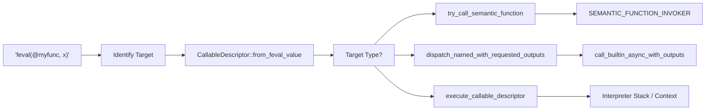
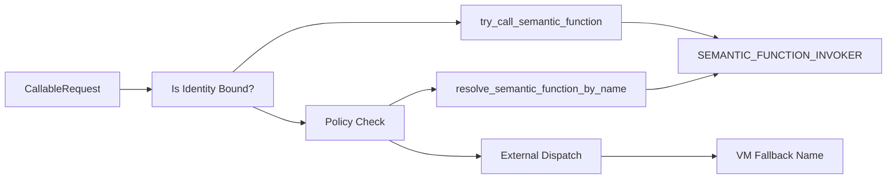

# Callable Resolution & Function Dispatch

<details>
<summary>Relevant source files</summary>

- [crates/runmat-hir/src/hir.rs](https://github.com/runmat-org/runmat/blob/82685330/crates/runmat-hir/src/hir.rs)
- [crates/runmat-hir/src/lowering/ctx.rs](https://github.com/runmat-org/runmat/blob/82685330/crates/runmat-hir/src/lowering/ctx.rs)
- [crates/runmat-runtime/src/builtins/acceleration/gpu/arrayfun.rs](https://github.com/runmat-org/runmat/blob/82685330/crates/runmat-runtime/src/builtins/acceleration/gpu/arrayfun.rs)
- [crates/runmat-runtime/src/builtins/builtins-json/fminbnd.json](https://github.com/runmat-org/runmat/blob/82685330/crates/runmat-runtime/src/builtins/builtins-json/fminbnd.json)
- [crates/runmat-runtime/src/builtins/builtins-json/fsolve.json](https://github.com/runmat-org/runmat/blob/82685330/crates/runmat-runtime/src/builtins/builtins-json/fsolve.json)
- [crates/runmat-runtime/src/builtins/builtins-json/fzero.json](https://github.com/runmat-org/runmat/blob/82685330/crates/runmat-runtime/src/builtins/builtins-json/fzero.json)
- [crates/runmat-runtime/src/builtins/builtins-json/integral.json](https://github.com/runmat-org/runmat/blob/82685330/crates/runmat-runtime/src/builtins/builtins-json/integral.json)
- [crates/runmat-runtime/src/builtins/builtins-json/optimset.json](https://github.com/runmat-org/runmat/blob/82685330/crates/runmat-runtime/src/builtins/builtins-json/optimset.json)
- [crates/runmat-runtime/src/builtins/cells/core/cellfun.rs](https://github.com/runmat-org/runmat/blob/82685330/crates/runmat-runtime/src/builtins/cells/core/cellfun.rs)
- [crates/runmat-runtime/src/builtins/math/optim/brent.rs](https://github.com/runmat-org/runmat/blob/82685330/crates/runmat-runtime/src/builtins/math/optim/brent.rs)
- [crates/runmat-runtime/src/builtins/math/optim/common.rs](https://github.com/runmat-org/runmat/blob/82685330/crates/runmat-runtime/src/builtins/math/optim/common.rs)
- [crates/runmat-runtime/src/builtins/math/optim/fminbnd.rs](https://github.com/runmat-org/runmat/blob/82685330/crates/runmat-runtime/src/builtins/math/optim/fminbnd.rs)
- [crates/runmat-runtime/src/builtins/math/optim/integral.rs](https://github.com/runmat-org/runmat/blob/82685330/crates/runmat-runtime/src/builtins/math/optim/integral.rs)
- [crates/runmat-runtime/src/builtins/math/optim/mod.rs](https://github.com/runmat-org/runmat/blob/82685330/crates/runmat-runtime/src/builtins/math/optim/mod.rs)
- [crates/runmat-runtime/src/builtins/math/optim/type_resolvers.rs](https://github.com/runmat-org/runmat/blob/82685330/crates/runmat-runtime/src/builtins/math/optim/type_resolvers.rs)
- [crates/runmat-runtime/src/builtins/timing/timeit.rs](https://github.com/runmat-org/runmat/blob/82685330/crates/runmat-runtime/src/builtins/timing/timeit.rs)
- [crates/runmat-runtime/src/lib.rs](https://github.com/runmat-org/runmat/blob/82685330/crates/runmat-runtime/src/lib.rs)
- [crates/runmat-runtime/src/user_functions.rs](https://github.com/runmat-org/runmat/blob/82685330/crates/runmat-runtime/src/user_functions.rs)
- [crates/runmat-vm/src/call/builtins.rs](https://github.com/runmat-org/runmat/blob/82685330/crates/runmat-vm/src/call/builtins.rs)
- [crates/runmat-vm/src/call/closures.rs](https://github.com/runmat-org/runmat/blob/82685330/crates/runmat-vm/src/call/closures.rs)
- [crates/runmat-vm/src/call/descriptor.rs](https://github.com/runmat-org/runmat/blob/82685330/crates/runmat-vm/src/call/descriptor.rs)
- [crates/runmat-vm/src/call/feval.rs](https://github.com/runmat-org/runmat/blob/82685330/crates/runmat-vm/src/call/feval.rs)
- [crates/runmat-vm/src/call/mod.rs](https://github.com/runmat-org/runmat/blob/82685330/crates/runmat-vm/src/call/mod.rs)
- [crates/runmat-vm/tests/closures.rs](https://github.com/runmat-org/runmat/blob/82685330/crates/runmat-vm/tests/closures.rs)

</details>

This page describes the mechanisms used by the RunMat VM and runtime to resolve, prepare, and dispatch calls to functions, built-ins, and objects. The system handles lexical scoping, dynamic name resolution, and MATLAB-specific dispatch rules like `feval` and method-based indexing (`subsref`).

## Callable Identity & Resolution

At the core of the dispatch system is the `CallableIdentity` enum, which represents a unique identifier for a target being called. Resolution bridges the gap between a name in source code and a specific executable entity.

### Callable Identity Types

The `CallableIdentity` (defined in `runmat-hir`) categorizes call targets:

- BoundFunction: A specific function ID within a `HirAssembly` [crates/runmat-hir/src/hir.rs #110](https://github.com/runmat-org/runmat/blob/82685330/crates/runmat-hir/src/hir.rs#L110-L110)
- Builtin: A named built-in function [crates/runmat-vm/src/call/descriptor.rs #190](https://github.com/runmat-org/runmat/blob/82685330/crates/runmat-vm/src/call/descriptor.rs#L190-L190)
- ExternalName: A qualified name (e.g., `pkg.func`) representing a boundary to external project code [crates/runmat-vm/src/call/descriptor.rs #196](https://github.com/runmat-org/runmat/blob/82685330/crates/runmat-vm/src/call/descriptor.rs#L196-L196)
- DynamicName: A name that must be resolved at runtime using the current workspace or search path [crates/runmat-vm/src/call/descriptor.rs #201](https://github.com/runmat-org/runmat/blob/82685330/crates/runmat-vm/src/call/descriptor.rs#L201-L201)

### Resolution Workflow

Resolution is performed by the `CallableDescriptor`, which encapsulates the target, arguments, and requested output count (`nargout`).

| Stage | Code Entity | Description |
| --- | --- | --- |
| Parsing | CallableDescriptor::parse_at_handle_name | Extracts function names from handle strings like '@sin' crates/runmat-vm/src/call/descriptor.rs#75-82 |
| Lookup | FunctionRegistry::resolve_name | Checks if a name corresponds to a user-defined function in the current assembly crates/runmat-vm/src/call/descriptor.rs#182 |
| Built-in Check | builtin_function_by_name | Checks the global built-in table crates/runmat-vm/src/call/descriptor.rs#188 |
| Policy Assignment | CallableFallbackPolicy | Determines how to handle resolution failures (e.g., ExternalBoundary or RuntimeNameResolution) crates/runmat-vm/src/call/descriptor.rs#185-203 |

Sources: [crates/runmat-vm/src/call/descriptor.rs #57-204](https://github.com/runmat-org/runmat/blob/82685330/crates/runmat-vm/src/call/descriptor.rs#L57-L204) [crates/runmat-hir/src/hir.rs #80-102](https://github.com/runmat-org/runmat/blob/82685330/crates/runmat-hir/src/hir.rs#L80-L102)

## Function Dispatch Pipeline

The dispatch pipeline handles the transition from a VM instruction (like `Call`) to the execution of a function body or built-in logic.

### Dispatch Flow Diagram

"Call Resolution to Execution"



<details>
<summary>Rendered SVG</summary>

```svg
<svg id="mermaid-map58etrl49" xmlns="http://www.w3.org/2000/svg" xmlns:xlink="http://www.w3.org/1999/xlink" class="flowchart" style="max-width: 100%; touch-action: none; user-select: none; cursor: grab; min-height: fit-content; max-height: 100%;" viewBox="-0.013371563140594844 0 1093.7689306262812 807.5625" role="graphics-document document" aria-roledescription="flowchart-v2" preserveAspectRatio="xMidYMid meet"><style>#mermaid-map58etrl49{font-family:ui-sans-serif,-apple-system,system-ui,Segoe UI,Helvetica;font-size:16px;fill:#ccc;}@keyframes edge-animation-frame{from{stroke-dashoffset:0;}}@keyframes dash{to{stroke-dashoffset:0;}}#mermaid-map58etrl49 .edge-animation-slow{stroke-dasharray:9,5!important;stroke-dashoffset:900;animation:dash 50s linear infinite;stroke-linecap:round;}#mermaid-map58etrl49 .edge-animation-fast{stroke-dasharray:9,5!important;stroke-dashoffset:900;animation:dash 20s linear infinite;stroke-linecap:round;}#mermaid-map58etrl49 .error-icon{fill:#333;}#mermaid-map58etrl49 .error-text{fill:#cccccc;stroke:#cccccc;}#mermaid-map58etrl49 .edge-thickness-normal{stroke-width:1px;}#mermaid-map58etrl49 .edge-thickness-thick{stroke-width:3.5px;}#mermaid-map58etrl49 .edge-pattern-solid{stroke-dasharray:0;}#mermaid-map58etrl49 .edge-thickness-invisible{stroke-width:0;fill:none;}#mermaid-map58etrl49 .edge-pattern-dashed{stroke-dasharray:3;}#mermaid-map58etrl49 .edge-pattern-dotted{stroke-dasharray:2;}#mermaid-map58etrl49 .marker{fill:#666;stroke:#666;}#mermaid-map58etrl49 .marker.cross{stroke:#666;}#mermaid-map58etrl49 svg{font-family:ui-sans-serif,-apple-system,system-ui,Segoe UI,Helvetica;font-size:16px;}#mermaid-map58etrl49 p{margin:0;}#mermaid-map58etrl49 .label{font-family:ui-sans-serif,-apple-system,system-ui,Segoe UI,Helvetica;color:#fff;}#mermaid-map58etrl49 .cluster-label text{fill:#fff;}#mermaid-map58etrl49 .cluster-label span{color:#fff;}#mermaid-map58etrl49 .cluster-label span p{background-color:transparent;}#mermaid-map58etrl49 .label text,#mermaid-map58etrl49 span{fill:#fff;color:#fff;}#mermaid-map58etrl49 .node rect,#mermaid-map58etrl49 .node circle,#mermaid-map58etrl49 .node ellipse,#mermaid-map58etrl49 .node polygon,#mermaid-map58etrl49 .node path{fill:#111;stroke:#222;stroke-width:1px;}#mermaid-map58etrl49 .rough-node .label text,#mermaid-map58etrl49 .node .label text,#mermaid-map58etrl49 .image-shape .label,#mermaid-map58etrl49 .icon-shape .label{text-anchor:middle;}#mermaid-map58etrl49 .node .katex path{fill:#000;stroke:#000;stroke-width:1px;}#mermaid-map58etrl49 .rough-node .label,#mermaid-map58etrl49 .node .label,#mermaid-map58etrl49 .image-shape .label,#mermaid-map58etrl49 .icon-shape .label{text-align:center;}#mermaid-map58etrl49 .node.clickable{cursor:pointer;}#mermaid-map58etrl49 .root .anchor path{fill:#666!important;stroke-width:0;stroke:#666;}#mermaid-map58etrl49 .arrowheadPath{fill:#0b0b0b;}#mermaid-map58etrl49 .edgePath .path{stroke:#666;stroke-width:1px;}#mermaid-map58etrl49 .flowchart-link{stroke:#666;fill:none;}#mermaid-map58etrl49 .edgeLabel{background-color:#161616;text-align:center;}#mermaid-map58etrl49 .edgeLabel p{background-color:#161616;}#mermaid-map58etrl49 .edgeLabel rect{opacity:0.5;background-color:#161616;fill:#161616;}#mermaid-map58etrl49 .labelBkg{background-color:rgba(22, 22, 22, 0.5);}#mermaid-map58etrl49 .cluster rect{fill:#161616;stroke:#222;stroke-width:1px;}#mermaid-map58etrl49 .cluster text{fill:#fff;}#mermaid-map58etrl49 .cluster span{color:#fff;}#mermaid-map58etrl49 div.mermaidTooltip{position:absolute;text-align:center;max-width:200px;padding:2px;font-family:ui-sans-serif,-apple-system,system-ui,Segoe UI,Helvetica;font-size:12px;background:#333;border:1px solid hsl(0, 0%, 10%);border-radius:2px;pointer-events:none;z-index:100;}#mermaid-map58etrl49 .flowchartTitleText{text-anchor:middle;font-size:18px;fill:#ccc;}#mermaid-map58etrl49 rect.text{fill:none;stroke-width:0;}#mermaid-map58etrl49 .icon-shape,#mermaid-map58etrl49 .image-shape{background-color:#161616;text-align:center;}#mermaid-map58etrl49 .icon-shape p,#mermaid-map58etrl49 .image-shape p{background-color:#161616;padding:2px;}#mermaid-map58etrl49 .icon-shape .label rect,#mermaid-map58etrl49 .image-shape .label rect{opacity:0.5;background-color:#161616;fill:#161616;}#mermaid-map58etrl49 .label-icon{display:inline-block;height:1em;overflow:visible;vertical-align:-0.125em;}#mermaid-map58etrl49 .node .label-icon path{fill:currentColor;stroke:revert;stroke-width:revert;}#mermaid-map58etrl49 .node .neo-node{stroke:#222;}#mermaid-map58etrl49 [data-look="neo"].node rect,#mermaid-map58etrl49 [data-look="neo"].cluster rect,#mermaid-map58etrl49 [data-look="neo"].node polygon{stroke:url(#mermaid-map58etrl49-gradient);filter:drop-shadow( 1px 2px 2px rgba(185,185,185,1));}#mermaid-map58etrl49 [data-look="neo"].node path{stroke:url(#mermaid-map58etrl49-gradient);stroke-width:1px;}#mermaid-map58etrl49 [data-look="neo"].node .outer-path{filter:drop-shadow( 1px 2px 2px rgba(185,185,185,1));}#mermaid-map58etrl49 [data-look="neo"].node .neo-line path{stroke:#222;filter:none;}#mermaid-map58etrl49 [data-look="neo"].node circle{stroke:url(#mermaid-map58etrl49-gradient);filter:drop-shadow( 1px 2px 2px rgba(185,185,185,1));}#mermaid-map58etrl49 [data-look="neo"].node circle .state-start{fill:#000000;}#mermaid-map58etrl49 [data-look="neo"].icon-shape .icon{fill:url(#mermaid-map58etrl49-gradient);filter:drop-shadow( 1px 2px 2px rgba(185,185,185,1));}#mermaid-map58etrl49 [data-look="neo"].icon-shape .icon-neo path{stroke:url(#mermaid-map58etrl49-gradient);filter:drop-shadow( 1px 2px 2px rgba(185,185,185,1));}#mermaid-map58etrl49 :root{--mermaid-font-family:"trebuchet ms",verdana,arial,sans-serif;}</style><g><marker id="mermaid-map58etrl49_flowchart-v2-pointEnd" class="marker flowchart-v2" viewBox="0 0 10 10" refX="5" refY="5" markerUnits="userSpaceOnUse" markerWidth="8" markerHeight="8" orient="auto"><path d="M 0 0 L 10 5 L 0 10 z" class="arrowMarkerPath" style="stroke-width: 1; stroke-dasharray: 1, 0;"></path></marker><marker id="mermaid-map58etrl49_flowchart-v2-pointStart" class="marker flowchart-v2" viewBox="0 0 10 10" refX="4.5" refY="5" markerUnits="userSpaceOnUse" markerWidth="8" markerHeight="8" orient="auto"><path d="M 0 5 L 10 10 L 10 0 z" class="arrowMarkerPath" style="stroke-width: 1; stroke-dasharray: 1, 0;"></path></marker><marker id="mermaid-map58etrl49_flowchart-v2-pointEnd-margin" class="marker flowchart-v2" viewBox="0 0 11.5 14" refX="11.5" refY="7" markerUnits="userSpaceOnUse" markerWidth="10.5" markerHeight="14" orient="auto"><path d="M 0 0 L 11.5 7 L 0 14 z" class="arrowMarkerPath" style="stroke-width: 0; stroke-dasharray: 1, 0;"></path></marker><marker id="mermaid-map58etrl49_flowchart-v2-pointStart-margin" class="marker flowchart-v2" viewBox="0 0 11.5 14" refX="1" refY="7" markerUnits="userSpaceOnUse" markerWidth="11.5" markerHeight="14" orient="auto"><polygon points="0,7 11.5,14 11.5,0" class="arrowMarkerPath" style="stroke-width: 0; stroke-dasharray: 1, 0;"></polygon></marker><marker id="mermaid-map58etrl49_flowchart-v2-circleEnd" class="marker flowchart-v2" viewBox="0 0 10 10" refX="11" refY="5" markerUnits="userSpaceOnUse" markerWidth="11" markerHeight="11" orient="auto"><circle cx="5" cy="5" r="5" class="arrowMarkerPath" style="stroke-width: 1; stroke-dasharray: 1, 0;"></circle></marker><marker id="mermaid-map58etrl49_flowchart-v2-circleStart" class="marker flowchart-v2" viewBox="0 0 10 10" refX="-1" refY="5" markerUnits="userSpaceOnUse" markerWidth="11" markerHeight="11" orient="auto"><circle cx="5" cy="5" r="5" class="arrowMarkerPath" style="stroke-width: 1; stroke-dasharray: 1, 0;"></circle></marker><marker id="mermaid-map58etrl49_flowchart-v2-circleEnd-margin" class="marker flowchart-v2" viewBox="0 0 10 10" refY="5" refX="12.25" markerUnits="userSpaceOnUse" markerWidth="14" markerHeight="14" orient="auto"><circle cx="5" cy="5" r="5" class="arrowMarkerPath" style="stroke-width: 0; stroke-dasharray: 1, 0;"></circle></marker><marker id="mermaid-map58etrl49_flowchart-v2-circleStart-margin" class="marker flowchart-v2" viewBox="0 0 10 10" refX="-2" refY="5" markerUnits="userSpaceOnUse" markerWidth="14" markerHeight="14" orient="auto"><circle cx="5" cy="5" r="5" class="arrowMarkerPath" style="stroke-width: 0; stroke-dasharray: 1, 0;"></circle></marker><marker id="mermaid-map58etrl49_flowchart-v2-crossEnd" class="marker cross flowchart-v2" viewBox="0 0 11 11" refX="12" refY="5.2" markerUnits="userSpaceOnUse" markerWidth="11" markerHeight="11" orient="auto"><path d="M 1,1 l 9,9 M 10,1 l -9,9" class="arrowMarkerPath" style="stroke-width: 2; stroke-dasharray: 1, 0;"></path></marker><marker id="mermaid-map58etrl49_flowchart-v2-crossStart" class="marker cross flowchart-v2" viewBox="0 0 11 11" refX="-1" refY="5.2" markerUnits="userSpaceOnUse" markerWidth="11" markerHeight="11" orient="auto"><path d="M 1,1 l 9,9 M 10,1 l -9,9" class="arrowMarkerPath" style="stroke-width: 2; stroke-dasharray: 1, 0;"></path></marker><marker id="mermaid-map58etrl49_flowchart-v2-crossEnd-margin" class="marker cross flowchart-v2" viewBox="0 0 15 15" refX="17.7" refY="7.5" markerUnits="userSpaceOnUse" markerWidth="12" markerHeight="12" orient="auto"><path d="M 1,1 L 14,14 M 1,14 L 14,1" class="arrowMarkerPath" style="stroke-width: 2.5;"></path></marker><marker id="mermaid-map58etrl49_flowchart-v2-crossStart-margin" class="marker cross flowchart-v2" viewBox="0 0 15 15" refX="-3.5" refY="7.5" markerUnits="userSpaceOnUse" markerWidth="12" markerHeight="12" orient="auto"><path d="M 1,1 L 14,14 M 1,14 L 14,1" class="arrowMarkerPath" style="stroke-width: 2.5; stroke-dasharray: 1, 0;"></path></marker><g class="root"><g class="clusters"><g class="cluster" id="mermaid-map58etrl49-subGraph1" data-look="classic"><rect style="" x="8" y="266" width="1077.7421875" height="533.5625"></rect><g class="cluster-label" transform="translate(480.08203125, 266)"><foreignObject width="133.578125" height="24"><div style="display: table-cell; white-space: nowrap; line-height: 1.5;" xmlns="http://www.w3.org/1999/xhtml"><span class="nodeLabel"><p>Code Entity Space</p></span></div></foreignObject></g></g><g class="cluster" id="mermaid-map58etrl49-subGraph0" data-look="classic"><rect style="" x="420.484375" y="8" width="269.484375" height="208"></rect><g class="cluster-label" transform="translate(466.28125, 8)"><foreignObject width="177.890625" height="24"><div style="display: table-cell; white-space: nowrap; line-height: 1.5;" xmlns="http://www.w3.org/1999/xhtml"><span class="nodeLabel"><p>Natural Language Space</p></span></div></foreignObject></g></g></g><g class="edgePaths"><path d="M555.227,87L555.227,91.167C555.227,95.333,555.227,103.667,555.227,111.333C555.227,119,555.227,126,555.227,129.5L555.227,133" id="mermaid-map58etrl49-L_A_B_0" class="edge-thickness-normal edge-pattern-solid edge-thickness-normal edge-pattern-solid flowchart-link" style=";" data-edge="true" data-et="edge" data-id="L_A_B_0" data-points="W3sieCI6NTU1LjIyNjU2MjUsInkiOjg3fSx7IngiOjU1NS4yMjY1NjI1LCJ5IjoxMTJ9LHsieCI6NTU1LjIyNjU2MjUsInkiOjEzN31d" data-look="classic" marker-end="url(#mermaid-map58etrl49_flowchart-v2-pointEnd)"></path><path d="M555.227,191L555.227,195.167C555.227,199.333,555.227,207.667,555.227,216C555.227,224.333,555.227,232.667,555.227,241C555.227,249.333,555.227,257.667,555.227,265.333C555.227,273,555.227,280,555.227,283.5L555.227,287" id="mermaid-map58etrl49-L_B_C_0" class="edge-thickness-normal edge-pattern-solid edge-thickness-normal edge-pattern-solid flowchart-link" style=";" data-edge="true" data-et="edge" data-id="L_B_C_0" data-points="W3sieCI6NTU1LjIyNjU2MjUsInkiOjE5MX0seyJ4Ijo1NTUuMjI2NTYyNSwieSI6MjE2fSx7IngiOjU1NS4yMjY1NjI1LCJ5IjoyNDF9LHsieCI6NTU1LjIyNjU2MjUsInkiOjI2Nn0seyJ4Ijo1NTUuMjI2NTYyNSwieSI6MjkxfV0=" data-look="classic" marker-end="url(#mermaid-map58etrl49_flowchart-v2-pointEnd)"></path><path d="M555.227,345L555.227,349.167C555.227,353.333,555.227,361.667,555.227,369.333C555.227,377,555.227,384,555.227,387.5L555.227,391" id="mermaid-map58etrl49-L_C_D_0" class="edge-thickness-normal edge-pattern-solid edge-thickness-normal edge-pattern-solid flowchart-link" style=";" data-edge="true" data-et="edge" data-id="L_C_D_0" data-points="W3sieCI6NTU1LjIyNjU2MjUsInkiOjM0NX0seyJ4Ijo1NTUuMjI2NTYyNSwieSI6MzcwfSx7IngiOjU1NS4yMjY1NjI1LCJ5IjozOTV9XQ==" data-look="classic" marker-end="url(#mermaid-map58etrl49_flowchart-v2-pointEnd)"></path><path d="M498.805,486.141L448.2,501.711C397.594,517.281,296.383,548.422,245.777,569.492C195.172,590.563,195.172,601.563,195.172,607.063L195.172,612.563" id="mermaid-map58etrl49-L_D_E_0" class="edge-thickness-normal edge-pattern-solid edge-thickness-normal edge-pattern-solid flowchart-link" style=";" data-edge="true" data-et="edge" data-id="L_D_E_0" data-points="W3sieCI6NDk4LjgwNTAzMDUwNDg3ODMsInkiOjQ4Ni4xNDA5NjgwMDQ4NzgzfSx7IngiOjE5NS4xNzE4NzUsInkiOjU3OS41NjI1fSx7IngiOjE5NS4xNzE4NzUsInkiOjYxNi41NjI1fV0=" data-look="classic" marker-end="url(#mermaid-map58etrl49_flowchart-v2-pointEnd)"></path><path d="M555.227,542.563L555.227,548.729C555.227,554.896,555.227,567.229,555.227,578.896C555.227,590.563,555.227,601.563,555.227,607.063L555.227,612.563" id="mermaid-map58etrl49-L_D_F_0" class="edge-thickness-normal edge-pattern-solid edge-thickness-normal edge-pattern-solid flowchart-link" style=";" data-edge="true" data-et="edge" data-id="L_D_F_0" data-points="W3sieCI6NTU1LjIyNjU2MjUsInkiOjU0Mi41NjI1fSx7IngiOjU1NS4yMjY1NjI1LCJ5Ijo1NzkuNTYyNX0seyJ4Ijo1NTUuMjI2NTYyNSwieSI6NjE2LjU2MjV9XQ==" data-look="classic" marker-end="url(#mermaid-map58etrl49_flowchart-v2-pointEnd)"></path><path d="M611.796,485.993L663.05,501.588C714.304,517.183,816.812,548.373,868.066,569.468C919.32,590.563,919.32,601.563,919.32,607.063L919.32,612.563" id="mermaid-map58etrl49-L_D_G_0" class="edge-thickness-normal edge-pattern-solid edge-thickness-normal edge-pattern-solid flowchart-link" style=";" data-edge="true" data-et="edge" data-id="L_D_G_0" data-points="W3sieCI6NjExLjc5NTc0ODA1ODY5OTcsInkiOjQ4NS45OTMzMTQ0NDEzMDAzNn0seyJ4Ijo5MTkuMzIwMzEyNSwieSI6NTc5LjU2MjV9LHsieCI6OTE5LjMyMDMxMjUsInkiOjYxNi41NjI1fV0=" data-look="classic" marker-end="url(#mermaid-map58etrl49_flowchart-v2-pointEnd)"></path><path d="M195.172,670.563L195.172,674.729C195.172,678.896,195.172,687.229,195.172,694.896C195.172,702.563,195.172,709.563,195.172,713.063L195.172,716.563" id="mermaid-map58etrl49-L_E_H_0" class="edge-thickness-normal edge-pattern-solid edge-thickness-normal edge-pattern-solid flowchart-link" style=";" data-edge="true" data-et="edge" data-id="L_E_H_0" data-points="W3sieCI6MTk1LjE3MTg3NSwieSI6NjcwLjU2MjV9LHsieCI6MTk1LjE3MTg3NSwieSI6Njk1LjU2MjV9LHsieCI6MTk1LjE3MTg3NSwieSI6NzIwLjU2MjV9XQ==" data-look="classic" marker-end="url(#mermaid-map58etrl49_flowchart-v2-pointEnd)"></path><path d="M555.227,670.563L555.227,674.729C555.227,678.896,555.227,687.229,555.227,694.896C555.227,702.563,555.227,709.563,555.227,713.063L555.227,716.563" id="mermaid-map58etrl49-L_F_I_0" class="edge-thickness-normal edge-pattern-solid edge-thickness-normal edge-pattern-solid flowchart-link" style=";" data-edge="true" data-et="edge" data-id="L_F_I_0" data-points="W3sieCI6NTU1LjIyNjU2MjUsInkiOjY3MC41NjI1fSx7IngiOjU1NS4yMjY1NjI1LCJ5Ijo2OTUuNTYyNX0seyJ4Ijo1NTUuMjI2NTYyNSwieSI6NzIwLjU2MjV9XQ==" data-look="classic" marker-end="url(#mermaid-map58etrl49_flowchart-v2-pointEnd)"></path><path d="M919.32,670.563L919.32,674.729C919.32,678.896,919.32,687.229,919.32,694.896C919.32,702.563,919.32,709.563,919.32,713.063L919.32,716.563" id="mermaid-map58etrl49-L_G_J_0" class="edge-thickness-normal edge-pattern-solid edge-thickness-normal edge-pattern-solid flowchart-link" style=";" data-edge="true" data-et="edge" data-id="L_G_J_0" data-points="W3sieCI6OTE5LjMyMDMxMjUsInkiOjY3MC41NjI1fSx7IngiOjkxOS4zMjAzMTI1LCJ5Ijo2OTUuNTYyNX0seyJ4Ijo5MTkuMzIwMzEyNSwieSI6NzIwLjU2MjV9XQ==" data-look="classic" marker-end="url(#mermaid-map58etrl49_flowchart-v2-pointEnd)"></path></g><g class="edgeLabels"><g class="edgeLabel"><g class="label" data-id="L_A_B_0" transform="translate(0, 0)"><foreignObject width="0" height="0"><div style="display: table-cell; white-space: nowrap; line-height: 1.5; max-width: 200px; text-align: center;" xmlns="http://www.w3.org/1999/xhtml" class="labelBkg"><span class="edgeLabel"></span></div></foreignObject></g></g><g class="edgeLabel"><g class="label" data-id="L_B_C_0" transform="translate(0, 0)"><foreignObject width="0" height="0"><div style="display: table-cell; white-space: nowrap; line-height: 1.5; max-width: 200px; text-align: center;" xmlns="http://www.w3.org/1999/xhtml" class="labelBkg"><span class="edgeLabel"></span></div></foreignObject></g></g><g class="edgeLabel"><g class="label" data-id="L_C_D_0" transform="translate(0, 0)"><foreignObject width="0" height="0"><div style="display: table-cell; white-space: nowrap; line-height: 1.5; max-width: 200px; text-align: center;" xmlns="http://www.w3.org/1999/xhtml" class="labelBkg"><span class="edgeLabel"></span></div></foreignObject></g></g><g class="edgeLabel" transform="translate(195.171875, 579.5625)"><g class="label" data-id="L_D_E_0" transform="translate(-38.2421875, -12)"><foreignObject width="76.484375" height="24"><div style="display: table-cell; white-space: nowrap; line-height: 1.5; max-width: 200px; text-align: center;" xmlns="http://www.w3.org/1999/xhtml" class="labelBkg"><span class="edgeLabel"><p>FunctionId</p></span></div></foreignObject></g></g><g class="edgeLabel" transform="translate(555.2265625, 579.5625)"><g class="label" data-id="L_D_F_0" transform="translate(-22.3828125, -12)"><foreignObject width="44.765625" height="24"><div style="display: table-cell; white-space: nowrap; line-height: 1.5; max-width: 200px; text-align: center;" xmlns="http://www.w3.org/1999/xhtml" class="labelBkg"><span class="edgeLabel"><p>Builtin</p></span></div></foreignObject></g></g><g class="edgeLabel" transform="translate(919.3203125, 579.5625)"><g class="label" data-id="L_D_G_0" transform="translate(-27.7421875, -12)"><foreignObject width="55.484375" height="24"><div style="display: table-cell; white-space: nowrap; line-height: 1.5; max-width: 200px; text-align: center;" xmlns="http://www.w3.org/1999/xhtml" class="labelBkg"><span class="edgeLabel"><p>Closure</p></span></div></foreignObject></g></g><g class="edgeLabel"><g class="label" data-id="L_E_H_0" transform="translate(0, 0)"><foreignObject width="0" height="0"><div style="display: table-cell; white-space: nowrap; line-height: 1.5; max-width: 200px; text-align: center;" xmlns="http://www.w3.org/1999/xhtml" class="labelBkg"><span class="edgeLabel"></span></div></foreignObject></g></g><g class="edgeLabel"><g class="label" data-id="L_F_I_0" transform="translate(0, 0)"><foreignObject width="0" height="0"><div style="display: table-cell; white-space: nowrap; line-height: 1.5; max-width: 200px; text-align: center;" xmlns="http://www.w3.org/1999/xhtml" class="labelBkg"><span class="edgeLabel"></span></div></foreignObject></g></g><g class="edgeLabel"><g class="label" data-id="L_G_J_0" transform="translate(0, 0)"><foreignObject width="0" height="0"><div style="display: table-cell; white-space: nowrap; line-height: 1.5; max-width: 200px; text-align: center;" xmlns="http://www.w3.org/1999/xhtml" class="labelBkg"><span class="edgeLabel"></span></div></foreignObject></g></g></g><g class="nodes"><g class="node default" id="mermaid-map58etrl49-flowchart-A-0" data-look="classic" transform="translate(555.2265625, 60)"><rect class="basic label-container" style="" x="-99.7421875" y="-27" width="199.484375" height="54"></rect><g class="label" style="" transform="translate(-69.7421875, -12)"><rect></rect><foreignObject width="139.484375" height="24"><div style="display: table-cell; white-space: nowrap; line-height: 1.5; max-width: 200px; text-align: center;" xmlns="http://www.w3.org/1999/xhtml"><span class="nodeLabel"><p>'feval(@myfunc, x)'</p></span></div></foreignObject></g></g><g class="node default" id="mermaid-map58etrl49-flowchart-B-1" data-look="classic" transform="translate(555.2265625, 164)"><rect class="basic label-container" style="" x="-82.265625" y="-27" width="164.53125" height="54"></rect><g class="label" style="" transform="translate(-52.265625, -12)"><rect></rect><foreignObject width="104.53125" height="24"><div style="display: table-cell; white-space: nowrap; line-height: 1.5; max-width: 200px; text-align: center;" xmlns="http://www.w3.org/1999/xhtml"><span class="nodeLabel"><p>Identify Target</p></span></div></foreignObject></g></g><g class="node default" id="mermaid-map58etrl49-flowchart-C-3" data-look="classic" transform="translate(555.2265625, 318)"><rect class="basic label-container" style="" x="-163.3828125" y="-27" width="326.765625" height="54"></rect><g class="label" style="" transform="translate(-133.3828125, -12)"><rect></rect><foreignObject width="266.765625" height="24"><div style="display: table; white-space: break-spaces; line-height: 1.5; max-width: 200px; text-align: center; width: 200px;" xmlns="http://www.w3.org/1999/xhtml"><span class="nodeLabel"><p>CallableDescriptor::from_feval_value</p></span></div></foreignObject></g></g><g class="node default" id="mermaid-map58etrl49-flowchart-D-5" data-look="classic" transform="translate(555.2265625, 468.78125)"><polygon points="73.78125,0 147.5625,-73.78125 73.78125,-147.5625 0,-73.78125" class="label-container" transform="translate(-73.28125, 73.78125)"></polygon><g class="label" style="" transform="translate(-46.78125, -12)"><rect></rect><foreignObject width="93.5625" height="24"><div style="display: table-cell; white-space: nowrap; line-height: 1.5; max-width: 200px; text-align: center;" xmlns="http://www.w3.org/1999/xhtml"><span class="nodeLabel"><p>Target Type?</p></span></div></foreignObject></g></g><g class="node default" id="mermaid-map58etrl49-flowchart-E-7" data-look="classic" transform="translate(195.171875, 643.5625)"><rect class="basic label-container" style="" x="-127.3828125" y="-27" width="254.765625" height="54"></rect><g class="label" style="" transform="translate(-97.3828125, -12)"><rect></rect><foreignObject width="194.765625" height="24"><div style="display: table-cell; white-space: nowrap; line-height: 1.5; max-width: 200px; text-align: center;" xmlns="http://www.w3.org/1999/xhtml"><span class="nodeLabel"><p>try_call_semantic_function</p></span></div></foreignObject></g></g><g class="node default" id="mermaid-map58etrl49-flowchart-F-9" data-look="classic" transform="translate(555.2265625, 643.5625)"><rect class="basic label-container" style="" x="-182.671875" y="-27" width="365.34375" height="54"></rect><g class="label" style="" transform="translate(-152.671875, -12)"><rect></rect><foreignObject width="305.34375" height="24"><div style="display: table; white-space: break-spaces; line-height: 1.5; max-width: 200px; text-align: center; width: 200px;" xmlns="http://www.w3.org/1999/xhtml"><span class="nodeLabel"><p>dispatch_named_with_requested_outputs</p></span></div></foreignObject></g></g><g class="node default" id="mermaid-map58etrl49-flowchart-G-11" data-look="classic" transform="translate(919.3203125, 643.5625)"><rect class="basic label-container" style="" x="-131.421875" y="-27" width="262.84375" height="54"></rect><g class="label" style="" transform="translate(-101.421875, -12)"><rect></rect><foreignObject width="202.84375" height="24"><div style="display: table; white-space: break-spaces; line-height: 1.5; max-width: 200px; text-align: center; width: 200px;" xmlns="http://www.w3.org/1999/xhtml"><span class="nodeLabel"><p>execute_callable_descriptor</p></span></div></foreignObject></g></g><g class="node default" id="mermaid-map58etrl49-flowchart-H-13" data-look="classic" transform="translate(195.171875, 747.5625)"><rect class="basic label-container" style="" x="-152.171875" y="-27" width="304.34375" height="54"></rect><g class="label" style="" transform="translate(-122.171875, -12)"><rect></rect><foreignObject width="244.34375" height="24"><div style="display: table; white-space: break-spaces; line-height: 1.5; max-width: 200px; text-align: center; width: 200px;" xmlns="http://www.w3.org/1999/xhtml"><span class="nodeLabel"><p>SEMANTIC_FUNCTION_INVOKER</p></span></div></foreignObject></g></g><g class="node default" id="mermaid-map58etrl49-flowchart-I-15" data-look="classic" transform="translate(555.2265625, 747.5625)"><rect class="basic label-container" style="" x="-145.4296875" y="-27" width="290.859375" height="54"></rect><g class="label" style="" transform="translate(-115.4296875, -12)"><rect></rect><foreignObject width="230.859375" height="24"><div style="display: table; white-space: break-spaces; line-height: 1.5; max-width: 200px; text-align: center; width: 200px;" xmlns="http://www.w3.org/1999/xhtml"><span class="nodeLabel"><p>call_builtin_async_with_outputs</p></span></div></foreignObject></g></g><g class="node default" id="mermaid-map58etrl49-flowchart-J-17" data-look="classic" transform="translate(919.3203125, 747.5625)"><rect class="basic label-container" style="" x="-125.890625" y="-27" width="251.78125" height="54"></rect><g class="label" style="" transform="translate(-95.890625, -12)"><rect></rect><foreignObject width="191.78125" height="24"><div style="display: table-cell; white-space: nowrap; line-height: 1.5; max-width: 200px; text-align: center;" xmlns="http://www.w3.org/1999/xhtml"><span class="nodeLabel"><p>Interpreter Stack / Context</p></span></div></foreignObject></g></g></g></g></g><defs><filter id="mermaid-map58etrl49-drop-shadow" height="130%" width="130%"><feDropShadow dx="4" dy="4" stdDeviation="0" flood-opacity="0.06" flood-color="#000000"></feDropShadow></filter></defs><defs><filter id="mermaid-map58etrl49-drop-shadow-small" height="150%" width="150%"><feDropShadow dx="2" dy="2" stdDeviation="0" flood-opacity="0.06" flood-color="#000000"></feDropShadow></filter></defs><linearGradient id="mermaid-map58etrl49-gradient" gradientUnits="objectBoundingBox" x1="0%" y1="0%" x2="100%" y2="0%"><stop offset="0%" stop-color="#333" stop-opacity="1"></stop><stop offset="100%" stop-color="hsl(-120, 0%, 3.3333333333%)" stop-opacity="1"></stop></linearGradient></svg>
```

</details>

Sources: [crates/runmat-vm/src/call/feval.rs #18-29](https://github.com/runmat-org/runmat/blob/82685330/crates/runmat-vm/src/call/feval.rs#L18-L29) [crates/runmat-runtime/src/user_functions.rs #128-145](https://github.com/runmat-org/runmat/blob/82685330/crates/runmat-runtime/src/user_functions.rs#L128-L145) [crates/runmat-vm/src/call/descriptor.rs #215-240](https://github.com/runmat-org/runmat/blob/82685330/crates/runmat-vm/src/call/descriptor.rs#L215-L240)

### The `feval` Protocol

The `feval` protocol allows for dynamic function execution. In RunMat, `feval` is implemented as a specialized dispatch path that can forward calls to:

1. Function Handles: Captured as `Value::Closure` containing a `FunctionId` or name [crates/runmat-vm/src/call/closures.rs #184-208](https://github.com/runmat-org/runmat/blob/82685330/crates/runmat-vm/src/call/closures.rs#L184-L208)
2. Strings: Strings starting with `@` are parsed into descriptors [crates/runmat-vm/src/call/descriptor.rs #75-82](https://github.com/runmat-org/runmat/blob/82685330/crates/runmat-vm/src/call/descriptor.rs#L75-L82)
3. Direct Values: If the first argument is a numeric array or object, it may trigger indexing or method dispatch [crates/runmat-vm/src/call/feval.rs #6-12](https://github.com/runmat-org/runmat/blob/82685330/crates/runmat-vm/src/call/feval.rs#L6-L12)

## Closure Capture & Scoping

RunMat implements MATLAB lexical scoping through `HirBinding` and `CapturedBinding`.

- Binding System: `HirBinding` identifies variables as `Lexical`, `Global`, or `Persistent` [crates/runmat-hir/src/hir.rs #165-169](https://github.com/runmat-org/runmat/blob/82685330/crates/runmat-hir/src/hir.rs#L165-L169)
- Closure Creation: The VM uses `create_closure` and `create_semantic_closure` to bundle a function with its captured lexical environment [crates/runmat-vm/src/call/closures.rs #174-209](https://github.com/runmat-org/runmat/blob/82685330/crates/runmat-vm/src/call/closures.rs#L174-L209)
- Lowering: During HIR lowering, the `LoweringCtx` tracks `captures` for each `FunctionId` to ensure the correct `BindingId`s are available at runtime [crates/runmat-hir/src/lowering/ctx.rs #58](https://github.com/runmat-org/runmat/blob/82685330/crates/runmat-hir/src/lowering/ctx.rs#L58-L58)

Sources: [crates/runmat-hir/src/hir.rs #128-132](https://github.com/runmat-org/runmat/blob/82685330/crates/runmat-hir/src/hir.rs#L128-L132) [crates/runmat-vm/src/call/closures.rs #174-209](https://github.com/runmat-org/runmat/blob/82685330/crates/runmat-vm/src/call/closures.rs#L174-L209)

## Method Dispatch & Object Indexing

When a call target is an object, RunMat follows MATLAB's method dispatch rules, prioritizing class methods over standard indexing.

### Dispatch Heuristics

1. Method Lookup: `lookup_method` checks the class definition for a method matching the call name [crates/runmat-vm/src/call/closures.rs #93](https://github.com/runmat-org/runmat/blob/82685330/crates/runmat-vm/src/call/closures.rs#L93-L93)
2. External Boundary: If no local method exists, `dispatch_object_external_member` attempts to find a function in the class package [crates/runmat-runtime/src/lib.rs #182-195](https://github.com/runmat-org/runmat/blob/82685330/crates/runmat-runtime/src/lib.rs#L182-L195)
3. Index Fallback: If no method is found, the call is treated as an indexing operation (`subsref` or `subsasgn`) [crates/runmat-vm/src/call/closures.rs #164-172](https://github.com/runmat-org/runmat/blob/82685330/crates/runmat-vm/src/call/closures.rs#L164-L172)

### Special Method Names

- subsref: `OBJECT_SUBSREF_METHOD` ("subsref") [crates/runmat-runtime/src/lib.rs #48](https://github.com/runmat-org/runmat/blob/82685330/crates/runmat-runtime/src/lib.rs#L48-L48)
- subsasgn: `OBJECT_SUBSASGN_METHOD` ("subsasgn") [crates/runmat-runtime/src/lib.rs #49](https://github.com/runmat-org/runmat/blob/82685330/crates/runmat-runtime/src/lib.rs#L49-L49)
- Getters/Setters: Generated via `object_property_getter_name` (e.g., `get.PropName`) [crates/runmat-runtime/src/lib.rs #52-54](https://github.com/runmat-org/runmat/blob/82685330/crates/runmat-runtime/src/lib.rs#L52-L54)

Sources: [crates/runmat-vm/src/call/closures.rs #86-172](https://github.com/runmat-org/runmat/blob/82685330/crates/runmat-vm/src/call/closures.rs#L86-L172) [crates/runmat-runtime/src/lib.rs #44-58](https://github.com/runmat-org/runmat/blob/82685330/crates/runmat-runtime/src/lib.rs#L44-L58)

## Semantic Hooks & Fallback Policies

RunMat allows the host environment to inject custom function resolution and invocation logic through "Semantic Hooks".

### Hooks Implementation

The runtime maintains thread-local slots for external logic:

- `SEMANTIC_FUNCTION_RESOLVER`: An `Arc<FunctionResolver>` that maps names to `usize` IDs [crates/runmat-runtime/src/user_functions.rs #50-51](https://github.com/runmat-org/runmat/blob/82685330/crates/runmat-runtime/src/user_functions.rs#L50-L51)
- `SEMANTIC_FUNCTION_INVOKER`: An `Arc<FunctionInvoker>` that executes a function ID with provided `Value` arguments [crates/runmat-runtime/src/user_functions.rs #48-49](https://github.com/runmat-org/runmat/blob/82685330/crates/runmat-runtime/src/user_functions.rs#L48-L49)

### Fallback Policies

The `CallableFallbackPolicy` controls behavior when a primary resolution fails:

- None: Strict resolution; fails if the target is not found.
- ExternalBoundary: Allows resolution across package/module boundaries [crates/runmat-runtime/src/lib.rs #161](https://github.com/runmat-org/runmat/blob/82685330/crates/runmat-runtime/src/lib.rs#L161-L161)
- RuntimeNameResolution: Standard MATLAB behavior where names are looked up in the workspace/path at the moment of the call [crates/runmat-runtime/src/lib.rs #167](https://github.com/runmat-org/runmat/blob/82685330/crates/runmat-runtime/src/lib.rs#L167-L167)

"Semantic Hook and Fallback Flow"



<details>
<summary>Rendered SVG</summary>

```svg
<svg id="mermaid-qcybo8t8wr" xmlns="http://www.w3.org/2000/svg" xmlns:xlink="http://www.w3.org/1999/xlink" class="flowchart" style="max-width: 100%; touch-action: none; user-select: none; cursor: grab; min-height: fit-content; max-height: 100%;" viewBox="-0.0066232284177658585 -5.684341886080802e-14 960.7944964568355 906.9843750000001" role="graphics-document document" aria-roledescription="flowchart-v2" preserveAspectRatio="xMidYMid meet"><style>#mermaid-qcybo8t8wr{font-family:ui-sans-serif,-apple-system,system-ui,Segoe UI,Helvetica;font-size:16px;fill:#ccc;}@keyframes edge-animation-frame{from{stroke-dashoffset:0;}}@keyframes dash{to{stroke-dashoffset:0;}}#mermaid-qcybo8t8wr .edge-animation-slow{stroke-dasharray:9,5!important;stroke-dashoffset:900;animation:dash 50s linear infinite;stroke-linecap:round;}#mermaid-qcybo8t8wr .edge-animation-fast{stroke-dasharray:9,5!important;stroke-dashoffset:900;animation:dash 20s linear infinite;stroke-linecap:round;}#mermaid-qcybo8t8wr .error-icon{fill:#333;}#mermaid-qcybo8t8wr .error-text{fill:#cccccc;stroke:#cccccc;}#mermaid-qcybo8t8wr .edge-thickness-normal{stroke-width:1px;}#mermaid-qcybo8t8wr .edge-thickness-thick{stroke-width:3.5px;}#mermaid-qcybo8t8wr .edge-pattern-solid{stroke-dasharray:0;}#mermaid-qcybo8t8wr .edge-thickness-invisible{stroke-width:0;fill:none;}#mermaid-qcybo8t8wr .edge-pattern-dashed{stroke-dasharray:3;}#mermaid-qcybo8t8wr .edge-pattern-dotted{stroke-dasharray:2;}#mermaid-qcybo8t8wr .marker{fill:#666;stroke:#666;}#mermaid-qcybo8t8wr .marker.cross{stroke:#666;}#mermaid-qcybo8t8wr svg{font-family:ui-sans-serif,-apple-system,system-ui,Segoe UI,Helvetica;font-size:16px;}#mermaid-qcybo8t8wr p{margin:0;}#mermaid-qcybo8t8wr .label{font-family:ui-sans-serif,-apple-system,system-ui,Segoe UI,Helvetica;color:#fff;}#mermaid-qcybo8t8wr .cluster-label text{fill:#fff;}#mermaid-qcybo8t8wr .cluster-label span{color:#fff;}#mermaid-qcybo8t8wr .cluster-label span p{background-color:transparent;}#mermaid-qcybo8t8wr .label text,#mermaid-qcybo8t8wr span{fill:#fff;color:#fff;}#mermaid-qcybo8t8wr .node rect,#mermaid-qcybo8t8wr .node circle,#mermaid-qcybo8t8wr .node ellipse,#mermaid-qcybo8t8wr .node polygon,#mermaid-qcybo8t8wr .node path{fill:#111;stroke:#222;stroke-width:1px;}#mermaid-qcybo8t8wr .rough-node .label text,#mermaid-qcybo8t8wr .node .label text,#mermaid-qcybo8t8wr .image-shape .label,#mermaid-qcybo8t8wr .icon-shape .label{text-anchor:middle;}#mermaid-qcybo8t8wr .node .katex path{fill:#000;stroke:#000;stroke-width:1px;}#mermaid-qcybo8t8wr .rough-node .label,#mermaid-qcybo8t8wr .node .label,#mermaid-qcybo8t8wr .image-shape .label,#mermaid-qcybo8t8wr .icon-shape .label{text-align:center;}#mermaid-qcybo8t8wr .node.clickable{cursor:pointer;}#mermaid-qcybo8t8wr .root .anchor path{fill:#666!important;stroke-width:0;stroke:#666;}#mermaid-qcybo8t8wr .arrowheadPath{fill:#0b0b0b;}#mermaid-qcybo8t8wr .edgePath .path{stroke:#666;stroke-width:1px;}#mermaid-qcybo8t8wr .flowchart-link{stroke:#666;fill:none;}#mermaid-qcybo8t8wr .edgeLabel{background-color:#161616;text-align:center;}#mermaid-qcybo8t8wr .edgeLabel p{background-color:#161616;}#mermaid-qcybo8t8wr .edgeLabel rect{opacity:0.5;background-color:#161616;fill:#161616;}#mermaid-qcybo8t8wr .labelBkg{background-color:rgba(22, 22, 22, 0.5);}#mermaid-qcybo8t8wr .cluster rect{fill:#161616;stroke:#222;stroke-width:1px;}#mermaid-qcybo8t8wr .cluster text{fill:#fff;}#mermaid-qcybo8t8wr .cluster span{color:#fff;}#mermaid-qcybo8t8wr div.mermaidTooltip{position:absolute;text-align:center;max-width:200px;padding:2px;font-family:ui-sans-serif,-apple-system,system-ui,Segoe UI,Helvetica;font-size:12px;background:#333;border:1px solid hsl(0, 0%, 10%);border-radius:2px;pointer-events:none;z-index:100;}#mermaid-qcybo8t8wr .flowchartTitleText{text-anchor:middle;font-size:18px;fill:#ccc;}#mermaid-qcybo8t8wr rect.text{fill:none;stroke-width:0;}#mermaid-qcybo8t8wr .icon-shape,#mermaid-qcybo8t8wr .image-shape{background-color:#161616;text-align:center;}#mermaid-qcybo8t8wr .icon-shape p,#mermaid-qcybo8t8wr .image-shape p{background-color:#161616;padding:2px;}#mermaid-qcybo8t8wr .icon-shape .label rect,#mermaid-qcybo8t8wr .image-shape .label rect{opacity:0.5;background-color:#161616;fill:#161616;}#mermaid-qcybo8t8wr .label-icon{display:inline-block;height:1em;overflow:visible;vertical-align:-0.125em;}#mermaid-qcybo8t8wr .node .label-icon path{fill:currentColor;stroke:revert;stroke-width:revert;}#mermaid-qcybo8t8wr .node .neo-node{stroke:#222;}#mermaid-qcybo8t8wr [data-look="neo"].node rect,#mermaid-qcybo8t8wr [data-look="neo"].cluster rect,#mermaid-qcybo8t8wr [data-look="neo"].node polygon{stroke:url(#mermaid-qcybo8t8wr-gradient);filter:drop-shadow( 1px 2px 2px rgba(185,185,185,1));}#mermaid-qcybo8t8wr [data-look="neo"].node path{stroke:url(#mermaid-qcybo8t8wr-gradient);stroke-width:1px;}#mermaid-qcybo8t8wr [data-look="neo"].node .outer-path{filter:drop-shadow( 1px 2px 2px rgba(185,185,185,1));}#mermaid-qcybo8t8wr [data-look="neo"].node .neo-line path{stroke:#222;filter:none;}#mermaid-qcybo8t8wr [data-look="neo"].node circle{stroke:url(#mermaid-qcybo8t8wr-gradient);filter:drop-shadow( 1px 2px 2px rgba(185,185,185,1));}#mermaid-qcybo8t8wr [data-look="neo"].node circle .state-start{fill:#000000;}#mermaid-qcybo8t8wr [data-look="neo"].icon-shape .icon{fill:url(#mermaid-qcybo8t8wr-gradient);filter:drop-shadow( 1px 2px 2px rgba(185,185,185,1));}#mermaid-qcybo8t8wr [data-look="neo"].icon-shape .icon-neo path{stroke:url(#mermaid-qcybo8t8wr-gradient);filter:drop-shadow( 1px 2px 2px rgba(185,185,185,1));}#mermaid-qcybo8t8wr :root{--mermaid-font-family:"trebuchet ms",verdana,arial,sans-serif;}</style><g><marker id="mermaid-qcybo8t8wr_flowchart-v2-pointEnd" class="marker flowchart-v2" viewBox="0 0 10 10" refX="5" refY="5" markerUnits="userSpaceOnUse" markerWidth="8" markerHeight="8" orient="auto"><path d="M 0 0 L 10 5 L 0 10 z" class="arrowMarkerPath" style="stroke-width: 1; stroke-dasharray: 1, 0;"></path></marker><marker id="mermaid-qcybo8t8wr_flowchart-v2-pointStart" class="marker flowchart-v2" viewBox="0 0 10 10" refX="4.5" refY="5" markerUnits="userSpaceOnUse" markerWidth="8" markerHeight="8" orient="auto"><path d="M 0 5 L 10 10 L 10 0 z" class="arrowMarkerPath" style="stroke-width: 1; stroke-dasharray: 1, 0;"></path></marker><marker id="mermaid-qcybo8t8wr_flowchart-v2-pointEnd-margin" class="marker flowchart-v2" viewBox="0 0 11.5 14" refX="11.5" refY="7" markerUnits="userSpaceOnUse" markerWidth="10.5" markerHeight="14" orient="auto"><path d="M 0 0 L 11.5 7 L 0 14 z" class="arrowMarkerPath" style="stroke-width: 0; stroke-dasharray: 1, 0;"></path></marker><marker id="mermaid-qcybo8t8wr_flowchart-v2-pointStart-margin" class="marker flowchart-v2" viewBox="0 0 11.5 14" refX="1" refY="7" markerUnits="userSpaceOnUse" markerWidth="11.5" markerHeight="14" orient="auto"><polygon points="0,7 11.5,14 11.5,0" class="arrowMarkerPath" style="stroke-width: 0; stroke-dasharray: 1, 0;"></polygon></marker><marker id="mermaid-qcybo8t8wr_flowchart-v2-circleEnd" class="marker flowchart-v2" viewBox="0 0 10 10" refX="11" refY="5" markerUnits="userSpaceOnUse" markerWidth="11" markerHeight="11" orient="auto"><circle cx="5" cy="5" r="5" class="arrowMarkerPath" style="stroke-width: 1; stroke-dasharray: 1, 0;"></circle></marker><marker id="mermaid-qcybo8t8wr_flowchart-v2-circleStart" class="marker flowchart-v2" viewBox="0 0 10 10" refX="-1" refY="5" markerUnits="userSpaceOnUse" markerWidth="11" markerHeight="11" orient="auto"><circle cx="5" cy="5" r="5" class="arrowMarkerPath" style="stroke-width: 1; stroke-dasharray: 1, 0;"></circle></marker><marker id="mermaid-qcybo8t8wr_flowchart-v2-circleEnd-margin" class="marker flowchart-v2" viewBox="0 0 10 10" refY="5" refX="12.25" markerUnits="userSpaceOnUse" markerWidth="14" markerHeight="14" orient="auto"><circle cx="5" cy="5" r="5" class="arrowMarkerPath" style="stroke-width: 0; stroke-dasharray: 1, 0;"></circle></marker><marker id="mermaid-qcybo8t8wr_flowchart-v2-circleStart-margin" class="marker flowchart-v2" viewBox="0 0 10 10" refX="-2" refY="5" markerUnits="userSpaceOnUse" markerWidth="14" markerHeight="14" orient="auto"><circle cx="5" cy="5" r="5" class="arrowMarkerPath" style="stroke-width: 0; stroke-dasharray: 1, 0;"></circle></marker><marker id="mermaid-qcybo8t8wr_flowchart-v2-crossEnd" class="marker cross flowchart-v2" viewBox="0 0 11 11" refX="12" refY="5.2" markerUnits="userSpaceOnUse" markerWidth="11" markerHeight="11" orient="auto"><path d="M 1,1 l 9,9 M 10,1 l -9,9" class="arrowMarkerPath" style="stroke-width: 2; stroke-dasharray: 1, 0;"></path></marker><marker id="mermaid-qcybo8t8wr_flowchart-v2-crossStart" class="marker cross flowchart-v2" viewBox="0 0 11 11" refX="-1" refY="5.2" markerUnits="userSpaceOnUse" markerWidth="11" markerHeight="11" orient="auto"><path d="M 1,1 l 9,9 M 10,1 l -9,9" class="arrowMarkerPath" style="stroke-width: 2; stroke-dasharray: 1, 0;"></path></marker><marker id="mermaid-qcybo8t8wr_flowchart-v2-crossEnd-margin" class="marker cross flowchart-v2" viewBox="0 0 15 15" refX="17.7" refY="7.5" markerUnits="userSpaceOnUse" markerWidth="12" markerHeight="12" orient="auto"><path d="M 1,1 L 14,14 M 1,14 L 14,1" class="arrowMarkerPath" style="stroke-width: 2.5;"></path></marker><marker id="mermaid-qcybo8t8wr_flowchart-v2-crossStart-margin" class="marker cross flowchart-v2" viewBox="0 0 15 15" refX="-3.5" refY="7.5" markerUnits="userSpaceOnUse" markerWidth="12" markerHeight="12" orient="auto"><path d="M 1,1 L 14,14 M 1,14 L 14,1" class="arrowMarkerPath" style="stroke-width: 2.5; stroke-dasharray: 1, 0;"></path></marker><g class="root"><g class="clusters"><g class="cluster" id="mermaid-qcybo8t8wr-Execution" data-look="classic"><rect style="" x="56.796875" y="794.984375" width="895.984375" height="104"></rect><g class="cluster-label" transform="translate(469.4375, 794.984375)"><foreignObject width="70.703125" height="24"><div style="display: table-cell; white-space: nowrap; line-height: 1.5;" xmlns="http://www.w3.org/1999/xhtml"><span class="nodeLabel"><p>Execution</p></span></div></foreignObject></g></g><g class="cluster" id="mermaid-qcybo8t8wr-subGraph1" data-look="classic"><rect style="" x="8" y="162" width="941.109375" height="582.984375"></rect><g class="cluster-label" transform="translate(418.8359375, 162)"><foreignObject width="119.4375" height="24"><div style="display: table-cell; white-space: nowrap; line-height: 1.5;" xmlns="http://www.w3.org/1999/xhtml"><span class="nodeLabel"><p>Resolution Logic</p></span></div></foreignObject></g></g><g class="cluster" id="mermaid-qcybo8t8wr-subGraph0" data-look="classic"><rect style="" x="371.875" y="8" width="247.234375" height="104"></rect><g class="cluster-label" transform="translate(431.5859375, 8)"><foreignObject width="127.8125" height="24"><div style="display: table-cell; white-space: nowrap; line-height: 1.5;" xmlns="http://www.w3.org/1999/xhtml"><span class="nodeLabel"><p>Dispatch Request</p></span></div></foreignObject></g></g></g><g class="edgePaths"><path d="M495.492,87L495.492,91.167C495.492,95.333,495.492,103.667,495.492,112C495.492,120.333,495.492,128.667,495.492,137C495.492,145.333,495.492,153.667,495.492,161.333C495.492,169,495.492,176,495.492,179.5L495.492,183" id="mermaid-qcybo8t8wr-L_R_ID_0" class="edge-thickness-normal edge-pattern-solid edge-thickness-normal edge-pattern-solid flowchart-link" style=";" data-edge="true" data-et="edge" data-id="L_R_ID_0" data-points="W3sieCI6NDk1LjQ5MjE4NzUsInkiOjg3fSx7IngiOjQ5NS40OTIxODc1LCJ5IjoxMTJ9LHsieCI6NDk1LjQ5MjE4NzUsInkiOjEzN30seyJ4Ijo0OTUuNDkyMTg3NSwieSI6MTYyfSx7IngiOjQ5NS40OTIxODc1LCJ5IjoxODd9XQ==" data-look="classic" marker-end="url(#mermaid-qcybo8t8wr_flowchart-v2-pointEnd)"></path><path d="M429.752,304.822L386.524,321.946C343.295,339.069,256.839,373.316,213.611,408.891C170.383,444.466,170.383,481.37,170.383,518.273C170.383,555.177,170.383,592.081,170.383,616.033C170.383,639.984,170.383,650.984,170.383,656.484L170.383,661.984" id="mermaid-qcybo8t8wr-L_ID_S1_0" class="edge-thickness-normal edge-pattern-solid edge-thickness-normal edge-pattern-solid flowchart-link" style=";" data-edge="true" data-et="edge" data-id="L_ID_S1_0" data-points="W3sieCI6NDI5Ljc1MTgwMTY0MzM0NCwieSI6MzA0LjgyMjExNDE0MzM0NH0seyJ4IjoxNzAuMzgyODEyNSwieSI6NDA3LjU2MjV9LHsieCI6MTcwLjM4MjgxMjUsInkiOjUxOC4yNzM0Mzc1fSx7IngiOjE3MC4zODI4MTI1LCJ5Ijo2MjguOTg0Mzc1fSx7IngiOjE3MC4zODI4MTI1LCJ5Ijo2NjUuOTg0Mzc1fV0=" data-look="classic" marker-end="url(#mermaid-qcybo8t8wr_flowchart-v2-pointEnd)"></path><path d="M547.849,318.206L567.627,333.099C587.404,347.991,626.96,377.777,646.738,398.17C666.516,418.563,666.516,429.563,666.516,435.063L666.516,440.563" id="mermaid-qcybo8t8wr-L_ID_P_0" class="edge-thickness-normal edge-pattern-solid edge-thickness-normal edge-pattern-solid flowchart-link" style=";" data-edge="true" data-et="edge" data-id="L_ID_P_0" data-points="W3sieCI6NTQ3Ljg0ODc1NjcxODI0MSwieSI6MzE4LjIwNTkzMDc4MTc1OX0seyJ4Ijo2NjYuNTE1NjI1LCJ5Ijo0MDcuNTYyNX0seyJ4Ijo2NjYuNTE1NjI1LCJ5Ijo0NDQuNTYyNX1d" data-look="classic" marker-end="url(#mermaid-qcybo8t8wr_flowchart-v2-pointEnd)"></path><path d="M623.623,549.092L605.091,562.407C586.559,575.723,549.494,602.354,530.962,621.169C512.43,639.984,512.43,650.984,512.43,656.484L512.43,661.984" id="mermaid-qcybo8t8wr-L_P_S2_0" class="edge-thickness-normal edge-pattern-solid edge-thickness-normal edge-pattern-solid flowchart-link" style=";" data-edge="true" data-et="edge" data-id="L_P_S2_0" data-points="W3sieCI6NjIzLjYyMzA1MzQ0NDE5MzcsInkiOjU0OS4wOTE4MDM0NDQxOTM3fSx7IngiOjUxMi40Mjk2ODc1LCJ5Ijo2MjguOTg0Mzc1fSx7IngiOjUxMi40Mjk2ODc1LCJ5Ijo2NjUuOTg0Mzc1fV0=" data-look="classic" marker-end="url(#mermaid-qcybo8t8wr_flowchart-v2-pointEnd)"></path><path d="M709.408,549.092L727.94,562.407C746.473,575.723,783.537,602.354,802.069,621.169C820.602,639.984,820.602,650.984,820.602,656.484L820.602,661.984" id="mermaid-qcybo8t8wr-L_P_S3_0" class="edge-thickness-normal edge-pattern-solid edge-thickness-normal edge-pattern-solid flowchart-link" style=";" data-edge="true" data-et="edge" data-id="L_P_S3_0" data-points="W3sieCI6NzA5LjQwODE5NjU1NTgwNjMsInkiOjU0OS4wOTE4MDM0NDQxOTM3fSx7IngiOjgyMC42MDE1NjI1LCJ5Ijo2MjguOTg0Mzc1fSx7IngiOjgyMC42MDE1NjI1LCJ5Ijo2NjUuOTg0Mzc1fV0=" data-look="classic" marker-end="url(#mermaid-qcybo8t8wr_flowchart-v2-pointEnd)"></path><path d="M170.383,719.984L170.383,724.151C170.383,728.318,170.383,736.651,170.383,744.984C170.383,753.318,170.383,761.651,170.383,769.984C170.383,778.318,170.383,786.651,183.449,794.79C196.515,802.93,222.647,810.875,235.713,814.848L248.779,818.821" id="mermaid-qcybo8t8wr-L_S1_INV_0" class="edge-thickness-normal edge-pattern-solid edge-thickness-normal edge-pattern-solid flowchart-link" style=";" data-edge="true" data-et="edge" data-id="L_S1_INV_0" data-points="W3sieCI6MTcwLjM4MjgxMjUsInkiOjcxOS45ODQzNzV9LHsieCI6MTcwLjM4MjgxMjUsInkiOjc0NC45ODQzNzV9LHsieCI6MTcwLjM4MjgxMjUsInkiOjc2OS45ODQzNzV9LHsieCI6MTcwLjM4MjgxMjUsInkiOjc5NC45ODQzNzV9LHsieCI6MjUyLjYwNTYxODk5MDM4NDYsInkiOjgxOS45ODQzNzV9XQ==" data-look="classic" marker-end="url(#mermaid-qcybo8t8wr_flowchart-v2-pointEnd)"></path><path d="M512.43,719.984L512.43,724.151C512.43,728.318,512.43,736.651,512.43,744.984C512.43,753.318,512.43,761.651,512.43,769.984C512.43,778.318,512.43,786.651,499.364,794.79C486.298,802.93,460.166,810.875,447.1,814.848L434.034,818.821" id="mermaid-qcybo8t8wr-L_S2_INV_0" class="edge-thickness-normal edge-pattern-solid edge-thickness-normal edge-pattern-solid flowchart-link" style=";" data-edge="true" data-et="edge" data-id="L_S2_INV_0" data-points="W3sieCI6NTEyLjQyOTY4NzUsInkiOjcxOS45ODQzNzV9LHsieCI6NTEyLjQyOTY4NzUsInkiOjc0NC45ODQzNzV9LHsieCI6NTEyLjQyOTY4NzUsInkiOjc2OS45ODQzNzV9LHsieCI6NTEyLjQyOTY4NzUsInkiOjc5NC45ODQzNzV9LHsieCI6NDMwLjIwNjg4MTAwOTYxNTM2LCJ5Ijo4MTkuOTg0Mzc1fV0=" data-look="classic" marker-end="url(#mermaid-qcybo8t8wr_flowchart-v2-pointEnd)"></path><path d="M820.602,719.984L820.602,724.151C820.602,728.318,820.602,736.651,820.602,744.984C820.602,753.318,820.602,761.651,820.602,769.984C820.602,778.318,820.602,786.651,820.602,794.318C820.602,801.984,820.602,808.984,820.602,812.484L820.602,815.984" id="mermaid-qcybo8t8wr-L_S3_VMF_0" class="edge-thickness-normal edge-pattern-solid edge-thickness-normal edge-pattern-solid flowchart-link" style=";" data-edge="true" data-et="edge" data-id="L_S3_VMF_0" data-points="W3sieCI6ODIwLjYwMTU2MjUsInkiOjcxOS45ODQzNzV9LHsieCI6ODIwLjYwMTU2MjUsInkiOjc0NC45ODQzNzV9LHsieCI6ODIwLjYwMTU2MjUsInkiOjc2OS45ODQzNzV9LHsieCI6ODIwLjYwMTU2MjUsInkiOjc5NC45ODQzNzV9LHsieCI6ODIwLjYwMTU2MjUsInkiOjgxOS45ODQzNzV9XQ==" data-look="classic" marker-end="url(#mermaid-qcybo8t8wr_flowchart-v2-pointEnd)"></path></g><g class="edgeLabels"><g class="edgeLabel"><g class="label" data-id="L_R_ID_0" transform="translate(0, 0)"><foreignObject width="0" height="0"><div style="display: table-cell; white-space: nowrap; line-height: 1.5; max-width: 200px; text-align: center;" xmlns="http://www.w3.org/1999/xhtml" class="labelBkg"><span class="edgeLabel"></span></div></foreignObject></g></g><g class="edgeLabel" transform="translate(170.3828125, 518.2734375)"><g class="label" data-id="L_ID_S1_0" transform="translate(-12.8671875, -12)"><foreignObject width="25.734375" height="24"><div style="display: table-cell; white-space: nowrap; line-height: 1.5; max-width: 200px; text-align: center;" xmlns="http://www.w3.org/1999/xhtml" class="labelBkg"><span class="edgeLabel"><p>Yes</p></span></div></foreignObject></g></g><g class="edgeLabel" transform="translate(666.515625, 407.5625)"><g class="label" data-id="L_ID_P_0" transform="translate(-10.3515625, -12)"><foreignObject width="20.703125" height="24"><div style="display: table-cell; white-space: nowrap; line-height: 1.5; max-width: 200px; text-align: center;" xmlns="http://www.w3.org/1999/xhtml" class="labelBkg"><span class="edgeLabel"><p>No</p></span></div></foreignObject></g></g><g class="edgeLabel" transform="translate(512.4296875, 628.984375)"><g class="label" data-id="L_P_S2_0" transform="translate(-89.140625, -12)"><foreignObject width="178.28125" height="24"><div style="display: table-cell; white-space: nowrap; line-height: 1.5; max-width: 200px; text-align: center;" xmlns="http://www.w3.org/1999/xhtml" class="labelBkg"><span class="edgeLabel"><p>RuntimeNameResolution</p></span></div></foreignObject></g></g><g class="edgeLabel" transform="translate(820.6015625, 628.984375)"><g class="label" data-id="L_P_S3_0" transform="translate(-64.1875, -12)"><foreignObject width="128.375" height="24"><div style="display: table-cell; white-space: nowrap; line-height: 1.5; max-width: 200px; text-align: center;" xmlns="http://www.w3.org/1999/xhtml" class="labelBkg"><span class="edgeLabel"><p>ExternalBoundary</p></span></div></foreignObject></g></g><g class="edgeLabel"><g class="label" data-id="L_S1_INV_0" transform="translate(0, 0)"><foreignObject width="0" height="0"><div style="display: table-cell; white-space: nowrap; line-height: 1.5; max-width: 200px; text-align: center;" xmlns="http://www.w3.org/1999/xhtml" class="labelBkg"><span class="edgeLabel"></span></div></foreignObject></g></g><g class="edgeLabel"><g class="label" data-id="L_S2_INV_0" transform="translate(0, 0)"><foreignObject width="0" height="0"><div style="display: table-cell; white-space: nowrap; line-height: 1.5; max-width: 200px; text-align: center;" xmlns="http://www.w3.org/1999/xhtml" class="labelBkg"><span class="edgeLabel"></span></div></foreignObject></g></g><g class="edgeLabel"><g class="label" data-id="L_S3_VMF_0" transform="translate(0, 0)"><foreignObject width="0" height="0"><div style="display: table-cell; white-space: nowrap; line-height: 1.5; max-width: 200px; text-align: center;" xmlns="http://www.w3.org/1999/xhtml" class="labelBkg"><span class="edgeLabel"></span></div></foreignObject></g></g></g><g class="nodes"><g class="node default" id="mermaid-qcybo8t8wr-flowchart-R-0" data-look="classic" transform="translate(495.4921875, 60)"><rect class="basic label-container" style="" x="-88.6171875" y="-27" width="177.234375" height="54"></rect><g class="label" style="" transform="translate(-58.6171875, -12)"><rect></rect><foreignObject width="117.234375" height="24"><div style="display: table-cell; white-space: nowrap; line-height: 1.5; max-width: 200px; text-align: center;" xmlns="http://www.w3.org/1999/xhtml"><span class="nodeLabel"><p>CallableRequest</p></span></div></foreignObject></g></g><g class="node default" id="mermaid-qcybo8t8wr-flowchart-ID-2" data-look="classic" transform="translate(495.4921875, 278.78125)"><polygon points="91.78125,0 183.5625,-91.78125 91.78125,-183.5625 0,-91.78125" class="label-container" transform="translate(-91.28125, 91.78125)"></polygon><g class="label" style="" transform="translate(-64.78125, -12)"><rect></rect><foreignObject width="129.5625" height="24"><div style="display: table-cell; white-space: nowrap; line-height: 1.5; max-width: 200px; text-align: center;" xmlns="http://www.w3.org/1999/xhtml"><span class="nodeLabel"><p>Is Identity Bound?</p></span></div></foreignObject></g></g><g class="node default" id="mermaid-qcybo8t8wr-flowchart-S1-4" data-look="classic" transform="translate(170.3828125, 692.984375)"><rect class="basic label-container" style="" x="-127.3828125" y="-27" width="254.765625" height="54"></rect><g class="label" style="" transform="translate(-97.3828125, -12)"><rect></rect><foreignObject width="194.765625" height="24"><div style="display: table-cell; white-space: nowrap; line-height: 1.5; max-width: 200px; text-align: center;" xmlns="http://www.w3.org/1999/xhtml"><span class="nodeLabel"><p>try_call_semantic_function</p></span></div></foreignObject></g></g><g class="node default" id="mermaid-qcybo8t8wr-flowchart-P-6" data-look="classic" transform="translate(666.515625, 518.2734375)"><polygon points="73.7109375,0 147.421875,-73.7109375 73.7109375,-147.421875 0,-73.7109375" class="label-container" transform="translate(-73.2109375, 73.7109375)"></polygon><g class="label" style="" transform="translate(-46.7109375, -12)"><rect></rect><foreignObject width="93.421875" height="24"><div style="display: table-cell; white-space: nowrap; line-height: 1.5; max-width: 200px; text-align: center;" xmlns="http://www.w3.org/1999/xhtml"><span class="nodeLabel"><p>Policy Check</p></span></div></foreignObject></g></g><g class="node default" id="mermaid-qcybo8t8wr-flowchart-S2-8" data-look="classic" transform="translate(512.4296875, 692.984375)"><rect class="basic label-container" style="" x="-164.6640625" y="-27" width="329.328125" height="54"></rect><g class="label" style="" transform="translate(-134.6640625, -12)"><rect></rect><foreignObject width="269.328125" height="24"><div style="display: table; white-space: break-spaces; line-height: 1.5; max-width: 200px; text-align: center; width: 200px;" xmlns="http://www.w3.org/1999/xhtml"><span class="nodeLabel"><p>resolve_semantic_function_by_name</p></span></div></foreignObject></g></g><g class="node default" id="mermaid-qcybo8t8wr-flowchart-S3-10" data-look="classic" transform="translate(820.6015625, 692.984375)"><rect class="basic label-container" style="" x="-93.5078125" y="-27" width="187.015625" height="54"></rect><g class="label" style="" transform="translate(-63.5078125, -12)"><rect></rect><foreignObject width="127.015625" height="24"><div style="display: table-cell; white-space: nowrap; line-height: 1.5; max-width: 200px; text-align: center;" xmlns="http://www.w3.org/1999/xhtml"><span class="nodeLabel"><p>External Dispatch</p></span></div></foreignObject></g></g><g class="node default" id="mermaid-qcybo8t8wr-flowchart-INV-12" data-look="classic" transform="translate(341.40625, 846.984375)"><rect class="basic label-container" style="" x="-152.171875" y="-27" width="304.34375" height="54"></rect><g class="label" style="" transform="translate(-122.171875, -12)"><rect></rect><foreignObject width="244.34375" height="24"><div style="display: table; white-space: break-spaces; line-height: 1.5; max-width: 200px; text-align: center; width: 200px;" xmlns="http://www.w3.org/1999/xhtml"><span class="nodeLabel"><p>SEMANTIC_FUNCTION_INVOKER</p></span></div></foreignObject></g></g><g class="node default" id="mermaid-qcybo8t8wr-flowchart-VMF-16" data-look="classic" transform="translate(820.6015625, 846.984375)"><rect class="basic label-container" style="" x="-97.1796875" y="-27" width="194.359375" height="54"></rect><g class="label" style="" transform="translate(-67.1796875, -12)"><rect></rect><foreignObject width="134.359375" height="24"><div style="display: table-cell; white-space: nowrap; line-height: 1.5; max-width: 200px; text-align: center;" xmlns="http://www.w3.org/1999/xhtml"><span class="nodeLabel"><p>VM Fallback Name</p></span></div></foreignObject></g></g></g></g></g><defs><filter id="mermaid-qcybo8t8wr-drop-shadow" height="130%" width="130%"><feDropShadow dx="4" dy="4" stdDeviation="0" flood-opacity="0.06" flood-color="#000000"></feDropShadow></filter></defs><defs><filter id="mermaid-qcybo8t8wr-drop-shadow-small" height="150%" width="150%"><feDropShadow dx="2" dy="2" stdDeviation="0" flood-opacity="0.06" flood-color="#000000"></feDropShadow></filter></defs><linearGradient id="mermaid-qcybo8t8wr-gradient" gradientUnits="objectBoundingBox" x1="0%" y1="0%" x2="100%" y2="0%"><stop offset="0%" stop-color="#333" stop-opacity="1"></stop><stop offset="100%" stop-color="hsl(-120, 0%, 3.3333333333%)" stop-opacity="1"></stop></linearGradient></svg>
```

</details>

Sources: [crates/runmat-runtime/src/user_functions.rs #128-145](https://github.com/runmat-org/runmat/blob/82685330/crates/runmat-runtime/src/user_functions.rs#L128-L145) [crates/runmat-runtime/src/lib.rs #205-225](https://github.com/runmat-org/runmat/blob/82685330/crates/runmat-runtime/src/lib.rs#L205-L225)

## Intrinsic VM Built-ins

Certain functions are handled directly by the VM interpreter rather than the standard built-in library because they require access to the interpreter's internal state (e.g., the call stack).

- nargin / nargout: Resolved via `vm_intrinsic_counter_builtin`, which inspects `call_counts` on the `ExecutionContext` [crates/runmat-vm/src/call/builtins.rs #68-90](https://github.com/runmat-org/runmat/blob/82685330/crates/runmat-vm/src/call/builtins.rs#L68-L90)
- rethrow: Handled via `rethrow_without_explicit_exception` to preserve the last error state [crates/runmat-vm/src/call/builtins.rs #188-208](https://github.com/runmat-org/runmat/blob/82685330/crates/runmat-vm/src/call/builtins.rs#L188-L208)

Sources: [crates/runmat-vm/src/call/builtins.rs #16-47](https://github.com/runmat-org/runmat/blob/82685330/crates/runmat-vm/src/call/builtins.rs#L16-L47) [crates/runmat-vm/src/call/builtins.rs #68-90](https://github.com/runmat-org/runmat/blob/82685330/crates/runmat-vm/src/call/builtins.rs#L68-L90)
