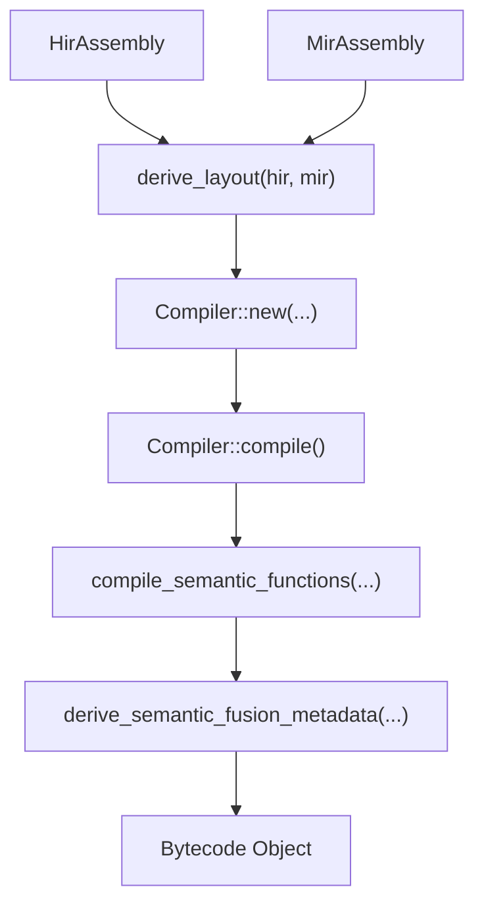
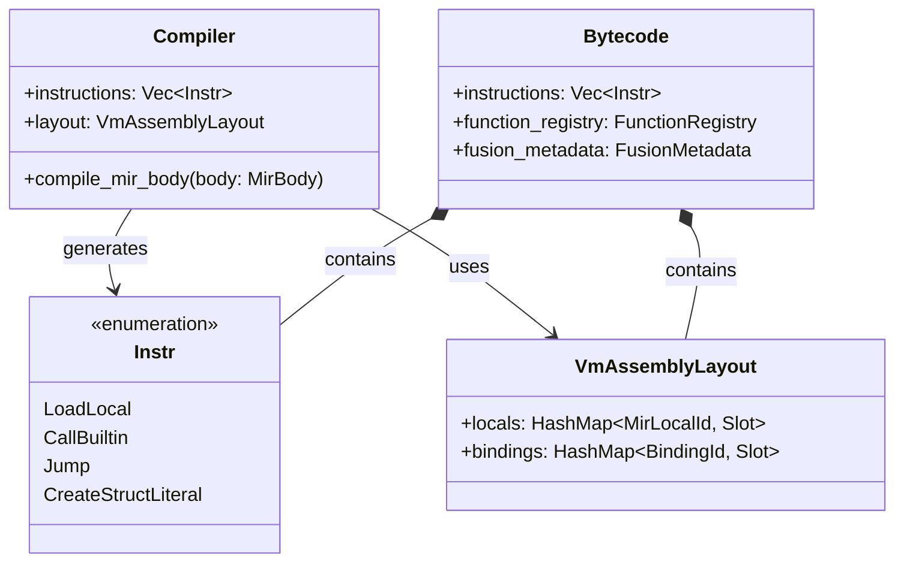

# Bytecode Compilation (MIR → Bytecode)

The Bytecode Compilation stage is the final phase of the RunMat compilation pipeline before execution. It transforms the Mid-Level Intermediate Representation (MIR) into a linear sequence of virtual machine instructions (`Instr`). This process is managed by the `Compiler` struct within the `runmat-vm` crate, which handles layout mapping, jump patching, and the generation of acceleration metadata for the JIT and GPU tiers.

## The Compiler Architecture

The `Compiler` struct is the central entity responsible for lowering a `MirBody` into VM bytecode. It maintains the state of the instruction stream, variable counts, and metadata required for the interpreter loop.

### Key Data Structures

- `Compiler`: Orchestrates the lowering of MIR statements and terminators into instructions.
- `Instr`: The bytecode instruction set used by the `runmat-vm` interpreter.
- `VmAssemblyLayout`: Maps MIR locals and HIR bindings to specific stack slots in the VM's `ExecutionContext`.
- `FunctionRegistry`: A collection of `FunctionBytecode` objects representing semantic functions (subfunctions, nested functions) defined within a file.

### Data Flow: MIR to Bytecode

The entry point for compilation is the `compile` function in `runmat-vm::bytecode::compile`.

## Implementation Details

### MIR-to-Instr Lowering

The compiler iterates through the `BasicBlocks` of a `MirBody`. Each `MirStmt` is lowered to one or more `Instr` variants.

- Assignments: `MirStmtKind::Assign` is lowered to stack-based operations. If the R-value is a constant, it emits `Instr::LoadConst`; if it is a local, it emits `Instr::LoadLocal`.
- Function Calls: `MirCall` objects are lowered to specific call instructions based on the callee type:
  - `Instr::CallBuiltin`: For standard library functions.
  - `Instr::CallUserFunction`: For user-defined functions.
  - `Instr::CallFevalMulti`: For dynamic function handle execution.
- Aggregates: Struct and Object literals (introduced in recent semantic updates) are lowered to `Instr::CreateStructLiteral` and `Instr::CreateObjectLiteral` respectively, preserving field evaluation order.

### Jump Patching and Control Flow

The compiler performs a single-pass lowering with a subsequent jump-patching phase. Since MIR terminators (like `Goto` or `SwitchInt`) refer to `BasicBlockId`, the compiler maintains a mapping of block IDs to instruction offsets. Once all blocks are emitted, the `Jump(target)` and `JumpIfFalse(target)` instructions are updated with absolute instruction indices.

### Stochastic Evolution Fast-Path

The compiler includes a specialized detection mechanism for "stochastic evolution" patterns. If it detects a loop structure involving a state update with drift and scale (common in Monte Carlo simulations), it flags the region for the `Turbine JIT` to apply optimized numeric kernels. This can be disabled via the `RUNMAT_DISABLE_STOCHASTIC_EVOLUTION` environment variable.

## Acceleration & Fusion Metadata

The compiler generates `FusionMetadata` to assist the GPU offload engine (`runmat-accelerate`).

| Metadata Entity | Purpose |
| --- | --- |
| FusionCandidateGroups | Identifies sequences of element-wise or reduction MIR statements that are valid for GPU fusion. |
| InstructionWindows | Maps instruction ranges to specific fusion candidates for the runtime planner. |
| AccelGraph | A data-flow graph of the bytecode used to detect residency patterns and minimize CPU-GPU transfers. |

## System Entity Mapping

The following diagram maps the logical compilation concepts to the specific Rust entities and file locations.

## Error Handling and Validation

The compilation process enforces strict semantic contracts, emitting stable identifiers for errors:

- `RunMat:MirSliceIndexPlanInvalid`: Emitted when a slice operation contains invalid end-relative expressions that cannot be lowered to a static plan.
- `RunMat:MirFunctionHandleNameMissing`: Emitted if a function handle target (builtin, dynamic, or imported) has an empty or malformed textual name.
- `RunMat:ImportAmbiguous`: Emitted when a call or handle resolution is invalidated by conflicting imports.