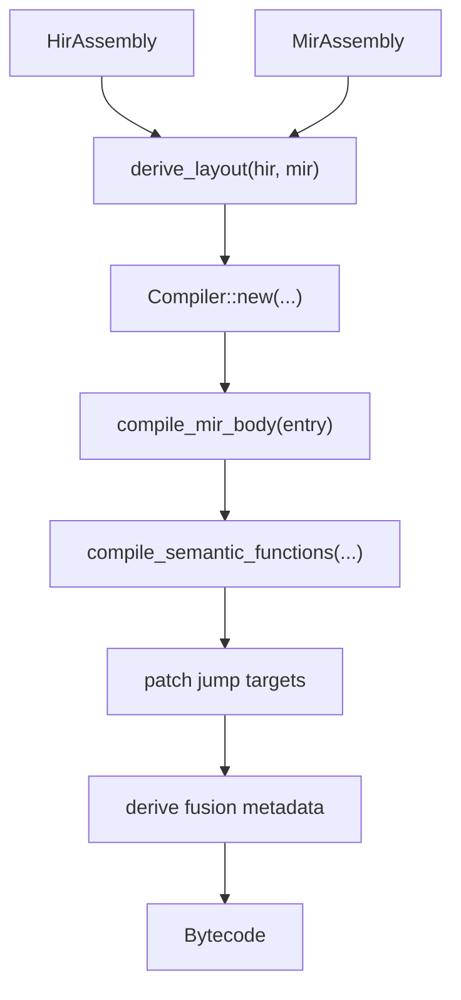
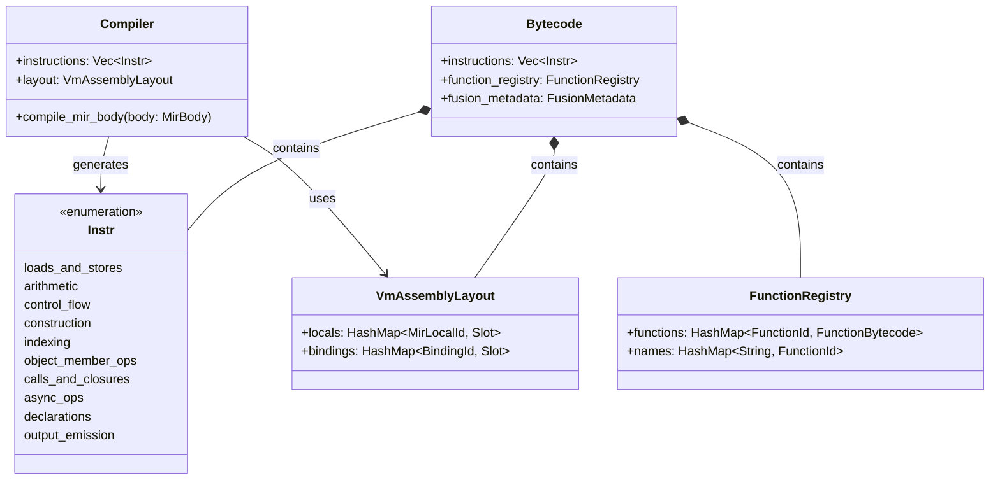

# Bytecode Compilation (MIR → Bytecode)

The bytecode compilation stage is the final lowering step before VM execution. It transforms the Mid-Level IR (MIR) into a linear sequence of `Instr` values, plus the metadata the interpreter needs for variable layout, source spans, semantic function dispatch, async execution, and acceleration planning.

The lowering is managed by the `Compiler` in `runmat-vm`. It consumes a `MirAssembly` and the corresponding `HirAssembly`, derives a `VmAssemblyLayout`, emits bytecode for the entry body and semantic functions, patches jumps, and attaches fusion metadata used by the acceleration tiers.

## Compiler Architecture

The compiler is a stateful instruction emitter. It tracks the instruction stream, layout, spans, call-argument spans, and deferred jump targets while walking MIR basic blocks.

### Key Data Structures

- `Compiler`: Orchestrates MIR-to-bytecode lowering.
- `Instr`: The VM instruction enum executed by the interpreter.
- `Bytecode`: The top-level program container for instructions, layout, functions, spans, async metadata, and fusion metadata.
- `FunctionRegistry`: Maps `FunctionId` and display names to compiled semantic function bytecode.
- `VmAssemblyLayout`: Maps MIR locals and HIR bindings to VM slots.

### Data Flow: MIR to Bytecode

## Lowering Responsibilities

### MIR Statements and Terminators

The compiler walks each `MirBody` by basic block. `MirStmt` values emit stack operations, variable stores, indexing instructions, aggregate constructors, or call instructions. `MirTerminator` values emit jumps, conditional branches, returns, and exception-region boundaries.

### Calls

Call lowering depends on the resolved callee shape:

- `CallBuiltinMulti` calls a known runtime built-in.
- `CallSemanticFunctionMulti` calls a known function in the compiled semantic assembly.
- `CallFunctionMulti` carries a `CallableIdentity` and `CallableFallbackPolicy` for runtime resolution.
- `CallFevalMulti` keeps the callable value on the stack and resolves it at runtime.
- `*ExpandMultiOutput` variants evaluate comma-separated-list expansion before dispatch.

### Indexing

The compiler preserves the indexing plan established by MIR. Scalar indexing emits `Index` or `StoreIndex`; plain slices emit `IndexSlice` or `StoreSlice`; selectors involving runtime `end` arithmetic emit `IndexSliceExpr` or `StoreSliceExpr`.

### Control Flow

MIR basic-block targets are not known as final instruction offsets until all relevant blocks are emitted. The compiler therefore records block-to-instruction mappings and patches `Jump`, `JumpIfFalse`, `AndAnd`, and `OrOr` targets after emission.

## Complete Instruction Set

The table below lists every current `Instr` variant, grouped by runtime behavior.

### Constants, Variables, and Locals

| Instructions | Purpose |
| --- | --- |
| `LoadConst`, `LoadComplex`, `LoadBool`, `LoadString`, `LoadCharRow` | Push literal values onto the stack. |
| `LoadVar`, `LoadVarForIndexAssignment`, `StoreVar` | Read and write workspace variable slots. `LoadVarForIndexAssignment` can initialize an undefined indexed-assignment base. |
| `EnterScope`, `ExitScope`, `LoadLocal`, `StoreLocal` | Manage local frame storage and local slot access. |

### Arithmetic, Comparison, and Logical Operations

| Instructions | Purpose |
| --- | --- |
| `Add`, `Sub`, `Mul`, `RightDiv`, `LeftDiv`, `Pow` | Matrix/scalar arithmetic operations. |
| `Neg`, `UPlus` | Unary arithmetic operations. |
| `Transpose`, `ConjugateTranspose` | MATLAB transpose operators. |
| `ElemMul`, `ElemDiv`, `ElemPow`, `ElemLeftDiv` | Element-wise arithmetic operations. |
| `LessEqual`, `Less`, `Greater`, `GreaterEqual`, `Equal`, `NotEqual` | Comparison operations. |
| `LogicalNot`, `LogicalAnd`, `LogicalOr` | Eager logical operations. |
| `AndAnd`, `OrOr` | Short-circuit logical control-flow operations. |

### Stack and Control Flow

| Instructions | Purpose |
| --- | --- |
| `Pop`, `Swap`, `Unpack` | Stack manipulation and output-list expansion. |
| `JumpIfFalse`, `Jump` | Branch to patched instruction offsets. |
| `EnterTry`, `PopTry` | Maintain the try/catch handler stack. |
| `Return`, `ReturnValue` | Exit the current interpreter frame. |
| `StochasticEvolution` | Specialized fast-path marker for stochastic evolution kernels. |

### Array and Aggregate Construction

| Instructions | Purpose |
| --- | --- |
| `CreateMatrix`, `CreateMatrixDynamic` | Build matrix values from stack operands. |
| `CreateRange` | Build colon/range values. |
| `CreateCell2D` | Build cell arrays. |
| `CreateStructLiteral` | Build struct literals from named field values. |
| `CreateObjectLiteral` | Build object literals with class names and field values. |
| `PackToRow`, `PackToCol` | Pack stack values into row or column tensor form. |

### Indexing and Assignment

| Instructions | Purpose |
| --- | --- |
| `Index`, `StoreIndex`, `StoreIndexDelete` | Scalar or linear paren indexing and assignment. |
| `IndexSlice`, `StoreSlice`, `StoreSliceDelete` | Slice indexing with compiler-encoded colon and plain `end` masks. |
| `IndexSliceExpr`, `StoreSliceExpr`, `StoreSliceExprDelete` | General slice indexing with dynamic ranges and `EndExpr` arithmetic. |
| `IndexCell`, `IndexCellExpand`, `IndexCellList` | Brace/cell indexing, fixed-arity expansion, and first-class comma-separated-list creation. |
| `StoreIndexCell`, `StoreIndexCellDelete` | Brace/cell indexed assignment and deletion form. |

Indexed assignment instructions push the updated base value. A later `StoreVar` or `StoreLocal` commits that updated base to its destination slot.

### Struct, Object, Class, and Member Operations

| Instructions | Purpose |
| --- | --- |
| `LoadMember`, `LoadMemberOrInit`, `LoadMemberDynamic`, `LoadMemberDynamicOrInit` | Read static or dynamic members, with optional initialization semantics. |
| `StoreMember`, `StoreMemberOrInit`, `StoreMemberDynamic`, `StoreMemberDynamicOrInit` | Write static or dynamic members, with optional initialization semantics. |
| `LoadMethod` | Load a method reference from an object-like value. |
| `CallMethodOrMemberIndexMulti`, `CallMethodOrMemberIndexExpandMultiOutput` | Resolve ambiguous method/member indexing calls at runtime. |
| `LoadStaticProperty` | Load a class static property. |
| `RegisterClass` | Register a lowered `classdef` definition at runtime. |

### Function Handles, Calls, and Async

| Instructions | Purpose |
| --- | --- |
| `CreateFunctionHandle`, `CreateExternalFunctionHandle`, `CreateMethodFunctionHandle`, `CreateBoundFunctionHandle` | Build function-handle values. |
| `CreateClosure`, `CreateSemanticClosure` | Build closure values with captured stack operands. |
| `CallBuiltinMulti`, `CallBuiltinExpandMultiOutput` | Dispatch runtime built-ins. |
| `CallFunctionMulti`, `CallFunctionExpandMultiOutput` | Dispatch a `CallableIdentity` through fallback-aware callable resolution. |
| `CallSemanticFunctionMulti`, `CallSemanticFunctionExpandMultiOutput` | Dispatch directly to compiled semantic functions. |
| `CallFevalMulti`, `CallFevalExpandMultiOutput` | Dispatch a runtime callable value through `feval`. |
| `CreateSemanticFuture`, `CreateSemanticFutureExpandMultiOutput` | Build lazy semantic-future descriptors. |
| `Spawn`, `Await` | Explicit async spawn and await boundaries. |

### Imports, Globals, Persistents, and Visible Output

| Instructions | Purpose |
| --- | --- |
| `RegisterImport` | Register an import path for later unqualified callable resolution. |
| `DeclareGlobal`, `DeclareGlobalNamed` | Declare global slots, including name-stable forms across units. |
| `DeclarePersistent`, `DeclarePersistentNamed` | Declare persistent slots, including name-stable forms across units. |
| `EmitStackTop`, `EmitVar` | Emit visible workspace output labels such as `ans` or a variable name. |

## Supporting Operand Types

### `EndExpr`

`EndExpr` represents selector expressions that depend on the runtime size of the indexed value. It supports:

- Base values: `End`, `Const`, `Var`.
- Callable expressions: `ResolvedCall`.
- Arithmetic: `Add`, `Sub`, `Mul`, `Div`, `LeftDiv`, `Pow`.
- Unary and rounding operations: `Neg`, `Pos`, `Floor`, `Ceil`, `Round`, `Fix`.

### `ArgSpec`

`ArgSpec` describes multi-output argument expansion for call instructions. It records whether an argument is expanded, how many indices are consumed for a brace/object expansion, and whether the expansion consumes all contents.

## Stack Effects

Most instructions have a static `StackEffect` reported by `Instr::stack_effect()`. The effect is used by metadata and acceleration planning:

- Literal loads, variable loads, function-handle creation, and local loads push one value.
- Binary arithmetic and comparisons pop two values and push one.
- Calls pop their arguments and push the requested result shape.
- Indexed writes pop the base, selectors, and RHS, then push the updated base.
- `StochasticEvolution` has no ordinary static stack effect because it is handled as a specialized fast path.

`IndexSliceExpr` and the expanded call variants also carry structured operand metadata. Their exact runtime pops depend on the encoded range or expansion specs, while the bytecode still records enough static information for planning and validation.

## System Entity Mapping

## Acceleration and Fusion Metadata

The compiler generates `FusionMetadata` to assist the GPU offload engine and runtime planner.

| Metadata Entity | Purpose |
| --- | --- |
| `FusionCandidateGroups` | Identifies sequences of MIR operations that are valid candidates for fusion. |
| `InstructionWindows` | Maps emitted instruction ranges back to fusion candidates. |
| `AccelGraph` | Describes bytecode data flow for residency planning and CPU/GPU transfer minimization. |

## Error Handling and Validation

The compiler validates MIR and HIR contracts before emitting bytecode. Stable error identifiers include:

- `RunMat:MirScalarIndexPlanInvalid`: A scalar indexing plan cannot be lowered safely.
- `RunMat:MirSliceIndexPlanInvalid`: A slice or `end`-relative plan is malformed.
- `RunMat:MirCellIndexPlanInvalid`: A cell indexing plan is malformed.
- `RunMat:MirFunctionHandleNameMissing`: A function handle target lacks a usable name.
- `RunMat:ImportAmbiguous`: Import resolution produced conflicting candidates.

From here, bytecode execution continues in [Interpreter Dispatch & Execution Loop](/docs/runtime/vm/interpreter).
