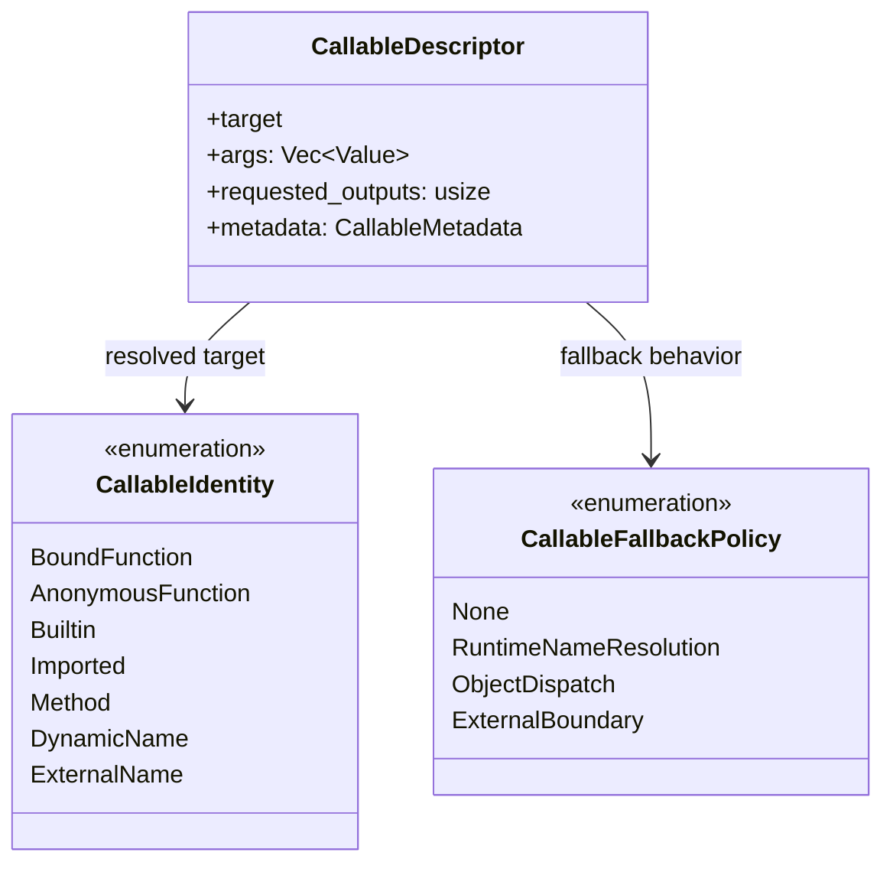
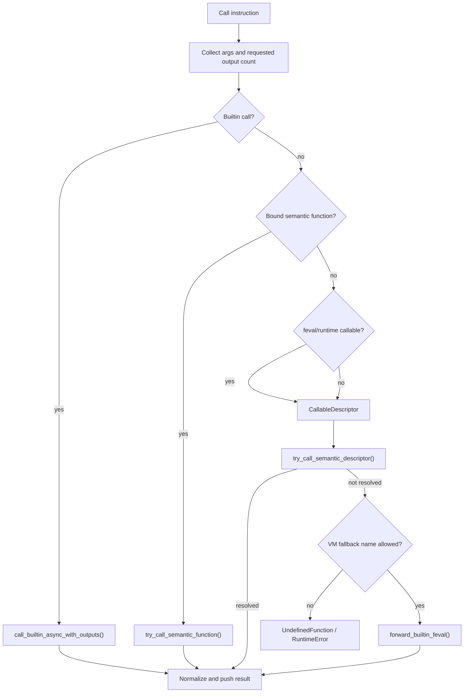

# Callable Resolution & Function Dispatch

RunMat's callable dispatch system bridges source-level calls to bytecode functions, runtime built-ins, closures, `feval`, object methods, and external-name fallbacks. The VM receives call intent through bytecode instructions and resolves it through `CallableIdentity`, `CallableFallbackPolicy`, `CallableDescriptor`, and the runtime semantic function hooks installed by the interpreter.

## Callable Identity

HIR represents callable targets with `CallableIdentity`. The identity tells the VM whether the compiler already knows the target or whether the target must remain name-shaped until runtime.

| Identity | Meaning |
| --- | --- |
| `BoundFunction` | A function defined in the current semantic assembly. |
| `AnonymousFunction` | An anonymous function represented by a semantic function ID. |
| `Builtin` | A named built-in function. |
| `Imported` | A function imported through a module path. |
| `Method` | A method-style dispatch target. |
| `DynamicName` | A source name that must be resolved at runtime. |
| `ExternalName` | A qualified external name such as `pkg.func`. |

`CallableFallbackPolicy` controls which unresolved identities can attempt semantic name resolution, VM name fallback, object dispatch, or external-boundary forwarding.

## Dispatch Entry Points

The VM has several bytecode-level call forms:

- `CallBuiltinMulti`: call a named built-in with a requested output count.
- `CallSemanticFunctionMulti`: call a known bytecode-defined semantic function.
- `CallFunctionMulti`: call a `CallableIdentity` with a fallback policy.
- `CallFevalMulti`: evaluate a runtime callable value.
- `CallMethodOrMemberIndexMulti`: call an instance method, static method, property accessor, or member-index fallback.
- `*ExpandMultiOutput`: build arguments from cell/object expansion specs before dispatch.
- `CreateClosure` and `CreateSemanticClosure`: construct function-handle values with captures.

These instructions are handled in the interpreter dispatcher and routed through `interpreter/dispatch/calls.rs` and `call/*`.

## Resolution Flow

`CallableDescriptor` is the central value for dispatching resolved and runtime call targets. Direct calls construct a descriptor from a known identity. `feval` constructs a descriptor from a runtime `Value`, including strings, char rows, scalar string arrays, closures, function handles, method handles, and bound function handles.

## Built-ins and VM Intrinsics

Most built-ins are invoked through `runmat_runtime::call_builtin_async_with_outputs`. Before that happens, the VM can intercept a few operations that require interpreter state:

- `nargin` and `nargout` read the current call-count stack.
- `rethrow` can rebuild an error from `last_exception`.
- Imported built-ins are resolved against explicit and wildcard imports before falling back to ordinary built-in lookup.

The call layer also normalizes singleton `OutputList` results when exactly one output is requested, while preserving multi-output and zero-output semantics.

Expanded built-in calls use a more direct runtime path after argument expansion, so the ordinary import and exception wrapping behavior is concentrated in the non-expanded `CallBuiltinMulti` path.

## Semantic Functions and Closures

The interpreter installs thread-local semantic function invoker and resolver hooks before the execution loop starts. Those hooks are backed by the current bytecode `FunctionRegistry`, so runtime code can call back into functions defined in the same file or assembly.

Closures preserve their captured values in `Value::Closure`. When a closure is called through `feval`, the descriptor prepends captured values to the runtime arguments and prefers a bound function ID when one is available. If no bound function exists, the descriptor falls back through name resolution using the closure's function name.

## `feval`

`feval` is deliberately split into VM and runtime behavior. The VM fast-paths values it can resolve locally:

- `@name` strings, char rows, and scalar string arrays.
- `Value::FunctionHandle`, `Value::ExternalFunctionHandle`, and `Value::MethodFunctionHandle`.
- `Value::BoundFunctionHandle`.
- `Value::Closure`.

If a value is not resolved by the VM descriptor path, it is forwarded to the runtime `feval` implementation. That keeps dynamic behavior centralized while still allowing bytecode-defined functions and closures to execute without leaving the VM.

## Object and Method Dispatch

Object call and indexing paths use the same callable machinery once they have produced a method target. `ObjectDispatch` fallback is converted after object protocol handling so unresolved method-like names can continue through ordinary runtime name resolution where appropriate.

Instance method dispatch checks class metadata, rejects invalid static/private access, and prepends the receiver when invoking the resolved method. If metadata lookup does not produce a method, the VM can try a qualified `Class.member` external identity, a bare-name fallback, or a `getfield`-style member access path depending on the receiver and policy.

This is why callable dispatch and indexing are linked: object `subsref`/`subsasgn`, method handles, member access, and cell/object argument expansion all converge on `CallableDescriptor`, semantic hooks, and runtime built-in invocation.
