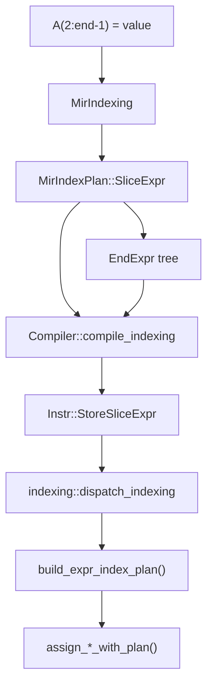
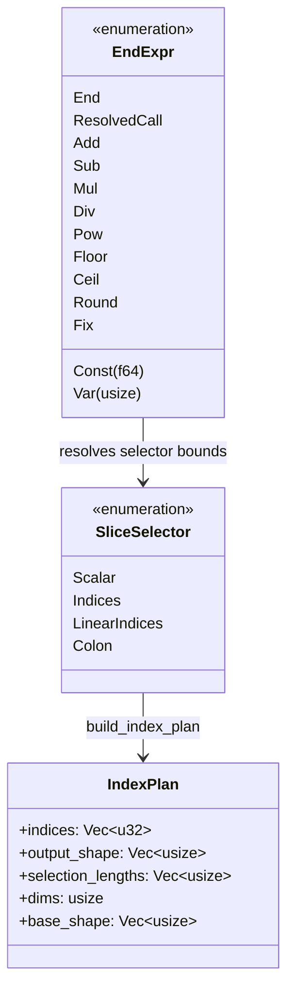
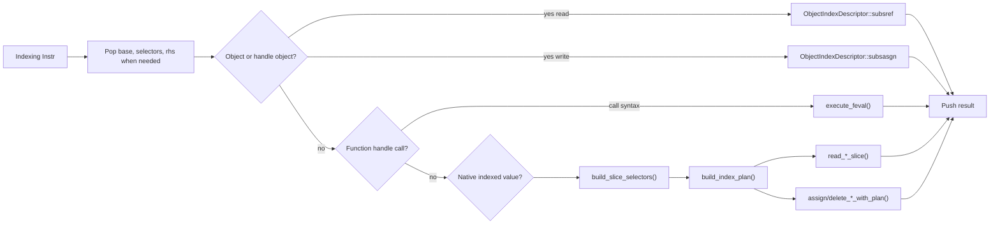

# Indexing Subsystem

The VM indexing subsystem executes MATLAB-style indexing after the compiler has already classified the operation. It handles scalar access, multidimensional slicing, `end` expressions, cell arrays, logical arrays, strings, GPU tensors, and object `subsref`/`subsasgn` dispatch.

The key design point is that indexing intent is made explicit before runtime. MIR carries a `MirIndexPlan`, the VM compiler emits a matching bytecode instruction, and the interpreter builds concrete selector plans only from the runtime shape and values it actually needs.

## Planning Model

Indexing begins in the compiler pipeline, where HIR and MIR identify whether an operation is a scalar index, a slice, a slice expression involving `end`, or cell indexing. The VM compiler lowers those plans to indexing instructions in `Instr`.

### Plan Categories

| Category | Runtime Meaning | Representative Instructions |
| --- | --- | --- |
| Scalar | Direct element access with numeric scalar selectors. | `Index`, `StoreIndex` |
| Slice | Colon, vector, logical, or range-based access without dynamic `end` expressions. | `IndexSlice`, `StoreSlice` |
| SliceExpr | Slice access whose selectors require runtime `EndExpr` evaluation. | `IndexSliceExpr`, `StoreSliceExpr` |
| Cell | Cell container or cell contents access. | `IndexCell`, `StoreCellIndex`, cell-specific slice paths |
| Member | Dot/member access and object protocols. | `IndexMember`, object descriptors |

The stack contract is part of the bytecode ABI. Read instructions pop their base value and selectors, then push the selected value. Write instructions also pop the right-hand side and then push the updated base value; a later store instruction commits that value back to the variable or local slot.

## `end` Expressions

The compiler represents `end` and expressions derived from it as `EndExpr`. The interpreter resolves these expressions after it knows the selected base shape and dimension. `EndExpr` supports constants, local variables, arithmetic, rounding functions, and resolved calls used by end-expression semantics.

## VM Execution Flow

At runtime, `indexing::dispatch_indexing` consumes the instruction and its stack operands, normalizes selectors, builds an `IndexPlan` when needed, and routes the operation to the correct value-specific implementation.

### Read Operations

Read paths support tensors, complex tensors, GPU tensors, string arrays, cells, logical arrays, objects, and simple scalar fallback through runtime indexing. Logical arrays are temporarily mapped to numeric tensors for slice planning, then converted back to logical results where appropriate.

Function handles can also be invoked through paren indexing syntax when the selector form is call-like. Colon and `end` selectors are rejected for that path because they are indexing syntax, not function-call arguments.

### Write Operations

Write paths use the same selector planning but route to assignment or deletion helpers. Tensor, complex tensor, GPU tensor, string array, and cell writes each have specialized scatter behavior. Deletion is explicit in the bytecode through `StoreSliceDelete` or `StoreSliceExprDelete`.

### Cell Expansion

Brace indexing can produce comma-separated-list behavior. Shared call helpers such as `expand_brace_values` are used by call expansion instructions so that cell contents can be expanded into argument lists or output lists.

## Object Indexing

When the base is an object or handle object, the VM does not treat indexing as a native tensor or cell operation. Instead, it builds an `ObjectIndexDescriptor` and dispatches through the relevant MATLAB object protocol:

- `subsref` for reads.
- `subsasgn` for writes.
- Member indexing for dot access.

Missing overloads are normalized into stable errors before falling back to native paths.

## Error Boundaries

The indexing layer intentionally separates compile-time plan validation from runtime value validation. Malformed MIR plans fail during bytecode compilation with MIR-specific identifiers such as `RunMat:MirSliceIndexPlanInvalid`. Runtime selector and shape failures are normalized in the interpreter as indexing errors such as invalid selector plans, unsupported selector syntax, shape mismatch, or unsupported base values.

Some MATLAB behaviors are intentionally explicit at these boundaries. Cell brace deletion is rejected through a dedicated unsupported-cell deletion error, and string slice deletion is currently unsupported. GPU slice reads prefer provider-side gather operations but may fall back through host materialization when a direct GPU plan cannot be used.
