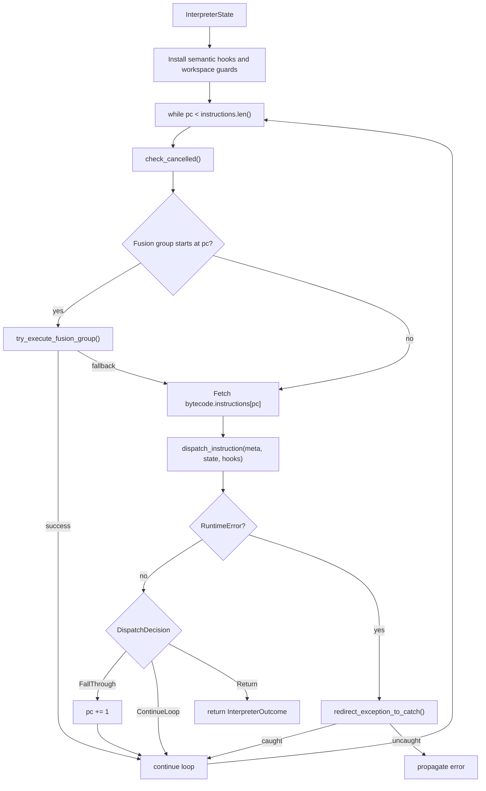
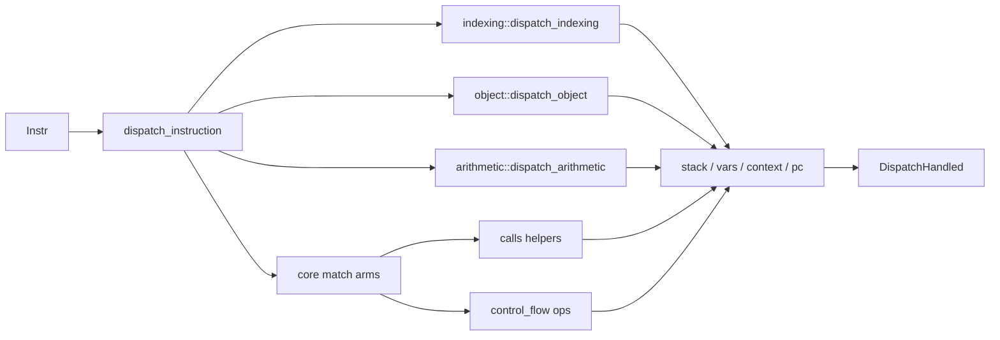

# Interpreter Dispatch & Execution Loop

The RunMat interpreter executes the bytecode emitted by the VM compiler. It is an async instruction loop over `Instr` values, with runtime state held in `InterpreterState` and passed into the dispatch layer as a mutable `DispatchState`. The loop owns the program counter, value stack, variable slots, try/catch stack, semantic function resolver hooks, and optional native-acceleration fusion plan.

## Runtime State

`InterpreterState` is created from a `Bytecode` program and the caller's initial variable slots. Before execution begins, the interpreter installs semantic function hooks, prepares workspace state, initializes GC roots, and activates a fusion plan when the `native-accel` feature is enabled.

### Key Runtime Fields

| Field | Purpose |
| --- | --- |
| `bytecode` | The instruction stream, variable metadata, function registry, and fusion metadata. |
| `stack` | Temporary operand stack used by bytecode instructions. |
| `vars` | Workspace or frame-local variable slots addressed by `LoadVar`, `StoreVar`, and local fallbacks. |
| `context` | Call stack, local frame storage, instruction pointer metadata, and async task tracking. |
| `pc` | Program counter into `bytecode.instructions`. |
| `try_stack` | Stack of catch targets used by `try`/`catch` bytecode. |
| `last_exception` | Last caught exception value, used by exception-sensitive built-ins such as `rethrow`. |

## Execution Loop

The main loop in `run_interpreter_inner` repeatedly fetches the instruction at `pc`, offers eligible spans to the fusion executor, dispatches the instruction, and then applies the resulting control-flow decision.

## Instruction Dispatch

`dispatch_instruction` receives three grouped inputs:

- `DispatchMeta`: the current instruction, function registry, source metadata, call spans, and call-count context.
- `DispatchState`: mutable stack, variables, context, try stack, imports, aliases, persistent state, missing-input slots, and `pc`.
- `DispatchHooks`: callbacks used by the runner for residency cleanup and workspace or persistent-variable synchronization.

The dispatcher first gives broad instruction families to specialized modules. Indexing, object, and arithmetic handlers return `true` when they consume the instruction. The remaining bytecode variants are handled by the central `match` in `dispatch/mod.rs`.

### Dispatch Categories

| Category | Representative Instructions | Primary Handler |
| --- | --- | --- |
| Indexing | `Index`, `StoreIndex`, `IndexSlice`, `StoreSliceExpr` | `interpreter/dispatch/indexing.rs` |
| Arithmetic and logical ops | `Add`, `Sub`, `Mul`, comparisons, boolean ops | `interpreter/dispatch/arithmetic.rs` |
| Object support | Object literals and object operations | `interpreter/dispatch/object.rs` |
| Variables and stack | `LoadVar`, `StoreVar`, `LoadLocal`, `Pop`, `Swap` | `interpreter/dispatch/mod.rs` |
| Control flow | `Jump`, `JumpIfFalse`, `EnterTry`, `Return` | `ops/control_flow.rs` |
| Calls | Built-ins, semantic functions, `feval`, multi-output calls | `interpreter/dispatch/calls.rs` and `call/*` |
| Async | Semantic futures, `Spawn`, `Await` | `interpreter/dispatch/mod.rs` |

Indexed assignment instructions push the updated base value back onto the stack. Follow-up bytecode is responsible for storing that value into the target variable or local slot with `StoreVar` or `StoreLocal`.

## Exception Routing

`try`/`catch` is represented directly in bytecode. `EnterTry` pushes a catch target onto `try_stack`, and `PopTry` removes it when the protected region exits normally. If a handler returns `RuntimeError`, the runner calls `redirect_exception_to_catch`.

When a catch target exists, the VM:

- Pops the active catch entry.
- Converts the runtime error into an `MException`.
- Stores that exception into the optional catch variable slot.
- Updates `last_exception`.
- Sets `pc` to the catch handler.

If no catch entry exists, the error leaves the interpreter.

## Semantic Function Hooks

Before entering the loop, the interpreter installs thread-local semantic invoker and resolver hooks backed by the bytecode `FunctionRegistry`. This lets the runtime call back into bytecode-defined functions from several paths: direct semantic calls, closures, `feval`, object dispatch, and end-expression calls inside indexing.

Those hooks are scoped by guards. Bound semantic calls depend on them being active; without the interpreter-installed invoker, a semantic function ID cannot be executed by the runtime layer.

From here, call-specific behavior is covered in [Callable Resolution & Function Dispatch](/docs/runtime/vm/dispatch), and indexing-specific behavior is covered in [Indexing Subsystem](/docs/runtime/vm/indexing).
