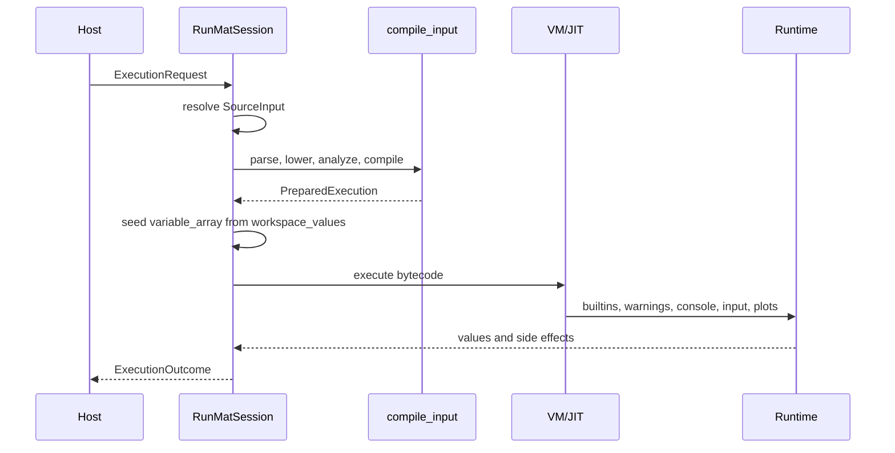

# Execution Requests

The primary session boundary is `RunMatSession::execute_request`. Hosts submit an `ExecutionRequest` and receive an `ExecutionOutcome`. This ABI is explicit enough for CLI output, browser payloads, notebook cells, editor integrations, and future remote execution to share the same execution contract.

## Request Shape

```rust
pub struct ExecutionRequest {
    pub source: SourceInput,                 // inline text or a path to read
    pub compatibility: CompatMode,           // parser/language mode for this request
    pub host_policy: HostExecutionPolicy,    // host-controlled execution policy
    pub requested_outputs: RequestedOutputCount,
    pub workspace: WorkspaceHandle,          // stable identity for binding keys
}
```

| Field | Role |
| --- | --- |
| `source` | Either `SourceInput::Text { name, text }` or `SourceInput::Path(path)`. Path sources are read before execution. |
| `compatibility` | Parser/language compatibility for this request, usually `runmat` mode. |
| `host_policy` | Host-controlled execution policy, currently including top-level await. |
| `requested_outputs` | Normalizes the returned flow for zero, one, or multiple requested outputs. |
| `workspace` | Stable `WorkspaceHandle` used to build interactive binding keys. |

`execute_request` temporarily applies request-specific compatibility, source identity, source name, host policy, and workspace handle. After the request finishes, the previous session defaults are restored.

## Compilation And Execution



`compile_input` always follows the normal compiler stack for submitted source: parser, HIR lowering, MIR lowering, MIR analysis, and VM bytecode compilation. The session contributes current workspace bindings, known semantic function names, project symbols, compatibility mode, and top-level await policy to lowering.

## Outcome Shape

```rust
pub struct ExecutionOutcome {
    pub flow: RuntimeFlow,                 // public result value
    pub workspace_delta: WorkspaceDelta,   // versioned upserts/removals
    pub display_events: Vec<DisplayEvent>,
    pub streams: Vec<ExecutionStreamEntry>,
    pub diagnostics: Vec<RuntimeDiagnostic>,
    pub effects: Vec<ObservedEffect>,
    pub suspension: Option<Suspension>,    // reserved for resumable work
    pub profiling: Option<ExecutionProfiling>,
    pub execution_time_ms: u64,
    pub used_jit: bool,
    pub figures_touched: Vec<u32>,
    pub stdin_events: Vec<StdinEvent>,
    pub fusion_plan: Option<FusionPlanSnapshot>,
    // ...
}
```

| Field | Role |
| --- | --- |
| `flow` | Public result value: `NoValue`, `Single`, output list, comma list, or dynamic list handle. |
| `workspace_delta` | Versioned upserts/removals for host workspace panes. |
| `display_events` | Values that should be displayed as execution output. |
| `streams` | Ordered stdout, stderr, and clear-screen entries captured during execution. |
| `diagnostics` | Runtime errors and warnings in a host-friendly shape. |
| `effects` | Structured side effects such as workspace clear or environment mutation. |
| `profiling` | Wall time and optional CPU/GPU profiling data. |
| `figures_touched` | Plot figure handles mutated by this request. |
| `stdin_events` | Recorded input/key events and errors. |
| `fusion_plan` | Optional fusion-plan metadata when enabled. |

The VM remains the semantic baseline. When the JIT is enabled, the session may use Turbine for eligible non-expression assignment bytecode. If the JIT cannot run safely, execution falls back to the VM interpreter.

## Requested Outputs

After execution, `apply_requested_output_policy` adjusts `RuntimeFlow`:

| Requested count | Behavior |
| --- | --- |
| zero | Public flow becomes `NoValue`. |
| one | Output/comma lists collapse to their first value when present. |
| exactly N | Single values become one-element output lists; longer lists are truncated to N. |

This keeps host callers from reverse-engineering MATLAB output arity from display output.
