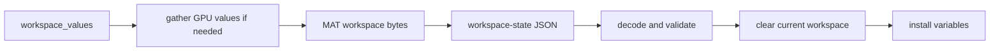

# Workspace Replay

Workspace replay persists and restores live session variables. It is owned by
`runmat-runtime::replay::workspace` and the session import/export methods.

Workspace replay exports session variables into a JSON payload containing base64 MAT bytes:

`export_workspace_state` gathers each value as needed before encoding. `WorkspaceExportMode::Auto` returns nothing for an empty workspace; `Force` emits a payload even for an empty workspace; `Off` disables export.

`import_workspace_state` validates and decodes the replay payload, clears the current session workspace, then installs restored variables into slots, bindings, and durable values. Import is restore/replace semantics, not merge semantics.

## Replay Limits

The runtime enforces replay limits before accepting payloads:

| Limit | Default |
| --- | --- |
| Workspace payload bytes | 32 MB |
| MAT payload bytes | 24 MB |
| Variable count | 2048 |

Rejected payloads produce replay/runtime errors instead of partial imports.
