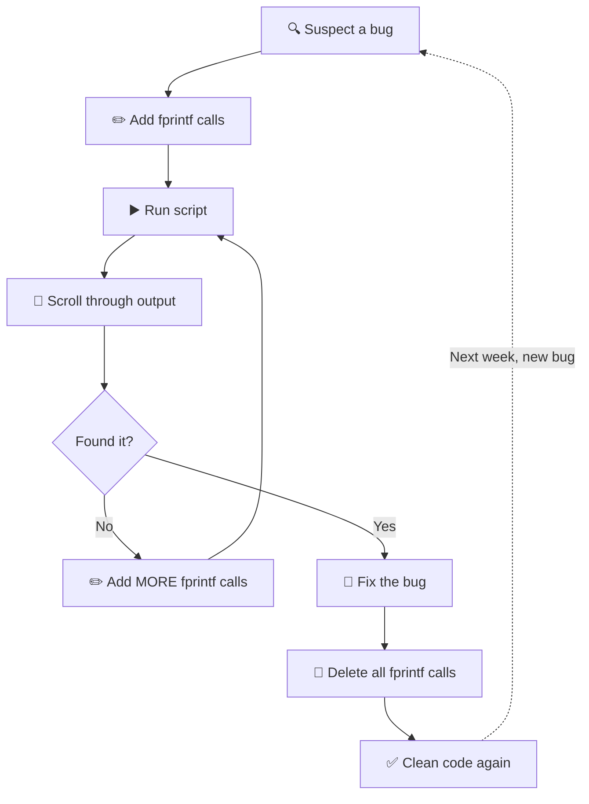
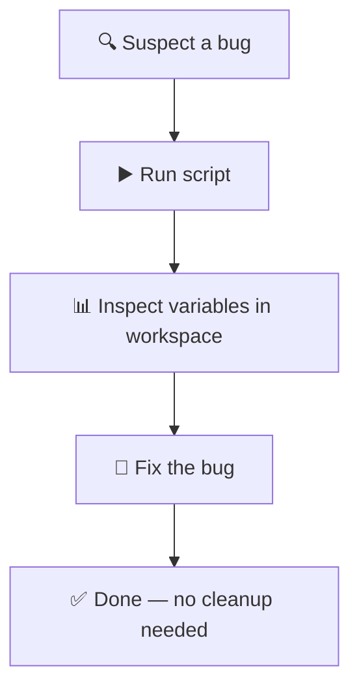

`fprintf` is C's [`printf`](https://en.cppreference.com/w/c/io/fprintf) with a file descriptor, a function designed in 1972 for writing formatted text to streams. Fifty-four years later, it is still the primary debugging tool for engineers writing MATLAB.

You know the workflow. A thermal simulation diverges somewhere in a 5,000-iteration convergence loop. You add `fprintf('iter %d: T_max = %.4f\n', k, max(T(:)))` inside the loop, run the script, scroll through thousands of lines of output, and find the NaN at iteration 3,847. You remove the fprintf. Then you realize you also need to check the boundary condition array. You add another fprintf. You run again. You scroll again. You remove it again.

fprintf is a formatting function. It writes formatted text to files and to stdout. The fact that it became MATLAB's de facto debugger says more about MATLAB's tooling than it does about fprintf. If you just need the syntax and format specifiers, [skip to the reference](#fprintf-syntax-and-reference).

## Why fprintf fails as a debugger

You modify the script to observe it. Every debugging session is an edit-run-read-delete cycle. You are changing the thing you are trying to understand, and you have to undo those changes before the code is clean again.

The output is unstructured -- raw text in the Command Window. No severity levels, no timestamps, no filtering. Ten thousand iterations produce ten thousand lines, and your only search tool is your eyes. Any language with a `logging` module can filter by severity, grep by keyword, and route output to files. MATLAB's fprintf gives you a text stream and nothing else.

The debugging work is also disposable. You delete your fprintf calls when you clean up the code. Next week, a different variable diverges in the same loop. You add them all back.

Worse, `fprintf('x = %f\n', x)` shows you one scalar view of one variable. You cannot see dimensions, type, sparsity, or the other 47 workspace variables that might be relevant. You have to decide what to print before you know which variable is causing the problem.

And if you are working with [GPU arrays](/blog/how-to-use-gpu-in-matlab), fprintf on a gpuArray forces an implicit `gather`, transferring data from GPU to CPU just to print a number. Inside a loop, this serializes asynchronous GPU work and destroys the throughput you were trying to measure:

```matlab:runnable
x = gpuArray.rand(1e7, 1, 'single');
for k = 1:20
    x = sin(x) .* x + 0.5;
    fprintf('step %d: mean = %.6f\n', k, mean(x, 'all'));
end
```

Those 20 fprintf calls force 20 synchronous gather operations. Remove them and the loop runs 10-50x faster.

### The fprintf debugging loop

This is the workflow every MATLAB engineer runs on repeat:



Compare that with what a structured debugging environment gives you:



The first diagram has a cycle. The second does not. That is the entire argument.

### Every other scientific computing language fixed this already

Python shipped a [`logging`](https://docs.python.org/3/library/logging.html) module in its standard library in 2002 and added [`breakpoint()`](https://docs.python.org/3/library/functions.html#breakpoint) as a built-in in 2018. The community consensus shifted years ago: print debugging is a last resort, not a first instinct. Julia, which targets the same scientific computing audience as MATLAB, built [`@show`](https://docs.julialang.org/en/v1/stdlib/InteractiveUtils/#Base.@show) into the language as an explicit admission that print debugging will happen but should at least show the expression alongside the value (`@show x` prints `x = 5` without a manual format string). Julia also ships a [`Logging`](https://docs.julialang.org/en/v1/stdlib/Logging/) stdlib with `@info`, `@warn`, and `@debug` that produce timestamped, leveled, filterable records.

Both communities moved on from print-as-debugger. MATLAB's tooling never forced that shift because MATLAB never shipped the alternatives.

## fprintf gotchas

### Column-major traversal

When you pass a matrix to fprintf, it reads elements in [column-major order](https://en.wikipedia.org/wiki/Row-_and_column-major_order). MATLAB stores arrays column-first in memory, and fprintf walks linearly through that storage. If you expect row-by-row output, the results will surprise you:

```matlab:runnable
A = [1 2 3; 4 5 6];
fprintf('%d %d\n', A)
```

This prints `1 4`, then `2 5`, then `3 6`. The format string consumes two elements at a time, and those elements come from walking down columns: `1, 4, 2, 5, 3, 6`.

If you want row-by-row output, transpose first:

```matlab:runnable
A = [1 2 3; 4 5 6];
fprintf('%d %d %d\n', A')
```

Now it prints `1 2 3`, then `4 5 6`. The transpose flips rows and columns in memory, so the linear walk produces the order you expected.

This behavior is consistent with how every MATLAB function treats array storage, but fprintf is where most people encounter it for the first time because the output makes the traversal order visible.

### The format string repeats silently

Pass a vector to fprintf with a format string that consumes one element at a time:

```matlab:runnable
v = [10 20 30 40 50];
fprintf('val = %d\n', v)
```

This prints five lines. The format string repeats until every element in `v` has been consumed. No loop required -- fprintf handles the iteration internally.

The repetition follows the same column-major flattening described above. For a matrix, the format string walks through every element in column-first order, repeating as many times as needed. If the number of elements is not evenly divisible by the number of conversion specifiers in the format string, the last repetition still runs -- it just consumes fewer arguments, and leftover specifiers produce no output.

This is useful once you understand it, but it catches people off guard because no other language's printf family works this way. C's `printf` prints exactly once. Python's `print` does not repeat its format. MATLAB's fprintf is unique in treating the format string as a template that loops over its arguments.

### fprintf does not add a newline

If you are used to `disp`, this will trip you up:

```matlab:runnable
fprintf('hello')
fprintf(' world')
```

This prints `hello world` on a single line with no trailing newline. `disp` automatically appends a newline after its output. fprintf writes exactly what you tell it to -- if you want a newline, you have to include `\n` in the format string.

This matters when you mix fprintf and disp in the same script, or when you call fprintf in a function and the next output appears concatenated on the same line. The fix is simple (`fprintf('hello\n')`), but the confusion is real if you have not seen it before.

## What debugging actually looks like

Return to the thermal simulation from the opening. The convergence loop diverges somewhere in 5,000 iterations. Here is how each approach plays out.

### The fprintf approach

You suspect `T_max` is blowing up, so you add a print:

```matlab
for k = 1:5000
    T = update_temperature(T, dt, alpha);
    fprintf('iter %d: T_max = %.4f\n', k, max(T(:)));
end
```

You run the script. Five thousand lines scroll past. You find the NaN at iteration 3,847. But you still do not know why -- was it the boundary array? The diffusivity coefficient? The time step? You cannot tell from a single printed scalar. So you add more fprintf calls:

```matlab
for k = 1:5000
    T = update_temperature(T, dt, alpha);
    fprintf('iter %d: T_max=%.4f  BC_min=%.4f  alpha=%.6f  dt=%.4e\n', ...
        k, max(T(:)), min(BC(:)), alpha, dt);
end
```

You run again. Now you have 5,000 lines with four columns each. You scroll to iteration 3,847 and see that `BC_min` went negative at iteration 3,846. You found it. Total cost: two script edits, two full runs, and several minutes of scrolling. Then you delete both fprintf lines.

### The RunMat approach

You run the same script, unmodified. No fprintf calls added.

{/* TODO: Replace with variable explorer video/screenshot showing T at iteration 3847 */}

In the workspace panel, you click `T` and see its full state at the current iteration: 200x200 double, min -4.2e3, max Inf. You click `BC` and see it went negative. You click the execution trace and see the exact iteration where the values diverged. You found the same bug without editing the script, without re-running, and without scrolling through any output.

The script stays clean. The diagnostic information is in the tool, not in the code.

### What RunMat ships

[RunMat](/blog/introducing-runmat) is a modern runtime for MATLAB syntax -- a from-scratch engine built in Rust that runs your `.m` files with over 300 compatible functions, [automatic GPU acceleration](/blog/how-to-use-gpu-in-matlab), structured logging, and built-in tooling that MATLAB never provided. Your existing fprintf calls run unchanged -- same syntax, same column-major behavior, same file I/O, same GPU gather semantics. The difference is what else ships alongside it.

The variable explorer lets you click any variable and see its full state: type, dimensions, values. No code required, no format string to write, no cleanup afterward.

The runtime also emits structured log records with nanosecond timestamps, severity levels (TRACE, DEBUG, INFO, WARN, ERROR), module targets, and structured fields. These records are filterable, searchable, and persistent across sessions. A debug log stays in the codebase as a permanent diagnostic, not a temporary fprintf that gets deleted during cleanup.

For performance work, [Chrome Trace-format](https://docs.google.com/document/d/1CvAClvFfyA5R-PhYUmn5OOQtYMH4h6I0nSsKchNAySU/preview) events with span durations show execution flow and per-operation timing. You can see which functions ran, how long they took, and where GPU dispatches happened, without wrapping sections in `tic`/`toc` calls or inserting fprintf timestamps by hand.

Every save also creates an immutable [version record](/blog/version-control-for-engineers-who-dont-use-git). The debugging fprintf calls you added, found useful, and then deleted during cleanup still exist in the file's version history. Restore them in one click instead of rewriting them from memory.

### Where fprintf still belongs

Use fprintf for what it was built for: writing formatted output to files and streams. A report, a CSV export, a summary line at the end of a computation:

```matlab:runnable
fs = 48000;
t = 0:1/fs:0.1-1/fs;
x = sin(2*pi*847*t) + 0.3*sin(2*pi*840*t);
N = length(x);
w = hann(N)';
Y = fft(x .* w);
f = (0:N-1) * (fs / N);
[peak_mag, peak_idx] = max(abs(Y(1:N/2)));
fprintf('Peak frequency: %.1f Hz (magnitude: %.1f dB)\n', f(peak_idx), 20*log10(peak_mag));
```

That fprintf belongs there. It is writing a result.

[Try it in RunMat's browser sandbox](https://runmat.com/sandbox) and see the variable explorer, logging, and tracing alongside your code.

## fprintf syntax and reference

You are still going to use fprintf. It is a good function -- just not a debugging tool. Here is the complete reference.

### Basic syntax

Two calling forms. The first writes to stdout:

```matlab:runnable
sensor_id = 7;
temperature = 23.4;
fprintf('Sensor %d: %.1f °C\n', sensor_id, temperature)
```

The second writes to a file opened with `fopen`:

```matlab:runnable
[fid, msg] = fopen('report.txt', 'w');
assert(fid ~= -1, msg);
fprintf(fid, 'Sensor %d: %.1f C\n', 7, 23.4);
fclose(fid);
```

Both forms accept the same format specifiers and follow the same rules for argument consumption.

### Format specifiers

| Specifier | Description | Example | Output |
|-----------|------------|---------|--------|
| `%d` | Integer | `fprintf('%d', 42)` | `42` |
| `%f` | Fixed-point | `fprintf('%.2f', 3.14159)` | `3.14` |
| `%e` | Scientific | `fprintf('%e', 0.00123)` | `1.230000e-03` |
| `%g` | Compact float | `fprintf('%g', 0.00123)` | `0.00123` |
| `%s` | String | `fprintf('%s', 'hello')` | `hello` |
| `%x` | Hexadecimal | `fprintf('%x', 255)` | `ff` |
| `%o` | Octal | `fprintf('%o', 8)` | `10` |
| `%%` | Literal `%` | `fprintf('%.1f%%', 87.5)` | `87.5%` |

Width and precision give you column-aligned output. Flags control padding and sign display:

```matlab:runnable
data = [1.5 200.123 0.007; 42.0 3.14159 1000.1];
for row = 1:size(data, 1)
    fprintf('%10.3f %10.3f %10.3f\n', data(row, :));
end
```

The `-` flag left-aligns, `+` forces a sign on positive numbers, `0` pads with zeros instead of spaces. `fprintf('%+08.2f\n', 3.14)` produces `+0003.14`.

### File I/O

The `fopen` / `fprintf` / `fclose` pattern handles most text output tasks. Writing CSV-like data to a file:

```matlab:runnable
temps = [20.1 21.3 19.8; 22.0 23.5 21.1];
labels = {'Morning', 'Afternoon'};
[fid, msg] = fopen('temps.csv', 'w');
assert(fid ~= -1, msg);
fprintf(fid, 'Period,Sensor1,Sensor2,Sensor3\n');
for k = 1:size(temps, 1)
    fprintf(fid, '%s,%.1f,%.1f,%.1f\n', labels{k}, temps(k,:));
end
fclose(fid);
```

Use `'w'` to overwrite, `'a'` to append. One encoding edge case worth knowing: if you open a file with ASCII encoding (`fopen('f.txt','w','native','ascii')`), fprintf raises an error on any character outside the 0-127 range. The default encoding is UTF-8, which handles everything.

### sprintf vs fprintf

`sprintf` returns the formatted string instead of writing it. Same format specifiers, same column-major traversal. Use sprintf when you need the string as a variable (for titles, labels, or further processing), fprintf when you want to write directly to a stream or file.

## Frequently asked questions

**Does fprintf return the number of characters or bytes?**
Bytes. The return value is the number of bytes written, which may differ from the character count when using multi-byte encodings like UTF-8.

**How does fprintf handle matrices?**
It flattens them in column-major order and substitutes elements into the format string one at a time. The format string repeats until every element has been consumed. See the [column-major section](#column-major-traversal) above for examples.

**Can I use fprintf with GPU arrays?**
Yes, but fprintf forces an implicit `gather` on every gpuArray argument, transferring data from GPU to CPU. In a loop, this serializes asynchronous GPU work and can cost you a 10-50x slowdown. Use fprintf for final output after computation, not for mid-loop observation.

**What is the difference between fprintf and sprintf?**
fprintf writes formatted text to a file or stdout. sprintf returns the formatted text as a character vector without writing it anywhere. Same format specifiers, same column-major traversal, different destination.

**How do I write to stderr in MATLAB?**
Use `fprintf(2, formatSpec, ...)` or `fprintf('stderr', formatSpec, ...)`. File identifier 2 and the string `'stderr'` both route output to the standard error stream.

**Why is fprintf slow in a loop?**
Two factors. Each call involves I/O overhead from flushing output to the Command Window or file buffer. If any argument is a gpuArray, fprintf also forces a synchronous gather on every iteration, which is the bigger cost by far.

**Why does fprintf print my entire array without a loop?**
The format string repeats automatically until every element has been consumed. `fprintf('%d\n', [1 2 3])` prints three lines because fprintf cycles the format string three times. This is unique to MATLAB -- C's printf and Python's print do not repeat. See [the format string repeat section](#the-format-string-repeats-silently) for details.

**Why does fprintf not add a newline?**
Unlike `disp`, fprintf writes exactly what you specify. If you want a newline, include `\n` in the format string. `fprintf('hello\n')` prints `hello` followed by a newline. `fprintf('hello')` does not.

**Is there a better alternative to fprintf for debugging MATLAB code?**
Yes. A variable explorer lets you inspect any variable's type, dimensions, and values without modifying code. Structured logging with severity levels and timestamps gives you filterable, persistent diagnostic records. [RunMat](/blog/introducing-runmat) ships both alongside a fully compatible fprintf for formatted output. [Try it in the browser](https://runmat.com/sandbox).
