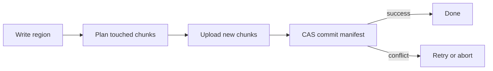

## TL;DR

- Ad-hoc checkpoints (`tmp2-final-actually.mat`) solve one run for one engineer. They break down when runs are expensive, teams need the same outputs, and projects span local and cloud.
- Persistence failures happen at boundaries: process hops above 100 MB, network transfers of multi-GB artifacts, monolithic writes that can't be retried, and full materialization that exhausts memory.
- Chunked, content-addressed storage fixes the reliability problem. Only changed chunks are rewritten. Commits are atomic. Failed writes leave no partial state.
- Reliable persistence changes team dynamics: instead of "rerun it so I can see the result," the conversation becomes "open run X and look at the output." For details on the storage model, see [Large Dataset Persistence](/docs/large-dataset-persistence).
- Persistence is the substrate. [Historical state restoration](/blog/restoring-historical-run-state-scientific-numerical-calculations) is the workflow built on top of it.

If you work on serious numerical workloads long enough, you start building your own storage system by accident.

At first it is harmless:

- `tmp.mat`
- `tmp2-final.mat`
- `tmp2-final-actually.mat`

Then runs get larger, teammates need the same intermediate artifacts, and cloud projects enter the picture. Suddenly those quick checkpoints turn into a reliability problem: expensive reruns, out-of-memory failures, and handoff friction that slows the whole team down.

## Large data persistence is a workflow problem

Most teams frame this as a storage issue. The storage is a symptom. The actual problem is workflow: when a run produces large intermediate arrays, scene buffers, and derived artifacts, teams need a reliable way to persist data that may be too large for naive in-memory handling, a consistent identity model for those artifacts across local and cloud providers, and an operational story for budgets, retention, and debugging.

Ad-hoc checkpoints solve one run for one engineer. They do not solve repeated collaboration under load.

## Where large workflows actually break

Most persistence incidents happen at boundaries, not in math kernels.

### Boundary 1: process/transport hops

When you move large payloads between runtime contexts (UI thread &lt;-&gt; worker, IPC, API), latency and memory amplification appear quickly.

Rules of thumb teams run into:

- Sub-10 MB payloads are usually routine.
- Tens of MB payloads begin to create visible UI/IPC jitter.
- 100 MB+ single messages are where timeout/retry patterns become common.

Even if raw bandwidth exists, tail latency and buffering behavior dominate reliability.

### Boundary 2: network

You can compute much faster than you can move data over typical team links.

- 1 Gbps network ~= 125 MB/s theoretical
- 10 Gbps network ~= 1.25 GB/s theoretical

A 2 GB artifact can be "trivial" in memory terms and still be expensive to move repeatedly across teammates or CI runners.

### Boundary 3: storage device and write shape

Write shape matters as much as byte count.

- NVMe can sustain high throughput for large sequential writes,
- but repeated small writes and metadata churn increase overhead,
- and monolithic blobs are harder to retry and recover from than chunked object writes.

### Boundary 4: workspace/runtime memory

The fastest way to fail persistence is forcing full materialization of everything in one context.

This is why chunked externalization and reference-based manifests are not optimizations; they are reliability requirements.

### Process and transport hops

When you move large payloads between runtime contexts (UI thread to worker, IPC, API), latency and memory amplification appear quickly. Sub-10 MB payloads are usually routine. Tens of MB create visible UI and IPC jitter. Above 100 MB, timeout and retry patterns become the norm rather than the exception.

Even when raw bandwidth exists, tail latency and buffering behavior dominate reliability at scale.

### Network

You can compute much faster than you can move data. A 1 Gbps link gives you about 125 MB/s theoretical throughput; 10 Gbps gets you to 1.25 GB/s. A 2 GB artifact that fits comfortably in memory is still expensive to move repeatedly across teammates or CI runners.

### Storage device and write shape

Write shape matters as much as byte count. NVMe can sustain high throughput for large sequential writes, but repeated small writes and metadata churn increase overhead. Monolithic blobs are harder to retry and recover from than chunked object writes. A 4 GB monolithic write that fails at 3.8 GB forces a full restart. A chunked write that fails on chunk 47 of 50 retries that one chunk.

### Workspace and runtime memory

The fastest way to fail persistence is forcing full materialization of everything in one context. A simulation that produces 12 GB of intermediate tensors across 6 arrays cannot serialize them all to a single buffer without exceeding most workstation memory budgets. Chunked externalization and reference-based manifests address this directly: each chunk is written independently without requiring the full dataset in memory.

## How RunMat handles this

RunMat stores large numerical datasets as [chunked, content-addressed objects](/docs/large-dataset-persistence). Each array is divided into fixed-shape chunks identified by SHA-256 hash. A lightweight manifest records which chunks make up the current state of the dataset.

When you write to a subregion of an array, only the chunks that overlap your write are rewritten. New chunks are uploaded first, then the manifest pointer is updated atomically via compare-and-swap. If the commit fails (because another writer changed the manifest), no partial state is visible. The dataset stays at its previous consistent state.

This design addresses each boundary failure mode: chunks are small enough to transfer reliably across IPC and network boundaries, each chunk can be retried independently on failure, and the runtime never needs to hold the full dataset in memory. Content-addressed storage also means identical chunks are stored once regardless of how many datasets reference them.

For the full API surface and schema details, see the [Large Dataset Persistence](/docs/large-dataset-persistence) docs.

## How this changes team collaboration

Without reliable persistence, teams fill the gap with workarounds: screenshots posted in chat, copied terminal logs, shared folders with files named `final_v2_real.mat`, and reruns triggered just to let someone else review the output. Each workaround helps in the moment. They rarely compose into a reliable process when runs cost hours and [collaboration](/docs/collaboration) happens asynchronously across time zones.

The handoff friction is most visible during reviews and incident response. Someone says "can you send me the result from that run?" and the response is a screenshot, or a local file export, or a full rerun. The reviewer is never quite sure they're looking at the same state the original author saw.

With persistent, addressable run outputs, the handoff becomes direct:

1. "Please review run 1847."
2. Reviewer opens run 1847, inspects figure output and key variables.
3. Reviewer compares run 1847 with run 1832 if needed.
4. Team agrees on next action.

No rerun. No file transfer. No ambiguity about whether two people are looking at the same output. Run identity is project-scoped, so any team member with [project access](/docs/collaboration) can inspect any historical run, including its workspace variables, figures, and outputs.

This matters most during cross-team handoffs (research to production, quant to risk, modeling to operations) where speed and clarity determine whether a review takes 20 minutes or two days.

### Compliance and audit

In regulated or safety-adjacent domains, teams need to answer questions like "what exact result did we base this decision on?" and "what changed between runs?" Persistent, addressable artifacts tied to specific run IDs provide concrete answers backed by [versioned state](/docs/versioning) rather than reconstructions from scattered files and memory.

## How this connects to historical state restoration

Persistence and [state restoration](/blog/restoring-historical-run-state-scientific-numerical-calculations) solve related but distinct problems. Persistence answers "can we store and retrieve large outputs reliably?" State restoration answers "can we reconstruct the full context of a historical run, including variables, figures, and session identity?"

State restoration depends on having a reliable persistence substrate underneath. Without durable chunked storage, there is nothing to restore. Without a state restoration layer on top, durable chunks are just bytes on disk without the workflow context that makes them useful for debugging and investigation.

The two layers work together: persistence makes data durable, and state restoration makes it actionable. Teams that get persistence right can then build investigation workflows on top of it, like [inspecting past runs directly instead of rerunning](/blog/restoring-historical-run-state-scientific-numerical-calculations).

## FAQ

**Why not just use `save`/`load` for large data?**
`save` and `load` work well for small matrices and local workflows. For multi-GB arrays, they force full-file rewrites on every change, offer no subregion access, and provide no conflict handling for concurrent writers. RunMat's `data.*` API addresses these cases with [chunked, content-addressed storage](/docs/large-dataset-persistence). See [How RunMat handles this](#how-runmat-handles-this) for how the write flow works.

**What happens if a write fails partway through?**
New chunks are uploaded first, then the manifest pointer is atomically updated via compare-and-swap. If the commit fails, no partial state is visible. The dataset remains at its previous consistent state. See [How RunMat handles this](#how-runmat-handles-this).

**How does chunked persistence work across local and cloud projects?**
The `data.*` API is provider-neutral. On local projects, chunks are files on disk. On cloud projects, chunks map to object-store keys. Your code doesn't change between environments. See the [Large Dataset Persistence](/docs/large-dataset-persistence) docs for the full API.

**Can teammates see each other's outputs without rerunning?**
Yes. Run outputs persist with stable artifact IDs under the project. Any team member with [project access](/docs/collaboration) can open a historical run, inspect its workspace variables and figures, and compare it against other runs. See [How this changes team collaboration](#how-this-changes-team-collaboration).

**How much storage overhead does chunking add?**
Content-addressed chunks are deduplicated by SHA-256 hash. If 90% of an array is unchanged between writes, that 90% is stored once. The incremental cost per write is primarily small metadata manifests, typically a few kilobytes per array. See the [Large Dataset Persistence](/docs/large-dataset-persistence) docs for details on chunk sizing and compression.

**How does persistence relate to historical state restoration?**
Persistence stores artifacts durably. State restoration reconstructs the full context of a historical run from those artifacts. See [How this connects to historical state restoration](#how-this-connects-to-historical-state-restoration) and the companion post on [restoring historical run state](/blog/restoring-historical-run-state-scientific-numerical-calculations).
