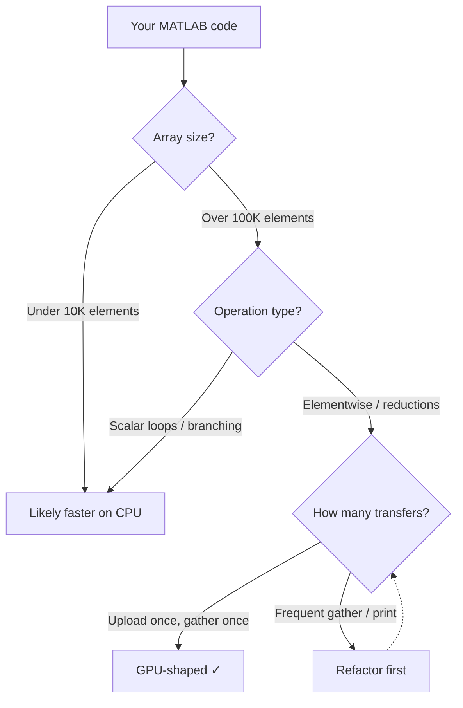

If you have an NVIDIA GPU and MATLAB code that operates on large arrays, GPU acceleration can deliver significant speedups — often 10x to 100x for the right workloads. This guide walks you through everything from initial setup to optimization, so you can get GPU working in MATLAB and understand when it will (and won't) help.

We'll cover prerequisites, your first GPU computation, which functions support GPU, common performance traps, and how to verify everything is working. If you're looking for GPU acceleration that works on any hardware — not just NVIDIA — without manual device management, skip ahead to [the RunMat section](#beyond-nvidia-gpu-acceleration-on-any-hardware).

## TL;DR

- MATLAB GPU acceleration requires the **Parallel Computing Toolbox** and a **CUDA-capable NVIDIA GPU**.
- The core performance pattern is: **`gpuArray` once -> run vectorized GPU-enabled operations -> `gather` once**.
- Most slowdowns come from small arrays, too many tiny kernels, and frequent CPU↔GPU transfers.
- Start with `single` precision unless your numerics require `double`.
- If you want automatic CPU/GPU routing without manual device management, RunMat is a cross-platform alternative.
---

## **Prerequisites: what you need for MATLAB GPU acceleration**

Before writing any GPU code, you need three things in place: compatible hardware, the right MATLAB toolbox, and a working CUDA driver.

### Hardware requirements

MATLAB GPU acceleration requires an **NVIDIA GPU with CUDA compute capability 3.5 or higher**. This includes most NVIDIA GPUs from the Kepler architecture (2012) onward: GeForce GTX 780+, Tesla K40+, Quadro K5000+, and all RTX-series cards. Check your GPU's compute capability on [NVIDIA's CUDA GPUs page](https://developer.nvidia.com/cuda-gpus).

Important limitations:
- **No AMD GPUs.** MATLAB's GPU support is built entirely on CUDA.
- **No Intel GPUs.**
- **No Apple Silicon.** CUDA is not available on M1/M2/M3/M4 Macs.

### Software requirements

- **MATLAB R2023a or newer** (recommended). Older versions work but have fewer GPU-enabled functions.
- **Parallel Computing Toolbox** — this is a paid add-on (separate from the base MATLAB license). Without it, `gpuArray` and GPU-enabled functions are not available.
- **NVIDIA CUDA driver** — MATLAB bundles a CUDA toolkit, but your system needs a compatible NVIDIA driver. See MathWorks' [GPU support requirements](https://www.mathworks.com/help/parallel-computing/gpu-support-by-release.html) for the version matrix.

### Verifying GPU detection

Once everything is installed, check that MATLAB can see your GPU:

```matlab
% How many GPUs does MATLAB see?
gpuDeviceCount
% ans = 1

% Details about the active GPU
gpuDevice
% CUDADevice with properties:
%   Name: 'NVIDIA GeForce RTX 4090'
%   ComputeCapability: '8.9'
%   ...
```

If `gpuDeviceCount` returns 0, check these common causes:

- **Driver mismatch.** Update your NVIDIA driver to the version required by your MATLAB release.
- **Toolbox not installed.** Run `ver` and confirm "Parallel Computing Toolbox" appears in the list.
- **Wrong GPU.** Integrated Intel/AMD graphics won't appear — only discrete NVIDIA GPUs with CUDA support.
- **Multi-GPU systems.** Use `gpuDevice(n)` to select a specific GPU by index.

---

## **Your first GPU computation**

The core pattern in MATLAB is straightforward: **upload data once → compute many steps on GPU → gather the result once.**

Here's the step-by-step:

1. **Put data on the GPU.** Wrap your input with `gpuArray()` — e.g. `x = gpuArray.rand(N, 1, 'single');` — or convert an existing array with `gpuArray(x)`.
2. **Run vectorized operations.** Use GPU-enabled functions (`sin`, `.*`, `mean`, etc.); they dispatch to the GPU automatically while `x` is a `gpuArray`.
3. **Gather only at the end.** Call `gather()` once when you need a result on the CPU (e.g. for `fprintf` or further CPU work). Avoid calling `gather` inside loops.

```matlab:runnable
% MATLAB gpuArray pattern: upload once, compute, gather once
rng(0);
x = gpuArray.rand(10_000_000, 1, 'single');
y = sin(x) .* x + 0.5;
m = mean(y, 'all');
fprintf("m = %.6f\n", gather(m));
```

Every operation on `y` and `m` runs on the GPU because `x` is a `gpuArray`. The only CPU↔GPU transfer is the final `gather(m)` — a single scalar.

### The most common mistake

The most common performance killer is accidentally forcing a sync and download inside a loop:

```matlab:runnable
% Anti-pattern: sync + download every iteration
x = gpuArray.rand(10_000_000, 1, 'single');
y = x;
for k = 1:20
    y = sin(y) .* y + 0.5;
    fprintf("step %d: %.6f\n", k, gather(mean(y, 'all')));
end
```

This isn't "wrong," but it changes the performance profile: you're measuring device synchronization and transfers as much as compute. Move the `gather` outside the loop to get a fair picture of GPU speed.

---

## **What NVIDIA GPUs accelerate in MATLAB (and what they don't)**

NVIDIA GPUs are throughput machines. They're great at applying the same operations across huge arrays: elementwise transforms (`sin`, `exp`, `.*`, `./`), reductions (`sum`, `mean`, `std`), and big matrix operations. That's why GPU acceleration tends to shine in image pipelines, Monte Carlo simulation, signal processing, and dense linear algebra. Those workloads naturally operate over millions of values.

Where GPUs lose is when the workload is fragmented: lots of tiny arrays, lots of small kernels, heavy scalar control flow, or frequent CPU↔GPU transfers. In those cases, the GPU spends more time being managed than computing.

A quick gut check:

```matlab:runnable
% GPU-shaped: large arrays + vectorized ops
x = rand(5_000_000, 1, 'single');
y = (x - mean(x)) ./ (std(x) + single(1e-6));
z = sum(sqrt(abs(y)), 'all');
```

```matlab:runnable
% Often not GPU-shaped: many tiny problems, lots of overhead
acc = single(0);
for i = 1:10000
    a = rand(128, 1, 'single');
    acc = acc + sum(a .* a, 'all');
end
```

Here's a quick decision tree:



The key isn't "never loop" — it's that GPU acceleration is easiest when you can batch work into fewer, larger array operations.

---

## **GPU-enabled functions in MATLAB**

Not every MATLAB function supports `gpuArray` inputs. Here are the most commonly used GPU-enabled functions by category:

| Category | Functions | Notes |
|----------|-----------|-------|
| **Elementwise math** | `sin`, `cos`, `exp`, `log`, `sqrt`, `abs`, `pow2`, `sign` | Just wrap input in `gpuArray`; these work transparently |
| **Arithmetic** | `+`, `-`, `.*`, `./`, `.^`, `*` (matrix multiply) | Standard operators dispatch to GPU when operands are `gpuArray` |
| **Reductions** | `sum`, `mean`, `std`, `var`, `min`, `max`, `prod`, `norm` | Use `'all'` dimension flag for full-array reductions |
| **Linear algebra** | `mtimes`, `mldivide` (`\`), `eig`, `svd`, `lu`, `qr`, `chol` | Large matrices benefit most; small matrices may be faster on CPU |
| **FFT** | `fft`, `ifft`, `fft2`, `ifft2`, `fftn` | Strong GPU speedups for large transforms |
| **Random generation** | `gpuArray.rand`, `gpuArray.randn`, `gpuArray.randi` | Generate directly on GPU to avoid an upload |
| **Array creation** | `gpuArray.zeros`, `gpuArray.ones`, `gpuArray.eye`, `gpuArray.linspace` | Same — allocate on device directly |
| **Logical / indexing** | `find`, `sort`, `logical`, `any`, `all`, comparison operators | Most work on GPU; `find` returns a `gpuArray` of indices |

For the full list, see MathWorks' [GPU-enabled functions reference](https://www.mathworks.com/help/parallel-computing/run-built-in-functions-on-a-gpu.html).

If a function doesn't support `gpuArray`, MATLAB will either error or silently `gather` the data to CPU — which can introduce a hidden transfer penalty. When chaining operations, check that every function in the pipeline is GPU-enabled to keep data on the device.

---

## **Performance traps that erase GPU speedups**

Most disappointing GPU results come from a small set of patterns. You don't have to become a GPU expert to fix them; you just need to recognize a few shapes.

### 1) Too many CPU↔GPU transfers

Transfers are expensive and they often force synchronization. In MATLAB, that's usually an accidental `gather` (or a CPU-only function that forces one). Touching intermediate results can pull you back to the host.

Keeping data *resident* on the GPU — rather than bouncing it back to the CPU — avoids transfer overhead.

```matlab:runnable
% MATLAB anti-pattern: forcing a download mid-pipeline
x = gpuArray.rand(10_000_000, 1, 'single');
y = sin(x) .* x + 0.5;
y_host = gather(y);          % boundary: download early
m = mean(y_host, 'all');     % now you're on CPU
```

The shape that wins: keep the hot block contiguous, and only materialize at the end.

### 2) Lots of tiny kernels instead of one big block

Every GPU kernel launch has some fixed overhead; thousands of tiny launches can be slower than one big fused launch. If your program looks like "do a tiny thing 10,000 times," you're often paying overhead more than compute. The fix is usually batching.

```matlab:runnable
% Overhead-heavy shape: many small problems
acc = single(0);
for i = 1:2000
    x = rand(4096, 1, 'single');
    acc = acc + sum(sin(x) .* x + 0.5, 'all');
end
```

The fix: batch the work into one large array and do an elementwise chain plus a reduction:

```matlab:runnable
% Better GPU shape: batch the work
X = rand(4096, 2000, 'single');
acc2 = sum(sin(X) .* X + 0.5, 'all');
```

### 3) Precision choices (single vs double)

Precision should be driven by two things: what your **calculation actually needs**, and what your **GPU path supports**.

**What the backends support.** Not every GPU abstraction offers full double-precision (FP64). For example, Metal (Apple's GPU API) provides strong FP32 support but no FP64. In MATLAB with an NVIDIA GPU, the Parallel Computing Toolbox supports both single and double; performance on double then depends on the GPU's FP64 capability and memory bandwidth. Consumer GPUs (GeForce) typically have much weaker FP64 throughput than data-center GPUs (Tesla, A100).

**What you need.** For many workloads, [single precision (FP32) is enough](https://en.wikipedia.org/wiki/Single-precision_floating-point_format) — you get plenty of significant digits for a wide range of scientific and numerical tasks. When your problem genuinely requires double (e.g. certain accumulations or legacy requirements), you accept the performance cost.

**Practical takeaway:** If you're testing whether GPU acceleration is working, start with `single` unless you have a clear reason to need `double`.

### 4) Hidden sync points (printing, plotting, inspection)

Many workflows accidentally benchmark synchronization. Printing intermediate values, plotting inside loops, or repeatedly checking partial results can turn a smooth GPU pipeline into "compute a little, synchronize, download, repeat."

### Benchmarking: how to measure GPU speed without fooling yourself

Good benchmarks do a few boring things consistently:

- **Warm up once** (first-run overhead can be large)
- **Run multiple iterations** and take a median/mean
- **Fix dtype and shape** (`single` vs `double` changes everything)
- **Keep I/O out of the timed region** (plotting and printing can dominate)
- **Be explicit about transfers**: are you timing uploads/downloads or just compute?

A clean benchmark shape: allocate big `single` inputs, run a contiguous chain of elementwise math, reduce at the end, materialize a scalar once.

**A good mental model: make the work big, keep it contiguous, avoid mid-pipeline transfers.**

---

## **When vectorization isn't enough: custom CUDA kernels from MATLAB**

There are real cases where the fastest approach is a custom kernel: unusual indexing, nonstandard ops, or tight loops that don't map onto GPU-enabled built-ins. MATLAB can support deeper CUDA integration paths, and they can deliver great performance.

But the cost curve changes. You're now managing:

- a build toolchain (compilers, flags, target architectures),
- driver/runtime compatibility,
- deployment environments (developer laptops vs CI vs servers),
- debugging and profiling at the kernel level.

If you enjoy debugging kernels and managing toolchains, this can be rewarding work. If you don't, it can become a time sink that pulls focus from your actual problem. For those who do want to go this route, MathWorks documents the workflow: [Run CUDA or PTX Code on GPU](https://www.mathworks.com/help/parallel-computing/run-cuda-or-ptx-code-on-gpu.html).

---

## **Quick checks: "am I actually using the GPU?"**

A fast way to sanity-check GPU execution is to compare the same calculation at a size where GPUs should win (millions of elements). Don't obsess over one run; warm-up and overhead are real.

In MATLAB you need explicit `gpuArray` to run on GPU; the snippet below shows CPU (plain `x`) vs GPU (`gpuArray(x)`):

```matlab:runnable
N = 10_000_000;
x = rand(N, 1, 'single');

% CPU
m_cpu = mean(sin(x) .* x + 0.5, 'all');

% GPU
xg = gpuArray(x);
m_gpu = mean(sin(xg) .* xg + 0.5, 'all');

fprintf("cpu=%.6f gpu=%.6f\n", double(m_cpu), double(gather(m_gpu)));
```

If the GPU isn't helping, it's usually one of three things: the problem is too small, the code is forcing boundaries, or the computation is dominated by something other than array math (I/O, parsing, plotting, scalar loops).

---

## **Beyond NVIDIA: GPU acceleration on any hardware**

The sections above cover MATLAB's GPU path — which works well when you have an NVIDIA GPU, the Parallel Computing Toolbox, and you're comfortable managing `gpuArray` and `gather` calls. But there are real limitations:

- **NVIDIA only.** If you're on Apple Silicon, AMD, or Intel integrated graphics, MATLAB's GPU path doesn't work.
- **Paid toolbox.** The Parallel Computing Toolbox is a separate license on top of MATLAB.
- **Manual device management.** Every script becomes a residency and transfer exercise: `gpuArray` here, `gather` there, check every function is GPU-enabled.

[RunMat](https://runmat.com) takes a different approach. It runs MATLAB-syntax code and handles GPU acceleration automatically — no explicit device arrays, no vendor lock-in, and no extra license.

The same computation from earlier, without any device management:

```matlab:runnable
rng(0);
x = rand(10_000_000, 1, 'single');
y = sin(x) .* x + 0.5;
m = mean(y, 'all');
fprintf("m = %.6f\n", double(m));
```

Under the hood, RunMat uses *fusion* — combining multiple array operations into one GPU kernel — to reduce overhead and keep the GPU busy. This happens automatically when the computation is contiguous. For more detail, see the [RunMat Fusion guide](/docs/fusion-guide).

### How automatic routing works

RunMat's runtime examines the shape of your computation — array sizes, operation types, data dependencies — and decides per-operation whether to run on CPU or GPU. Large, contiguous elementwise chains get fused into a single GPU kernel. Small or irregular work stays on CPU. You don't need to annotate anything.

This is the same "GPU-shaped" intuition from earlier in this guide, except the runtime applies it for you instead of requiring you to manually wrap arrays in `gpuArray`.

### Cross-platform GPU support

RunMat uses [wgpu](https://wgpu.rs/) (the WebGPU standard) to target multiple GPU backends:

- **Metal** on macOS (M1/M2/M3/M4 Apple Silicon)
- **DirectX 12** on Windows
- **Vulkan** on Linux
- **WebGPU** in the browser (Chrome 113+, Edge 113+, Safari 18+, Firefox 139+)

No CUDA toolkit required. No vendor lock-in.

### Where fusion helps most

RunMat tends to shine on the same workloads that are naturally GPU-shaped in MATLAB: long chains of array math and reductions, big elementwise pipelines, and batched workloads. The code itself usually doesn't need to change.

A good pattern is "math first, inspect last":

```matlab:runnable
x = rand(10_000_000, 1, 'single');
y = sin(x) .* x + 0.5;
m = mean(y, 'all');
fprintf("m = %.6f\n", double(m));
```

If a script is slower than expected, the first thing to do is usually structural:

- Make the arrays larger (or batch multiple problems together)
- Remove mid-pipeline printing/plotting
- Ensure your data is in single precision
- Avoid reshaping the program into thousands of tiny steps

For benchmarks comparing RunMat's fusion engine against MATLAB, PyTorch, and NumPy, see [Introducing RunMat Accelerate](/blog/runmat-accelerate-fastest-runtime-for-your-math).

### GPU-resident visualization

The "avoid transfers" principle extends to plotting. In most tools, visualizing GPU-computed data means gathering it back to CPU and handing it to a separate rendering system — which introduces exactly the kind of transfer overhead this guide warns against. RunMat's plotting renders directly from GPU memory, with zero copy between the computation and the visualization. The plot is just a few more matrix operations (camera transforms, projections) at the end of the same GPU pipeline that computed the data.

### Where to run RunMat

| Environment | GPU path | Best for |
|-------------|----------|----------|
| Browser ([runmat.com/sandbox](https://runmat.com/sandbox)) | WebGPU when supported | Try RunMat with no install; smaller/medium workloads |
| Desktop app (coming soon) | Native (Metal / DX12 / Vulkan) | Full IDE + full GPU headroom |
| CLI (`runmat run script.m`) | Native (Metal / DX12 / Vulkan) | Scripts, benchmarks, CI, max performance |

---

## **FAQ: common GPU + MATLAB questions**

**Why is my GPU slower than my CPU?**

Using the GPU requires copying data to GPU-accessible memory and setting up and launching parallel work on GPU cores. Running on GPU is faster only when that extra cost — copy, orchestration, and any copy back to the host — is outweighed by the speedup from parallel execution. Practically, most often the slowdown is because the arrays are too small, you're doing many tiny steps, or you're transferring/synchronizing frequently (e.g., `gather` or printing in a loop). Fix it by batching into larger arrays and calling `gather` only once at the end.

**What GPU do I need for MATLAB?**

MATLAB's Parallel Computing Toolbox requires an NVIDIA GPU with CUDA compute capability 3.5 or higher — no AMD or Intel GPUs, and no Apple Silicon. Check your GPU on [NVIDIA's CUDA GPUs page](https://developer.nvidia.com/cuda-gpus).

**How much faster is GPU vs CPU for MATLAB?**

It depends on whether the math lends itself to GPU. Workloads that are mostly large, vectorized matrix/array math (elementwise ops, reductions, big matmuls) can see speedups of 10x, 100x, or more when the work is GPU-shaped. For small arrays or fragmented work, GPU can be the same speed or slower. Use the decision flowchart earlier in this guide to check fit.

**Should I use single or double?**

It's a tradeoff between **precision and cost**. Double precision (FP64) gives about 16 decimal places of precision; single (FP32) about 7. The cost of higher precision includes **memory** (doubles use twice the memory of singles) and **throughput** (consumer GPUs have much weaker FP64 performance than FP32). Use single unless your numerics actually need the extra precision.

**Do I need to rewrite everything for GPU?**

Not always. If your code is already vectorized array math, the main work is keeping it device-resident and batching where possible. Same mental model: big, contiguous, avoid transfers.

**How do I know if my code is GPU-shaped?**

Large arrays (100K+ elements), elementwise or reduction operations, and minimal transfers. Use the flowchart earlier in this guide; if you have small arrays, scalar loops, or frequent `gather`/printing, refactor toward batching and a single `gather` at the end.

**Does MATLAB GPU acceleration work on Mac?**

Not with the official toolbox. MATLAB's `gpuArray` is built on CUDA, which NVIDIA does not support on Apple Silicon. RunMat uses Metal on macOS, so M1/M2/M3/M4 Macs get GPU acceleration with the same MATLAB-style code.

**Can I use GPU without the Parallel Computing Toolbox?**

In MATLAB, no — the toolbox is required for `gpuArray` and GPU-enabled functions, and it's a paid add-on. RunMat includes GPU acceleration by default: you write the same array math and the runtime decides CPU vs GPU and fuses operations without an extra license. For how RunMat compares to MATLAB and other runtimes, see [free MATLAB alternatives](/blog/free-matlab-alternatives).

**What is GPU fusion and why does it matter?**

Fusion means combining multiple array operations (e.g., `sin`, then `.*`, then `+`) into one GPU kernel instead of launching a separate kernel for each. That cuts memory traffic and kernel-launch overhead. In MATLAB you get fusion only where the toolbox implements it; in RunMat, fusion is applied automatically when the computation is contiguous.

**What's the simplest rule to remember?**

Make the work big, make it contiguous, and avoid transfers.
