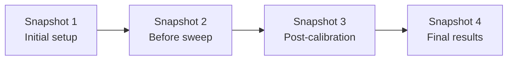

*This article was originally published in September 2025 and has been updated for 2026 with new sections on Browser-Based Computing, GPU Acceleration, Version Control, Large File Handling, and Airgap Deployment.*

## Why are engineers searching for MATLAB alternatives?
Engineers search for MATLAB alternatives because licenses cost over $2,000 per seat and MathWorks has moved to subscription-only pricing, making the cost recurring rather than one-time. This guide compares the top four free options (RunMat, Octave, Julia, and Python) across real engineering use cases, performance, compatibility, and library support.

## What is the best free alternative to MATLAB?

The best free alternatives to MATLAB in 2026 are **RunMat**, **GNU Octave**, **Python (NumPy/SciPy)**, and **Julia**. RunMat is the fastest drop-in replacement for existing `.m` files and the only option with automatic cross-vendor GPU acceleration and a full browser IDE. Octave is the most mature MATLAB clone. Python has the largest library ecosystem. Julia is the strongest pure-performance choice.

1. **[RunMat](https://runmat.com)** — Free, open source. Runs existing MATLAB code unchanged, JIT-compiled, automatic GPU acceleration (NVIDIA, AMD, Intel, Apple), and a browser sandbox with no install.
2. **[GNU Octave](https://octave.org)** — Free, mature, MATLAB-syntax. Interpreter-only (no JIT or GPU), but stable and widely used in academia.
3. **[Python (NumPy/SciPy)](https://numpy.org)** — Free, huge library ecosystem. Requires rewriting MATLAB code in Python syntax.
4. **[Julia](https://julialang.org)** — Free, designed for numerical performance. Familiar syntax for MATLAB users but requires learning a new language.

## Quick decision guide: which MATLAB alternative is right for you?

| Priority                        | Best Choice     | Why                                                               |
|---------------------------------|-----------------|-------------------------------------------------------------------|
| Reuse MATLAB code directly      | RunMat / Octave | Familiar syntax; RunMat is faster/newer, Octave is mature          |
| Maximum performance / HPC       | Julia / RunMat  | JIT-compiled, multi-threaded, GPU-friendly                        |
| Automatic GPU acceleration      | RunMat          | Cross-vendor GPU support without code changes                     |
| Browser-based computing         | RunMat          | WebGPU acceleration, no quotas, client-side execution             |
| Versatility & integrations      | Python          | Huge library collection, ML, automation, transferable skills |
| Teaching / lightweight use      | Octave          | Free, stable, familiar for students and smaller projects          |
| Future-proof compatibility      | RunMat          | Open-source, high performance, growing coverage of common MATLAB workflows |
| Built-in version control        | RunMat          | Automatic per-save versioning, snapshots, git export, no git required |
| Airgap / offline deployment     | RunMat          | Single binary, no license server, GPU without CUDA               |
| Large dataset management        | RunMat / Python | RunMat: native sharding and manifest versioning; Python: DVC + Zarr |
| Real-time collaboration         | RunMat / Python | RunMat: project-level sync; Python: Colab notebook collaboration  |

## TL;DR Summary
- **RunMat:** Best for running MATLAB code directly. JIT-compiled, automatic GPU acceleration across all major vendors, runs in the browser with no install, and includes built-in versioning and collaboration. Toolbox coverage does not yet match MATLAB's full breadth ([current coverage](/docs/language-coverage)).
- **GNU Octave:** Mature drop-in alternative for MATLAB scripts. Slower than JIT-compiled tools and no GPU support, but stable and widely used in academia.
- **Python (NumPy/SciPy):** Largest library collection and strong ML integration, but requires rewriting MATLAB code. Browser options exist (Colab, Pyodide) with trade-offs.
- **Julia:** Built for performance and large-scale simulation, but requires learning a new language. No browser-native runtime yet.

To verify these claims yourself, paste a `.m` file into the [browser sandbox](https://runmat.com/sandbox). No install or sign-up required.

**Note:** None of these replicate Simulink’s graphical block-diagram modeling. All rely on script-based workflows.

---

## Practical Use Cases for MATLAB Alternatives

### Data Analysis and Visualization
The most common use cases for MATLAB alternatives are data analysis and visualization. Each free alternative handles these workflows differently:

- **RunMat** supports [17+ plot types](/docs/plotting) including [`plot`, `scatter`, `hist`, `surf`, `contour`, `bar`, `pie`, `stem`, `quiver`, `area`, `errorbar`](/docs/matlab-function-reference#plotting) alongside `figure`, `subplot`, `hold`, and `gcf`. Rendering is GPU-first: vertex buffers are built on-device and rendered through WebGPU in the browser or Metal/Vulkan/DX12 natively, so plots involving large datasets avoid CPU-side bottlenecks. An interactive 3D camera supports rotate, pan, and zoom, with reversed-Z depth and dynamic clip planes for precision in LiDAR, CFD, and radar visualization. Figure scenes can be exported and reimported for persistence and replay. For a walkthrough of all supported plot types, see the [MATLAB plotting guide](/blog/matlab-plotting-guide).

- **Octave** maintains strong compatibility with MATLAB’s syntax, supporting everyday data analysis tasks like matrix operations, file I/O, and 2D/3D plotting. For most scripts, functions behave nearly identically. [Octave 11](https://octave.org/NEWS-11.html) (February 2026) brought concrete performance improvements: convolution on short-by-wide arrays runs 10-150x faster depending on shape, and `sum`/`cumsum` on logical inputs are up to 6x faster. Visualization remains less polished than MATLAB's, but functional.

- **Python** relies on specialized libraries. [NumPy 2.0](https://numpy.org/doc/2.0/release/2.0.0-notes.html) (released June 2024) cleaned up ~10% of the main namespace, added a proper DType API for custom data types, and introduced a native `StringDType`. Pandas streamlines data wrangling, and Matplotlib/Seaborn offer flexible plotting. The syntax differs from MATLAB, requiring some adjustment, but Python's library collection goes well beyond numerical analysis. Engineers can move from cleaning data to applying ML models or querying databases in the same environment.

- **Julia** combines math-friendly syntax with high performance. Packages like DataFrames.jl support structured data handling, while Plots.jl and related libraries enable visualization. Its 1-based indexing and matrix-oriented design feel familiar to MATLAB users. [Julia 1.12](https://julialang.org/blog/2025/10/julia-1.12-highlights/) (October 2025) improved the interactive workflow: constants and structs can now be redefined through the world-age mechanism, and Revise.jl 3.13 makes this automatic, so engineers no longer need to restart Julia after changing a type definition. Julia has fewer packages than Python, but the collection is growing fast.

### Simulation and System Modeling
Simulation and system modeling in MATLAB alternatives means solving ODEs, running Monte Carlo sweeps, and building discrete-time controllers in script. None of these tools replicate Simulink’s graphical block-diagram modeling. Each offers script-based simulation with different tradeoffs in speed and solver coverage.

- **RunMat** runs MATLAB simulation scripts (e.g., ODEs, discrete-time models) at near-native speed. Monte Carlo simulations and batch parameter sweeps benefit from [automatic GPU acceleration](/blog/runmat-accelerate-fastest-runtime-for-your-math). Control systems packages (transfer functions, state-space analysis) are on the [roadmap](/docs/roadmap).
- **Octave** includes MATLAB-compatible ODE solvers (`ode45`, `ode23`) and a control package (`tf`, `step`, `lsim`) for transfer functions and state-space models. Engineers can simulate filters, controllers, or dynamic systems using almost the same functions as in MATLAB (`tf`, `step`, `lsim`), which means the transition requires almost no syntax changes.
- **Python**, with libraries like SciPy and python-control, provides mature tools for system simulation and modeling. Performance is good when using optimized SciPy solvers or NumPy operations.
- **Julia** excels in simulations and modeling, particularly with its **DifferentialEquations.jl** library, offering performance comparable to or surpassing MATLAB's solvers for ODEs, SDEs, and DAE systems. **ControlSystems.jl** mirrors MATLAB's control toolbox. Julia's code, similar to MATLAB, allows natural math expressions and vector/matrix use, supporting clean modeling with Unicode and efficient small functions. Initial simulation runs may pause briefly for JIT compilation, but subsequent runs are much faster.

---

## Performance

### Execution Speed
MATLAB loop performance varies 10–100x across alternatives because of differences in JIT compilation and interpreter overhead. RunMat uses a [tiered model](/docs/architecture) inspired by Google’s V8 engine: code starts running immediately in an interpreter, then “hot” paths are compiled into optimized machine code. The result is a system that feels fast from the first run and often gets faster as it executes. Julia compiles functions the first time they’re called, which introduces a brief pause up front, but subsequent runs execute at full speed. In practice, both tools rival or surpass MATLAB’s own JIT in handling loop-heavy or custom algorithms.

GNU Octave, by contrast, runs purely as an interpreter. For vectorized operations, it performs reasonably, but in loop-dominated code, the lack of a JIT can make it dramatically slower, often 100× or more, compared to MATLAB or RunMat. For engineers running small to medium workloads, this may be acceptable, but Octave struggles with large-scale or real-time simulation.

Python sits between these extremes. With NumPy and SciPy, array operations execute at C speed, so well-vectorized code can match MATLAB, RunMat, or Julia. But pure Python loops are slow, often slower than Octave, unless you apply Numba or Cython. Python rewards vectorized thinking and punishes MATLAB-style for-loops.

To see the difference a JIT makes, run this million-iteration loop right here; an interpreter would crawl through it:

```matlab:runnable
tic;
N = 1000000;
s = 0;
for i = 1:N
  s = s + sqrt(i);
end
t = toc;
fprintf("Sum of sqrt(1..%d) = %.4f in %.3f s\n", N, s, t);
```

For a deeper dive into why MATLAB loops are slow, see [MATLAB For Loops Are Slow, But Not for the Reason You Think](/blog/matlab-for-loop-performance).

### Startup and Responsiveness

| Tool | Cold start | Interactive feel | Notes |
|------|-----------|-----------------|-------|
| RunMat | ~5 ms (snapshot-based) | Fast from first run | JIT profiling warms up in the background |
| Octave | A few seconds | GUI can lag on large plots | Usable, but not snappy |
| Python | Sub-second (interpreter) | Smooth once libraries are loaded | Importing NumPy/SciPy/Pandas adds delay |
| Julia | 1-2 seconds (REPL) | Excellent after first compile | First function call may take several seconds |

### GPU Acceleration

GPU acceleration in MATLAB requires the Parallel Computing Toolbox and an NVIDIA GPU. Free alternatives differ sharply: RunMat offloads automatically to any GPU vendor, Julia requires explicit CuArray types, Python needs CuPy or PyTorch, and Octave has no GPU support at all.

- **RunMat** [automatically offloads computations to the GPU](/blog/how-to-use-gpu-in-matlab) without code changes. The runtime detects GPU-friendly operations, fuses chains of elementwise math into single kernels, and keeps data [resident on the GPU](/docs/accelerate/gpu-behavior) between operations. It supports NVIDIA, AMD, Intel, and Apple GPUs through a unified backend (Metal on macOS, DirectX 12 on Windows, Vulkan on Linux). You write normal MATLAB code; RunMat decides when GPU acceleration helps. In browser builds, WebGPU provides client-side acceleration.

For a deeper look at how RunMat fuses operations and manages residency, read the [Introduction to RunMat Fusion](/docs/accelerate/fusion-intro).

- **MATLAB** requires explicit `gpuArray` calls and only supports NVIDIA GPUs via the Parallel Computing Toolbox (additional license required). Each operation launches a separate kernel, with no automatic fusion. Engineers must manually manage data transfers between CPU and GPU with `gather()`.

- **Python** GPU support depends on the library. PyTorch and TensorFlow offer excellent GPU acceleration for machine learning workloads. [CuPy](https://cupy.dev) provides a NumPy-like API on NVIDIA GPUs. Apple Silicon users can use PyTorch's MPS backend or JAX's Metal support. All require explicit device management and library-specific code.

- **Julia** has strong NVIDIA support via CUDA.jl, with explicit `CuArray` types. AMD support exists via AMDGPU.jl but is Linux-only. Apple Silicon GPU support arrived via [Metal.jl](https://github.com/JuliaGPU/Metal.jl), which reached v1.9 in early 2026 with MPSGraph integration and `MtlArray` types for high-level array operations. Like MATLAB, you must explicitly move data to the GPU across all backends.

- **GNU Octave** has no meaningful GPU support. Any computations run on CPU only.

For workloads where GPU acceleration matters, RunMat's automatic cross-vendor approach eliminates the manual device management required by other platforms. In benchmarks, RunMat's fusion engine shows measurable gains on memory-bound workloads:

- Monte Carlo simulations (5M paths): ~2.8x faster than PyTorch, ~130x faster than NumPy
- Elementwise chains (1B elements): ~100x+ faster than PyTorch when fusion eliminates memory traffic

Here's a Monte Carlo option pricer with 1M paths. Run it below and check whether your GPU picks it up:

```matlab:runnable
rng(0);
M = 1000000; T = 256;
S0 = single(100); mu = single(0.05); sigma = single(0.20);
dt = single(1.0 / 252.0); K = single(100.0);

S = ones(M, 1, 'single') * S0;
drift = (mu - 0.5 * sigma^2) * dt;
scale = sigma * sqrt(dt);

for t = 1:T
  Z = randn(M, 1, 'single');
  S = S .* exp(drift + scale .* Z);
end

payoff = max(S - K, 0);
price  = mean(payoff, 'all') * exp(-mu * T * dt);
disp(price);
```

---

## Code Comparisons for Common Tasks
MATLAB code runs unchanged in RunMat and Octave. Python and Julia require syntax changes: library imports, different array APIs, and language-specific idioms. Here’s the same sine-wave plot in each language.

### RunMat / Octave (MATLAB syntax)
```matlab:runnable
x = 0:0.1:2*pi;
y = sin(x);
plot(x, y);
```
This code runs unchanged in MATLAB, Octave, and RunMat. The colon operator creates the vector, and `plot` produces the figure. RunMat and MATLAB display it interactively; Octave uses its GUI or gnuplot.

### Python (NumPy & Matplotlib)
```python
import numpy as np
import matplotlib.pyplot as plt

x = np.arange(0, 2*np.pi, 0.1)
y = np.sin(x)

plt.plot(x, y)
plt.title("Sine Wave")
plt.show()

```

Python requires importing libraries, but the workflow is conceptually the same. `np.arange` mirrors MATLAB’s colon operator, and `np.sin` applies elementwise.


### Julia

```julia

using Plots

x = 0:0.1:2π
y = sin.(x)

plot(x, y, title="Sine Wave")

```

Julia’s syntax is very close to MATLAB’s, with minor differences like the broadcast dot (`sin.(x)`). It requires loading a plotting package, but otherwise feels familiar.

MATLAB/Octave/RunMat lets you reuse code directly. Python adds library imports but maps closely. Julia is concise and fast, with slightly different idioms.

---

## Set Up Experience and OS Compatibility
MATLAB requires a multi-GB installer and an annual license ($119/year for students, $165/year for home use, $2,000+ per seat for professionals) (MathWorks [ended perpetual licenses](https://www.mathworks.com/pricing-licensing.html) in January 2026). Free alternatives install in minutes with no license server or account required.

**RunMat** installs on Windows, Linux, and macOS via a one-line command or package manager, and engineers can usually be running scripts within a minute. For zero-install access, the [browser sandbox](https://runmat.com/sandbox) provides a full IDE with editor, console, plotting, and variable inspector. No account required, code stays local (see [Browser-Based Computing](#browser-based-computing) below for details). A [desktop app](/download) with the same UI is also available for native performance with full local file access. Built in Rust, RunMat offers consistent behavior across operating systems with no license manager or environment configuration.


**GNU Octave** is available on Windows, Linux, and Mac. Installation is straightforward across platforms, with GUI installers available for Windows/macOS, and package manager support on Linux. Its GUI resembles older MATLAB versions. [Octave 11](https://octave.org/NEWS-11.html) (February 2026) improved the package manager with a `pkg search` command for finding packages by keyword and SHA256 verification for downloaded tarballs, removing the need for the old `-forge` flag. Users may still need to install Octave Forge packages separately, similar to MATLAB toolboxes, but the process is now less error-prone. No license files or account sign-ins required.

**Python (with NumPy/SciPy)** runs on most OS, including small devices. Engineers on Windows and Mac often use the free Anaconda Distribution, a convenient bundle including Python, NumPy, SciPy, Matplotlib, and Jupyter. Alternatively, one can install Python from python.org and add libraries via pip. Linux typically comes with Python pre-installed, requiring only pip or system repositories for additional packages. Setup time may vary due to IDE choice (e.g., Spyder, VS Code). Once set up, the environment is stable and code is portable across platforms. GPU capability requires extra packages. While basic setup is easy, the number of choices (IDE, package manager, virtual environments) leads some teams to standardize setups. Python can also integrate with other OS tools like Excel.


**Julia** offers easy cross-platform installation via downloads or package managers. [Julia 1.12](https://julialang.org/blog/2025/10/julia-1.12-highlights/) (October 2025) introduced an experimental `--trim` flag that eliminates unreachable code from compiled system images, producing smaller binaries and faster compile times for deployed applications. VS Code with the Julia extension is the recommended editor. Julia is self-contained, but users add packages (e.g., for plotting) and may need C/Fortran binaries. After setup, it's stable and consistent.

## Browser-Based Computing

RunMat is the only MATLAB-syntax tool that runs entirely client-side in the browser with GPU acceleration and no usage quotas. Other browser options either run on remote servers (MATLAB Online, Octave Online, Google Colab) or run with major constraints (Pyodide).

- **RunMat** provides a full [browser IDE](/docs/desktop-browser-guide) with a MATLAB-style editor, file tree, console, variable inspector, and live GPU-accelerated [plotting](/docs/plotting), all running client-side via WebAssembly. No server processes your code, so there are no time limits or usage quotas. WebGPU acceleration is available in Chrome 113+, Edge 113+, Safari 18+, and Firefox 139+. File persistence requires signing in or using the desktop app (same UI, full local file access). Startup is instant (~5 ms) and the IDE works offline once loaded. Real-time project sync is available for teams who sign in. <a href="/sandbox" data-ph-capture-attribute-destination="sandbox" data-ph-capture-attribute-source="blog-matlab-alternatives" data-ph-capture-attribute-cta="open-sandbox">Open the RunMat sandbox</a> in any supported browser.

<a href="/sandbox" data-ph-capture-attribute-destination="sandbox" data-ph-capture-attribute-source="blog-matlab-alternatives" data-ph-capture-attribute-cta="browser-video">
  <video autoPlay loop muted playsInline poster="https://web.runmatstatic.com/video/posters/3d-interactive-plotting-runmat.png" className="my-6 w-full rounded-lg cursor-pointer">
    <source src="https://web.runmatstatic.com/video/3d-interactive-plotting-runmat.mp4" type="video/mp4" />
  </video>
</a>

- **MATLAB Online** runs on MathWorks' cloud servers, where your browser is just a thin client. This requires a MathWorks account and internet connection. The free tier limits usage to 20 hours/month with 15-minute execution caps and idle timeouts, and provides 1 vCPU with 4 GB of memory and 5 GB of MATLAB Drive storage (20 GB for licensed users). No GPU acceleration is available in standard cloud sessions. Basic file sharing is available through MATLAB Drive, but there is no real-time co-editing.

- **GNU Octave** is available via Octave Online, a free hosted service. Like MATLAB Online, it runs on remote servers. Execution time is strictly limited (~10 seconds per command by default, extendable manually). No GPU support is available. Octave Online does offer real-time collaboration similar to Google Docs for signed-in users, making it useful for teaching and pair work, but the execution constraints make it impractical for serious computation.

- **Python** has two browser paths. [Google Colab](https://colab.research.google.com) runs on remote servers with GPU access on the free tier (capped at ~12 hours, subject to throttling) and supports real-time notebook collaboration. [Pyodide](https://pyodide.org) offers true in-browser execution via WebAssembly, but with real constraints: only pure-Python packages work reliably, performance is slower than native CPython, and there's no GPU access. Neither approach runs MATLAB code directly.

- **Julia** currently has no production-ready browser runtime. There's no official WebAssembly version, so any browser-based Julia experience (like Pluto notebooks) requires a backend server. Experimental WebAssembly efforts exist, but Julia's JIT compiler and task runtime make this challenging. To use Julia via browser, you must run your own server or use a cloud service like JuliaHub.

Beyond running code, collaboration matters. RunMat includes [real-time project sync](/docs/collaboration): when one team member saves a file, others see the update within 250 ms via Server-Sent Events, with cursor-based replay handling disconnects and reconnects without merge conflicts. Access is managed through role-based permissions at the organization and project level, with SSO (SAML/OIDC) and SCIM provisioning for enterprise identity systems. Google Colab is the strongest collaborative option on the Python side, with real-time notebook co-editing, though it requires Google accounts and is limited to notebook-format code. Octave Online and CoCalc both support real-time collaboration for signed-in users. MATLAB Online and JuliaHub offer file sharing and team features but no real-time co-editing.


## Compatibility with Existing MATLAB Code
RunMat and Octave run most .m files without modification. Python and Julia require full rewrites. There is no automatic translation that works reliably at scale. The practical question is whether your codebase uses core language features (high compatibility) or specialized toolboxes (less coverage).

- **RunMat** targets high compatibility with MATLAB’s core language and many `.m` files already run unmodified. Coverage extends beyond basic syntax into areas where Octave falls short: full `classdef` OOP with properties, methods, events, handle classes, enumerations, and the `?Class` metaclass operator; `varargin`/`varargout` with expansion into slice targets; and N-D `end` arithmetic. RunMat also supports two [compatibility modes](/docs/configuration): `compat = "matlab"` (default) preserves MATLAB command syntax like `hold on` and `axis equal`, while `compat = "strict"` requires explicit function-call form for cleaner tooling. The [core language coverage](/docs/language-coverage) is broad enough that most engineering scripts run without modification, though not every toolbox function is implemented yet.

This spring-mass system uses vectorized math, `linspace`, and `plot`. Paste it or hit run:

```matlab:runnable
k = 50; m = 1; x0 = 0.1; tMax = 2;
omega = sqrt(k / m);
t = linspace(0, tMax, 500);
x = x0 * cos(omega * t);
plot(t, x);
```

- **GNU Octave** also prioritizes source compatibility, and most MATLAB scripts run with little or no modification. Its syntax and functions closely match MATLAB's, though some newer features or specialized toolboxes may be missing or require Octave Forge packages. Octave's `classdef` support is partial: events, metaclass queries, and some handle-class features are absent or incomplete, which matters for codebases that rely on MATLAB's OOP model. Octave handles most procedural engineering scripts reliably and can read/write .mat files, making it a practical choice for reusing MATLAB code. The main differences appear at the edges: specialized toolboxes and performance at scale.
- **Python** cannot run MATLAB code directly. Tools like [SMOP](https://github.com/victorlei/smop) can auto-translate .m files, but results often require manual cleanup. Large codebases usually need to be rewritten by hand, which takes months for a non-trivial codebase. Many teams instead maintain MATLAB for legacy projects and start new development in Python. The upside is flexibility. Once translated, Python code benefits from its large library collection, but direct reuse of MATLAB code is not realistic.
- **Julia**, like Python, requires rewriting MATLAB code. The transition is somewhat easier because Julia shares MATLAB’s 1-based indexing, column-major arrays, and many familiar function names. Numeric code often translates line by line, though plotting, specialized toolboxes, or GUI code require Julia equivalents. Rewriting in Julia can pay off with higher performance and cleaner code design, but reuse is limited to manual porting.

## Can I trust the numerics?

Bit-exact parity with MATLAB isn't a meaningful goal for any runtime. IEEE 754 arithmetic produces different least-significant bits depending on operation ordering, fused multiply-adds, SIMD width, and compiler flags — two MATLAB installs on different CPUs already disagree on the last bit. The useful question is whether you can audit the validation.

MATLAB is a closed binary: the evidence chain stops at the vendor. NumPy/SciPy and Octave are open source and document their dependencies, but neither publishes a consolidated per-builtin coverage table. Julia is open source with strong test coverage in its standard library, but documenting *every* numerical backend is left to package authors.

RunMat publishes a single [Correctness & Trust](/docs/correctness) page listing every numerical builtin, its implementation (external Rust crate, LAPACK routine, or in-repo solver), a live GitHub link to the parity test, and the enforced tolerance. Every GPU-accelerated path is tolerance-checked against its CPU reference; every parity test ships in the repository and runs with standard `cargo test` — no MATLAB license, no external data files. If a dependency version bump breaks a tolerance in CI, the bump doesn't ship.

## Version Control and Reproducibility

Most engineers writing MATLAB have no version control because git was not designed for their workflow. The result is the `thermal_analysis_v3_FINAL_v2_USE_THIS_ONE.m` problem: filenames as version history, with no audit trail and no way to restore a previous state.

RunMat [builds versioning directly into the filesystem](/blog/version-control-for-engineers-who-dont-use-git). Every save creates an immutable version record containing a content hash, the acting user, and a timestamp. Engineers never run `git add` or `git commit`; the history accumulates automatically. Snapshots capture the full project state at a point in time, forming a linear chain that can be restored with a single click. For audit and compliance, snapshots export as git fast-import streams, producing a standard git repository without requiring engineers to interact with git day-to-day. Large datasets are handled through manifest versioning: the system versions a small pointer file rather than duplicating terabytes of measurement data, so the full lineage is preserved without ballooning storage. Versions count against the project's storage quota, which is capped on the free plan; [retention is configurable](/docs/versioning) per project so teams can balance history depth against storage.



MATLAB itself has no built-in version control. MathWorks Projects added git integration in recent releases, but it is a thin wrapper that still requires engineers to understand staging, commits, and branches. Most MATLAB teams either use git with varying levels of proficiency or fall back to shared drives and manual naming conventions.

Python teams typically use git, but Jupyter notebooks are notoriously hard to diff and merge because the `.ipynb` format mixes code, output, and metadata in JSON. Tools like nbstripout and ReviewNB exist to work around this, but they add friction. For large datasets, [DVC](https://dvc.org) (Data Version Control) tracks data files alongside git, and DVC 3.31 can now read git-lfs objects natively. The tooling is powerful but involves stitching together multiple packages.

Julia uses `Project.toml` and `Manifest.toml` for package reproducibility, which is well-designed for dependency management but says nothing about data or project-level history. JuliaHub introduced Time Capsule in late 2025, which bundles code, data, Julia manifest, and the entire container image into an immutable snapshot for exact job reproduction. This is strong for cloud-based reproducibility but tied to the JuliaHub platform. Octave has no built-in versioning at all; the closest option is CoCalc's TimeTravel feature, which records file changes with automatic revision history on a third-party platform.

## Large File and Dataset Handling

Engineering datasets routinely exceed 10 GB per project: wind tunnel measurements, sensor logs, simulation outputs that dwarf the code producing them. RunMat handles this with [automatic sharding and manifest versioning](/docs/large-dataset-persistence); Python uses DVC and Zarr; MATLAB offers 5 GB of MATLAB Drive on the free tier.

Python has the richest third-party library collection for large data: h5py for HDF5, pyarrow for Parquet and Arrow, Zarr for chunked N-dimensional arrays, and DVC for versioning data files alongside git. The trade-off is that each tool has its own API and configuration. A project might use Zarr for array storage, DVC for versioning, and S3 for remote storage. That is three separate tools with three separate configurations.

MATLAB uses MAT files via `save`/`load` and supports HDF5 through `h5read`/`h5write`. There is no built-in sharding or large-file management. MATLAB Drive offers 5 GB of cloud storage on the free tier (20 GB for licensed users), which is insufficient for most real-world datasets. Engineers typically manage large files outside MATLAB entirely, using external storage and manual transfer scripts.

RunMat's filesystem handles this as a single integrated system. Files above 4 GB are automatically split into 512 MB shards, with a manifest file at the original path that tracks the shard list. The sharding is transparent to user code: `load` and `save` work the same way regardless of file size. On the server side, uploads go direct-to-blob via signed URLs, keeping the RunMat server out of the data path. Manifest files are always versioned (preserving full lineage), while the underlying shard data uses copy-on-write to avoid duplication. The same `load`/`save` API works across local, browser, and cloud backends, so scripts don't need path rewrites when moving between environments. The system scales to petabyte-class datasets, though free-plan projects have a storage cap. The manifest-based approach and copy-on-write help conserve quota, and paid tiers raise the ceiling. For background on the design, see [From Ad-Hoc Checkpoints to Reliable Large Data Persistence](/blog/ad-hoc-checkpoints-to-large-data-persistence).

Julia and Octave both support HDF5 and MAT file I/O (Julia via HDF5.jl and Arrow.jl, Octave natively), but neither offers built-in sharding, manifest versioning, or a unified cross-backend filesystem. JuliaHub added automatic git-lfs support in 2025 for large files in cloud projects.

## Airgap and Offline Deployment

RunMat deploys as a single static binary with no dependencies or license server, making it the simplest option for air-gapped networks. MATLAB requires a multi-GB installer and a FlexLM license file; Python requires pre-staging all package wheels; Julia needs a pre-downloaded registry.

| Tool | Install | Dependencies | License server | GPU offline |
|------|---------|-------------|----------------|-------------|
| RunMat | Single static binary | None | No | Metal/Vulkan/DX12 via wgpu |
| MATLAB | Multi-GB installer | FlexLM + per-toolbox files | Required | CUDA only (Parallel Computing Toolbox) |
| Python | Varies by distribution | Platform-specific wheels for every package | No | Requires CUDA toolkit setup |
| Julia | ~500 MB + pre-downloaded registry | Local depot configuration | No | CUDA.jl, Metal.jl |
| Octave | Single package or binary | None significant | No | No GPU support |

RunMat's airgap story is straightforward: copy one binary onto approved media, transfer it to the target machine, run it. Startup takes ~5 ms. GPU acceleration works through the wgpu abstraction layer (Metal, Vulkan, DirectX 12), so there is no CUDA toolkit or NVIDIA driver version to match. For teams that need the full platform, RunMat Enterprise provides a self-hosted server binary alongside a local Postgres instance, with offline signed license payloads and telemetry off by default. For a detailed deployment walkthrough, see [Mission-Critical Math: The Full Platform Inside Your Airgap](/blog/mission-critical-math-airgap).

MATLAB requires coordinating with IT, procurement, and MathWorks support to get a FlexLM license file locked to the target machine's host ID, and every toolbox adds size and license complexity. Python's challenge is dependency staging: NumPy, SciPy, Matplotlib, and their transitive dependencies must all be pre-downloaded as wheels matching the exact target platform, and a single missing wheel breaks `pip install --no-index`. Anaconda's air-gapped path exists but requires Docker or Podman infrastructure on a staging machine. Octave is the simplest of the legacy options to deploy offline, but its lack of GPU support and interpreter-only execution limit it to lightweight workloads.

## Learning Curve and Community Support
Switching from MATLAB means learning not just new syntax, but new habits. The quality of tutorials, forums, and documentation often determines whether the transition goes well.

RunMat and Octave have the smallest learning curves because they preserve MATLAB syntax. RunMat’s community is still small, but MATLAB resources apply directly, and the [open-source model](/docs/contributing) means you can file issues and talk to the developers on GitHub. Octave has a longer track record in academia, with mailing lists, a wiki, and Octave Forge packages replacing MATLAB’s toolbox system. The sticking points for Octave are not syntax but edge cases: GUI building and Java interop are less polished.

Python requires the biggest adjustment. Engineers must learn indentation-scoped blocks, 0-based indexing, and a modular library stack (NumPy, SciPy, Matplotlib, Pandas). The upside is a large community, thousands of tutorials, and wide university adoption. After the initial ramp, many engineers prefer Python for general-purpose work beyond numerical computing. Julia sits between: its syntax is close to MATLAB’s, but MATLAB veterans need to unlearn forced vectorization since Julia’s loops are already fast. Julia’s community is smaller but active, with documentation written specifically for MATLAB switchers.

## Decision Guide

See the [quick decision guide](#quick-decision-guide-which-matlab-alternative-is-right-for-you) at the top of this page for a summary.

### See It in Action

Paste one of your own `.m` scripts into the sandbox, or start with this SVD decomposition:

```matlab:runnable
A = rand(500);
[U, S, V] = svd(A);
fprintf("Largest singular value: %.6f\n", S(1,1));
s = diag(S);
plot(1:length(s), s);
```

<a href="/sandbox" data-ph-capture-attribute-destination="sandbox" data-ph-capture-attribute-source="blog-matlab-alternatives" data-ph-capture-attribute-cta="decision-guide-sandbox">Open the RunMat sandbox</a> and try your own code.

## Frequently asked questions

### What is the best free alternative to MATLAB?

RunMat is the best free alternative for engineers who want to run existing `.m` files. It is JIT-compiled, supports automatic GPU acceleration on NVIDIA, AMD, Intel, and Apple hardware, and runs in the browser with no install. GNU Octave is the most mature option and works well for teaching and legacy scripts. Python and Julia are free but require rewriting MATLAB code in new syntax.

### Is there a free version of MATLAB?

MATLAB itself is not free. MathWorks ended perpetual licenses in January 2026 and sells subscriptions ($119/year for students, $165/year for home use, $2,000+ per seat for professionals). Free, open-source alternatives include RunMat, GNU Octave, Python, and Julia.

### What is the best open-source MATLAB alternative?

RunMat and GNU Octave are the leading open-source alternatives. RunMat is Apache-2.0 licensed and is the only one with a JIT, automatic GPU acceleration, and a browser IDE. Octave is GPL-licensed and has 30+ years of maturity, at the cost of no JIT and no GPU support.

### Is there a free MATLAB alternative for Linux?

Yes. RunMat, Octave, Python, and Julia all run natively on Linux and install via package managers or a single binary. RunMat also runs in the browser with GPU acceleration on Linux via WebGPU (Chrome 113+, Firefox 139+).

### Is there a free alternative to Simulink?

None of the free MATLAB alternatives replicate Simulink's graphical block-diagram modeling. Engineers typically rewrite block diagrams as scripts in RunMat, Octave, Python (with python-control or scipy.signal), or Julia (with ControlSystems.jl and DifferentialEquations.jl).

### How much does a MATLAB license cost?

As of 2026, MATLAB costs $119/year for students, $165/year for home users, and $2,000+ per seat per year for professional use, with toolboxes adding further cost. MathWorks ended perpetual licenses in January 2026, making the pricing subscription-only.

### Can I run MATLAB code online without installing anything?

Yes. RunMat's [browser sandbox](https://runmat.com/sandbox) runs MATLAB-syntax code client-side via WebAssembly with GPU acceleration via WebGPU. No account, no install, no server-side execution quota. MATLAB Online exists but requires a MathWorks account and caps free-tier use at 20 hours/month.

### Python vs Octave: which is better for MATLAB users?

GNU Octave is better if the goal is reusing existing `.m` files; Octave preserves MATLAB syntax and most scripts run unmodified. Python is better if you plan to rewrite code and want access to its much larger library ecosystem (ML, web, automation) — the tradeoff is that MATLAB code must be ported.

### What is the best free alternative to MATLAB for existing code?

RunMat and GNU Octave are the best options for reuse. RunMat offers faster JIT execution and GPU acceleration, while Octave is more mature.

### Can I run MATLAB code in the browser for free?

Yes. RunMat allows you to run MATLAB-syntax code directly in the browser using WebAssembly and WebGPU, with no login or license required.

### Do any free MATLAB alternatives include built-in version control?

RunMat includes automatic per-save versioning with immutable snapshots and git export. Other alternatives rely on external tools like git, DVC, or filename-based versioning.

### Can I run a MATLAB alternative in an air-gapped environment?

RunMat ships as a single static binary with no external dependencies or license server, making it straightforward to deploy on air-gapped networks. MATLAB requires a FlexLM license server, and Python requires pre-staging all package dependencies.

## Before your next MATLAB renewal
MathWorks ended perpetual licenses in January 2026. If your team is facing a renewal, run your actual `.m` files through RunMat and Octave before signing. The gap between what free alternatives cover and what MATLAB charges $2,000+ per seat for has narrowed enough that many teams can switch without rewriting code. For workloads that need Python or Julia, those tools complement rather than replace MATLAB-syntax alternatives.

*Try RunMat free today at [runmat.com](https://runmat.com). RunMat is a free, open source community project developed by [Dystr](https://dystr.com).*
