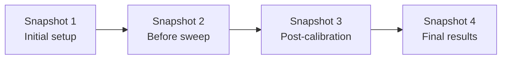

*This article was originally published in September 2025 and has been updated for 2026 with new sections on Browser-Based Computing, GPU Acceleration, Version Control, Large File Handling, and Airgap Deployment.*

## 🫰 Why are engineers searching for MATLAB alternatives?
MATLAB is powerful but expensive, with licenses costing over $2,000 per seat. For engineers in mechanical, electrical, and aerospace fields, that barrier drives the search for free alternatives. This guide compares the top four options, RunMat, Octave, Julia, and Python, with a focus on real engineering use cases, performance, compatibility, and ecosystem support.

## TL;DR Summary
- **RunMat** → Best for running MATLAB code directly. JIT-compiled, automatic GPU acceleration across all major vendors, runs in the browser with no install, and includes built-in versioning and collaboration. Toolbox coverage is still expanding.
- **GNU Octave** → Mature drop-in alternative for MATLAB scripts. Slower than JIT-compiled tools and no GPU support, but stable and widely used in academia.
- **Python (NumPy/SciPy)** → Largest ecosystem and strong ML integration, but requires rewriting MATLAB code. Browser options exist (Colab, Pyodide) with trade-offs.
- **Julia** → Built for performance and large-scale simulation, but requires learning a new language. No browser-native runtime yet.

Ready to try RunMat? Open the [browser sandbox](https://runmat.com/sandbox) and run your first script with no install or sign-up.

⚠️ **Note:** None of these replicate Simulink’s graphical block-diagram modeling. All rely on script-based workflows.

---

## 📐 Practical Use Cases for MATLAB Alternatives

### 📶 Data Analysis and Visualization
For decades, MATLAB has been used for dataset wrangling, statistics, and plots. The free alternatives each take a different approach:

- **RunMat** supports [`plot`, `scatter`, and `hist`](/docs/plotting) alongside `figure`, `subplot`, `hold`, and `gcf`. Rendering is GPU-first: vertex buffers are built on-device and rendered through WebGPU in the browser or Metal/Vulkan/DX12 natively, so plots involving large datasets avoid CPU-side bottlenecks. An interactive 3D camera supports rotate, pan, and zoom, with reversed-Z depth and dynamic clip planes for precision in LiDAR, CFD, and radar visualization. Figure scenes can be exported and reimported for persistence and replay. Some advanced chart types (surface, contour, bar) are still in progress, and toolbox coverage continues to expand.

- **Octave** maintains strong compatibility with MATLAB’s syntax, supporting everyday data analysis tasks like matrix operations, file I/O, and 2D/3D plotting. For most scripts, the transition is seamless, with functions behaving nearly identically. [Octave 11](https://octave.org/NEWS-11.html) (February 2026) brought concrete performance improvements: convolution on short-by-wide arrays runs 10-150x faster depending on shape, and `sum`/`cumsum` on logical inputs are up to 6x faster. Visualization remains less polished than MATLAB's, but functional.

- **Python** relies on specialized libraries. [NumPy 2.0](https://numpy.org/doc/2.0/release/2.0.0-notes.html) (released June 2024) cleaned up ~10% of the main namespace, added a proper DType API for custom data types, and introduced a native `StringDType`. Pandas streamlines data wrangling, and Matplotlib/Seaborn offer flexible plotting. The syntax differs from MATLAB, requiring some adjustment, but the payoff is a robust ecosystem that goes beyond traditional numerical analysis. Engineers can move from cleaning data to applying machine learning models or integrating with databases in the same environment, making Python attractive for end-to-end workflows.

- **Julia** combines math-friendly syntax with high performance. Packages like DataFrames.jl support structured data handling, while Plots.jl and related libraries enable visualization. Its 1-based indexing and matrix-oriented design feel familiar to MATLAB users, easing the transition. [Julia 1.12](https://julialang.org/blog/2025/10/julia-1.12-highlights/) (October 2025) improved the interactive workflow: constants and structs can now be redefined through the world-age mechanism, and Revise.jl 3.13 makes this automatic, so engineers no longer need to restart Julia after changing a type definition. While Julia’s ecosystem is smaller than Python’s, it continues to grow rapidly.

### 🔌 Simulation and System Modeling
For many engineers, simulation is a core activity that encompasses mechanical dynamics, electrical circuits, and control systems. MATLAB typically facilitates this through Simulink, its widely recognized drag-and-drop block diagram environment. As highlighted earlier, none of the free options here fully replicates Simulink’s graphical modeling environment. What they do offer is script-based simulation, which involves solving ODEs, modeling control systems, and running discrete-time simulations in code.

- **RunMat** runs MATLAB simulation scripts (e.g., ODEs, discrete-time models) at near-native speed. Monte Carlo simulations and batch parameter sweeps benefit from automatic GPU acceleration. While toolbox coverage is still expanding, the roadmap includes packages for control systems and related domains, extending its capabilities into transfer-function and state-space analysis.
- **Octave** includes MATLAB-compatible ODE solvers (`ode45`, `ode23`) and a control package (`tf`, `step`, `lsim`) for transfer functions and state-space models. Engineers can simulate filters, controllers, or dynamic systems using almost the same functions as in MATLAB (`tf`, `step`, `lsim`), which makes the transition seamless for anyone with MATLAB experience.
- **Python**, with libraries like SciPy and python-control, offers robust tools for system simulation and modeling, akin to MATLAB. Performance is good when using optimized SciPy solvers or NumPy operations.
- **Julia** excels in simulations and modeling, particularly with its **DifferentialEquations.jl** library, offering performance comparable to or surpassing MATLAB's solvers for ODEs, SDEs, and DAE systems. **ControlSystems.jl** mirrors MATLAB's control toolbox. Julia's code, similar to MATLAB, allows natural math expressions and vector/matrix use, supporting clean modeling with Unicode and efficient small functions. Initial simulation runs may experience a short pause due to JIT compilation, but subsequent runs are much faster, benefiting iterative design.

---

## Performance

### 🏎️ Execution Speed
RunMat and Julia both leverage JIT (just-in-time) compilation to reach near-native C performance on many workloads. RunMat uses a tiered model inspired by Google’s V8 engine: code starts running immediately in an interpreter, then “hot” paths are compiled into optimized machine code. The result is a system that feels fast from the first run and often gets faster as it executes. Julia compiles functions the first time they’re called, which introduces a brief pause up front, but subsequent runs execute at full speed. In practice, both tools rival or surpass MATLAB’s own JIT in handling loop-heavy or custom algorithms.

GNU Octave, by contrast, runs purely as an interpreter. For vectorized operations, it performs reasonably, but in loop-dominated code, the lack of a JIT can make it dramatically slower, often 100× or more, compared to MATLAB or RunMat. For engineers running small to medium workloads, this may be acceptable, but Octave struggles with large-scale or real-time simulation.

Python sits between these extremes. With NumPy and SciPy, array operations execute at C speed so that well-vectorized code can match MATLAB, RunMat, or Julia. However, pure Python loops are slower in some cases, often slower than Octave, unless the user applies tools like Numba or Cython. This makes Python highly performant in the hands of an experienced developer, but less forgiving for those new to its ecosystem.

To see the difference a JIT makes, run this million-iteration loop right here -- an interpreter would crawl through it:

```matlab:runnable
tic;
N = 1000000;
s = 0;
for i = 1:N
  s = s + sqrt(i);
end
t = toc;
fprintf("Sum of sqrt(1..%d) = %.4f in %.3f s\n", N, s, t);
```

### 🏃 Startup & Responsiveness
- **RunMat** is designed for immediacy. Its snapshot-based startup system allows it to launch in under 5 ms, meaning engineers can fire up a REPL or run a script almost instantly. Combined with its JIT profiling, this makes RunMat feel highly interactive; you can tweak code and rerun without waiting for the environment itself to catch up.
- **Octave**, while lightweight compared to MATLAB, still feels slower to start and less responsive in interactive use. Its GUI can lag when rendering plots or processing large commands, which is noticeable if you’re working in short, iterative bursts. Engineers coming from MATLAB will find it usable, but not snappy.
- **Python** strikes a balance: the interpreter starts quickly, but importing heavy scientific libraries (NumPy, SciPy, Pandas) can add noticeable delay. Once a Jupyter notebook session is running, however, responsiveness is generally smooth, especially if you avoid re-importing libraries.
- **Julia's** REPL launches in a second or two, but its "time to first use" is the bigger issue; calling a function or library for the first time may take several seconds as it compiles. Once past that, responsiveness is excellent, with subsequent runs executing instantly.

### ⚡ GPU Acceleration

Modern engineering workloads like Monte Carlo simulations, image processing, and large matrix operations increasingly benefit from GPU parallelism. Each alternative takes a different approach to GPU computing:

- **RunMat** [automatically offloads computations to the GPU](/blog/how-to-use-gpu-in-matlab) without code changes. The runtime detects GPU-friendly operations, fuses chains of elementwise math into single kernels, and keeps data [resident on the GPU](/docs/accelerate/gpu-behavior) between operations. It supports NVIDIA, AMD, Intel, and Apple GPUs through a unified backend (Metal on macOS, DirectX 12 on Windows, Vulkan on Linux). You write normal MATLAB code; RunMat decides when GPU acceleration helps. In browser builds, WebGPU provides client-side acceleration.

For a deeper look at how RunMat fuses operations and manages residency, read the [Introduction to RunMat Fusion](/docs/accelerate/fusion-intro).

- **MATLAB** requires explicit `gpuArray` calls and only supports NVIDIA GPUs via the Parallel Computing Toolbox (additional license required). Each operation launches a separate kernel, with no automatic fusion. Engineers must manually manage data transfers between CPU and GPU with `gather()`.

- **Python** GPU support depends on the library. PyTorch and TensorFlow offer excellent GPU acceleration for machine learning workloads. [CuPy](https://cupy.dev) provides a NumPy-like API on NVIDIA GPUs. Apple Silicon users can use PyTorch's MPS backend or JAX's Metal support. All require explicit device management and library-specific code.

- **Julia** has strong NVIDIA support via CUDA.jl, with explicit `CuArray` types. AMD support exists via AMDGPU.jl but is Linux-only. Apple Silicon GPU support arrived via [Metal.jl](https://github.com/JuliaGPU/Metal.jl), which reached v1.9 in early 2026 with MPSGraph integration and `MtlArray` types for high-level array operations. Like MATLAB, you must explicitly move data to the GPU across all backends.

- **GNU Octave** has no meaningful GPU support. Any computations run on CPU only.

For workloads where GPU acceleration matters, RunMat's automatic cross-vendor approach eliminates the manual device management required by other platforms. In benchmarks, RunMat's fusion engine delivers significant speedups on memory-bound workloads:

- Monte Carlo simulations (5M paths): ~2.8x faster than PyTorch, ~130x faster than NumPy
- Elementwise chains (1B elements): ~100x+ faster than PyTorch when fusion eliminates memory traffic

Here's a Monte Carlo option pricer with 1M paths -- run it below and check whether your GPU picks it up:

```matlab:runnable
rng(0);
M = 1000000; T = 256;
S0 = single(100); mu = single(0.05); sigma = single(0.20);
dt = single(1.0 / 252.0); K = single(100.0);

S = ones(M, 1, 'single') * S0;
drift = (mu - 0.5 * sigma^2) * dt;
scale = sigma * sqrt(dt);

for t = 1:T
  Z = randn(M, 1, 'single');
  S = S .* exp(drift + scale .* Z);
end

payoff = max(S - K, 0);
price  = mean(payoff, 'all') * exp(-mu * T * dt);
disp(price);
```

---

## 🖥️ Code Comparisons for Common Tasks
To illustrate how familiar MATLAB code translates into other environments, let’s look at a single example: plotting a sine wave. This highlights where your MATLAB knowledge is directly applicable and where new syntax or libraries are required.

### RunMat / Octave (MATLAB syntax)
```matlab:runnable
x = 0:0.1:2*pi;
y = sin(x);
plot(x, y);
```
This code runs unchanged in MATLAB, Octave, and RunMat. The colon operator creates the vector, and `plot` produces the figure. RunMat and MATLAB display it interactively; Octave uses its GUI or gnuplot.

### Python (NumPy & Matplotlib)
```python
import numpy as np
import matplotlib.pyplot as plt

x = np.arange(0, 2*np.pi, 0.1)
y = np.sin(x)

plt.plot(x, y)
plt.title("Sine Wave")
plt.show()

```

Python requires importing libraries, but the workflow is conceptually the same. `np.arange` mirrors MATLAB’s colon operator, and `np.sin` applies elementwise.


### Julia

```julia

using Plots

x = 0:0.1:2π
y = sin.(x)

plot(x, y, title="Sine Wave")

```

Julia’s syntax is very close to MATLAB’s, with minor differences like the broadcast dot (`sin.(x)`). It requires loading a plotting package, but otherwise feels familiar.

**Takeaway:** MATLAB/Octave/RunMat lets you reuse code directly. Python adds library imports, but maps closely conceptually. Julia is concise, math-like, and designed for speed, but with slightly different idioms.

---

## 🎬 Set Up Experience and OS Compatibility
MATLAB's installation and license setup remain significant friction points. As of January 2026, MathWorks [ended perpetual Student and Home licenses](https://www.mathworks.com/pricing-licensing.html) in favor of annual subscriptions -- $119/year for the Student Suite, $165/year for the Home Suite (list prices at time of writing; check MathWorks for current pricing). Professional licenses still start above $2,000 per seat. By contrast, most free MATLAB alternatives install quickly and run on Windows, Linux, and macOS without license servers or account sign-ins.

**RunMat** installs on Windows, Linux, and macOS via a one-line command or package manager, and engineers can usually be running scripts within a minute. For zero-install access, the [browser sandbox](https://runmat.com/sandbox) provides a full IDE with editor, console, plotting, and variable inspector -- no account required, code stays local (see [Browser-Based Computing](#-browser-based-computing) below for details). A desktop app with the same UI is also available for native performance with full local file access. Built in Rust, RunMat offers consistent behavior across operating systems with no license manager or environment configuration.


**GNU Octave** is available on Windows, Linux, and Mac. Installation is straightforward across platforms, with GUI installers available for Windows/macOS, and package manager support on Linux. Its GUI resembles older MATLAB versions. [Octave 11](https://octave.org/NEWS-11.html) (February 2026) improved the package manager with a `pkg search` command for finding packages by keyword and SHA256 verification for downloaded tarballs, removing the need for the old `-forge` flag. Users may still need to install Octave Forge packages separately, similar to MATLAB toolboxes, but the process is now less error-prone. No license files or account sign-ins required.

**Python (with NumPy/SciPy)** runs on most OS, including small devices. Engineers on Windows and Mac often use the free Anaconda Distribution, a convenient bundle including Python, NumPy, SciPy, Matplotlib, and Jupyter. Alternatively, one can install Python from python.org and add libraries via pip. Linux typically comes with Python pre-installed, requiring only pip or system repositories for additional packages. Setup time may vary due to IDE choice (e.g., Spyder, VS Code). Once set up, the environment is robust, and code is universally compatible. GPU capability requires extra packages. While basic setup is easy, the ecosystem's flexibility offers many choices, leading some teams to standardize setups. Python can also integrate with other OS tools like Excel.


**Julia** offers easy cross-platform installation via downloads or package managers. [Julia 1.12](https://julialang.org/blog/2025/10/julia-1.12-highlights/) (October 2025) introduced an experimental `--trim` flag that eliminates unreachable code from compiled system images, producing significantly smaller binaries and faster compile times for deployed applications. VS Code with the Julia extension is the recommended editor. Julia is self-contained, but users add packages (e.g., for plotting) and may need C/Fortran binaries. After setup, it's stable and consistent.

## 🌐 Browser-Based Computing

For engineers who need to run computations without installing software (on locked-down corporate machines, Chromebooks, or while traveling), browser-based platforms offer immediate access.

- **RunMat** provides a full [browser IDE](/docs/desktop-browser-guide) with a MATLAB-style editor, file tree, console, variable inspector, and live GPU-accelerated [plotting](/docs/plotting), all running client-side via WebAssembly. No server processes your code, so there are no time limits or usage quotas. WebGPU acceleration is available in Chrome 113+, Edge 113+, Safari 18+, and Firefox 139+. File persistence requires signing in or using the desktop app (same UI, full local file access). Startup is instant (~5 ms) and the IDE works offline once loaded. Real-time project sync is available for teams who sign in. <a href="/sandbox" data-ph-capture-attribute-destination="sandbox" data-ph-capture-attribute-source="blog-matlab-alternatives" data-ph-capture-attribute-cta="open-sandbox">Open the RunMat sandbox</a> in any supported browser.

<a href="/sandbox" data-ph-capture-attribute-destination="sandbox" data-ph-capture-attribute-source="blog-matlab-alternatives" data-ph-capture-attribute-cta="browser-video">
  <video autoPlay loop muted playsInline className="my-6 w-full rounded-lg cursor-pointer">
    <source src="https://web.runmatstatic.com/video/3d-interactive-plotting-runmat.mp4" type="video/mp4" />
  </video>
</a>

- **MATLAB Online** runs on MathWorks' cloud servers, where your browser is just a thin client. This requires a MathWorks account and internet connection. The free tier limits usage to 20 hours/month with 15-minute execution caps and idle timeouts, and provides 1 vCPU with 4 GB of memory and 5 GB of MATLAB Drive storage (20 GB for licensed users). No GPU acceleration is available in standard cloud sessions. Basic file sharing is available through MATLAB Drive, but there is no real-time co-editing.

- **GNU Octave** is available via Octave Online, a free hosted service. Like MATLAB Online, it runs on remote servers. Execution time is strictly limited (~10 seconds per command by default, extendable manually). No GPU support is available. Octave Online does offer real-time collaboration similar to Google Docs for signed-in users, making it useful for teaching and pair work, but the execution constraints make it impractical for serious computation.

- **Python** has two browser paths. [Google Colab](https://colab.research.google.com) runs on remote servers with GPU access on the free tier (capped at ~12 hours, subject to throttling) and supports real-time notebook collaboration. [Pyodide](https://pyodide.org) offers true in-browser execution via WebAssembly, but with significant limitations: only pure-Python packages work reliably, performance is slower than native CPython, and there's no GPU access. Neither approach runs MATLAB code directly.

- **Julia** currently has no production-ready browser runtime. There's no official WebAssembly version, so any browser-based Julia experience (like Pluto notebooks) requires a backend server. Experimental WebAssembly efforts exist, but Julia's JIT compiler and task runtime make this challenging. To use Julia via browser, you must run your own server or use a cloud service like JuliaHub.

Beyond running code, collaboration matters. RunMat includes [real-time project sync](/docs/collaboration): when one team member saves a file, others see the update within 250 ms via Server-Sent Events, with cursor-based replay handling disconnects and reconnects without merge conflicts. Access is managed through role-based permissions at the organization and project level, with SSO (SAML/OIDC) and SCIM provisioning for enterprise identity systems. Google Colab is the strongest collaborative option on the Python side, with real-time notebook co-editing, though it requires Google accounts and is limited to notebook-format code. Octave Online and CoCalc both support real-time collaboration for signed-in users. MATLAB Online and JuliaHub offer file sharing and team features but no real-time co-editing.

RunMat is currently the only option that combines a full browser-native IDE, GPU acceleration, MATLAB syntax, and real-time collaboration without server dependencies or usage quotas.

## 🤝 Compatibility with Existing MATLAB Code
One of the biggest concerns when migrating away from MATLAB is simple: Can I keep running my old .m files, or will I have to rewrite everything? Each alternative handles compatibility differently.

- **RunMat** targets high compatibility with MATLAB’s core language and many `.m` files already run unmodified. Coverage extends beyond basic syntax into areas where Octave falls short: full [`classdef` OOP](/docs/ignition/oop-semantics) with properties, methods, events, handle classes, enumerations, and the `?Class` metaclass operator; `varargin`/`varargout` with expansion into slice targets; and N-D `end` arithmetic. RunMat also supports two compatibility modes -- `compat = "matlab"` (default) preserves MATLAB command syntax like `hold on` and `axis equal`, while `compat = "strict"` requires explicit function-call form for cleaner tooling. Some toolbox functions and advanced chart types remain under construction, but the [core language coverage](/docs/language-coverage) is broad enough that most engineering scripts run without modification.

This spring-mass system uses vectorized math, `linspace`, and `plot` -- paste it or hit run:

```matlab:runnable
k = 50; m = 1; x0 = 0.1; tMax = 2;
omega = sqrt(k / m);
t = linspace(0, tMax, 500);
x = x0 * cos(omega * t);
plot(t, x);
```

- **GNU Octave** also prioritizes source compatibility, and most MATLAB scripts run with little or no modification. Its syntax and functions are highly aligned, though some newer features or specialized toolboxes may be missing or require Octave Forge packages. Octave's `classdef` support is partial -- events, metaclass queries, and some handle-class features are absent or incomplete, which matters for codebases that rely on MATLAB's OOP model. Octave handles most procedural engineering scripts reliably and can read/write .mat files, making it a practical choice for reusing MATLAB code. The main differences appear at the edges: specialized toolboxes and performance at scale.
- **Python** cannot run MATLAB code directly. Tools like [SMOP](https://github.com/victorlei/smop) can auto-translate .m files, but results often require manual cleanup. Large codebases usually need to be rewritten by hand, which is a significant investment. Many teams instead maintain MATLAB for legacy projects and start new development in Python. The upside is flexibility. Once translated, Python code benefits from its vast ecosystem, but direct reuse of MATLAB code is not realistic.
- **Julia**, like Python, requires rewriting MATLAB code. The transition is somewhat easier because Julia shares MATLAB’s 1-based indexing, column-major arrays, and many familiar function names. Numeric code often translates line by line, though plotting, specialized toolboxes, or GUI code require Julia equivalents. Rewriting in Julia can pay off with higher performance and cleaner code design, but reuse is limited to manual porting.

## 📜 Version Control and Reproducibility

Most engineers working with MATLAB have encountered the `thermal_analysis_v3_FINAL_v2_USE_THIS_ONE.m` problem. Version control in scientific computing has historically meant either learning git (which most mechanical and electrical engineers never do) or appending dates and initials to filenames and hoping for the best.

RunMat [builds versioning directly into the filesystem](/blog/version-control-for-engineers-who-dont-use-git). Every save creates an immutable version record containing a content hash, the acting user, and a timestamp. Engineers never run `git add` or `git commit`; the history accumulates automatically. Snapshots capture the full project state at a point in time, forming a linear chain that can be restored with a single click. For audit and compliance, snapshots export as git fast-import streams, producing a standard git repository without requiring engineers to interact with git day-to-day. Large datasets are handled through manifest versioning: the system versions a small pointer file rather than duplicating terabytes of measurement data, so the full lineage is preserved without ballooning storage. Versions count against the project's storage quota, which is capped on the free plan; [retention is configurable](/docs/versioning) per project so teams can balance history depth against storage.



MATLAB itself has no built-in version control. MathWorks Projects added git integration in recent releases, but it is a thin wrapper that still requires engineers to understand staging, commits, and branches. Most MATLAB teams either use git with varying levels of proficiency or fall back to shared drives and manual naming conventions.

Python teams typically use git, but Jupyter notebooks are notoriously hard to diff and merge because the `.ipynb` format mixes code, output, and metadata in JSON. Tools like nbstripout and ReviewNB exist to work around this, but they add friction. For large datasets, [DVC](https://dvc.org) (Data Version Control) tracks data files alongside git, and DVC 3.31 can now read git-lfs objects natively. The ecosystem is powerful but involves stitching together multiple tools.

Julia uses `Project.toml` and `Manifest.toml` for package reproducibility, which is well-designed for dependency management but says nothing about data or project-level history. JuliaHub introduced Time Capsule in late 2025, which bundles code, data, Julia manifest, and the entire container image into an immutable snapshot for exact job reproduction -- strong for cloud-based reproducibility, but tied to the JuliaHub platform. Octave has no built-in versioning at all; the closest option is CoCalc's TimeTravel feature, which records file changes with automatic revision history on a third-party platform.

## 📦 Large File and Dataset Handling

Engineering workflows routinely produce datasets that dwarf the code that generates them -- wind tunnel measurements, sensor logs, simulation outputs, and high-resolution imagery can easily reach tens or hundreds of gigabytes per project.

Python has the richest third-party ecosystem for large data: h5py for HDF5, pyarrow for Parquet and Arrow, Zarr for chunked N-dimensional arrays, and DVC for versioning data files alongside git. The trade-off is that each tool has its own API, configuration, and mental model. A project might use Zarr for array storage, DVC for versioning, and S3 for remote storage -- three separate tools with three separate configurations.

MATLAB uses MAT files via `save`/`load` and supports HDF5 through `h5read`/`h5write`. There is no built-in sharding or large-file management. MATLAB Drive offers 5 GB of cloud storage on the free tier (20 GB for licensed users), which is insufficient for most real-world datasets. Engineers typically manage large files outside MATLAB entirely, using external storage and manual transfer scripts.

RunMat's filesystem handles this as a single integrated system. Files above 4 GB are automatically split into 512 MB shards, with a manifest file at the original path that tracks the shard list. The sharding is transparent to user code: `load` and `save` work the same way regardless of file size. On the server side, uploads go direct-to-blob via signed URLs, keeping the RunMat server out of the data path. Manifest files are always versioned (preserving full lineage), while the underlying shard data uses copy-on-write to avoid duplication. The same `load`/`save` API works across local, browser, and cloud backends, so scripts don't need path rewrites when moving between environments. The system scales to petabyte-class datasets, though free-plan projects have a storage cap -- the manifest-based approach and copy-on-write help conserve quota, and paid tiers raise the ceiling.

Julia and Octave both support HDF5 and MAT file I/O (Julia via HDF5.jl and Arrow.jl, Octave natively), but neither offers built-in sharding, manifest versioning, or a unified cross-backend filesystem. JuliaHub added automatic git-lfs support in 2025 for large files in cloud projects.

## 🔒 Airgap and Offline Deployment

Defense contractors, national labs, aerospace firms, and power utilities often operate on [air-gapped networks](/blog/mission-critical-math-airgap) with no internet access. Getting scientific computing tools onto these machines has historically been painful.

| Tool | Install | Dependencies | License server | GPU offline |
|------|---------|-------------|----------------|-------------|
| RunMat | Single static binary | None | No | Metal/Vulkan/DX12 via wgpu |
| MATLAB | Multi-GB installer | FlexLM + per-toolbox files | Required | CUDA only (Parallel Computing Toolbox) |
| Python | Varies by distribution | Platform-specific wheels for every package | No | Requires CUDA toolkit setup |
| Julia | ~500 MB + pre-downloaded registry | Local depot configuration | No | CUDA.jl, Metal.jl |
| Octave | Single package or binary | None significant | No | No GPU support |

RunMat's airgap story is straightforward: copy one binary onto approved media, transfer it to the target machine, run it. Startup takes ~5 ms. GPU acceleration works through the wgpu abstraction layer (Metal, Vulkan, DirectX 12), so there is no CUDA toolkit or NVIDIA driver version to match. For teams that need the full platform, RunMat Enterprise provides a self-hosted server binary alongside a local Postgres instance, with offline signed license payloads and telemetry off by default.

The pain points at the other end of the table are worth noting. MATLAB requires coordinating with IT, procurement, and MathWorks support to get a FlexLM license file locked to the target machine's host ID, and every toolbox adds size and license complexity. Python's challenge is dependency staging: NumPy, SciPy, Matplotlib, and their transitive dependencies must all be pre-downloaded as wheels matching the exact target platform, and a single missing wheel breaks `pip install --no-index`. Anaconda's air-gapped path exists but requires Docker or Podman infrastructure on a staging machine. Octave is the simplest of the legacy options to deploy offline, but its lack of GPU support and interpreter-only execution limit it to lightweight workloads.

## 👩‍🏫 Learning Curve and Community Support
Switching from MATLAB means not just a new tool. Still, a new set of habits and the availability of tutorials, forums, and documentation often determine whether the transition feels smooth or painful. Here’s how the main alternatives compare:

- **RunMat** has almost no learning curve for MATLAB users since it preserves MATLAB syntax and semantics. While its user community is still small, MATLAB resources indirectly address many common problems, and RunMat’s [open-source model](/docs/contributing) allows engineers to interact directly with developers on GitHub. The official documentation is concise and practical, with guides for setup, CLI usage, and architecture. For someone fluent in MATLAB, the adjustment is minimal.
- **GNU Octave** is also straightforward for MATLAB users. Its language and functions are highly compatible, though installing packages (via `pkg`) replaces MATLAB’s toolbox system. Octave has an established academic user base, with support available through mailing lists, a wiki, and a modest subreddit. The main sticking point isn’t syntax, but advanced use cases; building GUIs or interfacing with Java is less polished than in MATLAB.
- **Python** poses a steeper transition. Engineers must adapt to indentation rules, 0-based indexing, and a modular ecosystem (NumPy, SciPy, Matplotlib, Pandas). The payoff is access to a vast, active community and countless tutorials, cheat sheets, and courses. Python is now widely taught in universities, which lowers the barrier for new graduates. Tools like Jupyter notebooks ease experimentation, but mastering the ecosystem requires more time than RunMat or Octave. After the initial learning curve, many engineers find Python more intuitive for general-purpose coding beyond numerical work.
- **Julia** offers a middle ground. Julia’s community is smaller than Python’s but highly engaged, with strong official documentation and tutorials tailored to MATLAB switchers. The most significant adjustment isn’t syntax but mindset. MATLAB veterans must unlearn habits like forced vectorization, since Julia’s loops are already efficient. Once that shift is made, Julia becomes a natural and powerful environment.

## 🛠️ Trade-offs and Choosing the Right Tool
No free alternative matches MATLAB feature-for-feature, so the right choice depends on what you value most: compatibility, performance, or ecosystem.

### Minimal Transition (RunMat & Octave)
If you want to keep running MATLAB scripts with almost no changes, RunMat and Octave are your main options. RunMat is newer but offers faster performance, modern JIT compilation, and growing toolbox support. Octave is slower, but it is long-standing and widely used in academia.

### Performance & Scalability (Julia & RunMat)
For cutting-edge computation, Julia stands out with its ability to scale from single-core to multi-threaded and GPU workloads. RunMat matches this with automatic GPU offloading across all major vendors: write MATLAB code, get GPU performance without rewrites. Python can also perform well if written with NumPy/SciPy, but requires more care.

### Ecosystem & Libraries (Python leads)
Python dominates in ecosystem breadth, offering libraries for machine learning, data science, web development, automation, and APIs, among others. Julia excels in scientific niches (differential equations, optimization), but coverage is still smaller. Octave sticks close to MATLAB’s core, while RunMat inherits whatever MATLAB scripts you already have, though its toolbox ecosystem is still emerging.

### Longevity & Support
Python and Julia both have strong momentum and active development. Octave is stable but evolves slowly. RunMat, backed by Dystr and open-source contributors, is relatively new but has significant potential as adoption grows.

## ⛙ Decision Guide
| Priority                        | Best Choice     | Why                                                               |
|---------------------------------|-----------------|-------------------------------------------------------------------|
| Reuse MATLAB code directly      | RunMat / Octave | Familiar syntax; RunMat is faster/newer, Octave is mature          |
| Maximum performance / HPC       | Julia / RunMat  | JIT-compiled, multi-threaded, GPU-friendly                        |
| Automatic GPU acceleration      | RunMat          | Cross-vendor GPU support without code changes                     |
| Browser-based computing         | RunMat          | WebGPU acceleration, no quotas, client-side execution             |
| Versatility & integrations      | Python          | Huge ecosystem, machine learning, automation, transferable skills |
| Teaching / lightweight use      | Octave          | Free, stable, familiar for students and smaller projects          |
| Future-proof compatibility      | RunMat          | Open-source, high performance, growing coverage of common MATLAB workflows |
| Built-in version control        | RunMat          | Automatic per-save versioning, snapshots, git export, no git required |
| Airgap / offline deployment     | RunMat          | Single binary, no license server, GPU without CUDA               |
| Large dataset management        | RunMat / Python | RunMat: native sharding and manifest versioning; Python: DVC ecosystem |
| Real-time collaboration         | RunMat / Python | RunMat: project-level sync; Python: Colab notebook collaboration  |

### 🚀 See It in Action

Paste one of your own `.m` scripts into the sandbox, or start with this SVD decomposition:

```matlab:runnable
A = rand(500);
[U, S, V] = svd(A);
fprintf("Largest singular value: %.6f\n", S(1,1));
s = diag(S);
plot(1:length(s), s);
```

<a href="/sandbox" data-ph-capture-attribute-destination="sandbox" data-ph-capture-attribute-source="blog-matlab-alternatives" data-ph-capture-attribute-cta="decision-guide-sandbox">Open the RunMat sandbox</a> and try your own code.

## 👍 Closing
These tools aren't mutually exclusive; use Python for breadth, Julia for performance, and RunMat or Octave for MATLAB compatibility. The comparison has expanded since we first wrote this article. Runtime speed and syntax compatibility used to be the only axes that mattered. Now the questions include: Can I version my work without learning git? Can I deploy to an air-gapped lab without a DevOps team? Can my collaborators see changes in real time? Can I open a browser tab and start computing without waiting for IT to approve an install?

RunMat is the only tool in this comparison that ships all of those capabilities alongside JIT performance, automatic GPU acceleration, and MATLAB syntax. The gap between what free alternatives can do and what MATLAB charges $2,000+ per seat for continues to narrow, and with MathWorks moving to subscription-only licensing, the cost pressure is only increasing. The best time to evaluate your options is before the next renewal.

*Try RunMat free today at [runmat.com](https://runmat.com). RunMat is a free, open source community project developed by [Dystr](https://dystr.com).*
