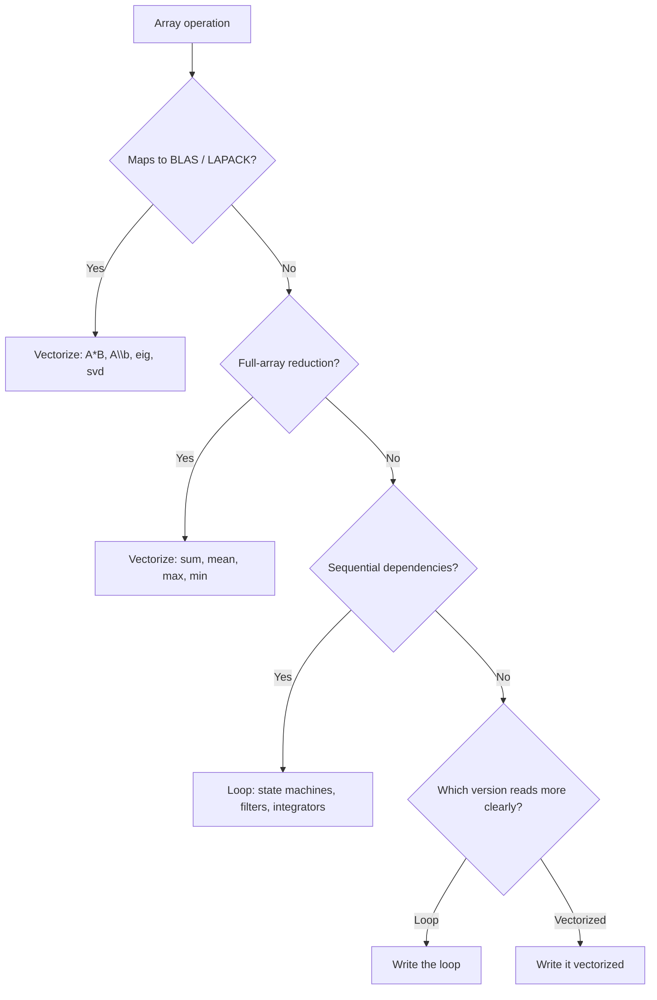

Every MATLAB performance guide opens the same way: replace your for loops with vectorized operations. MathWorks' [own vectorization documentation](https://www.mathworks.com/help/matlab/matlab_prog/vectorization.html) treats it as the primary optimization technique. StackOverflow answers repeat it. Senior engineers repeat it to junior engineers.

The standard MATLAB advice (vectorize everything) conflates two separate claims: that some operations have faster builtins (true, and useful) and that for loops are inherently slow (false). A for loop summing a million elements can run 10-60x slower than `sum()`, depending on MATLAB version and JIT warmup, so the advice does buy real speed. But the cost is paid in readability, and the underlying claim about loops is wrong. The overhead is consistent with properties of MATLAB's execution model: dynamic type resolution, interpreter-level per-iteration processing, and the cost of dispatching into compiled builtins one element at a time. A runtime that doesn't interpret user code through that layer avoids most of the per-iteration cost. The loop runs faster, and you pick whichever form is more readable.


## Why MATLAB loops are actually slow

MATLAB is a dynamically typed, interpreted language. The observable performance gap between loops and vectorized builtins is consistent with overhead that scales with the number of iterations. MathWorks hasn't published the internals of their execution engine, but the [official acceleration documentation](https://www.mathworks.com/help/matlab/matlab_prog/techniques-for-improving-performance.html) and [published benchmarks](https://arxiv.org/abs/1202.2736) point to several likely contributors.

Dynamic typing means user code types must be resolved at execution time. An expression like `x(i) + 1` involves determining the class of `x`, validating the index `i`, and selecting the correct arithmetic implementation for that combination. In a language where these decisions are resolved ahead of time, the cost is paid once. In MATLAB, the evidence suggests they're paid on every iteration.

MathWorks' older acceleration documentation (MATLAB 6.5 era) is explicit about one mechanism: "Whenever MATLAB encounters an unsupported element, it interrupts accelerated processing to handle the instruction through the non-accelerated interpreter." Loop bodies that call into M-files or use unsupported data types fall back to a slower path on every iteration. The [MATLAB Execution Engine](https://www.mathworks.com/products/matlab/matlab-execution-engine.html) rewrite in R2015b [improved this substantially](https://blogs.mathworks.com/loren/2016/02/12/run-code-faster-with-the-new-matlab-execution-engine/), but MathWorks' own optimization guides still recommend vectorization as the primary technique, suggesting that per-iteration overhead remains significant for complex loop bodies.

The contrast with vectorized builtins reinforces this. A call to `sum(x)` dispatches once to a compiled C or Fortran reduction that processes the entire array. A for loop doing the same work makes N trips through the interpreted layer, each doing a small amount of arithmetic. The per-iteration overhead, whatever its exact composition, dominates the actual computation.

Run this comparison yourself:

```matlab:runnable
N = 100000;
x = rand(1, N);

tic;
s = 0;
for i = 1:N
    s = s + x(i);
end
loop_time = toc;

tic;
s2 = sum(x);
vec_time = toc;

fprintf('Loop sum:       %.6f s\n', loop_time);
fprintf('Vectorized sum: %.6f s\n', vec_time);
fprintf('Ratio:          %.1fx\n', loop_time / vec_time);
```

In MATLAB, that ratio can be 10-60x or more depending on the version of MATLAB and the hardware. Run the same code in RunMat and compare: user code operations map directly to compiled implementations without an interpreter layer, so per-iteration overhead drops sharply.

### What other languages do about this

Python has the same split. CPython loops are slow; NumPy vectorization is fast. The Python community gives identical advice for the same reason: interpreter overhead makes loops expensive, so use array operations instead.

Julia took a different path. Julia's compiler generates native machine code for loop bodies, so a Julia for loop runs at C speed. The Julia community doesn't tell you to avoid loops. They tell you to write type-stable code and let the compiler handle the rest.

[RunMat](/blog/introducing-runmat) takes a similar approach. User code operations execute directly against compiled Rust implementations: locally with a JIT compiler (Cranelift) for hot paths, and in the browser as compiled WebAssembly. There's no interpreter layer between the user's loop body and the arithmetic.

| Language | Loop speed | Array op speed | Advice |
|----------|-----------|---------------|--------|
| MATLAB | Slow (interpreted) | Fast (BLAS/LAPACK) | Vectorize everything |
| Python/NumPy | Slow (CPython) | Fast (C extensions) | Use NumPy, avoid loops |
| Julia | Fast (JIT-compiled) | Fast (BLAS/LAPACK) | Write natural code |
| RunMat | Fast (compiled) | Fast (GPU auto-offload) | Write natural code |

## What vectorization costs you

Vectorization has costs that MATLAB's performance guides don't mention.

Consider processing sensor data where readings above a noise floor pass through unchanged, and readings below it get squared to suppress them:

```matlab:runnable
N = 10000;
signal = randn(1, N);
noise_floor = 0.1;

% Loop version: reads like the algorithm
cleaned_loop = zeros(1, N);
for i = 1:N
    if abs(signal(i)) > noise_floor
        cleaned_loop(i) = signal(i);
    else
        cleaned_loop(i) = signal(i)^2;
    end
end

% Vectorized version: requires knowing the mask trick
mask = abs(signal) > noise_floor;
cleaned_vec = mask .* signal + (1 - mask) .* signal.^2;

fprintf('Max difference: %e\n', max(abs(cleaned_loop - cleaned_vec)));
```

The loop version reads like the algorithm: if the reading is above the threshold, keep it; otherwise, square it. The vectorized version multiplies boolean masks by arrays, requiring the reader to know that MATLAB booleans cast to 0 and 1 and to mentally trace two code paths simultaneously. Both produce the same result. In MATLAB, the vectorized version runs faster. In a compiled runtime, the loop runs at comparable speed, and a new team member can understand it on first read.

Vectorized expressions also create intermediate arrays:

```matlab
result = A .* B + C .* D - E ./ F;
```

This allocates four temporary arrays: `A.*B`, `C.*D`, their sum, and `E./F`. For arrays with a million elements in double precision, that's 32 MB of temporary memory. In some cases, this intermediate-array overhead makes vectorized code slower than the loop equivalent. A loop computes each element in register, using constant memory regardless of array size. (Some runtimes, including [RunMat Accelerate](/blog/runmat-accelerate-fastest-runtime-for-your-math), fuse element-wise chains to avoid these temporaries. Vanilla MATLAB does not.)

And when a vectorized expression produces wrong output, you cannot set a breakpoint at the element that went wrong. You are back at [fprintf debugging](/blog/matlab-fprintf): adding print statements, running the script, scrolling through output, removing the prints. A loop lets you pause at any iteration and inspect every variable in scope.

Exponential moving averages, state machines, adaptive step-size integrators, and event-driven simulations all have iterations that depend on the previous result. These algorithms are sequential by nature. Forcing them into vectorized form adds complexity without simplifying the code. Engineers write them as loops because that is what the algorithm is.

## Loop gotchas

The vectorize-everything advice overshadows more practical loop optimization techniques. These apply in any MATLAB-compatible runtime.

### Preallocation

Growing an array inside a loop is the single most common MATLAB performance mistake, and [MathWorks documents it explicitly](https://www.mathworks.com/help/matlab/matlab_prog/preallocating-arrays.html). Every `y = [y, value]` allocates a new array, copies the old contents, and appends the new element. MATLAB R2011a added smarter allocation heuristics that reduced the worst-case cost, but growing arrays in loops still carries substantial overhead. MathWorks' own benchmark shows a 25x speedup from preallocating:

```matlab
% Anti-pattern: growing array inside a loop
y = [];
for i = 1:N
    y = [y, sin(i / 1000)];
end
```

Preallocating avoids the repeated copy:

```matlab:runnable
N = 10000;

tic;
y = zeros(1, N);
for i = 1:N
    y(i) = sin(i / 1000);
end
elapsed = toc;

fprintf('Preallocated loop: %.4f s for %d elements\n', elapsed, N);
```

The fix: call `zeros()`, `ones()`, or `NaN()` before the loop to allocate the output array at its final size. This applies in MATLAB, RunMat, and any array language. At N = 10,000 the ratio is noticeable. At N = 100,000 the growing version becomes painfully slow.

### Function call overhead

Calling a user-defined function inside a tight loop adds per-call dispatch overhead. Each call does name lookup, input validation, and workspace creation:

```matlab
for i = 1:N
    result(i) = my_transform(x(i));
end
```

If `my_transform` is a simple expression, inlining it directly in the loop body avoids the per-call cost:

```matlab
for i = 1:N
    result(i) = x(i)^2 + 3*x(i) - 1;
end
```

In interpreted MATLAB, this can make a 2-5x difference for tight loops. In a compiled runtime the overhead of function calls is lower, so the difference shrinks. But keeping tight loop bodies self-contained is good practice regardless.

### Indexing

MATLAB stores arrays in [column-major order](https://www.mathworks.com/help/matlab/matlab_prog/techniques-for-improving-performance.html). Iterating along columns (down rows) accesses contiguous memory. Iterating along rows (across columns) causes cache misses:

```matlab
% Fast: contiguous memory access (column-major)
for j = 1:cols
    for i = 1:rows
        A(i, j) = A(i, j) * 2;
    end
end

% Slow: strided memory access
for i = 1:rows
    for j = 1:cols
        A(i, j) = A(i, j) * 2;
    end
end
```

For large matrices, the wrong iteration order can be 2-5x slower. The same cache behavior applies in Fortran and NumPy.

### parfor

MATLAB's `parfor` distributes independent iterations across parallel workers. It helps when each iteration does enough computation to outweigh the communication overhead:

```matlab
parfor i = 1:1000
    results(i) = expensive_simulation(params(i));
end
```

`parfor` doesn't help when iterations are fast (overhead exceeds computation), when iterations depend on each other, or when the data transfer per worker is large relative to the computation. It also requires the Parallel Computing Toolbox license. RunMat takes a different approach: compiling the loop body to run fast on a single core, with automatic GPU offload for element-wise array operations.

## What RunMat does differently

[RunMat](/blog/introducing-runmat) is a MATLAB-syntax runtime built in Rust. It supports [300+ functions](/docs/matlab-function-reference) across linear algebra, statistics, signal processing, and file I/O. Locally, hot code paths get JIT-compiled to native machine code via Cranelift. In the browser, the runtime runs as compiled WebAssembly.

MATLAB is also written in a compiled language (C/C++). The performance gap comes from how each runtime handles user code. In MATLAB, `.m` code passes through an interpreter that adds per-iteration overhead. In RunMat, user code operations map directly to compiled implementations. The 10-60x gap between loops and vectorized builtins in MATLAB narrows because that interpreter layer is absent.

The same sum benchmark, running in RunMat:

```matlab:runnable
N = 100000;
x = rand(1, N);

% Compiled loop
tic;
s = 0;
for i = 1:N
    s = s + x(i);
end
loop_time = toc;

% Builtin reduction
tic;
s2 = sum(x);
vec_time = toc;

fprintf('Compiled loop: %.6f s\n', loop_time);
fprintf('sum() builtin: %.6f s\n', vec_time);
fprintf('Difference:    %.6f\n', abs(s - s2));
```

The `sum()` builtin may still edge ahead because it dispatches to a SIMD or GPU parallel reduction. But the loop is no longer 50x slower. The performance gap narrows to the point where readability, not speed, should drive your choice.

## When to vectorize anyway

Compiled loops don't make vectorization obsolete. Some operations are faster vectorized in any runtime because they dispatch to hardware-optimized libraries.

Matrix multiplication (`A * B`), linear solves (`A \ b`), and decompositions (`eig(A)`, `svd(A)`) call [BLAS and LAPACK](https://en.wikipedia.org/wiki/LAPACK) routines written in optimized Fortran. These routines use cache-blocking, SIMD instructions, and multi-threading that a scalar loop cannot match. When the operation maps to a dense linear algebra call, vectorize.

Reduction builtins like `sum`, `mean`, `max`, and `min` dispatch to SIMD or GPU reduction kernels that process elements in parallel. A manual loop summing elements one at a time, even compiled, is sequential. The builtin reduction can use parallel hardware. For full-array reductions, use the builtin.

For everything else, use this decision framework:



If the vectorized version is equally readable and maps to an optimized builtin, vectorize. If the loop version is clearer and performance is equivalent in a compiled runtime, write the loop.

## Loop patterns and performance

Four loop patterns cover most MATLAB workloads: accumulation, element-wise with conditions, running statistics, and sequential dependencies. Each has different vectorization tradeoffs.

### Accumulation

```matlab:runnable
N = 100000;
x = rand(1, N);

total = 0;
for i = 1:N
    total = total + x(i);
end

fprintf('Loop sum:    %.6f\n', total);
fprintf('Builtin sum: %.6f\n', sum(x));
```

Vectorized equivalent: `sum(x)`. Use the builtin for full-array sums because it dispatches to a parallel reduction. Use the loop when accumulating with conditions or when the accumulation logic doesn't map to a single builtin.

### Element-wise with conditions

```matlab:runnable
N = 10000;
x = randn(1, N);
result = zeros(1, N);

for i = 1:N
    if x(i) > 1
        result(i) = log(x(i));
    elseif x(i) > 0
        result(i) = x(i);
    else
        result(i) = 0;
    end
end

fprintf('Processed %d elements\n', N);
fprintf('Non-zero: %d\n', sum(result > 0));
```

Multi-branch conditions with three or more paths are awkward to vectorize. The mask-multiplication approach requires one mask per branch and careful handling of edge cases. Loops express the logic directly.

### Running statistics

```matlab:runnable
N = 10000;
data = randn(1, N);

running_mean = zeros(1, N);
running_mean(1) = data(1);
for i = 2:N
    running_mean(i) = running_mean(i-1) + (data(i) - running_mean(i-1)) / i;
end

fprintf('Running mean (final): %.6f\n', running_mean(N));
fprintf('Direct mean:          %.6f\n', mean(data));
```

This is [Welford's online algorithm](https://en.wikipedia.org/wiki/Algorithms_for_calculating_variance#Welford's_online_algorithm) for numerically stable running averages. Each iteration depends on the previous value, making it inherently sequential. The vectorized alternative (`cumsum(data) ./ (1:N)`) is less numerically stable for large N.

### Quick reference

| Pattern | Recommendation | Reason |
|---------|---------------|--------|
| Full-array reduction (sum, mean, max) | Vectorize | Parallel reduction kernel |
| Matrix multiply, linear solve | Vectorize | BLAS/LAPACK optimized |
| Element-wise arithmetic (no conditions) | Either | Equivalent in compiled runtime |
| Element-wise with conditions | Loop | Clearer intent, no mask tricks |
| Sequential dependencies | Loop | Cannot parallelize |
| Growing arrays in loop | Loop with preallocation | Avoid O(N^2) copy cost |

## Frequently asked questions

### Why are MATLAB for loops slow?

MATLAB is dynamically typed and interpreted, so each iteration pays runtime costs that a compiled language pays once. Observable benchmarks show that for loops carry significant per-iteration overhead compared to vectorized builtins. For simple operations like scalar addition, that overhead dominates the actual computation.

### Does MATLAB's JIT compiler fix loop performance?

Partially. The MATLAB Execution Engine recognizes common patterns and generates faster code paths. Simple arithmetic loops are measurably faster than they were before R2015b. But MathWorks' own optimization guides still recommend vectorization as the primary technique, suggesting per-iteration overhead remains significant for complex loop bodies that mix conditionals, function calls, and several types.

### When should I use parfor instead of for?

When iterations are independent (no shared mutable state) and each iteration does enough work to justify the communication overhead (at least milliseconds per iteration). You also need the [Parallel Computing Toolbox](https://www.mathworks.com/products/parallel-computing.html) license. If per-iteration work is trivial, worker communication costs exceed the parallelism benefit. `parfor` also can't help when iterations have dependencies, since it can only distribute independent work.

### Is vectorized code always faster than loops?

In MATLAB, almost always for array operations, because the per-iteration overhead makes loops expensive. In RunMat, the gap shrinks because user code executes without an interpreter layer. Vectorized builtins still win when they dispatch to BLAS/LAPACK routines or GPU reductions, but for element-wise operations with conditions, the performance difference narrows.

### How do I preallocate arrays in MATLAB?

Call `zeros(1, N)`, `ones(1, N)`, or `NaN(1, N)` before the loop to allocate the output array at its final size. Then assign into it with `y(i) = value`. This avoids the repeated reallocation and copying that happens when you grow arrays with `y = [y, value]` inside the loop. MathWorks' own benchmark shows a 25x speedup from preallocating. The [preallocation example above](#preallocation) lets you measure it directly.

### What is the fastest way to iterate in MATLAB?

Preallocate output arrays and keep the loop body minimal. Inline simple expressions instead of calling functions. Iterate in [column-major order](#indexing) for matrix operations, and use linear indexing when possible. If the operation maps directly to a vectorized builtin like `sum` or `mean`, use that. In RunMat, there's no interpreter layer, so the focus shifts from syntactic tricks to choosing the right algorithm.

### Can I run MATLAB loops on the GPU?

MATLAB's `gpuArray` supports element-wise operations on GPU arrays, but doesn't automatically parallelize arbitrary for loops on the GPU. You need `arrayfun` with GPU arrays for simple element-wise kernels, or `parfeval` with GPU workers for coarser parallelism. Both require the Parallel Computing Toolbox. RunMat automatically offloads element-wise array operations to GPU via WebGPU when array sizes justify the transfer cost, without requiring `gpuArray` calls or additional licenses.

## Sources and further reading

1. MathWorks, [Vectorization](https://www.mathworks.com/help/matlab/matlab_prog/vectorization.html). Official documentation on replacing loops with array operations.
2. MathWorks, [Techniques to Improve Performance](https://www.mathworks.com/help/matlab/matlab_prog/techniques-for-improving-performance.html). Full list of MATLAB optimization practices, including preallocation and vectorization.
3. MathWorks, [Preallocating Arrays](https://www.mathworks.com/help/matlab/matlab_prog/preallocating-arrays.html). Documentation and benchmarks showing 25x speedup from preallocation.
4. Loren Shure, MathWorks blog, [Run Code Faster With the New MATLAB Execution Engine](https://blogs.mathworks.com/loren/2016/02/12/run-code-faster-with-the-new-matlab-execution-engine/) (2016). Details on the R2015b JIT rewrite and its performance impact.
5. Yair Altman, [Preallocation Performance](https://undocumentedmatlab.com/articles/preallocation-performance/). Independent benchmarks showing preallocation gains and how R2011a improved dynamic array growth.
6. MathWorks, [Programming Patterns: Maximizing Code Performance by Optimizing Memory Access](https://www.mathworks.com/company/technical-articles/programming-patterns-maximizing-code-performance-by-optimizing-memory-access.html). Column-major memory layout and cache-efficient loop ordering.
7. MathWorks Answers, [For-loops are now faster than some of the simplest vectorized statements](https://www.mathworks.com/matlabcentral/answers/1584289-for-loops-are-now-faster-than-some-of-the-simplest-vectorized-statements-why-do-we-still-need-so-mu). Community discussion on cases where loops outperform vectorized code due to intermediate array allocation.
8. André Gaul, [Function call overhead benchmarks with MATLAB, Octave, Python, Cython and C](https://arxiv.org/abs/1202.2736) (2012). Quantifies per-call overhead in interpreted languages including MATLAB.
9. Julia Documentation, [Performance Tips](https://docs.julialang.org/en/v1/manual/performance-tips/). Julia's approach to loop compilation and type-stable code.
10. NumPy Documentation, [What is NumPy?](https://numpy.org/doc/stable/user/whatisnumpy.html). Python's vectorization model and why CPython loops are slow.
11. Wikipedia, [LAPACK](https://en.wikipedia.org/wiki/LAPACK). The optimized Fortran library that MATLAB's vectorized matrix operations dispatch to.
12. RunMat, [MATLAB Function Reference](/docs/matlab-function-reference). Searchable list of 300+ MATLAB-compatible builtins implemented in RunMat.
13. RunMat, [Introducing RunMat](/blog/introducing-runmat). Architecture overview of the Rust-based MATLAB-syntax runtime.
