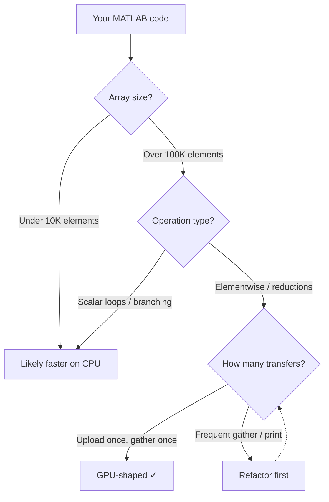

If you have an NVIDIA GPU and MATLAB-style code, you can often get big speedups. But only when the work is "GPU-shaped": large, vectorized array math that stays on the device long enough to amortize overhead. The hard part is that many GPU guides turn into device management (`gpuArray`, `gather`, sync points) instead of staying focused on the computation and the dataflow.

**In this guide we'll do three things:** first, build a quick intuition for what GPUs accelerate in MATLAB; second, walk through the classic `gpuArray` pattern and common performance traps; and third, show how the same style of code runs in RunMat, with automatic CPU/GPU routing and fusion.

---

## **What NVIDIA GPUs accelerate in MATLAB (and what they don't)**

NVIDIA GPUs are throughput machines. They're great at applying the same operations across huge arrays: elementwise transforms (`sin`, `exp`, `.*`, `./`), reductions (`sum`, `mean`, `std`), and big matrix operations. That's why GPU acceleration tends to shine in image pipelines, Monte Carlo simulation, signal processing, and dense linear algebra. Those workloads naturally operate over millions of values.

Where GPUs lose is when the workload is fragmented: lots of tiny arrays, lots of small kernels, heavy scalar control flow, or frequent CPU↔GPU transfers. In those cases, the GPU spends more time being managed than computing.

A quick gut check:

```matlab:runnable
% GPU-shaped: large arrays + vectorized ops
x = rand(5_000_000, 1, 'single');
y = (x - mean(x)) ./ (std(x) + single(1e-6));
z = sum(sqrt(abs(y)), 'all');
```

```matlab:runnable
% Often not GPU-shaped: many tiny problems, lots of overhead
acc = single(0);
for i = 1:10000
    a = rand(128, 1, 'single');
    acc = acc + sum(a .* a, 'all');
end
```

Here's a quick decision tree:



The key isn't "never loop"—it's that GPU acceleration is easiest when you can batch work into fewer, larger array operations.

Once you recognize a GPU-shaped block, the MATLAB path is straightforward. Same idea as the decision tree above: large arrays, elementwise ops, minimal transfers.

---

## **The MATLAB way: gpuArray + gather (and why transfers matter)**

In MATLAB, GPU acceleration is usually explicit. You convert or allocate arrays as `gpuArray`, call GPU-enabled functions, and then `gather` results back to the CPU when you need them.

The pattern that matters most is simple: **upload once → compute many steps → gather once.**

**How to accelerate MATLAB code with gpuArray**

1. **Check GPU compatibility.** Verify you have an NVIDIA GPU with CUDA support (required for MATLAB's Parallel Computing Toolbox).
2. **Put data on the GPU.** Wrap your input with `gpuArray()`—e.g. `x = gpuArray.rand(N, 1, 'single');`—or convert existing arrays with `gpuArray(x)`.
3. **Run vectorized operations.** Use GPU-enabled functions (`sin`, `.*`, `mean`, etc.); they dispatch to the GPU automatically while `x` is a `gpuArray`.
4. **Gather only at the end.** Call `gather()` once when you need a result on the CPU (e.g. for `fprintf` or further CPU work). Avoid calling `gather` inside loops.
5. **Verify with a quick comparison.** Time the same calculation on CPU vs GPU at large size (millions of elements) to confirm the GPU path is active and faster.

```matlab:runnable
% MATLAB gpuArray pattern
rng(0);
x = gpuArray.rand(10_000_000, 1, 'single');
y = sin(x) .* x + 0.5;
m = mean(y, 'all');
fprintf("m = %.6f\n", gather(m));
```

The most common performance killer is accidentally forcing a sync and download inside a loop (or between pipeline stages):

```matlab:runnable
% Anti-pattern: sync + download every iteration
x = gpuArray.rand(10_000_000, 1, 'single');
y = x;
for k = 1:20
    y = sin(y) .* y + 0.5;
    fprintf("step %d: %.6f\n", k, gather(mean(y, 'all')));
end
```

This isn't "wrong," it just changes the performance profile: you're measuring device synchronization and transfers as much as compute.

If you like MATLAB's syntax but don't want every script to turn into a residency/transfer exercise, there's another approach. Write the same array math and let the runtime decide CPU vs GPU and fuse the work automatically. For benchmarks and how that fusion works, see [Introducing RunMat Accelerate](/blog/runmat-accelerate-fastest-runtime-for-your-math).

---

## **RunMat: automatic GPU routing + fusion (same math, less device plumbing)**

If you want the shortest path from "I have MATLAB code" to "I'm seeing GPU acceleration," start with a snippet that's obviously GPU-friendly. Think: a big single array, a chain of elementwise math, and a reduction at the end.

In RunMat, you can write the math directly—no explicit device arrays required:

```matlab:runnable
rng(0);
x = rand(10_000_000, 1, 'single');
y = sin(x) .* x + 0.5;
m = mean(y, 'all');
fprintf("m = %.6f\n", double(m));
```

Under the hood, RunMat uses *fusion*—combining multiple array operations into one GPU kernel—to reduce overhead and keep the GPU busy. This happens automatically when the computation is contiguous. For more detail, see the [RunMat Fusion guide](/docs/fusion-guide).

---

## **RunMat: browser, desktop, and CLI**

The same MATLAB-style code and automatic GPU routing run across three environments. How you access the GPU depends on where you run RunMat.

**Browser (RunMat Desktop / sandbox)**  
RunMat can run entirely in your browser: no install, no NVIDIA requirement. Open [runmat.org/sandbox](https://runmat.org/sandbox), write your script, and click Run. GPU acceleration uses **WebGPU** when available (Chrome 113+, Edge 113+, Safari 18+, Firefox 139+). A Variables pane shows whether each array is on CPU or GPU (residency). Browsers often limit GPU and CPU usage to preserve battery, so for very large or long-running jobs you may hit resource caps.

**Desktop (RunMat Desktop app — coming soon)**  
A packaged RunMat Desktop app is in development. When it ships, it will give you the same editor, plots, and variable inspector in a native window. You get **full native GPU access** (Metal on Mac, DirectX 12 on Windows, Vulkan on Linux) and no browser resource limits. Same code, same fusion and auto-offload—just better performance headroom. As of publication, only the browser sandbox and CLI are available.

**CLI**  
Run scripts from your terminal with **full native GPU access**: `runmat run script.m` (or your platform's equivalent). This is the same RunMat runtime that will power the desktop app when it ships. GPU acceleration runs on NVIDIA, AMD, Apple Silicon, and Intel GPUs via the appropriate backend (Metal, DirectX 12, Vulkan). Best for maximum performance, automation, and CI/CD. The code is identical to what you'd run in the browser; only the execution environment changes.

| Environment | GPU path | Best for |
|-------------|----------|----------|
| Browser (sandbox) | WebGPU when supported | Try RunMat with no install; smaller/medium workloads |
| Desktop app (coming soon) | Native (Metal / DX12 / Vulkan) | Full IDE + full GPU headroom |
| CLI | Native (Metal / DX12 / Vulkan) | Scripts, benchmarks, CI, max performance |

---

## **Performance traps that erase speedups (MATLAB and RunMat)**

Most disappointing GPU results come from a small set of patterns. You don't have to become a GPU expert to fix them; you just need to recognize a few shapes.

### **1) Too many CPU↔GPU transfers**

Transfers are expensive and they often force synchronization. In MATLAB, that's usually an accidental `gather` (or a CPU-only function that forces one). In any runtime, touching intermediate results can pull you back to the host.

Keeping data *resident* on the GPU—rather than bouncing it back to the CPU—avoids transfer overhead.

```matlab:runnable
% MATLAB anti-pattern: forcing a download mid-pipeline
x = gpuArray.rand(10_000_000, 1, 'single');
y = sin(x) .* x + 0.5;
y_host = gather(y);          % boundary: download early
m = mean(y_host, 'all');     % now you're on CPU
```

The shape that wins: keep the hot block contiguous, and only materialize at the end.

### **2) Lots of tiny kernels instead of one big block**

Every GPU kernel launch has some fixed overhead; thousands of tiny launches can be slower than one big fused launch. If your program looks like "do a tiny thing 10,000 times," you're often paying overhead more than compute. The fix is usually batching.

```matlab:runnable
% Overhead-heavy shape: many small problems
acc = single(0);
for i = 1:2000
    x = rand(4096, 1, 'single');
    acc = acc + sum(sin(x) .* x + 0.5, 'all');
end
```

The fix looks like the earlier "GPU-shaped" example: batch the work into one large array and do an elementwise chain plus a reduction:

```matlab:runnable
% Better GPU shape: batch the work
X = rand(4096, 2000, 'single');
acc2 = sum(sin(X) .* X + 0.5, 'all');
```

### **3) Precision choices (single vs double)**

A lot of GPU acceleration "just works" once the workload is large and in single. `double` can be necessary, but performance depends more heavily on the specific GPU's FP64 capability and memory bandwidth.

The practical takeaway: if you're testing whether GPU acceleration is working, start with `single` unless you have a reason not to.

### **4) Hidden sync points (printing, plotting, inspection)**

Many workflows accidentally benchmark synchronization. Printing intermediate values, plotting inside loops, or repeatedly checking partial results can turn a smooth GPU pipeline into "compute a little, synchronize, download, repeat."

**A good mental model: make the work big, keep it contiguous, avoid mid-pipeline transfers.**

---

## **When vectorization isn't enough: custom CUDA kernels from MATLAB (what changes)**

There are real cases where the fastest approach is a custom kernel: unusual indexing, nonstandard ops, or tight loops that don't map onto GPU-enabled built-ins. MATLAB can support deeper CUDA integration paths, and they can deliver great performance.

But the cost curve changes. You're now managing:

- a build toolchain (compilers, flags, target architectures),
- driver/runtime compatibility,
- deployment environments (developer laptops vs CI vs servers),
- debugging and profiling at the kernel level.

If you enjoy debugging kernels and managing toolchains, this can be rewarding work. If you don't, it can become a time sink that pulls focus from your actual problem.

This is exactly why an automatic approach is compelling. If your workload is already dense array math, the runtime can often handle the GPU-friendly parts without you writing kernels or manually managing device arrays.

---

## **RunMat: where fusion helps most (and what to change if it doesn't)**

RunMat tends to shine on the same workloads that are naturally GPU-shaped in MATLAB: long chains of array math and reductions, big elementwise pipelines, and batched workloads. The code itself usually doesn't need to change. Same idea as the mental model in the Performance traps section: make the work big, keep it contiguous, avoid mid-pipeline transfers.

A good pattern is "math first, inspect last":

```matlab:runnable
% RunMat: keep the hot block contiguous
x = rand(10_000_000, 1, 'single');
y = sin(x) .* x + 0.5;
m = mean(y, 'all');
% Only touch results at the end
fprintf("m = %.6f\n", double(m));
```

If a script is slower than expected, the first thing to do is usually structural:

- Make the arrays larger (or batch multiple problems together)
- Remove mid-pipeline printing/plotting
- Keep data in `single` for initial GPU testing
- Avoid reshaping the program into thousands of tiny steps

---

## **Quick checks: "am I actually using the GPU?"**

A fast way to sanity-check GPU execution is to compare the same calculation at a size where GPUs should win (millions of elements). Don't obsess over one run; warm-up and overhead are real.

Here's a simple CPU vs GPU pattern on the MATLAB side:

```matlab:runnable
N = 10_000_000;
x = rand(N, 1, 'single');

% CPU
m_cpu = mean(sin(x) .* x + 0.5, 'all');

% GPU
xg = gpuArray(x);
m_gpu = mean(sin(xg) .* xg + 0.5, 'all');

fprintf("cpu=%.6f gpu=%.6f\n", double(m_cpu), double(gather(m_gpu)));
```

And here's the equivalent "keep it contiguous" shape that's a good first test in RunMat:

```matlab:runnable
x = rand(10_000_000, 1, 'single');
m = mean(sin(x) .* x + 0.5, 'all');
fprintf("m = %.6f\n", double(m));
```

If the GPU isn't helping, it's usually one of three things. The problem is too small, the code is forcing boundaries, or the computation is dominated by something other than array math (I/O, parsing, plotting, scalar loops).

---

## **Benchmarking: how to measure GPU speed without fooling yourself**

Good benchmarks do a few boring things consistently:

- **Warm up once** (first-run overhead can be large)
- **Run multiple iterations** and take a median/mean
- **Fix dtype and shape** (`single` vs `double` changes everything)
- **Keep I/O out of the timed region** (plotting and printing can dominate)
- **Be explicit about transfers**: are you timing uploads/downloads or just compute?

A clean benchmark shape looks like:

1. Allocate big `single` inputs
2. Run a contiguous chain of elementwise math
3. Reduce at the end
4. Materialize a scalar once

That's not every real workload, but it's a reliable way to see whether the GPU path is functioning and scaling.

---

## **FAQ: common NVIDIA GPU + MATLAB questions**

**Why is my GPU slower than my CPU?**

Most often: the arrays are too small, you're doing many tiny steps, or you're transferring/synchronizing frequently (e.g., `gather` or printing in a loop). Fix it by batching into larger arrays and calling `gather` only once at the end.

**What GPU do I need for MATLAB?**

MATLAB's Parallel Computing Toolbox requires an NVIDIA GPU with CUDA support—no AMD or Intel GPUs, and no Apple Silicon. If you want GPU acceleration without that lock-in, RunMat works on any modern GPU: Metal on Mac (including M1/M2/M3), DirectX 12 on Windows, and Vulkan on Linux.

**Does MATLAB GPU acceleration work on Mac?**

Not with the official toolbox. MATLAB's `gpuArray` is built on CUDA, which NVIDIA does not support on Apple Silicon. RunMat uses Metal on macOS, so M1/M2/M3 Macs get GPU acceleration with the same MATLAB-style code.

**How much faster is GPU vs CPU for MATLAB?**

For large, vectorized workloads (millions of elements, elementwise ops and reductions), expect roughly 10–100× speedups when the code is GPU-shaped. For small arrays or fragmented work, GPU can be the same speed or slower. Use the decision flowchart earlier in this guide to check fit.

**What is GPU fusion and why does it matter?**

Fusion means combining multiple array operations (e.g., `sin`, then `.*`, then `+`) into one GPU kernel instead of launching a separate kernel for each. That cuts memory traffic and kernel-launch overhead. In MATLAB you get fusion only where the toolbox implements it; in RunMat, fusion is applied automatically when the computation is contiguous.

**Can I use GPU without the Parallel Computing Toolbox?**

In MATLAB, no—the toolbox is required for `gpuArray` and GPU-enabled functions, and it's a paid add-on. RunMat includes GPU acceleration by default: you write the same array math and the runtime decides CPU vs GPU and fuses operations without an extra license. For how RunMat compares to MATLAB and other runtimes, see [free MATLAB alternatives](/blog/free-matlab-alternatives).

**Should I use single or double?**

Use what your numerics require. For GPU acceleration, `single` is usually the best first test: it's faster and uses half the memory. `double` is still correct when you need it; performance then depends more on your GPU's FP64 capability and memory bandwidth.

**Do I need to rewrite everything for GPU?**

Not always. If your code is already vectorized array math, the main work is keeping it device-resident and batching where possible. Same mental model: big, contiguous, avoid transfers.

**How do I know if my code is GPU-shaped?**

Same idea as the GPU-shaped decision tree: large arrays, elementwise ops, minimal transfers. Use the flowchart earlier in this guide; if you have small arrays, scalar loops, or frequent `gather`/printing, refactor toward batching and a single gather at the end.

**Where can I run RunMat with GPU?**

In three ways: (1) **Browser** — open [runmat.org/sandbox](https://runmat.org/sandbox); GPU uses WebGPU (Chrome 113+, Edge 113+, Safari 18+, Firefox 139+). Same code, automatic fusion; browsers may limit resources. (2) **Desktop app (coming soon)** — packaged RunMat Desktop with full native GPU (Metal/DX12/Vulkan) and no browser caps; not yet released. (3) **CLI** — run scripts from the terminal with full native GPU access; same code as browser, best for max performance and CI. For setup and options, see [getting started](/docs/getting-started).

**What's the simplest rule to remember?**

Make the work big, make it contiguous, and avoid transfers.
