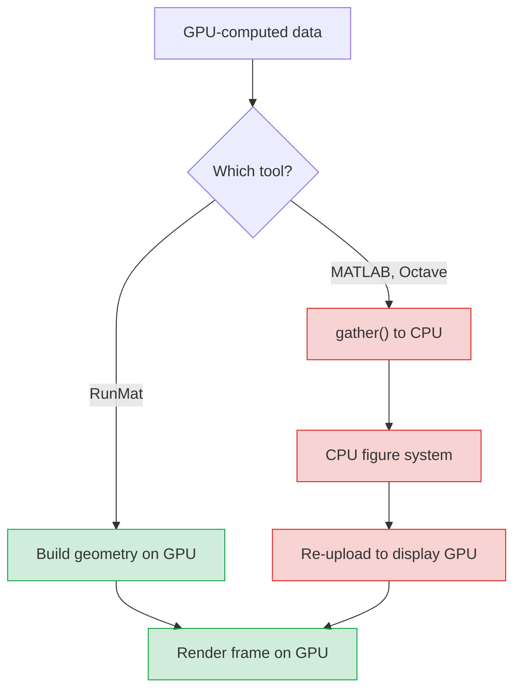

**TL;DR:** RunMat supports 20+ plot types (`plot`, `scatter`, `surf`, `contour`, `bar`, `hist`, `subplot`, and more) with MATLAB-compatible syntax, all GPU-rendered in the browser via WebGPU. Every code example on this page is runnable in the [sandbox](https://runmat.com/sandbox) with no install. Scroll to [2D plots](#start-simple-your-first-plot), [3D surfaces](#go-3d-surfaces-and-meshes), [animation](#animate-with-drawnow), or [the FAQ](#frequently-asked-questions).

## The plot is how you verify your math

RunMat renders MATLAB-compatible plots in the browser using WebGPU. You write `plot(x, y)`, `surf(X, Y, Z)`, or any of the 20+ supported plot types with the same syntax you already know, and the GPU renders the result. No install, no server, no Java figure system. When computation also runs on the GPU, data can go from calculation to visible frame without a CPU round-trip.

Every code example on this page runs live in the [RunMat sandbox](https://runmat.com/sandbox). Click any example and modify it. No install, no account required.

Here is a tour of the plotting system in one runnable block (subplots, overlays, handles, 3D, and styling):

```matlab:runnable
x = linspace(0, 4*pi, 200);

subplot(2, 2, 1);
h1 = plot(x, sin(x));
hold on;
h2 = plot(x, cos(x));
set(h1, 'LineWidth', 2);
set(h2, 'LineWidth', 2, 'LineStyle', '--');
legend('sin(x)', 'cos(x)');
title('Overlaid signals');
xlabel('Angle (rad)');
ylabel('Amplitude');
grid on;

subplot(2, 2, 2);
t = linspace(0, 2*pi, 120);
scatter(cos(t), sin(t), linspace(10, 200, 120), t, 'filled');
colorbar;
title('Per-point size and color');
axis equal;

subplot(2, 2, 3);
[X, Y] = meshgrid(linspace(-3, 3, 80));
contourf(X, Y, X.^2 - Y.^2, 20);
colormap('turbo');
colorbar;
title('Contour field');
xlabel('x');
ylabel('y');

subplot(2, 2, 4);
[X3, Y3] = meshgrid(linspace(-3, 3, 60));
R = sqrt(X3.^2 + Y3.^2) + 0.01;
Z = sin(3*R) ./ R;
surf(X3, Y3, Z);
shading interp;
colorbar;
view(45, 30);
title('3D surface');
```

And it goes further. This is a live GPU-rendered animation running in your browser: eight point sources superposing on a 300x300 grid, 80 frames.

```matlab:runnable
N = 300;
x = linspace(-10, 10, N);
y = linspace(-10, 10, N);
[X, Y] = meshgrid(single(x), single(y));

% Gaussian envelope — smoothly damps the surface toward the edges
envelope = exp(-(X.^2 + Y.^2) / 25);

for t = 1:80
    Z = zeros(N, N, 'single');

    % Superpose 8 wave sources equally spaced around a circle
    for k = 1:8
        a = 2 * pi * k / 8;
        cx = 6 * cos(a);
        cy = 6 * sin(a);
        r = sqrt((X - cx).^2 + (Y - cy).^2) + 0.1;

        Z = Z + sin(5 * r - t * 0.2 + k * 0.8) ./ (1 + r);
    end

    Z = Z .* envelope;
    surf(x, y, Z);
    colormap("jet");
    shading("interp");
    drawnow;
end
```

<a href="/sandbox">
  <video autoPlay loop muted playsInline className="my-6 w-full rounded-lg cursor-pointer">
    <source src="https://web.runmatstatic.com/video/runmat-wave-simulation.mp4" type="video/mp4" />
  </video>
</a>

---

## How RunMat plotting compares

RunMat renders plots on the GPU via WebGPU with MATLAB-compatible syntax. MATLAB uses a CPU-bound Java figure system (MATLAB Online gives 20 hr/mo free). matplotlib rasterizes on the CPU and has limited browser support through Pyodide. Plotly renders via WebGL but uses a Python/JS API, not MATLAB syntax. The table below breaks this down by dimension:

| Dimension | RunMat | MATLAB | matplotlib | Plotly |
|-----------|--------|--------|-----------|--------|
| Rendering | WebGPU compute + render shaders | CPU, Java figure system | CPU, Agg rasterizer | WebGL canvas |
| GPU data path | Shared GPU pipeline | CPU copy (gpuArray needs gather) | CPU only | CPU to WebGL upload |
| Browser | Client-side WebGPU, no server | Server-rendered (20 hr/mo free) | Limited (Pyodide) | Full WebGL |
| Animation | `drawnow` loop in browser | Desktop only | Desktop, slow on large data | Callback API |
| 3D interaction | Orbit/pan/zoom at frame rate | Basic `rotate3d` | Slow on large data | Can slow on large meshes |
| Figure persistence | Scene state, replayable | `.fig` (proprietary) | Pickle (version-dependent) | JSON |
| Syntax | MATLAB-compatible | Native MATLAB | Python API | Python/JS API |

One honest limitation: RunMat covers around 20 plot-producing functions and another 15+ annotation and styling commands today. MATLAB has accumulated specialized chart types across dozens of toolboxes over 40 years. If you need something very specific (say, `polarplot` or `geobubble`), it may not exist in RunMat yet. The coverage grows with each release.

## Choosing the right plot type

The right plot type depends on your data shape: use `plot` for continuous signals, `scatter` for unordered 2D points, `surf` or `contourf` for scalar fields over a grid, `bar` for category comparisons, and `hist` for distributions. The table below maps 13 common data patterns to the right RunMat function:

| Data pattern | Best plot type | RunMat function | Notes |
|-------------|---------------|-----------------|-------|
| y vs. x, continuous | Line plot | `plot(x, y)` | Connect points to show trends |
| y vs. x, discrete samples | Stem plot | `stem(x, y)` | Vertical lines for sampled signals |
| Unordered 2D points | Scatter | `scatter(x, y)` | Per-point size/color supported |
| Category comparisons | Bar chart | `bar(y)` | Grouped and stacked variants |
| Value distribution | Histogram | `hist(data, nbins)` | Automatic or manual binning |
| Scalar field over 2D grid | Surface or contour | `surf(X,Y,Z)` or `contourf(X,Y,Z)` | `shading interp` for smooth color |
| Matrix as image | Heatmap | `imagesc(M)` | One pixel per element |
| 3D path or trajectory | 3D line | `plot3(x,y,z)` | Orbit/pan/zoom in viewer |
| 3D point cloud | 3D scatter | `scatter3(x,y,z)` | Per-point color for fourth variable |
| 2D vector field | Quiver | `quiver(X,Y,U,V)` | Arrow direction and magnitude |
| Measurement uncertainty | Error bars | `errorbar(x,y,err)` | Symmetric or asymmetric bounds |
| Cumulative area | Filled curve | `area(x, y)` | Fill between curve and baseline |
| Part-to-whole | Pie chart | `pie(values)` | Use sparingly; bar is usually clearer |
| Multiple views | Subplots | `subplot(m,n,p)` | Mix any plot types in one figure |

For a deeper treatment of when to pick `surf` over `mesh`, `scatter` over `plot`, or `imagesc` over `contourf`, see [Choosing the Right Plot Type](/docs/plotting/choosing-the-right-plot-type).

---

## Start simple: your first plot

To create a line plot in RunMat, pass two vectors to `plot(x, y)`. The first vector defines the x-axis, the second defines the y-axis. The default styling matches MATLAB: solid blue line, no markers. Add `title`, `xlabel`, `ylabel`, and `grid on` to label and annotate. This three-line pattern is the foundation for every plot in this guide.

```matlab:runnable
x = 0:0.05:2*pi;
y = sin(x);
plot(x, y);
title('Sine wave');
xlabel('x');
ylabel('sin(x)');
grid on;
```

That is the entire workflow: create data, call [`plot`](/docs/matlab-function-reference#plotting), add labels. Everything below builds on this pattern.


## Overlay and compare data

To plot multiple series on the same axes, call [`hold on`](/docs/matlab-function-reference#plotting) after the first `plot` command, then call `plot` again for each additional series. RunMat automatically cycles through a default color palette so each line is visually distinct. Call [`legend`](/docs/plotting/styling-plots-and-axes#legends) to label them. This pattern works identically with `scatter`, `bar`, `stem`, and other plot types.

```matlab:runnable
x = 0:0.05:2*pi;
plot(x, sin(x));
hold on;
plot(x, cos(x));
legend('sin(x)', 'cos(x)');
title('Sine and cosine');
xlabel('x');
ylabel('Amplitude');
grid on;
```


## Style your figure with handles

`plot` returns a handle. Pass it to [`set`](/docs/plotting/graphics-handles) to adjust line width, color, dash style, or other properties after creation. This is MATLAB's handle graphics model, and RunMat uses the same property names (`LineWidth`, `Color`, `DisplayName`).

```matlab:runnable
x = linspace(0, 2*pi, 150);
h1 = plot(x, sin(x));
hold on;
h2 = plot(x, cos(x));
set(h1, 'LineWidth', 2, 'Color', [0.0 0.45 0.74]);
set(h2, 'LineWidth', 2, 'Color', [0.85 0.33 0.1], 'LineStyle', '--');
title('Formatted comparison');
xlabel('Angle (rad)');
ylabel('Value');
legend('sin', 'cos');
grid on;
box on;
xlim([0 2*pi]);
ylim([-1.3 1.3]);
```

### Styling quick reference

| Command | What it does | Example |
|---------|-------------|---------|
| `title` | Set figure title | `title('My Plot')` |
| `xlabel`, `ylabel`, `zlabel` | Set axis labels | `xlabel('Time (s)')` |
| `legend` | Label data series | `legend('sin', 'cos')` |
| `grid on`, `grid off` | Toggle grid lines | `grid on` |
| `box on`, `box off` | Toggle axes box outline | `box on` |
| `xlim`, `ylim`, `zlim` | Set axis range | `xlim([0 10])` |
| `colormap` | Set color palette | `colormap('turbo')` |
| `colorbar` | Add color scale reference | `colorbar` |
| `view` | Set 3D camera angle | `view(45, 30)` |
| `get`, `set` | Read/write handle properties | `set(h, 'LineWidth', 2)` |
| `hold on`, `hold off` | Overlay or replace plots | `hold on` |
| `shading` | Surface shading mode | `shading interp` |

For the full styling model (coordinating plot objects, axes state, and multi-series palettes), see [Styling Plots and Axes](/docs/plotting/styling-plots-and-axes).


## Build multi-panel layouts with `subplot`

[`subplot(m, n, p)`](/docs/matlab-function-reference#plotting) divides a figure into an m-by-n grid and activates the p-th panel. Each subplot has its own axes state, so labels, limits, and grid apply only to the active panel. This is how engineers present related views of the same data side by side.

```matlab:runnable
subplot(2, 2, 1);
x = linspace(0, 2*pi, 100);
plot(x, sin(x));
title('Line');
grid on;

subplot(2, 2, 2);
scatter(randn(1, 100), randn(1, 100));
title('Scatter');
grid on;

subplot(2, 2, 3);
bar([2 5 3 8 6]);
title('Bar');
grid on;

subplot(2, 2, 4);
t = linspace(-3, 3, 40);
[X, Y] = meshgrid(t, t);
Z = sin(X) .* cos(Y);
surf(t, t, Z);
title('Surface');
```

For the complete handle graphics model (how figures, axes, legends, and handles fit together in subplot workflows), see [Graphics Handles](/docs/plotting/graphics-handles).


## Go 3D: surfaces and meshes

[`surf(x, y, Z)`](/docs/matlab-function-reference#plotting) renders a shaded surface from gridded data. Create a coordinate grid with `meshgrid`, compute a height matrix, and render. Large surfaces (300x300 and beyond) render at frame rate because the GPU converts your data directly into triangle geometry without a CPU round-trip.

```matlab:runnable
x = linspace(-3, 3, 60);
y = linspace(-3, 3, 60);
[X, Y] = meshgrid(x, y);
Z = sin(X) .* cos(Y);
surf(x, y, Z);
colorbar;
shading interp;
title('sin(x) * cos(y)');
xlabel('x');
ylabel('y');
zlabel('z');
```


### Colormaps and camera angle

RunMat supports named [colormaps](/docs/plotting/styling-plots-and-axes#colormap-and-colorbar) including `jet`, `turbo`, and `parula`, among others. [`view(az, el)`](/docs/matlab-function-reference#plotting) sets the camera angle.

```matlab:runnable
x = linspace(-3, 3, 80);
y = linspace(-3, 3, 80);
[X, Y] = meshgrid(x, y);
R = sqrt(X.^2 + Y.^2) + 0.01;
Z = sin(3*R) ./ R + 0.5*cos(2*X) .* sin(2*Y);
surf(x, y, Z);
colormap('turbo');
shading interp;
colorbar;
view(45, 30);
title('Composite surface with turbo colormap');
xlabel('x');
ylabel('y');
zlabel('z');
```

### Wireframe with contour projection

[`meshc`](/docs/matlab-function-reference#plotting) draws a wireframe surface with contour lines projected onto the base plane, so you can read both the shape and the level structure of a scalar field at once.

```matlab:runnable
x = linspace(-3, 3, 50);
y = linspace(-3, 3, 50);
[X, Y] = meshgrid(x, y);
Z = X .* exp(-X.^2 - Y.^2);
meshc(x, y, Z);
title('meshc: wireframe + contour projection');
xlabel('x');
ylabel('y');
zlabel('z');
colorbar;
```

### Contour maps and heatmaps

[`contourf`](/docs/matlab-function-reference#plotting) fills the regions between iso-level curves. [`imagesc`](/docs/matlab-function-reference#plotting) maps a matrix directly to a color image, one pixel per element.

```matlab:runnable
x = linspace(-3, 3, 80);
y = linspace(-3, 3, 80);
[X, Y] = meshgrid(x, y);
Z = X.^2 - Y.^2;
contourf(X, Y, Z, 20);
colormap('turbo');
colorbar;
title('Hyperbolic paraboloid contours');
xlabel('x');
ylabel('y');
```

```matlab:runnable
[X, Y] = meshgrid(linspace(-3, 3, 60));
Z = sin(X.^2 + Y.^2) .* cos(X - Y);
imagesc(Z);
colorbar;
title('Interference pattern heatmap');
xlabel('Column');
ylabel('Row');
```

### 3D trajectories and point clouds

[`plot3`](/docs/matlab-function-reference#plotting) draws a 3D line through coordinate triples. [`scatter3`](/docs/matlab-function-reference#plotting) plots unconnected markers with optional per-point color. The 3D camera supports orbit, pan, and zoom-to-cursor.

```matlab:runnable
t = linspace(0, 6*pi, 500);
x = cos(t);
y = sin(t);
z = t / (2*pi);
plot3(x, y, z);
xlabel('x');
ylabel('y');
zlabel('Turns');
title('Helix');
view(35, 25);
grid on;
```

```matlab:runnable
n = 300;
x = randn(1, n);
y = randn(1, n);
z = randn(1, n);
c = sqrt(x.^2 + y.^2 + z.^2);
scatter3(x, y, z, 30, c, 'filled');
colorbar;
title('3D scatter with distance coloring');
xlabel('x');
ylabel('y');
zlabel('z');
view(40, 30);
```

For help choosing between `surf`, `mesh`, `contour`, and `imagesc`, see [Choosing the Right Plot Type](/docs/plotting/choosing-the-right-plot-type).


## Animate with `drawnow`

To animate plots in RunMat, call your plotting command inside a `for` loop and use [`drawnow`](/docs/plotting/plotting-in-runmat) after each iteration to flush the frame to the screen. This works identically in the browser and on native. RunMat coalesces and throttles presentation, so if computation outruns the display it presents the latest revision rather than queueing a backlog. The wave interference animation at the top of this guide renders 80 frames of an 8-source, 300x300 surface this way.

By comparison, MATLAB Online is server-rendered, so real-time animation is limited by round-trip latency. matplotlib in Pyodide has limited animation support. Plotly uses a separate callback-based animation API rather than an imperative `drawnow` loop.

For the full `drawnow`/`pause` semantics and how figure state interacts with the event loop, see [Plotting in RunMat](/docs/plotting/plotting-in-runmat).


## Specialized plots

RunMat supports plot types for specific data patterns beyond the core `plot`, `scatter`, `bar`, and `surf` families. These include `stem` for discrete sampled signals, `errorbar` for measurements with uncertainty bounds, `quiver` for 2D vector fields, `area` for filled curves, and `pie` for part-to-whole proportions.

### Discrete sequences with `stem`

[`stem`](/docs/matlab-function-reference#plotting) draws a vertical line from the baseline to each data point with a marker at the top, the standard representation for sampled signals and impulse responses.

```matlab:runnable
n = 0:15;
y = sin(n * pi / 4) .* (0.9 .^ n);
stem(n, y);
title('Damped discrete sinusoid');
xlabel('Sample index');
ylabel('Amplitude');
grid on;
```

### Measurements with `errorbar`

[`errorbar(x, y, neg, pos)`](/docs/matlab-function-reference#plotting) draws a marker at each point with whiskers showing uncertainty bounds.

```matlab:runnable
x = 1:6;
y = [2.1 3.5 2.8 4.2 3.9 5.1];
err = [0.3 0.5 0.2 0.4 0.3 0.6];
errorbar(x, y, err, err);
title('Measurements with error bounds');
xlabel('Experiment');
ylabel('Result');
grid on;
```

### Vector fields with `quiver`

[`quiver(X, Y, U, V)`](/docs/matlab-function-reference#plotting) draws arrows at each grid point showing direction and magnitude.

```matlab:runnable
[X, Y] = meshgrid(-2:0.4:2, -2:0.4:2);
U = -Y;
V = X;
quiver(X, Y, U, V);
title('Rotation field');
xlabel('x');
ylabel('y');
axis equal;
```

### Area and pie

[`area`](/docs/matlab-function-reference#plotting) fills the region under a curve. [`pie`](/docs/matlab-function-reference#plotting) shows part-to-whole proportions.

```matlab:runnable
subplot(1, 2, 1);
x = 1:7;
y = [1 3 2 5 4 3 2];
area(x, y);
title('Filled area');
xlabel('Day');
ylabel('Value');

subplot(1, 2, 2);
pie([35 25 20 15 5]);
title('Budget allocation');
```


## How the GPU rendering pipeline works

When your data is computed on the GPU, most tools require copying it back to the CPU before plotting. MATLAB's `gpuArray` needs `gather()`, and the figure system renders on the CPU. RunMat avoids that round-trip. The compute accelerator and the plotter share a single GPU device and command queue, so GPU-resident data goes from computation to rendered frame on the same hardware:



This is how the wave interference animation runs smoothly in the browser: the compute and render pipelines share the same GPU context, so data stays close to where it is drawn.

Every figure in RunMat is a structured scene (plot objects, axes state, view configuration, annotations), not a raster image. Figures can be replayed from their scene state, and exported as visual output.

For scene persistence and replay, see [Plot Replay and Export](/docs/plotting/plot-replay-and-export). For GPU residency details, see [GPU Plotting and Residency](/docs/accelerate/gpu-behavior).


## Try it now

The fastest way to learn plotting is to modify a working example. The code below computes the SVD of a random matrix and plots the singular value spectrum. Paste it into the sandbox, change the matrix size, add noise, and see how the spectrum shifts.

```matlab:runnable
A = randn(100, 50);
[U, S, V] = svd(A, 'econ');
sigma = diag(S);
plot(sigma, 'o-', 'LineWidth', 1.5);
title('Singular value spectrum');
xlabel('Index');
ylabel('Singular value');
grid on;
```

<a href="https://runmat.com/sandbox" data-ph-capture-attribute-button-type="cta-sandbox" data-ph-capture-attribute-page="matlab-plotting-guide">Open the RunMat sandbox</a> and start plotting. No install, no sign-up.

For more depth, read the [plotting documentation](/docs/plotting), explore the [plotting sub-guides](/docs/plotting/plotting-in-runmat), or see the [GPU acceleration guide](/blog/how-to-use-gpu-in-matlab). If you are evaluating alternatives to MATLAB, the [MATLAB alternatives comparison](/blog/free-matlab-alternatives) covers performance, compatibility, and 15 other dimensions beyond plotting.


## Frequently asked questions

**Is RunMat plotting compatible with MATLAB syntax?**
Yes. RunMat supports `plot`, `scatter`, `surf`, `subplot`, `bar`, `hist`, `contour`, `imagesc`, `plot3`, `scatter3`, and more with MATLAB-compatible syntax. Plotting code written for MATLAB generally works in RunMat without changes.

**How do I make a 3D surface plot?**
Use `surf(X, Y, Z)` where `X` and `Y` are coordinate vectors and `Z` is a height matrix. Add `colormap`, `shading interp`, and `view` to control appearance and camera angle.

**How do I plot multiple lines on the same figure?**
Call `hold on` after your first plot command, then call `plot` again for each additional line. Use `legend` to label each series.

**What is the difference between scatter and plot?**
`plot` connects points with lines, emphasizing continuity and trends. `scatter` draws individual markers at each point, emphasizing position and clustering. `scatter` also supports per-point size and color vectors.

**Can I plot in the browser without installing anything?**
Yes. RunMat's sandbox runs plotting through WebGPU entirely in your browser. No install, no account, no server round-trip. Every code example in this guide is runnable directly in the [sandbox](https://runmat.com/sandbox).

**How do I add a title, axis labels, and legend?**
Use `title('text')`, `xlabel('text')`, `ylabel('text')` after your plot command. Call `legend('series1', 'series2')` to label multiple series.

**How do I save or export a plot?**
RunMat supports screenshot export from the figure window. Figures are stored as structured scene state that supports replay and export.

**What plot types does RunMat support?**
RunMat supports around 20 plot-producing functions including `plot`, `scatter`, `bar`, `hist`, `surf`, `mesh`, `contour`, `contourf`, `imagesc`, `quiver`, `plot3`, `scatter3`, `stem`, `errorbar`, `area`, `pie`, and `stairs`, plus 15+ annotation and styling commands.
