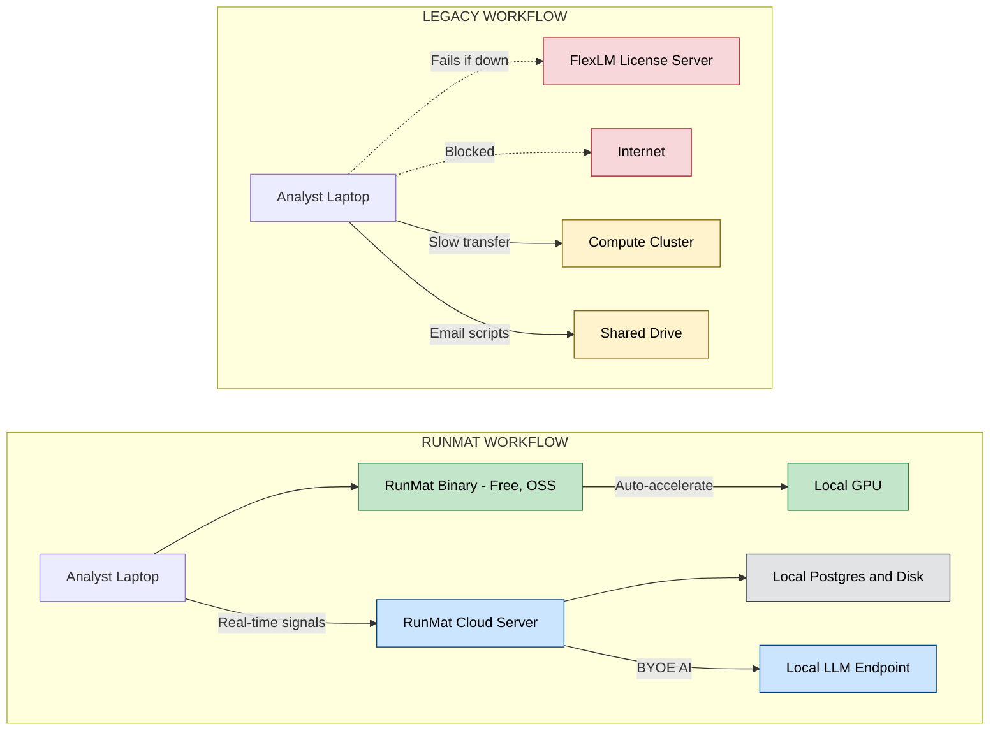

National security relies on the airgap. Isolating critical systems from the public internet isn't an outdated practice—it's a necessary defense against modern threats. But for the engineers working inside those secure facilities, the airgap has come with a heavy tax: their tools have stopped evolving.

While the rest of the software world moved to the cloud—gaining real-time collaboration, AI assistance, and instant updates—scientific computing in the secure zone got stuck in a time capsule. License servers, complex dependency trees, and manual updates have made modern workflows nearly impossible to implement offline.

We don't believe security should require sacrificing capability. That's why we built RunMat to be airgap-native from day one.

## TL;DR

- **RunMat** is a single static binary that runs MATLAB-compatible code entirely offline — no license server, no internet, no dependencies.
- **RunMat Cloud** deploys as one server binary with local Postgres; licensing uses offline signed payloads.
- GPU acceleration works via native APIs (Metal, Vulkan, DX12) with no CUDA toolkit required.
- Built-in structured logging, audit trails, SSO/SCIM, and RBAC align with ITAR and NIST compliance frameworks.
- Real-time collaboration, AI-assisted analysis (via local LLM endpoints), and automatic versioning all work fully offline.

## The license server problem

RunMat has zero licensing infrastructure — no daemon, no host ID, no dongle. Copy the binary onto an approved drive, carry it in, and run your code.

If you've administered a scientific computing environment inside a secure facility, you know the FlexLM ritual. You need a dedicated machine to host the license daemon. You generate a host ID, request a license file from the vendor -- from a different network -- and carry it across the gap on approved media. You configure the daemon, test it, and pray it stays up.

If the license server goes down during a test campaign, your analysts can't work. If the license expires, you're repeating the whole process. If the hardware changes, you're starting from scratch. The license server is a single point of failure in an environment where failure is not an option.

For teams that need the full RunMat Cloud platform (collaboration, versioning, AI integration), licensing uses **offline signed payloads** -- a small file you carry in on the same media as the binary. The server verifies the signature locally and applies the policy. Renewal means replacing one file. No network calls. No phone-home. Ever.

And if you build RunMat from source, telemetry is off by default. There is nothing to disable, nothing to firewall. The binary makes zero network requests unless you explicitly configure it to.

## Two binaries, full platform

Two binaries. The open-source runtime is a single static binary; RunMat Cloud is a single server binary paired with Postgres. Copy them onto approved media and you have a complete platform.

Getting software into an airgapped facility means walking it in. Complex installations are the enemy. Try setting up a Python scientific computing environment offline. You need NumPy, SciPy, matplotlib, and their transitive dependencies -- dozens of packages, each with version constraints that interact in non-obvious ways. You download them on an internet-connected machine, scan them, carry them across the gap, and hope `pip install --no-index` works. When it doesn't (and it often doesn't), you debug a dependency graph in an environment where you can't Google the error message.

MATLAB is simpler to install but comes with its own weight: a multi-gigabyte installer, a license server to configure, and toolbox add-ons that each require their own licenses.

**The open-source runtime** is a single static binary, free to use. It contains the full execution engine, the standard library, the LSP language server, and the Jupyter kernel. It has zero external dependencies. Copy it to a machine and it runs. Startup takes 5 milliseconds. This is the engine for individual analysis and scripting -- download it from [GitHub](https://github.com/runmat-org/runmat), carry it in, and go.

**RunMat Cloud** is the commercial platform for teams, also delivered as a single server binary. Pair it with a Postgres instance and local disk for blob storage and you have a complete collaboration environment: multi-user real-time updates, a filesystem with automatic versioning and snapshots, LLM integration, SSO with your on-prem identity provider, role-based access control, and a real-time signal bus. All of it runs entirely offline.

Configuration for both is a local TOML file or environment variables. There is no cloud config service to reach. You can provision a hundred machines with standard configuration management tools and never worry about network connectivity.

Upgrading? Carry in two new binaries and a license payload. Replace the old ones. You're done.

## Performance comes to the data

RunMat brings the performance to the data. In most organizations, heavy compute means sending data to a cloud cluster; in a secure environment, that data cannot leave the building. [RunMat Accelerate](/blog/runmat-accelerate-fastest-runtime-for-your-math) automatically detects the GPU hardware on the local machine -- whether it's an Apple Silicon laptop, a workstation with a discrete NVIDIA card, or a rack-mounted server -- and compiles your math into optimized fused kernels on the fly. It works through native graphics APIs (Metal, Vulkan, DirectX 12) via wgpu, so there is no CUDA toolkit to install and no vendor lock-in.

Here's what this looks like in practice. Your GNC engineer is analyzing attitude control telemetry during a thermal vacuum test. She needs to run a 10,000-point FFT on sensor data, visualize the frequency response, and share the results with the ops team in the next room. With legacy tools, she'd be waiting for MATLAB to boot, fighting a license checkout, and emailing a PNG to her colleague.

With RunMat: the runtime starts in 5 milliseconds. The FFT runs on the local GPU. The results appear in an interactive plot. She shares the analysis through the collaboration layer, and her colleague sees it in real time. No data leaves the secure network. No license server was consulted. The entire workflow happens in seconds.

## Compliance-ready by design

RunMat was designed to satisfy security reviewers, auditors, and compliance frameworks — not just to work offline. Deploying in a defense or intelligence environment demands both.

**Logging and redaction.** The server emits structured JSON logs with a centralized redaction engine. Credentials, file contents, API keys, prompts, and tokens are never logged. Redaction rules are maintained in a single location for easy compliance review. The logging profile is aligned with ITAR and NIST conventions: every mutating operation records the actor, target resource, operation type, and outcome.

**Audit records.** Every filesystem write and membership change emits a structured audit record with actor identity, action, resource identifier, and timestamp. These records can be routed to an immutable audit sink with chain-of-custody controls.

**Identity and access.** RunMat Cloud supports SSO with on-premises identity providers via SAML or OIDC -- Keycloak, ADFS, or whatever your facility runs. SCIM provisioning handles user lifecycle and group-to-role mapping. Role-based access control enforces permissions at the org, project, and file level. API keys for headless and CI usage are scoped, revocable, and rotation-friendly.

**Telemetry transparency.** The open-source runtime provides full telemetry opt-out. Source builds have telemetry disabled by default. For teams that want to verify, `RUNMAT_TELEMETRY_SHOW=1` prints every telemetry payload to stderr before transmission. Inside an airgap, nothing is transmitted because there is nowhere for it to go.

## What this unlocks

The goal isn't just "the same tools, but offline." It's giving engineers inside secure facilities capabilities they've never had before.

**Real-time collaboration on classified projects.** File changes and project events stream to teammates via Server-Sent Events. When an analyst saves a script, her teammate sees the update immediately. No shared drives, no emailing attachments, no "which version is current?" conversations.

**AI-assisted analysis inside the airgap.** RunMat Cloud's LLM integration supports configurable provider endpoints. Point it at a local model server -- Ollama, vLLM, or a facility-approved endpoint -- and your engineers get AI-assisted code completion and analysis without any data leaving the building. This is something no legacy scientific computing tool can offer in a disconnected environment.

**Auditable version history for every script.** Every file write creates a version record. Snapshots capture the full project state at a point in time. Snapshots can be exported as a git fast-import stream for external review. When someone asks "which version of this script was running during the anomaly investigation last Tuesday?" you have a definitive answer.

**GPU-accelerated compute on the analyst's laptop.** No cloud cluster, no CUDA toolkit, no IT ticket to provision a GPU node. RunMat Accelerate works with whatever GPU is already in the machine. Performance that used to require a dedicated compute environment is now available at the analyst's desk.

**One upgrade path for the entire platform.** New release? Carry in two binaries and a license payload on approved media. Replace the old files. The runtime, the server, the collaboration layer, the AI integration -- everything updates together.

## The gap doesn't have to exist

The airgap is a security requirement. It is not supposed to be a time machine. Engineers working on classified programs deserve the same quality of tools -- the same speed, the same collaboration, the same AI assistance -- as engineers working on the open internet.

RunMat proves that's possible. A modern scientific computing platform -- fast, collaborative, AI-enabled, compliance-ready -- running entirely offline from a single binary.

If you're building the future of aerospace or defense, you shouldn't be fighting your tools. You should be running your math.

---

*The open-source RunMat runtime is available on [GitHub](https://github.com/runmat-org/runmat). Interested in deploying RunMat Cloud in your secure environment? [Get in touch](mailto:team@runmat.com).*

*RunMat is not affiliated with MathWorks, Inc. "MATLAB" is a registered trademark of MathWorks, Inc. We reference it nominatively to describe the language whose grammar and semantics our independent runtime accepts.*
